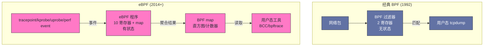
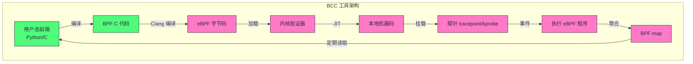
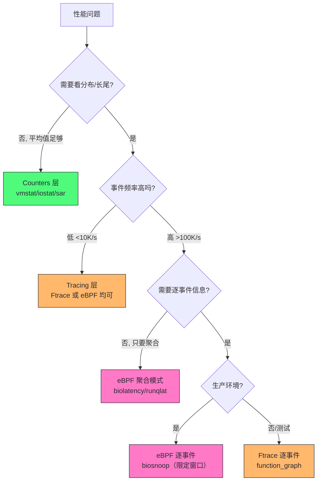

# 03 eBPF 与动态追踪：性能观测的革命

> [!abstract] 摘要
> 本文是可观测性工具栈的第二篇，聚焦 eBPF 这一近年来最革命性的性能观测技术。文章从 BPF 的历史演化切入——从 BSD 包过滤器到内核可编程虚拟机，讲清楚 eBPF 的安全模型（验证器、JIT、能力约束）如何让它能在生产内核中安全执行用户定义代码。随后对比 eBPF 与传统追踪器（Ftrace、strace）的本质差异：eBPF 在内核态完成过滤和聚合，避免了把海量事件转储到用户态的开销。最后系统讲解 BCC 工具集与 bpftrace 语言的实战用法，覆盖 biosnoop、runqlat、execsnoop、opensnoop 等核心工具，并给出 eBPF 的能力边界与生产安全准则。阅读本文后，你将理解为什么 eBPF 被称为"性能观测的革命"——它让此前因开销过高而不敢在生产环境使用的追踪能力变得切实可行。

---

## 第 1 章 从包过滤器到内核虚拟机：eBPF 的演化史

### 1.1 BPF 的起源：tcpdump 背后的技术

要理解 eBPF 为什么是"革命"，必须先理解它从哪里来。BPF（Berkeley Packet Filter）最早出现在 1992 年的 BSD 系统，最初的目的极其朴素：让 tcpdump 能高效地过滤网络包。

在 BPF 之前，网络包抓取的过滤逻辑在用户态执行——内核把所有包都复制到用户态，再由 tcpdump 用正则匹配过滤。这在高流量环境下开销巨大，因为绝大多数包都会被过滤掉，复制它们的成本完全浪费了。BPF 的解决方案是让过滤逻辑在内核态执行：用户用 tcpdump 的表达式（如 `host 10.0.0.1 and port 80`）编译成 BPF 字节码，注入到内核，内核在收到每个包时执行这段字节码，只有匹配的包才被复制到用户态。

这个设计把"复制所有包到用户态"的开销降低到"只复制匹配的包"，在高流量环境下是数量级的性能提升。但此时的 BPF 只是一个简单的包过滤器——它能做的只有"匹配或不匹配"。

> [!info] 核心概念：为什么 BPF 字节码是安全的
> BPF 从一开始就设计为在内核中执行用户提供的代码，这天然是一个高风险操作——如果用户代码有 bug 或恶意行为，可能导致内核崩溃。BPF 用两个机制保证安全：
> 1. **受限的指令集**：BPF 字节码不能任意跳转，只能顺序执行或向前跳转，不能形成循环。这保证了 BPF 程序一定会终止，不会死循环卡住内核。
> 2. **验证器（Verifier）**：内核在加载 BPF 程序时会做静态分析，检查指令是否合法、寄存器使用是否安全、是否会越界访问内存。验证不通过的程序会被拒绝加载。
> 这两个机制是 eBPF 能在生产内核中安全运行的基础，后文会详细展开。

### 1.2 eBPF 的诞生：从包过滤到内核可编程

2014 年，Alexei Starovoitov 在 Linux 3.15 中引入了 Extended BPF（eBPF），这是 BPF 历史上最重要的一次升级。eBPF 对经典 BPF 做了三件关键的事：

**第一，扩展指令集。** 经典 BPF 只有 2 个寄存器（A 和 X），eBPF 扩展到 10 个 64 位寄存器，支持现代 CPU 能高效执行的指令模式。这让 eBPF 能表达远比"包过滤"复杂的逻辑——计数、聚合、延迟计算、直方图统计都能在 eBPF 程序里完成。

**第二，扩展事件源。** 经典 BPF 只能挂载到网络包接收路径，eBPF 可以挂载到内核的任意 tracepoint、kprobe、uprobe 以及性能事件（perf event）。这意味着 eBPF 不仅能过滤网络包，还能观测内核函数调用、系统调用、用户态函数——它从一个"包过滤器"变成了一个"内核可观测性平台"。

**第三，引入 map 数据结构。** eBPF 引入了 BPF map——一种内核态的键值存储，eBPF 程序可以在多个事件之间共享状态。这让 eBPF 能做"有状态的"分析：记录每个 I/O 请求的开始时间，在 I/O 完成时计算延迟，把延迟分布存入 map 的直方图。没有 map，eBPF 只能做无状态的逐事件处理；有了 map，它能做跨事件的关联分析。



### 1.3 为什么 eBPF 是革命：内核态聚合消除转储开销

eBPF 与 Ftrace、strace 等传统追踪器的本质区别，不在于"能追踪什么"（Ftrace 也能追踪内核函数），而在于**事件处理在哪里完成**。

传统追踪器的工作模型是"转储"：内核捕获每个事件，把事件的完整信息（时间戳、PID、参数、返回值）写入一个环形缓冲区，用户态工具从缓冲区读取并处理。这种模型的问题在高事件率下暴露无遗——一个 10 万 IOPS 的系统，每秒产生 10 万条 I/O 事件记录，每条记录几十字节，总数据量每秒数 MB。把这么多数据从内核态传到用户态，涉及上下文切换和内存拷贝，开销足以让系统性能下降 20-50%。

eBPF 的工作模型是"内核态聚合"：eBPF 程序在内核态执行，在事件发生时直接计算和聚合。一个统计 I/O 延迟分布的 eBPF 程序，不需要把每个 I/O 事件传到用户态——它在内核态计算每个 I/O 的延迟，把结果累加到一个直方图 map 里。用户态工具只需要定期读取 map 的最终结果（一个直方图，几十个桶），不需要读取每个事件。这把用户态-内核态的数据传输量从"每秒十万条记录"降低到"每秒一次直方图读取"，开销从 20-50% 降到 1-5%。

| 维度 | Ftrace / strace | eBPF |
|------|----------------|------|
| 事件处理位置 | 用户态 | 内核态 |
| 数据传输量 | 每事件一条记录 | 仅聚合结果 |
| 高事件率开销 | 20-50%+ | 1-5% |
| 有状态分析 | 困难（需在用户态关联） | 原生支持（map） |
| 生产环境可用性 | 有限（高开销） | 高（低开销） |

> [!note] 设计哲学：内核态聚合是 eBPF 的灵魂
> eBPF 的革命性不在于"能追踪更多事件"，而在于"让追踪在生产环境变得可行"。Brendan Gregg 反复强调：很多追踪能力在 eBPF 之前技术上已经存在（用 Ftrace 或 SystemTap 也能实现），但它们的开销太高，没人敢在生产环境用。eBPF 通过内核态聚合把开销降到了生产可接受的级别，让"在生产环境做细粒度追踪"从"理论可行"变成了"工程实践"。这才是 eBPF 被称为革命的根本原因。

---

## 第 2 章 eBPF 的安全模型：为什么内核敢执行你的代码

### 2.1 验证器：加载时的静态分析

让内核执行用户提供的代码，最大的风险是内核崩溃或被提权。eBPF 用一个称为"验证器"（Verifier）的组件来在程序加载时做安全检查。验证器的工作分为两个阶段：

**第一阶段：DAG 构建。** 验证器把 eBPF 程序的指令流构建为有向无环图（DAG），检查是否存在循环。eBPF 明确禁止向后跳转形成循环——所有跳转只能是向前的或有界的（bounded loops，Linux 5.3+ 引入了有界循环，但循环次数必须在加载时可静态确定）。这保证了 eBPF 程序一定会在有限步内终止，不会因为死循环卡住内核。

**第二阶段：状态追踪。** 验证器模拟执行每条指令，追踪寄存器状态和栈状态。它检查：
- 寄存器类型是否匹配（不能把指针当整数运算）
- 内存访问是否在合法范围内（不能越界读写内核内存）
- 指针是否可能为 NULL（解引用前必须检查）
- map 访问的 key 大小是否匹配 map 定义

验证器的严格程度是 eBPF 安全性的第一道防线。一个验证不通过的 eBPF 程序会被拒绝加载，根本不会执行。这是 eBPF 与内核模块（LKM）的根本区别——内核模块可以执行任意代码，一个 bug 就能 panic 内核；eBPF 程序被验证器约束，不会因为逻辑错误导致内核崩溃。

> [!info] 核心概念：验证器的"保守性"是特性不是缺陷
> 初次写 eBPF 程序的人几乎都被验证器"折磨"过——明明逻辑正确的代码，验证器报错"可能越界访问"或"寄存器状态不确定"。这不是验证器的 bug，而是它的设计取向：验证器做的是**保守静态分析**，宁可拒绝一万个正确程序，也不能放过一个危险程序。因为它面对的是"加载时无法预知的运行时输入"，任何它无法证明安全的行为都必须拒绝。理解这一点后，写 eBPF 程序的心态会从"和验证器斗争"转变为"向验证器证明安全"——显式检查边界、避免复杂控制流、把循环展开为固定次数。验证器的报错信息（verifier log）会精确指出是哪条指令、哪个状态不满足，学会读 verifier log 是 eBPF 开发的基本功。

### 2.2 JIT 编译：从字节码到本地指令

验证通过后，eBPF 字节码会被 JIT（Just-In-Time）编译器编译为目标平台的本地机器码。JIT 编译让 eBPF 程序以接近原生代码的速度执行，而不是解释执行字节码。这是 eBPF 低开销的第二个关键——即使验证器保证了安全，如果执行速度慢，eBPF 仍然不适合高频事件。

不同架构有不同的 JIT 后端：x86_64、arm64、s390、riscv 等都有对应的 JIT 实现。JIT 编译后的 eBPF 程序直接在内核上下文中执行，与内核代码共享 CPU 缓存和 TLB，没有额外的模式切换开销。

### 2.3 能力约束与 root 要求

eBPF 的第三道安全防线是能力约束。加载 eBPF 程序需要 `CAP_BPF` 或 `CAP_SYS_ADMIN` 能力，这意味着只有 root 或有相应能力的进程才能加载 eBPF 程序。这是防止非特权用户滥用 eBPF 的基本门控。

在内核配置层面，eBPF 需要以下选项开启：

| 配置项 | 作用 |
|--------|------|
| CONFIG_BPF | 启用 BPF 子系统 |
| CONFIG_BPF_SYSCALL | 启用 bpf() 系统调用 |
| CONFIG_BPF_EVENTS | 启用 BPF 事件挂载 |
| CONFIG_HAVE_EBPF_JIT | 启用 JIT 编译 |
| CONFIG_BPF_JIT | 启用 JIT 编译 |

> [!warning] 生产避坑：eBPF 不是零开销
> eBPF 的开销虽然远低于传统追踪器，但不是零。每个被 eBPF 探针挂载的事件，在触发时都要执行一次 eBPF 程序，这有几十到几百纳秒的开销。对于低频事件（进程创建、文件打开），这个开销可忽略。但对于高频事件（网络包接收、高频系统调用），开销会累积。一个 kprobe 挂载到每秒被调用 100 万次的内核函数上，即使 eBPF 程序本身只有 100ns，总开销也是 100ms/s = 10% CPU。**生产环境使用 eBPF 时，必须评估目标事件的频率，高频事件要限制探针数量和程序复杂度**。

### 2.4 BPF map：有状态分析的基石

eBPF 程序本身是无状态的——每次事件触发时执行一次，执行完状态就丢了。让 eBPF 能做"跨事件关联分析"的关键是 BPF map——内核态的键值存储，程序可以在多次事件之间读写共享状态。map 的类型决定了能做什么样的分析：

| map 类型 | 结构 | 典型用途 |
|---------|------|---------|
| BPF_MAP_TYPE_HASH | 哈希表 | 以 PID/TID 为 key 存时间戳，配对计算延迟 |
| BPF_MAP_TYPE_ARRAY | 固定数组 | 全局计数器、配置参数 |
| BPF_MAP_TYPE_PERCPU_HASH | 每 CPU 独立副本的哈希 | 高频计数（避免跨核锁竞争） |
| BPF_MAP_TYPE_LRU_HASH | LRU 淘汰哈希 | 连接追踪等有界状态 |
| BPF_MAP_TYPE_RINGBUF | 环形缓冲区（5.8+） | 向用户态高效推送事件流 |
| BPF_MAP_TYPE_PERF_EVENT_ARRAY | perf 事件数组 | 传统的事件推送通道 |

其中 per-CPU 变体值得特别说明。一个统计"每秒系统调用次数"的 eBPF 程序，如果用普通 HASH map，每次事件都要对同一个 key 做原子递增——在多核高并发下，跨核的缓存行争用（cache line bouncing）会成为瓶颈。PERCPU_HASH 让每个 CPU 核有独立的计数副本，写入无竞争，用户态读取时再汇总所有核的值。这是 eBPF 工具能在高频事件下保持低开销的关键设计之一，与第 04 篇 JFR 的线程本地缓冲区是同一个思想——**用"每执行单元私有 + 读取时聚合"替代"共享 + 加锁"**。

map 还有一个容易被忽视的工程问题：**map 是有容量上限的**。一个以连接五元组为 key 的 LRU map 如果设得太小，高频连接场景下会疯狂淘汰，统计结果失真；一个直方图 map 的桶范围设得不合适（譬如上限只到 1ms），超出的样本全部堆在最后一个桶里，长尾信息全部丢失。使用 BCC/bpftrace 工具时，直方图的桶范围通常是预设的，遇到"最大桶计数异常高"的输出，要意识到真实延迟可能超出量程，需要调整范围重新测。

---

## 第 3 章 eBPF 的探针类型与事件源

### 3.1 探针类型全景

eBPF 能挂载到的探针类型决定了它的观测范围。理解每种探针的能力和开销，是选型的前提：

| 探针类型 | 挂载位置 | 开销 | 稳定性 | 典型用途 |
|---------|---------|------|--------|---------|
| tracepoint | 内核静态插桩点 | 最低 | 稳定（API 保证） | 调度事件、I/O 事件 |
| kprobe | 内核函数入口 | 中 | 不稳定（函数可能改名/移除） | 任意内核函数观测 |
| kretprobe | 内核函数返回 | 中 | 不稳定 | 函数延迟测量 |
| uprobe | 用户态函数入口 | 中 | 取决于应用版本 | 任意用户函数观测 |
| uretprobe | 用户态函数返回 | 中 | 取决于应用版本 | 用户函数延迟 |
| USDT | 应用静态插桩点 | 低 | 稳定（应用提供） | 有 USDT 支持的应用 |
| perf_event | 硬件/软件性能事件 | 低 | 稳定 | CPU 采样、PMC |

> [!info] 核心概念：静态插桩 vs 动态插桩的稳定性
> tracepoint 和 USDT 是"静态插桩"——由开发者预先埋设在代码中，有 API 稳定性保证。内核 tracepoint 的名字和参数格式在内核版本间保持稳定，你的 eBPF 脚本不会因为内核升级而失效。
> kprobe 和 uprobe 是"动态插桩"——在运行时插入到任意函数入口。它们的探针位置不受 API 保证：内核函数可能在新版本中改名或移除，应用函数同理。用 kprobe 挂载到 `__do_sys_open` 上，内核升级后这个函数名可能变了，脚本就失效了。
> **生产环境优先用 tracepoint，只有 tracepoint 不覆盖的场景才用 kprobe**。这个原则与第 02 篇 Ftrace 章节一致——静态优于动态，稳定性优先于灵活性。

### 3.2 kprobe 的工作原理：断点指令

kprobe 的工作机制值得深入理解，因为它解释了动态插桩的 overhead 来源。当你在内核函数 `vfs_read` 入口挂载一个 kprobe 时，内核会做以下操作：

1. 找到 `vfs_read` 函数入口的指令地址
2. 把该地址的原始指令保存，替换为断点指令（x86 上是 `int3`）
3. 当 CPU 执行到 `vfs_read` 时，触发断点异常
4. 异常处理器检查该地址是否有 kprobe，如果有，调用 eBPF 程序
5. eBPF 程序执行完毕后，恢复原始指令，单步执行，再次插入断点

这个"保存-替换-触发-恢复-单步-再替换"的过程，每次触发都有一次异常和两次指令修改，开销在百纳秒到微秒级别。对于低频函数这无所谓，但对于高频函数（如网络包接收路径），kprobe 的开销可能成为问题。

### 3.3 USDT：应用层面的静态插桩

USDT（User Statically Defined Tracing）是应用开发者主动埋设的追踪点。它通过 `DTRACE_PROBE()` 宏在代码中标记观测点，编译后保留为特定的指令模式。eBPF 可以挂载到这些 USDT 点上，获得应用层面的语义化追踪能力。

支持 USDT 的典型应用：MySQL、PostgreSQL、Python、Node.js、Java（通过 SystemTap 代理或 htrace）。USDT 的优势是探针位置由应用开发者维护，跨版本稳定，且语义清晰（探针名如 `mysql:query:start` 比函数名 `mysql_parse` 更有意义）。

### 3.4 uprobe 的机制与代价：用户态动态追踪

uprobe 是 kprobe 在用户态的对偶物——把探针插入到**用户态进程的任意函数入口**。它的实现机制与 kprobe 同构但更精巧：

1. 内核根据符号表找到目标函数的虚拟地址，把该地址的原始指令替换为断点指令（x86 上是 `int3`）
2. 进程执行到该地址时触发断点异常，内核捕获异常
3. 内核执行 uprobe 关联的 eBPF 程序（此时可以读取函数参数、进程上下文）
4. 内核单步执行原始指令，恢复断点，进程继续

uretprobe（用户态函数返回探针）的实现则更"黑科技"：内核把函数入口的返回地址替换为一个跳板（trampoline）地址，函数返回时跳到跳板，跳板触发 eBPF 程序后再跳回真正的返回地址。这个机制让"测量用户态函数执行耗时"成为可能，但代价是 uretprobe 会干扰函数的尾调用优化和 longjmp 行为。

uprobe 的开销比 kprobe 高一个量级——因为断点异常处理要跨越用户态/内核态边界，且要维护"原始指令备份"。实测一个 uprobe 触发的开销在 1-2μs（kprobe 约 100-200ns）。这个量级意味着：**uprobe 适合低频函数（每秒千次级），不适合高频热路径**。一个每秒被调用 10 万次的用户函数挂 uprobe，仅探针开销就是 10-20% CPU。

uprobe 对 JVM 应用还有一个特殊限制：JVM 的热点方法会被 JIT 编译成本地代码，执行路径不再经过原来的字节码入口，uprobe 挂在解释器入口只能看到"未编译的方法调用"。所以 eBPF 观测 JVM 内部行为的能力是残缺的——这正是第 04 篇 async-profiler 存在的理由：它用 JVM 内部的 AsyncGetCallTrace 接口补上了这块盲区。两个工具的分工是：eBPF 看 JVM 的"外壳行为"（系统调用、页错误、调度），async-profiler 看 JVM 的"内脏行为"（Java 栈、对象分配、锁）。

| 维度 | kprobe/tracepoint | uprobe/uretprobe |
|------|-------------------|------------------|
| 目标 | 内核函数 | 用户态函数 |
| 单次开销 | 100-200ns | 1-2μs |
| 稳定性 | tracepoint 稳定，kprobe 随内核版本变化 | 随应用版本变化（符号地址） |
| 适用频率 | 高频（万级/秒） | 低频（千级/秒以下） |
| 典型用途 | 调度、I/O、网络事件 | 数据库查询、应用函数延迟 |

---

## 第 4 章 BCC 工具集：80+ 预构建工具

### 4.1 BCC 是什么：BPF 编译器集合

BCC（BPF Compiler Collection）是 eBPF 的主要前端之一，包含 80+ 个预构建的性能分析工具。BCC 的设计哲学继承自 Unix 传统——"每个工具只做一件事，并做好"。每个 BCC 工具都是一个独立的命令行程序，专注于一个特定的观测维度。

BCC 工具的技术架构：



BCC 工具的开发门槛较高——需要同时写 C（内核态 eBPF 程序）和 Python（用户态前端），理解内核 API 和 BPF 辅助函数。因此实践中分两种使用方式：

- **直接使用预构建工具**：安装 bcc-tools 包，直接运行 `biosnoop`、`runqlat` 等命令。适合大多数排查场景。
- **开发自定义工具**：用 BCC 的 Python 框架编写定制工具。适合预构建工具不覆盖的场景。

### 4.2 核心工具详解：按观测维度分类

以下是性能排查中最常用的 BCC 工具，按观测维度分类：

**CPU / 调度类**：

| 工具 | 观测内容 | 典型用途 |
|------|---------|---------|
| runqlat | CPU 调度延迟直方图（进程被唤醒到实际运行的等待时间） | 排查"CPU 不忙但延迟高"的调度问题 |
| runqlen | 运行队列长度直方图 | CPU 饱和度分布 |
| cpudist | CPU on/off 时间分布 | 区分 CPU bound vs I/O bound 进程 |
| offcputime | off-CPU 时间聚合（进程不在 CPU 上运行的时间） | 找出"进程在等什么" |
| profile | 采样剖析（eBPF 版 perf record） | CPU 热点定位 |

**I/O / 存储类**：

| 工具 | 观测内容 | 典型用途 |
|------|---------|---------|
| biolatency | 磁盘 I/O 延迟直方图 | 看 I/O 延迟分布（不是平均值） |
| biosnoop | 每个磁盘 I/O 的详细追踪 | 定位慢 I/O 的具体进程和扇区 |
| biotop | 磁盘 I/O 热点 top | 类似 top 但针对块 I/O |
| bitesize | I/O 大小分布 | 区分大 I/O vs 小 I/O 负载模式 |
| opensnoop | 文件打开追踪 | 排查"哪个进程在打开哪些文件" |
| filelife | 短生命周期文件追踪 | 发现临时文件创建/删除模式 |

**文件系统类**：

| 工具 | 观测内容 | 典型用途 |
|------|---------|---------|
| ext4slower | ext4 慢操作追踪 | 文件系统级延迟分析 |
| xfsdist | XFS 操作延迟分布 | XFS 文件系统排查 |
| vfsstat | VFS 操作统计 | 文件系统操作类型分布 |

**网络类**：

| 工具 | 观测内容 | 典型用途 |
|------|---------|---------|
| tcplife | TCP 连接生命周期 | 分析连接模式 |
| tcptracer | TCP 连接建立/关闭追踪 | 连接泄露排查 |
| tcpretrans | TCP 重传追踪 | 网络质量问题定位 |
| dropsnoop | 内核丢包追踪 | 网络丢包根因 |
| socketsapparent | socket 缓冲使用 | 网络缓冲瓶颈 |

**进程 / 系统调用类**：

| 工具 | 观测内容 | 典型用途 |
|------|---------|---------|
| execsnoop | 新进程执行追踪（execve 追踪） | 发现短命进程、fork 风暴 |
| killsnoop | kill 信号追踪 | 排查进程被杀原因 |
| opensnoop | 文件打开追踪 | strace openat 的安全替代 |
| statsnoop | stat 系统调用追踪 | 文件 stat 风暴排查 |

> [!info] execsnoop：被低估的排查利器
> execsnoop 看起来简单——只追踪 execve 系统调用，输出新进程的 PID、命令行、返回值。但它在生产排查中的价值极高。两个典型案例：
> 1. **短命进程**：一个 cron 脚本每分钟 fork 一个进程做检查，进程运行 50ms 后退出。top 和 ps 根本抓不到它，但它可能在运行期间抢 CPU、做 I/O、产生日志。execsnoop 能完整记录它的存在。
> 2. **fork 风暴**：一个有 bug 的服务在异常时疯狂 fork 子进程，每秒创建上百个进程，每个又快速退出。这种风暴在 CPU 监控上可能只表现为短暂的利用率波动，但 execsnoop 会立刻显示进程创建频率异常。
> Brendan Gregg 说他用 execsnoop 单独解决了大量性能问题，包括 shell 脚本在循环中创建失败进程、小应用每几分钟崩溃重启但没人注意到等。这个工具是 60 秒清单之外值得常备的"第二梯队"工具。

### 4.3 biosnoop：回到支付服务案例

第 01 篇 6.0 节的支付服务案例，在第 02 篇用 iostat 定位到磁盘 I/O 瓶颈后，下一步就是用 biosnoop 看每个 I/O 的延迟分布。biosnoop 的输出类似：

```
TIME(s)     COMM           PID    DISK  T SECTOR     BYTES  LAT(ms)
3.001234    java           12345  sda   W 12345678   4096   0.8
3.001456    java           12345  sda   W 12345700   4096   85.2
3.001678    java           12345  sda   W 12345710   4096   0.5
3.001890    java           12345  sda   W 12345720   4096   92.1
```

这个输出直接暴露了问题：大部分写入 4096 字节（小写入），延迟在 0.5-0.8ms 正常，但部分写入延迟高达 85-92ms——这是 fsync 同步写入的特征（写完后要等磁盘确认）。结合凌晨 3:00 的时间窗口和 DEBUG 日志开启的事实，根因完全闭合：DEBUG 日志 → 大量小写入 → 同步 fsync → 高延迟 I/O → GC 压力 → 延迟尖刺。

biosnoop 比 iostat 强大的地方在于它能看到**每个 I/O 的独立延迟**，而 iostat 只给平均值。85ms 的长尾被大量 0.5ms 的快 I/O 平均后，await 可能只有 3-4ms，看起来"还行"。只有 biosnoop 的逐事件追踪才能暴露长尾。

---

## 第 5 章 bpftrace：一行命令搞定自定义追踪

### 5.1 bpftrace 是什么：awk 风格的追踪语言

bpftrace 是 eBPF 的另一个主要前端，定位是"一行命令搞定自定义追踪"。它的语法类似 awk，程序结构是：

```
probes /filter/ { actions }
```

- **probes**：探针定义，如 `kprobe:vfs_read`（内核函数 vfs_read 入口）、`tracepoint:sched:sched_switch`（调度切换 tracepoint）
- **filter**：可选的过滤条件，如 `/pid == 12345/`（只追踪某 PID）
- **actions**：动作代码，如 `@count = count()`、`printf("read by %s\n", comm)`

bpftrace 与 BCC 的分工：

| 维度 | BCC | bpftrace |
|------|-----|---------|
| 定位 | 复杂工具和守护进程 | 一行命令和短脚本 |
| 开发语言 | C + Python | 类 awk DSL |
| 开发门槛 | 高 | 低-中 |
| 性能 | 优化更好 | 一般足够 |
| 适用场景 | 预构建工具、长期运行工具 | 临时排查、快速验证假设 |

Brendan Gregg 的建议：**先用 bpftrace 写一行命令验证假设，假设确认后再决定是否用 BCC 开发正式工具**。bpftrace 是"草图"，BCC 是"成品"。

### 5.2 bpftrace 变量与 map

bpftrace 有三类变量：

| 类型 | 前缀 | 作用域 | 典型用途 |
|------|------|--------|---------|
| 内置变量 | 无 | 单次探针触发 | pid、comm、nsecs、kstack |
| 临时变量 | $ | 单次探针触发 | $lat = nsecs - @start[tid] |
| map 变量 | @ | 跨探针触发（全局） | @count、@hist、@start[tid] |

map 变量是 bpftrace 做有状态分析的核心。一个测量 I/O 延迟的 bpftrace 脚本用两个探针配合：

```bash
# 测量 vfs_read 的延迟分布
bpftrace -e '
kprobe:vfs_read { @start[tid] = nsecs }
kretprobe:vfs_read /@start[tid]/ {
    @latency = hist((nsecs - @start[tid]) / 1000);
    delete(@start[tid]);
}
'
```

这段脚本的逻辑：
1. `kprobe:vfs_read` 在函数入口记录开始时间到 `@start[tid]`（以线程 ID 为 key）
2. `kretprobe:vfs_read` 在函数返回时，用当前时间减去开始时间得到延迟
3. `hist()` 把延迟（微秒）累加到一个直方图 map 里
4. 程序结束时（Ctrl+C）输出直方图

输出类似：
```
@latency:
[1, 2)              234 |@@                                  |
[2, 4)              567 |@@@@@                               |
[4, 8)             1234 |@@@@@@@@@@                          |
[8, 16)             890 |@@@@@@                              |
[16, 32)            123 |@                                   |
[32, 64)             45 |                                    |
[64, 128)            12 |                                    |
[128, 256)            3 |                                    |
```

这个直方图直接展示了 vfs_read 的延迟分布：大部分在 4-8μs，但有长尾到 128-256μs。这种分布视图是固定计数器（平均值）和采样剖析都给不出的。

### 5.3 bpftrace 常用一行命令速查

以下是一线排查中最实用的 bpftrace 一行命令：

```bash
# 统计每个进程的磁盘 I/O 大小
bpftrace -e 'tracepoint:block:block_rq_issue { @bytes[comm] = sum(args->bytes); }'

# 统计系统调用频率
bpftrace -e 'tracepoint:raw_syscalls:sys_enter { @[comm] = count(); }'

# 追踪某个进程的文件打开
bpftrace -e 'tracepoint:syscalls:sys_enter_openat /comm == "java"/ { printf("%s opened %s\n", comm, str(args->filename)); }'

# CPU 调度延迟直方图
bpftrace -e 'tracepoint:sched:sched_wakeup { @start[args->pid] = nsecs; }
tracepoint:sched:sched_switch { if (@start[args->prev_pid]) { @runqlat = hist((nsecs - @start[args->prev_pid]) / 1000); delete(@start[args->prev_pid]); } }'

# 追踪 TCP 连接延迟
bpftrace -e 'kprobe:tcp_v4_connect { @start[tid] = nsecs; }
kretprobe:tcp_v4_connect /@start[tid]/ { @connect_lat = hist((nsecs - @start[tid]) / 1000000); delete(@start[tid]); }'

# 统计每个内核函数的调用次数（Top 20）
bpftrace -e 'kprobe:* { @[func] = count(); }' | sort -t= -k2 -rn | head -20
```

> [!warning] 生产避坑：kprobe 通配符的开销
> 上面最后一条命令 `kprobe:*` 会挂载到所有可追踪的内核函数（可能上千个），每个函数每次调用都触发 eBPF 程序。这在生产环境几乎必然导致系统卡死。**永远不要在生产环境用通配符 kprobe**。正确的做法是先用 perf 或 tracepoint 定位到可疑函数，再用具体函数名的 kprobe 下钻。

### 5.4 bpftrace 的聚合与过滤模式

掌握 bpftrace 的关键不是记命令，而是掌握几个可组合的分析模式。绝大多数自定义追踪需求都能用这四个模式拼出来。

**模式一：时间戳配对测延迟。** 用两个探针（入口 + 返回）配对，以 PID/TID 或请求指针为 key 存时间戳，返回时做差。这是所有延迟测量工具（biolatency、runqlat）的底层模式：

```bash
# 测量块设备 I/O 的延迟分布
bpftrace -e '
tracepoint:block:block_rq_issue { @start[args->dev, args->sector] = nsecs; }
tracepoint:block:block_rq_complete /@start[args->dev, args->sector]/ {
    @lat_us = hist((nsecs - @start[args->dev, args->sector]) / 1000);
    delete(@start[args->dev, args->sector]);
}'
```

配对模式的 key 选择是关键：用 `[dev, sector]` 可以精确配对单个 I/O；用 `[tid]` 适合"同线程串行"的调用；用请求结构体指针（kprobe 的 arg0）则是内核态最通用的配对键。key 选错会导致配对错乱——譬如用 `pid` 而不是 `tid`，多线程进程的并发 I/O 会互相覆盖时间戳，统计结果完全失真。

**模式二：按维度聚合 Top-N。** 用 map 的 key 携带维度（进程名、文件、目标地址），值做计数或求和，退出时排序：

```bash
# 按进程统计写盘字节数 Top 10
bpftrace -e 'tracepoint:block:block_rq_issue /args->rwbs == "W"/ {
    @[comm] = sum(args->bytes);
} END { print(@[comm], 10); }'
```

**模式三：条件触发采样。** 平时不输出，只在满足条件（延迟超阈值、错误发生）时打印，适合抓偶发问题：

```bash
# 只打印超过 100ms 的慢 I/O 及其发起者
bpftrace -e '
tracepoint:block:block_rq_issue { @start[(uint32)args->dev, args->sector] = nsecs; }
tracepoint:block:block_rq_complete /@start[(uint32)args->dev, args->sector]/ {
    $d = (nsecs - @start[(uint32)args->dev, args->sector]) / 1000000;
    if ($d > 100) { printf("%dms %s sector=%d\n", $d, comm, args->sector); }
    delete(@start[(uint32)args->dev, args->sector]);
}'
```

**模式四：直方图看分布。** `hist()`（对数桶）和 `lhist()`（线性桶）把"平均值"升级为"分布"，是发现长尾的唯一手段。第 01 篇讲过平均值的欺骗性——bpftrace 的直方图模式就是把"分布思维"落到内核观测上。

这四个模式组合起来，能覆盖 90% 的自定义追踪需求。写脚本时的心法是：先想清楚"我要回答什么问题"，再选模式，最后才写语法。反过来先写语法再想问题，很容易写出开销大、输出噪声多的脚本。

---

## 第 6 章 eBPF 的能力边界

### 6.1 内核版本约束

eBPF 的能力随内核版本演进而增长。不同工具和特性需要的最低内核版本：

| 特性/工具 | 最低内核版本 | 说明 |
|-----------|------------|------|
| 基本 kprobe/uprobe | 4.1+ | 动态探针基础 |
| 大多数 BCC 工具 | 4.9+ | 生产可用基线 |
| BTF（BPF Type Format） | 5.0+ | 无需内核头文件即可开发 |
| 有界循环 | 5.3+ | 验证器支持有限循环 |
| bpftrace 稳定可用 | 5.4+ | 配合 BTF |
| CO-RE（Compile Once Run Everywhere） | 5.10+ | 跨内核版本运行同一 eBPF 程序 |

如果你的生产内核低于 4.9，大部分 BCC 工具不可用，只能退回到 perf/Ftrace。这是为什么性能工程师需要关注内核版本的原因——不是追新，而是新工具的可用性。

### 6.2 高频事件的开销累积

eBPF 单次探针触发的开销很低（百纳秒级），但高频事件的累积开销不容忽视。下表是不同事件频率下的开销估算（假设单次 eBPF 程序执行 200ns）：

| 事件频率 | 每秒总开销 | CPU 占比 | 生产可用性 |
|---------|----------|---------|----------|
| 1K/s | 0.2ms | 0.02% | ✅ 无感 |
| 10K/s | 2ms | 0.2% | ✅ 安全 |
| 100K/s | 20ms | 2% | ✅ 可接受 |
| 1M/s | 200ms | 20% | ⚠️ 需谨慎评估 |
| 10M/s | 2000ms | 200% | ❌ 不可用 |

**对于网络包接收（高频）和热路径内核函数（如调度器核心函数），eBPF 的开销可能不可接受**。这种场景下，应该用 tracepoint（开销低于 kprobe）或 perf stat（计数器级开销）。

### 6.3 用户态函数追踪的局限

eBPF 的 uprobe 可以追踪用户态函数，但有几个实践局限：

1. **符号信息依赖**：uprobe 需要知道函数的符号名和地址。如果应用被 strip（去除符号表），uprobe 无法挂载。
2. **JIT 代码问题**：JVM 的 JIT 编译代码没有固定地址，uprobe 无法直接追踪 JIT 编译后的方法。要追踪 JVM 内部行为，需要用 USDT（如果 JVM 提供了 USDT 探针）或 JVM 自己的观测工具（JFR、async-profiler，专栏第 04 篇）。
3. **多版本兼容**：uprobe 挂载到具体函数地址，应用升级后函数地址可能变化，脚本需要更新。

> [!note] eBPF 与 JVM 的交叉点
> eBPF 追踪 JVM 应用有几个实用场景：
> - 追踪 JVM 进程的**系统调用**（如文件打开、网络连接）——通过 tracepoint 或 kprobe 追踪 syscall 层，不涉及 JVM 内部
> - 追踪 JVM 的**GC 停顿对外的影响**——通过 runqlat 或 offcpu 观察 GC 期间其他线程的调度延迟
> - 追踪 JVM 的**内存分配**——通过 uprobe 追踪 `malloc`/`mmap`（JVM 堆外内存分析）
> 但 eBPF 不能直接分析 JVM 堆内对象、JIT 编译代码、锁竞争等 JVM 内部状态——这些需要 JVM 原生工具，下一篇会详细讲。

### 6.4 CO-RE：一次编译到处运行的工程突破

eBPF 早期最大的工程痛点是**内核版本耦合**。eBPF 程序要读取内核数据结构（譬如 task_struct 的字段），必须知道这个结构体的内存布局——但内核结构体在不同版本、不同配置下布局不同。早期 BCC 的解决方案是"运行时编译"：在目标机器上用 Clang 现场把 eBPF C 代码编译成字节码，编译时读取目标内核的头文件。这个方案能用，但代价惨重：每台目标机器都要装内核头文件和 LLVM 工具链（数百 MB 依赖），首次运行要现场编译（秒级延迟），且编译失败的环境问题难以排查。

2019 年前后，Facebook（Meta）在部署 BPF 驱动的负载均衡器 Katran 时被这个问题逼到了极限——数万台机器各自编译 BPF 程序的运维成本不可接受。由此诞生了 **CO-RE（Compile Once, Run Everywhere）**，它由三个组件协同实现：

1. **BTF（BPF Type Format，内核 5.0+）**：内核把自身的类型信息以紧凑格式嵌入到 `/sys/kernel/btf/vmlinux`，相当于内核自带的"调试信息"，不需要再安装内核头文件。
2. **编译器重定位信息**：Clang 编译 eBPF 程序时，把"访问了结构体的哪个字段"记录成重定位表。
3. **libbpf 加载器**：程序加载时，libbpf 读取目标内核的 BTF，根据重定位表自动修正字段偏移量——同一个编译产物可以适配不同内核版本。

CO-RE 的工程意义在于把 eBPF 从"每台机器现场编译的脚本"变成了"像普通二进制一样分发的程序"。这正是今天大量 eBPF 观测产品（Pixie、Parca、Cilium Tetragon 等）能以单二进制部署到异构集群的技术前提。对性能工程师的实操含义是：如果你的环境内核 ≥ 5.10 且开启了 `CONFIG_DEBUG_INFO_BTF`，优先选择基于 libbpf/CO-RE 的工具（bpftrace 新版、BCC 的 libbpf 后端），部署摩擦最小；老内核环境则退回传统 BCC 运行时编译模式，并接受其依赖开销。

### 6.5 安全边界的另一面：eBPF 也是攻击面

前文一直在讲 eBPF 如何安全，但一个完整的工程视角必须包含反面：eBPF 本身也是内核攻击面的扩大。历史上 eBPF 验证器和 JIT 曾多次被曝出可被利用的漏洞（CVE-2020-8835、CVE-2021-3490 等），攻击者可以用特制的 eBPF 程序实现内核提权。因此生产环境对 eBPF 的管控应该是双向的：

- **允许**：受控的观测工具（BCC/bpftrace），由运维统一部署；
- **禁止**：非受信来源的 eBPF 程序加载，可通过 `kernel.unprivileged_bpf_disabled=1`（禁止非特权用户加载）加 `sysctl` 固化，以及 LSM 策略限制 `bpf()` 系统调用。

安全团队常问的一个问题是："eBPF 能不能被用来做恶意监控？"答案是能——eBPF 可以静默捕获所有系统调用的参数（譬如窃取 read() 的内容）。这正是 `unprivileged_bpf_disabled` 默认开启的原因。性能工程师在生产环境使用 eBPF 时，应当走变更流程、限定时间窗口、留存操作记录，既是稳定性纪律，也是安全合规的要求。

### 6.6 XDP：网络路径上的 eBPF 前哨站

前文讨论的探针（tracepoint/kprobe/uprobe）都是"观测型"的——它们读取事件但不改变事件的处理路径。XDP（eXpress Data Path）是 eBPF 家族中性质完全不同的一员：它把 eBPF 程序挂载到**网卡驱动收包路径的最前端**，在 skb（socket buffer）分配之前直接处理原始包，并且可以**改变包的命运**——放行（XDP_PASS）、丢弃（XDP_DROP）、转发（XDP_TX）、重定向（XDP_REDIRECT）。

XDP 的位置决定了它的性能特征。传统收包路径上，一个包要经过 DMA → 驱动 → skb 分配 → 协议栈逐层处理，才能被应用层过滤逻辑看到。XDP 在 DMA 之后、skb 分配之前就介入，此时包还只是一段原始内存，处理一个包的开销只有几十纳秒。实测单核 XDP 可以处理 10-20 Mpps（百万包/秒），而完整协议栈路径的单核处理能力只有 1-2 Mpps——**差一个数量级**。

这带来两类典型应用：

**DDoS 防御与流量清洗。** 在包进入协议栈之前按五元组/特征丢弃恶意流量，把攻击流量在"最便宜的位置"处理掉。Cloudflare 公开分享过其基于 XDP 的 DDoS 缓解实践——单台机器丢弃数千万 pps 的垃圾流量，CPU 占用极低。

**高性能包处理。** XDP_REDIRECT 可以把包直接从一个网卡转发到另一个网卡（或转发给 AF_XDP socket 的用户态程序），绕过整个内核协议栈。这是 DPDK 之外的另一条高性能数据面路线——DPDK 需要独占网卡（内核完全看不到它），而 XDP 保留了内核协议栈作为"慢路径"，只有快路径流量走 XDP，运维复杂度低得多。

对性能工程师的观测价值在于：XDP 也是绝佳的**网络观测点**。在 XDP 层统计包数、按源地址聚合、测量"包到达时间分布"，开销比在协议栈层观测低得多。第 08 篇讲网络性能时会回到这个位置——"越早观测，越便宜"是网络观测的基本规律。

XDP 的边界也要清楚：它只能看到 L2/L3 层的原始包，没有 TCP 状态、没有 socket 语义；它对"需要协议栈信息"的过滤无能为力。XDP 是"前哨站"而非"替代品"——快路径用 XDP，需要深度语义的处理仍交给协议栈。

> [!note] eBPF 与 JVM 的交叉点
> eBPF 追踪 JVM 应用有几个实用场景：
> - 追踪 JVM 进程的**系统调用**（如文件打开、网络连接）——通过 tracepoint 或 kprobe 追踪 syscall 层，不涉及 JVM 内部
> - 追踪 JVM 的**GC 停顿对外的影响**——通过 runqlat 或 offcpu 观察 GC 期间其他线程的调度延迟
> - 追踪 JVM 的**内存分配**——通过 uprobe 追踪 `malloc`/`mmap`（JVM 堆外内存分析）
> 但 eBPF 不能直接分析 JVM 堆内对象、JIT 编译代码、锁竞争等 JVM 内部状态——这些需要 JVM 原生工具，下一篇会详细讲。

---

## 第 7 章 eBPF 工具选型决策树

### 7.0 eBPF 与 JVM 统一日志的协同视角

在进入选型决策之前，需要建立 eBPF（OS 层观测）与 JVM 统一日志（JVM 层观测）的协同关系。Monica Beckwith 在《JVM Performance Engineering》第 4 章详细讲解了 JVM 的统一日志接口（Unified Logging, UL）体系——从 JDK 9 开始，JVM 所有组件的日志都通过 `-Xlog` 统一控制，可以按标签（tag）、级别（level）、装饰器（decorator）精确筛选。

UL 与 eBPF 的协同价值在于：**OS 层和 JVM 层看到的事件可以按时间戳对齐**。一个典型的对齐排查流程：

1. 用 eBPF 的 `biosnoop` 追踪 OS 层 I/O 事件，获得每个 I/O 的时间戳和延迟
2. 同时用 `-Xlog:gc*=info:file=gc.log:time,uptime,level,tags` 开启 GC 日志，获得每次 GC 的时间戳和停顿时长
3. 把两份数据按时间戳对齐，可以直接观察"GC 停顿期间是否有 I/O 瓶颈"或"I/O 瓶颈期间是否触发了 GC"

这种跨层对齐排查是全栈性能分析的核心技能，专栏第 14 篇会完整演示。这里先建立认知：**eBPF 给你 OS 层的精确时间线，JVM UL 给你 JVM 层的精确时间线，两者对齐就是全栈时间线**。

UL 的关键标签速查：

| 标签 | 覆盖内容 | 性能排查用途 |
|------|---------|------------|
| gc | GC 全生命周期 | GC 频率、停顿、区域变化 |
| gc\* | GC 所有子标签 | 最常用，包含 gc 的所有细节 |
| safepoint | 安全点事件 | JVM 暂停分析（非 GC 的暂停源） |
| classload | 类加载 | 启动期性能分析 |
| jit | JIT 编译 | 编译事件、deoptimization |
| os | OS 相关（内存、处理器） | JVM 视角的 OS 资源 |
| heap | 堆操作 | 堆扩展/收缩 |

> [!info] 统一日志的异步模式
> UL 支持异步日志（`-Xlog:async`），把日志写入操作放到独立线程，避免日志 I/O 阻塞应用线程。这与第 01 篇支付服务案例中"同步日志写入导致延迟尖刺"直接相关——如果那个案例的日志组件用了异步模式，fsync 的阻塞就不会影响支付链路。异步日志的代价是日志顺序可能不完全精确，以及异步队列满时会丢弃日志。生产环境推荐默认开启异步日志，尤其对高频日志场景。

### 7.1 按问题类型选 eBPF 工具

| 问题 | 第一步 | 第二步 | 第三步 |
|------|--------|--------|--------|
| CPU 调度延迟 | runqlat | offcputime | profile（eBPF 版） |
| I/O 延迟分布 | biolatency | biosnoop | biotop |
| 文件打开排查 | opensnoop | filelife | ext4slower/xfsdist |
| 网络延迟 | tcplife | tcpretrans | dropsnoop |
| 短命进程 | execsnoop | — | — |
| 内存分配 | oomkill | memleak | — |
| 锁竞争（内核） | offcputime + kstack | — | — |

### 7.2 eBPF vs 传统工具的选型原则



### 7.3 生产环境 eBPF 使用纪律

综合本文的安全模型、开销分析和工具特性，生产环境使用 eBPF 的纪律如下：

1. **优先 tracepoint，谨慎 kprobe**：tracepoint 稳定且低开销，kprobe 灵活但不稳定且开销更高。能用 tracepoint 解决的问题不要用 kprobe。
2. **评估事件频率**：使用前估算目标事件的频率，高频事件（>100K/s）要限制探针数量和程序复杂度，必要时先用低频事件验证可行性。
3. **限定时间窗口**：生产环境不要长期运行 eBPF 追踪。biosnoop、execsnoop 等工具应限定在 10-60 秒的故障窗口内运行，排查完立即停止。
4. **禁止通配符 kprobe**：`kprobe:*` 类命令会挂载数百个探针，开销可让系统不可用。始终用具体函数名。
5. **预装 bcc-tools**：生产事故时再装工具是灾难。bcc-tools 应作为基础镜像的一部分预装。验证可用性的命令：`bpftrace -e 'BEGIN { printf("ok\n"); exit() }'`。

### 7.4 一个实战片段：用 bpftrace 定位 off-CPU 阻塞

回到支付服务案例的延伸场景。假设 iostat 和 biosnoop 确认了 I/O 瓶颈后，你想知道具体是哪个线程在等 I/O、等了多久。这时 `offcputime` 是正确工具，但也可以用 bpftrace 自定义更精确的追踪：

```bash
# 追踪 java 进程的 off-CPU 时间及其内核栈
bpftrace -e '
tracepoint:sched:sched_switch {
    if (args->prev_state == 1 && args->prev_comm == "java") {
        @offcpu[args->prev_pid] = nsecs;
        @kstack[args->prev_pid] = kstack;
    }
    if (@offcpu[args->next_pid] && args->next_comm == "java") {
        $dur = (nsecs - @offcpu[args->next_pid]) / 1000000;
        if ($dur > 10) {
            printf("PID %d off-CPU %dms, stack:\n%s\n", 
                   args->next_pid, $dur, @kstack[args->next_pid]);
        }
        delete(@offcpu[args->next_pid]);
        delete(@kstack[args->next_pid]);
    }
}
'
```

这段脚本的核心逻辑：在调度切换时，如果前一个线程是 java 且进入了睡眠状态（prev_state == 1），记录其离开 CPU 的时间和内核栈；当下一个 java 线程被切换上来时，计算它离 CPU 多久了，如果超过 10ms 就打印栈。输出会直接告诉你"PID 12345 离开 CPU 85ms，内核栈指向 `io_schedule → block_io_schedule → ...`"——这就确认了它在等磁盘 I/O。

### 7.6 从"临时工具"到"持续观测"：eBPF 的工程化路径

本文讨论的 BCC/bpftrace 用法都是"人肉临时工具"——工程师登录机器、执行命令、看输出、退出。这是排障模式。但 eBPF 的低开销特性还打开了一个更大的空间：**持续观测（Continuous Observability）**——让追踪能力 7×24 常驻，问题发生时数据已经在那里。

持续观测与临时工具的差别，好比行车记录仪与事故后勘察现场的差别。临时工具只能回答"现在发生了什么"，而性能问题最大的痛点恰恰是"问题发生时你不在场"——凌晨三点的尖刺、每周一次的抖动，等你登录上去，现场早已消失。持续观测把"事后勘察"变成"事后回放"。

工程化路径上有三个关键挑战：

1. **数据量控制。** 逐事件推送（ringbuf）在高峰期每秒可产生数十万条记录，直接写入时序数据库会爆炸。工程做法是在 eBPF 程序内做预聚合（直方图、Top-K），只把聚合结果推到用户态，数据量从"每事件一条"降到"每周期一条"。
2. **采样策略。** 不是所有事件都值得记录。按延迟阈值采样（只记录 > 10ms 的）、按概率采样（1/1000）、按异常采样（只记录错误路径），三种策略组合能把数据量压到可存储的水平，同时保留诊断价值。
3. **符号化与存储。** 内核栈要符号化（地址 → 函数名），用户态栈要匹配应用版本，存储要支持按时间检索。Pixie、Parca、Grafana Beyla 等开源项目正在把这条链路产品化。

对性能工程师的启示：eBPF 的学习曲线应分两段走——先用 BCC/bpftrace 建立"动态追踪能回答什么问题"的直觉（本文的主体内容），再根据团队需求决定是否引入持续观测平台。跳过第一段直接上平台，会陷入"有数据不知道看什么"的困境；停在第一段不上平台，则会反复遭遇"现场已消失"的懊悔。

---

## 第 8 章 实战案例：三个只用 eBPF 能解的问题

前文的工具介绍偏"清单式"，本章用三个完整案例展示 eBPF 的独特价值——这些问题用 Counters 和采样 Profiling 都难以定位，只有动态追踪能给出答案。

### 8.1 案例一：周期性延迟尖刺的"隐形元凶"

**现象**：一个 Java 服务每隔几分钟出现一次 P99 尖刺（从 20ms 到 300ms），但 CPU、内存、磁盘、GC 全部正常。监控上没有任何异常信号。

**传统工具为什么失明**：尖刺持续不到 100ms，60 秒清单的采样窗口大概率错过；perf 采样 10 秒也未必覆盖尖刺时刻；GC 日志正常说明不是 GC。这种"间歇性、短时、跨层"的问题，正是持续低开销追踪的用武之地。

**eBPF 解法**：用 bpftrace 做"守株待兔"式追踪——持续记录所有超过 50ms 的调度延迟事件，附带内核栈：

```bash
# 追踪超过 50ms 的调度延迟及其内核栈
bpftrace -e '
tracepoint:sched:sched_wakeup { @start[args->pid] = nsecs; }
tracepoint:sched:sched_switch /@start[args->pid]/ {
    $dur = (nsecs - @start[args->pid]) / 1000;
    if ($dur > 50000) {
        printf("%dms: %s (pid %d)\n%s\n", $dur/1000, comm, pid, kstack);
    }
    delete(@start[args->pid]);
}'
```

**结果**：运行 20 分钟后捕获到尖刺时刻的记录——大量线程的内核栈都停在 `cgroup_do_pre_destroy` 或 cgroup 相关路径上。进一步用 `tracepoint:cgroup:*` 追踪，确认尖刺时刻有大量容器被创建/销毁。根因：某个批处理 Job 每几分钟批量创建/销毁一批容器，cgroup 层级操作（锁竞争 + RCU 回收）短暂拖慢了全机调度。这个问题在 Counters 层完全不可见（CPU 利用率变化不到 1%），只有逐事件追踪才能捕获。

### 8.2 案例二：谁在偷偷打开这个文件

**现象**：一个配置文件的磁盘 I/O 异常频繁，`iostat` 显示持续的 4KB 读，但应用代码里没有读这个文件的逻辑。谁在读？这类问题的本质是"进程行为的归属"——Counters 只能告诉你"有这么多 I/O"，不能告诉你"是谁、为什么、读的什么"。

**eBPF 解法**：opensnoop 一行命令定位：

```bash
opensnoop -T | grep app-config.yaml
# 输出：PID  COMM   FD  ERR PATH
#       12345 java  220  0   /etc/app/feature-flags.yaml
```

进一步用 bpftrace 统计打开频率和调用栈：

```bash
bpftrace -e 'tracepoint:syscalls:sys_enter_openat
/str(args->filename) == "/etc/app/feature-flags.yaml"/ {
    @[comm, kstack] = count();
}'
```

**结果**：每秒 200 次打开来自一个"特性开关"轮询组件——它每 5ms 重新读取一次配置文件。每次 open 都要路径解析（dentry 查找）+ 权限检查 + 可能的磁盘 I/O（Page Cache 未命中时）。修复方式是给该组件加内存缓存或改用配置中心推送。这个案例的通用启示：**opensnoop 是"谁在碰我的文件系统"的唯一精确答案**，strace 做同样的事会把服务打挂（第 02 篇 6.3 节），而 opensnoop 的开销不到 1%。

### 8.3 案例三：off-CPU 分析——CPU 不忙但延迟高的完整答案

第 02 篇提过 off-CPU 分析的概念，这里给出完整的 eBPF 实操。**现象**：服务 P99 延迟 500ms，但 CPU 利用率只有 30%，GC 正常，磁盘正常。线程把时间花在哪了？

`offcputime` 给出答案——它统计每个线程"不在 CPU 上运行"的时间及其调用栈：

```bash
# 统计 java 进程 off-CPU 时间 Top 20（按内核栈+用户栈聚合）
/usr/share/bcc/tools/offcputime -p <pid> -K -U 30 | head -40
```

输出（折叠后的栈 + 微秒数）类似：

```
futex_wait_queue
entry_SYSCALL_64_after_hwframe
__x64_sys_futex
...
-                java
    18372450
__schedule
schedule
futex_wait
do_futex
__x64_sys_futex
...
-                java
    9214400
```

**解读**：off-CPU 时间的大头在 `futex` 等待——线程在等锁。结合用户栈（-U 参数）可以看到等的是哪个 Java monitor。这个分析模式叫 off-CPU analysis，它与 on-CPU 采样（perf/async-profiler）互补：on-CPU 回答"CPU 时间花在哪"，off-CPU 回答"不在 CPU 的时间在等什么"。两者相加才是线程生命周期的完整图景。第 09 篇会看到，很多"CPU 不忙但延迟高"的问题，答案都在 off-CPU 侧——等锁、等 I/O、等调度、等网络。

值得强调的是 off-CPU 分析的一个纪律：**只聚合有意义的等待**。线程 idle 等待新请求（譬如线程池的空闲 worker 阻塞在任务队列上）是正常行为，把它计入 off-CPU 统计只会产生噪声。offcputime 默认会包含这类等待，解读时要主动过滤——或者用 `--state` 参数只统计特定状态的阻塞（譬如 D 状态的 I/O 等待、S 状态的锁等待），让输出聚焦于"异常的等待"。

> [!info] 核心概念：on-CPU 与 off-CPU 的互补性
> on-CPU 分析（perf/async-profiler 的 CPU 模式）只能看到"线程在 CPU 上执行什么"，对"线程为什么不在 CPU 上"完全失明。而延迟问题恰恰大量来自后者：等锁、等 I/O、等调度、等网络。完整的性能分析需要两个视角拼接——火焰图看 on-CPU，offcputime 看 off-CPU。Brendan Gregg 把这称为"CPU 分析的另一半"。一个实用判断：如果 CPU 利用率低但延迟高，第一反应就应该是 off-CPU 分析，而不是反复翻 CPU 火焰图。

---

## 第 9 章 本章总结

eBPF 的知识可以归纳为一条主线：**把观测逻辑下沉到内核态执行，用聚合替代转储，用验证器换取安全，用 map 实现有状态分析**。这条技术路线解决的是"生产环境追踪"的根本矛盾——观测精度与观测开销的矛盾。

生产使用的五条纪律值得再次强调：优先 tracepoint 而非 kprobe；先评估事件频率再挂探针；限定时间窗口用完即停；禁止通配符 kprobe；工具预装到基础镜像。这五条纪律的本质都是同一件事——**eBPF 的低开销是有条件的，条件就是你的使用方式要匹配它的设计边界**。

eBPF 与后续篇章的关系：它是第 02 篇 Counters/Profiling/Tracing 三层模型中 Tracing 层的现代形态；它与第 04 篇 JFR 构成 OS 层与 JVM 层的时间线对齐能力；它在第 05-08 篇的每个资源维度都会以具体工具（runqlat、biolatency、tcpretrans）反复出现。可以说，eBPF 是本专栏后续所有实战章节的工具底座。

最后给一个务实的上手建议：不要试图一次记住 80 个 BCC 工具。先掌握五个"万能钥匙"——runqlat（调度延迟）、offcputime（线程在等什么）、biolatency（磁盘延迟分布）、opensnoop（谁在碰文件系统）、execsnoop（谁在创建进程），它们覆盖了日常排查 80% 的场景。其余工具在具体问题出现时按需查阅即可——工具手册永远在那里，而"什么时候该想到用动态追踪"的直觉，只能靠亲手使用建立。

---

## 参考资料

1. Brendan Gregg, *BPF Performance Tools*, Addison-Wesley, 2019（eBPF 观测工具的系统性专著）
2. Brendan Gregg, *Systems Performance*, 2nd Edition, 2020. 第 14 章 "eBPF"
3. Alexei Starovoitov, "BPF: A New Instruction Set Architecture", Netdev 2.1, 2016
4. bpftrace 官方参考指南, https://github.com/bpftrace/bpftrace/blob/master/docs/reference_guide.md
5. BCC 工具集文档, https://github.com/iovisor/bcc
6. Andrii Nakryiko, "BPF CO-RE (Compile Once – Run Everywhere)", 2020, https://nakryiko.com/posts/bpf-co-re/
7. Linux 内核文档, BPF and XDP Reference Guide, https://docs.ebpf.project/

---

> [!note] 思考题
> 1. 一个同事在生产环境执行 `bpftrace -e 'kprobe:* { @c = count(); }'` 后系统负载飙升。请解释开销来源，并给出至少两条生产环境使用 kprobe 的纪律。
> 2. 为什么 eBPF 统计 I/O 延迟直方图的开销远低于 Ftrace 逐事件记录？请从"事件处理位置"和"数据传输量"两个角度分析。
> 3. 你的内核是 4.19，无法使用 CO-RE。此时要用 eBPF 观测，需要做哪些准备？依赖开销是什么？
> 4. 设计一个 bpftrace 脚本：统计某个 Java 进程每次调用 `openat` 打开的文件路径分布，只统计打开耗时超过 1ms 的调用。写出探针选择（tracepoint 还是 kprobe）、过滤条件和聚合方式。
