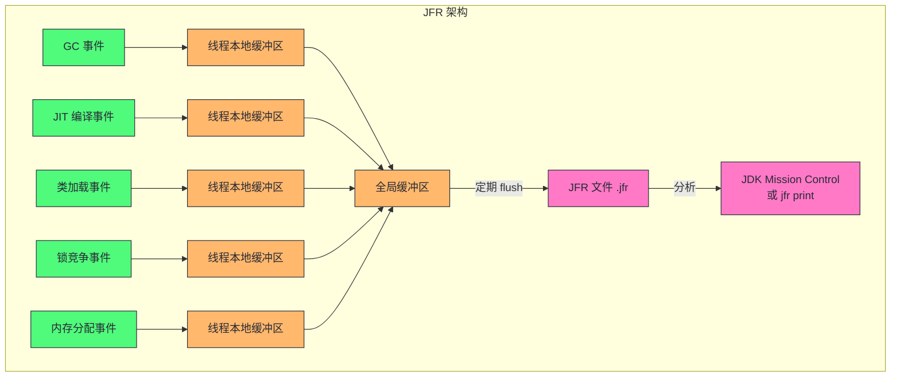
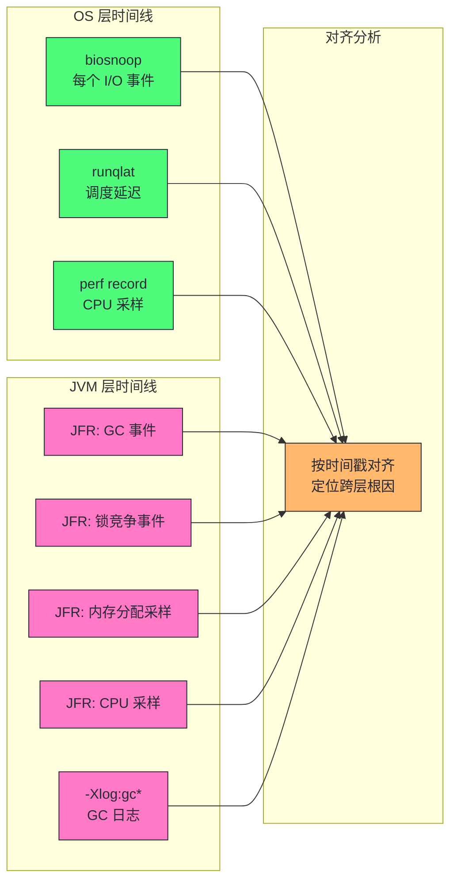

# 04 JVM 层性能观测：JFR、JMX 与 async-profiler

> [!abstract] 摘要
> 本文是可观测性工具栈的收官篇，从 OS 层切换到 JVM 运行时层。前三篇建立的 /proc、perf、eBPF 观测能力能看到 JVM 进程的 OS 级行为，但 JVM 堆内对象、JIT 编译代码、GC 内部状态、锁竞争细节是 OS 层工具看不到的——这些需要 JVM 原生观测工具。文章系统讲解 JFR（Java Flight Recorder）的事件模型与低开销原理、JMX MBean 的实时监控能力、async-profiler 的采样机制与火焰图生成、NMT（Native Memory Tracking）的堆外内存追踪。重点讲清楚三个认知要点：JFR 为什么能做到 < 1% 开销的持续采集、async-profiler 的 perf 事件采样如何绕过 JIT 代码无符号信息的难题、以及 JVM 观测工具与 OS 观测工具的互补关系如何构建全栈时间线。

---

## 第 1 章 为什么需要 JVM 原生观测工具

### 1.1 OS 层观测的盲区

前三篇建立的 OS 层观测能力，能回答以下问题：
- JVM 进程的 CPU 利用率多少？（perf、mpstat）
- JVM 进程在做多少磁盘 I/O？（iostat、biosnoop）
- JVM 进程的内存使用多少？（/proc/[pid]/status、free）
- JVM 线程的调度延迟多大？（runqlat、Ftrace wakeup）

但 OS 层观测有一个根本性的盲区：**它看不到 JVM 内部的语义**。OS 层看到的是"PID 12345 的某个线程在 CPU 上跑了 10ms"，但它不知道这 10ms 是在执行业务逻辑、在做 GC、还是在等锁。OS 层看到的是"JVM 进程申请了 32G 虚拟内存"，但它不知道这 32G 里堆占多少、元空间占多少、线程栈占多少、直接内存占多少。

这个盲区的根源是**JVM 的抽象层**。JVM 用字节码、堆、GC、JIT 编译等机制在应用代码和 OS 之间插入了一层抽象。这层抽象让 Java 获得了"一次编写到处运行"的便利，但也让 OS 层的观测工具失去了语义可见性——OS 看到的只是 JVM 进程的"外壳"，看不到"内脏"。

> [!info] 核心概念：语义鸿沟
> OS 层工具看到的是进程/线程/文件描述符/内存页等 OS 概念，JVM 内部看到的是对象/堆区域/JIT 代码/锁等 JVM 概念。两层之间的概念不直接对应——一个 OS 线程可能在不同时刻执行不同的 Java 方法，一个 Java 对象在内存中的布局由 JVM 决定而非 OS。这种不对应就是"语义鸿沟"，它是 JVM 性能分析比原生语言复杂的根本原因。要跨越语义鸿沟，必须用 JVM 自己提供的观测工具。

### 1.2 JVM 观测工具的全景图

JVM 生态有丰富的原生观测工具，它们按观测维度和能力层次可以分为以下几类：

| 类别 | 工具 | 观测维度 | 开销 | 生产可用 |
|------|------|---------|------|---------|
| 事件录制 | JFR | CPU/内存/GC/锁/类加载/线程 | < 1% | ✅ 持续采集 |
| 实时监控 | JMX | 堆/线程/类加载/GC/运行时 | < 0.1% | ✅ 持续 |
| 采样剖析 | async-profiler | CPU/堆分配/锁/系统调用 | 1-3% | ✅ 短期 |
| 采样剖析 | perf + libperf-jvmti | CPU | 1-3% | ✅ 短期 |
| 内存追踪 | NMT | 堆外内存按组件分类 | 首次采集有暂停 | ⚠️ 按需 |
| 堆分析 | jmap / jcmd GC.heap_dump | 堆对象直方图/全堆 | STW 暂停 | ❌ 仅低峰 |
| 线程分析 | jstack / jcmd Thread.print | 线程栈快照 | 短暂暂停 | ⚠️ 按需 |
| GC 日志 | -Xlog:gc* | GC 生命周期 | 极低 | ✅ 持续 |

本文聚焦前四类（JFR、JMX、async-profiler、NMT），它们覆盖了日常性能排查 90% 的需求。后三类（jmap、jstack、GC 日志）在第 10 篇 GC 工程化中会详细展开。

---

## 第 2 章 JFR：低开销持续采集的事件录制器

### 2.1 JFR 是什么：JVM 内置的黑匣子

JFR（Java Flight Recorder）是 HotSpot JVM 内置的事件录制系统，从 JDK 11 起完全开源（JDK 8 中曾为商业特性）。JFR 的设计目标极其明确：**以低于 1% 的开销持续采集 JVM 运行时事件，作为 JVM 的"黑匣子"始终运行**。

JFR 的核心设计哲学是"事件驱动 + 内核态聚合"——这与 eBPF 的设计理念不谋而合。JFR 不是像采样剖析器那样周期性"拍照"，而是在 JVM 内部的关键路径上预埋事件点（类似内核的 tracepoint），当事件发生时记录到线程本地缓冲区，定期 flush 到全局磁盘文件。由于事件点由 JVM 开发者预设并优化，且记录到线程本地缓冲区避免了竞争，JFR 的开销可以控制在 1% 以下。



### 2.2 JFR 的事件模型

JFR 的事件分为几个大类，每类覆盖一个观测维度：

| 事件类别 | 典型事件 | 性能分析用途 |
|---------|---------|------------|
| `jdk.GCPhasePause` | GC 停顿各阶段耗时 | GC 调优（第 10 篇） |
| `jdk.GarbageCollection` | GC 开始/结束、回收量 | GC 频率和效率 |
| `jdk.JavaMonitorEnter` | 锁获取等待时间 | 锁竞争分析（第 11 篇） |
| `jdk.ThreadPark` | 线程 park 等待时间 | 线程阻塞原因 |
| `jdk.ObjectAllocationSample` | 对象分配采样 | 内存分配热点 |
| `jdk.CompilerCompilation` | JIT 编译事件 | 预热分析（第 09 篇） |
| `jdk.ClassLoad` | 类加载事件 | 启动性能 |
| `jdk.ExecutionSample` | CPU 采样（线程栈） | CPU 热点定位 |
| `jdk.SocketRead/Write` | socket I/O 事件 | 网络 I/O 分析 |
| `jdk.FileRead/Write` | 文件 I/O 事件 | 磁盘 I/O 分析 |
| `jdk.CPULoad` | JVM 进程 CPU 负载 | CPU 趋势 |
| `jdk.JavaException` | 异常抛出 | 异常风暴检测 |

> [!note] 设计哲学：JFR 为什么开销低
> JFR 低开销的三个关键设计：
> 1. **线程本地缓冲区**：每个线程有自己的事件缓冲区，写入事件不需要加锁，避免了竞争开销。这与 eBPF 的 per-CPU map 思路一致。
> 2. **事件点预埋**：事件记录代码由 JVM 开发者精心编写，在编译时内联到 JVM 热路径中，没有动态插桩的额外开销（不像 kprobe 需要断点+恢复）。
> 3. **采样而非全量**：高频事件（如对象分配、CPU 采样）默认是采样的，不是每个事件都记录。`jdk.ObjectAllocationSample` 默认每 8MB 堆分配采样一次，`jdk.ExecutionSample` 默认 10ms 间隔采样。
> 这三个设计让 JFR 在"持续运行"和"低开销"之间取得了平衡——它不是"零开销"，而是"可接受的持续开销"。

### 2.3 JFR 的启动与配置

JFR 的典型使用方式：

```bash
# 方式一：启动时开启 JFR（推荐生产持续采集）
java -XX:StartFlightRecording=duration=60m,filename=/var/log/app.jfr,settings=profile -jar app.jar

# 方式二：运行中动态开启（jcmd）
jcmd <pid> JFR.start name=profiling duration=60s filename=/tmp/profiling.jfr settings=profile

# 方式三：运行中 dump 已采集的数据（JFR 一直在后台跑）
jcmd <pid> JFR.dump name=continuous filename=/tmp/dump.jfr

# 查看 JFR 录制内容
jfr print /tmp/profiling.jfr                    # 文本输出
jfr print --events jdk.GarbageCollection /tmp/profiling.jfr  # 只看 GC 事件
jfr summary /tmp/profiling.jfr                  # 事件统计摘要
```

JFR 的 `settings` 参数决定采集哪些事件：

| settings | 开销 | 采集范围 | 适用场景 |
|----------|------|---------|---------|
| default | < 1% | 核心事件（GC、类加载、CPU 负载等） | 生产持续采集 |
| profile | 1-3% | default + CPU 采样、内存分配采样、锁事件 | 性能排查窗口 |

> [!warning] 生产避坑：JFR settings=profile 不要长期运行
> `settings=profile` 开启了 CPU 采样和内存分配采样，开销在 1-3%。短期排查（10-60 分钟）完全安全，但长期 24x7 运行可能影响生产性能。生产环境推荐：日常用 `settings=default`（< 1% 开销）持续采集，排查时动态切换到 `settings=profile` 采集 10-30 分钟，排查完切回 default。JFR 支持同一 JVM 同时运行多个录制（每个录制有不同的 settings），不需要停止 default 录制。

### 2.4 JFR 与 OS 观测的对齐：全栈时间线

第 03 篇 7.0 节提到了 eBPF 与 JVM 统一日志的时间戳对齐。JFR 进一步提供了更丰富的 JVM 层事件时间线。一个完整的全栈排查时间线对齐方案：



两个层次的事件时间戳都基于同一个系统时钟（JFR 的事件有系统纳秒时间戳），可以精确对齐到毫秒级。当 OS 层看到"I/O 延迟 85ms"和 JVM 层看到"GC 停顿 80ms"在同一毫秒发生，因果关系的推断就有了时间证据。

### 2.5 JFR 事件类型深度：哪些事件值得定制采集

JFR 有数百种事件类型，默认 settings 只启用了一部分。在深度排查时，了解哪些事件值得定制启用很重要：

**高频排查事件（需要 settings=profile）**：

| 事件 | 默认采样策略 | 排查用途 |
|------|------------|---------|
| `jdk.ExecutionSample` | 每 10ms 一次 | CPU 热点（等价于 perf 采样） |
| `jdk.ObjectAllocationSample` | 每 8MB 堆分配一次 | 内存分配热点（不是全量） |
| `jdk.JavaMonitorEnter` | 全量 | 锁等待时间（每个 monitor enter） |
| `jdk.ThreadPark` | 全量 | 线程 park 原因（如 AQS 队列等待） |

**低频但高价值事件（default settings 已包含）**：

| 事件 | 触发条件 | 排查用途 |
|------|---------|---------|
| `jdk.GarbageCollection` | 每次 GC | GC 频率、时长、回收量 |
| `jdk.CompilerCompilation` | JIT 编译完成 | 预热期分析 |
| `jdk.ClassLoad` | 类加载 | 启动慢、Metaspace 泄露 |
| `jdk.ThreadStart/Stop` | 线程生命周期 | 线程泄漏 |
| `jdk.ExceptionStatistics` | 每秒统计 | 异常风暴 |

**需要手动启用的事件（不在 default 或 profile 中）**：

| 事件 | 启用方式 | 排查用途 |
|------|---------|---------|
| `jdk.SocketRead` | 自定义 settings | 网络 I/O 延迟 |
| `jdk.SocketWrite` | 自定义 settings | 网络写入延迟 |
| `jdk.FileRead` | 自定义 settings | 文件读延迟 |
| `jdk.FileWrite` | 自定义 settings | 文件写延迟 |
| `jdk.JavaException` | 自定义 settings | 精确异常路径 |

> [!note] 为什么 I/O 事件不在默认 settings 中
> `jdk.FileRead/Write` 和 `jdk.SocketRead/Write` 在 default 和 profile settings 中默认关闭，因为它们是高频全量事件——每次 I/O 操作都记录。一个高 I/O 的应用每秒可能产生数万次 I/O，全量记录的开销可能超过 1%。排查 I/O 问题时用自定义 settings 短期启用（10-30 秒），不要长期开启。启用方式：创建自定义 .jfc 文件或用 `jcmd <pid> JFR.start settings=profile+io` 等自定义组合。

---

## 第 3 章 JMX：实时运行时监控

### 3.1 JMX 是什么：MBean 管理 API

JMX（Java Management Extensions）是 Java 平台的标准管理和监控 API。它的核心概念是 MBean（Managed Bean）——一种暴露管理接口的 Java 对象，可以通过 JMX 协议远程查询和操作。

JMX 在性能分析中的角色是**实时监控**：它不记录历史事件（那是 JFR 的工作），而是提供当前时刻的 JVM 运行时状态快照。典型应用场景是接入监控平台（Prometheus + JMX Exporter、Datadog、Dynatrace 等），把 JVM 指标持续采集到时序数据库。

JMX 暴露的核心 MBean：

| MBean | 观测内容 | 关键属性 |
|-------|---------|---------|
| java.lang:type=Memory | 堆/非堆内存使用 | HeapMemoryUsage、NonHeapMemoryUsage |
| java.lang:type=GarbageCollector | GC 统计 | CollectionCount、CollectionTime |
| java.lang:type=Threading | 线程状态 | ThreadCount、DeadlockedThreads |
| java.lang:type=ClassLoading | 类加载 | LoadedClassCount、TotalLoadedClassCount |
| java.lang:type=OperatingSystem | OS 资源 | ProcessCpuLoad、SystemCpuLoad、FreePhysicalMemorySize |
| java.lang:type=Compilation | JIT 编译 | TotalCompilationTime |
| java.nio:type=BufferPool | 直接内存 | DirectBufferPool.count、memoryUsed |

### 3.2 JMX 的典型使用方式

```bash
# 方式一：命令行查看（jcmd）
jcmd <pid> PerfCounter.print | grep -E "gc|heap|thread"

# 方式二：jconsole / JMC GUI 远程连接
java -Dcom.sun.management.jmxremote.port=9010 -Dcom.sun.management.jmxremote.authenticate=false -jar app.jar

# 方式三：JMX Exporter + Prometheus 持续监控
java -javaagent:jmx_prometheus_javaagent.jar=9010:config.yml -jar app.jar
```

> [!info] JMX 与 JFR 的分工
> JMX 和 JFR 不是竞争关系，而是互补：
> - **JMX** 适合持续监控和告警：它给的是当前快照指标（"现在堆用了多少"），适合接入时序数据库做趋势图和阈值告警。
> - **JFR** 适合事后分析和深度排查：它给的是事件流（"3 分钟前发生了一次 Young GC，回收了 200MB"），适合定位具体事件的根因。
> 生产环境推荐两者同时使用：JMX 做日常监控和告警，JFR 做事后深度分析。一个典型流程是：JMX 告警触发 → 查看 JMX 趋势图确认异常 → dump JFR 录制 → 用 JMC 或 jfr print 分析事件。

### 3.3 JMX 的陷阱：MBean 读取的开销

JMX 虽然是"轻量"的，但有些 MBean 属性的读取开销不容忽视：

- **ThreadInfo 获取**：`getThreadInfo(long[] ids)` 需要获取每个目标线程的栈快照，涉及 safepoint，大量线程时开销显著。
- **DeadlockedThreads 检测**：`findDeadlockedThreads()` 需要遍历所有线程的锁图，开销与线程数 × 锁数成正比。
- **GC 直方图**：某些 GC 相关 MBean 的 `getAllGarbageCollectorNames` 等操作需要内部锁。

**生产环境用 JMX Exporter 采集时，务必控制采集频率**——15-30 秒一次是安全频率，1 秒一次的激进采集可能影响应用性能，尤其在数百线程的系统中。

### 3.4 JMX Exporter 配置实践

生产环境最常用的 JMX 接入方式是 Prometheus JMX Exporter。它把 MBean 属性转换为 Prometheus 指标，接入时序数据库。一个经过优化的 config.yml 应该：

- **白名单采集**：只采集需要的 MBean 属性，不要用默认的全量采集。全量采集在大 JVM 上可能暴露数百个指标，其中大部分无监控价值却增加采集开销。
- **避免高开销属性**：排除 `ThreadInfo`、`DeadlockedThreads`、`DumpOnTimeout` 等高开销属性。
- **降低采集频率**：Prometheus 的 scrape_interval 对 JMX Exporter 建议设为 30s，而不是默认的 15s。

一个最小化的 JMX Exporter 配置只采集堆、GC、线程核心指标：

```yaml
rules:
  - pattern: 'java.lang<type=Memory><>HeapMemoryUsage:used'
    name: jvm_heap_used
  - pattern: 'java.lang<type=Memory><>HeapMemoryUsage:committed'
    name: jvm_heap_committed
  - pattern: 'java.lang<type=GarbageCollector,name=.*><>CollectionCount'
    name: jvm_gc_count
    labels:
      collector: $1
  - pattern: 'java.lang<type=GarbageCollector,name=.*><>CollectionTime'
    name: jvm_gc_time_ms
    labels:
      collector: $1
  - pattern: 'java.lang<type=Threading><>ThreadCount'
    name: jvm_thread_count
  - pattern: 'java.lang<type=OperatingSystem><>ProcessCpuLoad'
    name: jvm_process_cpu_load
```

> [!info] JMX Exporter 的 javaagent 开销
> JMX Exporter 以 javaagent 方式挂载到 JVM 进程内。这种方式的采集开销由两部分组成：MBean 读取 + HTTP 响应生成。对于上述最小化配置（6 个指标），每次 scrape 的开销在毫秒级，30 秒间隔下对应用几乎无影响。但如果把 scrape_interval 设为 1 秒、配置 200+ 指标，每次 scrape 开销可能到 50-100ms，占 1 秒间隔的 5-10%，开始影响延迟敏感型应用。

---

## 第 4 章 async-profiler：采样剖析的瑞士军刀

### 4.1 async-profiler 是什么：基于 perf 事件的低开销剖析器

async-profiler 是由 Andrei Pangin 开发的开源 Java 剖析器，已经成为 JVM 性能分析的事实标准工具之一。它的核心设计是利用 Linux `perf_event_open` 系统调用在内核侧做事件采样，然后把采样地址映射回 Java 符号，生成火焰图。

async-profiler 与传统 Java 剖析器（如 VisualVM、YourKit）的本质区别在于**采样机制**：

| 维度 | 传统剖析器（JVMTI agent） | async-profiler |
|------|------------------------|----------------|
| 采样触发 | 定时器在 JVM 内部触发 | perf 硬件事件在内核触发 |
| 栈回溯 | JVMTI GetStackTrace（需 safepoint） | perf 原生栈回溯（无需 safepoint） |
| JIT 代码符号 | 需要 JVMTI | 通过 JVM 接口（AsyncGetCallTrace） |
| 开销 | 3-10%（safepoint 开销） | 1-3%（无 safepoint） |
| safepoint 偏差 | 有（只能在 safepoint 采样） | 无 |

> [!info] 核心概念：safepoint 偏差
> 传统 Java 剖析器依赖 JVMTI 的 `GetStackTrace` 获取线程栈，这个操作需要目标线程处于 safepoint（安全点）——即线程暂停在 JVM 认为"安全"的位置。问题是：JIT 编译器优化后的紧凑循环可能长时间不经过 safepoint，导致剖析器无法在这些循环中采样。结果是：**一个占 CPU 90% 的紧凑循环，在传统剖析器的火焰图里可能只显示 5% 的采样**——因为剖析器在循环执行期间根本采不到样。这就是"safepoint 偏差"。
> async-profiler 用 `AsyncGetCallTrace`（JVM 内部 API，不要求 safepoint）在任意位置获取 Java 栈，绕过了这个偏差。这是 async-profiler 比传统剖析器更准确的原因。

### 4.2 async-profiler 的事件类型

async-profiler 支持多种采样事件：

| 事件 | 参数 | 观测内容 | 典型用途 |
|------|------|---------|---------|
| CPU | `event=cpu` | CPU on-thread 采样 | CPU 热点定位 |
| Allocation | `event=alloc` | 对象分配采样 | 内存分配热点 |
| Lock | `event=lock` | 锁竞争等待 | 锁竞争分析 |
| Wall clock | `event=wall` | 挂钟时间采样（含等待） | 延迟分析 |
| Cache misses | `event=cache-misses` | L1/LLC 缓存未命中 | 微架构分析 |
| Instructions | `event=instructions` | 指令执行数 | IPC 计算 |
| Context switch | `event=cs` | 上下文切换 | 调度分析 |

```bash
# 基本 CPU 剖析
./async-profiler.sh -d 30 -e cpu -f /tmp/cpu.html <pid>

# 内存分配剖析
./async-profiler.sh -d 30 -e alloc -f /tmp/alloc.html <pid>

# 锁竞争剖析
./async-profiler.sh -d 30 -e lock -f /tmp/lock.html <pid>

# 多事件同时采样
./async-profiler.sh -d 30 -e cpu,alloc -f /tmp/multi.html <pid>
```

### 4.3 火焰图解读

async-profiler 默认输出火焰图（Flame Graph），这是 CPU 剖析结果的最佳可视化。火焰图的阅读规则与第 02 篇 perf 火焰图一致，但 async-profiler 的火焰图有几个 JVM 特有的元素：

- **Java 栈帧**：绿色，显示类名 + 方法名
- **JVM 内部栈帧**：黄色，显示 HotSpot 内部函数（如 `Compile::codegen`、`MarkSweep::invoke`）
- **内核栈帧**：橙色，显示内核函数（需要 `--safe-mode 15` 或 root 权限）
- **JIT 编译标记**：方法名旁标注 `[compiled]` 或 `[OSR]`

> [!warning] 生产避坑：wall clock 事件的解读陷阱
> `event=wall`（挂钟时间采样）会采样所有线程，包括处于等待/睡眠状态的线程。这在分析"延迟来自哪里"时很有用，但解读时要注意：**一个在 `Object.wait()` 上等待的线程，会在 wall 火焰图里显示 `Object.wait` 占大量时间，但这不代表 wait 本身有性能问题——它只是在等别人 notify**。wall 火焰图适合定位"线程在等什么"，但不适合判断"谁在烧 CPU"。判断 CPU 热点永远用 `event=cpu`。

---

## 第 5 章 NMT：堆外内存追踪

### 5.1 为什么需要 NMT

JVM 的内存使用远不止堆。一个 Java 应用的总内存占用包括：

| 内存区域 | 可见性 | 典型大小 |
|---------|--------|---------|
| Java Heap | JMX、JFR | -Xmx 指定 |
| Metaspace | JMX、JFR | 几十MB-几百MB |
| Thread Stack | JMX（线程数×栈大小） | 线程数 × 1MB |
| Code Cache | JMX | 几十MB-几百MB |
| Direct Memory | JMX BufferPool | -XX:MaxDirectMemorySize |
| JVM 自身 | 不可见（无标准 API） | 几十MB |
| Native 堆（malloc） | 不可见 | 取决于应用 |

当容器因 OOM 被 kill（`Exit Code 137`）但堆使用远未达到 -Xmx 时，问题大概率在堆外内存——Metaspace 泄露、直接内存泄漏、线程栈过多、Native 库内存泄漏。这些用 JMX 堆监控完全看不到，需要 NMT（Native Memory Tracking）。

### 5.2 NMT 的使用

```bash
# 启动时开启 NMT
java -XX:NativeMemoryTracking=summary -jar app.jar

# 查看内存摘要
jcmd <pid> VM.native_memory summary

# 查看内存详情（detail 模式）
jcmd <pid> VM.native_memory detail

# 建立基线，之后对比 diff
jcmd <pid> VM.native_memory baseline
# ... 运行一段时间后 ...
jcmd <pid> VM.native_memory diff
```

NMT summary 输出示例（关键部分）：

```
Total: reserved=56789MB, committed=32145MB
-                 Java Heap (reserved=32768MB, committed=32768MB)
-                     Class (reserved=1084MB, committed=45MB)  # Metaspace
-                    Thread (reserved=12345MB, committed=12345MB)  # 线程栈
-                      Code (reserved=245MB, committed=45MB)  # Code Cache
-                        GC (reserved=512MB, committed=512MB)  # GC 数据结构
-                  Internal (reserved=123MB, committed=123MB)  # JVM 内部
```

> [!warning] 生产避坑：NMT 的开销
> NMT 开启后会有 5-10% 的性能开销（用于追踪每次内存分配/释放）。不要在生产环境长期开启 NMT。正确用法是：怀疑堆外内存泄漏时临时开启，diff 后关闭。NMT 的 `baseline + diff` 模式是定位泄漏的标准手法——先建立基线，运行一段时间后 diff，看哪个区域增长了。

---

## 第 6 章 JVM 观测与 OS 观测的协同实战

### 6.1 回到支付服务案例：完整全栈排查

现在用前四篇的全部工具重新审视第 01 篇的支付服务延迟尖刺案例：

**第 1 步：OS 层 Counters（60 秒清单）**
- `iostat -xz 1`：await 从 2ms 飙到 80ms，%util 95%
- `vmstat 1`：b 列持续 > 0（D 状态进程在等 I/O）
- 定位：磁盘 I/O 是瓶颈

**第 2 步：OS 层 Tracing（eBPF）**
- `biosnoop`：大量 4KB 写入，部分延迟 85-92ms（fsync 特征）
- 定位：同步小写入是 I/O 慢的直接原因

**第 3 步：JVM 层 JFR**
- 查看故障窗口的 JFR 录制，过滤 `jdk.FileWrite` 事件
- 发现故障窗口内 FileWrite 事件量是正常时段的 50 倍
- 定位：JVM 在大量写文件

**第 4 步：JVM 层 JMX / async-profiler**
- 如果 JFR 没有持续录制，用 async-profiler 做 wall clock 剖析
- 火焰图显示大量时间在 `java.io.FileOutputStream.writeBytes` → `write` 系统调用
- 栈上有日志框架的调用链：`Logger.debug` → `PatternLayout.format` → `FileOutputStream.write`

**第 5 步：应用层确认**
- 查日志配置，发现凌晨 3:00 的 cron 开启了 DEBUG 级别
- 根因闭合：DEBUG 日志 → 大量同步小写入 → fsync 延迟 → I/O 瓶颈 → GC 压力 → 延迟尖刺

这个案例展示了一个完整的多层协同排查链：OS Counters 定位瓶颈资源 → OS Tracing 定位 I/O 模式 → JVM JFR 定位 JVM 事件 → async-profiler 定位代码栈 → 应用层确认配置。每一步都在前一步的基础上缩小范围，直到根因。

### 6.2 工具选型决策矩阵

综合前四篇的 OS 层工具和本文的 JVM 层工具，给出完整的选型矩阵：

| 问题 | OS 层工具 | JVM 层工具 | 协同方式 |
|------|----------|----------|---------|
| CPU 高 | perf record + 火焰图 | async-profiler -e cpu | OS 看内核态占比，JVM 看 Java 栈 |
| CPU 不高但延迟高 | runqlat、offcputime | async-profiler -e wall、JFR 锁事件 | OS 看调度延迟，JVM 看等待原因 |
| GC 停顿长 | biosnoop（I/O 是否影响 GC） | JFR GC 事件、-Xlog:gc* | OS 看 GC 期间的 I/O，JVM 看 GC 内部 |
| 内存 OOM | free、/proc | NMT、jmap | OS 看进程总内存，NMT 看堆外分布 |
| 锁竞争 | offcputime + kstack | JFR jdk.JavaMonitorEnter、async-profiler -e lock | OS 看阻塞时间，JVM 看锁对象 |
| I/O 慢 | iostat、biosnoop | JFR jdk.FileRead/Write | OS 看 I/O 延迟，JVM 看哪个文件 |
| 网络慢 | sar -n、tcpretrans | JFR jdk.SocketRead/Write | OS 看重传，JVM 看 socket 操作 |

---

## 第 7 章 本章工具速查

### 7.1 JFR 常用命令

| 命令 | 用途 |
|------|------|
| `java -XX:StartFlightRecording=settings=default -jar app.jar` | 启动时持续录制 |
| `jcmd <pid> JFR.start duration=60s settings=profile filename=/tmp/p.jfr` | 运行中开始排查录制 |
| `jcmd <pid> JFR.dump name=<name> filename=/tmp/dump.jfr` | dump 录制 |
| `jcmd <pid> JFR.stop name=<name>` | 停止录制 |
| `jfr print /tmp/p.jfr` | 文本查看 |
| `jfr print --events jdk.GarbageCollection /tmp/p.jfr` | 只看 GC 事件 |
| `jfr summary /tmp/p.jfr` | 事件统计 |

### 7.2 async-profiler 常用命令

| 命令 | 用途 |
|------|------|
| `./asprof -d 30 -e cpu -f /tmp/cpu.html <pid>` | CPU 剖析 30 秒 |
| `./asprof -d 30 -e alloc -f /tmp/alloc.html <pid>` | 内存分配剖析 |
| `./asprof -d 30 -e lock -f /tmp/lock.html <pid>` | 锁竞争剖析 |
| `./asprof -d 30 -e wall -f /tmp/wall.html <pid>` | 挂钟时间剖析 |
| `./asprof -d 30 -e cpu,alloc -f /tmp/multi.html <pid>` | 多事件同时采样 |

### 7.3 NMT 常用命令

| 命令 | 用途 |
|------|------|
| `-XX:NativeMemoryTracking=summary` | 启动时开启 NMT |
| `jcmd <pid> VM.native_memory summary` | 查看内存摘要 |
| `jcmd <pid> VM.native_memory detail` | 查看内存详情 |
| `jcmd <pid> VM.native_memory baseline` | 建立基线 |
| `jcmd <pid> VM.native_memory diff` | 对比基线，定位增长区域 |

---

> [!quote] 专栏下一站
> 可观测性工具栈（第 02-04 篇）至此完成。从下一篇开始进入专栏第三部分——核心资源深度解析。第 05 篇《CPU：运行队列、调度器与 CPU 缓存的性能博弈》将把前四篇的工具落地到 CPU 这一最核心的资源维度，从 CPU 微架构到 Linux 调度器再到 Java 线程模型，逐层拆解 CPU 性能的完整分析链路。
