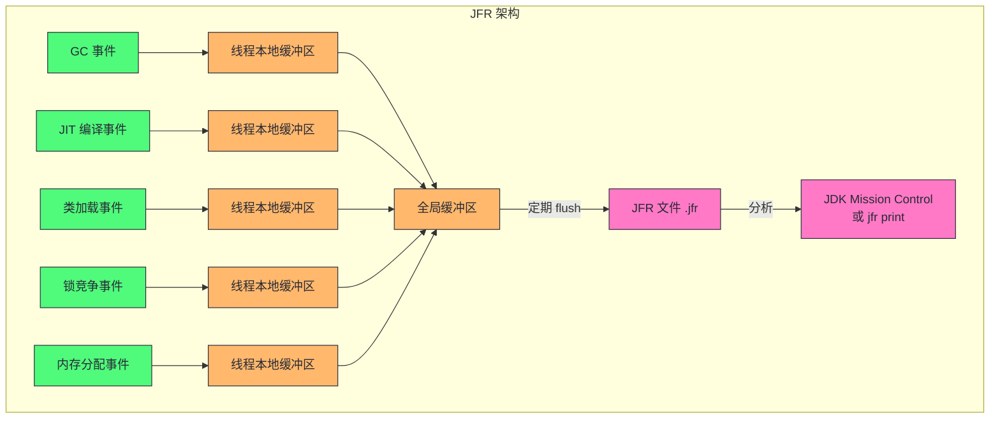
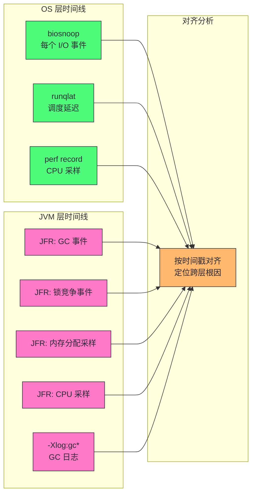

# 04 JVM 层性能观测：JFR、JMX 与 async-profiler

> [!abstract] 摘要
> 本文是可观测性工具栈的收官篇，从 OS 层切换到 JVM 运行时层。前三篇建立的 /proc、perf、eBPF 观测能力能看到 JVM 进程的 OS 级行为，但 JVM 堆内对象、JIT 编译代码、GC 内部状态、锁竞争细节是 OS 层工具看不到的——这些需要 JVM 原生观测工具。文章系统讲解 JFR（Java Flight Recorder）的事件模型与低开销原理、JMX MBean 的实时监控能力、async-profiler 的采样机制与火焰图生成、NMT（Native Memory Tracking）的堆外内存追踪。重点讲清楚三个认知要点：JFR 为什么能做到 < 1% 开销的持续采集、async-profiler 的 perf 事件采样如何绕过 JIT 代码无符号信息的难题、以及 JVM 观测工具与 OS 观测工具的互补关系如何构建全栈时间线。

---

## 第 1 章 为什么需要 JVM 原生观测工具

### 1.1 OS 层观测的盲区

前三篇建立的 OS 层观测能力，能回答以下问题：
- JVM 进程的 CPU 利用率多少？（perf、mpstat）
- JVM 进程在做多少磁盘 I/O？（iostat、biosnoop）
- JVM 进程的内存使用多少？（/proc/[pid]/status、free）
- JVM 线程的调度延迟多大？（runqlat、Ftrace wakeup）

但 OS 层观测有一个根本性的盲区：**它看不到 JVM 内部的语义**。OS 层看到的是"PID 12345 的某个线程在 CPU 上跑了 10ms"，但它不知道这 10ms 是在执行业务逻辑、在做 GC、还是在等锁。OS 层看到的是"JVM 进程申请了 32G 虚拟内存"，但它不知道这 32G 里堆占多少、元空间占多少、线程栈占多少、直接内存占多少。

这个盲区的根源是**JVM 的抽象层**。JVM 用字节码、堆、GC、JIT 编译等机制在应用代码和 OS 之间插入了一层抽象。这层抽象让 Java 获得了"一次编写到处运行"的便利，但也让 OS 层的观测工具失去了语义可见性——OS 看到的只是 JVM 进程的"外壳"，看不到"内脏"。

> [!info] 核心概念：语义鸿沟
> OS 层工具看到的是进程/线程/文件描述符/内存页等 OS 概念，JVM 内部看到的是对象/堆区域/JIT 代码/锁等 JVM 概念。两层之间的概念不直接对应——一个 OS 线程可能在不同时刻执行不同的 Java 方法，一个 Java 对象在内存中的布局由 JVM 决定而非 OS。这种不对应就是"语义鸿沟"，它是 JVM 性能分析比原生语言复杂的根本原因。要跨越语义鸿沟，必须用 JVM 自己提供的观测工具。

语义鸿沟在日常排查中表现为三类"翻译错误"，每一类都对应一种 JVM 原生观测工具：

**翻译错误一：把"线程忙"翻译成"业务忙"。** OS 层看到 JVM 进程的一个线程 100% CPU，但不知道这个线程是 GC 线程、JIT 编译线程还是业务线程。GC 线程烧 CPU 时，业务线程实际可用资源在缩水——用 `jcmd Thread.print` 或 JFR 的线程事件给 OS 线程打上 JVM 语义标签，才能正确归因。

**翻译错误二：把"内存涨"翻译成"堆泄漏"。** RSS 增长可能来自堆、Metaspace、线程栈、Direct Memory、Code Cache 中的任何一个。只看堆监控会漏掉 80% 的内存问题——第 9 章的案例会完整演示这一点。

**翻译错误三：把"暂停"翻译成"GC 停顿"。** JVM 的全局暂停不止 GC——safepoint 等待（偏向锁撤销、jstack、去优化）同样暂停所有线程，且不出现在 GC 日志里。把所有暂停都归因于 GC，会导致 GC 调优方向完全错误。

这三类错误的共同根源是：**OS 观测给出的是"症状"，JVM 观测给出的是"语义"，两者必须配对使用才能归因**。本章的四个工具（JFR、JMX、async-profiler、NMT）就是语义层的观测装备。

### 1.2 JVM 观测工具的全景图

JVM 生态有丰富的原生观测工具，它们按观测维度和能力层次可以分为以下几类：

| 类别 | 工具 | 观测维度 | 开销 | 生产可用 |
|------|------|---------|------|---------|
| 事件录制 | JFR | CPU/内存/GC/锁/类加载/线程 | < 1% | ✅ 持续采集 |
| 实时监控 | JMX | 堆/线程/类加载/GC/运行时 | < 0.1% | ✅ 持续 |
| 采样剖析 | async-profiler | CPU/堆分配/锁/系统调用 | 1-3% | ✅ 短期 |
| 采样剖析 | perf + libperf-jvmti | CPU | 1-3% | ✅ 短期 |
| 内存追踪 | NMT | 堆外内存按组件分类 | 首次采集有暂停 | ⚠️ 按需 |
| 堆分析 | jmap / jcmd GC.heap_dump | 堆对象直方图/全堆 | STW 暂停 | ❌ 仅低峰 |
| 线程分析 | jstack / jcmd Thread.print | 线程栈快照 | 短暂暂停 | ⚠️ 按需 |
| GC 日志 | -Xlog:gc* | GC 生命周期 | 极低 | ✅ 持续 |

本文聚焦前四类（JFR、JMX、async-profiler、NMT），它们覆盖了日常性能排查 90% 的需求。后三类（jmap、jstack、GC 日志）在第 10 篇 GC 工程化中会详细展开。

---

## 第 2 章 JFR：低开销持续采集的事件录制器

### 2.1 JFR 是什么：JVM 内置的黑匣子

JFR（Java Flight Recorder）是 HotSpot JVM 内置的事件录制系统，从 JDK 11 起完全开源（JDK 8 中曾为商业特性）。JFR 的设计目标极其明确：**以低于 1% 的开销持续采集 JVM 运行时事件，作为 JVM 的"黑匣子"始终运行**。

JFR 的核心设计哲学是"事件驱动 + 内核态聚合"——这与 eBPF 的设计理念不谋而合。JFR 不是像采样剖析器那样周期性"拍照"，而是在 JVM 内部的关键路径上预埋事件点（类似内核的 tracepoint），当事件发生时记录到线程本地缓冲区，定期 flush 到全局磁盘文件。由于事件点由 JVM 开发者预设并优化，且记录到线程本地缓冲区避免了竞争，JFR 的开销可以控制在 1% 以下。



### 2.2 JFR 的事件模型

JFR 的事件分为几个大类，每类覆盖一个观测维度：

| 事件类别 | 典型事件 | 性能分析用途 |
|---------|---------|------------|
| `jdk.GCPhasePause` | GC 停顿各阶段耗时 | GC 调优（第 10 篇） |
| `jdk.GarbageCollection` | GC 开始/结束、回收量 | GC 频率和效率 |
| `jdk.JavaMonitorEnter` | 锁获取等待时间 | 锁竞争分析（第 11 篇） |
| `jdk.ThreadPark` | 线程 park 等待时间 | 线程阻塞原因 |
| `jdk.ObjectAllocationSample` | 对象分配采样 | 内存分配热点 |
| `jdk.CompilerCompilation` | JIT 编译事件 | 预热分析（第 09 篇） |
| `jdk.ClassLoad` | 类加载事件 | 启动性能 |
| `jdk.ExecutionSample` | CPU 采样（线程栈） | CPU 热点定位 |
| `jdk.SocketRead/Write` | socket I/O 事件 | 网络 I/O 分析 |
| `jdk.FileRead/Write` | 文件 I/O 事件 | 磁盘 I/O 分析 |
| `jdk.CPULoad` | JVM 进程 CPU 负载 | CPU 趋势 |
| `jdk.JavaException` | 异常抛出 | 异常风暴检测 |

> [!note] 设计哲学：JFR 为什么开销低
> JFR 低开销的三个关键设计：
> 1. **线程本地缓冲区**：每个线程有自己的事件缓冲区，写入事件不需要加锁，避免了竞争开销。这与 eBPF 的 per-CPU map 思路一致。
> 2. **事件点预埋**：事件记录代码由 JVM 开发者精心编写，在编译时内联到 JVM 热路径中，没有动态插桩的额外开销（不像 kprobe 需要断点+恢复）。
> 3. **采样而非全量**：高频事件（如对象分配、CPU 采样）默认是采样的，不是每个事件都记录。`jdk.ObjectAllocationSample` 默认每 8MB 堆分配采样一次，`jdk.ExecutionSample` 默认 10ms 间隔采样。
> 这三个设计让 JFR 在"持续运行"和"低开销"之间取得了平衡——它不是"零开销"，而是"可接受的持续开销"。

### 2.3 JFR 的启动与配置

JFR 的典型使用方式：

```bash
# 方式一：启动时开启 JFR（推荐生产持续采集）
java -XX:StartFlightRecording=duration=60m,filename=/var/log/app.jfr,settings=profile -jar app.jar

# 方式二：运行中动态开启（jcmd）
jcmd <pid> JFR.start name=profiling duration=60s filename=/tmp/profiling.jfr settings=profile

# 方式三：运行中 dump 已采集的数据（JFR 一直在后台跑）
jcmd <pid> JFR.dump name=continuous filename=/tmp/dump.jfr

# 查看 JFR 录制内容
jfr print /tmp/profiling.jfr                    # 文本输出
jfr print --events jdk.GarbageCollection /tmp/profiling.jfr  # 只看 GC 事件
jfr summary /tmp/profiling.jfr                  # 事件统计摘要
```

JFR 的 `settings` 参数决定采集哪些事件：

| settings | 开销 | 采集范围 | 适用场景 |
|----------|------|---------|---------|
| default | < 1% | 核心事件（GC、类加载、CPU 负载等） | 生产持续采集 |
| profile | 1-3% | default + CPU 采样、内存分配采样、锁事件 | 性能排查窗口 |

> [!warning] 生产避坑：JFR settings=profile 不要长期运行
> `settings=profile` 开启了 CPU 采样和内存分配采样，开销在 1-3%。短期排查（10-60 分钟）完全安全，但长期 24x7 运行可能影响生产性能。生产环境推荐：日常用 `settings=default`（< 1% 开销）持续采集，排查时动态切换到 `settings=profile` 采集 10-30 分钟，排查完切回 default。JFR 支持同一 JVM 同时运行多个录制（每个录制有不同的 settings），不需要停止 default 录制。

### 2.4 JFR 与 OS 观测的对齐：全栈时间线

第 03 篇 7.0 节提到了 eBPF 与 JVM 统一日志的时间戳对齐。JFR 进一步提供了更丰富的 JVM 层事件时间线。一个完整的全栈排查时间线对齐方案：



两个层次的事件时间戳都基于同一个系统时钟（JFR 的事件有系统纳秒时间戳），可以精确对齐到毫秒级。当 OS 层看到"I/O 延迟 85ms"和 JVM 层看到"GC 停顿 80ms"在同一毫秒发生，因果关系的推断就有了时间证据。

### 2.5 JFR 事件类型深度：哪些事件值得定制采集

JFR 有数百种事件类型，默认 settings 只启用了一部分。在深度排查时，了解哪些事件值得定制启用很重要：

**高频排查事件（需要 settings=profile）**：

| 事件 | 默认采样策略 | 排查用途 |
|------|------------|---------|
| `jdk.ExecutionSample` | 每 10ms 一次 | CPU 热点（等价于 perf 采样） |
| `jdk.ObjectAllocationSample` | 每 8MB 堆分配一次 | 内存分配热点（不是全量） |
| `jdk.JavaMonitorEnter` | 全量 | 锁等待时间（每个 monitor enter） |
| `jdk.ThreadPark` | 全量 | 线程 park 原因（如 AQS 队列等待） |

**低频但高价值事件（default settings 已包含）**：

| 事件 | 触发条件 | 排查用途 |
|------|---------|---------|
| `jdk.GarbageCollection` | 每次 GC | GC 频率、时长、回收量 |
| `jdk.CompilerCompilation` | JIT 编译完成 | 预热期分析 |
| `jdk.ClassLoad` | 类加载 | 启动慢、Metaspace 泄露 |
| `jdk.ThreadStart/Stop` | 线程生命周期 | 线程泄漏 |
| `jdk.ExceptionStatistics` | 每秒统计 | 异常风暴 |

**需要手动启用的事件（不在 default 或 profile 中）**：

| 事件 | 启用方式 | 排查用途 |
|------|---------|---------|
| `jdk.SocketRead` | 自定义 settings | 网络 I/O 延迟 |
| `jdk.SocketWrite` | 自定义 settings | 网络写入延迟 |
| `jdk.FileRead` | 自定义 settings | 文件读延迟 |
| `jdk.FileWrite` | 自定义 settings | 文件写延迟 |
| `jdk.JavaException` | 自定义 settings | 精确异常路径 |

> [!note] 为什么 I/O 事件不在默认 settings 中
> `jdk.FileRead/Write` 和 `jdk.SocketRead/Write` 在 default 和 profile settings 中默认关闭，因为它们是高频全量事件——每次 I/O 操作都记录。一个高 I/O 的应用每秒可能产生数万次 I/O，全量记录的开销可能超过 1%。排查 I/O 问题时用自定义 settings 短期启用（10-30 秒），不要长期开启。启用方式：创建自定义 .jfc 文件或用 `jcmd <pid> JFR.start settings=profile+io` 等自定义组合。

### 2.6 JFR 的标准排查工作流

工具的价值在于工作流。生产环境使用 JFR 排查时，一个经过验证的标准流程如下：

**第一步：确认持续录制在跑。** 生产 JVM 应该始终有一个 `settings=default` 的持续录制（启动参数或运维脚本保证）。如果没有，先动态开启一个——`jcmd <pid> JFR.start name=quick duration=10m settings=profile filename=/tmp/quick.jfr`。这一步的纪律是：**录制要赶在问题现场消失之前**，JFR 的录制是环形缓冲，持续录制意味着"过去 N 分钟的数据永远可查"。

**第零步（前置纪律）：录制配置本身要经过演练。** 一个容易被忽视的坑：`maxsize` 没设置时，长时间录制可能写满磁盘；`dumponexit=true` 没开时，进程崩溃会带走全部录制数据——而崩溃场景恰恰是最需要黑匣子的时刻。生产录制配置上线前，先在测试环境演练"崩溃后能否拿到 dump"，否则黑匣子会在最需要它的时候失灵。

**第二步：按问题类型过滤事件。** 拿到 .jfr 文件后，不要从头翻，直接按假设过滤：

| 假设 | 过滤的事件 | 看什么 |
|------|-----------|--------|
| GC 压力 | jdk.GarbageCollection、jdk.GCPhasePause | 停顿分布、回收量、频率 |
| 锁竞争 | jdk.JavaMonitorEnter、jdk.ThreadPark | 等待时长 Top、竞争的 monitor 地址 |
| CPU 热点 | jdk.ExecutionSample | 方法级采样占比 |
| 分配热点 | jdk.ObjectAllocationSample | 分配类型与调用栈 |
| I/O 问题 | jdk.FileRead/Write、jdk.SocketRead/Write | 慢 I/O 的目标与耗时 |
| 启动慢 | jdk.ClassLoad、jdk.CompilerCompilation | 类加载数量、编译耗时 |

**第三步：用 jfr 命令行做快速验证。** JDK 自带的 `jfr` 工具无需 GUI，适合在服务器上直接操作：

```bash
# 查看录制概要：事件数量、时间范围
jfr summary /tmp/quick.jfr

# 提取 GC 事件
jfr print --events jdk.GarbageCollection /tmp/quick.jfr

# 提取锁等待超过 10ms 的事件
jfr print --events jdk.JavaMonitorEnter --json /tmp/quick.jfr | jq '...'

# 聚合 CPU 采样（配合第三方可视化）
jfr view hot-methods /tmp/quick.jfr     # JDK 21+ 内置视图
jfr view gc /tmp/quick.jfr
```

JDK 21 的 `jfr view` 子命令值得专门一提——它内置了十几个常用视图（hot-methods、gc、lock、allocation、environment 等），把过去需要 JMC 图形界面才能完成的初步分析搬到了命令行。对于只能 SSH 到生产机的工程师，这是 JFR 可用性的一个实质跃升。

**第四步：需要深度可视化时用 JMC。** JDK Mission Control 把事件渲染为时间线、火焰图、直方图。它的价值场景是"多事件交叉分析"——譬如把 GC 停顿时间线与 CPU 采样时间线叠加，观察"停顿期间线程都在做什么"。日常排查中，命令行过滤能解决 80% 的问题，JMC 用于剩下 20% 的复杂归因。

> [!info] 核心概念：JFR 的"黑匣子"哲学与飞行记录的类比
> JFR 的名字来自飞机的黑匣子（Flight Recorder），这个类比精确概括了它的设计哲学：**平时持续记录、出事后回放分析**。传统剖析工具是"事故后赶现场"模式——等你连上剖析器，问题现场往往已经消失；JFR 是"全程录像"模式——任何时刻都能回放过去几分钟的完整事件流。这个模式转变对偶发问题的排查价值是决定性的：一个每天出现 3 次、每次 200ms 的尖刺，用传统剖析器几乎不可能抓到，而 JFR 的持续录制让它变成"回放一下就有答案"。这也是为什么"生产环境常开 default 录制"应该是所有 Java 服务的默认配置——它的开销（<1%）远低于"问题发生时没有数据"的代价。

### 2.7 自定义事件：把业务语义写进黑匣子

JFR 的默认事件覆盖 JVM 内部，但性能问题的"最后一公里"往往在业务语义——"这次请求处理了多久""这个批处理扫了多少数据"。JFR 支持自定义事件（jdk.jfr.Event），让业务代码把自己的性能语义写进同一条事件流：

```java
@Name("com.example.OrderProcessing")
@Label("订单处理")
@Category("Business")
public class OrderProcessingEvent extends jdk.jfr.Event {
    @Label("订单 ID")
    String orderId;

    @Label("订单金额档位")
    String amountTier;   // 用于维度分析：小额/大额订单的耗时差异
}

// 业务代码中埋点
OrderProcessingEvent event = new OrderProcessingEvent();
event.orderId = order.getId();
event.amountTier = order.getAmount() > 10000 ? "LARGE" : "NORMAL";
event.begin();
try {
    processOrder(order);   // 被测量的业务逻辑
} finally {
    event.end();
    if (event.shouldCommit()) {
        event.commit();    // 超过阈值才真正写入（可配置阈值）
    }
}
```

自定义事件的价值在于**把 OS 层事件与业务请求关联起来**。回放黑匣子时，你可以问"这次 300ms 的慢请求，JVM 层发生了什么"——把 jdk.ExecutionSample、jdk.GCPhasePause 与自定义的 OrderProcessingEvent 按时间对齐，慢请求的归因链就完整了。没有业务事件时，你只能从 JVM 事件反推"可能有请求变慢了"，有了业务事件，你可以从慢请求正向下钻。埋点成本用 `shouldCommit()` 控制在阈值以下，未达阈值的事件直接丢弃，开销可忽略。

自定义事件的纪律：**埋点在关键路径的边界，不在循环内部**。每个请求一个事件（边界埋点）开销可忽略；循环体内每个元素一个事件（譬如每个订单项一个事件）会让事件量爆炸，JFR 的缓冲区会被打满，反而丢掉关键事件。需要细粒度时用 `enabled=false` + 阈值控制（`@Threshold`），只在超阈值时提交。

---

## 第 3 章 JMX：实时运行时监控

### 3.1 JMX 是什么：MBean 管理 API

JMX（Java Management Extensions）是 Java 平台的标准管理和监控 API。它的核心概念是 MBean（Managed Bean）——一种暴露管理接口的 Java 对象，可以通过 JMX 协议远程查询和操作。

JMX 在性能分析中的角色是**实时监控**：它不记录历史事件（那是 JFR 的工作），而是提供当前时刻的 JVM 运行时状态快照。典型应用场景是接入监控平台（Prometheus + JMX Exporter、Datadog、Dynatrace 等），把 JVM 指标持续采集到时序数据库。

JMX 暴露的核心 MBean：

| MBean | 观测内容 | 关键属性 |
|-------|---------|---------|
| java.lang:type=Memory | 堆/非堆内存使用 | HeapMemoryUsage、NonHeapMemoryUsage |
| java.lang:type=GarbageCollector | GC 统计 | CollectionCount、CollectionTime |
| java.lang:type=Threading | 线程状态 | ThreadCount、DeadlockedThreads |
| java.lang:type=ClassLoading | 类加载 | LoadedClassCount、TotalLoadedClassCount |
| java.lang:type=OperatingSystem | OS 资源 | ProcessCpuLoad、SystemCpuLoad、FreePhysicalMemorySize |
| java.lang:type=Compilation | JIT 编译 | TotalCompilationTime |
| java.nio:type=BufferPool | 直接内存 | DirectBufferPool.count、memoryUsed |

### 3.2 JMX 的典型使用方式

```bash
# 方式一：命令行查看（jcmd）
jcmd <pid> PerfCounter.print | grep -E "gc|heap|thread"

# 方式二：jconsole / JMC GUI 远程连接
java -Dcom.sun.management.jmxremote.port=9010 -Dcom.sun.management.jmxremote.authenticate=false -jar app.jar

# 方式三：JMX Exporter + Prometheus 持续监控
java -javaagent:jmx_prometheus_javaagent.jar=9010:config.yml -jar app.jar
```

> [!info] JMX 与 JFR 的分工
> JMX 和 JFR 不是竞争关系，而是互补：
> - **JMX** 适合持续监控和告警：它给的是当前快照指标（"现在堆用了多少"），适合接入时序数据库做趋势图和阈值告警。
> - **JFR** 适合事后分析和深度排查：它给的是事件流（"3 分钟前发生了一次 Young GC，回收了 200MB"），适合定位具体事件的根因。
> 生产环境推荐两者同时使用：JMX 做日常监控和告警，JFR 做事后深度分析。一个典型流程是：JMX 告警触发 → 查看 JMX 趋势图确认异常 → dump JFR 录制 → 用 JMC 或 jfr print 分析事件。

### 3.3 JMX 的陷阱：MBean 读取的开销

JMX 虽然是"轻量"的，但有些 MBean 属性的读取开销不容忽视：

- **ThreadInfo 获取**：`getThreadInfo(long[] ids)` 需要获取每个目标线程的栈快照，涉及 safepoint，大量线程时开销显著。
- **DeadlockedThreads 检测**：`findDeadlockedThreads()` 需要遍历所有线程的锁图，开销与线程数 × 锁数成正比。
- **GC 直方图**：某些 GC 相关 MBean 的 `getAllGarbageCollectorNames` 等操作需要内部锁。

**生产环境用 JMX Exporter 采集时，务必控制采集频率**——15-30 秒一次是安全频率，1 秒一次的激进采集可能影响应用性能，尤其在数百线程的系统中。

### 3.4 核心指标的正确解读

拿到 JMX 指标只是第一步，正确解读才是价值所在。四个最容易误读的指标：

**堆使用率（HeapMemoryUsage.used）要看"GC 后基线"。** 单看 used 的绝对值没有意义——高水位可能只是"还没到 GC 时机"。正确的解读方式是看**每次 Full GC（或 Mixed GC）完成后的 used 水位**：如果这个"GC 后基线"持续抬升，说明有对象晋升后无法回收——泄漏信号；如果基线稳定，高水位只是正常的分配波动。Prometheus 里用 `max_over_time(jvm_gc_live_data_size_bytes)` 类似的思路跟踪"存活数据量"。

**GC 时间占比（CollectionTime / uptime）是吞吐指标。** 这个比值超过 10% 意味着应用十分之一的时间在做 GC——吞吐严重受损；超过 20% 通常意味着分配速率与堆容量严重失配。它比"GC 频率"更能反映 GC 对业务的实际影响——频繁但极短的 Young GC（每次 5ms）总占比可能只有 3%，比"低频但 500ms 的 Full GC"健康得多。

**线程数（ThreadCount）要区分"高"与"增长"。** 线程数高（譬如 500）但稳定，可能只是应用的正常并发模型；线程数持续增长不回落，才是线程泄漏。判断标准是趋势而非绝对值——把线程数的时间序列拉出来看斜率。

**ProcessCpuLoad 与 OS 层 CPU 的差异。** JMX 的 ProcessCpuLoad 是 JVM 进程自身的 CPU 占比，OS 层的 CPU 利用率是全机的。容器环境中两者可能严重背离：宿主机 CPU 90%（邻居挤占），但 JVM 进程只有 20%——JVM 看起来"很闲"却延迟飙升，因为 cgroup 配额或 steal time 在作祟（第 05 篇 cgroup 限流、第 13 篇 steal time 会展开）。解读规则：**JVM 指标回答"JVM 内部怎么样"，OS 指标回答"JVM 的运行环境怎么样"，两者背离本身就是重要信号**。

### 3.5 JMX Exporter 配置实践

生产环境最常用的 JMX 接入方式是 Prometheus JMX Exporter。它把 MBean 属性转换为 Prometheus 指标，接入时序数据库。一个经过优化的 config.yml 应该：

- **白名单采集**：只采集需要的 MBean 属性，不要用默认的全量采集。全量采集在大 JVM 上可能暴露数百个指标，其中大部分无监控价值却增加采集开销。
- **避免高开销属性**：排除 `ThreadInfo`、`DeadlockedThreads`、`DumpOnTimeout` 等高开销属性。
- **降低采集频率**：Prometheus 的 scrape_interval 对 JMX Exporter 建议设为 30s，而不是默认的 15s。

一个最小化的 JMX Exporter 配置只采集堆、GC、线程核心指标：

```yaml
rules:
  - pattern: 'java.lang<type=Memory><>HeapMemoryUsage:used'
    name: jvm_heap_used
  - pattern: 'java.lang<type=Memory><>HeapMemoryUsage:committed'
    name: jvm_heap_committed
  - pattern: 'java.lang<type=GarbageCollector,name=.*><>CollectionCount'
    name: jvm_gc_count
    labels:
      collector: $1
  - pattern: 'java.lang<type=GarbageCollector,name=.*><>CollectionTime'
    name: jvm_gc_time_ms
    labels:
      collector: $1
  - pattern: 'java.lang<type=Threading><>ThreadCount'
    name: jvm_thread_count
  - pattern: 'java.lang<type=OperatingSystem><>ProcessCpuLoad'
    name: jvm_process_cpu_load
```

> [!info] JMX Exporter 的 javaagent 开销
> JMX Exporter 以 javaagent 方式挂载到 JVM 进程内。这种方式的采集开销由两部分组成：MBean 读取 + HTTP 响应生成。对于上述最小化配置（6 个指标），每次 scrape 的开销在毫秒级，30 秒间隔下对应用几乎无影响。但如果把 scrape_interval 设为 1 秒、配置 200+ 指标，每次 scrape 开销可能到 50-100ms，占 1 秒间隔的 5-10%，开始影响延迟敏感型应用。

### 3.5 jcmd：被低估的"瑞士军刀"

讨论 JVM 观测时，`jcmd` 值得单独一节。它是 JDK 7 引入的统一诊断命令入口，把过去分散在 jmap、jstack、jinfo 中的能力整合到一个命令下，而且是后续新增诊断能力的**唯一扩展点**——JDK 新版本的诊断功能几乎都以 jcmd 子命令的形式出现。

| 子命令 | 观测内容 | 使用注意 |
|--------|---------|---------|
| `jcmd <pid> VM.flags` | 生效的全部 JVM 参数 | 验证配置是否真的生效 |
| `jcmd <pid> VM.uptime` | 运行时长 | 判断是否处于预热期 |
| `jcmd <pid> GC.heap_info` | 堆布局概要 | GC 问题的第一步 |
| `jcmd <pid> GC.class_histogram` | 对象直方图 | 泄漏初筛（有短暂 STW） |
| `jcmd <pid> Thread.print` | 全线程栈 | 锁分析（有 safepoint 开销） |
| `jcmd <pid> VM.native_memory summary` | NMT 摘要 | 需启动时开启 NMT |
| `jcmd <pid> Compiler.code_cache` | JIT 代码缓存 | Code Cache 满排查 |
| `jcmd <pid> VM.uptime` / `VM.system_properties` | 环境信息 | 排查环境差异 |

jcmd 的一个关键纪律是**区分"安全命令"与"有暂停的命令"**。`VM.flags`、`VM.uptime`、`PerfCounter.print` 这类只读命令开销极低，可以在生产随意执行；而 `GC.class_histogram`、`Thread.print`、`GC.heap_dump` 需要到达 safepoint（所有线程暂停），在大堆/多线程应用上会产生可感知的暂停。第 09 篇会详细讲 safepoint 的机制，这里先建立纪律：**生产环境执行 jcmd 前先想清楚它会不会触发 safepoint，高频监控绝不使用带 safepoint 的命令**。

另一个实践要点：jcmd 需要与目标 JVM 同用户运行（或有对应权限），且依赖 attach 机制。容器环境中，`jcmd` 必须与目标进程在同一个 PID namespace 内——从宿主机直接 jcmd 容器内进程会报"no such process"，需要 `kubectl exec` 进容器执行，或用 JMX 远程接口替代。这是 Kubernetes 环境下 JVM 观测的第一个工程摩擦点，值得提前踩坑。

### 3.6 JMX 远程暴露的安全边界

JMX 远程连接是双刃剑——它是监控平台的数据入口，也是潜在的管理后门。生产暴露 JMX 端口时有三条底线：

**其一，绝不裸奔。** `-Dcom.sun.management.jmxremote.authenticate=false` 加 `-Dcom.sun.management.jmxremote.ssl=false` 的组合意味着任何能访问该端口的客户端都能执行任意 MBean 操作——包括调用某些 MBean 的方法触发任意行为。生产暴露必须启用认证（或走网络层隔离：只允许监控网段访问 JMX 端口）。

**其二，优先本地采集而非远程端口。** Prometheus JMX Exporter 以 javaagent 方式在 JVM 进程内暴露 HTTP 端点，不需要打开 JMX 远程端口——这是比"开 JMX 远程端口"更安全的默认选择。只有在需要交互式诊断（jconsole/JMC 连接）时才开远程 JMX，且用完关闭。

**其三，注意 RMI 端口的二段问题。** JMX 远程连接实际使用两个端口（registry 端口 + 随机的 connector 端口），防火墙只放行注册端口会导致连接失败。用 `-Dcom.sun.management.jmxremote.rmi.port` 把两个端口固定为同一个，防火墙规则才好写。这个细节坑过无数运维，值得写进部署模板。

---

## 第 4 章 async-profiler：采样剖析的瑞士军刀

### 4.1 async-profiler 是什么：基于 perf 事件的低开销剖析器

async-profiler 是由 Andrei Pangin 开发的开源 Java 剖析器，已经成为 JVM 性能分析的事实标准工具之一。它的核心设计是利用 Linux `perf_event_open` 系统调用在内核侧做事件采样，然后把采样地址映射回 Java 符号，生成火焰图。

async-profiler 与传统 Java 剖析器（如 VisualVM、YourKit）的本质区别在于**采样机制**：

| 维度 | 传统剖析器（JVMTI agent） | async-profiler |
|------|------------------------|----------------|
| 采样触发 | 定时器在 JVM 内部触发 | perf 硬件事件在内核触发 |
| 栈回溯 | JVMTI GetStackTrace（需 safepoint） | perf 原生栈回溯（无需 safepoint） |
| JIT 代码符号 | 需要 JVMTI | 通过 JVM 接口（AsyncGetCallTrace） |
| 开销 | 3-10%（safepoint 开销） | 1-3%（无 safepoint） |
| safepoint 偏差 | 有（只能在 safepoint 采样） | 无 |

> [!info] 核心概念：safepoint 偏差
> 传统 Java 剖析器依赖 JVMTI 的 `GetStackTrace` 获取线程栈，这个操作需要目标线程处于 safepoint（安全点）——即线程暂停在 JVM 认为"安全"的位置。问题是：JIT 编译器优化后的紧凑循环可能长时间不经过 safepoint，导致剖析器无法在这些循环中采样。结果是：**一个占 CPU 90% 的紧凑循环，在传统剖析器的火焰图里可能只显示 5% 的采样**——因为剖析器在循环执行期间根本采不到样。这就是"safepoint 偏差"。
> async-profiler 用 `AsyncGetCallTrace`（JVM 内部 API，不要求 safepoint）在任意位置获取 Java 栈，绕过了这个偏差。这是 async-profiler 比传统剖析器更准确的原因。

### 4.2 async-profiler 的事件类型

async-profiler 支持多种采样事件：

| 事件 | 参数 | 观测内容 | 典型用途 |
|------|------|---------|---------|
| CPU | `event=cpu` | CPU on-thread 采样 | CPU 热点定位 |
| Allocation | `event=alloc` | 对象分配采样 | 内存分配热点 |
| Lock | `event=lock` | 锁竞争等待 | 锁竞争分析 |
| Wall clock | `event=wall` | 挂钟时间采样（含等待） | 延迟分析 |
| Cache misses | `event=cache-misses` | L1/LLC 缓存未命中 | 微架构分析 |
| Instructions | `event=instructions` | 指令执行数 | IPC 计算 |
| Context switch | `event=cs` | 上下文切换 | 调度分析 |

```bash
# 基本 CPU 剖析
./async-profiler.sh -d 30 -e cpu -f /tmp/cpu.html <pid>

# 内存分配剖析
./async-profiler.sh -d 30 -e alloc -f /tmp/alloc.html <pid>

# 锁竞争剖析
./async-profiler.sh -d 30 -e lock -f /tmp/lock.html <pid>

# 多事件同时采样
./async-profiler.sh -d 30 -e cpu,alloc -f /tmp/multi.html <pid>
```

### 4.3 火焰图解读

async-profiler 默认输出火焰图（Flame Graph），这是 CPU 剖析结果的最佳可视化。火焰图的阅读规则与第 02 篇 perf 火焰图一致，但 async-profiler 的火焰图有几个 JVM 特有的元素：

- **Java 栈帧**：绿色，显示类名 + 方法名
- **JVM 内部栈帧**：黄色，显示 HotSpot 内部函数（如 `Compile::codegen`、`MarkSweep::invoke`）
- **内核栈帧**：橙色，显示内核函数（需要 `--safe-mode 15` 或 root 权限）
- **JIT 编译标记**：方法名旁标注 `[compiled]` 或 `[OSR]`

> [!warning] 生产避坑：wall clock 事件的解读陷阱
> `event=wall`（挂钟时间采样）会采样所有线程，包括处于等待/睡眠状态的线程。这在分析"延迟来自哪里"时很有用，但解读时要注意：**一个在 `Object.wait()` 上等待的线程，会在 wall 火焰图里显示 `Object.wait` 占大量时间，但这不代表 wait 本身有性能问题——它只是在等别人 notify**。wall 火焰图适合定位"线程在等什么"，但不适合判断"谁在烧 CPU"。判断 CPU 热点永远用 `event=cpu`。

### 4.4 async-profiler 的工程使用细节

async-profiler 的基本用法简单，但生产环境用好它有几个必须知道的细节。

**符号化的前提。** 火焰图的可读性取决于符号信息。JDK 8u92+ 的 JVM 内置了 `AsyncGetCallTrace` 接口，async-profiler 直接调用它获取 Java 栈，无需额外配置。但内核栈帧（橙色部分）需要符号表——如果系统内核没有安装调试符号（debuginfo），内核帧会显示为十六进制地址。另外，JDK 16+ 默认限制了 perf 事件的使用（`-XX:+PerfDisableSharedMem` 相关变化），某些环境下需要加 `-XX:+UnlockDiagnosticVMOptions -XX:+DebugNonSafepoints` 才能获得完整的栈回溯——缺少这两个参数时，火焰图中的栈可能缺失帧或出现"锯齿"状断裂。

**容器环境的权限。** async-profiler 依赖 perf_event_open 系统调用和进程 attach 能力。Docker 默认的 seccomp 配置会拦截 perf_event_open，需要 `--cap-add=SYS_ADMIN` 或 `--security-opt seccomp=unconfined`；Kubernetes 中对应的是给 Pod 加特权或修改 seccomp profile。这个权限要求与第 03 篇 eBPF 的权限要求同源——内核观测能力天然需要特权，这是安全团队与性能团队必须提前对齐的工程现实。

**采样窗口的选择。** async-profiler 是"短期深度剖析"工具，不是持续监控工具。采样窗口的选择取决于问题的频率：排查持续性的 CPU 热点，30-60 秒足够；排查每分钟出现一次的尖刺，需要 3-5 分钟的窗口保证至少覆盖几次尖刺；排查每小时一次的问题，async-profiler 不合适，应该用 JFR 持续录制。**工具与问题频率的匹配**是观测选型的第一原则——用错窗口，要么采不到问题，要么数据量爆炸。

**与 JFR 的选择标准。** 两者都能生成火焰图，选型标准是：JFR 适合"持续 + 事后回放"（黑匣子模式），async-profiler 适合"即时 + 深度"（现场剖析模式）。一个实用的组合是：JFR default 常驻兜底，问题发生时先看 JFR 录制，信息不够再上 async-profiler 现场剖析。两者的事件时间戳同源（系统时钟），可以交叉对齐。

### 4.5 火焰图解读进阶：从图形到结论

火焰图的价值取决于解读能力。三个进阶技巧能把火焰图从"好看的图"变成"定位工具"。

**技巧一：区分"宽而平"与"窄而深"。** 宽而平的火焰（一个函数很宽、上方栈帧少）意味着该函数自身是热点——优化它直接有效。窄而深的火焰（调用链很长、每层都不宽）通常意味着抽象层次过多——每层开销不大但叠加起来可观，优化方向是减少调用层数（内联、批量化）而不是优化某一层。第 01 篇讲的 Self 与 Inclusive 之分在火焰图上的对应就是：宽平 = Self 高，窄深 = Inclusive 高。

**技巧二：对比火焰图（Diff Flame Graph）。** 单张火焰图告诉你"现在哪里热"，对比火焰图告诉你"哪里变热了"。把优化前后的采样数据分别折叠后用 `flamegraph.pl --diff` 生成差分图，红色是变热的路径、蓝色是变冷的路径。这是验证"优化是否真的有效"的最直接证据——比基准测试分数更有说服力，因为它精确到调用栈。async-profiler 支持 `--diff` 参数直接对比两次采样。

**技巧三：警惕采样偏差的三个来源。** 其一，短而频的函数（每秒百万次、每次微秒级）在低采样率下会被低估——提高采样频率（`-i 1000us`）可以缓解。其二，JIT 编译后的代码与解释执行的代码在栈回溯上的完整度不同，火焰图可能低估解释执行部分。其三，采样只覆盖 on-CPU 时间——线程等待（锁、I/O、调度）在 CPU 火焰图上完全不可见，这正是 wall 模式和 off-CPU 分析存在的理由。解读火焰图时始终带着"我看到的只是 on-CPU 世界"的自觉。

### 4.6 分配剖析与锁剖析的实战解读

CPU 之外的两个事件类型值得单独讲解读方法，因为它们的"热"与 CPU 的"热"含义完全不同。

**分配剖析（`-e alloc`）看的是"GC 压力的源头"。** 分配火焰图的宽度是"该调用栈分配的字节数"，不是时间。一个分配火焰图很宽的函数不一定是慢函数，但一定是 GC 压力的贡献者——它分配的对象最终都要被 GC 回收。解读要点：先看分配总量是否异常（对比正常时段），再定位 Top 分配栈，最后问"这些分配是否必要"。常见的"不必要分配"模式：循环内创建可复用对象、字符串拼接代替 StringBuilder、自动装箱（`Long` 代替 `long`）、日志语句在关闭级别时仍然构造参数对象。第 10 篇讲 GC 调优时会回到"降低分配速率"这个第一杠杆——分配剖析就是找到这个杠杆的观测手段。

**锁剖析（`-e lock`）看的是"并发瓶颈的位置"。** 锁火焰图的宽度是"该调用栈等待锁的时间"。解读时重点看两类模式：其一，单一栈占据绝大部分等待——热点锁，优化方向是缩小临界区或分片（第 11 篇详展）；其二，等待分散在大量不同栈上——通常是全局资源瓶颈（譬如数据库连接池耗尽导致所有请求都在等连接），优化方向在资源容量而非锁本身。锁剖析与 JFR 的 `jdk.JavaMonitorEnter` 事件互为印证：前者给火焰图（栈视角），后者给事件流（时间线视角），两者结合能回答"哪个锁、谁持有、等多久"三连问。

---

## 第 5 章 NMT：堆外内存追踪

### 5.1 为什么需要 NMT

JVM 的内存使用远不止堆。一个 Java 应用的总内存占用包括：

| 内存区域 | 可见性 | 典型大小 |
|---------|--------|---------|
| Java Heap | JMX、JFR | -Xmx 指定 |
| Metaspace | JMX、JFR | 几十MB-几百MB |
| Thread Stack | JMX（线程数×栈大小） | 线程数 × 1MB |
| Code Cache | JMX | 几十MB-几百MB |
| Direct Memory | JMX BufferPool | -XX:MaxDirectMemorySize |
| JVM 自身 | 不可见（无标准 API） | 几十MB |
| Native 堆（malloc） | 不可见 | 取决于应用 |

当容器因 OOM 被 kill（`Exit Code 137`）但堆使用远未达到 -Xmx 时，问题大概率在堆外内存——Metaspace 泄露、直接内存泄漏、线程栈过多、Native 库内存泄漏。这些用 JMX 堆监控完全看不到，需要 NMT（Native Memory Tracking）。

### 5.2 NMT 的使用

```bash
# 启动时开启 NMT
java -XX:NativeMemoryTracking=summary -jar app.jar

# 查看内存摘要
jcmd <pid> VM.native_memory summary

# 查看内存详情（detail 模式）
jcmd <pid> VM.native_memory detail

# 建立基线，之后对比 diff
jcmd <pid> VM.native_memory baseline
# ... 运行一段时间后 ...
jcmd <pid> VM.native_memory diff
```

NMT summary 输出示例（关键部分）：

```
Total: reserved=56789MB, committed=32145MB
-                 Java Heap (reserved=32768MB, committed=32768MB)
-                     Class (reserved=1084MB, committed=45MB)  # Metaspace
-                    Thread (reserved=12345MB, committed=12345MB)  # 线程栈
-                      Code (reserved=245MB, committed=45MB)  # Code Cache
-                        GC (reserved=512MB, committed=512MB)  # GC 数据结构
-                  Internal (reserved=123MB, committed=123MB)  # JVM 内部
```

> [!warning] 生产避坑：NMT 的开销
> NMT 开启后会有 5-10% 的性能开销（用于追踪每次内存分配/释放）。不要在生产环境长期开启 NMT。正确用法是：怀疑堆外内存泄漏时临时开启，diff 后关闭。NMT 的 `baseline + diff` 模式是定位泄漏的标准手法——先建立基线，运行一段时间后 diff，看哪个区域增长了。

### 5.3 NMT 的边界：它看不到什么

NMT 覆盖 JVM 自己的内存分配，但有三块盲区必须清楚，否则会得出"内存没问题"的错误结论。

**盲区一：第三方 native 库的直接 malloc。** NMT 追踪的是 JVM 通过其内部分配器（os::malloc 等）的分配。如果应用通过 JNI 加载的 native 库（譬如某些加密库、图像处理库）直接调用 libc 的 malloc/mmap，这些分配 NMT 看不到。这类泄漏的观测要退回到 OS 层——用 pmap 对比进程的地址空间分布，或用第 03 篇的 eBPF 工具追踪 malloc 调用栈。

**盲区零：NMT 本身也有精度边界。** NMT 的统计粒度是"JVM 内部分配点"，它按调用路径归类（譬如 Code Cache、GC、Internal），但同一区域内的具体分配来源需要 detail 模式才能看到，且 detail 模式的开销更高。另外 NMT 的数字是"JVM 认为自己分配了多少"，与 OS 实际记账（RSS）之间存在页粒度差异和延迟——对比两者时允许 5% 左右的误差，不要追求精确相等。

**盲区二：glibc allocator 的碎片。** NMT 报告的是"JVM 申请了多少"，不是"进程实际占用多少 RSS"。glibc 的 ptmalloc 在释放内存时不一定归还给 OS（碎片化），导致 RSS 远大于 NMT 统计的 committed。一个典型症状：NMT 显示 committed 稳定在 8GB，但容器 RSS 持续增长到 12GB——多出来的 4GB 是 glibc 碎片。对策是设置 `MALLOC_ARENA_MAX=2`（限制 arena 数量）或改用 jemalloc/tcmalloc，第 06 篇会展开这个主题。

**盲区三：线程栈的延迟回收。** NMT 的 Thread 区域统计线程栈保留的虚拟内存。线程退出后栈内存释放，但如果应用存在线程泄漏（线程数持续增长），Thread 区域会线性增长——这是 NMT diff 能直接暴露的模式。

NMT 的正确打开方式是**与 OS 层指标交叉验证**：NMT 的 committed 总和 ≈ 进程 RSS 时，内存画像完整；NMT 远小于 RSS 时，差额在 glibc 碎片或第三方 native 库——排查方向完全不同。这个"NMT + pmap + RSS"三角验证，是堆外内存排查的标准起手式。

### 5.4 从 NMT 到容器内存规划

NMT 的价值不止于泄漏排查，它还是**容器内存规划的依据**。第 06 篇会给出完整的容器内存计算公式，这里先建立 NMT 与规划的关系：一次有代表性的 NMT summary 就是这个应用的"内存足迹画像"，规划容器 limit 时直接按画像加余量。

一个实际例子。某服务的 NMT summary 显示：Heap committed 2048MB、Class 96MB、Thread 250MB（250 线程 × 1MB）、Code 64MB、GC 128MB、Internal 64MB、Symbol 16MB——committed 总计约 2.7GB。规划容器 limit 时的推导：2.7GB（NMT 画像）+ glibc 碎片余量（约 10-15%）+ Page Cache 余量（300-500MB）≈ 3.8-4GB。如果只按 `-Xmx2g` 规划 limit，这个服务跑起来必然 OOM——差额全部在堆外。

这个推导过程的工程价值在于**可解释性**：容器 limit 的每一个字节都能对应到 NMT 的某个区域或明确的余量项。对比"拍脑袋设 limit、OOM 了就加内存"的做法，画像驱动的规划让内存容量从玄学变成算术。NMT 画像还有时效性——应用升级、线程数变化、依赖库更替都会改变足迹，重大变更后应重新采集画像校准 limit。

---

## 第 6 章 统一日志：JVM 可观测性的基础设施

### 6.1 统一日志是什么

JDK 9 的 JEP 158 引入了统一日志（Unified Logging, UL）框架，把 JVM 所有组件的日志输出统一到一个接口下。在此之前，GC 日志用 `-XX:+PrintGCDetails`、类加载用 `-verbose:class`、JIT 用 `-XX:+PrintCompilation`——每个子系统一套参数、一种格式，工具无法统一解析。统一日志用一套语法覆盖所有 JVM 内部日志：

```
-Xlog:<tag-set>=<level>[:<output>[:<decorators>[:<output-options>]]]
```

四个字段分别控制：**记什么**（tag）、**记多细**（level）、**记到哪**（output）、**带什么元信息**（decorators）。这个设计让"按需开启、精确过滤"成为可能——譬如只记录 GC 停顿超过 40ms 的事件、只记录 safepoint 事件、把 JIT 日志异步写入轮转文件。

统一日志相对旧参数还有一个隐性收益：**格式稳定且可机器解析**。旧的 `-XX:+PrintGCDetails` 输出格式随 GC 算法和 JDK 版本变化，解析器（GCViewer、GCEasy）要为每种格式写适配；统一日志的输出格式有稳定规范（tag、level、时间戳的位置固定），日志解析工具可以跨 GC 算法、跨 JDK 版本工作。对于把 GC 日志接入自动化分析管道（GCEasy API、自研解析器）的团队，这个稳定性直接决定工具链的可维护性。

性能排查最常用的标签组合：

| 日志配置 | 覆盖内容 | 典型场景 |
|---------|---------|---------|
| `-Xlog:gc*` | GC 全生命周期 | GC 调优的第一手数据 |
| `-Xlog:safepoint` | safepoint 事件与耗时 | 排查非 GC 的全局暂停 |
| `-Xlog:class+load` | 类加载 | 启动慢、Metaspace 泄漏 |
| `-Xlog:compilation` | JIT 编译事件 | 预热分析、deopt 排查 |
| `-Xlog:os+thread` | OS 线程操作 | 线程创建失败排查 |
| `-Xlog:startup` | 启动参数与 JVM 配置 | 环境审计 |

### 6.2 safepoint 日志：被忽视的延迟源

统一日志暴露了一个过去极难观测的延迟源——**safepoint**。JVM 的很多操作（GC、jstack、偏向锁撤销、去优化）要求所有应用线程到达"安全点"后才能执行，线程到达安全点的时间差异会产生"time to safepoint"（TTSP）停顿。GC 日志只记录 GC 自身的停顿，而 TTSP 停顿发生在 GC 开始之前——它不在 GC 日志里，只在 safepoint 日志里。

```bash
# 开启 safepoint 日志
-Xlog:safepoint:file=/var/log/safepoint.log:time,uptime,level,tags

# 输出示例：
# [2026-07-16T03:00:01.123+0800][12345.678s] Safepoint "RevokeBias", 12 ms. ...
```

一个真实的排查场景：服务 P99 偶发 300ms 尖刺，GC 日志显示 GC 停顿只有 20ms。开启 safepoint 日志后发现，尖刺时刻有 "RevokeBias"（偏向锁撤销）safepoint 耗时 280ms——数千个线程同时被要求到达安全点，其中某些线程正卡在无 safepoint 检查的紧凑循环里，拖长了全局等待。这个根因在 GC 日志、线程栈、火焰图里都看不到，只有 safepoint 日志能暴露。

> [!warning] 生产避坑：safepoint 是"隐藏的 STW"
> 很多团队只监控 GC 停顿，误以为"GC 停顿短 = 没有全局暂停"。实际上 safepoint 请求（jstack、偏向锁撤销、Deoptimization、RevokeBias、线程 dump）都会产生全线程暂停，且暂停时长不受 GC 调优控制。生产环境的日志基线应该包含 `-Xlog:safepoint`，监控它的频率和时长——如果 safepoint 停顿的 P99 超过 GC 停顿的 P99，说明你的"延迟长尾"有相当部分来自非 GC 暂停。第 09 篇讲 JIT 时会回到这个话题（deoptimization 与 safepoint 的关系），第 11 篇讲锁时会讲偏向锁撤销的触发条件。

### 6.3 统一日志的输出工程

统一日志的 output 和 decorators 字段让它能直接对接生产日志基础设施：

```bash
# 生产推荐配置：异步写入 + 轮转 + 完整装饰器
-Xlog:gc*:file=/var/log/app/gc.log:time,uptime,level,tags:filecount=5,filesize=50M
-Xlog:async  # 所有日志异步写入（JDK 17+），避免日志 I/O 阻塞应用线程
```

三个工程细节值得注意。**其一，`uptime` 装饰器是跨层对齐的关键**——它输出 JVM 启动以来的秒数，与 OS 层工具的时间戳可以精确对齐（第 03 篇 7.0 节讲过对齐方法）。**其二，异步模式（`-Xlog:async`）有丢日志风险**——异步队列满时会丢弃日志，对诊断信息完整性要求极高的场景要权衡。**其三，日志轮转的总量要纳入磁盘容量规划**——gc* 全量日志在高分配速率下每天可达数百 MB，配合 filecount 控制总量。

统一日志与 JFR 的关系是互补而非替代：JFR 记录结构化事件（适合程序化分析），统一日志输出人类可读文本（适合 grep 和快速浏览）。生产环境两者都开——gc* 日志 + JFR default 录制，覆盖了 JVM 观测的基础盘。

---

## 第 7 章 JVM 观测与 OS 观测的协同实战

### 7.1 回到支付服务案例：完整全栈排查

现在用前四篇的全部工具重新审视第 01 篇的支付服务延迟尖刺案例：

**第 1 步：OS 层 Counters（60 秒清单）**
- `iostat -xz 1`：await 从 2ms 飙到 80ms，%util 95%
- `vmstat 1`：b 列持续 > 0（D 状态进程在等 I/O）
- 定位：磁盘 I/O 是瓶颈

**第 2 步：OS 层 Tracing（eBPF）**
- `biosnoop`：大量 4KB 写入，部分延迟 85-92ms（fsync 特征）
- 定位：同步小写入是 I/O 慢的直接原因

**第 3 步：JVM 层 JFR**
- 查看故障窗口的 JFR 录制，过滤 `jdk.FileWrite` 事件
- 发现故障窗口内 FileWrite 事件量是正常时段的 50 倍
- 定位：JVM 在大量写文件

**第 4 步：JVM 层 JMX / async-profiler**
- 如果 JFR 没有持续录制，用 async-profiler 做 wall clock 剖析
- 火焰图显示大量时间在 `java.io.FileOutputStream.writeBytes` → `write` 系统调用
- 栈上有日志框架的调用链：`Logger.debug` → `PatternLayout.format` → `FileOutputStream.write`

**第 5 步：应用层确认**
- 查日志配置，发现凌晨 3:00 的 cron 开启了 DEBUG 级别
- 根因闭合：DEBUG 日志 → 大量同步小写入 → fsync 延迟 → I/O 瓶颈 → GC 压力 → 延迟尖刺

这个案例展示了一个完整的多层协同排查链：OS Counters 定位瓶颈资源 → OS Tracing 定位 I/O 模式 → JVM JFR 定位 JVM 事件 → async-profiler 定位代码栈 → 应用层确认配置。每一步都在前一步的基础上缩小范围，直到根因。

这个案例还有两个值得复盘的细节。**细节一：JFR 的 FileWrite 事件是"OS 层与 JVM 层的翻译官"**——iostat 只知道"有大量写盘"，JFR 的 FileWrite 事件直接给出"是哪个文件、每次多大、由哪个调用栈发起"，语义鸿沟在这里被跨越。**其二，时间戳对齐是本案的关键技术**——iostat 的采样间隔是 1 秒，JFR 事件精确到毫秒，两者按时间对齐后，"DEBUG 日志开启（3:00:00）→ I/O 飙升（3:00:01）→ GC 频率上升（3:00:05）→ P99 尖刺（3:00:02）"的因果时序一目了然。没有时间对齐，这些信号只是各自孤立的异常；对齐之后，它们构成一条完整的因果链。

### 7.2 工具选型决策矩阵

综合前四篇的 OS 层工具和本文的 JVM 层工具，给出完整的选型矩阵：

| 问题 | OS 层工具 | JVM 层工具 | 协同方式 |
|------|----------|----------|---------|
| CPU 高 | perf record + 火焰图 | async-profiler -e cpu | OS 看内核态占比，JVM 看 Java 栈 |
| CPU 不高但延迟高 | runqlat、offcputime | async-profiler -e wall、JFR 锁事件 | OS 看调度延迟，JVM 看等待原因 |
| GC 停顿长 | biosnoop（I/O 是否影响 GC） | JFR GC 事件、-Xlog:gc* | OS 看 GC 期间的 I/O，JVM 看 GC 内部 |
| 内存 OOM | free、/proc | NMT、jmap | OS 看进程总内存，NMT 看堆外分布 |
| 锁竞争 | offcputime + kstack | JFR jdk.JavaMonitorEnter、async-profiler -e lock | OS 看阻塞时间，JVM 看锁对象 |
| I/O 慢 | iostat、biosnoop | JFR jdk.FileRead/Write | OS 看 I/O 延迟，JVM 看哪个文件 |
| 网络慢 | sar -n、tcpretrans | JFR jdk.SocketRead/Write | OS 看重传，JVM 看 socket 操作 |

---

## 第 8 章 本章工具速查

### 8.1 JFR 常用命令

| 命令 | 用途 |
|------|------|
| `java -XX:StartFlightRecording=settings=default -jar app.jar` | 启动时持续录制 |
| `jcmd <pid> JFR.start duration=60s settings=profile filename=/tmp/p.jfr` | 运行中开始排查录制 |
| `jcmd <pid> JFR.dump name=<name> filename=/tmp/dump.jfr` | dump 录制 |
| `jcmd <pid> JFR.stop name=<name>` | 停止录制 |
| `jfr print /tmp/p.jfr` | 文本查看 |
| `jfr print --events jdk.GarbageCollection /tmp/p.jfr` | 只看 GC 事件 |
| `jfr summary /tmp/p.jfr` | 事件统计 |

### 8.2 async-profiler 常用命令

| 命令 | 用途 |
|------|------|
| `./asprof -d 30 -e cpu -f /tmp/cpu.html <pid>` | CPU 剖析 30 秒 |
| `./asprof -d 30 -e alloc -f /tmp/alloc.html <pid>` | 内存分配剖析 |
| `./asprof -d 30 -e lock -f /tmp/lock.html <pid>` | 锁竞争剖析 |
| `./asprof -d 30 -e wall -f /tmp/wall.html <pid>` | 挂钟时间剖析 |
| `./asprof -d 30 -e cpu,alloc -f /tmp/multi.html <pid>` | 多事件同时采样 |

### 8.3 NMT 常用命令

| 命令 | 用途 |
|------|------|
| `-XX:NativeMemoryTracking=summary` | 启动时开启 NMT |
| `jcmd <pid> VM.native_memory summary` | 查看内存摘要 |
| `jcmd <pid> VM.native_memory detail` | 查看内存详情 |
| `jcmd <pid> VM.native_memory baseline` | 建立基线 |
| `jcmd <pid> VM.native_memory diff` | 对比基线，定位增长区域 |

---

## 第 9 章 案例复盘：容器 OOM 但堆远未满

用一个完整案例串联本章工具。这个案例在生产环境中出现频率极高，几乎每个 Java 团队都会遇到。

**现象**：一个 Java 服务跑在 4Gi 内存限制的容器里，`-Xmx2g`。运行数天后容器被 OOM Kill（Exit Code 137）。诡异的是，JMX 监控显示堆使用峰值只有 1.2GB——远未达到 2GB 上限。团队的第一反应是"容器内存限制设小了"，调到 8Gi 后问题缓解，但两周后 8Gi 也被 OOM Kill 了。加内存没有解决问题，只是延缓了它。

**排查过程**：

**第一步：确认内存去向。** 重启时加 `-XX:NativeMemoryTracking=summary`，运行 48 小时后执行 `jcmd <pid> VM.native_memory baseline`，再运行 24 小时后 diff：

```
Total: reserved=6892MB, committed=3160MB (+512MB)
-                 Java Heap (reserved=2048MB, committed=2048MB, +0MB)
-                     Class (reserved=1084MB, committed=380MB, +180MB)  ← Metaspace 持续增长
-                    Thread (reserved=2416MB, committed=2416MB, +960MB)  ← 线程栈暴涨
```

diff 暴露了两个增长点：**Thread 区域每小时增长 40MB，Class（Metaspace）每小时增长 1.7MB**。

**第二步：定位线程泄漏。** `jcmd <pid> Thread.print` 显示线程总数从启动时的 180 涨到 1100。线程名模式是 `pool-N-thread-M`——某个线程池在持续创建新线程。结合 JFR 的 `jdk.ThreadStart` 事件统计，确认创建速率约每分钟 3 个，且几乎没有 ThreadStop。

**第三步：定位代码。** async-profiler 的 wall 模式采样 5 分钟，火焰图显示大量线程阻塞在 `ScheduledThreadPoolExecutor` 的队列上。代码审查发现：业务代码在每次处理特定请求时创建一个新的调度线程池，用完不关闭——每次泄漏一个线程（1MB 栈）+ 若干对象。

**第四步：解释全部现象。** 每个线程 1MB 栈（虚拟内存保留 + 部分物理占用）+ 关联的调度队列对象 → 线程数 1100 时约 1.1GB 额外内存 + Metaspace 缓慢增长 → 容器 RSS 超过 4Gi → cgroup OOM Kill。堆监控完全看不到这一切，因为泄漏全部发生在堆外。

**修复与验证**：修复线程池复用逻辑后，NMT 的 Thread 区域稳定在 180MB；容器 RSS 稳定在 2.5Gi。这次排查用到的工具链：JMX（发现堆正常）→ NMT diff（定位 Thread 区域增长）→ jcmd Thread.print（确认线程泄漏）→ async-profiler wall（定位创建线程的调用栈）。

这个案例的排查顺序值得注意：团队最初的方向（加内存）之所以失败，是因为它建立在"堆是内存问题的全部"这个错误前提上。NMT diff 的价值在于它把"内存去哪了"这个问题从猜测变成了测量——Thread 区域 +960MB 这个数字直接把排查方向从"堆"拉到"线程"，后续每一步都顺理成章。如果一开始就有 NMT 基线监控（Thread 区域作为告警指标），这个问题在泄漏初期就能被发现，而不是等到 OOM。

> [!note] 设计哲学：堆监控的"幸存者偏差"
> 这个案例揭示了一个普遍的认知盲区：**团队的 JVM 监控体系往往只覆盖堆**（堆使用率、GC 频率、GC 停顿），因为这是 JMX 最容易拿到、也是教科书最强调的部分。但 JVM 的内存足迹是"堆 + 堆外"的完整图景，堆外部分（线程栈、Metaspace、Direct Memory、Code Cache、native 库）恰恰是容器 OOM 的主要来源。监控体系的完整性应该按"故障模式"倒推——容器 OOM 排查需要 NMT，Metaspace 泄漏需要 class 统计，Direct Memory 泄漏需要 BufferPool 指标。只监控你"会看的"，而不是监控"会出事的"，是观测体系建设的经典陷阱。

---

## 第 10 章 本章总结

本章建立的能力可以归纳为一句话：**跨越语义鸿沟，把 JVM 当作一个有"内脏"的黑盒来观测**。OS 层工具看到的是进程外壳，JVM 原生工具看到的是运行时内脏，两者的时间戳同源、可以精确对齐——这个"全栈时间线"是后续所有 JVM 章节的分析基础。

四个工具的分工与纪律：

| 工具 | 定位 | 开销 | 使用纪律 |
|------|------|------|---------|
| JFR | 持续事件录制（黑匣子） | <1%（default） | 常驻兜底，profile 短期切换 |
| JMX | 实时指标快照 | 极低（注意高开销 MBean） | 接监控平台，30s 采集间隔 |
| async-profiler | 现场深度剖析 | 1-3% | 短窗口，按问题频率选时长 |
| NMT | 堆外内存追踪 | 5-10% | 临时开启，baseline+diff |
| 统一日志 | 文本事件流 | 极低 | gc* + safepoint 常驻 |

下一篇进入核心资源深挖的第一站——CPU。届时会用到本章的 async-profiler（CPU 火焰图）与第 02/03 篇的 perf/runqlat，把"观测能力"落地到具体的资源维度。

### 10.1 生产环境的 JVM 观测基线配置

把本章内容收敛为一份可直接落地的生产配置模板。这份配置的目标是"常驻低开销兜底 + 按需深度开启"：

```bash
java \
  # JFR 持续录制：黑匣子兜底，<1% 开销
  -XX:StartFlightRecording=settings=default,maxsize=512m,\
filename=/var/log/app/flight.jfr,dumponexit=true \
  # 统一日志：GC + safepoint 常驻（排查长尾的两大延迟源）
  -Xlog:gc*:file=/var/log/app/gc.log:time,uptime,level,tags:filecount=5,filesize=50M \
  -Xlog:safepoint:file=/var/log/app/safepoint.log:time,uptime,level,tags:filecount=3,filesize=20M \
  -Xlog:async \
  # NMT 不常开（5-10% 开销），OOM 排查时临时加：
  # -XX:NativeMemoryTracking=summary \
  # JVM 自身指标暴露
  -javaagent:jmx_prometheus_javaagent.jar=9010:/etc/app/jmx-config.yml \
  -jar app.jar
```

配套的告警基线（Prometheus 规则示例）：

| 指标 | 告警条件 | 依据 |
|------|---------|------|
| jvm_gc_pause_seconds (P99) | > 500ms 持续 5 分钟 | GC 停顿长尾 |
| jvm_gc_collection_seconds 增速 | GC 时间占比 > 10% | GC 压力过大 |
| process_resident_memory_bytes | 接近容器 limit 的 85% | OOM 前兆 |
| jvm_threads_current | 持续增长不回落 | 线程泄漏 |
| safepoint 日志中的 TTSP | P99 > 100ms | 非 GC 暂停 |
| jvm_buffer_pool_used_bytes{name="direct"} | 持续增长 | Direct Memory 泄漏 |

这份基线的哲学与第 01 篇的 USE/RED 一脉相承：**常驻的是低开销的"哨兵"（JFR default、gc 日志、核心 JMX 指标），重型工具（profile 录制、NMT、heap dump）只在哨兵报警后按需启用**。观测体系本身不能成为性能问题——这是所有观测配置的第一约束。

最后回到本篇在工具栈全景中的位置。第 02 篇的 Counters/Profiling/Tracing 三层模型在 JVM 层有精确的对应物：JMX 是 JVM 层的 Counters（快照指标），JFR 的 ExecutionSample 是 JVM 层的 Profiling（采样），JFR 的事件流与统一日志是 JVM 层的 Tracing（事件记录）。三层模型不是 OS 专属的，它是观测的通用语法——理解了这一点，任何新的运行时（Go 的 pprof/metrics、Node.js 的 inspector、Python 的 py-spy）都能按同一框架快速上手。工具栈的学习到此完成，下一篇开始，我们带着这套完整的观测能力进入资源深挖。

---

## 参考资料

1. Monica Beckwith, *JVM Performance Engineering*, O'Reilly, 2024. 第 4 章 "Observability and Monitoring"
2. Brendan Gregg, *Systems Performance*, 2nd Edition, 2020. 第 3 章（观测方法论）
3. JDK 文档, Java Flight Recorder, https://docs.oracle.com/en/java/javase/21/jfapi/
4. JEP 158: Unified JVM Logging, https://openjdk.org/jeps/158
5. JEP 328: Low Overhead Heap Profiling（JFR 分配采样）, https://openjdk.org/jeps/328
6. Andrei Pangin, async-profiler 项目文档, https://github.com/async-profiler/async-profiler
7. Nitsan Wakart, "Safepoints: Meaningful Locations", mechawareness 博客（safepoint 机制分析）

---

> [!note] 思考题
> 1. 你的服务 P99 偶发尖刺，GC 日志显示停顿只有 20ms。还有哪些"非 GC 的全局暂停"可能造成尖刺？分别用什么观测手段确认？
> 2. 容器内存 limit 4Gi、`-Xmx2g` 的服务被 OOM Kill，堆使用只有 1.2GB。列出你的排查步骤、每步使用的命令和预期信号。
> 3. 为什么 JFR 能做到 <1% 开销的持续采集，而传统 JVMTI 剖析器需要 3-10%？从采样机制和缓冲区设计两个角度分析。
> 4. `jcmd Thread.print` 和 async-profiler 的 wall 模式都能看线程状态，两者的机制差异是什么？分别适合什么场景？
