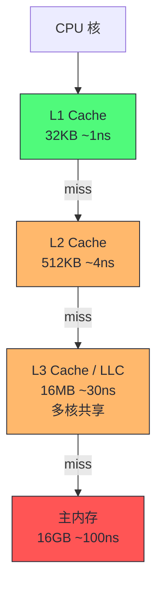
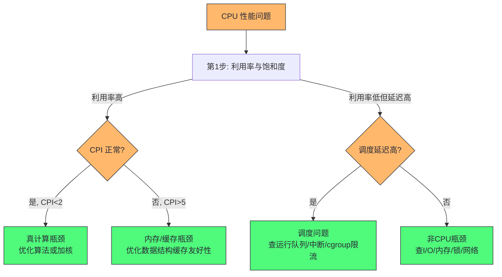
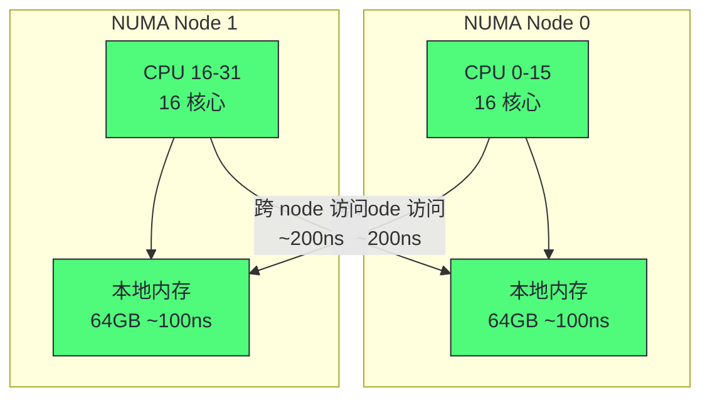
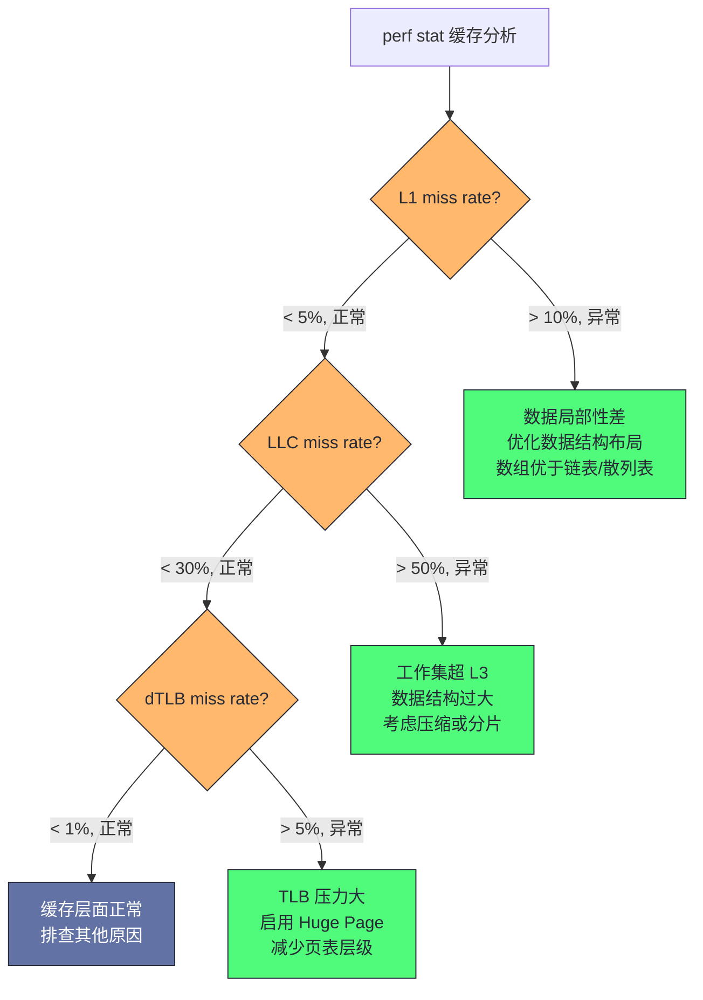

# 05 CPU：运行队列、调度器与 CPU 缓存的性能博弈

> [!abstract] 摘要
> 本文进入专栏第三部分"核心资源深度解析"的第一篇，聚焦 CPU 这一最核心的计算资源。文章从 CPU 硬件微架构切入——指令流水线、缓存层级、超线程、CPI，讲清楚"CPU 慢"的本质往往不是频率低而是内存等待。随后拆解 Linux CFS 调度器的运行队列模型与调度延迟，建立"利用率 vs 饱和度"在 CPU 维度的精确含义。最后下沉到 Java 线程与 OS 线程的映射关系，讲透为什么 Java 应用的 CPU 性能分析必须同时看 OS 层的调度延迟和 JVM 层的线程状态。核心认知：CPU 性能问题 80% 不是 CPU 本身的问题，而是内存子系统或调度器的问题。

---

## 第 1 章 CPU 硬件模型：从指令流水线到缓存层级

### 1.1 为什么理解 CPU 硬件对性能分析很重要

很多工程师认为 CPU 性能分析就是"看 CPU 利用率"——利用率高就是 CPU 瓶颈，加机器就行。这个认知是错误的，它会让你在两个方向上犯错：

第一，**把内存瓶颈误判为 CPU 瓶颈**。一个 CPU 利用率 90% 的进程，可能 80% 的时间在等内存（缓存未命中），真正执行指令的时间只有 10%。加 CPU 核数不会改善——因为瓶颈在内存带宽，不在计算能力。正确做法是优化数据结构的缓存友好性。

第二，**把调度延迟误判为 CPU 不足**。一个 CPU 利用率 50% 的进程，延迟却很高。原因可能是线程在运行队列里排队等待调度——CPU 有空闲但调度器没及时把线程放上去。加 CPU 核数能缓解，但根因可能是调度策略或锁竞争导致线程频繁阻塞/唤醒。

要避免这两个误判，必须理解 CPU 的硬件模型——CPU 不是一个"执行指令的黑盒"，而是一个有流水线、有缓存、有分支预测、有超线程的复杂微架构。

### 1.2 指令流水线与停顿周期

现代 CPU 用流水线（Pipeline）执行指令。一条指令的执行分为多个阶段，典型的五级流水线：


理想情况下，流水线每个周期完成一条指令的一个阶段，当流水线充满后，每个周期"产出"一条完成的指令。但现实中有多种原因导致流水线停顿（Stall），无法每个周期产出一条指令：

| 停顿原因 | 机制 | 性能影响 | 可观测指标 |
|---------|------|---------|----------|
| 缓存未命中 | 数据不在 cache，需从内存加载 | 100-300 周期 | LLC-load-misses（PMC） |
| 分支预测失败 | 流水线冲刷错误路径的指令 | 15-20 周期 | branch-misses（PMC） |
| 数据依赖 | 后一条指令需要前一条的结果 | 1-10 周期 | IPC < 1 |
| TLB 未命中 | 虚拟地址翻译需要额外访存 | 10-100 周期 | dTLB-load-misses（PMC） |

> [!info] 核心概念：CPI（Cycles Per Instruction）
> CPI = 总周期数 / 总指令数，衡量"平均每条指令花多少个 CPU 周期"。CPI 是理解 CPU 性能的最核心微架构指标：
> - CPI ≈ 0.25：4 发射超标量，理想情况（很少达到）
> - CPI 0.5-1：计算密集型代码，流水线充分利用
> - CPI 1-3：正常范围，有一定缓存命中和分支预测
> - CPI > 5：严重内存停顿或分支预测失败
> 一个函数 CPI 突然升高，即使它 CPU 时间占比没变，也说明它的缓存行为或分支行为在恶化。这是 perf stat（第 02 篇）能提供而 /proc 看不到的微架构级洞察。

### 1.3 CPU 缓存层级：性能的第一战场

CPU 缓存是理解 CPU 性能的核心。现代 CPU 有三级缓存：

| 缓存层级 | 容量 | 延迟 | 命中率影响 |
|---------|------|------|----------|
| L1 Data Cache | 32-48 KB/核 | ~1ns（3-4 周期） | 极高命中 |
| L2 Cache | 256KB-1MB/核 | ~4ns（10-12 周期） | 高命中 |
| L3 Cache（LLC） | 8-32MB（共享） | ~12-40ns（30-80 周期） | 中等命中 |
| 主内存 | GB 级 | ~100ns（200-300 周期） | 未命中代价 |



缓存命中与未命中之间的延迟差异是数量级的——L1 命中 1ns，内存未命中 100ns，差 100 倍。这意味着**一个缓存友好的算法和一个缓存不友好的算法，即使时间复杂度相同，实际性能可以差 10-100 倍**。

理解缓存行为还需要两个机制细节。**缓存行（cache line）是传输单位**：CPU 与内存之间的数据搬运以 64 字节为单位——访问 1 个字节会把整个缓存行加载进来。这意味着顺序访问（下一个数据大概率已在缓存行里）与随机访问（每次都要新加载缓存行）的性能差异，本质是"每个缓存行被利用了多少"。**硬件预取器（prefetcher）会放大这个差异**：现代 CPU 检测到顺序访问模式后，会提前把后续缓存行加载到缓存——顺序流式访问的内存延迟可以被预取"隐藏"到接近 L1 的水平；而指针追逐（链表、树）的访问模式不可预测，预取器完全失效，每次访问都暴露真实的内存延迟。这解释了为什么"数组永远比链表快"不只是理论——数组享受预取，链表每次都是冷访问。

对 Java 的特殊含义：**对象引用是预取的天敌**。`list.get(i).getNext().getValue()` 这样的链式访问，每次解引用都是一次不可预测的内存访问；而遍历 `int[]` 数组是完美的预取模式。这就是为什么高性能 Java 代码（譬如 Netty 的对象池、Agrona 的环形缓冲区）大量使用扁平化数组结构替代对象图——把"随机访问"改造成"顺序访问"，把缓存行为从最差拉到最好。

> [!note] 设计哲学：缓存局部性是性能优化的第一原理
> 缓存友好的代码遵循两个局部性原则：
> - **空间局部性**：访问相邻内存地址的数据（如数组顺序遍历），因为 cache line 一次加载 64 字节，相邻数据已在 cache 中。
> - **时间局部性**：短时间内重复访问同一数据（如循环中反复使用同一变量），数据在 cache 中保持。
> 一个经典案例：遍历二维数组，按行遍历（`a[i][j]`）比按列遍历（`a[j][i]`）快 5-10 倍——因为按行遍历有空间局部性，按列遍历每次跨 cache line。这个差异在 C/Rust 中很明显，在 Java 中被 JVM 的对象布局进一步放大（Java 对象是引用 + 堆分配，cache line 利用率天然较低）。

### 1.4 超线程：不是免费的 2 倍

超线程（Hyper-Threading，Intel 称 SMT）让一个物理核同时执行两个硬件线程。OS 看到 2 个逻辑 CPU，但底层共享同一个物理核的执行单元和缓存。

超线程的原理是：当一个线程因缓存未命中等原因停顿时，物理核的执行单元本来会空闲，超线程让另一个线程利用这些空闲的执行单元。这提升了整体吞吐量（典型 15-30%），但不是 2 倍。

超线程的收益高度依赖负载类型——**两个线程的"停顿模式"互补时收益最大，同质竞争时收益最小甚至为负**。计算密集型线程的执行单元利用率高，两个这样的线程挤在同一物理核上互相抢执行单元，收益趋近于零；一个计算线程配一个 I/O 线程（或缓存行为互补的线程）才是超线程的理想场景。这个原理对容量规划的含义：**物理核数才是"真实算力"的度量，逻辑核数只对 I/O 密集型负载有意义**。

超线程对性能分析的干扰：

| 情景 | 影响 |
|------|------|
| 两个计算密集线程在同一物理核 | 互相争抢执行单元，性能各降 20-30% |
| 一个计算 + 一个 I/O 线程在同一物理核 | I/O 线程停顿时让出执行单元，计算线程几乎不受影响 |
| 两个高频缓存竞争线程在同一物理核 | L1/L2 级缓存互相驱逐，CPI 显著上升 |

> [!warning] 生产避坑：超线程竞争导致的性能下降
> 一个常见问题：Java 应用配置了 2× 物理核数的线程池（因为 OS 显示 2N 个逻辑 CPU），但性能比 N 个线程还差。原因是计算密集的线程被调度到同一物理核的两个超线程上，互相争抢执行单元。对策：对计算密集型负载，线程数设为物理核数而非逻辑核数；或用 `taskset` / cgroup 把计算线程绑定到不同物理核。`lscpu -p=CPU,CORE,SOCKET` 可以查看逻辑 CPU 到物理核的映射。

### 1.5 CPU 频率与 Turbo：利用率之外的变量

现代 CPU 几乎都运行在动态频率下——DVFS（Dynamic Voltage and Frequency Scaling）根据负载调整频率，Turbo Boost 在温度和功耗允许时超频运行。这给性能分析引入了一个隐蔽变量：**同样的 CPU 利用率，实际算力可能不同**。

一个典型场景：压测环境 CPU 基频 2.5GHz、Turbo 可到 3.8GHz，压测时散热良好跑在 3.8GHz；生产服务器散热受限，长期运行在 2.8GHz。同样的代码、同样的利用率，生产性能比压测低 25%——这不是"环境差异"的玄学，而是频率差异的算术。排查方法：`perf stat` 输出中的 `cycles` 除以时间得到平均频率，或直接看 `turbostat` 工具的 Bzy_MHz 列。

云环境的频率问题更复杂——cgroup CPU 配额限制的是"时间片"而非"频率"，但宿主机的 Turbo 策略、节能模式（C-state 深度睡眠的唤醒延迟）都会影响实际算力。对延迟敏感的服务，BIOS 层面关闭 C6/C7 深度睡眠、固定频率（禁用 Turbo 波动）是常见的低延迟优化——代价是功耗和峰值性能。第 12 篇讲基准测试时会回到这个话题：**频率不固定，基准测试的数字就不可比**。

CPU 性能分析的正确姿势是把频率纳入解读框架：`perf stat` 的 IPC 要结合频率看——IPC 高但频率低，总算力可能仍然不足；利用率 80% 但频率从 3.8GHz 降到 2.5GHz，实际算力已经腰斩。利用率、IPC、频率三个变量合起来，才是 CPU 供给能力的完整描述。

---

## 第 2 章 Linux CFS 调度器与运行队列

### 2.1 CFS 的设计模型

Linux 的默认调度器是 CFS（Completely Fair Scheduler），从 2.6.23 引入。CFS 的设计目标是"完全公平"——让每个可运行线程公平地分享 CPU 时间。

CFS 的核心数据结构是**红黑树**，按虚拟运行时间（vruntime）排序。vruntime 是线程已运行时间的加权值——nice 值低的线程 vruntime 增长慢（获得更多 CPU 时间），nice 值高的增长快。调度器每次从红黑树最左边（vruntime 最小）取一个线程运行。

vruntime 的设计体现了一个精巧的公平观：**公平不是"每人跑同样长的时间"，而是"每人的 vruntime 增速相同"**。nice 值映射为权重（nice 0 权重 1024，nice -5 权重 3121，nice 5 权重 335），vruntime 增速 = 实际运行时间 × (1024 / 权重)。高优先级线程 vruntime 涨得慢，在红黑树里长期居于左侧，自然获得更多调度机会——但所有线程的 vruntime 差距有界（受 min_vruntime 约束），不会出现"低优先级线程永远饿死"。

这个模型对性能分析的含义：**CFS 没有"时间片"概念**。传统调度器"跑满时间片才切换"，CFS 是"有更高优先级（vruntime 更小）的线程就切换"。这带来两个可观测特征：其一，CFS 的上下文切换频率与唤醒模式强相关——大量短任务频繁唤醒时切换数飙升；其二，`sched_latency`（调度周期）和 `min_granularity`（最小运行粒度，默认约 0.75ms）控制切换下限——一个核上可运行线程数超过 `sched_latency / min_granularity`（默认约 8 个）时，每个线程的实际运行时间被压缩，切换开销上升。

每个 CPU 核有自己的运行队列（run queue），队列里是可运行但尚未运行的线程。运行队列长度是 CPU 饱和度的直接指标——队列越长，线程等待 CPU 的时间越长。

### 2.2 运行队列长度与调度延迟

CPU 的 USE 三指标在 Linux 上的具体映射：

| USE 指标 | CPU 对应 | 工具 |
|---------|---------|------|
| 利用率 | %CPU（user+system） | mpstat、vmstat us+sy |
| 饱和度 | 运行队列长度、调度延迟 | vmstat r、runqlat（eBPF） |
| 错误 | 硬件错误（MCE）、CPU 降频 | mcelog、dmesg |

**运行队列长度（r）** 是 CPU 饱和度的最直接指标。`vmstat 1` 的 r 列表示"正在运行 + 在运行队列中等待"的进程数。r 持续大于 CPU 核数意味着有进程在排队等 CPU。

**调度延迟** 是更精确的饱和度指标——它测量线程从进入运行队列到实际开始运行等待了多长。`runqlat`（BCC 工具）会给出调度延迟的直方图分布：

```
$ runqlat 5
     usecs           : count    distribution
     0 -> 1          : 12345   |@@@@@@@@@@@@@@@@@@@@@@@@@@@@@@@@@@@@|
     2 -> 3          : 5678    |@@@@@@@@@@@@@@@@@                   |
     4 -> 7          : 234     |                                    |
     8 -> 15         : 56      |                                    |
     16 -> 31        : 12      |                                    |
     32 -> 63        : 3       |                                    |
     64 -> 128       : 1       |                                    |
```

大部分调度延迟在 0-1μs（正常），但如果尾部出现 64-128μs 甚至更高的桶，说明有线程在队列里等了很久才被调度——这就是延迟尖刺的来源之一。

> [!info] 调度延迟的常见原因
> 调度延迟升高的典型原因：
> 1. **CPU 饱和**：运行队列长，线程在排队（r > 核数）
> 2. **中断风暴**：高优先级中断频繁抢占，普通线程等不到 CPU
> 3. **锁自旋**：内核 spinlock 持有时间长，关抢占导致调度延迟
> 4. **NUMA 调度迁移**：线程被迁移到远端 NUMA node，缓存冷启动
> 5. **CFS 带宽限制**：cgroup CPU quota 耗尽，线程被限流
> runqlat 直方图能告诉你"有没有问题"，再结合 Ftrace wakeup 追踪器（第 02 篇）可以定位到具体原因。

### 2.3 负载平均值与 PSI

`uptime` 的 load average 是最广为人知的 CPU 指标，但它的含义常被误解。load average 是运行队列长度（包括正在运行和等待的进程，以及不可中断睡眠的进程）的指数衰减移动平均：

- 1 分钟平均：权重高，反映最近状态
- 5 分钟平均：权重中
- 15 分钟平均：权重低，反映长期趋势

load average 的解读规则：

| load average | 8 核机器解读 |
|-------------|------------|
| 4 | 轻负载，CPU 有余量 |
| 8 | 满负载，队列几乎无积压 |
| 12 | 过载，队列有积压（12-8=4 个在排队） |
| 24 | 严重过载，队列大量积压 |

**归一化**：load average 除以 CPU 核数。8 核机器 load 8 = 归一化 1.0（满载），load 16 = 归一化 2.0（2 倍过载）。

load average 的局限是它**包含了不可中断睡眠（D 状态）进程**——等磁盘 I/O 的进程也计入 load。所以 load 高不一定代表 CPU 瓶颈，可能只是 I/O 慢。

> [!info] PSI（Pressure Stall Information）：更精确的饱和度指标
> Linux 4.20+ 引入 PSI，分别报告 CPU、内存、I/O 三种资源的"压力停顿时间"：
> - `/proc/pressure/cpu`：线程等待 CPU 的时间占比
> - `/proc/pressure/memory`：线程等待内存的时间占比
> - `/proc/pressure/io`：线程等待 I/O 的时间占比
> PSI 比 load average 更精确——它区分了不同资源的饱和度，且报告的是"停顿时间占比"而非"队列长度"。`avg10=2.50` 表示过去 10 秒有 2.5% 的时间线程在等 CPU。PSI 是现代 Linux 性能监控的推荐指标，适合接入 Prometheus 做饱和度告警。

### 2.4 CFS 带宽控制与调度类：配额时代的调度语义

CFS 本身只回答"怎么公平分配"，但现代数据中心更常问的是"怎么限制某个 cgroup 最多用多少 CPU"。这由 CFS 带宽控制（CFS Bandwidth Control）实现，它的语义与直觉有微妙差异，值得精确理解。

带宽控制以 period（默认 100ms）为周期发放配额：cgroup 的 `cpu.cfs_quota_us` 定义每个 period 内可用的 CPU 时间。配额用尽后，该 cgroup 的所有线程被**节流（throttled）**——从运行队列摘除，直到下一个 period。这里的关键细节是：**节流是"暂停"而非"降速"**。一个 2 核配额的容器在配额用尽后，不是"以 2 核的速度继续跑"，而是"完全停跑直到下个 period"——如果应用有 8 个活跃线程，它们会同时被冻结，产生最长可达数十毫秒的集体停顿。

这个语义解释了容器环境一个经典的延迟模式：**周期性尖刺**。应用每个 period 的前半段耗尽配额，后半段被冻结，下一个 period 开始时积压的线程同时醒来——延迟曲线呈现与 period 同频的锯齿状。识别方法：runqlat 直方图中出现与 100ms 周期对应的峰值，或 `cpu.stat` 的 `nr_throttled` 比例偏高。第 13 篇会给出完整的 cgroup 调优方案，这里先建立"配额是时间片不是速率"的核心认知。

调度类（Scheduling Class）是理解调度行为的另一把钥匙。Linux 的调度器不是单一算法，而是按优先级分层：Stop（最高，用于 CPU 热迁移）> Deadline（实时硬保证）> RT（FIFO/RR 实时）> CFS（普通进程）> Idle。`chrt` 可以查看和设置线程的调度类与优先级。对性能分析的含义：**普通 Java 线程都在 CFS 类，任何 RT 类任务（譬如某些网卡驱动的内核线程）都能抢占它**——如果延迟敏感的 Java 服务与 RT 任务同机，CFS 的"公平"保护不了你。`perf sched` 的 latency 视图能看到抢占来源。

### 2.5 调度延迟的量化：runqlat 的原理与解读

第 02 篇介绍过 runqlat 工具，这里从调度器机制的角度解释它测的是什么。runqlat 追踪两个 tracepoint：`sched_wakeup`（线程被唤醒，进入运行队列）和 `sched_switch`（线程实际开始运行）。两者的时间差就是调度延迟——线程"醒了但没 CPU 用"的时间。

这个指标为什么重要？因为它直接对应应用可感知的延迟。一个 RPC 线程被网络事件唤醒后，如果调度延迟是 5ms，这 5ms 完整地叠加在 RPC 延迟上——无论业务代码多快。runqlat 的直方图把"平均调度延迟"升级为"延迟分布"，长尾桶（>10ms）的存在说明有线程在队列里等了很久。

解读 runqlat 的三个要点：

1. **看分布不看均值。** 均值 50μs 可能掩盖 P99 5ms 的长尾——长尾才是延迟尖刺的来源。
2. **长尾桶要与负载对齐。** 高负载时段出现长尾是排队效应（正常），低负载时段出现长尾说明有抢占或限流（异常）。
3. **结合 offcputime 下钻。** runqlat 告诉你"等了多久"，offcputime 告诉你"等的时候线程在什么状态、被谁阻塞"——两者组合才能从现象走到根因。

---

## 第 3 章 CPU 性能分析实操

### 3.1 分析路径：从利用率到根因

面对 CPU 性能问题，正确的分析路径：



### 3.2 工具实操清单

| 分析步骤 | 工具 | 命令 | 看什么 |
|---------|------|------|--------|
| 利用率 | mpstat | `mpstat -P ALL 1` | 每核 %usr/%sys/%idle，单核瓶颈 |
| 饱和度 | vmstat | `vmstat 1` | r 列 > 核数 = 饱和 |
| 饱和度 | runqlat | `runqlat 5` | 调度延迟直方图分布 |
| 饱和度 | PSI | `cat /proc/pressure/cpu` | 停顿时间占比 |
| 热点定位 | perf | `perf record -F 99 -g -a -- sleep 30` | CPU 采样火焰图 |
| 热点定位 | async-profiler | `asprof -d 30 -e cpu <pid>` | Java 栈火焰图 |
| 微架构 | perf stat | `perf stat -e cycles,instructions,cache-misses,branch-misses -p <pid>` | CPI、缓存/分支统计 |
| 调度延迟 | Ftrace | `trace-cmd record -p wakeup sleep 5` | 最大调度延迟 |
| 中断 | mpstat | `mpstat -P ALL 1` | %soft 列，单核中断风暴 |
| 调度细节 | perf sched | `perf sched record -- sleep 5 && perf sched latency` | 每线程调度延迟与迁移 |

工具组合的典型用法值得展开。**"mpstat + perf stat" 是 CPU 分析的第一组合拳**：mpstat 回答"哪个核、什么类型的时间"（usr/sys/soft/idle），perf stat 回答"这些时间里 CPU 的效率如何"（IPC、缓存命中率）。两者的解读矩阵：

| mpstat 现象 | perf stat 现象 | 结论 |
|------------|---------------|------|
| %usr 高 + IPC > 1.2 | 缓存命中正常 | 真·计算密集，优化算法或加核 |
| %usr 高 + IPC < 0.5 | cache-miss 高 | 内存瓶颈伪装成 CPU 瓶颈，优化数据布局 |
| %sys 高 | 系统调用频繁 | 检查 syscall 热点（perf trace） |
| %soft 高（单核） | — | 中断分布问题，查 IRQ 绑核 |
| %idle 高 + 延迟高 | — | 不是 CPU 问题，查 I/O/锁/调度 |
| %iowait 高 | — | I/O 等待，转存储分析 |

**perf sched 是被低估的调度分析工具**。`perf sched record` 记录所有调度事件，`perf sched latency` 输出每个线程的最大/平均调度延迟，`perf sched map` 可视化线程在核间的迁移。它比 runqlat 更重（逐事件记录），但能回答 runqlat 回答不了的问题："这个线程的延迟是被谁抢占导致的""线程为什么频繁跨核迁移"。排查调度类问题时（譬如 RT 任务抢占、cgroup 限流），perf sched 是终极武器。

### 3.3 单核瓶颈的识别

识别单核瓶颈的命令：`mpstat -P ALL 1`。如果某核的 `%usr + %sys` 持续 100% 而其他核空闲，就是单核瓶颈。常见原因：

- **中断绑定**：网卡中断默认绑定到某个核（RPS/RFS 可分散），中断密集时该核 %soft 飙高
- **CPU 亲和性**：应用用 `taskset` 或 cgroup 绑定了核心
- **单线程瓶颈**：应用的单线程计算成为瓶颈（如单线程的 Redis）
- **JVM GC 线程绑定**：某些 GC 的工作线程可能集中在一个 NUMA node

单核瓶颈还有一个容易被忽略的变体——**锁竞争导致的"伪单核瓶颈"**。多个线程竞争一把锁时，同一时刻只有一个线程能执行临界区，其余在等锁——从 CPU 视角看，"有效并行度"被锁压缩到 1 个核的量级，即使有 32 个核可用。它的观测特征与真单核瓶颈不同：真单核瓶颈是"特定核饱和"（mpstat 可见），锁竞争是"所有核都不饱和但吞吐上不去"（mpstat 正常、jstack 大量 BLOCKED）。两者的修复方向完全不同——前者调中断/绑核，后者改锁设计（第 11 篇）。这个区分再次印证第 01 篇的原则：**症状相同（延迟高），根因可能完全不同，必须下钻到机制层**。

### 3.4 调度延迟实战：用 Ftrace wakeup 追踪最大延迟

runqlat 给出调度延迟的分布直方图，但如果你想知道"过去 5 秒内最大的一次调度延迟是多少、是哪个进程"，Ftrace 的 wakeup 追踪器更直接：

```bash
# 追踪最大调度延迟（普通进程）
trace-cmd record -p wakeup sleep 5
trace-cmd report

# 追踪最大调度延迟（实时进程，更严格）
trace-cmd record -p wakeup_rt sleep 5
trace-cmd report
```

输出会显示"最大延迟是多少微秒、发生在哪个 CPU、唤醒进程是谁、被调度进程是谁"。一次延迟超过 1ms 的 wakeup 事件在正常系统是罕见的，如果频繁出现，说明调度器有压力。

> [!info] wakeup 追踪器的原理
> wakeup 追踪器在进程被唤醒时记录时间戳，在进程实际开始运行时再记录一次，两者差值就是调度延迟。它追踪的是"最大值"——整个采样窗口内最严重的一次延迟。这种追踪器的开销比 runqlat 高（需要追踪每个唤醒事件），但在定位"偶发延迟尖刺"时更有针对性。配合 irqsoff 追踪器（追踪中断禁用时长），可以区分"调度延迟是调度器问题还是中断禁用问题"。

### 3.5 JVM GC 对 CPU 的影响

JVM 的 GC 是 CPU 性能分析中不可忽视的因素。GC 线程是 JVM 内部的特殊线程，它们的 CPU 使用会被计入 JVM 进程的总 CPU，但火焰图里通常标记为 `GC Thread` 或 `G1GC Thread` 等。

GC 对 CPU 的两种影响模式：

**模式一：GC 线程 CPU 飙高。** GC 频繁时，GC 工作线程（默认数量 = CPU 核数的 5/8）会消耗大量 CPU 做标记/扫描/复制。在 mpstat 上表现为 %sys 升高（GC 线程主要在内核态做内存操作）。如果 GC 线程占用 50%+ 的 CPU，应用的业务线程能用的 CPU 就少了——即使总 CPU 利用率看起来正常。

**模式二：GC STW 导致应用线程暂停。** Stop-The-World 暂停期间，所有应用线程都不在 CPU 上运行（被挂起），但它们也不在运行队列里（不是 R 状态而是等待 GC 完成）。这表现为：CPU 利用率下降、runqlat 正常，但应用延迟飙升。这是"CPU 不忙但延迟高"的一个典型原因，专栏第 10 篇 GC 工程化会深入展开。

区分这两种模式的命令：
- `jcmd <pid> Thread.print` 查看线程状态，GC 期间应用线程状态为 BLOCKED 或 WAITING
- JFR 的 `jdk.GarbageCollection` 事件记录 GC 开始/结束时间，与 mpstat 时间线对齐
- async-profiler 的 wall clock 模式可以看到应用线程在 GC 期间的总等待时间

### 3.6 cgroup CPU 限流：容器环境的隐形瓶颈

在 Kubernetes/Docker 环境中，容器的 CPU 通过 cgroup 限制。两种限制模式：

- **CPU quota（`cpu.cfs_quota_us`）**：在周期（`cpu.cfs_period_us`，通常 100ms）内允许使用的 CPU 时间上限。如 quota=200ms, period=100ms = 2 个核的配额。
- **CPU shares（`cpu.shares`）**：相对权重，只在 CPU 争用时生效。

cgroup CPU 限流的工作机制：当容器在一个 period 内用完了 quota，后续时间该容器的所有线程被限流——它们仍在运行队列中，但被标记为"throttled"，不会被调度执行，直到下一个 period 刷新配额。

**cgroup 限流的表现**：
- mpstat 看到容器内 CPU 突然降到 0（被限流）
- runqlat 显示调度延迟为整个限流时长（如 50ms = quota 用完后到下个 period 的等待时间）
- 应用延迟出现周期性尖刺（每 period 一次）
- PSI `/proc/pressure/cpu` 的 `avg10` 升高

> [!warning] 生产避坑：JVM 与 cgroup CPU quota 的冲突
> JVM 的 GC 线程数默认基于"看到的 CPU 核数"计算。在 cgroup 环境中，JVM 如果没正确识别 cgroup 限制（JDK 8u191 之前的问题），会按宿主机核数启动 GC 线程——一个限制 2 核的容器里启动 16 个 GC 线程，GC 时瞬间耗尽 quota，导致严重限流。
> JDK 8u191+ 和 JDK 11+ 默认支持 cgroup 感知（`-XX:+UseContainerSupport`），会按 cgroup 限制计算 GC 线程数。但生产部署仍需验证：
> ```bash
> java -XshowSettings:system -version  # 确认 JVM 识别的 CPU 数
> ```
> 另一个陷阱：cgroup CPU quota 应设为核数 × period 的整数倍，避免出现"1.5 核"这种非整数配额导致每 period 有 50ms 限流窗口。专栏第 13 篇云环境会详细展开 cgroup 调优。

### 3.7 cgroup v2 的 CPU 语义变化

cgroup v2 把 CPU 限制简化为 `cpu.max`（格式 "quota period"），并引入了与 v1 语义不同的权重机制。两个值得注意的行为差异：

**v1 的 quota 是"硬上限 + 突发不友好"**：period 内配额用尽立即节流，即使整个周期平均利用率不高。一个"平均 1.5 核、峰值 4 核"的应用配 2 核 quota，会在峰值期被频繁节流。**v2 引入了 burst 能力**（`cpu.max.burst`），允许在配额内累积未用时间片用于突发——对突发型负载更友好。

**v2 的 cpu.weight 替代 cpu.shares**，语义从"相对权重"变为"压力感知"：v2 的 CPU 权重只在争用时生效，且与 PSI 联动——`cpu.weight` 的分配参考各 cgroup 的实际压力。对性能分析的实操含义：诊断容器 CPU 问题时，先确认 cgroup 版本（`stat -fc %T /sys/fs/cgroup/` 输出 cgroup2fs 即 v2），再读对应的统计文件——v1 读 `cpu.stat` 的 throttled_time，v2 读 `cpu.stat` 的 `nr_throttled` 与 `throttled_usec`，混用两版的路径是常见错误。

Java 应用在 cgroup 环境还有一个隐蔽问题：**JIT 编译线程与 GC 线程共享配额**。JVM 启动时按"可见核数"（受 cgroup 感知影响）配置编译线程和 GC 线程数，但 quota 限制的是总量——编译高峰期（应用启动后几分钟）JIT 线程可能消耗大量配额，挤压业务线程。对策：`-XX:CICompilerCount` 限制编译线程数，或接受"预热期配额紧张"的现实并预留余量。第 13 篇会给出完整的容器 JVM 配置模板。

---

## 第 4 章 Java 线程与 OS 线程的映射

### 4.1 Java 线程的 OS 级映射

Java 的 `java.lang.Thread` 在 HotSpot JVM 中是通过 1:1 映射到 OS 线程实现的——每个 Java 线程对应一个 `pthread`。这意味着：

- Java 线程的调度由 OS 调度器（CFS）负责，JVM 不做用户态调度
- Java 线程的状态（RUNNABLE/BLOCKED/WAITING）与 OS 线程状态有对应关系但非完全一致
- Java 线程的 CPU 利用率、调度延迟、上下文切换都在 OS 层可观测

| Java 线程状态 | OS 线程状态 | 含义 |
|-------------|-----------|------|
| RUNNABLE | R（运行）或 O（运行队列等待） | 可运行 |
| BLOCKED | S（睡眠，等待 monitor） | 等 synchronized 锁 |
| WAITING / TIMED_WAITING | S（睡眠，park/wait） | 等 Object.wait/LockSupport.park |
| TERMINATED | Z（僵尸）或已退出 | 结束 |

这个映射表的解读有一个关键细节：**Java 的 RUNNABLE 不等于"正在 CPU 上运行"**。Java 语义里 RUNNABLE 涵盖了"运行中"和"就绪待调度"两种 OS 状态——一个 RUNNABLE 的 Java 线程可能在运行队列里排队。这解释了一个常见的 jstack 误读：看到大量 RUNNABLE 线程就以为"都在忙"，实际上其中一部分可能在等调度。区分手段是对照 OS 层：`top -H -p <pid>` 看每个 OS 线程的实际 CPU 占用，RUNNABLE 但 CPU 为 0 的 Java 线程就是"在队列里等调度"。

反向的映射也有价值：**OS 层的 R 状态线程对应哪个 Java 线程**。`top -H -p <pid>` 显示 OS 线程级 CPU，线程名是 `nid`（native thread id）——把它与 jstack 输出的 `nid=0x...` 对齐，就能把"OS 层烧 CPU 的线程"翻译成"Java 层的哪个方法"。这个"nid 桥接"是 CPU 火焰图（async-profiler）与线程栈（jstack）交叉验证的基础。

> [!info] Java 21 Virtual Thread 的改变
> Java 21 引入 Virtual Thread（虚拟线程），改变了 1:1 映射模型。Virtual Thread 是 JVM 管理的用户态线程，多个 Virtual Thread 复用少量 carrier thread（OS 线程）。Virtual Thread 在 I/O 阻塞时会自动让出 carrier thread，让其他 Virtual Thread 使用。这对 CPU 性能分析的影响：
> - OS 层看到的是 carrier thread 的 CPU 使用，不是业务线程的
> - 一个 carrier thread 上可能切换了多个 Virtual Thread，栈回溯更复杂
> - async-profiler 需要支持 Virtual Thread 的栈追踪（JDK 21+ 支持）
> Virtual Thread 不改变 CPU 密集型任务的分析方式（计算还是在 carrier thread 上），但改变了 I/O 密集型应用的线程模型。专栏第 13 篇会进一步讨论。

### 4.2 上下文切换的代价

上下文切换（Context Switch）是 CPU 性能分析中常被低估的开销。一次上下文切换的代价：

| 开销来源 | 典型耗时 |
|---------|---------|
| 寄存器保存/恢复 | ~100ns |
| TLB 刷新（跨地址空间） | ~1-10μs |
| CPU 缓存冷启动 | ~5-50μs（取决于缓存层级） |
| 调度器决策 | ~1-5μs |

总开销在微秒级，看似不大，但高频切换会累积。一个每秒 10 万次上下文切换的系统，切换开销占 10-50ms CPU 时间（1-5%）。更重要的是**缓存冷启动**——线程切换后，新线程的数据不在当前 CPU 的 cache 中，需要从 L3 或内存加载，这会让 CPI 显著上升。

`vmstat 1` 的 cs 列显示每秒上下文切换数。正常服务器 cs 在 1000-10000/s 范围；超过 100000/s 通常意味着问题（锁竞争、过多线程、频繁 I/O 阻塞/唤醒）。

> [!warning] 生产避坑：线程数不是越多越好
> 一个常见误区：给计算密集型任务配置大量线程（如 100 个计算线程在 8 核机器上）。这不会提升吞吐量——8 个核只能同时跑 8 个线程，其余 92 个在运行队列等待，频繁的上下文切换反而降低性能。计算密集型任务的线程数应该等于物理核数（或略多 1-2 个覆盖偶发停顿）。I/O 密集型任务可以更多，但也要用利特尔法则（第 01 篇 2.4 节）估算合理并发度。

### 4.3 中断与软中断：CPU 时间的"隐形租户"

分析 CPU 利用率时，`%usr` 和 `%sys` 之外还有一个常被忽略的维度——**软中断（softirq）**。网络收包的协议栈处理、块设备 I/O 完成回调、定时器都在 softirq 上下文执行，它们消耗的 CPU 计入 `%soft`（mpstat）或 `%sys` 的一部分。

软中断对 Java 服务的性能影响路径：网卡中断默认可能集中在单个核（IRQ 亲和性未配置），高流量下该核的 `%soft` 接近 100%——这个核上的 Java 线程被频繁抢占，调度延迟飙升，而其他 31 个核看起来很空闲。这就是第 4.3 节（单核瓶颈）在网络场景的典型成因。识别命令：`mpstat -P ALL 1` 看每核 `%soft`，`cat /proc/interrupts | grep eth` 看中断分布。

处理路径有三层：**RSS 多队列**（网卡硬件把流量哈希到多个队列）→ **IRQ 绑核**（把不同队列的中断绑到不同核）→ **RPS/RFS**（软件层把包分发到应用线程所在核，保持缓存局部性）。第 08 篇网络篇会完整展开这条链路，CPU 篇的要点是：**看到单核 `%soft` 饱和，第一反应是中断分布，而不是"CPU 不够"**。

### 4.4 虚拟线程对 CPU 分析的影响

Java 21 的虚拟线程（Virtual Thread）改变了线程模型，也改变了 CPU 分析的解读方式。传统平台线程与 OS 线程 1:1 映射，"Java 线程数 = OS 线程数"；虚拟线程是 JVM 用户态调度的轻量执行体，成千上万个虚拟线程复用在少量载体线程（carrier thread，即平台线程）上。

对 CPU 分析的影响有三点：

**其一，OS 层看到的线程数骤减。** 一个百万虚拟线程的应用，OS 层可能只有 8 个载体线程。`vmstat` 的 r 列、上下文切换数、`pidstat` 的线程级统计，全部只反映载体线程——虚拟线程的阻塞/唤醒发生在 JVM 用户态，OS 调度器完全无感。

**其二，调度延迟的含义变了。** 虚拟线程的"调度延迟"是 JVM 内部的续体（continuation）挂起/恢复时间，不是 OS 调度延迟。runqlat 测不到它。观测虚拟线程调度要用 JFR 的 `jdk.VirtualThreadSubmitFailed`、`jdk.VirtualThreadPinned` 等专用事件。

**其三，pinning 是新的 CPU 陷阱。** 虚拟线程在 `synchronized` 块内阻塞时会"钉住"载体线程（无法让出），导致载体线程池耗尽——表现为"OS 层 8 个载体线程全部 100%，但业务吞吐为零"。第 11 篇会详展 pinning 机制，CPU 篇的要点是：**虚拟线程应用的 CPU 分析必须同时看 OS 层（载体线程）和 JFR 的虚拟线程事件，单看任何一层都会误判**。

---

## 第 5 章 回到案例与本章要点

### 5.1 支付服务案例的 CPU 视角

回到支付服务延迟尖刺案例。CPU 层面的观测：

- **故障窗口内 mpstat**：CPU 利用率正常（40%），没有单核瓶颈
- **vmstat r 列**：故障窗口 r 偶尔升到 12（8 核机器），有短暂排队
- **runqlat**：调度延迟 P99 从 10μs 升到 200μs——有轻微调度延迟尖刺
- **结论**：CPU 不是根因，但 I/O 瓶颈导致线程频繁阻塞/唤醒，间接增加了上下文切换和调度延迟。这是"根因不在 CPU 但 CPU 指标受影响"的典型表现。

这个"CPU 指标受牵连"的模式值得展开，因为它是 CPU 分析中最常见的误判来源。线程等 I/O 时进入阻塞态（离开运行队列），I/O 完成后被唤醒（重新入队）——**每次阻塞/唤醒循环都产生一次上下文切换和一次潜在的调度延迟**。I/O 瓶颈时这个循环的频率飙升，CPU 层的"症状"（cs 高、runqlat 长尾）其实是 I/O 问题的投影。区分"CPU 是根因"还是"CPU 是受害者"的判据：**看阻塞原因**——offcputime 显示线程阻塞在 `io_schedule`（等 I/O）还是 `futex_wait`（等锁）还是运行队列排队（真·CPU 饱和）。症状在 CPU，根因在别处，这是全栈视角在 CPU 分析中的直接体现。

### 5.2 CPU 分析速查表

| 问题 | 第一步 | 第二步 | 第三步 |
|------|--------|--------|--------|
| CPU 利用率高 | mpstat 看是单核还是全局 | perf/async-profiler 找热点函数 | perf stat 看 CPI 区分计算 vs 内存 |
| CPU 不忙但延迟高 | vmstat r / runqlat 看调度延迟 | offcputime 看线程在等什么 | 转查 I/O/锁/网络 |
| CPI 高 | perf stat 看 cache-misses | 优化数据结构缓存友好性 | 检查数据布局/对齐 |
| 上下文切换高 | vmstat cs 看切换频率 | pidstat -w 看哪个进程 | 检查线程数/锁竞争 |
| 单核 100% | mpstat -P ALL 定位核 | perf record -C <core> 单核采样 | 检查中断绑定/CPU 亲和性 |

---

## 第 6 章 NUMA 与 CPU 缓存的进阶博弈

### 6.1 NUMA：多物理 CPU 的内存非对称性

现代多路服务器采用 NUMA（Non-Uniform Memory Access）架构。一个 2 路 CPU 服务器有 2 个 NUMA node，每个 node 有自己的本地内存。CPU 访问本地 node 的内存快（~100ns），访问远端 node 的内存慢（~150-200ns，需跨 QPI/UPI 互连）。



NUMA 对性能的影响是隐蔽而巨大的——跨 node 内存访问延迟翻倍，但应用完全无感知。一个 JVM 堆分配在两个 node 上（默认 first-touch 策略下，哪个线程首次 touch 页面就分配在哪个 node），意味着一半的堆访问需要跨 node。

NUMA 的影响不止于延迟，还有**带宽的分层**。本地内存访问走本节点的内存控制器，远端访问要跨 QPI/UPI 互连——后者不仅延迟高（1.5-2 倍），还与跨节点流量共享有限的互连带宽。一个 2 路服务器上跑内存密集型应用（譬如大堆 GC），如果堆均匀分布在两个 node 而 GC 线程集中在一个 node，GC 期间一半的内存访问走跨节点路径——GC 停顿时间可能翻倍。这就是第 06 篇"NUMA 与 GC"主题的硬件基础。

NUMA 查看与控制：

```bash
# 查看 NUMA 拓扑
numactl --hardware
lscpu | grep NUMA

# 查看 JVM 进程的内存 NUMA 分布
numastat -p <pid>

# 绑定 JVM 到单 NUMA node（避免跨 node 访问）
numactl --cpunodebind=0 --membind=0 java -Xmx32g -jar app.jar
```

NUMA 分析的判读要点：**跨节点访问占比**（`perf stat -e node-loads,node-load-misses`）超过 20% 就值得优化——绑定策略的收益直接体现在这个比例上。但要注意 NUMA 优化是双刃剑：绑死单节点损失了另一半内存容量，跨节点访问的"均匀分布"（interleave）则牺牲局部性换容量——两种策略没有绝对优劣，取决于工作集大小与节点容量的关系（第 06 篇 3.4 节详展策略选择）。

> [!warning] 生产避坑：JVM 堆跨 NUMA node 的隐形代价
> 第 01 篇提到的"堆从 4G 涨到 32G，GC 停顿反而变长"的案例，根因就是 NUMA。32G 堆跨 2 个 NUMA node 分配，GC 扫描堆时大量跨 node 内存访问，延迟翻倍。对策：
> 1. 用 `numactl --membind=0` 绑定 JVM 堆到单 node（但限制了可用内存）
> 2. 用 `-XX:+UseNUMA`（HotSpot 选项，让 JVM 感知 NUMA 拓扑，按 node 分配堆区域）
> 3. 减小堆大小到单 node 内存容量以内
> **生产 JVM 部署时务必检查 NUMA 拓扑**，这是容器化之前裸机部署最常见的隐形性能问题。

### 6.2 Java 对象布局与 CPU 缓存

Java 对象在堆中的内存布局对 CPU 缓存利用率有直接影响。一个 Java 对象在内存中的结构：

```
| 对象头 (12-16B) | 实例数据 | 对齐填充 |
```

- **对象头**：Mark Word（8B，含 hash/锁状态/GC 年龄）+ Klass Pointer（4B 压缩指针或 8B）
- **实例数据**：字段值，按类型大小排列
- **对齐填充**：补齐到 8 字节整数倍

对象头占 12-16 字节，对一个只有 2 个 int 字段（8B）的小对象，对象头占 60%+ 的空间。这意味着**Java 的 cache line 利用率天然不如 C/C++**——同样 64 字节的 cache line，C 结构体可以放 8 个数据项，Java 对象只能放 3-4 个。

> [!info] 核心概念：指针压缩与对象对齐
> JDK 默认开启指针压缩（`-XX:+UseCompressedOops`），把 8 字节指针压缩到 4 字节，条件是堆 < 32GB。超过 32GB 指针退回到 8 字节，对象头从 12B 变成 16B，所有对象多占 4B——这就是为什么 32GB 是 JVM 堆的一个"性能悬崖"。很多应用发现堆从 31G 涨到 33G 后性能反而下降，根因就是指针压缩失效。
> 对象对齐默认 8 字节（`-XX:ObjectAlignmentInBytes=8`），可以调到 16 字节但通常不推荐——会增加内存占用。JOL（Java Object Layout）工具可以打印对象的精确布局，专栏第 11 篇会详细讲解。

### 6.3 PMC 实战：用硬件计数器诊断缓存瓶颈

当 CPU 利用率高但 CPI 也高（>3）时，需要用 PMC 定位是哪一级缓存出了问题。perf stat 的分层缓存事件：

```bash
# 分层缓存命中率分析
perf stat -e \
  L1-dcache-loads,L1-dcache-load-misses,\
  LLC-loads,LLC-load-misses,\
  dTLB-loads,dTLB-load-misses \
  -p <pid> -- sleep 10
```

输出解读：

| 事件 | 正常命中率 | 异常含义 |
|------|----------|---------|
| L1-dcache-load-misses / L1-dcache-loads | < 5% | L1 命中率低 = 数据局部性差 |
| LLC-load-misses / LLC-loads | < 30% | LLC 命中率低 = 工作集超过 L3 容量 |
| dTLB-load-misses / dTLB-loads | < 1% | TLB 命中率低 = 大量页表 walk，可能 Huge Page 有益 |

诊断决策树：



> [!note] Huge Page 对 JVM 的性能价值
> JVM 堆通常占用大量虚拟内存页。默认 4KB 页大小下，32GB 堆需要 800 万个页表项，TLB（Translation Lookaside Buffer，页表缓存）容量有限（通常 1000-2000 项），大量 TLB miss 导致页表 walk（从内存读取页表），每次 walk 耗时 100ns+。
> 启用 Huge Page（2MB 或 1GB 页）后，32GB 堆只需 16000 个 2MB 页（或 32 个 1GB 页），TLB 命中率大幅提升。JVM 通过 `-XX:+UseLargePages` 启用，需预先配置 OS 的 Huge Page 池（`sysctl vm.nr_hugepages=16384`）。对于大堆 JVM 应用，Huge Page 可带来 5-15% 的吞吐提升，尤其对 GC 扫描堆的性能有显著改善。

### 6.4 伪共享：缓存行级别的隐形杀手

缓存层级的分析通常停留在"命中率"层面，但有一个更隐蔽的问题——**伪共享（False Sharing）**。它的机制：缓存一致性协议（MESI）以缓存行（64 字节）为最小单位。如果两个线程分别写两个**不同的变量**，但这两个变量恰好落在**同一个缓存行**上，那么每次写入都会使对方核心的缓存行失效——两个线程明明没有共享数据，却在缓存行层面"共享"了。

```java
// 伪共享的经典场景：计数器数组
class Counters {
    volatile long a;   // 线程 1 频繁写
    volatile long b;   // 线程 2 频繁写 —— a 和 b 在同一个 64B 缓存行上！
}
// 两个线程各自写自己的字段，但每次写都让对方核心的缓存行失效
// 性能可能比"真共享一把锁"还差
```

Java 中伪共享的高发场景：计数器数组、并发队列的 head/tail 指针、LongAdder 的 Cell（它用 `@Contended` 注解主动填充避免伪共享——这正是 LongAdder 高性能的秘诀之一）。检测手段：`perf c2c`（cache-to-cache）工具专门用于定位伪共享——它统计"跨核缓存行搬移"的热点地址，命中即伪共享嫌疑。修复手段：字段间填充（padding）到不同缓存行，或用 `@jdk.internal.vm.annotation.Contended` 注解（需要 `-XX:-RestrictContended`）。

伪共享的教训超出 Java 范畴：**缓存一致性是"以缓存行为单位"的，数据结构设计必须意识到物理布局**。第 11 篇讲 JOL 对象布局时会回到这个话题——对象字段的排列顺序不只是内存占用问题，更是缓存行为问题。

### 6.5 IPC 与 Topdown：微架构分析的现代框架

perf stat 给出 IPC，但 IPC 低只是"有停顿"的结论，停顿的原因需要进一步归因。Intel 提出的 **Topdown Microarchitecture Analysis（TMA）** 方法把这个归因系统化：把 CPU 的每个周期归类到四个顶层桶之一，再逐层下钻：

```text
每个 CPU 周期的去向（Topdown 第一层）：
├── Retiring（有效工作）：指令真正完成的比例 —— 越高越好
├── Backend Bound（后端瓶颈）：执行单元在等数据/等资源
│   ├── Memory Bound：等内存（缓存 miss、TLB miss）
│   └── Core Bound：执行单元内部竞争（端口冲突、依赖链）
├── Frontend Bound（前端瓶颈）：取指/解码供不上指令
│   └── 典型原因：iCache miss、分支目标缓冲 miss、JIT 大方法
└── Bad Speculation（投机失败）：分支预测错误、流水线冲刷
```

`perf stat --topdown`（或 `perf stat -M topdownl1`）直接输出第一层四个比例。解读规则：

| 主导桶 | 含义 | 下钻方向 |
|--------|------|---------|
| Retiring > 40% | CPU 在做有效工作 | 性能健康，或算法本身重 |
| Backend Bound 高 | 等数据 | 看 memory bound 占比，优化数据布局/缓存 |
| Frontend Bound 高 | 指令供给不足 | 检查 iCache miss、超大方法（JIT 内联失效） |
| Bad Speculation 高 | 分支预测失败多 | 优化分支结构、排序数据使分支可预测 |

Topdown 对 Java 应用的特殊价值：**JIT 编译质量的可观测化**。一个方法如果 Frontend Bound 高，可能是 JIT 没有内联导致调用链长、代码体积大（iCache 压力）；Memory Bound 高可能是对象图遍历的缓存不友好。这些结论直接连接到第 09 篇的 JIT 调优和第 06 篇的对象布局——微架构分析是连接"OS 观测"与"JVM 调优"的桥梁。

使用 Topdown 有一个前置条件：它需要较新的 perf 版本和 Intel 平台的特定 PMC 事件支持。`perf stat --topdown` 在不满足条件时会报错或输出空值——此时退回到"手工 Topdown"：用 `perf stat -e cycles,instructions,idq.mite_uops,idq.dsb_uops,br_misp_retired.all_branches,uops_dispatched.thread` 等事件近似计算各桶占比。精度略差但方向判断足够。AMD 平台有对应的 IBS（Instruction-Based Sampling）机制，`perf record -e ibs_op//` 可以做类似的归因——工具名不同，方法论一致。

---

## 第 7 章 本章总结

### 7.1 CPU 性能分析的核心认知

综合全篇，CPU 性能分析需要建立的五个核心认知：

1. **CPU 利用率高 ≠ CPU 瓶颈**：CPI > 5 时，真正瓶颈是内存子系统，加核无用。
2. **CPU 利用率低 ≠ CPU 没问题**：调度延迟、单核瓶颈、锁自旋都可能让 CPU 看起来闲但延迟高。
3. **缓存是 CPU 性能的第一战场**：L1 miss 到内存访问差 100 倍，数据结构布局比算法复杂度更影响实际性能。
4. **NUMA 是多路服务器的隐形杀手**：跨 node 内存访问延迟翻倍，JVM 堆跨 node 分配是常见陷阱。
5. **Java 对象布局天然不利于缓存**：对象头开销 + 引用间接 + 堆碎片化，Java 的 cache line 利用率低于 C/C++，需要用数组、对象池、值类型（Valhalla）等手段补偿。

### 7.2 工具链总结

| 层级 | 工具 | 核心指标 |
|------|------|---------|
| Counters | mpstat、vmstat、PSI | %CPU、r、调度停顿占比 |
| Profiling | perf、async-profiler | 火焰图、CPU 热点 |
| PMC | perf stat | CPI、L1/LLC/TLB miss rate |
| Tracing | runqlat、offcputime | 调度延迟分布、off-CPU 原因 |
| NUMA | numastat、numactl | 内存跨 node 分布 |

---

## 第 8 章 案例复盘：CPU 利用率 40% 但延迟翻倍

用一个生产案例串联本章的分析路径。这个案例的典型性在于：它同时涉及调度延迟、软中断、NUMA 三个维度，且每一步"看起来合理"的直觉判断都是错的。

**现象**：一个 32 核的推荐服务，某次扩容后（8 核 → 32 核）P99 延迟从 30ms 恶化到 70ms，但 CPU 利用率从 75% 降到 40%——"资源更充裕了，延迟反而更差"。

**第一轮：验证直觉（错误方向）。** 团队的第一反应是"新机器有问题"，对比了新旧机器的 CPU 型号、内存、内核版本——完全一致。又怀疑是流量分布不均，检查了负载均衡——正常。直觉排查无果。

**第二轮：USE 系统遍历。** `mpstat -P ALL 1` 发现异常：核 0-3 的 `%soft` 高达 85%，核 4-31 几乎空闲。聚合利用率 40% 的真相是"4 个核被软中断打满，28 个核在围观"。`cat /proc/interrupts | grep eth` 确认：网卡只有 4 个队列，中断全绑在核 0-3。

**根因链条**：扩容后流量翻倍，但网卡队列数没有变（4 个），4 个核的软中断处理能力成为瓶颈；Java 的网络线程恰好也被调度在这 4 个核附近（IRQ 亲和性影响调度），收包处理排队，延迟上升。

**第三轮：修复与验证。** `ethtool -L eth0 combined 16` 开启 16 队列，把中断分散到 16 个核；同时用 RPS 把包处理分发到应用线程所在核。修复后：核 0-3 的 `%soft` 降到 20%，P99 回落到 28ms。

**复盘的三个教训**：

1. **聚合利用率是"平均数陷阱"的 CPU 版**。40% 的聚合利用率掩盖了"4 核饱和 + 28 核空闲"的结构性失衡——第 01 篇讲的"分布比均值重要"在 CPU 维度的具体化就是"每核分布比聚合利用率重要"。
2. **扩容检查清单必须包含"每核资源"**。CPU 核数、内存、磁盘都扩了，但网卡队列数、IRQ 绑核配置这些"每核资源"没有跟着扩——结构性瓶颈从 8 核时代就存在，只是流量小到没暴露。
3. **软中断与业务线程的"核冲突"是放大器**。即使软中断只占 85% 中的一个核，落在业务线程所在的核上，调度延迟的恶化也是全局性的——IRQ 绑核与业务绑核要协同规划，这也是第 08 篇"中断绑核 + NUMA 局部性"主题的伏笔。

> [!note] 设计哲学：CPU 分析的"结构思维"
> 这个案例的方法论启示：CPU 性能问题的分析单位不是"CPU 总量"而是"CPU 结构"——按核分解（单核瓶颈）、按时间分解（软中断 vs 用户态）、按拓扑分解（NUMA 本地 vs 远端）。聚合指标回答"有没有问题"，结构指标回答"问题在哪"。当你面对一个"利用率不高但延迟高"的 CPU 谜题时，第一动作就是把聚合数字拆成结构：`mpstat -P ALL`（按核）、`perf stat`（按周期去向）、`numastat`（按节点）。结构拆完，根因通常自己浮出来。

---

## 第 9 章 本章总结

### 9.1 核心认知回顾

综合全篇，CPU 性能分析需要建立的核心认知可以浓缩为五条：

1. **利用率是必要条件不是充分条件**：利用率高不一定是 CPU 瓶颈（可能是内存等待），利用率低也不代表 CPU 无辜（可能是调度、单核、软中断问题）。CPU 分析的起点是"结构分解"而非"总量判断"。
2. **CPI/IPC 是计算与等待的分水岭**：IPC 高是有效计算，IPC 低是流水线停顿——用 Topdown 框架把停顿归因到内存、前端、投机失败，每个桶对应不同的优化方向。
3. **缓存行为决定实际性能**：缓存行、预取器、伪共享这些微架构机制，把"算法复杂度相同"的代码拉开了 10-100 倍的实际差距。Java 的对象模型天然不利于缓存，高性能 Java 代码必须主动补偿。
4. **调度延迟是应用延迟的隐形组成**：线程"醒了但没 CPU 用"的时间完整叠加在业务延迟上。runqlat 看分布，perf sched 看归因，cgroup 限流和 RT 抢占是两个常见的隐形来源。
5. **NUMA 是多路服务器的默认陷阱**：跨节点访问延迟与带宽双重劣化，大堆 JVM 必须显式管理 NUMA 策略，"默认部署"在 2 路服务器上几乎必然踩坑。

### 9.2 分析路径速查

| 问题 | 第一步 | 第二步 | 第三步 |
|------|--------|--------|--------|
| CPU 利用率高 | mpstat 看是单核还是全局 | perf/async-profiler 找热点函数 | perf stat 看 CPI 区分计算 vs 内存 |
| CPU 不忙但延迟高 | vmstat r / runqlat 看调度延迟 | offcputime 看线程在等什么 | 转查 I/O/锁/网络 |
| CPI 高 | perf stat 看 cache-misses | Topdown 归因到 memory/frontend | 优化数据结构缓存友好性 |
| 上下文切换高 | vmstat cs 看切换频率 | pidstat -w 看哪个进程 | 检查线程数/锁竞争 |
| 单核 100% | mpstat -P ALL 定位核 | perf record -C <core> 单核采样 | 检查中断绑定/CPU 亲和性 |
| 扩容后反而变慢 | 检查每核资源（队列/绑核/NUMA） | mpstat 看结构失衡 | 协同调整 IRQ 与业务绑核 |

---

## 参考资料

1. Brendan Gregg, *Systems Performance*, 2nd Edition, 2020. 第 6 章 "CPI、Cycles 与指令"相关章节（CPUs）
2. Brendan Gregg, *Systems Performance*, 2nd Edition, 2020. 第 4 章 "Observability Tools"、调度器章节
3. Intel 64 and IA-32 Architectures Optimization Reference Manual, Appendix C（Topdown Microarchitecture Analysis）
4. Brendan Gregg, CPU Utilization is Wrong（利用率误导性分析）, http://www.brendangregg.com/blog/2017-05-09/cpu-utilization-is-wrong.html
5. Linux 内核文档, scheduler/sched-*.rst（CFS 设计文档）
6. Java 虚拟线程 JEP 444: Virtual Threads, https://openjdk.org/jeps/444

---

> [!note] 思考题
> 1. 一个服务 CPU 利用率 60%、IPC 0.4、LLC miss rate 40%。加核能解决问题吗？正确的优化方向是什么？请给出你的推理链。
> 2. 为什么"每核分布比聚合利用率重要"？构造一个聚合利用率正常但存在结构性瓶颈的场景，并说明用什么命令发现它。
> 3. 虚拟线程应用中，OS 层显示 8 个载体线程全部 100% CPU，业务吞吐为零。可能的原因是什么？用什么工具确认？
> 4. 解释为什么"遍历 int[] 数组"和"遍历 LinkedList<Integer>"在缓存行为上有数量级差异。这个差异对 Java 集合选型有什么启示？
