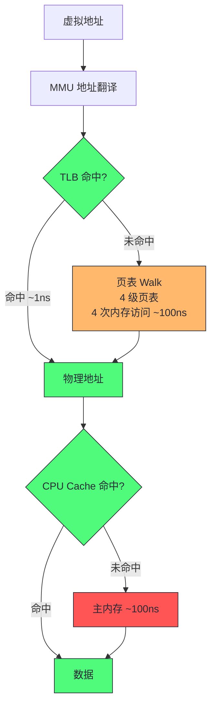
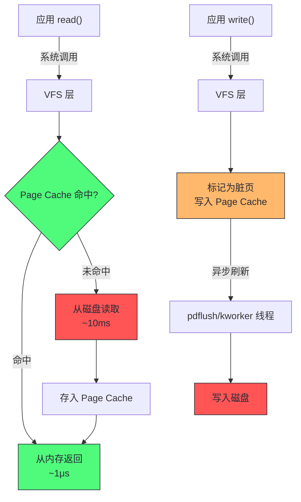
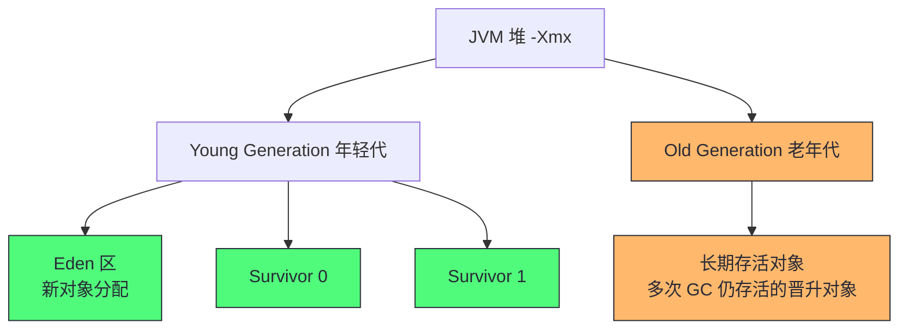
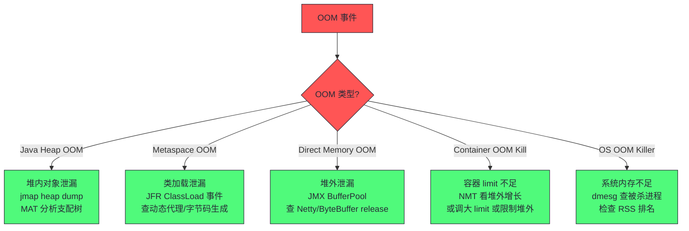

# 06 内存：从 NUMA 与页表到 JVM 堆模型

> [!abstract] 摘要
> 本文是核心资源深度解析的第二篇，聚焦内存子系统。文章从虚拟内存的硬件基础（MMU/TLB/页表）切入，讲透按需分页、文件系统分页（好）与匿名分页（坏）的本质区别，以及 Page Cache 如何成为 I/O 性能的关键加速层。随后拆解 NUMA 在内存维度的性能影响，下沉到 JVM 堆模型——从堆区域划分到对象内存布局再到堆外内存追踪（NMT）。核心认知：内存性能问题的三重维度——OS 层的交换/OOM、硬件层的 NUMA/TLB、JVM 层的堆布局/GC 压力，三层必须打通分析。

---

## 第 1 章 虚拟内存：进程的私有地址空间幻象

### 1.1 虚拟内存是什么

虚拟内存是现代操作系统的核心抽象之一。每个进程拥有独立的虚拟地址空间（64 位 Linux 默认 128TB），进程以为自己独占了全部内存。OS 和硬件（MMU）协作，把虚拟地址映射到物理地址，实现多进程隔离和内存超额订购（overcommit）。

虚拟地址到物理地址的翻译由 MMU（Memory Management Unit）完成，翻译过程查页表（Page Table）。页表是内存中的数据结构，存储"虚拟页号 → 物理页号"的映射。如果每次访存都要查页表（多级页表需要 4 次内存访问），性能会崩溃。因此 CPU 有 TLB（Translation Lookaside Buffer）——页表项的硬件缓存，缓存最近使用的映射。



> [!info] 核心概念：TLB miss 的隐性代价
> TLB 容量有限（通常 1000-2000 项），每个项覆盖一个 4KB 页。如果进程访问的内存范围超过 TLB 容量（约 4-8MB），TLB miss 率上升，每次 miss 触发页表 walk（4 次内存访问，~100ns）。对于大内存应用（如 32GB 堆的 JVM），TLB miss 是显著的性能损耗。Huge Page（2MB/1GB 页）是直接的解决方案——同样 32GB 内存，2MB 页只需 16000 个页表项，4KB 页需要 800 万个，TLB 命中率天差地别。第 05 篇已展开 Huge Page 对 JVM 的价值，这里强调的是虚拟内存地址翻译本身就是性能分析需要关注的维度。

### 1.2 按需分页：不触碰不分页

Linux 采用按需分页（Demand Paging）策略：`mmap` 或 `malloc` 分配虚拟内存时，只建立虚拟地址映射，不分配物理内存。只有进程实际访问该地址时，触发 page fault，内核才分配物理页并建立映射。

这意味着**虚拟内存分配不等于物理内存使用**。一个 `malloc(1GB)` 后不写入任何数据，物理内存占用几乎为零。这对理解 JVM 的内存指标很重要——JVM 的 `-Xmx` 是虚拟内存上限，实际物理使用（RSS）可能远小于它。

按需分页的工程影响：
- **首次访问的延迟尖刺**：首次访问一个新页会触发 page fault（~1-2μs），比正常访存（~100ns）慢 10 倍。JVM 堆初始化时的大量 page fault 是启动慢的一个因素
- **RSS vs VSS 的区别**：RSS（Resident Set Size）是实际在物理内存中的页，VSS（Virtual Set Size）是虚拟地址空间大小。性能分析关注 RSS，VSS 只用于判断地址空间是否够用
- **`-XX:+AlwaysPreTouch`**：JVM 选项，启动时预先 touch 整个堆，触发所有 page fault。代价是启动慢，收益是运行期没有首次访问的延迟尖刺。延迟敏感型生产服务推荐开启

### 1.3 文件系统分页 vs 匿名分页：好与坏的区分

Linux 内核把内存分页分为两类，理解它们的区别是内存性能分析的关键：

**文件系统分页（File-backed Paging）——好的分页**：
- 来源：文件的内存映射（mmap）或 Page Cache
- 页面内容可以在磁盘上找到
- 内存不足时，内核可以直接丢弃这些页（干净页）或写回磁盘（脏页），不需要 swap
- 回收代价低，对应用几乎无感知

**匿名分页（Anonymous Paging）——坏的分页**：
- 来源：进程的堆、栈、匿名 mmap（`MAP_ANONYMOUS`）
- 页面内容没有磁盘后背
- 内存不足时，内核必须把这些页写入 swap 设备才能回收
- 回收代价高：swap out（写磁盘）+ swap in（读磁盘）= 两次 I/O，且应用在等待期间被阻塞

> [!warning] 生产避坑：swap 不是内存优化手段
> 很多运维误以为 swap 是"内存不够时的缓冲"，实际上 swap 是性能灾难的开始。匿名分页到 swap 意味着应用的堆数据被写到磁盘，下次访问要读回来——磁盘延迟（~10ms）是内存延迟（~100ns）的 100 倍。一旦 vmstat 的 si/so（swap in/out）列开始非零，应用延迟会飙升。
> 生产环境的正确做法：**禁用 swap 或设 swappiness=0**（`sysctl vm.swappiness=0`），让内核在内存不足时直接 OOM kill 而不是 swap。OOM kill 虽然粗暴（杀进程），但比 swap 导致的全系统卡顿更可控。Kubernetes 默认要求禁用 swap。

---

## 第 2 章 Page Cache：I/O 性能的隐形加速层

### 2.1 Page Cache 的工作原理

Page Cache 是 Linux 内核的文件系统缓存——把最近访问的文件内容缓存在内存中，后续读操作直接从内存返回，不经过磁盘。这是 Linux I/O 性能的核心机制。

Page Cache 的工作流程：



Page Cache 的关键特性：

| 特性 | 机制 | 性能影响 |
|------|------|---------|
| 读缓存 | 读操作先查 cache，命中直接返回 | 重复读极快 |
| 写缓冲 | write() 先写入 cache（标记脏页），异步刷盘 | write() 返回快，但数据可能未持久化 |
| 预读 | 顺序读时预取后续页到 cache | 顺序 I/O 性能远好于随机 |
| 回收 | 内存不足时丢弃干净页，写回脏页 | 对应用透明，但大量脏页写回时 I/O 压力大 |

### 2.2 fsync 的代价与同步写入

Page Cache 的写缓冲有一个重要后果：`write()` 返回成功不代表数据已写到磁盘——数据只是到了 Page Cache 的脏页。如果此时机器断电，数据丢失。要保证数据持久化，应用需要调用 `fsync()`，强制把该文件的所有脏页刷到磁盘。

`fsync()` 的代价是磁盘 I/O 的完整延迟——它必须等待磁盘确认写入完成。对于机械盘，一次 fsync 的延迟在 5-15ms；对于 SSD，在 0.1-2ms。如果应用每次写入都 fsync（如数据库的 WAL），I/O 延迟由 fsync 决定，而不是 write。

> [!info] 回到支付服务案例
> 第 01 篇的支付服务延迟尖刺，直接原因就是日志组件的同步写入 + fsync。DEBUG 日志开启后，每条日志都触发 write + fsync，每次 fsync 等 80ms+。Page Cache 在这里扮演了"缓冲但不解决"的角色——write 很快（到 Page Cache），但 fsync 必须等磁盘。解决方案是异步日志（写入队列 + 批量 fsync），把多次 fsync 合并为一次，降低单次延迟影响。这再次印证了"全栈视角"的价值——根因在应用层（日志配置），瓶颈在 OS 层（fsync 磁盘），关联在 JVM 层（GC 压力）。

### 2.3 Page Cache 与 JVM 的关系

JVM 对 Page Cache 的使用有两面性：

**JVM 堆本身不是 Page Cache**——堆是匿名内存（MAP_ANONYMOUS），不走文件系统分页。但 JVM 的以下操作会使用 Page Cache：
- 类加载：从 jar 文件读取类字节码，走 Page Cache
- 日志写入：write 到日志文件，走 Page Cache
- 堆外映射文件：如 `mmap` 方式的堆外内存映射
- JIT 代码缓存加载（如果有 disk cache）

一个生产实践：**JVM 应用应该保留足够的内存给 Page Cache**。常见误区是把几乎所有物理内存分配给 JVM 堆（`-Xmx` 设到物理内存的 80%+），导致 Page Cache 几乎为零。后果是：
- 类加载每次从磁盘读（无 cache 命中）
- 日志写入每次触发真实 I/O
- 其他进程的 I/O 也受影响（cache 被挤占）

### 2.4 Page Cache 的观测与调优

Page Cache 的观测工具：

| 工具 | 命令 | 观测内容 |
|------|------|---------|
| free | `free -m` | cached 列 = Page Cache 大小 |
| sar | `sar -r 1` | kbcached 历史趋势 |
| vmstat | `vmstat 1` | cache 列、bi/bo（块 I/O） |
| cachestat | `cachestat 1`（BCC） | cache 命中/未命中率 |
| cachetop | `cachetop 1`（BCC） | 进程级 cache 命中率 |
| vmscan | `bpftrace` 追踪 `vmscan:*` | 页面回收详情 |

`cachestat` 是 BCC 工具，直接给出 Page Cache 命中率，比从 free 间接推断更精确：

```
$ cachestat 1
   HITS    MISSES  DIRTIES  HITRATIO  BUFFERS_MB  CACHED_MB
    1234       56       12     95.7%          45      12345
```

HITRATIO 是 Page Cache 命中率。如果命中率持续低于 50%，说明工作集超过可用 cache 容量——要么增加可用内存（减小 JVM 堆），要么优化 I/O 模式（改为顺序读、减少随机访问）。

Page Cache 的可调参数：

| 参数 | 默认值 | 作用 |
|------|--------|------|
| vm.dirty_ratio | 20 | 脏页占内存 20% 时，写操作阻塞直到刷盘 |
| vm.dirty_background_ratio | 10 | 脏页占 10% 时，后台异步刷盘启动 |
| vm.dirty_expire_centisecs | 3000 | 脏页存活 30s 后必须刷盘 |
| vm.swappiness | 60 | 匿名页 vs 文件页回收倾向（0 = 不 swap） |

> [!warning] 生产避坑：dirty_ratio 过高导致延迟尖刺
> `vm.dirty_ratio` 默认 20%，意味着 64GB 内存的服务器允许 12.8GB 脏页积累。当脏页达到这个阈值时，所有写操作会阻塞直到刷盘完成——这可能导致秒级的延迟尖刺。对于延迟敏感型应用，建议降低 `vm.dirty_ratio` 到 5-10%、`vm.dirty_background_ratio` 到 1-5%，让后台刷盘更早启动，避免前台阻塞。但代价是后台 I/O 更频繁，总 I/O 量可能略增。这是"延迟 vs 吞吐"的经典权衡。

> [!note] 设计哲学：JVM 堆大小的"三分之一"原则
> 生产环境 JVM 堆大小的一个经验法则：物理内存的 1/3 给堆，1/3 给堆外（Metaspace + 线程栈 + 直接内存 + JVM 自身），1/3 给 OS Page Cache。这个比例不是绝对值，但核心思想是：**不要把所有内存给 JVM，OS 的 Page Cache 对整体性能同样重要**。容器环境中这个原则调整为：容器内存限制的 50-60% 给堆，其余给堆外和 cache。

---

## 第 3 章 NUMA 在内存维度的性能影响

### 3.1 NUMA 的内存分配策略

第 05 篇介绍了 NUMA 的硬件模型，本篇聚焦内存分配策略。Linux NUMA 的默认分配策略是 first-touch：内存页面在首次被访问时分配在当前线程所在 NUMA node。这意味着：

- 哪个线程先 touch 内存，内存就分配在哪个 node
- 后续其他 node 的线程访问该内存时，需要跨 node 访问
- JVM 堆的初始化如果由主线程完成（如 `-XX:+AlwaysPreTouch`），整个堆分配在主线程所在 node

NUMA 分配策略的 sysctl 控制：

| 策略 | 值 | 行为 |
|------|---|------|
| MPOL_DEFAULT | 0 | 默认 first-touch |
| MPOL_BIND | 1 | 绑定到指定 node |
| MPOL_INTERLEAVE | 2 | 轮询跨 node 分配 |
| MPOL_PREFERRED | 3 | 优先指定 node，不够时用其他 |

> [!warning] 生产避坑：JVM 大堆的 NUMA 陷阱
> 第 01 篇提到的"32G 堆 GC 变慢"案例，根因是 NUMA first-touch 导致堆集中在一个 node。解决方案有三个层次：
> 1. **`numactl --interleave=all`**：启动 JVM 时用 interleave 策略，堆在所有 node 间均匀分配。最简单但可能不是最优——因为均匀分配意味着一半访问跨 node。
> 2. **`-XX:+UseNUMA`**：HotSpot 的 NUMA 感知模式，让 JVM 按线程所在 node 分配堆区域（region-based），GC 线程优先扫描本地 node 的 region。最优方案但依赖 GC 支持（G1 支持，ZGC 部分支持）。
> 3. **缩小堆到单 node 容量**：如果单 node 有 64G，堆设为 60G 以内，强制用 `--membind=0` 绑定到单 node，避免跨 node 访问。最保守但限制最大。

### 3.2 NUMA 观测工具

| 工具 | 命令 | 观测内容 |
|------|------|---------|
| numactl | `numactl --hardware` | NUMA 拓扑、node 数、每 node 内存 |
| numastat | `numastat -p <pid>` | 进程在各 node 的内存分布 |
| lscpu | `lscpu \| grep NUMA` | CPU 到 NUMA node 的映射 |
| /sys | `cat /sys/devices/system/node/node*/meminfo` | 每 node 内存详情 |
| perf | `perf stat -e node-loads,node-load-misses` | NUMA 访问命中率 |

### 3.3 NUMA 与 GC 的交互：为什么大堆 GC 慢

NUMA 对 GC 性能的影响机制需要深入理解。GC 扫描堆时需要遍历大量内存页，如果堆跨多个 NUMA node，GC 线程访问远端 node 的堆区域会产生跨 node 延迟。这个延迟在 GC 的标记阶段尤其显著——标记阶段需要扫描整个堆的存活对象，跨 node 访问让标记时间翻倍。

以 G1 GC 为例，它的堆模型是 Region-based。如果 JVM 开启了 `-XX:+UseNUMA`，G1 会尝试把 Region 按 NUMA node 分组，GC 线程优先扫描本地 node 的 Region。但如果没开启 UseNUMA，Region 的分布是随机的，GC 线程大量跨 node 访问。

一个量化案例：32G 堆跨 2 node，G1 Mixed GC 的标记阶段：
- 无 NUMA 感知：标记时间 800ms（大量跨 node 访问）
- 开启 UseNUMA：标记时间 450ms（本地 node 优先）
- 单 node 绑定（堆 < 单 node 容量）：标记时间 420ms

> [!note] ZGC 与 NUMA
> ZGC 的设计目标是亚毫秒级停顿，它用染色指针和并发转移实现了几乎不停顿的 GC。但 ZGC 的并发标记和转移仍然需要扫描堆，NUMA 的影响依然存在。ZGC 在 JDK 17+ 增加了 NUMA 感知的堆分配（`-XX:+UseNUMA`），把 ZPage 优先分配在 GC 线程所在 node。对于 64GB+ 堆的 ZGC 应用，NUMA 感知可以减少 20-30% 的并发标记时间。

### 3.4 NUMA 分配策略详解

Linux NUMA 的默认分配策略是 first-touch：内存页面在首次被访问时分配在当前线程所在 NUMA node。这意味着：

- 哪个线程先 touch 内存，内存就分配在哪个 node
- 后续其他 node 的线程访问该内存时，需要跨 node 访问
- JVM 堆的初始化如果由主线程完成（如 `-XX:+AlwaysPreTouch`），整个堆分配在主线程所在 node

NUMA 分配策略的 sysctl 控制：

| 策略 | 值 | 行为 | 适用场景 |
|------|---|------|---------|
| MPOL_DEFAULT | 0 | 默认 first-touch | 一般场景 |
| MPOL_BIND | 1 | 绑定到指定 node | 延迟敏感、避免跨 node |
| MPOL_INTERLEAVE | 2 | 轮询跨 node 分配 | 大堆 JVM，均匀分布 |
| MPOL_PREFERRED | 3 | 优先指定 node，不够时用其他 | 尽量本地但不强求 |

> [!warning] 生产避坑：JVM 大堆的 NUMA 陷阱
> 第 01 篇提到的"32G 堆 GC 变慢"案例，根因是 NUMA first-touch 导致堆集中在一个 node。解决方案有三个层次：
> 1. **`numactl --interleave=all`**：启动 JVM 时用 interleave 策略，堆在所有 node 间均匀分配。最简单但可能不是最优——因为均匀分配意味着一半访问跨 node。
> 2. **`-XX:+UseNUMA`**：HotSpot 的 NUMA 感知模式，让 JVM 按线程所在 node 分配堆区域（region-based），GC 线程优先扫描本地 node 的 region。最优方案但依赖 GC 支持（G1 支持，ZGC 部分支持）。
> 3. **缩小堆到单 node 容量**：如果单 node 有 64G，堆设为 60G 以内，强制用 `--membind=0` 绑定到单 node，避免跨 node 访问。最保守但限制最大。

---

## 第 4 章 JVM 堆模型与内存布局

### 4.1 JVM 堆区域划分

JVM 堆是 Java 对象的生存空间，按 GC 分代假设划分为不同区域。分代假设的核心观察是：**大多数对象朝生夕死，少数对象长期存活**。基于此，堆被划分为：



各区域的典型比例和作用：

| 区域 | 默认比例 | 作用 | GC 类型 |
|------|---------|------|--------|
| Eden | Young 的 8/10 | 新对象分配 | Minor GC |
| Survivor 0/1 | Young 的各 1/10 | GC 后存活对象的临时存放 | Minor GC |
| Old | 堆的 2/3 | 长期存活对象 | Major GC / Full GC |

对象在堆中的生命周期：
1. 新对象在 Eden 分配（通过 TLAB 快速分配）
2. Eden 满时触发 Minor GC，存活对象复制到 Survivor 区
3. 每经历一次 Minor GC，对象年龄 +1
4. 年龄达到阈值（默认 15）或 Survivor 空间不足，晋升到 Old 区
5. Old 区满时触发 Major GC / Full GC

> [!info] 核心概念：TLAB（Thread Local Allocation Buffer）
> TLAB 是 JVM 在 Eden 区为每个线程预分配的一小块内存。线程创建新对象时优先在 TLAB 中分配——因为 TLAB 是线程私有的，分配不需要加锁（只需移动指针）。只有 TLAB 空间不足时才需要向 Eden 申请新空间（可能需要 CAS）。TLAB 让 Java 对象分配的开销降到几纳秒级，接近 C 的 malloc 效率。
> `-XX:+UseTLAB` 默认开启，`-XX:TLABSize` 可调整 TLAB 大小。TLAB 太小会导致频繁向 Eden 申请（CAS 开销），太大浪费 Eden 空间。JVM 会根据线程的分配速率自适应调整 TLAB 大小。

> [!info] G1 GC 的区域模型变化
> 上面是传统分代 GC（Serial/Parallel/CMS）的堆模型。G1 GC 引入了 Region 模型——堆被划分为 2048 个等大 Region（1-32MB），每个 Region 可以动态地充当 Eden/Survivor/Old/Humongous。G1 不再是物理连续的分代区域，而是逻辑分代。ZGC 和 Shenandoah 更进一步，用染色指针（Colored Pointer）实现并发标记和转移。这些 GC 的堆模型差异会影响内存性能分析的方式，专栏第 10 篇会详细展开。

### 4.2 JVM 堆外内存全景

JVM 进程的内存远不止堆。一个完整的 JVM 内存组成：

| 内存区域 | 可见工具 | 典型大小 | 常见问题 |
|---------|---------|---------|---------|
| Java Heap | JMX、JFR | -Xmx | OOM、GC 压力 |
| Metaspace | JMX | 几十-几百MB | 类加载泄露导致 OOM |
| Thread Stack | JMX（线程数×栈大小） | 线程数×1MB | 线程过多耗尽内存 |
| Code Cache | JMX | 几十-几百MB | JIT 编译代码缓存 |
| Direct Memory | JMX BufferPool | -XX:MaxDirectMemorySize | Netty/ByteBuffer 泄漏 |
| JVM 自身 | NMT Internal | 几十MB | 通常无问题 |
| GC 数据结构 | NMT GC | 与堆大小相关 | 大堆时显著 |
| Native 库堆 | NMT（部分） | 取决于应用 | JNI 库泄漏难追踪 |

> [!warning] 生产避坑：容器 OOM 但堆未满
> 一个常见问题：Java 容器因 OOM 被 kill（Exit 137），但 JMX 显示堆使用远未达到 -Xmx。原因在于堆外内存——最常见的是 Direct Memory 泄漏（Netty 的 ByteBuf 未 release）或 Metaspace 泄漏（动态生成类未卸载）。
> 排查步骤：
> 1. `jcmd <pid> VM.native_memory summary` 看 NMT 各区域
> 2. JMX `java.nio:type=BufferPool,name=direct` 看 Direct Memory 使用
> 3. JMX `java.lang:type=Metaspace` 看 Metaspace 使用
> 4. 如果 NMT 未开启，重启时加 `-XX:NativeMemoryTracking=summary`，下次 OOM 前 diff 定位增长区域
> **容器内存限制应大于 -Xmx + 堆外内存预估 + JVM 自身开销**，不能只按 -Xmx 设置容器 limit。

Monica Beckwith 在《JVM Performance Engineering》第 5 章用 NMT 展示了一个 JVM 进程的完整内存画像，强调"足迹（Footprint）"的概念——JVM 的内存足迹不只是堆，还包括所有堆外组件。她推荐用 `jcmd <pid> VM.native_memory summary` 作为 JVM 内存画像的第一步，这在容器化部署中尤其重要——容器内存限制约束的是整个进程的 RSS，不只是堆。

NMT 的典型输出解读：

```
Total: reserved=56789MB, committed=32145MB
-                 Java Heap (reserved=32768MB, committed=32768MB)
-                     Class (reserved=1084MB, committed=45MB)     ← Metaspace
-                    Thread (reserved=12345MB, committed=12345MB)  ← 线程栈
-                      Code (reserved=245MB, committed=45MB)       ← Code Cache
-                        GC (reserved=512MB, committed=512MB)      ← GC 数据结构
-                  Internal (reserved=123MB, committed=123MB)      ← JVM 内部
-                    Symbol (reserved=67MB, committed=45MB)        ← 符号表
```

`reserved` 是虚拟地址空间预留，`committed` 是实际物理内存使用。性能分析关注 `committed`。容器 OOM 排查时，把所有区域的 committed 加起来，如果接近容器 limit，说明内存分配确实在堆外。

> [!info] NMT 的 baseline + diff 排查法
> NMT 最强大的排查模式是"基线 + 差异"：
> ```bash
> jcmd <pid> VM.native_memory baseline    # 建立基线
> # ... 运行一段时间（如 1 小时）...
> jcmd <pid> VM.native_memory diff        # 输出与基线的差异
> ```
> diff 输出会显示每个区域的增减量。如果某个区域持续增长（如 Internal +50MB/hour），就是泄漏的方向。这比单次 summary 更有诊断价值——单次 snapshot 看不出趋势，diff 能暴露"谁在增长"。

### 4.3 JVM 容器内存限制的完整计算公式

Monica Beckwith 建议的容器内存限制计算公式：

$$\text{容器 limit} \geq \text{-Xmx} + \text{MaxDirectMemorySize} + \text{MaxMetaspaceSize} + (\text{线程数} \times \text{栈大小}) + \text{Code Cache} + 512\text{MB}$$

各项的默认值和获取方式：

| 项目 | 默认值 | 获取命令 |
|------|--------|---------|
| -Xmx | 物理内存 1/4 | 启动参数 |
| MaxDirectMemorySize | 等于 -Xmx | `-XX:MaxDirectMemorySize` |
| MaxMetaspaceSize | 无上限（自动增长） | `-XX:MaxMetaspaceSize` |
| 线程栈大小 | 1MB | `-Xss` |
| Code Cache | 240MB | `-XX:ReservedCodeCacheSize` |
| 安全余量 | 512MB | JVM 自身 + GC 数据结构 |

一个实际计算示例：8G 堆、500 线程、256MB Direct Memory 的应用：
- 堆：8192MB
- Direct Memory：256MB
- Metaspace：256MB（建议显式限制）
- 线程栈：500 × 1MB = 500MB
- Code Cache：240MB
- 安全余量：512MB
- **总计：9956MB → 容器 limit 应设为 10GB**，而不是按堆设 8GB

---

## 第 5 章 内存性能分析实操

### 5.1 USE 方法在内存维度的落地

| USE 指标 | 内存对应 | 工具 | 异常信号 |
|---------|---------|------|---------|
| 利用率 | 已用/总物理内存 | free、sar -r | > 90% 需警惕 |
| 饱和度 | 页面扫描、swap、OOM | vmstat si/so、sar -B、dmesg | si/so > 0、pgscan > 0 |
| 错误 | ECC 错误、分配失败 | edac-util、dmesg | 任何 ECC 错误都需关注 |

### 5.2 内存分析工具速查

| 工具 | 命令 | 观测维度 |
|------|------|---------|
| free | `free -m` | 系统级内存使用与 cache |
| vmstat | `vmstat 1` | si/so、pgscan、pgfree |
| sar -B | `sar -B 1` | 页面扫描/回收详情 |
| sar -r | `sar -r 1` | 内存使用率历史 |
| pidstat | `pidstat -r 1` | 进程级 RSS 增长 |
| numastat | `numastat -p <pid>` | NUMA 分布 |
| smem | `smem -t -k` | 进程 USS/PSS/RSS（更准确） |
| NMT | `jcmd <pid> VM.native_memory summary` | JVM 内存按组件分类 |
| PSI | `cat /proc/pressure/memory` | 内存压力停顿时间 |

### 5.3 OOM 排查决策树



### 5.4 支付服务案例的内存视角

回到支付服务案例，内存层面的观测：
- `free -m`：故障窗口 available 内存正常，无 swap
- `vmstat 1`：si/so 为零，无匿名分页
- `jcmd VM.native_memory`：堆外内存无异常增长
- **结论**：内存不是根因。DEBUG 日志产生的大量字符串对象在堆中分配，增加了 Young GC 频率，但堆大小充足（8G），未触发 Full GC（Full GC 是间接后果而非根因）

---

## 第 6 章 内存泄漏排查实战

### 6.1 Java 堆内泄漏的排查路径

Java 堆内泄漏是最常见的内存问题——对象被创建后无法被回收，堆持续增长直到 OOM。排查路径：

**第 1 步：确认泄漏**。监控 JMX `java.lang:type=Memory` 的 `HeapMemoryUsage.used`。如果每次 GC 后的 used 持续增长（GC 后基线不断抬高），说明有对象无法回收——这是泄漏的典型特征。正常应用的 GC 后 used 应该在一个稳定区间波动。

**第 2 步：定位泄漏对象类型**。用 `jcmd <pid> GC.class_histogram` 查看堆对象直方图：

```
 num     #instances         #bytes  class name (module)
-------------------------------------------------------
   1:       1234567      1234567890  [Lcom.example.Order;
   2:       2345678       456789012  java.lang.String
   3:        567890       234567890  com.example.OrderItem
```

对比两次直方图（间隔 1-2 小时），实例数增长最快的类就是泄漏对象。

**第 3 步：定位引用链**。用 `jcmd <pid> GC.heap_dump /tmp/heap.hprof` dump 堆，用 Eclipse MAT（Memory Analyzer Tool）打开，执行 "Leak Suspects" 报告，MAT 会自动分析出泄漏的 GC Root 引用链——告诉你"哪个静态变量/线程/缓存持有了这些对象"。

> [!warning] 生产避坑：heap dump 的 STW 代价
> `GC.heap_dump` 会触发一次完整的 STW 暂停——暂停时间与堆大小成正比，32G 堆的 dump 可能暂停 10-30 秒。生产环境绝对不要在高峰期做 heap dump。正确时机是低峰期，或用 JFR 的 `jdk.ObjectAllocationSample` 事件做采样级别的泄漏分析（无 STW，但精度不如全量 dump）。

### 6.2 Metaspace 泄漏的排查

Metaspace 存储类的元数据（方法、字段、常量池等）。Metaspace 泄漏的典型原因：动态生成类未卸载——常见于反射代理（CGLIB、Javassist）、Groovy 脚本动态编译、JSP 重编译等。

排查命令：
```bash
jcmd <pid> GC.class_histogram | head -20   # 类实例数
jcmd <pid> VM.classloader_stats             # 类加载器统计
```

JFR 的 `jdk.ClassLoad` 和 `jdk.ClassUnload` 事件可以看类的加载/卸载速率。如果加载远多于卸载，就是 Metaspace 泄漏。根因排查需要找到是哪个类加载器在持续创建类——通常是某个框架的动态代理或动态编译在循环中创建新类。

### 6.3 Direct Memory 泄漏的排查

Direct Memory（直接内存）是 Java NIO 的 `ByteBuffer.allocateDirect()` 分配的堆外内存。它不走 JVM 堆，由 JVM 通过 `Unsafe.allocateMemory` 或 `malloc` 分配，需要手动 `release`（或等 Cleaner 回收）。Netty 的 `ByteBuf` 是最常见的 Direct Memory 使用者。

排查命令：
```bash
# JMX 查看 Direct Memory 使用
jcmd <pid> PerfCounter.print | grep -i direct

# JMX MBean
# java.nio:type=BufferPool,name=direct -> memoryUsed
```

Direct Memory 泄漏的根因通常是：ByteBuf 创建后未在 finally 块中 release，或引用计数管理有 bug。Netty 的 `ResourceLeakDetector` 可以帮助定位：
```bash
java -Dio.netty.leakDetection.level=ADVANCED -jar app.jar
```

这会在日志中输出泄漏的 ByteBuf 分配栈。

---

## 第 7 章 本章核心认知

1. **虚拟内存分配 ≠ 物理内存使用**：关注 RSS 而非 VSS，首次访问的 page fault 是延迟尖刺来源之一
2. **文件系统分页是好的，匿名分页是坏的**：swap 是性能灾难，生产环境应禁用或 swappiness=0
3. **Page Cache 是 I/O 性能的隐形加速层**：不要把所有内存给 JVM，保留 1/3 给 Page Cache
4. **NUMA 是大堆 JVM 的隐形杀手**：32G+ 堆跨 node 分配导致延迟翻倍，用 UseNUMA 或 interleave 策略
5. **JVM 堆外内存是容器 OOM 的常见原因**：NMT 是排查堆外泄漏的核心工具
6. **TLAB 让 Java 对象分配接近 malloc 效率**：线程本地分配缓冲区避免了多线程分配竞争
7. **内存泄漏排查的三板斧**：直方图定位类型 → heap dump 定位引用链 → 代码定位根因

---

> [!quote] 专栏下一站
> 第 07 篇《存储 I/O：文件系统、Page Cache 与块设备》从内存切换到存储子系统。Page Cache 是内存与存储的桥梁，下一篇将深入文件系统 I/O 路径、块设备 I/O 调度和存储硬件特性对性能的影响。
