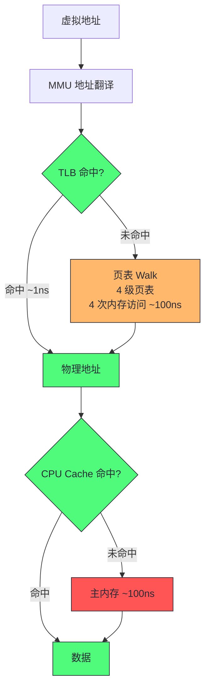
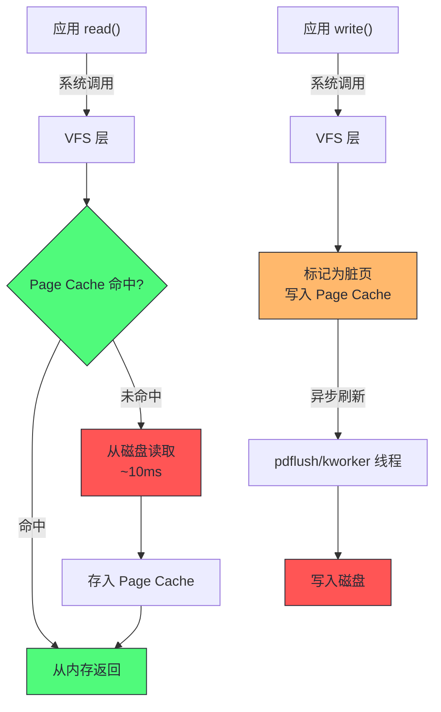
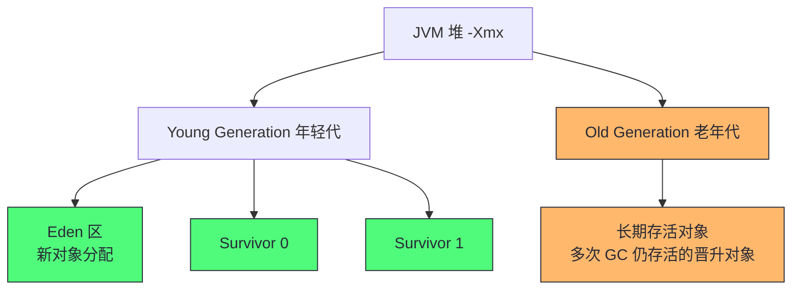
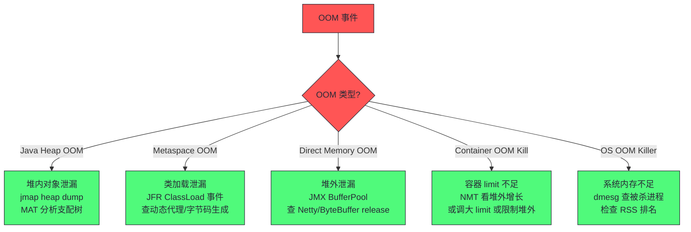

# 06 内存：从 NUMA 与页表到 JVM 堆模型

> [!abstract] 摘要
> 本文是核心资源深度解析的第二篇，聚焦内存子系统。文章从虚拟内存的硬件基础（MMU/TLB/页表）切入，讲透按需分页、文件系统分页（好）与匿名分页（坏）的本质区别，以及 Page Cache 如何成为 I/O 性能的关键加速层。随后拆解 NUMA 在内存维度的性能影响，下沉到 JVM 堆模型——从堆区域划分到对象内存布局再到堆外内存追踪（NMT）。核心认知：内存性能问题的三重维度——OS 层的交换/OOM、硬件层的 NUMA/TLB、JVM 层的堆布局/GC 压力，三层必须打通分析。

---

## 第 1 章 虚拟内存：进程的私有地址空间幻象

### 1.1 虚拟内存是什么

虚拟内存是现代操作系统的核心抽象之一。每个进程拥有独立的虚拟地址空间（64 位 Linux 默认 128TB），进程以为自己独占了全部内存。OS 和硬件（MMU）协作，把虚拟地址映射到物理地址，实现多进程隔离和内存超额订购（overcommit）。

虚拟内存的三个核心价值值得从性能视角重述。**隔离**：进程间地址空间互不可见，一个进程的越界访问不会破坏其他进程——这是稳定性的基石，但代价是每次访存都要经过地址翻译。**超额订购（overcommit）**：内核允许分配超过物理内存总量的虚拟地址（`vm.overcommit_memory` 的三种策略），这让"预留大块地址空间"变得廉价，但也埋下了"分配成功、使用时 OOM"的隐患。**按需物理分配**：虚拟内存只有在真正写入时才消耗物理页——这个特性是理解 JVM 内存指标（VSS vs RSS）的基础。

虚拟地址到物理地址的翻译由 MMU（Memory Management Unit）完成，翻译过程查页表（Page Table）。页表是内存中的数据结构，存储"虚拟页号 → 物理页号"的映射。如果每次访存都要查页表（多级页表需要 4 次内存访问），性能会崩溃。因此 CPU 有 TLB（Translation Lookaside Buffer）——页表项的硬件缓存，缓存最近使用的映射。



> [!info] 核心概念：TLB miss 的隐性代价
> TLB 容量有限（通常 1000-2000 项），每个项覆盖一个 4KB 页。如果进程访问的内存范围超过 TLB 容量（约 4-8MB），TLB miss 率上升，每次 miss 触发页表 walk（4 次内存访问，~100ns）。对于大内存应用（如 32GB 堆的 JVM），TLB miss 是显著的性能损耗。Huge Page（2MB/1GB 页）是直接的解决方案——同样 32GB 内存，2MB 页只需 16000 个页表项，4KB 页需要 800 万个，TLB 命中率天差地别。第 05 篇已展开 Huge Page 对 JVM 的价值，这里强调的是虚拟内存地址翻译本身就是性能分析需要关注的维度。

TLB miss 还有一个容易被忽视的放大器——**上下文切换后的 TLB 污染**。TLB 缓存的是"虚拟地址 → 物理地址"映射，进程切换后新进程的映射完全不同——传统 x86 通过刷新 TLB（或 PCID 标签区分）处理。没有 PCID 时，每次上下文切换都清空 TLB，切换后的一批访存全部 miss——这把第 05 篇讲的"上下文切换的缓存冷启动代价"又放大了一层。高切换频率（锁竞争、频繁 I/O 阻塞唤醒）的系统，TLB miss 率会系统性偏高。观测方法：`perf stat -e dTLB-load-misses` 对比低切换时段——如果 miss 率与切换数正相关，TLB 污染就是问题的一部分，优化方向是减少切换（第 05 篇的锁竞争分析）。

### 1.2 按需分页：不触碰不分页

Linux 采用按需分页（Demand Paging）策略：`mmap` 或 `malloc` 分配虚拟内存时，只建立虚拟地址映射，不分配物理内存。只有进程实际访问该地址时，触发 page fault，内核才分配物理页并建立映射。

这意味着**虚拟内存分配不等于物理内存使用**。一个 `malloc(1GB)` 后不写入任何数据，物理内存占用几乎为零。这对理解 JVM 的内存指标很重要——JVM 的 `-Xmx` 是虚拟内存上限，实际物理使用（RSS）可能远小于它。

按需分页的工程影响：
- **首次访问的延迟尖刺**：首次访问一个新页会触发 page fault（~1-2μs），比正常访存（~100ns）慢 10 倍。JVM 堆初始化时的大量 page fault 是启动慢的一个因素
- **RSS vs VSS 的区别**：RSS（Resident Set Size）是实际在物理内存中的页，VSS（Virtual Set Size）是虚拟地址空间大小。性能分析关注 RSS，VSS 只用于判断地址空间是否够用
- **`-XX:+AlwaysPreTouch`**：JVM 选项，启动时预先 touch 整个堆，触发所有 page fault。代价是启动慢，收益是运行期没有首次访问的延迟尖刺。延迟敏感型生产服务推荐开启

按需分页还有一个进阶细节——**minor fault 与 major fault 的区分**。minor fault（次缺页）只需要分配物理页框（内存内操作，微秒级）；major fault（主缺页）需要从磁盘读入数据（文件页从磁盘、匿名页从 swap），毫秒级。`ps -o min_flt,maj_flt` 或 `sar -B` 可以分别观测。**majflt 持续非零是内存压力的强信号**——它意味着系统在用磁盘补充内存，性能已经进入"磁盘级"区间。第 07 篇讲 Page Cache 时会回到这个指标。

### 1.3 页表层级与 TLB：地址翻译的代价

4 级页表（PGD → PUD → PMD → PTE）意味着一次 TLB miss 要 4 次额外的内存访问——在 100ns 内存延迟下，一次 TLB miss 的代价约 400ns，比缓存 miss 还贵。这个代价在大内存应用上被急剧放大：TLB 容量约 1536-2048 项（Intel 近年架构的 L2 TLB 可达 2048-4096 项），4KB 页下覆盖 6-16MB 地址空间——一个 32GB 堆的 JVM，工作集远超 TLB 覆盖，TLB miss 率可能高达 5-10%。

量化 TLB miss 的影响：一个每秒 1 亿次内存访问的应用，TLB miss 率 5% 意味着每秒 500 万次页表 walk，每次 400ns，总计 0.2 秒/秒 = 20% 的 CPU 时间花在地址翻译上。这个开销在 perf stat 里表现为 `dTLB-load-misses` 高企，在应用层表现为"IPC 低但 cache 命中率正常"——停顿被 TLB 吃掉了。

5 级页表（LA57，Linux 4.14+ 支持）进一步加深了这个问题——128PB 地址空间需要 5 级翻译，TLB miss 代价增至 500ns。大页（Huge Page）的价值在此凸显：2MB 页把页表层级压缩到 3 级（PGD → PMD 直接映射 2MB 页），1GB 页更是只需 2 级——**大页不仅减少 TLB 条目需求，还缩短了 miss 时的 walk 路径**。这是第 05 篇 Huge Page 价值的机制解释。

### 1.4 文件系统分页 vs 匿名分页：好与坏的区分

Linux 内核把内存分页分为两类，理解它们的区别是内存性能分析的关键：

**文件系统分页（File-backed Paging）——好的分页**：
- 来源：文件的内存映射（mmap）或 Page Cache
- 页面内容可以在磁盘上找到
- 内存不足时，内核可以直接丢弃这些页（干净页）或写回磁盘（脏页），不需要 swap
- 回收代价低，对应用几乎无感知

**匿名分页（Anonymous Paging）——坏的分页**：
- 来源：进程的堆、栈、匿名 mmap（`MAP_ANONYMOUS`）
- 页面内容没有磁盘后背
- 内存不足时，内核必须把这些页写入 swap 设备才能回收
- 回收代价高：swap out（写磁盘）+ swap in（读磁盘）= 两次 I/O，且应用在等待期间被阻塞

两类分页的区分之所以重要，是因为它决定了**内存回收的代价模型**。文件页回收的代价是"丢缓存"（下次读重新从磁盘加载，慢但不阻塞）或"写回脏页"（一次 I/O）；匿名页回收的代价是"swap 出去"（一次写 I/O）+ 未来访问时"swap 回来"（一次读 I/O）——代价翻倍且阻塞应用。内核的回收算法（swappiness 参数）本质上就是在这两种代价之间做权衡：文件页便宜就多回收文件页，文件页不够了才动匿名页。这个代价模型是理解 swappiness、理解"为什么 Page Cache 是弹性内存"的机制基础。

> [!warning] 生产避坑：swap 不是内存优化手段
> 很多运维误以为 swap 是"内存不够时的缓冲"，实际上 swap 是性能灾难的开始。匿名分页到 swap 意味着应用的堆数据被写到磁盘，下次访问要读回来——磁盘延迟（~10ms）是内存延迟（~100ns）的 100 倍。一旦 vmstat 的 si/so（swap in/out）列开始非零，应用延迟会飙升。
> 生产环境的正确做法：**禁用 swap 或设 swappiness=0**（`sysctl vm.swappiness=0`），让内核在内存不足时直接 OOM kill 而不是 swap。OOM kill 虽然粗暴（杀进程），但比 swap 导致的全系统卡顿更可控。Kubernetes 默认要求禁用 swap。

### 2.1 swappiness 的精确语义与常见误读

swappiness 是内存调优中最常被误用的参数，值得精确澄清它的语义。swappiness（0-100）控制的是**回收倾向**：内核需要释放内存时，在"回收文件页（Page Cache）"与"换出匿名页（swap）"之间的权衡权重。它不是"swap 的开关"——即使 swappiness=0，内存极度紧张时内核仍会 swap（否则只能 OOM）。

误读一：**"swappiness=0 就完全不 swap"**。错误。0 只是最大化回收文件页的倾向，匿名页在文件页耗尽后仍会被换出。要绝对禁止 swap，用 `swapoff -a` 或不配置 swap 分区。

误读二：**"数据库服务器一律 swappiness=0"**。大体正确但要注意副作用——文件页被优先回收意味着 Page Cache 被压缩，数据库的文件读（如果没走 O_DIRECT）会更频繁地穿透到磁盘。更精细的方案是 cgroup 级别的 `memory.swappiness`（v1）或 `memory.swap.max`（v2），只对数据库进程禁 swap，保留系统级 Page Cache。

误读三：**"swap 用了就是坏事"**。大部分情况正确，但有一个例外——**冷匿名页的一次性换出**。应用启动时分配的初始化数据、长期不访问的配置对象，换出后不再访问，这次 swap out 是"免费的内存回收"。判断标准是 si/so 的**持续性**：偶发的、低速率的 swap out 后 si 长期为零，是健康模式；si/so 持续活跃（页面被反复换入换出——thrashing），才是性能灾难。观测命令：`vmstat 1` 看 si/so 的速率与持续性，`/proc/vmstat` 的 `pswpin/pswpout` 看累计量。

### 2.2 内存回收的水位机制：为什么"内存还够"也会触发回收

Linux 的内存回收不是"用满了才回收"，而是**水位驱动**的。每个内存 zone 有三个水位：high、low、min。空闲内存低于 low 时，kswapd 后台线程开始异步回收；低于 min 时，分配进程被阻塞并触发直接回收（direct reclaim）——**这是延迟尖刺的来源**，因为直接回收在应用线程的内存分配路径上同步执行。

这个机制解释了一个常见的观测困惑："free 显示还有几个 GB，为什么还有回收活动？"——因为回收看的是 per-zone 水位而非全局总量。NUMA 机器上尤其明显：node0 的内存耗尽而 node1 还有剩余时，跑在 node0 上的进程照样触发 node0 的回收（跨节点分配有额外策略约束）。观测工具：`/proc/zoneinfo` 看每个 zone 的水位与当前值，`sar -B` 的 `pgscan_kswapd`（后台回收）与 `pgscan_direct`（直接回收）区分两种模式——**pgscan_direct 非零就是延迟问题的直接证据**。

对 JVM 的含义：堆外分配（线程创建、Direct Memory、native 库）走内核分配路径，同样受水位机制影响。一个"堆够用但堆外分配频繁"的 JVM，可能因为 direct reclaim 出现与 GC 无关的延迟尖刺。这也是第 04 篇 NMT 强调"堆外也要监控"的内核机制依据。

---

## 第 2 章 Page Cache：I/O 性能的隐形加速层

### 2.1 Page Cache 的工作原理

Page Cache 是 Linux 内核的文件系统缓存——把最近访问的文件内容缓存在内存中，后续读操作直接从内存返回，不经过磁盘。这是 Linux I/O 性能的核心机制。

Page Cache 的工作流程：



Page Cache 的存在从根本上改变了 I/O 的性能模型：**应用感知的 I/O 延迟与磁盘物理延迟是两个不同的量**。一个 Page Cache 命中率 99% 的读负载，平均延迟 = 0.99 × 1μs + 0.01 × 10ms ≈ 101μs——比磁盘物理延迟低两个数量级。这就是为什么"磁盘很慢"和"应用 I/O 慢"是两个命题：缓存命中率决定了两者的距离。第 07 篇会用完整的命中率经济学展开这个主题。

Page Cache 的关键特性：

| 特性 | 机制 | 性能影响 |
|------|------|---------|
| 读缓存 | 读操作先查 cache，命中直接返回 | 重复读极快 |
| 写缓冲 | write() 先写入 cache（标记脏页），异步刷盘 | write() 返回快，但数据可能未持久化 |
| 预读 | 顺序读时预取后续页到 cache | 顺序 I/O 性能远好于随机 |
| 回收 | 内存不足时丢弃干净页，写回脏页 | 对应用透明，但大量脏页写回时 I/O 压力大 |

### 2.2 预读：Page Cache 的"投机"机制

预读（readahead）是 Page Cache 对顺序读的针对性优化，值得单独一节，因为它是"顺序 I/O 快于随机 I/O"在 OS 层的机制根源。

预读的工作方式：内核检测到进程在**顺序读**一个文件（连续命中相邻页），就推断"接下来大概率继续顺序读"，于是在应用请求之前，提前把后续页从磁盘读入 Page Cache。应用下次 read 时直接命中缓存，磁盘延迟被完全隐藏。预读窗口是动态的：检测到稳定的顺序模式时窗口扩大（最多到 `vm.max_readahead`，典型 128KB-1MB），检测到随机模式时窗口收缩到最小。

预读对性能分析的含义有两面。**正面**：顺序读的"有效延迟"可以远低于磁盘物理延迟——一个顺序读大文件的场景，`iostat` 显示磁盘持续 80% 利用率，但应用感知的读延迟可能只有几十微秒（缓存命中），磁盘 I/O 被"流水线化"了。**反面**：预读对随机读是纯浪费——每次随机读都触发一个预读窗口的加载，读 4KB 实际搬了 128KB，磁盘带宽被浪费 32 倍。数据库的随机读场景（索引点查）会显式调小 readahead（`blockdev --setra`）甚至用 O_DIRECT 绕过。

观测预读效果的工具：`sar -B` 的 `pgpgin/s`（每秒读入页数）对比应用的逻辑读请求量，比值远大于 1 说明预读在大量工作；BCC 的 `fileslower`/`readsnoop` 可以看单次 read 的实际耗时分布。第 07 篇讲存储 I/O 时会把预读放进完整的 I/O 路径里分析。

### 2.3 fsync 的代价与同步写入

Page Cache 的写缓冲有一个重要后果：`write()` 返回成功不代表数据已写到磁盘——数据只是到了 Page Cache 的脏页。如果此时机器断电，数据丢失。要保证数据持久化，应用需要调用 `fsync()`，强制把该文件的所有脏页刷到磁盘。

`fsync()` 的代价是磁盘 I/O 的完整延迟——它必须等待磁盘确认写入完成。对于机械盘，一次 fsync 的延迟在 5-15ms；对于 SSD，在 0.1-2ms。如果应用每次写入都 fsync（如数据库的 WAL），I/O 延迟由 fsync 决定，而不是 write。

> [!info] 回到支付服务案例
> 第 01 篇的支付服务延迟尖刺，直接原因就是日志组件的同步写入 + fsync。DEBUG 日志开启后，每条日志都触发 write + fsync，每次 fsync 等 80ms+。Page Cache 在这里扮演了"缓冲但不解决"的角色——write 很快（到 Page Cache），但 fsync 必须等磁盘。解决方案是异步日志（写入队列 + 批量 fsync），把多次 fsync 合并为一次，降低单次延迟影响。这再次印证了"全栈视角"的价值——根因在应用层（日志配置），瓶颈在 OS 层（fsync 磁盘），关联在 JVM 层（GC 压力）。

### 2.4 Page Cache 与 JVM 的关系

JVM 对 Page Cache 的使用有两面性：

**JVM 堆本身不是 Page Cache**——堆是匿名内存（MAP_ANONYMOUS），不走文件系统分页。但 JVM 的以下操作会使用 Page Cache：
- 类加载：从 jar 文件读取类字节码，走 Page Cache
- 日志写入：write 到日志文件，走 Page Cache
- 堆外映射文件：如 `mmap` 方式的堆外内存映射
- JIT 代码缓存加载（如果有 disk cache）

一个生产实践：**JVM 应用应该保留足够的内存给 Page Cache**。常见误区是把几乎所有物理内存分配给 JVM 堆（`-Xmx` 设到物理内存的 80%+），导致 Page Cache 几乎为零。后果是：
- 类加载每次从磁盘读（无 cache 命中）
- 日志写入每次触发真实 I/O
- 其他进程的 I/O 也受影响（cache 被挤占）

Page Cache 与 JVM 的关系还有一个动态维度值得理解：**Page Cache 是"弹性内存"，堆是"刚性内存"**。堆一旦分配（尤其 AlwaysPreTouch 后）就长期占用，Page Cache 则随内存压力伸缩——内存紧张时被回收，空闲时自动扩张。这个差异决定了内存规划的优先级：先满足刚性需求（堆 + 堆外），剩余给弹性需求（Page Cache）。反过来，如果 Page Cache 被大量占用（譬如刚做完一次大文件扫描），JVM 的堆外分配可能触发回收甚至 swap——"弹性挤占刚性"是内存规划要避免的反模式，cgroup 的 memory limit 就是防止这种挤占的机制（第 13 篇展开）。

### 2.5 Page Cache 的观测与调优

Page Cache 的观测工具：

| 工具 | 命令 | 观测内容 |
|------|------|---------|
| free | `free -m` | cached 列 = Page Cache 大小 |
| sar | `sar -r 1` | kbcached 历史趋势 |
| vmstat | `vmstat 1` | cache 列、bi/bo（块 I/O） |
| cachestat | `cachestat 1`（BCC） | cache 命中/未命中率 |
| cachetop | `cachetop 1`（BCC） | 进程级 cache 命中率 |
| vmscan | `bpftrace` 追踪 `vmscan:*` | 页面回收详情 |

`cachestat` 是 BCC 工具，直接给出 Page Cache 命中率，比从 free 间接推断更精确：

```
$ cachestat 1
   HITS    MISSES  DIRTIES  HITRATIO  BUFFERS_MB  CACHED_MB
    1234       56       12     95.7%          45      12345
```

HITRATIO 是 Page Cache 命中率。如果命中率持续低于 50%，说明工作集超过可用 cache 容量——要么增加可用内存（减小 JVM 堆），要么优化 I/O 模式（改为顺序读、减少随机访问）。

Page Cache 的可调参数：

| 参数 | 默认值 | 作用 |
|------|--------|------|
| vm.dirty_ratio | 20 | 脏页占内存 20% 时，写操作阻塞直到刷盘 |
| vm.dirty_background_ratio | 10 | 脏页占 10% 时，后台异步刷盘启动 |
| vm.dirty_expire_centisecs | 3000 | 脏页存活 30s 后必须刷盘 |
| vm.swappiness | 60 | 匿名页 vs 文件页回收倾向（0 = 不 swap） |

这四个参数构成一个协同系统，理解它们的联动比单独调任何一个都重要。脏页的生命周期由两条线控制：**比例线**（dirty_background_ratio 触发后台刷盘 → dirty_ratio 触发同步阻塞）和**时间线**（dirty_expire 到期强制刷盘）。两条线的交互决定了写 I/O 的"节奏"：比例调高 → 脏页积累多、刷盘批量更大、单次刷盘时间更长；比例调低 → 刷盘频繁但每次量小、延迟更平滑。**没有普适的最优值**——吞吐型负载（日志采集、批处理）倾向高比例（减少刷盘次数），延迟敏感型负载倾向低比例（避免集中刷盘的尖刺）。

对有持久化需求的服务（数据库、消息队列），还有第五个参数值得知道：`vm.dirty_expire_centisecs` 控制脏页最长存活时间，它与 fsync 的语义互补——fsync 是"应用主动要求落盘"，expire 是"内核兜底强制落盘"。依赖 expire 兜底的应用（譬如只 write 不 fsync 的日志）在断电时会丢最多 30 秒数据——这个窗口是业务可接受的吗？答案决定了脏页参数的调优方向。第 07 篇会从存储视角完整展开 fsync 的代价模型。

> [!warning] 生产避坑：dirty_ratio 过高导致延迟尖刺
> `vm.dirty_ratio` 默认 20%，意味着 64GB 内存的服务器允许 12.8GB 脏页积累。当脏页达到这个阈值时，所有写操作会阻塞直到刷盘完成——这可能导致秒级的延迟尖刺。对于延迟敏感型应用，建议降低 `vm.dirty_ratio` 到 5-10%、`vm.dirty_background_ratio` 到 1-5%，让后台刷盘更早启动，避免前台阻塞。但代价是后台 I/O 更频繁，总 I/O 量可能略增。这是"延迟 vs 吞吐"的经典权衡。

> [!note] 设计哲学：JVM 堆大小的"三分之一"原则
> 生产环境 JVM 堆大小的一个经验法则：物理内存的 1/3 给堆，1/3 给堆外（Metaspace + 线程栈 + 直接内存 + JVM 自身），1/3 给 OS Page Cache。这个比例不是绝对值，但核心思想是：**不要把所有内存给 JVM，OS 的 Page Cache 对整体性能同样重要**。容器环境中这个原则调整为：容器内存限制的 50-60% 给堆，其余给堆外和 cache。

---

## 第 3 章 NUMA 在内存维度的性能影响

### 3.1 NUMA 的内存分配策略

第 05 篇介绍了 NUMA 的硬件模型，本篇聚焦内存分配策略。Linux NUMA 的默认分配策略是 first-touch：内存页面在首次被访问时分配在当前线程所在 NUMA node。这意味着：

- 哪个线程先 touch 内存，内存就分配在哪个 node
- 后续其他 node 的线程访问该内存时，需要跨 node 访问
- JVM 堆的初始化如果由主线程完成（如 `-XX:+AlwaysPreTouch`），整个堆分配在主线程所在 node

first-touch 的设计逻辑值得理解：它假设"谁先碰这块内存，谁最可能继续用它"——对大多数负载这是合理的局部性假设。但它对 JVM 有一个反直觉的后果：**GC 线程与业务线程的"触碰权"竞争**。业务线程分配对象（first-touch 到业务线程的 node），GC 线程扫描和复制对象（访问跨 node）——GC 的内存流量天然是跨节点的。`-XX:+UseNUMA` 的解决方案是让 GC 感知拓扑：G1 按 node 划分 Region，GC 线程优先处理本 node 的 Region，把跨节点流量降到最低。

NUMA 分配策略的 sysctl 控制：

| 策略 | 值 | 行为 | 适用场景 |
|------|---|------|---------|
| MPOL_DEFAULT | 0 | 默认 first-touch | 一般场景 |
| MPOL_BIND | 1 | 绑定到指定 node | 延迟敏感、避免跨 node |
| MPOL_INTERLEAVE | 2 | 轮询跨 node 分配 | 大堆 JVM，均匀分布 |
| MPOL_PREFERRED | 3 | 优先指定 node，不够时用其他 | 尽量本地但不强求 |

### 3.2 三种 NUMA 策略的权衡：没有免费午餐

策略选择的核心权衡是**局部性 vs 容量**，三种策略各占一端：

**BIND（绑定单节点）**：局部性最优（零跨节点访问），但容量上限是单节点内存。32GB 堆绑在 64GB 单节点上没问题；绑在 32GB 节点上则堆外内存无处安放。适合"工作集 < 单节点容量"的延迟敏感服务。

**INTERLEAVE（交错分布）**：容量最优（用满所有节点），但局部性最差——约一半访问跨节点。它的隐藏优势是**带宽聚合**：内存密集型流式负载（GC 扫描、大数组遍历）在交错模式下能同时用两个节点的内存控制器，总带宽接近翻倍。对"带宽瓶颈型"负载，交错的带宽收益可能超过跨节点延迟的损失——这就是为什么 HPC 场景常用 interleave。

**DEFAULT（first-touch）**：折中但不可控——分配位置取决于"谁先碰"，JVM 的多线程分配让堆的节点分布近乎随机。它的问题不是"差"，而是**不可预测**：同样的应用在不同启动时序下，堆的 NUMA 分布可能完全不同，性能随之波动。生产环境要的是确定性，这正是显式策略（BIND/INTERLEAVE/UseNUMA）存在的理由。

判读工具：`numastat -p <pid>` 的输出里，`numa_hit`（本地命中）与 `numa_miss`（本地分配失败回落远端）、`numa_foreign`（本应为本地却分到远端）三个指标刻画分配质量；`perf stat -e node-loads,node-load-misses` 刻画运行时访问质量。**分配策略调优的验证标准就是这两个 miss 率的下降**。

### 3.3 NUMA 与 GC 的交互：为什么大堆 GC 慢

NUMA 对 GC 性能的影响机制需要深入理解。GC 扫描堆时需要遍历大量内存页，如果堆跨多个 NUMA node，GC 线程访问远端 node 的堆区域会产生跨 node 延迟。这个延迟在 GC 的标记阶段尤其显著——标记阶段需要扫描整个堆的存活对象，跨 node 访问让标记时间翻倍。

GC 的 NUMA 敏感性有一个量化框架：**GC 的内存流量模式决定了它对 NUMA 的敏感度**。标记阶段是"读密集 + 随机访问"（遍历对象图，指针追逐），预取器无效，跨节点延迟全额暴露；复制阶段（evacuation）是"读 + 写的流式搬运"，对带宽敏感——跨节点时不仅延迟高，还与业务线程争抢互连带宽。两个阶段叠加，NUMA 感知与否的 GC 停顿差异可以达到 2 倍。

以 G1 GC 为例，它的堆模型是 Region-based。如果 JVM 开启了 `-XX:+UseNUMA`，G1 会尝试把 Region 按 NUMA node 分组，GC 线程优先扫描本地 node 的 Region。但如果没开启 UseNUMA，Region 的分布是随机的，GC 线程大量跨 node 访问。

一个量化案例：32G 堆跨 2 node，G1 Mixed GC 的标记阶段：
- 无 NUMA 感知：标记时间 800ms（大量跨 node 访问）
- 开启 UseNUMA：标记时间 450ms（本地 node 优先）
- 单 node 绑定（堆 < 单 node 容量）：标记时间 420ms

> [!note] ZGC 与 NUMA
> ZGC 的设计目标是亚毫秒级停顿，它用染色指针和并发转移实现了几乎不停顿的 GC。但 ZGC 的并发标记和转移仍然需要扫描堆，NUMA 的影响依然存在。ZGC 在 JDK 17+ 增加了 NUMA 感知的堆分配（`-XX:+UseNUMA`），把 ZPage 优先分配在 GC 线程所在 node。对于 64GB+ 堆的 ZGC 应用，NUMA 感知可以减少 20-30% 的并发标记时间。

### 3.4 NUMA 观测与 JVM 大堆的实践方案

NUMA 观测工具：

| 工具 | 命令 | 观测内容 |
|------|------|---------|
| numactl | `numactl --hardware` | NUMA 拓扑、node 数、每 node 内存 |
| numastat | `numastat -p <pid>` | 进程在各 node 的内存分布与命中统计 |
| lscpu | `lscpu \| grep NUMA` | CPU 到 NUMA node 的映射 |
| /sys | `cat /sys/devices/system/node/node*/meminfo` | 每 node 内存详情 |
| perf | `perf stat -e node-loads,node-load-misses` | NUMA 访问命中率 |

> [!warning] 生产避坑：JVM 大堆的 NUMA 陷阱
> 第 01 篇提到的"32G 堆 GC 变慢"案例，根因是 NUMA first-touch 导致堆分布不可控。解决方案按优先级排列：
> 1. **`-XX:+UseNUMA`**：HotSpot 的 NUMA 感知模式，让 JVM 按线程所在 node 分配堆区域（region-based），GC 线程优先扫描本地 node 的 region。最优方案但依赖 GC 支持（G1 支持，ZGC 部分支持）。
> 2. **`numactl --interleave=all`**：启动 JVM 时用 interleave 策略，堆在所有 node 间均匀分配。简单且带宽友好，但一半访问跨 node——适合带宽瓶颈型负载。
> 3. **缩小堆到单 node 容量 + `--membind=0`**：最保守但确定性最强——零跨节点访问，代价是容量上限。适合延迟敏感且工作集可控的服务。
>
> 三种方案的验证标准统一：调优后 `numastat` 的 numa_miss 下降、`perf stat` 的 node-load-misses 占比下降、GC 停顿时间下降。**没有验证的 NUMA 调优等于没调**——策略选错方向（譬如给延迟敏感服务上 interleave）可能让性能更差。

---

## 第 4 章 JVM 堆模型与内存布局

### 4.1 JVM 堆区域划分

JVM 堆是 Java 对象的生存空间，按 GC 分代假设划分为不同区域。分代假设的核心观察是：**大多数对象朝生夕死，少数对象长期存活**。基于此，堆被划分为：



各区域的典型比例和作用：

| 区域 | 默认比例 | 作用 | GC 类型 |
|------|---------|------|--------|
| Eden | Young 的 8/10 | 新对象分配 | Minor GC |
| Survivor 0/1 | Young 的各 1/10 | GC 后存活对象的临时存放 | Minor GC |
| Old | 堆的 2/3 | 长期存活对象 | Major GC / Full GC |

对象在堆中的生命周期：
1. 新对象在 Eden 分配（通过 TLAB 快速分配）
2. Eden 满时触发 Minor GC，存活对象复制到 Survivor 区
3. 每经历一次 Minor GC，对象年龄 +1
4. 年龄达到阈值（默认 15）或 Survivor 空间不足，晋升到 Old 区
5. Old 区满时触发 Major GC / Full GC

这个分代结构的性能含义值得从内存分析角度强调：**对象的"年龄"就是它的"内存位置"**。朝生夕灭的对象（绝大多数）终生待在 Eden/Survivor——它们所在的内存区域被高频复用，缓存亲和性好；晋升到 Old 的对象进入"慢区"——访问频率低但占用大。这个结构让"分配速率"和"晋升速率"成为内存分析的两个核心指标：分配速率决定 Minor GC 频率（Eden 填满速度），晋升速率决定老年代增长速度（Full GC 的触发周期）。第 10 篇 GC 工程化会基于这个模型展开调优。

> [!info] 核心概念：TLAB（Thread Local Allocation Buffer）
> TLAB 是 JVM 在 Eden 区为每个线程预分配的一小块内存。线程创建新对象时优先在 TLAB 中分配——因为 TLAB 是线程私有的，分配不需要加锁（只需移动指针）。只有 TLAB 空间不足时才需要向 Eden 申请新空间（可能需要 CAS）。TLAB 让 Java 对象分配的开销降到几纳秒级，接近 C 的 malloc 效率。
> `-XX:+UseTLAB` 默认开启，`-XX:TLABSize` 可调整 TLAB 大小。TLAB 太小会导致频繁向 Eden 申请（CAS 开销），太大浪费 Eden 空间。JVM 会根据线程的分配速率自适应调整 TLAB 大小。

> [!info] G1 GC 的区域模型变化
> 上面是传统分代 GC（Serial/Parallel/CMS）的堆模型。G1 GC 引入了 Region 模型——堆被划分为 2048 个等大 Region（1-32MB），每个 Region 可以动态地充当 Eden/Survivor/Old/Humongous。G1 不再是物理连续的分代区域，而是逻辑分代。ZGC 和 Shenandoah 更进一步，用染色指针（Colored Pointer）实现并发标记和转移。这些 GC 的堆模型差异会影响内存性能分析的方式，专栏第 10 篇会详细展开。

### 4.2 对象内存布局：从字段排列到缓存行为

第 05 篇从缓存视角提到了 Java 对象布局的劣势，这里从内存视角完整展开。一个 Java 对象在 64 位 JVM（开启压缩指针）中的布局：

```text
| Mark Word (8B) | Klass Pointer (4B) | 字段 1 | 字段 2 | ... | 对齐填充 |
```

布局规则由三条决定：**对象头固定 12 字节**（压缩指针下）；**字段按类型对齐排列**（long/double 8 字节对齐，int/float 4 字节，引用 4 字节）；**总大小补齐到 8 字节倍数**。JVM 的字段重排（field packing）会把同宽度的字段聚在一起，先放 long/double，再 int/float，再 short/char，最后引用——目标是减少对齐空洞。

这个布局对性能的影响通过一个具体计算最直观。一个只有 `int a` 和 `int b` 的对象：12B 头 + 8B 字段 + 4B 填充 = 24 字节，**有效数据占比 33%**。同样两个 int 放在 `int[]` 数组里：数组头 16B + 8B 数据 = 24 字节装 2 个元素，之后每增加一个元素只加 4 字节——**规模化后数组的数据密度是对象的 6 倍**。这就是"值类型"（Valhalla 项目）要解决的问题，也是高性能 Java 库用扁平数组替代对象图的量化依据。

对象布局的观测工具是 JOL（Java Object Layout），第 11 篇会详细展开。这里先建立"布局即性能"的直觉：**对象的内存布局决定了缓存行的利用率，缓存行利用率决定了访存效率，访存效率决定了实际性能**——从字段声明到 CPU 周期，这是一条完整的因果链。

### 4.3 JVM 堆外内存全景

JVM 进程的内存远不止堆。一个完整的 JVM 内存组成：

| 内存区域 | 可见工具 | 典型大小 | 常见问题 |
|---------|---------|---------|---------|
| Java Heap | JMX、JFR | -Xmx | OOM、GC 压力 |
| Metaspace | JMX | 几十-几百MB | 类加载泄露导致 OOM |
| Thread Stack | JMX（线程数×栈大小） | 线程数×1MB | 线程过多耗尽内存 |
| Code Cache | JMX | 几十-几百MB | JIT 编译代码缓存 |
| Direct Memory | JMX BufferPool | -XX:MaxDirectMemorySize | Netty/ByteBuffer 泄漏 |
| JVM 自身 | NMT Internal | 几十MB | 通常无问题 |
| GC 数据结构 | NMT GC | 与堆大小相关 | 大堆时显著 |
| Native 库堆 | NMT（部分） | 取决于应用 | JNI 库泄漏难追踪 |

> [!warning] 生产避坑：容器 OOM 但堆未满
> 一个常见问题：Java 容器因 OOM 被 kill（Exit 137），但 JMX 显示堆使用远未达到 -Xmx。原因在于堆外内存——最常见的是 Direct Memory 泄漏（Netty 的 ByteBuf 未 release）或 Metaspace 泄漏（动态生成类未卸载）。
> 排查步骤：
> 1. `jcmd <pid> VM.native_memory summary` 看 NMT 各区域
> 2. JMX `java.nio:type=BufferPool,name=direct` 看 Direct Memory 使用
> 3. JMX `java.lang:type=Metaspace` 看 Metaspace 使用
> 4. 如果 NMT 未开启，重启时加 `-XX:NativeMemoryTracking=summary`，下次 OOM 前 diff 定位增长区域
> **容器内存限制应大于 -Xmx + 堆外内存预估 + JVM 自身开销**，不能只按 -Xmx 设置容器 limit。

Monica Beckwith 在《JVM Performance Engineering》第 5 章用 NMT 展示了一个 JVM 进程的完整内存画像，强调"足迹（Footprint）"的概念——JVM 的内存足迹不只是堆，还包括所有堆外组件。她推荐用 `jcmd <pid> VM.native_memory summary` 作为 JVM 内存画像的第一步，这在容器化部署中尤其重要——容器内存限制约束的是整个进程的 RSS，不只是堆。

堆外内存全景还有一个"谁在增长"的动态视角。静态画像（一次 NMT summary）告诉你"内存由哪些区域组成"，动态画像（定期 NMT diff）告诉你"哪个区域在增长"。生产监控的黄金配置是：**对每个堆外区域建立"水位 + 增长率"双指标**——水位告警（绝对值逼近 limit）防 OOM，增长率告警（持续正增长）防泄漏。第 04 篇的容器 OOM 案例就是"增长率告警"价值的实证：Thread 区域每小时 +40MB 的增长，在水位告警触发（OOM）之前就能被发现。

NMT 的典型输出解读：

```
Total: reserved=56789MB, committed=32145MB
-                 Java Heap (reserved=32768MB, committed=32768MB)
-                     Class (reserved=1084MB, committed=45MB)     ← Metaspace
-                    Thread (reserved=12345MB, committed=12345MB)  ← 线程栈
-                      Code (reserved=245MB, committed=45MB)       ← Code Cache
-                        GC (reserved=512MB, committed=512MB)      ← GC 数据结构
-                  Internal (reserved=123MB, committed=123MB)      ← JVM 内部
-                    Symbol (reserved=67MB, committed=45MB)        ← 符号表
```

`reserved` 是虚拟地址空间预留，`committed` 是实际物理内存使用。性能分析关注 `committed`。容器 OOM 排查时，把所有区域的 committed 加起来，如果接近容器 limit，说明内存分配确实在堆外。

### 4.4 glibc 分配器：堆外内存的"隐形膨胀"

NMT 之外还有一个堆外内存的隐形变量——**glibc 的 ptmalloc 分配器**。JVM 通过 malloc 申请的 native 内存（以及所有 native 库的分配）都经过 ptmalloc，它的行为特性会放大进程的 RSS。

ptmalloc 的关键机制是 **arena**：每个 arena 是独立的堆区域，有自己的锁。为减少多线程锁竞争，glibc 在 64 位系统上最多创建 `8 × CPU 核数` 个 arena——一个 64 核机器理论上可以有 512 个 arena。每个 arena 向内核申请内存以 chunk 为单位，**释放时不一定归还给内核**（保留在 arena 的 free list 里复用）。后果：进程的 RSS 包含大量"已释放但未归还"的内存，且 arena 数量越多，碎片化越严重。

一个典型症状：JVM 的 NMT committed 稳定在 8GB，但容器 RSS 缓慢爬到 12GB 且不回落。差额就是 ptmalloc 的"保留内存"——不是泄漏（复用时不会重复申请），但在容器环境里它实打实占着 cgroup 配额。

三个层级的对策：

1. **限制 arena 数量**：`export MALLOC_ARENA_MAX=2`（或 4），牺牲一点并发分配性能换取内存可控。这是最常用的方案，对大多数 JVM 服务无感知。
2. **更换分配器**：`LD_PRELOAD=libjemalloc.so` 或 tcmalloc。jemalloc/tcmalloc 的碎片控制远好于 ptmalloc，且支持 `mallctl`/`MALLOC_CONF` 精细调优。Redis、MySQL 等内存敏感服务的标配，JVM 服务同样适用。
3. **主动归还**：glibc 2.8+ 支持 `malloc_trim(0)` 强制归还空闲内存，但需要应用代码触发，JVM 场景不实用。

验证手段：调参前后对比 `pmap -x <pid> | tail -1` 的总 RSS 与 NMT committed 的差值——差值收敛说明碎片被控制。第 04 篇 NMT 的"三角验证"在这里落地：**NMT 告诉你 JVM 申请了多少，RSS 告诉你进程实际占了多少，两者的差值就是分配器的"库存"**。

> [!info] NMT 的 baseline + diff 排查法
> NMT 最强大的排查模式是"基线 + 差异"：
> ```bash
> jcmd <pid> VM.native_memory baseline    # 建立基线
> # ... 运行一段时间（如 1 小时）...
> jcmd <pid> VM.native_memory diff        # 输出与基线的差异
> ```
> diff 输出会显示每个区域的增减量。如果某个区域持续增长（如 Internal +50MB/hour），就是泄漏的方向。这比单次 summary 更有诊断价值——单次 snapshot 看不出趋势，diff 能暴露"谁在增长"。

### 4.3 JVM 容器内存限制的完整计算公式

Monica Beckwith 建议的容器内存限制计算公式：

$$\text{容器 limit} \geq \text{-Xmx} + \text{MaxDirectMemorySize} + \text{MaxMetaspaceSize} + (\text{线程数} \times \text{栈大小}) + \text{Code Cache} + 512\text{MB}$$

各项的默认值和获取方式：

| 项目 | 默认值 | 获取命令 |
|------|--------|---------|
| -Xmx | 物理内存 1/4 | 启动参数 |
| MaxDirectMemorySize | 等于 -Xmx | `-XX:MaxDirectMemorySize` |
| MaxMetaspaceSize | 无上限（自动增长） | `-XX:MaxMetaspaceSize` |
| 线程栈大小 | 1MB | `-Xss` |
| Code Cache | 240MB | `-XX:ReservedCodeCacheSize` |
| 安全余量 | 512MB | JVM 自身 + GC 数据结构 |

一个实际计算示例：8G 堆、500 线程、256MB Direct Memory 的应用：
- 堆：8192MB
- Direct Memory：256MB
- Metaspace：256MB（建议显式限制）
- 线程栈：500 × 1MB = 500MB
- Code Cache：240MB
- 安全余量：512MB
- **总计：9956MB → 容器 limit 应设为 10GB**，而不是按堆设 8GB

这个公式的每一项都对应第 04 篇 NMT 的一个区域——公式不是经验拍脑袋，而是 NMT 画像的"规划版"。使用时有两个注意点。**其一，用 NMT 实测值替代估算值**：公式里的默认值是"最坏情况"，实际应用的真实足迹（第 04 篇 5.4 节的画像方法）往往更小——用实测画像规划可以省下 20-30% 的内存配额。**其二，Page Cache 的余量不能省**：公式里的 512MB 安全余量只覆盖 JVM 自身，应用如果有文件 I/O（日志、类加载、数据文件），Page Cache 的需求要单独加——这正是"三分之一原则"在容器环境的表达。

一个常见的规划错误是把 limit 设成恰好等于公式结果——没有给突发留余量。堆外分配有突发性（批量请求创建大量 Direct Buffer、瞬时线程创建），limit 贴着计算值会导致偶发 OOM。**公式算出的是"下限"，生产 limit 应该是下限的 1.2-1.3 倍**，多余的部分由 Page Cache 和突发余量共享。

---

## 第 5 章 内存性能分析实操

### 5.1 USE 方法在内存维度的落地

USE 方法（第 01 篇）在内存维度的落地比 CPU 维度更需要技巧，因为内存的三个指标都有"陷阱"：

| USE 指标 | 内存对应 | 工具 | 异常信号 | 解读陷阱 |
|---------|---------|------|---------|---------|
| 利用率 | 已用/总物理内存 | free、sar -r | > 90% 需警惕 | 用 available 而非 free；看 buff/cache 可回收性 |
| 饱和度 | 页面扫描、swap、OOM | vmstat si/so、sar -B、dmesg | si/so > 0、pgscan_direct > 0 | 区分 kswapd（后台）与 direct（同步） |
| 错误 | ECC 错误、分配失败 | edac-util、dmesg | 任何 ECC 错误都需关注 | ECC 可纠正错误也是硬件劣化前兆 |

这张表的关键是"解读陷阱"列——内存指标几乎每个都有误读空间。利用率看 `available` 不看 `free`（第 02 篇讲过 MemAvailable 的语义）；饱和度要区分回收路径（后台回收无害、direct reclaim 有害）；错误里的 ECC 可纠正错误（CE）不是即时故障，但 CE 频率上升是内存条老化的前兆（第 14 篇会讲 EDAC 观测）。**内存指标的"陷阱密度"是四大资源里最高的**——因为内存子系统的行为（回收、换页、NUMA）都藏在"看起来正常"的聚合数字后面。

### 5.2 内存分析工具速查

| 工具 | 命令 | 观测维度 |
|------|------|---------|
| free | `free -m` | 系统级内存使用与 cache |
| vmstat | `vmstat 1` | si/so、pgscan、pgfree |
| sar -B | `sar -B 1` | 页面扫描/回收详情 |
| sar -r | `sar -r 1` | 内存使用率历史 |
| pidstat | `pidstat -r 1` | 进程级 RSS 增长 |
| numastat | `numastat -p <pid>` | NUMA 分布 |
| smem | `smem -t -k` | 进程 USS/PSS/RSS（更准确） |
| NMT | `jcmd <pid> VM.native_memory summary` | JVM 内存按组件分类 |
| PSI | `cat /proc/pressure/memory` | 内存压力停顿时间 |
| pmap | `pmap -x <pid>` | 进程地址空间明细 |
| slabtop | `slabtop` | 内核 slab 缓存占用 |

其中 **PSS（Proportional Set Size）值得专门解释**。共享内存页（譬如多个 JVM 共享的 CDS 归档、共享库）在 RSS 里被每个进程完整计入——10 个 JVM 各报 2GB RSS，宿主机实际只用了 2.5GB（共享部分只算一次）。PSS 把共享页按进程数均摊，是"进程真实内存足迹"的最准确度量。容器环境的内存规划应该基于 PSS 而非 RSS——`smem` 工具直接输出 PSS 列。这个区分在高密度部署（一台宿主机跑几十个 JVM）时尤其重要：按 RSS 之和规划会严重高估需求，按 PSS 规划才接近真实。

### 5.3 OOM 排查决策树



使用这棵决策树的第一步是**区分 OOM 的"报告者"**——同样是 OOM，报告者不同，根因域完全不同：

- **JVM 报告**（`java.lang.OutOfMemoryError`）：JVM 自己的内存管理发现问题，按错误子类型分流（Java heap space / Metaspace / Direct buffer memory / unable to create native thread）。
- **cgroup 报告**（容器 Exit 137）：整个进程的内存足迹超限，JVM 内部可能一切正常——排查方向是 NMT 画像与 limit 的差额。
- **内核报告**（dmesg 的 OOM killer 记录）：系统级内存耗尽，内核按 oom_score 选杀——排查方向是全机内存分布（谁是大户、有没有共享内存误算）。

三种报告者的区分命令：`dmesg -T | grep -i "killed process"`（OS 级）、`kubectl describe pod`（容器级）、应用日志（JVM 级）。**先确认"谁在报 OOM"，再进入对应分支**——跳过这一步直接查堆，是 OOM 排查最常见的时间浪费。

### 5.4 支付服务案例的内存视角

回到支付服务案例，内存层面的观测：
- `free -m`：故障窗口 available 内存正常，无 swap
- `vmstat 1`：si/so 为零，无匿名分页
- `jcmd VM.native_memory`：堆外内存无异常增长
- **结论**：内存不是根因。DEBUG 日志产生的大量字符串对象在堆中分配，增加了 Young GC 频率，但堆大小充足（8G），未触发 Full GC（Full GC 是间接后果而非根因）

这个"内存无异常"的结论本身也有分析价值——它演示了 USE 方法在内存维度的完整过一遍：利用率（available 充足）、饱和度（无 swap、无 direct reclaim）、错误（无 OOM、无 ECC）。**排除与确认同样重要**：内存维度的干净信号把排查方向收敛到磁盘 I/O，避免了在内存方向的时间浪费。

---

## 第 6 章 案例复盘：一次"内存充足却频繁回收"的排查

用一个更微妙的案例深化本章内容。这个案例的教训是：内存问题的表象（回收活动）与直觉归因（内存不足）可能完全脱节。

**现象**：一个 64GB 内存、32GB 堆的缓存服务，`free` 显示 available 有 20GB，但 `sar -B` 显示 `pgscan_kswapd` 持续非零，偶发 `pgscan_direct`。P99 延迟偶发尖刺，与 direct reclaim 时刻吻合。

**第一轮：直觉排查（错误方向）。** "内存还剩 20GB 为什么回收？"——团队怀疑是监控数据错误，或内核 bug。检查了 `/proc/meminfo`，确认 available 确实充足。

**第二轮：按 zone 分解。** `cat /proc/zoneinfo` 揭示真相：**node1 的 DMA32 zone 空闲内存低于 min 水位**，而 node0 的内存充足。全局 available 是两个 node 的总和，但回收是 per-zone 的——node1 耗尽就回收 node1，与 node0 无关。

**根因**：该服务的 JVM 用 `--membind=1` 绑定在 node1（历史配置），node1 的 32GB 中堆占 30GB，堆外 + 内核占用让 node1 的 zone 长期处于低水位。kswapd 持续回收 node1 的 Page Cache（把缓存页挤掉），偶发触发 direct reclaim 阻塞堆外分配。

**修复**：去掉 membind，改用 `-XX:+UseNUMA` 让堆分布到两个节点；同时把容器/进程的内存规划从"全局 available"改为"目标 node 的 zone 水位"。修复后 pgscan_direct 归零，P99 尖刺消失。

**复盘的两个教训**：

1. **"全局内存充足"不等于"本地内存充足"**。NUMA 机器的内存分析必须按 node 分解——`numactl --hardware` 看每节点容量，`numastat -p` 看进程分布，`/proc/zoneinfo` 看水位。全局指标在 NUMA 机器上会系统性误导。
2. **绑定策略要随工作集重新评估**。`--membind` 是历史时期的决策（当时堆小、单节点够用），堆扩到 30GB 后它从"优化"变成了"枷锁"。**容量规划是持续过程，不是一次性配置**——工作集逼近节点容量时，绑定策略必须重新权衡（第 3.2 节的权衡框架）。

> [!note] 设计哲学：内存分析的三层分解
> 这个案例与本章的内容共同指向一个方法论：内存性能分析要按三个维度分解——**按区域分解**（堆/堆外/Page Cache/内核）、**按节点分解**（NUMA 本地/远端）、**按回收路径分解**（kswapd 后台/direct 同步/swap）。任何"内存有问题"的笼统判断都要落到这三个维度的具体坐标上，才能指向正确的修复动作。这与第 05 篇 CPU 的"结构思维"一脉相承——聚合指标发现问题，结构分解定位问题。

---

## 第 7 章 内存泄漏排查实战

### 7.1 Java 堆内泄漏的排查路径

Java 堆内泄漏是最常见的内存问题——对象被创建后无法被回收，堆持续增长直到 OOM。排查路径：

**第 1 步：确认泄漏**。监控 JMX `java.lang:type=Memory` 的 `HeapMemoryUsage.used`。如果每次 GC 后的 used 持续增长（GC 后基线不断抬高），说明有对象无法回收——这是泄漏的典型特征。正常应用的 GC 后 used 应该在一个稳定区间波动。

确认泄漏时有一个时间维度的技巧：**对比"同负载水平"的 GC 后基线**。应用有日周期流量（白天高、夜间低），堆水位也随之波动——直接看绝对值会把正常的负载波动误判为泄漏。正确做法是对齐"负载相同"的时段比较 GC 后基线，或者用"存活对象总量"（G1 的 live data size）指标——它剔除分配波动，直接反映存活对象总量。

**第 2 步：定位泄漏对象类型**。用 `jcmd <pid> GC.class_histogram` 查看堆对象直方图：

```
 num     #instances         #bytes  class name (module)
-------------------------------------------------------
   1:       1234567      1234567890  [Lcom.example.Order;
   2:       2345678       456789012  java.lang.String
   3:        567890       234567890  com.example.OrderItem
```

对比两次直方图（间隔 1-2 小时），实例数增长最快的类就是泄漏对象。

**第 3 步：定位引用链**。用 `jcmd <pid> GC.heap_dump /tmp/heap.hprof` dump 堆，用 Eclipse MAT（Memory Analyzer Tool）打开，执行 "Leak Suspects" 报告，MAT 会自动分析出泄漏的 GC Root 引用链——告诉你"哪个静态变量/线程/缓存持有了这些对象"。

> [!warning] 生产避坑：heap dump 的 STW 代价
> `GC.heap_dump` 会触发一次完整的 STW 暂停——暂停时间与堆大小成正比，32G 堆的 dump 可能暂停 10-30 秒。生产环境绝对不要在高峰期做 heap dump。正确时机是低峰期，或用 JFR 的 `jdk.ObjectAllocationSample` 事件做采样级别的泄漏分析（无 STW，但精度不如全量 dump）。

### 7.2 Metaspace 泄漏的排查

Metaspace 存储类的元数据（方法、字段、常量池等）。Metaspace 泄漏的典型原因：动态生成类未卸载——常见于反射代理（CGLIB、Javassist）、Groovy 脚本动态编译、JSP 重编译等。

Metaspace 泄漏有一个与堆内泄漏不同的关键机制：**类的生命周期由类加载器（ClassLoader）决定**。只要类加载器可达，它加载的所有类都不可回收——即使这些类已经没有任何实例。所以 Metaspace 泄漏的根因几乎总是"类加载器泄漏"：一个动态创建的 ClassLoader 被某个静态集合、线程本地变量或未注销的监听器持有。

排查命令：
```bash
jcmd <pid> GC.class_histogram | head -20   # 类实例数
jcmd <pid> VM.classloader_stats             # 类加载器统计
```

`VM.classloader_stats` 的关键列是 `classes`（该加载器加载的类数）和 `chunk_size`（占用的 Metaspace 块）。如果某个非启动类加载器的类数持续增长，就是泄漏方向。配合 heap dump 分析该 ClassLoader 对象的 GC Root 引用链，能直接定位持有它的静态字段。

JFR 的 `jdk.ClassLoad` 和 `jdk.ClassUnload` 事件可以看类的加载/卸载速率。如果加载远多于卸载，就是 Metaspace 泄漏。一个实用的健康判据：**长期运行的应用，"加载类总数 - 卸载类总数"应该趋于稳定**——持续增长意味着有类在只进不出。

### 7.3 Direct Memory 泄漏的排查

Direct Memory（直接内存）是 Java NIO 的 `ByteBuffer.allocateDirect()` 分配的堆外内存。它不走 JVM 堆，由 JVM 通过 `Unsafe.allocateMemory` 或 `malloc` 分配，需要手动 `release`（或等 Cleaner 回收）。Netty 的 `ByteBuf` 是最常见的 Direct Memory 使用者。

Direct Memory 的回收机制值得理解，因为它解释了泄漏的隐蔽性：DirectByteBuffer 对象本身在堆里（很小，只存地址），实际的堆外内存靠 Cleaner（一个 PhantomReference 机制）在堆对象被回收时释放。**堆内引用消失 → Cleaner 触发 → 堆外内存释放**——这个链条里任何一环延迟，堆外内存就滞留。GC 不主动回收 Direct Memory（它只回收堆内的引用对象），所以"堆看起来正常、堆外持续增长"是 Direct Memory 泄漏的典型画像。

排查命令：
```bash
# JMX 查看 Direct Memory 使用
jcmd <pid> PerfCounter.print | grep -i direct

# JMX MBean
# java.nio:type=BufferPool,name=direct -> memoryUsed
```

Direct Memory 泄漏的根因通常是：ByteBuf 创建后未在 finally 块中 release，或引用计数管理有 bug。Netty 的 `ResourceLeakDetector` 可以帮助定位：
```bash
java -Dio.netty.leakDetection.level=ADVANCED -jar app.jar
```

这会在日志中输出泄漏的 ByteBuf 分配栈。

### 7.4 泄漏排查的通用决策框架

三类泄漏（堆内、Metaspace、Direct Memory）的排查路径可以统一为一个决策框架，核心是**先用"增长区域"定位泄漏层，再进入对应工具链**：

| 增长信号 | 泄漏类型 | 首选工具 | 确认手段 |
|---------|---------|---------|---------|
| GC 后堆基线持续抬升 | 堆内泄漏 | GC.class_histogram | heap dump + MAT 引用链 |
| Metaspace committed 增长 | 类泄漏 | VM.classloader_stats | JFR ClassLoad/Unload 速率对比 |
| BufferPool direct 增长 | Direct Memory | JMX BufferPool | Netty LeakDetector |
| NMT Thread 区域增长 | 线程泄漏 | jcmd Thread.print | 线程数趋势 + 线程名模式 |
| NMT Internal/GC 增长 | JVM 内部 | NMT detail | 对比 JDK 版本已知问题 |
| RSS 增长但 NMT 稳定 | glibc 碎片 | pmap 对比 | MALLOC_ARENA_MAX 验证 |

这个表的用法是"从监控信号出发"：告警告诉你哪个指标在涨，表把指标映射到泄漏类型和工具链。**泄漏排查的第一步永远是"确定增长的区域"，而不是"猜哪里泄漏"**——区域定位错了，后面所有工具都用错地方。这也是第 04 篇 NMT"堆外也要监控"的方法论闭环：监控覆盖了所有区域，告警信号才能直接映射到这张表。

泄漏排查还有一个时间维度的纪律：**区分"真泄漏"与"缓增长"**。有些"增长"是健康的——缓存按设计填充、连接池按流量扩容、JIT 编译随代码路径增加。区分标准是**增长是否有界**：给增长曲线画一条"预期上限"（缓存的 maximumSize、连接池的 max、Metaspace 的合理水位），持续突破上限的才是真泄漏。没有上限设计的"增长"（譬如无界缓存）即使当前速率低，也是架构级隐患——它不是"泄漏 bug"而是"容量设计缺陷"，修复方式是给增长加上界，而不是排查泄漏。

---

## 第 8 章 本章核心认知

1. **虚拟内存分配 ≠ 物理内存使用**：关注 RSS 而非 VSS，首次访问的 page fault 是延迟尖刺来源之一；major fault 持续非零是内存压力的强信号
2. **文件系统分页是好的，匿名分页是坏的**：swap 是性能灾难，生产环境应禁用或 swappiness=0；swappiness 的精确语义是"回收倾向"而非"swap 开关"
3. **内存回收是水位驱动的**：pgscan_direct 非零就是延迟问题的直接证据；NUMA 机器上回收是 per-zone 的，"全局充足"不等于"本地充足"
4. **Page Cache 是 I/O 性能的隐形加速层**：不要把所有内存给 JVM，保留 1/3 给 Page Cache；预读让顺序读"快于"物理磁盘，但对随机读是纯浪费
5. **NUMA 策略是局部性与容量的权衡**：BIND 极致局部性、INTERLEAVE 极致容量、UseNUMA 感知式折中；没有验证（numa_miss 下降）的 NUMA 调优等于没调
6. **JVM 堆外内存是容器 OOM 的常见原因**：NMT 是排查堆外泄漏的核心工具；glibc arena 碎片是 RSS 与 NMT 差额的主要来源（MALLOC_ARENA_MAX/jemalloc 对策）
7. **TLAB 让 Java 对象分配接近 malloc 效率**：线程本地分配缓冲区避免了多线程分配竞争
8. **对象布局决定缓存行为**：对象头开销 + 对齐填充让小对象的数据密度只有数组的 1/6，高性能 Java 用扁平数组补偿
9. **泄漏排查从"增长区域"出发**：先定位哪个区域在涨（堆/Metaspace/Direct/Thread/RSS），再进入对应工具链——区域定位错了，工具全用错

---

## 参考资料

1. Brendan Gregg, *Systems Performance*, 2nd Edition, 2020. 第 7 章 "Memory"、第 4 章 NUMA 相关章节
2. Monica Beckwith, *JVM Performance Engineering*, O'Reilly, 2024. 第 5 章 "Memory Footprint"（NMT 与足迹）
3. Linux 内核文档, Documentation/admin-guide/mm/concepts.rst（页面回收与水位机制）
4. Mel Gorman, *Understanding the Linux Virtual Memory Manager*, 2004（VM 子系统经典）
5. Oracle 文档, Native Memory Tracking, https://docs.oracle.com/javase/8/docs/technotes/guides/troubleshoot/tooldescr022.html
6. glibc 文档, Malloc Tunable Parameters（MALLOC_ARENA_MAX）
7. JEP 450: Compact Object Headers（对象头压缩的演进方向）, https://openjdk.org/jeps/450

---

> [!note] 思考题
> 1. `free` 显示 available 20GB，但应用偶发延迟尖刺且 `pgscan_direct` 非零。可能的原因是什么？给出你的排查命令序列。
> 2. 一个 32GB 堆的 JVM 跑在 2 路服务器（每节点 64GB）上，GC 停顿异常长。你会选择哪种 NUMA 策略？为什么？如何验证效果？
> 3. NMT 显示 committed 8GB，容器 RSS 12GB。差额最可能来自哪里？如何验证和修复？
> 4. 为什么"每次 GC 后的堆基线"比"堆使用峰值"更能反映泄漏？用弱分代假说的语言解释"健康应用"与"泄漏应用"的堆水位差异。
