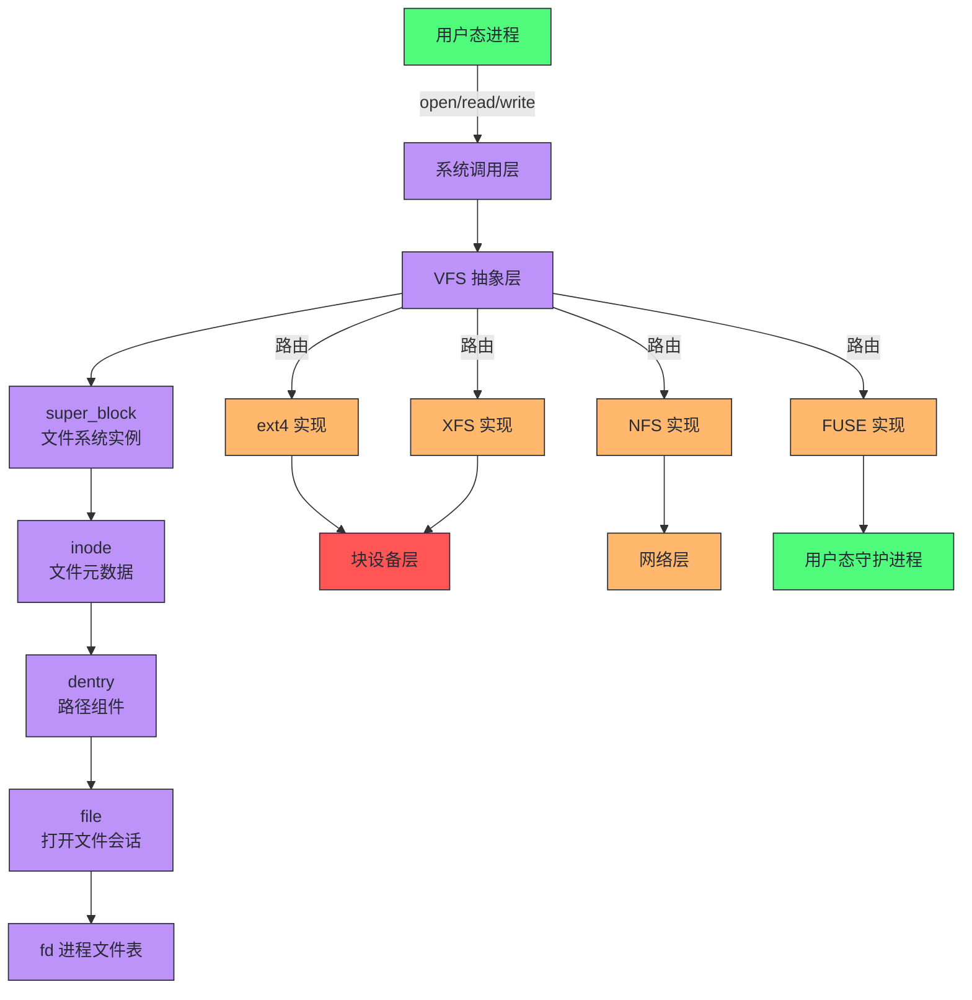
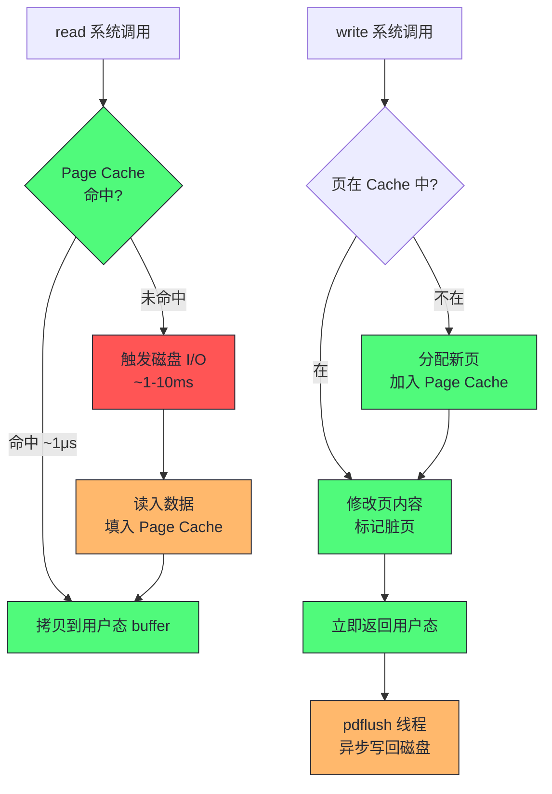
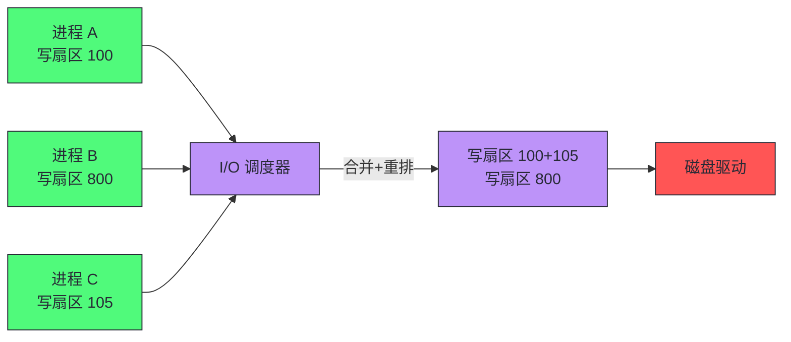
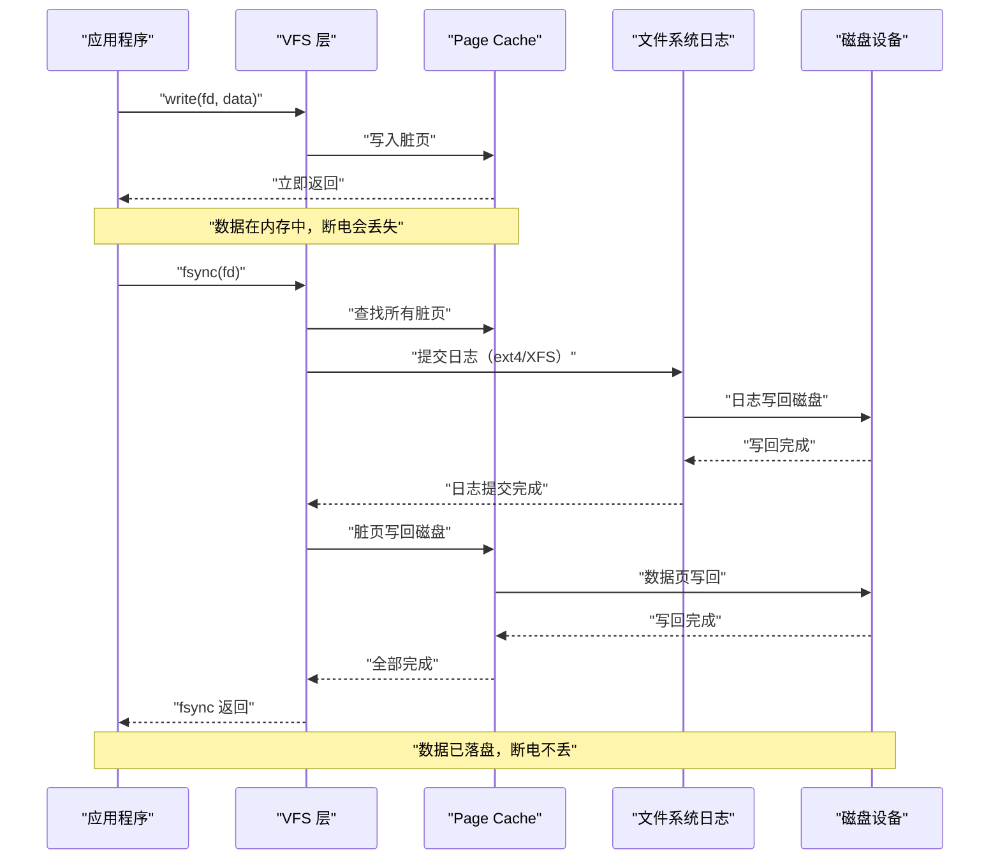
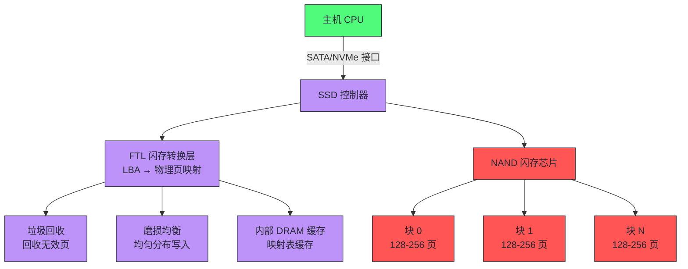
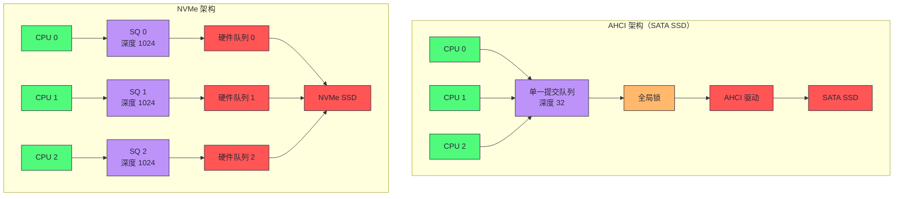

# 07 存储 IO：文件系统、Page Cache 与块设备

> [!abstract] 摘要
> 本文是核心资源深度解析的第三篇，聚焦存储 I/O 子系统。文章从 VFS 抽象层切入，讲透"一切皆文件"背后的四层对象模型（superblock/inode/dentry/file），随后下沉到 Page Cache 的命中率经济学——为什么缓存命中是 I/O 性能的第一性原理。接着拆解 I/O 调度器的演进逻辑与磁盘延迟模型，建立随机 vs 顺序访问的量化认知。fsync 的代价分析是本文的重点之一——一次 fsync 可能触发数毫秒到数十毫秒的阻塞，是数据库与消息队列延迟尖刺的常见根源。最后对比 SSD 与 NVMe 的特性差异，解释为什么 NVMe 不是"更快的 SSD"，而是架构范式的跃迁。核心认知：存储 I/O 性能问题的分析必须打通三层——文件系统层的缓存命中率、块设备层的调度与队列模型、硬件层的介质特性，三层缺一不可。

---

## 第 1 章 VFS：一切皆文件的抽象层

### 1.1 VFS 是什么

VFS（Virtual File System，虚拟文件系统）是 Linux 内核中位于具体文件系统实现之上的一层抽象。它的核心使命是让用户态进程用同一套系统调用（`open`/`read`/`write`/`close`/`stat`）操作任意底层文件系统——ext4、XFS、Btrfs、NFS、FUSE——而无需关心每种文件系统的内部数据结构差异。

这是"一切皆文件"哲学的工程落地。当你 `cat /proc/cpuinfo` 时，你读的是 procfs；当你 `echo > /dev/null` 时，你写的是设备文件；当你 `curl http://...` 时，socket 也是一个文件描述符。VFS 把这些异构对象统一到文件描述符（fd）的接口下。

> [!info] 核心概念：VFS 不是文件系统，是文件系统的"接口契约"
> VFS 本身不存储任何数据，也不管理任何磁盘块。它定义了一组操作接口（`struct file_operations`、`struct inode_operations`、`struct super_operations`），每种具体文件系统（ext4、XFS 等）负责实现这些接口。VFS 做的事情是：接收用户态系统调用 → 路由到正确的文件系统实现 → 调用对应的接口函数。这是经典的策略与机制分离——VFS 提供机制（统一的系统调用入口），具体文件系统提供策略（数据如何在磁盘上组织）。

### 1.2 为什么需要 VFS：没有抽象层的世界

假设没有 VFS，用户态程序要读取一个文件，必须知道目标文件在哪种文件系统上。`read_ext4()`、`read_xfs()`、`read_nfs()`——每种文件系统一套 API。这意味着：

- **应用程序与文件系统强耦合**：一个程序如果用 ext4 的 API 写的，搬到 XFS 上就得重写
- **跨文件系统操作不可能**：`cp /ext4/file /xfs/file` 需要程序同时理解两种文件系统的内部结构
- **新文件系统接入成本极高**：每新增一种文件系统，所有用户态程序都要改

VFS 的出现解决了这个问题。它定义了统一的接口契约，用户态只跟 VFS 打交道，VFS 负责向下路由。新文件系统只需实现 VFS 接口即可被所有用户态程序使用。

### 1.3 VFS 的四层对象模型

VFS 的抽象建立在四个核心对象之上，理解这四个对象是理解文件系统性能分析的基础：

| 对象 | 结构体 | 对应概念 | 生命周期 | 存储位置 |
|------|--------|----------|----------|----------|
| 超级块 | `struct super_block` | 一个已挂载的文件系统实例 | 挂载到卸载 | 内存（从磁盘超级块加载） |
| 索引节点 | `struct inode` | 一个文件/目录的元数据 | 打开到释放 | 内存（从磁盘 inode 加载） |
| 目录项 | `struct dentry` | 路径中的一个组件 | 访问到回收 | dentry 缓存 |
| 文件 | `struct file` | 一个已打开文件的会话 | open 到 close | 进程的 fd 表 |



**超级块（super_block）**：代表一个已挂载的文件系统实例。它记录文件系统的类型、块大小、总块数、空闲块数等全局信息。每个文件系统在磁盘上也有一个超级块（通常在第一个扇区），挂载时被读入内存。

**索引节点（inode）**：代表一个文件或目录的元数据。inode 存储文件大小、权限、时间戳、数据块位置映射——但不存储文件名。文件名存在目录项中。这是 Unix 文件系统的一个核心设计决策：文件名与文件内容解耦，一个 inode 可以有多个文件名（硬链接）。

**目录项（dentry）**：代表路径中的一个组件。路径 `/home/user/file.txt` 对应四个 dentry：`/`、`home`、`user`、`file.txt`。dentry 的核心作用是加速路径解析——dentry 缓存（dcache）把已解析的路径组件缓存起来，避免每次访问文件都要从根目录逐级读磁盘。

**文件（file）**：代表一个进程打开文件的会话状态。同一个文件可以被多个进程同时打开，每个打开操作创建一个独立的 `struct file`，记录当前的读写偏移量（offset）、打开模式（只读/读写）等。`struct file` 通过文件描述符（fd）与进程关联。

> [!note] 设计哲学：inode 与文件名分离
> 为什么 inode 不存储文件名？因为文件名是"人用的标签"，inode 是"机器用的标识"。一个文件的内容（inode）可以有多个名字（dentry），这就是硬链接的本质——多个 dentry 指向同一个 inode。inode 内部有一个 `i_nlink` 字段记录硬链接数，当它降为 0 且没有进程打开该文件时，inode 才被真正删除（磁盘空间释放）。这个设计使得 `rename` 操作极其轻量——只需创建新 dentry、删除旧 dentry，inode 和数据块完全不动。

### 1.4 不做 VFS 抽象会怎样：性能分析的视角

从性能分析的角度，VFS 抽象层的存在意味着：用户态看到的 I/O 行为，可能和底层磁盘实际发生的 I/O 行为完全不同。这种"不同"是存储性能分析的起点。

具体来说，VFS 在用户态系统调用和底层块设备之间引入了多个缓冲和调度层：

1. **Page Cache**：`read`/`write` 默认先走 Page Cache，可能根本不触达磁盘
2. **I/O 调度器**：即使触达磁盘，I/O 请求会被重排、合并，实际下发顺序与提交顺序不同
3. **块设备队列**：请求在块设备队列中排队，等待驱动程序下发到硬件
4. **硬件队列**：存储设备自身的内部队列（如 SSD 的 NCQ、NVMe 的 SQ/CQ）

这意味着：你在应用层观测到的"I/O 延迟"是所有这些层的叠加效果。用 `strace` 看到 `read()` 返回 1μs，不代表磁盘延迟是 1μs——大概率是 [[Page Cache]] 命中了。用 `iostat` 看到磁盘的 `await` 是 5ms，不代表应用感知到 5ms——如果 Page Cache 命中率 99%，应用的平均读延迟可能只有 50μs。

> [!warning] 分析陷阱：不要用单一工具判断 I/O 性能
> 存储性能分析最常见的错误是只看一个工具就下结论。只看 `iostat` 会忽略缓存命中率；只看应用延迟会忽略底层排队。正确的分析路径是：先看应用层延迟（`strace`/应用日志）→ 再看系统调用层（`perf trace`）→ 再看 Page Cache 命中率（`cachestat`/`sar`）→ 最后看块设备层（`iostat`/`biolatency`）。每一层都可能引入延迟，必须逐层排除。

### 1.5 VFS 的边界与反例

VFS 的抽象并非没有代价。最大的代价是**抽象泄漏**——当底层文件系统的行为差异无法被统一接口完全隐藏时，抽象就会"泄漏"。

典型例子：

- **`fallocate` 的语义差异**：ext4 的 `fallocate` 会真正分配物理块并清零，XFS 的 `fallocate` 只分配空间不清零（返回未初始化数据），NFS 的 `fallocate` 可能根本不支持。同一个系统调用，不同文件系统行为不同
- **`mmap` 的一致性语义**：对同一个文件，一个进程用 `mmap` 写，另一个进程用 `read` 读，不同文件系统对"何时能看到对方的修改"的保证不同
- **`fsync` 的保证范围**：ext4 的 `fsync` 只保证文件数据落盘，不保证目录项落盘（创建新文件后 fsync 文件但不 fsync 目录，断电可能丢失文件）。XFS 的 `fsync` 默认保证文件和目录都落盘

这些差异意味着：跨文件系统的可移植性是"接口级"的，不是"语义级"的。对数据一致性要求高的应用（数据库、消息队列），必须针对具体文件系统做适配。

---

## 第 2 章 Page Cache：I/O 性能的第一性原理

### 2.1 Page Cache 是什么

Page Cache 是 Linux 内核在内存中为文件数据维护的缓存。它的核心思想极其简单：磁盘慢（μs-ms 级），内存快（ns 级），把最近访问过的文件数据页（4KB）缓存在内存里，下次再读同一页时直接从内存返回，不碰磁盘。

Page Cache 的工作机制可以浓缩为一句话：**`read` 先查缓存，`write` 先写缓存**。

- **读路径**：用户态调用 `read(fd, buf, size)` → VFS 检查目标文件的 Page Cache → 命中则直接拷贝到用户态 buffer，不触达磁盘 → 未命中则触发磁盘 I/O，读入后同时填入 Page Cache
- **写路径**：用户态调用 `write(fd, buf, size)` → VFS 把数据写入 Page Cache 中对应的页，标记为脏页（dirty） → 立即返回 → 内核的 `pdflush`/`flush` 线程异步把脏页写回磁盘



这个设计的关键在于：**写操作是异步的**。`write()` 返回成功不代表数据已经写到磁盘，只代表数据已经写到 Page Cache（内存）。这是 Linux 默认 I/O 模型的核心特征，也是一切数据一致性问题的根源。

### 2.2 为什么 Page Cache 必须存在：没有缓存的灾难

假设没有 Page Cache，每次 `read` 和 `write` 都直接操作磁盘：

- **每次 read 都是磁盘 I/O**：一个 Web 服务读取一个 10KB 的 HTML 模板，每次请求都触发一次磁盘读（~1-10ms）。QPS 1000 的服务，磁盘 IOPS 需求 1000，普通 SATA SSD 的随机读 IOPS 上限约 10 万——勉强够用，但延迟尾部分布会很难看
- **每次 write 都阻塞等待磁盘**：`write()` 变成同步操作，应用必须等磁盘写完才能继续。一次 4KB 写的磁盘延迟 ~0.1-1ms，应用吞吐量被磁盘延迟直接限制
- **重复读同一文件的代价翻倍**：没有缓存意味着每次读都要重新从磁盘加载，即使数据完全没变

Page Cache 的存在让上述三个问题全部消失：重复读命中缓存（~1μs），写操作异步化（write 立即返回），缓存自动管理（内核 LRU 回收）。这是为什么 Linux 的默认 I/O 模型（buffered I/O）能在绝大多数场景下提供"够用"的性能。

### 2.3 Page Cache 命中率：I/O 性能的经济学

Page Cache 的性能价值可以用一个简单的公式量化：

```
平均读延迟 = 命中率 × 缓存延迟 + (1 - 命中率) × 磁盘延迟
```

代入典型数值（缓存延迟 1μs，磁盘延迟 5ms）：

| 命中率 | 平均读延迟 | 性能感知 |
|--------|-----------|----------|
| 99.9% | 5.0μs | 极快，几乎无磁盘 I/O |
| 99% | 50.0μs | 很快，偶发磁盘读 |
| 95% | 250.0μs | 可接受，尾部延迟明显 |
| 90% | 500.0μs | 一般，每 10 次读有 1 次磁盘 |
| 50% | 2.5ms | 慢，一半读走磁盘 |
| 0% | 5.0ms | 灾难，等于裸磁盘 |

这个表格揭示了一个残酷的事实：**命中率从 99% 降到 95%，平均延迟劣化 5 倍**。Page Cache 的性能不是线性衰减的，而是在命中率跌破某个阈值后急剧恶化。这就是为什么缓存命中率是存储 I/O 性能分析的第一指标。

> [!info] 核心概念：尾部延迟的命中率敏感性
> 更关键的是 P99（99 分位）延迟。假设命中率 99%，P99 延迟约等于磁盘延迟（5ms），因为最慢的 1% 请求恰好是 cache miss。如果命中率降到 95%，P99 延迟仍然是 5ms（最慢的 5% 里有 cache miss），但 P95 延迟也变成了 5ms。对延迟敏感的服务（如在线交易），P99 延迟往往比平均延迟更重要——用户感知到的是"偶尔很慢"，而不是"平均还行"。

### 2.4 如何观测 Page Cache 命中率

观测 Page Cache 命中率是存储性能分析的核心技能。以下是几种常用方法：

**方法一：`cachestat`（bcc 工具）**

`cachestat` 是 Brendan Gregg 开发的 bcc 工具，直接追踪内核的 `add_to_page_cache_lru`（cache miss）和 `mark_page_accessed`（cache hit）事件，给出实时命中率：

```bash
# 每 5 秒输出一次命中率统计
cachestat 5
```

输出示例：

```
    HITS   MISSES  DIRTIES  HITRATIO  BUFFERS_MB  CACHED_MB
    8432      120       45     98.6%         128      4096
   12045       80       30     99.3%         128      4096
```

`HITRATIO` 列就是 Page Cache 命中率。`MISSES` 列是 cache miss 次数（触发了磁盘读）。`DIRTIES` 列是脏页产生数（触发了写缓存）。

**方法二：`sar -B`（系统活动报告）**

`sar -B` 报告分页统计，其中 `pgmajfault`（major page fault）是 Page Cache miss 的间接指标——major fault 意味着需要从磁盘读入数据页：

```bash
sar -B 1
```

输出示例：

```
11:00:01 AM  pgpgin/s pgpgout/s   fault/s  majflt/s  pgfree/s pgscank/s pgscand/s pgsteal/s    %vmeff
11:00:02 AM      0.00      0.00    150.00      0.00    200.00      0.00      0.00      0.00      0.00
```

`majflt/s` 为 0 说明没有 major fault，Page Cache 命中率高。非零值需要进一步排查。

**方法三：`/proc/meminfo`（累计统计）**

```bash
grep -E "Cached|Dirty|Writeback" /proc/meminfo
```

输出示例：

```
Cached:          4194304 kB
Dirty:             16384 kB
Writeback:             0 kB
```

`Cached` 是当前 Page Cache 总量。`Dirty` 是未写回磁盘的脏页总量。`Writeback` 是正在写回的页总量。这些是累计快照，适合判断缓存规模，不适合判断命中率。

> [!note] 实践建议：cachestat 是命中率分析的首选
> `cachestat` 直接追踪内核事件，精度最高，且能给出实时命中率。`sar` 和 `/proc/meminfo` 是间接指标，只能判断"有没有问题"，不能量化"问题有多严重"。生产环境排查缓存命中率问题，优先用 `cachestat`。

### 2.5 Page Cache 的边界与反例：什么时候不该用缓存

Page Cache 不是万能的。以下场景中，buffered I/O（走 Page Cache）反而是性能负担：

**场景一：数据库（MySQL InnoDB、PostgreSQL）**

数据库自己管理缓存（InnoDB 的 buffer pool、PostgreSQL 的 shared buffers），对数据页的访问模式有深度理解。如果再走 OS 的 Page Cache，等于数据在内存中存了两份——一份在数据库的 buffer pool，一份在 OS 的 Page Cache。不仅浪费内存，还多一次内存拷贝。

因此数据库通常用 `O_DIRECT` 标志打开数据文件，绕过 Page Cache，直接 I/O（Direct I/O）。数据库自己管缓存，OS 不掺和。

**场景二：大文件顺序写（日志采集、视频录制）**

写一个大文件时，Page Cache 会缓存这些数据页。但如果是顺序写且不会重复读（如日志文件），缓存这些页毫无意义——它们永远不会被命中，反而占用内存，挤压其他文件的缓存空间。

这种场景下，`O_DIRECT` 或 `posix_fadvise(fd, 0, 0, POSIX_FADV_DONTNEED)` 可以告诉内核"这些页不用缓存"。

**场景三：自建缓存层的应用（Redis、Memcached）**

Redis 自己就是缓存，数据全在内存。如果 Redis 的 RDB/AOF 持久化走 Page Cache，写大文件时会导致 Page Cache 膨胀，挤压其他进程的内存。Redis 4.0+ 支持 `O_DIRECT` 写 AOF，避免污染 Page Cache。

> [!warning] 生产避坑：O_DIRECT 不是银弹
> `O_DIRECT` 绕过 Page Cache，意味着每次 I/O 都直接操作磁盘。如果你的应用没有自己的缓存层，用 `O_DIRECT` 会导致每次读都是磁盘 I/O，性能急剧下降。`O_DIRECT` 的正确使用场景是"应用有自己的缓存层，不需要 OS 的缓存"。用错场景（比如普通 Web 服务用 `O_DIRECT`）是灾难。另外，`O_DIRECT` 要求 I/O 的 buffer、偏移量、大小都必须按块大小对齐（通常 512 字节或 4KB），否则报错 `EINVAL`。

### 2.6 脏页写回机制：异步写的安全边界

Page Cache 的异步写模型引出一个关键问题：脏页什么时候写回磁盘？如果一直不写回，断电就丢数据。如果频繁写回，磁盘 I/O 压力大。

Linux 内核通过三个参数控制脏页写回策略：

| 参数 | 默认值 | 含义 |
|------|--------|------|
| `vm.dirty_ratio` | 20% | 脏页占总内存比例超过此值时，写 I/O 的进程被阻塞，自己同步写回脏页 |
| `vm.dirty_background_ratio` | 10% | 脏页占总内存比例超过此值时，`pdflush` 线程开始异步写回 |
| `vm.dirty_expire_centisecs` | 3000（30 秒） | 脏页在内存中停留超过此时间后，下次 `pdflush` 周期必须写回 |
| `vm.dirty_writeback_centisecs` | 500（5 秒） | `pdflush` 线程的唤醒周期 |

写回机制的运作逻辑：

1. 脏页比例低于 10%：不主动写回，依赖应用 `fsync` 或自然过期
2. 脏页比例超过 10%：`pdflush` 线程被唤醒，异步写回脏页，应用不受影响
3. 脏页比例超过 20%：写 I/O 的进程被阻塞，自己执行同步写回（这就是"写阻塞"的来源）

> [!warning] 生产避坑：dirty_ratio 过高导致写延迟尖刺
> 有些运维为了"减少磁盘写 I/O"，把 `vm.dirty_ratio` 调到 40% 甚至 60%。这确实减少了写 I/O 频率，但代价是：一旦脏页积累到阈值，大量写 I/O 集中爆发，磁盘队列瞬间塞满，所有写操作的延迟飙升。更危险的是，断电时丢失的数据量更大。对延迟敏感的服务，建议 `dirty_ratio` 调低（5-10%），`dirty_background_ratio` 更低（1-5%），让脏页少量多次写回，避免集中爆发。

---

## 第 3 章 I/O 调度器：请求的重排与合并

### 3.1 I/O 调度器是什么

I/O 调度器（I/O Scheduler）是 Linux 块设备层中位于文件系统和磁盘驱动之间的一层。它的核心职责是：接收文件系统提交的 I/O 请求，对请求进行重排（reorder）和合并（merge），然后下发给磁盘驱动。

为什么需要重排和合并？因为磁盘的访问延迟严重依赖于请求的物理位置。对于机械硬盘（HDD），磁头需要物理移动到目标扇区（寻道），寻道时间约 3-10ms。如果两个 I/O 请求的扇区相邻，合并成一个请求只需一次寻道；如果两个请求的扇区相距很远，按提交顺序执行需要两次寻道，但如果重排成"先近后远"的顺序，可以减少总寻道距离。



### 3.2 I/O 调度器的演进：从 CFQ 到 mq-deadline

Linux 的 I/O 调度器经历了几代演进，每一代都是对前一代缺陷的修正：

| 调度器 | 时代 | 核心策略 | 适用场景 | 缺陷 |
|--------|------|----------|----------|------|
| Linus Elevator | 2.4 | 简单排序+合并 | HDD | 饥饿问题 |
| Deadline | 2.6 | 读写队列+截止时间 | HDD/数据库 | 公平性不足 |
| CFQ (Completely Fair Queuing) | 2.6-4.x | 按进程公平分配 I/O 时间 | HDD/桌面/多租户 | SSD 上开销过大 |
| NOOP | 2.6+ | 不排序，只合并 | SSD/早期 NVMe | 无公平性 |
| mq-deadline | 5.x+ | Deadline 的多队列版本 | SSD/NVMe | - |
| BFQ (Budget Fair Queuing) | 5.x+ | 按带宽公平分配 | 桌面/低延迟设备 | 吞吐量略低 |
| none | 5.x+ | 不调度，直接下发 | NVMe（极高 IOPS） | 无公平性 |

**CFQ 的核心逻辑**：给每个进程分配一个 I/O 时间片，轮转执行。进程 A 的请求执行一段时间后切到进程 B，再切到进程 C。这保证了多进程环境下没有进程会被饿死。但 CFQ 的公平性逻辑对 SSD 来说是负担——SSD 没有寻道开销，请求顺序对延迟影响很小，CFQ 的排序和轮转反而增加了 CPU 开销。

**Deadline 的核心逻辑**：维护两个队列——排序队列（按扇区号排序，用于合并相邻请求）和读写队列（按提交时间排序，用于防饥饿）。每个请求有一个截止时间（读 500ms，写 5s），超时后强制执行。这保证了即使排序队列中有更优的请求，也不会让某个请求等太久。

**mq-deadline 的出现**：随着 NVMe 的普及，单队列（single-queue）的 I/O 路径成为瓶颈。Linux 5.0 引入了多队列（multi-queue，blk-mq）架构，每个 CPU 核心有自己的软件队列，直接映射到硬件队列。mq-deadline 是 Deadline 调度器的多队列适配版本。

> [!info] 核心概念：blk-mq 多队列架构
> 传统单队列架构中，所有 I/O 请求进入一个全局队列，需要全局锁保护。在 NVMe 这种百万级 IOPS 的设备上，全局锁竞争成为瓶颈。blk-mq（block multi-queue）引入了两级队列：软件队列（每个 CPU 一个，无锁竞争）和硬件队列（映射到设备的硬件队列）。请求从软件队列直接下发到硬件队列，绕过全局锁。这是 NVMe 能发挥百万 IOPS 的软件基础。

### 3.3 如何选择 I/O 调度器

选择 I/O 调度器的核心依据是存储介质类型：

```bash
# 查看当前设备的 I/O 调度器
cat /sys/block/sda/queue/scheduler

# 输出示例（SSD）：
# [mq-deadline] kyber bfq none

# 方括号表示当前选中的调度器
```

选择建议：

| 存储介质 | 推荐调度器 | 理由 |
|----------|-----------|------|
| HDD（机械硬盘） | mq-deadline 或 BFQ | 寻道开销大，需要排序减少寻道 |
| SATA SSD | mq-deadline | 无寻道，但仍受益于合并 |
| NVMe SSD | none 或 mq-deadline | IOPS 极高，调度开销 > 收益 |
| 混合负载（桌面） | BFQ | 公平性好，交互响应佳 |
| 数据库（低延迟） | mq-deadline | 可预测的延迟上限 |

> [!note] 实践建议：NVMe 上用 none 调度器
> 对于高 IOPS 的 NVMe SSD（如 Intel Optane、Samsung 980 Pro），`none` 调度器通常是最优选择。原因：NVMe 的随机访问延迟极低（~10μs），请求排序的收益几乎为零，而调度器的 CPU 开销在高 IOPS 下变得显著。`none` 调度器只做最基本的合并（相邻扇区的请求合并），不做排序，直接下发。实测在百万 IOPS 场景下，`none` 比 `mq-deadline` 的 CPU 开销低 5-10%。

### 3.4 I/O 调度器的边界与反例

I/O 调度器的重排和合并在 HDD 时代是刚需，但在 SSD/NVMe 时代，它的价值在下降：

- **SSD 无寻道**：SSD 的随机访问延迟与顺序访问延迟几乎相同（都是 ~50-100μs），请求排序的收益为零
- **NVMe 硬件队列**：NVMe 有自己的硬件队列（最多 64K 个 SQ/CQ），硬件层面的 FUA（Force Unit Access）和 NCQ（Native Command Queuing）已经做了优化，软件调度器的重排可能和硬件优化冲突
- **CPU 开销**：高 IOPS 场景下，调度器的锁竞争和排序逻辑本身消耗 CPU，可能成为瓶颈

这就是为什么 Linux 5.x 之后，`none` 调度器成为 NVMe 的默认选择——当介质的随机访问足够快时，调度器的"优化"反而成了负担。

---

## 第 4 章 磁盘延迟模型：随机 vs 顺序的量化认知

### 4.1 磁盘延迟模型是什么

磁盘延迟模型是描述一次 I/O 操作总延迟的数学模型。理解这个模型是量化分析存储性能的基础。一次 I/O 的总延迟由三个部分组成：

```
I/O 延迟 = 寻道时间 + 旋转延迟 + 传输时间
```

这三个部分对不同介质的权重完全不同，这正是 HDD 和 SSD 性能差异的根源。

### 4.2 HDD 的延迟模型：机械运动的代价

HDD 的读写依赖物理磁头在旋转的磁盘上寻址。一次 I/O 的三个阶段：

1. **寻道时间（Seek Time）**：磁头从当前磁道移动到目标磁道的物理时间。典型值 3-10ms，取决于磁头移动距离
2. **旋转延迟（Rotational Latency）**：磁头到位后，等待目标扇区旋转到磁头下方的时间。7200 RPM 的硬盘平均旋转延迟 = 60s / 7200 / 2 = 4.17ms
3. **传输时间（Transfer Time）**：数据从磁盘读取或写入的时间。取决于转速和密度，典型顺序带宽 100-200 MB/s

对于 HDD，一次 4KB 随机读的延迟：

```
寻道 ~8ms + 旋转延迟 ~4ms + 传输 ~0.02ms ≈ 12ms
```

一次 4KB 顺序读（磁头已在目标磁道）：

```
寻道 ~0ms + 旋转延迟 ~4ms + 传输 ~0.02ms ≈ 4ms
```

随机 vs 顺序的差异主要来自寻道时间。这就是 HDD 时代"顺序写比随机写快 3 倍"的物理根源。

### 4.3 SSD 的延迟模型：电子的胜利

SSD 没有机械运动，寻址是纯电子操作。一次 I/O 的延迟：

1. **寻址时间**：逻辑块地址（LBA）映射到物理闪存页（NAND page）的查表时间，~10-50μs
2. **读取时间**：NAND 闪存页的读取时间，~25-100μs（取决于 TLC/QLC 介质）
3. **传输时间**：数据通过 SATA/SAS/NVMe 接口传输的时间，~1-10μs

对于 SATA SSD，一次 4KB 随机读：

```
寻址 ~20μs + 读取 ~50μs + 传输 ~5μs ≈ 75μs ≈ 0.075ms
```

对于 NVMe SSD，一次 4KB 随机读：

```
寻址 ~10μs + 读取 ~30μs + 传输 ~2μs ≈ 42μs ≈ 0.042ms
```

SSD 的随机 vs 顺序差异极小（<2 倍），因为不存在机械寻道。这是 SSD 相比 HDD 的根本优势——随机 I/O 性能不再受物理运动限制。

### 4.4 介质性能对比：量化数据

| 指标 | HDD | SATA SSD | NVMe SSD | NVMe Optane |
|------|-----|----------|----------|-------------|
| 4KB 随机读延迟 | ~12ms | ~75μs | ~42μs | ~10μs |
| 4KB 随机写延迟 | ~12ms | ~100μs | ~45μs | ~10μs |
| 顺序读带宽 | 150 MB/s | 550 MB/s | 3500 MB/s | 2500 MB/s |
| 顺序写带宽 | 150 MB/s | 500 MB/s | 3000 MB/s | 2200 MB/s |
| 随机读 IOPS | ~100 | ~100K | ~500K | ~3M |
| 随机写 IOPS | ~100 | ~80K | ~400K | ~2.5M |
| 随机 vs 顺序延迟比 | ~3x | ~1.3x | ~1.1x | ~1.0x |

> [!info] 核心认知：IOPS 的物理上限
> IOPS = 1000ms / 单次 I/O 延迟(ms)。HDD 单次随机 I/O ~12ms，理论 IOPS ~83。NVMe 单次随机 I/O ~42μs，理论 IOPS ~24000。但实际 NVMe 能做到 50 万+ IOPS，原因是多队列并发——多个 I/O 同时在硬件队列中执行，不是串行等待。单线程串行 I/O 受限于单次延迟，多线程并发 I/O 受限于设备吞吐量上限。这就是为什么数据库用多线程并发 I/O 来压榨 NVMe 性能。

### 4.5 随机 vs 顺序：为什么这个区分在 SSD 时代仍然重要

虽然 SSD 的随机和顺序延迟差异很小，但"随机 vs 顺序"的区分在性能分析中仍然重要，原因有三：

**原因一：闪存的写放大效应**

NAND 闪存的最小写入单位是"页"（4KB-16KB），但最小擦除单位是"块"（包含 128-256 个页）。这意味着：要修改一个页，必须先擦除整个块——先把整个块读入内存，修改目标页，再擦除整个块，写回所有页。这叫"写放大"（Write Amplification）：修改 4KB 数据，实际写入 512KB-1MB。

闪存的 FTL（Flash Translation Layer）通过垃圾回收和磨损均衡来缓解写放大，但随机写仍然比顺序写产生更高的写放大。顺序写时，FTL 可以按顺序填充块，写放大接近 1。随机写时，FTL 需要频繁垃圾回收，写放大可能达到 3-10。

**原因二：预读的有效性**

即使介质本身随机和顺序性能相同，文件系统层面的预读（readahead）仍然只对顺序读有效。当内核检测到顺序读模式时，会预读后续页面到 Page Cache，使得后续读命中缓存。随机读模式下，预读不仅无用，还会污染缓存。

**原因三：I/O 合并的效率**

I/O 调度器的合并功能对顺序 I/O 更有效。顺序 I/O 的请求扇区相邻，可以合并成大请求。随机 I/O 的请求扇区分散，合并机会少。即使 SSD 不需要排序，合并仍然能减少 I/O 请求数量，降低 CPU 开销。

> [!warning] 生产避坑：SSD 上随机写仍然比顺序写慢
> 很多开发者误以为"SSD 随机和顺序一样快"，这是不准确的。SSD 的随机读确实接近顺序读，但随机写由于写放大效应，仍然比顺序写慢 2-5 倍。对写密集型应用（如 WAL 日志），顺序写仍然是更优的选择。数据库的 WAL（Write-Ahead Log）设计为顺序追加写，正是利用了这个特性。

---

## 第 5 章 fsync 的代价：数据一致性的性能税

### 5.1 fsync 是什么

`fsync(fd)` 是 POSIX 系统调用，作用是强制把文件 `fd` 的所有脏页（Page Cache 中的脏页）写回磁盘，并等待写回完成后才返回。它是应用层确保数据持久化到磁盘的唯一可靠手段。

为什么需要 `fsync`？因为 Linux 默认的 I/O 模型是异步写——`write()` 只把数据写入 Page Cache，不保证落盘。如果系统崩溃或断电，Page Cache 中的脏页会丢失。`fsync` 就是让应用主动触发同步写回，确保数据在磁盘上。



### 5.2 fsync 的代价：为什么它这么慢

`fsync` 的延迟远高于普通 `write`，原因在于它必须等待磁盘物理写完成。一次 `fsync` 的延迟组成：

1. **脏页查找**：在 Page Cache 的基数树（radix tree）中查找该文件的所有脏页，~微秒级
2. **日志提交**：ext4/XFS 等日志文件系统需要先写日志（journal commit），一次日志提交 = 一次磁盘写 + 一次磁盘写（commit block），~1-10ms
3. **数据页写回**：把所有脏页下发到磁盘，等待写完成，~1-10ms（取决于脏页数量和磁盘带宽）
4. **FUA（Force Unit Access）**：如果磁盘的 write cache 不可靠，需要 FUA 命令确保数据真正写入介质而非磁盘的 write cache，额外 ~1-5ms

对于一次只修改了少量数据的 `fsync`（如数据库提交一个事务），延迟主要来自日志提交和 FUA，典型值 1-5ms。对于修改了大量数据的 `fsync`（如刷写 1GB 日志文件），延迟主要来自数据页写回，可能达到数百毫秒。

> [!info] 核心概念：fsync 的延迟下限是磁盘的 FUA 延迟
> 即使你只 fsync 一个 4KB 的脏页，延迟也不会低于磁盘的 FUA 延迟（~1-2ms）。因为 fsync 必须确保数据在非易失性介质上，而不仅仅是磁盘的 write cache。这就是为什么数据库的 commit 延迟通常在 1-5ms——它受限于 fsync 的物理下限，而不是 CPU 或内存。这个下限是存储介质的物理特性，无法通过软件优化消除。

### 5.3 fsync 与日志文件系统：ext4 的 data=ordered 模式

现代文件系统（ext4、XFS）使用日志（journal）来保证崩溃一致性。但日志的粒度和模式对 fsync 的代价有直接影响。以 ext4 为例，它支持三种日志模式：

| 模式 | 日志内容 | 崩溃一致性保证 | fsync 代价 |
|------|----------|---------------|-----------|
| `data=journal` | 数据 + 元数据 | 最强，数据写入日志后才提交 | 最高，所有数据写两遍 |
| `data=ordered`（默认） | 仅元数据，数据先于元数据写回 | 中等，崩溃后数据不会错乱 | 中等 |
| `data=writeback` | 仅元数据，不保证数据先写 | 最弱，崩溃后可能有旧数据 | 最低 |

`data=ordered` 是 ext4 的默认模式。它的核心逻辑是：在提交元数据日志之前，先把对应的数据页写回磁盘。这保证了即使崩溃，元数据指向的数据块要么是新数据，要么是旧数据，不会是未初始化的垃圾数据。

`fsync` 在 `data=ordered` 模式下的额外代价：需要触发一次完整的日志提交（journal commit），把所有未提交的元数据写入日志。即使你只 fsync 了一个文件，ext4 也可能把同一事务组（transaction group）中其他文件的元数据一起提交——这叫"日志提交的搭便车"。

> [!warning] 生产避坑：ext4 的 fsync 不保证目录落盘
> ext4 的 `fsync(fd)` 只保证 `fd` 对应文件的数据和元数据落盘，不保证目录项（dentry）落盘。如果你创建一个新文件后 `fsync` 文件但不 `fsync` 父目录，断电后可能文件数据在但目录项丢失——文件变成"孤儿"（inode 存在但没有文件名）。正确做法：创建新文件后，先 `fsync` 文件，再 `fsync` 父目录的 fd。XFS 默认保证目录落盘，不需要额外操作。这个差异是跨文件系统可移植性的常见陷阱。

### 5.4 fsync 的优化策略：减少同步写的频率

既然 fsync 这么慢，应用层如何优化？核心思路是**减少 fsync 的频率**，用批量提交代替逐条提交。

**策略一：批量提交（Group Commit）**

数据库的 WAL（Write-Ahead Log）天然支持批量提交。多个事务的日志可以合并到一次 fsync 中。MySQL InnoDB 的 `innodb_flush_log_at_trx_commit=1` 要求每次事务提交都 fsync，但 `=2` 时每秒 fsync 一次（用 OS 的 write cache 缓冲），`=0` 时完全依赖 OS 的异步写。从 `=1` 降到 `=2` 可以提升 5-10 倍吞吐量，但代价是断电可能丢失 1 秒的数据。

**策略二：异步 fsync（延迟提交）**

Kafka 的设计是典型例子。Kafka 的 producer 可以配置 `acks=1`（leader 写入即返回）或 `acks=all`（所有 replica 写入才返回），但 leader 的写入本身不 fsync——Kafka 依赖 OS 的异步刷盘（`log.flush.interval.messages` 控制刷盘频率）。这种设计用"断电可能丢少量消息"换来了高吞吐量。

**策略三：绕过 Page Cache（O_DIRECT + 自己管缓存）**

数据库用 `O_DIRECT` 绕过 Page Cache，自己管理缓存和刷盘。InnoDB 的 buffer pool 就是自己的缓存层，double write buffer 保证页的崩溃一致性。这种模式下，fsync 的语义变成"确保 O_DIRECT 写的数据到达磁盘"，而不是"把 Page Cache 的脏页刷回"。

> [!note] 设计哲学：CAP 中的 P（分区容忍）与存储一致性
> fsync 的代价本质上是"强一致性"的代价。在分布式系统中，CAP 定理告诉我们一致性（C）和可用性（A）不可兼得。在单机存储层面，类似的权衡也存在：fsync 每次事务 = 强一致性 + 低吞吐；批量 fsync = 弱一致性 + 高吞吐。应用层需要根据业务场景选择合适的平衡点。金融交易系统选前者（每笔 fsync），日志/消息系统选后者（批量 fsync）。

### 5.5 fsync 的边界与反例

`fsync` 的语义在不同文件系统和内核版本上有微妙差异，以下是几个常见陷阱：

**陷阱一：`fsync` 不保证时间戳落盘**

某些文件系统实现中，`fsync` 不保证 inode 的 `mtime`/`ctime` 时间戳写入磁盘。如果你的应用依赖时间戳做一致性检查，可能需要额外处理。

**陷阱二：`fsync` 对 `O_APPEND` 的语义**

`O_APPEND` 模式下，每次 `write` 都更新文件大小（inode 的 `i_size`）。`fsync` 必须保证 `i_size` 也落盘，否则断电后文件可能被截断。大多数文件系统正确处理了这一点，但早期版本的 ext4 曾有 bug。

**陷阱三：`fsync` 对 `rename` 的语义**

`rename(old, new)` 是原子操作，但 `rename` 本身不 fsync。如果你 `write` 新文件 → `fsync` 新文件 → `rename` 新文件到旧文件名 → 不 `fsync` 目录，断电后可能 `rename` 丢失（目录项未落盘），旧文件还在但新文件"消失"了。正确做法：`rename` 后 `fsync` 父目录。

---

## 第 6 章 SSD 与 NVMe：介质与协议的跃迁

### 6.1 SSD 是什么：从机械到电子

SSD（Solid State Drive）用 NAND 闪存替代了 HDD 的机械磁盘。核心变化：寻址从物理运动（磁头寻道）变成电子操作（LBA 查表），延迟从毫秒级降到微秒级。

但 SSD 不是"没有机械运动的 HDD"，它的内部架构完全不同：



SSD 的核心组件：

- **FTL（Flash Translation Layer）**：闪存转换层，把逻辑块地址（LBA）映射到物理闪存页。FTL 是 SSD 的"文件系统"——它管理闪存的分配、回收和磨损均衡
- **垃圾回收（GC）**：NAND 闪存不能直接覆盖写——要修改一个页，必须先擦除整个块。GC 负责回收包含无效页的块：把有效页搬移到新块，擦除旧块
- **磨损均衡（Wear Leveling）**：NAND 闪存每个块的擦除次数有限（TLC ~1000-3000 次，QLC ~100-1000 次）。磨损均衡算法把写入均匀分布到所有块，避免某些块过早磨损
- **内部 DRAM**：SSD 自带的 DRAM，缓存 FTL 映射表和用户数据。映射表大小通常是容量的 0.1%（1TB SSD 的映射表约 1GB）

### 6.2 NAND 闪存的类型：SLC/MLC/TLC/QLC

NAND 闪存按每个存储单元存储的比特数分为几种类型，直接影响性能和寿命：

| 类型 | 每单元比特数 | 擦除次数 | 读延迟 | 写延迟 | 容量成本 | 适用场景 |
|------|-------------|----------|--------|--------|----------|----------|
| SLC | 1 bit | ~10 万 | ~25μs | ~0.5ms | 最高 | 企业级/写入密集 |
| MLC | 2 bits | ~3000-1 万 | ~50μs | ~1ms | 高 | 企业级/混合负载 |
| TLC | 3 bits | ~1000-3000 | ~75μs | ~2ms | 中 | 消费级主流 |
| QLC | 4 bits | ~100-1000 | ~100μs | ~3ms | 低 | 大容量/读密集 |

> [!info] 核心概念：SLC Cache 的性能陷阱
> 现代 TLC/QLC SSD 通常有"SLC Cache"——一部分闪存以 SLC 模式运行，提供高速写入缓冲区。写入先进入 SLC Cache（SLC 模式写延迟 ~0.5ms），后台再迁移到 TLC/QLC 区域。当 SLC Cache 用满后，写入直接进入 TLC/QLC 区域，延迟飙升到 2-3ms。这就是为什么消费级 SSD 的"顺序写性能"在写入量超过 SLC Cache 容量后会急剧下降——从 2GB/s 降到 200MB/s。企业级 SSD 通常有更大的 SLC Cache 或全盘 SLC 模式，避免这个问题。

### 6.3 NVMe 是什么：不只是更快的 SSD

NVMe（Non-Volatile Memory Express）不是"更快的 SSD 接口"，而是一套为闪存重新设计的存储协议。理解 NVMe 和 SATA SSD 的差异，需要从协议栈和队列模型两个维度看。

**协议栈差异**：

| 维度 | SATA SSD | NVMe SSD |
|------|----------|----------|
| 接口协议 | SATA（串行 ATA） | PCIe |
| 存储协议 | AHCI（Advanced Host Controller Interface） | NVMe |
| 协议设计年代 | 2004 年（为 HDD 设计） | 2011 年（为闪存设计） |
| 最大队列深度 | 1 队列，32 深 | 64K 队列，64K 深 |
| 协议开销 | SCSI 命令集，~6 层抽象 | 精简命令集，2 层抽象 |
| CPU 每核 IOPS 上限 | ~10 万 | ~100 万+ |

**AHCI 的历史包袱**：

AHCI 设计于 HDD 时代，核心假设是"存储设备很慢，单队列足够"。AHCI 只有一个提交队列和一个完成队列，队列深度 32。这意味着最多 32 个 I/O 同时在途。对于 HDD（IOPS ~100），32 深 QUEUE 绰绰有余。但对于 SSD（IOPS ~10 万），32 深 QUEUE 成为瓶颈——I/O 必须排队等待，无法充分利用闪存的并发能力。

**NVMe 的多队列设计**：

NVMe 协议原生支持多队列——最多 65535 个提交队列（SQ）和 65535 个完成队列（CQ），每个队列深度可达 65535。典型配置是每个 CPU 核心一个 SQ/CQ 对，无锁竞争。这使得 NVMe 的 IOPS 可以线性扩展到百万级。



### 6.4 NVMe 的性能优势：不只是 IOPS

NVMe 相比 SATA SSD 的优势体现在三个维度：

**维度一：IOPS**

SATA SSD 的 IOPS 上限约 10 万（受限于 SATA 6Gbps 带宽和 AHCI 单队列）。NVMe SSD 的 IOPS 可达 50 万-300 万（受限于 PCIe 带宽和多队列并发）。对于高并发随机 I/O 场景（如数据库、KV 存储），NVMe 的 IOPS 优势是数量级的。

**维度二：延迟**

SATA SSD 的 4KB 随机读延迟约 75-100μs（受限于 SATA 协议栈的开销）。NVMe SSD 的 4KB 随机读延迟约 10-40μs（精简协议栈 + PCIe 直连）。对于延迟敏感型应用（如在线交易、实时分析），NVMe 的低延迟直接转化为更低的尾部延迟。

**维度三：CPU 效率**

SATA SSD 在高 IOPS 下，CPU 的 I/O 处理开销显著（中断处理、协议栈遍历）。NVMe 的多队列设计减少了锁竞争，且支持中断聚合（Interrupt Coalescing）——多个 I/O 完成事件合并为一次中断，减少 CPU 中断开销。实测在同等 IOPS 下，NVMe 的 CPU 开销比 SATA SSD 低 30-50%。

> [!note] 设计哲学：NVMe 是"为闪存重新设计存储栈"
> AHCI 的所有设计假设都基于 HDD：设备慢、单队列够、IOPS 低。当闪存出现后，这些假设全部失效。NVMe 不是"改进 AHCI"，而是推翻重来——从协议层为闪存的特性（高 IOPS、低延迟、无寻道）重新设计。这是技术演进的典型模式：当底层介质的特性发生数量级变化时，上层的抽象层必须重新设计，否则旧抽象成为性能瓶颈。类似的例子：从单核到多核催生了并发编程模型，从磁盘到闪存催生了 NVMe。

### 6.5 SSD/NVMe 的边界与反例

SSD 和 NVMe 并非没有弱点：

**弱点一：写寿命限制**

NAND 闪存的每个块有擦除次数上限。TLC 约 1000-3000 次，QLC 约 100-1000 次。对于写入密集型工作负载（如数据库 WAL），SSD 的寿命可能只有 1-3 年。企业级 SSD 通过预留空间（Over-Provisioning）和更强的磨损均衡算法来延长寿命，但成本更高。

**弱点二：读干扰（Read Disturb）**

频繁读取同一个块会导致相邻页的电荷扰动，可能引发位翻转。SSD 控制器需要周期性地把"热点读"块的数据搬移到新块。对于读密集型工作负载（如 CDN 缓存），读干扰是寿命的隐性杀手。

**弱点三：QLC 的性能悬崖**

QLC SSD 的容量成本接近 HDD，但性能特性更差——写延迟 ~3ms（接近 HDD 的随机写），SLC Cache 用满后性能断崖式下降。QLC SSD 不适合写入密集型工作负载，只适合"写一次读多次"的冷数据存储。

**弱点四：NVMe 的热管理**

NVMe SSD 的高速读写产生大量热量。PCIe 插槽的散热能力有限，高温下 SSD 会触发热降频（Thermal Throttling），IOPS 和带宽急剧下降。数据中心级 NVMe SSD 通常需要散热片或主动散热，消费级 NVMe 在持续高负载下可能降频 50%。

> [!warning] 生产避坑：监控 SSD 的剩余寿命
> 生产环境必须监控 SSD 的磨损指标。通过 `smartctl -a /dev/nvme0` 可以读取 SSD 的 SMART 信息，关注 `Percentage Used`（已用寿命百分比）和 `Media Wearout Indicator`（介质磨损指标）。当 `Percentage Used` 超过 80% 时应计划更换，超过 95% 时有突然失效的风险。对于数据库等写入密集型场景，建议每年评估一次 SSD 寿命，避免生产事故。

---

## 第 7 章 存储性能分析工具体系

### 7.1 分析工具分层

存储性能分析需要分层观测，每一层有不同的工具：

| 层次 | 工具 | 观测内容 | 开销 |
|------|------|----------|------|
| 应用层 | `strace`/应用日志 | 系统调用延迟 | 低-中 |
| 系统调用层 | `perf trace` | 系统调用统计 | 中 |
| VFS 层 | `perf`（VFS tracepoint） | 文件操作统计 | 中 |
| Page Cache 层 | `cachestat`/`sar` | 缓存命中率 | 低 |
| 块设备层 | `iostat`/`biolatency` | 磁盘 IOPS/延迟 | 低 |
| 硬件层 | `smartctl`/`nvme smart-log` | 设备健康状态 | 零 |

### 7.2 iostat：块设备层的第一工具

`iostat` 是块设备 I/O 分析的基础工具，输出每个磁盘的 IOPS、带宽、延迟、队列深度等指标：

```bash
iostat -xz 1
```

关键列解读：

| 列名 | 含义 | 关注阈值 |
|------|------|----------|
| `r/s` `w/s` | 每秒读/写 IOPS | 取决于设备能力 |
| `rkB/s` `wkB/s` | 每秒读/写带宽 | 取决于设备能力 |
| `await` | 平均 I/O 延迟（ms） | HDD >10ms / SSD >2ms 需关注 |
| `%util` | 设备利用率 | >80% 可能饱和 |
| `aqu-sz` | 平均队列深度 | >1 表示有排队 |

> [!warning] 分析陷阱：%util 在多队列设备上的误导
> `%util` 在传统单队列设备上是"设备忙碌比例"的合理近似。但在 NVMe 等多队列设备上，`%util` 可能误导——设备可以同时处理多个 I/O，即使 `%util=100%`，设备可能还有余力。对于 NVMe，`aqu-sz`（队列深度）和 `await`（延迟）比 `%util` 更可靠。如果 `await` 在 IOPS 上升时保持稳定，说明设备未饱和；如果 `await` 随 IOPS 上升而急剧增长，说明设备接近饱和。

### 7.3 biolatency：I/O 延迟分布的利器

`iostat` 给出的是平均延迟，但存储 I/O 的延迟分布通常有长尾——平均延迟 1ms，P99 可能 10ms。`biolatency`（bcc 工具）追踪块层 I/O 延迟，给出直方图分布：

```bash
biolatency 10
```

输出示例：

```
     usecs           : count    distribution
       0 -> 1        : 0       |                                      |
       2 -> 3        : 0       |                                      |
       4 -> 7        : 0       |                                      |
       8 -> 15       : 120     |********                              |
      16 -> 31       : 8500    |**************************************|
      32 -> 63       : 3200    |***************                       |
      64 -> 127      : 450     |**                                    |
     128 -> 255      : 80      |                                      |
     256 -> 511      : 15      |                                      |
     512 -> 1023     : 3       |                                      |
    1024 -> 2047     : 1       |                                      |
```

这个分布显示：大多数 I/O 在 16-63μs（NVMe 正常范围），但有少量 I/O 在 128μs-2ms（可能是 GC 或 FTL 操作导致的尾部延迟）。这种分布信息是 `iostat` 无法提供的。

### 7.4 perf：VFS 层的函数级追踪

当需要深入分析 I/O 在内核中的耗时分布时，`perf` 是首选工具：

```bash
# 追踪 VFS read 的耗时分布
perf record -e ext4:ext4_readpage -ag -- sleep 10
perf report

# 追踪块层 I/O 的发起和完成
perf record -e block:block_rq_issue -e block:block_rq_complete -ag -- sleep 10
perf report
```

`perf` 的 tracepoint 机制可以在不修改内核代码的情况下，追踪特定函数的调用和耗时。对于深度性能分析（如"为什么这个文件的 read 比预期慢"），`perf` 是不可替代的工具。

> [!note] 实践建议：从上到下逐层分析
> 存储性能问题的排查应遵循"从上到下"的路径：先用应用层工具（`strace`/应用日志）确认问题是否在 I/O → 再用 `cachestat` 确认是否是 cache miss → 再用 `iostat` 确认磁盘层是否有瓶颈 → 最后用 `perf`/`biolatency` 定位具体瓶颈点。跳层分析容易误判——比如直接看 `iostat` 发现 `await` 高，但实际原因是 Page Cache 命中率低导致大量本不该走磁盘的 I/O 走了磁盘，根因在缓存层而非磁盘层。

---

## 第 8 章 工程实践：存储性能优化的决策框架

### 8.1 存储选型决策矩阵

不同业务场景对存储的需求差异巨大，选型时应基于延迟、IOPS、带宽、寿命、成本五个维度综合考量：

| 场景 | 延迟敏感度 | IOPS 需求 | 推荐介质 | 推荐文件系统 | 关键调优 |
|------|-----------|----------|----------|-------------|----------|
| OLTP 数据库 | 极高 | 高（随机） | NVMe（TLC） | XFS | O_DIRECT + io_uring |
| OLAP 数据仓库 | 中 | 中（顺序） | NVMe（TLC） | XFS | 大块 I/O + 预读 |
| 消息队列（Kafka） | 中 | 高（顺序） | NVMe（TLC） | XFS | 批量 fsync + 顺序写 |
| KV 存储（Redis 持久化） | 高 | 中 | NVMe（TLC） | XFS | AOF + O_DIRECT |
| 日志采集 | 低 | 低（顺序） | SATA SSD / QLC | ext4/XFS | 异步刷盘 |
| 冷数据归档 | 极低 | 极低 | QLC / HDD | ext4 | 压缩 + 大块写 |
| 临时缓存 | 中 | 高（随机） | NVMe（TLC） | tmpfs/ext4 | tmpfs（纯内存） |

### 8.2 文件系统选择：ext4 vs XFS

ext4 和 XFS 是 Linux 上最主流的两个文件系统，选择依据：

| 维度 | ext4 | XFS |
|------|------|-----|
| 设计年代 | 2008（ext3 演进） | 1993（SGI IRIX 移植） |
| 最大文件大小 | 16TB | 8EB |
| 最大文件系统大小 | 1EB | 8EB |
| 大文件性能 | 一般 | 优秀（高并发顺序写） |
| 小文件性能 | 优秀 | 一般 |
| 元数据操作 | 较快 | 较慢（B+ 树开销） |
| 在线扩容 | 支持 | 支持（更优） |
| 在线缩容 | 不支持 | 不支持 |
| 日志模式 | data=ordered/journal/writeback | metadata-only |
| fsync 语义 | 不保证目录落盘 | 保证目录落盘 |
| 推荐场景 | 小文件/通用 | 大文件/数据库 |

> [!info] 核心建议：数据库用 XFS，通用场景用 ext4
> XFS 在大文件和高并发顺序写场景下性能更优，且 fsync 语义更完整（保证目录落盘），适合数据库和消息队列。ext4 在小文件和元数据操作上更优，且兼容性更好，适合通用场景。Kubernetes 节点的本地存储通常用 ext4（容器镜像层是小文件密集型）。数据库的数据卷通常用 XFS。

### 8.3 I/O 模式优化：从同步到异步

应用层的 I/O 模式选择对性能影响巨大：

| I/O 模型 | 系统调用 | 特点 | 适用场景 |
|----------|----------|------|----------|
| 同步阻塞 I/O | `read`/`write` | 最简单，每次 I/O 阻塞 | 低并发/简单场景 |
| 同步非阻塞 I/O | `read`/`write` + `O_NONBLOCK` | I/O 不阻塞但需轮询 | 不推荐（CPU 浪费） |
| I/O 多路复用 | `select`/`poll`/`epoll` | 单线程管理多 fd | 网络服务主流 |
| 异步 I/O（AIO） | `io_submit`/`io_getevents` | 真正异步，I/O 完成后通知 | 数据库（libaio） |
| io_uring | `io_uring_setup`/`io_uring_enter` | Linux 5.1+，无锁环形队列 | 高性能 I/O 新标准 |

`io_uring` 是 Linux 5.1 引入的新一代异步 I/O 框架，相比传统 AIO（libaio）有显著优势：

- **无锁环形队列**：提交队列（SQ）和完成队列（CQ）都是无锁环形缓冲区，多线程并发提交无锁竞争
- **零拷贝提交**：SQE（提交项）直接在共享内存中填写，不需要系统调用切换（`io_uring_enter` 只在需要时调用）
- **支持所有 I/O 类型**：传统 AIO 只支持 `O_DIRECT`，`io_uring` 支持 buffered I/O、网络 I/O、定时器等
- **批量提交**：多个 I/O 可以一次性提交，减少系统调用次数

> [!note] 实践建议：数据库和消息队列应迁移到 io_uring
> 传统 AIO（libaio）有两个硬伤：只支持 `O_DIRECT`（不支持 buffered I/O），且 API 复杂。`io_uring` 解决了这两个问题，且性能更好（无锁队列 + 批量提交）。Linux 5.1+ 的内核已支持 `io_uring`，主流数据库（MySQL 8.0.22+、PostgreSQL 14+）和消息队列（Kafka 正在评估）都在逐步接入。对于新项目，I/O 密集型应用应优先评估 `io_uring`。

### 8.4 监控指标体系

生产环境的存储监控应覆盖以下指标：

**容量指标**：
- 磁盘使用率（`df`）：>80% 告警，>95% 紧急
- inode 使用率（`df -i`）：小文件场景需关注
- SSD 预留空间（OP）：写入密集场景需配置

**性能指标**：
- IOPS（`iostat`）：对比设备规格判断是否饱和
- 带宽（`iostat`）：顺序 I/O 场景关注
- 延迟（`iostat await` / `biolatency`）：HDD >10ms / SSD >2ms / NVMe >1ms 告警
- 队列深度（`iostat aqu-sz`）：>1 表示有排队

**健康指标**：
- SSD 磨损率（`smartctl`）：>80% 告警
- 重映射扇区数（`smartctl`）：非零表示有坏块
- 文件系统错误（`dmesg`）：ext4/XFS 错误日志

**缓存指标**：
- Page Cache 命中率（`cachestat`）：<90% 需关注
- 脏页比例（`/proc/meminfo`）：>dirty_ratio 需关注
- 重大 page fault 率（`sar -B`）：非零需关注

---

## 第 9 章 总结：存储 I/O 的三层分析模型

### 9.1 核心认知回顾

存储 I/O 性能分析的核心是建立"三层模型"的认知：

**第一层：文件系统层（VFS + Page Cache）**

这一层的核心指标是 Page Cache 命中率。如果命中率低于 95%，应用的平均 I/O 延迟会急剧恶化。优化方向：增加内存（扩大缓存）、调整 `vm.dirty_ratio`（控制脏页比例）、使用 `posix_fadvise`（提示内核访问模式）。

**第二层：块设备层（I/O 调度器 + 块队列）**

这一层的核心指标是 IOPS、延迟、队列深度。如果 IOPS 接近设备上限，或延迟随负载急剧增长，说明设备接近饱和。优化方向：选择合适的 I/O 调度器、调整队列深度、使用多队列（blk-mq）。

**第三层：硬件层（介质特性）**

这一层的核心是理解介质的物理特性：HDD 的寻道、SSD 的写放大、NVMe 的多队列。优化方向：选择合适的介质（HDD/SSD/NVMe）、监控 SSD 寿命、避免 QLC 的性能悬崖。

### 9.2 分析方法论

遇到存储性能问题时的标准分析路径：

1. **确认问题在 I/O**：用 `strace` 或应用日志确认延迟来自 `read`/`write`/`fsync`
2. **判断缓存命中率**：用 `cachestat` 确认是否是 cache miss 导致
3. **检查磁盘层指标**：用 `iostat` 确认 IOPS/延迟/队列深度是否异常
4. **分析延迟分布**：用 `biolatency` 确认是平均延迟高还是尾部延迟高
5. **定位具体瓶颈**：用 `perf` 追踪内核函数，定位耗时在哪个环节
6. **检查硬件健康**：用 `smartctl` 确认设备是否有硬件问题

### 9.3 与其他子系统的关联

存储 I/O 不是孤立的，它与内存、CPU、网络子系统紧密关联：

- **存储 ↔ 内存**：[[Page Cache]] 是内存和存储的交汇点。内存不足时，Page Cache 被挤压，I/O 性能恶化。参见 [[06 内存：从 NUMA 与页表到 JVM 堆模型]]
- **存储 ↔ CPU**：高 IOPS 场景下，I/O 中断处理消耗大量 CPU。`io_uring` 和中断聚合是减少 CPU 开销的关键
- **存储 ↔ 网络**：分布式存储（NFS/Ceph）的 I/O 延迟受网络延迟影响。NVMe-oF（NVMe over Fabrics）把 NVMe 协议扩展到网络，但网络延迟成为新的瓶颈

> [!abstract] 结语
> 存储 I/O 性能分析的本质是理解"延迟的分层叠加"。应用层看到的 I/O 延迟，是 Page Cache 命中率、I/O 调度器、块设备队列、硬件介质特性共同作用的结果。任何单层分析都可能误判根因。Brendan Gregg 在《Systems Performance》中强调的 USE 方法（Utilization/Saturation/Errors）在存储子系统上尤其有效——每一层都可以用 USE 框架检查：利用率（%util）、饱和度（队列深度）、错误（SMART/重映射）。掌握分层分析的方法论，比记住任何单一工具的用法更重要。

---

## 参考

- Brendan Gregg, *Systems Performance*, 2nd Edition, Addison-Wesley, 2020. 第 8 章 "Disks" 与第 9 章 "File Systems"
- Linux Kernel Documentation, *Block I/O Layer*, https://www.kernel.org/doc/html/latest/block/
- Jens Axboe, *io_uring*, Linux 5.1 release, 2019
- NVMe Specification, NVM Express Inc., https://nvmexpress.org/
- Matthew Wilcox, *Page Cache Replacements*, Linux Plumbers Conference, 2018
- [[06 内存：从 NUMA 与页表到 JVM 堆模型]]
- [[Page Cache]]
- [[VFS]]
- [[io_uring]]
- [[NVMe]]
