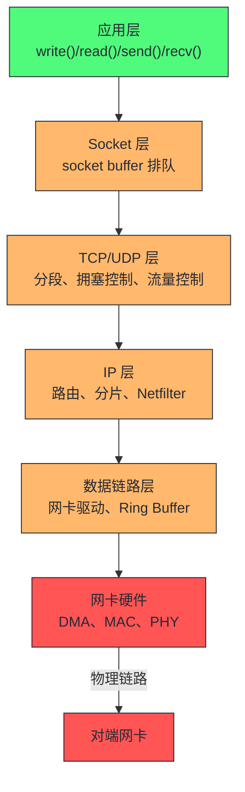
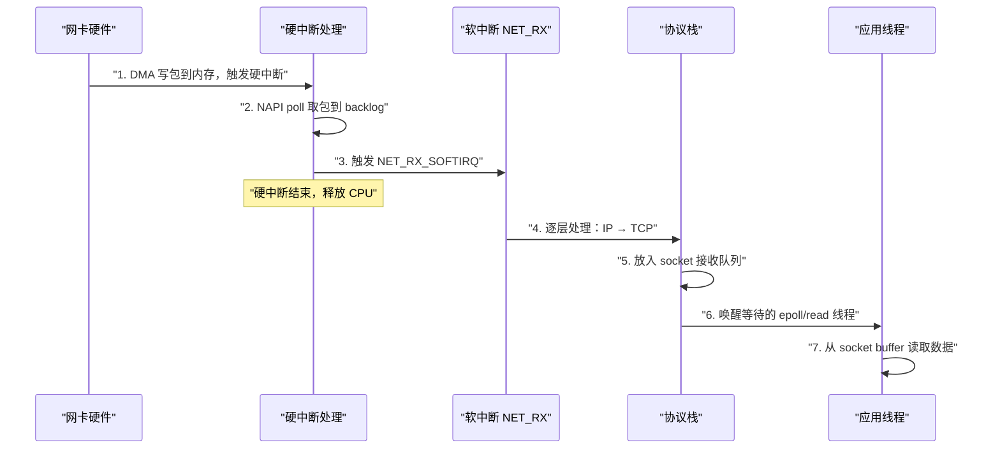
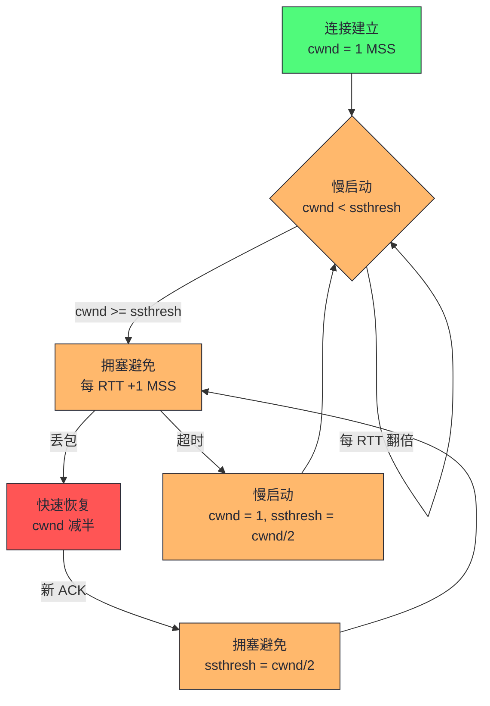
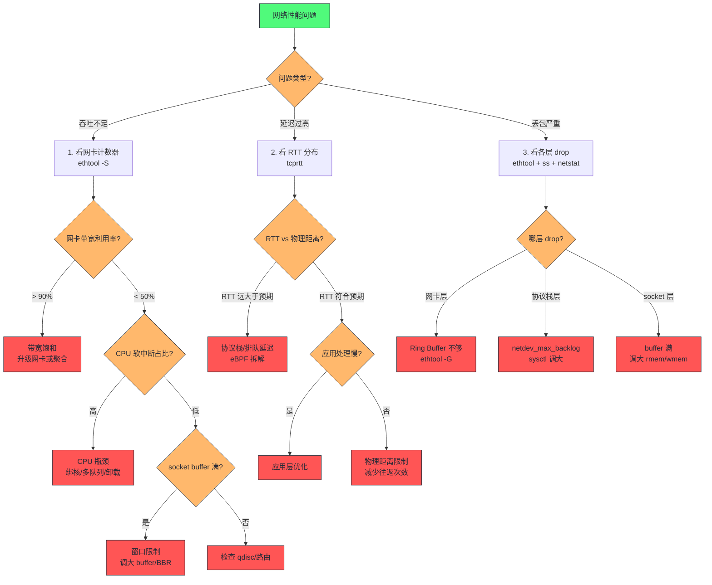

# 08 网络：协议栈、Buffer 与 RPC 延迟

> [!abstract] 摘要
> 本文进入网络子系统的性能分析。网络是分布式系统的主动脉——一次 RPC 的延迟不仅取决于物理链路的传播时延，更取决于数据包在内核协议栈中经过的每一层处理：从应用层 `write()` 系统调用进入内核，到 socket buffer 排队、TCP 分段、IP 路由、网卡驱动环形队列（Ring Buffer）入队、DMA 传输、硬中断、软中断（NET_RX_SOFTIRQ）收包、协议栈逐层向上交付，最终唤醒应用线程——这条链路上任何一个环节的排队或处理延迟，都会被叠加到端到端延迟里。文章从协议栈分层模型切入，拆解 socket buffer 与队列机制、中断与软中断的收包路径、分段卸载（TSO/GSO/GRO/LRO）对吞吐与延迟的双重影响，随后建立网络延迟的精确拆解模型，最后深入 TCP 拥塞控制（cwnd、ssthresh、慢启动、拥塞避免、快速恢复）对 RPC 尾延迟的决定性影响。核心认知：网络延迟不是一根线的延迟，而是协议栈每一层 buffer 排队延迟的总和；吞吐优化的手段（大 buffer、卸载、聚合）常常与延迟优化相冲突，工程上必须在吞吐与尾延迟之间做显式取舍。

---

## 第 1 章 协议栈分层模型：网络性能的分析骨架

### 1.1 为什么理解协议栈分层对性能分析很重要

很多工程师分析网络性能时，只盯着两个指标：带宽（吞吐）和 ping 延迟。带宽不够就升级网卡，ping 高就怀疑网络链路。这个分析框架在网络性能工程中是远远不够的，它会让你在至少三个方向上犯错：

第一，**把应用层延迟误判为网络延迟**。一个 RPC 耗时 10ms，ping 同一目标只有 0.5ms，工程师说"网络慢"。但抓包发现包在网卡上 0.5ms 就到了，剩下 9.5ms 花在接收端内核协议栈处理和应用线程唤醒上。根因不是网络链路，而是接收端 CPU 饱和导致软中断处理延迟。

第二，**把 buffer 排队延迟误判为带宽不足**。一个应用发送吞吐上不去，工程师说"带宽不够"。但网卡流量只有带宽的 30%。根因是发送端 socket buffer 太小，TCP 拥塞窗口受限于接收窗口（rwnd），数据在 socket 层排队而非真正发出去。加带宽无用，调大 buffer 或优化窗口缩放才有效。

第三，**把中断/软中断调度延迟误判为应用瓶颈**。一个服务 P99 延迟间歇性飙升到 50ms，工程师怀疑应用逻辑。但火焰图显示应用代码很快。根因是网卡中断绑在一个核上，该核软中断负载过高，收包处理排队，导致应用线程被唤醒的时机延迟。

要避免这三个误判，必须理解 Linux 网络协议栈的分层模型——网络数据包不是从应用直接"飞"到对端的，而是经过内核协议栈多层处理，每一层都有自己的 buffer、队列和调度机制。

### 1.2 Linux 网络协议栈的分层结构

Linux 网络协议栈是 OSI 七层模型和 TCP/IP 四层模型的工程实现。从性能分析角度，我们关注的是数据包在内核中经过的每一层处理节点：



发送路径（TX）和接收路径（RX）经过的层是镜像的，但性能特征完全不同：

| 路径 | 经过层次 | 核心操作 | 性能瓶颈点 |
|------|---------|---------|-----------|
| 发送 TX | App → Socket → TCP → IP → Driver → NIC | 系统调用、分段、路由查找、队列入队、DMA | socket buffer 满、拥塞窗口限制、qdisc 排队 |
| 接收 RX | NIC → Driver → IP → TCP → Socket → App | DMA、中断、软中断、协议栈处理、唤醒线程 | 硬中断绑核、软中断排队、socket buffer 满 |

> [!info] 核心概念：协议栈的性能本质是"排队网络"
> 协议栈的每一层都可以建模为一个"排队系统"：数据包到达 → 排队等待处理 → 被处理 → 传递给下一层。每一层的处理时间和队列长度都会贡献延迟。根据排队论，当某一层的利用率接近 100% 时，排队延迟会非线性增长（M/M/1 模型中延迟 = 1/(μ-λ)）。这意味着**协议栈中利用率最高的那一层决定了整体延迟的尾部**——这就是为什么网络延迟的 P99 往往比 P50 高一个数量级。

### 1.3 sk_buff：协议栈的通用货币

Linux 协议栈中数据包的载体是 `sk_buff`（socket buffer，简称 skb）。理解 skb 的结构是理解协议栈性能的前提。

**是什么**：skb 是一个贯穿协议栈全生命周期的数据结构，它不仅承载包数据，还携带了协议栈各层需要的元数据——指向各层协议头的指针、设备指针、校验和状态、路由缓存等。一个 skb 从网卡驱动层创建（或从 Page Cache 复用），一路向上经过 IP 层、TCP 层，最终交付给应用层的 socket 接收队列；或者从应用层创建，一路向下经过 TCP、IP、驱动层，最终由网卡发出。

**为什么出现**：早期网络协议栈的实现中，每一层都维护自己的数据结构，层间传递时需要拷贝数据。这在低速网络时代可以接受，但当网卡速度从 100Mbps 提升到 1Gbps、10Gbps 甚至 100Gbps 时，内存拷贝成为致命瓶颈。skb 的设计目标是**零拷贝传递**——数据本身不动，只操作指针。

**不这样会怎样**：如果每一层都拷贝数据，一个 1500 字节的包在协议栈中要被拷贝 4-5 次（驱动 → IP → TCP → Socket → App），10Gbps 网卡每秒约 80 万个包，仅拷贝开销就消耗数 GB/s 的内存带宽，CPU 根本处理不过来。

**如何落地**：skb 用指针操作实现零拷贝。核心机制是 `skb_reserve()`、`skb_push()`、`skb_pull()`——它们只移动指针，不拷贝数据：

| 操作 | 作用 | 使用场景 |
|------|------|---------|
| `skb_reserve()` | 预留头部空间 | 接收时为上层协议头预留空间 |
| `skb_push()` | 向前扩展头部 | 发送时逐层添加协议头 |
| `skb_pull()` | 向后收缩头部 | 接收时逐层剥离协议头 |
| `skb_clone()` | 复制 skb 结构体（不复制数据） | 组播/多路交付时避免拷贝 |

> [!note] 设计哲学：指针操作代替内存拷贝
> skb 的设计体现了 Linux 内核的一贯哲学——能用指针解决的绝不拷贝。一个 skb 的结构体本身约 200 字节，克隆一个 skb 只需分配 200 字节的新结构体并共享数据区。这在组播场景（一个包发给多个接收者）中尤其重要——每个接收者拿到一个 skb_clone，共享同一份 packet data，零拷贝开销。代价是引用计数管理（`skb_get()` / `kfree_skb()`），如果引用计数泄漏会导致内存泄漏或 use-after-free，这是内核网络驱动的常见 bug 来源。

### 1.4 协议栈各层的性能特征

协议栈每一层的处理开销不同，理解这些差异才能定位瓶颈：

| 层级 | 处理开销 | 主要 CPU 消耗 | 延迟贡献 |
|------|---------|-------------|---------|
| Socket 层 | 系统调用、buffer 管理 | 上下文切换、内存分配 | 1-10μs |
| TCP 层 | 分段、拥塞控制、ACK 处理 | 状态机计算、定时器 | 5-50μs |
| IP 层 | 路由查找、Netfilter 遍历 | 哈希查找、规则匹配 | 2-20μs |
| 驱动层 | Ring Buffer 操作、DMA 映射 | 内存映射、I/O 操作 | 1-10μs |
| 网卡硬件 | 串并转换、MAC 处理 | 硬件延迟 | 0.1-1μs |

> [!warning] 生产避坑：Netfilter（iptables）规则数量对性能的非线性影响
> IP 层的 Netfilter（iptables）是协议栈中容易被忽视的性能杀手。每个包经过 IP 层时，Netfilter 会遍历规则链。规则数量从 10 条增加到 100 条时，处理延迟不是线性增长而是指数增长——因为 Netfilter 的默认匹配是顺序遍历（O(n)），100 条规则意味着每个包要做 100 次规则匹配。在 10Gbps 网卡、每秒 80 万包的场景下，100 条 iptables 规则可能消耗 20%+ 的单核 CPU。对策：用 ipset 替代大量 iptables 规则（O(1) 哈希查找），或用 nftables（支持集合和字典，查找效率更高），或在高吞吐场景下用 eBPF/XDP 在网卡驱动层做过滤，绕过协议栈。

---

## 第 2 章 Socket Buffer 与队列机制

### 2.1 Socket Buffer 的三层结构

网络数据在应用与内核之间传递时，经过三层 buffer，每一层的容量和行为特征不同：


| Buffer 层级 | 位置 | 默认大小 | 满了的表现 | 调整参数 |
|------------|------|---------|-----------|---------|
| 发送 Socket Buffer | 内核 TCP 层 | `net.core.wmem_default`（~16KB） | `write()` 阻塞或返回 EAGAIN | `net.core.wmem_max`、`SO_SNDBUF` |
| qdisc 队列 | 内核链路层 | `net.core.tx_queue_len`（1000 包） | 包在 qdisc 排队，延迟上升 | `tx_queue_len`、qdisc 算法 |
| TX Ring Buffer | 网卡驱动 | 256-4096 描述符 | 包在驱动层排队，drop 计数上升 | `ethtool -G` |
| 接收 Socket Buffer | 内核 TCP 层 | `net.core.rmem_default`（~87KB） | TCP 窗口收缩，发送方被限速 | `net.core.rmem_max`、`SO_RCVBUF` |
| RX Ring Buffer | 网卡驱动 | 256-4096 描述符 | 包在网卡层丢弃，drop 计数上升 | `ethtool -G` |

**是什么**：这三层 buffer 构成了数据包从应用到网卡的"漏斗"——每一层都有容量限制，满了就会反压（backpressure）上一层。发送路径上，应用 `write()` 的数据先进发送 socket buffer，TCP 从中取数据发送到 qdisc 队列，qdisc 再调度到网卡的 TX Ring Buffer，最终由网卡 DMA 发出。

**为什么出现**：生产者-消费者速率不匹配是所有 buffer 存在的根本原因。应用产生数据的速率是突发的（一个 `write()` 可能写 64KB），而网卡发送速率受限于带宽和拥塞窗口。buffer 的作用是吸收速率差，让应用不必等网卡发完才能继续写。

**不这样会怎样**：如果没有 socket buffer，每次 `write()` 都要同步等网卡发完才能返回——一个 1500 字节的包在 10Gbps 网卡上发送需要约 1.2μs，应用每秒最多做 80 万次 `write()`，且每次都要阻塞。有了 buffer，应用可以异步写入，TCP 在后台发送，吞吐和延迟解耦。

**如何落地**：buffer 大小的调优是网络性能工程的核心课题。关键参数：

```bash
# 查看当前 buffer 设置
sysctl net.core.rmem_max net.core.wmem_max
sysctl net.core.rmem_default net.core.wmem_default
sysctl net.core.netdev_max_backlog

# 查看网卡 Ring Buffer
ethtool -g eth0

# 查看某个 socket 的实际 buffer 使用
ss -tm | grep -A1 estab
```

> [!warning] 生产避坑：Buffer 越大越好是危险的错觉
> 很多工程师遇到网络延迟高就调大 socket buffer，这是一个常见误区。大 buffer 确实能提升吞吐（TCP 窗口更大，可以发更多数据），但会**增加排队延迟**——buffer 里的数据越多，排在后面的数据等的时间越长。这就是 Bufferbloat（缓冲膨胀）问题。
> 正确的调优逻辑是：吞吐瓶颈调大 buffer，延迟瓶颈调小 buffer 或使用限速队列。判断依据是看 buffer 的利用率——如果 buffer 经常满且 drop 计数上升，说明 buffer 不够（吞吐瓶颈）；如果 buffer 里经常有大量数据排队但没 drop，说明 buffer 太大（延迟瓶颈）。`ss -tm` 的 `Send-Q` 和 `Recv-Q` 列能直接看到 buffer 中的数据量。

### 2.2 Bufferbloat：缓冲膨胀的隐蔽危害

**是什么**：Bufferbloat 是指网络路径上的 buffer 过大，导致数据包在 buffer 中排队等待，人为增加了延迟。这个概念由 Jim Gettys 在 2009 年系统性地提出，是过去十五年网络性能领域最重要的认知更新之一。

**为什么出现**：现代网络设备（路由器、交换机、网卡）的 buffer 容量越来越大——从早期的几十 KB 到现在的几十 MB。厂商的直觉是"buffer 大就不丢包"，但这个直觉在网络中是错的。大 buffer 不减少丢包（当拥塞持续时 buffer 照样满），只是把丢包换成了延迟——数据包不丢，但在 buffer 里排队等了几十甚至几百毫秒。

**不这样会怎样**：如果没有 buffer（或 buffer 极小），拥塞时包会被立即丢弃，TCP 拥塞控制迅速反应（cwnd 减半），延迟保持低水平。代价是丢包率高一些，但 TCP 的设计本就是基于丢包的拥塞反馈——适度丢包是 TCP 正常工作的前提，不是故障。

**如何落地**：Linux 内核提供了多种机制对抗 Bufferbloat：

| 机制 | 原理 | 适用场景 | 配置方式 |
|------|------|---------|---------|
| fq_codel | 基于流的公平队列 + CoDel 延迟限制 | 通用 qdisc，Linux 默认 | `tc qdisc add dev eth0 root fq_codel` |
| CoDel | 监控排队延迟，超阈值即丢包 | 低延迟优先的链路 | 内嵌于 fq_codel |
| BBR | 基于带宽和 RTT 的拥塞控制，不依赖丢包 | 高带宽延迟链路 | `net.ipv4.tcp_congestion_control=bbr` |
| SO_SNDBUF 限制 | 显式限制发送 buffer | 延迟敏感型应用 | `setsockopt(SO_SNDBUF)` |

> [!info] 核心概念：CoDel（Controlled Delay）算法
> CoDel 是 Kathleen Nichols 和 Van Jacobson 在 2012 年提出的 AQM（Active Queue Management）算法，核心思想是：不关心队列长度，只关心排队延迟。如果某个包在队列中等待的时间超过 5ms（本地排队延迟，不含传播延迟），就开始有策略地丢弃包，直到排队延迟降到 5ms 以下。CoDel 的工作不需要配置参数——它自适应地测量实际延迟并做出丢包决策。fq_codel 是 CoDel 的多流版本，为每个流维护独立队列并应用 CoDel，既保证公平性又控制延迟。Linux 3.5+ 默认使用 fq_codel 作为 qdisc，是现代 Linux 对抗 Bufferbloat 的标准方案。

### 2.3 qdisc：流量调度与排队规则

qdisc（Queueing Discipline）是 Linux 链路层的排队规则，位于 IP 层和网卡驱动之间。它是发送路径上最后一个能在内核中做流量调度的环节。

**是什么**：qdisc 是一个可插拔的排队算法框架，决定了"先发哪个包、后发哪个包、丢哪个包"。不同的 qdisc 算法有不同的调度策略。

**为什么出现**：默认的 FIFO 队列（pfifo_fast）在多流场景下不公平——一个高带宽流（如大文件传输）会占满队列，导致低延迟流（如 RPC）的包排在后面，延迟飙升。qdisc 的可插拔设计让管理员能根据场景选择合适的调度策略。

**如何落地**：常见 qdisc 算法对比：

| qdisc | 调度策略 | 优点 | 缺点 | 适用场景 |
|-------|---------|------|------|---------|
| pfifo_fast | 三个优先级 FIFO 队列 | 简单、低开销 | 无公平性 | 低速链路、简单场景 |
| fq_codel | 每流公平队列 + CoDel | 公平、低延迟、抗 Bufferbloat | 略多 CPU 开销 | 通用场景（Linux 默认） |
| HTB | 层次令牌桶 | 精确带宽限制 | 配置复杂 | 多租户带宽隔离 |
| TBF | 令牌桶 | 简单限速 | 突发时延迟波动 | 单一限速场景 |
| FQ_PIE | 每流 PIE AQM | 类似 fq_codel，PIE 替代 CoDel | 较新，兼容性待验证 | 新型低延迟场景 |

```bash
# 查看当前 qdisc
tc qdisc show dev eth0

# 设置 fq_codel（通常已是默认）
tc qdisc replace dev eth0 root fq_codel

# 设置 HTB 做带宽限制（示例：限 100Mbps）
tc qdisc add dev eth0 root handle 1: htb
tc class add dev eth0 parent 1: classid 1:1 htb rate 100mbit
```

> [!note] 设计哲学：qdisc 是"最后一道防线"
> qdisc 位于 IP 层和网卡驱动之间，是内核能做流量调度的最后一站。一旦包离开 qdisc 进入网卡的 TX Ring Buffer，内核就失去了控制权——包的发送顺序完全由网卡硬件决定。这意味着 qdisc 是应用层做 QoS（服务质量）的内核级落脚点。对于多租户环境（如 K8s Pod 共享网卡），用 HTB qdisc 做带宽隔离是标准做法。但要注意：qdisc 只管发送方向（TX），接收方向（RX）没有 qdisc——接收方的流量控制只能靠 TCP 拥塞控制或 XDP。

### 2.4 Ring Buffer：网卡与内核的交接点

Ring Buffer 是网卡驱动与网卡硬件之间的环形队列，由一组描述符（descriptor）组成，每个描述符指向一个数据缓冲区。

**是什么**：Ring Buffer 是一个固定大小的环形数组，分为 TX Ring（发送）和 RX Ring（接收）。每个槽位是一个描述符，包含 DMA 地址和长度。网卡硬件和 CPU 通过"头指针"和"尾指针"协调——网卡硬件移动头指针（消费/生产），CPU 移动尾指针（生产/消费）。

**为什么出现**：网卡和 CPU 是异步工作的——CPU 把数据准备好后不等待网卡发完就返回，网卡在后台通过 DMA 直接读写内存。Ring Buffer 是这个异步协作的"信箱"——CPU 往信箱里放描述符，网卡从信箱里取描述符，两者通过指针协调，不需要锁。

**不这样会怎样**：如果不用 Ring Buffer 而用链表，每次入队/出队都要动态分配/释放内存并加锁，在每秒百万包的场景下锁竞争和内存分配开销会压垮 CPU。Ring Buffer 的固定大小数组预分配描述符，无锁的指针协调是高性能的关键。

**如何落地**：Ring Buffer 大小的调整：

```bash
# 查看当前 Ring Buffer 大小
ethtool -g eth0

# 输出示例：
# Ring parameters for eth0:
# Pre-set maximums:
#   RX:		4096
#   TX:		4096
# Current hardware settings:
#   RX:		512
#   TX:		512

# 调大到最大值
ethtool -G eth0 rx 4096 tx 4096
```

| Ring Buffer 大小 | 优点 | 缺点 | 适用场景 |
|-----------------|------|------|---------|
| 小（256-512） | 内存占用小，排队延迟低 | 突发流量时容易 drop | 低延迟场景 |
| 大（2048-4096） | 吸收突发流量，drop 少 | 排队延迟增加，内存占用大 | 高吞吐场景 |

> [!warning] 生产避坑：Ring Buffer drop 与 CPU 缓存局部性的矛盾
> 调大 Ring Buffer 能减少 drop，但会降低 CPU 缓存命中率——更大的 Ring Buffer 意味着描述符分布在更多的 cache line 上，CPU 遍历时更多的 cache miss。在 10Gbps+ 网卡上，这个矛盾很现实：Ring Buffer 从 512 调到 4096 后 drop 减少了，但软中断处理 CPU 占用上升了 15%，因为 cache miss 增加了。折中方案：用多队列（multiqueue）把流量分到多个小 Ring Buffer 上，每个队列由不同 CPU 核处理，既减少单队列 drop 又保持 cache 局部性。`ethtool -L eth0 combined 8` 可以设置 8 个收发队列。

---

## 第 3 章 中断与软中断：收包路径的性能剖析

### 3.1 硬中断与软中断的分工

网络收包路径是网络性能分析中最复杂的部分，因为它涉及硬件中断、软中断、CPU 亲和性、NUMA 局部性等多个维度。

**是什么**：Linux 网络收包采用"硬中断 + 软中断"两阶段处理模型。硬中断（Hard IRQ）由网卡硬件触发，只做最少的工作——把数据包从网卡 RX Ring Buffer 取出，放入内核的 backlog 队列，然后触发软中断（NET_RX_SOFTIRQ）。软中断在软中断上下文中运行（允许响应硬中断但不允许睡眠），完成协议栈的逐层处理（IP → TCP → socket）。

**为什么出现**：如果硬中断做全部工作（包括协议栈处理），网卡中断会长时间占用 CPU，导致其他硬中断（如磁盘、定时器）被阻塞。在高速网卡下，每秒数万次中断，每次中断处理几十微秒，CPU 会被中断处理独占。两阶段模型把"快速响应网卡"和"慢速协议栈处理"分离——硬中断只做纳秒级的收包入队，软中断做微秒级的协议栈处理。

**不这样会怎样**：如果不分两阶段（早期 Linux 就是单阶段中断处理），高速网卡下中断处理时间过长导致中断丢失或实时性下降。更严重的是，中断处理中不能睡眠，但协议栈处理可能需要等待锁或内存分配，放在中断上下文中会导致死锁风险。

**如何落地**：收包路径的完整流程：



### 3.2 NAPI：中断与轮询的混合模式

**是什么**：NAPI（New API）是 Linux 2.5 引入的网络收包机制，核心思想是"低速时用中断、高速时用轮询"。当网卡流量低时，每个包到达触发一次硬中断，CPU 被中断唤醒后处理包。当流量高时，NAPI 切换到轮询模式——关闭硬中断，CPU 主动轮询网卡 Ring Buffer，一次性取走所有积压的包。

**为什么出现**：纯中断模式在高速网卡下有"中断风暴"问题——每秒数万到数十万个包，每个包一次硬中断，CPU 上下文切换开销巨大。更严重的是中断 livelock：CPU 花太多时间处理中断，没时间处理协议栈，backlog 队列溢出丢包，但中断还在不断来。

**不这样会怎样**：纯中断模式下，10Gbps 网卡每秒约 80 万包（小包），80 万次硬中断，每次中断上下文切换约 2-5μs，仅中断开销就消耗 1.6-4 个 CPU 核。纯轮询模式下，低流量时 CPU 空转轮询浪费功耗。NAPI 的混合模式兼顾两者——低流量时中断驱动（低延迟、低功耗），高流量时轮询驱动（高吞吐、无中断风暴）。

**如何落地**：NAPI 的工作机制：

| 阶段 | 触发条件 | 工作模式 | 中断状态 |
|------|---------|---------|---------|
| 中断模式 | 低流量（首次收包） | 硬中断唤醒 CPU，poll 一次 | 开启 |
| 轮询模式 | 高流量（poll 到的包数 > budget） | 软中断中持续 poll，不触发硬中断 | 关闭 |
| 回到中断模式 | poll 到的包数 < budget（队列空了） | 恢复硬中断，等待下次包到达 | 开启 |

> [!info] 核心概念：NAPI budget 与 weight
> NAPI 的 `budget` 是每次 poll 最多处理的包数（默认 300），`weight` 是设备权重（默认 64）。软中断一轮中，每个 NAPI 设备最多 poll `weight` 个包，所有设备总共最多处理 `budget` 个包。这两个参数控制了软中断在一次执行中"花多少时间处理网络包"——budget 太小则高吞吐时软中断频繁触发，budget 太大则软中断占用 CPU 时间过长，影响其他任务。`net.core.netdev_budget`（默认 300）和 `net.core.netdev_budget_usecs`（默认 2000μs）是全局调优参数。

### 3.3 中断绑核与 RPS/RFS

高速网卡的中断绑核策略对性能影响巨大。默认情况下，网卡的所有 RX 中断可能绑在一个 CPU 核上，导致该核 100% 满载而其他核空闲。

**是什么**：中断绑核（IRQ affinity）是通过 `/proc/irq/<irq>/smp_affinity` 把网卡的不同队列中断绑定到不同 CPU 核上。多队列网卡（如 Intel 82599 有 64 个队列）可以把每个队列的中断绑到不同核，实现收包负载的 CPU 级并行。

**为什么出现**：单核处理网络中断在 10Gbps+ 网卡下是瓶颈——一个核的软中断处理能力约 1-2Mpps（百万包/秒），10Gbps 小包流量约 14.88Mpps，单核根本处理不过来。多队列 + 中断绑核是横向扩展收包能力的关键。

**如何落地**：

```bash
# 查看网卡中断号
cat /proc/interrupts | grep eth0

# 查看当前中断绑核
cat /proc/irq/<irq>/smp_affinity_list

# 绑定中断到特定核（如核 2-9）
echo 2-9 > /proc/irq/<irq>/smp_affinity_list
```

对于不支持多队列的网卡，Linux 提供了 RPS（Receive Packet Steering）和 RFS（Receive Flow Steering）在软件层面做负载分发：

| 机制 | 层级 | 原理 | 优点 | 局限 |
|------|------|------|------|------|
| RSS | 硬件 | 网卡硬件按哈希分发到多队列 | 零 CPU 开销 | 需要多队列网卡 |
| RPS | 软件 | 软中断中按哈希把包分发到其他核的 backlog | 不需要多队列网卡 | 增加跨核 IPI 开销 |
| RFS | 软件 | 按 socket 所在 CPU 分发，保持缓存局部性 | 减少 cache miss | 需要 socket 信息查找 |
| XPS | 软件 | 发送方向按 CPU 映射到发送队列 | 发送方向 cache 局部性 | 仅 TX 方向 |

> [!warning] 生产避坑：中断绑核与 NUMA 的交叉问题
> 在多路服务器上，网卡插在某个 NUMA node 的 PCIe 槽上。如果网卡中断绑到了远端 NUMA node 的 CPU 核上，每个收包都要跨 NUMA node 访问内存，延迟翻倍。正确做法：把网卡中断绑到网卡所在 NUMA node 的 CPU 核上。`cat /sys/class/net/eth0/device/numa_node` 查看网卡所在 NUMA node，`numactl --cpunodebind=N` 确认绑核范围。对于 25Gbps+ 网卡，这个优化可以带来 20-30% 的吞吐提升。

### 3.4 软中断观测与诊断

软中断的性能表现可以通过多个工具观测：

```bash
# 查看软中断统计（NET_RX 是收包，NET_TX 是发包）
grep NET /proc/softirqs

# 查看每核软中断统计
mpstat -I SUM -P ALL 1

# 查看网卡中断统计
cat /proc/interrupts | grep eth0

# eBPF 工具：软中断延迟分布
softirqs -d 5  # BCC 工具，显示软中断延迟直方图
```

| 指标 | 工具 | 正常范围 | 异常含义 |
|------|------|---------|---------|
| NET_RX 软中断计数 | /proc/softirqs | 随流量线性增长 | 突增 = 流量突增或中断风暴 |
| 软中断 CPU 占比 | mpstat -I SUM | < 20% 单核 | > 50% = 收包瓶颈，需绑核或多队列 |
| 中断分布均匀度 | /proc/interrupts | 各核接近 | 单核远高 = 中断绑核不均 |
| 软中断延迟 | softirqs -d（BCC） | P99 < 100μs | P99 > 1ms = 软中断排队严重 |

> [!note] 诊断逻辑：从中断到应用的延迟归因
> 当网络延迟异常时，正确的归因路径是自底向上的：先看网卡层（`ethtool -S` 看 drop/fifo 错误），再看中断层（`/proc/interrupts` 看中断分布和频率），然后看软中断层（`/proc/softirqs` 和 `softirqs -d` 看处理延迟），最后看 socket 层（`ss -tm` 看 Recv-Q/Send-Q 排队）。每一层的异常都会向上传递——网卡 drop 导致包丢失重传，中断绑核不均导致软中断排队，软中断排队导致 socket 接收延迟，socket 延迟导致应用 `epoll_wait` 唤醒延迟。这个归因链条是网络性能分析的核心方法论。

---

## 第 4 章 分段卸载：吞吐与延迟的工程取舍

### 4.1 什么是分段卸载

**是什么**：分段卸载（Offload）是把协议栈的某些处理工作从 CPU 转移到网卡硬件上执行。主要包括两大类：发送方向的分段卸载（TSO/GSO）和接收方向的聚合卸载（GRO/LRO）。

**为什么出现**：TCP 发送数据时需要把大块数据分割成 MSS（Maximum Segment Size，通常 1460 字节）大小的段，每个段加 TCP/IP 头后成为不超过 MTU（1500 字节）的包。如果应用一次 `write()` 写 64KB 数据，TCP 需要分割成约 44 个段，每个段都要做 TCP 头构造、校验和计算、IP 头构造——这 44 次分割和头部处理消耗大量 CPU。TSO（TCP Segmentation Offload）让网卡硬件做这个分割——内核只构造一个大的"超长"包（64KB），网卡硬件在发送时自动分割成 MSS 大小的段。

**不这样会怎样**：不做 TSO，10Gbps 网卡满速发送时，TCP 分段消耗约 2 个 CPU 核。做了 TSO，CPU 只构造一个超长包（一次头部处理），网卡硬件做分割，CPU 消耗降到 0.2 个核。在 40Gbps/100Gbps 网卡上，没有 TSO 根本无法线速发送。

**如何落地**：查看和配置卸载功能：

```bash
# 查看当前卸载配置
ethtool -k eth0

# 关键输出：
# tcp-segmentation-offload: on      (TSO)
# generic-segmentation-offload: on  (GSO)
# generic-receive-offload: on       (GRO)
# large-receive-offload: off        (LRO，通常关闭)

# 开启/关闭特定卸载
ethtool -K eth0 tso on
ethtool -K eth0 gso on
ethtool -K eth0 gro on
```

### 4.2 TSO 与 GSO：发送方向的卸载

TSO（TCP Segmentation Offload）和 GSO（Generic Segmentation Offload）都是发送方向的分段卸载，区别在于适用范围：

| 特性 | TSO | GSO |
|------|-----|-----|
| 协议 | 仅 TCP | TCP/UDP/SCTP 等通用协议 |
| 执行者 | 网卡硬件 | 网卡硬件或软件（驱动层） |
| 分割依据 | MSS | MSS 或 MTU |
| 适用场景 | 硬件支持 TSO 的网卡 | 不支持 TSO 的网卡或非 TCP 协议 |

> [!info] 核心概念：TSO 对吞吐的量化影响
> 在一台 10Gbps 网卡的服务器上，关闭 TSO 后 `iperf3` 测试吞吐从 9.4Gbps 降到 4.2Gbps，CPU 占用从 1.2 核升到 3.8 核。这个差距在 25Gbps/100Gbps 网卡上更大——没有 TSO，100Gbps 网卡的 TCP 发送根本无法线速。TSO 是高速网卡的基础设施，不是可选优化。但在某些场景下需要关闭 TSO：当网卡硬件的 TSO 实现有 bug 时（某些老旧网卡），或当需要精确控制每个包的大小和发送时机时（如低延迟交易系统）。

### 4.3 GRO 与 LRO：接收方向的聚合卸载

GRO（Generic Receive Offload）和 LRO（Large Receive Offload）是接收方向的聚合卸载——把多个小包聚合成一个大包再交给协议栈，减少协议栈处理次数。

**是什么**：网卡收到一连串的小包（如 44 个 1500 字节的包），如果没有 GRO，协议栈要处理 44 次 IP 头解析、44 次 TCP 头解析、44 次校验和验证。GRO 在驱动层把这 44 个包聚合成一个 64KB 的大包，协议栈只处理 1 次。

**为什么出现**：与 TSO 对称——发送方向 CPU 构造大包让网卡分割，接收方向网卡收小包让 CPU 聚合。两者的目标都是减少 CPU 处理的"包数"。

**GRO 与 LRO 的区别**：

| 特性 | GRO | LRO |
|------|-----|-----|
| 实现层级 | 软件（驱动层） | 硬件（网卡） |
| 聚合正确性 | 严格按协议规则聚合 | 简单聚合，可能违反协议语义 |
| 兼容性 | 通用，所有网卡可用 | 需要网卡硬件支持 |
| 默认状态 | 开启 | 通常关闭 |
| 风险 | 低 | 高（可能破坏 TCP 语义） |

> [!warning] 生产避坑：GRO/LRO 对延迟的副作用
> GRO/LRO 聚合多个小包成大包，虽然减少了 CPU 开销，但**增加了等待延迟**——聚合需要"等"后续包到达才能聚合，如果只来了一个包就上交协议栈，聚合没意义；如果等了多个包才聚合，第一个包就多等了。对于延迟敏感的 RPC 场景，GRO 可能增加几十微秒的聚合延迟。一些低延迟交易系统会关闭 GRO 以获得最低的收包延迟。权衡：吞吐优先开 GRO，延迟优先关 GRO。`ethtool -K eth0 gro off` 可以关闭。

### 4.4 卸载功能的性能权衡矩阵

| 卸载功能 | 对吞吐的影响 | 对延迟的影响 | 对 CPU 的影响 | 推荐场景 |
|---------|------------|------------|-------------|---------|
| TSO | 大幅提升 | 略增（大包排队） | 大幅降低 | 高吞吐（默认开） |
| GSO | 中幅提升 | 略增 | 中幅降低 | 无 TSO 硬件时 |
| GRO | 大幅提升 | 增加聚合延迟 | 大幅降低 | 高吞吐（默认开） |
| LRO | 大幅提升 | 增加聚合延迟 | 大幅降低 | 不推荐（语义风险） |
| 无卸载 | 基线 | 最低 | 最高 | 极低延迟交易系统 |

> [!note] 设计哲学：吞吐与延迟的永恒矛盾
> 分段卸载是吞吐与延迟矛盾的典型体现。卸载通过"批量处理"提升吞吐、降低 CPU 开销，但批量意味着"等待凑批"——第一个到达的包要等后续包一起处理，这增加了单个包的延迟。这不是 bug 而是物理规律：吞吐 = 批量大小 / 处理时间，延迟 = 等待批量时间 + 处理时间。增大批量提升吞吐但增加等待延迟。工程上的正确做法是：根据业务场景选择——大文件传输/视频流优先吞吐（开卸载），RPC/交易系统优先延迟（关卸载或减小批量）。

---

## 第 5 章 网络延迟拆解：从 RPC 端到端视角

### 5.1 一次 RPC 的延迟构成

理解网络延迟的精确构成，是优化 RPC 延迟的前提。一次同步 RPC 的端到端延迟可以拆解为以下阶段：


| 阶段 | 典型延迟 | 占比（同机房 RPC） | 占比（跨地域 RPC） | 可优化性 |
|------|---------|------------------|------------------|---------|
| 1. 应用序列化 | 1-50μs | 5-15% | <1% | 中（换协议：JSON→Protobuf） |
| 2. write() 系统调用 | 1-10μs | 2-5% | <1% | 低（除非用 io_uring/零拷贝） |
| 3. Socket Buffer 排队 | 0-100μs | 0-20% | <1% | 高（调 buffer、qdisc） |
| 4. TCP 分段与发送 | 5-20μs | 3-8% | <1% | 中（TSO） |
| 5. 网卡 DMA 发送 | 1-5μs | 1-3% | <1% | 低 |
| 6. 物理链路传播 | 0.01-30ms | 5-30% | 80-95% | 极低（物理极限） |
| 7. 对端网卡收包 | 1-5μs | 1-3% | <1% | 低 |
| 8. 硬中断 + 软中断 | 5-50μs | 5-15% | <1% | 高（绑核、NAPI） |
| 9. 协议栈处理 | 5-30μs | 3-10% | <1% | 中（关 Netfilter、GRO） |
| 10. Socket 接收队列 | 0-50μs | 0-10% | <1% | 中（调 rmem） |
| 11. 唤醒应用线程 | 1-50μs | 2-10% | <1% | 高（epoll、绑核） |
| 12. 应用反序列化 + 处理 | 10-500μs | 10-30% | 2-5% | 高（业务优化） |

> [!info] 核心洞察：延迟的构成随距离而质变
> 同机房 RPC（RTT ~0.1ms）中，物理传播只占 5-30%，协议栈和应用的各阶段处理占 70-95%——优化协议栈和应用层有显著收益。跨地域 RPC（RTT ~30ms）中，物理传播占 80-95%，协议栈优化收益微乎其微——唯一有效的是减少 RPC 往返次数（批量、流水线、异步）。这个质变决定了网络性能优化的策略必须分场景：同机房优化协议栈和应用，跨地域优化调用模式。

### 5.2 延迟优化的分层策略

基于延迟拆解，优化策略按层级递进：

**第一层：减少物理传播延迟**

物理传播延迟由光速和距离决定，无法通过软件优化。光在光纤中的传播速度约 2×10^8 m/s（真空光速的 2/3），1000km 光纤单程延迟约 5ms，往返 10ms。唯一优化手段是缩短物理距离（CDN、边缘计算）或减少往返次数（批量、流水线）。

**第二层：减少协议栈处理延迟**

| 优化手段 | 节省的延迟 | 实现方式 | 风险 |
|---------|-----------|---------|------|
| 关闭 Netfilter | 2-20μs/包 | `iptables -F` 或 XDP | 安全策略失效 |
| 关闭 GRO | 10-50μs（聚合等待） | `ethtool -K eth0 gro off` | CPU 占用上升 |
| 调小 qdisc | 10-100μs（排队） | `tc qdisc replace root pfifo_fast` | 吞吐下降 |
| XDP 快速路径 | 50-200μs（绕过协议栈） | eBPF XDP 程序 | 需要内核 4.8+ |

**第三层：减少系统调用与上下文切换延迟**

| 优化手段 | 节省的延迟 | 实现方式 | 适用场景 |
|---------|-----------|---------|---------|
| io_uring | 1-5μs/次 | 异步 I/O 接口 | 高 QPS 网络服务 |
| epoll ET 模式 | 0.5-2μs/次 | 边沿触发，减少 epoll_wait 调用 | 事件驱动服务 |
| vDSO | 0.1-1μs/次 | 时间相关系统调用 | 所有场景 |
| 线程绑核 | 1-10μs（减少迁移） | `sched_setaffinity` | 延迟敏感服务 |

**第四层：减少应用层延迟**

| 优化手段 | 节省的延迟 | 实现方式 |
|---------|-----------|---------|
| 序列化协议优化 | 10-100μs | JSON → Protobuf/FlatBuffers |
| 连接复用 | 50-500μs（避免握手） | 连接池、HTTP/2 多路复用 |
| 异步流水线 | 整体延迟的 50%+ | 请求流水线化，不等待单次返回 |
| 批量请求 | 按比例减少 | N 个请求合并为 1 次 RPC |

> [!warning] 生产避坑：优化了错误的层
> 一个常见错误是在跨地域 RPC 场景下花大量精力优化协议栈延迟（关 Netfilter、调 buffer、绑核），但物理传播 30ms 占了 95%，协议栈优化省下的 50μs 只占 0.17%，完全感知不到。正确做法是先做延迟拆解（用 `tcpdump` 时间戳或 eBPF `tcprtt` 工具），找到占比最大的阶段，针对性优化。`tcprtt`（BCC 工具）能直接给出 TCP 连接的 RTT 分布直方图，是判断"网络延迟 vs 协议栈延迟"的第一工具。

### 5.3 用 eBPF 精确测量各阶段延迟

传统的网络延迟测量工具（ping、tcpdump）只能测量端到端 RTT，无法拆解协议栈各阶段的延迟。eBPF 提供了协议栈各阶段的精确测量能力：

```bash
# BCC 工具：TCP RTT 分布
tcprtt -i 5

# BCC 工具：发送方向各阶段延迟
runqlat -i 5          # 调度延迟
softirqs -d -i 5      # 软中断延迟

# BCC 工具：socket buffer 排队延迟
qemu:  # 需要自定义 eBPF 程序或使用 biosnoop 类工具

# perf trace：系统调用延迟
perf trace -e 'write,read,sendto,recvfrom' -p <pid>
```

| 工具 | 测量目标 | 输出形式 | 适用场景 |
|------|---------|---------|---------|
| tcprtt | TCP RTT（含传播+协议栈） | 直方图 | 判断网络 vs 协议栈延迟 |
| tcpdump + 时间戳 | 端到端包延迟 | 每包时间戳 | 精确分析特定连接 |
| softirqs -d | 软中断处理延迟 | 直方图 | 判断收包处理是否瓶颈 |
| runqlat | 调度延迟 | 直方图 | 判断应用唤醒是否延迟 |
| perf trace | 系统调用延迟 | 每次调用耗时 | 判断 write/read 是否阻塞 |

> [!note] 诊断方法论：延迟拆解的三步法
> 第一步：用 `tcprtt` 或 `ping` 测量 RTT，判断延迟量级。如果 RTT 远大于物理距离应有的延迟（如同机房 RTT 1ms 但物理距离应有 0.1ms），说明协议栈或排队延迟显著。
> 第二步：用 `tcpdump` 在两端抓包，对比发送时间戳和接收时间戳，定位延迟发生在发送端、网络中间还是接收端。如果发送端抓包时间正常但接收端抓包时间晚，延迟在网络或接收端。
> 第三步：用 eBPF 工具（softirqs、runqlat）在接收端定位是软中断延迟还是调度延迟。如果软中断延迟正常但 runqlat 高，说明应用线程被唤醒后等 CPU；如果软中断延迟高，说明收包处理排队。

---

## 第 6 章 TCP 拥塞控制对性能的影响

### 6.1 拥塞控制的基本模型

TCP 拥塞控制是网络性能中最容易被误解的部分——很多工程师知道"TCP 会限速"，但不清楚限速的机制和触发条件，导致在 RPC 场景下做出错误的优化决策。

**是什么**：TCP 拥塞控制是发送方通过调节拥塞窗口（cwnd，Congestion Window）来控制发送速率的机制。cwnd 决定了发送方在未收到 ACK 之前能向网络中"注入"多少数据——cwnd 越大，发送越快；cwnd 越小，发送越慢。实际发送窗口 = min(cwnd, rwnd)，其中 rwnd 是接收方通告的接收窗口。

**为什么出现**：Internet 是一个无中心控制的网络——没有全局调度器告诉每个发送方"你能发多快"。如果所有发送方都按自己的最大速率发送，网络中间的路由器 buffer 会溢出，大量丢包，所有人的吞吐都崩溃。TCP 拥塞控制是发送方的"自我克制"——通过探测网络容量来调节自己的发送速率，避免把网络压垮。

**不这样会怎样**：没有拥塞控制（如早期的 TCP Tahoe 之前），所有连接以最大速率发送，路由器 buffer 溢出丢包，TCP 重传，进一步加剧拥塞，形成"拥塞崩溃"（congestion collapse）。1986 年 10 月，Internet 经历了第一次拥塞崩溃——吞吐下降到正常值的 1/1000。这直接催生了 Van Jacobson 1988 年的 TCP 拥塞控制论文，奠定了现代 TCP 的基础。

**如何落地**：TCP 拥塞控制有四个核心算法阶段：



### 6.2 慢启动：不是"慢"而是"指数增长"

**是什么**：慢启动（Slow Start）是 TCP 连接建立初期的窗口增长阶段。名字叫"慢启动"但实际增长是指数级的——每收到一个 ACK，cwnd 加 1 MSS，由于每 RTT 内能收到 cwnd 个 ACK，所以每 RTT 后 cwnd 翻倍。cwnd 从 1 MSS 开始，经过 10 个 RTT 后增长到 1024 MSS（约 1.5MB）。

**为什么出现**：连接刚建立时，发送方不知道网络能承受多快的速率。如果一上来就全速发送，可能瞬间压垮中间路由器。慢启动用"指数探测"快速找到网络容量——从慢开始，快速加速，一旦发现丢包就减速。

**不这样会怎样**：如果没有慢启动（连接建立就全速发送），在高带宽延迟链路上瞬间注入大量数据，中间路由器 buffer 溢出，大量丢包，TCP 进入超时重传，吞吐暴跌。慢启动的指数增长在几个 RTT 内就能接近网络容量，代价只是前几个 RTT 的"爬坡"延迟。

> [!warning] 生产避坑：慢启动对短连接 RPC 的延迟影响
> 慢启动对短连接 RPC 影响显著。假设一个 RPC 连接只传 64KB 数据就关闭，RTT = 1ms，MSS = 1460B：
> - 初始 cwnd = 10 MSS（Linux 默认 initcwnd）≈ 14.6KB
> - 第 1 个 RTT：发送 14.6KB，收到 ACK 后 cwnd = 20 MSS ≈ 29.2KB
> - 第 2 个 RTT：发送剩余 49.4KB 中的 29.2KB，cwnd = 40 MSS
> - 64KB 数据需要约 2-3 个 RTT 才能发完
> - 加上对端处理和响应，总延迟约 4-5ms（而非理论上的 1 个 RTT + 处理时间）
> 对策：使用长连接（连接池）避免每次 RPC 都经历慢启动；或调大初始窗口 `ip route change ... initcwnd 100`（但可能加剧拥塞）。

### 6.3 拥塞避免与快速恢复

**是什么**：当 cwnd 超过慢启动阈值（ssthresh）后，TCP 进入拥塞避免阶段，cwnd 从指数增长切换为线性增长——每 RTT 增加 1 MSS。这个切换避免了 cwnd 无限增长导致网络崩溃。当检测到丢包时（通过三次重复 ACK），TCP 进入快速恢复——ssthresh 设为当前 cwnd 的一半，cwnd 也减半，然后回到拥塞避免阶段继续线性增长。

**为什么出现**：慢启动的指数增长在 cwnd 较大时增长过快——cwnd 1000 MSS 时每 RTT 翻倍意味着每 RTT 多发 1.5MB，可能瞬间压垮网络。拥塞避免的线性增长更温和——每 RTT 只多发 1 MSS，缓慢探测网络余量。丢包时减半（而非回到慢启动）是为了快速恢复——如果每次丢包都回到 cwnd=1 的慢启动，高带宽链路恢复太慢。

**不这样会怎样**：没有拥塞避免（持续指数增长），cwnd 会很快超过网络容量，大量丢包。没有快速恢复（每次丢包都超时回到慢启动），10Gbps 链路从 cwnd=1 恢复到满速需要约 20 个 RTT（200ms），吞吐严重浪费。

| 阶段 | cwnd 变化 | 触发条件 | 典型持续时间 |
|------|----------|---------|------------|
| 慢启动 | 每 RTT ×2 | cwnd < ssthresh | 几个 RTT |
| 拥塞避免 | 每 RTT +1 | cwnd >= ssthresh | 长期运行 |
| 快速恢复 | cwnd → cwnd/2 | 3 次重复 ACK | 1 个 RTT |
| 超时 | cwnd → 1 | RTO 超时 | 恢复需多个 RTT |

### 6.4 拥塞控制算法对比

Linux 支持多种拥塞控制算法，通过 `net.ipv4.tcp_congestion_control` 切换。不同算法在不同场景下性能差异巨大：

```bash
# 查看当前算法
sysctl net.ipv4.tcp_congestion_control

# 查看可用算法
sysctl net.ipv4.tcp_available_congestion_control

# 切换算法
sysctl -w net.ipv4.tcp_congestion_control=bbr
```

| 算法 | 核心机制 | 优点 | 缺点 | 适用场景 |
|------|---------|------|------|---------|
| Reno | 基于丢包，AIMD | 经典、公平 | 高延迟链路吞吐低 | 早期 Internet |
| Cubic | 基于丢包，三次函数窗口增长 | Linux 默认，高吞吐 | Bufferbloat 敏感 | 通用场景 |
| BBR | 基于带宽和 RTT 探测 | 高延迟链路高吞吐、抗 Bufferbloat | 公平性争议 | 高 BDP 链路 |
| Vegas | 基于延迟（RTT 变化） | 低延迟 | 与 Reno 不公平 | 低延迟局域网 |
| Westwood | 基于带宽估计 | 无线链路抗丢包 | 复杂度高 | 无线网络 |

> [!info] 核心概念：BBR（Bottleneck Bandwidth and Round-trip propagation time）
> BBR 是 Google 在 2016 年提出的拥塞控制算法，2016 年起在 Google 内部大规模部署，2019 年进入 Linux 内核主线（4.9+）。BBR 的核心创新是**不依赖丢包做拥塞判断**——传统算法（Reno/Cubic）把丢包当作拥塞信号，但丢包可能是 buffer 溢出（真拥塞）也可能是无线链路误码（假拥塞）。BBR 通过主动测量瓶颈带宽（BtlBw）和最小 RTT（RTprop）来计算最优发送窗口：最优窗口 = BtlBw × RTprop（即 BDP，Bandwidth-Delay Product）。BBR 在高延迟链路（如跨洲 CDN 回源）上吞吐比 Cubic 高 2-4 倍，且不受 Bufferbloat 影响。缺点是与 Cubic 混合时公平性较差（BBR 会"抢"更多带宽），在数据中心内部短 RTT 场景优势不明显。

### 6.5 拥塞控制对 RPC 尾延迟的影响

拥塞控制不仅影响吞吐，对 RPC 的尾延迟（P99/P999）有决定性影响。这是很多工程师忽视的维度。

**是什么**：当 TCP 检测到丢包时，cwnd 减半（快速恢复）或归一（超时），发送速率骤降。如果丢包发生在 RPC 的数据传输阶段，RPC 延迟会因重传和窗口收缩而飙升。一次丢包导致的延迟增加可达 1-3 个 RTT（快速恢复）或 1 个 RTO（超时，通常 200ms-1s）。

**为什么出现**：TCP 的设计目标是"公平共享带宽"而非"最小化单次延迟"。丢包后的窗口减半是"惩罚"机制——让造成拥塞的连接减速。但从单个 RPC 的视角，这个惩罚是"无辜的延迟尖刺"——一个 P99 延迟的 RPC 往往就是因为碰上了丢包和窗口收缩。

**不这样会怎样**：如果不对丢包做窗口收缩（如 UDP），网络拥塞时不会减速，但会持续丢包，应用层需要自己做重传和流控——这就是为什么 QUIC（HTTP/3 的传输层）在 UDP 上重新实现了类似 TCP 的拥塞控制，但加入了更精细的延迟控制。

| 场景 | 对吞吐的影响 | 对 P50 延迟的影响 | 对 P99 延迟的影响 |
|------|------------|-----------------|------------------|
| 无丢包 | 无影响 | 无影响 | 无影响 |
| 少量丢包（0.1%） | 轻微下降 | 几乎无影响 | 显著上升（重传+窗口收缩） |
| 中等丢包（1%） | 中度下降 | 轻微上升 | 大幅上升（可能触发超时） |
| 大量丢包（5%+） | 严重下降 | 显著上升 | 极端上升（频繁超时） |

> [!warning] 生产避坑：数据中心内 TCP 丢包对 RPC P99 的放大效应
> 在数据中心内部（RTT ~0.1ms），一次 TCP 丢包导致的快速恢复延迟约 0.3-0.5ms（3-5 个 RTT），看起来不大。但如果 RTO 超时触发（Linux 默认 RTO min = 200ms），延迟直接跳到 200ms——这是 P99.9 或 P999 尖刺的常见来源。0.1% 的丢包率意味着每 1000 个 RPC 有 1 个碰到丢包，如果其中 10% 触发 RTO 超时，P999 延迟就是 200ms+。对策：
> 1. 降低 RTO min：`sysctl net.ipv4.tcp_min_rto=100`（毫秒级，需内核支持）
> 2. 启用 ECN（Explicit Congestion Notification）：在丢包前用标记代替丢包，`sysctl net.ipv4.tcp_ecn=1`
> 3. 换用 BBR：BBR 不依赖丢包，对偶发丢包不敏感
> 4. 应用层重试：对超时 RPC 快速重试（但要注意幂等性）

### 6.6 ECN：用标记代替丢包

**是什么**：ECN（Explicit Congestion Notification）是 IP 层的拥塞显式通知机制。当路由器发现队列即将溢出时，不丢包而是在 IP 头中标记 ECN 位（CE 标记），接收端在 ACK 中回传 ECN Echo（ECE 标记），发送端收到后减半 cwnd——与丢包响应相同，但没有丢包和重传的延迟代价。

**为什么出现**：丢包是"暴力"的拥塞反馈——包已经丢了，需要重传，延迟代价大。ECN 是"温和"的反馈——包没丢，只是被标记了，发送方减速即可。在低延迟数据中心中，ECN 能把拥塞反馈的延迟从"1 个 RTO"降到"1 个 RTT"。

**如何落地**：

```bash
# 开启 ECN（发送和接收端都要开）
sysctl net.ipv4.tcp_ecn=1

# 确认 ECN 生效
ss -ti | grep ecn
```

> [!note] 设计哲学：DCQCN 与 RDMA 的 ECN 应用
> 在高性能数据中心（如 AI 训练集群的 RDMA 网络）中，ECN 是核心拥塞控制机制。Mellanox 的 DCQCN（Datacenter Quantized Congestion Notification）就是基于 ECN 的 RDMA 拥塞控制——交换机在队列阈值达到时标记 ECN，网卡收到后调节发送速率。DCQCN 的精度比 TCP 的丢包反馈高一个数量级，是 RoCEv2（RDMA over Converged Ethernet）能实现微秒级延迟的关键基础设施。这体现了从"丢包反馈"到"标记反馈"的演进趋势——网络性能的极限越来越取决于反馈精度而非处理速度。

---

## 第 7 章 综合实战：网络性能问题诊断流程

### 7.1 网络性能问题的分类与诊断路径

面对网络性能问题，第一步是判断问题类型——是吞吐不足、延迟过高、还是丢包严重。不同类型的问题诊断路径完全不同：



### 7.2 关键观测工具速查

| 工具 | 观测层级 | 核心指标 | 使用场景 |
|------|---------|---------|---------|
| `ethtool -S eth0` | 网卡硬件 | rx_dropped, tx_dropped, fifo_errors | 诊断丢包 |
| `ethtool -g eth0` | Ring Buffer | RX/TX ring 大小和使用 | 诊断 buffer 不足 |
| `ethtool -k eth0` | 卸载配置 | TSO/GSO/GRO 状态 | 诊断吞吐问题 |
| `ss -tm` | Socket | Recv-Q, Send-Q, cwnd, rwnd | 诊断 buffer 排队 |
| `ss -ti` | TCP 内部 | cwnd, ssthresh, rtt, retrans | 诊断拥塞状态 |
| `netstat -s` | 协议栈统计 | retrans, listen drops | 诊断协议栈异常 |
| `tc qdisc show` | qdisc | 当前排队规则 | 诊断排队延迟 |
| `/proc/interrupts` | 中断 | 各核中断分布 | 诊断中断绑核 |
| `/proc/softirqs` | 软中断 | NET_RX/NET_TX 计数 | 诊断收包处理 |
| `tcprtt`（BCC） | TCP RTT | RTT 分布直方图 | 诊断网络延迟 |
| `softirqs -d`（BCC） | 软中断延迟 | 软中断处理时间分布 | 诊断收包瓶颈 |
| `tcpdump` | 包级别 | 每包时间戳和内容 | 精确分析特定连接 |
| `iperf3` | 吞吐 | 带宽测试 | 基准测试 |

### 7.3 典型案例：RPC P99 延迟飙升诊断

**现象**：一个微服务 RPC 的 P99 延迟从 2ms 飙升到 50ms，P50 正常。

**诊断过程**：

第一步：排除应用层。火焰图显示应用处理时间正常（<1ms），问题不在应用逻辑。

第二步：测量 RTT。`tcprtt` 显示 RTT P99 = 45ms，P50 = 0.3ms——延迟在网络/协议栈层。

第三步：判断延迟位置。同机房物理 RTT 应为 0.1-0.2ms，但 tcprtt P99 = 45ms，远超物理延迟——延迟在协议栈或排队层。

第四步：检查软中断。`mpstat -I SUM -P ALL 1` 显示核 2 的软中断 CPU 占用 95%，其他核 <5%——收包中断集中在核 2。

第五步：检查中断绑核。`cat /proc/interrupts | grep eth0` 显示所有 RX 中断都在核 2——网卡多队列未启用或中断未绑核。

第六步：根因确认。网卡是多队列的，但只用了 1 个队列（`ethtool -L eth0 combined 1`）。开启多队列并绑核：

```bash
# 开启 8 个收发队列
ethtool -L eth0 combined 8

# 绑定各队列中断到核 2-9
for i in $(grep eth0 /proc/interrupts | awk -F: '{print $1}'); do
    echo $((2 + i % 8)) > /proc/irq/$i/smp_affinity_list
done
```

**结果**：P99 延迟从 50ms 降到 3ms。根因是单核收包瓶颈——所有网络中断在一个核上处理，高 QPS 时该核软中断排队，导致收包延迟飙升。

> [!warning] 生产避坑：多队列配置的持久化
> `ethtool -L` 和中断绑核的配置在网卡重启或驱动重载后会丢失。生产环境必须做持久化：
> - 多队列配置写入 `/etc/systemd/system/ethtool.service` 或网络启动脚本
> - 中断绑核用 `set_irq_affinity.sh`（网卡厂商提供）或 systemd service
> - K8s 环境下注意：容器通常不直接管网卡，需要在宿主机层面配置，或用 Device Plugin 暴露多队列

---

## 第 8 章 本章总结

### 8.1 网络性能分析的核心认知

综合全篇，网络性能分析需要建立的六个核心认知：

1. **网络延迟是协议栈各层排队延迟的总和**：不是一根线的延迟，而是 socket buffer → qdisc → Ring Buffer → 中断 → 软中断 → 协议栈 → 应用唤醒的每一层延迟叠加。优化必须先拆解再定位。

2. **吞吐与延迟是矛盾的两端**：大 buffer、卸载、聚合提升吞吐但增加排队延迟；小 buffer、无卸载降低延迟但牺牲吞吐。没有"两全其美"的配置，必须根据业务场景显式取舍。

3. **Bufferbloat 是现代网络的隐形杀手**：大 buffer 不减少丢包，只把丢包换成了延迟。fq_codel 和 BBR 是对抗 Bufferbloat 的标准武器。

4. **中断绑核是高速网卡的基础设施**：单核收包在 10Gbps+ 网卡下是瓶颈。多队列 + 中断绑核 + NUMA 局部性是收包性能的三要素。

5. **TCP 拥塞控制决定 RPC 尾延迟**：一次丢包导致的窗口收缩或 RTO 超时是 P99/P999 尖刺的常见来源。ECN 和 BBR 是降低尾延迟的有效手段。

6. **延迟的构成随距离质变**：同机房 RPC 优化协议栈有效，跨地域 RPC 只能优化调用模式（批量、异步、流水线）。先拆解延迟构成再选优化策略。

### 8.2 工具链总结

| 层级 | 工具 | 核心指标 |
|------|------|---------|
| 网卡硬件 | ethtool -S/-g/-k/-L | drop、Ring Buffer、卸载、多队列 |
| 中断层 | /proc/interrupts、mpstat -I | 中断分布、软中断 CPU 占比 |
| 协议栈 | netstat -s、ss -ti/-tm | retrans、cwnd、Recv-Q/Send-Q |
| qdisc | tc qdisc show | 排队规则、队列长度 |
| TCP RTT | tcprtt（BCC）、tcpdump | RTT 分布、包级时间戳 |
| 软中断延迟 | softirqs -d（BCC） | 软中断处理时间分布 |
| 吞吐基准 | iperf3 | 带宽测试 |
| 全栈追踪 | eBPF（BCC/bpftrace） | 各阶段延迟精确测量 |

### 8.3 生产环境推荐配置

对于延迟敏感的数据中心 RPC 服务，推荐的内核网络参数基线：

```bash
# Buffer 调优（根据实际流量调整）
sysctl -w net.core.rmem_max=134217728      # 128MB 接收 buffer 上限
sysctl -w net.core.wmem_max=134217728      # 128MB 发送 buffer 上限
sysctl -w net.core.rmem_default=4194304    # 4MB 接收 buffer 默认
sysctl -w net.core.wmem_default=4194304    # 4MB 发送 buffer 默认
sysctl -w net.core.netdev_max_backlog=250000  # 协议栈 backlog

# 拥塞控制
sysctl -w net.ipv4.tcp_congestion_control=bbr  # 或 cubic（根据测试）
sysctl -w net.ipv4.tcp_ecn=1               # 开启 ECN

# TCP 优化
sysctl -w net.ipv4.tcp_slow_start_after_idle=0  # 禁止空闲后慢启动
sysctl -w net.ipv4.tcp_no_metrics_save=1        # 不缓存上次连接的指标

# 网卡配置（需 ethtool）
# ethtool -L eth0 combined 8              # 8 个多队列
# ethtool -G eth0 rx 4096 tx 4096         # Ring Buffer 调大
# ethtool -K eth0 tso on gso on gro on    # 卸载开启（吞吐优先）
# ethtool -K eth0 gro off                 # 或关闭 GRO（延迟优先）
```

> [!note] 配置取舍说明
> 以上配置是基线参考，不是万能配方。`rmem_max`/`wmem_max` 调到 128MB 是为了支持高 BDP 链路（如跨地域传输），同机房 RPC 不需要这么大。BBR 在数据中心内部短 RTT 场景优势不明显，Cubic 可能更合适，需要实测。GRO 的开关取决于延迟 vs 吞吐的优先级——延迟敏感关掉，吞吐优先开启。生产环境务必先在测试环境验证，再灰度上线。

---

## 参考资料

1. Brendan Gregg, *Systems Performance*, 2nd Edition, Addison-Wesley, 2020. 第 10 章 "Networking"
2. Linux 内核文档, Networking, https://www.kernel.org/doc/html/latest/networking/
3. Jim Gettys, "Bufferbloat: Dark Buffers in the Internet", IEEE Internet Computing, 2011（Bufferbloat 问题）
4. Kathleen Nichols, Van Jacobson, "Controlling Queue Delay", ACM Queue, 2012（CoDel 算法）
5. Neal Cardwell 等, "BBR: Congestion-Based Congestion Control", ACM Queue, 2016（BBR 算法）
6. RFC 3168: The Addition of Explicit Congestion Notification (ECN) to IP
7. [[08 网络：协议栈、Buffer 与 RPC 延迟]] 相关工具：tcprtt、softirqs（BCC）

---

> [!note] 思考题
> 1. 一个服务的 RPC P99 从 2ms 飙到 50ms，P50 正常。列出你的诊断顺序：先看什么、用什么工具、每一步的预期信号。
> 2. 为什么"调大 socket buffer"可能让延迟更差？从 Bufferbloat 的机制解释，并说明什么情况下调大 buffer 才是正确的。
> 3. 数据中心内一次 TCP 丢包为什么可能导致 200ms 的延迟尖刺？给出从丢包到尖刺的完整机制链。
> 4. 中断绑核与 NUMA 的交叉问题是什么？为什么"网卡中断绑到远端 NUMA node 的核"会让吞吐下降 20-30%？
