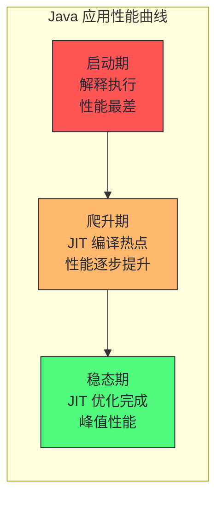
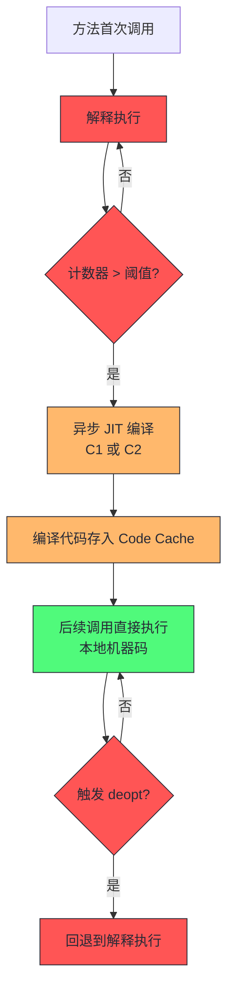
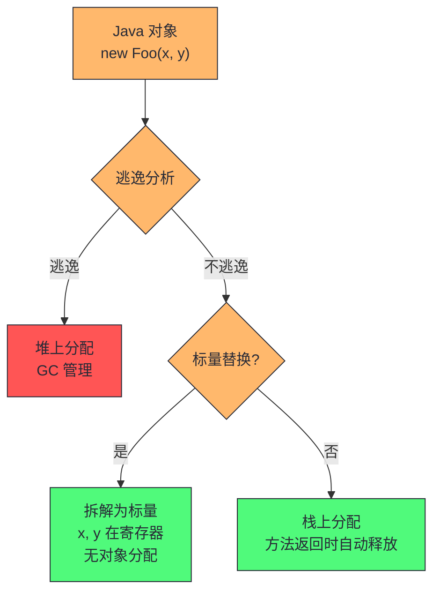

# 09 JIT 编译与稳态性能：HotSpot 的预热代价

> [!abstract] 摘要
> 本文进入专栏第四部分"JVM 运行时性能"的第一篇，聚焦 JIT（Just-In-Time）编译这一 Java 性能最独特的机制。文章从 Java"慢启动快稳态"的根本特征切入，讲透 HotSpot VM 的自适应优化原理——基于方法调用计数和回边分支计数识别热点代码、C1/C2 双编译器的分工、分层编译的五级体系、OSR（栈上替换）的工作机制。重点剖析 JIT 带来的三个性能复杂度：预热期的性能不可代表性、deoptimization 导致的性能突降、以及 JIT 优化对运行时 profile 的依赖性。最后讲清启动性能优化技术（CDS、AOT、GraalVM 原生映像）与稳态性能的权衡关系。核心认知：Java 的"慢"不是语言本身的慢，而是 JIT 预热的代价；理解预热是 Java 性能基准测试和容量规划的前提。

---

## 第 1 章 Java 性能的"慢启动快稳态"特征

### 1.1 为什么 Java 启动慢但稳态快

Java 应用有一个区别于 C/C++/Go/Rust 的显著特征：**启动时性能差，但随着运行时间增长，性能逐步爬升，最终可以达到甚至超过静态编译语言的水平**。这个特征被称为"慢启动快稳态"。



这个特征的根源在于 Java 的执行模型。Java 源码编译为字节码（中间表示），JVM 在运行时把字节码翻译为本地机器码。翻译有两种方式：

- **解释执行**：JVM 逐条把字节码翻译为本地指令并执行，不做全局优化。启动时默认用这种方式，优点是"立即可执行"（无需编译等待），缺点是性能差（每条字节码都要翻译，无优化）。
- **JIT 编译**：JVM 把热点方法的字节码编译为优化的本地机器码，存入 Code Cache，后续直接执行机器码。性能远高于解释执行，但需要时间积累 profile（哪些方法是热点）才能触发编译。

> [!info] 核心概念：为什么 JIT 编译的代码可以比静态编译更快
> 这个反直觉的结论是 Java 性能工程的重要认知。静态编译器（如 gcc -O3）在编译时做优化，但它不知道运行时的实际数据分布——哪些分支经常走、哪些方法的虚调用实际只有一个实现、哪些对象不会逃逸出方法。JIT 编译器在运行时编译，可以看到这些"运行时 profile"，做静态编译器做不到的优化：
> - **分支预测优化**：JIT 知道哪个分支实际经常走，可以为热分支生成更直接的代码
> - **虚方法内联**：JIT 知道一个虚方法调用实际只有一个实现，可以内联它（C++ 的虚方法无法内联）
> - **逃逸分析**：JIT 知道一个对象不会逃逸出方法，可以在栈上分配而不是堆上分配，减少 GC 压力
> - **类型 speculation**：JIT 基于历史类型信息假设未来类型不变，生成特化代码
> 这些优化让 JIT 编译的代码在稳态下可以超过静态编译。代价是预热期和 deoptimization 风险。

### 1.2 应用生命周期的三个阶段

Monica Beckwith 在《JVM Performance Engineering》第 8 章把 Java 应用的生命周期分为三个阶段：

| 阶段 | 特征 | 性能水平 | 主要开销 |
|------|------|---------|---------|
| 启动期 | JVM 引导、类加载、字节码验证 | 解释执行，最差 | 类加载、验证、初始化 |
| 爬升期 | JIT 识别热点并编译、缓存预热 | 逐步提升 | JIT 编译 CPU 开销、类加载 |
| 稳态期 | JIT 优化完成、缓存命中 | 峰值性能 | 正常业务 + GC |

**启动期**的耗时来源：
- JVM 引导：解析参数、加载 JVM 本地库、初始化数据结构（~几百ms）
- 类加载：加载 main 类及依赖类，从 jar 读取字节码（受 [[Page Cache]] 影响）
- 字节码验证：检查字节码格式合法性（可被 `-Xverify:none` 关闭，但不推荐生产用）
- 静态初始化：执行 `<clinit>` 方法

**爬升期**的耗时来源：
- JIT 编译：C1/C2 编译器消耗 CPU 编译热点方法（可达稳态 CPU 的 20-30%）
- 类加载：延迟加载的类在首次使用时加载
- GC：爬升期对象分配速率高，Young GC 频繁
- 缓存预热：业务缓存（如 Guava Cache、Caffeine）从空到满

> [!warning] 生产避坑：基准测试必须在稳态期进行
> 这是最常见的 Java 性能测试错误。如果你在启动后立刻跑基准（没有预热），测到的是解释执行的性能——比稳态慢 10-100 倍。任何 Java 基准测试必须包含预热阶段（通常用与正式测试相同的负载跑几分钟到几十分钟），等 JIT 编译稳定后再开始测量。JMH（Java Microbenchmark Harness）默认包含预热阶段，专栏第 12 篇会详细讲解。

---

## 第 2 章 HotSpot JIT 编译原理

### 2.1 热点检测：方法计数与回边计数

HotSpot VM 如何知道哪些方法值得 JIT 编译？它用两种计数器：

- **方法调用计数器**：每个方法有一个调用计数器，每次方法被调用时递增。当计数器超过阈值（默认 10000，受 `-XX:CompileThreshold` 控制）时，触发 JIT 编译。
- **回边分支计数器**：每个方法的循环有一个回边计数器，每次循环回边时递增。当计数器超过阈值时，触发 OSR（On-Stack Replacement）编译——在方法还在执行时，把循环的代码替换为编译版本。

这两个计数器的阈值不是固定的——HotSpot 有自适应机制，会根据方法的历史编译情况动态调整阈值。频繁触发编译的方法阈值会降低（更快编译），很少触发的会升高（避免浪费编译资源）。



### 2.2 C1 与 C2：双编译器的分工

HotSpot 有两个 JIT 编译器，分工明确：

| 编译器 | 定位 | 编译速度 | 优化深度 | 代码质量 |
|--------|------|---------|---------|---------|
| C1（Client Compiler） | 快速编译，低优化 | 快（~10ms/方法） | 浅（基本优化、profile 收集） | 中等 |
| C2（Server Compiler） | 深度优化，峰值性能 | 慢（~100ms-1s/方法） | 深（内联、循环展开、逃逸分析） | 最优 |

**分层编译（Tiered Compilation，JDK 8+ 默认开启）** 把 C1 和 C2 结合起来：方法首先用 C1 快速编译（带 profile 收集），等 profile 积累足够后用 C2 重新编译为高优化版本。这结合了 C1 的快速启动和 C2 的峰值性能。

分层编译的五级体系：

| 层级 | 编译器 | 特征 |
|------|--------|------|
| Tier 0 | 解释执行 | 无编译，性能最差 |
| Tier 1 | C1 | 快速编译，无 profile |
| Tier 2 | C1 | 快速编译 + profile 收集 |
| Tier 3 | C1 | 完整 profile 收集 |
| Tier 4 | C2 | 最高优化，峰值性能 |

方法的编译路径通常为：Tier 0 → Tier 3（C1 + profile）→ Tier 4（C2 优化）。每一步升级都有阈值控制，避免所有方法都用 C2 编译（浪费编译资源）。

> [!info] 核心概念：OSR（On-Stack Replacement）
> OSR 是 JIT 的一个特殊机制。普通编译是"下次调用方法时用编译版本"，但如果一个方法包含长时间循环，循环跑很久不出来，"下次调用"迟迟不发生。OSR 解决这个问题——在循环回边计数器超阈值时，JVM 在方法还在执行的状态下，把循环的栈帧替换为编译版本的栈帧，循环继续在编译代码中执行。
> OSR 的局限：OSR 编译的代码质量通常不如普通编译——因为 OSR 进入点在循环中间，方法入口到循环之间的代码路径没有完整 profile。这导致 OSR 编译的方法可能比"退出后重新调用编译版本"的性能差。一个优化技巧：把热循环提取到独立方法中，让它通过普通编译路径获得更高质量。

### 2.3 C2 的核心优化

C2 编译器是 Java 峰值性能的来源。它的核心优化包括：

**内联（Inlining）**：把被调用方法的代码直接嵌入调用点，消除方法调用开销（栈帧创建、参数传递、返回）。内联是 C2 最重要的优化——它让 Java 的大量小方法风格（getter/setter、Stream 操作）在稳态后接近零开销。内联受方法大小（`-XX:MaxInlineSize`，默认 35 字节）和调用深度（`-XX:MaxInlineLevel`，默认 9）限制。

**逃逸分析（Escape Analysis）**：分析对象的作用域，判断对象是否会"逃逸"出方法或线程。不逃逸的对象可以在栈上分配（而非堆），避免 GC 开销。逃逸分析还能优化锁——如果一个对象不会逃逸到其他线程，对它的 synchronized 可以被完全消除（锁消除）。

**循环展开（Loop Unrolling）**：把循环体复制多次，减少循环控制开销（条件判断、跳转）。对于紧凑的数值循环，循环展开可以显著提升 IPC。

**死代码消除（Dead Code Elimination）**：删除不会被执行的代码路径。结合运行时 profile，C2 可以删除"从未走过的分支"。

**标量替换（Scalar Replacement）**：逃逸分析判定不逃逸的对象，C2 可以把对象的字段拆解为独立的标量变量，完全避免对象分配。这是比"栈上分配"更激进的优化——对象根本不存在，只有它的字段值存在于寄存器中。



> [!note] 设计哲学：标量替换 vs 栈上分配
> 很多工程师以为"逃逸分析的好处是栈上分配"，但实际上 HotSpot C2 几乎不做栈上分配——它做的是更优的标量替换。栈上分配的对象仍然是对象（有对象头、有内存布局），只是分配在栈帧上。标量替换则把对象完全拆解，字段变成寄存器中的标量值——没有对象头、没有内存分配、没有 GC 顾虑。标量替换的性能收益远大于栈上分配。一个验证方法：用 JFR 的 `jdk.ObjectAllocationSample` 看，如果逃逸分析生效，很多"看起来在分配对象"的代码实际上没有产生任何分配事件。

### 2.4 Code Cache：编译代码的存储

JIT 编译的本地代码存储在 Code Cache 中——一块 JVM 管理的内存区域。Code Cache 的大小由 `-XX:ReservedCodeCacheSize` 控制（默认 240MB）。

Code Cache 满的后果：JIT 停止编译新方法，应用性能停留在当前编译水平，无法继续提升。更严重的是，Code Cache 满时可能触发大量 deoptimization（JVM 主动回收编译代码腾空间）。

```bash
# 查看 Code Cache 使用情况
jcmd <pid> Compiler.code_cache
```

JDK 9+ 引入了 Code Cache 分段，把 Code Cache 分为三段：
- **非方法代码堆**：JVM 内部使用的代码（如 stub）
- **非性能分析 nmethod 堆**：不带 profile 的编译代码（C2 产物）
- **性能分析 nmethod 堆**：带 profile 的编译代码（C1 产物）

分段的好处是减少碎片化和清扫时间——不同类型的代码生命周期不同，分段后可以独立管理。

> [!warning] 生产避坑：Code Cache 满的隐蔽症状
> Code Cache 满的症状不明显——没有报错，没有 OOM，只是性能不再提升或突然下降。一个典型表现：应用运行一段时间后延迟开始升高，GC 日志正常，CPU 正常，火焰图显示热点方法在解释执行（而不是编译代码）。这通常是 Code Cache 满导致 JIT 停止工作。对策：监控 JMX `java.lang:type=Compilation` 的编译时间，如果突然停止增长，检查 Code Cache 使用率。增大 `-XX:ReservedCodeCacheSize` 到 512MB 是大型应用的常见配置。

---

## 第 3 章 Deoptimization：JIT 的安全阀与性能陷阱

### 3.1 什么是 deoptimization

deoptimization（去优化）是 JIT 把已编译的优化代码退回解释执行的过程。它发生在 JIT 的"投机假设"被打破时：

| 触发场景 | 原因 | 频率 |
|---------|------|------|
| 类加载改变虚方法 | 新加载的类实现了之前只有一个实现的接口 | 不常见但可能 |
| 不稳定 if 分支翻转 | 之前不走的分支突然开始走 | 偶发 |
| 逃逸分析失效 | 对象开始逃逸（如传给新线程） | 偶发 |
| Uncommon Trap | C2 编译时假设某分支"不常见"，该分支被走时触发 deopt | 偶发 |
| 逆优化请求 | JVM 主动请求（如 Code Cache 满） | 罕见 |

deoptimization 的性能影响是突降——从 C2 编译的峰值性能瞬间跌回解释执行的性能。如果被 deoptimize 的方法后续重新被频繁调用，JIT 会重新编译它（可能用更保守的优化），性能恢复。但重新编译需要时间，期间性能处于低谷。

### 3.2 deoptimization 的两种类型

deoptimization 分为"unconditional"（无条件）和"conditional"（条件）两种：

**无条件 deopt（unconditional deopt）**：编译代码完全不可用，必须立刻退回解释执行。触发场景：
- Code Cache 满需要回收空间
- 类重新定义（如 HotSwap、JVMTI RetransformClasses）
- 方法被标记为"不再准入"（编译升级时旧版本废弃）

**条件 deopt（conditional deopt / uncommon trap）**：编译代码在特定条件下不可用，遇到该条件时退回解释执行。触发场景：
- C2 假设某虚方法只有一个实现，但运行时出现了第二个实现（新类加载）
- C2 假设某分支"不常见"（基于 profile），但该分支被走了
- C2 做了类型 speculation，但运行时类型变了

条件 deopt 更常见，也更具隐蔽性——它只在特定路径被走时触发，如果该路径很少走，deopt 的影响可忽略。但如果该路径突然变热（如流量模式变化），deopt 风暴就会出现。

> [!info] Uncommon Trap 的工作原理
> C2 编译时，对于 profile 显示"几乎不走"的分支，不会为该分支生成完整代码，而是插入一个"uncommon trap"——一个跳转到 JVM deopt 处理器的指令。如果该分支真的被走了，触发 trap，JVM 把整个方法退回解释执行，重新解释该分支。
> 这种设计的收益：编译代码更紧凑（省去了冷分支的代码），IPC 更高。代价：如果冷分支变热，deopt + 重新编译的开销显著。实践中，uncommon trap 在正常负载下几乎无感，但在负载模式突变时可能成为性能陷阱。

### 3.3 观察 deoptimization

```bash
# 查看编译和 deopt 事件
java -XX:+PrintCompilation -XX:+PrintDeoptimization -jar app.jar

# 或用 jcmd 运行时查看
jcmd <pid> Compiler.print_statistics
jcmd <pid> Compiler.directives_print
```

`-XX:+PrintCompilation` 的输出示例：
```
   123  4   b  com.example.Service::process  (128 bytes)
   124  3  com.example.Service::validate  (32 bytes)
   125     3  com.example.Service::validate  (32 bytes)   made not entrant
   126  4  com.example.Service::validate  (32 bytes)
```

"made not entrant" 表示该方法的 Tier 3 编译版本被标记为"不再准入"——新调用不再使用它，已在该版本中执行的调用会自然退出。后续 Tier 4 版本（第 126 行）接管。这是正常的编译升级，不是 deopt。真正的 deopt 会显示 "made zombie"（完全废弃）或 "uncommon trap"。

> [!warning] 生产避坑：deoptimization 风暴
> 极端情况下，大量方法同时 deoptimize 会导致性能突降——称为"deopt 风暴"。触发场景通常是一个"不常见"的事件突然变常见，如：
> - 运行时加载了一个新的接口实现类（改变了虚方法目标）
> - 异常处理路径突然被频繁触发（打破了 C2 的"异常不常见"假设）
> - 反射调用突然增加（C2 对反射的优化假设失效）
> 排查：看 `-XX:+PrintCompilation` 输出中 "uncommon trap" 和 "made zombie" 的频率。如果密集出现，找到触发 deopt 的原因（通常是某个类加载或异常事件）。JFR 的 `jdk.CompilerCompilation` 事件也可以用来分析编译和 deopt 的历史趋势。

---

## 第 4 章 预热机制与稳态判定

### 4.1 预热的工程实践

对于长跑的服务端 Java 应用，预热是必须的工程步骤。预热的目标是让应用在接收生产流量前达到稳态性能。常见预热方式：

| 方式 | 原理 | 优点 | 缺点 |
|------|------|------|------|
| 渐进流量 | 蓝绿部署中逐步把流量从旧实例迁到新实例 | 真实负载预热，最贴近生产 | 需要蓝绿部署支持 |
| 请求回放 | 用录制的历史请求对新实例预热 | 可控、可重复 | 需要 RPC 框架支持回放 |
| 合成负载 | 用基准工具（wrk、jmeter）发压 | 简单直接 | 负载模式可能与真实不同 |
| JVM 预热选项 | `-XX:CompileThreshold` 降低阈值 | 无需外部工具 | 可能过度编译非热点方法 |

> [!info] 蓝绿部署与预热
> Brendan Gregg 在《Systems Performance》第 1 章提到蓝绿部署（Blue-Green Deployment）作为云时代的性能安全网——流量渐进迁移，新实例出问题可以快速回滚。这与 JIT 预热完美契合：渐进流量本身就是渐进预热。Netflix 称之为"红黑部署"——新实例先无流量启动，确认健康后渐进引入流量，完全预热后再切换。

### 4.2 如何判断稳态已到达

判断应用是否到达稳态的观测指标：

1. **JIT 编译速率下降**：`-XX:+PrintCompilation` 的输出频率从"每秒多条"降到"偶尔一条"
2. **Code Cache 使用趋于稳定**：JMX `java.lang:type=Compilation` 的 `TotalCompilationTime` 增长放缓
3. **GC 频率稳定**：Young GC 间隔稳定，无 Full GC
4. **CPU 使用率稳定**：爬升期 JIT 编译消耗额外 CPU，稳态后 CPU 降回业务负载水平
5. **延迟分布稳定**：P99 延迟不再持续下降（预热期延迟会逐步降低）

生产实践中，一个中等复杂度的 Java 服务通常需要 3-10 分钟达到基本稳态，10-30 分钟达到完全稳态（所有热点都被 C2 编译）。

### 4.3 预热期的容量规划影响

预热期不只是"性能差"，它还影响容量规划。爬升期 JIT 编译消耗 20-30% 的额外 CPU——如果一个服务稳态需要 4 核 CPU，预热期可能需要 6 核才能维持相同的吞吐量。这意味着：

- **自动伸缩的冷却时间**：Kubernetes HPA 在新 Pod 启动后不应立刻按其性能指标做伸缩决策——新 Pod 在预热期性能差，HPA 可能误判"负载高"而过度扩容
- **金丝雀发布的流量比例**：新版本刚部署时只能给极小比例流量（1-5%），等预热完成后再逐步增加
- **峰值容量预留**：如果所有实例同时重启（如发布），预热期的总处理能力下降 20-30%，需要预留容量

> [!info] 容量规划中的预热系数
> 一个实用的容量规划参数：**预热系数 = 预热期 CPU / 稳态 CPU**。典型值 1.2-1.3。计算峰值容量时：
> - 稳态所需 CPU × 预热系数 = 滚动发布期间所需 CPU
> - 如果稳态需要 100 核，滚动发布期间需要 120-130 核
> 这个系数在 Kubernetes 集群规划中尤其重要——如果集群总 CPU 刚好等于稳态需求，滚动发布时新 Pod 的预热开销会让集群超载。

---

## 第 5 章 启动性能优化技术

### 5.1 CDS 与 AppCDS

CDS（Class Data Sharing）从 JDK 5 引入，允许把类的元数据预先归档为共享文件，启动时直接映射到内存，跳过类加载和验证的部分步骤。AppCDS（Application CDS，JDK 10+）扩展到应用类。

CDS 的效果：减少启动期类加载时间 20-40%，减少 Metaspace 内存占用（多 JVM 共享同一归档）。

```bash
# 生成 CDS 归档（JDK 13+）
java -XX:ArchiveClassesAtExit=app.jsa -jar app.jar
# 使用 CDS 归档启动
java -XX:SharedArchiveFile=app.jsa -jar app.jar
```

### 5.2 AOT 编译与 GraalVM 原生映像

AOT（Ahead-Of-Time）编译在构建时把字节码编译为本地机器码，启动时直接执行，无需 JIT 预热。GraalVM 的 `native-image` 工具是最成熟的 AOT 方案。

| 维度 | JIT（传统 JVM） | AOT（GraalVM Native） |
|------|----------------|---------------------|
| 启动时间 | 秒级（含预热） | 毫秒级 |
| 稳态性能 | 峰值（C2 优化） | 低于 C2（无运行时 profile 优化） |
| 内存占用 | 大（JVM + 堆 + Code Cache） | 小（无 JVM 开销） |
| 动态特性 | 完全支持（反射、动态代理等） | 受限（需配置或编译时已知） |
| GC | 完整 GC 体系 | 有限（Serial GC 或 G1） |
| 适用场景 | 长跑服务 | 短任务、CLI、Serverless |

### 5.3 GraalVM 原生映像的工作原理与限制

GraalVM 的 `native-image` 在构建时执行"封闭世界分析"（Closed-World Analysis）——它扫描应用的所有可达代码路径，把字节码编译为本地机器码，打包为独立可执行文件。这个可执行文件不依赖 JVM，自带最小运行时。

封闭世界分析的限制：
- **反射需配置**：运行时通过 `Class.forName("com.example.Foo")` 加载的类，AOT 编译时无法知道。需要通过 `reflect-config.json` 预先声明
- **动态代理受限**：`Proxy.newProxyInstance` 需要预先知道代理的接口
- **资源加载需声明**：`ClassLoader.getResourceAsStream` 加载的资源需要在 `resource-config.json` 中声明
- **JNI 受限**：原生映像中的 JNI 支持有限
- **类加载器隔离弱**：多类加载器场景（如 OSGi、Java Agent）支持不完善

这些限制意味着 GraalVM 原生映像不是所有 Java 应用的银弹——它最适合无复杂反射的微服务、CLI 工具、Serverless 函数。对于重度依赖反射的框架（如 Spring、Hibernate），需要框架层面的适配（Spring Boot 3.x 已提供 GraalVM 原生映像支持）。

> [!note] 设计哲学：AOT vs JIT 的权衡本质
> AOT 用"失去运行时优化"换取"零启动开销"。对于短命进程（CLI 工具、Serverless 函数），JIT 的预热成本永远收不回来，AOT 是正确选择。对于长跑服务，JIT 的稳态性能优势远超 AOT，预热成本被摊薄到数小时/天的运行中。Project Leyden（JDK 孵化项目）试图在两者之间找到平衡——AOT 编译框架代码 + JIT 编译应用热点，兼顾启动速度和稳态性能。这是 Java 性能工程的未来方向之一。

### 5.4 CDS 的实战配置

CDS（Class Data Sharing）是比 AOT 更轻量的启动优化。它不编译字节码，只是把类的元数据（Klass 信息、常量池等）预先归档为共享文件，启动时 `mmap` 直接映射到内存，跳过类文件解析和验证。

CDS 的三个层级：

| 层级 | 覆盖范围 | JDK 版本 | 效果 |
|------|---------|---------|------|
| CDS | JDK 核心类 | JDK 5+ | 启动快 10-20% |
| AppCDS | 应用类 + 依赖 | JDK 10+ | 启动快 20-40% |
| Dynamic CDS | 运行时自动归档 | JDK 13+ | 无需手动归档 |

Dynamic CDS（`-XX:ArchiveClassesAtExit`）是最易用的——应用正常退出时自动把加载过的类归档，下次启动用这个归档。不需要手动分析类列表。

```bash
# 首次运行：生成归档
java -XX:ArchiveClassesAtExit=app.jsa -jar app.jar

# 后续运行：使用归档
java -XX:SharedArchiveFile=app.jsa -jar app.jar
```

> [!info] CDS 与容器的协同
> 在 Kubernetes 环境中，CDS 归档文件可以打包到容器镜像中，所有 Pod 共享同一份归档。由于 CDS 归档是只读的 `mmap` 文件，多个 Pod 的 JVM 可以共享同一份物理内存页（通过 `/dev/shm` 或共享 volume）。这不仅加速启动，还减少了总内存占用——10 个 Pod 共享一份 CDS 归档，而非各自加载。

---

## 第 6 章 JIT 观测与调优

### 6.1 JIT 观测工具

| 工具 | 命令 | 观测内容 |
|------|------|---------|
| PrintCompilation | `-XX:+PrintCompilation` | 编译事件实时流 |
| JFR | `jdk.CompilerCompilation` 事件 | 编译事件带时间戳 |
| JMX | `java.lang:type=Compilation` | 编译时间总计 |
| jcmd | `jcmd <pid> Compiler.print_statistics` | 编译统计 |
| jcmd | `jcmd <pid> Compiler.code_cache` | Code Cache 使用情况 |
| JITWatch | 可视化工具 | 编译详情可视化 |

### 6.2 JIT 相关 JVM 参数速查

| 参数 | 默认值 | 作用 |
|------|--------|------|
| `-XX:+TieredCompilation` | 开启（JDK 8+） | 分层编译 |
| `-XX:CompileThreshold` | 10000 | 方法调用计数阈值 |
| `-XX:MaxInlineSize` | 35 | 可内联方法最大字节码大小 |
| `-XX:MaxInlineLevel` | 9 | 内联深度上限 |
| `-XX:ReservedCodeCacheSize` | 240MB | Code Cache 大小 |
| `-XX:+PrintCompilation` | 关闭 | 打印编译事件 |
| `-XX:+PrintInlining` | 关闭 | 打印内联决策 |
| `-XX:+PrintDeoptimization` | 关闭 | 打印 deopt 事件 |
| `-XX:-BackgroundCompilation` | 开启 | 关闭后台编译（前台同步编译） |

### 6.3 回到支付服务案例

支付服务案例中 JIT 的视角：
- 故障窗口在凌晨 3:00，应用已运行数小时，处于完全稳态，JIT 不是直接因素
- 但 DEBUG 日志开启后产生大量字符串拼接（`String.format`、`StringBuilder`），这些热路径方法可能触发了新的 JIT 编译或 deoptimization
- 如果排查时发现 `-XX:+PrintCompilation` 在故障窗口有异常密集的编译/deopt 事件，需要关联分析

### 6.4 JIT 诊断实战：为什么方法没有被编译

一个常见排查场景：火焰图显示某个热点方法仍在解释执行（栈帧标记 `Interpreter`），预期它应该被 JIT 编译了。诊断步骤：

1. **检查编译日志**：`-XX:+PrintCompilation` 是否有该方法的编译记录
2. **检查阈值**：方法的调用频率是否达到 `-XX:CompileThreshold`
3. **检查方法大小**：方法是否超过 `-XX:MaxInlineSize` 或 C2 的编译上限（默认 8000 字节码）
4. **检查 Code Cache**：`jcmd <pid> Compiler.code_cache` 是否已满
5. **检查 deopt**：方法是否被频繁 deoptimize（"made not entrant" 频繁出现）
6. **检查编译策略**：`jcmd <pid> Compiler.directives_print` 查看是否有指令阻止编译

常见原因和解法：

| 原因 | 症状 | 解法 |
|------|------|------|
| 调用频率不够 | 计数器未达阈值 | 降低 CompileThreshold 或预热更久 |
| 方法太大 | 超过编译上限 | 拆分大方法为小方法 |
| Code Cache 满 | 编译完全停止 | 增大 ReservedCodeCacheSize |
| 频繁 deopt | "made not entrant" 密集 | 排查 deopt 根因（类加载/异常） |
| 分层编译关闭 | 只有 C1 或只有 C2 | 确认 TieredCompilation 开启 |

### 6.5 JIT 与 GC 的交互：编译代码中的写屏障

JIT 编译的代码中包含 GC 的写屏障（Write Barrier）——每次对象引用赋值时，JIT 生成的代码会额外执行 GC 需要的记录操作（如记录跨代引用）。写屏障的开销在 JIT 编译的代码中是"内联"的，通常 2-5% 的性能损耗。

不同的 GC 有不同的写屏障复杂度：
- Serial/Parallel GC：简单的卡表（Card Table）写屏障
- G1 GC：更复杂的日志缓冲写屏障（SATB + RS 维护）
- ZGC/Shenandoah：染色指针相关的读/写屏障

写屏障的开销是 GC 选型的一个隐性因素——ZGC 的读屏障虽然让 GC 停顿极短，但增加了应用代码的读引用开销（每次读对象引用都要检查染色指针）。这是"GC 停顿 vs 应用吞吐"的权衡，专栏第 10 篇会详细展开。

---

## 第 7 章 本章核心认知

1. **慢启动快稳态是 Java 的根本特征**：不是语言慢，是 JIT 预热的代价
2. **分层编译让 C1 和 C2 协同**：C1 快速编译启动，C2 深度优化峰值，两者结合兼顾启动和稳态
3. **JIT 基于运行时 profile 做投机优化**：这是 JIT 能超过静态编译的原因，也是 deoptimization 的根源
4. **deoptimization 是 JIT 的安全阀也是性能陷阱**：投机假设被打破时退回解释执行，可能造成性能突降
5. **基准测试必须在稳态期进行**：预热是 Java 基准测试的强制步骤，否则测到的是解释执行性能
6. **AOT 和 JIT 的权衡本质是启动 vs 稳态**：短命用 AOT，长跑用 JIT，Leyden 试图兼得
7. **标量替换比栈上分配更优**：C2 把不逃逸的对象拆解为标量寄存器变量，完全消除对象分配
8. **Code Cache 满是隐蔽的性能陷阱**：JIT 停止编译但无报错，需主动监控 Code Cache 使用率
9. **预热系数影响容量规划**：预热期 CPU 比稳态高 20-30%，滚动发布时需预留容量
10. **CDS 是轻量启动优化**：不编译代码，只共享类元数据，与容器化部署协同效果好

---

## 第 8 章 JIT 调优参数与生产配置模板

### 8.1 不同场景的 JIT 配置

| 场景 | 推荐配置 | 理由 |
|------|---------|------|
| 长跑服务（默认） | `-XX:+TieredCompilation`（默认开） | 标准分层编译，C1→C2 升级 |
| 启动敏感服务 | 降低 `-XX:CompileThreshold=1500` | 更快触发编译，缩短预热 |
| 计算密集型 | 增大 `-XX:ReservedCodeCacheSize=512m` | 更多方法编译，避免 Code Cache 满 |
| 微服务/Serverless | 考虑 GraalVM 原生映像 | 消除预热，毫秒启动 |
| 大方法/复杂逻辑 | 增大 `-XX:MaxInlineSize=50` | 更多方法内联（代价是 Code Cache 增长） |

### 8.2 生产 JVM 启动参数模板（JIT 相关）

```bash
# 长跑服务推荐
java \
  -XX:+TieredCompilation \
  -XX:CompileThreshold=10000 \
  -XX:ReservedCodeCacheSize=512m \
  -XX:+PrintCompilation \
  -Xlog:compilation=info:file=/var/log/jit.log:time,uptime,level,tags \
  -jar app.jar

# 启动敏感服务推荐
java \
  -XX:+TieredCompilation \
  -XX:CompileThreshold=1500 \
  -XX:ReservedCodeCacheSize=256m \
  -XX:SharedArchiveFile=app.jsa \
  -jar app.jar
```

> [!note] JIT 日志与统一日志的整合
> JDK 9+ 的统一日志（第 03 篇 7.0 节）覆盖了 JIT 编译。用 `-Xlog:compilation=info` 替代旧的 `-XX:+PrintCompilation`，可以享受统一日志的所有好处：标签过滤、级别控制、异步写入、文件轮转。JIT 日志在生产环境建议设为 info 级别（记录编译/deopt 事件），排查时临时提升到 debug 或 trace 级别获取更详细的信息。

---

> [!quote] 专栏下一站
> 第 10 篇《GC 工程化：从分代假设到现代 GC 调优》进入 JVM 运行时性能的核心主题——垃圾回收。GC 是 Java 内存安全的代价，也是延迟长尾的最主要来源。下一篇将讲透 GC 算法演进、停顿 vs 吞吐的权衡、GC 日志诊断和 GC 选型决策框架。
