# 10 GC 工程化：从分代假设到现代 GC 调优

> [!abstract] 摘要
> 本文是专栏第四部分"JVM 运行时性能"的第二篇，聚焦 Java 垃圾回收（Garbage Collection, GC）的工程化实践。文章从"弱分代假说"这一理论基石出发，讲透分代堆结构的设计逻辑，然后沿着 Serial → Parallel → CMS → G1 → ZGC → Shenandoah 的演进脉络，剖析每代 GC 解决了前代的什么问题、又引入了什么新代价。重点深度解析 G1 的区域化堆与暂停时间预测模型、ZGC 的染色指针与并发重定位机制，以及两者在"停顿 vs 吞吐 vs 堆开销"三维空间中的权衡取舍。最后给出 GC 日志诊断方法论、工作负载分类选型框架和生产环境 GC 调优的标准流程。核心认知：GC 调优不是调参数，而是理解工作负载的内存生命周期模式后，选择与之匹配的 GC 策略；现代 GC 的核心趋势是"并发化"——把更多 GC 工作从 STW 暂停移到与应用并发的阶段，代价是屏障开销和浮动垃圾。

---

## 第 1 章 GC 的本质与分代假设

### 1.1 为什么需要自动内存管理

在 C/C++ 中，开发者手动管理内存：`malloc` 分配、`free` 释放。这种方式的性能上限高（零运行时开销），但工程代价巨大：

- **悬垂指针**：释放后仍被引用的内存，导致未定义行为
- **内存泄漏**：分配后忘记释放，导致堆持续增长
- **双重释放**：同一块内存被释放两次，破坏堆元数据

Java 选择自动内存管理——GC 自动识别并回收不再被引用的对象。代价是运行时开销：GC 需要遍历对象图、移动对象、维护元数据，这些都会消耗 CPU 和内存。

> [!info] 核心概念：GC 的本质是"用 CPU 换内存安全"
> GC 的核心权衡是：用额外的 CPU 开销（标记、复制、压缩）换取内存安全（无悬垂指针、无泄漏）。不同的 GC 算法在这个权衡空间中选择了不同的点：
> - **吞吐量优先**（Parallel GC）：最大化应用吞吐，接受较长停顿
> - **延迟优先**（ZGC/Shenandoah）：最小化停顿，接受一定吞吐损失
> - **平衡型**（G1）：在停顿和吞吐之间寻求折中

GC 的工作可以分解为两个核心操作：

1. **标记（Marking）**：从 GC Root（栈引用、静态字段、JNI 引用等）出发，遍历对象图，识别所有存活对象。未标记的对象即为垃圾。
2. **回收（Reclamation）**：回收垃圾对象占用的内存。回收方式包括：
   - **标记-清除（Mark-Sweep）**：直接释放垃圾对象，不移动存活对象。产生碎片。
   - **标记-复制（Mark-Copy）**：将存活对象复制到另一区域，原区域整体回收。无碎片但浪费一半空间。
   - **标记-压缩（Mark-Compact）**：将存活对象向一端移动，消除碎片。无碎片但移动代价高。

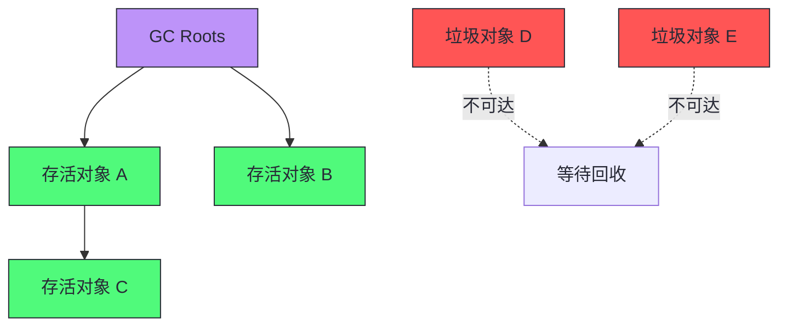

### 1.2 弱分代假说：GC 算法的理论基石

所有分代 GC 算法的设计都建立在一个经验性观察上——**弱分代假说（Weak Generational Hypothesis）**：

> **绝大多数对象朝生夕灭，少数对象长期存活。**

这个假说有两个推论：

1. **弱代假说推论一**：年轻代中的对象绝大多数是垃圾。因此对年轻代的回收效率高（标记-复制时需要复制的存活对象少）。
2. **弱代假说推论二**：老年代到年轻代的引用很少。因此年轻代 GC 不需要扫描整个老年代，只需通过"记忆集"（Remembered Set）跟踪跨代引用。

> [!note] 设计哲学：为什么弱分代假说是"弱"的
> 注意它是"弱"分代假说而非"强"分代假说。强分代假说会断言"所有对象要么朝生夕灭要么长期存活"，这在现实中不成立——存在大量"中等生命周期"对象（如请求处理过程中的中间对象、缓存中短期驻留的数据）。这些中等生命周期对象是 GC 的主要痛点：它们在年轻代中存活过多次 minor GC，被晋升到老年代，然后在老年代中很快死亡，却需要等待老年代 GC 才能被回收。G1 的混合收集和 ZGC 的并发标记都是为了更高效地回收这类"卡在老年代里的短命对象"。

弱分代假说的工程价值在于：它允许 GC **分代回收**——只回收年轻代（minor GC），而不必每次都扫描整个堆。因为年轻代大部分是垃圾，minor GC 的回收效率极高，停顿时间短。只有当老年代占用率达到阈值时，才触发老年代回收（major GC / mixed GC）。

### 1.3 分代堆结构：Eden/Survivor/Old 的设计逻辑

基于弱分代假说，HotSpot VM 将堆划分为年轻代（Young Generation）和老年代（Old Generation）。年轻代进一步划分为 Eden 区和两个 Survivor 区（S0 和 S1）。

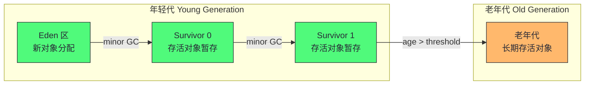

对象的生命周期流转如下：

1. **新对象分配在 Eden**：当线程通过 TLAB（Thread-Local Allocation Buffer）分配新对象时，默认从 Eden 区分配。Eden 区满时触发 minor GC。
2. **minor GC 的复制过程**：GC 将 Eden 和当前使用的 Survivor（如 S0）中的存活对象复制到另一个 Survivor（S1）。复制后，Eden 和 S0 整体清空，S1 成为新的存活区。这种"半区复制"避免了碎片，但代价是浪费一个 Survivor 区的空间。
3. **年龄晋升**：每次 minor GC 中存活的对象年龄+1。当年龄达到阈值（默认 15，通过 `-XX:MaxTenuringThreshold` 控制）时，晋升到老年代。
4. **大对象直接进入老年代**：超过 `-XX:PretenureSizeThreshold` 的对象直接在老年代分配，避免在年轻代中来回复制。

> [!warning] 生产避坑：Survivor 区太小导致提前晋升
> 如果 Survivor 区太小，minor GC 时存活对象放不下，会直接晋升到老年代。这导致老年代被短命对象填满，频繁触发老年代 GC。诊断方法：通过 GC 日志观察 `Desired survivor size` 和 `Actual survivor size`，如果实际存活对象持续超过期望大小，说明 Survivor 区不足。解决方案：增大年轻代或调整 `TargetSurvivorRatio`。

分代结构的本质是**用空间换时间**：年轻代用半区复制换取无碎片的快速回收，老年代用标记-压缩换取空间利用率。G1 和 ZGC 对这个模型做了不同程度的改造，但弱分代假说仍然是底层逻辑。

### 1.4 TLAB 与 PLAB：分配的快速路径

在分代结构之上，HotSpot 还有一层关键的分配优化——线程本地分配缓冲区（Thread-Local Allocation Buffers, TLAB）。

**为什么需要 TLAB**：多线程环境下，如果所有线程都从 Eden 区分配对象，需要通过 CAS 或锁来协调指针推进。这在高并发应用中会成为瓶颈。TLAB 的思路是给每个线程分配一块 Eden 区的私有缓冲区，线程在自己的 TLAB 中通过指针碰撞（bump pointer）分配，无需同步。

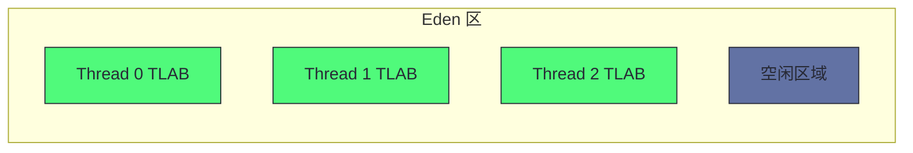

TLAB 的关键调优参数：

| 参数 | 作用 | 默认值 |
|------|------|--------|
| `-XX:+UseTLAB` | 启用 TLAB | true |
| `-XX:TLABSize` | TLAB 初始大小 | 自适应 |
| `-XX:+ResizeTLAB` | 允许 TLAB 自适应调整 | true |
| `-XX:TLABRefillWasteFraction` | TLAB 允许的最大浪费比例 | 64 |

与 TLAB 对应的是 PLAB（Promotion-Local Allocation Buffers），用于 GC 线程在晋升对象时的本地缓冲。PLAB 减少 GC 线程之间的同步开销，提升晋升效率。PLAB 通常由 JVM 自适应调整，手动调优的场景较少。

> [!info] 核心概念：TLAB 与 NUMA 感知分配的协同
> 在 NUMA 架构上，JVM 可以将 Eden 区按 NUMA 节点划分，每个线程从最近节点的 TLAB 分配。这确保了分配的内存物理上靠近执行线程的 CPU，减少跨节点内存访问延迟。通过 `-XX:+UseNUMA` 启用。G1 在 JDK 14 成为 NUMA 感知，ZGC 在 JDK 15 成为 NUMA 感知。

---

## 第 2 章 GC 算法演进史

### 2.1 Serial GC：单线程的起点

Serial GC 是最古老的 GC 实现。它的特点是：

- **单线程回收**：GC 时只有一个线程工作，完全 STW
- **分代结构**：年轻代用标记-复制，老年代用标记-压缩
- **适用场景**：小堆（< 100MB）、单核、客户端应用

启用方式：`-XX:+UseSerialGC`

Serial GC 的停顿时间与堆大小成正比——堆越大，标记和压缩的时间越长。这使得它在现代服务端应用中几乎不可用。但它的简单性使其成为理解 GC 原理的最佳起点：所有分代 GC 的核心逻辑都可以在 Serial GC 中找到原型。

### 2.2 Parallel GC：吞吐量优先

Parallel GC（也叫 Parallel Scavenge）是 JDK 8 的默认 GC。它的核心改进是**多线程并行回收**：

- **年轻代**：多个 GC 线程并行执行标记-复制
- **老年代**：多个 GC 线程并行执行标记-压缩
- **目标**：最大化总吞吐量（应用时间 / 总时间），接受较长停顿

启用方式：`-XX:+UseParallelGC`

Parallel GC 的关键调优参数：

| 参数 | 作用 | 默认值 |
|------|------|--------|
| `-XX:MaxGCPauseMillis` | 最大停顿时间目标（软目标） | 无限制 |
| `-XX:GCTimeRatio` | GC 时间占比上限（=N 表示 GC 不超过 1/(N+1)） | 99（即 GC 不超过 1%） |
| `-XX:ParallelGCThreads` | 并行 GC 线程数 | CPU 核数 |

> [!info] 核心概念：吞吐量 vs 停顿的矛盾
> Parallel GC 的 `MaxGCPauseMillis` 和 `GCTimeRatio` 是两个可能冲突的软目标。如果设置了一个很小的停顿目标，GC 会缩小年轻代以减少单次停顿时间，但这会导致更频繁的 minor GC，从而增加 GC 总时间占比，可能违反 `GCTimeRatio` 目标。JVM 会在两个目标之间做折中，但优先满足最后一个设置的目标。理解这个矛盾是 GC 调优的基础。

Parallel GC 的根本局限是**停顿时间与堆大小成正比**。在 32GB 堆上，一次 Full GC 可能停顿数十秒。对于延迟敏感型应用（如交易系统、在线服务），这是不可接受的。这个局限催生了 CMS 和 G1。

### 2.3 CMS：并发标记的先驱

CMS（Concurrent Mark-Sweep）是 JDK 5 引入的以低停顿为目标的 GC。它的核心创新是**并发标记**——标记阶段与应用线程并发执行，不停止应用。

CMS 的工作周期分为四个阶段：

1. **初始标记（Initial Mark）**：STW，标记 GC Root 直接引用的对象。时间短。
2. **并发标记（Concurrent Mark）**：与应用并发，从初始标记的对象出发遍历对象图。
3. **重新标记（Remark）**：STW，修正并发标记期间应用修改的引用。
4. **并发清除（Concurrent Sweep）**：与应用并发，清除垃圾对象。

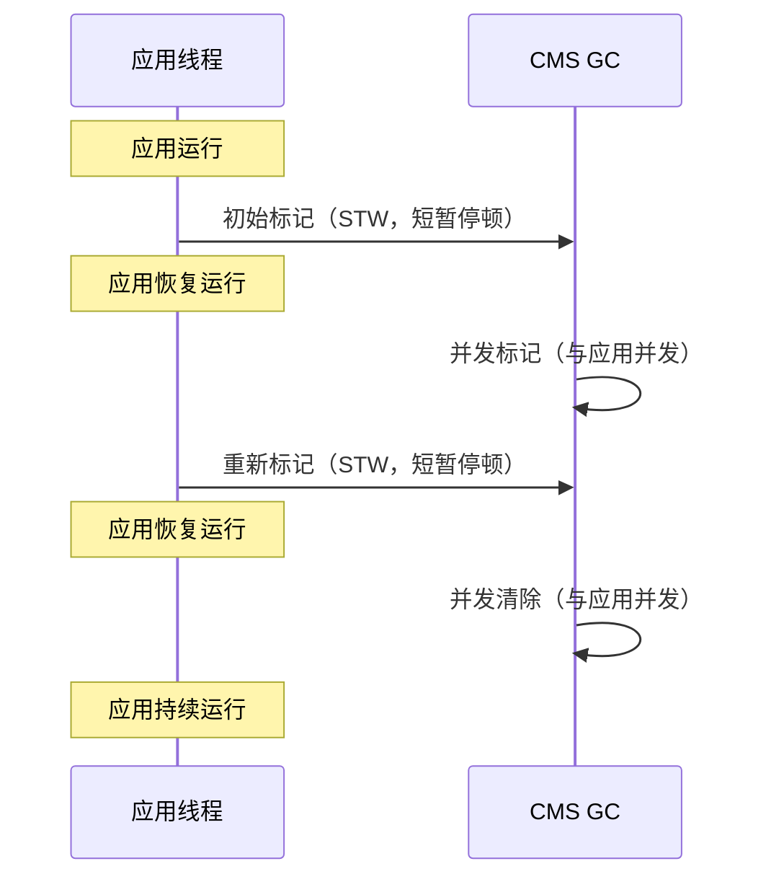

CMS 的历史贡献是证明了"并发 GC"的可行性，但它有三个致命缺陷：

1. **使用标记-清除算法，不压缩**：产生碎片，最终需要 Full GC（Serial Old）做压缩——这次 Full GC 的停顿可能长达数秒到数十秒。
2. **浮动垃圾**：并发标记期间产生的新垃圾无法在本次回收，只能等下次。
3. **并发模式失败（Concurrent Mode Failure）**：如果老年代在 CMS 周期完成前就被填满，会退化为 Serial Old 的 Full GC。

CMS 在 JDK 9 被标记为废弃，JDK 14 被移除。但它的并发标记思想被 G1 和 ZGC 继承和发扬。

### 2.4 G1：区域化堆的革命

G1（Garbage-First）是 JDK 9 起的默认 GC。它的核心创新是**区域化堆（Regionalized Heap）**——将堆划分为大小相等的 Region，每个 Region 可以动态扮演 Eden、Survivor 或 Old 的角色。

G1 解决了 CMS 的三个核心问题：

| CMS 的问题 | G1 的解决方案 |
|-----------|--------------|
| 碎片化（标记-清除不压缩） | Region 级别的复制式回收，天然无碎片 |
| Full GC 退化 | 混合收集增量回收老年代，避免 Full GC |
| 停顿不可控 | 暂停时间预测模型，基于 Region 回收时间预测 |

G1 的名字"Garbage-First"来自其回收集选择策略：优先回收垃圾最多的 Region，从而最大化每次 GC 的空间回收效率。详细机制在第 3 章展开。

### 2.5 ZGC：亚毫秒级暂停

ZGC（Z Garbage Collector）是 JDK 11 引入、JDK 15 生产就绪的低延迟 GC。它的设计目标是：**停顿时间与堆大小无关，保持在亚毫秒级**。

ZGC 的核心创新：

- **染色指针（Colored Pointers）**：在 64 位指针中嵌入 GC 元数据
- **加载屏障（Load Barrier）**：在应用读取对象引用时执行 GC 相关操作
- **并发重定位（Concurrent Relocation）**：对象移动与应用并发执行
- **堆外转发表（Off-heap Forwarding Table）**：存储对象重定位后的新地址

ZGC 支持 8MB 到 16TB 的堆大小，停顿时间稳定在 1ms 以下。代价是吞吐量损失（约 5-15%）和更高的内存开销。详细机制在第 4 章展开。

### 2.6 Shenandoah：Red Hat 的并发压缩方案

Shenandoah 是 Red Hat 开发的并发压缩 GC，与 ZGC 同属"并发压缩"路线，但技术路径不同：

| 维度 | ZGC | Shenandoah |
|------|-----|------------|
| 指针技术 | 染色指针（64 位指针嵌入元数据） | Brooks 指针（每个对象多一个转发指针字段） |
| 屏障类型 | 加载屏障（读屏障） | 读写屏障 |
| 内存开销 | 转发表在堆外 | 每对象多一个指针字段（约 4-8% 堆开销） |
| 平台限制 | 需要 64 位指针的染色支持 | 无特殊平台要求 |
| JDK 版本 | JDK 11 实验，JDK 15 生产 | JDK 12 实验，JDK 15 生产 |

Shenandoah 的 Brooks 指针方案更简单但内存开销更高；ZGC 的染色指针方案更精巧但依赖平台特性。两者在停顿时间上接近，都在亚毫秒级。选择哪个主要取决于 JDK 发行版——Red Hat 系（如 OpenJDK RHEL build）对 Shenandoah 支持更好，其他发行版通常用 ZGC。

### 2.7 GC 演进的总脉络

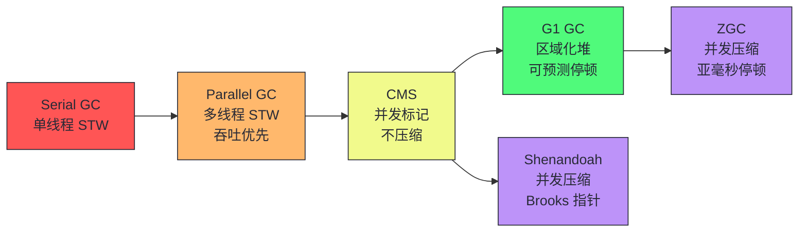

演进的核心驱动力是**对停顿时间的要求越来越严苛**：从"秒级"到"百毫秒级"到"十毫秒级"到"亚毫秒级"。每次演进都是把更多的 GC 工作从 STW 阶段移到并发阶段，代价是更复杂的屏障机制和更高的资源开销。

---

## 第 3 章 G1 GC 深度解析

### 3.1 区域化堆：Region 作为工作单元

G1 将堆划分为 1-32MB 大小相等的 Region（默认约 2048 个）。每个 Region 可以动态扮演以下角色：

- **Eden Region**：新对象分配
- **Survivor Region**：minor GC 后存活对象的暂存
- **Old Region**：晋升的老年代对象
- **Humongous Region**：大对象（占单个 Region 50% 以上的对象）

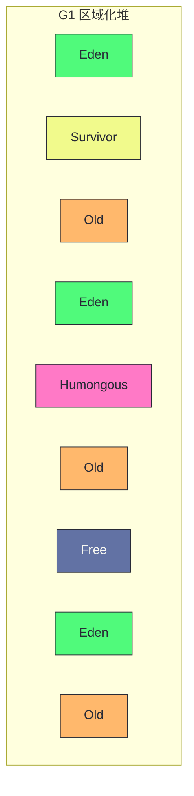

与传统连续分代布局相比，区域化堆的核心优势是**增量压缩**：G1 不需要一次性压缩整个老年代，而是通过回收 Region 时的复制式回收天然实现压缩。一个 Region 被回收后，其存活对象被复制到另一个 Region，原 Region 变为 Free，可直接重用。

> [!note] 设计哲学：为什么 Region 是 G1 的"工作单元"
> 在传统 GC 中，回收的最小单位是"整个代"——要么回收整个年轻代，要么回收整个老年代。G1 把回收的最小单位缩小为 Region。这意味着 G1 可以根据暂停时间目标，灵活选择回收多少个 Region。如果目标停顿时间是 200ms，而单个 Region 的回收时间预测是 10ms，G1 可以选择回收约 20 个 Region。这种"按需回收"是 G1 实现可预测停顿的基础。

### 3.2 暂停时间预测模型

G1 的暂停时间预测模型是其核心创新。G1 维护了一套基于历史数据的预测系统，用于估算每次 GC 的停顿时间：

- **单 Region 复制时间**：基于过去 evacuation 的历史数据，预测复制/回收单个 Region 内容所需的时间
- **并发标记时间**：预测完成并发标记阶段所需的时间，用于动态调整 IHOP
- **混合 GC 时间**：预测混合 GC 的时间，策略性地选择老年代 Region 与年轻代一起收集
- **年轻代 GC 时间**：计算仅年轻代收集所需的时间，指导年轻代大小调整
- **可回收空间量**：估计通过收集特定老年代 Region 将回收的空间

G1 的 GC 周期分为两种：

1. **年轻代 GC（Young GC）**：只回收年轻代 Region（Eden + Survivor）。STW，时间由年轻代 Region 数量决定。
2. **混合 GC（Mixed GC）**：回收所有年轻代 Region + 部分老年代 Region。老年代 Region 的选择基于"垃圾最多优先"策略。

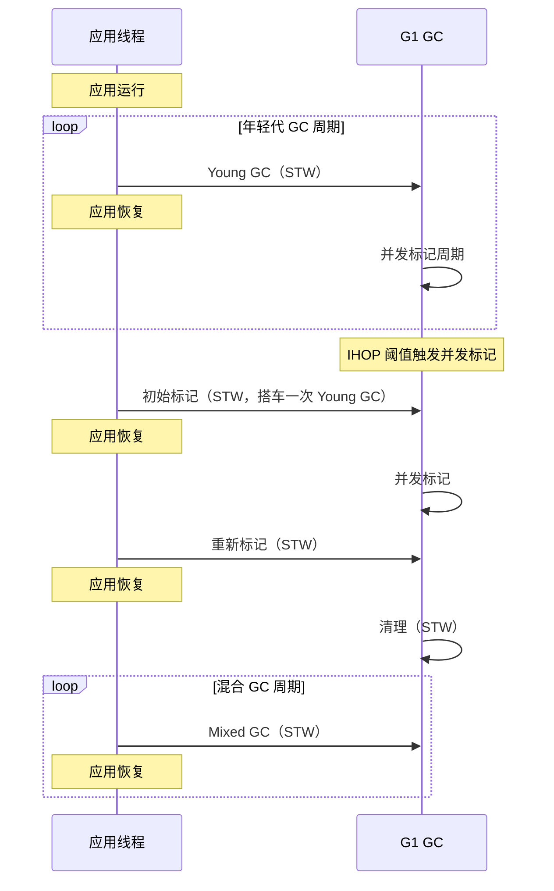

### 3.3 混合收集与 IHOP 自适应

**IHOP（Initiating Heap Occupancy Percent）** 是触发并发标记周期的堆占用率阈值。当老年代占用率达到 IHOP 时，G1 启动并发标记周期，标记完成后进入混合 GC 阶段。

JDK 9 引入了**自适应 IHOP**：G1 基于运行时指标动态调整 IHOP 值，而不是使用固定的 `-XX:InitiatingHeapOccupancyPercent`。自适应 IHOP 考虑两个因素：

1. **历史标记时间**：如果并发标记通常需要很长时间，G1 会提前启动（降低 IHOP），确保标记在老年代填满前完成。
2. **老年代分配速率**：如果老年代增长很快，G1 会降低 IHOP，更早启动标记。

> [!warning] 生产避坑：自适应 IHOP 在突发分配场景下的问题
> 自适应 IHOP 在稳态工作负载下表现良好，但在突发性大对象分配场景下可能出问题。例如，应用突然构建一个大型缓存，导致老年代占用率飙升。如果自适应 IHOP 还没来得及降低，并发标记可能启动太晚，导致 evacuation 失败（混合 GC 来不及回收足够空间）。解决方案：`-XX:-G1UseAdaptiveIHOP -XX:InitiatingHeapOccupancyPercent=<p>`，手动固定 IHOP 值。

混合 GC 中老年代 Region 数量的控制参数：

| 参数 | 作用 | 默认值 |
|------|------|--------|
| `-XX:G1OldCSetRegionThresholdPercent` | 混合收集中最大老年代 Region 占比 | 10% |
| `-XX:G1MixedGCCountTarget` | 混合回收轮数目标 | 8 |
| `-XX:G1MixedGCLiveThresholdPercent` | 老年代 Region 活跃数据截止阈值 | 85% |
| `-XX:G1HeapWastePercent` | 允许的堆浪费百分比 | 5% |

### 3.4 大对象处理

G1 对大对象（Humongous Objects）有专门的处理机制。如果一个对象占用单个 Region 的 50% 或更多，G1 将其视为大对象，分配在连续的 Humongous Region 中。

大对象不走 TLAB 快速路径，而是直接从老年代分配。这带来几个问题：

1. **碎片风险**：大对象需要连续 Region，如果堆碎片化严重，可能找不到足够的连续 Region
2. **回收延迟**：大对象在并发标记阶段被识别为垃圾后，可以在混合 GC 中被回收（JDK 8u40+ 的 eager reclaim 优化）

> [!info] 核心概念：大对象是 G1 的"阿喀琉斯之踵"
> 虽然 G1 改善了很多 CMS 的问题，但大对象分配仍然是其弱点。频繁的大对象分配会导致：连续 Region 不足 → evacuation 失败 → 退化为 Full GC。如果应用有频繁的大对象分配模式（如大数组、大缓冲区），需要特别关注 Humongous Region 的使用情况。诊断方法：通过 GC 日志中的 `humongous allocation` 关键字和 JFR 的 `jdk.G1HeapSummary` 事件监控。

### 3.5 G1 的 JDK 版本增强

G1 从 JDK 7u4 到 JDK 17 经历了持续增强：

| JDK 版本 | 增强特性 | 工程价值 |
|----------|---------|---------|
| JDK 11 | 并行引用处理、急切回收大对象 | 高负载下引用处理不再成为瓶颈 |
| JDK 12 | 可中止混合收集、及时返回未使用内存 | 避免单次混合 GC 超时；空闲时释放内存给 OS |
| JDK 13 | 改进并发标记终止 | 缩短 GC 暂停 |
| JDK 14 | NUMA 感知 | 多插槽系统性能提升 |
| JDK 15 | 改进并发细化、自适应堆大小 | 减少 GC 日志开销 |
| JDK 17 | 改进堆管理、并发大对象分配 | 更高效的 Region 分配 |

> [!note] 设计哲学：可中止混合收集
> JDK 12 引入的可中止混合收集（Abortable Mixed Collections）解决了一个实际问题：如果某次混合 GC 的老年代 Region 回收时间超出预期，G1 可以中止该次回收，避免违反暂停时间 SLO。这比"硬撑完"更优雅——宁可这次少回收一些，也不要让用户感知到延迟尖峰。剩余的老年代 Region 在下次混合 GC 中继续回收。

---

## 第 4 章 ZGC 的核心创新

### 4.1 染色指针

ZGC 最核心的创新是**染色指针（Colored Pointers）**。在 64 位指针中，ZGC 利用高位空间存储 GC 元数据：

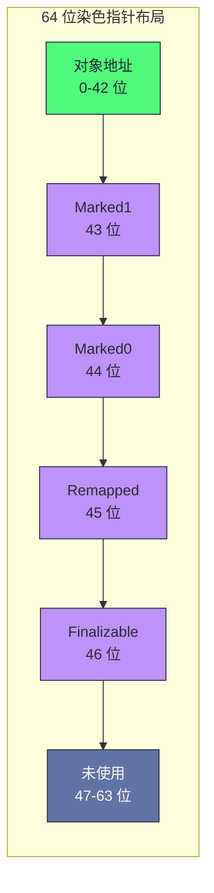

染色位含义：

- **Marked0 / Marked1**：交替使用的标记位，表示对象是否已被标记为存活。两个位交替使用是为了避免在并发标记周期切换时清除所有标记。
- **Remapped**：表示对象是否已不在重定位集中（即不需要被移动）。
- **Finalizable**：表示对象仅能通过 Finalizer 访问。

> [!info] 核心概念：为什么染色指针是革命性的
> 传统 GC 的元数据存储在对象头中或额外的数据结构中。染色指针把元数据直接嵌入指针本身，这意味着：每次应用读取一个引用，GC 都可以"免费"获得该对象的 GC 状态。这是 ZGC 实现并发重定位的关键——加载屏障可以根据染色位判断对象是否需要重定位，如果需要则触发自愈机制。代价是：染色指针需要 64 位地址空间的高位可用，且需要操作系统支持多重映射（multi-mapping）。

### 4.2 加载屏障与自愈

ZGC 的**加载屏障（Load Barrier）** 是在应用线程读取对象引用时插入的一段代码。它的作用是：

1. **检查染色位**：判断引用指向的对象是否需要 GC 处理
2. **自愈（Self-healing）**：如果对象已被重定位，更新引用指向新地址
3. **协助标记**：如果对象未被标记，协助 GC 标记

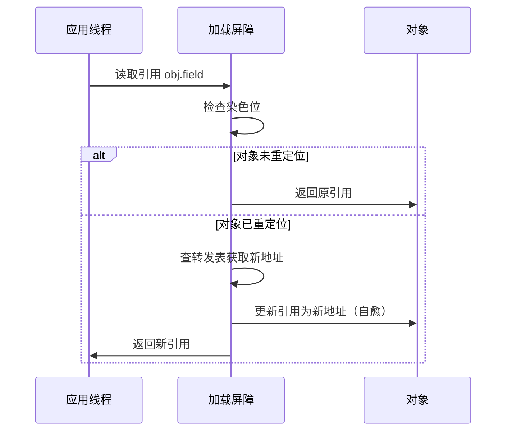

自愈机制的关键价值是**应用线程自己修复过时引用**，而不需要 GC 线程暂停应用来批量修复。这使得重定位可以完全并发进行。

> [!note] 设计哲学：加载屏障的代价
> 加载屏障在每次引用读取时执行，这意味着应用的所有对象访问都有一份额外开销。这是 ZGC 吞吐量低于 G1 的根本原因——不是 GC 线程消耗了更多 CPU，而是应用线程被屏障拖慢了。ZGC 的工程优化方向之一就是减少屏障的执行频率和开销，例如通过编译器优化消除不必要的屏障。

### 4.3 堆外转发表

ZGC 将对象重定位后的新地址存储在**堆外转发表（Off-heap Forwarding Table）** 中。将转发表放在堆外有两个好处：

1. **不占用堆空间**：转发表的大小与堆中对象数量成正比，如果放在堆内会显著减少可用堆空间。
2. **不受堆大小限制**：对于 16TB 的堆，转发表可能很大，放在堆外避免了堆内空间碎片。

当加载屏障发现一个引用指向的对象已被重定位时，它查询转发表获取新地址，然后更新引用（自愈）。

### 4.4 并发重定位与 ZGC 阶段

ZGC 的工作周期分为六个阶段，其中只有三个是短暂的 STW 暂停：

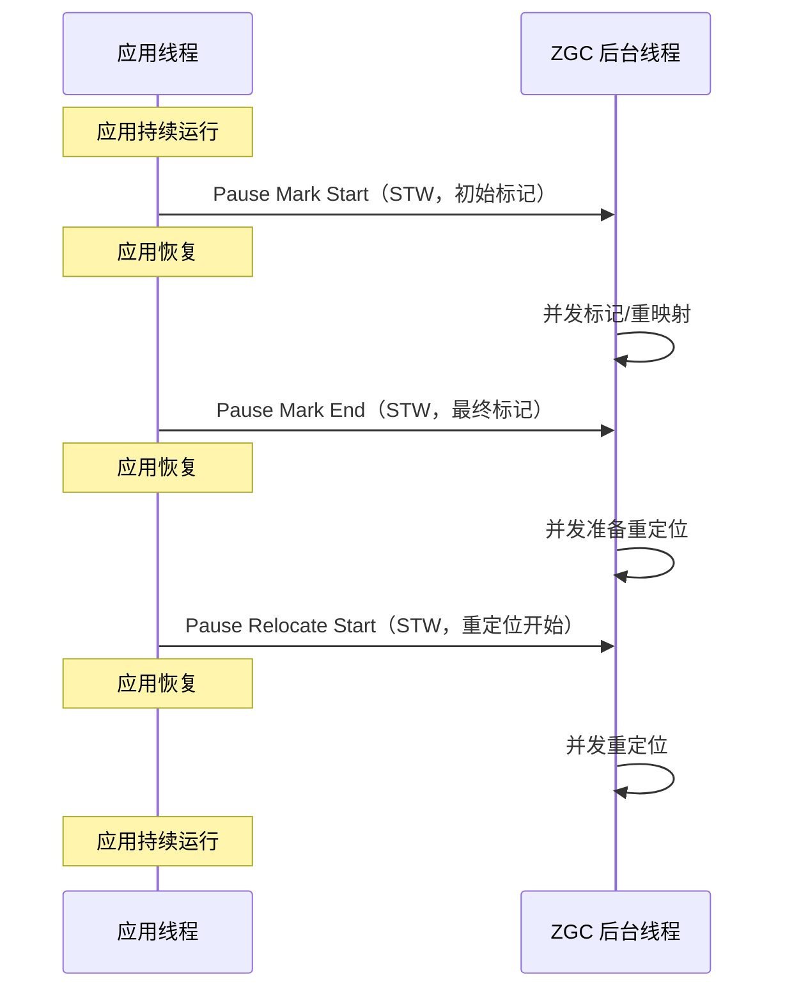

三个 STW 暂停都极短（通常 < 1ms），因为它们只做最少的工作：

1. **Pause Mark Start**：标记 GC Root 直接引用的对象。JDK 16 后线程栈扫描移到并发阶段，进一步缩短此暂停。
2. **Pause Mark End**：完成标记。JDK 16 后标记工作量上限为 200 微秒，超时则退回并发继续。
3. **Pause Relocate Start**：设置重定位数据结构，捕获重定位集中的根。

大部分工作在并发阶段完成：并发标记、并发重映射、并发准备重定位、并发重定位。这就是 ZGC 停顿时间与堆大小无关的原因——无论堆多大，STW 阶段的工作量都是固定的（只处理 Root）。

### 4.5 ZPages：动态大小的 Region

ZGC 使用 ZPages 作为内存管理单元，而非 G1 的固定大小 Region。ZPages 有三种尺寸：

- **小页面（Small ZPage）**：2MB，用于小对象分配
- **中页面（Medium ZPage）**：32MB，用于中等对象
- **大页面（Large ZPage）**：动态大小，为大对象保留整个页面

ZPages 是动态的——一个 ZPage 可以跨越多个底层 Region，在 GC 周期中页面可以被回收和重用。这种设计使 ZGC 能更灵活地适应不同的分配模式。

### 4.6 ZGC 自适应触发器

ZGC 有多种触发 GC 周期的机制，适应不同的工作负载场景：

| 触发器 | 机制 | 适用场景 |
|--------|------|---------|
| **定时器** | 固定间隔触发（`ZCollectionInterval`） | 需要可预测 GC 的场景 |
| **预热** | 堆占用率达到 `soft_max_capacity` 的 10%/20%/30% 时触发 | 应用启动阶段 |
| **高分配速率** | 预估 OOM 时间 < GC 周期时间时触发 | 高吞吐应用 |
| **分配停滞** | 分配请求无法满足时触发 | 内存压力场景 |
| **高使用率** | 空闲内存 < 5% 时触发 | 低分配速率但内存持续增长 |
| **主动** | 启发式预测，在有益时主动触发（`ZProactive`） | 维持更小堆和更流畅性能 |

> [!warning] 生产避坑：分配停滞是 ZGC 的"红色警报"
> 当 ZGC 日志出现 `Allocation Stall` 时，意味着应用线程因为内存不足被阻塞等待 GC 完成。虽然 ZGC 的 GC 本身很快，但分配停滞意味着应用线程被暂停了——这违背了 ZGC 的低延迟承诺。频繁的分配停滞通常意味着堆太小或分配速率过高。解决方案：增大堆（`-Xmx`）或调整 `SoftMaxHeapSize`。

---

## 第 5 章 停顿 vs 吞吐的权衡

### 5.1 三维权衡模型

GC 设计的核心是一个三维权衡空间：

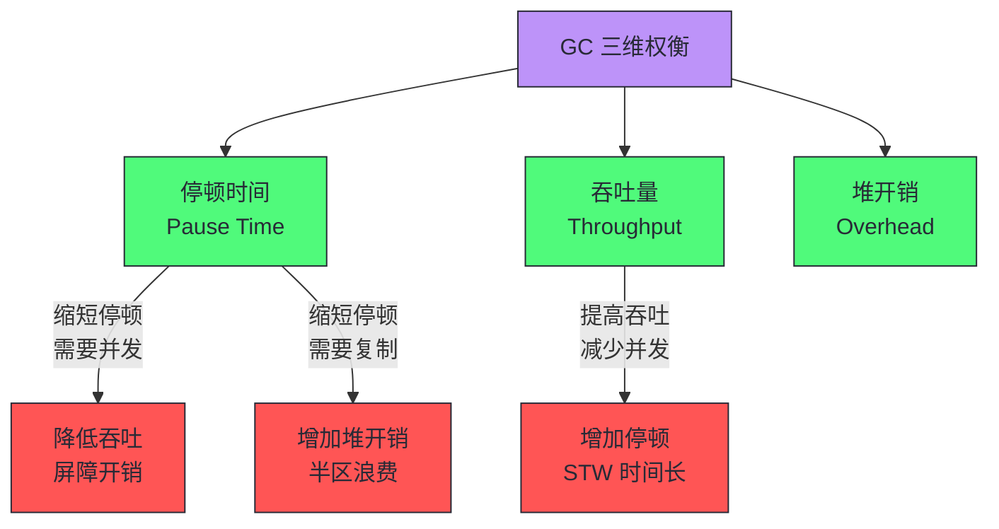

- **停顿时间（Pause Time）**：GC 暂停应用线程的时长。影响延迟敏感型应用的响应时间。
- **吞吐量（Throughput）**：应用执行时间占总时间的比例。影响批处理型应用的总完成时间。
- **堆开销（Heap Overhead）**：GC 需要的额外内存。包括半区复制的浪费、记忆集、转发表等。

不同 GC 在这个三维空间中的位置：

| GC | 停顿时间 | 吞吐量 | 堆开销 |
|----|---------|--------|--------|
| Serial | 高（与堆成正比） | 低（单线程） | 低 |
| Parallel | 高（与堆成正比） | 高（多线程并行） | 低 |
| CMS | 中（并发标记） | 中（并发开销） | 中（碎片+浮动垃圾） |
| G1 | 中低（可预测） | 中高 | 中（Region元数据+RSet） |
| ZGC | 极低（亚毫秒） | 中（屏障开销） | 高（转发表+染色指针） |
| Shenandoah | 极低（亚毫秒） | 中（屏障开销） | 高（Brooks指针） |

### 5.2 并发的代价：屏障开销与浮动垃圾

"并发"不是免费的。把 GC 工作从 STW 移到并发阶段，意味着应用线程在运行时需要与 GC 协调，这通过**屏障（Barrier）** 实现：

- **读屏障**：在读取对象引用时执行。ZGC 使用。
- **写屏障**：在写入对象引用时执行。G1/CMS 使用（维护记忆集）。
- **读写屏障**：两者都执行。Shenandoah 使用。

屏障的执行开销是并发 GC 吞吐量低于并行 GC 的根本原因。G1 的写屏障开销约 5-10%，ZGC 的读屏障开销约 5-15%。

**浮动垃圾（Floating Garbage）** 是并发的另一个代价：在并发标记期间，应用可能修改引用关系，使得一些已被标记为存活的对象实际上变成了垃圾。这些对象在本次 GC 中不会被回收，成为"浮动垃圾"，占用堆空间直到下次 GC。

> [!info] 核心概念：并发标记的 SATB 技术
> G1 使用 SATB（Snapshot-At-The-Beginning）技术处理并发标记期间的引用变更。SATB 的思路是：在并发标记开始时"拍快照"，并发标记期间如果应用写入了一个引用（可能覆盖了快照中的旧引用），写屏障会记录被覆盖的旧引用。这样并发标记基于"开始时的快照"进行，不会遗漏快照时刻存活的对象。代价是：快照后死亡的对象（浮动垃圾）不会被本次回收。

### 5.3 优雅降级

当 GC 跟不上应用的分配速率时，不同 GC 的降级行为不同：

- **G1**：evacuation 失败 → 退化为 Full GC（Serial Old 单线程），停顿可能数十秒
- **ZGC**：分配停滞（Allocation Stall）→ 应用线程阻塞等待 GC，停顿可能数百毫秒
- **Shenandoah**：类似 ZGC，分配停滞

> [!warning] 生产避坑：G1 的 Full GC 是灾难性的
> G1 的设计目标是避免 Full GC，但如果 evacuation 失败（混合 GC 来不及回收足够空间），会退化为单线程的 Serial Old Full GC。在 32GB 堆上，这次 Full GC 可能停顿 30 秒以上。监控 G1 的关键指标之一就是 Full GC 频率——任何 Full GC 都应该触发告警。根本解决方案是确保混合 GC 的回收速度跟上老年代增长速度，可能需要增大堆或调整 IHOP。

---

## 第 6 章 GC 日志诊断

### 6.1 统一日志标签体系

JDK 9 引入了统一日志（Unified Logging, XLog）系统，取代了旧版的 `-XX:+PrintGCDetails` 等离散参数。统一日志使用标签体系：

```bash
# 启用所有 GC 相关日志，输出到文件
-Xlog:gc*:file=gc.log:time,tags:filecount=10,filesize=100M

# 启用 GC + TLAB 日志
-Xlog:gc*,gc+tlab=debug:file=gc.log:time,tags

# 只输出 GC 暂停时间
-Xlog:gc+pause:file=gc.log:time
```

常用标签：

| 标签 | 内容 |
|------|------|
| `gc` | GC 周期信息 |
| `gc+pause` | GC 暂停时间 |
| `gc+task` | GC 线程任务 |
| `gc+tlab` | TLAB 分配信息 |
| `gc+ergo` | 自适应大小决策 |
| `gc+age` | 对象年龄统计 |
| `gc+humongous` | 大对象分配 |

### 6.2 暂停时间直方图分析

GC 日志诊断的核心工具是**暂停时间直方图**。通过分析 GC 暂停时间的分布，可以判断是否满足 SLO：

```bash
# 使用 GCViewer 或 GCEasy 解析 gc.log
# 关键指标：
# - 平均暂停时间
# - 最大暂停时间
# - P99 暂停时间
# - GC 时间占比
# - 各类 GC 的频率和时长
```

典型 GC 日志片段（G1）：

```
[info][gc,start] GC(12) Pause Young (Normal) (G1 Evacuation Pause)
[info][gc,task] GC(12) Using 8 workers of 8
[info][gc,phases] GC(12) Pre Evacuate Collection Set: 0.1ms
[info][gc,phases] GC(12) Evacuate Collection Set: 45.2ms
[info][gc,phases] GC(12) Post Evacuate Collection Set: 3.1ms
[info][gc,phases] GC(12) Other: 1.2ms
[info][gc] GC(12) Pause Young (Normal) (G1 Evacuation Pause) 256M->128M(512M) 49.6ms
```

分析要点：
- **Pause Young**：年轻代 GC，通常停顿短
- **Pause Mixed**：混合 GC，停顿可能更长
- **256M->128M(512M)**：GC 前堆使用 256M，GC 后 128M，总堆 512M
- **49.6ms**：本次 GC 停顿时间

### 6.3 JFR 与 GC 事件

Java Flight Recorder（JFR）是生产环境 GC 监控的首选工具，开销极低（< 1%）：

```bash
# 启动时启用 JFR
-XX:StartFlightRecording=duration=300s,filename=recording.jfr

# 记录 TLAB 相关事件
-XX:StartFlightRecording=duration=300s,jdk.ObjectAllocationInNewTLAB#enabled=true,jdk.ObjectAllocationOutsideTLAB#enabled=true,filename=recording.jfr
```

JFR 中与 GC 相关的关键事件：

| 事件 | 内容 |
|------|------|
| `jdk.GCPhasePause` | GC 暂停阶段 |
| `jdk.G1HeapSummary` | G1 堆摘要 |
| `jdk.GarbageCollection` | GC 周期概要 |
| `jdk.ObjectAllocationInNewTLAB` | TLAB 内分配 |
| `jdk.ObjectAllocationOutsideTLAB` | TLAB 外分配 |

### 6.4 常见 GC 病理模式

| 病理模式 | 症状 | 根因 | 解决方案 |
|---------|------|------|---------|
| 频繁 minor GC | minor GC 间隔 < 1s | 年轻代太小或分配速率过高 | 增大年轻代或优化分配 |
| 提前晋升 | 老年代快速增长 | Survivor 区不足 | 增大 Survivor 或降低晋升阈值 |
| 混合 GC 超时 | Mixed GC 停顿超 SLO | 老年代 Region 太多或太大 | 调整 `G1OldCSetRegionThresholdPercent` |
| Full GC | G1 退化为 Full GC | evacuation 失败 | 增大堆或调整 IHOP |
| 分配停滞 | ZGC 出现 Allocation Stall | 堆太小或分配速率过高 | 增大堆或优化分配 |
| GC 颠簸 | GC 频率高但回收少 | LDS 过大或堆不足 | 增大堆或优化对象生命周期 |

> [!note] 设计哲学：GC 调优的"先观察后调参"原则
> GC 调优最常见的错误是"看到 GC 暂停长就调参数"。正确的流程是：先通过 GC 日志和 JFR 理解应用的内存生命周期模式（分配速率、对象大小分布、晋升速率、LDS 大小），然后判断是 GC 策略不匹配还是参数需要微调。很多时候，GC 问题的根因在应用层——例如不必要的大对象分配、缓存泄漏、过度使用 Finalizer。先修应用，再调 GC。

---

## 第 7 章 GC 选型决策框架

### 7.1 工作负载分类

不同工作负载对 GC 的要求不同。根据事务模式和内存使用特征，可以分为三类：

**分析型（OLAP）**：

- 特征：无状态、高吞吐、大堆需求、瞬态对象多
- 例子：Hadoop、Spark
- GC 要求：高效处理大堆、高整体吞吐量
- 推荐：G1

**操作型存储（OLTP）**：

- 特征：有状态、低延迟、中等生命周期数据多
- 例子：Cassandra、HBase
- GC 要求：最小化 GC 暂停时间
- 推荐：ZGC 或 Shenandoah

**混合型（HTAP）**：

- 特征：同时需要分析吞吐和事务低延迟
- 例子：Apache Ignite、Flink
- GC 要求：高吞吐 + 低延迟
- 推荐：ZGC（分代模式）

### 7.2 选型决策树

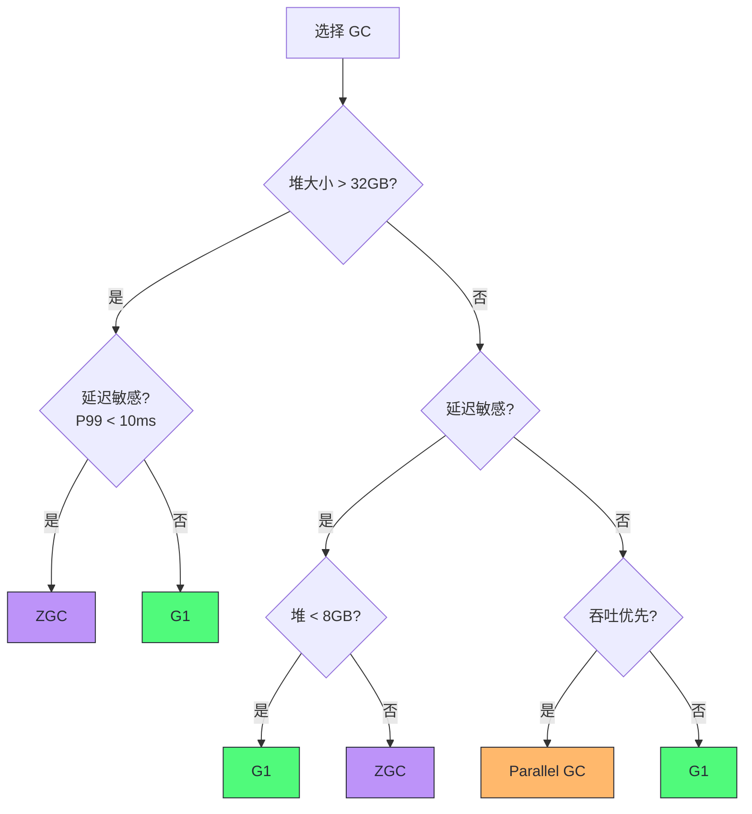

### 7.3 调优参数速查

**G1 关键参数**：

| 参数 | 作用 | 推荐值 |
|------|------|--------|
| `-XX:MaxGCPauseMillis` | 目标停顿时间 | 100-200ms |
| `-XX:G1HeapRegionSize` | Region 大小 | 1-32MB（自动选择） |
| `-XX:InitiatingHeapOccupancyPercent` | IHOP 阈值 | 45-55%（自适应时无需设） |
| `-XX:ConcGCThreads` | 并发标记线程数 | ParallelGCThreads 的 1/4 |
| `-XX:G1ReservePercent` | 保留堆百分比 | 10-20% |

**ZGC 关键参数**：

| 参数 | 作用 | 推荐值 |
|------|------|--------|
| `-XX:SoftMaxHeapSize` | 软最大堆大小 | Xmx 的 80-90% |
| `-XX:ZCollectionInterval` | 定时器间隔 | 0（禁用，用自适应） |
| `-XX:+ZProactive` | 主动 GC | true（默认） |
| `-XX:ConcGCThreads` | 并发线程数 | 自动选择 |

### 7.4 生产环境 GC 调优流程

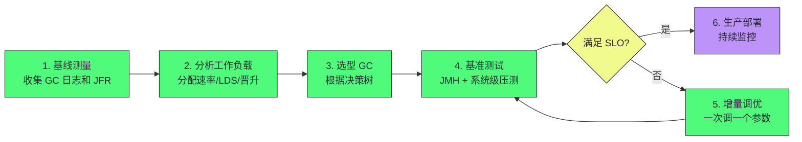

调优流程的核心原则：

1. **先测量后调优**：不要基于猜测调参，先用 GC 日志和 JFR 建立基线
2. **一次调一个参数**：同时调多个参数无法判断哪个起了作用
3. **在预发布环境测试**：生产环境的 GC 行为可能与测试环境不同
4. **持续监控**：工作负载会变化，GC 调优不是一次性的

> [!info] 核心概念：GC 调优的"不调"原则
> 在 JDK 17+ 的现代 JVM 上，G1 和 ZGC 的自适应能力已经很强。大多数应用不需要手动调优 GC 参数，使用默认值即可获得良好性能。手动调优只在这些场景下需要：应用有极端的延迟要求（P99 < 1ms）、堆超大（> 64GB）、或工作负载有特殊的分配模式（如突发大对象分配）。过度调优反而可能破坏自适应机制，导致更差的结果。

---

## 第 8 章 GC 的未来趋势

### 8.1 分代 ZGC

ZGC 在 JDK 21 引入了分代模式（JEP 439: Generational ZGC）。原始 ZGC 是非分代的——所有对象在同一个堆空间中，不区分年轻代和老年代。这意味着每次 GC 都需要标记整个堆中的存活对象，对于弱分代假说成立的工作负载（大多数对象短命），这浪费了大量标记工作。

分代 ZGC 的改进：

- **分代堆结构**：恢复年轻代/老年代划分，年轻代 GC 只标记年轻代对象
- **屏障分离**：年轻代的读屏障更轻量，老年代的读屏障在需要时才触发
- **并发屏障处理**：屏障开销进一步优化

分代 ZGC 在保持亚毫秒级停顿的同时，显著降低了 CPU 开销（屏障开销降低约 25%），提升了吞吐量。

### 8.2 可调优工作单元

现代 GC 的一个新兴趋势是"可调优工作单元"（Tunable Work Units）——将 GC 过程分解为更小的、可调优的单元，使其能更好地与应用需求和硬件能力对齐：

- **部分压缩（Partial Compaction）**：不压缩整个堆，只压缩碎片最严重的区域
- **增量标记（Incremental Marking）**：将标记工作分解为小片段，在多个 GC 周期中完成
- **Region 级别调优**：根据 Region 的活跃数据密度、引用密度等特征，选择不同的回收策略

### 8.3 机器学习辅助 GC 调优

GC 调优是一个高度经验性的过程，涉及大量参数和复杂的交互。机器学习可以在以下方面辅助：

- **模式识别**：识别应用的内存使用模式，自动选择 GC 策略和参数
- **异常检测**：检测 GC 行为的异常模式（如 evacuation 失败前的征兆）
- **参数搜索**：在参数空间中自动搜索最优配置

目前 JDK 社区还没有内置的 ML 调优能力，但一些第三方工具（如 Azul 的 Zing、Cassandra 的调优工具）已经开始探索这个方向。

### 8.4 硬件感知的 GC

未来的 GC 需要更好地感知底层硬件：

- **CPU 缓存利用**：GC 的对象遍历模式对 CPU 缓存不友好（随机访问对象图）。未来的 GC 可能通过对象共置（co-locality）优化缓存命中率。
- **NUMA 优化**：随着多插槽系统的普及，NUMA 感知分配和回收变得越来越重要。
- **异构内存**：NVDIMM、CXL 内存等异构内存技术为 GC 提供了新的可能性——例如将老年代放在更慢但更大的 NVDIMM 上。

> [!note] 设计哲学：GC 演进的终极目标
> GC 演进的终极目标是"透明"——开发者完全不需要关心 GC，JVM 自动选择最优的内存管理策略。这个目标需要三个能力：自适应（根据工作负载自动调整）、并发化（不干扰应用执行）、硬件感知（利用底层硬件特性）。现代 GC 已经在前两个方向取得了巨大进步，硬件感知是下一个前沿。但在达到"透明"之前，理解 GC 的工作原理仍然是 Java 性能工程师的核心能力。

---

## 总结

GC 工程化的核心知识可以归纳为以下几条主线：

1. **理论基石**：弱分代假说是所有分代 GC 的基础。理解"大多数对象朝生夕灭"这一经验观察，就能理解为什么分代回收比全堆回收高效。

2. **演进脉络**：GC 从 Serial → Parallel → CMS → G1 → ZGC 的演进，核心驱动力是对停顿时间的要求越来越严苛。每次演进都把更多 GC 工作从 STW 移到并发阶段，代价是更复杂的屏障机制。

3. **G1 的核心创新**：区域化堆 + 暂停时间预测模型。Region 作为工作单元使 G1 能按需回收，实现可预测的停顿。混合收集增量回收老年代，避免 Full GC。

4. **ZGC 的核心创新**：染色指针 + 加载屏障 + 并发重定位。染色指针把 GC 元数据嵌入指针本身，加载屏障在应用读取引用时自愈过时引用，使重定位完全并发。

5. **权衡的本质**：停顿、吞吐、堆开销三者不可兼得。选择 GC 就是选择在这个三维空间中的位置。没有"最优"的 GC，只有"最匹配工作负载"的 GC。

6. **调优方法论**：先观察（GC 日志 + JFR）后调参，一次调一个参数，在预发布环境测试。现代 JVM 的自适应能力已经很强，大多数应用不需要手动调优。

> [!info] 专栏导航
> 本文是 [[00 专栏导览|系统性能工程实战专栏]] 的第 10 篇。上一篇 [[09 JIT 编译与稳态性能：HotSpot 的预热代价]] 讲透了 Java"慢启动快稳态"的 JIT 机制；下一篇 [[11 锁竞争与并发性能：从 synchronized 到 JOL]] 将深入 Java 并发性能的另一个核心维度——锁竞争与锁升级。GC 和锁是 Java 性能工程的两大"深水区"，理解了这两者，就掌握了 JVM 运行时性能的核心知识。

---

*本文基于 Monica Beckwith《JVM Performance Engineering》第 6 章"OpenJDK 高级内存管理与垃圾回收"和 Brendan Gregg《Systems Performance》2nd Edition 的相关内容整合而成，加入了作者的工程实践理解和结构化重组。*
