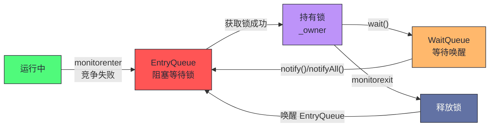
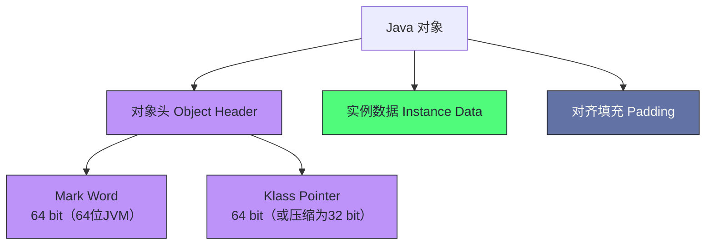
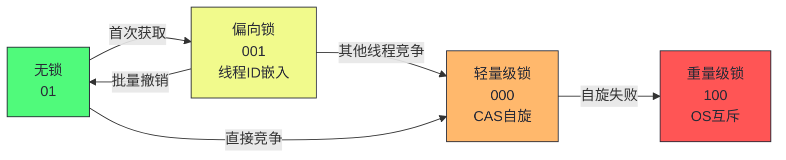
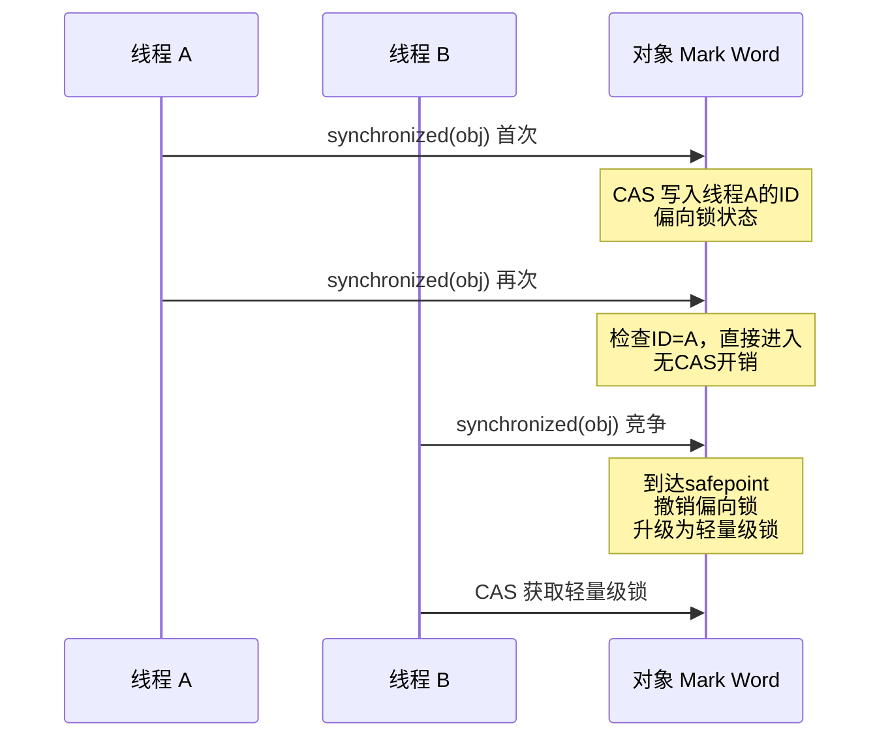
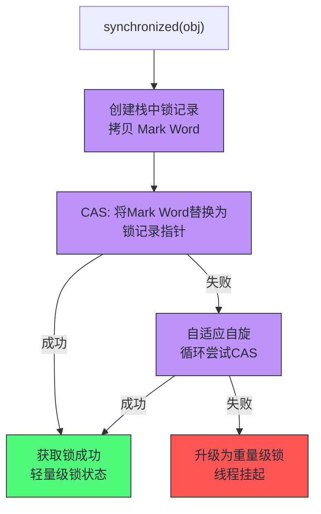
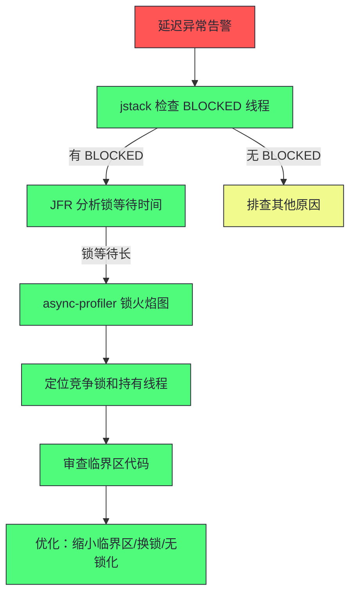
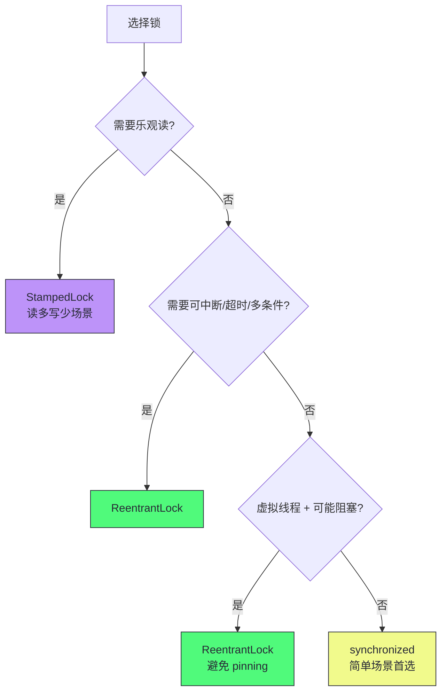
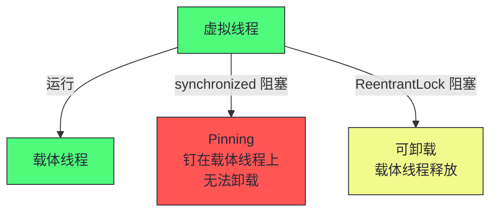
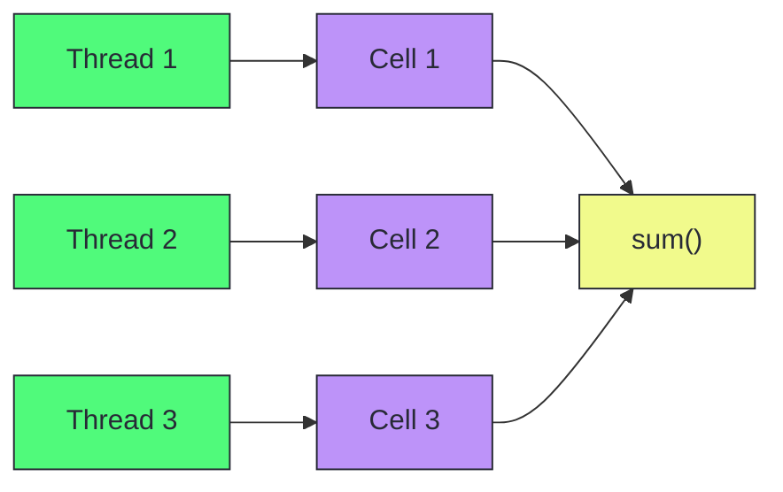

# 11 锁竞争与并发性能：从 synchronized 到 JOL

> [!abstract] 摘要
> 本文是专栏第四部分"JVM 运行时性能"的第三篇，聚焦 Java 并发性能中最核心也最容易被误解的维度——锁竞争。文章从 `synchronized` 关键字的字节码实现出发，讲透 Java 对象头（Object Header）的内存布局与 Mark Word 的多重身份，然后沿着"无锁 → 偏向锁 → 轻量级锁 → 重量级锁"的锁升级链路，剖析每一级锁的设计动机、工作机制和升级触发条件。重点剖析锁竞争的诊断方法（JFR、async-profiler、jstack）、JVM 的隐式锁优化（锁消除、锁粗化、自适应自旋），以及 JOL（Java Object Layout）工具如何揭示对象的真实内存布局。最后讨论 `synchronized` vs `ReentrantLock` vs `StampedLock` 的选型决策，以及虚拟线程对锁竞争模型的新挑战。核心认知：Java 的锁不是"一个实现"，而是一套自适应的多级优化体系；理解锁升级的前提是理解对象头，理解锁竞争的前提是理解线程状态转换的代价。

---

## 第 1 章 synchronized 的字节码本质

### 1.1 从 monitorenter 到 monitorexit

Java 中最基础的同步机制是 `synchronized` 关键字。它可以修饰方法或代码块：

```java
// 修饰方法
public synchronized void method() { ... }

// 修饰代码块
public void method() {
    synchronized (obj) { ... }
}
```

这两种形式在字节码层面的实现不同。修饰代码块时，编译器生成 `monitorenter` 和 `monitorexit` 指令：

```
// synchronized(obj) { ... } 的字节码
monitorenter        // 获取 obj 的监视器锁
// ... 同步代码块 ...
monitorexit         // 释放 obj 的监视器锁
// 异常处理路径
monitorexit         // 异常时释放锁
```

`monitorenter` 的语义是：尝试获取对象 obj 的监视器（monitor）。如果对象未被锁定，当前线程获取锁，将锁计数器设为 1。如果当前线程已持有该锁，计数器加 1（可重入）。如果对象已被其他线程锁定，当前线程阻塞，直到锁释放。

`monitorexit` 的语义是：将锁计数器减 1。如果计数器归零，释放锁。注意字节码中有两个 `monitorexit`——正常退出和异常退出，确保异常时锁也能释放。

修饰方法时，编译器不在方法体中生成 `monitorenter`/`monitorexit`，而是在方法 flags 中设置 `ACC_SYNCHRONIZED` 标志位。JVM 在调用该方法时自动获取/释放当前对象（实例方法）或 Class 对象（静态方法）的监视器锁。

两种形式的性能差异值得注意：代码块形式把锁范围控制到最小（推荐），方法形式锁住整个方法体——**锁粒度由代码结构决定**。一个 `synchronized` 方法里如果有 I/O 或重计算，锁持有时间就被这些操作拉长（第 10 章案例的反模式）。字节码层面的差异还影响内联：`ACC_SYNCHRONIZED` 方法在 JIT 内联时需要额外的锁消除分析（第 09 篇的逃逸分析），代码块形式的锁消除更直接。

> [!info] 核心概念：每个对象都是一个监视器
> Java 的设计哲学是"每个对象都可以作为锁"。这不是语言层面的语法糖，而是 JVM 规范层面的设计——每个对象在内存中都有一个关联的监视器（ObjectMonitor）。`synchronized` 操作的就是这个监视器。理解这一点是理解锁升级的前提：锁的状态存储在对象头中，锁的升级就是对象头中锁状态位的变迁。

### 1.2 ObjectMonitor 的数据结构

当锁升级为重量级锁时，JVM 会为对象创建一个 ObjectMonitor（也称为 inflated monitor）。ObjectMonitor 的核心数据结构（HotSpot 源码简化）：

```cpp
class ObjectMonitor {
    void*       _owner;         // 持有锁的线程
    ObjectWaiter* _entry_list;  // 等待获取锁的线程队列（EntryQueue）
    ObjectWaiter* _wait_set;    // 调用 wait() 后等待的线程队列（WaitQueue）
    int         _count;         // 锁计数器（重入计数）
    int         _waiters;       // wait_set 中的线程数
    // ...
};
```

线程在 ObjectMonitor 中的状态转换：



重量级锁的核心代价是**线程挂起与唤醒**——这涉及操作系统级别的系统调用（`futex` 或 `pthread_mutex`），需要从用户态切换到内核态，开销通常在微秒级。如果锁持有时间极短（如几条指令），挂起/唤醒的代价比临界区执行时间还长，这就是轻量级锁和偏向锁存在的理由。

ObjectMonitor 的结构还解释了 jstack 输出的语义：BLOCKED 线程的状态是"在 EntryQueue 排队"，`waiting to lock <地址>` 显示的就是 ObjectMonitor 的地址；`waiting on <地址>` 则是 WaitQueue（调用了 wait()）。**jstack 里的锁地址就是 ObjectMonitor 的指针**——把多次 jstack 的锁地址聚合，就能统计"哪个 monitor 的队列最长"，这是锁竞争热点的快速排序法。

---

## 第 2 章 对象头与 Mark Word

### 2.1 Java 对象的内存布局

在 HotSpot JVM 中，每个 Java 对象在内存中由三部分组成。理解这三部分不仅是理解锁的前提，也是第 06 篇对象布局分析的基础——**锁状态、GC 年龄、哈希码全部挤在 8 字节的 Mark Word 里**，这个"复用设计"是 Java 对象轻量化的关键，也是锁升级机制的舞台。



- **Mark Word**：64 位（64 位 JVM），存储对象的运行时数据——哈希码、GC 年龄、锁状态、线程 ID 等。这是锁升级的核心载体。
- **Klass Pointer**：指向对象所属的 Class 元数据。启用指针压缩（`-XX:+UseCompressedOops`）时为 32 位，否则 64 位。
- **实例数据**：对象字段的实际值，按类型对齐排列。
- **对齐填充**：确保对象总大小是 8 字节的整数倍。

> [!note] 设计哲学：为什么把锁状态放在对象头里
> 把锁状态放在 Mark Word 中，而不是为每个对象单独分配一个 ObjectMonitor，是基于"大多数对象永远不会被用作锁"这一事实。如果为每个对象预分配 ObjectMonitor，内存浪费巨大（一个 ObjectMonitor 约 200 字节）。Mark Word 方案让锁状态"按需升级"——无锁时只占 Mark Word 的几位，只有真正发生竞争时才膨胀为 ObjectMonitor。这是"乐观策略"在 JVM 内部的体现。

### 2.2 Mark Word 的多重身份

Mark Word 是 64 位的复用字段，其内容根据锁状态不同而变化。HotSpot 的 Mark Word 布局（64 位 JVM）：

| 锁状态 | 25 bit | 31 bit | 1 bit | 4 bit | 1 bit | 2 bit |
|--------|--------|--------|-------|-------|-------|-------|
| **无锁** | unused | hashCode | unused | 分代年龄 | 0 | 01 |
| **偏向锁** | 线程 ID | epoch | unused | 分代年龄 | 1 | 01 |
| **轻量级锁** | 指向栈中锁记录的指针 | | | | 0 | 00 |
| **重量级锁** | 指向 ObjectMonitor 的指针 | | | | 0 | 10 |
| **GC 标记** | 空 | | | | 1 | 11 |

关键观察：

1. **最后 2 位是锁标志位**：01=无锁/偏向锁，00=轻量级锁，10=重量级锁，11=GC 标记。
2. **倒数第 3 位区分无锁和偏向锁**：1=偏向锁，0=无锁。
3. **同一块 64 位空间被复用**：无锁时存 hashCode，偏向锁时存线程 ID，轻量级/重量级锁时存指针。这意味着一旦升级为更重的锁，原 Mark Word 中的数据（如 hashCode）需要被保存到其他地方。

这张表是本章的"地图"——锁升级的所有机制都发生在这些位的变迁上。值得注意的设计细节：**无锁状态与偏向锁状态共享"01"后缀，靠倒数第三位区分**——这个设计让"可偏向"状态（101）与"已偏向"（带线程 ID）共享布局，偏向锁的加锁只需一次 CAS 写入线程 ID。而 hashCode 的存储冲突（下方避坑）正是这个复用设计的代价：**Mark Word 只有 8 字节，锁状态占了空间，hashCode 就没地方放**——理解了"空间复用"，这些看似奇怪的行为（调 hashCode 撤销偏向锁）就都顺理成章了。

> [!warning] 生产避坑：调用 hashCode() 会撤销偏向锁
> 偏向锁的 Mark Word 存储了线程 ID，没有空间存 hashCode。如果对一个偏向锁对象调用 `hashCode()`，JVM 必须撤销偏向锁，将锁状态退化为无锁（或轻量级锁），才能在 Mark Word 中存储 hashCode。这意味着在偏向锁生效的场景中调用 `hashCode()` 会引入锁撤销开销。如果对象的 hashCode 频繁被使用，偏向锁的收益会被撤销开销抵消。

### 2.3 用 JOL 验证对象布局

JOL（Java Object Layout）是 OpenJDK 的工具库，可以打印对象的真实内存布局。它的名字直白——"Java 对象布局"——但它回答的问题远不止"对象多大"：**代码里写的字段声明与内存里的实际排列是两回事**，JVM 的字段重排、对齐填充、压缩指针都会改写布局，而布局又直接决定缓存行为（第 05 篇）与锁机制（本章）。JOL 是看见"实际排列"的唯一窗口。

```java
// Maven 依赖
// org.openjdk.jol:jol-core:0.17

import org.openjdk.jol.vm.VM;
import org.openjdk.jol.info.ClassLayout;

public class JOLDemo {
    public static void main(String[] args) {
        Object obj = new Object();
        System.out.println(VM.current().details());
        System.out.println(ClassLayout.parseInstance(obj).toPrintable());
    }
}
```

输出示例（64 位 JVM，启用压缩指针）：

```
# Running 64-bit HotSpot VM.
# Using compressed oop with 3-bit shift.
# Using compressed klass with 3-bit shift.
# Objects are 8 bytes aligned.

java.lang.Object object internals:
OFF  SZ   TYPE DESCRIPTION               VALUE
  0   8        (object header: mark)     0x0000000000000005 (biasable)
  8   4        (object header: class)    0x00000480
 12   4        (object alignment padding)
Instance size: 16 bytes
Space losses: 0 bytes internal + 4 bytes external = 4 bytes lost
```

一个 `new Object()` 占 16 字节：8 字节 Mark Word + 4 字节压缩 Klass Pointer + 4 字节对齐填充。Mark Word 值 `0x0000000000000005` 的最后 3 位是 `101`——可偏向但未偏向（无锁+偏向标志位）。

JOL 的工程价值不止于"验证理论"，它在三个实战场景中是必备工具：

**场景一：估算内存足迹。** "这个缓存对象到底占多少内存？"——靠拍脑袋（"一个对象 8 字节吧"）会差出数量级。JOL 精确打印每个字段的位置与大小，缓存容量规划（第 06 篇的 LDS 估算）直接用 JOL 的 Instance size 乘以条目数。

**场景二：诊断伪共享。** 第 05 篇讲过伪共享（两个热字段落在同一缓存行）。JOL 的 `toPrintable` 显示字段的偏移量——两个高频写的字段相距 < 64 字节就是伪共享嫌疑，修复手段是字段填充（padding）或 `@Contended` 注解。

**场景三：验证布局优化。** 字段重排（JVM 会自动重排字段减少空洞）、继承层次的字段布局、压缩指针的开关效果——这些"看不见"的行为都能用 JOL 验证。一个实用技巧：在 CI 里加一个 JOL 布局快照测试，布局意外变化（升级 JDK、改字段顺序）时自动报警——对象布局是性能的"隐形契约"，值得像 API 一样守护。

通过 JOL 还可以验证锁升级过程中 Mark Word 的变化：

```java
synchronized (obj) {
    System.out.println(ClassLayout.parseInstance(obj).toPrintable());
}
// 此时 Mark Word 变为轻量级锁状态（00）
```

---

## 第 3 章 锁升级链路

### 3.1 锁升级的总览

Java 的锁不是单一的实现，而是一套自适应的多级优化体系。锁状态从轻到重依次为：



锁升级是**单向的**——一旦升级到更重的锁，就不会自动降级（JDK 15 前的偏向锁撤销是例外）。这个设计基于一个假设：如果锁曾经发生过竞争，未来很可能还会竞争，保持重量级锁状态可以避免重复升级的开销。

锁升级链路的每一级都对应一种"竞争画像"，这个对应关系是理解锁性能的钥匙：

| 锁级别 | 竞争画像 | 加锁成本 | 典型场景 |
|--------|---------|---------|---------|
| 偏向锁（JDK < 15） | 只有一个线程用 | 一次 CAS（后续零成本） | 老式单线程程序 |
| 轻量级锁 | 线程交替使用，无并发冲突 | 一次 CAS + 栈锁记录 | 低频方法同步 |
| 重量级锁 | 真正的并发竞争 | CAS + 可能的挂起/唤醒（μs 级） | 高频热点锁 |

读这张表的方法：**锁的"重量"不是由代码决定的，而是由运行时的竞争画像决定的**——同一把锁在低峰期是轻量级（交替），高峰期可能膨胀为重量级（并发）。这就是为什么锁性能要按"负载水平"分别测量（第 12 篇的负载模型），也是为什么"锁很慢"或"锁很快"的绝对结论都不可靠。

### 3.2 偏向锁：单线程场景的极致优化（及其废弃）

偏向锁（Biased Locking）是 JDK 6 引入的优化，针对的场景是"一个锁在绝大多数时间只被同一个线程获取"。

**工作机制**：

1. **首次获取**：线程 A 执行 `synchronized(obj)`，JVM 通过一次 CAS 将线程 A 的 ID 写入 obj 的 Mark Word，锁状态变为偏向锁。
2. **后续获取**：线程 A 再次执行 `synchronized(obj)`，JVM 检查 Mark Word 中的线程 ID 是否是自己，如果是，直接进入临界区，无需任何 CAS 操作。
3. **撤销偏向**：当线程 B 尝试获取锁时，JVM 发现 Mark Word 中的线程 ID 不是 B，需要等待全局安全点（safepoint），撤销偏向锁，升级为轻量级锁。



> [!warning] 生产避坑：偏向锁在 JDK 15+ 已被废弃
> 偏向锁的设计假设是"锁只被一个线程使用"，但在现代 Java 应用中，线程池是标配，锁在线程间切换非常频繁。偏向锁的撤销需要 safepoint，在高并发场景下撤销开销可能超过偏向带来的收益。因此 JDK 15（JEP 374）废弃了偏向锁，JDK 18 默认禁用。如果你的应用运行在 JDK 15+，不需要关心偏向锁；如果运行在 JDK 8-14，偏向锁默认启用，可以通过 `-XX:-UseBiasedLocking` 禁用。

偏向锁的废弃是"优化被时代淘汰"的经典案例，值得从方法论角度复盘。它的三个教训：**其一，优化的收益依赖负载假设**——"单线程使用"的假设在 2005 年成立（客户端程序），在 2020 年失效（线程池 + 高并发）。**其二，撤销成本可能超过收益**——偏向锁的"快"只在没有竞争时成立，一旦竞争，撤销要全局 safepoint（第 09 篇讲过它的全局暂停代价），比普通加锁贵得多。**其三，观测驱动决策**——JEP 374 的论证依赖大量生产数据：现代应用中偏向锁的撤销频率远高于命中频率，净收益为负。这也是第 12 篇基准测试的一个注脚：**微基准里有效的优化，在生产负载下可能净亏损**。

### 3.3 轻量级锁：CAS 自旋

轻量级锁（Thin Lock / Lightweight Lock）针对的场景是"多个线程交替获取锁，但实际竞争不激烈"。

**工作机制**：

1. **获取锁**：线程在当前栈帧中创建一个锁记录（Lock Record），将对象的 Mark Word 拷贝到锁记录中。然后通过 CAS 尝试将对象的 Mark Word 替换为指向锁记录的指针。如果成功，获取锁成功，锁状态变为轻量级锁（00）。
2. **释放锁**：线程通过 CAS 将锁记录中的 Mark Word 拷贝回对象头。如果成功，释放成功。如果失败，说明在持有锁期间有其他线程尝试竞争，锁已升级为重量级锁，释放时需要唤醒被阻塞的线程。
3. **竞争失败**：如果 CAS 获取锁失败，说明有竞争。线程会进行自适应自旋（循环尝试 CAS），如果自旋成功则获取锁；如果自旋失败则升级为重量级锁。

轻量级锁的设计意图值得精确理解：它优化的不是"竞争"，而是"交替"——多个线程**先后**使用锁（时间上错开），每次获取时没有真正的并发冲突。CAS 一次成功意味着"我拿到时没人抢"——这是交替模式的特征。真正的并发冲突（两个线程同时抢）才需要自旋或膨胀。所以轻量级锁的适用判断是：**锁的持有时间短 + 线程到达的时间分布稀疏**——典型如"每秒几十次、每次微秒级"的方法级同步。



> [!info] 核心概念：自适应自旋
> JDK 7 引入了自适应自旋（Adaptive Spinning）。自旋次数不是固定的，而是根据历史成功率动态调整：如果最近的自旋成功率高，JVM 会增加自旋次数；如果成功率低，JVM 会减少甚至跳过自旋。这个机制避免了"自旋浪费 CPU"和"过早挂起"两个极端。自旋的本质是"赌锁很快会释放"——如果锁持有时间短，自旋比挂起/唤醒更高效；如果锁持有时间长，自旋就是纯浪费。

### 3.4 重量级锁：OS 互斥

重量级锁（Inflated Lock / Heavyweight Lock）是锁升级的终点。当轻量级锁的自旋失败时，锁膨胀为重量级锁。

**工作机制**：

1. **膨胀**：JVM 为对象创建 ObjectMonitor，将 Mark Word 替换为指向 ObjectMonitor 的指针（10）。
2. **获取锁**：竞争失败的线程进入 ObjectMonitor 的 EntryQueue，被操作系统挂起（`futex` 或 `pthread_mutex_lock`）。
3. **释放锁**：持有锁的线程释放时，从 EntryQueue 唤醒一个线程。

重量级锁的代价是**系统调用**——线程挂起和唤醒需要从用户态切换到内核态，开销通常在 1-10 微秒级。对于持有时间极短的锁，这个开销可能比临界区执行时间还长。

重量级锁还有一个容易被忽视的代价——**唤醒的"惊群"与排队公平性**。锁释放时从 EntryQueue 唤醒一个线程，但被唤醒的线程还需要被 OS 调度器调度才能真正运行（又一层延迟）；同时新到达的线程可能通过自旋"插队"成功——重量级锁的获取顺序既不严格 FIFO 也不严格自适应，这种不确定性让锁等待时间在高压下呈现高方差。这正是 JFR 锁事件（5.5 节）要监控 P99 而非平均值的原因：**锁竞争的延迟分布天然长尾**。

### 3.5 锁升级的触发条件总结

| 升级路径 | 触发条件 | 代价 |
|---------|---------|------|
| 无锁 → 偏向锁 | 首次 `synchronized`（JDK < 15） | 一次 CAS |
| 偏向锁 → 轻量级锁 | 其他线程竞争 | safepoint 撤销 + CAS |
| 无锁 → 轻量级锁 | 直接竞争（JDK 15+ 无偏向锁） | CAS |
| 轻量级锁 → 重量级锁 | 自旋失败 | 创建 ObjectMonitor + 线程挂起 |

> [!note] 设计哲学：锁升级是"乐观→悲观"的渐进退化
> 锁升级的本质是"乐观策略到悲观策略的渐进退化"：偏向锁是最乐观的（假设只有一个线程），轻量级锁是中等乐观的（假设竞争不激烈，自旋就能解决），重量级锁是悲观的（假设竞争激烈，必须挂起）。这个设计让"无竞争"和"轻度竞争"场景几乎零开销，只有真正的高竞争才付出系统调用的代价。理解这个渐进退化逻辑，就能理解为什么 Java 的 `synchronized` 在大多数场景下性能不输 `ReentrantLock`——JVM 已经在底层做了大量自适应优化。

---

## 第 4 章 JVM 的隐式锁优化

### 4.1 锁消除

锁消除（Lock Elision）基于逃逸分析（Escape Analysis）。如果 JVM 通过逃逸分析确定一个对象不会逃逸出当前方法，那么对该对象的所有同步操作都可以被消除——因为不存在其他线程能访问到这个对象。

```java
// StringBuffer 是线程安全的，每次 append 都 synchronized
public String concat(String a, String b) {
    StringBuffer sb = new StringBuffer();
    sb.append(a);  // synchronized(sb)
    sb.append(b);  // synchronized(sb)
    return sb.toString();
}
// sb 不会逃逸出 concat 方法，JVM 可以消除这些锁
```

锁消除由 `-XX:+EliminateLocks`（默认启用）控制，依赖逃逸分析（`-XX:+DoEscapeAnalysis`，默认启用）。

锁消除的价值场景值得展开：**JDK 的许多"线程安全"API 在单线程使用时是免费的**。StringBuffer、Vector、Hashtable 这些"老古董"类的每个方法都 synchronized——在逃逸分析生效时（对象不逃逸），这些同步全部被消除，性能与 StringBuilder 无异。但这个"免费"有边界：**对象一旦逃逸（存入集合、传给其他方法、赋给静态字段），锁消除立即失效**。所以"StringBuffer 慢"的结论只在逃逸场景成立——局部变量的 StringBuffer 与 StringBuilder 性能相当（JDK 9+ 紧凑字符串后差距更小）。这再次印证第 09 篇的原则：**JIT 的优化能力取决于逃逸分析的精度，代码的"逃逸面"越小，优化空间越大**。

> [!info] 核心概念：逃逸分析是锁消除的前提
> 逃逸分析是 JVM 的一项全局优化，分析对象的作用域是否可能"逃逸"出当前方法或线程。逃逸分析不仅用于锁消除，还用于标量替换（Scalar Replacement，将对象拆解为基本类型字段，直接在栈上分配）和栈上分配。这三者共同减少了不必要的堆分配和同步开销。逃逸分析的精度直接影响锁消除的效果——如果分析过于保守（认为可能逃逸），就不会消除锁；如果分析过于激进，可能错误消除必要的锁。HotSpot 的逃逸分析在 JDK 8 后持续增强，JDK 17 的精度已相当高。

### 4.2 锁粗化

锁粗化（Lock Coarsening）将连续的对同一对象的锁操作合并为一个：

```java
// 原始代码
synchronized (obj) { doA(); }
synchronized (obj) { doB(); }
synchronized (obj) { doC(); }

// 锁粗化后
synchronized (obj) { doA(); doB(); doC(); }
```

锁粗化减少了锁获取/释放的次数。由 `-XX:+DoLockCoarsening`（默认启用）控制。锁粗化的风险是临界区变长，可能增加锁竞争的窗口。JVM 只在"连续的锁操作之间没有其他代码"或"粗化收益明显"时才执行。

粗化与细化的张力值得理解：**粗化优化的是"锁操作开销"，细化优化的是"竞争窗口"**——两者方向相反。JVM 的粗化只在"合并后的临界区仍然很短"时触发（譬如循环内的 StringBuffer append，合并后依然微秒级）；开发者手动做的"大临界区合并"（把整个方法包进 synchronized）则可能把竞争窗口放大百倍。**JVM 的粗化是保守的、基于实际代码布局的；人工的粗化是激进的、基于"少写几个 synchronized"的偷懒**——前者是优化，后者常常是反模式（第 10 章案例的锁内 I/O 就是人工粗化的恶果）。

### 4.4 自适应自旋

如前所述，自适应自旋在轻量级锁竞争失败时避免立即升级为重量级锁。自旋的关键参数：

| 参数 | 作用 | 默认值 |
|------|------|--------|
| `-XX:+UseSpinning` | 启用自旋 | true（JDK 7+） |
| `-XX:PreBlockSpin` | 自旋次数（JDK 6 固定值） | 10 |

JDK 7+ 自适应自旋不再使用固定的 `PreBlockSpin`，而是根据历史成功率动态调整。

自适应自旋的机制值得展开，因为它是"自适应优化"的教科书案例。自旋的本质是**赌"锁很快会释放"**：如果锁持有时间是微秒级，自旋（空转几个循环）比挂起/唤醒（系统调用，微秒级）便宜得多；如果锁持有时间是毫秒级，自旋就是纯烧 CPU。固定自旋次数的问题在于"一刀切"——10 次对短临界区太多、对长临界区太少。自适应自旋用历史数据回答"该赌多少次"：**上次自旋 10 次成功了 → 下次多赌一点；上次自旋 10 次失败升级了 → 下次少赌甚至直接挂起**。这个机制与 JIT 的 profile 驱动优化（第 09 篇）是同一个思想——**用运行时历史修正静态策略**。

对应用开发者的含义：**不要在代码层模拟自旋**（`while (!tryLock()) {}` 这类手写自旋）——JVM 的自适应自旋已经做得更好，且它能感知 safepoint（手写自旋会阻塞 safepoint，第 09 篇的 TTSP 问题）。需要"快速重试"语义时，用 `tryLock()` + 短暂 `park` 的组合，把调度权交还给 OS。

---

## 第 5 章 锁竞争诊断

### 5.1 jstack：线程转储分析

`jstack` 是最基础的锁竞争诊断工具，打印所有线程的栈和锁状态：

```bash
# 打印线程转储
jstack <pid>

# 锁竞争的关键信息：
# - BLOCKED 状态的线程（等待重量级锁）
# - 等待的锁对象地址
# - 持有该锁的线程
```

典型 BLOCKED 线程的转储：

```
"Thread-3" #23 prio=5 os_prio=0 tid=0x... nid=0x... waiting for monitor entry
   java.lang.Thread.State: BLOCKED (on object monitor)
   at com.example.Service.method(Service.java:42)
   - waiting to lock <0x000000076b0a3f80> (a java.lang.Object)
   - locked <0x000000076b0a4000> (a java.lang.Object)
   ...

"Thread-1" #21 prio=5 os_prio=0 tid=0x... nid=0x... runnable
   at com.example.Service.method(Service.java:42)
   - locked <0x000000076b0a3f80> (a java.lang.Object)
```

Thread-3 在等待 `<0x000000076b0a3f80>`，而 Thread-1 持有该锁。通过多次 jstack 可以观察锁竞争的持续性和模式。

jstack 的使用有一个重要纪律：**单次快照只能看到"瞬时状态"，锁竞争的判断需要多次采样**。一次 jstack 显示 10 个线程 BLOCKED，可能是瞬时高峰；间隔 3 秒的三次 jstack 都显示同一批线程等同一把锁，才是持续竞争。工程化的做法是"三次采样法"：间隔 3-5 秒采三次，聚合锁地址的 BLOCKED 频次——频次高且稳定的锁就是热点锁。注意 jstack 本身触发 safepoint（第 04 篇的纪律），生产高频采样要节制——持续监控交给 JFR（5.2 节），jstack 用于点诊断。

### 5.2 JFR：锁竞争事件

JFR 提供了 `jdk.JavaMonitorWait` 和 `jdk.JavaMonitorEnter` 事件，可以精确测量锁等待时间：

```bash
# 启动 JFR 记录锁事件
-XX:StartFlightRecording=duration=60s,jdk.JavaMonitorEnter#enabled=true,jdk.JavaMonitorWait#enabled=true,filename=locks.jfr
```

JFR 的优势是开销极低（< 1%），适合生产环境持续监控。通过 JDK Mission Control 分析，可以看到：

- 每个锁的等待时间分布
- 等待锁最多的线程
- 持有锁时间最长的栈

JFR 锁事件还有一个进阶用法——**按 monitor 地址聚合**。每个 `jdk.JavaMonitorEnter` 事件带有锁对象的地址（与 jstack 显示的地址一致），把一段时间内的事件按地址分组统计，可以直接输出"锁等待 Top 10"——哪把锁被等得最久、被多少线程等。这个聚合视图比逐个分析线程栈高效得多，是锁竞争从"点排查"到"面监控"的关键。配合 5.5 节的阈值过滤（只记录 > 10ms 的等待），监控开销可控。

### 5.3 async-profiler：锁竞争火焰图

async-profiler 可以生成锁竞争的火焰图，直观展示锁等待的调用栈：

```bash
# 采样锁竞争事件
./async-profiler.sh -e lock -d 30 -f lock_profile.html <pid>
```

火焰图中宽度代表锁等待时间，越宽的栈帧说明该调用路径的锁等待越长。这是定位"哪个方法在等锁"最直观的工具。

锁火焰图的解读要点：**宽度是"等待时间"不是"执行时间"**——与 CPU 火焰图（第 04 篇）的语义不同。一个很宽的栈意味着"这条调用路径在等锁上花了大量时间"，但根因可能在"持锁者"——等锁方的栈告诉你"谁在等"，持锁方的栈（从 JFR 事件的持有者信息或 jstack 分析）才告诉你"谁在拖"。两个视角结合，才能回答"为什么等这么久"：是临界区太长（持锁者问题），还是竞争者太多（分片问题），还是锁本身设计不当（锁粒度问题）。

### 5.4 诊断流程



### 5.5 锁竞争诊断的量化指标

诊断流程之外，建立可监控的量化指标能把锁竞争从"事后排查"前移到"事前发现"：

| 指标 | 获取方式 | 告警阈值建议 | 含义 |
|------|---------|------------|------|
| 锁等待 P99 | JFR jdk.JavaMonitorEnter | > 10ms 持续 5 分钟 | 热点锁形成 |
| BLOCKED 线程数 | jcmd Thread.print 定期采样 | > 线程池的 20% | 竞争激烈 |
| 锁等待时间占比 | async-profiler lock 火焰图 | 单锁占比 > 30% | 单点瓶颈 |
| 上下文切换数 | vmstat cs | 与锁等待正相关 | 竞争的 OS 层投影 |

其中"锁等待 P99"是最有监控价值的指标——它直接对应"锁竞争对延迟的贡献"。一个 P99 等待 45ms 的锁，意味着 P99 延迟里至少有 45ms 是等锁——这个数字直接进入延迟预算的分解（第 01 篇的可加性原则）。JFR 的 `jdk.JavaMonitorEnter` 事件按 monitor 地址聚合，能回答"哪个锁贡献了最多的等待时间"——这是把"锁等待"从感觉变成数字的关键一步。

监控指标的采集要注意开销：`jdk.JavaMonitorEnter` 是全量事件（每次 monitor enter 都记录），高竞争场景下事件量可观。JFR 的阈值过滤（`jdk.JavaMonitorEnter#threshold=10ms`）只记录超过 10ms 的等待——把事件量压缩到"有诊断价值的子集"，这是 JFR 阈值机制的典型应用（第 04 篇 2.7 节）。

---

## 第 6 章 字符串锁与 intern 陷阱

### 6.1 synchronized 字符串的陷阱

一个经典的并发陷阱是用字符串作为锁对象：

```java
// 危险！
synchronized (userId.toString()) {
    // 用户级互斥
}
```

问题在于 `String.toString()` 返回的是字符串本身，而字符串可能被 intern 或被常量池复用。如果两个不同的逻辑块用相同的字符串值作为锁，会产生意外的互斥——本应独立的操作互相阻塞。

这个陷阱的隐蔽性在于它的触发条件是"值相等"而非"对象相同"：`new String("lockA")` 和 `"lockA"` 是两个对象（不同地址），但 `synchronized("lockA")`（字面量，进常量池）与 `synchronized(new String("lockA").intern())` 会锁到同一个对象。**字符串锁的实际锁粒度由"字符串池化行为"决定，而池化行为对开发者是黑盒**——这就是"用字符串做锁"危险的根源：你以为在锁"这个实例"，实际可能锁了"这个值"。

更安全的做法是使用专门的锁对象：

```java
// 正确做法
private final Object lock = new Object();
synchronized (lock) { ... }

// 或使用 ConcurrentHashMap 管理用户级锁
ConcurrentHashMap<String, Object> userLocks = new ConcurrentHashMap<>();
Object lock = userLocks.computeIfAbsent(userId, k -> new Object());
synchronized (lock) { ... }
```

`computeIfAbsent` 模式（按 key 分配锁对象）是"细粒度锁"的标准实现——它同时解决了"锁粒度"（每个 userId 一把锁）和"锁对象身份"（专有 Object，不受池化影响）两个问题。注意锁条目的生命周期：userLocks 会随 key 数量增长，长期运行的服务要考虑锁条目的清理（譬如用 Caffeine 的弱引用 key 或定期清理）。

### 6.2 String.intern() 与字符串去重

`String.intern()` 将字符串放入字符串常量池，相同内容的字符串返回同一个引用。这可以减少内存占用，但也有陷阱：

- **JDK 6**：字符串池在 PermGen 中，intern 过多字符串会导致 `OutOfMemoryError: PermGen space`
- **JDK 7+**：字符串池移到堆中，但 intern 过多仍会增加 GC 压力

G1 提供了字符串去重（String Deduplication）功能，在 GC 阶段自动识别内容相同的 String 对象，共享底层的 `byte[]`：

```bash
# 启用 G1 字符串去重
-XX:+UseG1GC -XX:+UseStringDeduplication
```

字符串去重与 intern 的机制差异值得理解：intern 是"分配时去重"——每次创建字符串都要查池（有锁竞争，第 6.1 节的陷阱）；字符串去重是"GC 时去重"——标记阶段顺带识别重复的 `byte[]` 并共享，无应用代码介入、无锁竞争。**去重时机从"分配时"移到"GC 时"，把成本从应用线程转移到 GC 线程**——这是"把工作从热路径挪到冷路径"的又一个例子（与第 09 篇 JIT 把编译挪到后台同理）。代价是去重不及时（要等 GC）且依赖 G1——但换来的是零应用侵入。

> [!warning] 生产避坑：intern 不是免费的
> `String.intern()` 在高并发场景下有锁竞争——字符串池是一个全局的 HashTable，intern 操作需要同步。在大规模 intern 场景下，可能成为性能瓶颈。如果只是想减少内存占用，优先考虑 G1 字符串去重（自动、无侵入），而非手动 intern。

### 6.3 紧凑字符串

JDK 9 引入了紧凑字符串（Compact Strings，JEP 254）。`String` 的底层存储从 `char[]`（每字符 2 字节）改为 `byte[]`（每字符 1 字节，如果所有字符都是 Latin-1）。对于纯 ASCII 字符串，内存占用减半。

```java
// JDK 8: String 内部是 char[] value
// JDK 9+: String 内部是 byte[] value + byte coder
// coder == 0: Latin-1（1字节/字符）
// coder == 1: UTF-16（2字节/字符）
```

紧凑字符串对锁竞争的影响是间接的——更小的对象意味着更少的内存占用和 GC 压力，但 String 作为锁对象的风险不变。

紧凑字符串的性能意义超出"省内存"：**字符串是 Java 堆中占比最高的对象类型**（典型应用 20-30% 的堆是 String 及其 byte[]），紧凑化直接降低了分配速率和 GC 压力（第 10 篇的分配速率指标）。对缓存密集型应用（大量字符串 key），紧凑字符串还改善了缓存利用率——同样的缓存行能装下更多字符串数据。这是"JDK 层面免费性能优化"的典型案例：升级 JDK 9+ 本身就是一次内存足迹的优化。

---

## 第 7 章 锁的选型：synchronized vs ReentrantLock vs StampedLock

### 7.1 三种锁的对比

| 维度 | synchronized | ReentrantLock | StampedLock |
|------|-------------|---------------|-------------|
| 实现 | JVM 内置（锁升级） | AQS（AbstractQueuedSynchronizer） | AQS 变体 + 乐观读 |
| 公平性 | 非公平 | 可选公平/非公平 | 非公平 |
| 可中断 | 否 | 是 | 是 |
| 可超时 | 否 | 是 | 是 |
| 条件变量 | wait/notify（1个） | Condition（多个） | 不支持 |
| 乐观读 | 否 | 否 | 是 |
| 释放方式 | 自动 | 手动 unlock() | 手动 |
| 性能（无竞争） | 最优（偏向锁/锁消除） | 略差（AQS 开销） | 最优（乐观读无锁） |
| 性能（高竞争） | 重量级锁 | 重量级锁 | 乐观读可能最优 |
| 虚拟线程兼容 | pinning 问题 | 可卸载 | 可卸载 |

这张表的最后一行（虚拟线程兼容性）是 JDK 21 时代的新维度——它让"默认用 synchronized"的老结论需要重新审视：**平台线程应用默认 synchronized，虚拟线程应用默认 ReentrantLock**（在可能阻塞的场景）。选型不是"哪个锁更快"的静态答案，而是"运行时模型"的函数。

### 7.2 选型决策



> [!info] 核心概念：synchronized 在现代 JVM 上已经"够好"
> 在 JDK 6 之前，`synchronized` 的性能远不如 `ReentrantLock`，因为 `synchronized` 只有重量级锁实现。JDK 6 引入锁升级后，`synchronized` 在无竞争和轻度竞争场景下的性能已经与 `ReentrantLock` 持平甚至更优（因为 JVM 内置优化更激进）。现代 Java 的最佳实践是：默认用 `synchronized`，只在需要 `ReentrantLock` 的特殊能力（可中断、超时、多条件变量、公平锁）时才换用。`StampedLock` 适合读多写少且对读延迟极度敏感的场景。

### 7.3 StampedLock 的乐观读

StampedLock 的核心特性是**乐观读**（Optimistic Read）：

```java
StampedLock lock = new StampedLock();

// 写锁
long stamp = lock.writeLock();
try {
    // 修改数据
} finally {
    lock.unlockWrite(stamp);
}

// 乐观读
long stamp = lock.tryOptimisticRead();
// 拷贝共享数据到本地变量
if (!lock.validate(stamp)) {
    // 乐观读失败（有写操作发生），升级为悲观读
    stamp = lock.readLock();
    try {
        // 重新读取数据
    } finally {
        lock.unlockRead(stamp);
    }
}
```

乐观读不获取锁，只获取一个"戳"（stamp），然后读取数据。读取后通过 `validate()` 检查戳是否仍然有效。如果在读取期间有写操作发生，戳失效，需要升级为悲观读重新读取。

乐观读的代价是一次 volatile 读（`validate`），比获取读锁轻量得多。适合"读远多于写，且偶尔读到脏数据可以重试"的场景。

乐观读的正确性依赖一个容易忽视的细节：**validate 之前读到的数据必须拷贝到本地变量**。乐观读期间没有持有任何锁——写线程随时可能修改共享状态。如果在两次读取之间数据被修改，直接使用"跨修改的读取结果"会产生撕裂读（一部分是新值一部分是旧值）。正确的模式是"一次快照"：把所有需要的字段读到本地变量，再 validate，validate 失败则全部重读。这个细节是 StampedLock 使用中最常见的 bug 来源——"乐观读"读的不是"一致快照"，而是"可能撕裂的中间态"。

> [!warning] 生产避坑：StampedLock 不可重入
> StampedLock 的读锁和写锁都不可重入。如果同一线程在持有读锁时再次获取读锁，会自旋等待，可能导致死锁。不要在递归或嵌套调用中使用 StampedLock 的悲观读。乐观读不受此限制（因为乐观读不真正获取锁）。

---

## 第 8 章 虚拟线程对锁竞争的新挑战

### 8.1 虚拟线程与载体线程

JDK 21 引入的虚拟线程（Virtual Thread，Project Loom）是 JVM 管理的轻量级线程。虚拟线程运行在载体线程（Carrier Thread，即平台线程）上，当虚拟线程阻塞时（如 I/O 等待），JVM 将其从载体线程上卸载，载体线程可以运行其他虚拟线程。

这个"卸载"机制的实现是**续体（Continuation）**：虚拟线程的栈被封装为一个 Continuation 对象，阻塞时 JVM 把栈内容从载体线程的物理栈"拷出"到堆（pin 住时无法拷出），载体线程的物理栈腾给其他虚拟线程；恢复时再"拷入"。这个拷出/拷入有成本（微秒级），但相比"一个阻塞线程占死一个 OS 线程"（1MB 栈 + 内核调度），海量并发下的总收益巨大。理解这个机制，就理解了为什么"synchronized 内阻塞会 pin"——重量级锁的挂起发生在 OS 层，此时栈无法拷出（栈指针正被内核使用），Continuation 机制失效。

### 8.2 synchronized 的 pinning 问题

虚拟线程与 `synchronized` 存在一个已知问题：**当虚拟线程在 `synchronized` 代码块中阻塞时，它会被"钉住"（Pinning）在载体线程上，无法卸载**。这是因为 `synchronized` 的重量级锁使用 OS 级别的线程挂起，而虚拟线程的卸载机制无法在 OS 线程被挂起时工作。

pinning 的危害机制值得完整理解。虚拟线程的价值在于"阻塞时让出载体线程"——一个虚拟线程等 I/O 时，载体线程去跑别的虚拟线程，少量载体线程就能支撑海量并发。pinning 打破这个模型：**synchronized 内的阻塞把载体线程一起钉住**——载体线程既不能跑其他虚拟线程，自己也在等锁。如果所有载体线程都被 pin 住，整个应用的虚拟线程调度就停摆了——表现为"虚拟线程数量巨大但吞吐为零"。



`ReentrantLock` 不存在这个问题——它使用 `LockSupport.park()`，JVM 可以感知并卸载虚拟线程。

> [!warning] 生产避坑：虚拟线程中避免 synchronized
> 如果使用虚拟线程，且同步代码块中可能发生阻塞（如 I/O 操作），应使用 `ReentrantLock` 替代 `synchronized`。JDK 社区正在修复 `synchronized` 的 pinning 问题（JEP 491: Synchronize Virtual Threads without Pinning），但在修复之前，这是虚拟线程用户必须注意的陷阱。诊断方法：通过 JFR 的 `jdk.VirtualThreadPinned` 事件检测 pinning。

### 8.3 虚拟线程对锁竞争模型的影响

虚拟线程改变了并发编程的模型——从"少量线程 + 线程池"到"海量虚拟线程 + 直接阻塞"。在传统模型中，锁竞争的代价是线程池中的线程被阻塞，吞吐量下降。在虚拟线程模型中，锁竞争的代价是载体线程被占用（如果 pinning），可能导致载体线程池耗尽。

这意味着在虚拟线程时代，锁竞争的诊断和优化变得更加重要——因为虚拟线程的数量可能远超载体线程，一个热点锁可能阻塞大量虚拟线程。

虚拟线程时代锁竞争的三个新特征值得展开：

**特征一：竞争规模放大。** 传统模型下一个热点锁阻塞"线程池大小"个线程（几十到几百）；虚拟线程模型下，一个热点锁可能阻塞数十万虚拟线程——它们都排队等载体线程释放。同样的锁设计缺陷，在虚拟线程下被放大千倍。

**特征二：pinning 的观测**。JFR 的 `jdk.VirtualThreadPinned` 事件记录每次 pinning 的时长与栈——这是虚拟线程应用必须监控的指标。pinning 的常见来源除了 synchronized，还有 native 方法内的阻塞、Object.wait()。

**特征三：诊断工具的适配**。jstack 看到的只有载体线程的栈——百万虚拟线程的状态在 OS 层不可见。虚拟线程的阻塞分析要用 JFR 的虚拟线程事件（`jdk.VirtualThreadStart/Pinned/SubmitFailed`）——第 04 篇的 JFR 事件体系在这里延伸。

**迁移建议**：虚拟线程应用中，把"可能阻塞的 synchronized"替换为 ReentrantLock 是当前（JEP 491 落地前）的强制规范。更彻底的审查是：所有"锁内 I/O"（第 10 章案例的反模式）在虚拟线程下危害加倍——它既 pin 载体线程，又让海量虚拟线程排队。

---

## 第 10 章 案例复盘：从"加机器"到"改锁"的一次归因

用一个生产案例串联本章的诊断与优化方法。这个案例的典型性在于：症状（CPU 空闲但延迟高）指向多个方向，最终靠锁竞争诊断链路定位。

**现象**：一个订单服务，8 核机器，压测到 3000 QPS 后延迟从 20ms 飙到 500ms，但 CPU 利用率只有 35%。加机器无效——新实例同样在 3000 QPS 附近饱和。

**第一轮：排除资源问题。** 60 秒清单（第 14 篇的实操）：CPU 40%、内存正常、磁盘正常、网络正常。`vmstat` 的 r 列 20+（8 核机器）——大量线程在运行队列，但 CPU 不饱和。这个组合（r 高 + CPU 低）是"线程在等锁"的经典信号（第 05 篇 3.3 节的"伪单核瓶颈"）。

**第二轮：锁竞争诊断。** 两次间隔 3 秒的 jstack 对比：200+ 线程 BLOCKED 在同一把锁 `<0x7f3a...>`。持有该锁的线程栈显示锁在 `InventoryService.deduct()` 内部——一段包含 Redis 调用的临界区。JFR 的 `jdk.JavaMonitorEnter` 事件确认：该锁的平均等待 45ms，P99 等待 380ms。

**根因**：库存扣减用全局锁保护，临界区内有 Redis 调用（网络 I/O，2-5ms）——锁持有时间被 I/O 拉长，200 个线程串行通过临界区。理论吞吐上限 = 1 / 临界区时间 = 1 / 5ms = 200 QPS/锁，实际 3000 QPS 是靠"多数请求不碰库存锁"撑起来的。**锁内 I/O 是并发性能的头号反模式**——临界区每多 1ms 网络 I/O，吞吐上限就按"1/临界区时长"坍缩。

**修复与验证**：三步改造——把 Redis 查询移出临界区（先查后锁）；锁粒度从"全局一把锁"改为"按商品 ID 分片锁"（ConcurrentHashMap<String, Object> 锁条）；临界区内只做内存操作 + 原子提交。修复后单实例吞吐从 3000 提到 12000 QPS，锁等待从火焰图上消失。

**复盘的方法论启示**：

1. **"CPU 空闲 + 运行队列长"是锁等待的 OS 层指纹**。第 05 篇讲过这个信号的机制：线程 BLOCKED 时不在运行队列，但线程数推高 load；CPU 空闲是因为"没人干活"而不是"没活干"。看到这个组合，jstack 是第一反应。
2. **锁内 I/O 是并发性能的头号杀手**。临界区的时长决定吞吐上限（利特尔法则的并发版：吞吐 ≈ 1/临界区时长）。任何网络调用、磁盘 I/O、甚至日志同步写，都不该出现在临界区里。
3. **锁优化的顺序**：先缩小临界区（移出 I/O）→ 再细化锁粒度（分片）→ 最后考虑无锁化。多数"锁性能问题"的正确解法是缩小临界区，而不是换更花哨的锁。

> [!note] 设计哲学：锁优化的本质是"缩短互斥窗口"
> 这个案例的修复路径（移 I/O、分片、缩小临界区）指向同一个原则：**并发性能的上限由"临界区时长 × 竞争线程数"决定**。所有锁优化技术——锁升级（减少无竞争开销）、锁消除（去掉不必要的锁）、分片（LongAdder）、无锁化（CAS）——本质都是在缩短"互斥窗口"或减少"窗口内的竞争者"。反过来，任何"把更多逻辑塞进临界区"的做法（锁内 I/O、锁内做重计算）都在放大这个窗口。写并发代码时问自己一个问题：**这把锁保护的最小必需范围是什么？**——这个问题能避免 90% 的锁性能问题。

## 第 11 章 并发性能的边界与反例

### 11.1 锁不是万能的

锁是并发编程的基础工具，但过度依赖锁会导致性能问题。一些常见的反例：

**反例 1：用锁保护无状态操作**

```java
// 不必要的锁
synchronized (lock) {
    int result = a + b;  // 纯计算，无共享状态
    return result;
}
// 应该直接去掉锁
```

**反例 2：用粗粒度锁保护独立操作**

```java
// 过度互斥
synchronized (globalLock) {
    updateCounterA();
    updateCounterB();  // A 和 B 无关联
}
// 应该用两个独立的锁
synchronized (lockA) { updateCounterA(); }
synchronized (lockB) { updateCounterB(); }
```

**反例 3：在锁中执行 I/O**

```java
// 锁中 I/O 是灾难
synchronized (lock) {
    db.query("...");  // 持有锁期间阻塞在网络 I/O 上
}
// 应该将 I/O 移出临界区
```

**反例 4：锁保护的数据实际不可变**

```java
// 配置对象加载后不再修改，却每次读都加锁
synchronized (configLock) {
    return config.get(key);  // config 是事实不可变（effectively immutable）
}
// 正确做法：加载完成后用 volatile 引用发布，读操作无锁
```

反例 4 值得展开，因为它是最常见的"过度锁"模式。**事实不可变（effectively immutable）对象**——发布后不再修改的对象——不需要锁保护读操作，只需要发布时的安全发布（volatile 或 final）。一个"加载配置 → 全量替换 volatile 引用"的模式，读路径完全无锁，写路径只在替换瞬间有原子性需求。识别"事实不可变"是减少锁的第一杠杆——它不需要任何复杂技术，只需要问一句："这个数据发布后还会变吗？"

### 11.2 无锁化不是银弹

无锁编程（Lock-Free）使用 CAS（Compare-And-Swap）实现并发安全，避免了锁的挂起/唤醒开销。但无锁不是银弹：

- **CAS 失败重试**：高竞争下 CAS 失败率高，重试开销可能超过锁
- **ABA 问题**：值从 A→B→A，CAS 认为未变化，可能逻辑错误
- **内存可见性**：无锁代码需要显式处理内存可见性（volatile、VarHandle）
- **复杂度**：无锁代码的正确性验证远难于锁代码

这四个代价中，**CAS 失败重试在高竞争下的表现值得量化理解**。CAS 的失败率与竞争线程数正相关：N 个线程竞争一个变量，每次 CAS 的期望成功率约 1/N——100 个线程竞争时，绝大多数 CAS 会失败重试。失败的 CAS 不是免费的：它是一次原子指令（锁缓存行），失败意味着缓存行在核间"弹来弹去"（cache line bouncing，第 05 篇的伪共享机制）——**高竞争下的 CAS 风暴可能比重量级锁更糟，因为锁至少会让失败者挂起（不占 CPU），CAS 失败者在原地空转**。

> [!info] 核心概念：锁 vs 无锁的选择标准
> 选择锁还是无锁，核心标准是"竞争程度"：低竞争用锁（锁升级到轻量级锁，CAS 开销与无锁相当），高竞争用无锁（避免线程挂起）。但"高竞争"本身通常是设计问题——如果热点数据被频繁争抢，更好的方案是分片（如 `LongAdder` 代替 `AtomicLong`）或避免共享（如线程本地变量）。无锁编程应该是"最后的优化手段"，而非默认选择。

这个选择标准可以进一步细化为一个决策序列：**减少共享（重新设计，无竞争）> 分片（LongAdder 模式，竞争分散）> 读写锁/StampedLock（读多写少）> synchronized（默认）> ReentrantLock（需要高级特性）> 无锁 CAS（极端场景）**。从左到右，复杂度递增、适用面递减——多数性能问题在前三步就解决了，走到"无锁 CAS"的需求极少。

### 11.3 LongAdder：分片优于 CAS

`LongAdder`（JDK 8）是 `AtomicLong` 的高竞争替代品。它的思路是**分片**——将一个计数器拆分为多个 Cell，每个线程优先更新自己的 Cell，读取时汇总所有 Cell：



在高竞争场景下，`LongAdder` 的吞吐量远高于 `AtomicLong`（因为减少了 CAS 冲突）。代价是 `sum()` 不是精确的（遍历 Cell 期间可能有更新），且内存占用更大。这是"用空间换吞吐"的经典案例。

LongAdder 的设计还有一层与第 05 篇呼应的细节：**Cell 用 `@Contended` 注解填充，确保每个 Cell 独占一个缓存行**。如果不做填充，多个 Cell 落在同一缓存行上，不同线程更新不同 Cell 仍会互相失效缓存行（伪共享）——分片的收益就被抵消了。这个细节说明：**并发数据结构的设计必须同时考虑"逻辑竞争"（CAS 冲突）和"物理竞争"（缓存行争用）**——只解决前者，后者会悄悄吃掉收益。分片数量也是动态的：Cell 数从 1 开始，CAS 失败时扩容（最大为 CPU 核数）——"按竞争压力自适应扩容"与第 09 篇 JIT 的自适应编译是同一个设计哲学。

---

## 第 12 章 本章总结

锁竞争与并发性能的知识可以归纳为以下主线：

1. **synchronized 的本质**：每个 Java 对象都是一个监视器，`synchronized` 操作的是对象头中的锁状态。`monitorenter`/`monitorexit` 是字节码层面的实现。

2. **对象头是锁的载体**：Mark Word 是 64 位的复用字段，根据锁状态存储不同内容（hashCode、线程 ID、锁记录指针、ObjectMonitor 指针）。理解 Mark Word 是理解锁升级的前提。

3. **锁升级是自适应优化**：无锁 → 偏向锁 → 轻量级锁 → 重量级锁，是"乐观→悲观"的渐进退化。偏向锁针对单线程场景（JDK 15 废弃），轻量级锁针对轻度竞争（CAS 自旋），重量级锁针对高竞争（OS 互斥）。

4. **JVM 隐式优化**：锁消除（逃逸分析）、锁粗化（合并连续锁）、自适应自旋是 JVM 在编译和运行时自动做的优化，大多数场景下不需要手动干预。

5. **诊断工具链**：jstack 检查 BLOCKED 线程，JFR 测量锁等待时间，async-profiler 生成锁竞争火焰图。诊断流程是"先定位竞争锁，再审查临界区"。

6. **选型决策**：默认 `synchronized`，需要可中断/超时/多条件时用 `ReentrantLock`，读多写少且延迟敏感时用 `StampedLock`。虚拟线程中避免 `synchronized`（pinning 问题）。

7. **边界与反例**：锁不是万能的（无状态操作不需要锁），无锁也不是银弹（高竞争 CAS 可能更差）。最佳策略通常是"减少共享"——分片、线程本地、避免全局状态。

8. **临界区时长决定吞吐上限**：锁内 I/O 是并发性能的头号反模式；所有锁优化的本质都是缩短互斥窗口或减少窗口内的竞争者。

> [!info] 专栏导航
> 本文是 [[00 专栏导览|系统性能工程实战专栏]] 的第 11 篇。上一篇 [[10 GC 工程化：从分代假设到现代 GC 调优]] 讲透了 GC 的工程化实践；下一篇 [[12 基准测试方法论：JMH 与系统级 benchmark 的陷阱]] 将进入专栏第五部分"实践与边界"，讨论性能基准测试的方法论和常见陷阱。GC 和锁是 JVM 运行时性能的两大深水区，基准测试则是验证性能假设的唯一手段——三者构成了 Java 性能工程的核心闭环。

---

## 参考资料

1. Monica Beckwith, *JVM Performance Engineering*, O'Reilly, 2024. 第 7 章 "Locking and Concurrency"
2. Brian Goetz 等, *Java Concurrency in Practice*, Addison-Wesley, 2006（并发编程经典）
3. OpenJDK Wiki, Biased Locking 废弃论证, JEP 374, https://openjdk.org/jeps/374
4. JEP 491: Synchronize Virtual Threads without Pinning, https://openjdk.org/jeps/491
5. OpenJDK, JOL（Java Object Layout）工具, https://openjdk.org/projects/code-tools/jol/
6. Doug Lea, java.util.concurrent 源码与 AQS 设计文档（AbstractQueuedSynchronizer）

---

> [!note] 思考题
> 1. 一个服务 CPU 利用率 35%、load 很高、P99 延迟 500ms。列出你的诊断步骤：先看什么信号、用什么工具、如何确认是锁竞争？
> 2. 为什么"锁内 I/O"是并发性能的头号反模式？用利特尔法则推导"临界区时长与吞吐上限"的关系。
> 3. 偏向锁为什么被废弃？从"优化收益依赖负载假设"的角度，复盘这个设计演进给你的启示。
> 4. 虚拟线程中 `synchronized` 的 pinning 问题是什么机制？为什么 `ReentrantLock` 不受影响？迁移虚拟线程时如何系统性排查 pinning？
