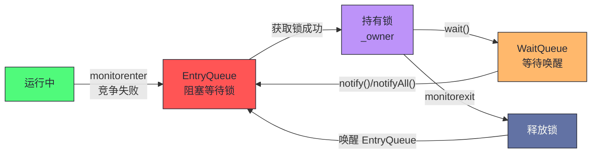
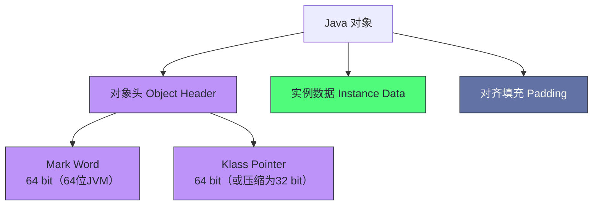
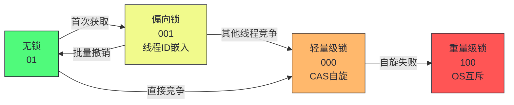
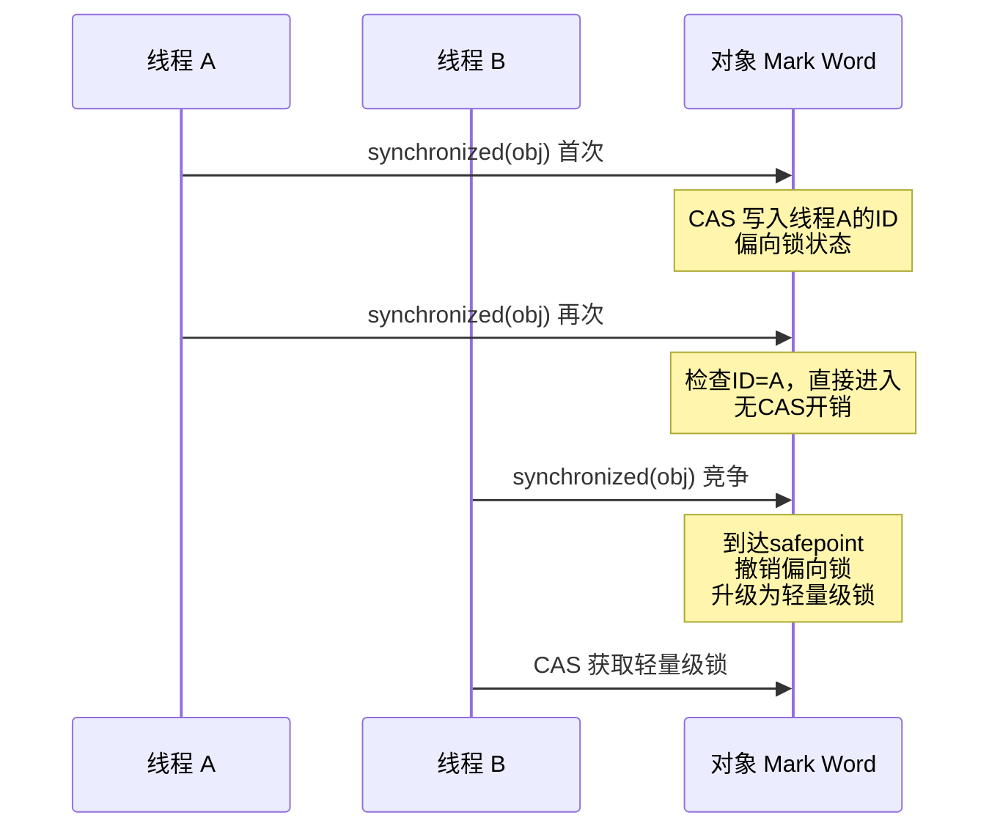
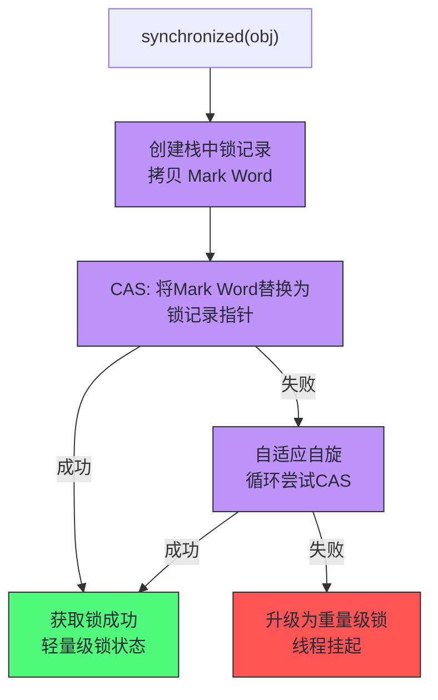
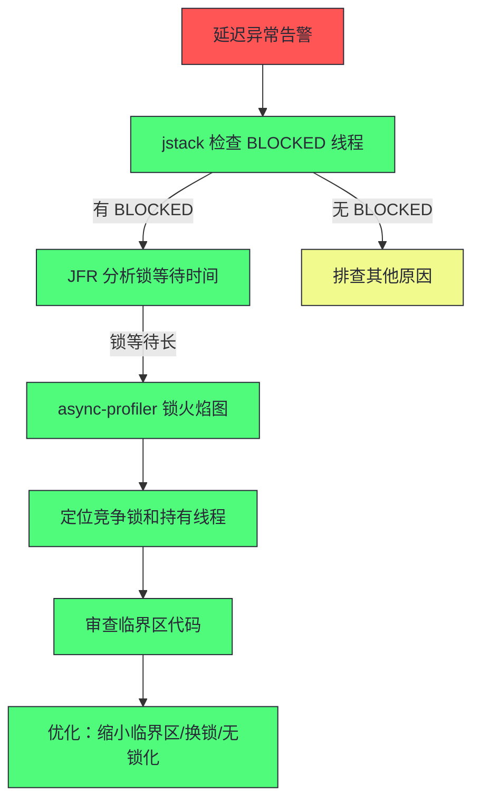
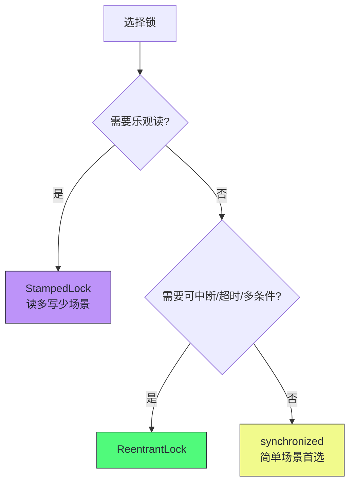
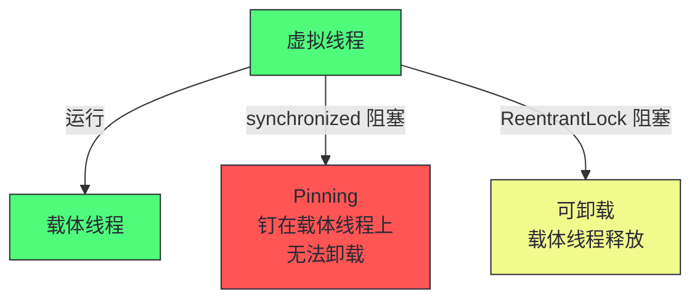
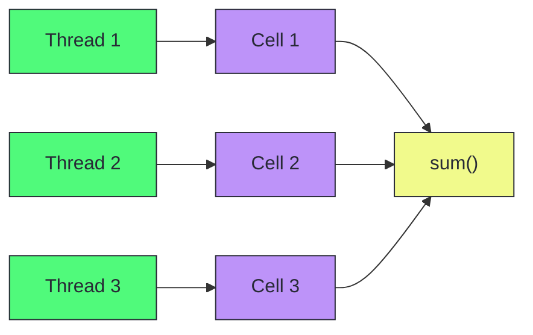

# 11 锁竞争与并发性能：从 synchronized 到 JOL

> [!abstract] 摘要
> 本文是专栏第四部分"JVM 运行时性能"的第三篇，聚焦 Java 并发性能中最核心也最容易被误解的维度——锁竞争。文章从 `synchronized` 关键字的字节码实现出发，讲透 Java 对象头（Object Header）的内存布局与 Mark Word 的多重身份，然后沿着"无锁 → 偏向锁 → 轻量级锁 → 重量级锁"的锁升级链路，剖析每一级锁的设计动机、工作机制和升级触发条件。重点剖析锁竞争的诊断方法（JFR、async-profiler、jstack）、JVM 的隐式锁优化（锁消除、锁粗化、自适应自旋），以及 JOL（Java Object Layout）工具如何揭示对象的真实内存布局。最后讨论 `synchronized` vs `ReentrantLock` vs `StampedLock` 的选型决策，以及虚拟线程对锁竞争模型的新挑战。核心认知：Java 的锁不是"一个实现"，而是一套自适应的多级优化体系；理解锁升级的前提是理解对象头，理解锁竞争的前提是理解线程状态转换的代价。

---

## 第 1 章 synchronized 的字节码本质

### 1.1 从 monitorenter 到 monitorexit

Java 中最基础的同步机制是 `synchronized` 关键字。它可以修饰方法或代码块：

```java
// 修饰方法
public synchronized void method() { ... }

// 修饰代码块
public void method() {
    synchronized (obj) { ... }
}
```

这两种形式在字节码层面的实现不同。修饰代码块时，编译器生成 `monitorenter` 和 `monitorexit` 指令：

```
// synchronized(obj) { ... } 的字节码
monitorenter        // 获取 obj 的监视器锁
// ... 同步代码块 ...
monitorexit         // 释放 obj 的监视器锁
// 异常处理路径
monitorexit         // 异常时释放锁
```

`monitorenter` 的语义是：尝试获取对象 obj 的监视器（monitor）。如果对象未被锁定，当前线程获取锁，将锁计数器设为 1。如果当前线程已持有该锁，计数器加 1（可重入）。如果对象已被其他线程锁定，当前线程阻塞，直到锁释放。

`monitorexit` 的语义是：将锁计数器减 1。如果计数器归零，释放锁。注意字节码中有两个 `monitorexit`——正常退出和异常退出，确保异常时锁也能释放。

修饰方法时，编译器不在方法体中生成 `monitorenter`/`monitorexit`，而是在方法 flags 中设置 `ACC_SYNCHRONIZED` 标志位。JVM 在调用该方法时自动获取/释放当前对象（实例方法）或 Class 对象（静态方法）的监视器锁。

> [!info] 核心概念：每个对象都是一个监视器
> Java 的设计哲学是"每个对象都可以作为锁"。这不是语言层面的语法糖，而是 JVM 规范层面的设计——每个对象在内存中都有一个关联的监视器（ObjectMonitor）。`synchronized` 操作的就是这个监视器。理解这一点是理解锁升级的前提：锁的状态存储在对象头中，锁的升级就是对象头中锁状态位的变迁。

### 1.2 ObjectMonitor 的数据结构

当锁升级为重量级锁时，JVM 会为对象创建一个 ObjectMonitor（也称为 inflated monitor）。ObjectMonitor 的核心数据结构（HotSpot 源码简化）：

```cpp
class ObjectMonitor {
    void*       _owner;         // 持有锁的线程
    ObjectWaiter* _entry_list;  // 等待获取锁的线程队列（EntryQueue）
    ObjectWaiter* _wait_set;    // 调用 wait() 后等待的线程队列（WaitQueue）
    int         _count;         // 锁计数器（重入计数）
    int         _waiters;       // wait_set 中的线程数
    // ...
};
```

线程在 ObjectMonitor 中的状态转换：



重量级锁的核心代价是**线程挂起与唤醒**——这涉及操作系统级别的系统调用（`futex` 或 `pthread_mutex`），需要从用户态切换到内核态，开销通常在微秒级。如果锁持有时间极短（如几条指令），挂起/唤醒的代价比临界区执行时间还长，这就是轻量级锁和偏向锁存在的理由。

---

## 第 2 章 对象头与 Mark Word

### 2.1 Java 对象的内存布局

在 HotSpot JVM 中，每个 Java 对象在内存中由三部分组成：



- **Mark Word**：64 位（64 位 JVM），存储对象的运行时数据——哈希码、GC 年龄、锁状态、线程 ID 等。这是锁升级的核心载体。
- **Klass Pointer**：指向对象所属的 Class 元数据。启用指针压缩（`-XX:+UseCompressedOops`）时为 32 位，否则 64 位。
- **实例数据**：对象字段的实际值，按类型对齐排列。
- **对齐填充**：确保对象总大小是 8 字节的整数倍。

> [!note] 设计哲学：为什么把锁状态放在对象头里
> 把锁状态放在 Mark Word 中，而不是为每个对象单独分配一个 ObjectMonitor，是基于"大多数对象永远不会被用作锁"这一事实。如果为每个对象预分配 ObjectMonitor，内存浪费巨大（一个 ObjectMonitor 约 200 字节）。Mark Word 方案让锁状态"按需升级"——无锁时只占 Mark Word 的几位，只有真正发生竞争时才膨胀为 ObjectMonitor。这是"乐观策略"在 JVM 内部的体现。

### 2.2 Mark Word 的多重身份

Mark Word 是 64 位的复用字段，其内容根据锁状态不同而变化。HotSpot 的 Mark Word 布局（64 位 JVM）：

| 锁状态 | 25 bit | 31 bit | 1 bit | 4 bit | 1 bit | 2 bit |
|--------|--------|--------|-------|-------|-------|-------|
| **无锁** | unused | hashCode | unused | 分代年龄 | 0 | 01 |
| **偏向锁** | 线程 ID | epoch | unused | 分代年龄 | 1 | 01 |
| **轻量级锁** | 指向栈中锁记录的指针 | | | | 0 | 00 |
| **重量级锁** | 指向 ObjectMonitor 的指针 | | | | 0 | 10 |
| **GC 标记** | 空 | | | | 1 | 11 |

关键观察：

1. **最后 2 位是锁标志位**：01=无锁/偏向锁，00=轻量级锁，10=重量级锁，11=GC 标记。
2. **倒数第 3 位区分无锁和偏向锁**：1=偏向锁，0=无锁。
3. **同一块 64 位空间被复用**：无锁时存 hashCode，偏向锁时存线程 ID，轻量级/重量级锁时存指针。这意味着一旦升级为更重的锁，原 Mark Word 中的数据（如 hashCode）需要被保存到其他地方。

> [!warning] 生产避坑：调用 hashCode() 会撤销偏向锁
> 偏向锁的 Mark Word 存储了线程 ID，没有空间存 hashCode。如果对一个偏向锁对象调用 `hashCode()`，JVM 必须撤销偏向锁，将锁状态退化为无锁（或轻量级锁），才能在 Mark Word 中存储 hashCode。这意味着在偏向锁生效的场景中调用 `hashCode()` 会引入锁撤销开销。如果对象的 hashCode 频繁被使用，偏向锁的收益会被撤销开销抵消。

### 2.3 用 JOL 验证对象布局

JOL（Java Object Layout）是 OpenJDK 的工具库，可以打印对象的真实内存布局：

```java
// Maven 依赖
// org.openjdk.jol:jol-core:0.17

import org.openjdk.jol.vm.VM;
import org.openjdk.jol.info.ClassLayout;

public class JOLDemo {
    public static void main(String[] args) {
        Object obj = new Object();
        System.out.println(VM.current().details());
        System.out.println(ClassLayout.parseInstance(obj).toPrintable());
    }
}
```

输出示例（64 位 JVM，启用压缩指针）：

```
# Running 64-bit HotSpot VM.
# Using compressed oop with 3-bit shift.
# Using compressed klass with 3-bit shift.
# Objects are 8 bytes aligned.

java.lang.Object object internals:
OFF  SZ   TYPE DESCRIPTION               VALUE
  0   8        (object header: mark)     0x0000000000000005 (biasable)
  8   4        (object header: class)    0x00000480
 12   4        (object alignment padding)
Instance size: 16 bytes
Space losses: 0 bytes internal + 4 bytes external = 4 bytes lost
```

一个 `new Object()` 占 16 字节：8 字节 Mark Word + 4 字节压缩 Klass Pointer + 4 字节对齐填充。Mark Word 值 `0x0000000000000005` 的最后 3 位是 `101`——可偏向但未偏向（无锁+偏向标志位）。

通过 JOL 可以验证锁升级过程中 Mark Word 的变化：

```java
synchronized (obj) {
    System.out.println(ClassLayout.parseInstance(obj).toPrintable());
}
// 此时 Mark Word 变为轻量级锁状态（00）
```

---

## 第 3 章 锁升级链路

### 3.1 锁升级的总览

Java 的锁不是单一的实现，而是一套自适应的多级优化体系。锁状态从轻到重依次为：



锁升级是**单向的**——一旦升级到更重的锁，就不会自动降级（JDK 15 前的偏向锁撤销是例外）。这个设计基于一个假设：如果锁曾经发生过竞争，未来很可能还会竞争，保持重量级锁状态可以避免重复升级的开销。

### 3.2 偏向锁：单线程场景的极致优化

偏向锁（Biased Locking）是 JDK 6 引入的优化，针对的场景是"一个锁在绝大多数时间只被同一个线程获取"。

**工作机制**：

1. **首次获取**：线程 A 执行 `synchronized(obj)`，JVM 通过一次 CAS 将线程 A 的 ID 写入 obj 的 Mark Word，锁状态变为偏向锁。
2. **后续获取**：线程 A 再次执行 `synchronized(obj)`，JVM 检查 Mark Word 中的线程 ID 是否是自己，如果是，直接进入临界区，无需任何 CAS 操作。
3. **撤销偏向**：当线程 B 尝试获取锁时，JVM 发现 Mark Word 中的线程 ID 不是 B，需要等待全局安全点（safepoint），撤销偏向锁，升级为轻量级锁。



> [!warning] 生产避坑：偏向锁在 JDK 15+ 已被废弃
> 偏向锁的设计假设是"锁只被一个线程使用"，但在现代 Java 应用中，线程池是标配，锁在线程间切换非常频繁。偏向锁的撤销需要 safepoint，在高并发场景下撤销开销可能超过偏向带来的收益。因此 JDK 15（JEP 374）废弃了偏向锁，JDK 18 默认禁用。如果你的应用运行在 JDK 15+，不需要关心偏向锁；如果运行在 JDK 8-14，偏向锁默认启用，可以通过 `-XX:-UseBiasedLocking` 禁用。

### 3.3 轻量级锁：CAS 自旋

轻量级锁（Thin Lock / Lightweight Lock）针对的场景是"多个线程交替获取锁，但实际竞争不激烈"。

**工作机制**：

1. **获取锁**：线程在当前栈帧中创建一个锁记录（Lock Record），将对象的 Mark Word 拷贝到锁记录中。然后通过 CAS 尝试将对象的 Mark Word 替换为指向锁记录的指针。如果成功，获取锁成功，锁状态变为轻量级锁（00）。
2. **释放锁**：线程通过 CAS 将锁记录中的 Mark Word 拷贝回对象头。如果成功，释放成功。如果失败，说明在持有锁期间有其他线程尝试竞争，锁已升级为重量级锁，释放时需要唤醒被阻塞的线程。
3. **竞争失败**：如果 CAS 获取锁失败，说明有竞争。线程会进行自适应自旋（循环尝试 CAS），如果自旋成功则获取锁；如果自旋失败则升级为重量级锁。



> [!info] 核心概念：自适应自旋
> JDK 7 引入了自适应自旋（Adaptive Spinning）。自旋次数不是固定的，而是根据历史成功率动态调整：如果最近的自旋成功率高，JVM 会增加自旋次数；如果成功率低，JVM 会减少甚至跳过自旋。这个机制避免了"自旋浪费 CPU"和"过早挂起"两个极端。自旋的本质是"赌锁很快会释放"——如果锁持有时间短，自旋比挂起/唤醒更高效；如果锁持有时间长，自旋就是纯浪费。

### 3.4 重量级锁：OS 互斥

重量级锁（Inflated Lock / Heavyweight Lock）是锁升级的终点。当轻量级锁的自旋失败时，锁膨胀为重量级锁。

**工作机制**：

1. **膨胀**：JVM 为对象创建 ObjectMonitor，将 Mark Word 替换为指向 ObjectMonitor 的指针（10）。
2. **获取锁**：竞争失败的线程进入 ObjectMonitor 的 EntryQueue，被操作系统挂起（`futex` 或 `pthread_mutex_lock`）。
3. **释放锁**：持有锁的线程释放时，从 EntryQueue 唤醒一个线程。

重量级锁的代价是**系统调用**——线程挂起和唤醒需要从用户态切换到内核态，开销通常在 1-10 微秒级。对于持有时间极短的锁，这个开销可能比临界区执行时间还长。

### 3.5 锁升级的触发条件总结

| 升级路径 | 触发条件 | 代价 |
|---------|---------|------|
| 无锁 → 偏向锁 | 首次 `synchronized`（JDK < 15） | 一次 CAS |
| 偏向锁 → 轻量级锁 | 其他线程竞争 | safepoint 撤销 + CAS |
| 无锁 → 轻量级锁 | 直接竞争（JDK 15+ 无偏向锁） | CAS |
| 轻量级锁 → 重量级锁 | 自旋失败 | 创建 ObjectMonitor + 线程挂起 |

> [!note] 设计哲学：锁升级是"乐观→悲观"的渐进退化
> 锁升级的本质是"乐观策略到悲观策略的渐进退化"：偏向锁是最乐观的（假设只有一个线程），轻量级锁是中等乐观的（假设竞争不激烈，自旋就能解决），重量级锁是悲观的（假设竞争激烈，必须挂起）。这个设计让"无竞争"和"轻度竞争"场景几乎零开销，只有真正的高竞争才付出系统调用的代价。理解这个渐进退化逻辑，就能理解为什么 Java 的 `synchronized` 在大多数场景下性能不输 `ReentrantLock`——JVM 已经在底层做了大量自适应优化。

---

## 第 4 章 JVM 的隐式锁优化

### 4.1 锁消除

锁消除（Lock Elision）基于逃逸分析（Escape Analysis）。如果 JVM 通过逃逸分析确定一个对象不会逃逸出当前方法，那么对该对象的所有同步操作都可以被消除——因为不存在其他线程能访问到这个对象。

```java
// StringBuffer 是线程安全的，每次 append 都 synchronized
public String concat(String a, String b) {
    StringBuffer sb = new StringBuffer();
    sb.append(a);  // synchronized(sb)
    sb.append(b);  // synchronized(sb)
    return sb.toString();
}
// sb 不会逃逸出 concat 方法，JVM 可以消除这些锁
```

锁消除由 `-XX:+EliminateLocks`（默认启用）控制，依赖逃逸分析（`-XX:+DoEscapeAnalysis`，默认启用）。

> [!info] 核心概念：逃逸分析是锁消除的前提
> 逃逸分析是 JVM 的一项全局优化，分析对象的作用域是否可能"逃逸"出当前方法或线程。逃逸分析不仅用于锁消除，还用于标量替换（Scalar Replacement，将对象拆解为基本类型字段，直接在栈上分配）和栈上分配。这三者共同减少了不必要的堆分配和同步开销。逃逸分析的精度直接影响锁消除的效果——如果分析过于保守（认为可能逃逸），就不会消除锁；如果分析过于激进，可能错误消除必要的锁。HotSpot 的逃逸分析在 JDK 8 后持续增强，JDK 17 的精度已相当高。

### 4.2 锁粗化

锁粗化（Lock Coarsening）将连续的对同一对象的锁操作合并为一个：

```java
// 原始代码
synchronized (obj) { doA(); }
synchronized (obj) { doB(); }
synchronized (obj) { doC(); }

// 锁粗化后
synchronized (obj) { doA(); doB(); doC(); }
```

锁粗化减少了锁获取/释放的次数。由 `-XX:+DoLockCoarsening`（默认启用）控制。锁粗化的风险是临界区变长，可能增加锁竞争的窗口。JVM 只在"连续的锁操作之间没有其他代码"或"粗化收益明显"时才执行。

### 4.3 自适应自旋

如前所述，自适应自旋在轻量级锁竞争失败时避免立即升级为重量级锁。自旋的关键参数：

| 参数 | 作用 | 默认值 |
|------|------|--------|
| `-XX:+UseSpinning` | 启用自旋 | true（JDK 7+） |
| `-XX:PreBlockSpin` | 自旋次数（JDK 6 固定值） | 10 |

JDK 7+ 自适应自旋不再使用固定的 `PreBlockSpin`，而是根据历史成功率动态调整。

---

## 第 5 章 锁竞争诊断

### 5.1 jstack：线程转储分析

`jstack` 是最基础的锁竞争诊断工具，打印所有线程的栈和锁状态：

```bash
# 打印线程转储
jstack <pid>

# 锁竞争的关键信息：
# - BLOCKED 状态的线程（等待重量级锁）
# - 等待的锁对象地址
# - 持有该锁的线程
```

典型 BLOCKED 线程的转储：

```
"Thread-3" #23 prio=5 os_prio=0 tid=0x... nid=0x... waiting for monitor entry
   java.lang.Thread.State: BLOCKED (on object monitor)
   at com.example.Service.method(Service.java:42)
   - waiting to lock <0x000000076b0a3f80> (a java.lang.Object)
   - locked <0x000000076b0a4000> (a java.lang.Object)
   ...

"Thread-1" #21 prio=5 os_prio=0 tid=0x... nid=0x... runnable
   at com.example.Service.method(Service.java:42)
   - locked <0x000000076b0a3f80> (a java.lang.Object)
```

Thread-3 在等待 `<0x000000076b0a3f80>`，而 Thread-1 持有该锁。通过多次 jstack 可以观察锁竞争的持续性和模式。

### 5.2 JFR：锁竞争事件

JFR 提供了 `jdk.JavaMonitorWait` 和 `jdk.JavaMonitorEnter` 事件，可以精确测量锁等待时间：

```bash
# 启动 JFR 记录锁事件
-XX:StartFlightRecording=duration=60s,jdk.JavaMonitorEnter#enabled=true,jdk.JavaMonitorWait#enabled=true,filename=locks.jfr
```

JFR 的优势是开销极低（< 1%），适合生产环境持续监控。通过 JDK Mission Control 分析，可以看到：

- 每个锁的等待时间分布
- 等待锁最多的线程
- 持有锁时间最长的栈

### 5.3 async-profiler：锁竞争火焰图

async-profiler 可以生成锁竞争的火焰图，直观展示锁等待的调用栈：

```bash
# 采样锁竞争事件
./async-profiler.sh -e lock -d 30 -f lock_profile.html <pid>
```

火焰图中宽度代表锁等待时间，越宽的栈帧说明该调用路径的锁等待越长。这是定位"哪个方法在等锁"最直观的工具。

### 5.4 诊断流程



---

## 第 6 章 字符串锁与 intern 陷阱

### 6.1 synchronized 字符串的陷阱

一个经典的并发陷阱是用字符串作为锁对象：

```java
// 危险！
synchronized (userId.toString()) {
    // 用户级互斥
}
```

问题在于 `String.toString()` 返回的是字符串本身，而字符串可能被 intern 或被常量池复用。如果两个不同的逻辑块用相同的字符串值作为锁，会产生意外的互斥——本应独立的操作互相阻塞。

更安全的做法是使用专门的锁对象：

```java
// 正确做法
private final Object lock = new Object();
synchronized (lock) { ... }

// 或使用 ConcurrentHashMap 管理用户级锁
ConcurrentHashMap<String, Object> userLocks = new ConcurrentHashMap<>();
Object lock = userLocks.computeIfAbsent(userId, k -> new Object());
synchronized (lock) { ... }
```

### 6.2 String.intern() 与字符串去重

`String.intern()` 将字符串放入字符串常量池，相同内容的字符串返回同一个引用。这可以减少内存占用，但也有陷阱：

- **JDK 6**：字符串池在 PermGen 中，intern 过多字符串会导致 `OutOfMemoryError: PermGen space`
- **JDK 7+**：字符串池移到堆中，但 intern 过多仍会增加 GC 压力

G1 提供了字符串去重（String Deduplication）功能，在 GC 阶段自动识别内容相同的 String 对象，共享底层的 `byte[]`：

```bash
# 启用 G1 字符串去重
-XX:+UseG1GC -XX:+UseStringDeduplication
```

> [!warning] 生产避坑：intern 不是免费的
> `String.intern()` 在高并发场景下有锁竞争——字符串池是一个全局的 HashTable，intern 操作需要同步。在大规模 intern 场景下，可能成为性能瓶颈。如果只是想减少内存占用，优先考虑 G1 字符串去重（自动、无侵入），而非手动 intern。

### 6.3 紧凑字符串

JDK 9 引入了紧凑字符串（Compact Strings，JEP 254）。`String` 的底层存储从 `char[]`（每字符 2 字节）改为 `byte[]`（每字符 1 字节，如果所有字符都是 Latin-1）。对于纯 ASCII 字符串，内存占用减半。

```java
// JDK 8: String 内部是 char[] value
// JDK 9+: String 内部是 byte[] value + byte coder
// coder == 0: Latin-1（1字节/字符）
// coder == 1: UTF-16（2字节/字符）
```

紧凑字符串对锁竞争的影响是间接的——更小的对象意味着更少的内存占用和 GC 压力，但 String 作为锁对象的风险不变。

---

## 第 7 章 锁的选型：synchronized vs ReentrantLock vs StampedLock

### 7.1 三种锁的对比

| 维度 | synchronized | ReentrantLock | StampedLock |
|------|-------------|---------------|-------------|
| 实现 | JVM 内置（锁升级） | AQS（AbstractQueuedSynchronizer） | AQS 变体 + 乐观读 |
| 公平性 | 非公平 | 可选公平/非公平 | 非公平 |
| 可中断 | 否 | 是 | 是 |
| 可超时 | 否 | 是 | 是 |
| 条件变量 | wait/notify（1个） | Condition（多个） | 不支持 |
| 乐观读 | 否 | 否 | 是 |
| 释放方式 | 自动 | 手动 unlock() | 手动 |
| 性能（无竞争） | 最优（偏向锁/锁消除） | 略差（AQS 开销） | 最优（乐观读无锁） |
| 性能（高竞争） | 重量级锁 | 重量级锁 | 乐观读可能最优 |

### 7.2 选型决策



> [!info] 核心概念：synchronized 在现代 JVM 上已经"够好"
> 在 JDK 6 之前，`synchronized` 的性能远不如 `ReentrantLock`，因为 `synchronized` 只有重量级锁实现。JDK 6 引入锁升级后，`synchronized` 在无竞争和轻度竞争场景下的性能已经与 `ReentrantLock` 持平甚至更优（因为 JVM 内置优化更激进）。现代 Java 的最佳实践是：默认用 `synchronized`，只在需要 `ReentrantLock` 的特殊能力（可中断、超时、多条件变量、公平锁）时才换用。`StampedLock` 适合读多写少且对读延迟极度敏感的场景。

### 7.3 StampedLock 的乐观读

StampedLock 的核心特性是**乐观读**（Optimistic Read）：

```java
StampedLock lock = new StampedLock();

// 写锁
long stamp = lock.writeLock();
try {
    // 修改数据
} finally {
    lock.unlockWrite(stamp);
}

// 乐观读
long stamp = lock.tryOptimisticRead();
// 拷贝共享数据到本地变量
if (!lock.validate(stamp)) {
    // 乐观读失败（有写操作发生），升级为悲观读
    stamp = lock.readLock();
    try {
        // 重新读取数据
    } finally {
        lock.unlockRead(stamp);
    }
}
```

乐观读不获取锁，只获取一个"戳"（stamp），然后读取数据。读取后通过 `validate()` 检查戳是否仍然有效。如果在读取期间有写操作发生，戳失效，需要升级为悲观读重新读取。

乐观读的代价是一次 volatile 读（`validate`），比获取读锁轻量得多。适合"读远多于写，且偶尔读到脏数据可以重试"的场景。

> [!warning] 生产避坑：StampedLock 不可重入
> StampedLock 的读锁和写锁都不可重入。如果同一线程在持有读锁时再次获取读锁，会自旋等待，可能导致死锁。不要在递归或嵌套调用中使用 StampedLock 的悲观读。乐观读不受此限制（因为乐观读不真正获取锁）。

---

## 第 8 章 虚拟线程对锁竞争的新挑战

### 8.1 虚拟线程与载体线程

JDK 21 引入的虚拟线程（Virtual Thread，Project Loom）是 JVM 管理的轻量级线程。虚拟线程运行在载体线程（Carrier Thread，即平台线程）上，当虚拟线程阻塞时（如 I/O 等待），JVM 将其从载体线程上卸载，载体线程可以运行其他虚拟线程。

### 8.2 synchronized 的 pinning 问题

虚拟线程与 `synchronized` 存在一个已知问题：**当虚拟线程在 `synchronized` 代码块中阻塞时，它会被"钉住"（Pinning）在载体线程上，无法卸载**。这是因为 `synchronized` 的重量级锁使用 OS 级别的线程挂起，而虚拟线程的卸载机制无法在 OS 线程被挂起时工作。



`ReentrantLock` 不存在这个问题——它使用 `LockSupport.park()`，JVM 可以感知并卸载虚拟线程。

> [!warning] 生产避坑：虚拟线程中避免 synchronized
> 如果使用虚拟线程，且同步代码块中可能发生阻塞（如 I/O 操作），应使用 `ReentrantLock` 替代 `synchronized`。JDK 社区正在修复 `synchronized` 的 pinning 问题（JEP 491: Synchronize Virtual Threads without Pinning），但在修复之前，这是虚拟线程用户必须注意的陷阱。诊断方法：通过 JFR 的 `jdk.VirtualThreadPinned` 事件检测 pinning。

### 8.3 虚拟线程对锁竞争模型的影响

虚拟线程改变了并发编程的模型——从"少量线程 + 线程池"到"海量虚拟线程 + 直接阻塞"。在传统模型中，锁竞争的代价是线程池中的线程被阻塞，吞吐量下降。在虚拟线程模型中，锁竞争的代价是载体线程被占用（如果 pinning），可能导致载体线程池耗尽。

这意味着在虚拟线程时代，锁竞争的诊断和优化变得更加重要——因为虚拟线程的数量可能远超载体线程，一个热点锁可能阻塞大量虚拟线程。

---

## 第 9 章 并发性能的边界与反例

### 9.1 锁不是万能的

锁是并发编程的基础工具，但过度依赖锁会导致性能问题。一些常见的反例：

**反例 1：用锁保护无状态操作**

```java
// 不必要的锁
synchronized (lock) {
    int result = a + b;  // 纯计算，无共享状态
    return result;
}
// 应该直接去掉锁
```

**反例 2：用粗粒度锁保护独立操作**

```java
// 过度互斥
synchronized (globalLock) {
    updateCounterA();
    updateCounterB();  // A 和 B 无关联
}
// 应该用两个独立的锁
synchronized (lockA) { updateCounterA(); }
synchronized (lockB) { updateCounterB(); }
```

**反例 3：在锁中执行 I/O**

```java
// 锁中 I/O 是灾难
synchronized (lock) {
    db.query("...");  // 持有锁期间阻塞在网络 I/O 上
}
// 应该将 I/O 移出临界区
```

### 9.2 无锁化不是银弹

无锁编程（Lock-Free）使用 CAS（Compare-And-Swap）实现并发安全，避免了锁的挂起/唤醒开销。但无锁不是银弹：

- **CAS 失败重试**：高竞争下 CAS 失败率高，重试开销可能超过锁
- **ABA 问题**：值从 A→B→A，CAS 认为未变化，可能逻辑错误
- **内存可见性**：无锁代码需要显式处理内存可见性（volatile、VarHandle）
- **复杂度**：无锁代码的正确性验证远难于锁代码

> [!info] 核心概念：锁 vs 无锁的选择标准
> 选择锁还是无锁，核心标准是"竞争程度"：低竞争用锁（锁升级到轻量级锁，CAS 开销与无锁相当），高竞争用无锁（避免线程挂起）。但"高竞争"本身通常是设计问题——如果热点数据被频繁争抢，更好的方案是分片（如 `LongAdder` 代替 `AtomicLong`）或避免共享（如线程本地变量）。无锁编程应该是"最后的优化手段"，而非默认选择。

### 9.3 LongAdder：分片优于 CAS

`LongAdder`（JDK 8）是 `AtomicLong` 的高竞争替代品。它的思路是**分片**——将一个计数器拆分为多个 Cell，每个线程优先更新自己的 Cell，读取时汇总所有 Cell：



在高竞争场景下，`LongAdder` 的吞吐量远高于 `AtomicLong`（因为减少了 CAS 冲突）。代价是 `sum()` 不是精确的（遍历 Cell 期间可能有更新），且内存占用更大。这是"用空间换吞吐"的经典案例。

---

## 总结

锁竞争与并发性能的知识可以归纳为以下主线：

1. **synchronized 的本质**：每个 Java 对象都是一个监视器，`synchronized` 操作的是对象头中的锁状态。`monitorenter`/`monitorexit` 是字节码层面的实现。

2. **对象头是锁的载体**：Mark Word 是 64 位的复用字段，根据锁状态存储不同内容（hashCode、线程 ID、锁记录指针、ObjectMonitor 指针）。理解 Mark Word 是理解锁升级的前提。

3. **锁升级是自适应优化**：无锁 → 偏向锁 → 轻量级锁 → 重量级锁，是"乐观→悲观"的渐进退化。偏向锁针对单线程场景（JDK 15 废弃），轻量级锁针对轻度竞争（CAS 自旋），重量级锁针对高竞争（OS 互斥）。

4. **JVM 隐式优化**：锁消除（逃逸分析）、锁粗化（合并连续锁）、自适应自旋是 JVM 在编译和运行时自动做的优化，大多数场景下不需要手动干预。

5. **诊断工具链**：jstack 检查 BLOCKED 线程，JFR 测量锁等待时间，async-profiler 生成锁竞争火焰图。诊断流程是"先定位竞争锁，再审查临界区"。

6. **选型决策**：默认 `synchronized`，需要可中断/超时/多条件时用 `ReentrantLock`，读多写少且延迟敏感时用 `StampedLock`。虚拟线程中避免 `synchronized`（pinning 问题）。

7. **边界与反例**：锁不是万能的（无状态操作不需要锁），无锁也不是银弹（高竞争 CAS 可能更差）。最佳策略通常是"减少共享"——分片、线程本地、避免全局状态。

> [!info] 专栏导航
> 本文是 [[00 专栏导览|系统性能工程实战专栏]] 的第 11 篇。上一篇 [[10 GC 工程化：从分代假设到现代 GC 调优]] 讲透了 GC 的工程化实践；下一篇 [[12 基准测试方法论：JMH 与系统级 benchmark 的陷阱]] 将进入专栏第五部分"实践与边界"，讨论性能基准测试的方法论和常见陷阱。GC 和锁是 JVM 运行时性能的两大深水区，基准测试则是验证性能假设的唯一手段——三者构成了 Java 性能工程的核心闭环。

---

*本文基于 Monica Beckwith《JVM Performance Engineering》第 7 章相关内容和 Brendan Gregg《Systems Performance》的并发分析章节整合而成，加入了作者的工程实践理解和结构化重组。*
