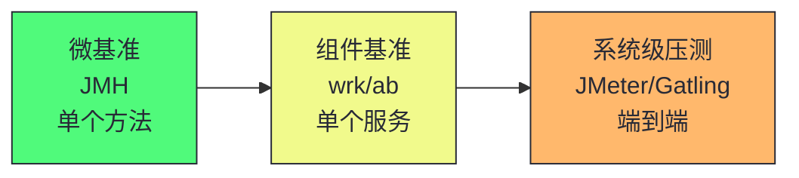
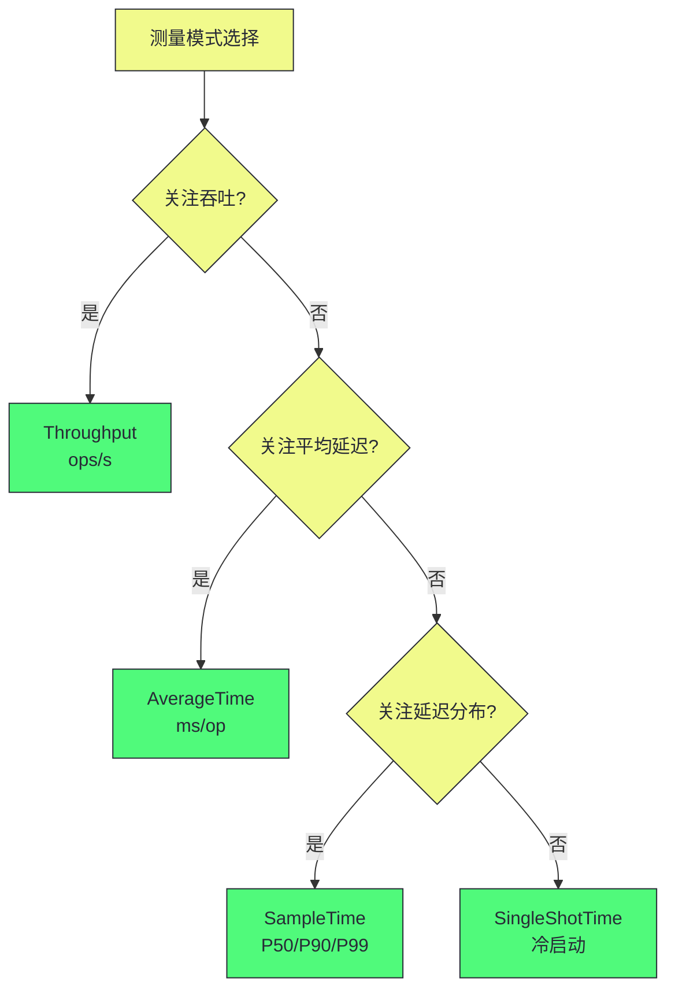
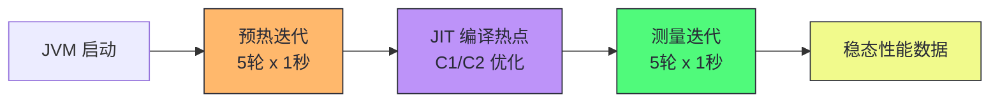
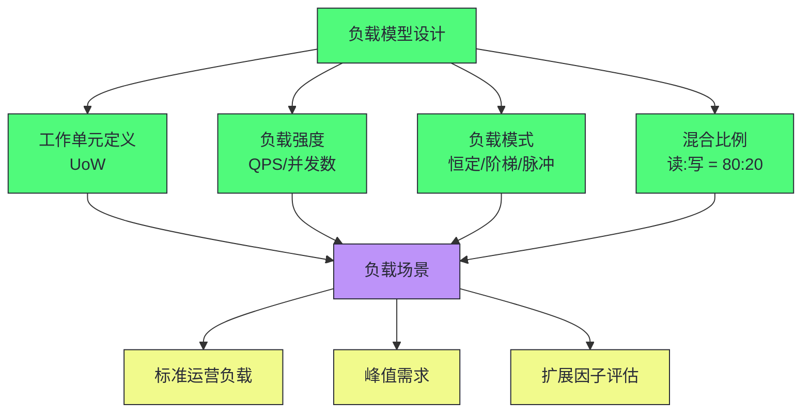
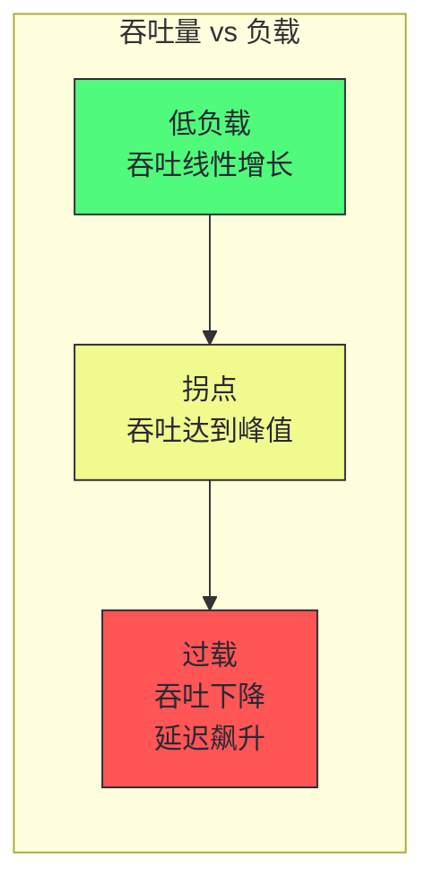
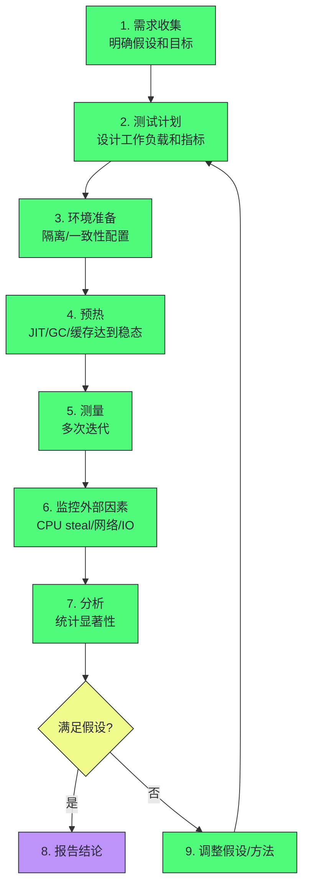

# 12 基准测试方法论：JMH 与系统级 benchmark 的陷阱

> [!abstract] 摘要
> 本文是专栏第五部分"实践与边界"的第一篇，聚焦性能工程中最容易"自欺欺人"的环节——基准测试。文章从"为什么基准测试如此容易出错"这一根本问题出发，讲透微基准测试的三大陷阱（JIT 过度优化、Dead Code Elimination、测量失真），然后深入 JMH（Java Microbenchmark Harness）的设计哲学与核心注解，剖析预热机制、Blackhole 消费、Fork 隔离、状态管理等关键概念。之后转向系统级压测，讨论工作负载模型、负载场景设计、自上而下与自下而上的双重视角。最后给出基准测试的"伦理"——什么时候该做基准测试，什么时候不该做，以及如何判断基准测试结果的可信度。核心认知：基准测试不是"跑个数字"，而是一项需要严格方法论支撑的实验科学；错误的基准测试比不做基准测试更危险，因为它会用"数据"支撑错误的决策。

---

## 第 1 章 基准测试的本质与困境

### 1.1 什么是基准测试

基准测试（Benchmark）是通过运行标准化的工作负载，测量系统性能指标的方法。它的核心目的是**回答"这个系统/组件有多快"或"A 和 B 谁更快"的问题**。

基准测试可以分为三个层次：

| 层次 | 测量对象 | 典型工具 | 价值 |
|------|---------|---------|------|
| **微基准（Microbenchmark）** | 单个方法/代码片段 | JMH | 算法/数据结构选型 |
| **组件基准（Component Benchmark）** | 单个组件/服务 | wrk, ab | 组件性能上限 |
| **系统级压测（System Benchmark）** | 端到端系统 | JMeter, Gatling | 容量规划、SLO 验证 |



> [!info] 核心概念：基准测试是实验科学，不是"跑个数字"
> 基准测试的本质是受控实验——需要控制变量、消除干扰、确保可重复性。很多人把基准测试理解为"写个循环跑一万次看耗时"，这忽略了 JIT 优化、GC 干扰、OS 调度、缓存预热等大量干扰因素。一个没有方法论支撑的基准测试，其结果可能完全不可信——不是因为数字"不准"，而是因为数字"测的不是你以为的东西"。

### 1.2 为什么基准测试如此容易出错

Java 基准测试的困难根源在于 **JIT 编译器的自适应优化**。JIT 不是一个"忠实的翻译官"，它是一个"激进的优化器"——会根据运行时 profile 做出各种假设和变换。这些优化在正常应用中是好事，但在基准测试中会扭曲测量结果。

三大典型陷阱：

**陷阱 1：Dead Code Elimination（死代码消除）**

```java
// 错误的微基准
@Benchmark
public void test() {
    int result = 0;
    for (int i = 0; i < 1000; i++) {
        result += compute(i);
    }
    // result 没有被使用，JIT 认为整个循环是死代码，直接消除
}
```

JIT 发现 `result` 计算后没有被任何代码使用，整个循环没有副作用，于是将循环消除。基准测试"跑"了，但实际什么都没执行——测到的时间是零。

**陷阱 2：常量折叠（Constant Folding）**

```java
@Benchmark
public int test() {
    int a = 1;
    int b = 2;
    return a + b;  // JIT 在编译时直接算出 3，运行时无计算
}
```

JIT 在编译时发现 `a` 和 `b` 是常量，直接将 `a + b` 折叠为 `3`。基准测试测的不是"加法有多快"，而是"返回常量有多快"。

**陷阱 3：循环不变量外提（Loop-Invariant Code Motion）**

```java
@Benchmark
public int test(int[] data) {
    int sum = 0;
    for (int i = 0; i < data.length; i++) {
        sum += data[i] * Math.PI;  // Math.PI 是循环不变量
    }
    return sum;
}
// JIT 将 Math.PI 的加载移到循环外，循环内只剩乘加
```

JIT 将循环不变的计算移到循环外，使得循环内的实际工作量比"看起来"的少。

> [!warning] 生产避坑：不要手写微基准
> 任何手写的 `for (int i = 0; i < N; i++) { ... }` 式微基准都几乎必然被 JIT 优化扭曲。Java 微基准测试必须使用 JMH——它是专门为对抗 JIT 优化而设计的工具。JMH 的核心价值不是"提供方便的 API"，而是"确保测量结果可信"。

### 1.3 基准测试的"伦理"

> [!note] 设计哲学：什么时候不该做基准测试
> 基准测试不是万能的。以下场景做基准测试是浪费时间或有害：
> - **没有明确的假设**：如果你不知道要验证什么，基准测试只会产生一堆没有解释力的数字
> - **微基准结果用于推断系统性能**：一个方法的微基准结果不能推断端到端系统性能——系统瓶颈通常在 I/O、锁、网络，而非单个方法
> - **在非生产环境做容量规划**：测试环境的硬件、网络、负载模式与生产不同，系统级压测结果不能直接用于生产容量规划
> - **A/B 比较时没有控制变量**：如果 A 和 B 的运行环境、JVM 参数、输入数据不同，比较结果没有意义
>
> 基准测试的正确动机是"验证一个明确的性能假设"——例如"HashMap.get() 在 1000 个元素时比 TreeMap.get() 快多少倍"。有明确假设，才能设计正确的实验。

---

## 第 2 章 JMH 的设计哲学

### 2.1 JMH 是什么

JMH（Java Microbenchmark Harness）是 OpenJDK 团队开发的微基准测试框架，由 Aleksey Shipilev 维护。它不是"方便写基准测试的工具"，而是"确保基准测试结果可信的工具"。

JMH 的核心设计目标：

1. **对抗 JIT 优化**：通过 Blackhole、Fork 隔离等机制防止 DCE、常量折叠等优化扭曲结果
2. **控制测量精度**：通过预热迭代、多次测量、统计显著性分析确保结果可信
3. **管理 JVM 状态**：通过 Fork 隔离确保每次测量在独立的 JVM 进程中进行，避免跨测量的状态污染

```xml
<!-- Maven 依赖 -->
<dependency>
    <groupId>org.openjdk.jmh</groupId>
    <artifactId>jmh-core</artifactId>
    <version>1.37</version>
</dependency>
<dependency>
    <groupId>org.openjdk.jmh</groupId>
    <artifactId>jmh-generator-annprocess</artifactId>
    <version>1.37</version>
    <scope>provided</scope>
</dependency>
```

### 2.2 第一个 JMH 基准测试

```java
import org.openjdk.jmh.annotations.*;
import org.openjdk.jmh.infra.Blackhole;
import java.util.concurrent.TimeUnit;

@BenchmarkMode(Mode.Throughput)
@OutputTimeUnit(TimeUnit.SECONDS)
@Warmup(iterations = 5, time = 1)
@Measurement(iterations = 5, time = 1)
@Fork(2)
@State(Scope.Thread)
public class MyBenchmark {

    @Benchmark
    public void testMethod(Blackhole bh) {
        int result = 0;
        for (int i = 0; i < 1000; i++) {
            result += i;
        }
        bh.consume(result);  // 防止 DCE
    }
}
```

关键元素解析：

- `@BenchmarkMode(Mode.Throughput)`：测量吞吐量（每秒操作数）
- `@Warmup(iterations = 5, time = 1)`：5 次预热迭代，每次 1 秒
- `@Measurement(iterations = 5, time = 1)`：5 次测量迭代，每次 1 秒
- `@Fork(2)`：2 个独立的 JVM 进程，每个进程执行完整的预热+测量
- `@State(Scope.Thread)`：每个线程有独立的状态实例
- `Blackhole.consume(result)`：消费计算结果，防止 JIT 消除死代码

> [!info] 核心概念：为什么需要 Fork
> Fork 是 JMH 最重要也最容易被忽略的特性。每次 Fork 启动一个全新的 JVM 进程，确保：
> - JIT 编译器的 profile 不会跨测量污染
> - GC 堆状态不会跨测量影响
> - 类加载器的状态不会跨测量累积
>
> 如果不做 Fork（`@Fork(0)`），所有测量在同一个 JVM 中进行，第一次测量的 JIT 优化、GC 行为会影响后续测量。Fork 确保每次测量是"干净的"——这是 JMH 结果可信的基石。

### 2.3 JMH 的测量模式

| 模式 | 含义 | 适用场景 |
|------|------|---------|
| `Throughput` | 每秒操作数（ops/s） | 评估整体吞吐能力 |
| `AverageTime` | 平均单次操作耗时 | 评估单次操作延迟 |
| `SampleTime` | 采样延迟分布（P50/P90/P99） | 评估延迟尾部 |
| `SingleShotTime` | 单次冷启动耗时 | 评估启动性能或冷操作 |



> [!note] 设计哲学：Throughput vs AverageTime 的关系
> Throughput 和 AverageTime 互为倒数——如果吞吐是 1000 ops/s，平均延迟就是 1/1000 = 1ms。那为什么需要两个模式？因为它们的统计特性不同：Throughput 测量的是"固定时间内完成了多少操作"，AverageTime 测量的是"完成固定操作需要多少时间"。在高吞吐场景下，Throughput 的统计更稳定；在低延迟场景下，AverageTime 更直观。选择哪个取决于你更关心"总量"还是"单次"。

---

## 第 3 章 JMH 核心机制深度解析

### 3.1 预热机制

预热（Warmup）是 JMH 对抗 JIT 预热效应的核心机制。在正式测量前，JMH 先运行若干轮预热迭代，让 JIT 编译器识别热点、完成编译优化。



预热迭代的关键参数：

```java
@Warmup(iterations = 5, time = 1, batchSize = 1)
```

- `iterations`：预热轮数（默认 5）
- `time`：每轮时长（默认 1 秒）
- `batchSize`：每批次调用次数（默认 1）

> [!warning] 生产避坑：预热轮数不够导致测量失真
> 如果预热轮数太少，JIT 可能还没完成 C2 编译，测量的是"半优化"状态的性能。对于复杂的基准测试，建议预热至少 10 轮。可以通过 JMH 的 `-prof gc` 分析器观察预热期间 GC 行为是否稳定——如果 GC 频率在预热后期趋于稳定，说明 JIT 已基本完成。

### 3.2 Blackhole：对抗 Dead Code Elimination

Blackhole 是 JMH 对抗 DCE 的核心武器。它的作用是"消费"计算结果，让 JIT 认为该结果被使用了，从而不会消除产生该结果的代码。

```java
@Benchmark
public void test(Blackhole bh) {
    bh.consume(computeA());
    bh.consume(computeB());
    bh.consume(computeC());
}
```

Blackhole 的工作原理：

1. **volatile 写入**：Blackhole 内部使用 volatile 字段存储消费的值，防止 JIT 将消费操作优化掉
2. **类型特化**：对 int/long/Object 等不同类型有特化的 consume 方法，避免装箱开销
3. **编译器屏障**：Blackhole 的实现经过精心设计，确保 JIT 无法"看穿"它

> [!info] 核心概念：Blackhole 不是"打印结果"
> Blackhole 的目的不是"使用"结果，而是"让 JIT 认为结果被使用了"。它不检查结果的正确性，也不会输出任何东西。它的存在纯粹是为了对抗 JIT 的 DCE 优化。理解这一点很重要——如果你把 Blackhole 换成 `System.out.println(result)`，虽然也能防止 DCE，但 println 的 I/O 开销会严重扭曲测量结果。

### 3.3 @State：状态生命周期管理

`@State` 注解管理基准测试中的状态对象生命周期。它的核心是 `Scope`（作用域）：

| Scope | 含义 | 适用场景 |
|-------|------|---------|
| `Scope.Thread` | 每个线程独立实例 | 线程本地状态（如线程本地缓存） |
| `Scope.Group` | 同一线程组共享实例 | 多线程协作场景 |
| `Scope.Benchmark` | 所有线程共享实例 | 全局共享状态（如只读数据） |

```java
@State(Scope.Thread)
public class MyState {
    int[] data;

    @Setup(Level.Trial)
    public void setup() {
        data = new int[1000];
        // 初始化数据
    }

    @TearDown(Level.Trial)
    public void tearDown() {
        data = null;
    }
}
```

`@Setup` 和 `@TearDown` 的 Level：

- `Level.Trial`：每次完整的 Trial（一次 Fork 的全部迭代）执行一次
- `Level.Iteration`：每次迭代执行一次
- `Level.Invocation`：每次方法调用执行一次（**慎用**，开销可能扭曲测量）

> [!warning] 生产避坑：Level.Invocation 的陷阱
> `@Setup(Level.Invocation)` 在每次 `@Benchmark` 方法调用前后执行。对于纳秒级的方法，Setup 的开销可能比被测方法还大，严重扭曲测量。JMH 官方建议：除非方法执行时间在微秒级以上，否则不要使用 `Level.Invocation`。替代方案是使用 `@OperationsPerInvocation` 告知 JMH 每次调用包含多少操作，然后在方法内部循环执行多次。

### 3.4 @OperationsPerInvocation：批量操作

`@OperationsPerInvocation` 告知 JMH 每次基准方法调用包含多少个"操作"。这用于在方法内部循环执行多次操作，减少方法调用的固定开销：

```java
@Benchmark
@OperationsPerInvocation(1000)
public void test(Blackhole bh) {
    int[] data = this.data;
    for (int i = 0; i < 1000; i++) {
        bh.consume(data[i]);
    }
}
```

JMH 会将测量的吞吐量除以 1000，得到"每操作"的吞吐量。这避免了每次方法调用的开销（如 JMH 的控制逻辑）淹没实际操作的开销。

### 3.5 JMH 性能分析器

JMH 内置了多种性能分析器（Profiler），通过 `-prof` 参数启用：

| 分析器 | 作用 | 命令 |
|--------|------|------|
| `gc` | GC 统计 | `-prof gc` |
| `comp` | JIT 编译统计 | `-prof comp` |
| `stack` | 栈采样 | `-prof stack` |
| `perf` | Linux perf 集成 | `-prof perf` |
| `perfasm` | 汇编级分析 | `-prof perfasm` |
| `async` | async-profiler 集成 | `-prof async` |

```bash
# 运行基准测试并启用 GC 和编译分析器
java -jar benchmarks.jar -prof gc,comp

# 启用 perfasm 分析 JIT 生成的汇编代码
java -jar benchmarks.jar -prof perfasm
```

> [!info] 核心概念：perfasm 是终极武器
> `perfasm` 分析器将 JMH 与 Linux `perf` 和 HotSpot `hsdis`（反汇编器）结合，可以显示 JIT 编译器为基准方法生成的实际汇编代码。这是验证"JIT 是否真的做了你期望的优化"的终极手段。例如，你可以通过 perfasm 确认 JIT 是否内联了某个方法、是否向量化了某个循环。perfasm 的使用门槛较高，但对于追求极致性能的微基准测试，它是不可或缺的工具。

---

## 第 4 章 微基准测试的典型陷阱

### 4.1 陷阱清单

| 陷阱 | 症状 | 解决方案 |
|------|------|---------|
| Dead Code Elimination | 测量结果异常快（接近零） | 使用 Blackhole.consume() |
| 常量折叠 | 测量结果与输入无关 | 使用 @State 提供运行时输入 |
| 循环展开过度 | 测量结果异常快 | 使用 @OperationsPerInvocation |
| 未预热 | 测量结果不稳定 | 设置足够的 @Warmup |
| 共享状态污染 | 多线程结果异常 | 正确使用 @State Scope |
| GC 干扰 | 测量结果有周期性波动 | 使用 -prof gc 监控 |
| 类加载开销 | 首次迭代异常慢 | 确保预热覆盖类加载 |
| 测量粒度太细 | 单次操作 < 纳秒 | 批量操作 + @OperationsPerInvocation |

### 4.2 陷阱实例：常量折叠

```java
// 错误：常量折叠
@Benchmark
public int test() {
    int x = 10;
    int y = 20;
    return x + y;  // JIT 编译时直接算出 30
}

// 正确：从状态中读取
@State(Scope.Thread)
public class MyState {
    @Param({"10", "20", "30"})
    int x;
    int y;
}

@Benchmark
public int test(MyState state) {
    return state.x + state.y;  // JIT 无法在编译时确定值
}
```

`@Param` 注解让 JMH 在运行时注入不同的参数值，防止 JIT 在编译时折叠常量。JMH 会为每个 `@Param` 值运行一次完整的基准测试，生成对比结果。

### 4.3 陷阱实例：内联导致的测量失真

```java
// 错误：小方法被内联，测量的是内联后的代码
@Benchmark
public int test() {
    return helper(42);  // helper() 可能被内联
}

private int helper(int x) {
    return x * 2;
}

// 正确：使用 @State 隔离或 -XX:MaxInlineLevel 控制
// 或在 JMH 中使用 -prof comp 确认是否内联
```

JIT 的方法内联是基准测试的隐形陷阱——如果被测方法调用了小方法，JIT 可能将小方法内联，使得测量的不是"方法调用 + 执行"而是"内联后的直接执行"。这不是"错误"（内联是 JIT 的正常优化），但如果你要测量"方法调用的开销"，需要通过 `-XX:MaxInlineLevel=0` 禁用内联（注意这会扭曲整体性能）。

> [!note] 设计哲学：微基准测试测的是"什么"
> 微基准测试的核心争议是"测的是真实应用中的性能，还是隔离环境中的性能"。答案是后者——微基准测试测的是"在 JMH 控制的隔离环境中，特定代码片段的性能"。这个性能可能与真实应用中的性能不同，因为真实应用有 JIT 交互、GC 压力、缓存竞争等微基准无法模拟的因素。微基准测试的价值在于"相对比较"——A 比 B 快多少倍——而非"绝对预测"——A 在生产中有多快。

---

## 第 5 章 系统级压测方法论

### 5.1 工作负载模型

系统级压测的核心是**工作负载模型**——模拟真实用户行为的负载模式。工作负载模型的关键要素：

1. **工作单元（Unit of Work, UoW）**：单个用户请求、批量请求或系统预期执行的任何任务
2. **负载强度**：并发用户数、请求速率（QPS/RPS）
3. **负载模式**：恒定负载、阶梯负载、脉冲负载、峰值负载
4. **混合比例**：不同类型请求的比例（如 80% 读 + 20% 写）



### 5.2 关键指标

系统级压测需要监控的指标层次：

| 层次 | 指标 | 工具 |
|------|------|------|
| **用户体验** | 响应时间（P50/P90/P99/P999） | 压测工具 |
| **系统吞吐** | QPS/RPS、TPS | 压测工具 |
| **资源利用率** | CPU、内存、磁盘 I/O、网络 | sar, dstat, iostat |
| **JVM 运行时** | 堆使用、GC 频率/停顿、线程状态 | JFR, GC 日志 |
| **应用内部** | 缓存命中率、连接池、队列深度 | 应用监控 |

> [!info] 核心概念：响应时间分布比平均值更重要
> 系统级压测中，平均响应时间几乎没有意义——它掩盖了尾部延迟。一个系统可能平均响应时间 10ms，但 P99 是 500ms——对于延迟敏感型应用，P99 才是用户体验的真实写照。始终关注 P90/P99/P999 分布，而非平均值。这也是为什么 JMH 提供了 `SampleTime` 模式——它采样延迟分布而非计算平均值。

### 5.3 负载场景设计

三种核心负载场景：

**标准运营负载**：模拟日常流量，用于验证系统在正常条件下的性能基线。

**峰值需求**：模拟流量高峰（如促销活动），用于验证系统在极端条件下的表现。关键问题不是"系统能扛多少"，而是"系统在什么负载下开始退化，退化模式是什么"。

**扩展因子评估**：通过逐步增加负载，找到系统的性能拐点。性能拐点是"吞吐量不再随负载增加而增加"的点——超过拐点后，增加负载只会增加延迟，不增加吞吐。



> [!warning] 生产避坑：找到拐点比找到"最大承受"更重要
> 很多压测的目标是"系统能扛多少 QPS"，但更有价值的信息是"系统在什么 QPS 下开始退化"。拐点之前的负载是"安全负载"，拐点之后是"危险负载"。容量规划应该基于拐点而非最大承受——因为在拐点附近，系统的延迟已经开始恶化，用户体验已经下降。经验法则：安全负载约为拐点负载的 70-80%。

### 5.4 自上而下与自下而上

性能分析有两种视角：

**自上而下（Top-Down）**：从系统目标出发，逐层下钻到细节。聚焦"已知已知"（已观测到的问题）和"已知未知"（知道哪里有问题但不知道根因）。

```
系统目标（SLO） → 响应时间异常 → 哪个请求慢？ → 哪个组件慢？ → 哪个方法慢？ → 为什么慢？
```

**自下而上（Bottom-Up）**：从硬件出发，逐层上溯到应用。精准测量全栈性能。

```
硬件（CPU/内存/IO） → OS 内核 → JVM 运行时 → 应用代码 → 用户请求
```

两种视角互补：自上而下适合"有明确症状的问题排查"，自下而上适合"无明确症状的性能挖掘"。

---

## 第 6 章 基准测试的执行协议

### 6.1 标准执行流程



### 6.2 环境隔离准则

| 准则 | 原因 | 实践 |
|------|------|------|
| 独占硬件 | 避免"嘈杂邻居"干扰 | 物理机或独占云主机 |
| 关闭节能模式 | CPU 频率波动影响测量 | BIOS 关闭 DVFS |
| 固定 CPU 亲和性 | 避免线程跨核迁移 | `taskset` 或 `numactl` |
| 关闭后台服务 | 减少 OS 噪声 | 停止 cron、监控 agent |
| 固定 JVM 参数 | 确保可重复性 | 记录所有 `-XX` 参数 |
| 相同输入数据 | 确保可比性 | 使用固定种子或预生成数据 |

> [!warning] 生产避坑：云环境中的基准测试不可信
> 在共享云环境（如 EC2 共享实例）中做基准测试，结果几乎不可信——CPU steal time、网络抖动、存储 I/O 波动都是不可控的干扰。如果必须在云环境中做基准测试，至少使用独占型实例（如 EC2 Dedicated Host、GCP Sole-Tenant Node）。对于需要高可信度的基准测试，物理机仍然是首选。

### 6.3 统计显著性

JMH 默认输出每次测量的分数和误差范围。误差范围基于测量迭代的统计分布计算：

```
Result "testMethod":
  1000.123 ± 5.678 ops/s  (95.0% confidence interval)
```

`± 5.678` 是 95% 置信区间。如果两个基准测试的置信区间重叠，说明差异不显著——不能断言"A 比 B 快"。

> [!info] 核心概念：置信区间重叠意味着"无法区分"
> 基准测试比较中，如果 A 的置信区间是 [994, 1006]，B 的置信区间是 [998, 1012]，两者重叠 [998, 1006]，说明在 95% 置信度下无法区分 A 和 B 的性能差异。此时不能说"A 比 B 快"或"B 比 A 快"——只能说"在本测试条件下，A 和 B 的性能差异不显著"。增加测量迭代次数可以缩小置信区间，但前提是差异确实存在。

---

## 第 7 章 基准测试的反模式

### 7.1 常见反模式

**反模式 1：用微基准结果推断系统性能**

```java
// 微基准：HashMap.get() 1000 万次/秒
// 推断：系统每秒能处理 1000 万个请求
// 实际：系统每秒只能处理 1 万个请求（瓶颈在网络和数据库）
```

微基准测的是"隔离环境中单个方法的性能"，系统性能受 I/O、锁、网络、GC 等多重因素影响，微基准结果不能直接外推。

**反模式 2：在开发机上做基准测试**

开发机运行着 IDE、浏览器、聊天工具，CPU 和内存被大量占用。在这种环境下的基准测试结果不可信。

**反模式 3：只看平均值不看分布**

```
平均响应时间：10ms
P50：5ms
P90：15ms
P99：200ms
P999：2000ms
```

平均值 10ms 看起来很好，但 P99 是 200ms——1% 的用户体验很差。只看平均值会掩盖尾部延迟问题。

**反模式 4：一次测量下结论**

单次基准测试的结果可能有偶然性（如恰好遇到 GC、OS 调度中断）。至少需要多次测量并检查置信区间。

### 7.2 基准测试的"诚实"原则

> [!note] 设计哲学：基准测试的伦理
> 基准测试的伦理是"诚实"——不为了得到期望的结果而调整方法。常见的"不诚实"行为：
> - **挑选有利的测量轮次**：只报告最好的那次结果
> - **调整参数直到结果"好看"**：反复调参直到 A 比 B 快
> - **忽略不利的指标**：只报告吞吐量，不报告延迟
> - **在非可比环境下比较**：A 在物理机上测，B 在虚拟机上测
>
> 基准测试的目的不是"证明你的代码快"，而是"理解代码的真实性能"。如果结果与预期不符，应该调查原因而非调整方法。一个"不好看但真实"的基准测试结果比一个"好看但虚假"的结果有价值得多。

---

## 第 8 章 JMH 进阶用法

### 8.1 @Param：参数化基准测试

`@Param` 让 JMH 对不同参数值运行同一基准测试，生成对比结果：

```java
@State(Scope.Thread)
public class ParamBenchmark {
    @Param({"100", "1000", "10000", "100000"})
    int size;

    int[] data;

    @Setup
    public void setup() {
        data = new int[size];
        // 初始化
    }

    @Benchmark
    public int test() {
        int sum = 0;
        for (int i = 0; i < size; i++) {
            sum += data[i];
        }
        return sum;
    }
}
```

JMH 会为每个 `size` 值运行完整的基准测试，输出对比表格：

```
Benchmark          (size)   Mode  Cnt     Score     Error  Units
testBenchmark        100  thrpt    10  1000.123 ±  5.678  ops/s
testBenchmark       1000  thrpt    10   100.456 ±  1.234  ops/s
testBenchmark      10000  thrpt    10    10.078 ±  0.123  ops/s
testBenchmark     100000  thrpt    10     1.012 ±  0.012  ops/s
```

### 8.2 @CompilerControl：控制 JIT 编译

`@CompilerControl` 可以针对特定方法控制 JIT 编译行为：

```java
@CompilerControl(CompilerControl.Mode.DONT_INLINE)
private int helper(int x) {
    return x * 2;
}
// 强制 JIT 不内联 helper()，测量"方法调用 + 执行"的真实开销
```

### 8.3 异步基准测试

JMH 支持异步代码的基准测试，通过 `@Async` 和 `@State` 配合：

```java
@Benchmark
public CompletableFuture<Integer> testAsync() {
    return CompletableFuture.supplyAsync(() -> compute());
}
// JMH 会等待 CompletableFuture 完成后再计时
```

### 8.4 JMH 与 JFR 集成

在 JMH 基准测试中启用 JFR，可以同时获得微基准结果和 JVM 运行时事件：

```bash
java -jar benchmarks.jar \
  -jvmArgs "-XX:StartFlightRecording=duration=60s,filename=bench.jfr" \
  -prof gc
```

---

## 总结

基准测试方法论的核心知识可以归纳为以下主线：

1. **基准测试是实验科学**：不是"跑个数字"，而是需要控制变量、消除干扰、确保可重复性的受控实验。错误的基准测试比不做基准测试更危险。

2. **JIT 是基准测试的最大敌人**：DCE、常量折叠、循环不变量外提等 JIT 优化会扭曲测量结果。JMH 的核心价值是对抗这些优化。

3. **JMH 的三大武器**：Blackhole（对抗 DCE）、Fork（隔离 JVM 状态）、预热（让 JIT 达到稳态）。理解这三个机制是正确使用 JMH 的前提。

4. **微基准测的是"相对比较"**：微基准结果不能推断系统性能，但可以用于"A 比 B 快多少倍"的相对比较。绝对预测需要系统级压测。

5. **系统级压测的核心是工作负载模型**：UoW 定义、负载强度、负载模式、混合比例。关注响应时间分布（P90/P99）而非平均值。

6. **找到拐点比找到"最大承受"更重要**：容量规划应基于性能拐点（约拐点负载的 70-80%），而非最大承受负载。

7. **环境隔离是可信度的前提**：独占硬件、关闭节能、固定亲和性、相同 JVM 参数。云环境中的基准测试需要独占型实例。

8. **统计显著性是结论的门槛**：置信区间重叠意味着"无法区分"。单次测量不可信，至少需要多次测量并检查置信区间。

> [!info] 专栏导航
> 本文是 [[00 专栏导览|系统性能工程实战专栏]] 的第 12 篇。上一篇 [[11 锁竞争与并发性能：从 synchronized 到 JOL]] 讲透了 Java 并发性能的锁竞争维度；下一篇 [[13 云环境与异构硬件：性能工程的新边界]] 将讨论云环境和异构硬件对性能工程的新挑战。基准测试是验证性能假设的唯一手段——理解了基准测试方法论，才能在前 11 篇的理论知识基础上做出可信的性能决策。

---

*本文基于 Monica Beckwith《JVM Performance Engineering》第 5 章"端到端 Java 性能优化"和 Brendan Gregg《Systems Performance》2nd Edition 的基准测试方法论章节整合而成，加入了作者的工程实践理解和结构化重组。*
