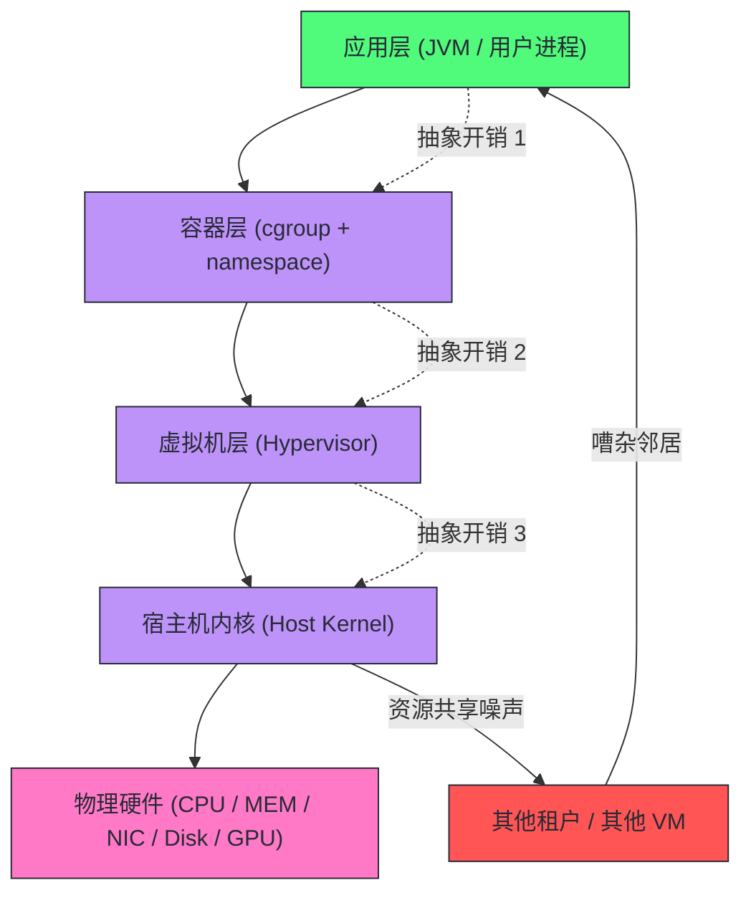
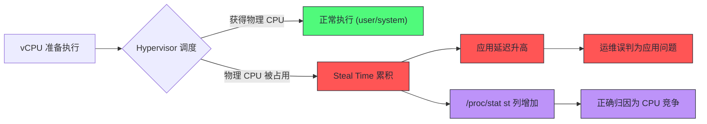
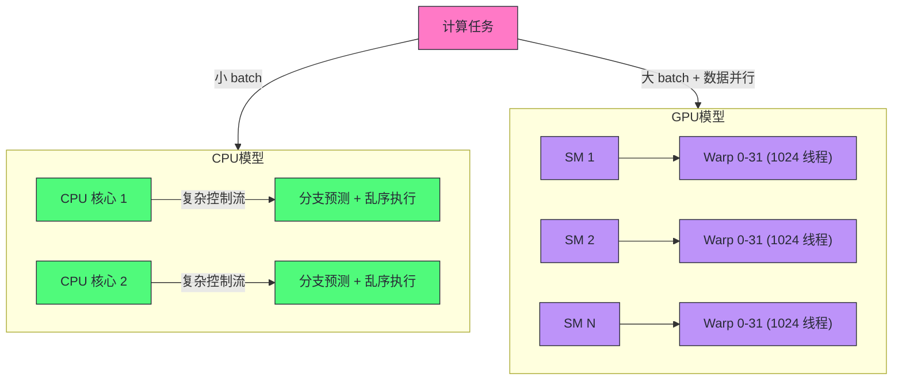
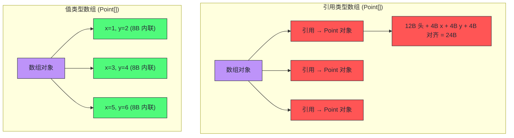
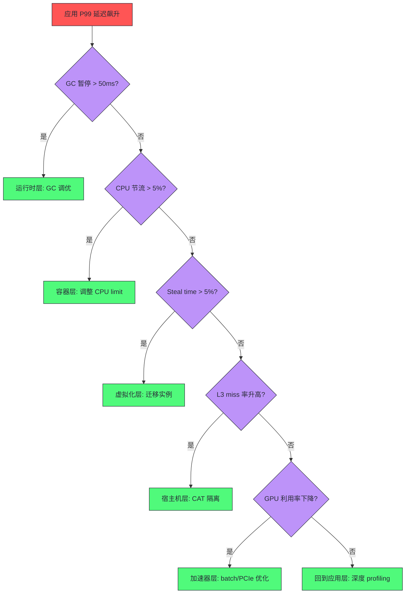

# 13 云环境与异构硬件：性能工程的新边界

> [!abstract] 摘要
> 本文是专栏第六部分"性能工程的新边界"的开篇。当工作负载从一台物理机迁移到云上的虚拟机、容器、再到 GPU/AI 加速器集群时，性能工程师面对的不再是一台参数可控的裸金属服务器，而是一个层层抽象、资源共享、硬件异构的复杂生态。文章从虚拟化引入的开销模型出发，剖析 CPU steal time 的成因与量化方法、嘈杂邻居效应的传播路径与隔离手段；然后深入容器层的 cgroup v1/v2 资源限制机制，讲清 CPU quota、memory limit、blkio 限制在内核侧的真实语义与常见陷阱；接着把视角拉到异构硬件层，分析 GPU/AI 加速器对 JVM 生态的冲击，以及 Project Valhalla 值类型如何从语言层面重塑 JVM 的内存密度与缓存利用率。核心认知：云时代的性能工程，本质是在"抽象层叠加"和"资源共享"两个维度上重新建立可观测性与可预测性；异构硬件不是 CPU 的简单替代，而是要求编程模型、运行时、编译器协同演进的全栈问题。

---

## 第 1 章 从裸金属到云：性能工程的前提变了

### 1.1 裸金属时代的性能模型

在传统的裸金属（Bare Metal）服务器上，性能工程师拥有一个相对简单的心智模型：CPU 型号固定、内存带宽固定、磁盘 IOPS 固定、网络拓扑固定。所有性能分析工具——`perf`、`sar`、`fio`、`iperf`——测出来的数字都可以直接对应到物理硬件的规格说明书上。如果一台机器的 `iostat` 显示磁盘平均等待时间是 10ms，那就是磁盘本身的 10ms，不存在"隔壁租户的写入把你的队列堵了"这种事。

裸金属时代的性能调优，核心是理解硬件架构本身：CPU 缓存层级、NUMA 拓扑、内存带宽、磁盘调度器、网卡中断分发。Brendan Gregg 在《Systems Performance》第一版中提出的 USE 方法（Utilization、Saturation、Errors）就是为这个时代设计的——对每个物理资源，检查它的使用率、饱和度和错误。

### 1.2 云时代的新变量：抽象层与共享

云计算引入了两个根本性变化，它们彻底改变了性能工程的前提条件：

**第一个变化：抽象层叠加。** 你的应用不再直接运行在硬件上，而是运行在虚拟机监控器（Hypervisor/VMM）提供的虚拟硬件上，或者更进一步，运行在容器运行时（Container Runtime）提供的命名空间隔离环境中。每一层抽象都会引入额外的开销——CPU 虚拟化开销、内存影子页表开销、网络虚拟交换机开销、存储虚拟化开销。这些开销不是恒定的，而是随工作负载特征动态变化的。

**第二个变化：资源共享。** 云的本质是资源池化与多租户共享。你购买的"4 核 8G"实例，其物理 CPU 核心很可能与另外几个租户共享同一颗物理核心的超线程。你的虚拟磁盘的 IOPS 会被同一台物理宿主机上其他虚拟机的 I/O 竞争所稀释。这就是"嘈杂邻居"（Noisy Neighbor）效应的根源。

> [!info] 核心认知：云性能工程的两条主线
> 云时代的性能工程，所有问题都可以归到两条主线上：
> - **抽象层开销**：虚拟化、容器化引入的额外 CPU/内存/IO 开销，需要量化并纳入容量规划
> - **资源共享噪声**：多租户环境下的资源竞争导致的性能波动，需要可观测性手段识别并隔离

这两条主线贯穿了本文的全部内容。虚拟化开销和 CPU steal time 属于第一条主线，嘈杂邻居属于第二条主线，cgroup 资源限制是容器时代对第二条主线的工程回应，而异构硬件和 Valhalla 值类型则代表了性能工程正在向新的维度扩展。



### 1.3 为什么传统性能工具会"失明"

云环境带来的一个直接挑战是：传统的性能观测工具会部分"失明"。在裸金属上，`/proc/stat` 报告的 CPU 时间就是真实的 CPU 时间。但在虚拟机内部，`/proc/stat` 报告的是虚拟机视角的 CPU 时间——它无法看到自己被 hypervisor "偷走"了多少 CPU 时间（steal time），也无法看到宿主机上其他虚拟机对 L3 缓存的污染。

这就是为什么云环境的性能工程需要新的观测维度。Linux 内核在 `/proc/stat` 中增加了 `steal`（`st`）列来报告 steal time，在 `/sys/fs/cgroup/` 下暴露了容器级别的资源使用统计，在 `perf` 中增加了对虚拟化事件的追踪能力。这些工具的演进，本质上是在弥补抽象层带来的"可观测性损失"。

> [!warning] 生产避坑：不要在虚拟机内用裸金属的基准测试结果做容量规划
> 一个常见错误是在云虚拟机上跑 `sysbench`、`fio` 等基准测试，然后把结果当作该实例类型的"性能规格"来指导容量规划。云实例的性能受宿主机负载影响极大，同一型号的实例在不同时间、不同可用区、不同宿主机上的性能可能相差 2-5 倍。正确的做法是持续监控生产负载下的性能指标，用统计分布（P50/P95/P99）而非单点测量来描述性能特征。

---

## 第 2 章 虚拟化开销：看不见的税

### 2.1 什么是虚拟化开销

虚拟化开销（Virtualization Overhead）是指由于在物理硬件和客户机（Guest）之间插入了一层 Hypervisor 而引入的额外性能损耗。这层损耗体现在四个维度：

| 维度 | 裸金属 | 虚拟机 | 开销来源 |
|------|--------|--------|----------|
| CPU | 直接执行指令 | 通过硬件虚拟化扩展执行 | VM-Exit/VM-Entry 上下文切换、指令模拟 |
| 内存 | 直接访问物理页 | 通过影子页表（Shadow Page Table）或 EPT/NPT 访问 | 额外一级地址翻译、TLB miss 放大 |
| 网络 | 直接访问网卡 | 通过虚拟交换机（vSwitch）转发 | 额外的包处理路径、内存拷贝 |
| 存储 | 直接访问块设备 | 通过 virtio 或模拟设备访问 | I/O 队列虚拟化、上下文切换 |

虚拟化开销不是一个小数字。在极端情况下（如高 IOPS 的随机读写、高频网络小包），虚拟化开销可以达到 20%-40%。即使在理想情况下（纯 CPU 计算密集型），也存在 1%-5% 的基线开销。

### 2.2 为什么会出现虚拟化开销

要理解虚拟化开销的根源，需要回到 CPU 虚拟化的基本模型。全虚拟化要求 Guest OS 在不修改的情况下运行在虚拟硬件上，但 x86 架构中存在一批"敏感指令"——它们的行为依赖于 CPU 的特权级或硬件状态，无法在非特权模式下直接执行。

早期的全虚拟化方案（如 VMware 的二进制翻译）会在运行时扫描 Guest 的指令流，将敏感指令替换为等价的翻译代码。这种方式开销极大。2005 年后，Intel 和 AMD 分别引入了硬件虚拟化扩展（Intel VT-x / AMD-V），提供了 `VM-Entry` 和 `VM-Exit` 两种操作模式：

- **VM-Entry**：CPU 从 Host 模式切换到 Guest 模式，加载 Guest 的寄存器状态
- **VM-Exit**：CPU 从 Guest 模式切换回 Host 模式，保存 Guest 的寄存器状态，由 Hypervisor 处理导致 VM-Exit 的事件（如 I/O 指令、中断、异常）

每一次 VM-Exit/VM-Entry 都是一次昂贵的上下文切换，涉及寄存器保存/恢复、TLB 刷新、流水线冲刷。现代 CPU 上一次 VM-Exit 的开销大约在 1000-2000 个时钟周期。如果 Guest 频繁触发 VM-Exit（如高频 I/O、频繁的时钟中断），虚拟化开销就会急剧上升。

> [!note] 设计哲学：为什么硬件虚拟化没有完全消除开销
> Intel VT-x 解决了"敏感指令无法在非特权模式执行"的问题，但没有解决"Guest 和 Host 共享同一颗物理 CPU"的问题。只要 Guest 的执行需要被 Host 监管（如 I/O 需要 Host 转发、内存需要 Host 管理页表），VM-Exit 就不可避免。硬件虚拟化的贡献是把开销从"每条敏感指令一次翻译"降低到"每次需要 Host 介入时一次 VM-Exit"，量级上从 10x 降低到了 1.01x-1.1x，但没有归零。这就是为什么云厂商会强调"计算优化型"实例——它们通过减少 I/O 路径和内存虚拟化开销来逼近裸金属性能。

### 2.3 不做虚拟化会怎样

如果不使用虚拟化，直接在裸金属上运行应用，性能确实是最优的。但云的核心价值——资源池化、弹性伸缩、快速 provisioning——都建立在虚拟化之上。没有虚拟化，就无法实现"按需创建 100 台服务器，用完即毁"的弹性能力。

这就形成了一个根本性的工程权衡：**用虚拟化开销换取资源弹性**。不同的云部署模型在这个权衡空间中选择了不同的点：

| 部署模型 | 虚拟化层级 | 典型开销 | 弹性能力 |
|----------|-----------|----------|----------|
| 裸金属云（如 AWS EC2 Metal） | 无 | 0% | 低（分钟级 provisioning） |
| 传统虚拟机（如 AWS EC2） | Hypervisor (KVM/Xen) | 5%-15% | 中（秒到分钟级） |
| 容器（如 Kubernetes on VM） | Hypervisor + Container | 5%-15% + 容器开销 | 高（秒级） |
| 安全容器（如 AWS Firecracker） | 轻量级 Hypervisor | 2%-5% | 极高（毫秒级） |
| 无服务器（如 AWS Lambda） | 轻量级 Hypervisor + 沙箱 | 5%-10%（含冷启动） | 极高（毫秒级，含冷启动） |

### 2.4 如何量化虚拟化开销

量化虚拟化开销的标准方法是：在相同硬件规格的裸金属和虚拟机上运行同一套基准测试，对比结果差异。但在生产环境中，你通常没有裸金属作为对照组。这时可以借助以下指标间接评估：

**CPU 层面**：关注 `/proc/stat` 中的 `steal`（`st`）列。steal time 是 Guest 被 Hypervisor 调度走、分配给其他 Guest 或 Host 自身任务的 CPU 时间。如果 steal time 持续高于 5%，说明该实例的 CPU 资源被严重挤占。

**内存层面**：关注 Minor Fault 和 Major Fault 的比率。EPT（Extended Page Table）的 TLB miss 会导致比裸金属更多的页表遍历开销。可以通过 `perf stat -e dTLB-loads,dTLB-load-misses` 观察 TLB miss 率。

**网络层面**：对比虚拟机内 `ethtool -S` 报告的统计与 Host 侧的统计。如果虚拟机的包处理延迟显著高于裸金属，说明 vSwitch 引入了额外开销。

**存储层面**：使用 `iostat -x` 观察 `%util` 和 `await`。在虚拟化环境中，`await` 包含了虚拟 I/O 队列的排队时间，通常比裸金属高 0.5-2ms。

### 2.5 边界与反例：什么时候虚拟化开销可以忽略

虚拟化开销并非在所有场景下都显著。以下场景中，虚拟化开销可以忽略不计：

- **CPU 密集型的纯计算任务**：如科学计算、加密运算。这类任务很少触发 VM-Exit，CPU 几乎全部在 Guest 模式下执行，开销接近 0。
- **大块顺序 I/O**：如视频转码的文件读写。大块 I/O 减少了 I/O 操作的频率，摊薄了每次 VM-Exit 的开销。
- **使用 SR-IOV 或 DPDK 的网络密集型任务**：SR-IOV（Single Root I/O Virtualization）允许 Guest 直接访问网卡的物理功能（PF）的虚拟功能（VF），绕过 vSwitch，网络开销接近裸金属。

> [!info] SR-IOV 的本质
> SR-IOV 是 PCIe 规范的扩展，允许一个物理网卡（PF）虚拟出多个虚拟网卡（VF），每个 VF 可以直接分配给一个虚拟机，Guest 通过 VF 直接与硬件交互，绕过 Host 的 vSwitch。这本质上是把网络 I/O 路径从"软件虚拟化"退化为"硬件分区"，用硬件的 PCIe 交换能力替代软件的包转发。代价是 VF 数量有限（通常 32-256 个），且无法使用 vSwitch 的高级功能（如流量镜像、安全组规则）。

---

## 第 3 章 CPU Steal Time：被偷走的 CPU

### 3.1 什么是 CPU Steal Time

CPU Steal Time（窃取时间，简称 steal time）是 Linux 内核在 `/proc/stat` 中报告的一个 CPU 时间类别，表示虚拟机的 vCPU 准备好执行指令，但 Hypervisor 将对应的物理 CPU 时间片调度给了其他虚拟机或 Host 自身任务的时间。

在 `/proc/stat` 中，每个 CPU 行的格式如下：

```
cpu  user nice system idle iowait irq softirq steal guest guest_nice
```

其中 `steal`（缩写为 `st`）就是 steal time。它是一个从 Guest 视角看到的"我想跑但跑不了"的时间。

### 3.2 为什么会出现 Steal Time

Steal time 的出现需要两个前提条件同时满足：

1. **CPU 超售（Oversubscription）**：云厂商在一颗物理 CPU 核心上分配了多个 vCPU。例如，一颗 8 核物理 CPU 上分配了 16 个 vCPU，超售比为 2:1。
2. **多个 vCPU 同时活跃**：当多个共享同一物理核心的 vCPU 同时有计算需求时，Hypervisor 的调度器必须决定谁先跑。被推迟的 vCPU 就会累积 steal time。

CPU 超售是云厂商提高资源利用率、降低价格的核心手段。如果严格 1:1 绑定 vCPU 和物理核心，虚拟机的 CPU 性能可以完全等同于裸金属，但云厂商的资源利用率会大幅下降（多数应用的 CPU 利用率长期低于 20%），导致成本无法分摊。因此，几乎所有主流云厂商都采用不同程度的 CPU 超售策略，区别只在于超售比例和调度策略。

> [!note] 设计哲学：超售的可行性基础
> CPU 超售之所以可行，是因为一个统计学事实：大量独立工作负载的 CPU 使用率在时间维度上很少同时达到峰值。如果 10 个虚拟机的 CPU 使用率独立且平均为 20%，那么它们同时超过 80% 的概率极低。这类似于银行的排队模型——银行不会为每个客户窗口配备一个柜员，因为客户到达是随机的、独立的。但这个模型在"所有客户同时到达"时会崩溃——比如双十一零点，所有服务同时打满 CPU，超售就变成了灾难。

### 3.3 不报告 Steal Time 会怎样

如果内核不报告 steal time，虚拟机内的应用会观察到一种诡异的现象：CPU 使用率看起来不高（`idle` 还有很多），但应用的响应延迟却莫名其妙地升高了。这是因为应用等待 CPU 的时间被计入了 `idle` 而非 `steal`，让运维人员误以为"CPU 还有余量，问题不在这里"。

在 steal time 被引入 Linux 内核（2.6.11，2005 年）之前，这种"幽灵延迟"是云上性能排查的常见噩梦。运维人员看到 `top` 显示 CPU idle 80%，但应用 P99 延迟却飙到了 500ms，完全找不到原因。steal time 的报告机制让这种"被偷走的 CPU 时间"变得可见，是云性能可观测性的一个里程碑。

### 3.4 如何监控与诊断 Steal Time

**基础监控**：使用 `top` 或 `vmstat` 查看 steal time。

```bash
# top 中的 steal time 显示为 %st 列
top -bn1 | head -5

# vmstat 中的 steal time 显示为 st 列
vmstat 1 5
```

如果 `%st` 持续高于 5%，就需要关注；高于 10% 则属于严重问题。

**精细化分析**：使用 `sar` 记录历史 steal time，识别时间模式。

```bash
# 查看今天的 CPU 使用情况（含 steal）
sar -u

# 查看 steal time 的历史趋势
sar -u -f /var/log/sa/sa20
```

如果 steal time 在固定时间段飙升（如每天 14:00-15:00），说明邻居租户有定时任务；如果随机飙升，说明宿主机负载不稳定。

**关联应用延迟**：将 steal time 与应用的 P99 延迟关联分析。如果两者高度相关，说明延迟问题的根因是 CPU 被窃取，而非应用本身的代码问题。



### 3.5 应对 Steal Time 的工程手段

当确认 steal time 是性能瓶颈后，有以下几条应对路径：

**手段一：迁移实例**。最直接的方法是将虚拟机迁移到负载更低的宿主机。多数云厂商提供"实例迁移"功能，可以在不停机的情况下将 VM 迁移到另一台宿主机。这是治标不治本的方法——新宿主机也可能出现嘈杂邻居。

**手段二：使用独占型实例**。如 AWS 的 Dedicated Host、阿里云的专有宿主机。这些实例保证物理核心不与其他租户共享，steal time 恒为 0。代价是价格更高、弹性更差。

**手段三：使用 CPU 绑定型实例**。如 AWS 的 c5.metal、阿里云的 ecs.ebmgn7e。这些实例提供裸金属级别的 CPU 隔离，同时保留云的弹性能力。

**手段四：应用层自适应**。在应用层实现自适应降级——当检测到 steal time 升高时，自动降低并发度、启用缓存、推迟非关键任务。这是一种"与噪声共存"的策略，适用于对延迟不极端敏感的场景。

> [!warning] 生产避坑：steal time 不等于 CPU 不足
> 一个常见误判是看到 steal time 高就给应用加 CPU。如果应用本身是 I/O 密集型的，加 CPU 并不能解决问题——steal time 高是因为宿主机拥挤，而不是因为应用的 vCPU 不够。正确的做法是先确认应用的 CPU 瓶颈类型：如果是计算密集型且 steal time 高，迁移实例；如果是 I/O 密集型且 steal time 高，优化 I/O 路径（如使用本地 NVMe 替代网络存储）可能更有效。

### 3.6 边界与反例

Steal time 并非在所有虚拟化技术中都存在。以下场景中 steal time 恒为 0：

- **裸金属服务器**：没有 Hypervisor，不存在 CPU 竞争
- **CPU 绑定的虚拟机**：vCPU 严格 1:1 绑定物理核心，Hypervisor 不会调度其他 Guest 到该核心
- **容器（非虚拟机）**：容器共享宿主机内核，CPU 竞争通过 cgroup 体现为 `nr_throttled`（节流次数），而非 steal time

需要注意的是，容器虽然没有 steal time，但存在等价的机制——cgroup CPU quota 节流。当一个容器设置了 CPU quota 且超过限额时，内核会强制该容器等待，这种等待在 `/proc/stat` 中体现为 `idle` 而非 `steal`。这就是为什么容器环境下的 CPU 资源竞争需要通过 cgroup 统计来观测，而非 `/proc/stat`。

---

## 第 4 章 嘈杂邻居：共享基础设施的诅咒

### 4.1 什么是嘈杂邻居效应

嘈杂邻居效应（Noisy Neighbor Effect）是指在共享基础设施上，一个租户（或容器、虚拟机）的资源消耗行为对其他租户的性能产生了负面影响。这种影响可以体现在任何共享资源上：CPU、内存带宽、L3 缓存、网络带宽、磁盘 IOPS、存储队列深度。

嘈杂邻居与 steal time 的关系是：steal time 是嘈杂邻居在 CPU 资源上的具体表现之一，但嘈杂邻居的范围远不止 CPU。一个不消耗多少 CPU 但疯狂写入磁盘的邻居，可以拖慢你的磁盘读取延迟；一个疯狂消耗内存带宽的邻居，可以降低你的内存访问速度。

### 4.2 为什么会出现嘈杂邻居

嘈杂邻居的根源是资源共享。在云环境中，以下资源都是共享的：

| 共享资源 | 共享粒度 | 嘈杂邻居表现 | 可隔离性 |
|----------|----------|-------------|----------|
| CPU 核心 | 物理核心 / 超线程 | steal time、调度延迟 | 中（CPU pinning） |
| L3 缓存 | 物理核心共享 | 缓存命中率下降、LLC miss 升高 | 低（CAT 技术） |
| 内存带宽 | NUMA 节点共享 | 内存访问延迟升高 | 低（MBA 技术） |
| 网络带宽 | 宿主机网卡共享 | 网络吞吐下降、延迟抖动 | 中（流量整形） |
| 磁盘 IOPS | 存储后端共享 | I/O 延迟升高、队列饱和 | 中（QoS 限速） |
| 磁盘队列 | 宿主机块设备共享 | I/O 等待时间升高 | 低 |

其中，L3 缓存和内存带宽是最难隔离的。现代 CPU 的 L3 缓存通常是所有核心共享的（Intel 的 L3 缓存通常为 20-50MB，由所有核心共享）。当一个邻居租户的工作集（Working Set）大于 L3 缓存容量时，它会不断把其他租户的热数据挤出 L3 缓存，导致所有人的 LLC（Last Level Cache）miss 率升高。

### 4.3 不处理嘈杂邻居会怎样

如果不处理嘈杂邻居效应，最直接的后果是性能不可预测。同一个应用、同一份代码、同一份配置，在云上的性能可能在不同时间相差 3-10 倍。这种不可预测性对以下场景是致命的：

- **SLA 敏感型服务**：如在线交易的支付接口，P99 延迟要求 < 100ms。如果嘈杂邻居导致 P99 偶尔飙到 500ms，就会触发 SLA 违约。
- **实时数据处理**：如流处理引擎的 checkpoint 操作，如果 I/O 延迟被嘈杂邻居拖慢，可能导致 checkpoint 超时、作业失败。
- **基准测试与容量规划**：嘈杂邻居导致基准测试结果不可复现，容量规划失去依据。

更隐蔽的后果是"性能抖动归因困难"。当 P99 延迟偶尔飙升时，运维团队会去查应用日志、GC 日志、慢查询日志，但往往找不到原因——因为根因在宿主机层面，虚拟机内的日志根本看不到邻居的行为。这会导致大量时间浪费在错误的排查方向上。

### 4.4 如何识别与隔离嘈杂邻居

**识别 CPU 嘈杂邻居**：通过 steal time 监控（见第 3 章）。如果 steal time 与应用延迟高度相关，基本可以确认是 CPU 嘈杂邻居。

**识别 L3 缓存嘈杂邻居**：使用 `perf` 监控 LLC miss 率。

```bash
# 监控 LLC miss 率
perf stat -e LLC-loads,LLC-load-misses,LLC-stores,LLC-store-misses -p <pid>
```

如果 LLC miss 率异常升高（如从 5% 升到 20%），且应用的工作集远小于 L3 缓存容量，则很可能是邻居在污染 L3 缓存。

**识别网络嘈杂邻居**：对比虚拟机内 `ethtool -S` 的网络统计与实例规格声明的带宽。如果实际带宽远低于规格，说明宿主机网络被邻居挤占。

**识别磁盘嘈杂邻居**：监控 `iostat` 的 `await` 和 `%util`。如果 `await` 在无大量 I/O 的情况下异常升高，说明存储后端被邻居的 I/O 挤占。

**隔离手段**：

1. **CPU 隔离**：使用 CPU pinning（vCPU 绑定物理核心）+ 独占型实例
2. **L3 缓存隔离**：使用 Intel CAT（Cache Allocation Technology），将 L3 缓存按 CBM（Capacity Bit Mask）分区分配给不同 VM
3. **内存带宽隔离**：使用 Intel MBA（Memory Bandwidth Allocation），限制每个 VM 的内存带宽
4. **网络隔离**：使用 SR-IOV 绕过 vSwitch，或使用流量整形（TC + HTB）限制每个 VM 的带宽
5. **存储隔离**：使用存储 QoS（如 cgroup v2 的 io 控制器）限制每个 VM 的 IOPS 和带宽

> [!info] Intel CAT 与 MBA：硬件级资源隔离
> CAT（Cache Allocation Technology）是 Intel 在 Skylake-SP 及之后处理器上引入的 L3 缓存分区技术。它允许将 L3 缓存按"路"（Way）划分，每个 VM 或容器可以独占一部分缓存路，互不干扰。MBA（Memory Bandwidth Allocation）则是内存带宽的限速机制。这两项技术是硬件层面对嘈杂邻居问题的直接回应，但它们需要 Hypervisor 和 OS 的支持，且粒度较粗（CAT 的最小分配粒度通常是 L3 缓存总容量的 1/11 到 1/20）。

### 4.5 边界与反例

嘈杂邻居效应在某些场景下可以忽略：

- **独占型实例**：物理资源不共享，不存在嘈杂邻居
- **计算密集型且 CPU 绑定的工作负载**：如果 vCPU 严格绑定物理核心且不超售，CPU 层面的嘈杂邻居可以消除
- **使用本地存储而非网络存储**：本地 NVMe 磁盘不与其他 VM 共享 IOPS，存储层面的嘈杂邻居可以消除

但 L3 缓存和内存带宽的嘈杂邻居在多数虚拟化环境中仍然存在，因为 CAT 和 MBA 的部署率远低于 CPU pinning。这意味着即使你购买了"计算优化型"实例，L3 缓存污染仍然可能发生。

---

## 第 5 章 容器 cgroup：资源限制的内核机制

### 5.1 什么是 cgroup

cgroup（Control Group）是 Linux 内核提供的资源限制、优先级分配和资源统计机制。它允许管理员将一组进程组织成一个控制组，并对该组施加 CPU、内存、I/O 等资源的限制。容器技术（Docker、Kubernetes）的资源限制功能，底层全部依赖 cgroup。

cgroup 有两个版本：v1 和 v2。v1 在 Linux 2.6.24（2008 年）引入，每个资源控制器（CPU、memory、blkio 等）有独立的层级结构。v2 在 Linux 4.5（2016 年）引入，统一了所有控制器到单一层级结构，简化了管理并修复了 v1 的多个设计缺陷。

### 5.2 为什么需要 cgroup

在没有 cgroup 的时代，一台 Linux 服务器上运行多个应用时，资源分配完全依赖进程的 nice 值和 OOM killer。nice 值只能影响 CPU 调度优先级，无法限制绝对 CPU 用量；OOM killer 在内存耗尽时按 oom_score 杀进程，无法预防某个进程吃光内存。

这种"无限制"的模型在容器时代完全不可用。Kubernetes 的核心承诺是"将 N 个容器调度到同一台节点上，每个容器按声明使用资源"。如果没有 cgroup，一个失控的容器可以吃光整台节点的 CPU 和内存，导致所有容器一起崩溃。

cgroup 的出现让"资源隔离"成为内核级别的原语。你可以声明"这个容器最多用 2 核 CPU、4GB 内存、1000 IOPS"，内核会强制执行这些限制，即使容器内的进程试图突破限制。

### 5.3 不用 cgroup 会怎样

不用 cgroup 的后果可以用一个真实场景说明：在 Kubernetes 集群中，如果某个 Pod 没有设置 resource limits，且该 Pod 中的应用存在内存泄漏，那么这个 Pod 会持续消耗节点内存，直到触发节点级别的 OOM。OOM killer 可能杀掉节点上的任何进程——包括 kubelet、其他关键 Pod——导致整个节点崩溃。

这就是为什么 Kubernetes 强制要求所有生产 Pod 都设置 resource requests 和 limits。requests 用于调度决策（决定 Pod 被调度到哪个节点），limits 用于运行时限制（cgroup 强制执行）。

### 5.4 cgroup CPU 限制：quota 与 period 的真实语义

cgroup v1 的 CPU 限制通过 `cpu.cfs_quota_us` 和 `cpu.cfs_period_us` 两个参数实现。CFS（Completely Fair Scheduler）是 Linux 的默认 CPU 调度器。

- **`cpu.cfs_period_us`**：调度周期，默认 100000（100ms）。表示在这个时间窗口内，cgroup 中的进程可以使用的 CPU 时间上限由 `cpu.cfs_quota_us` 决定。
- **`cpu.cfs_quota_us`**：时间配额。设为 200000 表示在每 100ms 的周期内，该 cgroup 中的进程总共可以使用 200ms 的 CPU 时间——即 2 个核的算力。

当 cgroup 中的进程在一个周期内用完了配额，CFS 会强制这些进程进入节流（throttle）状态，直到下一个周期开始。节流期间进程无法运行，表现为"CPU 空闲但应用卡顿"。

```bash
# 查看 cgroup v1 的 CPU 节流统计
cat /sys/fs/cgroup/cpu/<container_id>/cpu.stat
# 输出示例：
# nr_periods 1000
# nr_throttled 150
# throttled_time 50000000
```

`nr_throttled` 表示发生节流的周期数。如果 `nr_throttled / nr_periods` 的比率高于 5%，说明容器的 CPU 配额不足，应用正在被频繁节流。

> [!warning] 生产避坑：CPU limit 过低导致的节流抖动
> Kubernetes 中一个常见陷阱是设置过低的 CPU limit（如 100m = 0.1 核）。对于 Java 应用来说，这尤其危险：JVM 的 JIT 编译、GC、类加载等内部线程都需要 CPU 时间。如果 CPU limit 过低，这些内部线程会与应用线程争抢配额，导致应用线程被节流、GC 被节流（从而引发更长的 GC 暂停）、JIT 编译被节流（从而长期运行在解释模式）。建议 Java 应用的 CPU limit 不低于 1 核（1000m），且 requests 与 limits 尽量接近，避免调度时的"超售"。

### 5.5 cgroup 内存限制：OOM 与内存统计的陷阱

cgroup 的内存限制通过 `memory.limit_in_bytes`（v1）或 `memory.max`（v2）实现。当 cgroup 中的进程尝试分配超过限制的内存时，内核会触发 cgroup 级别的 OOM killer，杀掉该 cgroup 中 oom_score 最高的进程。

容器内存限制的核心陷阱在于"什么算作容器使用的内存"。cgroup v1 的 `memory.usage_in_bytes` 包含以下部分：

- 进程的 RSS（Resident Set Size）：用户态分配的匿名页
- 页缓存（Page Cache）：文件 I/O 产生的缓存页
- Swap 页（如果允许 swap）
- 内核 slab 缓存的一部分

这意味着一个 Java 应用即使堆内存远低于 limit，也可能因为页缓存占用过多而触发 OOM。具体来说，当应用读取大量文件时，Linux 会把文件内容缓存到页缓存中，这些页缓存被计入 cgroup 的内存使用。如果 `memory.limit_in_bytes` 设为 4GB，堆用了 3GB，页缓存用了 1.5GB，总计 4.5GB 超过限制，就会触发 OOM——即使堆本身还有 1GB 的余量。

> [!note] 设计哲学：为什么页缓存计入 cgroup 内存
> 页缓存计入 cgroup 内存是一个有争议的设计决策。支持者的理由是：页缓存是为了加速该 cgroup 中进程的 I/O 而分配的，理应由该 cgroup 承担。反对者的理由是：页缓存可以被内核随时回收（不像匿名页那样必须保留），把它计入限制会导致"可回收内存"挤占"不可回收内存"的配额。cgroup v2 对此做了改进：`memory.current` 仍然包含页缓存，但可以通过 `memory.swap.max` 单独限制 swap 使用量，且 v2 的 OOM kill 逻辑更倾向于先回收页缓存再触发 OOM。

### 5.6 cgroup v1 与 v2 的关键差异

cgroup v2 是对 v1 的全面重构，解决了 v1 的多个设计缺陷：

| 维度 | cgroup v1 | cgroup v2 |
|------|-----------|-----------|
| 层级结构 | 每个控制器独立层级 | 统一层级（Unified Hierarchy） |
| CPU 控制 | `cpu.cfs_quota_us` + `cpu.cfs_period_us` | `cpu.max`（格式：`quota period`） |
| 内存控制 | `memory.limit_in_bytes` | `memory.max` + `memory.high` |
| I/O 控制 | `blkio.*`（仅限块设备） | `io.*`（支持 cgroup 级别 IOPS 限速） |
| PSI | 不支持 | 支持（Pressure Stall Information） |
| 嵌套 | 复杂、易错 | 原生支持 |
| 跨控制器一致性 | 不保证（各控制器独立） | 保证（统一层级） |

cgroup v2 引入的 PSI（Pressure Stall Information）是容器性能观测的重要工具。它报告 CPU、内存、I/O 三种资源的"压力停顿"时间——即因为资源不足导致进程等待的时间。

```bash
# 查看 cgroup v2 的 PSI
cat /proc/pressure/cpu
cat /proc/pressure/memory
cat /proc/pressure/io

# 输出示例（memory）：
# some avg10=1.50 avg60=0.80 avg300=0.40 total=12345678
# full avg10=0.50 avg60=0.20 avg300=0.10 total=6789012
```

`some` 表示至少一个进程因资源不足而等待的时间占比；`full` 表示所有进程都在等待的时间占比。`avg10/avg60/avg300` 分别是 10 秒、60 秒、300 秒的滑动平均。PSI 提供了比 steal time 更通用的资源压力观测能力——它不依赖虚拟化环境，在裸金属上同样有效。

### 5.7 边界与反例：cgroup 不是万能隔离

cgroup 提供的是"用量限制"，而非"性能隔离"。一个设置了 2 核 CPU limit 的容器，它的 2 核仍然与同一节点上其他容器共享 L3 缓存、内存带宽、网络带宽。cgroup 无法限制一个容器对 L3 缓存的污染——这是 CAT 的工作。

此外，cgroup 的 CPU 限制是"时间维度"的，而非"频率维度"的。`cpu.cfs_quota_us=200000` 限制的是"每 100ms 最多用 200ms CPU 时间"，但不限制这 200ms 是在 2 个核上并行还是 1 个核上串行。这意味着即使配额充足，容器的 CPU 性能仍然受宿主机调度策略影响。

> [!info] CPU Manager Static 策略
> Kubernetes 的 CPU Manager 提供了 `static` 策略，可以将满足条件的容器（requests=limits 且为整数核）绑定到独占的物理核心上，其他容器不会调度到这些核心。这本质上是 cgroup cpuset + CPU pinning 的组合，可以在容器层面实现接近裸金属的 CPU 隔离。代价是节点上的可调度容器数量减少（因为绑定的核心不再共享）。

---

## 第 6 章 异构硬件：GPU 与 AI 加速器的性能模型

### 6.1 什么是异构硬件

异构硬件（Heterogeneous Hardware）是指在传统 CPU 之外，引入了专门为特定计算模式优化的加速器——GPU（Graphics Processing Unit）、TPU（Tensor Processing Unit）、FPGA、NPU（Neural Processing Unit）等。这些加速器与 CPU 在架构上有根本性差异：CPU 为低延迟优化（复杂的分支预测、深流水线、大缓存），加速器为高吞吐优化（大量简单核心、浅流水线、小缓存、高并行度）。

异构计算的核心思想是：用 CPU 执行控制密集型逻辑（分支、调度、I/O），用加速器执行数据并行型计算（矩阵乘、卷积、向量运算），两者通过 PCIe 或 NVLink 等互连总线协作。

### 6.2 为什么需要异构硬件

传统 CPU 的性能增长在 2005 年前后遇到了功耗墙（Power Wall）和频率墙（Frequency Wall），单核性能不再通过提升主频来增长，而是通过增加核心数来提升并行度。但 CPU 核心的设计目标是通用性——它需要高效执行各种类型的指令（整数、浮点、分支、字符串、加密），这导致每个核心的面积大、功耗高，但浮点计算吞吐相对有限。

以矩阵乘法（深度学习的核心运算）为例，一颗 64 核的服务器 CPU 的 FP32 理论算力大约在 2-3 TFLOPS，而一颗 NVIDIA A100 GPU 的 FP32 理论算力为 19.5 TFLOPS，差距近 10 倍。如果使用 Tensor Core 的 TF32 精度，A100 可以达到 156 TFLOPS，差距扩大到 50 倍以上。

这种差距的根源是架构设计的取舍。CPU 的每个核心需要处理复杂的控制流（分支预测、乱序执行、推测执行），芯片面积大量用于缓存和控制逻辑，计算单元占比相对较低。GPU 则把芯片面积几乎全部用于计算单元，控制逻辑极简（多个核心共享一个前端），通过大量线程的并行来隐藏内存延迟。

> [!note] 设计哲学：延迟 vs 吞吐的架构分野
> CPU 和 GPU 的差异本质上是"延迟优化"和"吞吐优化"的架构分野。CPU 用大量晶体管实现分支预测、乱序执行、大缓存，目的是让单条指令的执行延迟尽可能低。GPU 用大量晶体管实现并行计算单元，目的是让单位时间内执行的指令总量尽可能高。这就像快递配送：CPU 是跑车——快但运量小；GPU 是火车——慢但运量大。当你的货物（计算任务）足够多时，火车的总运力远超跑车。

### 6.3 不使用异构硬件会怎样

如果不使用异构硬件，仅靠 CPU 来执行 AI 推理和训练，后果是：

- **训练成本爆炸**：一个千亿参数的大模型，用 64 核 CPU 训练需要数月甚至数年，而用 8 卡 A100 GPU 集群可以在数周内完成。成本差异可达 100 倍以上。
- **推理延迟不可接受**：CPU 执行一个 BERT 模型的推理可能需要数百毫秒，而 GPU 可以在几毫秒内完成。对于在线服务，这种延迟差异决定了产品是否可用。
- **能耗效率极低**：CPU 的 FP32 算力功耗比大约在 10-50 GFLOPS/W，GPU 可以达到 100-300 GFLOPS/W。在大规模推理场景下，能耗成本差异巨大。

### 6.4 GPU 性能模型：理解吞吐与延迟的平衡

要为 GPU 做性能工程，需要理解 GPU 的执行模型。GPU 采用 SIMT（Single Instruction, Multiple Threads）执行模型——一条指令同时被多个线程执行，这些线程被组织成"线程束"（Warp，NVIDIA 术语）或"波前"（Wavefront，AMD 术语）。NVIDIA GPU 的 Warp 大小为 32，AMD GPU 的 Wavefront 大小为 64。

GPU 性能优化的核心是"让足够多的线程同时运行来隐藏内存延迟"。GPU 的每个核心（SM，Streaming Multiprocessor）可以同时驻留数千个线程，当一个 Warp 因为等待内存而停顿时，调度器会立即切换到另一个就绪的 Warp 执行。这种"零开销切换"是 GPU 高吞吐的秘诀——它不需要像 CPU 那样做复杂的乱序执行和缓存预取，而是用海量并行来"淹没"延迟。

但这带来一个性能工程挑战：如果你的计算任务无法产生足够的并行线程（即"并行度不足"），GPU 的计算单元就会闲置，性能急剧下降。这就是为什么 GPU 适合大 batch size 的推理——batch size 越大，可以组织的 Warp 越多，计算单元利用率越高。



### 6.5 GPU 在 JVM 生态中的落地

Java 生态使用 GPU 的传统路径是 JNI——通过 JNI 调用 CUDA 或 OpenCL 的 native 库。这种方式可行但开发成本高：开发者需要同时掌握 Java 和 CUDA 编程模型，手动管理 GPU 内存（cudaMalloc/cudaMemcpy），处理 JNI 的数据拷贝开销。

近年来出现了多个简化 Java GPU 编程的框架：

| 框架 | 方式 | 适用场景 | 优势 | 劣势 |
|------|------|----------|------|------|
| JCuda | JNI 绑定 CUDA | 通用 GPU 计算 | 接近原生 CUDA 性能 | 开发复杂、需手写 kernel |
| TornadoVM | 自动编译 Java 到 GPU | 数据并行计算 | 自动优化、无需手写 CUDA | 限于特定模式、成熟度有限 |
| DJL (Deep Java Library) | 高级 API 封装 | 深度学习推理 | 支持多后端（MXNet/PyTorch） | 训练能力有限 |
| GraalVM | AOT + GPU 编译 | 多语言 GPU 计算 | 统一运行时 | 生态尚在发展 |

> [!warning] 生产避坑：GPU 推理的 PCIe 带宽瓶颈
> 在 GPU 推理场景中，一个容易被忽视的瓶颈是 CPU 与 GPU 之间的 PCIe 带宽。每次推理需要将输入数据从 CPU 内存拷贝到 GPU 显存，推理完成后再将结果拷贝回来。PCIe 4.0 x16 的理论带宽为 32 GB/s，实际可用约 25 GB/s。如果每次推理的输入数据为 100MB，则数据拷贝就需要 4ms——对于延迟敏感的在线推理，这个开销可能占总延迟的 50% 以上。优化手段包括：使用小 batch size + 流式推理、将预处理也放到 GPU 上执行、使用 GPU 持久化的模型缓存避免重复传输。

### 6.6 边界与反例：GPU 不是万能加速器

GPU 在以下场景中不仅无法加速，反而可能比 CPU 更慢：

- **控制流密集型任务**：如树遍历、图算法、分支密集的逻辑。GPU 的 SIMT 模型在遇到分支分歧（Warp 内不同线程走不同分支）时，会串行执行所有分支路径，导致性能急剧下降。
- **小数据量计算**：当计算量不足以填满 GPU 的并行计算单元时，GPU 的性能优势无法发挥，而数据拷贝开销反而成为瓶颈。一个经验法则是：如果计算量少于 10000 个元素，GPU 通常不如 CPU。
- **需要精确数值精度的场景**：GPU 的浮点运算在某些情况下精度不如 CPU（如 GPU 的原子操作不保证全局顺序）。对于金融计算等对精度要求极高的场景，需要谨慎验证。
- **频繁的 CPU-GPU 同步**：如果计算流程需要频繁在 CPU 和 GPU 之间切换（如每步计算都需要 CPU 做决策），同步开销会抵消 GPU 的并行优势。

---

## 第 7 章 Project Valhalla：值类型与 JVM 内存密度革命

### 7.1 什么是 Project Valhalla

Project Valhalla 是 OpenJDK 社区的长期孵化项目，其核心目标是引入**值类型（Value Types）**到 Java 语言和 JVM 中。值类型是一种介于基本类型（primitive）和引用类型（reference）之间的新类型——它像对象一样有字段和方法，但像基本类型一样没有身份（identity）且按值传递。

Valhalla 的设计口号是"Codes like a class, works like an int"——写起来像类，用起来像 int。这意味着开发者可以用面向对象的方式封装数据（如 Point、ComplexNumber、Matrix），但运行时这些类型的实例不再在堆上分配、不再有对象头、不再需要 GC 回收，而是像 int 和 double 一样直接存储在寄存器、栈或数组中。

### 7.2 为什么需要值类型

Java 当前类型系统的根本问题在于"对象太重"。每个 Java 对象在 64 位 JVM 上至少占用 16 字节（12 字节对象头 + 4 字节对齐），即使它只封装了一个 int 字段：

```
// 一个 Point 对象的内存布局（64 位 JVM，开启压缩指针）
[ 12 字节对象头 ] [ 4 字节 x (int) ] [ 4 字节 y (int) ] [ 4 字节对齐 ]
= 24 字节，其中 50% 是开销
```

当你创建一个 `Point[]` 数组时，情况更糟。数组本身是一个对象（16 字节头部 + 4 字节 length），但数组中存储的是指向 Point 对象的引用（每个引用 4 或 8 字节），每个 Point 对象又各自在堆上分配。一个长度为 1000 的 `Point[]` 数组，实际内存占用可能是：

```
数组对象: 16 + 4 + 1000 * 4 (引用) = 4020 字节
1000 个 Point 对象: 1000 * 24 = 24000 字节
总计: 28020 字节
```

而如果 Point 是值类型，同样 1000 个 Point 的数组可以紧凑存储为：

```
数组对象: 16 + 4 + 1000 * 8 (两个 int 直接内联) = 8020 字节
总计: 8020 字节 (节省 71%)
```

这种"对象头开销 + 引用间接寻址 + 堆分配"的模型，在以下场景中造成了严重的性能问题：

- **科学计算**：矩阵、向量运算涉及大量小对象，对象头和堆分配开销远超计算本身
- **游戏开发**：每帧需要创建大量 Vector3、Quaternion 等小对象，GC 压力巨大
- **大数据处理**：列式存储中的每行数据如果用对象表示，内存利用率极低
- **缓存利用率**：对象在堆中分散分配，CPU 缓存命中率低

> [!info] 核心概念：内存密度与缓存友好的关系
> 值类型带来的不仅是内存节省，更重要的是缓存利用率的提升。现代 CPU 的 L1 缓存行大小为 64 字节。在引用类型模型中，一个缓存行可能只装下 2-3 个 Point 对象（因为每个对象 24 字节，且引用需要额外一次间接寻址）。在值类型模型中，一个缓存行可以装下 8 个 Point 对象（每个 8 字节，紧凑排列）。这意味着遍历 Point 数组时，值类型的缓存命中率可以是引用类型的 3-4 倍，直接反映为 3-4 倍的遍历性能提升。

### 7.3 不引入值类型会怎样

如果不引入值类型，Java 在以下领域将逐渐失去竞争力：

- **AI/ML 计算**：Python + NumPy/PyTorch 通过 C 扩展实现了紧凑的数值数组存储，Java 的对象模型在此场景下内存效率低下。虽然 [[ND4J]] 和 [[TornadoVM]] 等库试图弥补这一差距，但底层仍然受限于 JVM 的对象模型。
- **高性能计算（HPC）**：C/C++ 和 Fortran 通过 struct 和数组紧凑存储实现了极高的内存密度和缓存利用率，Java 在此领域长期处于劣势。
- **游戏引擎**：Unity（C#）和 Unreal（C++）都使用值类型来表示游戏中的大量小数据结构（位置、颜色、变换矩阵），Java 缺乏等价能力，导致游戏开发社区长期不采用 Java。

更深层的影响是：Java 的"一切皆对象"哲学在 1995 年是一种先进的抽象，但在 2020 年代的硬件趋势下（CPU 性能增长放缓、内存带宽成为瓶颈、缓存命中率决定性能），这种抽象的运行时代价变得不可忽视。Valhalla 是 Java 对这一趋势的回应。

### 7.4 值类型如何落地：语言、字节码与 JVM

Valhalla 的落地涉及 Java 语言、字节码和 JVM 三个层面的协同改动，这也是它孵化时间长达十年以上的原因。

**语言层面**：引入 `value` 关键字声明值类型。

```java
// Valhalla 值类型声明（JEP 401 草案语法）
value class Point implements Shape {
    int x;
    int y;

    Point(int x, int y) {
        this.x = x;
        this.y = y;
    }

    public int area() {
        return x * y;
    }
}
```

值类型有以下约束：
- **无身份（No Identity）**：不能用 `==` 比较身份，只能用 `equals` 比较内容。两个 `Point(1,2)` 是完全等价的。
- **不可变（Immutable）**：字段必须在构造时赋值，之后不可修改。
- **无继承（No Inheritance）**：值类型可以实现接口，但不能继承其他类或被继承。
- **无 null（No Null）**：值类型没有 null 值（类似 int 不能为 null）。如需可空语义，使用值类型的包装类（Value Wrapper）。

**字节码层面**：引入新的字节码和类型描述符。Valhalla 区分了三种类型类别：

| 类型类别 | 示例 | 字节码特征 | 内存布局 |
|----------|------|-----------|----------|
| 基本类型（Primitive） | int, long, double | 现有字节码 | 寄存器/栈直接存储 |
| 引用类型（Reference） | String, Object | 现有字节码 | 堆分配，引用传递 |
| 值类型（Value） | Point, Complex | 新字节码 `vdefault`、`vwithfield` | 扁平化存储，按值传递 |

关键的字节码变化包括 `vwithfield`（修改值类型字段，返回新实例）和 `vdefault`（创建值类型的默认值）。值类型在字节码层面用 `Q` 前缀描述（如 `QPoint;`），引用类型用 `L` 前缀（如 `Ljava/lang/String;`）。

**JVM 层面**：值类型实例的内存布局由 JVM 根据使用上下文动态决定：

- **作为局部变量**：值类型可以拆解为字段，直接存储在寄存器或栈帧中
- **作为数组元素**：值类型数组是"扁平化"的——元素直接内联在数组中，而非通过引用指向堆对象
- **作为对象字段**：值类型字段可以内联在宿主对象中，而非通过引用指向独立堆对象
- **作为方法参数**：值类型按值传递——传递的是字段值的拷贝，而非引用



### 7.5 值类型与 GC 的关系

值类型对 GC 的影响是正面的。由于值类型实例不在堆上分配（除非被"装箱"为引用），它们不需要被 GC 扫描和回收。一个全值类型的数组在 GC 看来就是一个基本类型数组——GC 只需要知道它不包含任何引用，可以直接跳过。

这意味着值类型可以显著降低 GC 压力。在当前的 Java 应用中，大量短生命周期的小对象（如 Stream 操作中的中间对象、解析过程中的临时对象）是 [[G1]] 和 [[ZGC]] 的主要工作来源。如果这些小对象被替换为值类型，GC 的标记工作量将大幅减少，停顿时间（或并发标记开销）也会相应降低。

> [!note] 设计哲学：Valhalla 与 [[GC 工程化：从分代假设到现代 GC 调优|GC]] 的协同效应
> Valhalla 和现代 GC（ZGC、Shenandoah）是互补的关系。现代 GC 解决的是"剩余堆对象的回收延迟"问题——让 GC 停顿降到亚毫秒级。Valhalla 解决的是"需要回收的对象数量"问题——让大量小对象根本不进入堆。两者结合的效果是：堆中只剩下真正需要长生命周期的对象（缓存、连接池、配置），GC 的标记成本和内存碎片都大幅降低。这是 Java 在内存密度和 GC 效率上追赶 C/C++ 的关键一步。

### 7.6 值类型与异构硬件的协同

值类型与 GPU/AI 加速器的协同是 Valhalla 最具前瞻性的价值之一。GPU 计算的核心是"紧凑的数值数组"——GPU 需要数据在内存中连续排列、无开销地批量传输。Java 当前的对象模型天然不适合 GPU：对象在堆中分散分配，每个对象有头部开销，数组中存储的是引用而非数据本身。

值类型解决了这个问题。一个 `Point[]` 值类型数组在内存中是连续的 `x, y, x, y, x, y...`，可以直接作为 GPU kernel 的输入缓冲区，无需任何序列化或紧凑化操作。这意味着 Valhalla 之后，Java 可以更自然地与 GPU 协作——数据在 JVM 中以值类型存储，需要 GPU 计算时直接将数组内存区域映射到 GPU 显存（通过 [[JNI]] 或 [[Panama]] 的 Foreign Memory API），计算完成后再读回。

Monica Beckwith 在《JVM Performance Engineering》中指出，Valhalla 值类型与 [[Project Panama]]（Foreign Function & Memory API）的结合，将使 Java 在异构计算领域具备与 C/C++ 等价的底层控制能力——这是 Java 进入 HPC 和大规模 AI 推理领域的关键基础设施。

### 7.7 边界与反例：值类型不是银弹

值类型并非在所有场景下都优于引用类型。以下场景中，值类型可能带来问题：

- **需要身份语义的场景**：如 `Lock`、`AtomicReference` 等需要 `==` 比较身份的同步原语，无法用值类型实现。
- **可变数据结构**：值类型不可变，如果业务逻辑需要频繁修改字段值，值类型的"每次修改创建新实例"语义可能导致额外开销。
- **需要多态的场景**：值类型不支持继承，如果需要运行时多态（如策略模式），仍然需要引用类型。
- **大尺寸数据**：值类型按值传递意味着每次传递都会拷贝全部字段。如果一个值类型有 100 个字段（总计 400 字节），频繁传递会导致大量内存拷贝。这种情况下，引用类型的"传递指针"反而更高效。

> [!warning] 生产避坑：值类型的 ABI 兼容性
> 值类型的引入是 Java 自泛型以来最大的语言变更，涉及语言、字节码、JVM、类库的全链路改动。这意味着：1）Valhalla 正式发布后，现有库需要重新编译才能利用值类型；2）值类型与引用类型的互操作（装箱/拆箱）仍然有开销；3）反射 API 需要适配值类型的新语义。建议关注 JEP 401（Value Classes）和 JEP 402（Enhanced-Value Classes）的最终规范，而非过早依赖草案语法。

---

## 第 8 章 全栈性能工程：从 CPU 到加速器的统一视角

### 8.1 性能工程的新分层模型

综合前述内容，云时代的性能工程可以归纳为一个新的分层模型。每一层都有其特定的性能指标、观测工具和优化手段：

| 层级 | 核心资源 | 性能指标 | 观测工具 | 优化手段 |
|------|----------|----------|----------|----------|
| 应用层 | 业务逻辑 | QPS、P99 延迟、错误率 | APM、日志、链路追踪 | 算法优化、批处理 |
| 运行时层 | JVM/解释器 | GC 暂停、JIT 编译时间 | JFR、JMH、async-profiler | GC 调优、值类型 |
| 容器层 | cgroup 配额 | CPU 节流、内存 OOM | cgroup stats、PSI | 资源 requests/limits |
| 虚拟化层 | vCPU/vMem | steal time、I/O 延迟 | /proc/stat、sar | 实例选型、SR-IOV |
| 宿主机层 | 物理资源 | L3 miss、内存带宽 | perf、pcm | CAT/MBA、CPU pinning |
| 加速器层 | GPU/NPU | 算力利用率、 PCIe 带宽 | nvidia-smi、DLProf | batch 优化、kernel 融合 |

### 8.2 跨层性能归因方法论

云环境的性能问题最难的不是"发现有问题"，而是"定位问题在哪一层"。一个 P99 延迟飙升的 case，可能的原因包括：应用层 GC 暂停、运行时层 JIT 编译、容器层 CPU 节流、虚拟化层 steal time、宿主机层 L3 缓存污染、加速器层 PCIe 带宽饱和。

Brendan Gregg 提倡的"向下钻取"（Drill Down）方法论在云环境中仍然适用，但需要扩展到新的层级：

1. **从应用指标开始**：先确认 P99 延迟是否真的异常（对比历史基线）
2. **检查运行时层**：GC 日志是否有长暂停、JFR 是否有异常热点
3. **检查容器层**：cgroup stats 是否有 CPU 节流、PSI 是否有内存/IO 压力
4. **检查虚拟化层**：steal time 是否升高、I/O await 是否异常
5. **检查宿主机层**：L3 miss 率是否升高、内存带宽是否饱和
6. **检查加速器层**：GPU 利用率是否下降、PCIe 带宽是否饱和

每一层都有对应的"快速排除"指标——如果该层的指标正常，可以快速跳到下一层，避免在不相关的层级上浪费时间。



### 8.3 容量规划的新维度

云环境的容量规划不再只是"需要多少核、多少内存"，而是需要考虑以下维度：

- **CPU 配额 vs 实际算力**：购买的 vCPU 数量不等于可用的 CPU 时间。需要按 steal time 的历史 P95 折算实际可用 CPU 时间。
- **内存配额 vs 可用堆**：cgroup memory limit 不等于 JVM 堆大小。需要减去 JVM 自身开销（元空间、线程栈、直接内存）、页缓存余量、JNI 内存。
- **IOPS 配额 vs 实际延迟**：云盘的 IOPS 上限是"突发"上限，持续 IOPS 可能被限速。需要按持续 IOPS 而非突发 IOPS 规划。
- **网络带宽 vs 包转发率**：网络带宽（Gbps）和包转发率（PPS）是两个独立限制。小包场景下 PPS 先达到瓶颈，大包场景下带宽先达到瓶颈。
- **加速器配额 vs 调度延迟**：GPU 资源在 Kubernetes 中通过 Device Plugin 调度，调度延迟和排队时间需要纳入容量规划。

> [!info] 容量规划的黄金法则
> 云环境容量规划的核心法则是：按"最坏邻居"而非"最佳邻居"规划。即假设你的宿主机上有一个最吵闹的邻居，在这种条件下你的应用是否仍然满足 SLA。这通常意味着需要预留 20%-30% 的资源余量来吸收嘈杂邻居的噪声。虽然这降低了资源利用率，但保证了性能的可预测性——而可预测性是生产系统的第一要求。

---

## 第 9 章 实战案例与工具链

### 9.1 案例：Java 应用的 CPU 节流诊断

某 Java 微服务部署在 Kubernetes 集群上，CPU limit 设置为 2000m（2 核），内存 limit 设置为 4Gi。生产环境偶发 P99 延迟飙升至 2s 以上，但 CPU 使用率（`/proc/stat` 的 `user+system`）仅 60%。

**诊断过程**：

第一步，检查 GC 日志。发现飙升时段确实有 GC 暂停，但暂停时间仅 50-80ms，不足以解释 2s 的延迟。

第二步，检查 cgroup CPU 节流统计：

```bash
cat /sys/fs/cgroup/cpu/cpu.stat
# nr_periods 600000
# nr_throttled 45000
# throttled_time 12000000000
```

`nr_throttled / nr_periods = 45000 / 600000 = 7.5%`，节流率显著偏高。

第三步，关联节流时间与应用延迟。发现 P99 飙升的时间点与 cgroup 节流峰值高度吻合。

第四步，分析根因。JVM 的内部线程（JIT 编译线程、GC 线程、C2 Compiler）与应用线程共享 2 核 CPU 配额。在 JIT 编译密集期（如应用启动后 10-15 分钟的编译高峰），JIT 线程消耗大量 CPU 配额，导致应用线程被节流。

**解决方案**：

1. 将 CPU limit 提升到 3000m（3 核），requests 保持 2000m
2. 限制 JIT 编译线程数：`-XX:CICompilerCount=1`
3. 使用 `-XX:+UseTransparentHugePages` 减少页表开销（在 cgroup 环境下需测试效果）

优化后节流率降至 1% 以下，P99 延迟稳定在 200ms 以内。

### 9.2 案例：GPU 推理服务的 PCIe 带宽优化

某 AI 推理服务使用 Java + DJL + NVIDIA T4 GPU，模型为 ResNet-50。生产环境推理 P99 延迟为 45ms，其中 GPU 计算时间仅 8ms，其余 37ms 消耗在数据准备和传输上。

**诊断过程**：

使用 `nvidia-smi dmon` 监控 GPU 利用率和 PCIe 带宽，发现每次推理时 PCIe 带宽利用率飙升至 80%，成为瓶颈。

分析数据流：Java 应用将图片解码为 float 数组（CPU 内存）→ 通过 DJL 拷贝到 GPU 显存 → GPU 推理 → 结果拷贝回 CPU 内存。每次推理传输约 150MB 数据（224x224x3 float32 = 600KB，但 batch size=256 时为 150MB），PCIe 3.0 x16 实际带宽约 12 GB/s，传输 150MB 需要 12.5ms。加上序列化开销，数据传输占总延迟的 70%。

**解决方案**：

1. 将图片解码也放到 GPU 上执行（使用 NVIDIA DALI 库），减少 CPU-GPU 间的数据传输量——从 150MB（float 数组）降至 2MB（JPEG 压缩数据）
2. 使用 CUDA Stream 异步传输，将数据传输与上一 batch 的计算重叠
3. 使用 GPU 持久化模式，避免每次推理重新初始化 GPU 上下文

优化后 P99 延迟降至 15ms，PCIe 带宽利用率降至 20%。

### 9.3 工具链速查

| 工具 | 层级 | 用途 | 关键指标 |
|------|------|------|----------|
| `top` / `vmstat` | 虚拟化层 | 查看 steal time | `%st` |
| `sar` | 虚拟化层 | 历史性能数据 | `steal`、`iowait` |
| `perf` | 宿主机层 | 硬件性能计数器 | `LLC-miss`、`branch-miss` |
| `pcm` (Intel PCM) | 宿主机层 | 缓存与带宽监控 | L3 miss、内存带宽 |
| `nvidia-smi` | 加速器层 | GPU 状态监控 | 利用率、显存、温度 |
| `DLProf` | 加速器层 | DL 模型 profiling | kernel 执行时间、GPU 利用率 |
| `cgroup stats` | 容器层 | 资源使用与节流 | `nr_throttled`、`memory.current` |
| `PSI` | 容器层 | 资源压力停顿 | `some`、`full` |
| `JFR` (Java Flight Recorder) | 运行时层 | JVM 性能 profiling | GC、分配、编译热点 |
| `async-profiler` | 运行时层 | 低开销火焰图 | CPU 热点、分配热点 |
| `iostat` | 虚拟化层 | 磁盘 I/O 统计 | `await`、`%util` |
| `ethtool` | 虚拟化层 | 网卡统计 | 包数、丢包、带宽 |

---

## 第 10 章 总结与展望

### 10.1 核心认知回顾

本文从云环境的两个根本变化——抽象层叠加和资源共享——出发，系统梳理了云时代性能工程的新边界：

1. **虚拟化开销是"看不见的税"**：VM-Exit/VM-Entry、EPT 地址翻译、vSwitch 转发引入了 5%-15% 的基线开销，需要通过 SR-IOV、DPDK、大页等技术降低。
2. **CPU steal time 是云性能的"幽灵延迟"之源**：它是超售模型的必然产物，需要通过 `/proc/stat` 持续监控，通过实例迁移或独占型实例应对。
3. **嘈杂邻居是共享基础设施的固有代价**：CPU、L3 缓存、内存带宽、网络、存储都可能被邻居污染，需要通过 CPU pinning、CAT/MBA、QoS 限速等手段隔离。
4. **cgroup 是容器资源隔离的内核基石**：CPU quota 节流和内存 OOM 是最常见的容器性能问题，需要理解 CFS 调度语义和内存统计规则。
5. **异构硬件要求编程模型演进**：GPU 的 SIMT 模型与 CPU 的延迟优化模型根本不同，需要从数据布局、batch size、PCIe 带宽等维度重新设计性能模型。
6. **Valhalla 值类型是 JVM 内存密度的革命**：它消除了对象头开销和引用间接寻址，使 Java 在数值计算和异构计算领域具备与 C/C++ 竞争的底层能力。

### 10.2 性能工程的未来趋势

展望未来，云环境与异构硬件的性能工程将朝以下方向演进：

**趋势一：硬件级隔离的普及。** CAT、MBA、DDIO（Data Direct I/O）等硬件级资源隔离技术将从高端服务器下沉到主流云实例。云厂商将提供"缓存隔离型"实例类型，在硬件层面消除 L3 缓存嘈杂邻居。

**趋势二：Valhalla 与 Panama 的融合。** [[Project Valhalla]] 的值类型与 [[Project Panama]] 的 Foreign Memory API 将共同构成 Java 的"底层控制栈"——值类型提供紧凑的内存布局，Panama 提供对 native 内存和函数的直接访问。两者结合后，Java 可以零拷贝地将值类型数组传递给 GPU kernel，实现与 C/C++ 等价的异构计算效率。

**趋势三：AI 驱动的性能异常检测。** 随着云环境指标维度的爆炸式增长（steal time、PSI、cgroup stats、L3 miss、GPU 利用率、PCIe 带宽...），传统的人工阈值告警将无法应对。基于机器学习的异常检测（如 Prophet、Isolation Forest）将成为云性能监控的标配。

**趋势四：Serverless 的性能可观测性。** Serverless 平台（AWS Lambda、Google Cloud Functions）将性能工程推向了极端——开发者完全看不到底层基础设施，只能通过平台提供的有限指标（执行时间、冷启动次数、内存使用）来优化性能。这要求性能工程工具向"平台无关"方向演进——如 OpenTelemetry 的标准化 trace 指标。

> [!note] 结语：性能工程的本质没有变
> 尽管环境从裸金属到云、从 CPU 到 GPU、从对象到值类型，性能工程的本质始终是：**理解资源的物理约束，量化抽象的隐藏代价，在约束与代价之间找到最优解**。USE 方法、Drill Down 方法论、基准测试方法论——这些经典工具在云时代依然有效，只是需要扩展到新的层级和新的资源类型。正如 Brendan Gregg 所说："工具会变，但方法论长存。"

---

## 参考与延伸阅读

- Brendan Gregg, *Systems Performance*, 2nd Edition, Chapter 11 "Cloud Computing"
- Monica Beckwith, *JVM Performance Engineering*, 异构硬件与 Valhalla 相关章节
- JEP 401: Value Classes (Valhalla)
- JEP 402: Enhanced-Value Classes (Valhalla)
- JEP 424: Foreign Function & Memory API (Panama)
- Linux Kernel Documentation, *cgroup v2*
- Intel, *Resource Allocation Technology* (CAT/MBA 白皮书)
- NVIDIA, *CUDA C++ Programming Guide*, SIMT 执行模型章节

相关笔记：[[GC 工程化：从分代假设到现代 GC 调优]] · [[Linux 性能观测工具体系]] · [[JVM 内存模型]] · [[Kubernetes 资源管理]] · [[CPU 缓存与内存层级]]
