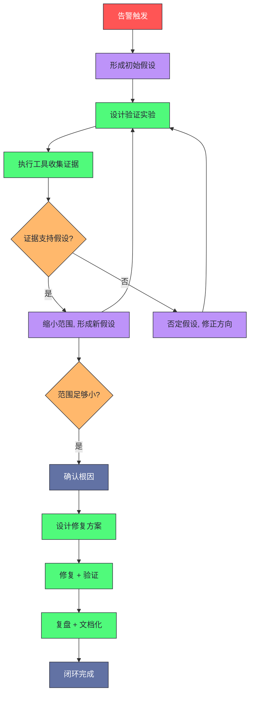
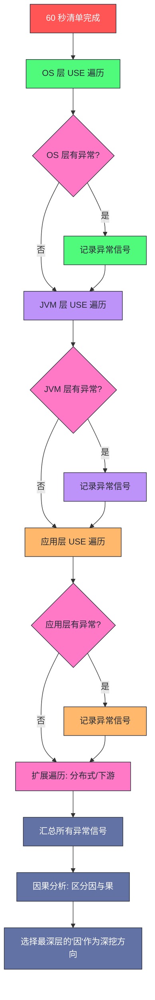
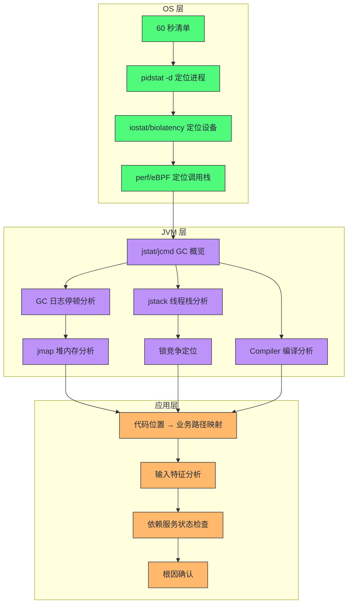
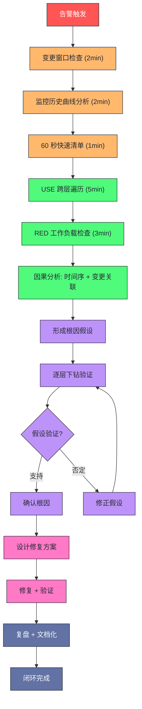
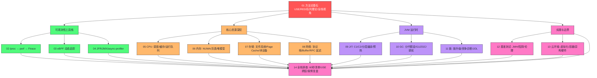

# 14 全栈性能排查实战：从告警到根因的方法论闭环

> [!abstract] 摘要
> 本文是《系统性能工程实战》专栏的收官篇，旨在将前 13 篇的方法论、工具链与领域知识收敛为一套可执行的全栈性能排查闭环。文章以"告警触发 → 60 秒快速清单 → USE 跨层遍历 → OS→JVM→应用层逐层下钻 → 根因确认 → 修复验证"为主线，完整模拟一次生产性能事件的排查流程。文中整合 Brendan Gregg《Systems Performance》2nd Edition 的案例研究方法论与 Monica Beckwith《JVM Performance Engineering》的 JVM 层下钻框架，提供三个不同根因层级的案例复盘（OS 层 I/O 瓶颈、JVM 层 GC 停顿、应用层锁竞争），并系统梳理性能排查中七种典型思维陷阱。阅读本文后，你将拥有一套从告警到根因的标准化操作流程，而不是一堆零散的排障命令。

---

## 第 1 章 引言：为什么性能排查需要一个"闭环"

### 1.1 从 13 篇文章到一张方法论地图

本专栏前 13 篇文章分别从不同维度构建了性能工程的知识体系：第 01 篇建立方法论基石（USE/RED/队列理论/全栈视角），第 02-04 篇讲透可观测性工具栈（/proc、perf、Ftrace、eBPF、JFR、async-profiler），第 05-08 篇深挖四大核心资源（CPU、内存、存储、网络），第 09-11 篇剖析 JVM 运行时性能（JIT、GC、锁竞争），第 12-13 篇覆盖基准测试方法论与云环境新边界。这 13 篇文章的知识是离散的——每一篇都聚焦于一个特定领域，讲透了该领域的原理、工具和调优方法。

但真实的性能事件不会按章节目录发生。一个生产环境的延迟尖刺，可能同时涉及 OS 层的磁盘 I/O 饱和、JVM 层的 GC 停顿和应用层的同步锁竞争。如果你只精通其中一层，你会在该层找到"看起来像根因"的东西，却错过真正的根因。**性能排查的难度不在于某一层的深度，而在于跨层的广度和在压力下正确选择下钻路径的判断力**。

> [!info] 核心概念：方法论闭环
> **方法论闭环**是指一套从信号发现到根因确认再到修复验证的完整流程，其中每个环节都有明确的输入、输出和判断标准，且整个流程是可复现、可传授、可审计的。它不是一份"排障 checklist"，而是一套在不确定性和时间压力下仍能保持逻辑严谨的思维程序。
> 闭环的关键特征：**可复现**——不同工程师执行同一流程应得到相同结论；**可审计**——每一步的判断依据有记录，事后可回溯；**可收敛**——流程设计保证排查范围单调缩小，不会原地打转。

### 1.2 为什么大多数团队的性能排查是"开环"的

观察大量团队的性能排查实践，会发现一个普遍模式：告警触发 → 某个工程师凭经验猜测原因 → 登录机器跑几个命令 → 找到一个"可疑点" → 修改某个参数 → 告警消失 → 宣布修复。这个模式的问题在于它是一个**开环**过程：

第一，**猜测代替遍历**。工程师跳过了系统性遍历，直接跳到"我觉得可能是 X"。如果 X 碰巧是根因之一（多根因场景下概率不低），告警确实会缓解，但其他根因仍然潜伏，下次会在更不利的时机爆发。

第二，**症状代替根因**。告警显示"GC 停顿过长"，工程师调大堆内存，停顿确实变短了。但 GC 频繁的根因是应用层一个泄漏的缓存，堆内存调大只是延缓了 GC 触发时间，问题本质未解决。

第三，**无验证无回溯**。修改参数后告警消失，但没有建立对照组，无法确认是修改生效还是工作负载自然下降。更危险的是，没有文档记录排查过程，下次类似事件发生时，团队又要从零开始。

> [!warning] 生产避坑：开环排查的代价
> 开环排查的最大代价不是"这次没修好"，而是**它制造了"已修复"的错觉**。一个被开环"修复"的性能问题，其根因仍在系统中潜伏，且因为"上次已经修过了"的心理锚定，下次复发时团队会更倾向于认为是"新问题"而非"旧病复发"，从而在错误的方向上浪费更多时间。Brendan Gregg 在《Systems Performance》第 1 章将其称为"修复导致的失忆"——每次表面的修复都在削弱团队对根因的追查动力。

### 1.3 闭环的核心原则：假设驱动而非数据驱动

一个常见的误解是"性能排查是数据驱动的"——收集尽可能多的数据，然后从数据中找答案。这种思路在复杂系统中会失效，因为数据的维度太多，噪声太大，且收集数据本身有开销（`perf record` 会降低性能，`jstack` 会触发 safepoint）。

正确的排查模式是**假设驱动**：先基于已有信号形成假设，再设计最小代价的验证实验，根据实验结果修正假设或缩小范围。每一次工具调用都应该有明确的假设在驱动——"我跑这条命令是为了验证/否定假设 H，如果结果是 X 则支持 H，如果是 Y 则否定 H"。没有假设的工具调用是浪费。



这个流程图的核心特征是**假设-验证循环**：它不是一条直线从告警走到根因，而是一个不断假设、验证、修正、缩小的迭代过程。每一次循环都让排查范围单调缩小，保证流程可收敛。

---

## 第 2 章 60 秒清单实操：第一响应的标准动作

### 2.1 什么是 60 秒清单

60 秒清单是 Brendan Gregg 在《Systems Performance》中提出的一套快速系统体检方法，用于在性能问题发生后第一时间获取系统的整体快照。它的设计哲学是：**在投入深度分析之前，先用一组低开销、高信息密度的命令建立全局认知**。

> [!info] 核心概念：60 秒清单
> **60 秒清单**是一组按特定顺序执行的系统观测命令，设计目标是在 60 秒内完成对 CPU、内存、磁盘 I/O、网络四大资源的快速扫描，识别最显著的异常信号。它不是"最终诊断"，而是"分诊"——决定后续深度分析应该优先投入哪个方向。
> 为什么是 60 秒：这个时间约束是一种工程自律。如果第一轮快速扫描就需要 10 分钟，说明你选的工具太重了。60 秒清单只使用 `/proc`、`/sys` 读取和轻量级工具（`vmstat`、`iostat`、`mpstat`、`pidstat`、`sar`），不使用任何会改变系统行为的重量级工具（`perf`、`strace`、`bpftrace`）。

### 2.2 为什么需要 60 秒清单

没有 60 秒清单的工程师，面对告警时通常会犯两种错误。

第一种是**工具跳跃**：看到 CPU 告警就立刻跑 `perf top`，看到 GC 告警就立刻跑 `jstat`。这种做法的问题是，单个告警只反映了系统的一个侧面，而性能问题的根因往往在告警指向的资源之外。CPU 告警的根因可能是磁盘 I/O 阻塞导致线程阻塞后 CPU 被其他线程抢占，GC 告警的根因可能是网络延迟导致响应对象长时间无法回收。直接跳到告警指向的资源做深度分析，等于在错误的层做了大量工作。

第二种是**数据淹没**：没有优先级地打开十几个终端窗口，同时跑 `top`、`htop`、`iostat`、`netstat`、`jconsole`、`arthas`，被海量数据淹没，无法判断哪些信号是因、哪些是果。60 秒清单的价值在于它强制你按固定顺序、固定维度扫描，避免遗漏关键维度，也避免被噪声数据分散注意力。

### 2.3 不做 60 秒清单会怎样

假设一个场景：凌晨 2 点，支付服务 P99 延迟告警触发。值班工程师直接登录应用服务器，跑 `jstat -gcutil` 发现 Full GC 频率升高，立刻判断是 GC 问题，开始调 G1 参数。调了 40 分钟，GC 频率略有下降但延迟尖刺仍在。换一个方向，跑 `top` 发现 CPU 利用率不高但 `iowait` 很高，跑 `iostat` 发现磁盘写延迟飙升。最终查到是一个日志组件在做同步 `fsync`，阻塞了支付链路上的线程。整个过程花了 2 小时，而如果先做 60 秒清单，第一轮就能发现 `iowait` 异常，直接跳到磁盘 I/O 方向，排查时间可以压缩到 30 分钟以内。

> [!warning] 生产避坑：告警指向的层不一定是根因所在的层
> 这句话值得反复强调。告警系统基于阈值触发，它告诉你"哪个指标超了阈值"，但不告诉你"根因在哪一层"。GC 告警的根因可能在 OS 层（磁盘 I/O 阻塞导致 GC 的 flush 阶段变慢），CPU 告警的根因可能在应用层（一个 O(n²) 算法在数据量增长后退化）。60 秒清单的设计目的就是让你在第一时间扫描所有层，而不是被告警的指向锁定在某一层。

### 2.4 60 秒清单的完整实操

以下是 Brendan Gregg 原版 60 秒清单的完整命令序列，按执行顺序排列。每条命令附带"看什么"——即执行后应该重点关注的信号。

**第 1 步：`uptime`（1 秒）**

```bash
uptime
# 输出示例: 10:30:00 up 45 days,  3:21,  3 users,  load average: 16.50, 14.20, 8.10
```

看什么：**load average 的三个数字**（1 分钟、5 分钟、15 分钟）。三个数字的关系告诉你负载的趋势：

| 1min vs 5min vs 15min | 趋势判断 | 行动建议 |
|----------------------|---------|---------|
| 1 > 5 > 15 | 负载在上升 | 问题正在恶化，需要快速响应 |
| 1 < 5 < 15 | 负载在下降 | 问题可能在自行缓解，但仍需定位根因 |
| 1 ≈ 5 ≈ 15 | 负载稳定 | 持续性问题，有充足时间做深度分析 |

load average 的绝对值需要与 CPU 核数对比。一个 32 核机器上 load average 16 是正常的，一个 4 核机器上 load average 16 就意味着严重的运行队列积压。专栏第 05 篇详细讲过 load average 的构成：它包含运行队列中的任务数和不可中断睡眠（D 状态）的任务数，后者通常是等待 I/O 的进程。**load average 高但 CPU 利用率低，是 I/O 瓶颈的强信号**。

**第 2 步：`dmesg | tail`（1 秒）**

```bash
dmesg | tail -30
```

看什么：**内核日志中的异常事件**。重点关注 OOM killer、硬件错误、文件系统错误、驱动崩溃。这些是操作系统层面的"硬故障"，优先级高于性能调优类问题。如果 `dmesg` 里有 OOM killer 记录，说明系统曾经因为内存耗尽而杀进程，这比任何性能指标都直接地指向内存问题。

**第 3 步：`vmstat 1`（5 秒，观察 5 个采样）**

```bash
vmstat 1 5
# procs -----memory---- ---swap-- -----io---- -system-- -----cpu----
# r  b  swpd  free  buff cache  si  so  bi   bo  in   cs  us sy id wa st
# 8  2     0  2G   1G   8G     0   0   20  800  15k  20k  45 10 35 10  0
# 12 4     0  1.8G 1G   8G     0   0   15  1200 18k  25k  40 12 30 18  0
```

看什么，按列分组：

- **`r` 列（running）**：运行队列长度。`r` 持续大于 CPU 核数 → CPU 饱和。专栏第 05 篇讲过，运行队列长度是 CPU 资源的 USE 指标中"饱和度"的直接体现。
- **`b` 列（blocked）**：不可中断睡眠的进程数。`b` 持续大于 0 → I/O 阻塞。这是磁盘 I/O 瓶颈的最早信号，比 `iostat` 更快暴露问题。
- **`si/so` 列（swap in/out）**：swap 活动。任何非零的 `si/so` 都是危险信号——swap 意味着内核在用磁盘模拟内存，延迟会差 4-5 个数量级。专栏第 06 篇讲过 swap 的性能毁灭性。
- **`bi/bo` 列（block in/out）**：块设备 I/O 速率。突然飙升的 `bo` 通常意味着大量写盘，需要结合 `iostat` 定位是哪个设备。
- **`us/sy/wa/st` 列**：CPU 时间分解。`wa`（iowait）高 → I/O 瓶颈；`sy` 高 → 内核态开销大（可能是系统调用频繁、锁竞争、或 softirq）；`st` 高 → 虚拟化 steal time（专栏第 13 篇讲过云环境的嘈杂邻居问题）。

**第 4 步：`mpstat -P ALL 1`（5 秒）**

```bash
mpstat -P ALL 1 5
```

看什么：**每个 CPU 核的利用率分解**。`vmstat` 给的是全局 CPU 平均值，`mpstat` 给的是每核明细。关注两个模式：

- **单核 100% + 其他核空闲**：通常是单线程应用或锁竞争导致的工作不均衡。专栏第 05 篇讲过 CPU 亲和性和单线程瓶颈。
- **所有核 `iowait` 都高**：全局 I/O 瓶颈，不是单设备问题。
- **某些核 `softirq` 高**：网络中断集中在特定核上（IRQ 亲和性），专栏第 08 篇讲过网络软中断的性能影响。

**第 5 步：`pidstat 1`（5 秒）**

```bash
pidstat 1 5
# PID    %usr %system  %guest   %wait   %CPU   CPU  Command
# 12345  45.0  5.0     0.0      30.0    50.0   3    java
# 12346  0.0   0.0     0.0      80.0    0.0    5    java
```

看什么：**哪个进程在消耗资源**。重点关注 `%wait` 列——它表示进程等待运行的时间百分比。一个 `%CPU` 低但 `%wait` 高的进程，说明它在等待 I/O 或锁，而不是在计算。这是定位"谁在受影响"的关键信号。

**第 6 步：`iostat -xz 1`（5 秒）**

```bash
iostat -xz 1 5
# Device  r/s   w/s   rkB/s  wkB/s  rrqm/s  wrqm/s  %util  await  r_await  w_await
# sda     50.0  800.0  200   3200    0.0     10.0    95.0   15.0   5.0      18.0
```

看什么，按列分组：

- **`%util`**：设备利用率。接近 100% → 设备饱和。但注意 NVMe/SSD 的 `%util` 有语义陷阱（专栏第 07 篇讲过，`%util` 基于队列深度 1 的假设，对支持 NCQ 的设备会低估真实容量），需要结合 `await` 判断。
- **`await`**：平均 I/O 延迟（毫秒）。`await` 超过设备预期的单次 I/O 延迟（SSD ~0.1ms，HDD ~5-10ms）→ 设备饱和或 I/O 模式恶化。
- **`r/s` 和 `w/s`**：IOPS。结合 `rkB/s` 和 `wkB/s` 判断 I/O 模式（高 IOPS + 低 KB/s = 小块随机 I/O，低 IOPS + 高 KB/s = 大块顺序 I/O）。

**第 7 步：`free -m`（1 秒）**

```bash
free -m
#               total   used    free   shared  buff/cache  available
# Mem:          32180   12000   2000   500     17680        18000
# Swap:         8192    0       8192
```

看什么：**`available` 列**而非 `free` 列。`free` 低不代表内存紧张——Linux 会积极使用空闲内存做 Page Cache（专栏第 06 篇讲过）。真正反映内存可用性的是 `available`，它估算的是在不 swap 的前提下能释放的内存总量。`available` 持续低于总内存的 10% → 内存压力信号。`Swap` 的 `used` 列任何非零值都需要立即关注。

**第 8 步：`sar -n DEV 1`（5 秒）**

```bash
sar -n DEV 1 5
# IFACE  rxpck/s  txpck/s  rxkB/s  txkB/s  rxcmp/s  txcmp/s  rxmcst/s
# eth0   50000.0  45000.0  30000   25000   0.0      0.0      0.0
```

看什么：**网络接口的包速率和带宽**。`rxpck/s` 突然飙升 → 可能是流量突增或网络攻击。`rxkB/s` 接近接口带宽上限 → 网络带宽饱和。专栏第 08 篇讲过网络带宽饱和会导致发送队列积压、延迟非线性增长。

**第 9 步：`sar -n TCP,ETCP 1`（5 秒）**

```bash
sar -n TCP,ETCP 1 5
# active/s  passive/s  iseg/s  oseg/s  atmptf/s  estres/s  retrans/s
# 2.0       50.0       8000    7500    0.0       0.0       5.0
```

看什么：**`retrans/s`（重传率）和 `passive/s`（被动连接数）**。`retrans/s` 持续大于 0 → 网络质量问题（丢包、拥塞）。`passive/s` 突然飙升 → 大量新连接涌入，可能是负载突增或连接泄漏（连接没有被复用，每次请求都新建连接）。

**第 10 步：`top`（5 秒）**

```bash
top -bn1 | head -30
```

看什么：**全局概览 + 进程排序**。`top` 的信息大部分已被前面的命令覆盖，但它的优势是一屏展示所有维度的概览，适合作为 60 秒清单的收尾确认。重点关注 `top` 里 `%CPU` 排序的前几个进程，确认资源消耗的"大户"。

### 2.5 60 秒清单的输出解读框架

执行完 10 条命令后，你手上应该有一组信号。如何从这组信号推断后续方向？以下是一个决策矩阵：

| 信号组合 | 推断方向 | 后续深度工具 |
|---------|---------|------------|
| `wa` 高 + `b` 高 + `await` 高 | 磁盘 I/O 瓶颈 | `biolatency`（eBPF）、`iotop`、`perf` |
| `r` 高 + `us` 高 + `sy` 正常 | CPU 计算密集 | `perf top`、`async-profiler` CPU 火焰图 |
| `r` 高 + `sy` 高 + `cs` 高 | 系统调用/锁/调度开销 | `perf` syscalls、`offcpu` 分析 |
| `si/so` 非零 + `available` 低 | 内存不足/swap | `smem`、`jmap`、`perf` 内存分析 |
| `retrans/s` 高 + `await` 正常 | 网络质量问题 | `tcpdump`、`nicstat`、`ss` |
| `%wait` 高 + `%CPU` 低 | I/O 等待或锁等待 | `pidstat -d`、`jstack`、`offcpu` |
| `st` 高 | 虚拟化 steal time | 联系云平台、检查嘈杂邻居 |

> [!note] 设计哲学：60 秒清单是"分诊"不是"诊断"
> 60 秒清单的输出只能告诉你"大概哪个方向有问题"，不能告诉你"具体根因是什么"。它的价值在于**排除**——排除那些没有异常的资源维度，把后续深度分析的精力集中到有异常的维度。不要试图从 60 秒清单的输出直接得出根因结论，那是过度解读。正确的做法是：60 秒清单 → 形成假设 → 用深度工具验证假设。

### 2.6 60 秒清单的边界与反例

60 秒清单不是万能的。以下场景中，60 秒清单可能无法提供有效信号：

**第一，间歇性问题**。如果性能问题只持续几秒然后恢复正常，60 秒清单的 5 秒采样窗口可能恰好错过了异常窗口。这类问题需要持续监控数据（Prometheus/Grafana 历史曲线）或基于 eBPF 的持续追踪（专栏第 03 篇讲过的 `bpftrace` 可以做持续低开销追踪）。

**第二，应用层逻辑问题**。60 秒清单扫描的是 OS 层资源指标，无法发现应用层的逻辑缺陷——比如一个 O(n²) 算法在数据量从 1000 增长到 10000 后退化。这类问题在 OS 层表现为"CPU 利用率升高"，但 60 秒清单无法区分"正常的业务增长导致的 CPU 升高"和"算法退化导致的 CPU 升高"。需要应用层 profiler（async-profiler CPU 火焰图）才能定位。

**第三，分布式系统的跨节点问题**。60 秒清单是单机视角的。如果性能问题的根因在另一个节点（比如下游服务变慢导致本节点的连接池耗尽），单机 60 秒清单只能看到"连接池等待"的症状，看不到根因。这类问题需要分布式追踪系统（Jaeger/Zipkin）配合。

---

## 第 3 章 USE 方法跨层应用：从资源到工作负载

### 3.1 USE 方法的回顾与扩展

专栏第 01 篇引入了 USE 方法（Utilization、Saturation、Errors），它是资源分析的标准方法论。在收官篇，我们需要把 USE 方法从"概念框架"推进到"跨层可执行的检查清单"。

> [!info] 核心概念：USE 方法回顾
> **USE 方法**：对所有资源，检查三个指标——利用率（Utilization，资源繁忙时间占比）、饱和度（Saturation，资源排队/积压程度）、错误（Errors，错误事件计数）。
> 为什么是这三个：利用率告诉你"忙不忙"，饱和度告诉你"忙到排队没有"，错误告诉你"有没有在出错"。三者组合覆盖了资源健康的三个维度。只看利用率会错过饱和问题（利用率 80% 但队列已经积压），只看饱和度会错过错误问题（队列不长但设备在报错）。

USE 方法的原始定义聚焦于硬件资源（CPU、内存、磁盘、网络）。但在全栈性能排查中，我们需要把 USE 方法**向上扩展到 JVM 层和应用层**。每一层都有自己的"资源"概念，每一层的资源都有对应的 USE 三指标。

### 3.2 USE 方法跨层映射表

以下是 USE 方法从 OS 层到应用层的完整映射：

| 层级 | 资源 | Utilization | Saturation | Errors |
|------|------|------------|------------|--------|
| OS-CPU | CPU 核 | `%CPU`（mpstat） | 运行队列长度 `r`（vmstat） | 硬件错误（`mce`） |
| OS-内存 | 物理内存 | `available`/`total`（free） | swap 活动 `si/so`（vmstat） | OOM killer（dmesg） |
| OS-磁盘 | 块设备 | `%util`（iostat） | `await` 延迟、队列深度 | I/O errors（dmesg） |
| OS-网络 | 网络接口 | 带宽占用/接口带宽 | 发送队列长度、重传率 | 丢包、CRC 错误 |
| JVM-堆 | Java 堆 | 堆使用率（jstat/jcmd） | GC 频率、GC 停顿时间 | OOM（OutOfMemoryError） |
| JVM-JIT | JIT 编译器 | 编译线程 CPU 占比 | 编译队列长度 | deoptimization 事件 |
| JVM-元空间 | Metaspace | Metaspace 使用率 | Metaspace 扩容频率 | Metaspace OOM |
| JVM-线程 | 线程池 | 活跃线程数/总线程数 | 线程池队列长度 | 线程泄漏、死锁 |
| 应用-连接池 | 数据库连接池 | 活跃连接/最大连接 | 等待连接的线程数 | 连接超时、连接被拒 |
| 应用-缓存 | 应用缓存 | 缓存命中率 | 缓存驱逐率 | 缓存序列化错误 |
| 应用-线程锁 | 应用锁 | 锁持有时间 | 锁等待线程数 | 死锁检测 |

这张表的价值在于：**当你完成 60 秒清单的 OS 层扫描后，不要直接跳到"修复"动作，而是沿着这张表向下遍历**。如果 OS 层的 CPU 和磁盘都正常，但延迟告警仍在，下一个遍历方向是 JVM 层——检查堆利用率、GC 饱和度、线程池饱和度。如果 JVM 层也正常，继续向下到应用层——检查连接池、缓存、锁。

### 3.3 为什么 USE 跨层遍历能避免"盲人摸象"

USE 跨层遍历的核心优势是**完备性**。它保证你不会遗漏任何一个资源维度。一个常见的排查失误是：工程师在 OS 层发现 CPU 利用率高，就停在 CPU 方向做深度分析，最终用 `perf` 找到了热点函数，优化了算法，CPU 利用率下降了 20%。但延迟只改善了 5%——因为真正的瓶颈在 JVM 层的 GC 停顿，而 GC 停顿的根因在应用层的缓存泄漏。如果一开始就做了 USE 跨层遍历，第一轮就能发现 JVM 堆利用率高 + GC 频率高，不会在 CPU 方向浪费 2 小时。

> [!warning] 生产避坑：不要在单一资源上"深挖到底"
> 一个常见的思维陷阱是"发现了异常就立刻深挖"。正确的做法是：先完成所有层的 USE 遍历，收集所有异常信号，再决定深挖方向。因为不同层的异常信号之间可能存在因果关系——OS 层的 I/O 饱和可能是 JVM 层 GC flush 导致的，JVM 层的 GC 频繁可能是应用层缓存泄漏导致的。如果你在第一层就深挖，你挖到的是"果"而不是"因"。先遍历再深挖，才能区分因果。

### 3.4 USE 跨层遍历的实操流程



这个流程的关键设计是**先遍历后深挖**。每一层的 USE 检查都是轻量级的（不需要 perf、async-profiler 这类重量级工具），只使用 `jstat`、`jcmd`、`jmx` 读取、应用自暴露的 metrics 端点。遍历完成后，你手上有一组跨层的异常信号，然后做因果分析——哪个信号是其他信号的原因。

因果分析的判断原则：**时间序上的先发信号更可能是因**。如果监控曲线显示磁盘 I/O 飙升在 GC 频率升高之前 30 秒发生，那么 I/O 饱和更可能是 GC 频繁的因（I/O 阻塞导致 GC flush 变慢，GC 被迫更频繁触发）。反之，如果 GC 频率升高在 I/O 飙升之前，则 GC 更可能是因（GC 频繁产生大量日志写入导致 I/O 饱和）。

### 3.5 RED 方法：USE 的互补视角

USE 方法聚焦于资源，但性能排查还需要一个聚焦于工作负载的视角。这就是 RED 方法。

> [!info] 核心概念：RED 方法
> **RED 方法**：对所有服务/工作负载，检查三个指标——Rate（请求速率）、Errors（错误率）、Duration（延迟分布）。
> USE 与 RED 的关系：USE 看资源"健不健康"，RED 看工作负载"正不正常"。两者互补——USE 发现资源异常，RED 发现工作负载异常。一个完整的排查需要同时检查两者：资源异常可能是工作负载突增导致的（RED 的 Rate 飙升 → USE 的 CPU 饱和），工作负载异常可能是资源瓶颈导致的（USE 的磁盘饱和 → RED 的 Duration 飙升）。

RED 方法的三个指标在微服务架构中通常由 Service Mesh 或 APM 系统提供。如果团队没有 APM，可以通过以下方式获取：

| RED 指标 | 获取方式 | 关键看什么 |
|---------|---------|-----------|
| Rate | Nginx/Tomcat access log 统计 QPS | 是否有流量突增 |
| Errors | HTTP 5xx 率、业务错误率 | 是否伴随延迟问题同时出现 |
| Duration | access log 中的 request time 分布 | P50/P99/P999 的变化趋势 |

> [!note] 设计哲学：USE + RED 的协同
> 单独使用 USE：能发现资源瓶颈，但不知道瓶颈对用户体验的影响程度。单独使用 RED：能发现用户体验恶化，但不知道是哪个资源导致的。USE + RED 协同：先看 RED 确认"用户体验确实恶化了"以及"恶化到什么程度"，再用 USE 定位"哪个资源是瓶颈"。这种协同让排查既有业务影响评估，又有技术根因定位。

---

## 第 4 章 OS→JVM→应用层逐层下钻

### 4.1 逐层下钻的核心原则

USE 跨层遍历帮你定位了"哪个层的哪个资源有异常"，接下来的工作是**逐层下钻**——从异常信号出发，沿着调用链和数据流深入到具体的代码行或配置项。

逐层下钻的核心原则是：**每一层的下钻都应该有明确的输入和输出**。输入是上一层的异常信号（"GC 停顿 500ms"），输出是下一层的更细粒度信号（"GC 停顿的 mark phase 耗时 400ms"）。如果某一层的下钻没有产生比上一层更细粒度的信号，说明下钻方向错了，应该回退到上一层换一个方向。

### 4.2 OS 层下钻：从资源指标到内核行为

假设 60 秒清单 + USE 遍历的结论是"OS 层磁盘 I/O 饱和"。OS 层的下钻路径如下：

**第一步：确认哪个进程在做 I/O**

```bash
pidstat -d 1
# PID    kB_rd/s  kB_wr/s  kB_ccwr/s  iodelay  Command
# 12345  0.0      8500.0   0.0        200      java
```

`pidstat -d` 显示每个进程的 I/O 速率和 `iodelay`（I/O 等待时间）。`iodelay` 高的进程是 I/O 瓶颈的受害者，`kB_wr/s` 高的进程是 I/O 负载的制造者。注意这两个不一定是同一个进程——制造者可能在后台写日志，受害者可能是支付链路上的线程在等 `fsync`。

**第二步：确认 I/O 的具体路径**

```bash
# 用 eBPF 追踪文件 I/O 延迟
bpftrace -e 'tracepoint:syscalls:sys_enter_openat { printf("%s %s\n", comm, str(args->filename)); }'
# 或用 biolatency 查看块设备 I/O 延迟分布
biolatency -d 10
```

专栏第 03 篇讲过 eBPF 的动态追踪能力。这里用 `bpftrace` 追踪 `openat` 系统调用，可以看到哪个进程在打开哪个文件。结合 `biolatency` 的延迟分布直方图，可以判断 I/O 延迟是集中在某个设备还是均匀分布。

**第三步：确认 I/O 模式**

```bash
# 用 perf 追踪文件系统操作的调用栈
perf record -e ext4:ext4_writepage -g -p <pid> -- sleep 10
perf report
```

这一步从"哪个进程在做 I/O"深入到"I/O 的调用栈是什么"。如果调用栈显示 `fsync` → `ext4_writepage` → `submit_bio`，说明是同步写 + fsync 导致的 I/O。如果显示 `write` → `ext4_writepages`（复数），说明是异步批量写。

### 4.3 JVM 层下钻：从运行时指标到 GC/JIT/锁

OS 层下钻完成后，或者 OS 层没有发现异常时，进入 JVM 层下钻。JVM 层的下钻工具栈在专栏第 04 篇有详细讲解，这里聚焦于"如何从异常信号选择下钻方向"。

**方向一：GC 下钻**

如果 USE 遍历发现 JVM 堆利用率高 + GC 频率高，GC 下钻路径如下：

```bash
# 第一步：查看 GC 概况
jcmd <pid> GC.heap_info
# 或
jstat -gcutil <pid> 1000 10

# 第二步：查看 GC 日志（如果开启了 -Xlog:gc*）
# JDK 11+: -Xlog:gc*=info:file=/path/gc.log:time,uptime,level,tags
# 分析 GC 日志中的停顿分布
```

GC 下钻的关键信号：

| GC 信号 | 含义 | 指向的根因方向 |
|---------|------|--------------|
| Young GC 频繁 | 新生代太小或分配率太高 | 堆大小配置、对象分配热点 |
| Mixed GC 频繁 | 老年代增长过快 | 内存泄漏、大对象直接进老年代 |
| Full GC 频繁 | Metaspace 不足或老年代满 | Metaspace 配置、内存泄漏 |
| GC 停顿时间长 | 单次 GC 扫描对象多 | 堆太大、GC 算法选型、Region 大小 |
| Concurrent Mark 慢 | 并发标记跟不上分配速度 | 并发线程数、G1 Region 数量 |

专栏第 10 篇详细讲过 GC 工程化，这里不重复展开。GC 下钻的终点是回答两个问题：**"GC 在做什么类型的停顿"** 和 **"为什么这个类型的停顿耗时这么长"**。前者通过 GC 日志判断，后者需要结合堆内存分析（`jmap -histo`、`jcmd GC.heap_dump`）。

**方向二：JIT 下钻**

如果 USE 遍历发现 CPU 利用率高但 GC 正常，且应用处于启动后不久（预热期），需要考虑 JIT 编译开销。专栏第 09 篇讲过 HotSpot 的分层编译机制。

```bash
# 查看编译事件
jcmd <pid> Compiler.print_compilation
# 或查看编译队列
jcmd <pid> Compiler.queue
```

JIT 下钻的关键判断：如果编译队列积压严重（大量方法等待编译），说明编译线程不够或编译开销过大。解决方向是调整 `-XX:CICompilerCount` 或考虑预编译（AOT/CDS）。如果问题是 deoptimization 频繁（"uncommon trap"），说明热点方法的类型 profile 不稳定，需要检查是否有过多的多态调用点。

**方向三：锁竞争下钻**

如果 USE 遍历发现线程池饱和 + `%wait` 高，但 CPU 利用率低，锁竞争是首要怀疑方向。专栏第 11 篇详细讲过锁竞争诊断。

```bash
# 第一步：抓取线程栈
jstack <pid> > /tmp/jstack_1.txt
sleep 5
jstack <pid> > /tmp/jstack_2.txt

# 第二步：找 BLOCKED 线程
grep -c "BLOCKED" /tmp/jstack_1.txt
# 第三步：找锁等待关系
grep -B5 "waiting to lock" /tmp/jstack_1.txt
```

锁竞争下钻的终点是回答：**"哪个锁是热点"** 和 **"谁持有这个锁最久"**。两次 `jstack` 间隔 5 秒，如果同一个线程在两次 dump 中都处于 BLOCKED 状态且等待同一把锁，这把锁就是热点锁。持有该锁的线程的栈帧告诉你锁持有的位置——这就是需要优化的代码点。

### 4.4 应用层下钻：从框架指标到业务代码

JVM 层下钻到具体代码位置后，最后一步是应用层下钻——理解这段代码在业务上下文中为什么变慢。

应用层下钻没有标准化的工具栈（因为每个应用的架构不同），但有一个通用的下钻框架：

**第一步：确认是哪个业务路径**

JVM 层下钻给你的是一个代码位置（某个方法、某行代码）。你需要把这个代码位置映射到业务路径——它属于哪个 API？哪个用户请求会触发它？这个映射通常通过分布式追踪系统（如 Jaeger）或应用自暴露的 trace ID 完成。

**第二步：确认该路径的输入特征**

同一段代码在不同输入下性能差异巨大。一个 O(n²) 的搜索函数，n=100 时耗时 0.1ms，n=10000 时耗时 10s。你需要确认触发性能问题的请求的输入特征——数据量、并发度、数据分布。这一步通常需要查 access log 或业务日志，找到触发时间点的请求参数。

**第三步：确认该路径的依赖状态**

应用层性能问题经常不是代码本身的问题，而是代码依赖的外部服务的问题。一个数据库查询变慢，可能是索引缺失、可能是数据量增长、可能是数据库本身负载高。一个 RPC 调用变慢，可能是下游服务变慢、可能是网络延迟增大。这一步需要检查依赖服务的监控指标和日志。

### 4.5 逐层下钻的完整链路图



这张图展示了从 OS 层到应用层的完整下钻链路。注意层与层之间的连接不是线性的——OS 层的 I/O 下钻可能指向 JVM 层的 GC 分析，也可能指向 JVM 层的线程栈分析（I/O 阻塞导致线程阻塞）。下钻路径的选择取决于上一层发现的信号，而不是固定的流程。

---

## 第 5 章 案例复盘：三个真实生产事件的根因分析

### 5.1 案例一：OS 层根因——磁盘 I/O 瓶颈导致的延迟尖刺

**背景**：某支付平台凌晨 3:00 开始出现 P99 延迟尖刺，从正常的 50ms 飙升到 2000ms，持续约 30 分钟后自行恢复。连续三天在同一时间发生。

**排查过程**：

**第一轮：60 秒清单**

值班工程师在告警触发后登录生产机器执行 60 秒清单。`uptime` 显示 load average 从 4 升到 24（32 核机器，正常区间）。`vmstat 1` 显示 `b` 列从 0 升到 8，`wa`（iowait）从 0 升到 35%，`bo`（block out）从 200/s 升到 8000/s。`iostat -xz 1` 显示 `sda` 设备 `%util` 98%，`await` 18ms（SSD 正常值 0.1ms）。

**信号汇总**：磁盘 I/O 严重饱和，大量写操作，iowait 高。

**第二轮：USE 跨层遍历**

OS 层：磁盘 I/O 饱和（已确认）。CPU 正常（`us` 30%，`sy` 5%）。内存正常（`available` 20GB）。网络正常。
JVM 层：`jstat -gcutil` 显示 GC 频率从每分钟 2 次升到每分钟 15 次，但 GC 停顿时间正常（Young GC 20ms）。
应用层：应用 metrics 显示支付接口 QPS 正常，但 P99 延迟飙升。

**因果分析**：磁盘 I/O 饱和在时间序上先于 GC 频率升高，且 GC 停顿时间正常（说明 GC 本身不是瓶颈），推断磁盘 I/O 是因，GC 频繁是果（I/O 阻塞导致 GC 的某些阶段变慢，触发更频繁的 GC）。

**第三轮：OS 层下钻**

`pidstat -d 1` 定位到 PID 12345（java 进程）的 `kB_wr/s` 为 7500，`iodelay` 为 200ms。用 `bpftrace` 追踪 `openat` 系统调用，发现该进程在凌晨 3:00 开始密集打开 `/var/log/app/debug.log` 文件。

**第四轮：应用层下钻**

查应用配置，发现日志组件的 DEBUG 级别由一个 cron 任务在凌晨 3:00 开启（运维为了排查另一个问题临时配置，忘记关闭）。DEBUG 日志产生大量写盘操作，且日志组件使用同步 `fsync`，阻塞了支付链路上的线程。

**根因**：凌晨 cron 开启 DEBUG 日志 → 同步 fsync 写盘 → 磁盘 I/O 饱和 → 线程阻塞 + GC 频繁 → 延迟尖刺。

**修复**：关闭 DEBUG 日志（治标）+ 改日志组件为异步写入（治本）+ 清理 cron 任务（防止复发）。

**复盘启示**：这个案例的根因在应用层（日志配置），但症状表现在 OS 层（磁盘 I/O 饱和）和 JVM 层（GC 频繁）。如果只在 JVM 层排查 GC，永远找不到根因。60 秒清单的 `vmstat` 第一轮就暴露了 I/O 异常，避免了在错误方向的浪费时间。

### 5.2 案例二：JVM 层根因——G1 GC 停顿导致的周期性延迟

**背景**：某电商推荐服务在流量高峰期出现周期性延迟尖刺，每 30 秒左右一次，每次持续 1-2 秒，P99 从 80ms 飙升到 3000ms。

**排查过程**：

**第一轮：60 秒清单**

`uptime` load average 正常（8 核机器，load 6）。`vmstat` 显示 `r` 列正常（2-3），`wa` 为 0，`b` 为 0。`mpstat` 显示 CPU `us` 60%，`sy` 5%，`id` 35%，无异常。`iostat` 磁盘正常。`free` 内存 `available` 6GB（总 16GB），正常。`sar -n DEV` 网络正常。

**信号汇总**：OS 层四大资源全部正常。异常不在 OS 层。

**第二轮：USE 跨层遍历**

OS 层：全部正常。
JVM 层：`jstat -gcutil` 显示堆使用率在 70%-85% 之间波动，G1 Mixed GC 频率为每 30 秒一次，每次停顿 800-1200ms。这与延迟尖刺的周期完全吻合。
应用层：应用 metrics 显示延迟尖刺与 GC 停顿时间完全对齐。

**因果分析**：GC 停顿是延迟尖刺的直接原因，无需向下深挖应用层。但需要继续下钻 GC 为什么停顿这么久。

**第三轮：JVM 层 GC 下钻**

```bash
jcmd <pid> GC.heap_info
# 显示 G1 Region 数量 = 2048，Region size = 8MB，堆总大小 16GB
# Eden = 4GB, Survivor = 512MB, Old = 10GB
```

GC 日志分析（`-Xlog:gc*=debug:file=gc.log`）显示 Mixed GC 的 mark phase 正常，但 evacuation（疏散）阶段的 live object scanning 耗时 800ms+。进一步分析 `jmap -histo`，发现老年代中有一个 `byte[]` 类型对象占比 60%（约 6GB）。

**第四轮：应用层下钻**

通过 `jcmd <pid> GC.heap_dump` 生成堆 dump，用 MAT（Memory Analyzer Tool）分析，发现 6GB 的 `byte[]` 来自一个推荐结果缓存——缓存没有设置最大容量和过期策略，所有历史推荐结果都堆积在内存中。随着流量增长，缓存从 2GB 膨胀到 6GB，导致 G1 Mixed GC 每次需要扫描大量 live object，停顿时间从 100ms 增长到 1200ms。

**根因**：推荐缓存无容量限制 → 老年代持续膨胀 → G1 Mixed GC 扫描大量 live object → 停顿时间过长 → 周期性延迟尖刺。

**修复**：给缓存设置最大容量（Caffeine `maximumSize`）和过期策略（`expireAfterWrite`）→ 老年代稳定在 4GB → Mixed GC 停顿降到 50ms。同时调整 G1 Region 大小从 8MB 到 4MB（减少单 Region 的扫描开销），`-XX:MaxGCPauseMillis` 从 200ms 调到 100ms。

**复盘启示**：OS 层完全正常不代表系统健康。这个案例的根因在应用层（缓存设计缺陷），症状在 JVM 层（GC 停顿）。如果只做 60 秒清单就下结论"系统正常"，会错过这个严重问题。USE 跨层遍历的价值在这里充分体现——OS 层遍历完成后继续向下，JVM 层立刻暴露了 GC 异常。

### 5.3 案例三：应用层根因——锁竞争导致的吞吐量天花板

**背景**：某订单服务在压测中无法突破 5000 QPS，CPU 利用率仅 40%，但 P99 延迟随 QPS 增长呈非线性上升。增加并发线程数（从 200 到 400）后吞吐量没有提升，延迟反而更差。

**排查过程**：

**第一轮：60 秒清单**

`vmstat` 显示 `r` 列 = 400（与线程数匹配），但 `us` 仅 40%，`id` 20%。大量线程在运行队列中但 CPU 没有跑满——典型的"线程在等锁"信号。`mpstat` 显示各核利用率均匀，排除单核瓶颈。

**信号汇总**：运行队列长但 CPU 不饱和 → 线程在等待某种资源（锁或 I/O）。`b` 列为 0 排除 I/O 阻塞。

**第二轮：USE 跨层遍历**

OS 层：CPU 利用率 40%（不饱和），运行队列 400（高度饱和）。磁盘/网络/内存正常。
JVM 层：GC 正常。线程池 400 活跃（饱和）。`jstack` 发现 200+ 线程处于 BLOCKED 状态。
应用层：无明确异常指标。

**因果分析**：线程池饱和 + 大量 BLOCKED 线程 → 锁竞争是直接原因。

**第三轮：JVM 层锁竞争下钻**

```bash
jstack <pid> > /tmp/jstack_1.txt
sleep 3
jstack <pid> > /tmp/jstack_2.txt
# 分析两次 dump 中 BLOCKED 线程的等待锁
```

两次 `jstack` 分析发现 200+ 线程等待同一把锁 `0x000000076b8a3c90`。持有该锁的线程栈帧显示：

```
"order-process-thread-1" #50 prio=5 ... BLOCKED
  - waiting to lock <0x000000076b8a3c90> (a java.lang.Object)
  - locked <0x000000076b8a3c98> (a java.lang.Object)
  ...
"order-process-thread-42" #92 prio=5 ... RUNNABLE
  - locked <0x000000076b8a3c90> (a java.lang.Object)
  at com.app.order.OrderService.generateOrderId(OrderService.java:87)
  at com.app.order.OrderService.createOrder(OrderService.java:45)
```

**第四轮：应用层下钻**

查看 `OrderService.generateOrderId` 方法的源码：

```java
// 问题代码：全局同步锁生成订单 ID
private static final Object idLock = new Object();
public String generateOrderId() {
    synchronized (idLock) {  // 所有线程串行通过此锁
        return "ORD" + System.currentTimeMillis() + counter++;
    }
}
```

这个方法用一把全局锁保护订单 ID 生成。每次创建订单都需要获取这把锁，导致 400 个线程实际上串行执行这段代码。锁持有时间虽然短（微秒级），但在 5000 QPS 下锁竞争极其激烈，线程大部分时间在等待锁而非执行业务逻辑。

**根因**：订单 ID 生成使用全局同步锁 → 高并发下锁竞争 → 线程阻塞 → CPU 利用率低但运行队列长 → 吞吐量被锁串行化限制。

**修复**：用 `AtomicLong` 替代 `synchronized` + `counter++`（无锁原子操作）→ 吞吐量提升到 12000 QPS。进一步优化：用雪花算法（Snowflake）替代时间戳+计数器方案，消除 `System.currentTimeMillis()` 的潜在竞争。

**复盘启示**：这个案例的根因在应用层（代码设计缺陷），症状在 OS 层（运行队列长 + CPU 不饱和）。关键诊断信号是"`r` 高但 `us` 低"——这是锁竞争的经典 OS 层信号。专栏第 11 篇讲过的锁竞争诊断方法在这里完整应用：`jstack` → 定位热点锁 → 定位锁持有代码 → 优化锁设计。

### 5.4 三个案例的对比分析

| 维度 | 案例一（I/O 瓶颈） | 案例二（GC 停顿） | 案例三（锁竞争） |
|------|-------------------|------------------|----------------|
| 根因所在层 | 应用层（日志配置） | 应用层（缓存设计） | 应用层（锁设计） |
| 症状表现层 | OS 层（I/O 饱和） | JVM 层（GC 停顿） | OS 层（运行队列） |
| 60 秒清单能否发现 | 能（vmstat iowait） | 不能（OS 层正常） | 能（vmstat r vs us） |
| USE 跨层遍历价值 | 中等（OS 层已暴露） | 极高（OS 层正常，JVM 层暴露） | 中等（OS 层有信号但需 JVM 层确认） |
| 下钻深度 | OS → 应用 | JVM → 应用 | OS → JVM → 应用 |
| 修复类型 | 配置修复 + 架构修复 | 代码修复 + GC 调优 | 代码修复（锁重构） |

三个案例的共同特征：**根因都在应用层，但症状表现在不同的层**。这验证了本专栏反复强调的全栈视角的必要性。如果排查团队只精通某一层，三个案例中至少有两个无法定位根因。

> [!note] 设计哲学：根因和症状的跨层分离
> 性能问题的根因和症状往往不在同一层——这是全栈性能工程存在的根本理由。OS 层的信号告诉你"系统哪里不舒服"，JVM 层的信号告诉你"运行时哪里异常"，应用层的信号告诉你"业务代码哪里有问题"。只有跨层关联这些信号，才能从症状追溯到根因。任何只停留在单一层的排查都是不完整的。

---

## 第 6 章 性能排查的思维陷阱

### 6.1 陷阱一：确认偏误

**是什么**：确认偏误（Confirmation Bias）是指工程师在形成初步假设后，倾向于只关注支持该假设的证据，忽略或贬低反对该假设的证据。

**为什么出现**：人类认知的默认模式就是"先形成判断，再寻找支持证据"。在性能排查中，工程师看到告警后会在几秒内形成直觉判断（"这肯定是 GC 问题"），之后的所有工具调用都变成了"证明这是 GC 问题"的过程。

**不这样会怎样**：如果初步假设恰好正确，确认偏误不会造成问题。但如果初步假设错误（多根因场景下概率不低），确认偏误会让工程师在错误方向上越走越远。更危险的是，当出现反对证据时（比如 GC 指标正常），工程师会"解释掉"这些证据（"可能是采样窗口没对齐"），而不是修正假设。

**如何落地**：在排查过程中强制执行"证伪优先"原则——每形成一个假设，先设计一个"如果假设错误会怎样"的验证实验。如果实验结果与假设矛盾，立即修正假设，不要试图解释掉矛盾。一个实用的技巧是：把你的假设告诉一个同事，让他扮演"反方"角色，专门找你假设的漏洞。

**边界与反例**：确认偏误的纠正不能走向另一个极端——"不信任任何假设"。性能排查需要假设驱动，没有假设就无法选择工具和方向。正确的做法是"大胆假设，小心证伪"——快速形成假设以提高效率，但严格验证以避免偏误。

### 6.2 陷阱二：因果倒置

**是什么**：把性能问题的"果"当成了"因"，对"果"进行优化，自然无法解决问题。

**为什么出现**：在复杂系统中，因果链条是多层的。A 导致 B，B 导致 C，C 导致 D。告警系统通常监控 D（最表层的症状），工程师从 D 出发往上追，如果停在 B 就开始优化 B，但 B 是 A 导致的，不解决 A 问题就会复发。

**不这样会怎样**：对"果"的优化通常能在短期内改善指标——因为"果"和"因"之间有相关性，优化"果"会间接影响"因"的表现。但这种改善是暂时的，根本问题仍在。专栏第 01 篇讲过的"把症状当根因"就是因果倒置的典型表现。

**如何落地**：对每一个"根因"结论，追问一个问题："这个根因本身是什么导致的？"如果答不上来，你找到的可能不是真正的根因，而是中间环节。真正的根因应该是"自因"的——它不被系统内部的其他因素导致，而是由外部输入（配置变更、流量突增、代码变更）直接引起。

**边界与反例**：不是所有问题都需要追到"终极根因"。在时间紧迫的生产事件中，追到"可操作层"就足够了——即追到一个你能立即修复的层面。案例一中，追到"DEBUG 日志开启"就是可操作层，不需要继续追"为什么运维要开 DEBUG"（那是流程问题，不是技术问题）。

### 6.3 陷阱三：工具崇拜

**是什么**：认为掌握了高级工具（perf、eBPF、async-profiler）就能解决所有性能问题，过度依赖工具而忽视方法论。

**为什么出现**：工具是具体的、可操作的、有即时反馈的——跑一条命令就能看到输出。而方法论是抽象的、需要思考的、没有即时反馈的。人类天然偏好具体胜过抽象。

**不这样会怎样**：工具崇拜的典型表现是"一上来就跑 perf record"——没有形成假设，没有做 60 秒清单，直接上重量级工具。结果是收集了几 GB 的 perf 数据，面对火焰图不知道该看哪里。工具越强大，产生的数据越多，没有方法论指引时数据淹没越严重。

**如何落地**：建立"方法论优先于工具"的工作纪律。每次工具调用前问自己："我要验证什么假设？这条命令的输出能验证或否定这个假设吗？"如果答不上来，不要跑这条命令。专栏第 01 篇引用的 Brendan Gregg 的教训——"学会了所有命令但不知道如何从信号走向解决方案"——就是工具崇拜的后果。

**边界与反例**：反对工具崇拜不等于"不用工具"。方法论需要工具来落地，USE 方法需要 `vmstat`/`iostat`/`jstat` 来执行。关键是在方法论和工具之间建立正确的层次关系：方法论决定"做什么"，工具决定"怎么做"。

### 6.4 陷阱四：过度泛化

**是什么**：把一次排查中的经验泛化为通用规则，在后续排查中机械套用。

**为什么出现**：成功排查一次性能问题后，大脑会自动形成"模式匹配"——下次遇到类似症状时，直接套用上次的解决方案。这是人类学习的正常机制，但在复杂系统中它会导致误判。

**不这样会怎样**：过度泛化的典型表现是"上次 GC 频繁是堆太小，这次 GC 频繁也调大堆"。但上次 GC 频繁的根因是堆太小，这次的根因可能是内存泄漏——调大堆不仅不能解决问题，反而会延长 GC 停顿时间（堆越大，单次 GC 扫描时间越长）。

**如何落地**：每次排查都从 60 秒清单开始，而不是从"上次的结论"开始。把历史经验作为"假设来源"（"上次类似症状是 GC 问题，这次也先检查 GC"），但不作为"结论来源"（"上次是 GC 问题所以这次也一定是 GC 问题"）。假设需要验证，结论不能继承。

**边界与反例**：过度泛化的反面是"拒绝泛化"——每次排查都从零开始，不利用任何历史经验。这会导致效率极低。正确的做法是"有节制的泛化"——用历史经验生成假设，用当前数据验证假设。

### 6.5 陷阱五：忽视时间维度

**是什么**：只看当前时刻的系统快照，不看指标的时间变化趋势，导致无法区分"持续性问题"和"突发性问题"。

**为什么出现**：登录机器后跑命令得到的是"当前快照"，而时间趋势需要查监控系统（Prometheus/Grafana）。工程师在压力下倾向于用"立即可得的数据"做判断，而不是花时间查历史趋势。

**不这样会怎样**：一个持续了 3 天的缓慢恶化和一个 3 分钟前突然爆发的恶化，在当前快照中可能看起来一样（比如都是"CPU 80%"），但排查方向完全不同。缓慢恶化指向渐进性问题（数据量增长、内存泄漏），突发恶化指向事件性问题（配置变更、流量突增、硬件故障）。不看时间维度就无法区分这两类问题。

**如何落地**：在 60 秒清单之前，先花 2 分钟看监控系统的历史曲线。重点关注三个时间窗口：

| 时间窗口 | 看什么 | 判断什么 |
|---------|--------|---------|
| 最近 1 小时 | 指标何时开始异常 | 问题的触发时间点 |
| 最近 24 小时 | 是否有周期性模式 | 是否与定时任务/流量周期相关 |
| 最近 7 天 | 长期趋势 | 是否有渐进性恶化 |

**边界与反例**：有些性能问题没有历史数据（比如新部署的服务第一次出问题），此时只能依赖当前快照。但即使没有历史数据，也要记录当前快照的时间戳，为后续的"历史对比"建立基线。

### 6.6 陷阱六：忽视变更窗口

**是什么**：性能问题出现在代码变更/配置变更/基础设施变更之后，但排查时没有关联变更事件。

**为什么出现**：排查工程师通常只看运行时指标，不看变更日志。在微服务架构中，一个服务的性能问题可能由上游服务的代码变更引起（比如上游开始发送更大的 payload），排查时如果不关联变更事件，永远找不到根因。

**不这样会怎样**：一个常见的场景——服务 A 的延迟突然升高，排查团队花了 4 小时分析服务 A 的 CPU、GC、锁，全部正常。最后发现服务 B 在 1 小时前做了一次发布，把 API response 的 payload 从 2KB 增大到 50KB，导致服务 A 的反序列化时间从 1ms 涨到 20ms。如果一开始就检查变更窗口，10 分钟就能定位。

**如何落地**：在排查开始时，强制执行"变更检查"步骤：

1. 查 CI/CD 系统：最近 24 小时内有哪些服务做了发布？
2. 查配置中心：最近 24 小时内有哪些配置被修改？
3. 查基础设施：最近 24 小时内是否有扩缩容、迁移、网络变更？

**边界与反例**：不是所有性能问题都由变更引起。渐进性问题（数据量增长导致的慢查询恶化）可能没有明确的变更触发点。但即使怀疑是渐进性问题，变更检查仍然有价值——它可以排除"变更导致"这个假设，缩小排查范围。

### 6.7 陷阱七：过早优化

**是什么**：在根因未确认之前就开始修改参数或代码，导致无法评估修改的效果。

**为什么出现**：生产事件的压力下，工程师急于"做点什么"来缓解问题。改一个参数比做完整排查快得多，且"至少在行动"的心理感受比"还在分析"好。

**不这样会怎样**：过早优化有三个后果。第一，修改了参数后指标变化了，但无法判断是修改生效还是工作负载自然变化。第二，修改了一个参数可能影响多个指标，引入新的问题。第三，修改后问题缓解了（碰巧修改的方向是对的），但根因没有确认，下次复发时无法快速定位。

**如何落地**：建立"先诊断后治疗"的纪律。在根因确认之前，只做"无副作用的安全操作"——比如重启服务（恢复到已知状态）、回滚到上一个版本（消除变更影响）、限流（降低负载防止恶化）。不做任何参数调整或代码修改。根因确认后，再制定修复方案并验证。

**边界与反例**：在极端紧急情况下（比如服务完全不可用），"先恢复后诊断"是合理的——先重启服务恢复可用性，再排查根因。但即使在这种情况下，也要在重启前抓取现场数据（`jstack`、`jcmd GC.heap_dump`、`perf record`），否则重启后现场丢失，无法诊断。

---

## 第 7 章 方法论闭环与专栏总结

### 7.1 全栈性能排查的标准操作流程

综合前文所有内容，以下是从告警到根因的完整标准操作流程（SOP）：



这个 SOP 分为五个阶段：

| 阶段 | 时间目标 | 核心动作 | 产出 |
|------|---------|---------|------|
| 第一阶段：态势感知 | 5 分钟 | 变更检查 + 历史曲线 + 60 秒清单 | 全局信号快照 |
| 第二阶段：系统遍历 | 8 分钟 | USE 跨层遍历 + RED 检查 | 跨层异常信号集合 |
| 第三阶段：因果分析 | 5 分钟 | 时间序分析 + 变更关联 | 根因假设 |
| 第四阶段：下钻验证 | 10-30 分钟 | 逐层下钻 + 假设验证 | 根因确认 |
| 第五阶段：修复闭环 | 视情况 | 修复 + 验证 + 复盘 | 修复方案 + 文档 |

时间目标是理想情况下的参考值，实际排查中可能因问题复杂度而延长。但每个阶段都应该有明确的"完成标志"——达不到标志不进入下一阶段。

### 7.2 闭环的文档化要求

闭环的最后一个环节是**文档化**。每次性能事件排查完成后，应该产出一份复盘文档，包含以下内容：

1. **事件概述**：告警时间、影响范围、持续时长、严重级别
2. **排查过程**：按时间线记录每一步的假设、工具调用、观察结果
3. **根因分析**：根因是什么、在哪个层、为什么发生
4. **修复方案**：治标措施 + 治本措施 + 防复发措施
5. **经验提炼**：这次排查中验证了哪些方法论、踩了哪些思维陷阱
6. **改进项**：监控是否需要补充、工具是否需要改进、流程是否需要优化

文档化的价值不在于"留档"，而在于**将个人经验转化为团队资产**。一个团队如果每次排查都做文档化，一年后就能积累一份"根因模式库"——下次遇到类似症状时，可以快速参考历史案例，缩短排查时间。

> [!note] 设计哲学：文档化是闭环的"闭环"
> 没有文档化的排查是开环的——经验留在个人脑中，人员流转后经验就丢失了。文档化让每次排查的经验沉淀为团队的可复用资产，这是方法论闭环的"闭环"——不仅这次排查是闭环的，排查之间的经验传递也是闭环的。Brendan Gregg 在《Systems Performance》中强调的"案例研究"传统，本质就是文档化的方法论价值。

### 7.3 专栏 14 篇的知识图谱回顾

本专栏 14 篇文章构成了一套完整的全栈性能工程知识体系。以下是从方法论视角的知识图谱回顾：



这张图谱的核心结构是**一个基石 + 四大支柱 + 一个闭环**：

- **基石**（第 01 篇）：方法论是一切的起点。USE、RED、队列理论、全栈视角——这四个概念贯穿后续所有文章。
- **工具支柱**（第 02-04 篇）：可观测性工具栈是方法论的落地手段。没有工具，方法论是空谈；没有方法论，工具是盲目。
- **资源支柱**（第 05-08 篇）：四大核心资源的深度知识是性能分析的主战场。每一篇都把 USE 方法落地到具体资源的指标和工具。
- **JVM 支柱**（第 09-11 篇）：JVM 运行时性能是 Java/托管语言特有的性能维度。JIT、GC、锁三大主题覆盖了 JVM 性能的主要矛盾。
- **实践支柱**（第 12-14 篇）：从方法论回到工程实践。基准测试保证"测量正确"，云环境认知保证"环境理解正确"，全栈排查保证"根因定位正确"。
- **闭环**（第 14 篇）：本文把所有支柱收敛为一套可执行的标准操作流程。

### 7.4 从"知道"到"做到"：性能工程师的成长路径

读完 14 篇文章不等于掌握了性能工程。知识到能力之间有一个必须跨越的鸿沟：**刻意练习**。以下是一个建议的练习路径：

**第一级：工具熟练度**

在测试环境中制造性能问题（用 `stress-ng` 制造 CPU 压力、用 `dd` 制造 I/O 压力、用 `jmeter` 制造并发压力），然后练习 60 秒清单和 USE 跨层遍历。目标是在 15 分钟内完成全栈扫描并准确定位人为制造的瓶颈。这一级训练的是"工具肌肉记忆"。

**第二级：案例分析能力**

阅读公开的性能案例（Brendan Gregg 的博客、Netflix Tech Blog、阿里技术、美团技术团队的性能案例文章），用本文的方法论框架重新分析这些案例——如果用 60 秒清单 + USE 跨层遍历 + 逐层下钻的流程来排查，每一步会得到什么信号。这一级训练的是"方法论应用能力"。

**第三级：实战排查能力**

在生产环境中参与真实的性能事件排查。从"影子"角色开始——跟着资深工程师观察他的排查过程，记录他每一步的假设和工具选择。逐步过渡到"副手"角色——在资深工程师的指导下执行排查步骤。最终成为"主排"——独立完成从告警到根因的全流程。这一级训练的是"压力下的判断力"。

**第四级：方法论创新能力**

在实战中发现自己方法论框架的不足（比如某个类型的性能问题用现有流程排查效率低），改进流程或发明新的分析模式。这一级是性能工程师从"使用者"到"贡献者"的转变——你不再只是应用 Brendan Gregg 的方法论，而是在为社区贡献新的方法论。

> [!warning] 生产避坑：不要在生产环境上练习
> 第一级和第二级的练习必须在测试环境中进行。生产环境的性能排查有严格的时间压力和业务影响约束，不适合作为学习场景。一个常见的错误是"拿生产环境练手"——在真实事件中尝试不熟悉的工具或流程，这可能导致工具开销恶化问题、或误操作引发二次故障。生产环境只用于第三级和第四级的实战。

### 7.5 性能工程的未来：从人工排查到自动化闭环

本文描述的全栈排查流程是以人工操作为主的。但在云原生时代，性能排查正在向自动化方向演进：

**趋势一：eBPF 驱动的持续可观测性**

传统排查是"事件触发 → 登录机器 → 跑工具"的被动模式。eBPF 的低开销特性使得"持续采集全栈性能信号"成为可能。Pixie、Parca、Cilium Tetragon 等工具正在实现"不需要登录机器就能看到全栈性能数据"的能力。专栏第 03 篇讲过的 eBPF 是这一趋势的技术基础。

**趋势二：AI 辅助根因分析**

机器学习模型可以从历史性能事件中学习"症状 → 根因"的映射关系，在新事件发生时自动推荐候选根因。这不意味着人工排查被取代——AI 的价值是"缩小假设空间"，最终验证仍需要人工判断。当前的 AIOps 实践仍处于早期，误报率高，但随着数据积累和方法论标准化，AI 辅助的准确率会持续提升。

**趋势三：SLO 驱动的自动响应**

专栏第 01 篇提到的 SLO 体系正在与自动扩缩容、自动限流、自动降级等响应机制结合，形成"检测到 SLO 违例 → 自动执行缓解策略 → 人工排查根因"的分层响应模式。这种模式让"紧急缓解"和"根因排查"解耦——机器负责快速缓解，人工负责深度排查。

> [!note] 设计哲学：自动化不会取代方法论
> 无论工具如何进化，性能工程的核心——"从信号到根因的系统思维"——不会变。自动化工具改变的是"信号收集"和"缓解执行"的效率，但"因果分析"和"根因判断"仍需要人类的逻辑推理和领域知识。本文的方法论闭环不是面向"手工时代"的临时方案，而是面向"自动化时代"的思维框架——自动化工具越强大，越需要清晰的方法论来指引工具的使用方向。

### 7.6 收官语

性能工程是一门需要"广度 + 深度 + 判断力"三位一体的学科。广度意味着你需要理解从硬件金属到应用代码的整个软件栈；深度意味着你需要在某一层（OS 或 JVM）有足够的技术穿透力；判断力意味着你能在不确定性和时间压力下选择正确的排查路径。

本专栏 14 篇文章努力构建的，正是这三者的统一。前 13 篇提供广度和深度——每一篇深挖一个领域，同时保持全栈视角的连接。第 14 篇（本文）提供判断力——把前 13 篇的知识组织为一套可执行的标准操作流程。

但文章能传递的只是知识，不是能力。能力的获得需要刻意练习、实战锤炼和持续复盘。如果你读完了全部 14 篇，下一步不是找第 15 篇，而是打开一台 Linux 机器，亲手跑一遍 60 秒清单，用 `stress-ng` 制造一个 CPU 瓶颈，用 USE 方法定位它，用 `perf` 下钻到内核函数。把方法论变成肌肉记忆，这才是性能工程真正的起点。

性能工程的本质不是"让系统跑得更快"，而是"理解系统为什么慢"。当你能从一条告警出发，穿越 OS、JVM、应用三层，最终在代码中找到那个导致一切的多余循环——那一刻，你拥有的不是一条排障经验，而是一套可以应对任何性能问题的系统思维。这套思维，才是本专栏想要传递的真正价值。

---

> [!quote] 专栏完结
> 《系统性能工程实战》14 篇文章到此完结。从第 01 篇的方法论基石，到第 14 篇的全栈排查闭环，我们走完了一条从"什么是性能工程"到"如何做性能排查"的完整路径。感谢 Brendan Gregg《Systems Performance》和 Monica Beckwith《JVM Performance Engineering》为这门学科提供的系统性知识框架。性能工程是一门没有终点的学科——技术在演进，系统在复杂化，新的性能挑战会不断出现。但只要方法论在，你就能面对任何新的挑战。愿这套知识体系成为你性能工程之路的起点，而非终点。

---

## 参考资料

1. Brendan Gregg, *Systems Performance: Enterprise and the Cloud*, 2nd Edition, Addison-Wesley, 2020（全栈性能分析的系统性著作，本专栏的第一蓝本）
2. Monica Beckwith, *JVM Performance Engineering*, O'Reilly, 2024（JVM 层性能工程，本专栏的第二蓝本）
3. Google, *Site Reliability Engineering*, O'Reilly, 2016（SLO 与错误预算体系）
4. Brendan Gregg, USE 方法与 60 秒性能清单, https://www.brendangregg.com/usemethod.html
5. Netflix Tech Blog（性能案例研究的持续来源）
6. Eclipse Memory Analyzer Tool (MAT) 文档（堆转储分析）
7. OpenTelemetry 项目文档（分布式追踪与指标标准化）

---

> [!note] 思考题
> 1. 复盘本章的三个案例：如果每个案例的团队只精通单一层（只懂 OS 或只懂 JVM），哪些案例会排查失败？这如何印证"全栈视角"的必要性？
> 2. "确认偏误"和"过度泛化"这两个思维陷阱可以互相强化——上次的成功经验如何变成这次的排查盲区？设计一个团队流程来同时防御这两个陷阱。
> 3. 你的服务出现 P99 尖刺，60 秒清单全部正常。按 USE 跨层遍历的顺序，列出你接下来 10 分钟会执行的检查项及预期信号。
> 4. 为什么说"文档化是闭环的闭环"？如果一个团队的性能排查从不做复盘文档，长期来看会损失什么？
