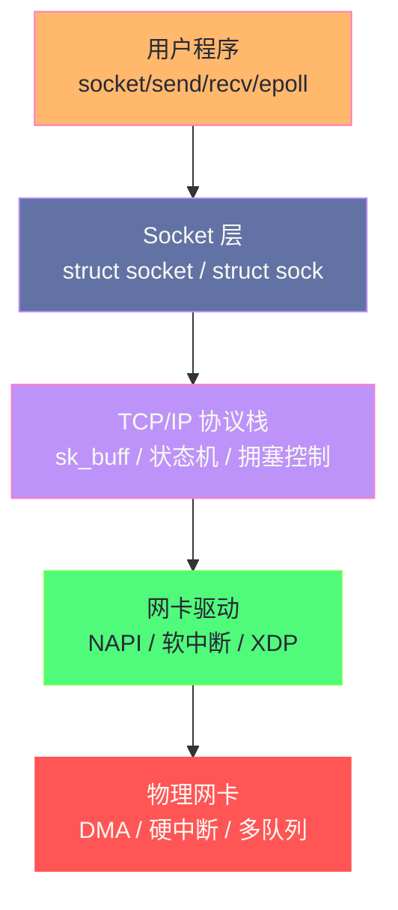

## 专栏定位

本专栏聚焦 **Linux 网络协议栈与 IO** 的内核实现与工程实践，目标读者是希望跨越"会用 API"与"理解底层"两个层次的后端工程师和系统工程师。

网络 IO 是现代服务端程序的核心瓶颈——一个 Nginx 每秒处理 10 万个请求，一个 Kafka Broker 每秒吞吐 1GB 数据，背后是 Linux 内核中数十年持续演进的网络子系统在默默支撑。理解这个系统，才能真正看懂性能问题的根源，写出真正高效的网络程序。

---

## 专栏目录

| 序号 | 文章标题 | 核心内容 |
|-----|---------|---------|
| 01 | [[01 网络 IO 的本质——从 socket() 到网卡 DMA]] | 系统调用链路、内核网络栈分层、DMA 与中断 |
| 02 | [[02 TCP/IP 协议栈内核实现——sk_buff、协议层与连接状态机]] | sk_buff 结构、协议层 hook、TCP 状态机 |
| 03 | [[03 Socket 内核深度解析——struct sock、接收缓冲区与发送缓冲区]] | struct sock/socket、收发缓冲区、阻塞与非阻塞 |
| 04 | [[04 epoll 深度解析——事件驱动 IO 的内核实现]] | select/poll 缺陷、epoll 红黑树+就绪链表、LT vs ET |
| 05 | [[05 零拷贝技术全景——sendfile、splice 与 DMA gather]] | 传统拷贝的 4 次开销、sendfile、splice、mmap+write |
| 06 | [[06 TCP 性能调优——拥塞控制、Nagle 与缓冲区优化]] | 拥塞窗口、BBR、Nagle 算法、TCP buffer 调优 |
| 07 | [[07 Linux 网络包的完整收发路径——软中断、NAPI 与 XDP]] | 硬中断→软中断→NAPI poll、XDP bypass |
| 08 | [[08 高性能网络编程——io_uring 网络、SO_REUSEPORT 与多队列 NIC]] | io_uring 异步网络、端口复用、RSS/RPS/RFS |
| 09 | [[09 容器网络原理——veth、bridge、iptables 与 eBPF]] | Network Namespace、veth pair、CNI、eBPF/XDP |
| 10 | [[10 网络性能诊断——从 ss 到 perf/eBPF 的全套工具链]] | ss/netstat、tcpdump、perf net、BCC 工具集 |

---

## 知识地图

---

## 阅读建议

- **01-03**：夯实基础，理解网络 IO 从用户态到内核态的完整路径
- **04-05**：掌握高性能服务器的两个核心技术：事件驱动 + 零拷贝
- **06**：针对 TCP 的生产调优，适合有实际调优需求的读者
- **07**：深入网卡驱动层，理解数据包如何进入内核
- **08-09**：前沿高性能技术与容器网络，适合进阶读者
- **10**：工具链，建议配合实际问题排查时参考

---

## 关联专栏

- [[Linux/性能优化/00 专栏导览|性能优化专栏]]：网络 sysctl 参数调优、基准测试方法论
- [[Java/Netty/00 专栏导览|Netty]]：基于 epoll 的 Java NIO 高性能网络框架
- [[Golang/Go并发编程/00 专栏导览|Go 并发编程]]：Go netpoller 基于 epoll 实现
- [[云原生/Kubernetes/kubernetes网络原理与插件/00 专栏导览|K8s 网络专栏]]：容器网络基于 Linux Network Namespace、veth、bridge
- [[云原生/服务网格/00 专栏导览|服务网格专栏]]：iptables 流量劫持与 Envoy 代理的网络原理
- [[中间件/Kafka/00 专栏导览|Kafka]]：零拷贝（sendfile）是 Kafka 高吞吐的关键技术
