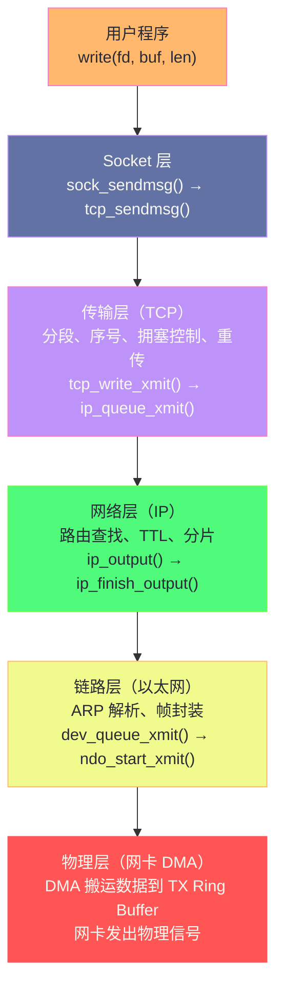
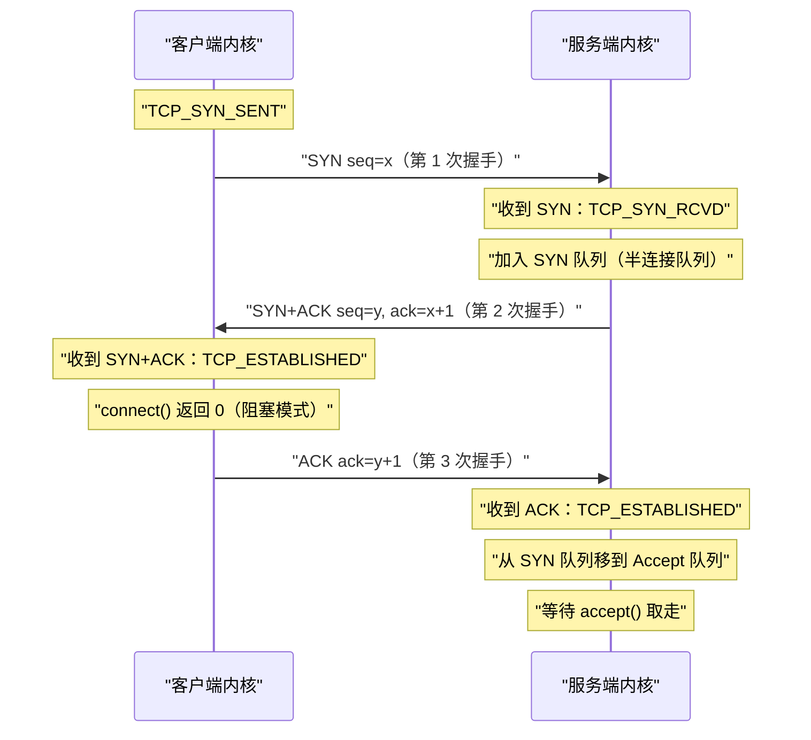

**摘要：**

"网络 IO"这个词背后藏着 Linux 最复杂的子系统之一。当我们写下 `send(fd, buf, len, 0)` 这一行 C 代码时，我们在做什么？表面上看，是把用户内存中的数据发送到远端主机；但在内核里，这一行调用触发了一系列精密的联动：用户态陷入内核态、数据被拷贝进 `sk_buff`（socket buffer）、经过 TCP 层的分段与序号管理、IP 层的路由查找、以太网层的 ARP 解析——最终通过 DMA（Direct Memory Access）绕过 CPU，由网卡控制器直接将数据搬运到物理介质上发出。本文作为专栏的第一篇，建立整个网络 IO 路径的全局视图：为什么网络 IO 以"文件描述符"抽象？内核网络栈的分层设计为什么是合理的？`socket()`、`bind()`、`connect()`、`send()`、`recv()` 这几个系统调用在内核里各自做了什么？数据从用户缓冲区到网卡 DMA 之间经历了哪些层次的数据结构变换？理解这幅全局地图，是后续深入每一层细节的基础。

---

## 第 1 章 一切皆文件：网络 IO 的 Unix 哲学

### 1.1 为什么网络连接是文件描述符

Linux 的 "一切皆文件（Everything is a file）" 哲学不只是口号——它是一个深思熟虑的抽象设计，使得所有 IO 资源（磁盘文件、设备、管道、网络连接）都能通过统一的 `read()`/`write()` 接口操作。

对于网络 IO 而言，这个抽象的具体体现是：`socket()` 系统调用返回一个**文件描述符（fd，File Descriptor）**，之后所有对这个网络连接的操作（发送数据、接收数据、关闭连接）都通过这个 fd 进行。

**这种设计带来了三个核心好处**：

**好处 1：统一的 IO 模型**。`select()`/`poll()`/`epoll()` 可以同时监听文件 fd、管道 fd 和 socket fd，不需要为不同类型的 IO 设计不同的等待机制。Nginx 能同时高效地处理磁盘文件读取和 TCP 连接，根本原因就在于这种统一抽象。

**好处 2：进程间传递网络连接**。`sendmsg()` 的 `SCM_RIGHTS` 机制允许通过 Unix Domain Socket 在进程间传递 fd——这使得预 fork 型服务器（如早期 Apache）的子进程可以从父进程接收已建立的连接，或者 HAProxy 在不中断现有连接的情况下热重载配置。

**好处 3：标准化的生命周期管理**。fd 的引用计数机制保证了连接的安全关闭——当所有持有该 fd 的进程/线程都关闭它之后，内核才真正释放底层的连接资源。

```c
/* socket fd 的使用方式与普通文件完全一致 */
int sock_fd = socket(AF_INET, SOCK_STREAM, 0);  /* 创建，等同于 open() */
connect(sock_fd, ...);                           /* 建立连接 */
write(sock_fd, buf, len);                        /* 发送数据，等同于 write() */
read(sock_fd, buf, len);                         /* 接收数据，等同于 read() */
close(sock_fd);                                  /* 关闭，等同于 close() */
```

### 1.2 文件描述符背后的两层结构

一个 socket fd 在内核中对应两个关键结构（与文件 IO 的 `struct file` + `struct inode` 类似，但具体实现不同）：

**`struct socket`**（网络层抽象）：VFS 层面的 socket 对象，连接文件描述符与具体的协议实现。

**`struct sock`**（传输层状态）：存储 TCP/UDP 连接的真实状态——IP 地址、端口、发送/接收缓冲区、TCP 状态机、拥塞窗口等所有与具体协议相关的信息。

```c
/* 进程的文件描述符表 */
struct task_struct {
    struct files_struct *files;   /* fd 表 */
};

/* fd → struct file → struct socket → struct sock 的映射链 */
struct file {
    const struct file_operations *f_op;  /* 指向 socket_file_ops（重定向 read/write 到网络栈）*/
    void *private_data;                   /* 指向 struct socket */
};

struct socket {
    struct sock *sk;      /* 指向传输层状态（TCP/UDP 的具体实现）*/
    const struct proto_ops *ops; /* 协议操作函数表（tcp_prot_ops / udp_prot_ops）*/
    struct file *file;    /* 反向指针，指向上层 struct file */
    short type;           /* SOCK_STREAM / SOCK_DGRAM / SOCK_RAW */
    socket_state state;   /* SS_UNCONNECTED / SS_CONNECTED / SS_DISCONNECTING */
};
```

这个关系的重要性在于：**struct sock 是整个连接生命周期内唯一的状态持有者**。即使进程关闭了 fd，只要 TCP 连接还在 TIME_WAIT 或 CLOSE_WAIT 状态，`struct sock` 就不会被释放——这就是为什么高并发服务器上有时会看到大量 TIME_WAIT 连接，它们消耗的不是 fd 资源，而是内核中的 `struct sock` 内存。

---

## 第 2 章 内核网络栈的分层设计

### 2.1 为什么要分层

Linux 网络栈严格按照 OSI/TCP-IP 分层模型实现，这不只是学术上的概念——分层有非常实际的工程价值：

**隔离变化**：以太网可以被 WiFi、InfiniBand、虚拟网卡替换，而 TCP 层不需要任何改动；IPv4 可以被 IPv6 替换，而应用层的 HTTP/socket API 保持不变。

**功能复用**：IP 分片、路由查找只在网络层（IP 层）实现一次，所有上层协议（TCP、UDP、ICMP）都复用这个实现。

**职责清晰**：TCP 只负责可靠传输（重传、流量控制、拥塞控制）；IP 只负责路由和寻址；以太网只负责局域网内的帧传输。每一层对上层暴露的接口都是稳定的。

### 2.2 Linux 网络栈的五层实现



**每一层做什么**：

- **Socket 层**：用户态与内核态的边界，将 `send()` 系统调用转换为对应协议（TCP/UDP）的内核操作，数据从用户缓冲区拷贝进 `sk_buff`
- **TCP 层**：分段（将大数据切成不超过 MSS 的小段）、分配序号（seq）、管理拥塞窗口（cwnd）、启动重传定时器
- **IP 层**：查找路由（dst_entry），填充 IP 头（源 IP、目标 IP、TTL），如果数据包超过 MTU 则分片
- **链路层**：通过 ARP 查找目标 MAC 地址，封装以太网帧头，调用网卡驱动的 `ndo_start_xmit`
- **物理层（网卡）**：通过 DMA 将帧数据搬运到网卡的发送 Ring Buffer，网卡控制器读取 Ring Buffer 并通过物理介质发出

### 2.3 数据包在每层的变形：协议头的封装

数据从应用层向下传递时，每一层都在原始数据前面增加自己的协议头——这个过程叫**封装（Encapsulation）**：

```
用户数据：           "Hello"（5字节）
TCP 封装后：         [TCP头 20B] + "Hello"（25字节）
IP 封装后：          [IP头 20B] + [TCP头 20B] + "Hello"（45字节）
以太网封装后：       [以太网头 14B] + [IP头 20B] + [TCP头 20B] + "Hello" + [FCS 4B]（63字节）
```

**sk_buff 是如何避免每次封装都拷贝数据的**？

如果每一层封装都需要将数据拷贝到新的内存区域（前面加头），发送一个小数据包就需要 3 次内存拷贝，非常低效。Linux 的 `sk_buff` 结构通过**预留头部空间（headroom）** 解决这个问题：

```c
/* sk_buff 的内存布局 */
struct sk_buff {
    unsigned char *head;   /* 分配的内存起始地址 */
    unsigned char *data;   /* 当前有效数据的起始地址（在 head 和 tail 之间）*/
    unsigned char *tail;   /* 当前有效数据的结束地址 */
    unsigned char *end;    /* 分配的内存结束地址 */
    /* ... 其他字段 */
};

/*
  内存布局示意：
  head                data          tail                 end
  |<--- headroom --->|<--- 数据 --->|<--- tailroom ------>|

  添加 TCP 头：将 data 指针向前移动 20 字节（skb_push），不需要拷贝数据体
  添加 IP 头：再将 data 指针向前移动 20 字节
  添加以太网头：再向前移动 14 字节

  整个封装过程：数据体（payload）一次都没有移动过！
  只有协议头被写入了 headroom 区域
*/
```

这是网络栈高效运行的关键设计——**封装只是在数据前方的预留空间中写入头部字节，不移动数据本身**，将 O(n) 的拷贝操作变成了 O(1) 的指针操作。

---

## 第 3 章 socket() 系统调用：创建网络端点

### 3.1 socket() 在内核里做了什么

```c
int sockfd = socket(AF_INET, SOCK_STREAM, 0);
```

这一行调用触发了以下内核操作：

```
sys_socket()
  ↓
sock_create()
  → alloc_socket()：从 slab 缓存分配 struct socket
  → inet_create()（AF_INET 协议族的 create 函数）：
      → 根据 SOCK_STREAM 找到 TCP 协议（struct proto tcp_prot）
      → 分配 struct sock（实际分配 struct tcp_sock，TCP 专用扩展）
      → 初始化：接收缓冲区大小（sk_rcvbuf）、发送缓冲区大小（sk_sndbuf）
                 sk_state = TCP_CLOSE
  ↓
sock_map_fd()：
  → 在当前进程的 fd 表中分配一个新 fd
  → 创建 struct file，f_op = &socket_file_ops
  → file->private_data = socket
  → 返回 fd 给用户进程
```

**关键点**：`socket()` 创建的是一个**未绑定地址、未连接、处于 TCP_CLOSE 状态**的端点。此时还没有分配端口，也没有建立连接，只是在内核中准备好了所有必要的数据结构。

### 3.2 TCP_CLOSE 状态的含义

TCP 标准定义了 11 个状态（`CLOSED`、`LISTEN`、`SYN_SENT`、`SYN_RCVD`、`ESTABLISHED`、`FIN_WAIT_1`、`FIN_WAIT_2`、`TIME_WAIT`、`CLOSE_WAIT`、`CLOSING`、`LAST_ACK`）。Linux 内核在此基础上增加了 `TCP_CLOSE`（初始状态）和 `TCP_NEW_SYN_RECV`（SYN 半连接处理）两个内部状态。

`socket()` 返回时，连接处于 `TCP_CLOSE` 状态——这不是 TCP 标准中的 `CLOSED` 状态（后者表示连接已被关闭），而是 Linux 的初始状态，表示"尚未开始任何 TCP 握手"。

---

## 第 4 章 bind() 与 listen()：服务端的准备

### 4.1 bind()：绑定地址与端口

```c
struct sockaddr_in addr = {
    .sin_family = AF_INET,
    .sin_port = htons(8080),
    .sin_addr.s_addr = INADDR_ANY,  /* 0.0.0.0，监听所有网卡 */
};
bind(sockfd, (struct sockaddr *)&addr, sizeof(addr));
```

`bind()` 在内核中的核心操作：

1. **端口合法性检查**：如果端口 < 1024（特权端口），检查进程是否有 `CAP_NET_BIND_SERVICE` 能力
2. **端口可用性检查**：查询全局的 `tcp_hashinfo.bhash`（绑定哈希表），确保该端口没有被其他 socket 绑定（除非设置了 `SO_REUSEPORT` 或 `SO_REUSEADDR`）
3. **端口注册**：将 `(IP, port)` 写入绑定哈希表

```bash
# 查看端口的 bind 情况
ss -tlnp | grep 8080
# State  Recv-Q Send-Q Local Address:Port  ...  Process
# LISTEN 0      128    0.0.0.0:8080        ...  ("nginx",pid=12345,fd=6)
```

### 4.2 listen()：创建连接队列

```c
listen(sockfd, backlog);  /* backlog：连接队列的最大深度 */
```

`listen()` 是服务端最容易被误解的系统调用之一。它做的事情是：

1. **状态转换**：`TCP_CLOSE` → `TCP_LISTEN`
2. **创建两个队列**：
   - **SYN 队列（半连接队列）**：存储收到 SYN 但还没完成三次握手的连接（SYN_RCVD 状态）
   - **Accept 队列（全连接队列）**：存储完成三次握手、等待 `accept()` 取走的连接（ESTABLISHED 状态）

**backlog 参数的真实含义**：在 Linux 中，`backlog` 控制的是**全连接队列（accept 队列）的最大长度**，而不是半连接队列。半连接队列的大小由 `net.ipv4.tcp_max_syn_backlog` 控制。

> [!warning] 生产避坑：backlog 与 accept 队列溢出
> 当 accept 队列满时（服务器来不及调用 `accept()` 取走连接），新完成三次握手的连接会被内核**丢弃**，客户端会超时重连。高并发突发场景（如秒杀流量）最容易触发这个问题。
> 诊断命令：`ss -lnt` 查看 Recv-Q（等待 accept 的连接数），如果 Recv-Q 持续等于 Send-Q（即 backlog），说明 accept 队列已满。
> 解决：增大 `listen(fd, backlog)` 的值，同时调大 `net.core.somaxconn`（系统级上限）。

```bash
# 查看 listen backlog 和 accept 队列状态
ss -lnt
# State   Recv-Q  Send-Q  Local Address:Port
# LISTEN  5       128     0.0.0.0:80
#         ↑       ↑
#     当前等待    backlog（全连接队列最大深度）
#     accept()
#     的连接数

# 调整 backlog 上限
sysctl net.core.somaxconn=4096         # accept 队列上限
sysctl net.ipv4.tcp_max_syn_backlog=8192  # SYN 队列（半连接队列）上限
```

---

## 第 5 章 connect() 与三次握手：连接建立的内核实现

### 5.1 客户端 connect() 触发什么

```c
connect(sockfd, (struct sockaddr *)&server_addr, sizeof(server_addr));
```

`connect()` 触发 TCP 三次握手的**第一步**：

```
sys_connect()
  → tcp_v4_connect()
      → 查路由表，找到到达 server_addr 的本地接口和源 IP
      → 分配本地临时端口（从 ip_local_port_range 范围随机选择）
      → 构造 SYN 包（sk_buff）：
          TCP 标志位 SYN=1，seq=ISN（初始序号，随机生成）
      → 状态转换：TCP_CLOSE → TCP_SYN_SENT
      → 发送 SYN 包：tcp_transmit_skb() → ip_output() → ... → 网卡 DMA
      → 启动超时重传定时器（若 SYN 丢失，默认重试 6 次）
  → 对于阻塞 socket：进程睡眠，等待三次握手完成（ESTABLISHED 状态）
  → 对于非阻塞 socket：立即返回 EINPROGRESS，不等待握手完成
```

### 5.2 三次握手的完整内核路径



**SYN Cookie 机制**：当 SYN 队列满（受到 SYN Flood 攻击）时，Linux 启用 SYN Cookie——服务端不保存半连接状态，而是将连接信息编码进 SYN+ACK 的 seq 中。收到 ACK 时解码 seq 验证合法性，再建立连接。这样 SYN 队列永远不会溢出，防止了基于 SYN Flood 的 DoS 攻击。

```bash
# 开启 SYN Cookie（生产服务器推荐开启）
sysctl net.ipv4.tcp_syncookies=1
```

---

## 第 6 章 send()：数据从用户态到网卡 DMA 的完整路径

### 6.1 send() 系统调用的全链路

这是本文最核心的一节——追踪一次 `send()` 调用从用户态到网卡物理发送的完整过程：

```
用户程序：send(sockfd, buf, len, 0)
  ↓
sys_send() → sys_sendto() → sock_sendmsg()
  ↓
① 用户态 → 内核态切换（系统调用陷入）
  ↓
② inet_sendmsg() → tcp_sendmsg()
   → 将用户缓冲区的数据拷贝进 sk_buff（第 1 次也是唯一一次 CPU 拷贝）
   → 数据进入 socket 的发送缓冲区（sk->sk_write_queue）
   → 如果发送缓冲区已满（sk_sndbuf 限制）且 socket 为阻塞模式：
     进程睡眠，等待缓冲区有空间（ACK 回来后空间被释放）
  ↓
③ tcp_push() → tcp_write_xmit()
   → 检查拥塞窗口（cwnd）和接收窗口（rwnd）：
     可发送字节数 = min(cwnd, rwnd) - 已发送未确认字节数
   → 对数据进行 TCP 分段（每段 ≤ MSS，通常 1460 字节）
   → 填充 TCP 头（源端口、目标端口、seq、ack、flags、窗口大小）
   → 启动重传定时器（RTO timer）
  ↓
④ ip_queue_xmit() → ip_output()
   → 查找路由缓存（dst_entry）：找到出口网卡和下一跳 IP
   → 填充 IP 头（版本、TTL、协议号、源 IP、目标 IP）
   → 如果数据包 > MTU：IP 分片（现代 TCP 通常不会到这一步，TCP 层已按 MSS 分段）
  ↓
⑤ ip_finish_output() → neigh_output()（邻居子系统，处理 ARP）
   → 查找 ARP 缓存（arp_cache）：IP → MAC 地址
   → 若 ARP 未命中：发送 ARP 请求，将当前数据包放入 ARP 等待队列，等 ARP 回复
   → 填充以太网帧头（目标 MAC、源 MAC、EtherType=0x0800）
  ↓
⑥ dev_queue_xmit()
   → 将数据包放入网卡的发送队列（qdisc，排队规则，默认 pfifo_fast）
   → 调用网卡驱动的 ndo_start_xmit()（如 e1000e_xmit_frame、ixgbe_xmit_frame）
  ↓
⑦ 网卡驱动：
   → 将 sk_buff 的物理地址写入网卡的 TX Ring Buffer 描述符
   → 更新 TX Ring Buffer 的 tail 指针（MMIO 写，通知网卡硬件有新数据）
   → 函数返回，CPU 不再等待
  ↓
⑧ 网卡硬件（DMA）：
   → 网卡控制器读取 TX Ring Buffer 描述符中的物理地址
   → 通过 PCIe DMA 从系统内存（sk_buff 数据区）读取数据
   → 将数据发送到物理网线（转为电信号/光信号）
   → 发送完成：触发硬中断（TX completion interrupt）
  ↓
⑨ TX completion 中断处理：
   → 释放已发送的 sk_buff（调用 kfree_skb()）
   → 更新发送缓冲区的可用空间
   → 唤醒因发送缓冲区满而阻塞的进程（如果有）
```

**全程只有一次 CPU 数据拷贝**：步骤 ② 中，用户缓冲区 → `sk_buff` 的拷贝。之后数据在内核中只是通过指针传递 `sk_buff`，没有再次拷贝数据体。网卡 DMA 直接从 `sk_buff` 的内存地址读数据，CPU 不参与数据搬运。

> [!note] 设计哲学：为什么需要那一次拷贝
> 用户缓冲区不能直接交给 DMA 使用有两个原因：
> 1. **地址空间问题**：用户空间是虚拟地址，DMA 需要物理地址（或通过 IOMMU 映射的地址）
> 2. **生命周期问题**：用户的 `send()` 返回后，用户程序可能立即修改或释放 `buf`，但网卡的 DMA 可能还没有完成传输
> 这就是为什么 `send()` 返回时，数据已经被安全地拷贝到了内核的 `sk_buff` 中——用户程序可以放心地重用 `buf`。`零拷贝（sendfile/splice）` 技术通过特殊机制绕过了这一次拷贝，将在 [[05 零拷贝技术全景——sendfile、splice 与 DMA gather]] 中详细介绍。

### 6.2 发送缓冲区的流量控制

`tcp_sendmsg()` 会检查 socket 发送缓冲区的剩余空间：

```c
/* tcp_sendmsg 的简化逻辑 */
while (msg_data_left(msg)) {
    /* 检查发送缓冲区是否有空间 */
    while (!sk_stream_memory_free(sk)) {
        /* 发送缓冲区满：进程阻塞等待 */
        sk_stream_wait_memory(sk, &timeo);
        /* 等待条件：对端 ACK 确认了已发送数据，缓冲区空间被释放 */
    }
    /* 将用户数据拷贝进 sk_buff，加入发送队列 */
    skb = tcp_stream_alloc_skb(sk, select_size(...));
    skb_add_data_nocache(sk, skb, &msg->msg_iter, copy);
}
```

这就是 TCP 背压（Back Pressure）机制的内核实现：如果接收方处理不过来（ACK 回来的慢），发送方的发送缓冲区会被填满，`send()` 调用会阻塞，从而自然地限制发送速率。

---

## 第 7 章 recv()：数据从网卡 DMA 到用户缓冲区

### 7.1 接收路径的逆向过程

接收数据的路径与发送路径基本对称，但有一个关键差异：**发送是主动的（进程主动调用 send），接收是被动的（网卡中断触发）**：

```
① 网卡接收到以太网帧：
   → 通过 DMA 将帧数据写入 RX Ring Buffer（内核预分配的内存）
   → 触发硬中断（NAPI 机制下是软中断，详见 [[07 Linux 网络包的完整收发路径——软中断、NAPI 与 XDP]]）
  ↓
② 中断处理程序（网卡驱动）：
   → 从 RX Ring Buffer 取出 sk_buff
   → 调用 netif_receive_skb()，将 sk_buff 交给协议栈
  ↓
③ 以太网层处理：
   → 检查目标 MAC 是否是本机 MAC
   → 解析 EtherType，确定上层协议（0x0800 = IPv4）
  ↓
④ IP 层处理（ip_rcv()）：
   → 校验 IP 校验和
   → 如果是给本机的包：找上层协议（TCP=6 → tcp_v4_rcv()）
   → 如果需要转发：ip_forward()（路由器功能）
  ↓
⑤ TCP 层处理（tcp_v4_rcv()）：
   → 通过 4 元组（源 IP:port, 目标 IP:port）查找对应的 struct sock
   → 校验序号、检查是否有序（乱序则放入 out_of_order queue）
   → 发送 ACK（延迟 ACK 或即时 ACK）
   → 将数据放入 socket 的接收缓冲区（sk->sk_receive_queue）
   → 唤醒等待数据的进程（wake_up_interruptible(sk->sk_sleep)）
  ↓
⑥ 进程被唤醒，调用 recv()/read()：
   → 从 sk->sk_receive_queue 取出 sk_buff
   → 将 sk_buff 中的数据拷贝到用户缓冲区（第 1 次也是唯一一次 CPU 拷贝）
   → 释放 sk_buff
   → 返回读取的字节数
```

**接收路径也只有一次 CPU 拷贝**：sk_buff 数据区 → 用户缓冲区。网卡 DMA 写入 RX Ring Buffer 到 `recv()` 返回，数据体本身只被复制了一次。

---

## 小结

网络 IO 的本质是：**用文件描述符抽象网络连接，用分层的协议栈处理数据封装与解封，用 sk_buff 的 headroom 机制避免封装时的数据拷贝，用 DMA 将 CPU 从数据搬运工作中解放出来**。

**三个关键认知**：

1. **socket fd 背后是两层结构**：`struct socket`（VFS 抽象层）+ `struct sock`（协议层状态），`struct sock` 的生命周期独立于 fd，这是 TIME_WAIT 大量存在的根本原因

2. **整个发送/接收路径只有一次数据拷贝**：用户缓冲区 ↔ sk_buff 之间。协议头的封装通过调整 `sk_buff.data` 指针实现，数据体不移动；DMA 直接访问内存，CPU 不搬运数据

3. **分层设计的真实价值**：不是为了符合 OSI 模型，而是为了隔离变化（TCP 不关心以太网还是 WiFi）、复用功能（所有协议共用 IP 路由）、清晰职责（拥塞控制在 TCP，路由在 IP）

下一篇 [[02 TCP/IP 协议栈内核实现——sk_buff、协议层与连接状态机]] 将深入 `sk_buff` 的完整数据结构，解析 TCP 状态机的所有状态转换条件（包括 TIME_WAIT 为什么持续 2MSL），以及协议层注册/查找机制（`inet_protos` 哈希表）如何实现协议的扩展性。
