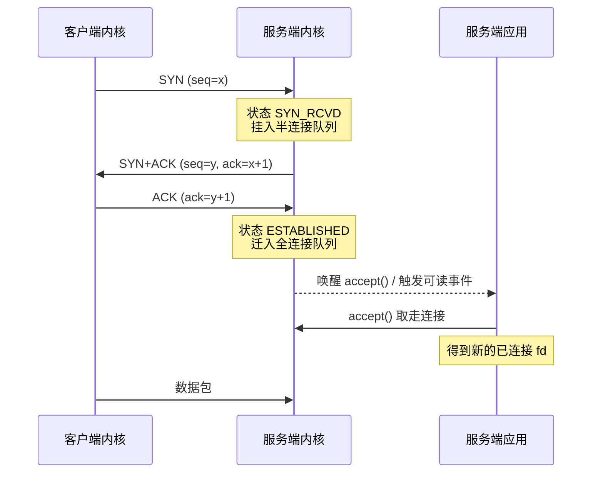
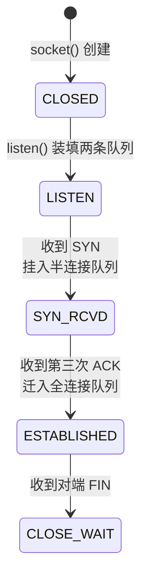

# 网络 IO 的本质——从 socket() 到网卡 DMA

**摘要：**

当应用写下 `send(fd, buf, len, 0)` 这一行代码时，背后启动的是 Linux 内核中最庞大的子系统之一：用户态陷入内核态，数据被封装进 `sk_buff`，依次穿越 TCP 层的分段与序号管理、IP 层的路由查找、邻居子系统的地址解析，最终由网卡通过 DMA（Direct Memory Access，直接内存访问）把数据搬上物理链路。本文是整个专栏的地图篇，沿着"一行代码如何变成电信号"这条主线，先回答抽象层的问题——为什么网络连接在 Unix 世界里以文件描述符的面目出现，fd 背后的 `struct file`、`struct socket`、`struct sock` 各自承担什么；再回答路径层的问题——`socket()`、`bind()`、`listen()`、`connect()`、`send()`、`recv()` 这六个系统调用在内核里分别做了什么，数据包从用户缓冲区到网卡、再从网卡回到用户缓冲区走过的每一段路究竟由谁铺就。文末还专门讨论这幅地图的适用边界：当 XDP、DPDK 这类内核旁路技术出现时，经典路径的哪些区域被抄了近道。理解了这张全景图，后续各篇对协议栈、socket 缓冲区、epoll、零拷贝的逐层深潜才有坐标可依。

---

## 第 1 章 一切皆文件：网络 IO 的 Unix 哲学

### 1.1 1983 年的遗产：Socket API 从哪里来

要理解 Linux 网络 IO 的形态，不妨把时钟拨回 1983 年 8 月。伯克利加州大学发布了 4.2BSD，这个版本随附了一组崭新的系统调用——`socket()`、`bind()`、`connect()`、`listen()`、`accept()`，它们把网络通信从"少数实验室的专有技术"变成了"每个 Unix 程序员都能掌握的日常工具"。在此之前的 ARPANET 时代，网络访问接口由 IMP（Interface Message Processor，接口消息处理器）这类专用硬件的私有协议定义，各计算机厂商各自为政，写一个网络程序几乎等同于研究一份硬件手册。

4.2BSD 的设计者面临一个关键抉择：网络编程接口应当长成什么样。他们没有另起炉灶，而是把网络端点塞进了 Unix 既有的抽象体系——**一切皆文件（Everything is a file）**。网络连接如同磁盘文件一样返回一个整数句柄，读写网络与读写文件共用同一组 `read()`/`write()` 系统调用。这个决定的影响远超当时想象：此后三十余年，从各商业 Unix 到 Windows 的 Winsock，再到 POSIX 标准（IEEE Std 1003.1g，2000 年正式定稿），主流操作系统的网络 API 都继承了这套语义；1991 年问世的 Linux 自然也不例外，其网络栈从实现之日起就遵循 BSD Socket 的接口约定。

但"继承接口约定"不等于"继承实现"。Linux 的网络栈是全新写的，它在 BSD 接口之下藏着一整套自己的数据结构与分层机制，这正是本专栏要解剖的对象。

### 1.2 把网络连接伪装成文件，图的是什么

"网络连接是文件"这句话听上去像一句口号，但它是一个有精确工程收益的设计决策，值得把收益拆开来看清楚。

**第一个收益是统一的 IO 多路复用模型**。`select()`、`poll()`、`epoll` 这些机制之所以能同时监听磁盘文件、管道、终端和 TCP 连接，根源在于它们监听的对象是同一类东西——文件描述符及其背后的 `struct file`。Nginx 能够用一个事件循环同时处理磁盘上的静态文件请求与上万条客户端 TCP 连接，靠的正是这种统一抽象；倘若网络 IO 有自己独立的一套等待机制，多路复用就得为每种 IO 类型各写一遍。

**第二个收益是连接可以在进程间传递**。通过 Unix Domain Socket 的 `SCM_RIGHTS` 机制，一个进程可以把自己打开的 socket fd 发送给另一个进程，内核会把 `struct file` 的引用转移到接收方。预 fork 型服务器让子进程接管父进程已建立的连接，HAProxy 借此在不中断现有连接的情况下完成热重启，归根到底都在使用这一机制。

**第三个收益是标准化的生命周期管理**。fd 背后的 `struct file` 带引用计数，只有当所有持有它的进程都调用了 `close()`，内核才会释放 socket 并触发 TCP 连接的关闭流程。这个语义让"连接泄漏"成为可以被工具（譬如 `lsof`）精确定位的问题，而不是一团说不清道不明的悬空状态。

### 1.3 一个 fd 背后的四层结构

不过，"网络连接是文件"只是 VFS 层面的表象。一个 socket fd 在内核中对应一条四级的对象链，每一级有自己的职责，混淆它们是初学者理解内核网络时最常见的障碍。

第一级是进程文件描述符表里的整数 fd，它只是进入第二级 `struct file` 的下标。`struct file` 是 VFS 的通用文件对象，其 `f_op` 指针指向一组文件操作函数——对 socket 而言，这组函数被替换成了 `sock_read_iter`、`sock_write_iter`、`sock_poll` 等网络版本的实现，`read()`/`write()`/`poll()` 等通用系统调用正是在这里被"重定向"到网络栈的。第三级是 `struct socket`，它是 BSD Socket 层的对象，向上衔接 VFS、向下衔接具体协议族，持有连接状态（`SS_CONNECTED`、`SS_UNCONNECTED` 等）与协议操作表 `struct proto_ops`。第四级是 `struct sock`，也就是网络子系统真正的主角：TCP 状态机、四元组、发送与接收缓冲区、拥塞窗口、重传队列——所有与协议语义相关的状态全部记录在这里，它也是整个专栏出现频率最高的结构体，02 与 03 篇将分别从协议栈与缓冲区的视角解剖它。

下图把这条对象链画了出来，虚线以下属于网络子系统，虚线以上属于 VFS 与进程：

```mermaid
%%{init: {'theme': 'dracula'}}%%
flowchart TB
    subgraph VFS["进程与 VFS 层"]
        FD["fd（整数下标）"] --> FILES["files_struct<br/>fd 表"]
        FILES --> FILE["struct file<br/>f_op = socket_file_ops"]
    end
    FILE ==private_data==> SOCKET
    subgraph NET["网络子系统"]
        SOCKET["struct socket（BSD 层）<br/>state / ops = inet_stream_ops"]
        SOCKET ==sk==> SOCK["struct sock（传输层）<br/>四元组 / 状态机 / 缓冲区 / 拥塞控制"]
    end
    style FD fill:#44475a,stroke:#bd93f9
    style FILE fill:#44475a,stroke:#ff79c6
    style SOCKET fill:#44475a,stroke:#ffb86c
    style SOCK fill:#44475a,stroke:#50fa7b
```



打个比方，这条链像一栋酒店的管理体系：fd 是房卡上的房间号，`struct file` 是前台登记系统里那条统一的入住记录（所有类型的客人——散客、会议团、长包房——都记在同一套系统里），`struct socket` 是客房部的服务台账（记录这位客人按哪种接待流程服务），`struct sock` 才是房间本身——床、空调、保险箱这些真正承载住宿体验的设施。客人抱怨空调坏了，问题永远出在第四级；抱怨前台态度差，才轮到前两级。定位网络问题时，`ss` 命令看到的是 `struct sock` 的状态，而 `lsof` 看到的是 fd 与 `struct file` 的关系，两套视角各司其职。

值得强调的是，`struct socket` 与 `struct sock` 并非两个孤立的对象，而是成对创建、互相持有指针；Linux 用这种"两层皮"的结构让 BSD 语义（socket）与协议实现（sock）解耦——协议族的切换（`AF_INET` 换成 `AF_UNIX`）发生在 `struct socket` 层，而协议内部的状态演进对上层完全透明。

用代码把这条链写出来会更直观（字段经过大幅简化，只保留理解路径所需的骨架）：

```c
/* fd → struct file → struct socket → struct sock 的对象链 */
struct file {
    const struct file_operations *f_op;  /* socket 场景 = socket_file_ops */
    void *private_data;                  /* 指向 struct socket */
};

struct socket {
    struct sock *sk;                     /* 指向传输层真身 */
    const struct proto_ops *ops;         /* AF_INET 流式 = inet_stream_ops */
    short state;                         /* SS_CONNECTED / SS_UNCONNECTED ... */
};

struct sock {
    unsigned short sk_family;            /* AF_INET */
    struct sock_common __sk_common;      /* 四元组、状态机、引用计数 */
    struct sk_buff_head sk_receive_queue;/* 接收缓冲区（skb 链） */
    struct sk_buff_head sk_write_queue;  /* 发送缓冲区（skb 链） */
    void (*sk_data_ready)(struct sock *sk); /* 数据就绪回调，epoll 的挂接点 */
    /* ...拥塞窗口、重传队列、定时器等 TCP 全部状态 */
};
```

`sk_data_ready` 这个回调指针请先记住，第 6 章它会成为理解 epoll 的钥匙。

### 1.4 这套抽象的边界：socket 与普通文件的不同

统一抽象不等于完全等价，socket 与普通文件在几个关键行为上存在精确的差异，认清差异比记住口号更有价值。

`lseek()` 对 socket 无意义——文件有随机访问的偏移量，TCP 是只有顺序的字节流，内核对 socket 的 `llseek` 直接返回 `ESPIPE`。`mmap()` 对 socket 同样无效：文件可以映射是因为内容安稳地躺在页缓存里（[[Linux/内存管理/04 Page Cache：Linux 为什么要用内存来缓存磁盘]]），而 socket 的数据在网络上来去匆匆，根本没有一份稳定的"内容"可供映射。`ioctl()` 则反向膨胀——socket 支持大量网络专属的控制命令（譬如 `SIOCGIFCONF` 枚举接口、`SIOCETHTOOL` 操作网卡），这些命令穿透 `struct file` 直达驱动，是不少运维工具的底层通道。

fd 本身的分配规则也值得知道：内核总是取"当前最小的可用编号"分配新 fd，进程默认上限由 `RLIMIT_NOFILE` 约束（容器环境还叠加 cgroup 与 systemd 的层层限制）。这个"最小可用"规则是无数事故的注脚——某个 fd 泄漏后，后续连接复用它的编号，一旦泄漏的 fd 被意外关闭，正在服务的连接会毫无征兆地被斩断。排查这类问题时，`/proc/<pid>/fd` 目录下的编号连续性是最直观的证据。

---

## 第 2 章 内核网络栈的分层设计

### 2.1 分层不是教条，而是分工

教科书把网络协议栈画成 OSI 七层或 TCP/IP 四层，初学者容易把"分层"当作一种美学洁癖。但分层的真正动机是残酷的工程现实：把数据从一台主机的用户进程送到另一台主机的用户进程，途中要处理介质编码、帧定界、寻址路由、可靠传输等性质截然不同的问题，任何试图用一个大函数包打天下的设计，都会在每个新链路类型或新传输需求出现时被迫重写全部代码。

这段历史可以给出两个锚点。1974 年 5 月，Vint Cerf 与 Bob Kahn 发表论文《A Protocol for Packet Network Intercommunication》，首次系统阐述了"用网关互联不同分组网络"的思想，TCP 的分层雏形由此确立；1983 年 1 月 1 日，ARPANET 完成著名的"Flag Day"切换，NCP 协议一夜退役，TCP/IP 成为唯一协议——一次计划好的、不可回滚的停机升级，此后互联网再没有过第二次这样的机会。

耐人寻味的是紧随其后的一场标准之争。ISO 于 1984 年发布 OSI 七层参考模型，携各国标准化机构与电信厂商之力，试图为网络通信颁布一套自上而下的完整规范；CCITT 甚至为配套协议栈（X.400、X.25）投入了十年之功。结局众所周知：OSI 协议栈败给了"粗糙但先跑起来"的 TCP/IP，七层模型只作为教学词汇幸存。这场竞争常被简化为"开放战胜封闭"，但更准确的说法是**实践标准战胜了规范标准**——TCP/IP 先有能跑的实现与不断增长的存量网络，规范反过来追认现实；OSI 则先有委员会文书，实现始终追不上纸面。Linux 内核社区对这个教训心领神会：内核网络代码从不等任何标准委员会，XDP、io_uring 都是代码先行、文档随后。

Linux 内核的目录结构忠实反映了这种分工：`net/socket.c` 与 `net/core/` 承接 BSD Socket 层与通用网络设施，`net/ipv4/` 实现网络层与 TCP，`drivers/net/` 则是数百个网卡驱动的驻地。每层只依赖相邻层的接口，这让"给内核换一种链路"或"加一种传输协议"成为局部手术而非全身换血。

下表把教科书分层与 Linux 实际实现对应起来——请注意，Linux 没有独立的"会话层""表示层"，它们被压缩进了应用与传输层之间的库代码（譬如 TLS 位于用户态 OpenSSL 或内核 kTLS）：

| 教科书分层 | TCP/IP 模型 | Linux 内核实现 | 本专栏对应章节 |
| :--- | :--- | :--- | :--- |
| 应用层 / 表示层 / 会话层 | 应用层 | 用户态程序 + 系统调用接口 | 第 3~6 章 |
| 传输层 | 传输层 | `net/ipv4/tcp*.c`、`udp.c` | 02、03、06 |
| 网络层 | 网络层 | `net/ipv4/ip*.c`、路由子系统 | 02 |
| 数据链路层 | 网络接口层 | 邻居子系统 + `net/core/dev.c` + 网卡驱动 | 07 |
| 物理层 | （并入接口层） | PHY 芯片与介质 | 不在内核范围 |

### 2.2 分层的代价：头部、拷贝与校验和

分层买来了正交性，卖出去的是性能。每个包每穿过一层就要被加一段头部：TCP 头 20 字节起，IP 头 20 字节起，以太网帧头帧尾共 18 字节——一笔最朴素的账：1 KB 的有效载荷走标准以太网，实际要搬运 1118 字节，头部税约 5.5%；载荷缩到 64 字节时税率飙到 40% 以上，小包场景的协议栈开销因此远比直觉沉重。比头部更昂贵的是三件事。

第一件是**逐层校验和计算**。TCP 与 IP 都要校验和，若每层都用 CPU 逐字节算一遍，10 Gbps 线速下 CPU 将全部耗在这件事上。现代内核与网卡的合作方案是校验和卸载（Checksum Offload）：CPU 只在 skb 中标记"本包校验和未算"，真正的计算交给网卡硬件在发出前完成。

第二件是**分段**。应用一次 `write()` 可能送来 100 KB，但以太网 MTU 只有 1500 字节，TCP 必须按 MSS（Maximum Segment Size，标准以太网上为 1460 字节）切分。若每个分段都独立走一遍协议栈，协议栈处理次数会暴涨几十倍。TSO（TCP Segmentation Offload）与 GSO（Generic Segmentation Offload）的思路是把大包一直攒到最靠近网卡的地方才切——这是 08 篇的主角之一，此处按下不表。

第三件是**拷贝**。数据从用户缓冲区进入 skb、从 skb 到网卡，路径上有多处拷贝机会，每一次都是内存带宽的净消耗。零拷贝技术的整个谱系（05 篇）本质上都是在回答"分层架构下，哪些拷贝其实可以不发生"。

这就是理解内核网络的基本视角：**每一项"看起来理所当然"的优化，都是对分层架构某项固有代价的针对性赎回**。分层的债先欠下，再用卸载、聚合、旁路逐笔偿还。

### 2.3 协议注册：内核网络的插件化骨架

分层架构在代码上如何落地。Linux 的答案是一组注册表：协议栈的每一层都维护着一张"类型 → 处理函数"的映射表，启动时各协议向相邻下层登记自己。

socket 层这一级，`sock_register()` 把 `AF_INET`、`AF_INET6`、`AF_UNIX` 等地址族登记进 `net_families[]`，`socket()` 系统调用按第一个参数查表，找到对应地址族的创建函数。传输层这一级，`inet_add_protocol()` 把 TCP（协议号 6）、UDP（协议号 17）、ICMP（协议号 1）登记进协议分发表，IP 层收到包后按 IP 头中的协议字段查表分发。传输协议本身还有第三张表——`struct proto`（譬如 `tcp_prot`），它携带该协议的 `connect`、`sendmsg`、`recvmsg` 等全部操作函数与专用 slab 缓存。

这套三层注册表让内核网络栈呈现清晰的插件化形态：实现一个内核态的自定义传输协议，只需填好一份 `struct proto` 并注册，无需改动 IP 层一行代码。打个比方，协议栈像一套分拣系统，每一层的分拣口都按"运单类型"预留了滑槽，新协议入驻只是新开一个滑槽，整条流水线无需停机改造。不过，插件化的灵活性也有边界——注册关系在编译期与初始化期就已确定，它解决的是"实现解耦"，不是"运行时热插拔"。

`tcp_prot` 的关键字段能让这套机制变得具体——每个字段都是一条系统调用的内核落点：

```c
struct proto tcp_prot = {
    .name            = "TCP",
    .connect         = tcp_v4_connect,    /* connect() 的终点 */
    .disconnect      = tcp_disconnect,
    .sendmsg         = tcp_sendmsg,       /* send()/write() 的终点 */
    .recvmsg         = tcp_recvmsg,       /* recv()/read() 的终点 */
    .bind            = inet_bind,
    .listen          = inet_listen,
    .accept          = inet_csk_accept,
    .close           = tcp_close,
    .hash            = inet_hash,         /* 挂入四元组哈希表 */
    .unhash          = inet_unhash,
    .get_port        = inet_csk_get_port, /* bind() 的端口分配 */
    .sockets_alloc   = ...                /* 连接计数统计 */
    /* 省略：slab 参数、内存压力回调、diag 接口等 */
};
```

从这份字段表可以看到一个重要的分派结构：`struct socket` 层的 `inet_stream_ops` 是所有流式 socket 的公共门面，而 `tcp_prot` 才是 TCP 的真身——同样是 `sendmsg` 这个动作，门面层做通用检查后转到协议层，UDP 与 TCP 从此分道扬镳。读内核网络源码时，把握"门面 → 协议"这个两级跳转，就不容易在数万行代码里迷路。

把本章与第 3 章要讲的调用放在一起，可以归纳出一张"系统调用 → 内核落点"的速查表，后文各章的展开都可对照此表定位：

| 系统调用 | 门面层（`inet_stream_ops`） | 协议层（`tcp_prot`） | 所属章节 |
| :--- | :--- | :--- | :--- |
| `socket()` | `inet_create`（地址族创建） | `tcp_v4_init_sock` | 3.1 |
| `bind()` | `inet_bind` | `inet_csk_get_port` | 3.2 |
| `listen()` | `inet_listen` | `inet_csk_listen_start` | 3.3 |
| `accept()` | `inet_accept` | `inet_csk_accept` | 4.2 |
| `connect()` | `inet_stream_connect` | `tcp_v4_connect` | 4.1 |
| `send()` / `write()` | `inet_sendmsg` | `tcp_sendmsg` | 5.1 |
| `recv()` / `read()` | `inet_recvmsg` | `tcp_recvmsg` | 6.1 |

---

## 第 3 章 socket()、bind() 与 listen()：服务端的准备

### 3.1 socket()：三个参数如何变成内核对象

`socket(AF_INET, SOCK_STREAM, 0)` 大概是每个后端程序员写过无数遍的调用，但它在内核里的完整旅程值得走一遍。系统调用入口先按 `AF_INET` 查 `net_families[]`，找到 IPv4 地址族的创建函数 `inet_create()`；后者根据 `SOCK_STREAM` 与协议号 0（0 表示采用流式套接字的默认协议，即 TCP）定位 TCP 的 `struct proto`（`tcp_prot`）；随后 `sk_alloc()` 从 TCP 专用的 slab 缓存中分配一个 `struct sock`，`sock_init_data()` 初始化其等待队列、缓冲区与回调函数；最后 VFS 层分配 `struct file` 与 fd，把三者串成第 1.3 节画出的那条对象链。

有三个细节值得停留。其一，此刻的 socket 还没有任何地址与对端信息，四元组全空，它处于 `TCP_CLOSE` 状态——"CLOSE"这个名字容易误导，其真实含义是"未连接"。其二，`sk_alloc()` 用的是每协议独立的 slab 缓存，同类 socket 的内存布局完全一致，分配与释放的代价接近 O(1)——百万级连接场景下，这一点决定了内存管理的可行性。其三，新 socket 创建后会被挂入协议的哈希表（TCP 是 `tcp_hashinfo`），后续每个到达的包都要按四元组查这张表来定位归属的 socket，查表效率直接决定包处理吞吐。

### 3.2 bind()：端口占用的本质

`bind()` 把一个地址与端口钉在 socket 上，内核为此做的事远比"填两个变量"复杂。IPv4 的端口资源由 `inet_hashinfo` 中的端口哈希表管理：内核把 0~65535 的端口空间组织成一个个端口桶（`inet_bind_bucket`），bind 时在目标端口桶上检查冲突——是否已有 socket 占用了会令语义混乱的 `<地址, 端口>` 组合。

冲突判定规则里藏着两个经典 socket 选项的语义边界。`SO_REUSEADDR` 允许绑定处于 TIME_WAIT 状态的地址端口组合——它的设计目的是让服务重启不必等 2MSL 的定时器自然熄灭，而不是允许多个 socket 同时监听同一端口（那是 `SO_REUSEPORT` 的职责，08 篇详述）。笔者见过不少线上事故源于把这两个选项的语义搅在一起：开发者在多进程程序里误设 `SO_REUSEADDR` 并期望获得负载均衡，结果所有进程挤在同一个监听队列上，accept 竞争反而加剧了锁冲突。

不调用 `bind()` 可以吗。可以——客户端 socket 在 `connect()` 时由内核自动分配临时端口（ephemeral port，范围由 `net.ipv4.ip_local_port_range` 控制，常见配置为 32768~60999）。但服务端若不 bind，监听端口便不可预期，所以实践中只有纯客户端程序才省略这一步。

bind 的冲突判定规则值得用一张表说清楚，它决定了"两个 socket 能否共存"：

| 场景组合 | 不设选项 | `SO_REUSEADDR` | `SO_REUSEPORT` |
| :--- | :--- | :--- | :--- |
| 新 socket 绑定 TIME_WAIT 中的地址端口 | 拒绝（EADDRINUSE） | 允许 | 允许 |
| 两个 socket 绑定同一具体 IP 与端口 | 拒绝 | 拒绝 | 允许（需双方都设置） |
| 一个绑定 `0.0.0.0`，另一个绑定具体 IP | 拒绝 | 允许 | 允许 |
| 两个 socket 绑定通配地址 `0.0.0.0:80` | 拒绝 | 拒绝 | 允许 |

这张表也解释了一个反直觉的现象：重启服务时新进程 bind 报 `EADDRINUSE`，往往不是旧进程还活着，而是旧连接的 TIME_WAIT 尚未散场——`SO_REUSEADDR` 正是为此而设。至于 `SO_REUSEPORT`（Linux 3.9 合入，2013 年），它允许多个 socket 完全平等地绑定同一端口，且内核在握手阶段就把新连接哈希到其中一个 socket 上，从源头消除了 accept 锁竞争，08 篇将把它与多队列 NIC 的亲和性放在一起讨论。

### 3.3 listen()：两个队列的诞生

`listen(fd, backlog)` 常被理解为"开始监听"，但它的内核语义更具体：把 socket 状态置为 `TCP_LISTEN`，并创建两个队列。第一个是半连接队列（SYN Queue），存放收到 SYN、已回复 SYN+ACK、但尚未等到第三个 ACK 的连接——这些连接处于 `SYN_RCVD` 状态，三次握手只走了三分之二。第二个是全连接队列（Accept Queue），存放三次握手已完成、等待应用调用 `accept()` 取走的连接。

两个队列的容量上限各有人管。半连接队列的规模与 `net.ipv4.tcp_max_syn_backlog` 有关，在较新内核中还会随 backlog 与 `net.core.somaxconn` 联动推算；全连接队列的上限则是 `min(backlog, somaxconn)`——`somaxconn` 在老版本内核中默认仅 128，这正是无数"高并发服务偶发丢连接"问题的根源：队列满时，新完成握手的连接无处安放，内核的行为（丢弃收尾的 ACK、依赖客户端重传，或回 RST，取决于 `tcp_abort_on_overflow`）对应用完全透明。这个默认值的演进本身就是一部容量焦虑史：128 的出身可以追溯到早期的低速网络假设，而 Linux 5.4 起已把默认值提高到 4096，配合各发行版的 sysctl 调优，"忘调 somaxconn"这类事故在今天更多出现在老旧内核与容器镜像里。

打个比方，accept 队列像餐厅门口的等位区：三次握手是领位员确认"这桌客人确实到齐了"，而 `accept()` 是服务员把客人请进店里；等位区塞满了，后续确认完的客人只能被请走。服务端程序的义务是让 accept 的消费速度跟上握手的完成速度——Reactor 模型把 accept 当作事件循环里的一种就绪事件统一调度，正是为此。

backlog 参数还常被误解为"并发连接上限"。它只约束全连接队列的长度，与连接建立后能承载多少并发毫无关系；但若应用 accept 太慢，堆积同样会反噬握手。监控队列的堆积程度（`ss -lnt` 输出的 Recv-Q，对 LISTEN 状态的 socket 而言就是当前全连接队列长度）是诊断 accept 瓶颈的第一手段，10 篇会把它纳入工具链。

### 3.4 close() 与 shutdown()：两种关闭的语义分野

与"服务端准备"相对的是收尾动作，而收尾有两个语义不同的系统调用，混用它们是长连接服务的经典事故源。`close(fd)` 的语义是"我这个进程不再持有这个 fd"——引用计数减一，减到零才触发连接的关闭流程（四次挥手）。而 `shutdown(fd, how)` 的语义是"我要在连接上做方向性声明"：`SHUT_WR` 表示"我不再发送，但你发来的我照收"，它会立即发出 FIN，不影响读取方向的可用性。

两者的差异在两个场景里性命攸关。一是**多进程共享 fd 的服务**（譬如预 fork 模型）：子进程退出时调用 close 只是减掉自己那份引用，连接对父进程依旧完好；想真正"声明关闭"，必须 shutdown。二是**优雅下线**：服务想告诉客户端"我不会再发数据了，但你们发来的最后几个请求我会处理完"，标准做法就是 `shutdown(SHUT_WR)` 后继续 recv 直到读到 0——这比直接 close 少了"半途丢弃对端在途数据"的风险。`close()` 默认还会顺手开启 RST 式的粗暴路径：若关闭时接收缓冲区里还有未读数据，内核将直接发 RST 而非 FIN（这一行为可用 `SO_LINGER` 调整），对端可能连"正常结束"的机会都没有。把这些语义放进工具箱，第 02 篇讨论四次挥手状态机时会反复用到。

---

## 第 4 章 connect() 与三次握手：连接建立的内核实现

### 4.1 客户端视角：connect() 返回意味着什么

`connect()` 的语义可以一句话概括：向内核发出指令，把一个 `TCP_CLOSE` 状态的 socket 推进到 `TCP_ESTABLISHED`，期间发生的一切（发 SYN、收 SYN+ACK、发 ACK）都由内核代劳。对阻塞式 socket 而言，`connect()` 在收到对端的 SYN+ACK 后即刻返回——注意，它不等对端应用做任何事情，甚至不等对端内核把连接放入 accept 队列被取走；第三方网络里"connect 成功但对端程序压根没 accept"的场景完全合法，全连接队列兜着这份时间差。

若 SYN 没有得到回应，内核会按指数退避重发：Linux 的 `net.ipv4.tcp_syn_retries` 默认为 6，即 1s、2s、4s、8s、16s、32s、64s 共七次尝试，累计约 127 秒后才向应用报 `ETIMEDOUT`。这个数字解释了两个常见的生产现象：一是故障切换时"连接要卡两分钟才报错"——因为网络黑洞比拒绝服务更耗时；二是健康检查必须设置远小于 127 秒的超时，否则探活系统会失去意义。对非阻塞 socket，`connect()` 立即返回 `EINPROGRESS`，应用随后用 `epoll` 监听可写事件并调用 `getsockopt(SO_ERROR)` 确认结果——这是所有高性能客户端（譬如 Redis、gRPC 的连接器）的标准做法，Go 语言的 netpoller 与 Java NIO 都把这套流程封装成了看似同步的 API（参见 [[Golang/Go并发编程/08 Go 网络编程——netpoller 与 Goroutine-per-Connection]]）。

非阻塞 connect 的骨架代码值得一看，它是理解"异步建连"的原始形态：

```c
int fd = socket(AF_INET, SOCK_STREAM | SOCK_NONBLOCK, 0);
int ret = connect(fd, (struct sockaddr *)&addr, sizeof(addr));
if (ret == 0) {
    /* 极少见：本机回环等场景直接成功 */
} else if (errno == EINPROGRESS) {
    /* 握手进行中：注册到 epoll，只关心可写 */
    struct epoll_event ev = { .events = EPOLLOUT, .data.fd = fd };
    epoll_ctl(epfd, EPOLL_CTL_ADD, fd, &ev);
    /* 就绪后：getsockopt(fd, SOL_SOCKET, SO_ERROR, &err, &len)
       err == 0 则连接建成；否则 err 即建连失败的错误码 */
}
```

这段代码里有一个初学者常踩的深坑：`EPOLLOUT` 就绪并不严格等于"连接成功"——连接被拒绝（收到 RST）时 socket 同样会变为可写，唯有 `SO_ERROR` 才是成败的最终裁决。多数语言的网络库把这个细节藏了起来，藏得越好，使用者越容易忘记底下发生过什么。

### 4.2 服务端视角：两个队列之间的流转

服务端收到 SYN 后，内核从半连接资源中分配一个 request_sock，回复 SYN+ACK，连接进入 `SYN_RCVD` 状态并挂入半连接队列；等到第三个 ACK 到达，内核把连接升级为完整的 `struct sock`，状态置为 `ESTABLISHED`，移入全连接队列，随后唤醒正阻塞在 `accept()` 上的进程（或触发监听 socket 的可读事件，让 epoll 感知）。整个握手过程不消耗任何用户态 CPU，也不需要应用参与一个字节——这是"三次握手由内核完成，accept 只是从队列取走现成的连接"这句话的准确含义。

时序如下图所示，请留意两条队列在图中的进出时刻：



把服务端 socket 在这一阶段的状态推进单独抽出来，得到一张最小状态图——每个状态与 3.3 节的两条队列一一对应，完整的 11 状态状态机留到 02 篇展开：



半连接队列的存在让服务器暴露于一种经典攻击——SYN Flood：攻击者海量发送 SYN 却永不回复 ACK，半连接队列被占满后正常用户的握手无法进行。内核的对策是 `tcp_syncookies`：不再为半开连接保存状态，而是把连接信息编码进 SYN+ACK 的序号字段，收到合法 ACK 时凭序号反推出连接参数直接建连。Syncookies 是典型的"用计算换内存"的权衡，它有功能限制（譬如无法协商部分 TCP 选项），因此只在队列溢出时才启用。

### 4.3 为什么是三次，两次不行吗

这是一个被讲滥了却少有人讲透的问题。RFC 793（1981 年 9 月）确立的握手设计，核心目的不是"礼节性的互相确认"，而是让通信双方就初始序号（Initial Sequence Number，ISN）达成一致——TCP 的可靠性建立在"每个字节都有序号"之上，双方必须各自声明"我从这个序号开始发"，并得到对方确认。两次握手只能保证服务端的 ISN 被确认，客户端的 ISN 则悬空。

反事实推演可以看得更清楚。假设两次握手成立：客户端发 SYN，服务端收到即建立连接。设想一个在网络里迷路了很久、迟到抵达的旧 SYN（它可能是某个早已放弃的连接的残骸），服务端无法辨别它是新请求还是残骸，只能照单全收地建立连接并持有资源——而客户端对这条"单方面成立"的连接一无所知，服务端将挂着一条永远等不到数据的僵尸连接。三次握手中，服务端对这条可疑连接只回复 SYN+ACK 并挂入半连接队列，客户端不回 ACK，超时后资源即释放。**第三次 ACK 本质上是客户端对服务端 ISN 的确认，同时是对"我确实想建这条连接"的最终背书**。这也顺带回答了"四次为什么不需要"：SYN 与 ACK 可以合并进同一个包，三次是保证双方 ISN 确认的最小次数。

### 4.4 让握手更快的两代尝试：T/TCP 与 TFO

三次握手保证正确性的同时，也带来一整个 RTT 的建立延迟——对跨洋链路，这意味着百毫秒级的首字节惩罚。工程界对这段延迟的围剿从未停止，其中两次值得一提。

第一次是 T/TCP（TCP for Transactions，RFC 1644，1994 年），试图用缓存对端最后一次握手信息的方式实现"零次握手"事务，但它因重放攻击与旧缓存失配问题未能推广，最终在 2011 年被 RFC 6247 正式废弃——这个失败案例说明，任何绕过握手的捷径都必须回答"如何对抗陈旧与伪造"。第二次是 TCP Fast Open（RFC 7413，2014 年成为建议标准）：首次握手时服务器颁发一个加密 cookie，客户端后续建连可以在 SYN 包中直接携带请求数据，服务器校验 cookie 后立即处理，省掉一个 RTT。Linux 自 3.7 起支持 TFO（服务端监听 socket 需设置 `TCP_FASTOPEN` 队列长度，客户端需设置 `TCP_FASTOPEN_CONNECT`）。不过 TFO 的推广同样缓慢：中间盒对 SYN 携带数据的兼容性问题、以及对重放窗口的谨慎处理，让它至今主要活跃在 CDN 与大型服务内部——正确的握手续费虽然昂贵，但为它设计的每一张"优惠券"都要经过安全性的长期检验。

---

## 第 5 章 send()：数据从用户缓冲区到网卡的完整旅程

### 5.1 TCP 层：tcp_sendmsg 的分段与缓冲

`send()` 进入内核后直达 `tcp_sendmsg()`，这里发生的第一件事是内存申请：内核从 TCP 的专用缓存中分配 `sk_buff`（skb，网络数据包的统一载体，02 篇将完整解剖其设计），把用户缓冲区的数据**拷贝**进来——这是网络 IO 路径上最著名的一次 CPU 拷贝，除非使用 [[05 零拷贝技术全景——sendfile、splice 与 DMA gather]] 讨论的零拷贝手段，否则它无法避免。拷贝完成后，TCP 层做三件协议义务：按 MSS 把数据切成段、为每段分配序号、构造 TCP 头（含端口号、序号、确认号、窗口、校验和占位）。

这一过程的主干可以浓缩成一段伪代码，注意它在每一步都在做"记账"：

```c
int tcp_sendmsg(struct sock *sk, struct msghdr *msg, size_t size)
{
    while (尚未拷完全部数据) {
        /* 1. 预算检查：发送缓冲区还能容纳吗？
           sk_wmem_alloc + 本 skb truesize > sk_sndbuf 时视作无空间 */
        if (无空间 && 非阻塞) return -EAGAIN;
        if (无空间 && 阻塞)   睡眠等待 sk_write_space 唤醒;

        /* 2. 取出或新分配 skb，沿 MSS 切分出可写窗口 */
        skb = tcp_write_queue_tail(sk) 或 sk_stream_alloc_skb(sk);

        /* 3. 把用户数据拷入 skb 的尾部空闲区（此处是那次著名的拷贝） */
        copy = skb_put_user_data(skb, msg, 可写字节数);

        /* 4. 推进序号、记账 sk_wmem_alloc，能合并则合并不能则新开段 */
        tcp_push_pending_frames(sk);  /* 视窗口与 Nagle 决定何时真正发出 */
    }
    return 已拷贝字节数;   /* 只承诺"进了发送缓冲区" */
}
```

这段伪代码里藏着 send 语义的全部答案：返回值只覆盖"步骤 3 的拷贝量"，与网络上发出多少、对端收到多少毫无关系；步骤 1 的预算检查就是背压的闸门；而"能合并则合并"正是 Nagle 算法与 send 路径互动的位置（06 篇详述）。

send 的返回时机是理解 TCP 的关键，也是最多误解的地方。`send()` 返回非负值，只表示数据**已进入内核的发送缓冲区**（`sk_sndbuf` 划定的空间），绝不代表对端收到，更不代表对端应用读到——数据此刻只是被内核接管，真正的发送由协议栈按拥塞窗口与对端接收窗口的许可异步进行。返回值语义可以总结成一张表：

| 调用情形 | 阻塞 socket | 非阻塞 socket |
| :--- | :--- | :--- |
| 缓冲区有足够空间 | 拷贝后立即返回写入字节数 | 同左 |
| 缓冲区剩余空间不足写入量 | 阻塞直到全部写入 | 尽量写入部分并返回该部分长度 |
| 缓冲区完全无空间 | 睡眠等待缓冲区腾出 | 返回 `-1`，`errno = EAGAIN` |
| 连接已收到 FIN 后再写 | 首次可写入，对端回 RST 后触发 `SIGPIPE`/`EPIPE` | 同左 |

这张表里最容易埋雷的是最后一行：对端关闭后继续写，第一次 send 甚至可能成功（对端的 FIN 只是"我不再发了"，不代表拒收），等对端以 RST 回应后才会在下一次写入时引爆——若进程未忽略 `SIGPIPE` 信号，默认行为是直接终止进程。缓冲区满时内核如何记账也有讲究：skb 的内存占用按 `truesize`（skb 结构本身加数据区的真实开销）计而非按有效载荷计，因此小包高频写入会让缓冲区账面消耗远超应用预期，`EAGAIN` 会比直觉更早出现。03 篇讨论缓冲区自动调整时会把这笔账算细。

若发送缓冲区已满，阻塞 socket 会睡眠等待缓冲区腾出空间，非阻塞 socket 则立即返回 `EAGAIN`，这正是"TCP 背压"作用在应用上的形态：对端收不动或网络堵了，本端应用迟早会被 send 的阻塞或 EAGAIN 反噬。[[03 Socket 内核深度解析——struct sock、接收缓冲区与发送缓冲区]] 将把这个缓冲区的细节展开。

### 5.2 IP 层与邻居子系统：路由与 ARP

skb 离开 TCP 层后进入 `ip_queue_xmit()`，IP 层在此做两件决定包命运的事。第一件是**路由查找**：按目的地址查 FIB（Forwarding Information Base， forwarding 信息库），确定"这个包从哪个网卡出去、下一跳网关是谁"。第二件是**填写 IP 头**：源地址、目的地址、TTL、协议号，并再次处理分段（若路径 MTU 小于包长且未启用卸载）。

但 IP 层此刻还差一个关键信息：下一跳的 MAC 地址。IP 地址只在大网络间导航，到了"最后一公里"，帧必须用 MAC 地址在链路层寻址。补齐这个地址的是邻居子系统（Neighbour Subsystem）：它维护一张邻居表（`ip neigh` 可查看），命中则直接填入以太网头；未命中则发起 ARP 请求广播"谁是 192.168.1.1"，把待发包挂进队列等解析完成。若 ARP 一直无响应，包将在队列中超时丢弃——"能 ping 通网关但发不出包"一类故障的病灶往往就在这张表上。

路由查找环节还有一段值得知道的历史：Linux 曾长期维护一份基于哈希的路由缓存（route cache），查找先查缓存再查 FIB；但这份缓存的键空间可被攻击者以伪造源地址的方式撑爆（2000 年代中后期的路由缓存 DoS 研究），内核在 3.6 版本（2012 年）彻底移除了路由缓存，改为每次直接查 FIB 并辅以 trie 结构保证效率。这个决定与 syncookies 一脉相承——**凡是"无界缓存 + 攻击者可控键值"的组合，在互联网上都是定时炸弹**。

### 5.3 驱动与 DMA：把字节交给硬件

到达链路层出口后，内核调用驱动的 `ndo_start_xmit()`，把 skb 交给网卡。这里的核心机制是**描述符环（Descriptor Ring）**：内核与网卡共享一片环形缓冲区，每个槽位是一个描述符，记录着某个 skb 数据区的物理地址与长度。驱动把 skb 的地址写进空闲槽位，敲一下门铃寄存器（doorbell）通知网卡"有新活"；网卡的 DMA 引擎按描述符**直接从内存读出数据**，自行组装成帧发上链路，全程不惊动 CPU。发送完成后，网卡触发一个中断，内核在中断处理里释放 skb、归还槽位——这就是发送路径的收尾。

用快递作比：驱动是打包台，把包裹（skb）放上传送带（描述符环）并在面单上写清货架坐标（物理地址）；DMA 是库房里的机械臂，按面单坐标直接取货装车，不需要打包台的工人亲手搬；发车回执（completion 中断）回到打包台，工人才能回收包裹箱（释放 skb）。这条机制的精妙之处在于 CPU 与数据搬运的解耦——CPU 只负责"登记坐标"，搬运本身由硬件完成。不过解耦也有代价：DMA 只认物理连续的内存地址，skb 的数据区必须落在 DMA 可寻址的区域内，这一约束深深影响了 skb 的分配策略（02 篇展开）。

在驱动收包之前，出向流量还要经过一道常被忽略的关卡——**qdisc（排队规则， queuing discipline）**。默认的 `pfifo_fast` 是个不分区、无调度的 FIFO（现代内核默认已是 `fq_codel`），更讲究的场景可以换用 `fq`（fair queue，BBR 拥塞控制的最佳搭档）或分层限速的 HTB。排队规则决定了"谁先走、谁让路"，是 bufferbloat（缓冲区膨胀）治理的主战场，06 篇讨论缓冲区调优时会回到这里。它的存在位置也解释了一个经典现象：`tc` 命令在出向链路上限速立竿见影，入向却只能靠丢弃模拟——因为 qdisc 只长在发送路径上。

> [!info] 名词速记
> 本章出现的几个内核名词在后续章节会反复出现：skb（数据包载体，02 篇）、qdisc（出向排队规则，06 篇）、描述符环（驱动与网卡共享的 DMA 队列，07 篇）。第一遍阅读不必记住细节，只需要知道它们分别"住在地图的哪个位置"。

把整条发送路径合起来看，下图是本文的中央地图，后续每一章都是对图中某个方框的放大：

```mermaid
%%{init: {'theme': 'dracula'}}%%
flowchart TB
    A["应用 send(buf)"] -->|拷贝| B["TCP 层<br/>tcp_sendmsg：skb 分配<br/>分段 / 序号 / TCP 头"]
    B --> C["IP 层<br/>路由查找 / IP 头 / 分片"]
    C --> D["邻居子系统<br/>ARP 解析下一跳 MAC"]
    D --> E["qdisc 排队<br/>（tc 流量控制）"]
    E --> F["网卡驱动<br/>ndo_start_xmit 写描述符环"]
    F -->|门铃| G["网卡 DMA 引擎<br/>直接读内存组帧"]
    G --> H["物理链路"]
    G -.->|发送完成中断| F
    style A fill:#44475a,stroke:#bd93f9
    style B fill:#44475a,stroke:#ff79c6
    style C fill:#44475a,stroke:#8be9fd
    style D fill:#44475a,stroke:#ffb86c
    style F fill:#44475a,stroke:#50fa7b
    style G fill:#44475a,stroke:#f1fa8c
```



---

## 第 6 章 recv()：数据到达的另一半故事

### 6.1 数据未到时，进程在做什么

发送路径讲完，接收路径从"等待"讲起。当应用调用 `recv()` 而接收缓冲区里没有数据时，内核把这个进程的等待实体（wait queue entry）挂到该 socket 的等待队列上，然后调度器把进程移出运行队列——进程就此睡眠，不占 CPU。这里有个常被忽略的细节：**睡眠是按 socket 隔离的**，一万条连接各有一万个等待队列，阻塞 IO 模型下一个进程一次只能睡在一条队列上，这正是"一连接一线程"模型在万级连接下崩溃的根源——线程数本身成为不可承受之重，04 篇的 epoll 正是为了把"一万条队列"折叠成"一次等待"而生的。

数据到达时的唤醒链条是接收路径的脊椎。网卡 DMA 把包写入内存、触发硬中断，驱动的中断处理做最少量的工作（确认与调度）后，包的协议栈处理交由软中断完成；TCP 层处理完这个包，把数据放进对应 socket 的接收缓冲区，随后调用该 socket 注册的 `sk_data_ready` 回调——默认实现是 `sock_def_readable`，它遍历该 socket 的等待队列，把睡在里面的进程唤醒。整条链条如下图所示：


至此，沉睡的 `recv()` 醒来，把数据从接收缓冲区拷入用户缓冲区，返回成功。recv 的返回值同样有一套精确语义：正数是拷贝的字节数；`0` 表示对端已 orderly 关闭（收到 FIN）且缓冲区已空，这是判断"对端正常断开"的唯一可靠手段；`-1` 伴随 `EAGAIN` 表示非阻塞模式下暂无数据。把 `0` 当错误码忽略，或把 `EAGAIN` 当致命错误处理，都是实际代码里出现频率极高的 bug。

### 6.2 就绪通知：epoll 如何搭上这条链的便车

细心的读者会注意到，上一节的唤醒机制里藏着一个可扩展的支点：每个 socket 都有一个可注册的 `sk_data_ready` 回调。epoll 的全部魔法就建立在这一点上——`epoll_ctl(EPOLL_CTL_ADD)` 做的事，本质上是把 epoll 的回调 `ep_poll_callback` 替换/挂接到 socket 的等待队列上，此后数据就绪时被唤醒的不只是睡眠的进程，还有 epoll 的就绪队列管理逻辑：内核把这个 socket 挂入 epoll 实例的就绪链表，`epoll_wait()` 只是收割这条链表。多路复用的性能优势不在于"更快的轮询"，而在于**复用了协议栈本身就有的数据到达通知点**，把一万次轮询压缩成一万次回调加一次收割。

这段机制在 04 篇有整整一章的篇幅，此处只需在地图上标记位置：`sk_data_ready` 这条唤醒链，就是阻塞 IO 与 epoll 世界的分岔路口。

### 6.3 拷贝与粘包：recv 拿到的是什么

`recv()` 醒来后的动作是从接收缓冲区把数据拷贝到用户缓冲区——发送路径上有多少次拷贝的讨论，在这里同样成立，且方向相反。值得专门澄清的是**"粘包"**：TCP 是字节流协议，没有消息边界，一次 `send(8KB)` 可能在对端表现为两次 `recv(4KB)`，或四次 `send(2KB)` 合并为一次 `recv(8KB)`；skb 的边界、MSS 的切分、网络的重组都会影响 recv 的切分方式，但无论怎么切，字节流的顺序绝对保真。消息边界的维护永远是应用层协议的责任（长度前缀、分隔符、定长帧），Netty 的 LengthFieldBasedFrameDecoder 一类解码器正是为此而生。把"粘包"当作 TCP 的缺陷，是把字节流语义误读成报文语义——协议没有背叛你，是你误解了契约。

用一个两轮收发的例子把"应用如何自建边界"落到实处。发送方按"4 字节大端长度 + 载荷"组帧：

```c
/* 发送方：组帧后一次性写入 */
uint32_t len = htonl(payload_len);
writev(fd, (struct iovec[]){{&len, 4}, {payload, payload_len}}, 2);

/* 接收方：状态机式读取——先凑齐 4 字节头，再按头凑齐载荷 */
while (已读头部 < 4)  n = read(fd, 头部缓存 + 已读头部, 4 - 已读头部);
while (已读载荷 < ntohl(len)) n = read(fd, 载荷缓存 + 已读载荷, ...);
```

接收方必须容忍"读到的字节数随时可能小于期望"——这正是字节流语义的日常形态。凡是在 TCP 上直接假设"一次 read 返回一条完整消息"的代码，都在等一个必然到来的线上事故。

> [!warning] 边界反例
> 两种组帧方式各有失效场景：长度前缀要求接收方必须先凑齐头部才能继续，头部错位（譬如前一帧载荷越界）会让整个流从此失步且难以自愈；分隔符方案则要处理"载荷中恰好出现分隔符"的转义问题。二进制协议多选长度前缀，文本协议（如 Redis 的 RESP）多用分隔符——选择本身没有对错，错的是"不作选择"，直接裸读字节流。

### 6.4 乱序到达时，接收缓冲区里的秩序

还有一类情况值得在地图上标注：TCP 报文并不保证按序到达，链路上的路由变化、丢包重传都会让后发的包先到。TCP 接收侧为此维护着一套精密的秩序：只有序号恰好衔接当前读点的报文才被放进接收缓冲区等待应用读取，超前到达的报文则被暂存在乱序队列（out-of-order queue）中，同时立即向对端发送重复 ACK 告知"我缺某一段"；缺口一旦补上，乱序队列里的报文按序归位，应用侧完全无感。若对端支持 SACK（Selective ACK，选择性确认），重复 ACK 还能携带"我已收到哪些区间"的精确信息，让重传只补缺口而不推倒重来。这套机制意味着**应用永远看到一条干净的有序字节流，乱序的混乱被协议栈完整消化**——代价是乱序期间接收缓冲区被暂存报文占用，极端乱序下会挤压 recv 的可用空间，06 篇讨论缓冲区调优时会回到这个细节。

---

## 第 7 章 这幅地图的边界：什么时候它不适用

### 7.1 被抄近道的路径：XDP 与内核旁路

前六章铺陈的是 Linux 网络的"国道干线"——包从网卡驱动进入内核协议栈，逐层上行，最终抵达 socket。但这条干线上有两个著名的近道，它们的存在划定了本文地图的适用边界。

第一个近道是 **XDP（eXpress Data Path）**。它在驱动收到包之后、skb 分配之前就提供了一个挂载点：一段 eBPF 程序直接在原始帧上做判断——丢弃、重写、转发或放行进入协议栈。由于绕过了 skb 分配与协议栈逐层处理，XDP 能在包处理路径上取得数量级的性能提升，DDoS 清洗、负载均衡（Katran、Cilium 的数据面）是它的主场。第二个近道是 **内核旁路（kernel bypass）**：DPDK、AF_XDP 这类方案干脆把网卡队列的部分或全部控制权交给用户态程序，协议栈整个不参与。对特定的极致性能场景，这些近道是合理的；但对绝大多数业务系统，内核协议栈提供的连接管理、拥塞控制、安全机制仍是不可替代的基础设施——**旁路是精尖工具，不是默认选项**。[[07 Linux 网络包的完整收发路径——软中断、NAPI 与 XDP]] 将完整走一遍收包路径与这些近道的分岔点。

此外还有第三条路值得区分：**io_uring 的异步化不是旁路**。它依然走完整的内核协议栈，只是把"发起系统调用"这个动作从每次同步等待改为批量提交、异步收割，砍掉的是系统调用与等待的开销，路径上的每一层处理一样不少。把"异步"（io_uring）与"旁路"（XDP/DPDK）混为一谈，会导致选型时高估一方或低估另一方的适用范围——08 篇将给出三者的完整对比。

### 7.2 一次 send 的开销构成：钱花在了哪里

把本文的地图换算成性能账本，一次阻塞 `send()` 大致包含四笔开销：系统调用陷出与返回（数百纳秒量级）、用户到内核的数据拷贝（受内存带宽约束，skb 分配亦有代价）、协议栈逐层处理（头部构造、路由查找、邻居查找）、以及可能发生的上下文切换（若发送时缓冲区满而睡眠）。对 64 字节的小包高频场景，前两笔占比最高——这正是系统调用开销优化（[[Linux/性能优化/08 系统调用开销与用户态优化——vDSO、seccomp 与零系统调用]]）与零拷贝（05 篇）着力之处；对大吞吐场景，第三笔的逐包处理成为瓶颈——GSO/TSO 与多队列并行（08 篇）为此而生。

值得指出的是，这些开销没有一个可以归咎于"内核写得烂"。它们是通用抽象的固定成本：内核不知道你的应用要发什么、发给谁、以什么模式收发，于是为最坏情况与最普遍情况同时买单。性能优化在本质上是一场信息补给——当你能向内核承诺更多（譬如 io_uring 注册缓冲区意味着"这批内存一直给我用"），内核就能少买单。

> [!note] 量级速记
> 以现代 x86 服务器为参照：一次系统调用往返在数百纳秒量级，一次内存拷贝的代价取决于带宽与缓存命中（数据离 L3 越近越便宜），一次上下文切换在微秒量级且附带缓存污染的隐性成本。本文给的是量级感而非精确值，具体数字依赖 CPU 型号、内核版本与负载形态，测量方法见 [[10 网络性能诊断——从 ss 到 perf 与 eBPF 的全套工具链]]。

### 7.3 抽象的价值与逃逸的代价

行文至此，可以给"网络 IO 的本质"下一个收束了。Socket API 与分层协议栈是一套**用性能换通用性的抽象**：它让 1983 年写的 echo 服务器代码在 2026 年的 100 Gbps 网卡上依然能跑，让应用程序完全不感知链路是以太网还是 Wi-Fi；代价是路径上的拷贝、逐层处理与两态切换。这个权衡在绝大多数场景下是划算的——业界公认的经验是，先在抽象内穷尽手段（缓冲区调优、epoll、零拷贝、参数调优），仍然够不到业务线速要求时，才考虑 XDP 与 DPDK 这类旁路手段，因为旁路买回性能的代价是把协议栈曾经替你隐藏的全部复杂性重新请回应用层。

---

## 小结

本文沿"一行代码到电信号"的主线铺开了 Linux 网络 IO 的全景地图，要点有三。其一，**一切皆文件是接口层的统一抽象**，fd → `struct file` → `struct socket` → `struct sock` 四级对象链各司其职，VFS 统一外观、网络子系统承载协议语义。其二，**分层是分工而非教条**，头部、拷贝与校验和是分层的固有代价，卸载、聚合与旁路是逐笔偿还的债。其三，**发送路径是"拷贝进 skb 后逐层封装直至 DMA"的流水线**，接收路径则以 socket 等待队列与 `sk_data_ready` 唤醒链为脊椎——后者正是 epoll 的立足点。

阅读建议也顺带交代：本文刻意在多个位置埋下了"往后翻"的钩子（skb、缓冲区、epoll、零拷贝、调优、诊断），第一遍通读不必在任何一个方框里久留；等你带着全文的骨架读完后续各篇，再回头重看第 5 章那张中央地图，会有完全不同的颗粒感。下一篇 [[02 TCP、IP 协议栈内核实现——sk_buff、协议层与连接状态机]] 将深入这条流水线的货物载体 `sk_buff` 与 TCP 状态机的内核实现，回答"包在内核里究竟长什么样、状态机如何推进"的问题。

---

## 参考资料

1. RFC 793, *Transmission Control Protocol*, IETF, 1981
2. RFC 1122, *Requirements for Internet Hosts -- Communication Layers*, IETF, 1989
3. RFC 4987, *TCP SYN Flooding Attacks and Common Mitigations*, IETF, 2007
4. RFC 7413, *TCP Fast Open*, IETF, 2014
5. RFC 6247, *Moving T/TCP (RFC 1644) to Historic Status*, IETF, 2011
6. V. Cerf, R. Kahn, *A Protocol for Packet Network Intercommunication*, IEEE Transactions on Communications, 1974
7. Marshall Kirk McKusick 等，*The Design and Implementation of the 4.3BSD UNIX Operating System*（4.2BSD Socket API 的设计背景）
8. W. Richard Stevens 等，*UNIX Network Programming, Volume 1: The Sockets Networking API*, 3rd Edition
9. Robert Love, *Linux Kernel Development*, 3rd Edition（系统调用与内核基础设施）
10. Linux 内核文档：Documentation/networking/（ip-sysctl.txt 等参数手册）

---

> [!note] 思考题
> 1. 非阻塞 `connect()` 返回 `EINPROGRESS` 后，为什么用"监听可写事件 + `getsockopt(SO_ERROR)`"确认结果，而不是监听可读事件？连接失败（收到 RST）时这条链路会如何表现？
> 2. 全连接队列溢出时，默认行为是丢弃第三次握手的 ACK、依赖客户端重传，而非立即回 RST。这个"温柔的失败"设计保护了什么，又会在什么监控盲区里让问题长期潜伏？
> 3. `SO_REUSEADDR` 与 `SO_REUSEPORT` 语义不同却常被混用。假设你用四个进程监听同一端口做负载均衡，用错了前者，内核与各进程分别会发生什么？

