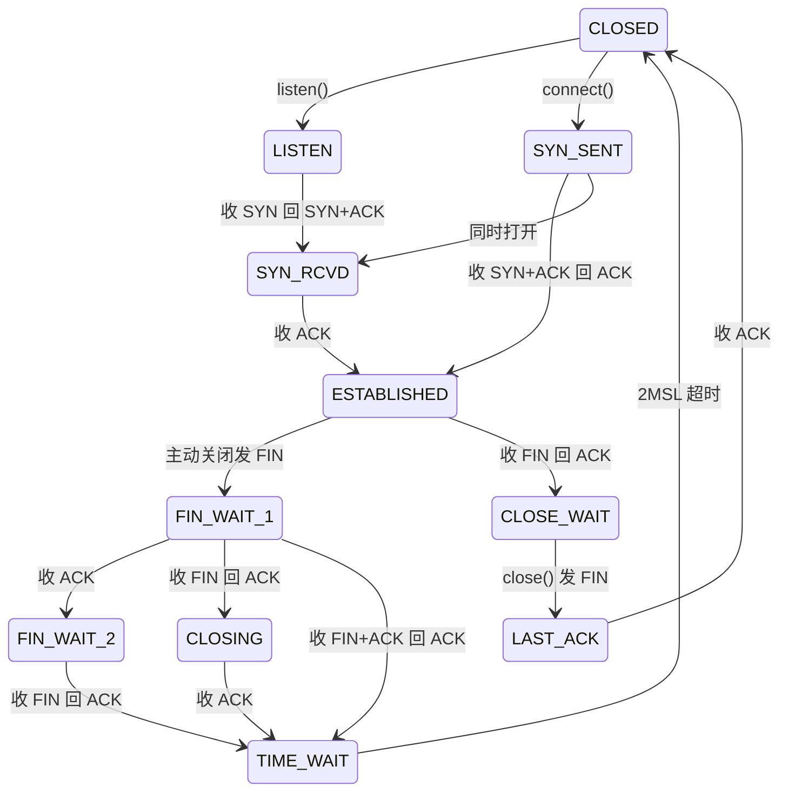
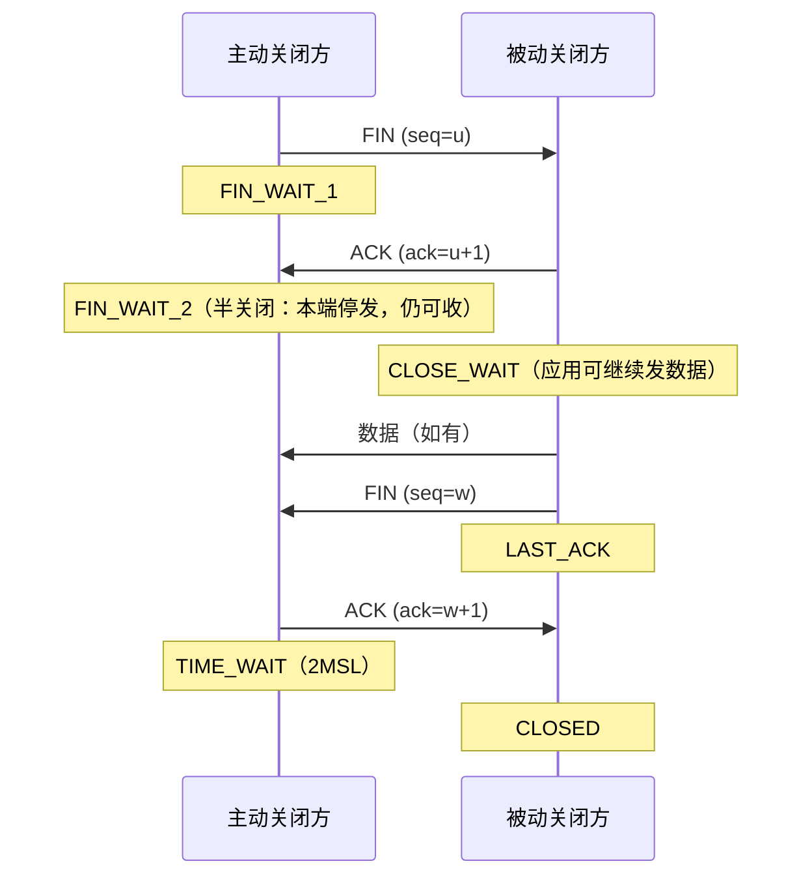

# TCP/IP 协议栈内核实现——sk_buff、协议层与连接状态机

**摘要：**

上一篇铺开了从 `send()` 到网卡 DMA 的全景地图，本篇把镜头推进到地图上的两个关键方框：数据包的载体与协议的骨架。第一个问题是"包在内核里长什么样"——`sk_buff`（下文简称 skb）是 Linux 网络子系统唯一的报文载体，它用四个指针的移动取代数据的搬移，用页片段（paged fragment）支撑大包与零拷贝，用引用计数支撑多路径共享；不理解 skb 的内存布局，就无法理解协议封装为什么高效、sendfile 为什么可行、DMA 为什么能直接读内存。第二个问题是"包在内核里如何被分派"——从 IP 层按协议号查表分发，到 TCP 按"先精确后通配"的规则在哈希表里为每个包找到归属的连接，这条分派链决定了高并发下的查找开销。第三个问题是"连接的生命周期如何被形式化"——RFC 793 定义的 11 个状态构成的状态机是 TCP 的脊椎，本篇逐个拆解每个状态的进出条件，重点解剖生产中最高频的两个困惑：TIME_WAIT 为什么要存在 2MSL 之久、CLOSE_WAIT 堆积为什么几乎总是应用的锅。本文回答两个核心问题：一个网络包在内核中被如何表示与流转，一条 TCP 连接在内核中被如何描述与推进。

---

## 第 1 章 sk_buff：网络数据包的内核载体

### 1.1 一个"丑"结构体的设计动机

初读内核网络代码的人几乎都会对 skb 产生同样的第一印象：字段多、注释密、宏与内联函数盘根错节，与教科书里"干净的报文结构体"相去甚远。这种"丑"不是失控，而是四十余年性能压力层层叠加的化石层。要理解它的每个设计，先要理解内核网络对报文载体提出的四条苛刻约束。换一个角度说，教科书结构体假设的是"一个包属于一个协议、走一条路径、被一个消费者处理"，而内核面对的现实是：一个包可能被 N 层协议依次封装、被 M 个子系统同时窥视、在任意一层被重写或丢弃。skb 的所有复杂性，都是对这四条约束的正面回答。

第一条是**头部必须原地增删**。包从驱动上行，每进一层就要剥掉一层头部（以太网头、IP 头、TCP 头）；下行则相反，每层都要往头部塞进自己的字段。倘若每次封装都重新分配缓冲区并整体拷贝数据，10 Gbps 线速下 CPU 将全部耗在 memcpy 上。skb 的对策是把数据区做大、头部预留充分，封装退化为"移动指针加写头部"。这个对策的前提是所有协议头的总长度可以被预估——标准以太网帧头加 IP 头加 TCP 头是 54 字节，加上 VLAN、隧道等常见附加项，内核按最大余量预留，为极端场景（IPsec、GRE）还留有运行时补位的机会。

第二条是**变长**。报文长度从几十字节（ACK、SYN）到数十 KB（GSO 聚合包）不等，skb 必须按需分配、按需伸缩，还要兼容 DMA 对物理连续性的要求。

第三条是**共享**。一个包经常需要被多个消费方同时持有：网卡驱动刚收到、协议栈在处理、tcpdump 的抓包钩子在旁听、错误报告想把原文留档。深拷贝显然不可行，skb 用引用计数与克隆机制让多份"视图"共享同一片数据。

第四条是**跨层信息携带**。skb 不只是数据，还是元数据的行李箱：校验和状态、GSO 类型、时间戳、路由缓存指针、VLAN 标签……这些信息不属于任何一层协议头，却必须跟着包走完全程。

这四条约束的交集，就是 skb 那个著名的数据区布局。可以说，skb 的复杂度是**分层架构对数据结构的全部要求的投影**。

### 1.2 四指针数据区：head、data、tail、end

skb 的核心是一段连续内存加上四个指针，它们划出三个区域：`head` 到 `data` 之间是 **headroom**（头部预留区），`data` 到 `tail` 之间是**有效数据**，`tail` 到 `end` 之间是 **tailroom**（尾部空闲区）。四个指针中，`head` 与 `end` 标定分配的物理边界，终身不变；`data` 与 `tail` 则随封装与剥离来回移动——所谓"线性区"，指的就是 `data` 到 `tail` 之间这段 CPU 可以直接连续寻址的数据。整个布局如下图所示：

```mermaid
%%{init: {'theme': 'dracula'}}%%
flowchart LR
    subgraph DATA["skb 数据区（一段连续内存）"]
        HR["headroom<br/>预留协议头空间"] --- PAY["有效数据<br/>data ~ tail"] --- TR["tailroom<br/>尾部空闲"]
    end
    H["head"] -.-> HR
    D["data"] -.-> PAY
    T["tail"] -.-> PAY
    E["end"] -.-> TR
    style HR fill:#44475a,stroke:#ff79c6
    style PAY fill:#44475a,stroke:#50fa7b
    style TR fill:#44475a,stroke:#6272a4
```



发送路径的封装在这个布局上是怎样一种操作。应用数据拷入 skb 时，内核已经按"以太网 + IP + TCP"的头部长度总和预留了 headroom（通常还多留一些，譬如为 VLAN 标签与隧道封装备料）；TCP 层构造时先把数据定位好，随后 `skb_push(skb, sizeof(struct iphdr))` 把 `data` 指针向左移动并填写 IP 头，再往下 IP 层把包交给邻居子系统后由 `eth_header` 的处理再 push 一次填以太网头。**每一层的封装只是 data 指针的一次左移加一段头部的写入，数据本体纹丝不动**。接收路径则是镜像操作：每剥一层调用 `skb_pull` 把 data 右移，直到应用数据裸露在 `data ~ tail` 之间。headroom 的预留量因此是一门小小的玄学：留少了要走昂贵的 `skb_cow` 整体搬移，留多了又浪费内存、稀释 DMA 传输的有效载荷，内核用 `NET_SKB_PAD`、`LL_MAX_HEADER` 等宏按"最常见配置"取了折中。

打个比方，这套布局像一份供火车编组使用的货运单：货物（应用数据）装进车厢后固定不动，每经过一个关卡就往车头前挂一节新的机车（协议头），到达终点站再逐节摘除——全程货物不需要重新装卸。理解了这一点，就能理解为什么 Linux 协议栈的逐层处理比想象中便宜，也能理解 headroom 预留不足时内核为什么要整体搬移数据（`skb_cow`，那才是昂贵操作）。反过来说，凡是"必须整体搬移数据"的场景，几乎都能追溯到对这套布局的破坏：头部越界、数据区被共享还想写入、或者像早期的某些协议实现那样把头部硬编码在固定偏移——skb 的设计者用四十年时间把"搬数据"从主干路径上彻底驱逐了。

内核源码中封装与解封装的惯用写法值得一看，参数与返回值都围绕指针移动展开：

```c
/* 发送方向：预留空间并写入头部（data 左移，返回新 data 位置） */
skb_reserve(skb, LL_RESERVED_SPACE(dev));  /* 分配后立刻预留链路层 headroom */
tcp_hdr  = skb_push(skb, sizeof(struct tcphdr));  /* TCP 层填头 */
ip_hdr   = skb_push(skb, sizeof(struct iphdr));   /* IP 层填头，注意顺序相反 */

/* 接收方向：剥头（data 右移，返回剩余数据长度） */
skb_pull(skb, sizeof(struct ethhdr));   /* 驱动交给协议栈前剥以太网头 */
skb_pull(skb, iph->ihl * 4);            /* IP 层交给 TCP 前剥 IP 头 */
```

两个方向的调用像镜子的两面：push 的顺序自内向外（先 TCP 后 IP），pull 的顺序自外向内（先 IP 后 TCP），指针移动的步长就是各层头部的长度。层与层之间没有任何数据拷贝，只有这个指针的舞蹈。

### 1.3 分配、预留与生命周期的起点

skb 的分配策略与两条硬件约束纠缠在一起：DMA 需要知道物理地址，CPU 缓存行喜欢对齐的内存。发送方向的 skb 由 `sk_stream_alloc_skb` 之类从 slab 缓存取得，`kmalloc_reserve` 在分配时就把 headroom（宏 `NET_SKB_PAD` 起，通常再加对齐余量）预留出来；接收方向的skb 则更进一步——许多驱动在**包还没到达之前**就预先分配好了接收缓冲区（ring buffer 的槽位），网卡 DMA 直接把帧写进这片内存，驱动随后把它"包装"成 skb 交给协议栈。

生命周期的终点由引用计数决定。skb 的 `users` 字段是原子引用计数，`kfree_skb` 与 `consume_skb` 都是"引用减一，减到零才真正释放"——两者的区别只在语义：前者暗示这是异常丢弃（会留下 drop tracepoint），后者是正常消费完毕。这个设计的直接受益者是 TCP 的重传队列：已发送但未确认的 skb 不能释放，必须原样持有到 ACK 归来；重传时直接让 DMA 再读一遍同一片内存，而不是重新拷贝一份。

把一个 skb 从生到死的完整旅程画出来，共享与克隆在其中的位置一目了然：

```mermaid
%%{init: {'theme': 'dracula'}}%%
flowchart TB
    A["分配<br/>alloc_skb / 驱动包装"] --> B["填充与封装<br/>push 头部 / 拷贝数据"]
    B --> C{"需要多路消费？"}
    C -->|否| D["发送或投递<br/>consume_skb"]
    C -->|是| E["引用 skb_get<br/>或克隆 skb_clone"]
    E --> F["多路径并行持有<br/>各持视图，数据共享"]
    F --> D
    D --> G["users 减一"]
    G --> H{users == 0？}
    H -->|否| I["等待其他持有方释放"]
    H -->|是| J["内存归还 slab"]
    D -.->|异常丢弃| K["kfree_skb<br/>留下 drop 痕迹"]
    style A fill:#44475a,stroke:#bd93f9
    style F fill:#44475a,stroke:#ff79c6
    style J fill:#44475a,stroke:#50fa7b
```



值得说明的是接收方向的一个反差：发送侧的 skb 从"分配 → 拷贝 → 发送 → 释放"走完一个受控的生命周期，而接收侧的 skb 大多不是"创建"出来的——驱动预先把缓冲区挂进接收环，DMA 写入后 skb 已经存在，协议栈只是它的第一站消费方。这解释了为什么内核网络代码里分配与释放的节奏在收发两个方向上看起来完全不对称。

这条不对称还埋着一处容易被忽视的内存细节：接收环上的缓冲区必须能装下"最坏情况的帧"，因此驱动按 MTU 加上余量预分配，即便绝大多数包远小于这个尺寸——这是用少量内存浪费换取路径上零分配延迟的取舍。换成支持聚合的网卡后，一次 DMA 写入可能同时填充多个预分配槽位，预分配的粒度又要随之调整。收包路径上没有免费的内存管理，只有不同位置的权衡。

### 1.4 非线性 skb：页片段与 SG-DMA

四指针布局描述的是 skb 的**线性区**，但大包场景下线性区会碰到天花板：要把 64 KB 的数据塞进一个连续缓冲区，既浪费内存（高阶分配困难），也不必要。skb 的解法是**非线性结构**：线性区只装头部与开头一点数据，主体数据散布在一串页面（`frags[]` 数组，每个元素记录页指针、页内偏移与长度）中，`skb_shared_info` 结构跟在数据区末尾管理这些片段。判断一个 skb 是否非线性的标志是 `skb_is_nonlinear`，访问"第 n 字节在哪"的统一入口是 `skb_header_pointer` 系列函数——协议栈代码因此不必关心数据到底在线性区还是页里。

这个设计直接成全了两项关键技术。其一是 **SG-DMA（Scatter-Gather DMA）**：网卡支持"从多个不相邻的内存地址收集数据组一个帧"，于是 skb 的页片段可以原样交给网卡，无需先拼接成连续缓冲区。其二是 **sendfile 零拷贝**：文件数据本来就在页缓存（Page Cache）的页面里，sendfile 生成的 skb 直接把页缓存页挂进 `frags[]`，数据从磁盘到网卡全程不进应用缓冲区——05 篇的主角正是这个机制，Kafka 用它把消息发送的拷贝次数降到近零（参见 [[中间件/Kafka/02 日志存储引擎——Segment、索引与零拷贝]]）。

不过非线性 skb 也有一条清晰的边界：**协议栈处理头部时，头部必须落在线性区**。页片段里的内容 CPU 无法按偏移直接寻址，IP 层要读 IP 头、TCP 层要读 TCP 头，这些字段必须先被"拉"进线性区（GRO 在合并时专门处理这件事）；同样，应用若用 `recvmsg` 带 `MSG_TRUNC` 之外的零拷贝语义收包，也会遇到"只能拿到线性头部"的约束。因此内核对小包走纯线性路径、对大包才启用页片段，快路径的简单性与大包的省内存各得其所。

### 1.5 克隆与共享：一个包的多个化身

内核里存在大量"同一个包需要多份"的场景：Netfilter 的钩子可能修改包（需要自己的副本），抓包 tap 只要只读视图，转发场景中 skb 要同时出现在两条路径上。深拷贝的代价不可接受，skb 提供了两个层级的共享。

第一个层级是**引用共享（skb_get）**：直接把 `users` 加一，两个指针指向同一个 skb，读它、排队它都没问题，但不能改。第二个层级是**克隆（skb_clone）**：分配一个新的 skb 结构体（只含控制块与元数据），但数据区共享，原 skb 与克隆体都打上 `cloned` 标志，`skb_shared_info` 的 `dataref` 加一。克隆体可以改自己的头部指针位置（接收路径上"驱动看一遍、协议栈看一遍"的经典用法），但谁也不能改共享数据区。真正需要改数据时，最后的手段是 `skb_cow`（copy on write 的网络版）：检测到数据被共享就完整拷贝一份私有的。

接收路径最能体现共享的价值。网卡驱动收到帧后，通常先克隆一份交给抓包基础设施（tap），再把原品送入协议栈——两路消费各自持有视图，谁也不用等谁；协议栈内部，转发场景（本机充当路由器时）里一份 skb 也会同时出现在入向处理与出向队列中。倘若没有这套机制，每一条旁路消费都是一次完整拷贝，高 PPS（packets per second）场景下内存带宽将立刻见顶。

对这条纪律的把握程度，恰好区分了内核网络代码的两个流派：改动既有路径时，先问"这里的数据被谁共享"，再决定能不能碰；新写协议处理时，优先用只读接口取数，把写时拷贝留给真正需要写的最后一步。共享机制把深拷贝从常态变成例外，用户态的不可变对象设计（immutable、persistent data structure）与之共享同一个洞见——多数数据的一生里，读远多于写。

这套三级共享体系（引用、克隆、写时拷贝）是内核网络在"多消费方"与"零拷贝"之间找到的平衡点：**默认最大化共享，仅在确有写入时才付出复制代价**。它与内存管理的写时拷贝（COW）同源同构，是同一个 Unix 设计哲学在网络子系统的再现。Netfilter 是这套机制的重度用户：钩子函数若只做观测（譬如日志、统计），可以放心持有 skb 的只读视图；若要修改包（改地址、改端口），就必须先确保独占——`skb_make_writable` 会检测共享状态并在必要时复制，NAT 实现的每一步都遵循这条纪律。

### 1.6 控制块 cb：各层贴在包裹上的便签

skb 还有一块常被忽略的私有空间——控制块（control block），源码中是 `skb->cb`，一个几十字节的联合体。它的用途是"各层自己的便签"：IP 层在 cb 里记路由信息，TCP 则用它存放 `tcp_skb_cb`——起止序号、ACK 时间戳、SACK 造成的重传标记等。这些信息跟着 skb 走，却对外不可见，每层之间不用额外分配小对象、也不用哈希查找就能取回自己的上下文。

控制块是理解"skb 为什么只有一个"的最后一环：**数据在数据区，元数据在控制块，协议上下文在各层私有便签**——一个结构体装下了包在内核中所需的一切。代价是强制约定"谁持有 skb，谁的便签生效"，跨层读取别人的 cb 是典型的越界行为，源码里那些看似神秘的宏（`TCP_SKB_CB(skb)->seq`）拆开都是"从 cb 便签上取字段"。

> [!info] 命名辨析
> `sk_buff` 的 sk 指 socket 而非 skb 的缩写——它叫"socket buffer"，因为最初的用途正是 socket 与协议层之间的数据传递；`struct sock` 的命名则更早，源自 BSD 内核传统的 sock 结构。两个名字长得像只是历史巧合，skb 是"包"，sock 是"连接"，层级完全不同。

---

## 第 2 章 协议分派：一个包如何找到它的主人

### 2.1 IP 层的分发路口

收到一个包后，内核如何决定它属于谁。01 篇画过收包的宏观流程，本节聚焦其中的分派细节。包经软中断进入 `ip_rcv()`，IP 层先做完整性工作：校验头部长度、版本号与校验和，处理完选项后进入路由决策——这是第一个分路口，`ip_route_input` 查明这个包该**交付本机**（local delivery）、**转发**（forwarding）还是丢弃。交付本机的包走 `ip_local_deliver`，若 IP 头标记了分片，先在分片重组队列里等齐；重组完成后进入 `ip_local_deliver_finish`，真正的协议分派发生在这里：取出 IP 头中的协议字段（6 为 TCP、17 为 UDP、1 为 ICMP），到 `inet_protos[]` 这张注册表里查找对应的处理函数，把 skb 连同传输层头部偏移交过去。

这张表的结构值得多说一句。每个传输协议注册时提供的不只是回调函数，还有一份协议属性：`net/ipv4/protocol.c` 维护的 `inet_protos[]` 是一张按协议号索引的数组，加上 per-netns 的协议列表，共同构成"IP 层 → 传输层"的插件化分派。UDP 的 `udp_rcv`、TCP 的 `tcp_v4_rcv`、ICMP 的 `icmp_rcv` 都从这里进入各自的实现。此后的分派逻辑就与 IP 层无关了——这正是 01 篇讲的"分层的正交性"在收包方向上的体现。

把 2.2 节的哈希查找放进这个框架，分派的两级结构就完整了：`inet_protos[]` 负责"协议类型 → 协议入口"，`tcp_hashinfo` 负责"协议入口 → 具体连接"——前者的键是协议号，后者的键是四元组。两层各司其职，任何一层都不必知道另一层的内部结构；这也是为什么内核可以在不动 TCP 一行代码的情况下新增一种传输协议，或在不动 IP 层的情况下重构 TCP 的连接查找。

转发分支（`ip_forward`）虽不是本专栏的主线，却值得认清它与交付分支的分野：转发的包不属于任何本机 socket，它只做 TTL 递减、路由再查找与发回链路，全程不触碰传输层——一台 Linux 主机充当路由器或网关时，它的 CPU 花在包上的时间与上面跑着多少应用毫无关系。这条分界线也是理解容器网络（09 篇）的前置知识：Pod 间流量的转发与主机应用的收包，走的是同一个 IP 层的两条不同分支。

把从驱动到 TCP 的收包分派链完整画出来，与 01 篇的发送路径互为镜像：

```mermaid
%%{init: {'theme': 'dracula'}}%%
flowchart TB
    NIC["网卡 DMA 收帧"] --> DRV["驱动：包装成 skb<br/>（NAPI 轮询，详见 07 篇）"]
    DRV --> GRO["GRO 聚合<br/>（可选：相邻小包并大包）"]
    GRO --> IP["ip_rcv<br/>校验头 / 路由决策"]
    IP -->|本机交付| REASM["IP 分片重组（如有）"]
    IP -->|需转发| FWD["ip_forward<br/>TTL 递减重发"]
    REASM --> FIN["ip_local_deliver_finish<br/>按协议号查 inet_protos"]
    FIN --> TCP["tcp_v4_rcv<br/>四元组查 tcp_hashinfo"]
    FIN --> UDP["udp_rcv"]
    FIN --> ICMP["icmp_rcv"]
    TCP --> SOCK["定位 struct sock<br/>进入接收缓冲区"]
    style DRV fill:#44475a,stroke:#f1fa8c
    style IP fill:#44475a,stroke:#8be9fd
    style FIN fill:#44475a,stroke:#ffb86c
    style SOCK fill:#44475a,stroke:#50fa7b
```



值得注意的是 GRO 这一环：它把"多个同一流的小包"合并成一个巨大的 skb 再喂给协议栈，让每包固定开销（分派、校验、系统调用路径）被摊薄——它是发送方向 TSO/GSO 的镜像，07 篇与 08 篇会分别从收发两个方向把它讲透。

### 2.2 TCP 的哈希表体系：四元组查找

`tcp_v4_rcv` 接手后要回答的问题更具体：这个包属于哪条 TCP 连接。答案藏在一组精心设计的哈希表里，内核源码中称为 `tcp_hashinfo`，它管理三张表，各自服务不同的查找需求。要理解这三张表，不妨先想一想 TCP 连接的"地址学"：一条连接由四元组唯一标识，一个端口可以被多条连接共享（不同对端），一个监听端口身后可能站着成百上千条已建立的连接——查找机制必须能在"几百万条连接"的集合里，用最少的步骤把一个包送到唯一正确的连接门口。

第一张是 **ehash（established hash）**，按四元组 `<源 IP, 源端口, 目的 IP, 目的端口>` 哈希定位，存放所有 ESTABLISHED 及其后续状态的连接。这是收包查找的第一站——绝大多数包属于已建立的连接，先查这张表让最常见路径最短。第二张是 **listening hash**，按目的端口（辅以目的地址的通配规则）索引，存放所有 LISTEN 状态的 socket；新连接的 SYN 在 ehash 中查无此家时来到这里。第三张是 **bhash（bind hash）**，按端口管理 bind 占用关系，01 篇讲端口冲突判定时已经出场。

ehash 的规模设计值得一提：哈希桶的数量按物理内存比例自动确定（启动时计算，运行期不再变化），大内存服务器上桶数可达数十万级别，配合良好的哈希函数，百万级连接下冲突链的平均长度依然被压在个位数。这也回答了一个容量规划问题——**Linux 能承载多少 TCP 连接，主要瓶颈不是哈希表**（表是自适应的），而是每条连接的内存占用、fd 上限与端口资源，这些恰是 03 篇与 06 篇的议题。

查找顺序里的工程智慧值得咀嚼：**先精确匹配，后通配匹配**。ehash 的键是完整四元组，一次哈希即可定位，冲突链平均长度被表规模（随物理内存自动伸缩）压得很低；listening hash 则要处理"目的端口命中多个监听 socket"的规则——同一端口上可能同时有绑定具体 IP 的 socket 与绑定 `0.0.0.0` 的 socket，内核按"具体地址优先于通配地址"取最优匹配，而启用 `SO_REUSEPORT` 后还要在同级 socket 之间按四元组哈希做负载均衡（08 篇展开）。把最重的流量（已建连的包）放在最便宜的查找上，这是典型的快慢路径分离设计。

> [!note] 类比
> 这套"先精确后通配"的查找规则与 Web 服务器的路由匹配如出一辙：精确路径（`/api/user/123`）优先于通配规则（`/api/*`），静态路由优先于动态计算。内核在网络栈里使用的不是什么神秘技术，而是应用层架构师同样熟悉的匹配优先级设计——只是它的"规则表"是哈希表，"请求量"是每秒百万级。

三张哈希表的分工可以总结为一张速查表：

| 哈希表 | 键 | 存放内容 | 服务场景 |
| :--- | :--- | :--- | :--- |
| ehash | 完整四元组 | 非监听状态的连接 | 收包时的归属查找（最高频路径） |
| listening hash | 目的端口 + 地址通配规则 | LISTEN 状态的 socket | 新连接 SYN 的分派 |
| bhash | 端口 + 地址 | bind 占用关系 | bind/connect 的端口分配与冲突判定 |

### 2.3 查找之后：从 skb 到 socket 的交接

四元组命中后，内核拿到的是 `struct sock` 的引用。此处有两个细节决定了后续处理的正确性。其一是**引用计数获取**：查找过程必须持有 socket 的引用（`sock_hold`），防止查找与关闭并发时对象被释放——哈希桶级自旋锁加上引用计数，构成了 TCP 收包路径的并发保护框架。其二是**时间戳与序号的合法性预检**：属于这条连接不等于属于这条连接的当前窗口，序号落在接收窗口之外、时间戳回绕的包会在这里被静默丢弃或触发 challenge ACK，不至于污染接收队列。

交接完成后，skb 进入该连接的接收处理（排序、去重、放进接收缓冲区，01 篇 6.4 节已预览），而分发路口的故事到此结束。回头看，一条包的旅程从"网卡 → 驱动 → IP → TCP → socket"层层定位，每一级都有一张精心设计的数据结构把"可能的归属"压缩成"唯一的归属"——**协议栈的分派体系，本质上是一系列从宽到窄的过滤器级联**。

序号合法性预检里有一个值得单独认识的行为——challenge ACK。当连接收到一个"序号对不上"的包（常见于旧连接残骸或中间盒的串扰），内核并不总是静默丢弃，而是回复一个携带当前正确序号的 ACK，相当于告诉对端"我在这，别猜了"。这个机制既给合规的对端一条自愈通道，也避免了用 RST 误杀可能仍然有效的连接；代价是攻击者理论上可借它探测端口的真实性，Linux 用每秒限速（`tcp_challenge_ack_limit`）封住了这个口子。

---

## 第 3 章 TCP 状态机：11 个状态的完整地图

### 3.1 状态是协议的记账本

TCP 之所以"可靠"，根源不在某个算法，而在于双方为每条连接维护了一份精确的记账本——什么已发送、什么已确认、什么正在等待。状态机就是这份记账本的浓缩视图：每个状态是一组"已完成事项、待办事项"的汇总。对一个工程师而言，状态机的价值还有更实际的一面：它把"连接现在缺什么"这个抽象问题变成了可以在 `ss` 输出里直接读出的具象答案。SYN_RCVD 意味着缺第三个 ACK，FIN_WAIT_2 意味着等对端的 FIN，CLOSE_WAIT 意味着等本端应用的 close——**每个状态都自带一句"下一步等待什么"的注释**。RFC 793 一共定义了 11 个状态，Linux 忠实实现了全部；值得一提的是内核内部还有辅助的细分状态，它们不对外暴露，`ss` 命令看不到，但阅读源码时会遇到。

下表是 11 个状态的全景，进入与离开条件是排查线上连接问题的关键索引：

| 状态 | 含义 | 进入条件 | 离开条件 |
| :--- | :--- | :--- | :--- |
| CLOSED | 不存在或已释放 | 初始 / 完成关闭 | 主动发起或监听 |
| LISTEN | 等待连接请求 | 服务端调用 listen | 收到 SYN |
| SYN_SENT | 已发 SYN 等待对答 | 客户端 connect | 收到 SYN+ACK |
| SYN_RCVD | 握手进行到一半 | 服务端收到 SYN | 收到 ACK |
| ESTABLISHED | 数据传输中 | 握手完成 | 收到或发出 FIN |
| FIN_WAIT_1 | 主动关闭，等对端确认 | 发出 FIN | 收到对端 ACK |
| FIN_WAIT_2 | 半关闭，等对端 FIN | 收到对端 ACK | 收到对端 FIN |
| CLOSE_WAIT | 被动关闭方待处理 | 收到对端 FIN 并回 ACK | 应用调用 close |
| CLOSING | 同时关闭的中间态 | FIN_WAIT_1 中收到对端 FIN | 收到对端 ACK |
| LAST_ACK | 被动方等待最后确认 | CLOSE_WAIT 中发出 FIN | 收到对端 ACK |
| TIME_WAIT | 主动关闭方的收尾等待 | FIN_WAIT_1/2 收到对端 FIN | 2MSL 计时结束 |

完整状态机如下图所示，主动关闭路径与被动关闭路径分列两侧，CLOSING 是"双方同时关闭"这条少见岔路的临时驻留：



读这张图有一条捷径：**主动关闭的一方沿 FIN_WAIT_1 → FIN_WAIT_2 → TIME_WAIT 一路向下**，被动关闭的一方走 CLOSE_WAIT → LAST_ACK 的右侧短路径；CLOSING 只在双方几乎同时关闭时短暂出现。诊断线上问题时，只要定位连接当前处于哪条路径的哪个节点，"接下来会收到什么、等待什么"便一目了然。

### 3.2 四次挥手：为什么关比开多一次

握手的报文可以合并（SYN+ACK），挥手的 FIN 与 ACK 却通常各走各的，次数从三次变成四次。原因在于连接的对称性只在建立时可以打破：**半关闭（half-close）是 TCP 的正式语义**——一方发完数据不代表不再收数据。服务端收到客户端的 FIN 后，可能还有一批响应数据没发完，它必须先回 ACK 表示"你的关闭我确认了"，等自己把剩余数据发完，再发自己的 FIN。ACK 与 FIN 之间可以隔着任意多的数据，所以不能合并。



实践中这个时序还经常被进一步简化：被动方若无数据可发，ACK 与 FIN 常常合并在一个报文里（延迟确认与 FIN 合并），四次退化成三次；极端情况下双方同时调用 close，就走进 CLOSING 那条岔路。判断报文交互属于哪种形态的钥匙始终是状态而非报文数——`ss -tnp` 里看到的状态迁移才是真相，报文只是表象。

半关闭语义在真实协议里有教科书级的应用：HTTP/1.0 的"Connection: close"响应完成后服务器 shutdown 写方向，客户端读到 EOF 便知"响应到头了"，而客户端仍可以把后续请求慢慢发完；Redis 的 MONITOR 连接、一些日志投递通道也利用"写完就 shutdown(SHUT_WR)、继续收"的形态实现单向推送。理解了半关闭，这些协议行为就不再是"奇怪的现象"，而是对 TCP 语义的精准使用。

顺带把两种更罕见的对称场景补全。"同时打开"（双方同时向对方 connect）在状态机上表现为双方都经过 SYN_SENT → SYN_RCVD → ESTABLISHED，中间多一次报文交换但最终成功；"同时关闭"则让双方都从 FIN_WAIT_1 直接走进 CLOSING，各自等到对方的 ACK 后进入 TIME_WAIT。这两个场景在生产中出现概率极低，却是检验状态机是否真正理解的试金石——它们解释了为什么 RFC 793 的状态图里存在那些"看似多余"的迁移箭头。

### 3.3 TIME_WAIT：两种存在理由与一份生产指南

TIME_WAIT 大概是被搜索次数最多的 TCP 状态。它只出现在**主动关闭方**，持续固定的 2MSL（Linux 的 MSL 为 30 秒，故为 60 秒）。为什么主动关闭方要在此停留这么久，RFC 给出的理由有两个，缺一不可。

理由一：**确保最后的 ACK 可达**。若主动方发完最后一个 ACK 立即关闭，而这个 ACK 在路上丢了，被动方会重传 FIN；主动方必须保留足够的状态来"重发 ACK"而不是回 RST。为什么是 2MSL 而不是 1MSL——一份预算留给"最后 ACK 的存活期"，一份留给"对端重传 FIN 的存活期"，两段加起来才够覆盖最坏的迷路场景。

理由二：**让旧连接的残骸自然消亡**。网络中的迷路包（旧连接的序号在途残留）最多存活 MSL；等待 2MSL 之后，同四元组的新连接才不会被旧包污染。这条理由解释了为什么 TIME_WAIT 必须由"主动关闭方"承担且必须固定时长——它是在用时间换四元组的洁净。两条理由合起来还回答了一个衍生问题：为什么不能"够用就行、早点释放"。状态一旦提前释放，迷路的旧包就可能撞上新连接——或污染序号、或伪造确认；TCP 选择了保守的确定性，而不是乐观的概率性。

生产环境中，高并发短连接服务（压测中的网关、爬虫、代理）经常堆积数以万计的 TIME_WAIT，主要风险不是内存（每个状态的开销很小），而是**本地端口耗尽**：出向连接的临时端口被 TIME_WAIT 占住后，新连接无端口可用，报 `EADDRNOTAVAIL`。治理手段可以用一张表说清：

| 手段 | 原理 | 边界与风险 |
| :--- | :--- | :--- |
| `tcp_tw_reuse` + `tcp_timestamps` | 新出向连接可复用 TIME_WAIT 的端口，靠时间戳识别旧包 | 仅对出向（connect 方）生效；依赖对端支持时间戳 |
| 拉长 `ip_local_port_range` | 扩大临时端口池，把耗尽时间线性推迟 | 治标；默认约 2.8 万个端口 |
| 改用长连接 / 连接池 | 从源头减少握手与挥手的次数 | 需要应用改造，是真正的根治方案 |
| `tcp_max_tw_buckets` | 限制 TIME_WAIT 总量，超限直接清掉 | 掩盖问题而非解决；旧包污染风险回归 |

这张表还有一个使用上的提醒：前两行是"延迟问题爆发"的缓兵之计，第三行才是架构正解——短连接风暴本质上是"把握手挥手当成请求的一部分"，任何内核参数都只是给这个设计失误争取时间。反过来说，若是遗留系统无法短期改造，参数调优配合监控告警就是负责任的工程姿态，不必执着于"一步到位"。

`tcp_tw_recycle` 的历史教训值得单独立此存照：它曾试图按"源 IP"记录时间戳来加速回收，但在 NAT 环境下同一公网 IP 后面多台主机的时钟偏差会触发误杀，大量无故障的客户端被莫名丢包——这个参数在 Linux 4.12 中被移除，"开启 recycle 提升性能"的旧运维文档今天已是有害信息。相关的出向治理参数配置大致如下（数值仅作示意，务必结合容量与链路特征评估）：

```bash
# 出向临时端口范围：从默认 32768-60999 拉宽
sysctl -w net.ipv4.ip_local_port_range="1024 65535"
# 允许出向连接复用 TIME_WAIT 端口（依赖 tcp_timestamps，默认开启）
sysctl -w net.ipv4.tcp_tw_reuse=1
# 观测：TIME_WAIT 总量趋势
ss -s | grep -i timewait
```

把 TIME_WAIT 的成本摊开算一算，有助于判断"要不要治理"。单个 TIME_WAIT 条目的内存占用约在百字节量级（一个 `inet_timewait_sock` 加哈希节点），四万个不过数 MB——内存从来不是问题；真正的约束是条目上限（`tcp_max_tw_buckets`，默认值随内存配置）与端口资源。因此判断是否需要干预的标准很朴素：**出向短连接的吞吐是否已经逼近端口池上限**。`ss -s` 的总体统计配合 `netstat -an | grep TIME-WAIT | wc -l` 的趋势监控足以支撑这个判断，阈值告警比事后救火便宜得多。

### 3.4 CLOSE_WAIT 堆积：几乎总是应用的锅

与 TIME_WAIT 的"正常现象"相对，CLOSE_WAIT 堆积几乎总是 bug 的信号。回顾状态表：进入 CLOSE_WAIT 表示对端已关闭、本端内核已回 ACK，此后唯一能离开这个状态的路径是**应用调用 close()**。内核不会越俎代庖——它不知道应用是否还有数据要发。因此当 `ss` 里出现成百上千个 CLOSE_WAIT，含义精确而刺耳：对端断开了，你的应用没有调用 close，fd 与连接资源正在泄漏。与 TIME_WAIT 不同，CLOSE_WAIT 没有超时兜底，一条连接可以在这个状态挂上几天——直到 fd 耗尽、内存吃紧，进程开始莫名其妙地拒绝新连接。

常见的病灶有三类。其一是异常路径漏关：代码只在正常分支调用了 close，解析失败、超时、异常抛出时跳过了清理。其二是线程模型缺陷：负责关闭的线程卡死，读取线程已经退出，没人再去执行 close。其三是框架误用：某些自研连接池在连接健康检查失败后只做了"逻辑剔除"，忘了物理关闭。诊断方法很直接——按进程统计 CLOSE_WAIT 数量（`ss -tanp state close-wait | awk '{print $6}' | sort | uniq -c`），数量异常的进程就是嫌疑人，10 篇的案例章会完整走一遍这类排查。

用一次真实的 `ss` 输出把状态机落地（字段有裁剪）。下面这台机器上有一条 ESTABLISHED 连接与一条 CLOSE_WAIT 连接：

```text
Recv-Q  Send-Q  Local Address:Port   Peer Address:Port    State
0       0       10.0.0.5:8080        10.0.0.9:52411       ESTAB
6       0       10.0.0.5:8080        10.0.0.9:52437       CLOSE-WAIT
```

两条连接来自同一对端主机但端口不同，状态却一个健康一个危险——真正要读的是 State 列与 Recv-Q/Send-Q 的组合：那条 CLOSE_WAIT 连接的 Recv-Q 为 6，说明对端断开时还有数据滞留在接收缓冲区里没被应用读走，应用既没处理完也没关闭，数据丢失与 fd 泄漏两个问题同时存在。`ss` 的状态过滤语法（`state close-wait`、`state time-wait`）是把状态机变成排查武器的关键，10 篇有系统讲解。

---

## 第 4 章 可靠性机制：序号、确认与重传

### 4.1 序号体系：字节计数器而非包计数器

TCP 的序号是**字节序号**：每个字节都有编号，确认号表示"此序号之前的字节我全部收到了"。SYN 与 FIN 虽不携带数据，却各消耗一个序号——这保证了"建立"与"关闭"这两个事件本身也在序号体系内被可靠确认，不会被迷路的旧报文伪造。理解序号按字节计，许多疑惑便迎刃而解：为什么确认号是收到的最后字节加一，为什么重传的报文序号不变，为什么 Nagle 算法可以"攒字节"而不破坏序号语义。

确认采用**累计确认（cumulative acknowledgment）**：ACK 5000 意味着 0~4999 全部到位，即使中间只收到过两三个报文。这个设计让单个 ACK 的丢失无关紧要（后续 ACK 会覆盖它），代价是无法精确告知"哪些区间到了"——这个缺陷正是 SACK 要补的窟窿。

用一个数值例子把序号体系走一遍，假设客户端向服务端发送 1500 字节的数据（忽略选项）：三次握手时客户端的 ISN 假定为 1000，SYN 本身占用序号 1000，因此第一个数据字节的序号是 1001；1500 字节数据占据 1001~2500，最后一段报文发出后，客户端期待的下一个字节（对端方向的确认号）自不必说，而服务端回的 ACK 若为 2501，含义就是"1001 到 2500 这 1500 个字节我全收到了"。此后客户端发送 FIN，占用序号 2501——即使 FIN 后面一个数据字节也没有。这套例子里的每个数字都能在 tcpdump 抓包里一一对应，把抓包输出与序号规则互相对照，是建立"序号直觉"最快的方式。

### 4.2 超时重传：RTO 的自适应与退避

报文丢了怎么办。TCP 的第一重保险是**超时重传（RTO，Retransmission TimeOut）**：发出一段数据后启动定时器，超过 RTO 仍无确认就重发。RTO 的取值是个精巧的自适应问题——设太短，正常网络抖动会触发海量误重传；设太长，真正的丢包要等太久。RFC 6298 给出的经典算法以 RTT 采样为原料：维护平滑均值 SRTT 与平滑偏差 RTTVAR，`RTO = SRTT + 4 × RTTVAR`，偏差越大、余量越足。这里有一个著名的统计学陷阱：**重传的报文不能用于 RTT 采样**（Karn 算法，1987）——你无法区分最终到达的 ACK 确认的是首次发送还是重传，用它算出的 RTT 会系统性偏小，RTO 随之失真。

一旦触发超时重传，RTO 按指数退避（1 倍、2 倍、4 倍……封顶），且**拥塞窗口被砍回初始值**——超时被 TCP 视作"网络严重拥堵"的最强信号，这个信号在 06 篇讨论 CUBIC 与 BBR 的分歧时将成为核心剧情。

> [!warning] 常见误区
> RTO 与 RTT 是两个不同的量：RTT 是测出来的"往返回路耗时"，RTO 是算出来的"重传等待阈值"，后者在前者之上叠加了波动余量（4 倍标准差）与下限钳制。把"RTT 1 毫秒"直接当作"丢包后 1 毫秒重传"的依据，是容量规划与超时设计中最常见的想当然。

Linux 在这套算法上还有两处工程化的补丁。其一是 RTO 下限钳制：无论 RTT 多小，RTO 不会低于 200 毫秒（可用 `ip tcp rto_min` 按路由覆盖）——数据中心里 RTT 不到 1 毫秒，若不加下限，轻微抖动就会引发重传风暴，200 毫秒是"误重传成本"与"恢复延迟"之间的经验折中。其二是`tcp_retries2` 控制重传总次数上限（默认约 15 次，累计十几分钟），连接在这之后被判死，应用收到 ETIMEDOUT——这解释了为什么拔网线这种"静默故障"要等很久才能被应用感知，也是长连接必须自建应用层心跳的根本原因（TCP keepalive 默认 2 小时才发第一探测，远水难解近渴）。

### 4.3 快速重传与 SACK：不等定时器的纠错

超时重传的代价高昂（整整一个 RTO 的空转），而多数丢包其实不用等定时器发现：接收方的重复 ACK（duplicate ACK）本身就是丢包报警器。当接收方收到序号跳变的报文，它会立即重发对缺口的累计确认；发送方连续收到**三个重复 ACK** 时，几乎可以断定缺口之前的报文丢了（三次重复排除乱序的偶然性），于是不等 RTO、直接重传缺口报文——这就是快速重传（fast retransmit）。

累计确认的模糊性在此成为短板：发送方只知道"缺口之前到了"，不知道"缺口之后哪些到了"。盲目重传会把已经成功到达的报文再发一遍，浪费带宽。**SACK（Selective ACK，RFC 2018）**在 TCP 头部选项中携带"我已收到的不连续区间"列表，发送方据此只补缺口、不重发已收报文。Linux 默认启用 SACK（`tcp_sack`），它是现代 TCP 在高丢包链路上保持效率的基石之一。

SACK 家族还有一个值得认识的成员——**DSACK（Duplicate SACK）**：当接收方发现收到的区间其实是重复的（通常是误重传或乱序过头），它用 SACK 选项反向报告"这段我收到了两遍"。发送方据此区分"我重传得太早"与"网络乱序严重"，进而自适应调整乱序容忍阈值（dupthresh），避免下一次又误判丢包。这套反馈闭环让快速重传从"固定阈值"进化成了"按链路乱序水平自我校准"，是 TCP 对自己测量误差进行自我修正的典型设计。

两种重传的对比可以浓缩成一张表：

| 维度 | 超时重传（RTO） | 快速重传 + SACK |
| :--- | :--- | :--- |
| 触发条件 | 定时器超时 | 3 个重复 ACK |
| 等待代价 | 一个完整 RTO（随退避指数增长） | 接近一个 RTT |
| 拥塞反应 | 窗口砍回初值，进入慢启动 | 窗口减半（快速恢复），不归零 |
| 典型场景 | 严重丢包、网络骤变 | 偶发丢包、轻度乱序 |

快速重传之后还有一段精巧的收尾——**快速恢复（fast recovery）**：窗口不是简单减半后闷头发数据，而是每收到一个新的重复 ACK，就向重传队列里"补发一段未发送的新数据"（或等价地推进一次拥塞窗口），直到确认了缺口补齐的 ACK 到来。它的直觉是：重复 ACK 意味着报文还在离开网络、对端还在响应，链路没有瘫痪，可以一边补缺口一边维持管道的填充度。没有这一段，每次快速重传都会让吞吐塌陷半个窗口；有了它，偶发丢包对速率曲线的扰动被压成一个小凹坑。

### 4.4 重传队列：与 skb 的再一次相遇

第 1 章讲过 skb 的引用计数成全了重传，这里把闭环画完。`tcp_sendmsg` 生成的每个携带数据的 skb 进入发送队列（`sk_write_queue`），发出后并不移出，而是登记进重传队列并挂上定时器；收到 ACK 后按累计确认"裁剪"队列头部（部分确认只裁掉已确认的区间，skb 可能被拆分）；重传时内核对同一 skb 重新走一次分段与发送，不重新拷贝数据。这套机制与 1.5 节的三级共享体系呼应：**重传之所以便宜，是因为数据从头到尾只有一份**。

裁剪细节里藏着两个容易忽略的行为。部分确认把 skb 从中间劈开时，内核会生成一个新的"剩余部分" skb 而不是原地改指针——因为 skb 的头部与控制块是按"整段"填写的，改不了就复制剩余段；这意味着高丢包链路上重传队列的实际内存占用会高于账面估算。另一个行为是重传优先级：重传队列中的报文永远插队在新生数据之前（协议正确性优先于吞吐），因此一条连接一旦进入持续重传，它的有效带宽会先喂给重传、再轮到新数据——观察到的"丢包后吞吐腰斩"，相当一部分来自这个调度顺序。

> [!note] 与应用层的对照
> 重传队列对应用完全不可见，却真实地消耗着内存与带宽预算：`ss -tnm` 的 skmem 字段里能间接看到它的影子（发送缓冲区占用不随应用停止写入而清零）。把"应用停止写入但内存占用居高不下"的原因指向重传队列，是高级排障时的一个关键联想。

---

## 第 5 章 流量控制：滑动窗口与接收端的尊严

### 5.1 滑动窗口：流水线化的信任额度

如果说重传解决"丢了的怎么办"，滑动窗口解决的就是"发多快不算鲁莽"。TCP 的发送端维护一个滑动窗口，把字节流划分成四个区段：已发送且已确认、已发送未确认（在途，in-flight）、未发送但可发送、未发送且不可发送。窗口的物理含义是"在途数据上限"——它同时受两个闸门约束：本端的**拥塞窗口** cwnd（我怕把网络压垮）与对端通告的**接收窗口** rwnd（我怕把你压垮），实际配额取两者较小值。


窗口随 ACK 右滑，新数据获得发送资格——这个"边发边收边滑动"的机制让 TCP 的吞吐逼近"带宽 × RTT"的乘积上限（即 BDP，带宽时延积，06 篇的主角）。流水线一旦建立，传输不再是一问一答的停等游戏，而是连续的、满负荷的字节流。

BDP 的量级可以用一行命令估算，把抽象的"带宽时延积"变成容量规划的输入：

```bash
# 100 Mbps 带宽、RTT 30ms 的链路：BDP = 带宽 × RTT
echo "$((100 * 1000 * 1000 / 8 * 30 / 1000 / 1000)) KB"
# 输出约 375 KB——窗口低于这个数，吞吐就吃不满链路
```

对照 5.2 节的 64 KB 窗口上限便一目了然：在这条链路上，不启用窗口缩放，吞吐上限被硬生生压掉八成以上。这条简单算术还能反过来解释一个集群规划常识——**跨可用区乃至跨地域的部署，单看延迟数字就能预判吞吐天花板**，RTT 每增加一倍，同样的窗口配置下吞吐就腰斩一次；分布式系统里"就近部署"的收益，有一半来自这条 TCP 算术。

cwnd 这半个闸门的动态在第 5 章只是配角，但它的成长轨迹值得先打个底：连接建立后的**慢启动**阶段，cwnd 从初始值（现代内核常用 10 个 MSS）起步，每收到一轮 ACK 翻倍，指数爬升；当 cwnd 触及上一轮拥塞记忆的门槛（ssthresh）后，转入**拥塞避免**阶段，改为每轮加一个 MSS 的线性爬坡；丢包信号（超时或重复 ACK）触发窗口的削减，削减幅度与策略由具体的拥塞控制算法决定——CUBIC 用三次函数缓补，BBR 干脆绕开丢包信号直接测带宽。完整的算法叙事与调优实操，06 篇用整整一篇来完成，此处只需记住：**窗口是 TCP 所有性能故事的共同主角**。

### 5.2 窗口缩放与零窗口探测

TCP 头部的窗口字段只有 16 位，最大通告 65535 字节——在千兆局域网这是灾难性的瓶颈（RTT 1ms 时吞吐上限被压到约 52 MB/s）。**窗口缩放选项（Window Scale，RFC 7323，前身 RFC 1323）**在握手时协商一个缩放因子，把实际窗口扩展到 16 位 × 2^scale，Linux 默认开启（`net.ipv4.tcp_window_scaling`），现代高带宽链路的吞吐全靠它撑住。这个选项只在握手时交换，连接建立后不可更改——又一个"握手时便宜、建成后昂贵"的 TCP 设计实例。

接收方处理不过来时，通告窗口会一路收缩，直至**零窗口**：发送方停止发送，但连接并未死亡——内核定期发送**窗口探测（zero-window probe）**报文，用 1 字节的小包试探对端窗口是否恢复，防止"双方互相等待"的死锁。探测的节奏从短间隔起步逐步拉长，与重传退避神似；协议在这里体现了一种克制的美德——宁可多问几次"好了吗"，也不给任何一方强加中断。应用层看到的对应现象是 send 阻塞或 EAGAIN（取决于缓冲区状态），03 篇把这条链路接到 `sk_rcvbuf` 与应用行为的交界处。

零窗口还有一种变体值得分辨：**窗口收缩（window shrink）**。正常情况下通告窗口只增不减（右边界可能回退），但对端缓冲区管理异常时窗口可能突然变小，把已发送的数据"挤出"窗口之外——此时内核的乱序与窗口校验逻辑会拒收这部分数据，连接卡在一种双方各说各话的状态。遇到"窗口字段忽大忽小"的抓包记录，优先怀疑对端应用的读取节奏剧烈波动，或对端内核版本存在已知的窗口计算缺陷。

### 5.3 接收窗口与 socket 缓冲区的映射

接收窗口的通告值不是任意决定的，它由接收缓冲区的空闲额度映射而来：`sk_rcvbuf` 越大、里面积压越少，通告的窗口就越大。这层映射把协议机制与应用配置焊在了一起——调大 `tcp_rmem` 上限就是在给窗口缩放提供原料，压缩应用读取延迟（尽快 recv）就是在给窗口腾地方。反过来，应用不读数据、缓冲区吃紧、窗口收缩为零、对端停发——一整条"背压链"从应用层一路传导到网络对端。流量控制的本质由此清晰：**它不是协议栈的单机行为，而是两个应用处理速度差在网络上的投影**。

两个可观测的映射参数把抽象链条钉在系统上。当前生效的接收缓冲区大小与接收窗口，`ss -tnm` 一并给出（`skmem` 括号里的字段的含义包括缓冲区总额度与已用量）；`tcp_rmem` 的三个值（最小、默认、最大）则划定了自动调整的可行域——多数"窗口上不去"的疑难，最终都能在这组数字里找到上限被卡住的证据。

窗口的通告还有一个避免"振荡"的细化：内核不会把每一个字节的释放都立刻反映到通告窗口里，而是维持一个当前通告值，只有当缓冲区状态的变化越过一定幅度才抬升通告（防止"释放 200 字节就抬 200 字节窗口"的细碎抖动）。此外 Linux 默认开启接收缓冲区自动调整（`tcp_moderate_rcvbuf`），内核按 BDP 估计动态撑大 `sk_rcvbuf`，但扩张由一个内部阈值 `rcv_ssthresh` 把门，避免被恶意的窗口通告撑爆内存。03 篇将把自动调整的完整策略讲透。

---

## 第 6 章 边界与反例：状态机与机制的失效现场

### 6.1 中间盒：比协议栈更"聪明"的旁观者

教科书把 TCP 看作两端的事，真实网络里还有大量中间盒（middlebox）——NAT 网关、防火墙、负载均衡器——它们不参与握手却**旁观甚至改写**连接状态。内核协议栈对 TCP 状态的理解再精确，也架不住中间设备用一套更粗糙的模型去解释你的报文。常见的中场"戏法"可以用一张表盘点：

| 中间盒行为 | 应用侧现象 | 根因 |
| :--- | :--- | :--- |
| NAT 映射老化（长时间无数据） | 长连接静默失效，发包超时 | 中间盒回收了映射，报文无路可走 |
| 防火墙拦截"无中生有"的报文 | 握手成功后突然中断 | 设备未记录 SYN，按自家状态机丢弃 |
| 中间盒重写序号（某些代理） | SACK/时间戳语义错乱 | 端到端字段被篡改，两端理解失配 |
| 中间盒代答 ACK（代理加速） | RTT 估计失真，RTO 异常 | 发送方把代理的 ACK 当成了对端 |

其中 NAT 老化最值得优先排查：长连接若久无业务数据，映射被回收后，后续包被静默丢弃，应用只能靠心跳保命——TCP keepalive 默认两小时才探测，指望不上，应用层心跳的间隔必须小于中间盒的老化阈值（常见为 60~300 秒，云厂商各有不同），这也是"长连接网关为什么都自建心跳协议"的底层原因。诊断这类问题时，tcpdump 在两端同时抓包、对比中间路径的行为（10 篇）几乎是唯一手段。

> [!warning] 反例
> "内核参数已按最佳实践调优"不等于"连接问题与内核无关"。中间盒的行为不体现在任何 sysctl 里——两端 sysctl 完全一致、症状依旧存在的场景，几乎都是路径上的设备在作祟。先把两端的 tcpdump 摆上桌，再回头质疑内核，排查顺序不要颠倒。

### 6.2 长肥管道：窗口机制的天花板

把第 5 章的吞吐公式推到极限：跨洋链路 RTT 150 ms、带宽 10 Gbps，BDP 约 187 MB——这意味着窗口必须开到近 200 MB 才能吃满链路。缓冲区要调到这个量级，内存成本与缓存污染接踵而至；窗口缩放的缩放因子上限（14，最大窗口约 1 GB）虽然够用，但 CUBIC 在这种"高带宽高时延"场景下的丢包敏感度会成为新瓶颈——一次 0.1% 的随机丢包率就足以让基于丢包的算法压不住窗口。长肥管道（long fat network）这个名字本身就在提示：参数与算法要协同，只调缓冲区不换算法（或反之）都会撞墙——完整的调优方法论留待 06 篇。

### 6.3 一次压测事故的完整回放

用一个真实结构的案例把本章机制串起来。某团队压测一个"每请求新建连接"的网关：压到 6 万 QPS 后开始报 `EADDRNOTAVAIL`，连接成功率骤降。排查链条如下——`ss -s` 显示 TIME_WAIT 数量逼近 4 万，出向临时端口（默认范围约 2.8 万个）被占满；根因是网关作为客户端对下游服务频繁短连接，每次挥手网关都是主动方，全部 TIME_WAIT 落在它头上。修复组合拳：拉长端口范围缓解燃眉之急、开启 `tcp_tw_reuse`（网关与下游都支持时间戳）、最终改造为连接池长连接后问题消失。这个案例里，TIME_WAIT 的每个知识点——为什么堆积、为什么是端口而非内存先出问题、为什么 reuse 需要 timestamps——都精确地落在了 3.3 节的表格里。

案例还可以再前进一步：同样的现象，若发生在客户端机器上、且 `ss` 里 SYN_SENT 大量堆积，结论就完全不同——那是握手发不出去（对端无响应或防火墙拦截），而非端口耗尽。**同一类"连不上"的症状，状态分布的形状不同，根因便不同**：TIME_WAIT 堆积看主动关闭方，SYN_SENT 堆积看网络路径，CLOSE_WAIT 堆积看应用代码。让状态分布的"形状"成为排障的第一直觉，是本章希望留给读者最实用的一项技能。

### 6.4 从机制到观测：让状态机走出教科书

本章的机制与反例最终都要落回一个朴素的诉求：线上出问题时，如何把"状态"变成"证据"。内核为此准备了三个层次的观测面。第一层是**连接状态的全量快照**——`ss -s` 给出各状态连接总数，`ss -tan state <state>` 按状态过滤明细，状态机的抽象一秒变成运维的仪表盘。第二层是**协议栈计数器**——`netstat -s`（或 `nstat`）输出的 TcpRetransSegs、TcpExtTCPSACKRecovery 等计数器把"重传是否频发、快速重传占比多少、SACK 恢复成功率"变成具体数字，丢包画像一目了然。第三层是**逐包追踪**——tcpdump 抓下的报文里，序号、确认号、SACK 区间、窗口通告每一个字段都是本章机制的现场记录，配合 Wireshark 的序列图视图，一段抓包就是一场状态机的慢动作回放。

这三层观测的完整方法论、命令参数与判读技巧，是 10 篇的主题；此处只需建立"**本章每个机制都有对应的观测面**"这个信念——理解了机制，工具才有灵魂。顺手留一段最简的抓包样例，感受一下"逐包追踪"看到的世界（`-nn` 关闭名称解析，输出有裁剪）：

```text
$ tcpdump -nn -i eth0 tcp port 8080
14:32:01.882113 IP 10.0.0.9.52411 > 10.0.0.5.8080: Flags [S],  seq 1234567890, win 64240
14:32:01.882138 IP 10.0.0.5.8080 > 10.0.0.9.52411: Flags [S.], seq 8877665544, ack 1234567891
14:32:01.882171 IP 10.0.0.9.52411 > 10.0.0.5.8080: Flags [.],  ack 8877665545, win 65535
14:32:01.882302 IP 10.0.0.9.52411 > 10.0.0.5.8080: Flags [P.], seq 1:517, ack 1
```

四行输出分别对应 SYN、SYN+ACK、ACK 与一段携带数据的 PSH 报文；`[S.]` 的点号组合正是标志位的直观拼法，`ack` 字段比对方 `seq` 大一的解释就藏在"SYN 占一个序号"这条规则里。能独立读懂这四行，3.1 节那张状态表就不再只是表格。

---

## 小结

本篇解剖了内核网络栈的三根支柱。其一，**skb 用四指针、页片段与三级共享覆盖了报文载体的全部需求**，封装是指针移动而非数据搬移，重传与零拷贝都建立在"数据只有一份"之上。其二，**分派体系是一系列从宽到窄的过滤器**，IP 按协议号查表、TCP 按"先精确后通配"的哈希规则定位连接，查找路径的长短按流量占比精心排序。其三，**状态机与可靠性机制共同构成 TCP 的记账系统**：11 个状态记录连接的每一笔往来，TIME_WAIT 用 2MSL 换四元组洁净，CLOSE_WAIT 堆积几乎总在提示应用泄漏；重传分超时与快速两档，滑动窗口在 cwnd 与 rwnd 双闸门之间寻找吞吐与安全的平衡。

还有一个横贯三根支柱的视角值得提炼：**这套实现处处体现"最常见路径最便宜"的排序哲学**——skb 的线性区让头部操作 O(1)，ehash 让绝大多数包一次哈希定位，快慢路径分离让确认即走的报文不付重传的代价。性能不是某个单点优化的产物，而是所有数据结构一起向流量分布妥协的结果。下一篇 [[03 Socket 内核深度解析——struct sock、接收缓冲区与发送缓冲区]] 将把镜头对准承载这一切状态的 `struct sock` 本体——缓冲区如何记账、背压如何传导、阻塞与非阻塞在内核里如何分岔。

最后交代一下阅读节奏：第 1 章与第 2 章偏实现细节，适合与内核源码对照阅读；第 3 至第 5 章偏协议机制，适合先建立直觉再回头核对 RFC；第 6 章的案例最好在遇到真实故障后再读一遍，届时它的每个细节都会变得具体。下一篇 [[03 Socket 内核深度解析——struct sock、接收缓冲区与发送缓冲区]] 将把镜头对准承载这一切状态的 `struct sock` 本体——缓冲区如何记账、背压如何传导、阻塞与非阻塞在内核里如何分岔。

---

## 参考资料

1. RFC 793, *Transmission Control Protocol*, IETF, 1981
2. RFC 6298, *Computing TCP's Retransmission Timer*, IETF, 2011
3. RFC 2018, *TCP Selective Acknowledgment Options*, IETF, 1996
4. RFC 2883, *An Extension to the Selective Acknowledgment (SACK) Option for TCP*（DSACK）, IETF, 2000
5. RFC 7323, *TCP Extensions for High Performance*, IETF, 2014
6. RFC 1122, *Requirements for Internet Hosts -- Communication Layers*, IETF, 1989
7. W. Richard Stevens, *TCP/IP Illustrated, Volume 1: The Protocols*, 2nd Edition
8. Christian Benvenuti, *Understanding Linux Network Internals*（sk_buff 与协议分派的权威解读）
9. Linux 内核源码：`include/linux/skbuff.h`、`net/ipv4/tcp_input.c`、`net/ipv4/tcp_output.c`
10. Linux 内核文档：Documentation/networking/ip-sysctl.txt
11. Eric Dumazet 关于 TCP 哈希表与时间戳机制的系列补丁说明（netdev 邮件列表，2010 年代）

---

> [!note] 思考题
> 1. 同时关闭（双方同时发出 FIN）会走 CLOSING 状态，最终两侧都要经历 TIME_WAIT。为什么这条路径上不存在"半关闭"窗口，两侧却仍各需 2MSL 的等待？
> 2. `tcp_tw_reuse` 依赖 TCP 时间戳识别旧连接的残留报文。若两端之间隔着不支持时间戳透传的老旧中间盒，复用会引入什么新的风险场景？
> 3. 一条连接的接收窗口收缩为零后，发送方的 send 表现为阻塞或 EAGAIN，而窗口探测报文仍在后台运行。如果应用此时崩溃退出，RST 会让对端立即释放缓冲区——这条路径与四次挥手相比省去了哪些状态，又牺牲了什么？

