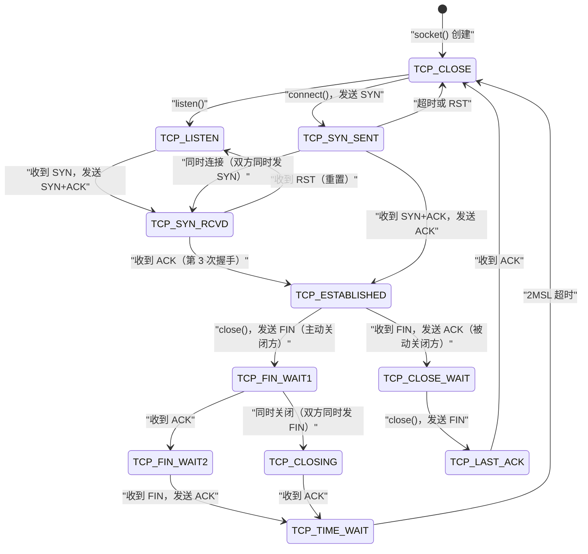

**摘要：**

上一篇建立了网络 IO 路径的全局视图，本篇深入三个核心机制的内部实现：第一，`sk_buff`——Linux 内核中网络数据包的唯一载体，理解它的内存布局、生命周期与引用计数，是理解零拷贝、协议封装、网卡 DMA 的基础；第二，协议层注册与查找机制——`inet_protos[]` 哈希表如何实现"同一个 IP 层，多种传输层协议（TCP/UDP/ICMP）"的扩展性，以及 `net_families[]` 如何支持 AF_INET、AF_UNIX、AF_NETLINK 等多个地址族；第三，TCP 连接状态机——11 个标准状态加 Linux 的 2 个内部状态，每个状态的含义、触发转换的条件，以及生产中最常见的困惑：TIME_WAIT 为什么存在，为什么持续 2MSL，大量 TIME_WAIT 是否真的是问题。这三个机制构成了 Linux 网络栈"可扩展、高效、可靠"设计的核心支柱。

---

## 第 1 章 sk_buff：网络数据包的内核载体

### 1.1 sk_buff 的设计目标

在 Linux 内核中，无论一个网络数据包处于哪个协议层——刚被网卡 DMA 写入内存、正在 TCP 层被拆包、还是等待从发送队列发出——它始终被一个 `struct sk_buff`（socket buffer，简称 skb）所描述。

**sk_buff 的设计目标是**：用一个统一的数据结构描述网络数据包，使得数据包在各个协议层之间传递时，**不需要拷贝数据体**，只需要传递指向同一块内存的 `sk_buff` 指针，并通过调整指针来"添加"或"去除"协议头。

这听起来简单，但要在实践中做到，需要解决几个复杂问题：
- 如何支持协议头的动态添加（发送时）和去除（接收时），同时避免内存拷贝？
- 如何描述跨越多个不连续内存块的数据（scatter-gather IO）？
- 如何在多个 sk_buff 共享同一数据区时安全地管理生命周期？

### 1.2 sk_buff 的内存布局

`struct sk_buff` 是一个"双层结构"：**描述符层**（`struct sk_buff` 本身，约 200 字节的控制信息）和**数据层**（真正存储网络数据的连续内存块）：

```
sk_buff 内存布局示意：

【描述符层：struct sk_buff（~200 字节，从 skbuff_cache slab 分配）】
┌────────────────────────────────────────────────────────────────┐
│  struct sk_buff                                                │
│   head  ──────────────────────────────────────────────────┐   │
│   data  ──────────────────────────────────────────────┐   │   │
│   tail  ─────────────────────────────────────────┐    │   │   │
│   end   ─────────────────────────────────────┐   │    │   │   │
│   len, data_len, truesize, users（引用计数）   │   │    │   │   │
│   sk（所属 socket）, dev（网卡）              │   │    │   │   │
│   cb[48]（各协议层私有控制块）                │   │    │   │   │
│   _skb_refdst（路由缓存）                    │   │    │   │   │
│   skb_shinfo 指针 ────────────────────┐      │   │    │   │   │
└───────────────────────────────────────│──────│───│────│───│───┘
                                        │      │   │    │   │
【数据层：连续内存块（从 kmalloc 或 page 分配）】
                                        │      ↓   ↓    ↓   ↓
                          ┌─────────────┼──────┬───┬────┬───┐
                          │ headroom    │ head │   │    │   │ end
                          │（协议头预留）│      │dat│    │tai│
                          │             │      │ a │    │ l │
                          └─────────────┴──────┴───┴────┴───┘
                                        ↑
                          skb_shinfo（位于 end 指向的位置）
                          存储 frag_list、gso_size、nr_frags 等
```

**四个核心指针的精确含义**：

```c
struct sk_buff {
    unsigned char *head;  /* 数据区的起始地址（不变，分配时确定）*/
    unsigned char *data;  /* 当前有效负载的起始地址（随协议处理移动）*/
    sk_buff_data_t tail;  /* 当前有效负载的结束地址（随协议处理移动）*/
    sk_buff_data_t end;   /* 数据区的结束地址（不变，分配时确定）*/

    /* 有效数据 = data 到 tail 之间的内容 */
    /* headroom = data - head（可用于添加协议头）*/
    /* tailroom = end - tail（可用于追加数据）*/
    unsigned int len;       /* 线性数据区的有效长度 = tail - data */
    unsigned int data_len;  /* 非线性数据（frags）的长度 */
    /* 总数据长度 = len + data_len */
};
```

### 1.3 协议头的添加与去除：零拷贝封装的秘密

**发送时（协议头从上到下添加）**：

```c
/* TCP 层添加 TCP 头（20 字节）*/
skb_push(skb, sizeof(struct tcphdr));
/* 效果：data -= 20，len += 20 */
/* TCP 头被写入 data[0..19]，数据体不动 */

struct tcphdr *th = tcp_hdr(skb);  /* = (struct tcphdr *)skb->data */
th->source = htons(sport);
th->dest   = htons(dport);
th->seq    = htonl(seq);
/* ... */

/* IP 层添加 IP 头（20 字节）*/
skb_push(skb, sizeof(struct iphdr));
/* 效果：data -= 20，len += 20 */

/* 以太网层添加帧头（14 字节）*/
skb_push(skb, ETH_HLEN);
/* 最终 data 指向以太网帧的起始位置，len = 14 + 20 + 20 + payload */
```

**接收时（协议头从下到上去除）**：

```c
/* 以太网层处理完，将 data 指针移过以太网头 */
skb_pull(skb, ETH_HLEN);
/* 效果：data += 14，len -= 14，data 现在指向 IP 头 */

/* IP 层处理完，移过 IP 头 */
skb_pull(skb, ip_hdrlen(skb));
/* data 现在指向 TCP 头 */

/* TCP 层处理完，移过 TCP 头 */
skb_pull(skb, tcp_hdrlen(skb));
/* data 现在指向应用层数据（payload）*/
```

**整个发送/接收过程，payload 数据字节一次都没有被移动过**。所有"封装"和"解封"操作都只是移动 `data` 指针。这是 Linux 网络栈高效运行的基础之一。

### 1.4 非线性 skb：frags 与 frag_list

一个网络数据包的数据不一定存储在一块连续内存中——当数据来自多个 `write()` 调用，或者数据被 `sendfile()` 从文件 [[Page Cache]] 直接引用时，数据分散在多个内存页中。Linux 用以下机制支持非线性 skb：

**skb_frag_t（片段数组）**：`skb_shinfo(skb)->frags[]` 数组，每个元素指向一个 `struct page`（内存页）和偏移/长度信息。网卡通过 SG-DMA（scatter-gather DMA）可以直接从多个不连续的内存页中读取数据，组合成一个以太网帧发出，全程不需要将数据整合到连续内存中。

```c
/* 查看 skb 的数据分布 */
skb->len        /* 线性区数据长度 */
skb->data_len   /* 非线性 frags 中的数据长度 */
skb_shinfo(skb)->nr_frags  /* frags 数组的元素数量（0 = 纯线性 skb）*/

/* 遍历所有数据（线性 + 非线性）*/
skb_walk_frags(skb, frag_skb) { /* ... */ }
```

**frag_list**：`skb_shinfo(skb)->frag_list` 是一个 sk_buff 链表，用于 IP 分片重组（多个分片的 skb 通过 frag_list 串联成一个完整的数据包）。

### 1.5 sk_buff 的生命周期与引用计数

`sk_buff` 通过 `users` 引用计数管理生命周期：

```c
skb_get(skb);   /* users++，增加引用 */
kfree_skb(skb); /* users--，若降到 0 则释放 */
consume_skb(skb); /* 正常消耗（非错误丢弃），内部调用 kfree_skb */
```

**典型生命周期**（发送路径）：
1. `alloc_skb()` 分配，`users=1`
2. 传递给 TCP 层、IP 层处理（不增加 `users`，直接传指针）
3. 加入发送队列时 `skb_get()`（`users=2`），一份在队列中等待发送，一份在重传队列中用于可能的重传
4. 网卡 DMA 发送完成（TX completion），从发送队列移除，`kfree_skb()`（`users=1`）
5. 收到 ACK 确认后，从重传队列移除，`kfree_skb()`（`users=0`），内存被释放

---

## 第 2 章 协议层注册与查找：内核的插件化设计

### 2.1 inet_protos：传输层协议的注册表

Linux 网络栈通过哈希表实现传输层协议的动态注册，使得添加新的传输层协议（如 SCTP、DCCP）不需要修改 IP 层代码：

```c
/* net/ipv4/protocol.c */
struct net_protocol __rcu *inet_protos[MAX_INET_PROTOS];
/* MAX_INET_PROTOS = 256（协议号范围 0-255）*/

/* 注册 TCP 协议（内核启动时执行）*/
static const struct net_protocol tcp_protocol = {
    .handler    = tcp_v4_rcv,    /* IP 层收到 TCP 包时调用的处理函数 */
    .err_handler = tcp_v4_err,   /* 收到 ICMP 错误时的处理函数 */
    .no_policy  = 1,
    .netns_ok   = 1,
};
inet_add_protocol(&tcp_protocol, IPPROTO_TCP);  /* 注册到 inet_protos[6] */

/* 注册 UDP 协议 */
static const struct net_protocol udp_protocol = {
    .handler    = udp_rcv,
    .err_handler = udp_err,
};
inet_add_protocol(&udp_protocol, IPPROTO_UDP);  /* 注册到 inet_protos[17] */
```

**IP 层如何使用这个注册表**（`ip_local_deliver_finish()`）：

```c
/* IP 层收到一个完整的（非分片或重组后的）IP 包 */
int ip_local_deliver_finish(struct net *net, struct sock *sk, struct sk_buff *skb) {
    /* 读取 IP 头中的协议字段 */
    int protocol = ip_hdr(skb)->protocol;

    /* 在 inet_protos 中查找对应的传输层处理函数 */
    const struct net_protocol *ipprot = rcu_dereference(inet_protos[protocol]);
    if (ipprot) {
        /* 调用 tcp_v4_rcv() 或 udp_rcv() 等 */
        ret = ipprot->handler(skb);
    } else {
        /* 未知协议：发送 ICMP Protocol Unreachable */
        icmp_send(skb, ICMP_DEST_UNREACH, ICMP_PROT_UNREACH, 0);
        kfree_skb(skb);
    }
}
```

这是一个典型的**策略模式（Strategy Pattern）**在内核中的应用：IP 层只知道"我需要把包交给传输层"，但不硬编码具体是 TCP 还是 UDP——通过 `inet_protos[protocol]` 的间接调用，使得协议栈具备了插件化的扩展能力。

### 2.2 net_families：地址族的注册表

更高层的插件化机制是**地址族注册表** `net_families[]`，它支持了 `AF_INET`（IPv4）、`AF_INET6`（IPv6）、`AF_UNIX`（本地 socket）、`AF_NETLINK`（内核-用户态通信）等不同地址族：

```c
/* socket(AF_INET, SOCK_STREAM, 0) 的内核处理 */
static int __sock_create(int family, int type, int protocol, ...) {
    /* 查找地址族 */
    const struct net_proto_family *pf = net_families[family];
    /* AF_INET → inet_family_ops，AF_UNIX → unix_family_ops，... */

    /* 调用地址族的 create 函数 */
    pf->create(net, sock, protocol, kern);
    /* inet_create() / unix_create() / ... */
}
```

### 2.3 tcp_hashinfo：连接四元组的快速查找

当网卡收到一个 TCP 数据包，IP 层已经确认它是给本机的，TCP 层需要快速找到对应的 `struct sock`（连接状态）。这个查找通过 `tcp_hashinfo` 哈希表实现：

```c
struct inet_hashinfo tcp_hashinfo;
/* 包含三个哈希表：*/
/* bhash：bind 哈希表，按本地端口索引（已绑定的 socket）*/
/* lhash2：listen 哈希表，按本地 IP:port 索引（LISTEN 状态的 socket）*/
/* ehash：established 哈希表，按 4 元组索引（已建立连接的 socket）*/

/* TCP 接收路径中的查找（tcp_v4_rcv 的核心操作）*/
struct sock *sk = __inet_lookup(net, &tcp_hashinfo,
    skb,                    /* 数据包 */
    iph->saddr, th->source, /* 源 IP:port（数据包的来源）*/
    iph->daddr, th->dest,   /* 目标 IP:port（本机地址）*/
    inet_iif(skb));         /* 入口网卡 index */

/* 查找逻辑（按优先级）：
   1. 先在 ehash 中查找 ESTABLISHED 连接（4 元组精确匹配）
   2. 再在 lhash2 中查找 LISTEN socket（仅匹配本地 IP:port）
   找到后：sk 就是对应的 struct sock，后续 TCP 处理都基于此 */
```

**为什么不用单一哈希表？** `ehash` 用 4 元组（源 IP + 源 port + 目标 IP + 目标 port）作为 key，能精确区分到同一服务器端口的不同连接；`lhash2` 用本地 2 元组（目标 IP + 目标 port）作为 key，匹配所有到达某个监听端口的新连接请求。两表分开，查找效率更高，职责更清晰。

---

## 第 3 章 TCP 连接状态机：11+2 个状态的完整解析

### 3.1 TCP 状态机全图

TCP 协议通过状态机来管理连接的生命周期。Linux 内核定义了以下状态（`include/net/tcp_states.h`）：



### 3.2 建立连接：三次握手的状态转换

**状态转换链**（以客户端发起连接为例）：

| 步骤 | 事件 | 客户端状态 | 服务端状态 |
|-----|------|-----------|-----------|
| 初始 | — | TCP_CLOSE | TCP_LISTEN |
| 1 | 客户端发送 SYN | **TCP_SYN_SENT** | TCP_LISTEN |
| 2 | 服务端收到 SYN，发送 SYN+ACK | TCP_SYN_SENT | **TCP_SYN_RCVD** |
| 3 | 客户端收到 SYN+ACK，发送 ACK | **TCP_ESTABLISHED** | TCP_SYN_RCVD |
| 4 | 服务端收到 ACK | TCP_ESTABLISHED | **TCP_ESTABLISHED** |

**TCP_SYN_RCVD 的特殊处理——Linux 的 TFO（TCP Fast Open）和 SYN Cookie**：

正常情况下，`TCP_SYN_RCVD` 的 socket 存储在 `tcp_hashinfo.lhash2`（LISTEN 队列相关结构）的半连接队列中，占用 `struct request_sock` 内存（比完整的 `struct sock` 小得多）。只有在三次握手完成后，才会分配完整的 `struct sock`，转换到 `TCP_ESTABLISHED` 并放入 accept 队列。

这个设计是 SYN Flood 防御的基础——半连接状态只占用轻量级的 `request_sock`，而不是完整连接的 `struct sock`。

### 3.3 关闭连接：四次挥手的状态转换

TCP 连接关闭需要四次挥手，因为 TCP 是**全双工**的——两个方向的数据流需要分别关闭：

| 步骤 | 事件 | 主动关闭方 | 被动关闭方 |
|-----|------|----------|----------|
| 初始 | — | TCP_ESTABLISHED | TCP_ESTABLISHED |
| 1 | 主动方调用 close()，发送 FIN | **TCP_FIN_WAIT_1** | TCP_ESTABLISHED |
| 2 | 被动方收到 FIN，发送 ACK | TCP_FIN_WAIT_1 | **TCP_CLOSE_WAIT** |
| 3 | 主动方收到 ACK | **TCP_FIN_WAIT_2** | TCP_CLOSE_WAIT |
| 4 | 被动方调用 close()，发送 FIN | TCP_FIN_WAIT_2 | **TCP_LAST_ACK** |
| 5 | 主动方收到 FIN，发送 ACK | **TCP_TIME_WAIT** | TCP_LAST_ACK |
| 6 | 被动方收到 ACK | TCP_TIME_WAIT | **TCP_CLOSE** |
| 7 | 2MSL 超时 | **TCP_CLOSE** | — |

**CLOSE_WAIT 的常见含义**：

如果你的服务器上有大量 `CLOSE_WAIT` 状态的连接，说明**服务端程序收到了客户端的 FIN（客户端已调用 close），但服务端程序还没有调用 close() 关闭连接**。常见原因：
- 应用层的连接泄漏（忘记关闭连接）
- 线程池耗尽，等待处理连接的线程无法及时关闭连接
- 程序 bug 导致某些代码路径上没有执行 `close(fd)`

```bash
# 统计各状态的连接数
ss -ant | awk '{print $1}' | sort | uniq -c | sort -rn
# 输出示例：
#  12345 ESTAB        ← 正常已建立连接
#    234 TIME-WAIT    ← 主动关闭方，等待 2MSL
#     45 CLOSE-WAIT   ← ！！连接泄漏的警报，正常应为 0 或极少
#      8 LISTEN
```

### 3.4 TIME_WAIT：被误解最多的 TCP 状态

**TIME_WAIT 是什么**：TCP 主动关闭方在发送最后一个 ACK 后进入的状态，持续时间为 **2MSL**（2 倍的最大报文段生存时间，Linux 默认 60 秒）。

**为什么需要 TIME_WAIT？这是 TCP 协议的必然要求，不是 Linux 的实现缺陷。** 原因有两个：

**原因 1：确保最后一个 ACK 能被对端收到**

```
主动关闭方：               被动关闭方：
  发送 ACK（最后一个）
                           ← 如果这个 ACK 丢失了？
                           被动方会重传 FIN（以为 ACK 丢失）
  收到重传的 FIN → 再次发送 ACK
  ← 如果主动方已进入 CLOSED：
    收到 FIN，但没有对应的连接状态
    → 发送 RST（因为连接已不存在）
    → 被动方收到 RST，认为连接异常关闭

TIME_WAIT 的作用：
  在 2MSL 内，主动方仍然保留连接状态
  → 能够重新发送被丢失的 ACK
  → 确保被动方能正常进入 CLOSED 状态
```

**原因 2：防止"迷失数据包"污染新连接**

同一个 4 元组（源 IP:port ↔ 目标 IP:port）在时间上可能被复用。如果 TCP 立即允许复用，老连接中途迷失的数据包（序号恰好落在新连接的合法窗口内）可能被错误地接受，造成数据损坏。

2MSL 等待保证老连接的所有数据包都已在网络中消失（因为 TTL 耗尽而被丢弃）。

**大量 TIME_WAIT 是否有问题？**

只要系统没有耗尽可用的 4 元组组合（或端口），大量 TIME_WAIT 通常不是问题。每个 TIME_WAIT 连接只占用约 **~250 字节内核内存**（比 ESTABLISHED 连接少得多），且不占用 fd。

真正成为问题的场景：**客户端频繁向同一个服务器发起短连接**（如 HTTP/1.0 每次请求都建新连接），导致客户端的临时端口（ephemeral port，范围约 `ip_local_port_range` 的 28232 个端口）被大量 TIME_WAIT 占用，新连接找不到可用的源端口：

```bash
# 检查临时端口范围
cat /proc/sys/net/ipv4/ip_local_port_range
# 32768   60999  ← 约 28000 个端口可用

# 如果 TIME_WAIT 连接数接近这个数字，会开始报 "Cannot assign requested address"

# 解决方案 1：开启 tcp_tw_reuse（允许 TIME_WAIT 连接复用，安全）
sysctl net.ipv4.tcp_tw_reuse=1   # 推荐开启（仅作用于客户端出方向）

# 解决方案 2：开启长连接（HTTP/1.1 Keep-Alive，从根本上减少 TIME_WAIT）

# 解决方案 3（不推荐）：tcp_tw_recycle（已在 Linux 4.12 删除，NAT 环境有严重问题）
```

> [!note] 设计哲学：TIME_WAIT 的工程取舍
> TIME_WAIT 是 TCP 协议为了"正确性"付出的代价——它用 2MSL 的等待时间，换来了连接关闭的确定性（最后一个 ACK 不会丢失导致被动方状态不一致）和新连接的数据安全（迷失包不会污染新连接）。这个设计在 1981 年 TCP 标准确定时就已定型，是 TCP 可靠性的基石之一。在高并发短连接场景下，正确的做法是用长连接复用（HTTP Keep-Alive、连接池）来减少连接建立/关闭的频率，而不是试图绕过 TIME_WAIT。

---

## 第 4 章 TCP 的可靠性机制：序号、ACK 与重传

### 4.1 序号空间：TCP 数据的唯一标识

TCP 的可靠传输建立在**字节流序号**的基础上。每个 TCP 连接在握手时协商初始序号（ISN，Initial Sequence Number），之后每发送一个字节，序号加 1：

```c
/* TCP 头中的序号字段 */
struct tcphdr {
    __be16 source;   /* 源端口 */
    __be16 dest;     /* 目标端口 */
    __be32 seq;      /* 本段数据的起始序号 */
    __be32 ack_seq;  /* 期望收到的下一个字节序号（对方已确认的+1）*/
    __u16 doff:4,    /* 头部长度（4字节单位）*/
          res1:4,
          /* 控制位 */
          cwr:1, ece:1, urg:1, ack:1,
          psh:1, rst:1, syn:1, fin:1;
    __be16 window;   /* 接收窗口大小（接收方能缓冲的字节数）*/
    __sum16 check;   /* 校验和 */
    __be16 urg_ptr;  /* 紧急指针（当 urg=1 时有效）*/
};
```

**ISN 的随机化**：TCP 的 ISN 不能从 0 开始，必须随机——否则攻击者可以猜测序号，伪造合法的 TCP 数据包（序号欺骗攻击）。Linux 的 ISN 基于时钟 + 加密哈希（MD5）生成，每个连接的 ISN 都不同。

### 4.2 累积 ACK 与选择性确认 SACK

**累积 ACK（Cumulative ACK）**：TCP 的 ACK 是累积的——`ack_seq=1001` 表示"我已经收到了序号 1000 及之前的所有字节，期待从 1001 开始的数据"。一个 ACK 可以确认多个数据段。

**累积 ACK 的局限**：如果数据包 1、3、4 都到达了，但 2 没到，接收方只能 ACK 1（因为 2 缺失，序号不连续）。发送方不知道 3、4 已经到达，可能在超时后重传 2、3、4（浪费带宽）。

**SACK（Selective ACK，选择性确认）**，RFC 2018：通过 TCP 选项字段携带额外信息——"序号 1001-2000 和 3001-4000 都已收到，就缺 2001-3000"，允许发送方只重传真正丢失的部分：

```bash
# 检查 SACK 是否开启（Linux 默认开启）
sysctl net.ipv4.tcp_sack
# 1  ← 1 表示开启

# SACK 信息在 TCP 头选项中（使用 tcpdump 查看）
tcpdump -n -vv port 80 | grep "Sack"
# 17:23:45 ... Flags [.], ack 1001, win 64240,
#   options [nop,nop,sack 1 {3001:4001}], ...
#   ↑ 告知对方：3001-4001 已收到，1001-3001 缺失
```

### 4.3 重传机制：RTO 与快速重传

**超时重传（RTO，Retransmission Timeout）**：每发送一个数据段，TCP 启动一个重传定时器。若在 RTO 时间内没有收到 ACK，则重传该段。RTO 根据 RTT（Round Trip Time）动态计算（Jacobson/Karels 算法），初始约 1 秒，每次超时后翻倍（指数退避），最大 120 秒。

**快速重传（Fast Retransmit）**：当发送方收到 3 个相同的重复 ACK（duplicate ACK，同一个 `ack_seq` 被 ACK 了 3 次），判断数据包丢失，**立即重传**，无需等待 RTO 超时：

```
发送：[1][2][3][4][5]
           ↑ 2 丢失了

接收方：
  收到 1 → ACK 1001（期待 1001）
  收到 3 → 乱序，ACK 1001（仍期待 1001，SACK 3001-4000）
  收到 4 → ACK 1001（重复 ACK，SACK 3001-5000）
  收到 5 → ACK 1001（重复 ACK，SACK 3001-6000）

发送方收到 3 个 ACK 1001（重复 ACK）→ 立即重传 [2]，不等 RTO
```

快速重传将丢包恢复时间从 RTO 级别（几百毫秒到秒级）缩短到一个 RTT（几十毫秒），大幅提升了有丢包情况下的 TCP 吞吐量。

---

## 第 5 章 TCP 流量控制与接收缓冲区

### 5.1 滑动窗口：接收方的流量反压

TCP 的流量控制通过**接收窗口（rwnd，Receiver Window）** 实现——接收方在每个 ACK 中告知发送方：自己的接收缓冲区还有多少空间可用。发送方不能发送超过 rwnd 的数据（未确认的字节数不能超过 rwnd）。

```
接收方缓冲区（sk->sk_rcvbuf）：
  已确认的数据 | 已接收但未被 recv() 取走 | 可用空间
              |<---- 已消耗 ----->|<--- rwnd --->|

  rwnd = sk_rcvbuf - sk_rmem_alloc（已使用的接收缓冲区大小）

每次 recv() 取走数据后，rwnd 增大，在下一个 ACK 中通知对方：
  "我有更多空间了，你可以继续发数据"

如果 recv() 没有及时调用（应用层处理慢），rwnd 逐渐缩小到 0：
  "零窗口通告（Zero Window）"——发送方必须停止发送！
  发送方等待"Window Update"（rwnd 变为非零的 ACK）
  或通过"窗口探测（Window Probe）"主动询问
```

**窗口缩放选项（Window Scale，RFC 1323）**：TCP 头中 window 字段只有 16 位，最大表示 65535 字节。对于高带宽延迟积（BDP = 带宽 × RTT）网络（如跨大西洋的 10Gbps 链接，BDP ≈ 80MB），65KB 的窗口不够用。窗口缩放选项通过在握手时协商 scale 因子（最大 14），将实际窗口大小扩展为 `window << scale`，最大约 1GB。

```bash
# 检查窗口缩放是否开启（Linux 默认开启）
sysctl net.ipv4.tcp_window_scaling
# 1  ← 开启

# 在 tcpdump 中查看窗口缩放协商
tcpdump -n -vv 'tcp[tcpflags] & (tcp-syn) != 0' | grep -i "wscale"
# options [mss 1460,sackOK,TS val 123 ecr 0,nop,wscale 7]
#                                                        ↑ scale=7，窗口最大 64KB × 128 = 8MB
```

---

## 小结

本篇深入了 Linux 网络栈的三个基础机制：

**sk_buff 的三条核心原则**：
1. 用 `head/data/tail/end` 四个指针描述数据区，协议封装通过移动 `data` 指针实现，数据体不拷贝
2. 通过 `frags[]` 支持散布/收集 IO（SG-DMA），使 sendfile 等零拷贝操作成为可能
3. 引用计数（`users`）保证内存安全，TX completion 中断负责最终释放

**协议注册机制的两层插件化**：
- `inet_protos[protocol]`：IP 层 → 传输层的分发（TCP/UDP/ICMP 按协议号注册）
- `net_families[family]`：socket 层 → 地址族的分发（IPv4/IPv6/Unix 按 AF 号注册）

**TIME_WAIT 的两个存在理由**：
1. 保证最后一个 ACK 能被对端收到（4 次挥手的完整性）
2. 防止同 4 元组的新连接受到旧连接迷失包的污染

下一篇 [[03 Socket 内核深度解析——struct sock、接收缓冲区与发送缓冲区]] 将专注于 `struct sock` 的完整字段解析——发送缓冲区如何限速（背压机制）、接收缓冲区如何与 epoll 协作（数据就绪通知）、`SO_SNDBUF`/`SO_RCVBUF` socket 选项的内核实现以及自动调整（autotuning）机制。
