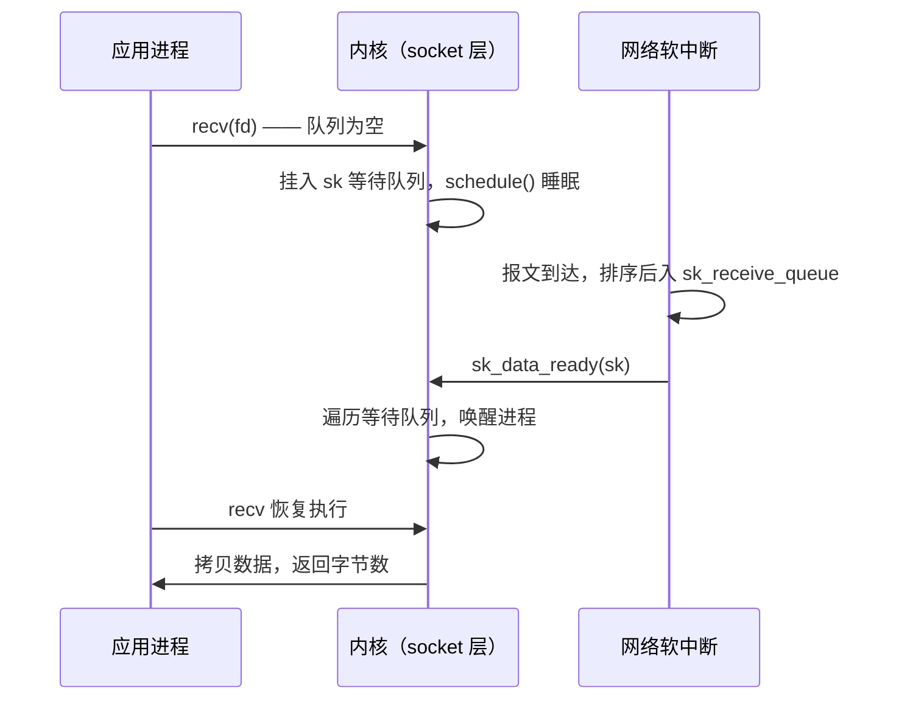

# Socket 内核深度解析——struct sock、接收缓冲区与发送缓冲区

**摘要：**

前两篇分别铺开了网络 IO 的全景地图、解剖了 skb 与 TCP 状态机，本篇把镜头对准这一切状态的宿主——`struct sock`，以及它身上与应用行为关系最紧密的两个部件：发送缓冲区与接收缓冲区。先看结构本身：内核如何用 C 语言的嵌套结构体模拟出"继承"的层次（`sock_common` → `sock` → `inet_sock` → `tcp_sock`），每层协议在公共骨架上叠加了什么；再看数据面：send 写入的数据到哪里"暂存"、缓冲区如何按 `truesize` 记账、满了如何把背压传导给应用；recv 面前，数据如何在接收缓冲区里排队、溢出时为什么是内核丢包而非应用丢包、唤醒通知如何挂接到等待队列。随后是两个高级主题——接收缓冲区自动调整（autotuning）如何按 BDP 动态扩缩，以及阻塞、非阻塞、超时三种 IO 模式在内核里的精确分岔点。本文回答两个核心问题：一块缓冲区的账本如何决定了 TCP 的背压与吞吐，应用层感受到的每一次阻塞、每一次 EAGAIN，在内核里对应的是哪一段代码路径。

---

## 第 1 章 struct sock：用 C 写出的继承体系

### 1.1 四层嵌套：从 sock_common 到 tcp_sock

要理解 socket 的行为，先要找到承载行为的结构。前两篇已经多次引用 `struct sock`——发送缓冲区的额度由它规定，接收队列挂在它身上，状态机记录在它的公共部分；本篇它从背景走向前台。看懂这个结构体有一条捷径：不逐个字段死记，而是抓住"层次"这个纲——它的每一个字段都属于某一层抽象，字段的位置本身就是设计文档。

面向对象的语言用继承复用代码，C 语言没有继承，但 Linux 用**嵌套结构体 + 取址宏**实现了同样的层次感。`struct sock` 的家族树自顶向下嵌套：最基础的 `sock_common` 放着所有 socket 都需要的公共字段——四元组哈希节点、引用计数、状态、协议指针；`struct sock` 在其之上扩展出通用网络设施——等待队列、收发队列、内存记账字段、就绪回调；`struct inet_sock`（面向 IP 协议）再加 inet 专属信息——本端与对端地址端口、TTL、IP 选项；`struct tcp_sock` 最终叠加 TCP 的全部状态——拥塞窗口、RTT 采样、序号变量、重传队列头部。一图胜千言：

```mermaid
%%{init: {'theme': 'dracula'}}%%
flowchart TB
    SC["struct sock_common<br/>四元组哈希节点 / 引用计数 / 状态 / 协议指针"]
    SC --> SK["struct sock<br/>等待队列 / 收发队列 / sk_sndbuf / sk_rcvbuf / sk_data_ready"]
    SK --> IS["struct inet_sock<br/>saddr / daddr / sport / dport / TTL / IP 选项"]
    IS --> TS["struct tcp_sock<br/>snd_nxt / snd_una / cwnd / srtt / 重传队列"]
    style SC fill:#44475a,stroke:#bd93f9
    style SK fill:#44475a,stroke:#ff79c6
    style IS fill:#44475a,stroke:#8be9fd
    style TS fill:#44475a,stroke:#50fa7b
```



取址宏是这个体系的钥匙：`inet_sk(sk)` 与 `tcp_sk(sk)` 用 `container_of` 的技巧把基类指针"还原"成派生类指针——因为嵌套结构体的第一个成员地址就是结构体本身的地址，转换是零开销的指针运算。UDP socket 则走 `udp_sock` 分支，与 `tcp_sock` 平行共享 `inet_sock` 的遗产。这套"伪继承"让协议族与协议层的公共逻辑只写一份：通用的缓冲区记账写在 `sock` 层，TCP 与 UDP 各自的特化逻辑写在派生层，编译期静态绑定、运行期零虚表开销。与 C++ 虚表相比，这种静态方案的代价是少了一层运行期多态的灵活——不过内核网络恰恰不需要它：协议在注册时就已经确定，每个包归属哪个实现从来都是常数时间可判定的，为不需要的灵活买单才是真正的浪费。

打个比方，这像一套层层加码的档案袋：公共人事信息装在最里面的袋（sock_common），所有工种通用的考勤记录装在第二层（sock），网络岗专属的外派记录装在第三层（inet_sock），TCP 岗位独有的绩效明细装在最外层（tcp_sock）。HR（内核通用代码）只看内层袋子，部门主管（协议实现）打开外层袋子看明细——袋子是同一个实体，视角各有边界。各层的分工与访问入口可归纳为一张表：

| 层次 | 结构体 | 代表字段 | 访问方式 |
| :--- | :--- | :--- | :--- |
| 公共底座 | `sock_common` | 四元组哈希节点、连接状态、引用计数 | `sk->sk_state` 直接访问 |
| 通用网络层 | `struct sock` | 收发队列、缓冲区额度、就绪回调、等待队列 | 同上，`sock.h` 全域可用 |
| inet 层 | `inet_sock` | 本端/对端地址端口、TTL、IP 选项 | `inet_sk(sk)` |
| TCP 层 | `tcp_sock` | 序号变量、cwnd、srtt、重传队列头 | `tcp_sk(sk)` |

这套设计的精妙处在于**每层只声明自己那一层的字段，却天然拥有全部祖先字段**。TCP 的实现代码里随手可用 `sk->sk_rcvbuf`（sock 层）与 `tp->snd_cwnd`（tcp_sock 层），一个指针、两种视角；而泛型的套接字层代码只拿到 `struct sock *`，无法也不需要看见 TCP 的序号细节——信息隐藏与复用同时达成。若用一句话概括内核网络代码的组织哲学，"嵌套即分层"当之无愧：协议栈的分层思想不仅体现在报文的逐层封装上，也镜像般地体现在这条结构体的继承链里。

### 1.2 面向数据的字段：缓冲区、队列与回调

在 `struct sock` 的全部字段中，与应用 IO 行为直接相关的是三组。第一组是**两条队列**：`sk_receive_queue` 与 `sk_write_queue`，前者是 recv 的取数地（有序 skb 链），后者是 send 落笔处（02 篇讲过它与重传队列的关系）。第二组是**四个记账字段**：`sk_sndbuf` 与 `sk_rcvbuf` 记录缓冲区允许的额度上限，`sk_wmem_alloc` 与 `sk_rmem_alloc` 记录当前已占用——四个数字合起来构成缓冲区的资产负债表，本章的主角。

### 1.2.1 为什么记账单位是 truesize 而不是字节数

对初学者来说，"按 truesize 记账"是 `struct sock` 里第一个反直觉的设计，值得单独一节说清。若按应用的字节数记账，内核的内存承诺就无从谈起：一个 1 字节的 send 实际消耗约 2 KB 内存，记账若只记 1 字节，内核对内存的预算就是一句空话——记账单位必须与真实内存消耗对齐，这是"诚实记账"的第一个含义。第二个含义在共享场景：多个引用共享同一片数据区时，truesize 只在最后一个引用消失时才真正释放，而记账随引用增减即时调整，账实相符。看懂这一节，6.4 节 skmem 字段里的每个数字就都有了出处。第三组是**回调指针**：`sk_data_ready`（收方就绪）与 `sk_write_space`（发方有空间），它们分别是 epoll 监听可读与可写事件的挂接点，也是阻塞唤醒的发令枪。

把三组字段的关系浓缩成一句话：**队列是数据的居所，记账是空间的边界，回调是状态的广播**——后续所有讨论都在这三句话的延长线上。

值得专门点名的是 `sk_data_ready` 与 `sk_write_space` 的对称性。数据到达时 TCP 层调用前者唤醒读方；ACK 归来、发送缓冲区腾出空间时，TCP 层调用后者唤醒写方。两个回调的默认实现都是"遍历 socket 的等待队列，唤醒睡眠中的进程"；epoll 的介入方式也一样——把等待队列的唤醒回调换成自己的 `ep_poll_callback`。理解了这对对称，04 篇的 epoll 实现细节就只剩下"数据结构怎么组织"一个问题了。这对回调还给出了一个判断问题的分岔口：收发不畅时先分清"回调没被调用"（事件没发生，问题在网络或对端）还是"回调被调用了但应用没反应"（事件发生了，问题在本端线程）——一根神经，两种病因，排查的第一刀就此落下。

除这三组主角外，还有几个字段在特定场景里有存在感。`sk_err` 缓存 socket 级的错误码——异步发生的连接错误（RST 到达、超时判死）没有系统调用正在返回，只能先记账，等下一次系统调用把它取走（`getsockopt(SO_ERROR)` 或直接以失败返回值呈现）。`sk_shutdown` 记录关闭方向位——`shutdown(SHUT_WR)` 之后写路径被此标志拦下，读路径依旧开放，01 篇讲过的半关闭语义就存放在这一个字段里。`sk_mark` 与 `sk_priority` 则是策略路由与 QoS 的入口：应用为 socket 打上的 mark 会随 skb 传播到路由查找，`ip rule` 的 fwmark 规则据此分流——容器网络与策略路由场景里，这四个字节的 mark 常常是流量走向的最终决定者。

### 1.3 分配与回收：每协议独立的 slab

`sk_alloc()` 按协议从独立的 slab 缓存中取对象：TCP 的 `tcp_sock` 约两三 KB（含全部派生字段），UDP 的 `udp_sock` 小得多。slab 的收益在这里被放大到极致：对象尺寸固定、初始化模式一致、构造析构函数（`tcp_v4_init_sock`）缓存着热路径所需的预置状态，百万连接场景下分配释放都是常数代价。socket 关闭时，`sk_free` 等待引用计数归零后才真正归还 slab——在网络子系统里，"最后一个引用"常常属于一个尚在软中断里处理收包的 CPU，这正是引用计数必须原子化的原因（slab 分配器的更多背景见 [[Linux/内存管理/02 物理内存管理：Buddy System 与 Slab 分配器的设计哲学]]）。

一个值得记住的数量级：一条空闲 TCP 连接的内核内存开销在数 KB 量级（结构体本身加最小缓冲额度），十万连接意味着数百 MB 的固定底座——这还没算 fd 表、epoll 登记项与用户态对象。容量规划时先算这笔底座账，再谈业务数据的动态内存，是 C10M 问题最朴素的第一课。slab 在这里还有一个隐性贡献——**对象级的统计**：`/proc/slabinfo` 里 `tcp_sock`、`tcp_bind_bucket` 等条目的活跃对象数，直接给出了系统中 TCP 结构体的真实数量，比任何应用层报表都诚实，容量盘点的第一站不妨就从这里开始。

### 1.4 sock 家族的轻量成员：半连接与 TIME_WAIT 的省钱之道

`struct sock` 家族还有两位"节俭"的亲戚，它们的存在动机都是内存。第一位是 `request_sock`（TCP 场景为 `tcp_request_sock`）：三次握手进行到一半的连接还没有资格占用一个完整的 `tcp_sock`——SYN Flood 场景下攻击者可以凭空制造海量半开连接，若每个半开连接都分配完整结构体，攻击成本将被压到最低而防守成本被推到最高。内核于是用一个小得多的 request_sock 表示"半个连接"，只记录四元组、序号与定时器；握手完成后才升级为完整 tcp_sock。02 篇讲的半连接队列，装的就是这些轻量对象。

第二位是 `inet_timewait_sock`：进入 TIME_WAIT 的连接已经完成了全部数据使命，唯一剩下的职责是"占着四元组等 2MSL 并回复迟到的报文"，完整 tcp_sock 的拥塞状态、RTT 采样、缓冲区全部无用武之地。内核把这个状态从 tcp_sock 中"降级"成一个仅几百字节的轻量结构，释放的完整结构体归还 slab。02 篇 3.3 节说"TIME_WAIT 的内存开销只有百字节量级"，根子就在这里——**用状态机视角看它们是连接，用内存视角看它们只是影子**。这对轻量成员还共同说明了内核网络的一条内存纪律：**结构的重量应该与它的职责成正比**——半开连接只欠一个握手，TIME_WAIT 只欠一份等待，都不该由全副武装的 tcp_sock 来承担；这条纪律与"慢速路径不拖累快速路径"的代码组织原则互为表里。

### 1.5 file → socket → sock：一条调用链的全程

01 篇画过 fd → `struct file` → `struct socket` → `struct sock` 的对象链，本节把"一次 read() 如何走完这条链"补全，作为缓冲区之旅的入口。`read(fd)` 进入内核后按 fd 找到 `struct file`，调用其 `f_op->read_iter`——socket 场景即 `sock_read_iter`；它从 `file->private_data` 取出 `struct socket`，再经 `socket->ops->recvmsg`（inet_stream_ops）转入 `tcp_recvmsg`，最终到达 `struct sock` 的接收缓冲区。一条看似简单的 read，背后是三次间接层跳转，每次跳转都对应一层抽象的职责边界：file 层保证"一切皆文件"的统一，socket 层保证"协议无关"的语义，sock 层才是数据本体。

这三次跳转也是理解 strace 与 perf 输出的钥匙：`strace` 看到的始终是最外层的 read/write，而 perf 火焰图里出现 `tcp_recvmsg`、`sk_wait_data` 等符号时，说明调用已经钻到了第三层。10 篇的性能分析将大量使用这些符号名定位问题——先在这里混个眼熟。顺带一提，跳转链上还有一处常被问到的分支：`poll`/`select`/`epoll` 挂接的 `f_op->poll`（socket 场景为 `sock_poll`）在事件层面同样走 file → socket → sock 的三级跳，最终落到 `sk->sk_data_ready` 对应的"状态检查"函数上——阻塞等数据与事件查询数据，在内核里共享同一套状态来源，只是等待方式不同。

---

## 第 2 章 发送缓冲区：send 的闸门与背压的源头

01 篇讲 send 的旅程时，把发送缓冲区描述成"数据进入内核的第一站"；本节把这第一站拆开，看清它如何记账、如何限流、如何把网络世界的压力反传给应用。概括地说，发送缓冲区在系统中扮演三重角色：**它是 send 返回语义的物理依托**（返回即入队），**它是 TCP 发送节奏的调节池**（Nagle、拥塞窗口都从池里取水），**它是应用与网络之间的背压转换器**（网络拥堵最终表现为这里没有空间）。三重角色各自对应本章的一节。

### 2.1 记账规则：truesize 是唯一货币

发送缓冲区的账本只有一条规则：**一切开销按 `truesize` 计**。01 篇提过，`truesize` 是 skb 结构体、共享信息与数据区的真实内存开销之和——有效载荷 1400 字节的包，truesize 可能超过 2 KB，因为缓冲区是按页对齐分配的。`sk_wmem_alloc` 就是这条连接所有在途 skb 的 truesize 总和，写入前先对账：`sk_wmem_alloc` 加上新 skb 的 truesize 不超过 `sk_sndbuf`，写入放行；否则视作"无空间"。

按 truesize 而非载荷记账，后果在小包场景被急剧放大。应用一次 send 1 字节，内核也要分配一个完整 skb，账面消耗却是约 2 KB——发送缓冲区默认几十 KB 的额度，理论上被几万次 1 字节写入耗尽。这不是设计缺陷而是诚实记账：内存确实被这么占了。但由此带来一个正确的编程直觉——**高频小包要么攒批发送（用户态缓冲、writev 聚合），要么接受 EAGAIN 更早到来**。06 篇讨论 Nagle 与 TCP_NODELAY 时会回到这个权衡。

把记账过程写成伪代码，对账逻辑一目了然：

```c
/* 发送前的额度检查（简化自 sk_stream_memory_free） */
bool 有发送预算(struct sock *sk, size_t skb_truesize)
{
    return sk_wmem_alloc(sk) + skb_truesize <= sk_sndbuf(sk);
}

/* 一个数字字段的三重身份 */
sk_wmem_alloc:  在途 skb 的 truesize 总和（含协议头与对齐开销）
sk_sndbuf:      允许的额度上限（autotuning 或 SO_SNDBUF 决定）
差额:           应用还能 send 多少——EAGAIN 的唯一裁判
```

发送缓冲区在内核里的数据组织也值得看清。应用写入的 skb 按 MSS 切分后进入 `sk_write_queue`（发送队列），发出后移入重传队列等待确认——两条队列共享同一批 skb，靠 skb 标志位区分"已发出"与"未发出"。这个组织的含义是：**发送缓冲区的"满"，本质上是发送队列加重传队列的 truesize 总和逼近额度**；ACK 每确认一段，重传队列就放走一批 skb，额度随之回落，`sk_write_space` 被触发，被挡住的 send 得以继续。把这条链条背下来，"发送缓冲区占用量随 ACK 波动"的现象就从玄学变成了力学。

发送侧的完整数据流可以画成一张环状的压力传导图：

```mermaid
%%{init: {'theme': 'dracula'}}%%
flowchart LR
    APP["应用 send()"] -->|拷贝入队| WQ["sk_write_queue<br/>发送队列"]
    WQ -->|按 cwnd/rwnd 发送| TX["网卡"]
    TX --> RTX["重传队列<br/>未确认 skb"]
    RTX -->|ACK 确认| FREE["释放 skb<br/>sk_wmem_alloc 下降"]
    FREE --> WAKE["sk_write_space<br/>唤醒等待的 send"]
    WAKE --> APP
    RTX -.->|超时/丢包| RTX
    style WQ fill:#44475a,stroke:#ff79c6
    style RTX fill:#44475a,stroke:#8be9fd
    style WAKE fill:#44475a,stroke:#50fa7b
```



这张图里最值得注意的箭头是最后一条：从"释放 skb"回到"应用 send"——**网络对端的接收速度，经由 ACK 这条反馈链，最终决定了本端应用下一次 send 能否成功**。TCP 的全双工背压机制，就藏在这个看似平凡的闭环里。

### 2.2 满了之后：睡眠、唤醒与三态分岔

缓冲区满时的行为，01 篇给过行为表，本节深入内核的分岔实现。`tcp_sendmsg` 发现预算不足后，先调用 `sk_stream_wait_memory`：阻塞 socket 把自己挂到 socket 的等待队列上睡眠，睡醒条件是 `sk_write_space` 回调被触发——它由 TCP 层在 ACK 清理掉已确认 skb、`sk_wmem_alloc` 下降后调用。非阻塞 socket 则直接跳过等待返回 EAGAIN，把"何时重试"的决定权交给应用。第三种是设置了 `SO_SNDTIMEO` 超时的 socket：进入等待但挂上定时器，超时返回部分写入的字节数或 EAGAIN。

这三种形态的差异只存在于"预算不足"的分支上，主路径完全一致——这是理解 Linux IO 模型的关键：**阻塞与否不改变数据的处理流程，只改变"等待"的承担者**。阻塞模型让内核替你等（进程睡眠，代价是线程资源），非阻塞模型让应用自己等（事件驱动，代价是编程复杂度）。Go 的 netpoller 把两者缝合：业务代码写起来是阻塞的，底下运行的是非阻塞 + 调度器挂起 Goroutine（[[Golang/Go并发编程/08 Go 网络编程——netpoller 与 Goroutine-per-Connection]]），语义与代价被语言运行时重新分配了一遍。还有一个贯穿三种形态的共同细节：部分写入——send 大块数据时预算中途耗尽，阻塞 socket 会等出剩余空间继续写完，非阻塞 socket 则把"已写入的部分"作为返回值交回，应用必须自备"从断点续写"的能力，这也是所有非阻塞框架都内置写缓冲区（Netty 的出站缓冲、Go 的 conn write 缓存）的原因。

### 2.3 SO_SNDBUF 与 tcp_wmem：额度的两套来源

发送缓冲区的额度上限从哪来。默认路径是系统参数 `net.ipv4.tcp_wmem` 的三元组（常见默认值 `4096 16384 4194304`，单位字节）：连接创建时取第二值作为初始额度，随发送压力在最小与最大之间自动调节。应用可以用 `setsockopt(SO_SNDBUF)` 显式指定——但有三条硬规则必须知道。其一，内核会把设定值翻倍用于记账（额外的一半留给协议开销），所以"设 64 KB"实际生效约 128 KB 的记账上限。其二，设定后**自动调节被禁用**，额度从此焊死在该值，这是许多"调了 SNDBUF 反而更慢"事故的根源：应用随手设了个小值，把原本能自动扩到 4 MB 的连接钉死在 128 KB。其三，上限仍受 `tcp_wmem[2]` 约束，非特权进程无法越过（root 可用 `SO_SNDBUFFORCE`）。三条规则合起来的推论是：`SO_SNDBUF` 的设定值应当在充分理解 BDP 与内存预算之后再出手，"设个大数求安心"既可能浪费内存（大额度乘连接数），也可能因为关停了 autotuning 而弄巧成拙——这一组选项的默认"不动"往往就是最优解。

这套规则的设计取向很清晰：**内核默认相信自己比应用更懂链路**，自动调节以 BDP 为参照动态扩缩；应用显式插手时，内核退位但保留护栏。多数应用最正确的 setsockopt 是不设——把缓冲区交给 autotuning，只在有明确 BDP 证据（大带宽时延积链路、明确的大吞吐目标）时才出手。完整的调优方法论与参数联动分析，06 篇用整篇展开。

```bash
# 查看全局三元组（当前生效值）
sysctl net.ipv4.tcp_wmem net.ipv4.tcp_rmem
# 典型输出：
#   net.ipv4.tcp_wmem = 4096  16384  4194304
#   net.ipv4.tcp_rmem = 4096  131072 6291456
# 应用侧显式设定（会让 autotuning 失效，务必三思）
int buf = 262144;
setsockopt(fd, SOL_SOCKET, SO_SNDBUF, &buf, sizeof(buf));
```

### 2.4 攒批的接口：MSG_MORE、TCP_CORK 与 writev

应用如何主动配合缓冲区"攒批"。三个工具的语义层次不同。`MSG_MORE` 是**按调用**的提示：本次 send 打上这个标志，内核知道"后面还有，别急着发"，数据继续积压在发送缓冲区，直到某个不带 MSG_MORE 的 send 把闸门打开。`TCP_CORK` 是**按连接**的开关： cork 住之后，内核尽量把小包攒成 MSS 大小的整段再发，uncork 时一次性冲出——它适合"知道会有连续多段数据"的协议封装场景，譬如 HTTP 头与主体的分次写入。`writev` 则是**按调用聚合**：一次系统调用提交多个分散缓冲区（iovec 数组），内核把它们合并拷进 skb，从源头减少小包的产生。

三者并不互斥，组合的层次是：writev 消除"多次系统调用"，MSG_MORE/TCP_CORK 消除"多次报文"。与它们相对的极端是 `TCP_NODELAY`——彻底关闭 Nagle 攒批，有多少发多少。攒与不攒的分寸感（何时追求吞吐、何时追求首字节延迟），06 篇会以交互式服务的视角重新审视；本节只需记牢：**发送缓冲区不只是被动的闸门，它同时是主动攒批的原料仓**。

> [!note] 接口辨析
> `TCP_CORK` 与 `MSG_MORE` 的效果相似、粒度不同，混用的一个常见坑是"cork 忘了 uncork"——连接被 cork 住后若不再发送满 MSS 的数据，攒下的尾巴会一直压在缓冲区里，直到 linger 超时或对端关闭才被冲出。用 cork 时请配套写清 uncork 的时机，就像锁的加与放。

### 2.5 关闭时刻的缓冲区：close 与 SO_LINGER

缓冲区里还有数据时关闭连接会发生什么，是另一组容易被忽略的语义。默认行为（`SO_LINGER` 关闭）下，`close()` 是"优雅的委托"：内核接管发送缓冲区的剩余数据，继续按协议发完，然后完成四次挥手——close 返回不代表数据发完，只代表"移交完成"。若用 `SO_LINGER` 打开并设置超时，close 变成"有期限的陪伴"：内核尽力在超时内清空缓冲区，清不完就发 RST 强拆，未发数据作废；linger 时间设为零则立即 RST——这是主动放弃优雅关闭的用法，常用于协议层自定义"取消"语义的场景。

这组语义与 3.4 节（02 篇）的 CLOSE_WAIT、RST 行为连成整体：**发送缓冲区里有没有数据、SO_LINGER 怎么设，共同决定了一次 close 是挥手、是强拆、还是委托后不管**。网关类服务做"快速拒绝"（不消费请求体直接断开）时，正确姿势正是 linger 零值或 shutdown 序列的组合，而不是想当然的"close 就完了"。把关闭做对还有一份标准三步曲值得记取：先 `shutdown(SHUT_WR)` 声明不再发送、继续读空接收缓冲直到返回 0、最后 close——跳过中间那步，接收缓冲区里未读的数据会让内核改发 RST，对端的正常收尾就此被打断；连接池与 RPC 框架的关闭逻辑都值得按这三步对照检查。

---

## 第 3 章 接收缓冲区：数据命运的最后一站

如果说发送缓冲区是"应用主动写入、网络异步消费"，接收缓冲区则把方向倒转：网络异步生产、应用按需消费。两个生产消费速度的差，在这里以 skb 链的长度呈现；差值失控时，一系列精心设计的预案逐级登场。本章同样先看记账，再看溢出，最后看唤醒。

### 3.1 排队、记账与溢出

接收缓冲区是协议栈与应用之间最后的隔离带。软中断把 TCP 报文按序放入 `sk_receive_queue`，每放一个 skb 就把它的 truesize 记入 `sk_rmem_alloc`；应用 recv 时从队头取数据、销账。当 `sk_rmem_alloc` 逼近 `sk_rcvbuf`，内核的处置与发送侧的"EAGAIN 等待"截然不同——**新到达的报文被直接丢弃**。丢弃的含义有两层：应用侧毫无感知（数据还没到达 recv 的视野），协议侧则靠 TCP 的可靠性兜底——丢弃的报文收不到 ACK，对端按超时或快速重传补发，02 篇的重传机制在这里接住了接力棒。系统计数器 `TcpExtPruneCalled`、`TcpExtRcvCollapsed` 与 UDP 侧的 `UdpRcvbufErrors` 都在记录这类事件（`nstat -az | grep -i prune`）。

这个"溢出即丢弃"的设计初看粗暴，实则是精确的权衡：软中断上下文不允许睡眠等待，进程又可能正睡着不读数据，内核没有第三条路可走。它把"接收不及时"的代价精确定价——丢包、重传、吞吐骤降，全部体现在对端与网络侧，本机只是少了几个报文。诊断"接收缓冲区溢出"由此有一条清晰的路径：nstat 计数器发现 prune 事件，`ss -tnm` 看具体连接的 skmem 占用逼近上限，最后落到应用读取节奏的排查（10 篇给出完整命令链）。

溢出的临界点可以量化感受一下：假设 `sk_rcvbuf` 为 128 KB（autotuning 初始量级），对端以 1 Gbps 灌入，缓冲区从空到满只需要约 1 毫秒——若应用在这 1 毫秒里恰好因 GC、锁或调度而未能 recv，第一批溢出丢弃就会发生。TCP 随后靠重传恢复，但恢复的代价（RTT 增加一个量级、吞吐曲线塌陷）已经付出。**"应用每秒至少读多少次才能不丢包"是可以用缓冲区大小与到达速率直接算出来的**——这笔算术应该成为每个长连接服务容量规划的一部分。

```bash
# 到达速率 R（字节/秒）、缓冲区 B（字节）→ 最长可容忍的读取间隔 T
# T = B / R。代入 B=128KB、R=125MB/s（1Gbps）：
echo "$((128 * 1024 * 1000 / (125 * 1000 * 1000))) 毫秒"   # ≈ 1 毫秒
```

把接收缓冲区与它上下的协作方画在一起，"数据的最后一站"全貌如下：

```mermaid
%%{init: {'theme': 'dracula'}}%%
flowchart TB
    NIC["网络软中断<br/>报文到达"] --> CHK{"序号合法？"}
    CHK -->|是| Q["sk_receive_queue<br/>有序队列"]
    CHK -->|超前到达| OOO["乱序队列<br/>等缺口补齐后归位"]
    OOO -.->|缺口到达| Q
    Q --> BUD{"sk_rmem_alloc + truesize<br/>≤ sk_rcvbuf ?"}
    BUD -->|是| OK["入队成功"]
    BUD -->|临界| COLL["collapse 折叠<br/>腾出包装开销"]
    BUD -->|超限| DROP["prune / 丢弃<br/>靠对端重传恢复"]
    OK --> RECV["应用 recv() 取走"]
    COLL --> RECV
    RECV --> WAKE2["sk_data_ready 通知<br/>（未读时唤醒）"]
    style Q fill:#44475a,stroke:#ff79c6
    style BUD fill:#44475a,stroke:#ffb86c
    style RECV fill:#44475a,stroke:#50fa7b
```



### 3.2 数据就绪：等待队列与唤醒链条

数据放入接收队列后，"通知谁"的问题由等待队列回答。每个 socket 挂着一条等待队列（`sk_wait_queue`），上面登记着所有"对这个 socket 的事件感兴趣"的等待者——可能是一个阻塞在 recv 上的进程，也可能是一个 epoll 实例。数据就绪时 TCP 层调用 `sk_data_ready`，默认实现 `sock_def_readable` 遍历队列逐个唤醒；阻塞的 recv 从睡眠中醒来，检查接收队列非空，拷贝数据返回。等待队列是内核里最通用的同步原语之一，进程、线程、epoll 甚至设备驱动都共用这一套登记—唤醒协议，学懂一处等于学懂一片。

完整的阻塞 recv 时序值得画一遍，它是理解 04 篇 epoll 的基准参照：



时序图里有一个初学者最容易错过的细节：**唤醒不等于数据属于你**。进程被唤醒后必须重新检查接收队列——唤醒源可能是数据到达，也可能是信号、超时，甚至虚假唤醒；条件不满足就重新睡眠（内核用循环包裹 schedule 正是为此）。epoll 把这个"事件循环 + 条件检查"的纪律推到了用户态，04 篇会看到完全同构的结构。

等待队列还有一个工程上重要的细节——**锁的边界**。socket 的收发两端可能同时操作等待队列：软中断在往接收队列放数据并调用 `sk_data_ready`，用户进程同时在 close 或 recv。内核用 `sk_lock`（进程上下文持有）与 bh 锁（软中断上下文）分离的方案保证一致性，而"进程持锁睡眠"的危险场景则由一个专门的逃生通道化解：进程 recv 到底拿不到锁时，先把软中断塞进来的工作暂存到 socket 的 **backlog 链表**，等自己释放锁离开临界区后再回头处理 backlog——既不丢事件，也不死锁。这个 backlog 与 01 篇 3.3 节的"全连接队列"是两个完全不同的东西（后者在 LISTEN socket 上，前者在普通连接 socket 上），名字撞车是阅读内核代码时的高频误会，特此澄清。

### 3.3 SO_RCVBUF：接收侧的额度规则

接收缓冲区的额度规则与发送侧同构：默认由 `net.ipv4.tcp_rmem` 三元组（常见默认值 `4096 131072 6291456`）管理，初始额度取第二值并随流量自动调节；`setsockopt(SO_RCVBUF)` 可显式指定，内核同样翻倍记账、同样以 `tcp_rmem[2]` 为天花板、同样在设定后停用自动调节。接收侧多出的一个现实约束是：**额度必须在"包到达前"就位**——发送缓冲区可以在应用写入时按需扩张，接收缓冲区却要在 SYN 阶段就通告出初始窗口，连接的第一个 RTT 里窗口就是缓冲区的直接投影。

因此接收侧的 autotuning 比发送侧更激进也更精细：内核按对端 ACK 携带的 BDP 信号推测合理缓冲区，在连接存续期动态扩缩——这正是下一章的主题。应用侧值得记住的经验法则是：`SO_RCVBUF` 只在"明确知道对端吞吐与 RTT、且内核估计器可能失准"的场景才值得设置；多数业务系统的正确姿势是信任 autotuning 并把 `tcp_rmem` 上限调到与 BDP 匹配的水平。

还有一个接收侧独有的观察窗口值得认识：`ss -tni` 输出中的 `rcv_space` 与 `notsent` 等字段，分别给出了 autotuning 的当前估计与发送侧尚未发出的积压——同一条命令，读连接的窗口状态与读缓冲区的记账状态可以并行完成。观测口径与机制口径一一对应，是本章反复出现的主题，下一节的溢出预案同样如此。

### 3.4 溢出的柔性预案：prune 与 collapse

在"直接丢弃"之前，内核其实还有两级柔性预案，它们的触发记录就是排查接收侧压力的证据链。当 `sk_rmem_alloc` 逼近上限而新报文又要入队，内核先尝试 **collapse（折叠）**：把接收队列里相邻的多个 skb 合并成尽量少的大 skb——每个 skb 都有结构体与页对齐的固定开销，合并后腾出的正是这些"包装税"，数据本身一字不动。折叠还不够，才执行 **prune（修剪）**：把乱序队列与非必要数据丢弃。两级的触发都记录在全局计数器里（`TcpExtPruneCalled`、`TcpExtRcvCollapsed`），`nstat -az` 可见。

这套预案的存在让"接收缓冲区吃紧"呈现出渐进的恶化梯度：先变慢（折叠要花 CPU），再丢包（修剪与丢弃），最后吞吐坍塌。性能分析里若看到软中断 CPU 升高与 prune 计数同步上涨，几乎可以断言接收端压力已越过第一级——应用读取速度跟不上网络到达速度，问题在生产代码而不在参数。10 篇的案例章会把这条证据链完整走一遍。预防的工程手段同样清晰：接收线程与业务线程分离（读得慢的业务不该拖累读得快的收包）、批量 recv（一次收取多个 skb 降低单包成本）、以及监控层面的 prune 告警前置——在梯度恶化的第一级就介入，成本最低。

> [!note] 与 JVM 的联想
> collapse 的思路与 JVM 分代整理如出一辙：不释放数据，而是把散碎对象搬紧凑以回收"包装开销"。内核网络与虚拟机这两类运行时，在内存碎片这个共同敌人面前，殊途同归地选择了"整理优于分配"——阅读内核时不妨多建立这类跨层联想，机制的理解会自己生长。

---

## 第 4 章 接收缓冲区自动调整：内核如何估计一条链路的胃口

### 4.1 为什么需要 autotuning

静态缓冲区的两难在长肥管道时代变得尖锐：缓冲区按最坏情况配置（每条连接都预留 8 MB），十万连接就是 800 GB 的幻想——内存吃不起；按平均情况配置，大窗口连接又吃不满 BDP。出路是动态：**让内核在连接存续期按实际观测的 BDP 调节缓冲区，忙时扩张、闲时收缩**。这就是 autotuning 的动机，它是"按需分配"思想在缓冲区上的落地，与 slab 按对象复用、epoll 按就绪集合并构成内核网络的三次"反浪费"设计。

值得留意的是 autotuning 与 TCP 窗口机制的天然耦合：窗口本来就是"接收端处理能力的实时广告"，缓冲区则决定广告的上限——两者同源于 socket 结构、同向于流量变化，把它们绑定调节几乎不需要新增观测信号。这种"复用既有反馈环"的设计品味在内核中反复出现：能从协议运行数据里读出的信息，就不再引入新的静态配置。发送侧 autotuning 的一个细节也印证了这份品味：它不单独观测链路，而是直接以拥塞窗口与在途数据的实时画像为标尺——cwnd 涨到哪，sndbuf 的许可就跟进到哪，协议栈内部的两个调节器共享同一个事实来源，永远不打架。

### 4.2 机制拆解：rcv_ssthresh 与 tcp_moderate_rcvbuf

接收侧 autotuning 的核心是一个内部变量 `rcv_ssthresh`——当前允许通告的最大窗口，它像一道渐进的闸门：初始值较小（默认 64 KB 左右），每当内核发现对端确实用得着更大窗口（ACK 里的窗口通告持续紧绷、RTT 稳定），就按一定步长抬高闸门，同时把 `sk_rcvbuf` 扩到与闸门匹配的水平；反之流量退潮时逐步收回。整个调节由 `tcp_moderate_rcvbuf`（默认开启）总开关控制，调节的物理上限由 `tcp_rmem[2]` 兜底。

调节循环的闭环结构值得单独画出来——注意它与拥塞控制在形状上的相似：

```mermaid
%%{init: {'theme': 'dracula'}}%%
flowchart TB
    A["新报文入队<br/>sk_rmem_alloc 上升"] --> B{"对端窗口持续紧绷？"}
    B -->|是| C["抬高 rcv_ssthresh<br/>同步扩张 sk_rcvbuf"]
    C --> D["通告更大的接收窗口"]
    B -->|否| E["维持或回落"]
    D --> F["对端可发送更多<br/>应用加速 recv"]
    F --> A
    C -.->|受 tcp_rmem 上限约束| A
    style C fill:#44475a,stroke:#50fa7b
    style B fill:#44475a,stroke:#ff79c6
```



发送侧的机制更简单——TCP 本身就有拥塞窗口这个"流量画像"，`sk_sndbuf` 会跟随 cwnd 与实际发送压力逐步扩张（受 `tcp_wmem[2]` 封顶）。两侧机制殊途同归：**协议自身的运行数据就是最好的容量估计器**，内核不再依赖管理员拍脑袋的全局常数。

发送侧的扩张还有一个为吞吐服务的细节：skb 已经写入但尚未发出（被窗口或 Nagle 拦住）时，内核允许把新的数据"续写"进该 skb 的尾部空闲区，而不是另开新 skb——这既省内存又天然聚合。autotuning 与续写机制配合，让发送缓冲区在"小包多连接"与"大流量单连接"两种形态间都能保持经济。

用一张表把两侧的调节要素并排放置：

| 维度 | 发送缓冲区 | 接收缓冲区 |
| :--- | :--- | :--- |
| 参照信号 | cwnd、在途数据量、ACK 节奏 | 对端窗口通告、RTT、BDP 估计 |
| 闸门变量 | cwnd 与 sndbuf 的联动 | `rcv_ssthresh` |
| 总开关 | 默认自动，`SO_SNDBUF` 设定后停用 | `tcp_moderate_rcvbuf`，`SO_RCVBUF` 设定后停用 |
| 物理上限 | `tcp_wmem[2]` | `tcp_rmem[2]` |
| 观测手段 | `ss -tnm` 看 skmem | `ss -tnm` 看窗口与 skmem |

### 4.3 autotuning 的边界：什么时候它会失手

自动调节不是万能的，三个失效场景值得记住。其一是**长连接上的滞后**：调节按观测逐步推进，一个 RTT 极高、流量突增的连接（卫星链路、跨洋备份链路）可能要用好几个 RTT 才把窗口爬到位，突增的头部流量因此吃不满链路——这类场景显式设置大缓冲反而正确。其二是**应用的误设**：只要有一次 `setsockopt(SO_RCVBUF/SNDBUF)`，自动调节即永久停用，之后无论链路怎么变，额度都焊死在手动值——这是 autotuning 最常见的"被失效"方式。其三是**全局内存挤压**：`tcp_mem` 三个阈值在整机层面约束所有 TCP 缓冲区的总内存，高连接数主机一旦触线，内核会全局施压（挤压每条连接的缓冲、进入 memory pressure 状态）——"连接数上去了吞吐反而崩"的疑难，一半的病灶在这里。

> [!info] 记账口径速记
> 本章的记账有一条统一的货币（truesize）与四个科目（两个额度、两个占用）。读任何网络内存数据时先问一句：这个数字是"额度"还是"占用"、单位是字节还是页——口径对齐之后，绝大多数"内存对不上"的疑惑会自动消解。
>
> 全局内存阈值另有一套口径：`tcp_mem` 的三个值分别是低水位（无压力）、压力水位（开始挤压缓冲）与高水位（激进回收）。它的计量单位是"页"，与 tcp_rmem/tcp_wmem 的字节单位不同——混用单位是调优脚本里最容易埋下的暗雷，写参数前先 `sysctl -a` 确认当前值的单位与量级。

### 4.4 一次"窗口上不去"的完整排查

把 4.2 与 4.3 的机制放进一个典型排查。某数据同步服务跨机房传输大文件，吞吐恒定在 60 MB/s 上不去，机房间链路实测带宽 10 Gbps、RTT 8 ms，BDP 约 10 MB——窗口离目标差了两个数量级。排查链条如下。

第一步看连接现状：`ss -tnm` 输出里 `rcv_space` 与通告窗口停在 300 KB 附近，远低于 BDP；skmem 显示缓冲区占用也停在同样量级。第二步查全局参数：`sysctl net.ipv4.tcp_rmem` 输出 `4096 131072 6291456`，上限 6 MB 尚可，不是瓶颈。第三步查应用代码：grep 发现框架里有一行祖传的 `setsockopt(fd, SOL_SOCKET, SO_RCVBUF, 131072)`——**autotuning 被这一行彻底关停**，额度被钉死在 256 KB（翻倍记账后），窗口自然永远上不去。删掉这行、依赖 autotuning 后，窗口随流量自动爬升，吞吐逼近链路极限。

这个案例的教训可以浓缩为一句话：**先怀疑应用自己设过的参数，再怀疑内核**。`ss -tnm` 看到的每一项指标（skmem、rcv_space、通告窗口）在本章都有对应的机制解释——观测工具的意义，是把"网络慢"这种模糊感受翻译成"哪个变量卡在哪个值"的精确陈述。

类似的"祖传 setsockopt"在实际代码库里的出现频率远超想象：早年从论坛抄来的缓冲区设置、从其他业务复制来的 socket 初始化模板，都在无声地关停着内核的自动调节。审查网络代码时，把 `setsockopt` 的每一处调用过一遍，收益常常超出预期——参数审查的花费以小时计，而它消除的隐患动辄以整夜的故障排障计。

---

## 第 5 章 阻塞、非阻塞与超时：三种等待的内核实现

### 5.1 等待队列：睡眠的底层机制

阻塞 IO 的"阻塞"在内核里就是**进程睡眠**，而睡眠的载体是等待队列。以 recv 为例：`tcp_recvmsg` 发现接收队列空，构造一个等待项挂到 socket 的等待队列，把进程状态置为 TASK_INTERRUPTIBLE（可中断睡眠），随后 `schedule()` 主动让出 CPU；调度器把这个进程从运行队列摘除，CPU 转而服务其他就绪任务。数据到达后 3.2 节的唤醒链条把进程置回 TASK_RUNNING，调度器在下一次调度点把它挑回 CPU，recv 从 schedule 的下一行代码继续执行。

**可中断睡眠**这个细节值得单独强调：TASK_INTERRUPTIBLE 状态下，信号可以打断睡眠——进程收到 SIGINT 时 recv 返回 EINTR，进程才有机会响应 Ctrl+C。若用不可中断睡眠（TASK_UNINTERRUPTIBLE），进程将对信号彻底无感，收不到 kill 的善后；网络 IO 全部采用可中断睡眠，因此"recv 被信号打断"是每个网络程序都必须处理的返回值（处理方式要么重试并配合 `SA_RESTART`，要么把 EINTR 纳入控制流）。睡眠与唤醒还讲究"配对纪律"：先把自己挂入等待队列、检查条件、再 schedule——检查与睡眠之间的窗口由调度器封装（`prepare_to_wait` 系列保证原子性），若顺序颠倒（先睡后查），就绪事件可能在挂队前溜走，进程从此长眠。这段纪律在用户态事件编程里同样成立：epoll 的 ET 模式下"必须先读空缓冲再重新登记"的规矩，同宗同源。理解了睡眠的真实成本——不是零，而是调度延迟、缓存污染与线程栈的持有——就能理解为什么后续章节要费如此大的力气减少睡眠的次数，而不是简单地"睡得更快"。

### 5.2 非阻塞与超时：等待的另外两种形态

`O_NONBLOCK` 打开后的行为变化发生在 `tcp_recvmsg` 的入口检查上：队列空则不再挂等待队列，直接返回 `-1` 且 errno 置为 EAGAIN（与 EWOULDBLOCK 同值）——"现在没有，别等我，你自己再来问"。发送侧同理：缓冲区满则立即 EAGAIN。超时模式（`SO_RCVTIMEO`/`SO_SNDTIMEO`）介于两者之间：进入等待队列，但挂上一个定时器，超时唤醒后带着"已等待时长"的记录返回——要么返回超时前读到的部分数据，要么报 EAGAIN。这三种形态在服务端框架里各得其所：超时模式常用于心跳探测（"等数据但最多等 30 秒"），非阻塞模式是事件框架的标配，纯阻塞则活跃在连接数可控的内部工具与测试代码里——形态本身没有高下，匹配场景才有。

这个"匹配场景才有"的判断，在面试语境里可以再加一条注释：问"阻塞与非阻塞的区别"，答案的及格线是行为表，良好线是 5.3 节的内核骨架，而优秀线是能说出"等待的承担者不同"背后的线程模型与内存代价——同一道题，回答的颗粒度决定理解的高度。若想看到它们的原始实现，内核源码中 `sk_stream_wait_memory` 的返回值分支就是"三种等待形态"最权威的注释——读源码时把 5.3 节的骨架当地图，把本章的行为表当路标，两者互相印证。

三种模式的内核分支可以总结为一张表：

| 模式 | 队列空 / 缓冲满时 | 唤醒条件 | 返回值特征 |
| :--- | :--- | :--- | :--- |
| 阻塞 | 挂等待队列睡眠 | 数据到达 / 空间腾出 / 信号 | 完整阻塞直至有结果或 EINTR |
| 非阻塞 | 立即返回 | （不存在等待） | EAGAIN，由应用轮询或事件驱动 |
| 超时 | 挂等待队列 + 定时器 | 数据到达 / 超时 / 信号 | 部分数据或 EAGAIN |

请注意这张表右下角的暗示：非阻塞模式把"何时再试"的责任完全推给应用——轮询是最低效的答案（空转烧 CPU），事件驱动才是正解。于是非阻塞 socket 几乎从不单独存在，它总是与 select/poll/epoll 成对出现，构成"事件循环 + 非阻塞 IO"这一现代服务器的事实标准。04 篇的 epoll 正是这个组合的终极形态。


### 5.3 一段源码骨架：阻塞与唤醒的分岔点

把 5.1 与 5.2 的描述压缩成一段贴近真实实现的伪代码，"等待的三态"在代码里就是同一个循环里的三分支：

```c
int tcp_recvmsg(struct sock *sk, ...)
{
    while (1) {
        skb = 检查 sk_receive_queue 队头;
        if (有数据)  goto copy_and_return;      /* 快路径：立即返回 */

        if (非阻塞)  return -EAGAIN;             /* 分岔一：不等 */

        if (有超时)  挂定时器;                    /* 分岔二：限时地等 */

        prepare_to_wait(sk->sk_wait_queue, &wait, TASK_INTERRUPTIBLE);
        schedule();                              /* 分岔三：无限期地等 */
        if (signal_pending(current))  return -EINTR;   /* 信号打断 */

        /* 被唤醒后回到循环开头重新检查——唤醒不等于有数据 */
    }
}
```

这个 `while(1) { 检查; 等待; }` 的骨架值得背下来：它是阻塞 IO 的完整真相，也是 epoll 事件循环在内核侧的原型。03 篇之后，"阻塞与非阻塞的本质区别"应当从一句口号变成一段可复述的代码结构。再往前看一步：这段骨架里的"检查"永远只服务一个 socket——检查一万条连接的代价是一万次系统调用，这个数字正是 04 篇开篇 select/poll 之困的由来。

### 5.4 第五种模型：信号驱动 IO 与它的寂寞收场

教科书把网络 IO 划分为五种模型：阻塞、非阻塞、多路复用、信号驱动与异步 IO。前三种与超时变体本章已讲清，第五种异步 IO 留给 08 篇的 io_uring，这里补上第四种——信号驱动（signal-driven）的来龙去脉。它的形态是：应用给 socket 打开 `O_ASYNC` 标志并注册 `SIGIO` 信号的处置函数，此后数据就绪时内核向进程发信号，应用的信号处理函数里再发起 recv。它与 epoll 的差异只在通知媒介：一个用信号、一个用事件列表。

听起来优雅，实践中却近乎绝迹。原因有三：信号是进程级资源，多个 fd 的信号无法区分来源（需配合 `fcntl(F_SETSIG)` 与 sigwaitinfo 扩展）；信号处理函数运行在被打断的上下文里，能做的事极其受限；大规模 fd 下信号的投递与排队开销反超事件列表。信号驱动 IO 的兴衰是一个典型的"机制可行、工程失败"案例——它提醒我们，**评价一种 IO 模型不能只看通知原理，还要看通知在大规模场景下的摊销成本**。这个视角到 04 篇审视 epoll 相对 select 的胜因时，将再次发挥作用。

值得一提的是，信号驱动的"失败"并非毫无遗产：它的核心想法——"内核在事件发生的第一现场主动通知，而不是让应用反复来问"——被 epoll 的回调机制继承并发扬，最终又在 io_uring 的 completion model 中登峰造极。一次看似失败的尝试，往往为下一次成功标注了路标。

五种模型的对照可以收进一张表，左列是模型，右列是"等待发生在哪、由谁承担"：

| 模型 | 等待的承担者 | 首阶段返回时机 | 典型代表 |
| :--- | :--- | :--- | :--- |
| 阻塞 IO | 内核（进程睡眠在 socket 队列） | 数据到达并拷贝后 | 传统线程池服务器 |
| 非阻塞 IO | 应用（轮询重试） | 立即（EAGAIN 或数据） | 少数嵌入式场景 |
| IO 多路复用 | 内核（睡眠在 epoll 等待队列） | 任一 fd 就绪 | Nginx、Redis、Netty |
| 信号驱动 IO | 内核（发 SIGIO 通知） | 就绪通知送达 | 几乎绝迹 |
| 异步 IO | 内核（数据也由内核拷好） | 整个操作完成后 | io_uring（08 篇） |

### 5.5 从一条队列到一万条队列：多路复用的动机

把本章的机制放回并发服务的语境，一个结构性矛盾浮现出来：**等待队列按 socket 隔离，而服务必须同时等待成千上万个 socket**。阻塞模型下，一个进程睡在一条等待队列上，"一万条连接"就需要一万个线程——线程的内存栈、调度开销、上下文切换迅速吃掉所有收益；01 篇 6.1 节说"一连接一线程在万级连接下崩溃"，根源正是这种线性映射。

多路复用的革命性在于改变了映射关系：**让一个进程同时登记在一万条等待队列上，睡一次，任何一个就绪都能醒**。select/poll 是这个思想的朴素实现（每次调用都要拷贝与扫描全部 fd），epoll 则是它的工程极致（登记一次、回调驱动、只返回就绪集）。从"每连接一个等待"到"每进程一组等待"，等待的组织方式变了，而底层的唤醒机制——本节画过的 `sk_data_ready` 链条——一步未动。04 篇将站在本章的肩膀上，解剖 epoll 如何用红黑树与就绪链表把"一次等待"做到极致。两种映射的形态差异如下图所示：

```mermaid
%%{init: {'theme': 'dracula'}}%%
flowchart TB
    subgraph B["阻塞模型：一连接一线程"]
        C1["连接 1"] --> T1["线程 1 睡在队列 1"]
        C2["连接 2"] --> T2["线程 2 睡在队列 2"]
        C3["……"] --> T3["……"]
    end
    subgraph E["多路复用模型：一进程多登记"]
        D1["连接 1"] --> EP["epoll 等待队列"]
        D2["连接 2"] --> EP
        D3["……"] --> EP
        EP --> P["一个事件循环"]
    end
    style T1 fill:#44475a,stroke:#ff79c6
    style T2 fill:#44475a,stroke:#ff79c6
    style EP fill:#44475a,stroke:#50fa7b
    style P fill:#44475a,stroke:#50fa7b
```



值得在动身前再标一个坐标：多路复用解决的只是"等"的问题——它让进程不必为"等一万件事"付出一万份线程代价，但"收"与"处理"的成本分毫未减。数据就绪后仍然要 recv、要拷贝、要解析；epoll 返回的一万个就绪 fd，背后是一万次系统调用与一万个 skb 的搬运。把这个边界记牢，才不会被"多路复用让服务器变快了"的简化叙事误导——它让等得起、让规模可扩展，快与不快，还要看 05 篇（拷贝）与 08 篇（系统调用）的回答。

---

## 第 6 章 边界与反例：缓冲区不是越大越好

### 6.1 大缓冲的代价：延迟、内存与 HOL

把缓冲区调大是最容易想到、也最容易做过头的优化。三个反方向的代价值得逐条列出。**延迟代价**：发送缓冲区里积压的数据越多，队头字节等待"前面的字节先发完"的时间越长——100 KB 的积压在 10 Mbps 链路上意味着约 80 毫秒的额外排队延迟，交互式业务（SSH、游戏、RPC）对此极为敏感，这是 bufferbloat 问题在 socket 层的微观形态（06 篇宏观展开）。**内存代价**：缓冲区额度是每连接独立的承诺，大额度乘以连接数就是内存的乘法陷阱——`tcp_mem` 全局阈值被触线后，内核反向挤压，所有连接一起遭殃。**队头阻塞放大**：接收缓冲区越大，应用不读数据时积压越多，丢包后重传恢复要重传的数据也越多——大缓冲把"应用变慢"放大成"网络变堵"。三项代价有一个共同的放大器——连接数：单连接上无关痛痒的额度，乘上一万就是一场内存风暴，这也是网关类服务对缓冲区格外敏感的原因。

**缓冲区调优的第一原则由此成立：大小服从延迟目标与连接数的约束，而不是越大越好**。内核的 autotuning 之所以按 BDP 而非"越大越好"调节，正是内嵌了这条原则。

> [!warning] 调优反模式
> "网络慢就把缓冲区调大"是运维圈流传最广的偏方之一。缓冲区大只解决"窗口吃不满 BDP"这一种问题，而网络慢的成因至少有十种（丢包、RTT、对端慢、软中断饱和、连接数挤占……）。用大缓冲对治非 BDP 型的慢，唯一的效果是把排队延迟换成另一种慢——先诊断，再调参，顺序不能反。

### 6.2 UDP：没有流量控制的缓冲区

本专栏以 TCP 为主线，但 UDP 的接收缓冲区值得对照一提：UDP 没有滑动窗口、没有重传，对端的发送节奏完全不受本机缓冲区约束——缓冲区满，报文直接丢弃，连"通知对端减速"的机制都没有。这让 UDP 的 `SO_RCVBUF` 权重远高于 TCP：接收不及时不是"变慢"而是"丢数据"，视频流丢帧、DNS 应答丢失、QUIC 吞吐受限都可能源于此。内核为此提供的对策是 `SO_RCVBUFFORCE`（特权进程绕过上限）、`net.core.rmem_max` 全局抬顶，以及应用侧的 recvmmsg 批量收取——把每次系统调用的摊销成本降下来，给缓冲区减压。

UDP 的对照还揭示了一个更普遍的道理：**可靠性协议可以把缓冲区的压力"外化"给重传机制，不可靠协议只能把压力"内化"为直接丢数据**。选择 UDP 的应用等于自己签署了这份内化协议——缓冲区管理、溢出监控、突发整形，全部从内核的义务变成应用的义务。理解这一点，才算真正理解"用 UDP 是自己写传输层"这句话的分量。QUIC 的用户态实现（Google 的 QUIC 协议栈、后续的 HTTP/3）甚至专门为此引入了 GSO 发送与批量接收，06 篇的参数调优会给出一组经过生产验证的 UDP 缓冲区基线。

```bash
# UDP 服务常见的缓冲区基线（应对突发速率）
sysctl -w net.core.rmem_max=16777216
sysctl -w net.core.rmem_default=16777216
# 观测 UDP 溢出：UdpRcvbufErrors 持续增长即为接收不及时
nstat -az | grep -i udp
```

### 6.3 百万连接的内存账

把本章的机制收拢成一笔容量账。假设目标是一台 64 GB 内存的机器承载 100 万条空闲 TCP 连接：每条连接的 `tcp_sock` 结构体约 2~4 KB，即 2~4 GB；fd 表与 epoll 登记再占一截；真正的大头是缓冲区——若每条连接被 autotuning 撑到 1 MB，仅缓冲区就需要 1 TB，显然不现实。现实中可行的是：autotuning 只为活跃连接扩容、空闲连接保持最小额度，配合 `tcp_mem` 全局阈值兜底，"百万连接"的可行解是**连接大多空闲 + 少数活跃连接用大缓冲**。这也解释了长连接网关类系统（IM、推送）为什么格外关注连接的空闲内存足迹——它们的容量公式里，每连接固定开销是主导项，业务吞吐反而是次要项。工程上的对应手段是把"活跃"变成显式概念：连接池的租约回收、空闲连接的降级心跳（拉长间隔换取低功耗）、以及按连接活跃度的分层监控，都是围绕这条容量公式展开的工程实践。

### 6.4 把账本读出来：ss 的 skmem 字段

本章反复引用的 `ss -tnm` 值得单独拆解一次。一条活跃连接的输出大致如下（有裁剪）：

```text
$ ss -tnm
Recv-Q  Send-Q  Local:Port        Peer:Port
0       52640   10.0.0.5:9092     10.0.0.9:53112
        skmem:(r0,rb212992,t131400,tb4194304,f0,w0,o0,bl0,d0)
```

`rb` 与 `tb` 是接收/发送缓冲区的额度上限（可以看到发送侧已自动扩到 4 MB，即 `tcp_wmem[2]` 的默认值）；`r` 与 `t` 是当前实际占用；`o` 是 orphan（已被应用 close、但还在协议栈里等待收尾的 skb 内存，orphan 堆积是应用崩溃风暴的前兆）；`d` 是 forwarding 分配的预留。Recv-Q/Send-Q 两个队列深度配合 skmem 读，本章的全部记账规则都能在输出里对号入座——**skmem 是本章机制的一张实时仪表盘**。字段与本章机制的对照如下表：

| 字段 | 含义 | 对应机制 |
| :--- | :--- | :--- |
| `rb` / `tb` | 接收/发送额度上限 | `sk_rcvbuf` / `sk_sndbuf`，autotuning 的输出 |
| `r` / `t` | 当前实际占用 | `sk_rmem_alloc` / `sk_wmem_alloc`，truesize 记账 |
| `o` | orphan skb 内存 | 已 close 连接的收尾数据，异常时重点观察 |
| `f` | forward allocated 内存 | 预分配额度，接收环与聚合的预留 |
| `d` | forwarding 预留 | 本机转发场景的内存预留 |

读这张仪表盘还有一条捷径判断：`t` 长期贴着 `tb`，说明发送侧顶格、对端或链路跟不上；`r` 长期贴着 `rb` 且 Recv-Q 不为零，说明应用读取不及时——两个方向的饱和，一眼可辨。

> [!warning] 孤儿数据与连接风暴
> `o` 字段值得纳入基础监控：应用调用 close 后数据本应由内核清场，但收尾依赖软中断的调度与对端的配合，orphan 内存整机口径可从 `/proc/net/sockstat` 观测。它持续攀升通常意味着应用在高频关闭连接而链路状态不佳——"关得越多、留得越多"，是连接风暴的典型前兆。10 篇会把它编入诊断决策树。

---

## 小结

本篇解剖了 `struct sock` 与它身上的两个缓冲区。其一，**C 语言的嵌套结构体实现了"继承"**，`sock_common` 到 `tcp_sock` 的四层骨架让通用逻辑与协议特化各居其位，取址宏完成零开销的向下转型。其二，**缓冲区是一张按 truesize 记账的资产负债表**：发送侧满了传导给应用（阻塞/EAGAIN），接收侧满了传导给协议栈（丢包重传）；`sk_data_ready` 与 `sk_write_space` 两个回调是两侧的同一根神经，epoll 将来挂接的正是它们。其三，**autotuning 用协议自身的数据估计容量**，`SO_SNDBUF`/`SO_RCVBUF` 的每一次显式设定都会关掉这架自动调节器，出手前请三思。其四，**阻塞、非阻塞与超时的分岔只在"等待"的形态上**，`while(1) { 检查; 等待; }` 的内核骨架与应用侧的事件循环互为镜像。

一个贯穿全篇的视角值得最后提炼：**缓冲区是把"网络世界的不确定性"翻译成"应用可感知行为"的翻译官**。对端收得慢、链路堵、应用读得慢——这些远端的、异步的、无形的事实，全部经由缓冲区的记账与额度，变成 send 的阻塞、recv 的 EAGAIN、ss 里的窗口收缩这些近端的、同步的、可观测的现象。理解了翻译过程，网络调优就不再是背参数，而是读症状。

阅读次序上，本章与 02 篇互为经纬：02 篇的 skb 是"货"，本章的缓冲区是"仓"，货与仓的账目以 truesize 统一；若你在阅读时感到机制细节渐密，不妨先跳到 6.4 节用 `ss -tnm` 在自己的机器上读一条真实连接的账本——机制的抽象一旦落在亲手看到的数字上，就会迅速固化成直觉。下一篇 [[04 epoll 深度解析——事件驱动 IO 的内核实现]] 将顺着这根神经走进 epoll 的红黑树与就绪链表，看"一个进程等一万条连接"如何实现。

---

## 参考资料

1. RFC 1122, *Requirements for Internet Hosts -- Communication Layers*, IETF, 1989（缓冲区与拥塞控制的义务划分）
2. RFC 7323, *TCP Extensions for High Performance*, IETF, 2014（窗口与缓冲区的配合）
3. W. Richard Stevens 等，*UNIX Network Programming, Volume 1: The Sockets Networking API*, 3rd Edition（SO_SNDBUF/SO_RCVBUF 语义的权威阐述）
4. Christian Benvenuti, *Understanding Linux Network Internals*（struct sock 层次与队列组织）
5. Linux 内核源码：`include/net/sock.h`、`include/linux/tcp.h`、`net/core/sock.c`、`net/ipv4/tcp.c`
6. Linux 内核文档：Documentation/networking/ip-sysctl.txt（tcp_rmem/tcp_wmem/tcp_mem）
7. Linux 内核文档：Documentation/networking/scaling.rst（缓冲区与多核扩展的关联）
8. Linux 内核文档：Documentation/networking/checksum-offloads.rst、seg6-sysctl.rst 等相关页面（缓冲区与卸载机制的配合）
9. Gregg, *Systems Performance*, 2nd Edition（skmem 与 socket 内存观测的系统视角）

---

> [!note] 思考题
> 1. 某服务用 `setsockopt(SO_SNDBUF, 256KB)` 后吞吐反而下降，而取消设置后 autotuning 能把缓冲区自动扩到数 MB。结合 `tcp_wmem` 三元组与 BDP 的关系，解释"手动设定在什么链路条件下必然劣于自动调节"。
> 2. 接收缓冲区溢出时内核丢弃报文而不是阻塞软中断等待，应用因此完全无感——这个设计把代价转移给了对端与网络。什么样的业务场景应该主动监控 prune 计数器而不是等对端重传来"兜底"？
> 3. 阻塞 recv 可被信号打断返回 EINTR，非阻塞 recv 则从不睡眠。若一个库在内部线程里用阻塞 recv 接收心跳，而主线程希望随时优雅停机，你会如何利用 EINTR 与 `pthread_kill` 实现退出，或者干脆改用哪种 IO 模型重构？

