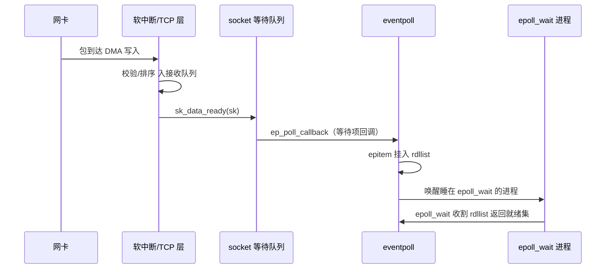
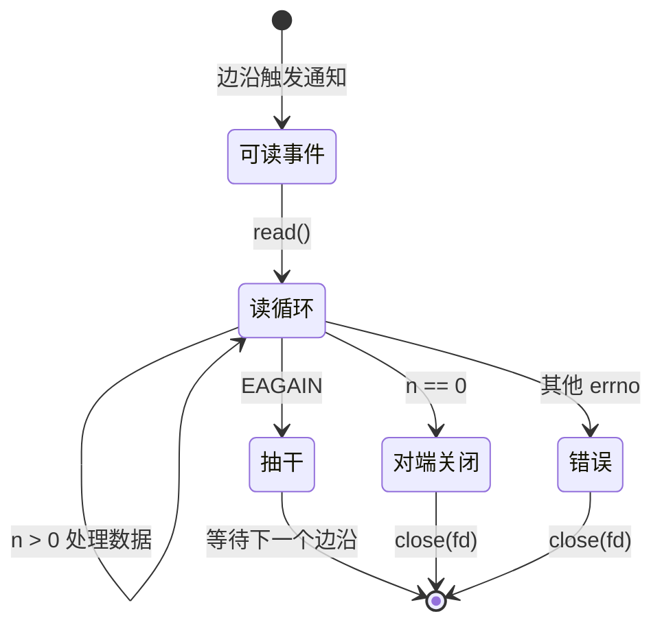

# epoll 深度解析——事件驱动 IO 的内核实现

**摘要：**

上一篇结尾把问题抛在了这里：等待队列按 socket 隔离，而服务要同时等待成千上万个 socket。本篇的主角 epoll，就是 Linux 对这个问题给出的工程答案——2002 年由 Davide Libenzi 开发并进入内核开发线（2.5.44），随 2.6 内核成为事实标准，此后二十余年支撑了 Nginx、Redis、Netty、Go netpoller 等几乎所有高并发基础设施的 IO 底座。本篇不满足于"epoll 比 select 快"的结论，而是深入内核把它的实现机制完整拆开：`eventpoll` 实例如何用红黑树管理全部监听项、用就绪链表收集已发生的事件；`epoll_ctl` 如何把唤醒回调安装到每条 socket 的等待队列上；数据到达后，硬件中断的脉冲如何穿过软中断、协议栈、`sk_data_ready`，最终变成 `epoll_wait` 的一次收割；以及 LT（水平触发）与 ET（边缘触发）两种模式在"登记与收割"两个环节的精确分岔。本文回答两个核心问题：epoll 凭什么把"等一万条连接"的成本从 O(n) 压到接近 O(就绪数)，以及使用者应当以怎样的纪律使用 ET 模式，才能吃到它的性能而不掉进它的陷阱。

---

## 第 1 章 C10K 问题：select/poll 的性能墙

### 1.1 1999 年，一万条连接成为一道门槛

把时钟拨回 1999 年。互联网用户爆发式增长，接入服务器的并发连接从数百向数万爬升，而主流操作系统的 IO 模型还停留在"每连接一线程"或"select 轮询"的形态。工程师 Dan Kegel 观察到这个即将到来的瓶颈，写下了影响深远的长文《The C10K Problem》（一万客户端问题），系统罗列了当时操作系统在万级并发连接下的种种失灵——线程栈内存爆炸、上下文切换风暴、以及 select 的结构性低效。C10K 由此成为高性能服务器领域的一面标尺：谁解决了它，谁就拿到了下一代互联网服务器的入场券。

后来的历史证明，C10K 的解法不在用户态的线程调优，而在内核 IO 模型的重构。线程池方案（Apache 的预 fork/线程模型）把连接映射到线程，内存与调度成本线性增长；select/poll 方案允许单线程监听多连接，却在监听集合的管理上埋着更隐蔽的性能墙。要理解 epoll 的全部设计决策，必须先把这堵墙看清楚——它是 epoll 每一个机制的"反命题"。

### 1.2 select 的三重税

select 是 BSD 时代延续下来的多路复用接口，它的参数形态就注定了性能天花板。每次调用 `select(maxfd, &rset, &wset, &eset, timeout)`，应用与内核之间要过三道关卡，每道都是一笔固定的税。

**第一重税是拷贝税**。select 的 fd 集合（fd_set）以位图形式存在用户态，每次调用都要把整张位图从用户态拷入内核，调用结束后内核再把它修改过的结果（哪些 fd 就绪）拷回用户态。对一个监听一万个 fd 的服务，每轮循环就是数 KB 的双向拷贝——而其中绝大多数 fd 在绝大多数时刻根本没有事件。更别扭的是，fd_set 是**有返回值后被覆盖的**，应用必须每轮重建集合，拷贝税无法通过缓存规避。

**第二重税是上限税**。fd_set 是固定长度的位图，长度由编译期的 `FD_SETSIZE`（通常是 1024）决定——进程的 fd 上限动辄几十万，select 却只能监听其中前 1024 个。这个上限不是运行时参数而是编译时常量，扩大它需要重新编译 glibc 甚至整个用户态生态。1024 这个数字在今天看来近乎荒诞，但在 1980 年代的语境里"1024 个 fd"已是难以想象的规模——它是一个被时代抛弃却甩不掉的包袱。

拷贝税与上限税还经常联手放大问题：1024 上限意味着位图只有 128 字节，拷贝本身不算贵；但为了突破上限而 fork 多进程、每进程跑一个 select 的方案，又把"事件分发"复杂化——1980 年代到 2000 年代初的服务器代码里，充斥着为绕开这个上限而生的曲折设计。包袱的真正代价从来不是包袱本身，而是为绕开它付出的全部聪明才智。

**第三重税是扫描税**，也是最致命的一重。select 在内核中的实现是对全部监听 fd 逐一调用其 poll 方法：一万条连接，哪怕只有两条就绪，内核也要把一万条连接从头到尾问一遍。时间复杂度 O(n)，且这 n 是**每次调用都要完整支付**的——事件稀疏时，扫描税的性价比最差：99% 的扫描一无所获。用代码把三重税钉在一起看：

```c
fd_set read_set;
FD_ZERO(&read_set);
for (每个连接 fd i) FD_SET(i, &read_set);      /* 每轮重建集合（第一重税的入口） */
select(maxfd + 1, &read_set, NULL, NULL, NULL); /* 位图拷入内核，拷回结果 */
for (fd = 0; fd < maxfd; fd++) {                /* O(全部 fd) 的扫描（第三重税） */
    if (FD_ISSET(fd, &read_set)) handle(fd);    /* 只有极少数命中 */
}
```

三重税的相互叠加使 select 的成本曲线与连接数线性相关而与事件数无关——这条性质决定了它在万级连接下必然出局，无论编译器与硬件如何进步。

### 1.3 poll 的改良与未竟之业

poll 在 1997 年前后进入主流内核（严格说 POSIX 化更早，Linux 实现在 2.1.x 系列引入），对 select 的两重税做了修正。它用 `struct pollfd` 数组替代位图，摆脱了 1024 上限；就绪标记直接写在 pollfd 的 revents 字段里，无需每轮重建集合，避免了重复构建的成本。poll 的接口设计明显更现代，直到今天在连接数不大、跨平台需求高的场景（比如许多嵌入式与便携应用）仍是合理选择。

但 poll 没有触碰第三重税：内核依然每次调用都遍历全部 pollfd、逐个调用 poll 方法、线性扫描。**"监听集合每次全量提交 + 内核全量扫描"这一结构性问题原封未动**——连接数一到万级，扫描税依然是主导成本。poll 的这段历史值得多说一句：它证明了一个重要的工程判断——**接口层面的改良（去掉上限、可复用的数组）带来的收益是线性的，而结构层面的重构（查询式改订阅式）带来的收益才是台阶式的**。下表把三者的账目摆在一起，epoll 的两栏暂且留白，读完本章再回头填答案：

| 维度 | select | poll | epoll |
| :--- | :--- | :--- | :--- |
| 监听上限 | 1024（FD_SETSIZE） | 无硬上限（受内存约束） | 无硬上限（受内存约束） |
| 集合传递 | 每次全量拷贝 | 每次全量提交 | 登记一次（epoll_ctl），收割只取就绪集 |
| 内核遍历 | 全量扫描 O(n) | 全量扫描 O(n) | 只处理就绪项，复杂度随就绪数而非总数 |
| 集合重建 | 每轮必须重建 | 数组可复用 | 不存在"集合重建"概念 |
| 事件获取 | 拷回全量结果 | revents 标记 | 仅返回就绪 fd 列表 |

这张表的前两行是接口层面的差异，最后一行"内核遍历"才是革命性的分野——它不是"优化了的扫描"，而是把扫描这件事从主干路径上整个取消。做到这一点，靠的不是更聪明的循环，而是本篇余下章节的主角：一套"注册一次、回调驱动、就绪自组织"的内核机制。

### 1.4 换个思路：让就绪事件自己走出来

select/poll 的共同盲区在于**应用每次都要重新陈述"我在等谁"**，内核每次都要从头确认"谁好了"。可是对一条长连接而言，"我在等它"这件事在两次事件之间从未改变——反复陈述与反复确认，都是纯粹的浪费。

epoll 的设计者把这个问题倒过来问：能不能让内核**记住**监听关系（登记一次，常驻内核），并在**事件发生的第一现场**（协议栈把数据放进接收缓冲的那一刻）顺手把这件事记到一个小本子上——应用每次只需翻开小本子收割已就绪的条目，而与一万个"没动静"的连接彻底解耦。这个倒转把 O(n) 的扫描变成了 O(就绪数) 的收割，代价是把"管理监听关系"的责任从每次调用移到显式的注册接口——这就是 `epoll_create`/`epoll_ctl`/`epoll_wait` 三件套的分工原型。说到底，epoll 的本质是**把多路复用从"查询式"改造成"订阅式"**，本篇接下来要做的，就是打开订阅系统的机房大门。

两种模式的差异用一张图看得最清楚：

```mermaid
%%{init: {'theme': 'dracula'}}%%
flowchart TB
    subgraph Q["查询式（select/poll）"]
        direction TB
        A1["应用每轮提交全部 fd"] --> A2["内核逐个询问<br/>O(全部 fd)"]
        A2 --> A3["返回全量结果<br/>应用再逐个判断"]
    end
    subgraph S["订阅式（epoll）"]
        direction TB
        B1["应用注册一次<br/>epoll_ctl"] --> B2["事件发生时<br/>回调挂入就绪链表"]
        B2 --> B3["epoll_wait 只取就绪集<br/>O(就绪数)"]
    end
    style A2 fill:#44475a,stroke:#ff79c6
    style B2 fill:#44475a,stroke:#50fa7b
    style B3 fill:#44475a,stroke:#50fa7b
```



查询式的成本随监听数线性增长，订阅式的成本随事件数线性增长——图中两个循环体的大小就是两者的差别。

这个机制的核心资产是两样：一处常驻内核的记忆（登记关系不用反复提交），以及一个事件发生时的顺路动作（协议栈在处理路径上顺手通知）。顺路二字是点睛之笔——通知不是一条独立的链路，而是搭了协议栈处理过程的便车；车不动（没有包到达），便车自然不存在，这正是事件驱动对轮询的根本优势。

C10K 的历史答案还不止 epoll 一条路线，两条路线的对照能帮我们看清 epoll 在整个版图中的坐标。第一条是**内核路线**——把等待的组织方式做进内核，epoll、kqueue（FreeBSD，2000 年前后）、IOCP（Windows）都属于这条路线，它们共享"订阅式通知"的设计内核，差异只在细节；第二条是**绕开路线**——既然等待与拷贝都贵，干脆换掉线程与阻塞的整个模型，用户态线程、协程、异步 IO 各显神通。两条路线并不互斥，今天的高性能服务器几乎都是"内核路线打底 + 用户态路线封装"的组合：Netty 在 epoll 之上搭 Reactor，Go 在 epoll 之上搭 Goroutine。理解了 epoll 这块地基，再去看这些上层建筑，处处都是熟面孔。

两条路线的分野还解释了一个常见的选型困惑：为什么 Java 世界的 Netty 与 Go 世界的 netpoller 性能相近、形态却迥异。Netty 面向的 JVM 没有可挂起的栈，只能走回调式的 Reactor；Go 的 Goroutine 有廉价的栈可挂起，于是能在 epoll 之上再造阻塞语义。内核提供的是同一套 epoll，上层语言运行时的"栈经济学"决定了最终形态——**事件驱动的表达方式，从来是内核机制与语言能力共同谈判的结果**。

---

## 第 2 章 epoll 的核心数据结构

### 2.1 eventpoll 实例：一扇门后的三件家当

`epoll_create1(0)` 返回的 fd 背后，是一个 `struct eventpoll` 内核对象——epoll 的一切状态都住在这里。它的核心家当有三件。第一件是**红黑树（rbtree）**：所有通过 `epoll_ctl` 登记的监听项（epitem）按 fd 有序挂在这棵树上，`EPOLL_CTL_ADD/MOD/DEL` 的增删改查都是 O(log n) 的树操作。第二件是**就绪链表（rdllist）**：事件发生时，对应的 epitem 会被挂到这条链表上，`epoll_wait` 收割的就是它。第三件是**等待队列**：调用 `epoll_wait` 而没有就绪事件的进程睡在这条队列上，直到就绪链表第一次非空。

用一个内存布局图把三者关系钉下来：

```mermaid
%%{init: {'theme': 'dracula'}}%%
flowchart TB
    EP["struct eventpoll<br/>（epoll fd 背后的实例）"]
    EP --> RB["红黑树 rbtree<br/>全部 epitem（按 fd 有序）<br/>e.g. fd=5, fd=9, fd=17, ..."]
    EP --> RD["就绪链表 rdllist<br/>已发生事件的 epitem"]
    EP --> WQ["等待队列 waitqueue<br/>睡眠中的 epoll_wait 调用者"]
    RB -.->|事件发生时挂入| RD
    RD -.->|非空时唤醒| WQ
    style RB fill:#44475a,stroke:#bd93f9
    style RD fill:#44475a,stroke:#50fa7b
    style WQ fill:#44475a,stroke:#ff79c6
```



这个布局浓缩了 epoll 的全部工作流：**红黑树是"登记册"，就绪链表是"传菜口"，等待队列是"餐区叫号器"**。登记册追求的是增删改查的稳定效率（所以选树而不是链表），传菜口追求的是收割时的零扫描（链表天然只含就绪项），叫号器复用了 03 篇讲过的等待队列原语——epoll 没有发明新的同步机制，它只是把既有原语组织出了一个聪明的工作流。

> [!info] 结构分工速记
> 红黑树管注册、就绪链表管通知、等待队列管睡眠——三件家当分别对应 epoll_ctl、事件回调、epoll_wait 三个接口。读内核源码迷路时，回到这张分工表即可重新定位。
### 2.2 eventpoll 与 VFS：epoll fd 也是一种文件

`epoll_create1` 返回的 epfd 同样是一个文件描述符，背后是一个匿名 inode 的 file 对象——epoll 的一切状态藏在 file 的 private_data 里。这个设计带来三个直接后果。其一，epoll 实例的生命周期由 fd 的引用计数管理，close(epfd) 会清理整个实例及其全部 epitem，泄漏的代价与普通 fd 一致；其二，epoll 实例可以跨进程传递（SCM_RIGHTS），实现事件分发权的转移，这在多进程协作的服务里有真实用途；其三，epoll fd 可以被再登记进另一个 epoll（嵌套），为分层事件模型提供了底层支持。

回头看，epoll 的三件套接口之所以长成 create/ctl/wait 的形态，正因为第一个返回值被设计成了 fd——**一旦多路复用器本身是文件，Unix 的一切文件语义（引用计数、跨进程传递、poll 兼容）便自动适用**。这是"一切皆文件"哲学在 IO 多路复用领域的又一次胜利，也再次呼应了 01 篇的主题。

### 2.3 epitem：一座连接一颗的钉子

挂在红黑树上的节点是 `epitem`，每个被监听的 fd 对应一个。它记录着三方面信息：自己挂在哪棵 epoll 树上（红黑树节点字段）、监听的是哪个 fd（file 与 socket 指针）、应用关心什么事件以及当前已发生了什么（`event.events` 与返回用的 `revents`）。此外还有两个状态位值得记住：一个标记"此 epitem 是否已挂在就绪链表上"（防止同一 fd 的多个事件把链表填满重复项），另一个与触发模式相关（LT 模式下收割后是否需要"回炉"）。

epitem 与 socket 的连接发生在 socket 的等待队列上——03 篇说过每个 socket 都有一条等待队列，epitem 通过一个 `eppoll_entry` 结构把自己以"等待项"的身份登记进去。**epoll 并没有在协议栈旁边另开一个监听旁路，它就坐在每条 socket 的等待队列里**，与阻塞 recv 的睡眠者并肩而坐，等的是同一次唤醒。

eppoll_entry 的生命周期与挂接对象严格绑定：注册时创建并挂入 socket 等待队列，注销（DEL）或 fd 关闭时摘除释放。若挂接对象与登记 fd 在多线程下发生错位（一个线程正在 DEL，另一个 CPU 的软中断恰好触发回调），内核用独立的锁保护这份关联——回调入口先验证 epitem 仍然有效再操作链表。这些并发细节平时隐身，但它们是 epoll 在多核高频事件下稳定运行的底盘。三者的挂接关系可以用一张局部图钉牢：


这张图解释了几个表象：为什么 epoll 监听的 fd 数量不受等待队列的实现限制（每个 fd 只挂一个 eppoll_entry）；为什么关闭 fd 会自动解除监听（file 对象销毁时等待项随之摘除）；以及为什么 epoll 不能感知"非 socket"资源的所有事件——能否被 epoll 监听，取决于那个资源是否实现了 poll 语义并提供了等待队列。

### 2.4 为什么是红黑树

红黑树的选择常被当作面试题的表演环节，但把它放回工程语境，选择理由相当朴素。监听项的操作负载是**读少写多且不频繁**：注册与注销发生在连接建立与关闭时，每条连接一生各一两次；查找发生在注册去重（同一 fd 重复 ADD 要报错）与注销定位时。红黑树在这三种操作上都给出稳定的 O(log n)，且最坏情况有界——相比之下，哈希表虽然平均 O(1)，却需要动态扩缩容、处理最坏冲突链，而内核要为最坏情况负责。10 万连接的树深不过 17 层，注册开销完全可以接受；树有序性带来的额外红利是 `epoll_ctl` 可以快速判定"fd 是否已存在"，这正是重复注册防护的基础。数据结构没有放之四海而皆准的优劣，只有与操作负载的匹配——这是理解内核每一个结构选型的正确姿势。

还有一个容易被漏看的工程考量：**内存的确定性**。红黑树节点（epitem）尺寸固定、随注册按需分配，没有哈希表扩容瞬间的倍增内存与再哈希停顿。对内存预算精确到页的内核而言，"负载高时行为可预测"与"平均更快"常常是前者的权重更高——这一取舍在 TCP 哈希表（02 篇，启动时定尺寸）上同样出现过，内核对"动态扩缩"的谨慎是一以贯之的。

---

## 第 3 章 epoll_ctl：哨兵的安装

### 3.1 注册的完整旅程

`epoll_ctl(epfd, EPOLL_CTL_ADD, fd, &event)` 的内核旅程分三站。第一站在 eventpoll 的红黑树上：查找 fd 对应的 epitem 是否已存在——ADD 要求它不存在（否则 EEXIST），MOD 与 DEL 则要求它存在。第二站是构造与挂树：`ep_insert` 分配 epitem，填入应用关心的事件集，插入红黑树。第三站是本节的主角——**安装哨兵**：epoll 调用该 fd 的 poll 方法（对 socket 是 `sock_poll`），一方面取回 fd 的**当前就绪状态**（若注册时缓冲区已有数据，新事件要立刻能被 `epoll_wait` 收到，这是初始化的关键一步），另一方面拿到 socket 等待队列的入口，把一个 `eppoll_entry` 挂进去。

第三站的"取当前状态"值得多看一眼。想象一个场景：应用先 recv（数据已被另一线程取走前），再 epoll_ctl 注册可读事件——如果注册时不检查当前状态，"注册前就已就绪"的事件将永远无人通知，服务凭空卡死。epoll 通过"注册即检查当前状态"规避了这类**lost wakeup** 竞态，代价是注册时可能立刻把 epitem 挂入就绪链表。这个细节解释了为什么 `epoll_ctl` 并非"纯粹无副作用的登记"，对刚建立的热连接，ADD 的返回瞬间就可能带来一次 `epoll_wait` 的唤醒。

把注册旅程写成贴近源码的伪代码，三站一目了然：

```c
int ep_insert(struct eventpoll *ep, struct file *tfile, int fd, struct epoll_event *event)
{
    /* 第一站：查重（红黑树查找） */
    if (ep_find(ep, tfile, fd) != NULL) return -EEXIST;

    /* 第二站：构造 epitem，登记关注事件，插入红黑树 */
    epi = 分配并初始化 epitem(event, tfile, fd);
    ep_rbtree_insert(ep, epi);

    /* 第三站：安装哨兵 */
    revents = tfile->f_op->poll(tfile, &epq.pt);   /* 取当前状态 */
    if (revents & event->events) {
        /* 注册瞬间就已就绪：直接挂入就绪链表（防 lost wakeup） */
        ep_poll_callback(...);
    }
    /* 挂入 socket 等待队列：今后由回调驱动 */
    ep_requeue_waitqueue(...);
}
```

### 3.2 唤醒回调的挂接点

安装到 socket 等待队列上的 `eppoll_entry`，核心是一个函数指针——`ep_poll_callback`。03 篇画过唤醒链条：数据到达 → 软中断 → TCP 层入队 → `sk_data_ready` → 遍历 socket 等待队列逐个唤醒。epoll 的位置就在最后一环：`sk_data_ready` 遍历时会调用每个等待项的回调，普通睡眠者的回调是"唤醒进程"，而 epitem 的回调是 `ep_poll_callback`——它做的事情不是唤醒进程，而是把 epitem 挂入 eventpoll 的就绪链表，并检查是否需要唤醒睡在 `epoll_wait` 上的进程。

把整条链路从前端到后端串起来，就是事件驱动 IO 的完整 spine：



这张时序图是理解 epoll 的中心图景：**协议栈的一次正常入队动作，顺路完成了多路复用的全部通知义务**——协议栈甚至不知道 epoll 的存在，它只是照常调用 `sk_data_ready`；epoll 则把自己伪装成一个普通的等待者，混进了每条 socket 的等待队列。这种"寄生式"设计避免了任何对协议栈的侵入式修改，是 Linux 社区"机制与策略分离"品味的又一例证。

### 3.3 重复注册、关闭与生命周期的边界

epoll 的注册机制有几条容易被忽略的生命周期规则。同一 fd 重复 ADD 返回 EEXIST——红黑树的有序性让这个判定便宜而精确。fd 被 close 后，内核会自动清理其 epitem（文件对象释放时顺带摘除监听项），**但前提是这是最后一个引用**：若 fd 通过 `dup` 或 fork 被复制，只 close 其中一个引用不会触发清理，epoll 仍在监听——这也是"epoll 中的连接关不掉"一类幽灵问题的根源，正确做法是 close 全部引用或显式 `EPOLL_CTL_DEL`。此外，epoll 实例自身也是一个 fd，可以被注入另一个 epoll（嵌套监听）——这是实现分层事件分发的冷门技巧，生产中少见但原理上自洽。

### 3.4 EPOLLONESHOT：第三种触发语义

LT 与 ET 之外，epoll 还藏有第三种行为修饰符——`EPOLLONESHOT`：事件被收割一次后，epitem 自动"失活"，此后不再报告任何事件，直到应用显式 `EPOLL_CTL_MOD` 重新武装。它与 ET 组合（`EPOLLET | EPOLLONESHOT`）是解决多线程竞争的经典配方：一个连接的事件被收割后自动失活，其他线程的 wait 不会再拿到它，处理完重新武装即可——"一个事件恰好一个执行者"的语义由此成立，05 篇的多线程惊群讨论会再用到它。代价是每次都要一次额外的 MOD 系统调用，在高频小事件场景下这笔开销不小。三种语义并置来看：LT 管"状态在不在"，ET 管"边沿有没有"，ONESHOT 管"该不该继续说"——它们修饰的是通知策略的不同维度，而非同一维度的三个档位。

把三种语义放进同一条连接的生命周期里感受一下：连接建立，LT 会在缓冲区有数据时反复提醒；ET 只提醒一次，催促应用一次取净；ONESHOT 则在提醒一次后按下静音，等应用处理完手动解除。一个通知系统的三种性格，对应三类工程诉求——省心、极致、串行化。

---

## 第 4 章 epoll_wait：就绪事件的收割

### 4.1 睡眠与收割的主循环

`epoll_wait(epfd, events, maxevents, timeout)` 的内核主干是一个朴素的循环：检查就绪链表 `rdllist`——非空则把 epitem 逐个取出、调用其 poll 方法确认事件仍在（防陈旧）、填入用户态的 events 数组，直到填满 maxevents 或链表取空；链表为空且未超时，则把当前进程挂到 eventpoll 的等待队列上睡眠，等待 3.2 节的回调把它叫醒。与 03 篇 recv 的骨架对照，这是同一个 `while(1) { 检查; 等待; }` 结构——只是"检查"的对象从一条队列变成了一条只含就绪项的链表，检查成本从 O(监听数) 变成了 O(就绪数)。

换一个角度看这个循环的效率来源：select 的扫描是主动取证——挨家挨户敲门问有事吗；epoll 的收割是被动接单——订单（就绪 epitem）已经躺在链表上，逐单处理即可。主动取证的成本由户数决定，被动接单的成本由订单量决定；高并发场景的户数是天文数字而订单量有限，这就是订阅式相对查询式的结构性优势。

收割过程有一个常被追问的细节：为什么取 epitem 后还要再调一次它的 poll 方法确认。原因是**就绪链表上的记录与真实状态之间可能存在时差**——挂链那一刻事件确实发生了，但等到收割时，数据可能已被同进程的其他线程取走（多线程共享 epoll 时尤其如此）。二次确认保证返回给应用的事件"此刻仍然真实"，宁可在内核多花一次 poll 调用，也不让应用空跑一次 recv。

`maxevents` 参数的语义也值得校准。它限制单次 wait 返回的最大事件数，是应用对"单轮收割上限"的声明——设得小，高频场景要多次 wait 才能收完（增加系统调用次数）；设得大，单次返回的处理批次长，可能拖慢同轮其他 fd 的响应。工业级实现（Redis 的 ae、Nginx）通常取 1024~4096 这样的折中值，并把"单轮处理时长"作为事件循环的软预算。参数背后的正解依然是那句：**epoll 只负责高效交付就绪集，如何消费就绪集是应用自己的调度问题**。

### 4.2 收割成本的数量级账

epoll_wait 的单次成本可以拆成两笔：固定的系统调用往返（与 01 篇 7.2 节的账本一致），以及随就绪数线性增长的收割与拷贝（每个 epitem 一次 poll 确认加一次事件拷出）。对一百万监听、一千就绪的典型画像，epoll 的成本是一次调用加一千次收割；select 同画像的成本是一次调用加一百万次扫描与一百万次位图拷贝——两者的差距不在常数而在数量级。这张账同时指出了 epoll 应用层的优化方向：**提高每次收割的批量（让一次 wait 处理更多就绪 fd），摊薄固定成本**；这也是 08 篇 io_uring 的动机——它要进一步省掉的，正是这一次系统调用本身。

把这笔账落到真实的运维语境：一台以 epoll 为底的接入服务器，`strace -c -p` 统计的系统调用分布里，epoll_wait、recvfrom、sendto 通常占据前三——这就是 4.4 节账本的用户态投影。优化前的第一步往往不是引入 io_uring，而是合并小的读写（批量收割后批量处理）、调整 maxevents 与用户态缓冲——把每一张账单先花在刀刃上，再考虑换一套计价系统。

这句建议还有一个反面教材值得记录：不少团队在基本的事件循环都没写对（单轮处理超时、就绪事件重复处理、EPOLLOUT 空转）时，先去追新接口、新特性，结果旧问题原样搬进新接口。接口更替改变的是成本结构，不改变程序的正确性纪律——先对账，再换账本。

### 4.3 回调侧：ep_poll_callback 的三步舞

把 3.2 节的时序图放大到函数级。`ep_poll_callback` 在软中断上下文里执行，它必须快、不能睡——因为它本质上是协议栈处理路径的一部分，它的耗时会被成千上万个连接分摊。它的工作恰好三步：第一步，检查这个事件类型是否在 epitem 登记的关注集内（应用没订阅的事件直接丢弃）；第二步，若 epitem 尚不在就绪链表上，挂入之——"在不在链表上"的判定靠 epitem 的状态位，这是就绪链表永不重复的关键；第三步，若就绪链表从空变非空，唤醒睡在 eventpoll 等待队列上的 `epoll_wait` 调用者。

三步舞的每一步都有明确的纪律边界：第一步是**订阅过滤**，保证应用只为自己订阅的事件付费；第二步是**幂等登记**，同一连接连续到达十个包，就绪链表上始终只有一个 epitem——收割者拿到的不是十个重复通知，而是一次"该连接有事"的汇总；第三步是**唤醒收敛**，多个事件同时到达时唤醒只发生一次。这三条纪律合起来，把"事件风暴"（比如万条连接同时活跃）下的回调开销钳制在常数级别。

用一个数字化的场景把三条纪律的收益具体化。假设一万条连接在 10 毫秒内各到达 20 个报文：幂等登记让就绪链表上最多只有一万个 epitem（而非二十万个重复项）；订阅过滤让只关心可读的应用不为可写事件付出任何成本；唤醒收敛让睡在 wait 上的进程至多被唤醒一次（而不是两万次）。随后应用一次 `epoll_wait` 收割一万个就绪项，逐个循环读取——**事件的"风暴"在内核侧被压扁为一次收割，压扁的每一分都来自这三条纪律**。

### 4.4 收割与回炉：LT 与 ET 的分岔点

LT（Level-Triggered，水平触发）与 ET（Edge-Triggered，边缘触发）的分歧发生在收割环节。收割时内核会再次调用 epitem 的 poll 确认事件，若确认后 fd **仍处于就绪状态**（比如接收缓冲区里还有数据没被读完），两种模式的处理就此分岔：LT 把这个 epitem **重新挂回就绪链表**，下一轮 `epoll_wait` 还会报告它——只要状态在，通知就在；ET 则任其离开链表，除非下一次**新事件**（从无到有的边沿）到来，否则不再通知——状态在但事件没有"新的边沿"，就保持沉默。

用一张图把分岔画清楚：

```mermaid
%%{init: {'theme': 'dracula'}}%%
flowchart TB
    EV["数据到达<br/>ep_poll_callback 挂链"] --> WAIT["epoll_wait 收割"]
    WAIT --> STILL{"再次确认：<br/>fd 仍就绪？"}
    STILL -->|是 + LT| RELINK["重新挂回 rdllist<br/>下轮继续报告"]
    STILL -->|是 + ET| LEAVE["不再挂链<br/>等下一次事件边沿"]
    STILL -->|否| DONE["正常离开<br/>无需处理"]
    RELINK --> WAIT2["应用下次 epoll_wait 再次收到"]
    LEAVE --> WAIT3["应用必须一次性处理完<br/>否则事件'丢失'"]
    style RELINK fill:#44475a,stroke:#ffb86c
    style LEAVE fill:#44475a,stroke:#ff79c6
    style DONE fill:#44475a,stroke:#50fa7b
```



分岔点的存在说明：**LT 与 ET 的差异不在于通知的时机，而在于"状态"与"事件"两种语义的取舍**——LT 订阅的是状态（只要可读就一直说），ET 订阅的是边沿（新发生的事才说）。这两种语义各有代价，第 5 章展开。

把分岔点放到时间轴上还能看到一个隐藏差异：LT 的通知是可再生的（状态在就一直在），ET 的通知是易逝的（边沿错过就错过）——这决定了两者在可靠性上的心智模型完全不同。LT 服务的世界类似"看板，随时能看"；ET 服务的世界类似"电报，漏了不补"。正是这种易逝性，逼出了 ET 的抽干纪律与按需注册策略——下一章的全部复杂度，都是为这个易逝性付出的对价。

这层语义差异还回答了一个高频面试题的深层版本：为什么 Linux 的默认是 LT 而不是 ET。默认值是接口设计者留给大多数用户的选项——大多数人需要的正是可再生的、容错的通知语义；ET 留给愿意为性能签署纪律合同的少数人。默认值的选择从来不是技术高低的表态，而是对使用者分布的判断。

---

## 第 5 章 LT 与 ET：两种语义的工程账

### 5.1 语义差异的由来

把 LT/ET 放回硬件工程的原语境，理解会顺畅得多。电平触发与边沿触发本是一对硬件中断术语：电平触发以"引脚处于高电平"为条件，只要电平在就反复触发；边沿触发以"电平从低跳高"这个瞬时事件为条件，跳变一次通知一次。内核的 epoll 直接沿用了这对语义：LT 是电平（状态存在即通知），ET 是边沿（状态变化即通知）。epoll 默认 LT，EPOLLET 标志显式开启 ET——"默认保守、可选激进"的接口设计，与其说给了选择，不如说给了责任分级。

这对术语的借用并非牵强附会：epoll 的实现与硬件中断共享同一套行为模型——就绪链表相当于中断状态寄存器，LT 相当于电平检测的轮询，ET 相当于沿检测的一次性中断，EPOLLONESHOT 则像中断屏蔽位。应用工程师在用户态遇到的每一个抽象，内核工程师几乎都在硬件层有过对应物；打通这两层的词汇，理解就少了一道翻译。

### 5.2 ET 的纪律：一次事件，必须抽干

ET 的性能红利以严格的编程纪律为代价，这条纪律可以用一句话概括：**收到可读事件，必须循环 read 直到 EAGAIN**。因为 ET 只在"缓冲区从空到非空"的边沿通知一次，若应用这次只读走一半就收手，剩下的一半将再无通知机会——除非对端恰好再发新数据制造新的边沿。同理，写侧要循环 write 直到缓冲区满（返回 EAGAIN），并在此后把 EPOLLOUT 暂时注销，等缓冲区腾出空间再注册回来。整套纪律的实现骨架如下：

```c
/* ET 模式的标准读处理（省略错误分支） */
for (;;) {
    n = read(fd, buf, sizeof(buf));
    if (n > 0) { 处理 buf; continue; }
    if (n == 0) { 对端关闭; close(fd); break; }   /* EOF */
    if (errno == EAGAIN || errno == EWOULDBLOCK) break;  /* 抽干完毕 */
    if (errno == EINTR) continue;                  /* 信号打断，重试 */
    /* 其余 errno：真错误，关闭连接 */
}
```

这段代码的前提还有一个隐形条款：**fd 必须是非阻塞的**。ET 与阻塞 fd 的组合是个陷阱——循环读到缓冲区抽干后，若再读一次，阻塞 fd 会睡在这里，事件循环的整个线程随之卡死。所以"ET 必须配非阻塞"不是风格建议，而是逻辑必然。



用数字把边沿语义走一遍：对端一次送来 60 KB，到达时接收缓冲区经历从空到非空的一次边沿，ET 通知一次；应用循环读，第一次读走 32 KB、第二次读走 28 KB、第三次返回 EAGAIN——整个过程只此一次通知，却完成了全部数据的收取。假如应用读完 32 KB 就收手，剩余 28 KB 在缓冲区里毫无声响，直到对端下一次发送制造新的边沿——这就是 ET 事故的标准剧本。LT 模式下同样的剧情则温和得多：每次 wait 都会继续报告可读，直到读空，代价只是多几轮通知。

### 5.3 LT 的坦荡与 ET 的极限收益

ET 的纪律换来什么。直觉上的答案是"少了很多通知"，细算账本其实分两层。第一层是**通知次数**：同一个 fd 上积压 100 KB 数据，LT 会反复通知（每轮 wait 都报），直到读空；ET 只通知一次，应用一次抽干。对单连接大吞吐场景，这省掉的是多轮"唤醒—收割—发现还有—再处理"的循环。第二层是**系统调用次数**：ET 通常与"一次收割处理多个事件"的批量风格搭配，降低 syscall 频率。

但把账算到底，ET 的边际收益常被高估。其一，LT 模式下应用同样会在可读后一次读完（只是读不空也不致命），每轮 wait 的重复通知在"读完"的前提下并不会实际发生太多次；其二，LT 允许应用用阻塞 fd、允许不完整的读处理，代码健壮性的容错空间大得多；其三，基准测试里 ET 相对 LT 的吞吐差距通常在个位数百分比量级，远小于"连接数、缓冲区、拷贝方式"这些 06/08 篇的变量。**结论式的建议是：追求极限性能且工程能力足够（Netty、Nginx 内部用 ET 或混合模式）时选 ET，其余场景默认 LT 并把精力投向更贵的瓶颈**——这不是折中主义，而是把复杂度预算花在回报最高的地方。

选型的另一面是对使用者的要求：LT 的容错空间大，适合快速迭代、人员流动大的业务代码；ET 的纪律硬约束，适合被框架封装、由专家写一次的底层组件。同样一份性能差距，封装在框架里就是白赚，暴露给业务代码就是风险源——判断自己处在哪个位置，比判断 LT/ET 哪个更快更重要。

两种模式的选择可以收进一张速查表：

| 维度 | LT（默认） | ET（EPOLLET） |
| :--- | :--- | :--- |
| 通知语义 | 状态存在即通知 | 边沿出现通知一次 |
| fd 要求 | 阻塞或非阻塞皆可 | 必须非阻塞 |
| 读写的完整性 | 允许部分读取，下轮继续 | 必须循环抽干至 EAGAIN |
| EPOLLOUT | 常驻注册无害 | 按需注册、用完即拆 |
| 典型使用者 | Redis、多数通用框架 | Nginx、Netty 等 |

表中最容易被忽略的是倒数第二行：EPOLLOUT 的处理方式差异与读写无关，却是 ET 服务器 CPU 空转的头号来源——把这一行当作 ET 上线的检查项，能避开大半的生产事故。

### 5.4 ET 的第二个坑：EPOLLOUT 的注册时机

ET 模式下写事件的处理有一个著名的反直觉点。EPOLLOUT 的边沿发生在"发送缓冲区从满到不满"的瞬间——如果应用在连接建立后立刻注册 EPOLLOUT，内核看到"此刻可写"，这一次边沿会立即触发；此后缓冲区一直不满，就再也不会有新的边沿。于是正确的做法是：**只在真正需要写且写不进去（缓冲区满）时才注册 EPOLLOUT，写空后立刻注销**。这个"按需注册、用完即拆"的模式与 03 篇讲的"发送缓冲区满了才需要等待"完全同构——事件驱动不过是把"等待写空间"这件事用边沿通知表达了出来。忘记注销 EPOLLOUT 的后果是 CPU 空转（busy loop）：每轮 wait 都立即返回可写，事件循环把 CPU 烧在无意义的循环上，这是 ET 服务器偶发 CPU 飙高的经典病灶。

---

## 第 6 章 epoll 的边界与误区

### 6.1 epoll 不是万能加速器

epoll 的收益模型决定了它的适用边界。它的优势公式是"监听数大 × 就绪比例低"——监听的连接越多、同时活跃的越少，被省掉的扫描越多。把这个公式反推，两个场景里 epoll 的优势几乎消失。其一是**连接少而活跃度高**：一千条连接条条繁忙，就绪链表每轮都几乎全量，epoll 相对 poll 的节省趋近于零——此时选择多半取决于接口易用性而非性能。其二是**短连接风暴**：每条连接生命只有几个报文，`epoll_ctl` 的注册与注销（红黑树操作）反而成为新增成本，而连接的快速周转让"登记一次、长期受益"的模型来不及摊销。惊群与 accept 场景的特例（监听 fd 的注册方式）在 08 篇结合 `SO_REUSEPORT` 讨论。epoll 是一把为"海量长连接、稀疏事件"定制的锁，拿去开别的锁孔，未必比原来的钥匙顺手。

用一个数字画像让边界更具体。假设一台代理服务器维持五万条空闲长连接、每秒新增五百条短连接、活跃连接稳定在一千条：长连接部分是 epoll 的主场（五万次登记换来几乎零成本的静默）；短连接部分则是 epoll 的相对短板（每秒五百次注册加注销，红黑树操作累积成可观开销）。若把短连接也改成连接池长连接，epoll 的画像立刻趋于理想——很多时候 epoll 看起来的不适合，其实是连接策略的不适合。

### 6.2 从 epoll 看接口设计的经济学

epoll 的三件套常被诟病啰嗦——select 一个调用搞定的事，epoll 要 create、ctl、wait 三个。但拆开看，三个调用各自承担的是一个清晰的经济学角色：create 支付一次性固定成本（实例与三件家当），ctl 在连接生命周期事件时按需支付（注册与注销），wait 支付与活跃度挂钩的变动成本（收割）。成本被精确地贴到了引发它的原因上，没有任何一次调用为别人买单。

select/poll 的问题恰好相反：每次调用都是固定成本加全量变动成本的打包价，无论事件多么稀疏，扫描税照付。**把打包价拆成计量价，是 epoll 留给接口设计的最重要遗产**——后来的 io_uring（注册缓冲区、注册 fd）与各类内核内存池接口，都在沿用这套登记一次、按需计量的定价思路。读懂 epoll 的定价模型，读新的内核接口就有了坐标系。

定价模型的类比还能再推一步：epoll_ctl 的每次调用是"变动登记费"，对一个频繁增删监听项的负载（短连接风暴）并不便宜——4.2 节的账本在这里再次生效。io_uring 的注册机制走得更远，把文件、缓冲区都预登记进实例，连"每次调用的参数准备"都摊销掉。从 select 到 epoll 到 io_uring，摊销的粒度一次比一次细，接口的形态一次比一次重——这是内核接口演进中一条清晰的商业逻辑。

### 6.3 惊群：十年围剿的一段插曲

"惊群（thundering herd）"指多个进程/线程等待同一事件时，事件到达把它们全部唤醒、却只有一个能真正处理的现象。epoll 时代的惊群有两个战场。老战场是 accept 惊群：多进程阻塞在同一个监听 fd 的 accept 上，新连接到来唤醒所有进程——内核早已用 `WQ_FLAG_EXCLUSIVE` 机制让 accept 的唤醒逐一化，这个战场基本硝烟散尽。新战场是 epoll 惊群：多进程各自拥有 epoll 实例、都监听同一个监听 fd，新连接到来时，多个实例的 `epoll_wait` 全被唤醒。Linux 4.5（2016 年）引入 `EPOLLEXCLUSIVE` 标志，把"唤醒全部"改为"唤醒一个"，缓解了这个问题；更彻底的方案是 `SO_REUSEPORT` 让每个进程拥有独立监听 socket、内核在握手阶段分流——两条路线的完整对比留待 08 篇。

惊群问题的反复出现有一个深层原因：**唤醒是全局广播，而处理能力是局部的**。只要等待者的数量超过处理者的容量，唤醒策略就必须回答"通知谁、通知几个"—— exclusivity 标志回答"通知一个"，reuseport 回答"人人有份且事前分流"，线程池加任务队列则回答"通知一个调度器"。同一个问题在不同层的答案，构成了从内核到应用完整的一课。

这张表还提示了 accept 场景的一个专属优化位：监听 fd 本身用 LT 还是 ET，业界并无共识——Nginx 用 LT 接受连接（配合循环 accept），也有框架在 ET 下循环 accept4。共同点是都必须把就绪的待 accept 连接当作批量事件抽干，只处理一个就转回 wait 的写法，在高并发接入时会明显推高 epoll_wait 的调用频率。

三条路线的对照可以收进一张小表：

| 方案 | 唤醒策略 | 分流粒度 | 典型使用者 |
| :--- | :--- | :--- | :--- |
| 默认共享监听 fd | 全部唤醒（有惊群） | 连接级竞争 | 小规模多进程服务 |
| `EPOLLEXCLUSIVE` | 唤醒一个 | 连接级 | Nginx 1.11+ 的 accept 优化 |
| `SO_REUSEPORT` | 内核握手期分流 | 连接级（哈希） | 多进程高并发网关 |
| 单线程 accept + 分发 | 只唤醒调度者 | 自定义 | 中间层代理、任务队列 |

表中方案自上而下，唤醒的无序性逐级收敛——这与所有并发系统治理资源竞争的思路同构：从广播到定点，从竞争到预分配。

### 6.4 多线程共享 epoll：自由与秩序

epoll 实例可以在多线程间共享（同一个 epfd 被多个线程 wait），内核保证就绪项不会被两个线程同时收割（收割时会从链表摘除），这套并发语义是安全的。但"安全"不等于"高效"：共享一个 epoll 的多线程模型里，唤醒的具体线程不可控，可能引发缓存行迁移与惊群残余；EPOLLONESHOT 标志（事件报告一次后自动失活，需重新注册）可以配合线程池实现"每事件恰好派发给一个线程"，代价是每次都要重新 MOD。Nginx 的每 worker 一个 epoll、Swoole 的多 reactor 分组，实质都是在"共享带来的便利"与"隔离带来的确定性"之间选边——没有标准答案，只有与业务负载的匹配。

共享语义还引出一个更细的实践问题：同一个 epfd 的 wait 被多个线程调用时，收割的原子性由内核保证，但收割与处理之间没有原子性——线程 A 收到 fd X 的事件后尚未处理，fd X 的新事件可能已经再次入链并被线程 B 收走，两个线程同时写同一条连接。EPOLLONESHOT 正是为切断这种竞态而生：事件报告一次即失活，处理完再重新武装，串行化由此达成。代价是每次重新武装一次 MOD 调用，在每秒数十万事件的连接上，这笔开销需要认真估算。

### 6.5 一个完整的 ET 服务器骨架

把本篇的机制收拢成一个可运行的骨架（省略错误处理细节，保留全部关键纪律）：

```c
int epfd = epoll_create1(EPOLL_CLOEXEC);
int lfd = socket(AF_INET, SOCK_STREAM | SOCK_NONBLOCK, 0);
bind(lfd, ...); listen(lfd, backlog);

struct epoll_event ev = { .events = EPOLLIN | EPOLLET, .data.fd = lfd };
epoll_ctl(epfd, EPOLL_CTL_ADD, lfd, &ev);        /* 监听 fd 用 LT 也常见 */

for (;;) {
    int n = epoll_wait(epfd, evs, MAX_EVENTS, -1);
    for (int i = 0; i < n; i++) {
        int fd = evs[i].data.fd;
        if (fd == lfd) {
            /* ET 下 accept 也要循环抽干 */
            while ((cfd = accept4(lfd, NULL, NULL, SOCK_NONBLOCK)) >= 0) {
                struct epoll_event ce = { .events = EPOLLIN | EPOLLET, .data.fd = cfd };
                epoll_ctl(epfd, EPOLL_CTL_ADD, cfd, &ce);
            }
        } else if (evs[i].events & EPOLLIN) {
            /* 循环读到 EAGAIN：ET 纪律（见 5.2 代码） */
            handle_read(fd);
        } else if (evs[i].events & EPOLLOUT) {
            handle_write(fd);
            /* 写空后按需注销 EPOLLOUT，防止 busy loop（见 5.4） */
        }
    }
}
```

这个骨架里每一行都对应本篇的一个机制点：`epoll_create1` 是第 2 章的实例、`EPOLL_CTL_ADD` 是第 3 章的哨兵、`epoll_wait` 是第 4 章的收割、两处"循环抽干"与"按需注销"是第 5 章的 ET 纪律。Java 的 Selector（[[Java/Netty/01 Java NIO基础——Channel、Buffer、Selector三大组件]]）与 Go 的 netpoller（[[Golang/Go并发编程/08 Go 网络编程——netpoller 与 Goroutine-per-Connection]]）都在此骨架之上做了各自的封装，读它们源码时同样能认出这副骨架。

> [!note] 阅读骨架的方法
> 读任何事件驱动框架源码时，先找三样东西：事件循环（对应 epoll_wait）、注册表（对应 epoll_ctl 的调用点）、就绪分发（对应 events 数组的消费）。三样找到，框架的骨架就通了；剩下的编码器、定时器、内存池都是骨架上的器官。

把同样的骨架换成 LT 模式，代码可以省掉两处纪律：accept 与 read 不必循环抽干（没抽干的连接下一轮还会被报告），EPOLLOUT 可以常驻注册。省掉纪律的代价是多一些重复通知——事件循环的每一轮都把仍处于就绪状态的 fd 再报一遍。工业框架的普遍做法是 LT 为主、关键路径局部 ET，两者在同一事件循环里共存，按连接类型分别设置触发模式——epoll 允许这种逐 fd 的精细配置，这是它比 select/poll 时代前进的又一步。

---

## 第 7 章 边界与反例：事件驱动不是终点

### 7.1 每个就绪事件仍是一次系统调用

epoll 解决的是"等"，但"收割—处理"路径上仍有不可消除的固定成本：每次 `epoll_wait` 是一次系统调用，其后对每个就绪 fd 的 read/write 又各是一次。事件稀疏时这套成本完全划算；但在"极高吞吐、极小包"的场景（每秒百万级小消息），系统调用本身的往返开销开始主导——这就是 01 篇 7.1 节说过的第三条路：io_uring 用"批量提交、异步收割"把系统调用次数再压一个数量级，而它并没有绕过协议栈（08 篇详述）。epoll 与 io_uring 不是替代关系，而是两代接口在"系统调用是稀缺资源"这一前提下的两次设计——前者省掉的是等待与扫描，后者省掉的是调用本身。

两者的适用画像也能从成本结构推出：连接数上万但每秒事件数万级，epoll 的成本模型近乎完美（一次 wait 收割全部）；每秒事件千万级的极限场景（高频交易网关、消息队列内核路径），事件数本身已把收割成本推高，io_uring 的批量接口才能再进一步。多数业务系统的终态是两者共存——长连接业务走 epoll，内部的高吞吐管道按需引入 io_uring。

### 7.2 事件模型的编程代价

epoll 把"等待"变得廉价，却把"控制流"变得破碎。阻塞模型下一个函数顺序完成的"读—处理—写"，在事件模型里被拆成三个互不相连的回调，中间状态必须挂在连接对象上；一个业务流程跨越多个事件后，代码的可读性与调试难度陡增。

协程（Go 的 Goroutine、各类用户态协程库）的流行正是对这一代价的回应：用同步的书写方式获得事件驱动的执行效率——底层仍是 epoll，人类却不必再直面回调地狱（[[Golang/Go并发编程/08 Go 网络编程——netpoller 与 Goroutine-per-Connection]] 的 netpoller 正是这个思路的教科书实现）。**技术选型时，epoll 的性能从来不是唯一变量，控制流的复杂度同样是真金白银的成本**。

几个主流实现与 epoll 的关系可以收进一张表，作为本篇通向框架世界的桥：

| 实现 | 与 epoll 的关系 | 封装思路 |
| :--- | :--- | :--- |
| Redis（ae） | ae_epoll.c 直接对接 | 单线程事件循环，极简派 |
| Nginx | ngx_epoll_module.c | 多 worker 进程，每进程一个 epoll |
| Netty | NioEventLoop → epoll | Reactor 线程组，回调向上层 Channel 投递 |
| Go netpoller | netpoll_epoll.go | epoll 之上挂 Goroutine 调度，业务无感 |
| libuv（Node.js） | epoll 后端之一 | 跨平台抽象层，按 OS 选择后端 |

这张表还有一个隐藏的读法：越往下，epoll 离应用代码越远、抽象层越厚——性能损失换表达能力的提升，与 7.2 节的结论完全一致。

抽象层厚度带来的另一个隐变量是调试难度：直接 epoll 的程序，strace 输出即全部真相；经过多层框架封装后，同样的网络行为分散在框架调度、缓冲、回调等多个层次里，排障需要穿透更多抽象。框架选择的合理策略因此与团队经验挂钩——团队对框架的熟悉程度，本身就是性能的一部分。

从更长的历史视角看，控制流复杂度的代价正在被语言层逐步消化：C++20 的协程、Rust 的 async/await、Java 的虚拟线程，都在把回调栈重建为可读的控制流。epoll 二十年里最大的变化不在自身——机制早已稳定——而在它之上的人类接口不断翻新。机制的寿命远长于接口，这正是本篇选择把笔墨压在 eventpoll 与回调链上的原因。

### 7.3 诊断视角：确认事件循环的健康度

epoll 服务器的性能画像可以直接从观测工具读出：`perf top` 里 `ep_poll`、`ep_send_events` 等符号的占比反映收割开销；`strace -c` 统计的 epoll_wait 调用频率与每次返回的就绪数，直接给出"监听数 × 就绪率"的实测值；单轮 wait 返回 0 次就绪却高频调用，往往意味着 busy loop（5.4 节的 EPOLLOUT 陷阱）。这些观测手段的完整用法在 10 篇的工具链中展开——本篇只需记住那个核心公式：**epoll 的健康状态 = 就绪事件的数量与处理能力之间的持续平衡**。

健康度还可以向上钻探一层：把 `epoll_wait` 的返回间隔分布画出来，正常的系统是一条以事件平均到达间隔为中心的紧凑分布；一旦出现双峰（大量瞬时返回与长尾等待并存），多半意味着某类事件在空转或某条连接在积压——分布形状的异常，往往比平均值提前很多暴露问题。

这段平衡还有一个工程化的观测口：事件循环的单轮耗时。理想状态下单轮 wait 加处理在毫秒级内完成，每轮之间事件得以自然排空；若单轮耗时持续超过事件的平均到达间隔，就绪链表会越积越多，LT 模式下表现为重复通知的比例上升、处理延迟阶梯式增长——这就是事件循环过载的早期信号。Redis、Nginx 都为事件循环内置了时间片统计，原理正是为此。

---

## 小结

本篇解剖了 epoll 的完整实现。其一，**epoll 的本质是把多路复用从查询式改造成订阅式**：select/poll 每次全量提交、全量扫描的三重税，被"登记一次、回调驱动、就绪自组织"的机制整体取消。其二，**eventpoll 的三件家当各司其职**——红黑树是稳定的登记册、就绪链表是零扫描的传菜口、等待队列复用了 03 篇的唤醒原语；epoll 的全部性能优势都来自这套结构的分工。其三，**ep_poll_callback 的三步纪律（订阅过滤、幂等登记、唤醒收敛）把事件风暴的回调成本钳制在常数级**，协议栈无感知的寄生式挂接是它得以无侵入落地的原因。其四，**LT 与 ET 是"状态"与"边沿"两种订阅语义**，ET 的性能红利以"非阻塞 + 循环抽干 + 按需注册 EPOLLOUT"的纪律为代价，收益常被高估，纪律不可打折。本篇与 02、03 篇合成一个完整的内核网络心智模型：02 篇的 skb 与状态机是数据的形态学，03 篇的缓冲区是数据的仓库学，本篇的 epoll 是数据的到货通知学。三者共享同一批基础设施（等待队列、软中断、引用计数），也共享同一条设计价值观——让最常见路径的成本最低。

下一篇 [[05 零拷贝技术全景——sendfile、splice 与 DMA gather]] 将转向数据面，回答"数据本身如何少走弯路"——从四次拷贝的传统路径讲到 sendfile 与 SG-DMA 的极致省略。

---

## 参考资料

1. Dan Kegel, *The C10K Problem*, 1999（C10K 问题的原始论述）
2. Davide Libenzi, *epoll 相关内核补丁说明与 design notes*, 2002（epoll 作者的设计文档）
3. RFC 793 与 RFC 1122 中关于异步事件通知的协议背景（与本篇机制对照）
4. W. Richard Stevens 等，*UNIX Network Programming, Volume 1: The Sockets Networking API*, 3rd Edition（IO 多路复用的经典教材）
5. Linux 内核源码：`fs/eventpoll.c`、`include/uapi/linux/eventpoll.h`
6. Linux man-pages：epoll(7) 的 FAQ 一节（LT/ET 行为的权威简述）
7. Nginx 与 Redis 的事件模块源码（`ngx_epoll_module.c`、`ae_epoll.c`，工业级 epoll 使用范例）
8. Linux 内核文档：Documentation/networking/ 中与 NAPI 相关页面（与 07 篇呼应）

---

> [!note] 思考题
> 1. `epoll_ctl(ADD)` 时若 fd 已处于就绪状态（缓冲区已有数据），epoll 会立即把 epitem 挂入就绪链表。若没有这个"注册即检查"的设计，什么样的应用代码顺序会触发"事件永久丢失"？
> 2. ET 模式要求"循环读直到 EAGAIN"，但高吞吐场景下一次事件可能对应 100 MB 数据，单线程无限抽干会让其他连接饥饿。生产级的解法有哪些（譬如限次读取后重新挂回），各自的代价是什么？
> 3. 多进程各自 epoll 监听同一 listen fd 的惊群问题，`EPOLLEXCLUSIVE` 与 `SO_REUSEPORT` 是两种思路不同的解法。前者保留单一队列、后者复制队列——从"锁竞争"与"负载均衡粒度"两个角度，说明它们各自更适合什么负载形态？

