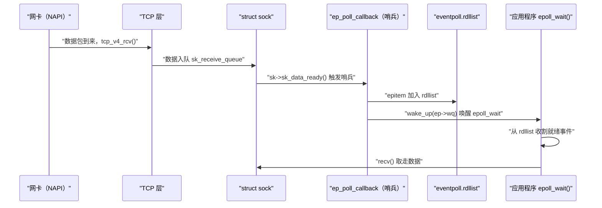

**摘要：**

epoll 是 Linux 高并发网络编程的基石——Nginx、Redis、Node.js、Netty 等所有现代高性能服务器在 Linux 上的底层 IO 多路复用机制都是 epoll。理解 epoll，必须先理解它解决的问题：在 C10K（单机 10000 个并发连接）场景下，`select()` 和 `poll()` 为什么性能不够？它们每次调用都需要将整个 fd 集合从用户态拷贝到内核态，然后线性扫描所有 fd 的就绪状态——O(n) 的扫描在连接数很大时成为致命瓶颈。epoll 用两个精巧的数据结构解决了这个问题：**红黑树（rbr）** 存储所有被监听的 fd（O(log n) 插入/删除）；**双向链表（rdllist）** 存储当前就绪的 fd（只返回有事件的 fd，而非全量扫描）。`epoll_wait()` 只需将就绪链表中的事件拷贝给用户，复杂度降至 O(就绪事件数)，与总连接数无关。本文从 `epoll_create()` 的数据结构创建开始，深入追踪 `epoll_ctl(EPOLL_CTL_ADD)` 如何在 socket 等待队列上安装"哨兵"回调，`epoll_wait()` 如何通过哨兵的唤醒机制感知数据就绪，最后解析 LT（水平触发）与 ET（边缘触发）在内核实现层面的唯一差异。

---

## 第 1 章 C10K 问题：select/poll 的性能墙

### 1.1 select() 的设计与局限

`select()` 于 1983 年随 BSD 4.2 发布，是 Unix 网络编程最早的 IO 多路复用接口：

```c
int select(int nfds,
           fd_set *readfds,
           fd_set *writefds,
           fd_set *exceptfds,
           struct timeval *timeout);
```

**工作原理**：用户将感兴趣的 fd 设置到 `fd_set` 位图中，调用 `select()`，内核扫描所有 fd 的状态，将就绪的 fd 标记回位图，然后返回就绪 fd 数量。

**三个根本性缺陷**：

**缺陷 1：fd 数量上限固定为 1024**

`fd_set` 在内核中是一个固定大小的位图（`__FD_SETSIZE = 1024` 位），编译时确定，无法扩展。这使得 `select()` 天生无法处理超过 1024 个并发连接。

**缺陷 2：每次调用都需要全量拷贝与全量扫描**

每次 `select()` 调用：
- 用户 → 内核：拷贝整个 `fd_set`（3 × 128 字节）
- 内核：线性扫描 nfds 个 fd，检查每个 fd 的就绪状态
- 内核 → 用户：拷贝修改后的 `fd_set`

在 1000 个连接但只有 1 个就绪的情况下，仍然需要扫描全部 1000 个 fd——O(n) 的代价与并发数正比，无法扩展。

**缺陷 3：结果被覆写，每次需要重新初始化**

`select()` 直接修改传入的 `fd_set`——返回后，只有就绪的 fd 位保持为 1，其余清零。下次调用前，必须重新将所有 fd 设置到 `fd_set` 中。

### 1.2 poll() 的改进与残留问题

`poll()` 修复了 select 的 1024 限制，用链表结构替代位图：

```c
int poll(struct pollfd *fds, nfds_t nfds, int timeout);

struct pollfd {
    int fd;
    short events;   /* 用户感兴趣的事件（POLLIN | POLLOUT）*/
    short revents;  /* 内核填写的就绪事件 */
};
```

`poll()` 没有 fd 数量上限（只受 `RLIMIT_NOFILE` 限制），且 `revents` 独立于 `events`，不需要每次重新初始化。

**但 poll() 保留了 select() 最根本的两个问题**：
1. 每次调用都将整个 `pollfd` 数组从用户态拷贝到内核态（10000 个连接 → 约 80KB 拷贝）
2. 内核仍然线性扫描整个数组查找就绪 fd

**C10K 场景下的性能崩溃**：

| 并发连接数 | select/poll 的 CPU 时间（扫描开销）|
|----------|----------------------------------|
| 100 | 可忽略 |
| 1000 | 可接受（毫秒级）|
| 10000 | 严重：每次 select 扫描 10000 个 fd，CPU 大量浪费在无事件的 fd 上 |
| 100000 | 完全不可用 |

---

## 第 2 章 epoll 的核心数据结构

### 2.1 eventpoll：epoll 实例的内核表示

`epoll_create()` 创建一个 epoll 实例，在内核中对应一个 `struct eventpoll`：

```c
/* fs/eventpoll.c */
struct eventpoll {
    /* 保护 rdllist 和 ovflist 的自旋锁 */
    rwlock_t lock;

    /* 保护 rbr（红黑树）的互斥锁 */
    struct mutex mtx;

    /* 等待队列：epoll_wait() 的调用者在此等待 */
    wait_queue_head_t wq;

    /* 等待队列：当 epoll fd 本身被另一个 epoll 监听时使用（epoll 嵌套）*/
    wait_queue_head_t poll_wait;

    /* ★ 就绪链表：所有有事件就绪的 epitem 都在这里 */
    struct list_head rdllist;

    /* ★ 红黑树：存储所有被监听的 fd（epitem 节点）*/
    struct rb_root_cached rbr;

    /* 溢出链表：rdllist 被锁时，新就绪的 epitem 先放这里 */
    struct epitem *ovflist;

    /* 关联的 file 和 user */
    struct file *file;
    struct user_struct *user;
};
```

**红黑树（rbr）的作用**：存储所有通过 `epoll_ctl(EPOLL_CTL_ADD)` 注册的文件描述符，每个节点是一个 `epitem`，以 `(epoll_fd, target_fd)` 为 key。红黑树保证了 O(log n) 的插入、删除和查找——当连接数达到 10 万时，查找一个 fd 只需约 17 次比较。

**就绪链表（rdllist）的作用**：只存放**当前有事件就绪**的 `epitem`。`epoll_wait()` 只需遍历这个链表并返回，复杂度 = O(就绪事件数)，与总监听 fd 数无关。

### 2.2 epitem：红黑树节点与就绪链表节点

每个被 `epoll_ctl(EPOLL_CTL_ADD)` 注册的 `(epoll_fd, target_fd)` 对，对应一个 `epitem`：

```c
struct epitem {
    /* 红黑树节点（嵌入到 eventpoll.rbr）*/
    struct rb_node rbn;

    /* 就绪链表节点（嵌入到 eventpoll.rdllist）*/
    struct list_head rdllink;

    /* 反向指针，指向 ovflist 中的下一项（eventpoll.ovflist 使用）*/
    struct epitem *next;

    /* 描述这个 epitem 监听哪个 fd（epoll_fd + target_fd 组合）*/
    struct epoll_filefd ffd;   /* { struct file *file; int fd; } */

    /* 反向指针，指向所属的 eventpoll */
    struct eventpoll *ep;

    /* 等待队列条目：安装到 target socket 的 sk_wq 上的"哨兵"*/
    struct list_head pwqlist;  /* 可以有多个等待队列条目（poll_table）*/

    /* 用户注册的事件掩码（EPOLLIN | EPOLLOUT | EPOLLET 等）*/
    struct epoll_event event;
};
```

**epitem 扮演双重角色**：
- 在 `eventpoll.rbr` 中：作为红黑树节点，支持 O(log n) 的 fd 管理
- 在 `eventpoll.rdllist` 中：作为就绪链表节点，支持 O(1) 的就绪事件收割

---

## 第 3 章 epoll_ctl(ADD)：哨兵的安装

### 3.1 整体流程

```c
epoll_ctl(epfd, EPOLL_CTL_ADD, sockfd, &event);
```

这个调用在内核中做了什么？核心是两步：**在红黑树中注册 epitem**，并**在 sockfd 的等待队列上安装一个回调函数（哨兵）**：

```c
static int ep_insert(struct eventpoll *ep,
                     const struct epoll_event *event,
                     struct file *tfile, int fd, int full_check) {

    /* 1. 分配并初始化 epitem */
    struct epitem *epi = kmem_cache_alloc(epi_cache, GFP_KERNEL);
    epi->ep = ep;
    epi->ffd.file = tfile;    /* 目标文件（sockfd 对应的 struct file）*/
    epi->ffd.fd = fd;
    epi->event = *event;      /* 用户传入的事件掩码（EPOLLIN 等）*/
    INIT_LIST_HEAD(&epi->rdllink);
    INIT_LIST_HEAD(&epi->pwqlist);

    /* 2. 安装"哨兵"：向 sockfd 的等待队列注册回调函数 */
    ep_ptable_queue_proc(tfile, &epi->pwqlist, &pt);
    /* 内部调用：target_sock->sk_wq 上安装 ep_poll_callback */

    /* 3. 检查当前是否已经有就绪事件（避免漏掉已发生的事件）*/
    revents = ep_item_poll(epi, &pt, 1);
    if (revents && !ep_is_linked(epi)) {
        /* 已有就绪事件，直接加入就绪链表 */
        list_add_tail(&epi->rdllink, &ep->rdllist);
        ep_pm_stay_awake(epi);
    }

    /* 4. 插入红黑树 */
    ep_rbtree_insert(ep, epi);

    return 0;
}
```

### 3.2 ep_poll_callback：哨兵的核心逻辑

这是整个 epoll 机制的关键函数——当 sockfd 对应的 socket 有数据到来时（`sk->sk_data_ready()` 被调用），会触发所有安装在该 socket 等待队列上的回调，其中就包括 `ep_poll_callback`：

```c
static int ep_poll_callback(wait_queue_entry_t *wait,
                            unsigned mode, int sync, void *key) {

    /* 从 wait queue entry 找到对应的 epitem */
    struct epitem *epi = ep_item_from_wait(wait);
    struct eventpoll *ep = epi->ep;

    /* 检查发生的事件是否是用户关心的 */
    if (key && !((unsigned long)key & epi->event.events))
        goto out_unlock;

    /* ★ 核心操作：将 epitem 加入 eventpoll 的就绪链表 */
    if (!ep_is_linked(epi)) {
        list_add_tail(&epi->rdllink, &ep->rdllist);
        ep_pm_stay_awake_rcu(epi);
    }

    /* ★ 唤醒 epoll_wait() 中等待的进程 */
    if (waitqueue_active(&ep->wq)) {
        wake_up(&ep->wq);
    }

    return 1;
}
```

**数据流的完整链路**：



---

## 第 4 章 epoll_wait()：就绪事件的收割

### 4.1 epoll_wait() 的内核实现

```c
static int ep_poll(struct eventpoll *ep, struct epoll_event __user *events,
                   int maxevents, long timeout) {

    /* 检查就绪链表是否为空 */
    if (list_empty(&ep->rdllist)) {
        /* 就绪链表为空：进程需要等待 */
        init_waitqueue_entry(&wait, current);
        __add_wait_queue_exclusive(&ep->wq, &wait);  /* 加入 ep->wq 等待队列 */

        for (;;) {
            set_current_state(TASK_INTERRUPTIBLE);

            if (!list_empty(&ep->rdllist) || !jtimeout)
                break;  /* 有事件就绪，或超时 */

            schedule_timeout(jtimeout);  /* 让出 CPU，睡眠等待 */
            /* 被 ep_poll_callback 的 wake_up() 唤醒后继续执行 */
        }

        __remove_wait_queue(&ep->wq, &wait);
        set_current_state(TASK_RUNNING);
    }

    /* 从就绪链表收割事件 */
    ep_send_events(ep, events, maxevents);
    return ep->res;
}
```

### 4.2 ep_send_events()：LT 与 ET 的分叉点

`ep_send_events()` 遍历就绪链表，将事件拷贝给用户，这里是 **LT（水平触发）和 ET（边缘触发）在实现上唯一的差异点**：

```c
static int ep_send_events_proc(struct eventpoll *ep,
                               struct list_head *head, void *priv) {
    struct epitem *epi;
    int esed_total = 0;

    /* 遍历就绪链表中的所有 epitem */
    list_for_each_entry_safe(epi, tmp, head, rdllink) {
        /* 将 epitem 从就绪链表中移除（临时）*/
        list_del_init(&epi->rdllink);

        /* 再次检查事件是否仍然就绪（对于 LT 模式非常重要）*/
        revents = ep_item_poll(epi, &pt, 1);

        if (revents) {
            /* 将事件拷贝给用户 */
            if (__put_user(revents, &uevent->events) ||
                __put_user(epi->event.data, &uevent->data)) {
                /* 拷贝失败，重新加入就绪链表 */
                list_add(&epi->rdllink, head);
                return esed_total ? esed_total : -EFAULT;
            }
            esed_total++;
            uevent++;

            /* ★ LT vs ET 的关键分叉 ★ */
            if (epi->event.events & EPOLLET) {
                /* ET 模式：不重新加入就绪链表 */
                /* 只有在下次数据到来时（ep_poll_callback），才会重新加入 */
            } else {
                /* LT 模式：重新加入就绪链表！*/
                /* 下次 epoll_wait() 会再次检查此 fd */
                list_add_tail(&epi->rdllink, &ep->rdllist);
            }
        }
    }
    return esed_total;
}
```

---

## 第 5 章 LT vs ET：触发模式的深层理解

### 5.1 LT（水平触发，Level Triggered）：默认模式

**什么是水平触发**：只要 socket 的接收缓冲区中仍有未读取的数据（即"处于有数据的状态"），每次 `epoll_wait()` 都会返回该 fd 的 `EPOLLIN` 事件——只关注"状态"，不关注"变化"。

**内核实现**：如上文的 `ep_send_events_proc()` 所示，LT 模式下，epitem 在被收割后**立即重新加入就绪链表**。下次调用 `epoll_wait()` 时，会对其再次调用 `ep_item_poll()` 检查是否仍有数据——如果 `sk_receive_queue` 非空，就再次返回 `EPOLLIN`。

**LT 的优点**：编程简单——`recv()` 不需要一次性读完所有数据，下次 `epoll_wait()` 自然会再次提醒。遗漏数据的可能性极低。

**LT 的代价**：如果 `recv()` 每次只读取了部分数据，下次 `epoll_wait()` 会立即再次触发，可能形成"热循环"（hot loop）——CPU 大量用于 `epoll_wait()` 的就绪扫描，而不是真正处理数据。

### 5.2 ET（边缘触发，Edge Triggered）：高性能模式

**什么是边缘触发**：只在 socket 的接收缓冲区**从无数据变为有数据的瞬间**（即"状态变化的边沿"）触发一次事件——只关注"变化"，不关注"持续状态"。

**内核实现**：ET 模式下，`ep_send_events_proc()` 在收割 epitem 后**不重新加入就绪链表**。只有当网卡收到新数据（`ep_poll_callback()` 被再次调用）时，epitem 才会重新进入 `rdllist`。

**ET 的要求**：必须在每次 `EPOLLIN` 事件后，**循环 `recv()` 直到返回 `EAGAIN`**（将所有已到达的数据读完）。否则，剩余数据永远不会再触发事件——形成"数据饥饿"：

```c
/* ET 模式的正确写法（必须循环读完所有数据）*/
void handle_readable(int fd) {
    char buf[4096];
    while (1) {
        ssize_t n = recv(fd, buf, sizeof(buf), 0);
        if (n > 0) {
            process(buf, n);
            /* 继续循环，可能还有更多数据 */
        } else if (n == 0) {
            /* 对端关闭 */
            close(fd);
            return;
        } else {
            /* n < 0 */
            if (errno == EAGAIN || errno == EWOULDBLOCK) {
                /* 数据已全部读完，退出循环 */
                /* 等待下次 epoll 触发 */
                return;
            }
            /* 真正的错误 */
            handle_error(fd);
            return;
        }
    }
}
```

**ET 的性能优势**：在高吞吐场景下，ET 减少了 `epoll_wait()` 的调用次数（不会因为缓冲区有残留数据而被反复唤醒），CPU 时间更多用于真正的数据处理。

### 5.3 LT 与 ET 的选型建议

| 场景 | 推荐模式 | 原因 |
|-----|---------|------|
| 一般 HTTP 服务器 | LT | 编程简单，错误代价低，性能足够 |
| 极高吞吐（Nginx、Redis）| ET | 减少 epoll_wait 调用，榨取最后的 CPU 性能 |
| 每次 recv 必须读完数据 | ET | 否则可能数据饥饿 |
| 初学者/业务代码 | LT | ET 编程错误代价高（数据丢失难以调试）|

> [!warning] 生产避坑：ET 模式的两个陷阱
> **陷阱 1：忘记循环读完数据**。ET 模式下，如果 `recv()` 没有读完全部数据就退出，剩余数据的 `EPOLLIN` 事件永远不会再触发，连接陷入死锁——客户端发了数据但服务端不再处理。
> **陷阱 2：EPOLLONESHOT 的配合使用**。在多线程 epoll 中（多个线程同时调用 `epoll_wait`），同一个 fd 的就绪事件可能同时被两个线程取到（尽管 ET 理论上只触发一次，但在数据持续到来时仍可能发生）。`EPOLLONESHOT` 标志确保一个 fd 一次只被一个线程处理：事件触发后 fd 自动从 epoll 中"屏蔽"，处理完毕后用 `EPOLL_CTL_MOD` 重新启用。

---

## 第 6 章 epoll 的高级使用与常见误区

### 6.1 EPOLLRDHUP：对端关闭的可靠检测

`EPOLLRDHUP`（Linux 2.6.17+）用于检测 TCP 连接的半关闭（对端调用了 `close()` 或 `shutdown(SHUT_WR)`）：

```c
/* 注册时加上 EPOLLRDHUP */
ev.events = EPOLLIN | EPOLLRDHUP | EPOLLET;
epoll_ctl(epfd, EPOLL_CTL_ADD, fd, &ev);

/* 处理事件时 */
if (events[i].events & EPOLLRDHUP) {
    /* 对端已关闭写方向，即将关闭连接 */
    /* 可以继续读完缓冲区中的数据，然后关闭本端 */
    handle_close(events[i].data.fd);
}
```

**为什么不能只靠 `recv()` 返回 0 来判断连接关闭**？`recv()` 返回 0 需要实际执行一次 `recv()` 系统调用。而 `EPOLLRDHUP` 可以在 `epoll_wait()` 中直接感知，避免了一次额外的系统调用。

### 6.2 epoll 与多线程：惊群问题

**惊群（Thundering Herd）问题**：多个线程/进程同时阻塞在 `epoll_wait()` 上，当一个新连接到来时，所有等待者都被唤醒，但只有一个能实际处理连接，其余线程白白唤醒后重新睡眠，浪费 CPU。

**Linux 内核的解决方案**（Linux 4.5+）：`EPOLLEXCLUSIVE` 标志，实现独占唤醒——多个进程/线程通过 `epoll_ctl(ADD, EPOLLEXCLUSIVE)` 注册同一个监听 socket，有新连接时只唤醒**一个**等待者，而不是全部：

```c
/* Nginx 的 SO_REUSEPORT + EPOLLEXCLUSIVE 方案（多 worker 均衡接受连接）*/
ev.events = EPOLLIN | EPOLLEXCLUSIVE;
epoll_ctl(epfd, EPOLL_CTL_ADD, listen_fd, &ev);
```

**另一种方案：SO_REUSEPORT**（内核调度层面解决），在 [[08 高性能网络编程——io_uring 网络、SO_REUSEPORT 与多队列 NIC]] 中详细讨论。

### 6.3 epoll 的文件描述符限制

epoll 本身没有 fd 数量上限（不像 `select` 的 1024 限制），但受到以下系统限制：

```bash
# 单个进程可以打开的最大 fd 数
ulimit -n
# 1024（默认，需要调大）

# 调整（对当前 session）
ulimit -n 1048576

# 永久调整（/etc/security/limits.conf 或 systemd 单元配置）
echo "* soft nofile 1048576" >> /etc/security/limits.conf
echo "* hard nofile 1048576" >> /etc/security/limits.conf

# 系统级最大 fd 数
sysctl fs.file-max
# 9223372036854775807（64 位系统实际无上限）

# 查看当前打开的 fd 数
cat /proc/sys/fs/file-nr
# 4352    0    9223372036854775807
# 已用    可释放的   最大值
```

### 6.4 epoll 的内存开销

每个被监听的 fd 对应一个 `epitem`，内存约 **~200 字节**。监听 100 万个 fd 需要约 **200 MB 内核内存**。

```bash
# 查看 epoll 相关的内核内存使用
cat /proc/slabinfo | grep eventpoll
# eventpoll_pwq    1234  1280    64  64   1 : tunables  ...
# eventpoll_epi   89765 90112   192  21   1 : tunables  ...
#                         ↑
#                    epi_cache 中的 epitem 数量 × 192 字节
```

---

## 第 7 章 epoll 的完整使用示例

### 7.1 标准的 epoll 服务器框架

```c
/* 标准的 epoll ET 模式服务器框架（C 语言）*/
#include <sys/epoll.h>
#include <sys/socket.h>
#include <fcntl.h>

#define MAX_EVENTS 1024

/* 设置 fd 为非阻塞 */
int set_nonblocking(int fd) {
    int flags = fcntl(fd, F_GETFL, 0);
    return fcntl(fd, F_SETFL, flags | O_NONBLOCK);
}

int main() {
    /* 1. 创建监听 socket */
    int listen_fd = socket(AF_INET, SOCK_STREAM | SOCK_NONBLOCK, 0);
    int opt = 1;
    setsockopt(listen_fd, SOL_SOCKET, SO_REUSEADDR, &opt, sizeof(opt));

    struct sockaddr_in addr = {
        .sin_family = AF_INET,
        .sin_port = htons(8080),
        .sin_addr.s_addr = INADDR_ANY,
    };
    bind(listen_fd, (struct sockaddr *)&addr, sizeof(addr));
    listen(listen_fd, 4096);

    /* 2. 创建 epoll 实例 */
    int epfd = epoll_create1(EPOLL_CLOEXEC);  /* epoll_create1 是 epoll_create 的改进版 */

    /* 3. 注册监听 socket（LT 模式，接受新连接）*/
    struct epoll_event ev;
    ev.events = EPOLLIN;
    ev.data.fd = listen_fd;
    epoll_ctl(epfd, EPOLL_CTL_ADD, listen_fd, &ev);

    /* 4. 事件循环 */
    struct epoll_event events[MAX_EVENTS];
    while (1) {
        int n = epoll_wait(epfd, events, MAX_EVENTS, -1);

        for (int i = 0; i < n; i++) {
            if (events[i].data.fd == listen_fd) {
                /* 新连接到来 */
                while (1) {
                    int conn_fd = accept4(listen_fd, NULL, NULL, SOCK_NONBLOCK);
                    if (conn_fd < 0) break;  /* accept 队列已空 */

                    /* 注册新连接（ET 模式）*/
                    ev.events = EPOLLIN | EPOLLET | EPOLLRDHUP;
                    ev.data.fd = conn_fd;
                    epoll_ctl(epfd, EPOLL_CTL_ADD, conn_fd, &ev);
                }
            } else {
                /* 已连接 fd 有事件 */
                if (events[i].events & (EPOLLRDHUP | EPOLLERR | EPOLLHUP)) {
                    /* 连接关闭或错误 */
                    epoll_ctl(epfd, EPOLL_CTL_DEL, events[i].data.fd, NULL);
                    close(events[i].data.fd);
                } else if (events[i].events & EPOLLIN) {
                    /* 数据可读：ET 模式必须循环读完 */
                    handle_readable(events[i].data.fd);
                }
            }
        }
    }
}
```

---

## 小结

epoll 用两个数据结构的组合解决了 select/poll 的 O(n) 扫描问题：

**红黑树（rbr）负责管理**：O(log n) 地维护所有被监听的 fd，保证即使 100 万个连接，插入/删除也只需 ~20 次比较。

**就绪链表（rdllist）负责通知**：`ep_poll_callback` 哨兵在数据到来时将 epitem 插入链表，`epoll_wait()` 只需遍历链表，复杂度 = O(就绪事件数)，与总连接数无关。

**LT vs ET 的本质区别只有一行代码**：LT 在收割后将 epitem 重新放回就绪链表；ET 不放回，等下次数据到来再触发。ET 性能更好但对编程要求更高（必须循环读完所有数据）。

下一篇 [[05 零拷贝技术全景——sendfile、splice 与 DMA gather]] 将解析网络 IO 中另一个核心性能优化：零拷贝。传统文件发送路径中，数据从磁盘到网卡要经过 4 次内存拷贝；`sendfile()` 将其降至 2 次，SG-DMA 进一步降至 0 次 CPU 拷贝。这是 Nginx 静态文件服务性能的秘密武器。
