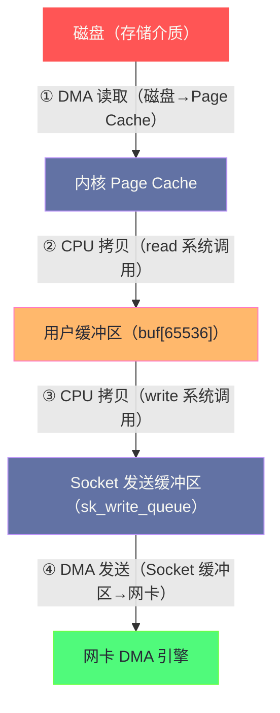

**摘要：**

"零拷贝（Zero-Copy）"这个词在技术圈被频繁提及，但它的确切含义往往被误解——它并不是说数据在传输过程中绝对没有任何拷贝，而是指**消除不必要的 CPU 介入的内存拷贝**。在传统的文件发送路径（`read()` + `write()`）中，一份数据要经历 4 次内存拷贝（磁盘→内核 Page Cache，Page Cache→用户缓冲区，用户缓冲区→socket 发送缓冲区，socket 发送缓冲区→网卡）和 4 次用户/内核态切换，其中有两次是完全没有意义的数据复制——数据从 Page Cache 拷贝到用户缓冲区，又从用户缓冲区拷贝回内核的 socket 缓冲区，中间在用户空间什么都没做。`sendfile()`（Linux 2.2）将这两次无意义拷贝合并，把路径压缩到 2 次拷贝；结合支持 SG-DMA（scatter-gather DMA）的现代网卡，CPU 拷贝次数可以降到 **0 次**——数据完全由 DMA 引擎搬运，CPU 只做元数据操作。`splice()`（Linux 2.6.17）进一步泛化了这个机制，支持任意两个 fd 之间的零拷贝传输，是 Linux 内核管道（pipe）的零拷贝扩展。本文深入分析这三条技术路线在内核中的实现机制，以及 Kafka、Nginx 等高性能系统为什么选择不同的零拷贝方案。

---

## 第 1 章 传统 IO 的四次拷贝：问题在哪里

### 1.1 read() + write() 发送文件的完整路径

假设需要将磁盘上的一个文件内容通过 TCP 发送给客户端，最朴素的写法是：

```c
/* 传统写法：read + write */
int fd = open("file.dat", O_RDONLY);
int sock = accept(...);

char buf[65536];
while ((n = read(fd, buf, sizeof(buf))) > 0) {
    write(sock, buf, n);
}
```

这段代码看起来简单，但内核里发生的事情远比代码本身复杂：



**四次拷贝的全貌**：

| 步骤 | 拷贝方向 | 执行者 | 系统调用上下文 |
|-----|---------|------|--------------|
| ① | 磁盘 → Page Cache | DMA 引擎（无 CPU 参与）| `read()` 触发缺页中断 |
| ② | Page Cache → 用户缓冲区 | **CPU 拷贝** | `read()` 返回前 |
| ③ | 用户缓冲区 → Socket 缓冲区 | **CPU 拷贝** | `write()` 内部 |
| ④ | Socket 缓冲区 → 网卡 | DMA 引擎（无 CPU 参与）| `write()` 返回后异步 |

**两次 CPU 拷贝（② 和 ③）是完全多余的**：

数据从 Page Cache 拷贝到用户缓冲区（②），然后从用户缓冲区拷贝回内核的 Socket 缓冲区（③）。在这两次拷贝之间，用户程序（`read()` 返回到 `write()` 调用之间）根本没有修改数据——数据经过用户空间只是"路过"，做了一次没有意义的往返旅行。

### 1.2 四次上下文切换的开销

除了数据拷贝，传统路径还有 4 次用户态/内核态的上下文切换：
- `read()` 调用：用户态 → 内核态（切换 1）
- `read()` 返回：内核态 → 用户态（切换 2）
- `write()` 调用：用户态 → 内核态（切换 3）
- `write()` 返回：内核态 → 用户态（切换 4）

每次上下文切换约 **100-400 ns**，还会导致 CPU 缓存污染（TLB 刷新、L1/L2 cache 失效）。对于发送大文件的场景（需要多次循环调用 `read/write`），这些开销累积起来相当可观。

---

## 第 2 章 mmap + write：消除一次 CPU 拷贝

### 2.1 mmap 的原理

`mmap()` 将文件的 [[Page Cache]] 直接映射到进程的虚拟地址空间——进程访问这段虚拟地址，实际上是直接访问内核的 Page Cache 页面，**不需要将数据拷贝到用户缓冲区**：

```c
/* mmap + write 的写法 */
void *mapped = mmap(NULL, file_size, PROT_READ, MAP_SHARED, fd, 0);
write(sock, mapped, file_size);
/* mapped 指向 Page Cache 中的数据，write 直接从 Page Cache 拷贝 */
```

**mmap + write 的路径**：

```
① DMA 读取：磁盘 → Page Cache（DMA，无 CPU）
② mmap 建立映射：进程虚拟地址 → Page Cache 物理页（页表操作，无数据拷贝！）
③ CPU 拷贝：Page Cache → Socket 缓冲区（write 系统调用触发）
④ DMA 发送：Socket 缓冲区 → 网卡（DMA，无 CPU）
```

**CPU 拷贝从 2 次降到 1 次**，上下文切换从 4 次降到 2 次（`mmap()` + `write()` 各 2 次，但 mmap 通常只需调用一次，多次复用映射）。

**mmap 的局限**：

1. `mmap()` 本身有系统调用开销（建立 VMA、页表映射）
2. 文件大小变化时，mmap 映射区域可能产生 SIGBUS 信号（需要处理）
3. 仍然有 1 次 CPU 拷贝（Page Cache → Socket 缓冲区）

---

## 第 3 章 sendfile：真正的零 CPU 拷贝

### 3.1 sendfile() 的设计初衷

`sendfile()`（Linux 2.2，1999 年）是 Linux 专门为"文件→socket"这个高频场景设计的系统调用：

```c
#include <sys/sendfile.h>
ssize_t sendfile(int out_fd,   /* 目标：socket fd（必须是 socket）*/
                 int in_fd,    /* 源：文件 fd（必须支持 mmap）*/
                 off_t *offset, /* 文件偏移（NULL 从当前位置开始）*/
                 size_t count); /* 发送字节数 */
```

**关键约束**：`in_fd` 必须是一个**可以 mmap 的文件 fd**（普通文件、块设备），`out_fd` 必须是一个 **socket**。不能是管道、不能是两个普通文件之间的传输。

### 3.2 sendfile() 的内核路径（无 SG-DMA）

在不支持 SG-DMA 的网卡上（老式网卡），`sendfile()` 的路径：

```
① DMA 读取：磁盘 → Page Cache（DMA，无 CPU 参与）
② CPU 拷贝：Page Cache → Socket 缓冲区（内核内部，不经过用户空间！）
③ DMA 发送：Socket 缓冲区 → 网卡（DMA，无 CPU 参与）
```

**用户态完全不可见**：数据从来没有进入用户地址空间，② 发生在纯内核态内部，CPU 仍然参与但只做一次拷贝。上下文切换降至 2 次（`sendfile()` 调用和返回各一次）。

### 3.3 sendfile() + SG-DMA：真正的 0 次 CPU 拷贝

Linux 2.4 内核引入了对**支持 SG-DMA（scatter-gather DMA）的网卡**的支持，将 `sendfile()` 优化到了 **0 次 CPU 拷贝**：

**SG-DMA 是什么**：传统 DMA 要求数据必须在一块连续的物理内存中；SG-DMA 允许 DMA 引擎从多个分散的物理内存页（scatter list）中收集数据，直接组合发送，无需将数据整合到连续内存。

**sendfile() + SG-DMA 的完整路径**：

```
① DMA 读取：磁盘 → Page Cache（标准 DMA，无 CPU 参与）

② 内核元数据操作（无数据拷贝！）：
   内核构造一个"文件描述符"，记录：
   - Page Cache 中各数据页的物理地址
   - 每页的偏移和长度
   将这个描述符传递给网卡驱动，而非数据本身

③ SG-DMA 发送：
   网卡的 DMA 引擎读取描述符
   直接从 Page Cache 的物理页中收集数据
   组合后发送到网络（无 CPU 参与，无数据拷贝）

整个过程：CPU 拷贝 = 0，DMA 拷贝 = 2（磁盘→缓存，缓存→网卡）
```

**为什么说是"零拷贝"**：严格来说是"零 CPU 拷贝"，DMA 拷贝还是有 2 次，但 DMA 是专用硬件引擎完成的，不占用 CPU 时间，不污染 CPU 缓存。


### 3.4 Kafka 为什么用 sendfile

Kafka 的消息消费（consumer）路径是 `sendfile()` 最经典的应用场景——Kafka Broker 需要将磁盘上的 log segment 文件发送给消费者，这正好是 `sendfile()` 的适用场景（文件 → socket）：

```java
// Kafka FileRecords.writeTo() 的核心实现
public long writeTo(TransferableChannel destChannel, long offset, int length) {
    // Java NIO 的 FileChannel.transferTo() 在 Linux 上底层调用 sendfile()
    return channel.transferTo(start + offset, length, destChannel);
}
```

**Kafka 的性能数据**：使用 `sendfile()` 后，Kafka 在消费大量历史数据时，CPU 使用率降低了约 60%，相同硬件的吞吐量提升了约 2-3 倍。这是 Kafka 能以极低的 CPU 消耗处理极高吞吐量的核心原因之一。

> [!note] 设计哲学：为什么 sendfile 不支持加密/压缩
> `sendfile()` 的零拷贝之所以能实现，前提是**数据不需要被修改**——内核直接将 Page Cache 中的原始字节发往网卡。一旦需要在发送前加密数据，就必须将数据读取到 CPU 可以访问的内存中进行计算，零拷贝路径就不再可用。
> 这就是为什么 Kafka 的 SSL/TLS 加密模式下，无法使用 `sendfile()` 零拷贝，而是退回到传统的 `read + encrypt + write` 路径——这也是 Kafka SSL 场景下 CPU 使用率显著高于非加密场景的根本原因。

---

## 第 4 章 splice()：管道与零拷贝的融合

### 4.1 sendfile() 的局限

`sendfile()` 只能将数据从**可 mmap 的文件**发送到 **socket**，这个约束太强：
- 不能从一个 socket 读取数据后直接写入另一个 socket（代理场景）
- 不能在两个普通文件之间传输
- 不能在文件和管道之间传输

**Linux 代理服务器（如 Nginx 反向代理）的需求**：从客户端连接读取数据，零拷贝地转发到上游服务器连接——这是两个 socket 之间的传输，`sendfile()` 无能为力。

### 4.2 splice() 的设计

`splice()`（Linux 2.6.17，2006 年）是 `sendfile()` 的泛化版本，支持任意两个 fd 之间的零拷贝传输，但有一个约束：**源 fd 和目标 fd 中至少有一个必须是管道（pipe）**：

```c
#include <fcntl.h>
ssize_t splice(int fd_in,          /* 数据来源 fd（文件/socket/pipe）*/
               loff_t *off_in,     /* 来源偏移（NULL 从当前位置）*/
               int fd_out,         /* 数据目标 fd（文件/socket/pipe）*/
               loff_t *off_out,    /* 目标偏移（NULL）*/
               size_t len,         /* 传输字节数 */
               unsigned int flags); /* SPLICE_F_MOVE/SPLICE_F_NONBLOCK/SPLICE_F_MORE */
```

**为什么必须有管道参与**？这是 `splice()` 的核心设计决策。管道（pipe）在内核中是一组 **`struct pipe_buffer`**——每个 `pipe_buffer` 持有一个 `struct page *`（物理内存页的引用），而不是数据本身的拷贝。`splice()` 通过让 `pipe_buffer` 持有 Page Cache 的物理页引用来实现零拷贝：

```
splice(file_fd, NULL, pipe_write_end, NULL, len, 0):

内核操作：
  从文件的 Page Cache 找到对应的 struct page *
  构造一个 pipe_buffer，让它持有这个 page 的引用（不拷贝数据！）
  将 pipe_buffer 加入管道的缓冲区队列

splice(pipe_read_end, NULL, socket_fd, NULL, len, 0):

内核操作：
  从管道读取 pipe_buffer（得到 struct page * 引用）
  将这个 page 引用传递给 socket 发送路径
  网卡 SG-DMA 直接从这个 page 读取数据发送
  全程没有数据拷贝
```

### 4.3 使用 splice() 实现文件→socket 零拷贝

```c
/* 用 splice 实现等价于 sendfile 的功能 */
int pipefd[2];
pipe(pipefd);  /* 创建管道（pipe_read=pipefd[0], pipe_write=pipefd[1]）*/

/* 第一步：文件 → 管道（零拷贝，Page Cache 页引用传递）*/
ssize_t n = splice(file_fd, &offset,
                   pipefd[1], NULL,  /* 写入管道写端 */
                   len,
                   SPLICE_F_MOVE | SPLICE_F_MORE);

/* 第二步：管道 → socket（零拷贝，page 引用传递给网卡）*/
splice(pipefd[0], NULL,  /* 读取管道读端 */
       socket_fd, NULL,
       n,
       SPLICE_F_MOVE);
```

这两次 `splice()` 调用共同实现了与 `sendfile()` 等价的零拷贝文件发送，但 `splice()` 的扩展性更强。

### 4.4 使用 splice() 实现 socket → socket 零拷贝代理

这是 `splice()` 相对于 `sendfile()` 的核心优势——可以在两个 socket 之间实现零拷贝转发：

```c
/* 反向代理的零拷贝实现 */
int pipefd[2];
pipe(pipefd);

/* 从客户端 socket 读取数据到管道（零拷贝）*/
ssize_t n = splice(client_fd, NULL,
                   pipefd[1], NULL,
                   65536,
                   SPLICE_F_MOVE | SPLICE_F_NONBLOCK);

/* 从管道转发到上游 socket（零拷贝）*/
splice(pipefd[0], NULL,
       upstream_fd, NULL,
       n,
       SPLICE_F_MOVE);
```

**路径分析**：
- 网卡 DMA → Socket 接收缓冲区（DMA，无 CPU）
- Socket 接收缓冲区 → 管道（page 引用传递，无 CPU 拷贝）
- 管道 → Socket 发送缓冲区（page 引用传递，无 CPU 拷贝）
- Socket 发送缓冲区 → 网卡 DMA（DMA，无 CPU）

**CPU 拷贝：0 次**。对于高带宽代理场景（如 10 Gbps 网络），这是巨大的性能提升。

### 4.5 tee()：管道数据的零拷贝分叉

`tee()`（Linux 2.6.17，与 `splice()` 同期引入）将管道中的数据"复制"到另一个管道，同时**保留原管道中的数据不消耗**——实现数据的零拷贝分发：

```c
/* tee() 使用示例：同时将数据写入日志文件和发送到网络 */
int pipefd[2], logpipefd[2];
pipe(pipefd);
pipe(logpipefd);

/* 第一步：从 socket 读取数据到主管道 */
splice(socket_fd, NULL, pipefd[1], NULL, len, SPLICE_F_MOVE);

/* 第二步：tee 将数据复制到日志管道（不消耗 pipefd[0] 的数据！）*/
tee(pipefd[0], logpipefd[1], len, SPLICE_F_NONBLOCK);

/* 第三步：发送数据到目标 */
splice(pipefd[0], NULL, target_fd, NULL, len, SPLICE_F_MOVE);

/* 第四步：将日志数据写入日志文件 */
splice(logpipefd[0], NULL, log_fd, NULL, len, SPLICE_F_MOVE);
```

`tee()` 内部通过增加 page 的引用计数来实现"复制"——两个管道持有同一个物理页的引用，数据不被真正复制，页面只在两个引用都释放后才被回收。

---

## 第 5 章 mmap 的高级用法：大文件的内存映射

### 5.1 mmap 与 Page Cache 的深度集成

`mmap()` 的优势不只是减少 `read/write` 的拷贝次数，更在于它将文件 IO 变成了内存访问，让内核的 [[Page Cache]] 机制（LRU 替换、预读、延迟分配）对应用程序透明地工作：

```c
void *addr = mmap(NULL, file_size, PROT_READ | PROT_WRITE,
                  MAP_SHARED,  /* 共享映射：写入修改 Page Cache */
                  fd, 0);

/* 读取文件——等同于访问 Page Cache（可能触发缺页错误）*/
char *data = (char *)addr + offset;

/* 写入文件——直接修改 Page Cache 中的数据（变为脏页）*/
memcpy(addr + offset, new_data, len);
/* 内核会在适当时机（pdflush/kworker）将脏页写回磁盘 */

/* 强制立即写回 */
msync(addr, len, MS_SYNC);  /* 等待写回完成（类似 fsync）*/
```

**MAP_SHARED vs MAP_PRIVATE 的内核实现差异**：

- `MAP_SHARED`：进程的 VMA（Virtual Memory Area）直接映射到 Page Cache 的物理页。多个进程 mmap 同一文件，共享同一组物理页，写入操作对所有进程可见（通过 Page Cache 传播）
- `MAP_PRIVATE`：写时复制（Copy-on-Write，CoW）。初始映射也指向 Page Cache 物理页，但第一次写入时，内核为这个进程分配一个新的物理页（私有副本），写入操作不影响原来的 Page Cache 页面或其他进程

### 5.2 Kafka 的存储架构：mmap + sendfile 的配合

Kafka 在生产者写入路径使用 `mmap`，在消费者读取路径使用 `sendfile`：

```
Producer 写入路径：
  Producer → Kafka Broker →（mmap 写入）→ Log Segment File（Page Cache）
  内核的脏页回写机制 → 磁盘

Consumer 读取路径：
  Consumer → Kafka Broker → FileChannel.transferTo()（sendfile）→ Consumer Socket
  数据直接从 Log Segment File 的 Page Cache → 网卡
  全程 0 次 CPU 拷贝（有 SG-DMA 的情况下）
```

**Kafka Index 文件也用 mmap**：每个 log segment 对应两个索引文件（`.index` 和 `.timeindex`），Kafka 将这两个文件 mmap 到内存，索引查找直接访问内存，不需要磁盘 IO。这是 Kafka 消费者能在毫秒级定位到任意 offset 的基础。

---

## 第 6 章 各种零拷贝方案的对比与选型

### 6.1 技术方案对比

| 技术 | CPU 拷贝次数 | 上下文切换次数 | 适用场景 | 限制条件 |
|-----|-----------|-------------|---------|---------|
| read + write | 2 | 4 | 通用，需要修改数据 | 无 |
| mmap + write | 1 | 4（mmap 只需一次）| 随机读写，数据库 | 文件大小变化需小心 |
| sendfile（无 SG-DMA）| 1 | 2 | 文件→socket 传输 | 仅文件→socket |
| sendfile（SG-DMA）| 0 | 2 | 文件→socket 高吞吐 | 仅文件→socket，需 SG-DMA 网卡 |
| splice | 0 | 2×n（n 次 splice 调用）| 任意两 fd 间（需管道中转）| 必须有管道参与 |

### 6.2 Nginx 的零拷贝策略

Nginx 在静态文件服务中使用 `sendfile()`（在 `nginx.conf` 中 `sendfile on`），在代理模式下使用传统路径（因为需要修改 HTTP 头，无法使用零拷贝）：

```nginx
# nginx.conf
http {
    sendfile on;            # 启用 sendfile() 零拷贝（静态文件服务）
    tcp_nopush on;          # 配合 sendfile，积累数据后再发送（减少小包）
    tcp_nodelay on;         # 在 keepalive 连接上关闭 Nagle 算法
    # tcp_nopush 和 tcp_nodelay 同时开启时：
    # 先用 tcp_nopush 积累数据，最后一个包用 tcp_nodelay 立即发出
}
```

**`tcp_nopush`（`TCP_CORK` socket 选项）与 `sendfile` 的配合**：

`sendfile()` 可能会发送很多小包（如文件头 + 数据体分开发送），`TCP_CORK` 告诉内核"先别发，等我填满一个包再发"——发送方积累数据，直到数据量达到 MSS 或超时（200ms）后再发出。配合 `sendfile`，Nginx 可以先用 `TCP_CORK` 阻塞发送，将 HTTP 响应头和文件数据积累在 socket 缓冲区中，然后一次性通过 `sendfile()` 发出大块文件数据，最后关闭 `TCP_CORK`，立即发出剩余数据——最大化每个 TCP 包的利用率，减少总包数。

> [!info] 核心概念：什么时候不应该用 sendfile
> 以下场景**不适合**使用 `sendfile()`：
> 1. **需要修改数据**：如动态生成的 HTTP 响应体、需要压缩/加密的数据
> 2. **源是动态生成的内容**：API 响应（JSON/XML）不来自文件，无法 mmap
> 3. **SSL/TLS 加密**：数据必须经过 CPU 加密处理，无法零拷贝
> 4. **需要修改 HTTP 头部**：代理模式下需要修改 Host、X-Forwarded-For 等头部
>
> 真正能用 `sendfile()` 零拷贝的场景：**原始文件直接发送给客户端，数据不需要任何修改**。这是 CDN 边缘节点、文件下载服务器、Kafka 消费者这类服务的核心场景。

---

## 第 7 章 io_uring 的零拷贝：注册缓冲区（Registered Buffers）

### 7.1 传统异步 IO 的拷贝问题

即使使用 `io_uring`（参见文件系统专栏的 [[10 现代存储技术——NVMe、io_uring 与用户态存储]]），传统的 `read/write` 操作仍然有一次 CPU 拷贝：数据从内核缓冲区拷贝到用户提供的缓冲区（或反向）。

### 7.2 fixed buffers：预注册消除动态映射开销

`io_uring` 的 `io_uring_register_buffers()` 机制允许预先注册用户态缓冲区，内核在注册时就完成物理页的映射和 pin（防止换页）。后续 IO 操作时，内核跳过动态映射步骤，直接使用已映射的物理地址——消除了每次 IO 都需要查页表的开销：

```c
/* 预注册缓冲区 */
struct iovec iov[4];
for (int i = 0; i < 4; i++) {
    posix_memalign(&iov[i].iov_base, 4096, 1 << 20); /* 1MB 对齐缓冲区 */
    iov[i].iov_len = 1 << 20;
}
io_uring_register_buffers(&ring, iov, 4);

/* 使用预注册缓冲区（read_fixed 而非普通 read）*/
struct io_uring_sqe *sqe = io_uring_get_sqe(&ring);
io_uring_prep_read_fixed(sqe, fd, iov[0].iov_base, iov[0].iov_len, 0, 0);
                                                                         /* ↑ buf_index */
```

这不是完全的零拷贝（数据仍然从内核拷贝到用户缓冲区），但消除了每次 IO 的页表操作开销，在高 IOPS 场景下有显著收益。

---

## 小结

零拷贝技术的本质是**减少 CPU 介入的数据搬运次数**，让专用的 DMA 硬件接管数据传输，将 CPU 解放出来做真正有价值的计算工作：

**三条技术路线的适用边界**：
- **`sendfile()` + SG-DMA**：文件→socket 的最优解，0 次 CPU 拷贝，Kafka、Nginx 静态文件服务的核心武器
- **`splice()`**：任意 fd 间的零拷贝，代价是需要管道中转，适合代理/转发场景
- **`mmap()`**：文件随机访问 + 零拷贝写入，适合数据库、Kafka Index 等需要随机读写的场景

**不能使用零拷贝的场景**：需要修改数据（加密、压缩、协议转换）——这类场景 CPU 必须介入，零拷贝失去意义。正确的工程实践是先判断"数据是否需要被 CPU 处理"，再决定是否引入零拷贝技术。

下一篇 [[06 TCP 性能调优——拥塞控制、Nagle 与缓冲区优化]] 将深入 TCP 协议层的性能调优：BBR 拥塞控制算法为什么能在高延迟网络上比 CUBIC 快 2-10 倍，Nagle 算法和 TCP_CORK 的配合使用，以及发送/接收缓冲区的 sysctl 调优方法论。
