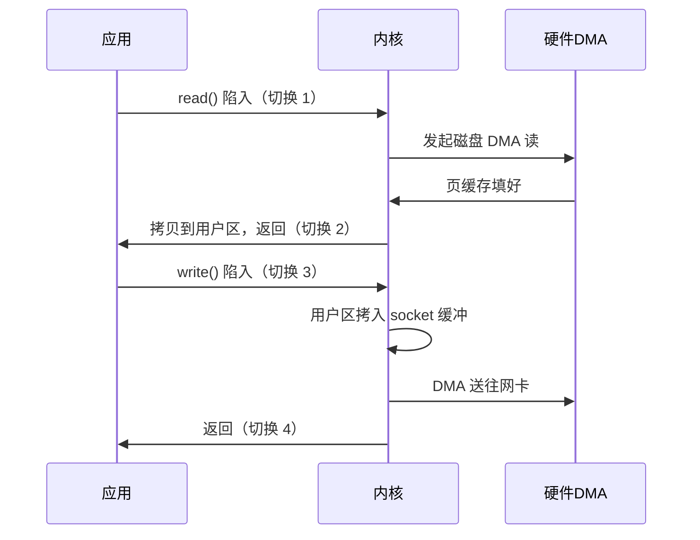

# 零拷贝技术全景——sendfile、splice 与 DMA gather

**摘要：**

上一篇解决了"等"的效率，本篇处理"搬"的效率。当应用要把一个文件发到网络对端——CDN 回源、Kafka 的日志拉取、静态资源服务——传统的 read+write 组合会让数据在内存里反复搬家：磁盘到页缓存（DMA）、页缓存到用户缓冲区（CPU）、用户缓冲区到 socket 缓冲区（CPU）、socket 缓冲区到网卡（DMA），其中 CPU 参与的两次拷贝，加上四次用户态/内核态切换，构成了数据面最昂贵的固定开销。本篇沿着"每次能省掉哪一拷"的线索把零拷贝技术谱系完整走一遍：mmap+write 如何用内存映射消掉第一次 CPU 拷贝，sendfile（1999 年随 Linux 2.2 引入）如何让数据全程不出内核，SG-DMA（Scatter-Gather，散布收集）如何连内核态的两次 CPU 拷贝也一并免除，splice 如何用管道把零拷贝推广成通用的内核数据通道，以及 kTLS、MSG_ZEROCOPY、copy_file_range 这些新近成员各自填补了什么空白。文末用一张对比表把选型逻辑收拢，并专门讨论零拷贝的失效边界——TLS 加密、小文件、页缓存未命中场景下，省拷贝的收益如何被别处的代价吃掉。本文回答两个核心问题：一次"文件到网络"的传输，最少需要几次拷贝、哪几次不可避免；以及面对具体业务，应当在零拷贝谱系的哪一档落位。

---

## 第 1 章 传统 IO 的四次拷贝：问题在哪里

### 1.1 把 read+write 的账本摊开

从"读取文件并发送到网络"这行最朴素的需求出发。传统实现是两个系统调用：`read(file, tmp_buf, len)` 把数据读进用户缓冲区，`write(sock, tmp_buf, len)` 把数据发出去。这两个调用在内核里走过的完整路径，是本篇一切讨论的基准线：


四步拷贝之外，还要叠加四次上下文切换：read 一次陷入、一次返回，write 再一次陷入、一次返回。把这五行账目按"谁在搬、搬的是不是必需"分类，就能看清优化空间在哪里。①与④是 DMA 完成的，CPU 只负责下指令，这两次是硬件与总线层面的必然，零拷贝技术动不了它们；真正昂贵的是②与③——CPU 在原地逐字节搬运数据，既占 CPU 周期，又占用内存带宽，还在内核缓冲与用户缓冲之间制造了两份冗余副本。

上下文切换的代价同样不可小觑。每次陷入/返回涉及寄存器保存恢复、内核栈切换与缓存污染，03 篇讲过它的量级；

把两个调用在时间轴上的形态画出来，切换与拷贝的交替一目了然：



值得逐字读一遍的是时间轴的启示：应用在整条链路里只做了一件有价值的事——发起请求；其余时间都在等待内核与硬件完成数据的地毯式搬运。CPU 的两次拷贝发生在切换 2 之前与切换 3 之后，恰好是应用等待最久的两段——优化的目标就是让这两段消失。

消失的方式有两种：省掉（让拷贝不发生）与合并（让多次发生变成一次发生）。本篇主角们大多走省掉一路，而 08 篇的批量接口走的是合并一路——两种方式在账本上的效果等价，工程形态却完全不同，这也是性能优化史上"水平分解"与"垂直合并"两大流派的缩影。对大块数据传输，切换成本相对拷贝可以忽略，但对高频小块传输，四次切换的占比会迅速上升——这也预告了零拷贝技术在"大文件"与"小消息"两类负载上的收益差异。

### 1.2 两次 CPU 拷贝的必要性分析

优化之前先问：②与③真的必要吗。按"分层架构为什么要这样设计"的思路逐次审问。拷贝②（页缓存 → 用户缓冲区）的动机是**用户态与内核态的内存隔离**——应用进程不能直接访问内核的页缓存，所以必须复制一份给应用。这个隔离对"应用要处理数据"的场景是必要的（应用确实要修改数据），但对"应用只是转发数据"的场景纯属多余：数据进用户态转了一圈，一个字节没动，又被送回内核。

拷贝③（用户缓冲区 → socket 缓冲区）的动机是**所有权与生命周期的分离**——write 返回后，用户缓冲区可以被应用立即复用或释放，socket 缓冲区里的数据由内核独立持有，直到 DMA 完成。这个设计保证了 write 的接口语义简洁，但同样可以质疑：如果数据始终留在页缓存里不动，而让 socket 引用页缓存中的数据，生命周期问题可以用引用计数解决——02 篇讲过 skb 的页片段（frags[]）正是为此而生。

**审问的结论构成零拷贝的第一性原理：让"纯粹搬运"的数据不要进出用户态，让内核内部的数据传递尽量共享而非复制**。下文的每一项技术，都是这条原理在不同约束下的展开。值得一提的是，这个"审问"的过程本身就是内核演进的缩影——sendfile 的引入动机（1999 年，Linux 2.2，由 Apache 与 Samba 社区推动

从体系结构的角度再看一眼 CPU 拷贝的真实成本，它远不止 memcpy 的循环时间。一次拷贝至少三层消耗：**内存带宽**——读一遍写一遍，占据双倍带宽，而带宽是整机共享的稀缺资源；**缓存污染**——搬运的数据流经 L1/L3，把应用热数据挤出缓存，损失在拷贝结束后仍持续发酵；**核心占用**——拷贝期间的 CPU 周期无法做任何有价值的事。零拷贝文献里常引用的一个量级感受：每秒 10 Gbps 的转发若全部经手 CPU，仅搬运就吃掉一个核的大部分吞吐

换个角度感受这个量级：10 Gbps 约等于每秒 1.25 GB，现代内存带宽的十分之一——单看数字并不吓人，但拷贝的读加写让带宽占用翻倍、上下文切换再添折损，叠加起来恰好卡在单核能力的天花板上。天花板的逼仄解释了为什么零拷贝不是锦上添花，而是万兆时代的入场券。

这个量级估算还提供了一把审读性能文章的尺子：任何宣称"零拷贝提升 10 倍吞吐"的说法，都默认基线处于 CPU 瓶颈——若基线本被磁盘或对端窗口卡住，零拷贝的收益不会超过 20%。量级模型的价值不在精确，而在给宣传数字装上一个合理的怀疑框架。——这是负载均衡器、存储网关在万兆时代集体转向零拷贝的物理动机。

> [!info] 拷贝成本速记
> 一次内存拷贝的成本可以用一个简单模型估算：数据量除以内存带宽（单核 memcpy 实际带宽通常为整机峰值带宽的几分之一），再加缓存污染的隐性税。带宽越大、核越多的机器，拷贝的相对占比反而越显著——因为带宽的增长追不上核数的增长，存储墙是零拷贝议题在可预见未来不会过时的根本原因。）正是 Web 服务器时代"文件原样发出去"的需求倒逼。

### 1.3 优化的收益上限

在动手之前，先算清优化的收益上限，这决定了我们对每一档技术的期望值。传统路径的总成本记为"4 次拷贝 + 4 次切换"，其中 2 次 DMA 拷贝不可省（磁盘进内存、内存进网卡总要发生），2 次 CPU 拷贝理论上可省，4 次切换在理想方案下可以压到 0（一个系统调用完成全部）。用一句工程语言总结：**零拷贝的极限不是"零次搬运"，而是"零次 CPU 参与"——搬运本身永远不会消失，消失的只是 CPU 亲手搬的那两次**。这个措辞的澄清很重要：业界语境里的"零拷贝（zero-copy）"，准确含义是零次 CPU 拷贝，DMA 的搬运一如既往。

收益上限还可以按负载画像进一步拆分。不同报文尺寸下，四次拷贝与四次切换在总成本中的占比完全不同：

| 负载画像 | 每次传输的数据量 | 拷贝成本占比 | 切换成本占比 | 优化重点 |
| :--- | :--- | :--- | :--- | :--- |
| 大文件流式 | 64 KB ~ MB 级 | 高（带宽主导） | 低 | 省 CPU 拷贝 |
| 高频小消息 | 百字节级 | 低 | 高 | 省切换与调用 |
| 混合负载 | 中等 | 中 | 中 | 两者并重 |

这张表解释了零拷贝文献里一个常见的分歧：有人实测收益巨大，有人几乎测不出差别——差别来自负载画像。零拷贝首先是"大块数据流式传输"的优化技术，把它套在小消息负载上，收获的更多是 08 篇 io_uring 那类调用层面的优化。

### 1.4 零拷贝谱系的历史时刻表

零拷贝不是一次性的发明，而是二十年间随硬件与需求逐块拼上的拼图。把时间线铺开，每一次拼图背后的驱动力都清晰可辨：

| 年份 | 里程碑 | 驱动力 |
| :--- | :--- | :--- |
| 1999 | sendfile 随 Linux 2.2 引入 | Web 服务器浪潮，静态文件分发 |
| 2001 前后 | SG-DMA 支持，sendfile 达成零 CPU 拷贝 | 千兆网卡普及，CPU 成为瓶颈 |
| 2006 | splice/vmsplice/tee 随 2.6.17 落地 | 通用化诉求：socket 间转发、流媒体 |
| 2016 | copy_file_range 合入 4.5 | 虚拟化与存储系统的文件间拷贝 |
| 2017 | MSG_ZEROCOPY（4.14）、kTLS TX（4.13） | 云网络大块传输与 HTTPS 普及 |
| 2019 | io_uring 合入 5.1，异步零拷贝开篇 | 系统调用成为最后的固定成本 |

时刻表的读法：前十年解决 CPU 别搬数据，后十年解决协议演进别毁掉优化（kTLS）与调用本身别太贵（io_uring）。技术谱系的每一次扩展，都是上一代优化被新需求倒逼后的再升级。

---

## 第 2 章 mmap + write：消掉第一次 CPU 拷贝

### 2.1 机制：把页缓存映射进用户地址空间

mmap+write 的思路直接来自 1.2 节的审问结论：既然拷贝②只是因为内存隔离而存在，那就用 mmap 把页缓存直接映射进用户地址空间——应用"看到"数据，但不拥有数据；数据自始至终只存在页缓存那一份。随后的 write 仍要做一次从映射区到 socket 缓冲区的 CPU 拷贝（拷贝③照旧），但页缓存到用户缓冲的拷贝②被彻底省去。总账变成：2 次 DMA + 1 次 CPU 拷贝 + 4 次上下文切换。

```mermaid
%%{init: {'theme': 'dracula'}}%%
flowchart LR
    DISK["磁盘"] -->|① DMA| PC["页缓存<br/>（同时映射进用户态）"]
    PC -->|"② CPU 拷贝（仅存的一次）"| SB["socket 缓冲区"]
    SB -->|③ DMA| NIC["网卡"]
    APP["用户进程<br/>mmap 映射区"] -.->|虚拟地址访问，无拷贝| PC
    style PC fill:#44475a,stroke:#50fa7b
    style APP fill:#44475a,stroke:#bd93f9
```



图中虚线是 mmap 的精髓：用户进程的虚拟地址直接指向页缓存页，访问即读，无拷贝发生。这一机制的完整原理（缺页、映射、回收）在 [[Linux/内存管理/04 Page Cache：Linux 为什么要用内存来缓存磁盘]] 有系统展开，本篇不再重复页缓存的细节，只关注它对网络路径的影响。

对应的代码形态非常简洁，两行完成一次零映射的转发：

```c
char *addr = mmap(NULL, file_len, PROT_READ, MAP_PRIVATE, file_fd, 0);
write(sock_fd, addr + offset, chunk_len);   /* 数据从页缓存直接流向 socket 缓冲 */
```

简洁是双刃剑：代码里看不见的缺页、回收与映射管理，全部由内核在后台处理，性能画像因此比 read+write 更依赖运行时状态。

### 2.2 mmap+write 的隐藏成本与适用边界

省一次拷贝并非免费，mmap 方案的代价清单同样具体。第一是**缺页异常**：映射区在首次访问时按页触发缺页中断，每次约几微秒——对连续顺序读的大文件，缺页可由内核的预读掩盖；对随机访问的小 IO，缺页风暴会吃掉省下来的那点拷贝时间。第二是 **TLB 压力**：映射引入更多虚拟地址到物理地址的转换，TLB miss 上升（内存管理专栏的大页篇对此有专门分析）。第三是**映射管理的系统调用**：munmap、msync 的管理开销在频繁映射小块数据的场景会反噬收益。

这些代价决定了 mmap+write 的适用画像：**大文件、顺序访问、需要用户态读取或改写部分内容**的场景——它比 sendfile 多出一份灵活性（应用能看见数据），比传统路径少一次拷贝。反过来，"纯转发、不需要看数据"的场景，mmap 的灵活性是白付的成本，下一章的 sendfile 才是正解。这个对比背后是一贯的权衡逻辑：**多一分能力，多一分开销；零拷贝谱系的每一档，都是在"数据要不要让应用看见"这个问题上选边**。

### 2.3 实践注记：Java 的 MappedByteBuffer 与 mmap 的坑

mmap 在工程语言层的露面以 Java 的 MappedByteBuffer 最广为人知：Kafka 的索引文件、RocketMQ 的存储层都用它做过热路径。但实践中的坑必须与机制一起讲：映射区的页由内核按需加载与回收，应用若在页被回收后继续通过映射指针写入，会收到 SIGBUS 信号——这在文件被截断的场景（日志轮转、临时文件清理）是真实的生产事故来源；Java 层对 munmap 的时机控制也相当受限（unmap 依赖 GC 与 Cleaner，不可精确调度）。这些工程摩擦解释了为什么 mmap+write 在

mmap 的虚拟内存原理与陷阱（缺页、回收、SIGBUS 的完整机制）在 [[Linux/内存管理/04 Page Cache：Linux 为什么要用内存来缓存磁盘]] 与 [[Linux/性能优化/06 应用级 IO 优化——Direct IO、mmap 与 io_uring 选型]] 各有展开：前者讲页缓存的来龙去脉，后者把 mmap 与 Direct IO、io_uring 放在一起做选型对比。本篇保留的只有与网络路径相关的部分——跨专栏阅读时，这条映射链正好把两边的知识缝合起来。

2.2 节的三类隐藏成本还可以量化排序：缺页异常（每次微秒级，可预读掩盖）＞ TLB miss（每次百纳秒级，映射区越大越频繁）＞ 映射管理调用（一次性几十微秒，摊销后最低）。排序的工程含义是：小映射区频繁建立销毁的场景，管理调用是主导成本；大映射区随机访问的场景，TLB 是主导成本。对症下药的前提是知道药治病在哪。"文件到网络"的纯转发场景几乎没有长期胜者——它的历史角色更像是从传统路径通往 sendfile 的过渡桥，以及随机访问场景下的长期主力。

mmap 的两种加载模式也值得认识：MAP_POPULATE 在映射时一次性填页（省去后续缺页，代价是建立映射变慢），默认的惰性加载则相反——预知要整体访问的用前者，只触局部的用后者。两种模式的取舍同样是 2.2 节三笔成本的再分配，没有免费的选项。

mmap 的工程经验还积累了一条重要边界：**映射不等同于独占**。MAP_PRIVATE 只保证写时复制，内核随时可能回收底层页（干净页直接丢弃，脏页写回后丢弃），应用下次访问会触发新的缺页与重读——对"读一次就转发"的流式负载，这些回收恰恰是优点（缓存自动滑动）；对"反复随机访问"的负载则是反复的缺页税。理解了这一点就能理解为什么数据库引擎（InnoDB、RocksDB 的某些变体）对 mmap 作为存储热路径的态度长期摇摆——机制足够好，但可控性不足，而数据库最看重可控。

因此 mmap 在网络路径上的现实定位是"选配的辅料"而非主菜：主路径交给 sendfile，只有当业务确需读取或校验数据片段（譬如日志服务要计算校验和）时，才局部引入 mmap 让应用窥见数据——主次分明的组合，比非此即彼的选型更贴近工程现实。

> [!warning] SIGBUS 的工程含义
> 映射区的页被内核回收后继续访问会收到 SIGBUS，默认行为是进程崩溃——这不是理论风险，而是日志轮转、文件截断场景下的真实事故。稳健的做法是：映射期间锁定文件不被截断（文件锁或生命周期约定），或注册 SIGBUS 处理器做降级退出。把这条写进 mmap 的使用规范，能消灭一类最难排查的偶发崩溃。

> [!note] 与 fork 的对照
> SIGBUS 的处理还牵出一个 mmap 家族的知名陷阱：fork 之后映射区的 COW 行为、MAP_NORESERVE 的内存超售、以及 MADV_DONTNEED 与 MADV_FREE 语义的差异，都会让"映射的内存"表现得出人意料。mmap 是内核接口里"语义最密"的一个，用之前读一遍 mmap(2) 手册的 BUGS 一节，收益远超时长。

---

## 第 3 章 sendfile：数据不出内核的直达车

### 3.1 机制：一次调用，全程内核态

`sendfile(out_fd, in_fd, offset, count)` 的目标只有一个：把"文件到 socket"的搬运收敛进一次系统调用，数据全程停留在内核空间。它的账本比 mmap+write 更干净：2 次 DMA + 1 次内核态 CPU 拷贝（页缓存 → socket 缓冲区）——用户态的两次拷贝（进与出）同时消失，上下文切换从 4 次降到 2 次。对"纯转发"场景，这是 mmap+write 的严格上位替代：省的拷贝一样多，还免掉了映射管理的全部麻烦。

内核实现层面的关键角色是 02 篇解剖过的 skb：sendfile 生成的 skb 不再从用户缓冲区拷数据，而是把页缓存的页面直接挂进 skb 的页片段数组（frags[]）——数据页原地不动，skb 只是"引用"了它们。socket 层的发送缓冲记账也随之变化：sendfile 占用的 sk_wmem 记的是页引用而非数据副本，发送完成后页面引用释放，页缓存本身安然无恙。

发送侧还有一个与 TCP 交互的细节值得知道：sendfile 生成的数据段同样受拥塞窗口与对端窗口的约束，大文件会以 MSS 为节奏分批入网。Nginx 的 tcp_nopush 选项正是为此设计的配套：把 sendfile 的数据与协议头攒成满 MSS 的段再发（利用 TCP_CORK），避免每个 sendfile 批次都带一个不满的尾巴段——它是文件服务器调优清单上的常客，06 篇讨论 TCP_CORK 时会再相逢。

### 3.5 sendfile 的使用清单与局限

sendfile 并非无条件的银弹，把它的使用前提与局限归拢成一份清单。前提侧有三条：网卡支持 SG-DMA（否则剩一次内核拷贝）；数据在页缓存中有效（冷文件先付回填成本）；发送路径无需数据改写（改写即断链）。局限侧有三条：输入 fd 必须是文件类（早期版本输出必须是 socket，新内核已放宽，但跨类型组合仍以文件入站为主）；不支持需应用参与协议处理（改写、压缩）的场景；与 TLS 原生不兼容（kTLS 出现前）。

清单之外还有一个隐性行为值得知道：sendfile 的 offset 语义与文件截断并发时存在窗口——发送途中文件被截断，内核读到短页会以零填充或提前结束（依版本而异），日志类"边写边发"的服务要为此设计一致性策略（Kafka 的段文件只读不可变，正是为了绕开这类并发问题）。看清局限不是为了不用，而是为了知道边界内怎么用好。

接口形态与语义值得逐参数看一遍：

```c
off_t offset = 0;
while (total_sent < file_len) {
    ssize_t n = sendfile(sock_fd, file_fd, &offset, chunk); /* 每次发送 chunk 字节 */
    if (n <= 0) break;               /* 0 表示到达文件尾，负值查 errno */
    total_sent += n;                  /* offset 由内核回写推进 */
}
```

offset 是入参兼出参——内核每送出一段就把它推进，调用方据此断点续传。这个设计透露了 sendfile 的另一个身份：它不是 send 的一次性替代，而是为"逐块流式推送大文件"设计的循环原语。Java 的 `FileChannel.transferTo` 与 Netty 的 FileRegion 都是这层循环的封装。

### 3.2 SG-DMA：把最后一次 CPU 拷贝也取消

sendfile 最初版本仍有一次内核态拷贝（页缓存 → socket 缓冲区），取消它需要网卡配合——这就是 SG-DMA（Scatter-Gather DMA，散布收集 DMA）。普通 DMA 只认一段连续内存；SG-DMA 允许网卡从**多个不相邻的内存地址**收集数据组装帧：报文头部来自 socket 缓冲区里现成的 skb 头部空间，数据体直接来自页缓存的页面。CPU 从头到尾不再接触数据，账本最终收敛为：2 次 DMA + 0 次 CPU 拷贝 + 2 次上下文切换——"零拷贝"的字面意义在此达成。

```mermaid
%%{init: {'theme': 'dracula'}}%%
flowchart LR
    DISK["磁盘"] -->|DMA| PC["页缓存"]
    PC -->|"SG-DMA gather<br/>（数据页原地引用）"| NIC["网卡"]
    HDR["socket 缓冲区<br/>仅存放协议头"] -->|"SG-DMA gather"| NIC
    NIC --> ETH["组装成帧发出"]
    style PC fill:#44475a,stroke:#50fa7b
    style HDR fill:#44475a,stroke:#8be9fd
    style ETH fill:#44475a,stroke:#ff79c6
```



这张图是全篇的"终点站"：协议头与数据体在网络卡的 DMA 引擎里合流，CPU 的角色从头到尾只是"布置任务"（构造头部 skb、填写页引用），从不搬运字节。`ethtool -k` 输出里的 `scatter-gather: on` 就是这趟直达车的车票，02 篇 1.4 节的非线性 skb 是它的内核路基。

SG-DMA 之所以能做到头体分离，依赖网卡 DMA 引擎的一个能力：按"地址 + 长度"的描述符列表收集数据。内核把报文描述成一组片段（协议头一段、页缓存数据若干段），DMA 引擎按列表依次抓取、在网卡内部组装成完整帧。这个能力本质上与 02 篇讲过的 skb 页片段同构——**内核以页为单位的散布存储，对应网卡以片段为单位的收集组装**，两侧的数据模型对上了，中间就不需要任何搬运。

SG-DMA 与 07 篇的收包路径还有一层对偶关系：发送方向的 SG-DMA 省的是"读内存"的 CPU 参与，接收方向的类似能力（页直接入队、头部与数据分离）省的是"写内存"的 CPU 参与——两个方向合起来，CPU 在数据面只剩纯粹的调度角色。这个对偶是 07 篇 NAPI 与 05 篇零拷贝共享的底层主题。

硬件能力的检测与降级也值得交代：`ethtool -k eth0` 输出的 scatter-gather 字段即 SG-DMA 的开关，未开启时内核自动退化为带一次内核态拷贝的 sendfile——功能可用、收益减半。这让 sendfile 成为一个优雅降级的接口：有 SG-DMA 是零拷贝，没有也仍是少两拷的改进版，应用代码无须感知差异。

优雅降级的另一面是性能归因的难度：同一份基准报告，读者无从知晓 SG-DMA 是否就绪，结论的可迁移性大打折扣。发布基准数据时附上完整的硬件与内核特性清单（ethtool、sysctl、内核版本），是性能社区的基本礼仪，也是内部技术文档值得学习的习惯。

硬件能力的差异还提醒我们一件事：零拷贝的性能数字是"机器画像"的函数——同一份代码，在 SG-DMA + GSO 就绪的服务器上与在老旧虚拟机网卡上，可能相差一个数量级。云环境下虚拟网卡的特性参差（virtio-net 的 scatter-gather 支持、云厂商的卸载开关），把"验证硬件特性"列为部署清单的第一项并不过分。

### 3.3 sendfile 与页缓存的双向奔赴

sendfile 的效率与页缓存（Page Cache）深度耦合，这是一把需要两面看的刃。命中页缓存时（热点文件、二次传输），数据直接从内存页流向网卡，连磁盘都不必打扰——CDN 边缘节点、Kafka 拉取热分区的高吞吐由此而来。但首次传输或冷数据场景，页缓存未命中会触发磁盘读入，传输路径上叠加了缺页与回填的延迟；更微妙的是，大文件的流式传输会冲刷页缓存，把应用热数据挤出内存（内核的 LRU 回收策略对此有 padding 保护，[[Linux/内存管理/05 内存回收：kswapd、LRU与直接回收的博弈]] 有展开）。**sendfile 的性能画像因此高度依赖"数据温度"**——它把传统路径的"用户态拷贝开销"换成了"缓存命中率"这个新变量，而后者往往更难控制。

温度变量是可以被应用主动管理的，`posix_fadvise` 是关键的旋钮：`POSIX_FADV_SEQUENTIAL` 告知内核顺序大块读（预读窗口加倍），`POSIX_FADV_WILLNEED` 提前预热，`POSIX_FADV_DONTNEED` 在发送完成后主动清理页缓存（防止流媒体服务冲刷掉其他应用的热数据）。预读窗口与 sendfile 的配合尤其值得注意：内核按页缓存缺页推断访问模式，sendfile 的读取同样享受预读加速——一次大文件的流式 sendfile，磁盘读的代价被预读摊薄到接近顺序读的理论带宽。

> [!info] 数据温度
> 本篇反复出现的温度一词值得定义为工程量级：热数据（页缓存命中，传输是纯内存速度）、温数据（部分命中，混合延迟）、冷数据（未命中，磁盘带宽决定上限）。sendfile 的实测吞吐横跨三个量级，测试前先确认数据温度，否则基准结果毫无意义。

---

## 第 4 章 splice：把零拷贝推广成通用管道

### 4.1 管道作为中介：两次 splice 的接力

sendfile 有两个先天的通用性缺陷：输入必须是文件（in_fd 不支持 socket），且"文件 → socket"的路径写死在系统调用里。splice（2006 年，Linux 2.6.17）给出更普适的方案：**引入管道（pipe）作为内核缓冲的中介**，任何支持 splice 的 fd（socket、文件、设备）都能把数据"移入"管道，任何此类 fd 也都能把数据"移出"管道。文件到 socket 的传输变成两次接力：`splice(file → pipe)` 再 `splice(pipe → socket)`，全程数据以页引用的形式在管道缓冲里流转，没有字节级拷贝。


管道在图中的角色值得单独说明：它不是数据的家，而是**页引用的转运站**——Linux 管道缓冲本质是 16 个页槽的环形队列，splice 移动的只是槽位上的页指针。

管道缓冲的页槽设计还有一层精巧：槽位持页引用而非数据，同一页可以被多个槽位引用（配合 tee 的分发），引用的释放遵循最后的读者先行——这与 02 篇 skb 的引用计数共享是同一套内存纪律在管道上的再现。读懂了 skb 的共享模型，splice 的页槽几乎无需再学。

管道的这条页引用纪律还有一个意外受益者——splice 的消费端可以用探测语义查看而不取走槽位内容，配合 tee 形成旁路观测的标准姿势。观测与主路径共享同一批页，旁路零成本——抓包、审计、复制分发的底层合法性都来自这条纪律。

旁路观测的边界同样清楚：观测者只能看，不能改——页是共享的，改写会污染主路径的数据。需要旁路修改的场景（譬如透明代理改写流量），页引用模式必须退化为完整拷贝，旁路的零成本随之消失。共享的安全性与修改的自由度，又是一对熟悉的权衡。

这对权衡在 Unix 设计史上有悠久的回声：mmap 的共享映射与私有映射、fork 的写时复制、文件系统的 reflink，全部是"共享为常态、写时才分离"的不同化身。零拷贝谱系站在这条哲学的延长线上——它不是某个天才的孤例发明，而是一个设计传统的最新章节。

沿着这条传统看未来，可以预期零拷贝谱系还会继续扩员：持久内存的文件语义、RDMA 与内核路径的融合、以及 DPU 上的远程页引用，都在把"引用搬运"推向更远的距离。本篇的审问方法——逐拷追问谁在搬、为何搬、能否不搬——比任何一份具体的技术清单都更耐用，清单会过时，方法不会。这个设计让"内核数据通路"第一次有了统一的积木：文件、socket、设备之间的任意组合，都能用两次 splice 拼出来。4.1 的接力还顺带获得了流水线能力——第一段 splice 移满管道、第二段异步排空，两段可以并行推进。

代码形态上，两次接力的骨架如下：

```c
int p[2];
pipe(p);                                                    /* 中介管道 */
splice(file_fd, &off, p[1], NULL, len, SPLICE_F_MOVE);      /* 文件 -> 管道 */
splice(p[0], NULL, sock_fd, NULL, len, SPLICE_F_MOVE);      /* 管道 -> socket */
```

SPLICE_F_MOVE 标志声明页引用移动而非复制，是整条链路零拷贝性质的关键；管道缓冲（默认 64 KB）则决定了接力批次的粒度——两次 splice 之间的管道槽位，就是这条装配线的传送带。

### 4.2 家族成员：vmsplice 与 tee

splice 系统调用家族还有两位成员，各自补足一个方向。`vmsplice` 把**用户态内存**的页以引用方式送进管道——它是"用户态数据零拷贝入内核"的入口，代价是语义上的反直觉：页引用被内核持有期间，用户不得改动那块内存，否则数据"暗中变化"，必须用 gup（get_user_pages）语义自行保证。`tee` 则是管道对管道的**页引用复制**：不搬运数据、不加引用关系的多路分发，一根管道的内容可以同时流向两根管道——这在日志多路分发、录流旁听等场景里是天然的零拷贝广播。

三者的典型组合值得一览：代理服务器用 splice(socket→pipe→socket) 做转发旁路；日志采集器用 vmsplice 把用户态缓冲的日志页送入内核管道，再 tee 一份给本地落盘与远端发送——一次用户态拷贝都不发生。这些组合在特定领域（金融行情分发、CDN 边缘）是性能密码，但通用业务里出现频率有限——组合的复杂性需要足够的流量来摊销。

家族三成员的分工可以总结成一句话：**splice 管"内核 fd → 管道"，vmsplice 管"用户内存 → 管道"，tee 管"管道 → 两根管道"**。合起来，管道变成了内核空间的通用数据总线——这是比 sendfile 更接近"零拷贝编程框架"的存在。

### 4.3 splice 的现实地位：通用但不再独宠

尽管设计优雅，splice 在工程中的普及度不如 sendfile，原因有三。其一是**吞吐上限**：管道缓冲默认 16 页（64 KB），大规模传输需要反复的接力与等待，调大（`fcntl(F_SETPIPE_SZ)`）又受全局 `pipe-max-size` 约束；其二是**协议栈参与**：splice 出口仍要把页引用组装成 skb 走完整协议栈，相比 sendfile 的 SG-DMA 直达，末端多一道绕行；其三是**生态位重叠**：sendfile 覆盖了最常见的"文件→网络"，剩下的 socket→socket（代理转发）场景，splice 的收益（省一次用户态往返）相对复杂度提升，动机不再压倒性。splice 的历史角色因此更像"零拷贝通用力学的证明"——它证明了内核数据通路可以被抽象成引用搬运的总线，这个思想后来在 io_uring 的设计里重获新生。

### 4.4 sockmap：socket 之间的内核快车道

splice 思想在近年还有一个高光续作——sockmap（eBPF 程序驱动的 socket 重定向，内核 4.14 起）：两个 socket 之间的数据转发不再经过两次 splice 接力，而是由 eBPF 程序在接收路径上直接把数据"重定向"到目标 socket 的队列，内核路径被压缩到最短。Cilium 等云原生网络方案用它加速 sidecar 代理的流量旁路，Envoy 场景下的延迟削减立竿见影。sockmap 可以视为 splice 的极简化形态——连管道这个中介都省了，转发决策压缩成一次 BPF 程序的跳转。

sockmap 与 09 篇的容器网络还有一层呼应：sidecar 流量绕行的本质是让两个本机 socket 之间的流量不再绕出内核再绕回来，sockmap 的重定向加上 eBPF 的策略检查，构成了服务网格数据面加速的核心配方。

性能数字之外，sockmap 还带来一个架构信号：当内核里的 socket 转发足够快，sidecar 代理的"额外一跳"就不再是性能的原罪，服务网格的接受度随之水涨船高——数据面的每一分提速，都在改写上层的架构可选集。这也是本专栏把性能与架构放在同一册书里的理由。读 09 篇的 Cilium 部分时，本节的 sockmap 是前置知识。通用性进一步收窄（只能 socket 到 socket），但快车道上跑的正是最常见的那个场景。

sendfile 与 splice 的分工可以用一张表收拢：

| 维度 | sendfile | splice |
| :--- | :--- | :--- |
| 通用性 | 文件 → socket 专用 | 任意可 splice 的 fd 组合 |
| 调用次数 | 一次完成 | 两次接力 |
| 中介缓冲 | 无需（skb 页引用） | 管道（16 页槽） |
| 典型用户 | Nginx、Kafka | 代理转发、日志管道 |

专用与通用的权衡在系统设计里反复出现：sendfile 赢在快路径的极致简单，splice 赢在组合能力的开放——两者并存本身就是答案。

接口更迭之下思想的连续性，是本节最想留下的判断：注册缓冲区、页引用、异步完成通知，本质都是引用搬运加生命周期后置的老配方，只是换了一套又一套接口框架重新登场。把思想与接口分开记忆，内核的每次演进就都似曾相识。

---

## 第 5 章 新一代成员：kTLS、MSG_ZEROCOPY 与 copy_file_range

### 5.1 kTLS：让 sendfile 在加密时代重新可用

TLS 的普及一度给 sendfile 判了死刑：加密必须在密文发送前完成，而数据若留在页缓存里不进用户态，谁来加密。早期的 HTTPS 服务器被迫退回"读入用户态 → 加密 → write"的传统路径，零拷贝的收益全数吐出。kTLS（kernel TLS）改变了局面：TLS 会话密钥与加密状态下沉到内核（Linux 4.13 起合入 TX 方向，2017 年；RX 方向随后），应用把明文数据交给内核，由内核在发送路径上加密——sendfile 重新合法，数据仍是"页缓存 → 内核加密 → 网卡"，配合支持 TLS 卸载的网卡（NIC 直接做 AES-GCM），连加密的 CPU 成本也交给硬件。Nginx 自 1.21.4（2021）启用 kTLS 后的基准提升、FreeBSD 早就内建 kTLS 的实践，都是这条路线的注脚。kTLS 的意义超出性能本身：**它示范了"新需求（加密）不应摧毁旧优化（零拷贝），而应把优化下沉一层"的演进路径**。

把 kTLS 与用户态 TLS 的分工画成边界更清楚的一句话：用户态 TLS（OpenSSL）持有明文与密文的所有处理，kTLS 只把对称加密的 record 层下沉内核，握手与证书管理仍在用户态——TLS 协议被纵向切开，重活（每包加密）下沉，轻活（一次握手）留下。这种纵向切分是内核与应用重新划分职责的典型谈判结果，比整体搬进内核（如早期 TOE 网卡的教训）聪明得多。

record 层下沉的粒度也值得说明：kTLS 只接管 TLS 1.2/1.3 的对称加密段（握手完成后的数据传输阶段），TLS 的握手、证书校验、密钥协商仍在用户态协议栈。也就是说 kTLS 的接入点在"握手完成"之后，应用先与对端完成常规 TLS 握手，随后通过 setsockopt 把会话密钥与参数交给内核，之后的 send/recv 才进入内核加密路径。接口形态上它是 TLS 的"下半场外包"，不是完整的 TLS 实现。

这个接入点设计还决定了 kTLS 的部署成本结构：证书轮换、会话重建等运维流程全部保留在应用层，内核只感知会话参数——运维体系不需要为 kTLS 重构，只需在连接建立后多一步设置。渐进式下沉、不动运维面，这是 kTLS 能在 Nginx、Cloudflare 这类生产环境快速铺开的组织学原因。

### 5.2 MSG_ZEROCOPY：大块数据的用户态零拷贝发送

前文的零拷贝解决"文件到网络"，MSG_ZEROCOPY（Linux 4.14，2017）解决另一个方向的问题：**应用内存到网络**。传统 send/write 必然把用户缓冲区拷进内核（03 篇讲过这是 send 语义的根基——返回后用户缓冲区即可复用）；MSG_ZEROCOPY 改变契约——内核不再拷贝，而是**引用**用户内存，send 立即返回，等 DMA 完成后通过错误队列通知应用"内存可以复用了"。代价是契约变复杂：应用必须用完成通知做生命周期管理（类似异步 IO 的完成事件），缓冲区必须是页对齐的注册内存。收益模型同样清晰：只有单次写入超过约 10 KB 的大块数据才划算（小于该阈值，管理成本反超拷贝成本）——它是为大块数据传输（CDN 推流、数据库快照发送）设计的利器，不是通用 send 的替代品。

完成通知的机制值得单独一看，它是 MSG_ZEROCOPY 契约的核心：内核在 DMA 完成后通过套接字错误队列（recvmsg 配 MSG_ERRQUEUE）投递完成记录，应用据此释放缓冲区——错误队列在这里是纯粹的完成通知通道，没有任何错误发生，用错误通道承载完成通知是务实但尴尬的工程决定。另一个要点是批量完成：完成记录以范围为单元聚合，一次通知可覆盖多个 send 的缓冲区，应用应当按轮询错误队列的节奏批量收割，这与 04 篇 epoll 的批量收割是同一门手艺——把每事件固定成本摊到批次里。

### 5.3 copy_file_range 与跨介质拷贝

`copy_file_range`（Linux 4.5，2016）解决"文件到文件"的内核态拷贝：两个 fd 都是文件时，数据在内核里直接从源文件的页缓存搬向目标文件，不出用户态。它的进化方向更值得关注：文件系统开始把它实现为**反射式操作**（reflink，Btrfs 与 XFS 支持）——目标文件的"拷贝"只是创建指向源数据块的引用，物理拷贝延迟到写入时（写时复制）。虚机镜像克隆、数据库快照的"秒级完成"，都来自这条机制。从"省 CPU 拷贝"到"连物理拷贝都延后"，copy_file_range 展示了零拷贝思想的第三次外扩：**拷贝不仅可以省，还可以记账式地推迟**。

reflink 的应用版图还在扩大：容器镜像的分发（共享底层存储块）、虚机克隆、备份系统的增量快照，都把逻辑拷贝、物理共享从特定文件系统的专利逐步推向通用能力。理解 reflink 后再看 Docker 的镜像层（OverlayFS 的 lowerdir 共享），会发现它们共享同一个洞见：**绝大多数拷贝是假的，只是没人敢把账本写明**。

---

## 第 6 章 谱系总表与选型框架

### 6.1 一张表看清全部账本

把本篇的技术谱系放进同一坐标系——"文件到网络"场景下各方案的拷贝次数与切换次数对照：

| 方案 | 引入时间 | DMA 拷贝 | CPU 拷贝 | 上下文切换 | 数据对应用可见 |
| :--- | :--- | :--- | :--- | :--- | :--- |
| read + write | — | 2 | 2 | 4 | 是（拥有副本） |
| mmap + write | — | 2 | 1 | 4 | 是（映射共享） |
| sendfile（无 SG-DMA） | Linux 2.2（1999） | 2 | 1 | 2 | 否 |
| sendfile + SG-DMA | 2.4 起可用 | 2 | 0 | 2 | 否 |
| splice 管道接力 | 2.6.17（2006） | 2 | 0 | 较多（两次接力） | 否（页引用） |
| MSG_ZEROCOPY | 4.14（2017） | 1 | 0 | 与 send 相同 | 是（受契约约束） |

表头之外的判读要点有三。其一，DMA 拷贝一栏恒为 2——零拷贝省的是 CPU 的两次，硬件搬运永恒存在；其二，切换次数与拷贝次数不必同步减少，splice 的接力反而增加调用次数，收益全在"免拷贝"上；其三，"数据可见性"列是选型的第一分岔口——应用需要改数据就走上半区（mmap 或传统），纯转发走下半区。

### 6.2 工业实践的落位

理论与表格最终要落到真实系统上。Kafka 的消费路径（Broker 把日志段发给消费者）是 sendfile 的教科书应用：[[中间件/Kafka/02 日志存储引擎——Segment、索引与零拷贝]] 详述了它如何用 `FileChannel.transferTo`（JVM 对 sendfile 的封装）把消息发送的 CPU 占比压到可忽略——这也是 Kafka 在"海量消息顺序读"场景保持吞吐霸权的关键支柱之一。Nginx 的静态文件服务（`sendfile on;` 一行配置背后）同样是 SG-DMA 直达车。反向的例子也有：Redis 全程不用文件零拷贝——它的数据在用户态内存里、且常需协议拼装，零拷贝谱系帮不上忙，它的性能来自事件模型与精巧的编码（[[中间件/Redis/Redis设计与实现/05 单线程模型与事件驱动架构]]）。**工业落位的规律与 6.1 表的判读一致：零拷贝属于"内核文件 → 网络"这一条特定的管道，出了这条管道就轮不到它登场**。Java 侧的另一个注脚是 Netty：它的"零拷贝"（CompositeByteBuf、FileRegion、[[Java/Netty/04 ByteBuf——引用计数、池化与零拷贝]]）有两层含义——FileRegion 对接的就是本篇的 sendfile，而 CompositeByteBuf 是用户态的"逻辑拼接免物理拷贝"，两个"零拷贝"同名不同层，阅读资料时务必分清。

### 6.4 各语言的 sendfile 封装速查

零拷贝在主流语言运行时里的封装形态各有巧思，速查如下：

| 语言 / 平台 | API | 与内核的关系 |
| :--- | :--- | :--- |
| C | sendfile(2) / splice(2) | 直接对接 |
| Java NIO | FileChannel.transferTo | JVM 直通 sendfile 系统调用 |
| Go | io.Copy(dst, src)（dst 为 TCPConn 时） | 运行时探测后自动走 sendfile |
| Python | socket.sendfile() | 3.5 起封装，默认走 sendfile |
| Node.js | fs.createReadStream + pipe | 未默认走 sendfile |

这张表的隐藏信息是运行时的角色差异：Java 与 Go 的封装都是直通型——运行时只是转述调用；Node 的抽象层（流）则天然引入缓冲与拷贝。同一个内核能力，语言抽象决定了它是否可达。

语言的封装差异还会向上影响架构选型：Go 服务默认免优化即享受 sendfile 的体验，让许多 Go 写的文件网关在不知不觉中拿到了零拷贝收益；而 Node 服务则要在架构层显式引入原生库才能同样受益。同一个优化在技术栈之间的可得性成本不同，选技术栈时这也是一笔该计入的隐性账。

把 Kafka 的消费路径完整解剖一遍作为组合案例的收束。消费者拉取消息时，Broker 的处理链是：数据在日志段的页缓存里（Broker 写入时留下，热分区命中率极高），`transferTo` 直通 sendfile，SG-DMA 把日志页与协议头组装成帧——整条链路里 Broker 的 JVM 堆几乎不参与数据面，消息字节流从未进入 Java 对象的世界。这正是 Kafka 敢于让吞吐随消费者数量近线性扩展的底气：多一个消费者，只是多一串页引用流向网卡，Broker 的 CPU 几乎无感。

这个案例还解释了 Kafka 消费语义的一个表象：为什么分区是并行度的上限。零拷贝路径上 Broker 为每个消费会话维护一份"页引用游标"，游标的推进以分区为粒度——分区内的并发消费需要共享游标并互相同步，开销会吞噬零拷贝省下的算力。并行度上限不是拍脑袋的架构决定，而是数据路径形态的必然映射。更深一层看，零拷贝路径上 Broker 不做任何协议转换，消费者拉取的字节流就是磁盘上的原始日志段——把传输协议设计成存储格式的镜像，少掉的是一整个转换层，这是架构层面的零拷贝思维，比系统调用层面的零拷贝更深刻。

架构思维与系统调用思维的分野，还可以用一句话概括：系统调用层面的零拷贝回答"数据怎么少走弯路"，架构层面的零拷贝回答"数据为什么非走这条路不可"——前者是工程师的本分，后者是架构师的功课。Kafka 的段文件、CDN 的边缘缓存、数据库的预写日志，都在用存储形态的设计减少传输路径的存在必要。

这种架构思维在工业界还有一个更激进的实例：计算下推——把计算逻辑搬到数据所在的位置，干脆让数据不发生位置移动。零拷贝省的是拷贝，计算下推省的是整个传输；前者是后者的第一阶段，理解了这个连续谱，才能看清存储与计算融合的趋势不是概念炒作，而是拷贝优化的逻辑终点。

### 6.3 选型框架：三问定位

面对具体业务，用三个问题在谱系里定位。**第一问：数据要不要被应用看见或修改。**要——回传统或 mmap 档；不要——继续往下。**第二问：数据源是文件还是用户内存。**文件——sendfile（有 SG-DMA 加持最优）；用户内存大块——MSG_ZEROCOPY；跨介质组合——splice 家族。**第三问：链路上有没有 TLS。**有——先上 kTLS 再谈 sendfile，否则零拷贝收益会被用户态加密一次性清零。三问之后落位的方案，再用基准测试验证——零拷贝的收益对"数据温度、块大小、网卡特性"都敏感，任何表格都无法替代在真实负载上的测量（10 篇给出测量方法）。

### 6.5 性能验证的基准清单

测量零拷贝收益时，有一份变量清单必须逐一固定，否则结果不可复现：

```bash
# 1. 数据温度：先跑一遍预热，或明确测冷启动
cat /proc/meminfo | grep -i cached
# 2. SG-DMA 与 GSO 状态
ethtool -k eth0 | grep -E "scatter-gather|segmentation"
# 3. 软中断分布（是否单核瓶颈）
mpstat -P ALL 1
# 4. 对照组：关闭 sendfile 的同负载基线
sysctl net.ipv4.tcp_... # 或应用配置切换
```

四项变量的固定顺序也有讲究：先温度、再硬件特性、再中断分布、最后才轮到方案对比——顺序颠倒时，变量的混杂会把"零拷贝有没有效"测成"随机噪声有没有效"，这类测不准的案例在性能优化的实践里占了统计意义上的多数。

三问框架之外，还有一个常被忽略的验证维度——CPU 亲和性。零拷贝把数据面的 CPU 解放了，但解放出的算力去向取决于软中断的分布（07 篇的主角）：网卡队列集中在 CPU 0 时，sendfile 的收益体现为 CPU 0 上的软中断占比下降而非整体吞吐上升；把队列打散到多核后，同一台机器的基准数字可能再上一个台阶。零拷贝与中断亲和性是乘法关系而非加法关系——优化一处只在另一处就位时才能全额兑现。

亲和性还可以更精细：现代网卡的多队列把包按哈希分散到不同 CPU，零拷贝场景下数据页的本地性也随之分散——sendfile 的页引用虽然免了拷贝，但 DMA 与页表访问仍有 NUMA 亲和性可循。跨 NUMA 节点的页引用会让网卡 DMA 跨节点读内存，延迟抬升；把服务与网卡队列绑定在同一 NUMA 节点，是零拷贝架构压榨最后一滴延迟的标准动作（08 篇的 NUMA 调优会完整展开）。

这一点在容器环境里还有一个变形：cgroup 的 cpuset 把服务钉在部分 CPU 上、而网卡中断落在另一部分时，零拷贝省下的算力与服务可用的算力完全错开，收益归零。Kubernetes 的 CPU 管理器与中断亲和性脚本的配合因此成为零拷贝收益落地的前置条件——基础设施层的任何一步错位，都会让应用层的优化打折。

三问的顺序也有讲究：第一问（可见性）排除掉一半场景，第二问（数据源）在剩余里再分岔，第三问（TLS）在最终落位前做安全校验——三问构成一棵从宽到窄的决策树，与 04 篇 TCP 查找的过滤器级联异曲同工。选型工具的另一个提醒：谱系技术可以组合，譬如 sendfile 加 kTLS 加 SG-DMA 是 HTTPS 文件服务的完整解，叠加的前提是每一层的条件都满足。

把三问画成决策树，选型流程一目了然：

```mermaid
%%{init: {'theme': 'dracula'}}%%
flowchart TB
    Q1{"数据要不要被应用<br/>看见或修改？"}
    Q1 -->|要| TRAD["传统 read+write<br/>或 mmap + write"]
    Q1 -->|不要| Q2{"数据源是什么？"}
    Q2 -->|文件| Q4{"链路有 TLS？"}
    Q4 -->|无| SF["sendfile + SG-DMA"]
    Q4 -->|有| KT["kTLS + sendfile"]
    Q2 -->|用户内存大块| MZ["MSG_ZEROCOPY"]
    Q2 -->|跨介质组合| SP["splice / sockmap"]
    style SF fill:#44475a,stroke:#50fa7b
    style KT fill:#44475a,stroke:#50fa7b
    style Q1 fill:#44475a,stroke:#ff79c6
```



---

## 第 7 章 边界与反例：零拷贝什么时候不灵

### 7.1 三类失效场景

选型框架之外，三类经典失效场景值得预演。**小文件高频场景**：单次传输只有几 KB 时，sendfile 与 read+write 的差距被系统调用与页缓存查找的固定成本稀释，某些基准里甚至出现负收益——省的那 1-2 次拷贝（每次微秒以下）抵不过路径变复杂后新增的判断与锁。**随机小 IO 读热文件**：mmap 档的缺页风暴（2.2 节）在此成为主导成本。**加密与压缩代理**：只要应用必须触碰数据（改写头部、压缩、加密），数据就必须进用户态，零拷贝链条断裂——kTLS 只救回"纯加密"这一种，应用层自定义处理救不回。失效场景的共同点可以概括成一句：**零拷贝优化的是"不碰数据"的路径，凡是必须碰数据的需求，都要先付"数据进用户态"的过路费**。

失效场景可以再用一张表归拢，作为 6.3 三问的负面清单：

| 失效场景 | 症状 | 根因 |
| :--- | :--- | :--- |
| 小文件高频传输 | 收益接近零甚至为负 | 固定成本稀释省拷贝收益 |
| 冷数据首传 | 吞吐由磁盘决定 | 页缓存未命中，等待回填 |
| 应用层加解密/压缩 | 退回传统路径 | 数据必须进用户态 |
| 混合负载内存紧张 | 吞吐波动、缓存命中率跌 | 页缓存被挤压与回收 |

负面清单的用途在测试前置：上线前按此清单自查负载形态，命中任何一行的场景，就不要把零拷贝写进性能承诺。

负面清单之外还有一条正向的验证建议：零拷贝的收益验证要同时看两个指标——CPU 利用率的下降与吞吐/延迟的持平或上升。只看吞吐不看 CPU，会把 GSO、预读等其他优化的功劳错记给零拷贝；只看 CPU 不看吞吐，又会漏掉"省下的 CPU 被浪费"的隐性失败。两个指标一起动，才算真的兑现。

### 7.2 零拷贝与内存压力的隐性互动

sendfile 与页缓存的深度绑定还引入一类容易被忽视的系统性风险：海量并发 sendfile 会长时间持有页缓存页（发送完成前引用不释放），内存压力下回收器无法回收它们，表现为"内存告警但缓存看似可回收"；反过来，页缓存被回收（内存压力大时）会让进行中的 sendfile 触发磁盘重读。这类"网络路径与内存回收的耦合问题"在混合负载（既有大文件服务又有内存敏感应用）的机器上真实存在，隔离手段是 cgroup 的内存子系统与 `posix_fadvise` 的缓存语义提示（内存管理专栏的回收篇给了完整工具箱）。零拷贝不是免费的性能，它把一部分性能兑换成了"与页缓存的生命周期绑定"。

这条兑换关系还给容量规划增加了一个新变量：评估 sendfile 服务时，除了 CPU 与带宽，页缓存的工作集（working set）必须计入内存预算——热文件总量超出页缓存可分配额度时，命中率断崖式下跌，吞吐随之崩塌。Kafka 集群的内存规划经验里，堆内存反而不是重点，页缓存配额才是，这正是零拷贝架构重塑容量模型的一个实例。

实践中还有一个反直觉的观测值得记录：零拷贝服务的内存曲线在高峰期表现为缓存（buff/cache）而非进程 RSS 的增长——监控看板若只盯 RSS，会得出"服务内存稳定"的假象，而页缓存已把机器内存吃紧。云环境里这类误判经常引发错误的扩容决策：本该加内存或限流缓存，却加了无关的 CPU。零拷贝架构的监控因此必须把 buff/cache 纳入服务自身的仪表盘。

页缓存的透明性是把双刃剑的另一面也值得交代：它让应用无须管理内存缓冲就获得了高吞吐，也让容量评估失去了一个显式的输入——没有页缓存时，内存规划是页缓存工作集加堆内存的算术；有了页缓存后，工作集本身是负载的函数，只能靠监控反馈来校准。透明带来的省心，最终以动态观察的成本偿还。

> [!note] 监控口径
> 零拷贝服务的内存仪表盘有三层口径：进程 RSS（应用私有内存）、buff/cache（页缓存，sendfile 的主场）、sockstat（socket 缓冲记账）。三层口径分开告警、分开归因，是零拷贝架构与传统架构在可观测性上最实际的差异。

三层口径的划分还有一个实用推论：零拷贝服务的容量水位线要画在 buff/cache 上，而传统服务画在 RSS 上——把两套水位线模板混用（用 RSS 告警模板盯零拷贝服务），会在最需要预警的时刻保持沉默。可观测性的模板同样是架构选型的组成部分。

### 7.3 与 io_uring 的接力

零拷贝谱系的下一站与 08 篇的 io_uring 相接：io_uring 的注册缓冲区（registered buffers）把 MSG_ZEROCOPY 的"注册内存"思想常规化，`IORING_OP_SEND_ZC` 把零拷贝 send 纳入统一的异步框架；而它的页引用语义与 splice 的管道思想一脉相承。本篇的技术都是"同步接口时代的零拷贝"，异步时代的零拷贝（提交一次、完成通知、页引用回收）在 08 篇的框架里完整登场——读那一篇时，本篇的每一次"拷贝审问"都会重新派上用场。

本篇与前后各篇的关系可以总结成一条接力链：01 篇指出拷贝与切换是路径税（提出问题），02 篇的 skb 页片段给出承载机制（提供可能），本篇的谱系技术逐一兑现（解决问题），08 篇的 io_uring 把兑现的接口异步化（升级体验）。零拷贝从来不是孤立的技巧集合，而是内核数据面从搬字节向搬引用持续迁移的里程碑序列——这个迁移至今没有终点，下一站或许就是 DPU 上的存储与网络融合。

把本篇的教训沉淀为一句话：零拷贝不是"打开某个开关"，而是一次数据所有权的重新谈判——数据从应用手中交还内核（sendfile）、从副本改为引用（splice、MSG_ZEROCOPY）、从必须存在改为记账延后（reflink）。每一次谈判都改写了接口契约与运维口径，理解了所有权这条主线，谱系里任何新成员都不再陌生。

核对清单的最后一项留给安全面：页引用模式的零拷贝把数据边界从"副本边界"变成了"引用边界"，攻击面随之改变——引用期间的数据不可改写约束，既是性能契约也是安全契约；MSG_ZEROCOPY 的复用通知若被误读，还会引入 use-after-free 的变体。性能优化的安全审计，从此多了一节必修课。

下一篇 [[06 TCP 性能调优——拥塞控制、Nagle 与缓冲区优化]] 转向协议行为本身：拷贝之外，拥塞窗口、Nagle 攒批与缓冲区参数如何决定一条连接的真实速度——那是另一张同样精彩的性能账本。

留给读者的核对练习：回到本篇开头的中央地图，把四种方案（mmap、sendfile、splice、MSG_ZEROCOPY）各自"省掉的箭头"在图上标出——四次拷贝、四次切换的原始账本上，每个方案划掉的线条数量与位置完全不同。能独立画出这四张标注图，本篇的机制部分就真正学完了。

---

## 小结

本篇沿"每次能省哪一拷"的线索走完了零拷贝谱系。其一，**传统路径的 4 拷贝 4 切换中，只有 2 次 CPU 拷贝是可省的**，零拷贝的真实含义是零次 CPU 参与——DMA 的搬运永恒存在。其二，**mmap+write、sendfile、splice 的递进对应着"数据要不要让应用看见"与"路径是否写死"两个设计维度的取舍**：mmap 灵活但背负缺页与 TLB 成本，sendfile 为纯转发而生且与 SG-DMA 合体后达成字面意义的零拷贝，splice 用管道把零拷贝推广为通用总线。其三，**kTLS、MSG_ZEROCOPY、copy_file_range 补上了加密、大块用户数据、文件间拷贝的空白**，谱系仍在随需求外扩。其四，**失效边界同样清晰**：小文件、必须触碰数据的应用层处理、与页缓存生命周期的绑定，都是零拷贝的天敌——选型三问（看见与否、数据源、有无 TLS）是落地时的第一道滤网。下一篇 [[06 TCP 性能调优——拥塞控制、Nagle 与缓冲区优化]] 转向协议行为本身：拷贝之外，拥塞窗口、Nagle 攒批与缓冲区参数如何决定一条连接的真实速度。

---

## 参考资料

1. Linux man-pages：sendfile(2)、splice(2)、vmsplice(2)、tee(2)、copy_file_range(2)
2. Linux 内核文档：Documentation/networking/msg_zerocopy.rst
3. Linux 内核源码：`fs/splice.c`、`net/tls/`（kTLS 实现）、`mm/filemap.c`
4. Jay Kleinpaste 等，*Scatter-Gather DMA 与网卡卸载机制*（内核 netdev 邮件列表的技术讨论存档）
5. W. Richard Stevens 等，*UNIX Network Programming, Volume 1*, 3rd Edition（传统 IO 路径与缓冲的基准描述）
6. Martin Kleppmann, *Designing Data-Intensive Applications*, O'Reilly, 2017（Kafka 与日志系统的零拷贝语境）
7. Nginx 官方文档：ngx_http_core_module 的 sendfile 与 tcp_nopush 指令说明
8. Cloudflare 博客：*Optimizing TLS over TCP to reduce latency*（kTLS 工程实践）
9. Jonathan Corbet, *Zero-copy networking 与 splice 的 LWN 系列文章*（splice 机制的权威报道）

---

> [!note] 思考题
> 1. sendfile 要求输出 fd 是 socket、输入 fd 是文件，splice 用管道绕开了这两个限制。为什么"文件→socket"被内核写死成专用系统调用，而"socket→socket"（代理转发）却迟迟没有等价的专用路径——从使用占比与实现难度两个角度推测。
> 2. MSG_ZEROCOPY 在单次写入小于约 10 KB 时不划算。这个阈值的构成是哪几笔成本？如果把通知机制从错误队列改为更轻的形式，阈值会怎么移动？
> 3. 一台同时运行大文件下载服务与延迟敏感缓存服务的机器，sendfile 的页缓存占用可能伤害后者。`posix_fadvise(POSIX_FADV_DONTNEED)` 与 cgroup 内存隔离分别从哪个环节介入，各自的局限是什么？


