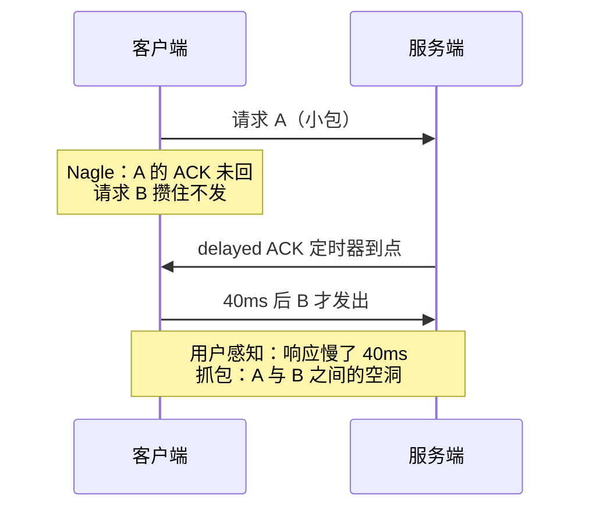

# TCP 性能调优——拥塞控制、Nagle 与缓冲区优化

**摘要：**

前五篇把机制讲透了，本篇开始回答那个运维与开发最关心的问题：一条 TCP 连接到底能跑多快，以及是什么在拖慢它。答案藏在三个层次的"流量闸门"里：**拥塞控制**决定发送端敢往网络里注入多少数据（CUBIC 与 BBR 两大算法的路线之争），**发送策略**决定数据何时攒批、何时直发（Nagle 算法与 TCP_NODELAY/TCP_CORK 的分寸），**缓冲区与队列**决定链路能容纳多少在途数据（tcp_rmem/tcp_wmem、qdisc 与 bufferbloat 的博弈）。三个闸门两两耦合：缓冲区限制窗口上限，窗口限制吞吐，发送策略影响延迟——调优的难点从来不是单个参数，而是理解这条耦合链后按正确顺序动手。本篇先从 1986 年的 LBL 拥塞崩溃讲起，把拥塞控制的存在理由与演进脉络铺清，再解剖 CUBIC 的三次函数与 BBR 的测量哲学，随后逐一定位 Nagle/delayed ACK 的交互陷阱、缓冲区与 BDP 的算术关系，最后给出一份按优先级排序的完整调优清单与三类经典反例。本文回答两个核心问题：一条连接的速度上限由哪些参数共同决定，以及当速度不达预期时，按什么顺序排查才能最快找到那道真正紧的闸门。

---

## 第 1 章 拥塞控制的本质问题

### 1.1 1986 年 10 月：一次改变互联网史的崩溃

任何调优手册都默认你知道"拥塞控制"，但它为什么存在、长成今天这个样子，值得从那次著名的事故讲起。1986 年 10 月，美国劳伦斯伯克利实验室（LBL）与加州大学伯克利分校之间的链路吞吐突然从 32 Kbps 跌落到 40 bps——降幅千倍。参与者的排查最终发现：数据包没有丢失，是**网络被发送方的重传洪流淹没了**。链路饱和导致排队、排队导致超时、超时导致重传、重传加剧饱和——这个正反馈被后人称为拥塞崩溃（congestion collapse）。当年互联网的骨干预估容量不过百个网络量级，一次局部事故就足以让理论照进现实。

两年后，Van Jacobson 发表论文《Congestion Avoidance and Control》（1988），提出了解决方案的骨架：**发送端必须主动探测网络的承载能力，逼近它而不越过它；一旦出现拥塞信号，主动退让**。这套"探测—逼近—退让"的框架（后来演化为慢启动、拥塞避免、快速重传、快速恢复四件套）成为此后三十余年所有 TCP 拥塞控制算法的共同祖先。

四件套的分工可以逐一对位：慢启动回答从零起步怎么爬，拥塞避免回答接近饱和怎么走，快速重传回答轻丢包怎么快补，快速恢复回答轻丢包怎么少亏。四个机制各管一段

从调优者的角度再看一眼这四件套与参数的关系：慢启动的起点可调（ip route 的 initcwnd）、拥塞避免的算法可换（sysctl）、快速重传的阈值自适应（DSACK 校准）、快速恢复的行为随算法——四件套里有三件是可配置面，一件是自动面。知道哪些可调哪些自动，清单里就少一半无效功。，却共享同一套状态变量（cwnd 与 ssthresh）——把它们看成同一个控制器的四种姿态，比当成四个独立算法更接近真相。

四件套在 Linux 源码里的落点也值得指认：慢启动与拥塞避免的窗口更新由各算法实现自己的版本（`tcp_congestion_ops` 的 cong_avoid 钩子），快速重传与恢复在 `tcp_fastretrans_alert` 一族——读 02 篇状态机时遇到这些函数，可以把本篇的曲线图对上号。机制与算法的代码边界，是内核把协议义务与策略选择分离的证据。今天我们在 sysctl 里调的每一个拥塞参数，底色都是 1988 年这篇论文。

用一张正反馈环把拥塞崩溃的机制钉在墙上：


这个环的可怕之处在于每个环节都理性：发送方超时重传是对的，路由器排队是正常的，丢包重传是协议义务——理性的个体行为叠加成集体的崩溃。

拥塞崩溃与死锁等分布式灾难共享同一个结构：局部理性、全局灾难。避免它的手段也同构——要么给个体加上全局视野（拥塞信号），要么引入外部的协调者（AQM 主动制造信号）。1986 年的教训因此不止属于网络，它是所有共享资源系统的共同教材。拥塞控制的存在就是在这个环上切一刀：让发送方在饱和前主动减速，而不是等到超时才被迫反应。

把这段历史放进调优语境，可以得到一个经常被忽视的判断：**拥塞控制的调优本质上是在"共享网络里为自己争取公平份额"，而不是"把网络压榨到极限"**——任何试图越过公平共享边界的参数配置，要么被对端与中间设备抵消，要么以伤害同路其他流量为代价。

### 1.2 三道闸门：吞吐公式的全部变量

站在调优者的视角，一条 TCP 连接的吞吐上限可以写成一条极简的公式：**吞吐 ≈ min(接收窗口, 拥塞窗口, 发送缓冲区) ÷ RTT**。三个因子对应三道闸门：接收窗口（对端能收多少，由 sk_rcvbuf 决定）、拥塞窗口（网络敢让你发多少，由算法决定）、发送缓冲区（本端能存多少，由 sk_sndbuf 决定）。02 篇讲过 cwnd 与 rwnd 取小的规则，本篇把第三道闸门（缓冲区）补齐——它的上限 tcp_wmem 若小于前两者的合理值，整条链路会被自己家的水龙头卡住。

三道闸门的耦合关系是调优难度的来源：缓冲区太小，窗口开不大，算法再聪明也白搭；缓冲区太大，排队延迟飙升（bufferbloat），交互式业务遭殃；发送策略不当（Nagle），小包被攒批引入几十毫秒的额外延迟，与窗口无关却同样致命。**调优的第一性原理由此确立：先找到最紧的那道闸门，再动手——顺序错了，一切努力都是浪费。**

三道闸门可以放进一张速查表，每个因子标注它的决定参数与观测位置：

| 闸门 | 决定参数 | 观测位置（ss -ti / -tnm） |
| :--- | :--- | :--- |
| 接收窗口 rwnd | 对端 `sk_rcvbuf`（tcp_rmem） | snd_wnd 字段 |
| 拥塞窗口 cwnd | 拥塞算法内部状态 | cwnd 字段 |
| 发送缓冲 sndbuf | 本端 `sk_sndbuf`（tcp_wmem） | skmem 的 t/tb |

这张表的隐藏用法是排查顺序：三个观测位里数值最小者，就是当前最紧的闸门——先松它，再看次紧的。调优的顺序感由此而来：不是按参数表从上往下改，而是按瓶颈从紧到松改。

> [!note] 与 03 篇的呼应
> 这张表的三行恰好对应 03 篇解剖过的三组字段：rwnd 是 sk_rcvbuf 的投影、sndbuf 是 sk_sndbuf 的现值、cwnd 是 tcp_sock 的内部状态。机制篇与调优篇的字段一一咬合，是本专栏刻意维持的写作纪律——调参不问机制，迟早还债。

咬合的另一个方向是 03 篇的 sk_write_space 与本篇 BBR 的 pacing：发送节奏的控制权在算法手里，而"缓冲区有空间"的唤醒依然走 03 篇的等待队列——两层各管一段，接口就是那对回调。读到这里再回头看 03 篇的图，会有第二层的理解。

### 1.3 慢启动与拥塞避免：窗口的生命周期

在进入具体算法之前，把 1988 年框架的两个核心阶段补完，因为它们决定了连接的"起步性格"。慢启动阶段，拥塞窗口从初始值（现代 Linux 默认 10 个 MSS，由 `tcp_initcwnd` 可按路由调整）起步，每收到一轮 ACK 翻倍——指数爬升，快速逼近网络承载；当窗口达到上次拥塞留下的记忆门槛 ssthresh，转入拥塞避免阶段，每轮只加一个 MSS——线性爬行，谨慎试探。两种增长形态的切换点，就是"激进起步"与"稳健巡航"的分界。

02 篇还留了一个尾巴在此处接上：**丢包信号如何打断窗口的爬升**。超时（RTO 触发）是最强信号，窗口砍回初始值重新慢启动；三个重复 ACK 触发快速重传与快速恢复，窗口减半、线性重爬。两档反应的差价巨大——同样的丢包率，被超时捕获与被重复 ACK 捕获，吞吐差出数倍。

初始窗口的取值本身也是一段演进史：RFC 2414 曾建议 2~4 个 MSS 的保守起点，RFC 6928（2013）则把推荐值提高到 10 个 MSS——依据是现代网络的 RTT 与缓冲能力远非 1988 年可比，起点的保守主义让每个新连接都要白白爬升若干 RTT。这个演进的启示在于：**调优参数的默认值只是某个时代负载画像的快照，环境变了，默认值的合理性要重新审问**。这正是下一章 CUBIC 与 BBR 路线之争的起点：**丢包到底该被解读为"网络拥堵"，还是仅仅是"物理传输的噪声"**。

```mermaid
%%{init: {'theme': 'dracula'}}%%
flowchart TB
    START["连接建立<br/>cwnd = 10 MSS"] --> SS["慢启动<br/>每 RTT 窗口翻倍"]
    SS -->|cwnd ≥ ssthresh| CA["拥塞避免<br/>每 RTT 加 1 MSS"]
    CA -->|3 个重复 ACK| FR["快速重传/恢复<br/>窗口减半"]
    FR --> CA
    CA -->|RTO 超时| SS2["窗口归零<br/>重新慢启动"]
    SS2 --> SS
    style SS fill:#44475a,stroke:#ff79c6
    style CA fill:#44475a,stroke:#50fa7b
    style SS2 fill:#44475a,stroke:#f1fa8c
```



---

## 第 2 章 CUBIC：把丢包当指挥家的默认算法

### 2.1 从 Reno 到 CUBIC：为什么需要新曲线

Linux 的默认拥塞控制算法几经更替：早期是 Van Jacobson 的 Tahoe/Reno 系，2005 年前后换上 BIC，2006 年（内核 2.6.19）起 CUBIC 接任并沿用至今。CUBIC 的核心创新是把窗口增长函数从"每 RTT 线性加一"改写为**以时间为主变量的三次函数**：窗口在丢包点附近减速、越过丢包点后先缓慢、再加速、最后缓慢——三次函数的凹凸形态天然模拟出"小心试探—大胆推进—谨慎收敛"的节奏。

这条曲线的妙处在高带宽时延积（BDP）网络里最明显：Reno 的线性增长在高 RTT 链路上每秒只能爬几个 MSS，从丢包恢复到吃满带宽要几十秒甚至几分钟；CUBIC 的三次函数在远离丢包点时加速度放大，恢复时间压缩到秒级。

三次函数的另一个红利是 RTT 公平性：Reno 的每 RTT 加一让高 RTT 流的增长速度天然落后，与低 RTT 流共存时持续吃亏；CUBIC 以时间为轴，高低 RTT 流的曲线形状一致，共存时的份额分配明显更公道——跨数据中心流量与本地流量混跑的链路上，这个性质的价值不亚于吞吐本身。

> [!info] RTT 公平性
> RTT 公平性（同样 RTT 的流获得同样份额）与 TCP 公平性（与 Reno 共存时拿到同样份额）是评价算法的两把尺子。CUBIC 改善了前者、沿用了后者的丢单包退让；BBR 则对两把尺子都提出了挑战——这也是它引发持续争论的深层原因。换算成工程语言：**CUBIC 是为长肥管道（跨洋、卫星、大带宽 DCI 链路）补课的算法**，它不改写"丢包即拥塞"的信条，只修正信条之下的爬行速度。

三次函数的行为可以用一段通俗的描述还原：假设上次丢包发生在窗口值 W 处，CUBIC 重新出发后先慢速爬行（避开刚丢过包的危险区），随后加速冲过 W（既然上次到了这里才丢，说明附近还有余量），最后在更高处再次减速收敛。整个节奏以时间为自变量而非以 ACK 为自变量——这意味着无论 RTT 大小，窗口曲线的形状一致，长肥管道不再因为每 RTT 才走一步而饿死。

### 2.2 丢包驱动的天花板

CUBIC 的哲学有一条隐含公理：**丢包是网络拥堵的主要信号**。这条公理在有线网络时代大体成立（路由器缓冲满则丢包），但在三类场景里被现实打脸。其一，**无线与数据中心网络的物理层噪声**：Wi-Fi 的信号抖动、光模块的误码都会随机丢包，与拥堵无关——CUBIC 收到噪声丢包照样砍窗，无谓牺牲吞吐。其二，**浅缓冲设备**：交换机缓冲小于链路 BDP 时，丢包先于深度拥堵发生，CUBIC 永远运行在低窗口区间。其三，**长肥管道的恢复惩罚**：0.01% 的随机丢包率在 200 ms RTT 的链路上足以让 CUBIC 的窗口爬不到 BDP 对应的高度——2016 年 Google 团队发表的量化分析显示，丢包敏感算法在高 BDP 链路上的吞吐损失随 RTT 与丢包率乘积恶化。

数据中心内部还有一层更细的考量：局域网的高带宽低延迟让丢包的代价结构完全不同——RTT 短意味着重传恢复快，丢包的惩罚远小于广域网；但局域网的交换机缓冲也浅，瞬时突发极易丢包。CUBIC 在这个环境里的实际表现是频繁小幅减窗、快速恢复，整体吞吐尚可，但延迟敏感业务（存储复制、分布式缓存同步）对丢包引发的延迟毛刺更敏感——这也是数据中心里时延驱动算法与 BBR 研究活跃的原因。

公理错了，再精巧的曲线也是错的——这正是 BBR 登场的历史位置。值得注意的是，CUBIC 的拥而非弃：在低 RTT、低噪声的局域环境（数据中心内部），丢包信号依然基本可靠，CUBIC 的简单与稳定性反而优于更复杂的方案。

时延驱动的另一支（Vegas 及其思想后裔）在此值得一提：它们不用丢包、也不用带宽测量，而是用 RTT 的抬升幅度推断排队程度——理念上与 BBR 同源（都看重延迟信号），实现上更早却因与 Reno/CUBIC 共存时的公平性劣势而未能普及。公平性问题像是拥塞控制算法的宿命：任何不随大流的策略，在共存环境中都要先回答"凭什么你多拿"。

作为本章的收束，把 CUBIC 的适配画像写成一句话：**低噪声、中低 BDP、多流共存的普适环境**——它是历经二十年全球流量检验的稳妥默认，也是所有新算法必须证明自己不劣于的基准线。调优者的正确姿势不是嫌弃默认，而是先确认自己的链路画像确实跑出了默认的舒适区，再考虑换算法。

### 2.3 CUBIC 的调优参数与观测

CUBIC 自身的可调参数不多，调优重点在环境配置。内核侧的开关是 `net.ipv4.tcp_congestion_control`（当前值用 `sysctl net.ipv4.tcp_congestion_control` 查看，可用算法列表见 `tcp_available_congestion_control`）；`tcp_max_ssthresh` 与 hystart 开关（CUBIC 的慢启动结束探测器）在特定负载下可微调；`tcp_slow_start_after_idle`（默认 1）决定长连接空闲后是否重新慢启动——对"突发偶发传输"的长连接（RPC 网关、数据库连接池），把它设为 0 让窗口记忆保留，常常是单笔最划算的参数改动之一。

观测侧，`ss -ti` 按连接输出 cwnd、ssthresh、重传计数与算法内部状态（cubic 的 wmax、last_max），是把本章机制落成数字的直接通道。窗口爬升是否符合三次函数的预期、丢包后减半的幅度、慢启动的结束点，全在 `ss -ti` 的输出里——10 篇的工具链章会把它编入诊断流程。

CUBIC 还有一个与长连接相关的隐藏状态值得调优者知晓：窗口记忆的时效。CUBIC 用 W_max 记住上次丢包的位置，但连接长时间空闲后，网络路径可能早已改变（路由切换、链路切换），旧记忆反而误导——`tcp_slow_start_after_idle` 的默认开启正是对此的保守处理。关闭它（设 0）换来突发性能、承担路径变化的错配风险，这个权衡没有绝对答案，只有负载画像匹配与否。

执行层面给出一个可操作的折中：对"空闲即失忆"的风险，用应用层预热来对冲——连接池在借出连接前发送一个小探测包（ping 类），让窗口在真实请求前先热起来。预热包的成本微乎其微，却能把慢启动的爬升隐藏在业务无感的时刻。

---

## 第 3 章 BBR：用测量代替猜测

### 3.1 换一条公理：网络自己会告诉你答案

BBR（Bottleneck Bandwidth and RTT）由 Google 团队设计，2016 年发表论文（Neal Cardwell 等，ACM Queue），同年随内核 4.9 合入主线。它的哲学与 CUBIC 根本不同：**不用丢包猜拥堵，而是直接测量瓶颈链路的两个物理量——瓶颈带宽（BtlBw）与最小往返时延（RTprop）**。两者的乘积正是链路的 BDP，也就是"网络在不排队前提下能容纳的最大在途数据"。BBR 的全部工作就是让在途数据稳定在 BDP 附近：多了会排队（延迟上升），少了会浪费带宽（吞吐下降）

这个模型的控制精度值得推敲：在途数据与 BDP 的关系是 BBR 一切行为的标尺——低于 BDP，链路空闲（吞吐损失）；高于 BDP，队列形成（延迟抬升）；深超 BDP，队列溢出（丢包）。CUBIC 通过丢包间接感知越界，BBR 直接测量并驻留在边界上——一个是撞墙才知道墙在哪，一个是预先量好了墙的位置。

两种认知方式还可以映射到监控哲学上：丢包驱动的算法看的是事件计数（重传次数、丢包率），测量驱动的算法看的是状态估计（带宽、RTT 的滑动值）——`ss -ti` 的输出差异正是这个分歧的投影。监控零拷贝与 BBR 这类新技术时，老指标常常够不着新机制，仪表盘要跟着机制演进。。

这个模型的控制精度值得推敲：在途数据（in-flight）与 BDP 的关系是 BBR 一切行为的标尺——低于 BDP，链路空闲（吞吐损失）；高于 BDP，队列形成（延迟抬升）；深超 BDP，队列溢出（丢包）。CUBIC 通过丢包间接感知这个关系的越界，BBR 直接测量并驻留在边界上——一个是撞墙才知道墙在哪，一个是预先量好了墙的位置。

这个模型把"什么时候发、发多快"变成了一个测量与控制问题：BBR 维护带宽与 RTT 的滑动估计（max filter 与 min filter），按估计值计算发送节奏（pacing），并周期性以小概率探测更高带宽（快速拉升）或更低 RTT（排空队列）。**丢包在 BBR 的世界里只是普通事件，不触发窗口减半**——它用主动测量绕开了 2.2 节的三类失效场景，这正是 Google 内网与跨洋链路上 BBR 相对 CUBIC 数倍吞吐提升的来源。

BBR 的模型还有一个值得咀嚼的副作用：它把网络有多空变成了一个可测量的量，拥塞控制第一次拥有了主动权而非被动反馈。这个转变的影响超出算法本身——CDN、云厂商随后纷纷基于 BBR 思路自研（BBRv2/v3、各家的 pacing 改造），拥塞控制的研究重心从怎么响应丢包转向怎么测得更准。测量精度的军备竞赛，就此拉开。

两条路线的画像对比收进一张表，作为选型的坐标纸：

| 维度 | CUBIC | BBR |
| :--- | :--- | :--- |
| 拥塞信号 | 丢包（隐式猜测） | 带宽与 RTT 测量（显式测量） |
| 高 BDP 链路 | 爬升慢、丢包敏感 | 驻留 BDP 附近，吞吐高 |
| 随机丢包环境 | 无谓减窗 | 基本免疫 |
| 与 CUBIC 共存 | 基准 | 公平性争议（BBRv2 修正中） |
| 内核支持 | 2.6.19 起默认 | 4.9 起可用 |
| 典型场景 | 通用默认、多流共存 | 跨洋传输、专线大流量 |

表中最有分量的一行是共存：生产链路上几乎没有"只有一种算法"的世界，公平性是选型时最容易被低估的维度。

### 3.2 BBR 的运行画像与副作用

BBR 的机制红利有明确的适用画像，它的副作用同样有明确的画像，选型前两面都要看清。收益面：高 BDP 链路（跨洋、DCI）、存在物理层丢包的链路（无线回传）、以及"浅缓冲"设备后的链路，BBR 的吞吐普遍显著优于 CUBIC；Google 的公开报告给出过跨洋链路上平均时延不变而吞吐提升的量化结果。风险面有三：其一，BBR 与浅缓冲路由器的公平性争议——多个 BBR 流与 CUBIC 流共存时，BBR 可能占据不成比例的份额（BBRv2 针对此改进，社区对公平性的讨论持续至今）；其二，BBR 需要 pacing 支持（现代内核已内建，老内核建议搭配 fq qdisc），部署成本并非零；其三，BBR 对"突发混入"的瞬时拥塞响应不如丢包驱动算法保守——它赌的是测量够准。

### 3.3 BBR 的部署与观测

部署 BBR 的标准动作有三步：加载模块（`modprobe tcp_bbr`）、切换算法（`sysctl -w net.ipv4.tcp_congestion_control=bbr`）、确认 qdisc（`tc qdisc show` 看默认队列是否为 fq——新内核 pacing 内建，老内核推荐 `net.core.default_qdisc=fq`）。

部署的三步之外还有一份验证清单值得执行：模块是否真正加载（`lsmod | grep bbr`）、算法是否生效到新连接（`ss -ti` 输出的 bbr 字段而非 cubic）、以及 qdisc 是否随算法联动（老内核上 BBR 无 fq 会性能打折）。三步加三验，才是完整的上线动作——任何一步的沉默失败，都会让 BBR 的预期收益悄悄蒸发。三步之后，验证手段依然回到 `ss -ti`：BBR 连接的输出会带 bbr 自己的状态字段（bw、rtt 估计与 pacing rate），pacing rate 的存在意味着内核正在按测量值整形发送节奏——这正是 BBR 与 CUBIC 在发包形态上的可见差别。

工程上还有一条冷静的提醒：**BBR 不是"更快"的同义词**。低 RTT、低噪声的机房内链路上，BBR 与 CUBIC 的吞吐差距通常很小；而 BBR 的公平性争议在多租户环境里反而是减分项。选择算法的逻辑与选数据库引擎一样——先写清负载画像（RTT、丢包特性、共存流量），再对号入座，而不是追新闻热点。

切换的零成本还有一条延伸：可以按连接的服务类型分流算法——控制信道与数据信道、内部流量与外部流量，各自绑定合适的算法（通过 route 的 congctl 或应用按需设置）。算法从机器属性变成连接属性，是拥塞控制工程化程度加深的标志。

顺带澄清一个高频误区：切换拥塞算法不需要重启服务或断开连接——sysctl 的变更只影响新建立的连接，存量连接继续使用旧算法直到关闭。这让算法切换成为低风险的灰度操作：先在单台实例验证，再滚动到全量，随时可回滚。风险意识配低风险操作，才是调优的正确打开方式。

---

## 第 4 章 小包优化：Nagle、delayed ACK 与 TCP_NODELAY

### 4.1 Nagle 算法：1984 年的补丁

如果说拥塞控制管的是"发多快"，Nagle 管的是"攒不攒"。1984 年 John Nagle 在 RFC 896（《Congestion Control in IP/TCP Internetworks》）中描述了一个当时令 ARPANET 头疼的场景：应用一次只写一两个字节（Telnet 键盘敲击是原型），每个字节都要一个 40+ 字节的 IP/TCP 头包装，网络被 1:40 有效载荷比的小包灌满。Nagle 算法的对策简洁而保守：**若存在尚未确认的小包，新产生的小数据先攒在缓冲区里不发；直到 ACK 归来或攒够一个 MSS 才发出**。它的效果是自动把碎字节聚合成满段，代价是给"等 ACK"的窗口期加了一层攒批延迟。

用一句话把 Nagle 的判定逻辑写成分支：若当前连接上存在已发出但未被确认的小段，且新数据不足一个 MSS，则攒住不发；否则立即发。这个判定的输入只有两个——有没有在途小包、新数据够不够 MSS——简洁到可以用一根跳线实现，也简洁到让它对应用为什么一次只写两字节毫无概念。它管不了应用为什么碎，只管碎了怎么堵——理解了这个边界，就知道 TCP_NODELAY 为什么常常是应用层的责任而非内核的过错。

Nagle 的历史地位毋庸置疑——它是拥塞控制思想在"发送端打包策略"上的延伸，RFC 896 与 Van Jacobson 的 1988 论文同属拥塞治理的奠基文献。但把 1984 年的 Telnet 场景换到今天的业务语境，Nagle 的前提常常不再成立：RPC 请求平均几百字节、Redis 命令几十字节，它们本来就该一次一个包地飞过去——攒批不但无益，反而致命。

### 4.2 与 delayed ACK 的死亡之握

Nagle 的延迟只在一种情况下从"几十微秒"恶化为"几十毫秒"：**与延迟确认（delayed ACK）相遇**。接收端为了减少纯 ACK 的开销，倾向攒一攒再确认（Linux 常见 40 ms 量级的延迟 ACK 定时器）

Linux 的延迟 ACK 定时器在多数路径上是 40 毫秒量级（快速路径可更快），这也是小包冻结几乎总是 40 的整数倍的原因——看到抓包里 40 毫秒的规律性空洞，基本可以锁定 Nagle 与 delayed ACK 的互等，而不是网络抖动。

> [!warning] 排查口诀
> 交互式协议偶发整 40 毫秒（或其整数倍）的延迟，先查 Nagle 与 delayed ACK 的互等，再查网络路径——规律性的整数倍延迟是攒批的指纹，随机延迟才是网络的指纹。

指纹法还可以横向扩展：锯齿状的周期性延迟指向定时器（攒批、探测、GC），阶梯状的分级延迟指向跳数或缓存层级，孤立的长尾指向丢包重传——把延迟曲线的形状当作诊断的第一印象，是低成本高回报的技能。这条口诀能帮你在排查的第一分钟走对方向。；发送端的 Nagle 在等 ACK，接收端的 delayed ACK 在等数据——两个"攒"相互等待，请求-响应式的交互协议就此被钉在几十毫秒的延迟上，这就是经典的小包冻结（small-packet stall）。

冻结场景还有一个变体值得认识：写-写-读模式（两次连续小写后紧跟读等待）在 Nagle 下的表现与写-读模式不同——第二次小写因第一次未确认而被攒住，随后的读等待让攒住的数据一直等到 delayed ACK。应用侧的对策是合并两次写（writev 或用户态拼接），从源头减少"第二次小写"的存在——Nagle 问题的最佳解法常常是不给它发生的机会。排查这类问题时，应用代码毫无嫌疑、网络也毫无丢包，唯有抓包能看到请求发出后一个 40 ms 的空洞——10 篇的案例章有完整回放（参见 [[05 零拷贝技术全景——sendfile、splice 与 DMA gather]] 之外的本篇配套案例）。

把相互等待的时序画出来，空洞的位置一目了然：



破解之道简洁明了：**交互式、请求-响应型业务在连接建立时设置 `TCP_NODELAY`**，关闭 Nagle 攒批，让每个写操作立即成包出发。这个建议的反面同样成立：批量流式写入（日志投递、指标上报）保留 Nagle 或改用更可控的 TCP_CORK，让内核替你聚合

应用层攒批还有第三种形态值得对比：干脆在用户态做聚合，业务缓冲区凑批后一次 write。它与 TCP_CORK 的分工在于控制权的归属——用户态攒批由业务逻辑决定边界，内核攒批由 MSS 与 ACK 节奏决定边界；需要延迟上界保障的攒批（不超过 5 毫秒）只能在用户态做，内核不提供带超时的 cork。用户态聚合还有两条实现纪律：定时刷新防止低流量时数据滞留、聚合缓冲满时向上游反馈背压——缺前者变成数据黑洞，缺后者变成内存黑洞。——Nagle 不是敌人，放错位置才是。

把发送策略的选择写成一句可操作的判定：**写一次等一次的连接（请求-响应）选 NODELAY，连续写多段的连接（协议封装）选 CORK，持续大流量的连接两者皆可（影响甚微）**。判定依据是写的节奏而非业务的名字——同一个服务里，健康检查连接与数据传输连接可以有完全不同的策略，选项跟着连接形态走，不跟着进程走。

延迟确认的机制本身也值得公道一句：它不是缺陷，而是 RFC 1122 认可的优化——纯 ACK 包也要占带宽与 CPU，攒一攒（或搭下一个数据包的顺风车捎带确认）对吞吐型负载是净收益。问题出在组合：每个机制单看都合理，Nagle 与 delayed ACK 的组合却产生病态互等。这个案例给系统设计留下一个通用教训：**两个各自正确的优化，组合后的行为必须重新验证**——系统工程的多数事故都藏在这类缝隙里。

### 4.3 TCP_NODELAY 与 TCP_CORK 的分工

两个选项都是"发送策略"的旋钮，但取向相反，值得把语义并排放清。`TCP_NODELAY` 关闭 Nagle，追求**首字节延迟最小**：每个 write 尽快成包，适合交互式协议（SSH、Redis、数据库驱动）。`TCP_CORK` 则是"强制攒批"的开关：cork 期间内核尽量凑满 MSS 才发，uncork 时冲出剩余——适合**知道边界在哪**的协议封装（先写 HTTP 头再写 body，两段拼成完整报文）。两者语义上互斥（同时设置的行为依内核版本而定，通常 NODELAY 语义被吞），正确的组合是按连接类型二选一。

应用层攒批还有第三种形态值得对比：干脆在用户态做聚合（业务缓冲区凑批后一次 write）。它与 TCP_CORK 的分工在于控制权的归属——用户态攒批由业务逻辑决定边界（攒够 N 条或超时 T 毫秒就发），内核攒批由 MSS 与 ACK 节奏决定边界。需要延迟上界保障的攒批（攒批延迟不超过 5 毫秒）只能在用户态做——内核不提供带超时的 cork。

用户态聚合的实现要点也有两条纪律：定时刷新（防止低流量时数据无限滞留——通常用毫秒级定时器兜底）与背压传导（聚合缓冲区满时向上游反馈，而不是无限堆积）。两条纪律缺一不可，缺前者变成数据黑洞，缺后者变成内存黑洞。三种形态的对比收进一张表：

| 攒批形态 | 边界决定者 | 延迟上界可控 | 适用场景 |
| :--- | :--- | :--- | :--- |
| Nagle（默认） | ACK 节奏 | 否 | 遗留兼容 |
| TCP_CORK | MSS / uncork | 否（需显式 uncork） | 协议封装 |
| 用户态聚合 | 业务逻辑 | 是（自行实现定时） | 有延迟 SLA 的微批 |

| 选项 | 语义 | 适用负载 | 典型误用 |
| :--- | :--- | :--- | :--- |
| TCP_NODELAY | 禁用 Nagle，立即发送 | 请求-响应、交互式 | 对大块流式传输打开（无害但无益） |
| TCP_CORK | 攒批至 MSS 或 uncork | 协议封装、批量推送 | cork 后忘记 uncork（数据滞留） |
| Nagle（默认开启） | 有未确认小包则攒批 | Telnet 类极碎输入 | 与 delayed ACK 相互等待 |

表格里第三行是容易被遗忘的默认值：什么都不设置，Nagle 就在工作。因此"要不要设 TCP_NODELAY"应当成为每个新服务上线检查清单的固定条目——问一次，比事故后排查一次便宜得多。

---

## 第 5 章 缓冲区与队列：BDP 算术与 bufferbloat

### 5.1 三组参数的联动地图

缓冲区调优的参数族谱在 03 篇已经铺开（tcp_rmem/tcp_wmem、autotuning、SO_SNDBUF/SO_RCVBUF），本篇补上最后一环：**参数之间的联动与全局视角**。发送侧，tcp_wmem 的最大值给 autotuning 划定天花板，天花板要按链路 BDP 设（跨洋链路动辄数十 MB）；接收侧同理，tcp_rmem 上限按对端可能推送的速率设定。qdisc 侧，`net.core.default_qdisc` 决定出向排队的形态——fq（与 BBR 搭配的公平队列）、fq_codel（对抗 bufferbloat 的现代默认）、pfifo_fast（历史默认，无智能）。三层各自为政时都能跑，联调时才见真章：**缓冲区决定"能存多少"，qdisc 决定"排队怎么排"，拥塞算法决定"发多快"**——三者的配置必须指向同一个吞吐/延迟目标，否则互相拆台。

### 5.2 bufferbloat：好心办坏事的经典案例

把缓冲区无脑调大是 1990 年代到 2010 年代网络设备的主流做法，后果在 2010 年前后被社区系统性地命名与清算——bufferbloat（缓冲膨胀）。机制很简单：过大的队列不丢包、不反馈拥塞信号，发送方（尤其是丢包驱动算法）始终以为网络畅通，数据在队列里排队数十上百毫秒，表现为**带宽测试满分、实际延迟糟糕**的劈叉现象。交互式业务（游戏、语音、SSH）是最大的受害者。

社区的两剂解药各有渊源。协议侧是主动队列管理（AQM）：fq_codel 在队列里按流分离、对驻留超时的包提前丢弃，把队列长度钉在毫秒级

AQM 的思想值得单独停留一秒：它放弃了缓冲区大等于不丢包等于性能好的工业直觉，反过来用主动的、有节制的丢弃换取队列延迟的上界。这与 TCP 的丢包反馈机制形成配合——丢包是信号，fq_codel 负责在正确的时机制造这个信号。把缓冲区当资产还是当负债，是网络工程哲学的分水岭，bufferbloat 的一代教训就写在这道分水岭上。

 fq_codel 的参数面很窄（主要是一个目标队列延迟与一个间隔），这是刻意的——AQM 的作者深知可调参数越多、配置错误越多的定律，把智慧内置、把旋钮收起。与那些暴露几十个参数的调优面相比，fq_codel 的克制本身就是设计的一部分。

qdisc 的选择还有一个与 04 篇呼应的观察位：`tc -s qdisc show` 的输出里，fq 的丢包计数与延迟分布是 bufferbloat 治理的直接证据——出向队列的健康度从此有了专用的仪表，而不是混在接口统计里猜。

与 fq_codel 的克制相映成趣的是它的普及速度：2012 年论文发表，数年内成为主流发行版默认——相比那些实验室里十年未见天日的算法，AQM 的落地速度得益于一个朴素事实：它默认开启就比旧默认好，不需要用户理解就能受益。好默认的价值，比好选项更大。

这个判断对应用层同样成立：一个服务的 TCP_NODELAY 默认值、缓冲区初始值、连接池参数，都是面向下游用户的默认——把最常见的画像配成默认、把例外留给显式配置，是框架作者与运维工程师共享的责任边界。

深缓冲与浅缓冲对同一条流的影响可以用对比图直观呈现：


两幅图的出口吞吐相同，差别全在队列里积压的数据量——bufferbloat 的本质是"用延迟换不丢包"，而 fq_codel 的本质是"拒绝这笔交易"。——这是现代 Linux 默认 qdisc 更替（pfifo_fast → fq_codel）的动因。

fq_codel 的参数面很窄（主要是一个目标队列延迟与一个间隔），这是刻意的——AQM 的作者深知"可调参数越多，配置错误越多"的定律，把智慧内置、把旋钮收起。与那些暴露几十个参数的调优面相比，fq_codel 的克制本身就是设计的一部分。

AQM 的思想值得单独停留一秒：它放弃了缓冲区大等于不丢包等于性能好的工业直觉，反过来用**主动的、有节制的丢弃**换取队列延迟的上界。这与 TCP 的丢包反馈机制形成配合——丢包是信号，fq_codel 负责在正确的时机制造这个信号。把缓冲区当资产还是当负债，是网络工程哲学的分水岭，bufferbloat 的一代教训就写在这道分水岭上。应用侧是本篇第 4 章的智慧延伸：**队列的管理权不只在设备手里，发送端的发送策略同样塑造队列**——BBR 的 pacing 天然不制造长队列，是它在 bufferbloat 时代的又一加分项。内核侧的两剂药（fq_codel 与 BBR）合用

bufferbloat 的治理还有应用侧的第三条路径——拥塞预判：应用主动限制在途数据（譬如按 BDP 自限），比内核反馈更快形成背压。HTTP/2 的流控窗口、QUIC 的发送预算，都在应用层复制了这套思想。跨层协作的图景由此完整：应用管预算、内核管节奏、设备管队列，任何一层独自为战都会把问题推给邻居。

跨层协作在历史上有过反面教材：早期 TOE（TCP Offload Engine）网卡试图把整条 TCP 协议栈搬进硬件，性能数据亮眼，却因状态管理的僵化（连接数上限、内核可观测性丧失）而逐渐边缘化。TOE 的教训与 kTLS 的成功形成对照——下沉要选对层次，可观测性与灵活性是下沉方案的生命线。，就是今天"既快又不堵"的标准配方。

### 5.3 一份按优先级排序的调优清单

把本篇与 03 篇的参数收拢成一张按优先级排序的清单——顺序即依赖：上面的不就位，下面的调整无效。

| 优先级 | 参数 / 动作 | 目标 | 依赖 |
| :--- | :--- | :--- | :--- |
| 1 | `tcp_congestion_control`（按负载选 CUBIC/BBR） | 算法与链路画像匹配 | 内核版本支持 |
| 2 | `net.core.default_qdisc=fq` 或 fq_codel | 排队策略对齐算法 | 与优先级 1 联动 |
| 3 | `tcp_rmem` / `tcp_wmem` 上限按 BDP 校准 | 窗口够得着链路容量 | 链路 BDP 测量 |
| 4 | 交互式连接设置 `TCP_NODELAY` | 消除小包冻结 | 应用代码 |
| 5 | `tcp_slow_start_after_idle=0`（突发型长连接） | 保留窗口记忆 | 负载画像确认 |
| 6 | 监控 `ss -ti` / nstat 计数器 | 验证与持续观测 | 全部就位后 |

清单的反面同样重要：**任何一项都不该在不知道自己要解决什么问题时被调**——"参数多就是调优"是运维文化里最顽固的误解。每动一项，写下预期效果与验证指标，测不出差别就回滚——这份纪律的价值高于清单本身。

> [!warning] 调优纪律
> 每一次参数变更前先回答三个问题：解决什么症状、预期哪个指标变化多少、如何回滚。三问答不上来，就先测基线再谈调参——没有基线的调优不是调优，是随机漫步。

基线的建立还有一条捷径值得掌握：参数变更前的快照三件套——变更前的 `ss -ti` 样本、nstat 计数器快照、以及一段固定负载的吞吐延迟基准。三份快照存档，变更有据可依、回滚有账可查。这份纪律的成本是几分钟，收益是把调优从玄学变成工程。

快照纪律的进阶形态是变更前后的自动化对比脚本：同样的负载、同样的采样点、参数仅一栏不同，输出两份并排的报告——人工读数难免先入为主，脚本对比让"确实变好了"拥有最朴素的证据。调优工具链的成熟度，常常比调优知识本身更能决定团队的调优水平。

基线的建立还有一条捷径值得掌握：参数变更前的"快照三件套"——变更前的 `ss -ti` 样本、nstat 计数器快照、以及一段固定负载的吞吐/延迟基准。三份快照存档，变更有据可依、回滚有账可查，这份纪律的成本是几分钟，收益是把调优从玄学变成工程。

快照三件套还可以升级为变更日志的模板：变更时间、变更内容、预期效果、验证指标、实际效果、回滚条件——六栏填满，参数变更就从口头操作变成可审计的工程行为。团队规模的调优尤其需要这份模板，否则半年后没人记得某个参数为什么是那个值。

---

## 第 6 章 经典反例：三种"越调越慢"的现场

### 6.1 反例一：把跨洋链路当机房调

某团队为跨机房复制提速，把 `tcp_wmem` 上限设为 16 MB，结果吞吐纹丝不动。排查发现瓶颈在接收端：对端的 `tcp_rmem` 上限仍是默认 6 MB，接收窗口卡在低区——发送侧缓冲再大也只是自嗨。BDP 算术（第 5 章）的教训是**窗口是双端合谋的结果**：发送缓冲、接收缓冲、链路带宽、RTT 四个量里任何一个短板都会封顶吞吐，调优前先做"短板定位"（两端 `ss -ti` 对读），比闷头改参数有效得多。

短板定位还可以升级为流水线思维：把链路想象成多级水管，每一级的口径不同——发送应用的写入速率、本端缓冲、拥塞窗口、对端接收窗口、对端应用读取速率，五级口径的最小值决定整条流水线的流量。

全链路的口径盘点还提示了容量规划的一个盲区：接收端的读取能力（应用 recv 的节奏）通常不在网络团队的视野里，却是流水线的末级闸门——本篇与 03 篇的缓冲区章节在此合流，网络调优的终点常常是应用调优的起点。

两端对读的输出可以是这样（有裁剪）：

```text
发送端 $ ss -ti dst 10.0.2.15:3389
cwnd:892 ssthresh:1023 bytes_acked:214M retrans:0/12
send 12.5Mbps pacing_rate 25Mbps unacked:12 rcv_space:131072

接收端 $ ss -ti sport 3389
cwnd:14 ssthresh:64 rcv_space:65535
```

发送端 cwnd 892（约 13 MB）而接收端通告的窗口只有 64 KB 量级——瓶颈立刻现形：接收端的缓冲与窗口是整条链路的口径最小者。两端的数据一摆，推断不需要任何猜测。性能工程里的全链路压测思想，在网络调优的微观尺度上同样成立。

### 6.2 反例二：BBR 的误用与公平性事故

某多租户网关听闻 BBR 快，全量切换，结果同链路上其他租户的 CUBIC 流量吞吐腰斩，投诉纷至。这正是 3.2 节公平性问题的现实版：BBR 在浅缓冲设备后的激进占用，会把 CUBIC 流量挤到角落。事后处置是分区策略——内部大流量链路用 BBR，与外部共享的链路保守回 CUBIC。**算法的选择不只是性能题，还是资源伦理题**：共享基础设施上，单个租户的最优解常常不是整体的最优解。

伦理维度还可以落到操作流程上：共享链路切换算法前，知会同链路的流量所有者应当成为流程的一部分——就像共享泳池换水温要先打招呼。这份沟通成本不高，却是多租户环境里避免优化引发投诉的唯一解法。

### 6.3 反例三：TCP_NODELAY 的反向踩坑

某数据同步服务听说 NODELAY 提升性能，全员开启，结果吞吐反降。根因在负载画像：该服务的写入是大量 1-4 KB 的小块流式追加，开启 NODELAY 后每个小块独立成包，包开销（头税）暴涨；关闭 NODELAY（Nagle 攒批）后吞吐回升三成。这个反例是 4.3 节表格的动态版：**旋钮的方向由负载决定，不存在"永远正确"的设置**。批量流式负载攒批是对的，交互负载直发是对的——诊断的第一步永远是确认自己是谁。

负载画像的确认也可以流程化：写下业务的报文尺寸分布、读写比例、连接生命周期、延迟目标四项，画像就浮出水面了。画像文档要随架构演进更新——三年前的画像调今天的参数，是另一种形式的刻舟求剑。

三个反例合起来看，失败的模式惊人一致：**参数从别人的语境里抄来，却没把别人的负载画像一起搬过来**。参数只是画像的投影——同一个 tcp_wmem 值，在 BDP 20 MB 的链路上是启蒙，在 BDP 2 MB 的链路上是浪费。调优清单可以抄，画像评估不能省。

---

## 第 7 章 跨层联动：三道闸门的联合调优

### 7.1 为什么单点调优总是失败

本章回答一个实践中的高频困惑：参数都按清单调了，为什么效果不如预期。答案几乎总是跨层耦合——三道闸门（算法、缓冲、发送策略）相互作用，单点的最优在系统里往往互相抵消。举一个典型的组合困境：选了 BBR（希望按测量节奏发送），却把 qdisc 留在默认的 pfifo_fast（老内核上无 pacing 支持），BBR 的发送整形被队列层抹平，退化为普通的大突发；又譬如缓冲区按 BDP 配足了，应用却用 TCP_NODELAY 逐条写入小命令——攒批策略与窗口规模根本不在一个节奏上工作。

跨层调优的正确姿势是把三道闸门当成一个控制回路来配置：**算法决定目标窗口、缓冲区决定窗口可达、qdisc 与发送策略决定窗口的实际填充形态**。三者对齐的判据也很朴素——`ss -ti` 里 cwnd 能爬到 BDP 对应高度、pacing rate 平滑无锯齿、skmem 不顶格、RTT 无异常抬升，四项同时成立才算联动成功。

三道闸门与观测判据的联动关系可以画成一张控制回路图：

```mermaid
%%{init: {'theme': 'dracula'}}%%
flowchart LR
    ALGO["拥塞算法<br/>决定目标 cwnd"] --> BUF["缓冲区<br/>决定 cwnd 上限"]
    BUF --> QD["qdisc / pacing<br/>决定发送形态"]
    QD --> NET["网络路径"]
    NET -.->|丢包/延迟反馈| ALGO
    NET -.->|RTT 与窗口通告| BUF
    style ALGO fill:#44475a,stroke:#ff79c6
    style BUF fill:#44475a,stroke:#8be9fd
    style QD fill:#44475a,stroke:#50fa7b
```



联动失败的四种典型形态也可以按层归位：cwnd 上不去（算法或缓冲限制）、上去了吞吐不涨（对端窗口或应用读取限制）、吞吐可以但延迟毛刺（队列形态或攒批不当）、毛刺随机出现（丢包或竞争流量）——每种形态指向不同的检查层。把症状与层位对应起来，跨层调优就有了字典可查。

### 7.2 一个完整的联合调优案例

用一个真实结构的案例走一遍联动。某视频转码集群向 CDN 回源推流：10 Gbps 链路、RTT 30 ms（BDP 约 37.5 MB），CUBIC 下吞吐稳定在 2 Gbps 上不去，且推流卡顿。排查与处置的时序如下。

第一步看窗口：`ss -ti` 显示 cwnd 顶在 4 MB 附近反复减半——CUBIC 的丢包驱动在浅缓冲交换机后频繁误判。第二步看缓冲：两端 tcp_wmem/rmem 上限充足，skmem 未顶格——缓冲不是短板。第三步换算法：切换 BBR 后 cwnd 稳定在 BDP 附近，吞吐升至 9 Gbps；但同链路的监控告警流量（CUBIC）出现延迟毛刺——公平性副作用显形。第四步分区处置：推流集群与监控流量分流到不同链路，各自使用合适的算法。最终形态：BBR 管推流、fq 管队列、缓冲区按 BDP 配、NODELAY 只开在控制信道上——四层各就各位。

这个案例还有一个值得复盘的细节：为什么最初没人怀疑缓冲区。两端 sysctl 的上限值都很大（16 MB），看似充足——但 autotuning 的实际值是按需爬升的，浅缓冲下的频繁丢包让 cwnd 始终爬不高，缓冲区的"可用额度"从未被真正用完。这揭示了一个观测陷阱：**缓冲区的上限充足不代表缓冲区健康，窗口爬升曲线才是缓冲区与算法配合好坏的直接证据**。

### 7.3 联动检查表

把跨层联动的检查点收拢成表，供部署时逐项核对：

| 层 | 检查项 | 联动对象 |
| :--- | :--- | :--- |
| 算法 | 与链路画像匹配（RTT/丢包/共存流量） | qdisc 的 pacing 支持 |
| 缓冲 | 上限 ≥ BDP 且不超内存预算 | 算法的目标窗口高度 |
| qdisc | fq / fq_codel 与算法配合 | 缓冲的队列形态 |
| 发送策略 | NODELAY/CORK 按连接类型 | 缓冲的攒批节奏 |
| 观测 | ss -ti 四项判据 | 全部 |

---

## 第 8 章 演进与边界：调优的未来与不可调之处

### 8.1 拥塞控制的下一站

本篇的两条路线之争（丢包驱动与测量驱动）仍在演进中，两个方向值得关注。其一是 BBRv2/v3 的公平性修正与 L4S 架构（低延迟低损失的扩展，RFC 9330 系）：后者试图在队列层面为"时延敏感流量"建立独立的低时延通道，让 ECN（显式拥塞通知）取代丢包成为主信号——拥塞信号的"从猜测到明示"，与 BBR 的"从猜测到测量"是同一哲学的两个实现方向。其二是 QUIC 把拥塞控制搬进用户态：协议栈与算法的耦合被解开，应用可以按负载画像逐连接换算法（Cubic、BBR、BBRv2 插件化），内核 sysctl 的全局性由此终结。

连接级算法还有一个运维红利：灰度验证的成本降到最低——单条连接、单个服务的实验不影响全局，算法的 A/B 对比可以在同一台机器上完成。

实验能力的进化还催生了更精细的验证文化：固定负载回放（录制真实流量重复播放）、影子连接（新算法并行跑副本流量但不对外服务）、以及分阶段的滚动放量——调优正从手艺向实验科学靠拢，本篇的机制知识是实验设计的前提。实验成本的下降会显著提高调优的迭代速度，这是用户态协议栈与 QUIC 时代调优文化的最大变化。

用户态算法的可插拔还改变了一个工程惯性：过去拥塞算法的选择是"机器级"的（sysctl 全局生效），未来会是"服务级"甚至"连接级"的——同一台网关上的视频流走 BBR、批量复制走 CUBIC。算法配置的粒度细化，让 7.3 节检查表里的"算法与画像匹配"可以从机器粒度细化到业务粒度，调优的精度空间随之打开。Linux 的 TCP 拥塞控制框架其实早已支持算法注册表（`tcp_congestion_control` 可选列表里的每一个都是可插拔的 struct tcp_congestion_ops），QUIC 只是把这种可插拔推到了用户态。

### 8.2 不可调之处：硬件与物理的底线

调优清单越编越长，另一面也必须写清：**有些天花板不在 sysctl 里**。光速决定的 RTT（跨太平洋 150 毫秒是物理常数，任何参数都压不下去）；链路带宽的资费与施工决定（软件优化不生产带宽）；对端主机的处理能力（窗口开得再大，对端读不动就是读不动）。调优者的专业素养有一部分恰恰体现为"知道哪些不归自己管"——把不可调的项从优化清单里剔除，剩下的清单才会变短、变准。

剔除法还有一个反向应用：把"看似可调实则无效"的参数也请出清单——大量网络 sysctl 在现代内核里已是空壳或由 autotuning 接管，对着十年前的攻略调它们，是纯粹的安慰剂。参数有效性可以用一个简单实验验证：极值设定下观测目标指标是否移动，不动即空壳，删出清单。

与物理底线并列的还有一条"协议底线"：TCP 的可靠性语义（不丢、不乱、不重）本身有成本，任何调优都不能突破语义去谈速度——能突破的是 QUIC 这类重新设计的协议，而那已经是换协议而非调协议。边界之内谈优化，边界之外谈选型，两者的方法论截然不同。

### 8.3 调优的方法论闭环

行文至此，可以把本篇的方法论收成一句总纲：**先测量（ss -ti 与计数器画出三道闸门的现状）、再定位（最紧的闸门）、后动手（一次一项、记录预期、验证回滚）**。拥塞算法、Nagle、缓冲区这三章内容提供了"有什么旋钮"，方法论提供了"怎么用旋钮"——后者比前者更接近调优的本质。下一篇起我们转入收包路径的底层：中断与软中断的世界里，还有另一组决定延迟毛刺与吞吐上限的机制在等待解剖。

在本篇与下一篇之间还有一个观测层面的衔接值得预告：本篇的窗口与算法运行在发送端的主观世界，而包真正进入网络后的第一站——网卡的接收路径——属于下一篇的世界。两篇合起来，才算把"发送决策"与"接收实现"的故事讲圆。

---

## 小结

本篇把一条连接的吞吐解剖成三道闸门与一条耦合链。其一，**拥塞控制的存在理由在 1986 年的拥塞崩溃，1988 年 Van Jacobson 的框架沿用至今**——慢启动与拥塞避免决定了窗口的生命周期，两档丢包反应（超时归零、重复 ACK 减半）的差价是理解后续算法之争的钥匙。其二，**CUBIC 与 BBR 是两条公理的竞争**：前者信"丢包即拥塞"，用三次函数在长肥管道上补救；后者直接测量瓶颈带宽与 RTT，把丢包降格为噪声——选型的依据是链路画像，不是新闻热度。其三，**Nagle 与 delayed ACK 的相互等待是小包延迟的头号陷阱**，TCP_NODELAY 与 TCP_CORK 的分工由负载画像决定。其四，**缓冲区与 qdisc 的调优必须服从 BDP 算术与 bufferbloat 的教训**，fq_codel 与 pacing 是现代默认。下一篇 [[07 Linux 网络包的完整收发路径——软中断、NAPI 与 XDP]] 把镜头转向单机路径的最后一段：包从网卡到协议栈的旅程——中断、软中断、NAPI 轮询与 XDP 快车道。

---

## 附录 A：参数与命令速查

### A.1 sysctl 参数速查表

| 参数 | 默认（常见） | 作用 | 调整依据 |
| :--- | :--- | :--- | :--- |
| `tcp_congestion_control` | cubic | 当前拥塞算法 | 链路画像 |
| `tcp_available_congestion_control` | — | 可用算法列表 | 确认 bbr 已加载 |
| `net.core.default_qdisc` | fq_codel/fq | 出向队列规则 | 与算法配合 |
| `tcp_rmem` | 4096 131072 6291456 | 接收缓冲三元组 | BDP 上限 |
| `tcp_wmem` | 4096 16384 4194304 | 发送缓冲三元组 | BDP 上限 |
| `tcp_moderate_rcvbuf` | 1 | 接收侧 autotuning | 保持开启 |
| `tcp_slow_start_after_idle` | 1 | 空闲后重慢启动 | 突发型长连接设 0 |
| `tcp_no_metrics_save` | 0 | 是否保存连接度量 | 按需 |

### A.2 常用验证命令

```bash
# 当前算法与可用列表
sysctl net.ipv4.tcp_congestion_control net.ipv4.tcp_available_congestion_control
# 队列规则
tc qdisc show dev eth0
# 按连接的窗口与算法状态
ss -ti dst <peer_ip>
# 全局重传/乱序/统计画像
nstat -az | grep -E "TcpRetrans|TcpExtTCPOFOQueue|ListenDrops"
```

### A.3 观测指标与归因速记

调优后的持续观测建议固定三个视角。连接视角（`ss -ti`）看单连接的 cwnd、ssthresh、重传与算法字段，回答"这条连接健康吗"；主机视角（nstat 计数器）看重传率、乱序量、监听丢弃的总趋势，回答"这台机器的网络整体如何"；链路视角（结合对端的同型输出）看双端窗口是否同步配合，回答"瓶颈在本端、对端还是路径上"。三个视角的数据都有出处，归因才有依据——本篇的全部参数调整，最终都要在三个视角的数字里接受检验。

---

## 参考资料

1. Van Jacobson, *Congestion Avoidance and Control*, ACM SIGCOMM, 1988
2. RFC 896, *Congestion Control in IP/TCP Internetworks*, IETF, 1984（Nagle 算法原始出处）
3. RFC 5681, *TCP Congestion Control*, IETF, 2009
4. N. Cardwell 等, *BBR: Congestion-Based Congestion Control*, ACM Queue, 2016
5. I. Rhee 等, *CUBIC for Fast Long-Distance Networks*, RFC 8312, 2018
6. Kathleen Nichols, Van Jacobson, *Controlling Queue Delay*, ACM Queue, 2012（fq_codel 与 bufferbloat）
7. Linux 内核文档：Documentation/networking/ip-sysctl.txt
8. W. Richard Stevens, *TCP/IP Illustrated, Volume 1*, 2nd Edition

---

> [!note] 思考题
> 1. `tcp_slow_start_after_idle=0` 保留空闲后的窗口记忆，但若空闲期间网络状况剧变（譬如切换了线路），保留的记忆会带来什么风险？这个开关的适用画像该如何表述？
> 2. BBR 不依赖丢包信号，但它仍需要周期性探测更高带宽。探测期的流量特征与平时有何不同，为什么这在多租户环境里会引发公平性投诉？
> 3. 一个 gRPC 网关同时承载"几十字节的健康检查"与"几 MB 的文件上传"，同一端口、同一批连接。TCP_NODELAY 与 TCP_CORK 该如何按连接类型组合设置？能否在一条连接的生命周期内动态切换？


