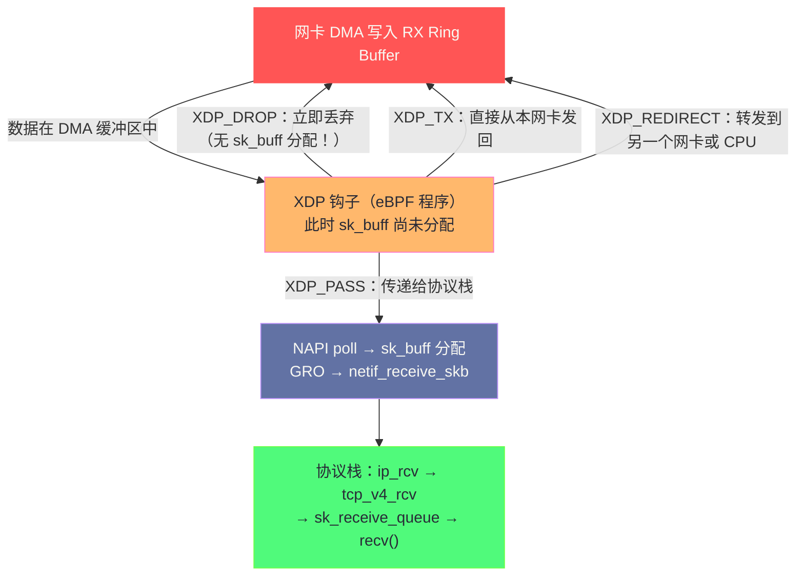
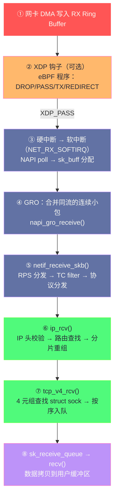

**摘要：**

前几篇文章描述了从 `send()`/`recv()` 到 TCP/IP 协议栈的路径，但有一段路径被刻意跳过了：**数据包从物理介质上的电信号，如何变成内核 TCP 层能处理的 `sk_buff`？** 这是网络栈最底层、也是现代高性能网络优化最激烈的战场。传统的中断驱动接收模式（每个数据包触发一次硬中断）在 10/100 Mbps 时代运行良好，但在 10 Gbps 时代，每秒高达 1500 万个小包，1500 万次硬中断会让 CPU 完全陷入中断处理，无暇处理真正的数据——这就是 NAPI（New API）出现的原因：用"先中断启动，后轮询收包"的混合策略，将中断频率从每包一次降低到每批一次。XDP（eXpress Data Path，Linux 4.8）更进一步，在网卡驱动层就通过 eBPF 程序处理数据包，绕过整个内核协议栈，实现每秒千万级的包过滤、转发和修改，是现代 DDoS 防御、负载均衡和高性能网关的核心技术。本文完整追踪数据包从网卡 DMA 到用户进程的每一步，深入分析 NAPI 的轮询机制、GRO（通用接收端聚合）的优化原理，以及 XDP 的三种执行模式和典型应用场景。

---

## 第 1 章 传统中断驱动模式：为什么在高速网络下失效

### 1.1 硬中断的工作原理

网卡接收到数据包后，通过以下流程通知 CPU：

```
① 网卡 DMA 引擎将数据包写入 RX Ring Buffer（预先分配的内核内存）
② 网卡向 CPU 发出 MSI-X 硬中断（写入 CPU 的 APIC 寄存器）
③ CPU 暂停当前执行流，保存寄存器（上下文切换开销）
④ 跳转到中断服务程序（ISR，Interrupt Service Routine）
⑤ ISR 读取 RX Ring Buffer，处理数据包
⑥ 恢复被中断的执行流
```

**硬中断的核心开销**：
- 上下文保存/恢复：约 100-300 ns
- TLB 和 CPU 缓存失效：被中断的进程的缓存被污染
- 中断控制器交互：向 APIC 发送 EOI（End of Interrupt）信号

### 1.2 中断风暴：高速网络下的灾难

在 10 Gbps 网络、64 字节最小包（最差情况）下，理论最大包速率为：

```
10 Gbps ÷ (64 + 20 字节以太网帧开销) × 8 bits/byte ≈ 14.88 Mpps（百万包/秒）

如果每个包触发一次硬中断：
14.88M 次中断/秒 × 300 ns/次中断 = 4.46 秒/秒 CPU 时间！

含义：CPU 100% 用于处理中断，没有任何 CPU 时间剩余处理数据包本身！
这就是"中断风暴（Interrupt Storm）"，CPU 被硬中断完全淹没。
```

这不是理论问题——早期 Linux 内核在 1 Gbps 网络高负载下就会出现中断风暴，导致系统响应能力完全丧失，甚至需要重启。

---

## 第 2 章 NAPI：以轮询取代高频中断

### 2.1 NAPI 的核心思路

NAPI（New API，Linux 2.6 引入，现已是标准）用一个优雅的混合策略解决了中断风暴：

**第一个包：用中断通知**（保证低负载时的低延迟）

**后续的包：用轮询收取**（高负载时消除中断开销）

具体流程：

```
① 第一个数据包到达：
   网卡触发硬中断
   ISR 执行：
     - 禁用该网卡的硬中断（"不要再中断我了"）
     - 将网卡的 poll_list 加入当前 CPU 的 softnet_data（软中断队列）
     - 触发 NET_RX_SOFTIRQ 软中断（调度软中断处理）
     - 快速返回（ISR 尽量短）

② 软中断处理（NET_RX_SOFTIRQ 的处理函数 net_rx_action()）：
   do {
       napi_poll(napi, budget);  /* budget：每次 poll 最多处理的包数（默认 300）*/
       /* 从 RX Ring Buffer 中一次性取出多个包，批量处理 */
   } while (still_have_work && !time_exceeded);

   如果 poll 用完了 budget（还有更多包待处理）：
     不重新启用硬中断，继续下一轮 poll（保持轮询模式）
   如果 poll 处理完了所有包：
     重新启用硬中断（回到中断模式，等待下一个包到来）
```

**NAPI 的精妙之处**：负载越高，轮询占比越大，中断越少；负载越低，中断模式越多，延迟越小。自适应地在"低延迟（中断）"和"高吞吐（轮询）"之间切换。

### 2.2 NAPI 的数据结构

```c
/* 每个网卡的 NAPI 实例 */
struct napi_struct {
    struct list_head poll_list;  /* 链接到 softnet_data.poll_list 的节点 */
    unsigned long state;         /* NAPI_STATE_SCHED：已调度等待 poll
                                    NAPI_STATE_DISABLE：已禁用（空闲时）*/
    int weight;                  /* poll 的 budget（默认 64，可配置）*/
    int (*poll)(struct napi_struct *, int);  /* 驱动实现的 poll 函数 */
    struct net_device *dev;      /* 所属网卡 */
};

/* 每个 CPU 的软网络数据（softnet_data）*/
struct softnet_data {
    struct list_head poll_list;  /* 待 poll 的 NAPI 实例列表 */
    struct sk_buff_head input_pkt_queue;  /* 积压包队列（非 NAPI 驱动使用）*/
    /* ... */
};
/* 每个 CPU 一份，通过 per_cpu(softnet_data, cpu) 访问 */
```

### 2.3 net_rx_action()：软中断的核心处理函数

```c
static void net_rx_action(struct softirq_action *h) {
    struct softnet_data *sd = this_cpu_ptr(&softnet_data);
    unsigned long time_limit = jiffies + usecs_to_jiffies(netdev_budget_usecs);
    int budget = netdev_budget;  /* 全局 budget（默认 300，可通过 sysctl 配置）*/

    list_splice_init(&sd->poll_list, &list);  /* 取出所有待 poll 的 NAPI 实例 */

    while (!list_empty(&list)) {
        struct napi_struct *n = list_first_entry(&list, ...);

        /* 调用驱动的 poll 函数（如 ixgbe_poll、e1000e_poll）*/
        work = n->poll(n, weight);
        budget -= work;

        if (work < weight) {
            /* poll 消耗 < weight，说明包已处理完 */
            napi_complete(n);   /* 重新启用硬中断，退出 NAPI 模式 */
        } else {
            /* 还有更多包，将 n 放回 list 尾部继续 poll */
            list_move_tail(&n->poll_list, &list);
        }

        if (budget <= 0 || time_after_eq(jiffies, time_limit)) {
            /* 超出 budget 或时间限制，退出本次软中断处理 */
            /* 触发下一次软中断继续处理（防止占用 CPU 太久饿死其他任务）*/
            __raise_softirq_irqoff(NET_RX_SOFTIRQ);
            break;
        }
    }
}
```

**`netdev_budget` 的调优意义**：

```bash
sysctl net.core.netdev_budget
# 300  ← 默认值：每次软中断最多处理 300 个包

# 在高吞吐服务器上调大（减少软中断被抢占的频率）
sysctl -w net.core.netdev_budget=600

sysctl net.core.netdev_budget_usecs
# 2000  ← 默认：每次软中断最多运行 2000µs（2ms）

# 增大时间限制（对低延迟场景反而有害，会让软中断独占 CPU 太久）
```

---

## 第 3 章 网卡驱动到协议栈：数据包的完整接收路径

### 3.1 驱动 poll 函数的工作

以 Intel ixgbe 驱动（82599 10GbE 网卡）为例，`ixgbe_poll()` 的核心工作：

```c
int ixgbe_poll(struct napi_struct *napi, int budget) {
    int work_done = 0;

    while (work_done < budget) {
        /* 从 RX Ring Buffer 取出描述符 */
        union ixgbe_adv_rx_desc *rx_desc = IXGBE_RX_DESC(ring, ring->next_to_clean);

        /* 检查描述符状态（DD bit：DMA Done，网卡已写入数据）*/
        if (!(rx_desc->wb.upper.status_error & IXGBE_RXD_STAT_DD))
            break;  /* 没有更多已完成的包 */

        /* 从 RX Ring Buffer 的 sk_buff 池中取出已填充数据的 sk_buff */
        struct sk_buff *skb = ixgbe_fetch_rx_buffer(ring, rx_desc);

        /* 预处理：填充 skb 的 protocol、pkt_type、vlan 信息 */
        ixgbe_process_skb_fields(ring, rx_desc, skb);

        /* 将 sk_buff 传递给上层网络栈 */
        napi_gro_receive(&rx_ring->q_vector->napi, skb);
        /* ↑ GRO：尝试将多个小 skb 合并成一个大 skb（减少上层处理开销）*/

        /* 补充 RX Ring Buffer：为刚取走的槽位分配新的 sk_buff 和 DMA 地址 */
        ixgbe_alloc_rx_buffers(ring, cleaned_count);

        work_done++;
    }

    return work_done;
}
```

### 3.2 RX Ring Buffer 的结构

网卡的 RX Ring Buffer 是一个固定大小的**循环描述符数组**，每个描述符（Descriptor）指向一个预分配的 `sk_buff` 的 DMA 地址：

```
RX Ring Buffer（以 ixgbe 为例）：

描述符 0: [ DMA 地址 → sk_buff[0] 数据区 | 状态=DD | 长度=1514 ]
描述符 1: [ DMA 地址 → sk_buff[1] 数据区 | 状态=DD | 长度=64  ]
描述符 2: [ DMA 地址 → sk_buff[2] 数据区 | 状态=0  | 长度=0   ]  ← 空（等待网卡填充）
描述符 3: [ DMA 地址 → sk_buff[3] 数据区 | 状态=0  | 长度=0   ]  ← 空
...
描述符 N: [ DMA 地址 → sk_buff[N] 数据区 | 状态=0  | 长度=0   ]

next_to_clean=0  ← 驱动下次从这里取包
next_to_use=2    ← 网卡下次从这里写包（DMA 目标）

工作流程：
  网卡从 next_to_use 开始，将收到的帧 DMA 写入对应的 sk_buff 数据区
  设置描述符状态为 DD（Done），next_to_use++
  驱动从 next_to_clean 开始读取已完成的描述符（DD=1）
  处理 sk_buff，传递给上层
  清除描述符，分配新的 sk_buff，重新设置 DMA 地址
  next_to_clean++
```

**RX Ring Buffer 大小的调优**：

```bash
# 查看和设置 RX Ring Buffer 大小
ethtool -g eth0
# Pre-set maximums:
# RX:    4096
# Current hardware settings:
# RX:    512  ← 当前使用 512 个描述符

# 增大 Ring Buffer（避免 rx_dropped 丢包）
ethtool -G eth0 rx 4096

# 查看是否有因 Ring Buffer 满导致的丢包
ethtool -S eth0 | grep -i "missed\|drop\|error"
# rx_missed_errors: 0     ← 若非 0：Ring Buffer 溢出丢包
```

> [!warning] 生产避坑：rx_missed_errors 飙升
> 当 `ethtool -S eth0 | grep rx_missed` 的计数持续增加，说明网卡的 RX Ring Buffer 被填满，驱动来不及消费，导致丢包。
> 解决方案（按优先级）：
> 1. 增大 Ring Buffer：`ethtool -G eth0 rx 4096`
> 2. 增大软中断 budget：`sysctl net.core.netdev_budget=600`
> 3. 开启多队列（RSS/RPS）：让多个 CPU 核并行处理网络包（见第 5 章）
> 4. 排查是否有慢速的 iptables 规则或 tc filter 拖慢了包处理

### 3.3 GRO（Generic Receive Offload）：批量合并减少开销

**GRO 是什么**：将多个属于同一 TCP 流的、小 skb 合并成一个大 skb，再交给上层协议栈处理，从而将 N 次协议栈处理减少为 1 次：

```
没有 GRO：
  网卡收到 10 个 1460 字节的 TCP 段（同一流）
  → 10 次 napi_gro_receive()
  → 10 次 tcp_v4_rcv()
  → 10 次 TCP 头解析、序号检查、ACK 发送
  总开销：10 × 协议栈处理代价

有 GRO：
  napi_gro_receive() 内部检测：这 10 个包是同一 TCP 流的连续段
  → 合并为 1 个 14600 字节的大 skb
  → 1 次 tcp_v4_rcv()
  总开销：1 × 协议栈处理代价 + 合并开销
  净收益：约 9× 减少了协议栈处理
```

**GRO 的合并条件**（必须满足所有条件才合并）：
- 源 IP、目标 IP、源 port、目标 port 完全相同（同一 TCP 流）
- TCP 序号连续（seq[i+1] = seq[i] + len[i]）
- TCP 标志位相同（都不是 SYN/FIN/RST）
- 合并后总长度 ≤ 65536 字节

```bash
# 查看 GRO 是否开启
ethtool -k eth0 | grep "generic-receive-offload"
# generic-receive-offload: on

# 关闭 GRO（某些调试场景需要看每个真实的包）
ethtool -K eth0 gro off
```

---

## 第 4 章 从 netif_receive_skb 到协议栈的分发

### 4.1 netif_receive_skb() 的职责

GRO 处理完后（或跳过 GRO），数据包通过 `netif_receive_skb()` 进入协议栈分发机制：

```c
int netif_receive_skb(struct sk_buff *skb) {
    /* 1. RPS（Receive Packet Steering）：将包分配给合适的 CPU 处理 */
    if (static_branch_unlikely(&rps_needed)) {
        int cpu = get_rps_cpu(skb->dev, skb, &rflow);
        if (cpu >= 0) {
            /* 将 skb 发送到目标 CPU 的处理队列 */
            enqueue_to_backlog(skb, cpu, &rflow->last_qtail);
            return NET_RX_SUCCESS;
        }
    }

    /* 2. 直接在当前 CPU 处理 */
    return __netif_receive_skb(skb);
}

int __netif_receive_skb_core(struct sk_buff *skb, ...) {
    /* 3. 执行 TC（Traffic Control）入方向的 filter（如 tc qdisc、eBPF filter）*/
    if (run_tc_hooks(skb) == TC_ACT_SHOT)
        goto drop;

    /* 4. 分发给注册的协议处理函数 */
    /* 通过 skb->protocol 查找 ptype_base 哈希表 */
    /* ETH_P_IP(0x0800) → ip_rcv()
       ETH_P_IPV6(0x86DD) → ipv6_rcv()
       ETH_P_ARP(0x0806) → arp_rcv()   */
    deliver_skb(skb, pt_prev, orig_dev);
}
```

### 4.2 RSS：多队列网卡的硬件负载均衡

现代 10G/25G/100G 网卡支持 **RSS（Receive Side Scaling）**：网卡根据数据包的 4 元组（源 IP:port ↔ 目标 IP:port）计算哈希值，将不同连接的包分发到不同的 RX 队列，每个队列绑定一个 CPU 核——**同一条 TCP 连接的包总是由同一个 CPU 处理**（保证 CPU 缓存局部性）：

```
RSS 工作原理：

网卡硬件哈希：hash(src_ip, dst_ip, src_port, dst_port)
→ 结果映射到 RX 队列 0-N
→ 每个 RX 队列的 MSI-X 中断绑定到不同 CPU

效果：
  连接 A (192.168.1.1:12345 → 10.0.0.1:80) → hash → 队列 0 → CPU 0
  连接 B (192.168.1.2:23456 → 10.0.0.1:80) → hash → 队列 1 → CPU 1
  连接 C (192.168.1.3:34567 → 10.0.0.1:80) → hash → 队列 2 → CPU 2
```

```bash
# 查看网卡队列数
ethtool -l eth0
# Pre-set maximums:
# RX:    63
# TX:    63
# Combined:  63
# Current hardware settings:
# Combined:  8  ← 当前 8 个收发队列

# 增大队列数（充分利用多核）
ethtool -L eth0 combined 16

# 查看 RSS 的中断绑定
cat /proc/interrupts | grep eth0
# 64:    12345  0  0  0  0  0  0  0   PCI-MSI eth0-TxRx-0 → CPU 0
# 65:    23456  0  0  0  0  0  0  0   PCI-MSI eth0-TxRx-1 → CPU 1
# ...

# 手动设置 CPU 亲和性（将队列 0 的中断绑定到 CPU 0）
echo 1 > /proc/irq/64/smp_affinity  # bit 0 = CPU 0
```

---

## 第 5 章 XDP：绕过内核协议栈的高速数据平面

### 5.1 XDP 解决的问题

内核网络协议栈是为**通用性**设计的——它要处理各种协议、各种情况、维护 TCP 状态机、进行路由查找、执行 iptables 规则。这些通用性带来了开销：即使是丢弃一个数据包（防火墙规则匹配），也要经历以下路径：

```
网卡 DMA → sk_buff 分配 → GRO 检查 → netif_receive_skb → 
tc filter → ip_rcv → iptables → 最终丢弃

总代价：约 40-100 个函数调用，多次内存分配/释放，多次锁操作
在 10 Gbps 场景下：理论峰值 14.88 Mpps，内核协议栈约能处理 4-5 Mpps
```

**XDP（eXpress Data Path，Linux 4.8，2016 年）** 提供了一种机制：**在网卡驱动层，数据包刚刚被 DMA 写入内存、还没有分配 `sk_buff` 之前**，就用一个 eBPF 程序对其进行处理。这样省去了 `sk_buff` 的分配和整个协议栈的处理。

### 5.2 XDP 的执行位置与钩子



**XDP 的四个动作**：

| 动作 | 含义 | 典型用途 |
|-----|------|---------|
| `XDP_DROP` | 立即丢弃数据包，不分配 sk_buff | DDoS 防御，高速过滤 |
| `XDP_PASS` | 传递给内核协议栈正常处理 | 选择性放行 |
| `XDP_TX` | 从收包网卡直接发回（U-turn）| 高性能 UDP echo、负载均衡 |
| `XDP_REDIRECT` | 重定向到另一个网卡或 AF_XDP socket | 网络功能虚拟化（NFV） |

### 5.3 XDP 的三种工作模式

| 模式 | 钩子位置 | 性能 | 要求 |
|-----|---------|-----|-----|
| **Native XDP** | 网卡驱动最早处理点（DMA 后立即）| 最高（~10 Mpps+）| 需要驱动支持 |
| **Offloaded XDP** | eBPF 程序卸载到网卡 SmartNIC 硬件上执行 | 极高（>100 Mpps，不占用 CPU）| 需要支持 XDP offload 的 SmartNIC |
| **Generic XDP** | 在 `netif_receive_skb()` 处（已分配 sk_buff）| 最低（与协议栈处理差不多）| 所有驱动均支持（软件模拟）|

```bash
# 加载一个 XDP 程序（Native 模式）
ip link set dev eth0 xdp obj xdp_drop.o sec xdp_prog

# 卸载 XDP 程序
ip link set dev eth0 xdp off

# 查看当前 XDP 程序
ip link show eth0 | grep xdp
# link/ether 00:11:22:33:44:55 brd ff:ff:ff:ff:ff:ff promiscuity 0 xdpgeneric
```

### 5.4 XDP 的 eBPF 程序实现

XDP 程序是用受限的 C 语言写成的 eBPF 程序，通过 clang 编译为 eBPF 字节码，加载到内核后由 JIT 编译器转化为本地机器码执行：

```c
/* xdp_drop_syn.c：丢弃所有 TCP SYN 包（DDoS 防御示例）*/
#include <linux/bpf.h>
#include <linux/if_ether.h>
#include <linux/ip.h>
#include <linux/tcp.h>

SEC("xdp_prog")  /* eBPF 程序的 section 名称 */
int xdp_drop_syn(struct xdp_md *ctx) {
    /* ctx->data 和 ctx->data_end 是数据包内存的起止地址 */
    void *data = (void *)(long)ctx->data;
    void *data_end = (void *)(long)ctx->data_end;

    /* 解析以太网头（必须做边界检查，eBPF verifier 要求！）*/
    struct ethhdr *eth = data;
    if ((void *)(eth + 1) > data_end) return XDP_PASS;
    if (eth->h_proto != bpf_htons(ETH_P_IP)) return XDP_PASS;

    /* 解析 IP 头 */
    struct iphdr *ip = (void *)(eth + 1);
    if ((void *)(ip + 1) > data_end) return XDP_PASS;
    if (ip->protocol != IPPROTO_TCP) return XDP_PASS;

    /* 解析 TCP 头 */
    struct tcphdr *tcp = (void *)ip + (ip->ihl * 4);
    if ((void *)(tcp + 1) > data_end) return XDP_PASS;

    /* 检查 SYN 标志位 */
    if (tcp->syn && !tcp->ack) {
        /* 这是 SYN 包，丢弃（DDoS 防御：阻断 SYN Flood）*/
        return XDP_DROP;
    }

    return XDP_PASS;  /* 其他包正常处理 */
}

char _license[] SEC("license") = "GPL";
```

```bash
# 编译 XDP 程序
clang -O2 -target bpf -c xdp_drop_syn.c -o xdp_drop_syn.o

# 加载到网卡
ip link set dev eth0 xdp obj xdp_drop_syn.o sec xdp_prog

# 使用 bpftool 查看运行中的 XDP 程序
bpftool prog list | grep xdp
# 12: xdp  name xdp_drop_syn  tag a3d8e5c7  loaded_at ...
```

### 5.5 XDP 的性能基准

| 操作 | 传统内核路径（iptables DROP）| XDP Native DROP |
|-----|--------------------------|----------------|
| 包处理速率（单核）| ~2-4 Mpps | ~10-14 Mpps（近线速）|
| CPU 每包开销 | ~300-500 ns | ~70-100 ns |
| sk_buff 分配 | 每包一次 | 无（XDP_DROP/TX 不分配）|
| 系统调用 | 无（内核处理）| 无（内核处理）|

**XDP 在 DDoS 防御的实际应用**：

Cloudflare 是 XDP 最知名的生产用户之一。Cloudflare 使用 XDP 在边缘节点每秒丢弃数亿个 DDoS 攻击包——这些包在驱动层就被丢弃，完全不进入协议栈，攻击流量对服务器上运行的业务服务几乎没有影响。

相比之下，传统的 iptables DROP 规则在攻击包速率 > 4 Mpps 时，CPU 会被完全占满，合法请求无法处理。

---

## 第 6 章 AF_XDP：用户态的高速数据平面

### 6.1 AF_XDP 是什么

AF_XDP（Address Family XDP，Linux 4.18）是 XDP 的扩展——允许将数据包直接交给**用户态程序**处理，绕过内核协议栈，但不像 [[10 现代存储技术——NVMe、io_uring 与用户态存储]] 中的 SPDK 那样完全绕过内核。它通过共享内存（UMEM）在内核和用户态之间传递数据包：

```
网卡 DMA → XDP 钩子（eBPF 程序）
  → XDP_REDIRECT 到 AF_XDP socket
  → 数据包放入 UMEM（用户态可访问的共享内存）
  → 用户态程序直接读取数据包（零拷贝！）
  → 用户态程序发送响应（直接放入 TX UMEM）
```

**与 DPDK 的对比**：

| 特性 | AF_XDP | DPDK |
|-----|--------|------|
| 内核集成 | 是（eBPF+内核机制）| 否（完全绕过内核）|
| 设备独占 | 否（可以与内核协议栈共存）| 是（设备对内核不可见）|
| 开发复杂度 | 中等 | 高 |
| 延迟 | 1-5µs | <1µs（轮询模式）|
| CPU 占用 | 低（中断驱动）| 高（轮询驱动）|

```c
/* AF_XDP socket 的使用示意（libxdp 封装）*/
struct xsk_socket_config cfg = {
    .rx_size = 4096,
    .tx_size = 4096,
    .libbpf_flags = 0,
};
struct xsk_socket *xsk;
xsk_socket__create(&xsk, "eth0", 0, umem, &rx, &tx, &cfg);

/* 用户态接收数据包（直接访问 UMEM，零拷贝）*/
unsigned int idx_rx;
while (xsk_ring_cons__peek(&rx, 1, &idx_rx)) {
    const struct xdp_desc *desc = xsk_ring_cons__rx_desc(&rx, idx_rx);
    char *pkt = xsk_umem__get_data(umem_area, desc->addr);
    /* pkt 直接指向数据包内容，无需任何拷贝 */
    process_packet(pkt, desc->len);
    xsk_ring_cons__release(&rx, 1);
}
```

---

## 第 7 章 完整收包路径总结

### 7.1 从网卡 DMA 到 recv() 的全局视图



### 7.2 发包路径：从 send() 到网卡 DMA

发包路径与收包路径基本对称，但关键区别在于**发包由应用程序主动触发**，没有中断机制：

```
应用程序 send()
  → tcp_sendmsg()：数据入 sk_write_queue
  → tcp_write_xmit()：检查 cwnd/rwnd，构建 sk_buff
  → ip_queue_xmit()：添加 IP 头，路由查找
  → dev_queue_xmit()：进入 qdisc（流量控制队列）
  → sch_direct_xmit()：调用驱动 ndo_start_xmit()
  → ixgbe_xmit_frame()：将 sk_buff 写入 TX Ring Buffer
    - 将 sk_buff 数据区的物理地址写入 TX 描述符
    - 写 Doorbell 寄存器，通知网卡硬件有新包待发
  → 网卡 DMA 从 TX Ring Buffer 读取描述符
    - 从 sk_buff 数据区 DMA 读取数据
    - 发送到物理介质
  → TX completion 中断：释放 sk_buff，唤醒可能阻塞的 send()
```

---

## 小结

**硬中断 → NAPI 软中断 → XDP 三个层次的演进**，代表了 Linux 网络栈对"如何高效处理高速数据包"这一问题的三代解答：

1. **纯中断（传统）**：简单但不可扩展——每包一中断，在高速网络下触发中断风暴
2. **NAPI**：混合策略——首包用中断唤醒，后续包用软中断轮询批量处理，自适应负载
3. **XDP**：激进旁路——在驱动最早点用 eBPF 程序处理，完全绕过协议栈，实现近线速包处理

**调优核心参数总结**：

- `ethtool -G eth0 rx 4096`：增大 RX Ring Buffer，避免 rx_missed_errors
- `sysctl net.core.netdev_budget=600`：增大软中断 budget，高吞吐时减少软中断被抢占
- `ethtool -L eth0 combined 16`：增大网卡队列数，启用 RSS 多核并行
- `ethtool -K eth0 gro on`：确保 GRO 开启，减少协议栈处理次数

下一篇 [[08 高性能网络编程——io_uring 网络、SO_REUSEPORT 与多队列 NIC]] 将从应用层视角整合前面所有知识：io_uring 的异步 socket API（`IORING_OP_RECV`/`SEND`/`ACCEPT`）如何在 Linux 6.x 中统一磁盘和网络 IO；`SO_REUSEPORT` 如何让多个进程/线程各自监听同一端口消除 accept 锁竞争；以及 NIC 多队列与应用线程的亲和性配置方法论。

---

> [!note] 思考题
> 1. 单 Reactor 单线程（Redis 模型）适合 CPU 轻量的场景——所有 IO 和计算都在一个线程中。如果某个请求的处理耗时较长（如 Redis 的 KEYS * 命令），会阻塞所有其他请求。Redis 6.0 引入了多线程 IO——但命令执行仍然是单线程的。多线程 IO 具体加速了网络栈的哪个环节？
> 2. 主从 Reactor 模式（Netty 的 BossGroup + WorkerGroup）中，Boss 线程负责 accept，Worker 线程负责读写。如果 Worker 线程中执行了耗时操作（如数据库查询），会阻塞该线程上所有 Channel 的处理。除了使用独立的业务线程池，还有什么设计模式可以解决？协程（如 Go 的 goroutine）是否消除了这个问题？
> 3. Reactor 模式的性能天花板是什么？当网络带宽（如 100Gbps）远超单核处理能力时，单个 Reactor 线程成为瓶颈。多 Reactor 线程如何分担负载？RSS（Receive Side Scaling）如何在网卡层面将数据包分发到不同 CPU 核的 Reactor 线程？
