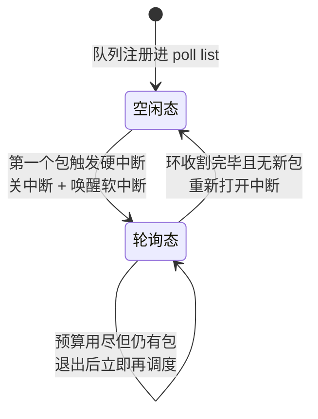

# Linux 网络包的完整收发路径——软中断、NAPI 与 XDP

**摘要：**

前六篇的故事大多发生在协议栈与 socket 层，本篇退到整个网络子系统的最前沿——数据包从物理链路进入内存、再被送往协议栈的那段最原始也最繁忙的路程。这段路径是整个网络栈吞吐与延迟的地基：10 Gbps 线速下每秒约 1480 万个小包，平均每 67 纳秒就要处理一个，中断风暴与软中断过载的机制故事都在这里上演。本篇沿时间线铺开三层演进：第一层，传统中断驱动模式为何在高吞吐下失效（每个包一次硬中断，CPU 被中断风暴打死而非饿死，收包反而停摆）；第二层，NAPI（New API，2003 年随 Linux 2.6 落地）如何用"中断唤醒 + 轮询收割"的混合模式化解风暴，以及 GRO、RPS/RFS 如何在轮询骨架上继续摊薄成本；第三层，XDP（2016 年随内核 4.8）与 AF_XDP（4.18）如何把处理点前移到 skb 分配之前甚至内核之外，为 DDoS 清洗与内核旁路打开快车道。文末给出软中断观测的仪表盘（/proc/net/softnet_stat 与 si 指标）与三层演进的选择逻辑。本文回答两个核心问题：一个包从网卡到达 socket 背后的完整机制链条是什么，以及当收包路径成为瓶颈时，应当依次打开哪些阀门。

---

## 第 1 章 传统中断驱动：一包一中断的黄昏

### 1.1 低速时代的完美设计

最早的网络驱动采用最直觉的模式：网卡收到一个包，触发一次硬件中断（hardirq），CPU 跳到驱动的中断处理程序，把包从网卡读出、包装成 skb、递给协议栈，然后返回。包少的时候，这套模式简单、可靠、延迟极低——包到了马上处理，没有任何多余的机制。低速网卡（10 Mbps、100 Mbps）时代，包的到达率在每秒数千到数万，一次中断的处理开销（微秒级）完全可以承受，一包一中断是那个时代的最优解。

设计的滑坡来自硬件的指数提速与软件的线性演进之间的剪刀差。千兆网卡把包到达率推到每秒百万级，万兆的 64 字节小包线速是每秒 1488 万——平均每 67 纳秒一个包，而一次硬中断的完整开销（中断响应、上下文保存、驱动处理、缓存污染）在微秒量级。**中断的固定开销第一次超过了包本身的处理成本**：CPU 100% 忙着进出中断，真正的收包处理反而排不上队。

给这个结论补一笔账：假设单次硬中断的全过程（响应 + 处理 + 返回）为 5 微秒，每 67 纳秒一包的到达速率意味着中断处理需要 75 倍的 CPU 冗余——显然不可能。即便中断合并把 32 个包并为一次（每次 30 微秒），单核处理上限也只有约百万包/秒，离万兆线速 1488 万包/秒仍然遥远。数字的结论冷峻：**中断驱动的天花板不是性能调优能解决的，它需要结构革命**——这就是 NAPI 的历史必然性。

NAPI 还有一个常被误解的细节值得澄清：**关中断不等于不响应**。轮询期间网卡硬件仍在 DMA 收包、推进描述符，CPU 只是不再被打断——数据流没有停，停的是打断式通知。因此 NAPI 的轮询期不会丢包（环仍在工作），只有环满了才会真正溢出。把中断是通知、DMA 是搬运这两件事分开，NAPI 的所有行为就都顺理成章。

> [!note] 一句话模型
> NAPI 之后的中断系统可以压缩成一句话：硬中断从包的搬运工降级为新包到场的敲门人，真正的搬运交给可调度的软中断与轮询循环——所有现代网络驱动的性能设计，都建立在这次降级之上。

### 1.2 接收活锁：被打死的收包路径

极端情况比"慢"更糟，它叫接收活锁（receive livelock）。当包到达率超过中断处理能力，中断处理程序永远在赶工：硬中断不断抢占、CPU 无暇执行软中断的协议栈处理、协议栈处理不完导致接收队列满、队列满导致丢包、丢包又让重传增多——包流量进一步上涨。CPU 看起来忙到极限（中断占用率 100%），有效收包率却趋近于零：**系统没有被饿死，而是被打死了**。这与 02 篇讲过的 1986 年拥塞崩溃同构——都是"固定开销随负载增长，吞掉全部有效算力"的结构性灾难，只是这一次发生在单机的中断层。

活锁的解药不是更快的 CPU，而是改变"每个事件都要 CPU 亲自迎接"的结构。工业界的答案分两步：第一步是**中断合并**（interrupt coalescing）——网卡攒一批包再触发一次中断，把中断频率从"每包"降到"每批"，这是硬件层的补丁，`ethtool -c` 的 adaptive-rx 参数就是它；第二步是**结构重构**——这就是 NAPI，软件层把"中断驱动"翻转为"中断唤醒 + 轮询收割"，本篇的主角正式登场。

```mermaid
%%{init: {'theme': 'dracula'}}%%
flowchart TB
    A["低速时代<br/>包少，一包一中断"] --> B["千兆/万兆时代<br/>包到达率超过中断处理力"]
    B --> C["中断风暴<br/>CPU 中断占用 100%"]
    C --> D["软中断无暇执行<br/>协议栈积压"]
    D --> E["接收队列满 → 丢包"]
    E --> F["有效收包率趋零<br/>接收活锁"]
    F -.->|重传加剧流量| B
    style F fill:#44475a,stroke:#ff79c6
    style C fill:#44475a,stroke:#f1fa8c
```



---

## 第 2 章 NAPI：中断唤醒，轮询收割

### 2.1 混合模式的翻转

NAPI（New API）由 Alexey Kuznetsov 与 Jamal Hadi Salim 设计，2003 年前后随 Linux 2.6 落地，是收包路径史上最重要的一次结构翻转。它的逻辑可以用一句话说清：**流量小时用中断保延迟，流量大时用轮询保吞吐，两者的切换由"第一个包的中断"触发**。具体机制分三步：第一步，队列空闲时，网卡开着中断，第一个包照常触发硬中断——但驱动在这次中断里只做一件事：关闭本队列的后续中断，把自己注册到设备的轮询队列（poll list）里，然后唤醒软中断；第二步，软中断（NET_RX）调用驱动的 poll 方法，驱动在循环里从接收环（rx ring）批量收割包，每次收割有预算上限（budget，网络软中断的默认配额 64 个包）；第三步，poll 把环里的包收割完、发现暂时没有新包了，才重新打开中断，回到第一步的待机状态。

这套设计的精妙在两处收支平衡。**中断次数的收支**：流量越大，单次 poll 收割的包越多，均摊到每包的中断次数越低——高频流量下中断开销被批量摊薄到可忽略；**处理权的收支**：软中断有 budget 配额，收割完预算就退出、调度其他任务，避免了"一个队列的洪水霸占一个 CPU"——活锁的两个病灶（中断风暴与霸占）被一次手术同时切除。

NAPI 的工作状态机可以用一张状态图收拢——空闲态与轮询态之间的往返，正是中断与轮询的交接：



### 2.2 接收环：DMA 与轮询的舞台

NAPI 的轮询对象是接收环（rx ring buffer），它是 01 篇讲过的发送描述符环的镜像：驱动预先分配一批缓冲区，把物理地址写进描述符表告知网卡；网卡收到包后 DMA 直写内存、推进描述符指针；驱动 poll 时按描述符的完成状态批量收割 skb。环的关键属性是**容量有限**——收得太慢，环会被新包覆盖（表现为 rx_no_buffer 或 drop 计数增长），所以 NAPI 的预算机制不只是公平调度，更是"在环溢出前抢收"的压力设计。

环的容量与中断合并的参数共同决定了接收路径的延迟/吞吐调节面：`ethtool -G` 调环大小（大环抗突发、占内存），`ethtool -C` 调合并（激进合并省中断、加延迟）。这些参数与 06 篇的 qdisc、拥塞参数一样，都需要按负载画像选择——参数本身没有最优值，只有与流量的匹配值。

### 2.3 GRO：在轮询骨架上的聚合优化

NAPI 解决了"怎么收"，GRO（Generic Receive Offload）解决"收多少算一次"。它的思路与发送方向的 GSO/TSO 对偶：在驱动的 poll 收割阶段，把**同一条流、相邻到达、能拼成一个逻辑大包的小包**合并成一个巨型 skb 再送入协议栈——64 个 1500 字节的包合成 1 个 96 KB 的逻辑包，协议栈的逐包处理开销（IP 层、TCP 层、socket 定位）直接摊薄 64 倍。GRO 与 02 篇的非线性 skb 严丝合缝：合并后的大包用页片段挂载数据，头部留在线性区，协议栈照常处理。

GRO 的合并条件苛刻而严谨：同一四元组流、TCP 序号连续、时间戳与窗口字段一致、头部完全同构——任何不满足都会终止合并序列。

苛刻的条件换来的是协议栈的零感知：GRO 合并后的包拥有合法的连续序号与统一的头部，TCP 层完全把它当作一次正常接收——这也是 GRO 能在协议栈下方透明存在的原因。与之相对的是硬件版 GRO（LRO，Large Receive Offload），网卡自己合并，但常会破坏流信息（MAC/端口被抹平），转发场景下是著名的坑——桥接与路由部署里通常禁用 LRO、保留 GRO。软硬两个版本的分寸，体现了"优化不能改变可观测语义"的老规矩。苛刻是为了正确：合并的包会被协议栈当作"一个大段"处理，伪造的合并会破坏 TCP 的序号语义。GRO 在小包高频场景（路由器转发、DDoS 洪流）收益最大；对延迟敏感的低流量场景，合并引入的微秒级攒批反而多余——`ethtool -K gro on/off` 是它的开关。

### 2.5 中断亲和性：把收包钉在正确的核上

NAPI 的收包发生在"被中断打到的那个 CPU"上，因此**中断的亲和性（smp_affinity）直接决定收包的核分布**。单队列网卡只能有一组亲和性（常见误区是把它分散到所有核——irqbalance 自动打散中断看似均衡，实则让收包上下文在核间跳来跳去，缓存亲和尽失）；多队列网卡则应把每个队列的中断绑到不同的核，配合 RSS 哈希分散流量。irqbalance 服务在这两端的策略取舍常常与高性能场景相悖——绑定脚本与 irqbalance 的共存策略（排除网卡中断）是调优清单的固定条目，08 篇的多队列章节会给出完整的绑定示例。

### 2.4 NAPI 的参数面与线程化变体

NAPI 本身没有多少旋钮，但它的两个配套参数经常出现在调优清单里。其一是**预算（budget）**：网络软中断每次执行的收割配额（默认 64 个包），预算太小会导致 time_squeeze 频发（见 3.2 节），太大则一次软中断占用 CPU 过久——多数内核不允许也不需要调整它，理解其存在即可。其二是**权重（weight）**：单次 poll 内驱动收割的批量参考值，与驱动的环容量配合决定批处理粒度。

NAPI 还有一个重要的现代变体——**线程化 NAPI（threaded NAPI，内核 5.9 起）**：把软中断中的 poll 收割交给专用的内核线程执行（/sys/class/net/ethX/threaded 置 1）。它解决的问题是"软中断的调度特权过高"：默认形态下软中断可以抢占普通进程，在收包洪峰时会挤占业务线程；线程化后，收割变成普通线程，与业务一起被 CFS 公平调度，多租户与延迟敏感环境的毛刺显著收敛。这是 NAPI 诞生十七年后最重要的演化——结构没变，调度的位置变了。

```mermaid
%%{init: {'theme': 'dracula'}}%%
flowchart TB
    RX["网卡 rx ring<br/>64 个 1500B 小包"] --> POLL["驱动 poll 批量收割"]
    POLL --> GRO{"GRO 合并判断<br/>同流？序号连续？头部同构？"}
    GRO -->|满足| MERGE["合并为 1 个 96KB 巨型 skb<br/>（页片段挂载）"]
    GRO -->|不满足| PASS["原样上送"]
    MERGE --> STACK["协议栈<br/>处理开销摊薄 64 倍"]
    PASS --> STACK
    style MERGE fill:#44475a,stroke:#50fa7b
    style STACK fill:#44475a,stroke:#ff79c6
```



---

## 第 3 章 软中断：包处理的异步引擎

### 3.1 硬中断为什么必须短

NAPI 的设计里，硬中断被刻意"阉割"得只剩最小职责——确认硬件、关闭中断、调度软中断，然后立刻退出。这背后是内核中断体系的一条铁律：**硬中断上下文不可睡眠**（它打断了任意正在运行的代码，没有自己的进程上下文），且应当尽可能短（中断期间通常屏蔽同级或更低优先级中断，长了会拖累全局）。因此一切可能耗时的工作——协议栈处理、socket 定位、数据拷贝——都必须移交给可以睡眠调度、可以被公平调度的上下文，这就是软中断（softirq）存在的理由。

网络收包对应 NET_RX_SOFTIRQ，发送完成与部分驱动操作对应 NET_TX_SOFTIRQ。软中断的执行载体有两种形态：irq 退出时顺手执行的下半部（若条件允许），以及每 CPU 的内核线程 ksoftirqd/N（当软中断积压、顺手执行不划算时，ksoftirqd 以普通进程的优先级参与调度，避免软中断饿死正常任务）。**"中断只拍门，软中断干活"**——这扇门的分工是理解网络 CPU 占用的地基。

### 3.2 观测软中断：si 指标与 softnet_stat

软中断的负载可以直接观测，两个仪表盘各有侧重。第一个是 `top`/`mpstat` 里的 **si（softirq）列**：某 CPU 的 si 持续接近 100%，意味着该核被网络软中断吃满——在单队列网卡上，这几乎就是"整机收包能力到顶"的信号（无论多少核空闲，收包都在那一个核上排队）。第二个是 `/proc/net/softnet_stat`：每行对应一个 CPU 的软中断统计，第二列是 dropped（本 CPU 因 budget 用尽或队列满而丢弃的包数）、第三列是 time_squeeze（预算用尽但环里还有包、被迫退出的次数）——time_squeeze 持续增长说明 CPU 处理不及，dropped 增长说明已经丢包。

软中断过载的连锁反应是一条清晰的恶化链：time_squeeze 增长（处理不及）→ 收割变慢 → rx ring 占满 → 网卡丢包（rx_no_buffer/drop 计数）→ TCP 层靠重传恢复 → 网络流量上升 → 软中断更忙。链条的每一环都有对应的计数器，`ethtool -S` 的驱动计数、softnet_stat 的内核计数、nstat 的协议计数在一条链上互相印证——收包路径的排障本质上就是沿着这条链定位"最先变红的那一环"。

```text
$ cat /proc/net/softnet_stat
0071d20e 00000000 0000001f 00000000 00000000 00000000 00000000 00000000 00000000 00000000
00641a03 00000000 00000a2c 00000000 00000000 00000000 00000000 00000000 00000000 00000000
```

上例中第三个 CPU 的 time_squeeze 为 0x2a30（约 1.1 万次）——每秒数千次的预算耗尽意味着这个核的软中断已经饱和。这两个仪表盘是 06 篇"调优清单"的地基层：收包路径的饱和会让所有上层调优形同虚设。

链条诊断还有一个工程习惯值得养成：把各环计数器的基线快照保存下来（正常时段的 softnet_stat、ethtool -S、nstat 输出），故障时对比偏差——计数器的绝对值意义有限，偏差率才是问题的指纹。10 篇的监控模板正是围绕这组基线快照展开的。

### 3.3 RPS 与 RFS：把包搬到空闲的核

单队列网卡（或中断亲和性集中）造成的"一核饱和、众核围观"，内核给出的软件解法是 RPS（Receive Packet Steering）与 RFS（Receive Flow Steering）。RPS 的思路是多核版的负载均衡：软中断处理到协议栈入口时，按包的哈希选择另一个 CPU 的队列，把处理工作"搬运"过去。RFS 在其上加了**流亲和性**：内核记录每条流的消费进程当前跑在哪个 CPU，把包搬运到"应用即将在哪个核上 recv"的那个核——让数据与处理它的进程在同一缓存域团聚，省掉跨核的缓存迁移。

硬件侧的对应物是**多队列网卡（RSS，Receive Side Scaling）**：网卡硬件直接把不同的流哈希到不同的硬件队列，每个队列独立中断，天然分散到多核——这是现代网卡的标配，08 篇会把它与 SO_REUSEPORT 的应用层配合讲透。软件 RPS/RFS 是硬件 RSS 的兜底补丁：**先看硬件有没有分堆，没有才用软件搬运**。

RPS/RFS 的代价也必须记账：软件搬运是真实的跨核 IPI（处理器间中断）与内存访问——包在一个核收割、搬到另一个核处理，缓存的局部性被拆散。RFS 的流表（rps_flow_cnt）默认值不大，高流数场景要配合 `sysctl net.core.rps_sock_flow_entries` 扩表，否则哈希碰撞会让流在不同核间抖动。这些细节共同指向一个结论：RPS/RFS 是"硬件多队列缺失时的补丁"，有条件上 RSS 就不要依赖软件搬运。

---

### 3.5 一条包的完整上行流水线

把 2、3 两章的机制串成一条完整的上行流水线，每个环节标注它的开销与计数器：

```mermaid
%%{init: {'theme': 'dracula'}}%%
flowchart TB
    A["网卡 DMA 收帧"] --> B["硬中断（最小化）<br/>仅确认 + 关中断 + 调度"]
    B --> C["软中断 NET_RX"]
    C --> D["NAPI poll<br/>批量收割 rx ring"]
    D --> E["GRO 聚合（可选）"]
    E --> F["构建 skb<br/>（XDP 在此之前）"]
    F --> G["RPS/RFS 多核分发（可选）"]
    G --> H["协议栈入口<br/>netif_receive_skb"]
    H --> I["IP 层 → TCP 层<br/>（02 篇）"]
    I --> J["socket 接收缓冲<br/>（03 篇）"]
    style B fill:#44475a,stroke:#f1fa8c
    style D fill:#44475a,stroke:#ff79c6
    style J fill:#44475a,stroke:#50fa7b
```



这条流水线是"延迟与吞吐的合成器"：低流量时，中断直接触发、软中断立即执行，端到端延迟微秒级；高流量时，合并与批量全面接管，中断频率与逐包开销同步摊薄。同一条流水线在两种负载形态下呈现完全不同的性能画像——这也是为什么基准测试必须注明流量形态：低流量测出的是中断延迟，高流量测出的是批量吞吐，两者没有可比性。

流水线上还有一条容易被忽略的旁路值得标注：**接收方向的 qdisc 缺位**。发送方向有 qdisc 整形排队，接收方向没有对称物——接收的"排队"发生在 rx ring（硬件）与 socket 缓冲（协议栈顶端）两处，中间是裸奔的。这个不对称的根源是接收方向没有天然的"队头"：包的消费者（socket）在协议栈处理之前未知，而发送方向的消费者（网卡）从 send 那一刻就已确定。理解了这个不对称，就能理解为什么入向限速（ policing）只能靠丢弃模拟（06 篇提过），而出向限速可以优雅排队。

### 3.6 收包路径的丢包地图

排障时最需要的是一张"丢包可能发生在哪"的地图，从入口到出口逐环列出：

| 环节 | 丢包原因 | 观测计数器 |
| :--- | :--- | :--- |
| 网卡 | 缓冲不足、过滤规则 | `ethtool -S` 的 rx_dropped/no_buffer |
| rx ring | 收割不及被覆盖 | softnet_stat 第二列 / 驱动计数 |
| 软中断 | budget 用尽、队列满 | softnet_stat 的 dropped/time_squeeze |
| netfilter | 防火墙规则 | nstat / iptables 计数器 |
| socket 层 | 接收缓冲满（03 篇） | TcpExtPruneCalled、RcvbufErrors |
| 应用层 | 不读取导致的连锁 | Recv-Q 持续非零 |

这张地图的使用姿势是从源头往下找第一个非零计数器——丢包会沿链条向下"传导症状"（ring 满导致软中断丢、缓冲满导致应用读不到），但根因往往在最先出现计数的那一环。10 篇的诊断决策树就建在这张地图上。


## 第 4 章 XDP：在 skb 诞生之前的快车道

### 4.1 处理点的极限前移

NAPI 与 GRO 把"每包开销"摊薄了，但每个包仍然要经历完整的内核路径：DMA、描述符收割、skb 分配、协议栈逐层处理。有没有可能更进一步——**在 skb 还没分配、协议栈还没介入之前，就决定这个包的命运**？这就是 XDP（eXpress Data Path，2016 年随内核 4.8 落地）的位置：它在驱动收包循环的最前端（NAPI poll 收到描述符后、构建 skb 前）挂载一段 eBPF 程序，程序直接操作原始帧数据，并返回一个裁决——`XDP_PASS`（放行进入正常协议栈）、`XDP_DROP`（就地丢弃）、`XDP_TX`（从原网卡直接发回）、`XDP_REDIRECT`（转发给其他网卡或 CPU/socket）。

这个位置的威力可以用数字感受：XDP_DROP 不分配 skb、不走协议栈、不触碰 RPS——每包成本只有几纳秒到几十纳秒，单核每秒可处理千万级包的丢弃。

与协议栈内防火墙（iptables）做个量化对照会更直观：iptables 丢一个包的成本包含 skb 分配与释放、协议栈两层遍历、netfilter 规则匹配——亚微秒到微秒级；XDP_DROP 的成本是查一次 Map 加一次返回值判断——纳秒级。两者相差三个数量级，这正是 40 Gbps 攻击流量 iptables 拦不住而 XDP 拦得住的物理根源。位置决定成本，成本决定可行性——性能工程的第一课在本篇被具象化。DDoS 清洗是最典型的应用：攻击洪流在网卡边缘就被判决丢弃，正常流量放行，协议栈安然无恙。Katran（Facebook 的 L4 负载均衡）、Cilium 的快速路径，都把核心逻辑压在 XDP 这一层。

XDP 程序的可编程性还有一个容易被低估的应用维度：**遥测与观测**。在丢弃与转发之外，XDP 程序可以按流采样、统计流量矩阵、测量队列深度——这些遥测数据落在 Map 里，用户态的监控进程实时读取。数据面与观测面共用同一个高性能入口，观测本身的开销被压到可以常开——这与 10 篇可观测性要为高频路径设计的思路完全一致。

观测常开化还带来一个组织学收益：当 XDP 遥测成为常态，网络问题的排查就从临时加监控变成翻现成的仪表——故障发现的前移与排查成本的下降，是数据面可编程性给可观测性带来的隐形红利，也是 XDP 部署回报中常被忽略的一项。

红利的兑现还依赖一个组织条件：XDP 程序的开发与运维需要 eBPF 技能储备——工具链（clang、libbpf、bpftool）的学习曲线与验证器排障的经验，都是团队的隐性成本。技能储备的预算要与性能收益一起进选型账，这是 XDP 类技术特有的"人件成本"。

技能储备的路径也值得给出：从 bpftool 与 bpftrace 的小工具开始（读别人写的程序），到自己改写社区 XDP 示例（改黑名单逻辑、加统计字段），再到独立设计数据面——三步学习曲线与社区文档的成熟度匹配，一个有 C 与网络基础的工程师通常可以在数周内跨过前两步。

学习曲线的前两步还有现成的社区资源可用：xdp-project 的教程仓库、各 netdev 会议的实操 workshop、以及 Cilium 源码里的真实范例——从读示例到写自己的程序，社区已经铺好了大部分台阶。

台阶的最后一格——从修改示例到独立设计——依然要靠生产问题的锤炼：找一个真实的流量热点（例如某个高频的无效请求），用 XDP 实现针对性的裁决，再测量收益与维护成本。第一个真实场景的完整闭环，胜过十个练习。

```mermaid
%%{init: {'theme': 'dracula'}}%%
flowchart LR
    NIC["网卡 DMA"] --> RING["rx ring 描述符"]
    RING --> XDP{"XDP 程序裁决<br/>（skb 尚未分配）"}
    XDP -->|XDP_DROP| DROP["直接丢弃<br/>成本纳秒级"]
    XDP -->|XDP_TX| TX["原卡发回"]
    XDP -->|XDP_REDIRECT| RED["重定向<br/>其他网卡/CPUMAP/socket"]
    XDP -->|XDP_PASS| SKB["构建 skb → NAPI/GRO → 协议栈"]
    style XDP fill:#44475a,stroke:#ff79c6
    style DROP fill:#44475a,stroke:#50fa7b
```



### 4.2 XDP 的性能与代价

XDP 的性能来自位置，代价也来自位置。**在驱动层直接处理意味着"裸奔"**：eBPF 程序面对的是原始以太网帧，没有协议栈的任何便利——想看 TCP 头要自己解析偏移，想做连接追踪要自己在 eBPF Map 里维护状态，想改包要自己校验和重算。eBPF 的验证器（verifier）保证了程序的安全（无死循环、无越界、有界时间），但不会替你写逻辑。XDP 因此是"给专家的快车道"——通用业务留在协议栈里，性能热点的关键路径（丢弃、分类、转发）下沉到 XDP，两者通过 XDP_PASS 衔接。

XDP 还有一个工程上的分档：**原生模式**（驱动原生支持，最快）、**通用模式**（内核协议栈模拟，性能一般但任何网卡可用）与**卸载模式**（eBPF 程序直接跑在智能网卡上，CPU 完全解放）。三档的性能递增、通用性递减，部署前用 `ethtool -i` 确认驱动支持情况是必要动作。

XDP 程序的常态化部署还要面对两个生命周期问题。其一是**加载与替换**：程序经 iproute2（`ip link set dev eth0 xdp obj filter.o`）或 BPF 框架（libbpf）挂载，原子替换无需停网卡——生产环境的策略热更新依赖这一点。其二是**状态存储**：丢弃计数、流表、统计信息都放在 eBPF Map 里——用户态可读、多 CPU 共享、per-CPU 类型还能避免计数器争抢，Map 是 XDP 程序与外部世界唯一的（也是高效的）数据通道。

### 4.3 AF_XDP：把快车道延伸到用户态

XDP 的裁决里藏着一个延伸方向的种子：XDP_REDIRECT 到 socket。把这条腿走到底，就是 **AF_XDP**（内核 4.18，2018）：用户态程序创建 AF_XDP 类型的 socket，内核准备一片用户态与内核共享的内存区域（UMEM），XDP 程序把帧重定向到 UMEM 的环上，用户态从环里直接取帧——**数据从网卡 DMA 进内存后，不经内核协议栈、不复制，直接被用户态消费**。这是内核旁路（kernel bypass）的 Linux 原生方案，定位与 DPDK 相似：把协议栈整个绕开，应用自己处理以太网帧。

AF_XDP 与 DPDK 的取舍值得对照：DPDK 是独占式旁路——网卡驱动与内存完全由用户态接管，性能极致，但该网卡从此告别内核协议栈（ssh、常规服务全没了）；AF_XDP 是共享式旁路——UMEM 只接管部分队列，其余队列照常走内核，同一张网卡可以"一半快车道、一半普通路"。对既要极致转发又要保留内核生态的部署（网关的混合负载），AF_XDP 的折中常常比 DPDK 的独占更务实。

AF_XDP 的性能还有一个常被引用的量级：官方基准里单核每秒千万级包的收发能力，与 DPDK 的差距在个位数百分比——差距存在但不大，而共享网卡、保留内核生态、无需专有驱动的优势是结构性的。对绝大多数考虑旁路的团队，AF_XDP 是比 DPDK 更低摩擦的起点；DPDK 的极致性能留给确实需要榨干每一纳秒的场景。代价是用户态要自己实现协议处理——TCP 全栈在用户态的自建成本，正是 01 篇 7.1 节说的"旁路把隐藏的复杂性请回应用层"。

这句话在 AF_XDP 的语境里有一个具体的注脚：用户态拿到裸帧后，TCP 的排序、确认、重传、拥塞控制全部要自建——现有方案（如自研的用户态协议栈）往往只覆盖标准 TCP 行为的一个子集，与内核栈的互操作（对端可能同时与内核栈通信）也存在细微语义差。旁路的成本账要从这个角度算，才不会只看见纳秒级的处理速度。

还有一个跨领域的视角值得补充：旁路的"自建协议栈"成本正在被开源生态部分偿还——基于 AF_XDP 的用户态协议栈（如基于 libxdp 的项目）与各类 DPDK 协议栈都在开源化，自建的门槛逐年降低。但降低不等于归零，选型时的成本评估依然要按"团队自己的维护能力"来计。

---

### 4.4 一个 DDoS 清洗案例：XDP 的完整登场

用一个典型结构的攻击防御案例把 XDP 的工程形态走完整。某在线服务遭遇 UDP 反射放大攻击：入向流量 40 Gbps，其中 95% 是伪造源地址的 DNS/NTP 反射包，正常业务流量被完全淹没。防御的演进分三步，恰好对应本篇的三层机制。

第一层，协议栈防御的失败：常规 iptables 规则可以丢弃攻击包，但每包仍要走完收发路径的skb 分配与 netfilter 钩子——40 Gbps 的洪流把软中断核全部打满，规则生效了，业务流量依然进不来，这正是 1.2 节活锁的变奏。第二层，NAPI 层的缓解：调大 ring、激进中断合并，吞吐上限提升，但逐包的规则匹配依然昂贵。第三层，XDP 的根治：一段 eBPF 程序在驱动层读取 UDP 目的端口，比对 eBPF Map 里的黑名单（用户态 daemon 实时更新），命中即 XDP_DROP——攻击包在 skb 分配之前就被丢弃，单核每秒千万级的处理能力把 40 Gbps 洪流削成涓流，正常业务的 XDP_PASS 流量重新占据链路。事后统计，防御生效后 CPU 的软中断占比从 100% 回落到 15%，业务恢复毫秒级延迟。

攻击防御的工程化还有一个细节值得记录：XDP 程序本身的资源约束——验证器限制程序的指令数与循环，Map 的大小有上限，攻击者若能用海量"合法"流量撑爆 Map 查询的成本，防御的性价比就会反转。任何防御机制都要评估"防御者与攻击者的成本曲线"，XDP 也不例外。

这个案例的工程细节还有两处值得标注。其一是**黑名单的热更新**：攻击源不断变化，eBPF Map 由用户态程序持续写入，XDP 程序每次执行都查 Map——数据面与控制面的分离，正是 SDN 时代防火墙的内核形态。其二是**多队列协同**：40 Gbps 的流量被 RSS 分散到数十个队列，每个队列各跑一份 XDP 程序、共享同一个 Map——Map 的 per-CPU 或哈希结构决定了跨核共享的争用成本，这是 XDP 横向扩展的关键细节。

Map 类型的选择本身就是一次微缩的性能设计：per-CPU Map 写入无锁、读取时聚合，适合高频计数；哈希 Map 跨核共享、便于全局查表，适合流表与黑名单；数组 Map 定址最快，适合固定键位的配置。三种 Map 的混用构成 XDP 程序的数据面设计——选错 Map 类型，纳秒级的处理路径会被一次跨核锁争用毁掉。

Map 设计与 02 篇的哈希表设计（tcp_hashinfo）在原则上一脉相承：按最常见操作的负载选择结构、按最坏情况约束容量。内核工程师在每个子系统里重复回答同一道题，读通一处，处处皆是旧友。

横向扩展的另一个维度是 NUMA 亲和：多队列网卡通常插在特定 NUMA 节点，跨节点的包处理会翻倍内存访问延迟——把队列中断、XDP 程序处理的核、以及消费流量的应用绑定在同一节点，是 XDP 高性能部署的最后一道工序。

NUMA 错配的症状也有典型指纹：跨节点收包的机器上，软中断 CPU 的平均处理时长明显高于本节点处理——perf 的跨节点内存访问统计（NUMA hit/miss）可以直接证实。观测、定位、修正的三步，与本篇所有性能问题共用同一套流程。

### 4.5 XDP 在技术版图中的位置

把 XDP 放进本专栏的技术版图，三个相邻概念的边界值得划清。与 **netfilter/iptables** 的区别：后者在协议栈内部（skb 已分配、逐层钩子），前者在协议栈之前（裸帧）——iptables 表达"策略"，XDP 表达"路径"，两者可以叠加（XDP 先拦大头，iptables 管细规则）。与 **TC/eBPF（cls_bpf）** 的区别：TC 的挂载点在链路层出口与入口（skb 已存在），性能次优但功能更全（可用完整的 skb 助手函数）——XDP 快而简，TC 慢而全。与 **DPDK/AF_XDP** 的区别：XDP 仍是内核内的处理，DPDK 完全旁路，AF_XDP 按需旁路——三者的性能与通用性依次递减/递增。

这张表在选型时的用法是从上往下找最便宜够用的层：能用 netfilter 表达的策略不要上 TC，能用 TC 表达的不要上 XDP——每往下一层，都意味着放弃 skb 的便利、自担协议细节、承担 eBPF 验证器对代码形态的约束。层级选择的本质是为性能付灵活性的赎金，赎金要按需支付。

| 技术 | 处理位置 | 每包开销 | 语义完整度 | 典型用途 |
| :--- | :--- | :--- | :--- | :--- |
| iptables/netfilter | 协议栈内（skb 后） | 微秒级 | 完整 | 通用防火墙 |
| TC/eBPF | 链路层出入口 | 亚微秒 | 完整（skb 可用） | 策略路由、QoS |
| XDP | 驱动收包循环 | 纳秒级 | 裸帧（自解析） | DDoS、L4 LB、转发 |
| AF_XDP / DPDK | 内核外 | 纳秒级 | 全部自建 | 专用网关、旁路 |

这张表的读法是"从下往上花预算"：先确认协议栈层真的不够用（很多时候 iptables 优化规则顺序就解决了），再考虑 TC，然后才是 XDP——每一层的性能都是用"放弃上一层的能力"换来的。XDP 社区自己的口号也印证这一点：它不是要取代协议栈，而是给协议栈一个"提前拒绝"的窗口。


## 第 5 章 发送路径的镜像与收发全景

### 5.1 发送方向的对应物

接收路径的每一段，在发送方向都有对应物：接收环对应发送环（tx ring），NAPI 收割对应发送完成收割（tx completion 的中断与软中断回收 skb），GRO 对应 GSO/TSO（大包在靠近网卡处切分），RPS/RFS 对应 XPS（发送方向的多核选路）。发送路径的独特一笔是 qdisc（排队规则，06 篇的 bufferbloat 主角）——出向流量在驱动前排队整形，入向则没有对称物。

### 5.4 BQL：发送缓冲的自动水位

发送路径还有一个常被忽略的自动调节器——BQL（Byte Queue Limits）：驱动在 tx ring 上维护一个动态水位，按链路实际排空速度自动调整允许积压的字节数。它的目标直指 06 篇的 bufferbloat：发送队列越长，队尾包的延迟越大，BQL 把水位压到刚好喂饱链路的程度，让积压的上限由 qdisc（智能排队）而非 tx ring（无脑 FIFO）承担。BQL 是硬件队列的自律机制，与 qdisc 的他律机制配合，构成出向延迟治理的两道闸。BQL 与 qdisc 的分工可以用一句话讲给初学者：BQL 管硬件队列要不要塞满，qdisc 管等待发送的包怎么排——两层各管一段积压，合起来把出向延迟的每一段都置于可观测、可调节的状态。BQL 的存在也解释了一个观测现象：开启 BQL 的驱动上 tx ring 占满（tx busy/drop）很少见——水位动态收紧后，积压被上移到 qdisc 与 socket 层，问题换了个地方现身，排障时看到 qdisc 丢包增长而 tx drop 恒零，不要惊讶。理解了接收方向，发送方向可以完全类比着读，差异只在"谁主动"：发送由应用驱动（send 触发下行），接收由网络驱动（包到达触发上行），两条路径在软中断与驱动层汇合。

这种现象给排障思维的一个启示是：优化会转移问题的所在地而非消灭问题——tx 层的缓解表现为 qdisc 层的增长，收包层的缓解表现为缓冲区的增长。追踪问题的去向，比记住问题的原貌更重要，这也是本篇与前后各篇需要连读的原因。

问题去向的追踪还有一个系统化的工具：把各层计数器画成一张随时间对齐的时序图（softnet、ethtool、qdisc、协议计数四行对齐），问题在层间的迁移会表现为波峰在图上的横向移动——一图看穿层间传导，比逐层翻计数器高效得多。

### 5.3 XPS 与发送选路

发送方向的多核选路机制叫 XPS（Transmit Packet Steering）：决定这个 CPU 上产生的发送流量用哪个 tx 队列。它与接收方向的 RPS 镜像对称，但配置思想相反——RPS 是包来了往哪个核搬（处理端均衡），XPS 是这个核的包从哪个队列出（队列端归属）。精细调优时，把每核固定绑定到专属 tx 队列，可以消除队列级的锁竞争与描述符缓存的弹跳——多队列网卡的吞吐调优清单上，XPS 与 RSS 的映射配置（queue 与 CPU 的双向对齐）是排名第一的条目，08 篇把它与 SO_REUSEPORT 的分流串联成端到端的亲和链。

### 5.2 收发全景图：从链路到 socket

把前几篇与本篇的地图合并成一张收发全景，作为整个专栏机制部分的总图：

```mermaid
%%{init: {'theme': 'dracula'}}%%
flowchart TB
    subgraph RX["接收方向"]
        NIC1["网卡 DMA"] --> RING1["rx ring"]
        RING1 --> XDP2{"XDP？"}
        XDP2 -->|PASS| NAPI2["NAPI poll + GRO"]
        NAPI2 --> SI["NET_RX 软中断<br/>RPS/RFS 多核分发"]
        SI --> STACK2["协议栈<br/>（02 篇）"]
        STACK2 --> SOCK["socket 接收缓冲<br/>（03 篇）"]
    end
    subgraph TX["发送方向"]
        APP["应用 send<br/>（01 篇）"] --> QD2["qdisc（06 篇）"]
        QD2 --> GSO["GSO/TSO 切分"]
        GSO --> RING2["tx ring"]
        RING2 --> NIC2["网卡 DMA 发出"]
    end
    style XDP2 fill:#44475a,stroke:#ff79c6
    style SOCK fill:#44475a,stroke:#50fa7b
```



这张图里没有出现 04 篇的 epoll 与 05 篇的零拷贝——它们分别寄生在"socket 接收缓冲"与"tx ring 的数据来源"两个方框里。整张地图的每个方框、每条边，都是本专栏某一篇的主角：**收发全景不是某一篇的内容，而是整个专栏的骨架**。

收发两向的机制对照可以收成一张镜像表，方便读者双向查阅：

| 环节 | 接收方向 | 发送方向 |
| :--- | :--- | :--- |
| 触发 | 包到达（网络驱动） | 应用 send（应用驱动） |
| 硬件队列 | rx ring | tx ring |
| 多核机制 | RPS / RFS / RSS | XPS |
| 批量优化 | GRO（收侧聚合） | GSO/TSO（发侧切分） |
| 排队 | 无 qdisc（ring + 缓冲） | qdisc + BQL |
| 旁路 | AF_XDP | DPDK / 用户态协议栈 |
| 观测 | softnet_stat / si | tc -s / tx 计数 |

镜像表的空缺位同样有信息量：接收方向没有 qdisc 一行，正是 3.5 节讨论的入向排队缺位——对照表让结构性的不对称一眼可见。

---

## 第 6 章 收包路径的调优与排障清单

### 6.1 现象定位：从症状到环节

收包路径出问题的症状高度收敛于三类：**吞吐到顶**（无论怎么加压，每秒收包数不再增长）、**延迟毛刺**（平均延迟正常，偶发数十毫秒的尖峰）、**静默丢包**（应用无感知，重传率悄然上升）。三类症状与路径环节的对应关系可以用一棵决策树收敛：

```mermaid
%%{init: {'theme': 'dracula'}}%%
flowchart TB
    S{"症状类型？"}
    S -->|吞吐到顶| T1{"si 集中在单核？"}
    T1 -->|是| T2["多队列/RSS 或 RPS 分流<br/>→ 08 篇多队列配合"]
    T1 -->|否| T3["检查 GRO/环容量/中断合并<br/>ethtool -k -G -C"]
    S -->|延迟毛刺| L1{"毛刺周期规律？"}
    L1 -->|规律性| L2["中断合并间隔/积批参数"]
    L1 -->|随机| L3["ksoftirqd 与业务抢核<br/>线程化 NAPI / 亲和性"]
    S -->|静默丢包| D1{"softnet_stat 计数？"}
    D1 -->|dropped 增长| D2["软中断处理不及"]
    D1 -->|无| D3["向下查 socket 层与<br/>接收缓冲（03 篇）"]
    style S fill:#44475a,stroke:#ff79c6
    style T2 fill:#44475a,stroke:#50fa7b
```



### 6.2 案例：单核 si 饱和的完整处置

一个真实结构的案例把决策树走一遍。某网关在流量到 3 Gbps 时吞吐封顶，CPU 总占用仅 30%——大量核空闲，瓶颈肉眼可见地不对称。`mpstat -P ALL` 显示 CPU 2 的 si 占比 97%：单队列网卡的唯一中断绑在 CPU 2 上，全部收包压在一核。处置分两步：确认网卡支持多队列（`ethtool -l` 显示 combined 8），把中断亲和性绑定到 8 个核（写 /proc/irq/N/smp_affinity 或 irqbalance 排除策略），同时确认 RSS 哈希在散流。重启压测后吞吐线性扩展到 20 Gbps，CPU 2 的 si 降到 12%。这个案例的教训朴素而深刻：**加核之前先确认"收包工作是不是根本没被分出去"**——CPU 空闲不等于有余力，工作没被调度到空闲的核上，空闲就是假的。

### 6.3 案例：延迟毛刺与线程化 NAPI

另一个案例的形态完全不同：某低延迟交易系统平均延迟 80 微秒，但每秒出现数次 2 毫秒的毛刺。抓包与 ftrace 定位毛刺时刻的 CPU 行为：ksoftirqd/3 在跑大批量收割——背景流量（监控、备份）的突发触发了软中断线程，与业务线程在同一核上竞争。处置三选一：把 ksoftirqd 与业务的亲和性分离（软中断线程固定到专用核）、启用线程化 NAPI 并把收包线程绑定隔离核、或对背景流量做限流。三管齐下后，毛刺幅度收敛到百微秒级。案例的启示是：**平均性能与长尾延迟的敌人不同**——前者恨吞吐不足，后者恨调度干扰，调优前先确认自己在跟谁作战。

竞争的拓扑还可以再细化一层：ksoftirqd 的竞争只是毛刺来源之一，GC（应用层的 stop-the-world）、日志刷盘（块设备软中断）、甚至 crontab 任务都可能在同一核上制造同形态的毛刺——定位时用 /proc/PID/status 的调度迁移记录与火焰图交叉锁定，是区分"网络毛刺"与"宿主毛刺"的关键一步。

长尾与均值的分野在监控设计上也有对应：均值类指标（平均延迟）对毛刺不敏感，需要补充分位数（P99、P999）——分位数的恶化往往比均值提前数周出现，把分位数纳入基础监控，是低延迟服务的第一道防线。

分位数监控还有一个实操要点：采集端的聚合窗口要短（秒级），长窗口会把毛刺平均掉——毛刺是"分布"的问题，聚合是对分布的破坏。监控系统的每个环节（采集、聚合、展示）都要为分布保留细节，才能守住这道防线。

### 6.4 观测工具的速查层

本篇涉及的观测面可以收拢成一张速查表，与 10 篇的工具链形成索引：

| 观测面 | 命令 | 回答的问题 |
| :--- | :--- | :--- |
| CPU 软中断分布 | `mpstat -P ALL 1`（si 列） | 收包是否单核饱和 |
| 软中断统计 | `cat /proc/net/softnet_stat` | dropped / time_squeeze |
| 硬件与驱动计数 | `ethtool -S eth0` | 网卡层丢弃、环溢出 |
| 中断频率与亲和性 | `cat /proc/interrupts` | 中断在核间如何分布 |
| GRO/合并配置 | `ethtool -k -c -g` | 卸载与合并的当前形态 |
| 收包路径追踪 | perf/ftrace（dev 底层函数） | 包在哪个函数耗时 |

表中最容易被忽视的是最后一行：perf trace 收包函数（`napi_poll`、`netif_receive_skb`）的火焰图能把"包在内核哪里花时间"变成一图可见——10 篇会把它与 04 篇的 epoll 观测串成完整的性能解剖流程。

收发路径观测的分层速查再补一层"计数器联动表"——一个环节的异常会在哪些计数器上同时现形：

| 异常环节 | 现形位置 1 | 现形位置 2 | 现形位置 3 |
| :--- | :--- | :--- | :--- |
| 中断风暴 | si 占比 100% | /proc/interrupts 频率 | ksoftirqd CPU 时间 |
| 软中断饱和 | time_squeeze 增长 | si 长期高位 | 收包延迟抖动 |
| ring 溢出 | ethtool rx_no_buffer | softnet dropped | 接口 RX errors |
| 缓冲区满 | TcpExtPruneCalled | Recv-Q 非零 | 接收窗口收缩 |

联动表的用法是反向的：发现任一计数器异常后，横向找到同行的其他位置交叉确认——单一计数器的异常可能噪声，多点位一致才是真异常。


## 第 7 章 演进的纵深：从一包一中断到可编程数据面

### 7.1 三十年演进的内在逻辑

回望本篇的三层演进（中断驱动 → NAPI → XDP/AF_XDP），有一条清晰的逻辑主线值得提炼：**每一层的优化都在纠正上一层的"处理粒度"**。中断驱动的粒度是"一个包"——包越快，粒度越昂贵；NAPI 把粒度改成"一批"——批量摊薄固定开销；GRO 把粒度改成"一条流的连续段"——跨包聚合；XDP 把粒度改成"一次决策"——不进栈的包连批都不用批。粒度不断变粗、单包成本不断变薄，而这一切的前提是接收环与 DMA 提供的批量物理基础。软件的演进史，就是一部"粒度适配带宽"的历史。

这条主线还解释了为什么三层机制今天同时存在而非相互取代：低流量场景，中断粒度最低延迟最优；中流量场景，NAPI 批量是甜点位；极端流量或特殊裁决，XDP 的粗粒度决策才划算。**技术栈是按负载画像分层的生态系统，不是后浪推前浪的淘汰链**——这个判断与 06 篇 CUBIC/BBR 的并存、与 04 篇 LT/ET 的并存，是同一个结论在不同领域的投影。

### 7.2 中断哲学的两次翻译

把本篇的机制放回中断系统的历史坐标，可以看到一次精妙的"哲学翻译"。1980 年代 Unix 的中断哲学是"快进快出"——中断里只做必须立即做的，其余推迟（bottom half 的思想）；NAPI 把这套哲学推到极致（硬中断只剩三件事），并把"其余"变成可调度的线程；eBPF 时代则来了第二次翻译——"其余"不仅可调度，还可以**被用户编程**。从固定内核代码到可插拔策略，中断下半部完成了从内核私有到开发者可编程的转身。XDP 恰好站在两次翻译的交汇点：它是 bottom half 思想的极致（处理点尽可能早），又是可编程思想的范本（处理逻辑由用户注入）。

这条脉络对理解 eBPF 的爆发至关重要：XDP、TC、cgroup、tracepoint……eBPF 的挂载点遍布内核，而收包路径是其中性能价值最大的一个。理解了本篇的路径机制，再看 eBPF 的其他挂载点，不过是同一套验证器、Map、JIT 机制在不同位置的组合重放。

### 7.3 远眺：DPU 时代的数据面

收包路径的下一站已经超出传统 CPU 的范畴。DPU（数据处理单元）与 SmartNIC 把收包路径的更多环节下沉到专用硬件： Virtio 半虚拟化的队列直接在 DPU 上终结、OVS 的流表在 SmartNIC 的可编程交换芯片上查表、甚至 TCP 卸载也在硬件里完成。宿主 CPU 收到的可能已经是不需要它操心的"现成数据"。软件栈的分层因此再度重排：XDP 程序可以卸载到 DPU 执行（本篇 4.2 节的卸载模式），AF_XDP 的 UMEM 可以落在设备内存，内核协议栈退居"控制面与慢路径"。

不过，硬件下沉的每一分收益都对应一分灵活性损失，TOE 的历史教训（06 篇提过）始终在场。合理的预期是分层共存：快路径下沉硬件、慢路径与异常路径留在 CPU、可编程层（eBPF）作为两者的胶水——这个形态正是今天 Cilium+DPU、OVS+SmartNIC 部署的现实。

> [!info] 下沉的判断准则
> 判断一个环节是否值得下沉到 DPU，可以用三个问题过滤：该环节的处理逻辑是否稳定（频繁变更的逻辑下沉后迭代痛苦）、是否高性能敏感（低频环节下沉得不偿失）、是否需要与内核状态交互（强依赖内核状态的下沉后要付出状态同步的成本）。三问过滤后，真正值得下沉的环节其实很少——硬件是快车道，不是停车场。本篇的机制知识在 DPU 时代不仅没有过时，反而是判断"哪些该下沉、哪些该留下"的唯一依据——**你不知道东西原本在哪，就不知道该把它搬去哪**。

判断下沉可行性时还有一条经验公式可循：环节的处理时间占比越高、逻辑越稳定、状态越自洽，下沉的性价比越高——按这三项给收包路径的各环节打分，XDP 类裁决（高频、稳定、少状态）得高分，TCP 重传逻辑（低频、复杂、强状态）得低分，与业界实际的下沉实践完全吻合。

DPU 时代的工程师技能栈因此出现了一个有趣的回归：越是硬件下沉，越需要有人精通本篇的软件路径——DPU 上的程序（哪怕跑在专用核上）处理的仍是同样的帧、同样的描述符、同样的队列语义。理解收包路径的知识寿命，比它所依附的具体内核版本长得多。

### 7.4 本篇在专栏中的坐标

作为机制三部曲（02 skb 与协议栈、03 socket 与缓冲区、04 epoll 与事件）之后的第一篇底层路径篇，本篇与前后各篇的接口值得明确标注。向后衔接 08 篇：本篇的 RPS/RFS 与多队列 RSS 是 08 篇 SO_REUSEPORT 应用层分流的地基——内核分流的最后一跳与应用分流的第一次握手，共同构成完整的"核-流亲和"体系。向前呼应 01 篇：01 篇的 send 路径图是本篇收发全景的发送半边，两篇合璧才是完整的从应用到网线的地图。而 05 篇的零拷贝与 06 篇的拥塞调优，都把本篇的软中断饱和视为自己收益的天花板——**收包路径是所有上层优化的地基，地基不牢，上面的每一篇都在沙地上盖楼**。

> [!note] 阅读复盘
> 读完本篇，回到 01 篇第 5 章那张中央地图，读者应当能为每个方框补上"多核如何分布、中断何时触发、瓶颈如何观测"的三维标注——同一张地图读两遍，颗粒感截然不同，这是本专栏期待的学习形态。

这种第二遍阅读的收益还有量化佐证：第一次读图，读者的疑问是"这个框是什么"；第二次读图，疑问变成"这个框什么时候会成为瓶颈、瓶颈了怎么证明"——从名词到动词的转变，就是从知识到能力的转变。

能力转变的验证方式也简单：随机挑一个方框（譬如 RFS），能不看本篇说出它在链条里的位置、解决什么问题、观测什么计数器、调优动哪个开关——四问全过，这张地图就长在了脑子里。


### 7.5 本章速查：机制、观测与调优的总对照

作为本篇的收官，把三层机制、对应观测与可用调优收进一张总表，作为后续实战的索引卡：

| 机制 | 解决的问题 | 关键观测 | 可调项 |
| :--- | :--- | :--- | :--- |
| 中断合并 | 中断频率过高 | /proc/interrupts 频率 | ethtool -C（rx-usecs 等） |
| NAPI | 中断风暴与活锁 | softnet_stat 全列 | poll budget（默认即可） |
| 接收环容量 | 突发吸收能力 | rx_no_buffer/drop | ethtool -G |
| GRO | 逐包处理开销 | per-packet CPU 成本 | ethtool -K gro |
| RPS/RFS | 单核收包不均 | si 分布、流表命中 | sysctl 与 sysfs 掩码 |
| 多队列 RSS | 横向扩展 | 队列包数分布 | ethtool -L、亲和性 |
| 线程化 NAPI | 软中断抢占业务 | ksoftirqd CPU 时间 | threaded 开关 |
| XDP | 协议栈前的极速处理 | Map 计数、pass/drop 比例 | 程序逻辑本身 |
| AF_XDP | 内核旁路 | 环水位、UMEM 占用 | 环大小、队列划分 |

一张索引卡的用法建议：排障时按观测列自上而下扫描，异常定位到行后，再看机制列回读对应章节、按可调项动手——本篇的内容组织也遵循这张表：机制（1-5 章）在前、观测与案例（6 章）居中、演进视野（7 章）收尾。

配套的快速诊断脚本骨架也可以带回家（三步采样，输出最紧的一环）：

```bash
# 1. 软中断分布：找 si 最高的核
mpstat -P ALL 1 | awk '$NF ~ /^[0-9.]+$/ && $12 > 50 {print "busy softirq CPU:", $2}'
# 2. 软中断统计：找 dropped/squeeze 非零的行（16 进制）
cat /proc/net/softnet_stat | awk '{if ($2 != "00000000" || $3 != "00000000") print NR": "$0}'
# 3. 驱动计数：找 error/drop 类字段
ethtool -S eth0 | grep -iE "drop|err|miss|no_buf" | awk '$2 != 0'
```

三步的输出如果全空，说明收包路径不是瓶颈，问题在协议栈以上（03 篇的缓冲、04 篇的事件、06 篇的窗口）——这份排除法出口同样是本篇送给上层调优的礼物：**排障的一半价值在于快速排除**。

排除法的价值还有一个组织学注脚：收包路径的健康结论一旦成立，后续排查的参与者就从"网络+应用"两个团队收敛到"应用"一个团队——快速排除缩短的不只是时间，还有跨团队协作的开销。诊断框架的价值因此延伸到了组织层面。


> [!info] 全景图提示
> 全景图的自动化载体是各类配置管理与可观测平台（机器资产清单、进程画像、中断绑定记录），手工维护的版本哪怕只是 wiki 上的一张表，也远好于没有——工具的先进性是第二位的，信息的存在性是第一位的。

## 小结

本篇把收包路径从网卡讲到协议栈门口，要点有三。其一，**传统中断驱动在高速网络下会进入接收活锁**——中断的固定开销吞掉全部算力，NAPI 用"中断唤醒 + 轮询收割 + 预算配额"的混合模式化解了这一结构灾难。其二，**软中断是包处理的异步引擎**，si 指标与 softnet_stat 的 time_squeeze/dropped 是收包饱和的直接证据，RPS/RFS 与多队列 RSS 解决"一核打满、众核围观"的分布问题，GRO 在轮询骨架上把逐包开销摊薄一个数量级。其三，**XDP 与 AF_XDP 把处理点前移到 skb 之前与内核之外**——DDoS 清洗、负载均衡与内核旁路各有各的快车道，但位置越靠前，越要求使用者在裸帧上自建逻辑。下一篇 [[08 高性能网络编程——io_uring 网络、SO_REUSEPORT 与多队列 NIC]] 将把多队列、SO_REUSEPORT 与 io_uring 组装成一套完整的高性能编程体系——本篇的地基与那篇的大楼是同一栋建筑。

---

## 参考资料

1. Linux 内核文档：Documentation/networking/napi.rst（NAPI 的权威描述）
2. Jonathan Corbet, *NAPI 与网络收包路径*系列，LWN.net
3. Linux 内核源码：`net/core/dev.c`（收发主干）、`drivers/net/ethernet/`（各驱动 NAPI 实现）
4. XDP 项目文档：xdp-project.net（XDP 与 AF_XDP 的官方教程）
5. Linux man-pages：af_xdp(7)、bpf(2)
6. Toke Høiland-Jørgensen, *XDP 转发性能分析*，netdev 会议论文（XDP 性能量化）
7. Brendan Gregg, *Systems Performance*, 2nd Edition（softirq 观测与多核分布）

---

> [!note] 思考题
> 1. NAPI 的 poll 预算用尽后选择退出而不是继续收割，这保护了什么？如果把预算设为无限大（收割完为止），接收活锁会以什么形式回归？
> 2. XDP_PASS 之后包仍要走完整协议栈。假设一段 eBPF 程序对 90% 的包返回 DROP、10% 返回 PASS，整机 CPU 占用会怎么分布？若把这 10% 的 PASS 包误改成 XDP_TX 发回源地址，网络里会发生什么？
> 3. AF_XDP 与 DPDK 都能实现内核旁路，但 AF_XDP 可以按队列共享网卡。在"一半流量走内核（保留 ssh 与监控）、一半走旁路"的混合部署里，两个硬件队列的中断分别绑到哪些 CPU 才能避免互相干扰？

