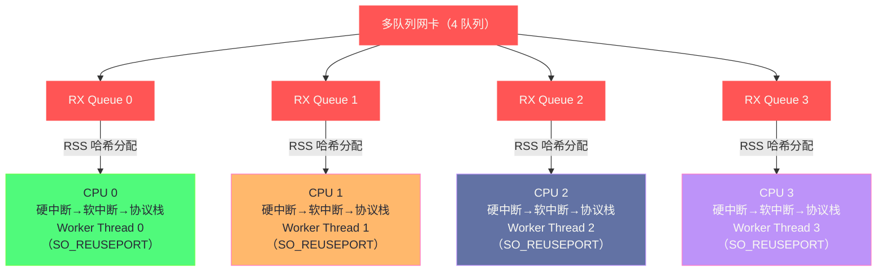

**摘要：**

前面几篇从内核视角解析了网络栈的各层机制。本篇回到工程师最关心的问题：在现代 Linux 上，如何把这些机制组合起来，构建真正的高性能网络服务？三条技术路线值得深入理解。第一，**`io_uring` 的网络扩展**（Linux 5.1+）：继续文件 IO 的思路，用同一套提交队列/完成队列机制统一 `accept`、`connect`、`send`、`recv` 等网络操作，消除每次系统调用的上下文切换开销，并支持将多个网络操作链式组合（`IOSQE_IO_LINK`），单次进入内核完成"接受连接+接收请求+发送响应"的整个会话生命周期。第二，**`SO_REUSEPORT`**（Linux 3.9）：传统模型中多个 worker 进程共享一个 listen socket，`accept()` 竞争内部锁形成瓶颈；`SO_REUSEPORT` 让每个 worker 独立持有监听 socket，内核负责将新连接均衡分发，完全消除锁竞争，Nginx 1.9.1+、Redis 6.0+ 均已采用。第三，**NIC 多队列与 CPU 亲和性**：RSS 在硬件层按连接哈希分队列，RPS/RFS 在软件层补偿无 RSS 能力的虚拟网卡，以及如何将网卡队列中断、软中断处理、应用线程三者绑定到同一 CPU 核，实现端到端的 NUMA 感知网络处理，消除跨 NUMA 的内存访问延迟。

---

## 第 1 章 io_uring 网络操作：从磁盘 IO 到网络 IO 的统一

### 1.1 epoll 的本质局限

前面介绍了 [[04 epoll 深度解析——事件驱动 IO 的内核实现]]，epoll 解决了 select/poll 的 O(n) 扫描问题。但 epoll 模型有一个更深层的限制，通常被忽视：

**每次网络 IO 操作仍然需要独立的系统调用**。

一个典型的高性能服务器接受一个请求并发送响应的流程：

```c
/* epoll + 非阻塞 IO 的标准写法 */
int events_count = epoll_wait(epfd, events, MAX_EVENTS, -1);  /* 系统调用 1 */
for (int i = 0; i < events_count; i++) {
    if (events[i].data.fd == listen_fd) {
        int conn = accept4(listen_fd, NULL, NULL, SOCK_NONBLOCK); /* 系统调用 2 */
        epoll_ctl(epfd, EPOLL_CTL_ADD, conn, &ev);               /* 系统调用 3 */
    } else if (events[i].events & EPOLLIN) {
        recv(events[i].data.fd, buf, sizeof(buf), 0);            /* 系统调用 4 */
        /* 处理请求... */
        send(events[i].data.fd, response, resp_len, 0);          /* 系统调用 5 */
    }
}
```

处理一个完整的"接受→读→写"往返，需要至少 5 次系统调用（`epoll_wait` + `accept` + `epoll_ctl` + `recv` + `send`）。每次系统调用的上下文切换开销约 100~400ns，加上用户/内核态切换时的 TLB 刷新和 CPU 缓存污染，这在高并发场景下积累成明显的 CPU 开销。

在每秒处理 100 万个请求的服务器上：
```
100 万 req/s × 5 次系统调用/req × 300 ns/调用 = 1.5 秒/秒 CPU 时间
```

即 1.5 个 CPU 核心 100% 用于系统调用的上下文切换开销。

### 1.2 io_uring 的网络操作支持

`io_uring`（Linux 5.1，2019 年，Jens Axboe 开发）最初专注于磁盘 IO，但从 5.1 开始逐步加入了网络操作支持。到 Linux 5.19/6.0，网络相关的操作码已经相当完整：

| 操作码 | 对应传统系统调用 | 内核版本 |
|--------|--------------|---------|
| `IORING_OP_ACCEPT` | `accept4()` | 5.5 |
| `IORING_OP_CONNECT` | `connect()` | 5.5 |
| `IORING_OP_RECV` | `recv()` | 5.6 |
| `IORING_OP_SEND` | `send()` | 5.6 |
| `IORING_OP_RECVMSG` | `recvmsg()` | 5.3 |
| `IORING_OP_SENDMSG` | `sendmsg()` | 5.3 |
| `IORING_OP_SHUTDOWN` | `shutdown()` | 5.11 |
| `IORING_OP_SOCKET` | `socket()` | 5.19 |
| `IORING_OP_SEND_ZC` | 零拷贝 `send` | 6.0 |
| `IORING_OP_RECV_MULTISHOT` | 持续接收模式 | 5.20 |

**io_uring 的核心优势——批量提交，减少系统调用次数**：

```c
/* io_uring 处理一次"接受连接 + 读请求 + 发响应"的写法 */
struct io_uring ring;
io_uring_queue_init(256, &ring, 0);

/* 提交 accept 操作（不立即执行，先放入 SQ）*/
struct io_uring_sqe *sqe = io_uring_get_sqe(&ring);
io_uring_prep_accept(sqe, listen_fd, NULL, NULL, SOCK_NONBLOCK);
sqe->user_data = TAG_ACCEPT;

/* 一次 io_uring_submit() 提交所有排队的操作 */
io_uring_submit(&ring);  /* ← 这是唯一的系统调用 */

/* 等待完成事件 */
struct io_uring_cqe *cqe;
io_uring_wait_cqe(&ring, &cqe);  /* ← 也是一次系统调用，但可以等待多个事件 */
/* 处理完成事件... */
```

**更进一步：批量提交多个操作**：

```c
/* 一次性提交 16 个操作，只需 1 次系统调用 */
for (int i = 0; i < 16; i++) {
    struct io_uring_sqe *sqe = io_uring_get_sqe(&ring);
    io_uring_prep_recv(sqe, conns[i], bufs[i], BUF_SIZE, 0);
    sqe->user_data = (uint64_t)conns[i];
}
io_uring_submit(&ring);  /* 1 次系统调用处理 16 个操作 */
```

### 1.3 链式操作（IO Chains）：单次内核往返完成多步操作

`io_uring` 最强大的网络特性之一是**链式操作**（`IOSQE_IO_LINK` 标志）——将多个 SQE 串联成一个原子序列，上一个操作完成后自动触发下一个，**整个链路在内核态完成，无需返回用户态调度**：

```c
/* 场景：接受连接 → 立即读取请求头 → 根据请求头发送响应
   链式操作将这三步串联为一次内核往返 */

/* 步骤 1：accept（设置 IOSQE_IO_LINK 表示"下一步依赖我完成"）*/
struct io_uring_sqe *sqe1 = io_uring_get_sqe(&ring);
io_uring_prep_accept(sqe1, listen_fd, NULL, NULL, SOCK_NONBLOCK);
sqe1->flags |= IOSQE_IO_LINK;    /* ← 链接到下一个操作 */
sqe1->user_data = TAG_ACCEPT;

/* 步骤 2：recv（依赖步骤 1 完成，conn_fd 由步骤 1 的 CQE 结果填入）*/
/* 注意：实际使用中，recv 的 fd 需要通过固定文件表（fixed files）机制处理 */
struct io_uring_sqe *sqe2 = io_uring_get_sqe(&ring);
io_uring_prep_recv(sqe2, FIXED_CONN_FD, read_buf, READ_SIZE, 0);
sqe2->flags |= IOSQE_IO_LINK;    /* ← 继续链接 */
sqe2->user_data = TAG_RECV;

/* 步骤 3：send（依赖步骤 2 完成）*/
struct io_uring_sqe *sqe3 = io_uring_get_sqe(&ring);
io_uring_prep_send(sqe3, FIXED_CONN_FD, resp_buf, resp_len, 0);
sqe3->user_data = TAG_SEND;      /* ← 链的最后一个，不设置 LINK */

/* 一次提交，内核自动按顺序执行这三步 */
io_uring_submit(&ring);
```

**链式操作消除的系统调用次数**：传统模型需要 `accept`（1次）+ `recv`（1次）+ `send`（1次）= 3次独立系统调用；链式操作只需 1 次 `io_uring_submit`，减少了 2 次上下文切换。

### 1.4 SQPOLL 模式的网络应用

当启用 `IORING_SETUP_SQPOLL` 时，内核创建一个专用轮询线程持续检查 SQ（提交队列），应用程序提交操作时完全不需要系统调用（只需写入用户态共享内存即可）：

```c
struct io_uring_params params = {
    .flags = IORING_SETUP_SQPOLL,
    .sq_thread_idle = 2000,  /* 空闲 2000ms 后轮询线程休眠 */
};
io_uring_queue_init_params(256, &ring, &params);

/* 提交网络操作：只需写入 SQ，无系统调用！*/
struct io_uring_sqe *sqe = io_uring_get_sqe(&ring);
io_uring_prep_send(sqe, fd, buf, len, 0);
/* io_uring_submit() 不再需要，内核轮询线程自动看到新 SQE */
io_uring_sqring_wait(&ring);  /* 可选：等待 SQ 有空闲槽位 */
```

**SQPOLL 适用场景**：超高频率的小消息收发（微秒级延迟要求，如高频交易、实时游戏服务器），以牺牲一个 CPU 核心（轮询线程）换取零系统调用开销。

### 1.5 io_uring vs epoll 的选型时机

| 场景 | 推荐方案 | 原因 |
|-----|---------|-----|
| 大量长连接，低消息频率 | epoll | io_uring 优势不明显，epoll 更成熟稳定 |
| 高频小消息（每连接高 QPS）| io_uring | 批量提交减少系统调用，显著降低 CPU |
| 磁盘+网络混合 IO | io_uring | 统一接口，避免 epoll + aio 的双重事件循环 |
| 需要链式操作 | io_uring | epoll 无法实现内核内链式执行 |
| 需要零拷贝发送 | io_uring SEND_ZC | `IORING_OP_SEND_ZC` 消除用户→内核拷贝 |

> [!note] 设计哲学：io_uring 的长期方向
> io_uring 的终极目标是成为 Linux 上所有 IO 操作的统一接口——磁盘、网络、定时器、进程间通信。长期来看，它有可能使 epoll、aio 等专用 IO 接口逐渐边缘化。但截至 2025 年，io_uring 的网络支持仍在快速演进，生产级使用需要选择足够新的内核（推荐 6.0+）和充分的测试。

---

## 第 2 章 SO_REUSEPORT：消除 accept 锁竞争

### 2.1 传统多进程模型的 accept 竞争

经典的多进程服务器模型（如早期 Nginx）是"一个 listen socket，多个 worker"：

```c
/* 父进程 */
int listen_fd = socket(...);
bind(listen_fd, ...);
listen(listen_fd, backlog);

/* fork 多个 worker 进程 */
for (int i = 0; i < num_workers; i++) {
    if (fork() == 0) {
        /* 所有 worker 共享同一个 listen_fd */
        while (1) {
            int conn = accept(listen_fd, ...);  /* 竞争！*/
            handle_connection(conn);
        }
    }
}
```

**惊群问题（Thundering Herd）**：新连接到来时，所有在 `accept()` 阻塞的 worker 都被唤醒，但只有一个能成功接受连接，其余重新阻塞——白白唤醒，浪费 CPU。

Linux 2.6 的 accept 锁机制通过 `accept_mutex`（Nginx 自己实现的互斥锁）部分缓解了惊群，但引入了另一个问题：**序列化的锁竞争成为吞吐量的天花板**。当每秒新建连接数很高时，多个 worker 轮流竞争 accept 锁，同一时刻只有一个 worker 在 accept，无法充分利用多核。

### 2.2 SO_REUSEPORT 的解决思路

`SO_REUSEPORT`（Linux 3.9，Tom Herbert 实现）完全改变了模型——**每个 worker 进程独立创建自己的 listen socket，绑定同一个地址和端口**，内核负责将新连接均衡分发给各个 socket：

```c
/* 每个 worker 自己创建独立的 listen socket */
int listen_fd = socket(AF_INET, SOCK_STREAM, 0);

int reuse = 1;
/* SO_REUSEPORT：允许多个 socket 绑定相同地址:port */
setsockopt(listen_fd, SOL_SOCKET, SO_REUSEPORT, &reuse, sizeof(reuse));

bind(listen_fd, &addr, sizeof(addr));  /* 绑定到同一 IP:port */
listen(listen_fd, backlog);

/* 每个 worker 只操作自己的 listen_fd，完全无竞争 */
while (1) {
    int conn = accept(listen_fd, ...);
    handle_connection(conn);
}
```

**内核的分发机制**：收到新的 SYN 包时，内核使用连接的 4 元组（或随机因子）对所有持有同一 `IP:port` 的 `SO_REUSEPORT` socket 进行哈希，选择一个作为接受者：

```c
/* net/ipv4/inet_hashtables.c 中的 SO_REUSEPORT 分发逻辑 */
/* 对同一 local port 的所有 LISTEN socket，用连接 4 元组哈希选一个 */
static struct sock *inet_lhash2_lookup_reuseport(
    struct net *net, struct inet_hashinfo *hinfo,
    struct sk_buff *skb, int doff,
    const __be32 saddr, const __be16 sport,
    const __be32 daddr, const unsigned short hnum) {

    /* 查找所有绑定到 daddr:hnum 的 LISTEN socket */
    /* 用 (saddr, sport, daddr, hnum) 哈希 → 选择其中一个 */
    return reuseport_select_sock(sk, hash, skb, doff);
}
```

### 2.3 SO_REUSEPORT 的性能收益

**消除了所有锁竞争**：每个 worker 只操作自己的 listen socket，`accept()` 只在本 worker 的 accept 队列中取连接，无需与其他 worker 竞争任何锁。

**连接分发均衡**：内核哈希分发保证连接均匀分配到各个 worker（同一客户端 IP:port 的连接始终路由到同一 worker，天然保证连接的 CPU 局部性）。

**实测性能提升**（Nginx 1.9.1 引入 `SO_REUSEPORT`）：

在 4 核机器上，4 个 Nginx worker 进程：
- 不使用 `SO_REUSEPORT`：峰值约 8.5 万 req/s，CPU 中 accept 锁等待明显
- 使用 `SO_REUSEPORT`：峰值约 12.8 万 req/s，提升约 **50%**，accept 锁等待消失

```nginx
# Nginx 启用 SO_REUSEPORT（nginx.conf）
events {
    worker_connections 65536;
}

http {
    server {
        listen 80 reuseport;  # ← 每个 worker 独立监听，使用 SO_REUSEPORT
        # ...
    }
}
```

```bash
# Redis 6.0+ 启用 SO_REUSEPORT（支持多线程 IO）
# redis.conf
io-threads 4
io-threads-do-reads yes
# Redis 的 IO 线程各自持有独立的事件循环，配合 SO_REUSEPORT 消除 accept 竞争
```

### 2.4 SO_REUSEPORT 的注意事项

**热重载时的连接中断问题**：

传统 `SO_REUSEPORT` 在 Nginx 热重载（`nginx -s reload`）时，旧 worker 的 listen socket 被关闭，此时内核的 `SO_REUSEPORT` 组中减少了一个 socket——少量正在握手（SYN_RCVD 状态）的连接可能被路由到已关闭的 socket，导致连接重置：

```bash
# Linux 4.5 引入了 SO_REUSEPORT_ATTACH_EBPF，通过 eBPF 程序控制分发逻辑
# 可以在热重载时将新连接路由到新 worker，而旧连接继续由旧 worker 处理
# Nginx 1.19+ 使用此机制实现无损热重载
```

**安全考虑**：

同一用户的进程可以监听相同端口（`SO_REUSEPORT` 不需要特权），这可能被恶意进程利用——通过 `SO_REUSEPORT` 绑定到目标服务的端口，劫持部分连接。Linux 通过检查 UID 来限制：同一 `SO_REUSEPORT` 组内的所有 socket 必须属于**同一用户（UID）**，防止跨用户的端口劫持。

---

## 第 3 章 NIC 多队列：从硬件到应用的全栈亲和性

### 3.1 为什么需要全栈 CPU 亲和性

前面介绍了 RSS（网卡硬件哈希分队列）和 NAPI（软中断批量处理）。但有一个更深层的性能问题：即使数据包从网卡到软中断处理都在 CPU 0 上进行，**处理完的数据可能被应用程序的线程（运行在 CPU 3）取走**——这意味着数据从 CPU 0 的 L1/L2 缓存被搬运到 CPU 3，产生缓存失效（Cache Miss）和跨 NUMA 内存访问。

**理想状态**：一个 TCP 连接的数据，从网卡 DMA 写入内存 → 软中断处理 → 应用线程处理，全程都在**同一个 CPU 核心（或同一 NUMA 节点）** 上完成，数据始终在同一份 L1/L2 缓存中，无跨核传输。

### 3.2 RSS：硬件层的连接哈希分队列

**RSS（Receive Side Scaling）** 已在上一篇介绍。关键点：RSS 将不同 TCP 连接分配到不同的 RX 队列，每个队列绑定一个 CPU，**同一连接的所有包始终由同一 CPU 处理**——这是实现全栈 CPU 亲和性的硬件基础。

```bash
# 理想的 RSS 配置：4 核 CPU + 4 队列网卡
# 每个 CPU 核独占一个 RX 队列

# 1. 设置网卡队列数
ethtool -L eth0 combined 4

# 2. 绑定中断到 CPU（每个队列的硬中断绑定到对应 CPU）
# 查看各队列的中断号
cat /proc/interrupts | grep "eth0-TxRx"
# 64: 0 0 0 0  eth0-TxRx-0   → 绑定到 CPU 0
# 65: 0 0 0 0  eth0-TxRx-1   → 绑定到 CPU 1
# 66: 0 0 0 0  eth0-TxRx-2   → 绑定到 CPU 2
# 67: 0 0 0 0  eth0-TxRx-3   → 绑定到 CPU 3

echo 1  > /proc/irq/64/smp_affinity  # 将队列 0 中断绑定到 CPU 0（bitmask=0001）
echo 2  > /proc/irq/65/smp_affinity  # 队列 1 → CPU 1（bitmask=0010）
echo 4  > /proc/irq/66/smp_affinity  # 队列 2 → CPU 2（bitmask=0100）
echo 8  > /proc/irq/67/smp_affinity  # 队列 3 → CPU 3（bitmask=1000）
```

**`irqbalance` 与手动中断绑定的冲突**：

Linux 默认运行 `irqbalance` 守护进程，自动将中断分配到负载最低的 CPU。这与手动中断绑定冲突——`irqbalance` 会覆盖手动配置：

```bash
# 禁用 irqbalance（手动管理中断绑定时必须禁用）
systemctl stop irqbalance
systemctl disable irqbalance
```

### 3.3 RPS：软件模拟 RSS（for 虚拟网卡）

**RPS（Receive Packet Steering，Linux 2.6.35）** 是 RSS 的软件实现版本，专为不支持 RSS 的网卡（包括大多数虚拟网卡：veth、tap、virtio-net 的非多队列模式）设计：

RPS 在 `netif_receive_skb()` 处，用软件哈希（基于包的 4 元组）决定将包分发给哪个 CPU 的处理队列，通过 IPI（Inter-Processor Interrupt，处理器间中断）将包发送到目标 CPU：

```bash
# 查看 RPS 配置（默认关闭，CPU mask 为 0）
cat /sys/class/net/eth0/queues/rx-0/rps_cpus
# 0  ← 未启用（只有当前 CPU 处理）

# 启用 RPS：让所有 4 个 CPU 参与处理（bitmask = 0xf = CPU 0,1,2,3）
echo f > /sys/class/net/eth0/queues/rx-0/rps_cpus

# 为单队列虚拟网卡开启 RPS
echo f > /sys/class/net/veth0/queues/rx-0/rps_cpus
```

**RPS 的代价**：

RPS 通过 IPI 将包传递到另一个 CPU，产生了跨 CPU 的内存访问开销——比 RSS 的硬件分队列效率低，但比单 CPU 处理所有包强得多。

### 3.4 RFS：让应用线程与数据在同一 CPU

**RFS（Receive Flow Steering，Linux 2.6.35，与 RPS 同期）** 解决了 RPS 的一个缺陷：RPS 用哈希分配包到 CPU，但哈希结果与应用线程运行的 CPU 无关——数据可能被分发到 CPU 2 处理，但应用线程运行在 CPU 3，仍然有跨 CPU 的缓存传递。

**RFS 记录每个 TCP 流最近被应用消费的 CPU**，优先将该流的后续包也分发到同一 CPU，使数据处理（软中断）和数据消费（应用线程 `recv()`）在同一 CPU 上发生：

```c
/* RFS 的核心数据结构 */
/* net/core/flow_dissector.c 中维护的每流 CPU 记录 */
struct rps_sock_flow_table {
    u32 mask;                    /* 哈希表大小掩码 */
    u32 ents[0] __aligned(PAGE_SIZE);  /* 每个流的"期望 CPU" */
    /* ents[hash(flow)] = cpu_id */
};

/* 当应用调用 recv() 时，更新该流的期望 CPU */
/* 当包到达时，RFS 查询期望 CPU，将包分发到应用所在的 CPU */
```

```bash
# 配置 RFS 流表大小
echo 32768 > /proc/sys/net/core/rps_sock_flow_entries  # 全局流表大小
echo 4096 > /sys/class/net/eth0/queues/rx-0/rps_flow_cnt  # 每队列流表大小
```

### 3.5 XPS：发送路径的 CPU 亲和性

接收路径有 RSS/RPS/RFS，发送路径对应的是 **XPS（Transmit Packet Steering，Linux 2.6.38）**：

XPS 让特定 CPU 核的发送操作优先使用对应的 TX 队列，避免多个 CPU 竞争同一发送队列（TX 队列锁）：

```bash
# 配置 XPS：CPU 0 使用 TX 队列 0，CPU 1 使用 TX 队列 1
echo 1 > /sys/class/net/eth0/queues/tx-0/xps_cpus  # CPU 0（bitmask=0001）使用 TX 0
echo 2 > /sys/class/net/eth0/queues/tx-1/xps_cpus  # CPU 1（bitmask=0010）使用 TX 1
```

### 3.6 完整的多队列调优方案

将以上所有机制组合，可以实现真正的"每连接单核"模型：



**配合应用程序的 CPU 亲和性**：

```c
/* 将 Worker Thread 绑定到对应的 CPU 核 */
cpu_set_t cpuset;
CPU_ZERO(&cpuset);
CPU_SET(worker_id, &cpuset);  /* Worker 0 → CPU 0，Worker 1 → CPU 1，... */
pthread_setaffinity_np(thread, sizeof(cpu_set_t), &cpuset);
```

当 RSS 将连接 A 的包路由到 CPU 0，而应用程序的 Worker 0 也绑定在 CPU 0，数据从网卡 DMA 到应用处理的整个链路都在 CPU 0 的 L1/L2 缓存中完成，NUMA 感知达到最优。

---

## 第 4 章 NUMA 感知的网络调优

### 4.1 NUMA 架构对网络性能的影响

现代多路服务器（2 路/4 路）采用 NUMA（Non-Uniform Memory Access）架构——每个 CPU 插槽（socket）有自己的本地内存，访问本地内存（~4 ns）比访问远端内存（~40-80 ns）快 10-20 倍。

网卡 DMA 写入的内存位于某个 NUMA 节点（通常是网卡所在 PCIe 总线连接的 CPU socket 的本地内存）。如果处理这些数据的 CPU 线程在另一个 NUMA 节点，每次访问都是远端内存——会显著增加延迟和内存带宽消耗。

```bash
# 查看网卡所属的 NUMA 节点
cat /sys/class/net/eth0/device/numa_node
# 0  ← 网卡连接到 NUMA 节点 0（CPU 0-15 的本地内存）

# 正确做法：只让 NUMA 0 上的 CPU 处理该网卡的中断和软中断
# 将所有 eth0 队列的中断绑定到 NUMA 0 的 CPU（CPU 0-15）
for irq in $(cat /proc/interrupts | grep eth0 | awk '{print $1}' | tr -d ':'); do
    echo ffff > /proc/irq/$irq/smp_affinity  # CPU 0-15 的 bitmask
done

# 将应用线程也绑定到 NUMA 0
numactl --cpunodebind=0 --membind=0 ./my_server
```

### 4.2 网络内存分配的 NUMA 感知

`sk_buff` 的分配（`alloc_skb()`）默认从当前 CPU 的 NUMA 节点分配内存。如果软中断在 CPU 0（NUMA 0），分配的 `sk_buff` 在 NUMA 0 的内存中——这与网卡 DMA 的目标内存一致，避免了跨 NUMA 访问。

但如果应用线程在 NUMA 1 调用 `recv()` 取走 `sk_buff` 数据，就产生了跨 NUMA 的内存读取。**最优模型**：网卡、中断处理、应用线程全部锁定在同一 NUMA 节点。

---

## 第 5 章 综合实战：构建极致高性能的 TCP 服务器

### 5.1 技术选型矩阵

综合前面所有知识，极致高性能 TCP 服务器的技术选择：

| 层次 | 技术选择 | 目标 |
|-----|---------|-----|
| 网卡 | 多队列网卡（ixgbe/mlx5），开启 RSS | 硬件层连接分发，零锁竞争 |
| 中断 | 手动绑定中断到各 NUMA 节点的 CPU | 消除跨 NUMA 中断处理 |
| 驱动层 | NAPI + GRO + 大 Ring Buffer | 批量收包，减少中断，消除 RX 丢包 |
| 协议栈 | RFS 开启，SO_SNDBUF/SO_RCVBUF 不手动设置 | CPU 局部性，Autotuning 自动调整缓冲区 |
| 监听层 | `SO_REUSEPORT` | 消除 accept 锁竞争 |
| IO 模型 | epoll ET 模式（成熟）或 io_uring（5.19+）| 高效事件驱动 |
| 拥塞控制 | BBR + fq | 高 BDP 网络最优吞吐，低延迟 |
| 线程亲和性 | Worker 线程绑定 CPU，与 RSS 队列对应 | 端到端缓存局部性 |

### 5.2 完整的服务器初始化代码

```c
/* 高性能 TCP 服务器的初始化框架 */

/* 1. 创建 listen socket */
int listen_fd = socket(AF_INET, SOCK_STREAM | SOCK_NONBLOCK, 0);

/* 2. SO_REUSEPORT：每个 worker 各自 listen */
int reuse = 1;
setsockopt(listen_fd, SOL_SOCKET, SO_REUSEPORT, &reuse, sizeof(reuse));
setsockopt(listen_fd, SOL_SOCKET, SO_REUSEADDR, &reuse, sizeof(reuse));

/* 3. 增大 listen backlog（避免 accept 队列溢出）*/
bind(listen_fd, &addr, sizeof(addr));
listen(listen_fd, 65535);

/* 4. 关闭 Nagle（如果是交互式协议）*/
int nodelay = 1;
/* 注意：listen_fd 上设置 TCP_NODELAY 对 accept 的新连接无效 */
/* 需要在 accept 返回的 conn_fd 上单独设置 */

/* 5. 创建 epoll 实例（或 io_uring ring）*/
int epfd = epoll_create1(EPOLL_CLOEXEC);
struct epoll_event ev = {
    .events = EPOLLIN | EPOLLET,  /* ET 模式 */
    .data.fd = listen_fd,
};
epoll_ctl(epfd, EPOLL_CTL_ADD, listen_fd, &ev);

/* 6. 绑定当前线程到 CPU（与 RSS 队列对应）*/
cpu_set_t cpuset;
CPU_ZERO(&cpuset);
CPU_SET(worker_id % cpu_count, &cpuset);
pthread_setaffinity_np(pthread_self(), sizeof(cpuset), &cpuset);

/* 7. 事件循环 */
/* ... */
```

---

## 小结

高性能网络编程的三条技术主线，每条都针对一个具体的系统瓶颈：

**`io_uring` 消除系统调用开销**：通过共享内存 SQ/CQ 队列、批量提交、链式操作，将高频网络 IO 的系统调用次数压缩到极限；SQPOLL 模式进一步实现零系统调用，用一个 CPU 核心的轮询换取其他核的系统调用开销。

**`SO_REUSEPORT` 消除 accept 竞争**：每个 worker 独立持有 listen socket，内核哈希分发新连接，彻底消除多 worker 竞争 accept 锁的瓶颈；配合 `eBPF` 实现热重载时的无损连接迁移。

**NIC 多队列 + CPU 亲和性**：RSS/RPS/RFS/XPS 四层机制从硬件到软件建立连接与 CPU 的强绑定关系；配合 NUMA 感知的内存分配和线程亲和性，使一个 TCP 连接的整个生命周期都在同一 CPU 的 L1/L2 缓存中流转，消除跨核和跨 NUMA 的内存访问延迟。

下一篇 [[09 容器网络原理——veth、bridge、iptables 与 eBPF]] 将把视角切换到容器时代：当 Linux 的网络命名空间（Network Namespace）将物理网络"分割"为多个独立的虚拟网络后，容器之间如何通信？veth pair 如何连接两个网络命名空间？Linux bridge 如何实现二层转发？Kubernetes 的 Pod 网络模型（CNI）背后的原理是什么？iptables 和 eBPF/XDP 在容器网络中分别承担什么角色？

---

> [!note] 思考题
> 1. 传统的文件发送路径：read() 将数据从内核 Page Cache 拷贝到用户态缓冲区，write() 再拷贝回内核 Socket 缓冲区——两次多余的拷贝。`sendfile` 直接在内核中从 Page Cache 拷贝到 Socket 缓冲区。如果网卡支持 scatter-gather DMA，还可以消除这次拷贝——数据直接从 Page Cache DMA 到网卡。这种'真零拷贝'的前提条件是什么？
> 2. `splice` 通过管道（pipe）在两个 fd 之间移动数据而不经过用户态。Nginx 使用 splice 将上游响应转发给客户端。splice 与 sendfile 的区别是什么？splice 能在两个 Socket 之间直接转发数据吗？如果可以，它在反向代理场景中的性能优势有多大？
> 3. 用户态协议栈（如 DPDK + F-Stack）完全绕过内核网络栈——在用户态实现 TCP/IP。这消除了系统调用和上下文切换的开销。但也失去了内核协议栈的成熟性和安全性。在什么性能需求下（延迟<Xμs，吞吐>X Gbps）用户态协议栈是必要的？
