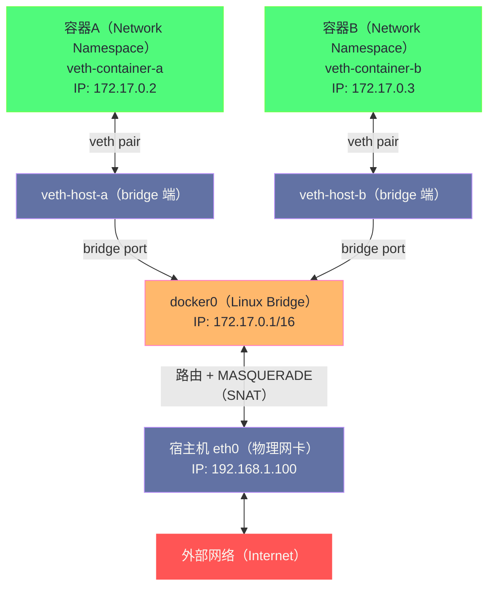
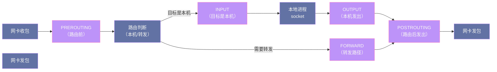
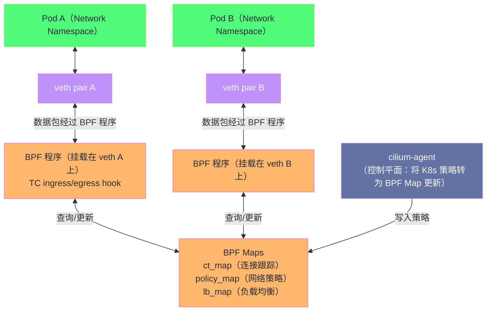

**摘要：**

容器技术的网络隔离依赖 Linux 内核两个基础机制：**Network Namespace**（网络命名空间）将物理网络虚拟化为多个独立的网络视图（每个 namespace 有独立的网卡、路由表、iptables 规则），**veth pair**（虚拟以太网对）则是连接这些隔离网络视图的"虚拟网线"。理解这两者，是理解 Docker、Kubernetes 网络模型的基础。本文从第一性原理出发：一，**Network Namespace** 的隔离边界在哪里——为什么 `ip netns add` 创建出来的 namespace 中什么都没有，连 lo 接口都没有配置？二，**veth pair** 如何工作——为什么它被称为"虚拟网线"而不是"虚拟网卡"，两端的数据是如何传递的？三，**Linux bridge** 如何实现多个 namespace 之间的二层交换——为什么 Docker 的 `docker0` 需要 bridge，而不是直接用 veth 连接容器和宿主机？四，**iptables/Netfilter** 如何实现容器的 NAT、端口映射和网络策略——`DNAT`/`SNAT` 规则的精确执行路径是什么？五，**eBPF/Cilium** 为什么能用来替代 iptables——在万级 Pod 场景下，iptables 规则数量达到数万条时，链遍历的 O(n) 开销是什么量级，以及 eBPF 如何用哈希表实现 O(1) 的流量策略匹配。

---

## 第 1 章 Network Namespace：网络隔离的内核基础

### 1.1 什么是 Network Namespace

**Network Namespace（网络命名空间）** 是 Linux 内核提供的一种隔离机制，它为每个 namespace 维护一套完全独立的网络资源：

- 独立的网络设备（网卡、lo、veth）
- 独立的 IP 地址和路由表
- 独立的 iptables/nftables 规则
- 独立的 `/proc/net/` 下的网络统计信息
- 独立的 socket（一个 namespace 中的进程只能看到本 namespace 内的 socket）
- 独立的端口空间（容器 A 和容器 B 可以各自监听 8080 端口，互不冲突）

**为什么需要这种隔离**：在没有 Network Namespace 之前，服务器上所有进程共享一个网络栈——一个进程监听了 8080 端口，其他进程就无法再监听 8080。容器化的核心诉求之一就是"每个容器有自己的独立网络环境"，Network Namespace 提供了这种内核级的隔离保证。

### 1.2 Network Namespace 的生命周期

```bash
# 创建一个新的 network namespace
ip netns add container1

# 查看 namespace 列表
ip netns list
# container1

# 在 container1 namespace 中执行命令（ip netns exec）
ip netns exec container1 ip link show
# 1: lo: <LOOPBACK> mtu 65536 qdisc noop state DOWN
#     ← 只有 lo（回环）接口，且是 DOWN 状态（未配置）
#     ← 没有 eth0，没有任何物理网卡
```

**新创建的 namespace 为什么什么都没有**：Network Namespace 的设计是完全隔离的——新 namespace 不继承宿主机的任何网络配置。物理网卡、IP 地址、路由表、iptables 规则全都属于宿主机的默认 namespace（`/proc/1/ns/net`），对新 namespace 不可见。这是安全隔离的根本保证——容器进程无法直接访问宿主机的物理网卡。

### 1.3 Network Namespace 在内核中的表示

```c
/* 每个 Network Namespace 对应一个 struct net 实例 */
struct net {
    refcount_t passive;         /* 引用计数（被 netns 持有）*/
    refcount_t count;           /* 引用计数（被 socket、路由等持有）*/

    struct list_head list;      /* 全局 namespace 链表 */

    struct user_namespace *user_ns;  /* 所属的用户命名空间 */
    struct ucounts *ucounts;

    struct ns_common ns;        /* 通用命名空间基类 */
    struct netns_core core;     /* sysctl 参数（如 tcp_rmem）*/
    struct netns_ipv4 ipv4;     /* IPv4 相关状态（路由表、sysctl）*/
    struct netns_ipv6 ipv6;     /* IPv6 相关状态 */
    struct netns_xt xt;         /* iptables/netfilter 状态 */

    /* 每个 namespace 独立的网络设备列表 */
    struct net_device *loopback_dev;   /* lo 接口 */
    /* 其他网络设备通过 net_device->nd_net 绑定到对应的 namespace */
};
```

**`init_net`** 是系统启动时创建的默认 namespace，所有物理网卡、宿主机进程都在 `init_net` 中。Docker 容器创建时，为每个容器分配一个新的 `struct net`。

---

## 第 2 章 veth pair：连接两个 Namespace 的虚拟网线

### 2.1 veth pair 是什么

**veth（Virtual ETHernet）pair** 是 Linux 内核的一种虚拟网络设备，成对出现——一端（`veth0`）发出的数据，会直接出现在另一端（`veth1`）的接收队列，反之亦然。本质上是内核中的一条"软件网线"：

```
veth0 ──────────────── veth1
（容器侧）             （宿主机侧/bridge 侧）

向 veth0 写入的数据包 → 直接出现在 veth1 的 RX 队列
向 veth1 写入的数据包 → 直接出现在 veth0 的 RX 队列
```

**为什么需要 veth pair 而不是其他机制**：

要让两个独立 namespace 中的进程通信，需要一种跨 namespace 的数据传输机制。普通的 socket 不行（socket 在 namespace 内部，无法跨 namespace 传递），文件/管道不行（不是网络设备），只有 veth pair 这种"两端分属不同 namespace 的虚拟网线"才能实现跨 namespace 的网络通信。

### 2.2 创建 veth pair 并连接两个 Namespace

```bash
# 创建一对 veth 设备
ip link add veth-host type veth peer name veth-container

# 此时两个设备都在宿主机默认 namespace
ip link show | grep veth
# 4: veth-container@veth-host: <BROADCAST,MULTICAST> mtu 1500
# 5: veth-host@veth-container: <BROADCAST,MULTICAST> mtu 1500

# 将 veth-container 移入容器的 namespace
ip link set veth-container netns container1

# 现在：
# veth-host    在宿主机 namespace（默认）
# veth-container 在 container1 namespace

# 分配 IP 地址
ip addr add 10.0.0.1/24 dev veth-host              # 宿主机侧
ip netns exec container1 ip addr add 10.0.0.2/24 dev veth-container  # 容器侧

# 启用设备
ip link set veth-host up
ip netns exec container1 ip link set veth-container up
ip netns exec container1 ip link set lo up

# 测试：从宿主机 ping 容器
ping 10.0.0.2
# PING 10.0.0.2: 56 data bytes
# 64 bytes from 10.0.0.2: icmp_seq=1 ttl=64 time=0.05 ms
```

### 2.3 veth 的内核实现

veth pair 在内核中的数据传递非常简单直接：

```c
/* drivers/net/veth.c */
static netdev_tx_t veth_xmit(struct sk_buff *skb, struct net_device *dev) {
    struct veth_priv *rcv_priv, *priv = netdev_priv(dev);
    struct veth_rq *rq = NULL;
    struct net_device *rcv;
    int length = skb->len;

    /* 找到对端设备（peer）*/
    rcv = rcu_dereference(priv->peer);
    if (unlikely(!rcv)) {
        kfree_skb(skb);  /* 对端已销毁，丢弃 */
        return NETDEV_TX_OK;
    }

    /* ★ 核心操作：将 skb 直接"注入"到对端的接收队列 */
    /* 就像对端网卡"收到"了这个数据包 */
    if (likely(veth_forward_skb(rcv, skb, rq, use_napi) == NET_RX_SUCCESS)) {
        /* 成功传递到对端 */
    }
    return NETDEV_TX_OK;
}
```

**关键点**：`veth_xmit()` 没有经过任何物理介质，没有 DMA，没有中断——一端"发送"就是直接调用另一端的 `netif_receive_skb()`（或 NAPI poll），数据包在内核内存中"传送"，延迟极低（通常 < 10µs）。

---

## 第 3 章 Linux Bridge：多容器二层互联

### 3.1 为什么需要 Bridge

如果只有一个容器，用单对 veth 直连宿主机就够了。但如果有多个容器，希望它们相互通信，就需要一个"虚拟交换机"将它们连接起来——这就是 **Linux Bridge** 的角色。

```
没有 Bridge（多容器场景的问题）：

容器A(10.0.0.2) ─── veth-a ─── 宿主机
容器B(10.0.0.3) ─── veth-b ─── 宿主机

容器A → 容器B 的数据：
  经过 veth-a 到宿主机 → 宿主机必须做路由转发 → veth-b → 容器B
  每次容器间通信都经过宿主机的 IP 路由层（三层），效率低

有 Bridge（docker0）：

容器A(10.0.0.2) ─── veth-a ─┐
                              ├─── docker0（bridge）─── 宿主机eth0
容器B(10.0.0.3) ─── veth-b ─┘

容器A → 容器B 的数据：
  在 docker0 这个二层 bridge 内直接 MAC 地址转发
  不经过 IP 路由层，更高效
```

### 3.2 Bridge 的工作原理

Linux Bridge 模拟了一台二层以太网交换机的行为：

**MAC 地址学习**：当一个帧从 `veth-a` 进入 bridge，bridge 记录：帧的源 MAC 地址 → veth-a 端口（MAC 学习表，存储在 `fdb`，即 Forwarding DataBase）。

**帧转发决策**：
- 如果目标 MAC 在 FDB 中有记录 → 单播转发到对应端口
- 如果目标 MAC 不在 FDB → 广播到所有其他端口（flooding）
- 如果目标 MAC 是 bridge 自己的 MAC → 上交给宿主机的 IP 层处理

```bash
# 创建 bridge
ip link add docker0 type bridge
ip addr add 172.17.0.1/16 dev docker0
ip link set docker0 up

# 将 veth 连接到 bridge（将 veth-host 端"插入"bridge）
ip link add veth-host-a type veth peer name veth-container-a
ip link set veth-host-a master docker0    # 将 veth-host-a 加入 bridge
ip link set veth-host-a up

# 查看 bridge 上的接口
bridge link show
# 4: veth-host-a@veth-container-a: <BROADCAST,MULTICAST,UP,LOWER_UP> mtu 1500
#   master docker0 state forwarding priority 32 cost 2

# 查看 bridge 的 MAC 学习表（FDB）
bridge fdb show dev veth-host-a
# 00:00:00:00:00:00 dev veth-host-a master docker0 permanent
# fa:c8:e4:1b:33:d9 dev veth-host-a master docker0  ← 学到的容器 MAC
```

### 3.3 Docker 网络模型的完整架构



**数据流分析**：

**容器 A → 容器 B（同宿主机）**：
```
容器A 的 IP 包（dst=172.17.0.3）
→ veth-container-a 发出 → veth-host-a 收到
→ docker0 bridge 收到帧
→ 查 FDB：目标 MAC 对应 veth-host-b 端口
→ 直接转发到 veth-host-b → veth-container-b → 容器B
（全程二层，不经过宿主机 IP 路由）
```

**容器 A → 外部网络**：
```
容器A 的 IP 包（dst=8.8.8.8）
→ veth pair → docker0 收到
→ docker0 向宿主机 IP 层上交（目标 IP 不在 172.17.0.0/16 网段）
→ 宿主机路由：选择 eth0 出口
→ iptables MASQUERADE（SNAT）：将源 IP 172.17.0.2 替换为宿主机 IP 192.168.1.100
→ eth0 发出
（返回路径：SNAT 连接跟踪表负责将响应包的目标 IP 还原为 172.17.0.2）
```

---

## 第 4 章 iptables 与 Netfilter：容器的 NAT 与策略

### 4.1 Netfilter 的五个钩子

iptables 的底层是 **Netfilter**——Linux 内核中数据包处理路径上的一系列钩子（Hook Points）：



**五个钩子的含义**：

- **PREROUTING**：数据包进入网卡后、路由决策前。DNAT（端口映射）在这里执行——在路由之前修改目标 IP/端口，使路由决策看到修改后的地址。
- **INPUT**：路由决定"目标是本机"后，到达本机 socket 之前。本机防火墙规则（接受/拒绝进入本机的包）在这里执行。
- **FORWARD**：路由决定"需要转发"后。容器间流量策略（NetworkPolicy）在这里执行。
- **OUTPUT**：本机进程发出的包，在路由之后。本机发出的包的 DNAT（如访问负载均衡 VIP）在这里执行。
- **POSTROUTING**：数据包即将从网卡发出之前。SNAT/MASQUERADE（源地址转换）在这里执行——在数据包发出前将内网 IP 改为公网 IP。

### 4.2 Docker 的 iptables 规则

Docker 启动后，会自动在宿主机的 iptables 中添加一系列规则，实现容器的互联和 NAT：

```bash
# 查看 Docker 添加的 iptables 规则
iptables -t nat -L -n --line-numbers

# PREROUTING 链（端口映射的入口）
# Chain PREROUTING (policy ACCEPT)
# 1   DOCKER  all  -- *      *  0.0.0.0/0  0.0.0.0/0  ADDRTYPE match dst-type LOCAL
# ↑ 所有目标是本机的包转到 DOCKER 子链处理

# DOCKER 链（端口映射规则）
# Chain DOCKER (2 references)
# 1   DNAT  tcp  -- !docker0  *  0.0.0.0/0  0.0.0.0/0  tcp dpt:8080 to:172.17.0.2:80
# ↑ 非 docker0 接口进来、目标端口 8080 的包：DNAT 到容器 172.17.0.2:80

# POSTROUTING 链（容器访问外网的 SNAT）
# Chain POSTROUTING (policy ACCEPT)
# 1   MASQUERADE  all  -- *  !docker0  172.17.0.0/16  0.0.0.0/0
# ↑ 从 172.17.0.0/16 出去（非 docker0 接口）的包：MASQUERADE（SNAT 为出口 IP）

# FORWARD 链（容器互访策略）
iptables -t filter -L FORWARD -n
# Chain FORWARD (policy DROP)
# 1  DOCKER-ISOLATION-STAGE-1  all  -- *  *  ...
# 2  DOCKER  all  -- *  docker0  ...
# 3  ACCEPT  all  -- *  docker0  ... ctstate RELATED,ESTABLISHED
# 4  ACCEPT  all  -- docker0  !docker0  ...
# 5  ACCEPT  all  -- docker0  docker0  ...
```

**端口映射（`docker run -p 8080:80`）的完整包处理路径**：

```
外部请求：src=1.2.3.4:54321, dst=宿主机IP:8080

1. PREROUTING → DOCKER 链：
   DNAT：dst 改为 172.17.0.2:80
   → 修改后：dst=172.17.0.2:80
   同时记录连接跟踪表（conntrack）：
   {1.2.3.4:54321 → 宿主机:8080} 对应 {1.2.3.4:54321 → 172.17.0.2:80}

2. 路由决策：
   dst=172.17.0.2 → 不是本机IP → 需要转发（FORWARD 路径）

3. FORWARD 链：
   DOCKER-ISOLATION：检查是否允许此转发
   ACCEPT（满足 Docker 规则）

4. POSTROUTING：
   不触发 MASQUERADE（因为 dst 在 docker0 网络内，走 docker0 接口出去）

5. 数据包经 docker0 bridge → veth → 到达容器A的 80 端口
```

### 4.3 iptables 在大规模场景下的性能问题

iptables 的规则组织是**链式线性遍历**——检查一个包是否匹配某条规则，需要从链头开始逐条比较：

```
性能复杂度：O(n)，n = 链中的规则数量

在 Kubernetes 集群中：
  每个 Service → 约 8-10 条 iptables 规则（KUBE-SVC-xxx、KUBE-SEP-xxx 链）
  100 个 Service × 3 个 Pod 每个 = 约 3000 条规则
  1000 个 Service × 10 个 Pod 每个 = 约 30000 条规则
  10000 个 Service × 5 个 Pod 每个 = 约 150000 条规则

每个请求到来时，iptables 要线性扫描这 150000 条规则 ← 这是灾难级别的性能问题！
```

**测试数据（来自 Kubernetes 官方 Blog）**：
- 1000 个 Service（~8000 条规则）：iptables 规则遍历平均耗时约 **0.5ms/请求**
- 10000 个 Service（~80000 条规则）：**5ms/请求**
- 这还不计算 iptables 规则更新（每次 Pod 增删都需要用 `iptables-restore` 重写整个规则集，串行且慢）

这就是 Kubernetes 大规模集群中 iptables 的瓶颈所在，也是 Cilium 等 eBPF 方案崛起的根本原因。

---

## 第 5 章 eBPF 与 Cilium：下一代容器网络

### 5.1 eBPF 替代 iptables 的核心思路

**eBPF（extended Berkeley Packet Filter）** 是 Linux 内核中的一个通用虚拟机，允许在内核中安全地运行用户编写的程序，而无需修改内核代码或加载内核模块。eBPF 程序可以被挂载到内核的各种钩子点（包括 Netfilter 的所有钩子点），替代传统的 iptables 规则处理数据包。

**关键差异**：

| 特性 | iptables | eBPF（Cilium）|
|-----|---------|--------------|
| 规则查找复杂度 | O(n)（链式遍历）| O(1)（哈希表/LRU 查找）|
| 规则更新 | 需重写整个 iptables（全量替换）| 只更新对应的 BPF Map 条目（增量更新）|
| 连接跟踪 | 依赖内核 conntrack 模块 | 用 BPF Map 实现用户态可控的连接跟踪 |
| 可观测性 | 有限（需要额外工具）| 丰富（BPF perf events、BPF Map 直接暴露指标）|
| 旁路（bypass）能力 | 无 | 可完全绕过 Netfilter，直接在驱动层处理 |

**eBPF 的 O(1) 查找如何实现**：

Cilium 将每个 Service 的策略（"哪些 Pod 可以访问这个 Service"）存储在 **BPF Map**（内核中的哈希表或 LRU 表）中。收到一个数据包时，只需一次哈希查找即可确定策略，不论有多少个 Service，查找复杂度都是 O(1)：

```c
/* Cilium 的 BPF 程序示意：处理进入 Pod 的数据包 */
SEC("classifier/from-container")
int from_container(struct __sk_buff *skb) {
    /* 从数据包提取 5 元组（src IP, dst IP, src port, dst port, proto）*/
    struct ipv4_ct_tuple tuple = {};
    parse_ipv4(skb, &tuple);

    /* O(1) 查找：是否有对应的策略允许/拒绝此连接 */
    struct ct_entry *entry = map_lookup_elem(&cilium_ct4_global, &tuple);

    if (!entry) {
        /* 新连接，查找策略 */
        struct policy_entry *policy = map_lookup_elem(&cilium_policy_map, &tuple.daddr);
        if (!policy || !policy_allows(policy, tuple)) {
            return TC_ACT_SHOT;  /* 丢弃 */
        }
        /* 创建连接跟踪表项 */
        ct_create4(&cilium_ct4_global, &tuple, ...);
    }

    return TC_ACT_OK;  /* 放行 */
}
```

### 5.2 Cilium 的架构

**Cilium** 是基于 eBPF 的 Kubernetes 网络方案（CNI 插件），由 Isovalent 开发，现已成为 CNCF 毕业项目：



**Cilium 的三个核心能力**：

**能力 1：高性能 Service 负载均衡**

Cilium 用 eBPF 实现 Kubernetes Service 的负载均衡（替代 kube-proxy），在数据包发出时直接在内核中做 DNAT，绕过 iptables。10000 个 Service 的查找仍是 O(1)，没有链式遍历。

**能力 2：NetworkPolicy（网络策略）的细粒度执行**

Kubernetes 的 NetworkPolicy 定义"哪些 Pod 可以与哪些 Pod 通信"。传统 iptables 实现需要为每条策略生成大量规则；Cilium 将策略存储在 BPF Map 中，一次哈希查找搞定，支持 L3（IP）、L4（端口）、L7（HTTP 路径、gRPC 方法）三层策略。

**能力 3：透明的网络可观测性**

Cilium 通过 Hubble（基于 BPF perf events）提供流量可视化，可以看到哪个 Pod 向哪个 Pod 发了什么请求，哪条 NetworkPolicy 拒绝了哪个连接——这些信息来自 eBPF 程序的实时遥测，对应用完全透明，无需修改任何应用代码。

### 5.3 Cilium 的 eBPF Datapath：全绕过 Netfilter

Cilium 最激进的优化是在**同宿主机 Pod 间通信**时，完全绕过 Netfilter 和 Linux bridge：

```
传统路径（容器 A → 容器 B，同宿主机）：
  Pod A → veth-a → docker0 bridge → veth-b → Pod B
  + iptables FORWARD 链遍历
  + conntrack 连接跟踪
  + bridge 的 MAC 学习和帧转发

Cilium 的优化路径（全 eBPF）：
  Pod A → veth-a（TC egress BPF 程序）
         → BPF 直接重写目标 MAC/IP，调用 redirect() 到 veth-b
         → Pod B
  完全跳过 bridge 和 iptables，延迟降低约 20-30%
```

这通过 **BPF `redirect()`** 系统调用实现——BPF 程序可以在 TC（Traffic Control）钩子上直接将数据包重定向到目标接口，不经过 Linux 的三层路由和 Netfilter 框架。

---

## 第 6 章 CNI 插件体系：容器网络的标准接口

### 6.1 CNI 是什么

**CNI（Container Network Interface）** 是 CNCF 定义的容器网络插件标准——Kubernetes（和 containerd）在创建 Pod 时，调用 CNI 插件（可执行文件）完成网络配置：创建 veth pair、分配 IP、配置路由、设置 iptables 规则等。

CNI 的接口非常简单：

```bash
# CNI 插件接收环境变量和 stdin JSON，输出网络配置结果

# 添加网络（创建 Pod 时）
CNI_COMMAND=ADD \
CNI_NETNS=/var/run/netns/container1 \
CNI_IFNAME=eth0 \
./flannel < /etc/cni/net.d/10-flannel.conflist

# 删除网络（删除 Pod 时）
CNI_COMMAND=DEL \
CNI_NETNS=/var/run/netns/container1 \
./flannel < /etc/cni/net.d/10-flannel.conflist
```

### 6.2 主流 CNI 插件的实现差异

| CNI 插件 | 网络模型 | 实现技术 | 适用场景 |
|---------|---------|---------|---------|
| **Flannel VXLAN** | Overlay（虚拟隧道）| VXLAN UDP 封装，内核 VXLAN 驱动 | 简单易用，适合中小规模 |
| **Calico** | Underlay（BGP 路由）| BGP 协议分发路由，直接 IP 路由 | 大规模生产，需要 BGP 支持 |
| **Cilium** | Overlay/Underlay + eBPF | eBPF 数据平面，可选 VXLAN 或直接路由 | 高性能 + 网络可观测性 |
| **Weave** | Overlay | VXLAN + 加密，OvS | 需要跨云加密通信 |

**Flannel VXLAN 的跨节点数据路径**：

```
节点1 Pod A (10.244.1.2) → 节点2 Pod B (10.244.2.3)

1. Pod A 发出数据包：dst=10.244.2.3

2. 宿主机路由：
   10.244.2.0/24 via flannel.1 dev flannel.1
   → 发往 flannel.1 虚拟接口（VXLAN 设备）

3. VXLAN 封装（flannel.1 设备处理）：
   内层包：[IP 10.244.1.2 → 10.244.2.3][TCP]
   VXLAN 封装：[UDP src=随机 dst=8472][VXLAN VNI=1]
   外层包：[IP 节点1 → 节点2][UDP 8472]

4. 发往节点2的 eth0

5. 节点2 的 VXLAN 设备解封装
   → 得到内层包：dst=10.244.2.3
   → 路由到 Pod B 的 veth
```

**VXLAN 的开销**：每个数据包额外增加 50 字节的 VXLAN/UDP/IP 头（MTU 有效载荷从 1500 降到 1450），且需要 CPU 参与封装/解封装。对于延迟敏感的应用，Calico 的 BGP 直接路由模式（无封装）是更好的选择。

---

## 小结

容器网络的底层是三层叠加的 Linux 内核机制：

**隔离层（Network Namespace）**：每个容器拥有独立的网络视图，进程无法看到其他容器的网络资源，端口空间完全隔离。

**连接层（veth pair + Linux bridge）**：veth pair 是跨 namespace 的"虚拟网线"，Linux bridge 是多容器共享的"虚拟交换机"，两者配合实现了容器间的二层互联。

**策略层（iptables/eBPF）**：iptables 通过 Netfilter 的五个钩子实现 NAT、端口映射和访问控制，但其 O(n) 的链式遍历在大规模场景下成为瓶颈；eBPF/Cilium 用哈希表实现 O(1) 查找，通过 `redirect()` 绕过 Netfilter 框架，在性能和可观测性两个维度都显著优于传统 iptables 方案。

下一篇 [[10 网络性能诊断——从 ss 到 perf/eBPF 的全套工具链]] 是本专栏的收官之作，将系统梳理网络性能诊断的完整工具链：`ss`/`netstat` 查连接状态，`tcpdump`/`Wireshark` 抓包分析，`perf` 对内核网络函数进行 profiling，以及 BCC/bpftrace 工具集如何用 eBPF 实现实时的、零侵入的网络路径追踪。

---

> [!note] 思考题
> 1. XDP 在网卡驱动层运行 eBPF 程序——在协议栈处理之前对数据包做出决策（通过 XDP_PASS、XDP_DROP、XDP_TX、XDP_REDIRECT）。在 DDoS 防护中，XDP_DROP 可以在最早的阶段丢弃恶意包——比 iptables 快 10 倍以上。XDP 的处理能力（百万 pps 级别）的瓶颈在哪里——是 eBPF 程序的执行速度还是网卡的 DMA 吞吐？
> 2. eBPF 的 TC（Traffic Control）hook 运行在协议栈的入口/出口——比 XDP 晚一些但可以访问 skb（socket buffer）的完整信息。XDP 在 native 模式下不创建 skb——这意味着 XDP 程序无法访问什么信息？在什么场景下必须使用 TC hook 而非 XDP？
> 3. Cilium 使用 eBPF 实现 Kubernetes 的网络策略（NetworkPolicy）和服务发现（替代 kube-proxy 的 iptables 规则）。传统 iptables 的规则数量与 Service 数量线性增长——在 5000+ Service 的集群中性能明显下降。Cilium 的 eBPF map 查找是 O(1)——这对大规模集群的网络性能有什么质的提升？
