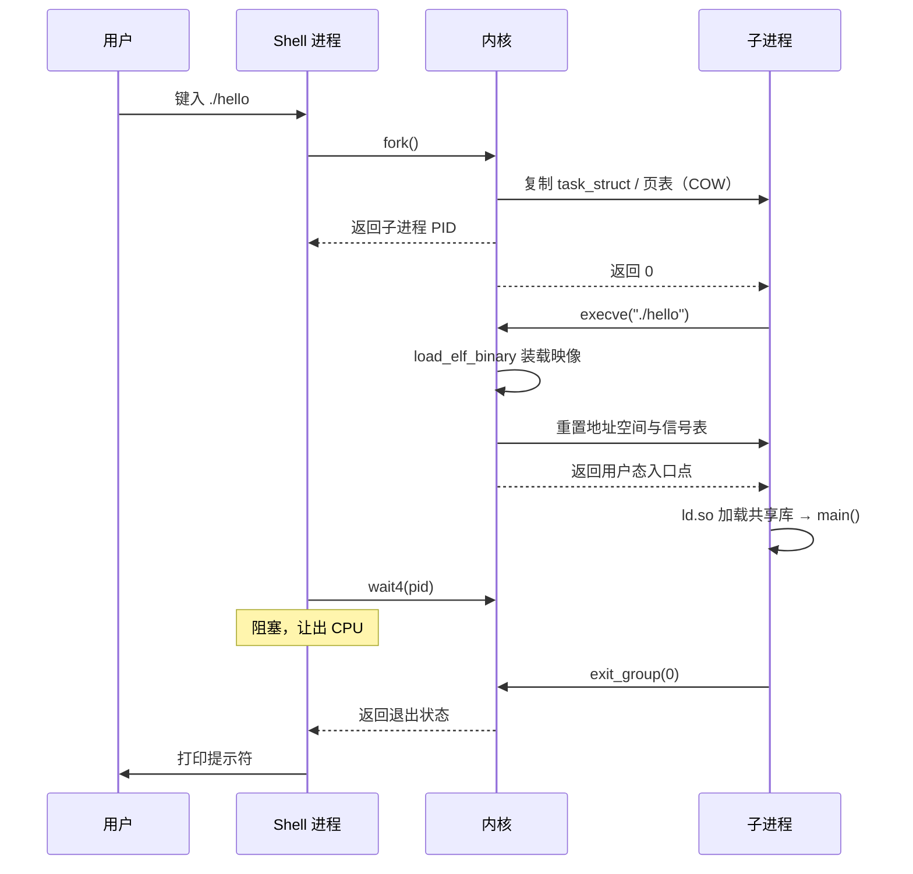
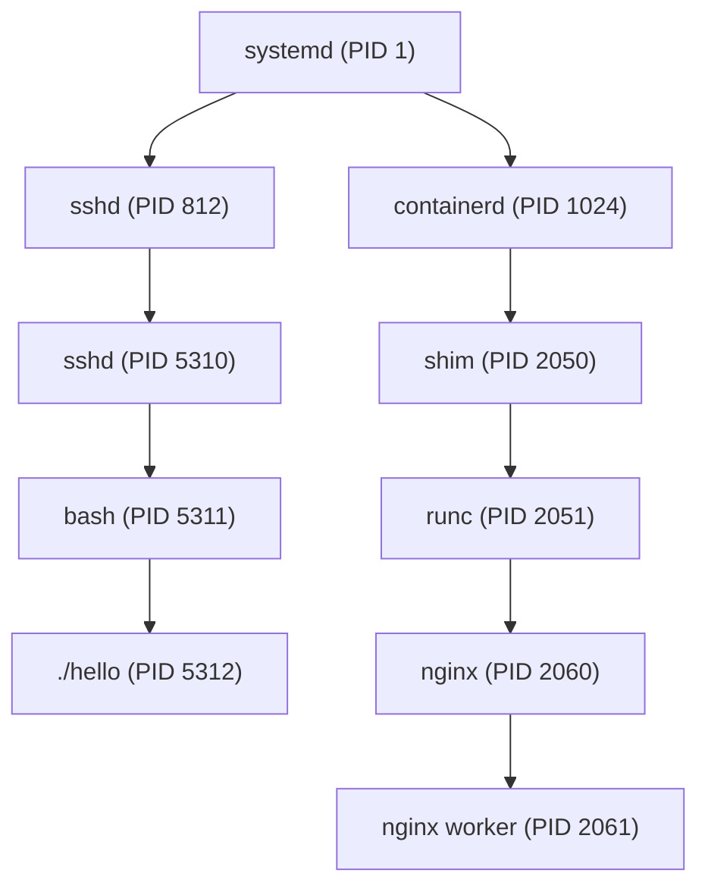

# 01 进程的本质——从程序到进程，操作系统在背后做了什么

**摘要：**

进程这个词被使用得如此频繁，以至于很少有人追问它究竟是一个什么东西。它既不是磁盘上那个可执行文件，也不是 CPU 里正在流动的指令，更不是程序员写下的那几行 `main` 函数——它是内核为了"让多个程序共用一台计算机"而发明出来的一个记账单位。本文从 1950 年代单道批处理的困境说起，追溯进程概念在 Multics 与 Unix 上的成型过程，回答它取代了什么、为什么非要有它不可。随后把进程剖成两半：一半是**资源容器**（地址空间、文件描述符表、凭证、信号处置），另一半是**执行流**（寄存器上下文、内核栈、调度实体），这个二分正是日后线程模型分裂的伏笔。接着进入内核视角，看 `task_struct` 如何用一块 slab 内存承载一个进程的全部身份，看 `./hello` 这样一条命令从 shell 键入到 CPU 取指之间到底发生了什么，看进程如何被组织成树、会话与进程组。最后给出边界：PID 复用、命名空间下的相对视图、以及"进程等于程序的一次运行"这一通俗说法在哪里失效。全文回答两个问题：操作系统为什么需要进程这个抽象，以及这个抽象在内核里长成了什么样子。

---

## 第 1 章 一个被忽略的前提：CPU 为什么需要"进程"

### 1.1 单道批处理：一次只能有一个程序

1950 年代中期的计算机，使用方式与今天的想象相去甚远。程序员把一叠打孔卡片交给操作员，操作员把卡片装进读卡器，机器把整个作业读进内存，从头跑到尾，打印出结果，然后停下来等人换下一叠卡片。这种模式被称为单道批处理（Single-stream Batch Processing），其本质特征不是"慢"，而是**内存里任何时刻只有一个作业**。

那时的机器谈不上"浪费"这个词——CPU 的运算单元在主内存与外设之间来回搬运数据时确实存在空闲周期，但人们没有把它当作一个问题，因为机器的价格以百万美元计，而人的时间相对便宜。真正让单道模式难以为继的，是 I/O 设备与 CPU 之间的速度鸿沟被拉大了：磁带机、磁盘、打印机的物理动作以毫秒计，而 CPU 的运算以微秒计，一个读盘操作足以让处理器闲上几万条指令的时间。既然内存里只有一个作业，这个作业一去读盘，整台机器就只能干等。

### 1.2 多道程序：把空闲时间卖给别人

解决方案在 1960 年代初成型，被称为多道程序设计（Multiprogramming）：内存里同时驻留多个作业，当一个作业因为 I/O 而阻塞时，CPU 立刻切换去执行另一个作业。这个想法在今天看来理所当然，但它在当时引出了一个全新的、此前从未存在的问题——**内存里同时有多个程序在跑，那么"正在运行的程序"这个概念本身，该怎么表达**。

请注意这不仅仅是一个术语问题。在单道模式下，操作系统内部可以用一组全局变量记录"当前作业的代码起始地址、当前数据段边界、当前打开的文件"，因为这些信息永远只有一份。一旦内存里塞进多个作业，这组全局变量就不够用了：甲作业的代码段与乙作业的代码段在不同的位置，甲打开的文件与乙打开的文件必须在系统调用返回时区分开，甲算到一半被切走、回头还要从断点处继续，那么"断点"这个状态也必须逐作业保存。**操作系统被迫发明一个新的数据结构，用来保存"一个程序运行到某一时刻的全部状态"**，这个结构在历史上被称为进程控制块（Process Control Block，PCB），而它代表的那件事物，就是进程。

比喻来说，单道批处理像一间只有一张桌子的办公室，谁进来工作谁就把东西摊在桌上；多道程序则像把一间大办公室隔成许多工位，每个工位必须有自己的抽屉来存放私人物品——因为没有抽屉，你离开工位再回来时，就分不清桌上哪些东西是你的。工位是内存资源，抽屉就是 PCB，而"某个工位正在被使用"这件事，就是进程。需要补充的技术限定是：这个比喻里"隔间"是逻辑上的而非物理上的，所有的工位共用同一块内存条与同一个 CPU，隔离靠的是内核在切换时重新装载寄存器与页表，而不是靠物理隔断。

### 1.3 分时系统与"并发"的诞生

多道批处理解决的是 CPU 利用率问题，作业之间仍然是排队关系，用户提交作业后要等上几小时甚至一天才能拿到结果。1960 年代中期的分时系统（Time-sharing）把这个模型又向前推了一步：既然 CPU 可以在多个作业之间切换，那么切换得足够快、并且给每个用户一小片时间，就能让几十个用户同时坐在终端前，各自感觉自己独占了一台机器。

分时对进程概念提出了更高的要求。批处理时代的切换发生在作业主动发起 I/O 时，属于"自愿让出"；分时系统则必须能够**在作业完全没有配合意愿的情况下强行把它从 CPU 上拿下来**，因为一个死循环的用户程序如果没有被强制剥夺，整台机器上其他几十个人就全都得陪着它等。这要求硬件提供时钟中断（Timer Interrupt），也要求内核在每次中断时能够完整地保存现场、之后再完整地恢复。CTSS（1961）、Multics（1965）、Unix（1969）这一条脉络上的系统，都是在这个背景下把进程从"作业的记账单位"变成了"可被抢占的调度实体"。

### 1.4 反事实：如果没有进程抽象会怎样

不妨设想一个没有进程抽象的操作系统会是什么样子，这个思想实验能帮助我们把进程的必要性看清楚。

第一，**无法安全地运行第三方程序**。没有进程就没有地址空间边界，一个程序里的野指针可以直接改写另一个程序的代码，或者改写内核自身的数据结构。有了进程之后，每个进程拥有独立的虚拟地址空间，野指针最多毁掉自己，内核可以通过页表把它拦住——这正是 [[Linux/内存管理/01 虚拟内存：为什么每个进程都以为自己独占内存]] 所展开的机制。

第二，**无法表达"打开的文件"这个状态**。文件描述符（File Descriptor）表是挂在进程上的，同一份文件被两个进程打开，各自持有各自的偏移量；关掉一个进程的全部文件描述符，是释放它占用资源的必经步骤。

第三，**无法做大粒度的资源计量与限制**。CPU 时间、内存、文件描述符、进程数，这些配额全都要有一个归属主体，cgroup 才能对它们做限制。容器技术的整个地基就建立在此之上——[[云原生/Docker/03 Cgroups 资源限制与控制]] 里的每一条限制，最终都要落到某个具体进程或进程组身上。

第四，也是最容易被忽略的一点：**无法做故障隔离与善后**。一个进程崩溃了，内核知道该回收它占用的全部资源，并通知它的父进程；没有进程这个概念，一个模块的崩溃就是整台机器的崩溃。回想 L5 层的那条命题——出错是必然，可靠系统由"会死会重生"的部件构成——进程正是操作系统层面第一个"会死会重生"的部件。

---

## 第 2 章 程序与进程：静态与动态

### 2.1 程序是磁盘上的一份说明书

一个 ELF 可执行文件（Executable and Linkable Format）在磁盘上的内容，可以粗略地分成三类：指令与只读数据（代码段）、已初始化的全局变量（数据段）、以及一份描述"这些东西该被放到虚拟地址空间的什么位置"的元信息（程序头表）。它是一份说明书，不是一次执行。

说明书这个比喻需要紧跟一个限定：ELF 文件里并不包含"运行到第 137 条指令时寄存器 rbx 是多少"这样的信息，因为这类信息在一次运行结束之后就消失了。说明书只描述初始布局与入口地址，至于执行过程中产生的全部中间状态，必须由另一个东西来承载。

### 2.2 进程是内存中的一次动态实例

当 `execve()` 把这个 ELF 文件装载进内存，并且把 CPU 的控制权交给它的入口点时，说明书就变成了一个活的东西。这个活的东西拥有：

- 一份**独立的虚拟地址空间**，由 `mm_struct` 描述，里面装着代码、数据、堆、栈、共享库映射；
- 一组**寄存器现场**，包括通用寄存器、栈指针、指令指针、以及页表基址寄存器；
- 一个**内核栈**，用于保存系统调用执行期间的内核态调用链；
- 一张**打开文件表**，每一项指向内核里的 `struct file`；
- 一组**凭证**（UID/GID/Capabilities）与**信号处置表**。

这些内容合起来，就是"这个进程此刻是谁、在干什么、能干什么"。其中任何一项被改变，进程的身份都会随之改变——这正是第 4 章 `task_struct` 要承载的东西。

### 2.3 一个程序为什么能同时有多个进程

有了上面的区分，一个初学者常见的困惑就自然解开了：为什么同一个程序可以同时启动多份，而它们互不干扰。

因为进程所承载的运行状态是逐份独立的。三个 `nginx` worker 进程共享同一份磁盘上的二进制文件（内核甚至可以通过 Page Cache 让它们在物理内存里共享同一份代码页），但它们的 `mm_struct` 各不相同、寄存器现场各不相同、打开的文件各不相同。磁盘上的说明书只有一份，照着说明书搭起来的工位却可以有很多个。

| 维度 | 程序（Program） | 进程（Process） |
| :--- | :--- | :--- |
| 存在形态 | 磁盘上的文件 | 内存中的内核数据结构 + 运行上下文 |
| 生命周期 | 从写入磁盘到被删除 | 从 fork 到被 wait 回收 |
| 数量关系 | 一份程序可以对应零个或多个进程 | 一个进程必然对应某份可执行映像 |
| 是否可并发 | 不可并发，只是字节 | 可并发，由调度器分配 CPU |
| 内核中的代表 | 无（内核不跟踪磁盘文件） | `task_struct` |
| 消耗资源 | 仅占磁盘空间 | 占内存、CPU 时间、PID、fd、页表 |

值得强调的是表格最后一行：程序不占 PID，进程才占。这解释了一个生产上常见的现象——磁盘上的可执行文件被替换了，正在运行的进程却依然跑着旧代码。因为 `execve` 之后，进程的虚拟内存已经与磁盘文件脱钩，磁盘上那份说明书再怎么改，也不影响内存里已经搭好的工位。

---

## 第 3 章 进程的双重身份：资源容器与执行流

### 3.1 资源容器：它拥有什么

从内核的角度看，进程首先是一堆资源的持有人。这些资源被 `task_struct` 里的若干指针聚拢在一起：

- `mm` 指向 `mm_struct`，描述地址空间；对内核线程来说这个指针为 `NULL`；
- `files` 指向 `files_struct`，即文件描述符表；
- `fs` 指向 `fs_struct`，记录当前工作目录与根目录；
- `signal` 指向 `signal_struct`，被同一个线程组内的所有执行流共享；
- `sighand` 指向 `sighand_struct`，保存信号处置函数表；
- `nsproxy` 指向 `nsproxy`，聚合了该进程所属的各类命名空间；
- `cred` 指向 `cred`，保存 UID/GID 与 Capabilities。

把这些指针理解为"进程名下的资产清单"并不算牵强，需要补充的限定是：这份清单里的有些条目是可以被多个进程共享的。`fork()` 之后父子进程的 `files_struct` 是各自复制的，但 `execve()` 之后如果调用了 `clone(CLONE_FILES)`，两个执行流就会指向同一张文件描述符表，一方 `close` 一个 fd，另一方立刻也看不到它了。

### 3.2 执行流：它在做什么

进程的另一半身份是"一条正在推进的控制流"。这部分状态包括：

- **寄存器上下文**：在 x86-64 上，切换进程时需要保存的通用寄存器有 16 个左右，加上 `rip`、`rsp`、`rflags` 与段寄存器；
- **内核栈**：每个执行流一份，用于承载系统调用期间的函数调用链，默认大小在 x86-64 上是 16KB（`THREAD_SIZE_ORDER` 为 2，即 4 页）；
- **调度实体**：`sched_entity`，记录 `vruntime` 等调度信息，挂在 CFS 红黑树上；
- **状态字段**：`__state`，描述它此刻是在运行、可中断睡眠还是不可中断睡眠。

执行流这半边身份的关键特征是**可以被挂起与恢复**。内核在时钟中断里把寄存器写进内核栈、把栈指针存进 `task_struct.thread`，下一次调度到这个进程时再从 `thread` 里把栈指针取出来，一路 `ret` 回去，用户态程序根本感知不到自己曾经被中断过。这个机制是分时系统得以成立的技术前提。

### 3.3 双重身份的分裂：线程的雏形

一旦把进程拆成"资源容器"与"执行流"两半，一个自然的问题就浮现出来：这两半必须绑在一起吗。

答案是绑在一起最早是历史的偶然。Unix 诞生时，计算机是为多用户分时设计的，"一个用户一个控制流"是当时的常识，没有人需要在同一个地址空间里跑两条控制流。但随着图形界面、网络服务、数据库这类并发需求的出现，"共享同一份资源、但有多个执行流"的诉求越来越强烈。Linux 给出的解法不是引入一个新的实体，而是**允许执行流有选择地共享资源容器的一部分**——这就是 `clone()` 系统调用 flags 参数的由来，也是第 07 篇要展开的"轻量级进程"模型。

一句话概括：**Linux 里线程不是"更轻的进程"，而是"共享得更多的进程"**。这个设计选择在 1990 年代引发了长达十年的争论，其后果一直延续至今。

### 3.4 切换的代价：为什么不能无限细分

既然执行流可以被挂起与恢复，一个自然的想法是：把时间片切得越细、切换得越频繁，系统的响应就越公平。这个想法在硬件层面会撞上一堵墙。

进程切换（Context Switch）在内核里的实际动作包括：保存当前执行流的通用寄存器到内核栈、把栈指针写入 `task_struct.thread.sp`、调用 `switch_mm()` 切换页表基址寄存器（CR3）、必要时刷新 TLB 或标记 PCID 失效、切换 `gs` 指向的每 CPU 数据、最后从目标 `task_struct.thread.sp` 恢复寄存器并返回。这条路径上最昂贵的不是寄存器保存（那只是几十条指令），而是**页表切换引发的 TLB 失效**与**缓存工作集的破坏**。

TLB（Translation Lookaside Buffer）缓存虚拟地址到物理地址的翻译结果，容量通常只有几百到几千项。切换到一个不同地址空间的进程后，之前那些翻译结果全部失效，新进程的每一次内存访问都要重新走页表遍历（Page Table Walk），在四级页表的 x86-64 上这意味着最多四次串行访存。即使现代 CPU 用 PCID（Process Context Identifier）标记 TLB 条目以避免全量刷新，缓存与分支预测器里残留的数据仍然属于上一个进程，新进程需要的热数据要从内存重新搬进 L1/L2。这次"冷启动"的开销，量级上通常是几微秒。

这个数字单独看不大，但把它乘以每秒数万次切换就不容忽视了——一台调度压力较大的服务器上，`vmstat` 里的 `cs` 列（上下文切换次数）动辄六位数，其中相当一部分 CPU 时间实际消耗在切换本身而非有效工作上。第 08 篇讨论的 CFS 调度延迟参数（`sched_latency` 与 `sched_min_granularity`），正是在"切得够细以保证公平"与"切得太细导致开销失控"之间划出的一条线。

---

## 第 4 章 内核眼中的进程：task_struct

### 4.1 为什么需要一块专门的数据结构

内核需要频繁回答这样一些问题：当前 CPU 上跑的是谁、PID 1234 对应的进程在哪里、这个进程的父进程是谁、它属于哪个用户、它的地址空间在哪里。这些问题的答案不能散落在各处，必须有一个聚合点。

`task_struct` 就是这个聚合点。它的定义在 `include/linux/sched.h` 中，在 Linux 6.x 上约 700 行、包含两百多个字段，是整个内核里最庞大的结构体之一。它对应着 1.2 节所说的 PCB 概念，但 Linux 的实现比教科书上的 PCB 复杂得多——教科书描述的是"一个进程需要保存什么"，而 Linux 的 `task_struct` 还要承担调度、审计、安全、cgroup、调试等一整套子系统的挂载点。

### 4.2 字段分组

把两百多个字段按用途分组，能让这个庞然大物变得可读：

| 字段组 | 代表字段 | 作用 |
| :--- | :--- | :--- |
| 状态与调度 | `__state`、`prio`、`static_prio`、`se`、`rt`、`dl` | 描述此刻是否可运行，以及在哪个调度类的队列里 |
| 身份标识 | `pid`、`tgid`、`comm`、`cred` | 从内核与用户两个视角标识它是谁 |
| 家族关系 | `real_parent`、`parent`、`children`、`sibling` | 构成进程树，决定信号与回收的传递路径 |
| 地址空间 | `mm`、`active_mm` | 描述它能看到的内存 |
| 文件系统视图 | `fs`、`files` | 当前目录与打开的文件 |
| 信号 | `signal`、`sighand`、`pending` | 信号队列与处置函数 |
| 命名空间 | `nsproxy` | 隔离视图的聚合 |
| 内核栈与上下文 | `stack`、`thread` | 内核栈指针与切换时保存的寄存器 |
| 资源与审计 | `utime`、`stime`、`cgroups`、`seccomp` | 计量、限制与安全策略 |

这张表只是骨架，第 02 篇会逐组展开。这里要抓住的是分组背后的组织原则：**`task_struct` 里的绝大多数字段不是"进程自己的数据"，而是"指向某个子系统对象的指针"**。地址空间在 `mm_struct` 里，文件表在 `files_struct` 里，凭证在 `cred` 里，命名空间在 `nsproxy` 里——`task_struct` 更像一本户口本，记录着"这个人住在哪、在哪个单位、属于哪个家庭"，而不是把人本身塞进一本册子里。

这个设计有一个直接的好处：**共享变得廉价**。两个进程要共享文件表，只需要让各自的 `files` 指向同一个 `files_struct` 并把引用计数加一，不必复制上千字节的数据。`clone()` 的各个 `CLONE_*` 标志，本质上就是在选择"哪些指针继续共享、哪些指针复制一份"。

### 4.3 分配方式：slab 与内核栈

`task_struct` 的对象分配走的是 slab 分配器（在 Linux 6.x 上是 SLUB）。`fork()` 的路径中，`dup_task_struct()` 会调用 `alloc_task_struct_node()`，从名为 `task_struct` 的 kmem_cache 里取一个对象。选择 slab 而不是 `kmalloc` 的理由很直接：`task_struct` 尺寸很大且频繁分配释放，为其单独建一个缓冲池可以避免与其它大小的对象互相碎片化，也便于在内核里观察 `/proc/slabinfo` 中 `task_struct` 条目的活跃数量。

与 `task_struct` 一起被分配的还有内核栈。在较新的内核上（x86-64 自 4.9 起），内核栈与 `task_struct` 是两块独立的内存：栈通过 `alloc_thread_stack_node()` 从 vmalloc 区域分配，`task_struct.stack` 指向它。而在更早的实现里，两者被放在同一块连续内存上，`thread_info` 位于栈的底部，内核通过栈指针按位与运算直接算出 `thread_info` 的地址。

**这个改动值得单独说明**，因为它体现了一个典型的架构权衡。旧布局的优势是快：`current` 宏可以在一条指令内算出当前进程（`current_thread_info()` 就是 `stack & ~(THREAD_SIZE-1)`），不需要读额外的内存。旧布局的劣势是安全性：一旦内核栈溢出，写坏的第一样东西就是 `thread_info`，攻击者可以通过覆写它来劫持控制流，这也是 2016 年之后多项内核提权漏洞的利用基础。新布局把 `thread_info` 挪进了 `task_struct` 内部（`THREAD_INFO_IN_TASK`），`current` 改为从 `gs` 段寄存器读取每 CPU 变量，多了一次内存访问，换来的是"栈溢出不再直接摧毁进程身份"这一性质。性能与安全之间的选择从来不是免费的，这里付出的是访存周期，收回的是攻击面。

### 4.4 `thread` 字段：切换时到底保存了什么

`task_struct.thread` 是一个类型为 `thread_struct` 的字段，它保存的不是"进程的完整状态"，而是**切换出这个进程时，CPU 上那些无法从内存中重新推导出来的东西**。这两者之间的区别值得说清楚：通用寄存器属于当前计算过程中的中间值，必须逐字节保存；而程序计数器可以从内核栈上的返回地址推出来，页表基址可以从 `task_struct.mm` 里取出来，所以不需要在 `thread_struct` 里再存一份。

在 x86-64 上，`thread_struct` 里包含 `sp`（内核栈指针）、`fsbase` 与 `gsbase`（用户态 TLS 指针）、浮点与 SIMD 寄存器的保存区（`fpu`）、以及用于硬件断点与 I/O 位图的若干字段。它的语义是"这个执行流上次离开 CPU 时留下的残影"。

切换的最高潮在 `__switch_to()` 这个函数里，它做的事情恰好可以用"两个进程互相交接"来比喻——甲把钥匙串交给乙，同时从乙手里接过乙的钥匙串，整个过程没有第三方在场。技术上的对应是：这个函数被调用的时刻，内核栈已经切换到了新进程的栈上，函数的前半段在旧进程的上下文里执行，后半段在新进程的上下文里执行，中间没有任何"中立地带"。这是内核代码里少数几个必须用汇编精心处理的地方，也是理解进程切换最容易出错的地方。

### 4.5 内核里怎么找到"当前进程"

`current` 宏是内核代码里出现频率最高的符号之一。在 x86-64 的现代实现上，它展开为读取 `gs:current_task`：`gs` 段寄存器在内核态指向每 CPU 数据区，`current_task` 是其中的一个字段，每次进程切换时由 `__switch_to()` 更新。这个间接层让"当前进程"这个问题的答案从"算出来"变成了"读出来"，代价是一次缓存友好的内存访问。

顺便说一句，`current` 在中断上下文里依然有效——它返回的是**被中断的那个进程**，而不是某个特殊的中断线程。这个细节在编写内核代码时至关重要：在软中断里调用 `current` 拿到的是恰好被打断的倒霉进程，而不是发起网络收包的那个进程。

---

## 第 5 章 一次 `./hello` 的旅程

### 5.1 Shell 的角色

在终端里敲下 `./hello` 并回车，看起来是一个动作，在内核里却是一次精心编排的接力。接力棒的第一位选手是 shell，而 shell 的做法出人意料地朴素：它不直接运行 `hello`，而是先把自己复制一份，再让复制出来的那一份去变成 `hello`。

这个"先复制、再变身"的两段式，是 Unix 进程模型的核心设计，可以用换演员来打比方：舞台上原来的演员（shell）退到侧幕，侧幕里站着一个刚被复制出来的替身（子进程），这个替身换上另一套戏服（`execve`）后走上舞台中央，成为新的主角。技术限定是：退到侧幕的 shell 并没有消失，它只是在 `wait4()` 上睡着了，等替身演完（退出）之后，它还要回来收取票根（退出状态）。

### 5.2 第一步：fork 出一个空壳

shell 调用 `fork()`（在 glibc 里最终落到 `clone()`），内核在 `kernel_clone()` 里为子进程准备 `task_struct`、内核栈、并复制父进程的地址空间。地址空间的复制并不搬数据，而是把父进程的页表复制一份、把两边的页表项都标记为只读，只有当其中一方真的写入时，才触发缺页异常去分配新页——这就是写时复制（Copy-on-Write，COW）。

COW 让 `fork()` 的开销从"复制整个进程"降到"复制页表"，在内存占用上是巨大的胜利。但它也埋下了一个至今仍在咬人的隐患：页表的复制本身是 O(进程内存规模) 的，一个占用几十 GB 的进程执行 `fork()`，即使什么都不改，光复制页表就足以造成毫秒级的停顿。第 03 篇会用整整一章讨论 `fork()` 在高内存占用下的代价，以及为什么现代系统更推荐 `posix_spawn()` 或 `vfork()` 的变体。

### 5.3 第二步：execve 换掉灵魂

子进程在 `fork()` 返回后立刻调用 `execve("./hello", argv, envp)`。内核在这个系统调用里做的是彻底的换血：

1. 打开并读取 `./hello`，识别出它是一个 ELF 文件；
2. 销毁调用者原有的地址空间，新建一个 `mm_struct`；
3. 按 ELF 程序头表把各个段映射到新地址空间；
4. 在栈顶布置 `argc/argv/envp/auxv`；
5. 如果是动态链接的程序，把入口点设成动态链接器 `ld-linux-x86-64.so.2`，由它先去加载依赖库，再跳回真正的 `main`；
6. 重置信号处置表（被显式设为 `SIG_IGN` 的除外）、关闭带 `O_CLOEXEC` 标志的文件描述符；
7. 修改 `task_struct` 里的若干身份字段，最后把 CPU 的控制权交还给用户态。

`execve()` 有一个常被忽略的性质：**成功即不返回**。它会用新程序覆盖掉调用者的全部代码，包括调用 `execve` 的那行代码本身。所以只有当它失败时才会返回 -1，这也是为什么常见写法是 `execve(...); perror("execve"); exit(1);`——能走到 `perror` 就说明已经错了。

### 5.4 第三步：程序开始执行

控制权交回用户态之后，CPU 从 ELF 的入口点开始取指。对静态链接的程序，入口点是 `_start`；对动态链接的程序，入口点指向 `ld.so` 的 `_dl_start`。无论哪种情况，用户态的第一段工作都不是执行 `main`，而是搭建 C 运行时的环境：初始化 TLS、设置线程指针、准备栈保护金丝雀、调用全局构造函数（`.init_array` 里的函数指针），最后才调用 `main(argc, argv, envp)`。

从 `main` 返回或被 `exit()` 调用之后，进程进入第 05 篇要讲的退出流程，父进程的 `wait4()` 返回，shell 打印提示符，一个循环闭合。

### 5.5 完整路径上的系统调用清单

把上面这些步骤按系统调用列出来，一条 `./hello` 背后的动作就具体了：

| 阶段 | 主要系统调用 | 关键内核函数 |
| :--- | :--- | :--- |
| 复制自身 | `clone`/`fork` | `kernel_clone` → `copy_process` |
| 建立新映像 | `execve` | `do_execveat_common` → `bprm_execve` |
| 装载可执行文件 | `openat`、`read`、`mmap` | `load_elf_binary` |
| 加载共享库 | `openat`、`mmap`、`mprotect` | `ld.so` + `elf_map` |
| 等待子进程 | `wait4` | `kernel_wait4` → `do_wait` |
| 交付退出状态 | `exit_group` | `do_exit` |



这张时序图里最容易被忽略的是中间那段 `Note over S`：shell 在 `wait4` 上阻塞的这段时间里，CPU 并没有闲置，它被调度给了子进程或其它进程。一个 shell 能同时管理成百上千个子进程而不拖慢系统，靠的正是这种"阻塞即让出"的机制。

### 5.6 文件描述符的继承规则

`fork()` 与 `execve()` 各自有一套资源继承规则，两者的差异是很多线上事故的来源。

`fork()` 之后，父子进程的文件描述符表是复制的，但表项指向的是同一个 `struct file` 对象，这意味着**两边的文件偏移量是共享的**。父进程读走 100 字节之后，子进程接着读会从第 101 字节开始。这一点在父子进程同时读同一个日志文件时会造成难以复现的现象：两边都在读，却都读到了对方跳过的那部分内容。

`execve()` 之后，没有设置 `O_CLOEXEC` 标志的文件描述符会被保留下来，跨越整个程序替换过程。这个"默认保留"行为会导致一个隐蔽的资源泄漏：一个服务进程在启动阶段打开了一个日志文件或 socket，然后调用 `execve()` 拉起子命令，子进程什么都没做，却已经持有了那个 socket。如果父进程此时退出，socket 并不会真正关闭，因为引用计数还不为零，监听端口会一直占着。

现代实践给出的对策是在打开文件时统一加上 `O_CLOEXEC`，并且用 `accept4()`、`socket()` 的 `SOCK_CLOEXEC` 变体替代需要事后 `fcntl(fd, F_SETFD, FD_CLOEXEC)` 的老写法。后者的经典 bug 是 `fork` 与 `fcntl` 之间存在时间窗，多线程程序里另一个线程恰好在此刻 `fork` 并在子进程里 `execve`，就会把尚未标记的文件描述符泄漏出去。`O_CLOEXEC` 的价值在于**把"打开"与"标记"合并成一个原子操作**，窗口因此消失。这也解释了为什么它是在 `open()` 的 flags 里而不是一个独立步骤。

---

## 第 6 章 进程的组织方式

### 6.1 树状结构：从 init 到每一个进程

Linux 里所有进程构成一棵树，根是 PID 为 1 的 `init`（在现代发行版上通常是 systemd）。每个进程的 `real_parent` 指向它的创建者，`children` 链表串起它的所有直接子进程。

这棵树不只是一个学术描述，它决定了三件具体的事情：**信号的传递路径**（终端断开时 `SIGHUP` 沿会话传播）、**资源的回收路径**（父进程退出时子进程被 `init` 收养）、以及**调试与排障的切入点**（`pstree` 能一眼看出某个进程是谁拉起来的）。生产上排查"这个进程到底是被谁启动的"，答案往往就藏在这棵树的分叉点上。



### 6.2 PID 的分配与回收

PID 不是无限资源。它由内核的 `alloc_pid()` 从位图中分配，默认上限是 `/proc/sys/kernel/pid_max` 的取值，在 64 位系统上通常为 32768，可以调高到 4194304。这个上限值的历史变迁本身就说明了问题：早期 16 位 PID 的 32768 上限，在动辄需要几万个并发进程或线程的服务器上早已不够用，内核因此把 `pid_max` 的可用范围扩大到了 `PID_MAX_LIMIT`。

PID 分配采用"循环使用"策略：分配器从上次分配的位置向后找下一个空闲位，绕回到头继续找。这带来一个重要后果——**PID 会被复用**。如果一个进程占用了 PID 1234 然后退出，在 PID 空间被耗尽之前，另一个进程迟早会拿到 1234。于是"记住 PID 稍后再 kill"这种做法存在滑窗风险：滑窗内如果原进程已退出且 PID 被复用，`kill` 就打到别人身上了。Linux 5.3 引入的 `pidfd_open()` 正是为解决这个竞态而设计的——它返回一个指向特定进程的文件描述符，`pidfd_send_signal()` 通过这个 fd 发信号，内核能够检测目标是否还是原来那个进程。

### 6.3 PID 哈希表：O(1) 的查找

内核需要支持"给我 PID 1234 的 task_struct"这个操作，而且这个操作发生在每次 `kill`、`wait4`、`/proc/1234` 访问时，必须足够快。Linux 的做法是维护两张哈希表：`pid_hash` 按 PID 索引，`tgid_hash` 按线程组 ID 索引，二者都是开放链地址法，冲突时用链表串起来。

哈希键不能只用 PID 数字，因为命名空间的存在让同一个 PID 数字在不同命名空间里指向不同进程。因此哈希键是 `(pid_namespace, pid)` 的二元组，查表时用 `find_task_by_vpid()`，它先在当前命名空间里查找，找不到再向父命名空间回溯若干层。这个细节是理解容器里 `ps` 为什么只显示少量进程的关键。

### 6.4 PID 命名空间：一个进程有许多个号码

PID 命名空间（PID Namespace）在 Linux 2.6.24 引入，它让同一个进程在不同层级的命名空间里拥有不同的 PID。宿主机上的 `init` 是 PID 1，而容器里那个长期运行的进程在容器自己的命名空间里也是 PID 1；容器内的 `ps` 只列出属于该命名空间的进程，因此看起来"只有几个进程"，而宿主机上的 `ps` 能同时看到它们全部。这一机制的完整拆解见 [[云原生/Docker/02 Linux Namespace 深度解析]]。

需要留意的是 PID 1 这个位置的特殊性。内核在若干处对 PID 1 做了特判：默认忽略未被显式处理的信号（因为 PID 1 死了整个命名空间就没了），在进程退出时跳过常规的父进程通知路径。这就是容器里的应用如果没有正确处理 `SIGTERM`，`docker stop` 会等满超时再 `SIGKILL` 的原因——信号发出去了，但 PID 1 默认不会因为收到未注册的信号而终止。

### 6.5 进程组、会话与控制终端

树状结构之外，进程还有两套横向的编组方式：

- **进程组（Process Group）**：由 `setpgid()` 设置，同组的进程可以一起接收信号。shell 里的管道 `a | b | c` 会把三个进程放进同一个进程组，按下 Ctrl+C 时终端驱动把 `SIGINT` 发给整个组，三个进程一起死。
- **会话（Session）**：由 `setsid()` 创建，一个会话关联一个控制终端。守护进程的经典写法 `fork()` 之后 `setsid()`，目的就是脱离控制终端，这样终端关闭时它不会被 `SIGHUP` 带走。

这两套编组的存在说明了一件事：**进程之间的关系不止"父子"一种**。父子关系描述的是创建与回收的责任，进程组描述的是信号的广播范围，会话描述的是终端的所有权。三者各自独立，一个进程完全可能与它的父进程不在同一个进程组里——shell 的作业控制（Job Control）正是建立在这种错位之上。

---

## 第 7 章 内核线程与用户进程

### 7.1 没有地址空间的那一半

`task_struct.mm` 为 `NULL` 的执行流，就是内核线程（Kernel Thread）。它们同样被调度、同样有 PID、同样在 `ps` 里可见（用方括号括起来，如 `[kworker/0:1]`），但它们没有用户态地址空间，永远运行在内核态，没有 `argv`，也没有自己的虚拟内存。

内核线程的存在回答了一个设计问题：**那些需要长时间运行、又必须在内核态完成的工作，应该寄生在谁的上下文里**。早期内核倾向于把它们挂在某个用户进程的系统调用里执行，或者放在中断下半部；但一旦这些工作耗时过长，就会污染用户进程的 CPU 时间统计，或者堵塞中断路径。独立出内核线程之后，这些工作有了自己的身份、自己的调度权重、自己的名字，排障时也更容易定位。

### 7.2 内核线程家族

所有内核线程都由 `kthreadd`（PID 2）派生，`kthreadd` 本身由内核在启动早期从 `init` 任务中 `fork` 出来。常见的内核线程可以粗略分成几类：

| 类别 | 典型线程名 | 职责 |
| :--- | :--- | :--- |
| 工作队列 | `kworker/*` | 执行被推迟的内核工作，是最常见的一类 |
| 内存管理 | `kswapd*` | 后台内存回收 |
| 脏页回写 | `flush/*`、`kdmflush` | 把脏页刷回块设备 |
| 设备与文件系统 | `jbd2/*` | ext4 日志提交 |
| 中断线程化 | `irq/*` | 把中断处理搬到线程上下文，便于实时性控制 |
| RCU | `rcu_*` | 读-复制-更新机制的回收 |

`kworker` 之所以在 `ps` 输出里铺天盖地，是因为内核里绝大多数"不适合在中断上下文里做、又需要尽快做"的事情都往工作队列里扔。一个 `kworker` 长时间占用 CPU 超过 90%，往往意味着某个驱动或文件系统有阻塞操作泄漏到了工作队列里。

### 7.3 与用户进程的关系

内核线程给排障带来一个额外的维度：`ps` 输出里那些名字带方括号的条目，它们**不计入任何用户的资源使用**，也无法被 `kill -9` 从用户态杀掉（虽然 `kthread_stop()` 可以从内核模块里请求它们退出）。当你在排查 CPU 使用率时看到大量 `kworker` 占用，问题的根因往往不在用户程序，而在某次 I/O 或内存回收的压力上。这条线索在 [[Linux/系统性能工程实战/02 系统级性能观测：从 proc 到 perf 与 Ftrace]] 里会有更系统的展开。

---

## 第 8 章 /proc：内核暴露的进程视图

### 8.1 伪文件系统的设计

`/proc` 不是磁盘上的目录，它是一个由内核动态生成内容的伪文件系统（procfs）。读取 `/proc/1234/status` 时，内核并没有从任何存储设备上取数据，而是现场调用一组函数把这个进程的 `task_struct` 字段格式化成文本。

这个设计的价值在于**把"查询内核状态"这件事统一到了文件读写接口上**。用户态不需要学习一套新的系统调用，`cat`、`grep`、`awk` 这些已有工具就能直接用；权限控制也可以复用文件的权限位。代价是每次读取都要付出格式化的开销，以及某些文件读出来的内容天然是"瞬间快照"而非一致视图——这一点在排查竞态问题时必须记住。

### 8.2 关键文件解读

| 文件 | 内容 | 排障用途 |
| :--- | :--- | :--- |
| `/proc/[pid]/status` | 人类可读的进程概要 | 看内存、线程数、状态、Capabilities |
| `/proc/[pid]/stat` | 机器可解析的原始字段 | 看 utime/stime、优先级、nice 值 |
| `/proc/[pid]/statm` | 内存页数统计 | 快速对比不同进程的内存占用 |
| `/proc/[pid]/maps` | 虚拟内存区域映射 | 定位共享库地址、查内存泄漏来源 |
| `/proc/[pid]/smaps` | 带详细计数的映射 | 精确计算 RSS 的构成 |
| `/proc/[pid]/fd/` | 打开的文件描述符 | 查文件泄漏、确认 socket 归属 |
| `/proc/[pid]/limits` | 资源限制 | 确认 ulimit 是否生效 |
| `/proc/[pid]/stack` | 内核态调用栈 | 确认进程卡在哪个内核函数上 |
| `/proc/[pid]/wchan` | 睡眠的内核函数名 | 快速识别 D 状态的原因 |
| `/proc/[pid]/cgroup` | 所属 cgroup 路径 | 定位容器归属 |

其中 `/proc/[pid]/stack` 和 `/proc/[pid]/wchan` 是排查 D 状态（不可中断睡眠）的两把钥匙。后者只给一个函数名，前者给出完整调用链但它需要 `CAP_SYS_ADMIN` 或 `ptrace` 权限——生产上通常通过 `cat /proc/[pid]/stack` 配合内核参数 `kernel.perf_event_paranoid` 来使用。

### 8.3 一次实战解读

假设一台机器上出现了一个 CPU 使用率异常升高的进程，我们先把它的关键信息摘出来：

```bash
# 先看状态概要：确认它是在跑还是在等
cat /proc/12345/status | head -n 20
# 输出中的关键几行：
# State:  R (running)          ← 正在消耗 CPU，不是阻塞
# Threads:  16                 ← 线程数量，用于确认是否为多线程进程
# VmRSS:   482304 kB           ← 常驻内存，在预期范围内
# voluntary_ctxt_switches:   38  ← 主动让出次数极少
# nonvoluntary_ctxt_switches: 12 ← 被动抢占也不多

# 再看 CPU 时间构成：区分用户态与内核态
cat /proc/12345/stat | awk '{print "utime="$14" stime="$15}'
# utime 远大于 stime → 热点在用户态代码里，接着上 perf 定位

# 最后看它此刻正在执行什么
cat /proc/12345/wchan; echo
# 输出是函数名，说明进程当前睡在哪个内核函数上
```

顺序上先看 `status` 再上 `perf`，是因为 `perf` 的开销远高于读取 `/proc`，先用廉价手段排除掉"其实在等 I/O"这类误判，能省下大量时间。这正是性能排查里"先观测、后分析"的一般原则。

### 8.4 从 fd 目录反推进程行为

`/proc/[pid]/fd` 目录下的每一个符号链接，都对应进程当前持有的一个文件描述符。`ls -l` 会显示链接指向的真实对象：

```bash
ls -l /proc/12345/fd | head
# lrwx------ 1 root root 64 Sep 19 10:22 0 -> /dev/null
# lrwx------ 1 root root 64 Sep 19 10:22 1 -> /var/log/app.log
# lrwx------ 1 root root 64 Sep 19 10:22 3 -> socket:[184723]
# lr-x------ 1 root root 64 Sep 19 10:22 7 -> /data/config.yaml (deleted)
```

这段输出里有三条线索值得留意。`0 -> /dev/null` 说明这个进程被以守护方式启动，标准输入被丢弃了，它的 `fgets(stdin)` 之类的调用会立刻返回 EOF。`3 -> socket:[184723]` 中的数字是 socket 的 inode 号，配合 `/proc/net/tcp` 可以查出这条连接的对端地址与状态。而末尾带 `(deleted)` 的那一项说明文件已经被删除，但进程还持有它的描述符，磁盘空间因此不会释放——这正是"删了日志文件磁盘却不见缩小"这一经典问题的根因，正确的做法是 `> /proc/12345/fd/7` 把句柄清空，或者重启该进程。

把 `/proc/[pid]/fd` 与 `/proc/[pid]/limits` 放一起看，往往能一次性定位资源类故障：前者的条目数量逼近后者里的 `Max open files`，就说明进程正在接近文件描述符上限，接下来出现的 `Too many open files` 只是一个时间问题。

---

## 第 9 章 设计哲学：从"一切皆文件"到"一切皆 task_struct"

### 9.1 Unix 的抽象遗产

Unix 的设计信条"一切皆文件"（Everything is a file）在进程管理上留下了一个具体的产物：`/proc`。把内核里的运行状态伪装成文件树，使得 `ls`、`cat`、`grep` 这些为文件设计的工具可以顺理成章地成为系统观测工具。这个抽象的成功程度，可以从今天的 `systemd`、`docker`、`kubectl` 都还在依赖 `/proc` 与 `/sys` 这一点上看出来。

但"一切皆文件"也有它的边界。进程不是一个静态对象，它的状态在两次读取之间会变化，把它摊平成文件会丢掉时序信息；信号的投递、进程的等待与唤醒，都是"事件"而非"内容"，无法用读写文件的方式自然表达。因此 Linux 在 `/proc` 之外另外提供了 `eventfd`、`signalfd`、`pidfd`、`epoll` 这一套事件接口。抽象是好的，但**任何抽象都会在某些维度上失配，判断力体现在知道它在哪里失配**。

### 9.2 Linux 的另一个信条

与"一切皆文件"并列的，是 Linux 在进程模型上的选择：**只有一种实体，就是 `task_struct`**。用户进程、内核线程、线程组里的各个执行流，全都是 `task_struct`，区别只在于它们共享了多少资源。

这个选择的收益是结构上的简洁：调度器、信号、`/proc`、审计、cgroup 全都只需要处理一种对象类型，不必像某些系统那样为"进程"与"线程"各写一套逻辑。代价则体现在用户可见的语义上：`ps` 默认显示线程组、`ps -L` 才显示单个执行流；`kill` 一个 PID 默认作用于整个线程组；`getpid()` 返回的是 TGID 而非内核内部的 PID，这些不一致经常让不熟悉这套模型的人困惑。

### 9.3 与 BSD 的路线分岔

与之对照的是 4.4BSD 的路线：进程与线程是两个明确不同的概念，`struct proc` 与 `struct thread` 分开定义，一个进程下有零到多个线程。这条路线的用户可见语义更直观，代价是内核里凡是涉及"执行流"的地方都要处理两套结构。

两条路线没有高下，只有取舍。BSD 模型的表达力更贴合直觉，Linux 模型的实现更紧凑、复用度更高。真正决定成败的往往不是模型本身的优雅程度，而是围绕它建立起来的生态——`fork()` 的语义被 POSIX 固化之后，任何偏离这条路线的新设计都要付出巨大的兼容性代价。

---

## 第 10 章 边界与常见误区

### 10.1 误区一：进程是程序的一次运行

这是教科书的定义，也是大多数场合够用的定义，但它在两个地方会失效。

第一，**一个进程可以不来自任何磁盘程序**。内核线程没有对应的可执行文件；`fork()` 出来的子进程在被 `execve()` 之前，跑的还是父进程的代码；甚至是 `execve()` 之后的进程，它的代码页也可能来自 `memfd` 或匿名映射而非磁盘文件。

第二，**进程的"运行"可以被长时间中断**。一个停在 `SIGSTOP` 上的进程、一个 D 状态卡住的进程，都不在执行任何指令，但依然是进程，依然占着 PID 与内存。

### 10.2 误区二：PID 唯一标识一个进程

在单个命名空间里，PID 在某一时刻唯一，但跨时间不唯一（复用）、跨命名空间也不唯一（同一数字在不同 namespace 里指向不同进程）。容器内部看到 PID 1 的那个进程，在宿主机上的 PID 可能是 32847。要准确指代一个进程，需要 `(pid_namespace, pid)` 这个二元组，或者内核提供的 `pidfd`。

同理，"父进程 PID"这个字段也不能孤立地看：`task_struct` 里同时有 `real_parent` 与 `parent` 两个字段，前者是真正的生物学父亲，后者是信号与回收的责任人。当一个进程被 `ptrace` 跟踪或被 `SIGCHLD` 交给 subreaper 时，两者会分叉。`getppid()` 返回的是后者——这是设计使然，不是 bug。

### 10.3 误区三：进程数越多系统越慢

进程数量本身并不直接决定性能，关键在于它们是否处于可运行状态。几万个全部在 `epoll_wait` 上睡眠的进程，对调度器几乎不构成负担，因为睡眠的进程不在 CFS 红黑树上；相反，只有几十个但全部处于 `TASK_RUNNING` 的进程，就足以让运行队列长度飙升、调度延迟显著上升。这也是为什么现代服务倾向于"少量进程、每个进程内大量异步连接"而不是"一个连接一个进程"。

### 10.4 什么时候需要关心这些细节

日常业务开发不需要关心 `task_struct` 的字段布局，但有三类场景会把这些细节变成必需：

- **排查性能问题时**：D 状态、`wchan`、上下文切换次数这些指标必须能读懂，否则很容易把"等 I/O"误判成"CPU 瓶颈"；
- **做资源隔离时**：容器、cgroup、命名空间的每一条限制都落在进程或进程组上，不理解进程的组织结构就无法理解限制的作用域；
- **写系统级程序时**：`fork()` 与多线程的交互、`execve()` 的资源继承规则、信号处理的异步性，这些都是会直接导致线上事故的坑。

---

## 第 11 章 小结：一个抽象的四十年

回到文章开头的那个问题：操作系统为什么需要进程。答案可以浓缩为一句——**因为它需要给"正在运行的程序"一个可寻址、可计量、可剥夺、可回收的身份**。可寻址是为了在系统调用返回时找得到调用者，可计量是为了分配 CPU 时间与内存配额，可剥夺是为了让分时系统成立，可回收是为了让崩溃不至于扩散。

这个抽象从 1960 年代的多道批处理系统上诞生，经过 Multics 的成型、Unix 的简化、Linux 的重新实现，一直没有本质变化。Linux 的贡献不在于发明了进程，而在于选择了一条特殊的实现路径：**只保留一种内核实体，用"共享多少资源"来表达"是进程还是线程"**。这条路径让内核结构紧凑，代价是用户可见语义上的若干反直觉之处。

由此可见，进程管理这一整块内核子系统，本质上是在回答一个数据库式的问题：**一份运行中的状态，应该被拆成哪些表，表之间如何关联，共享与复制如何取舍**。`task_struct` 是主表，`mm_struct`、`files_struct`、`signal_struct` 是它的卫星表，`fork()` 是一次深拷贝加写时复制，`clone()` 则允许调用者指定浅拷贝的范围。理解了这层数据结构关系，后面九篇文章讨论的每一个机制——从 `fork` 的页表代价到 CFS 的红黑树，从僵尸进程的回收路径到进程间通信的内核中转——都会落在同一张地图上。

---

## 参考资料

1. *Linux Kernel Documentation* — `Documentation/admin-guide/source/process.rst`：进程与线程的内核视图。
2. *Linux Kernel Source* — `include/linux/sched.h`（`task_struct` 定义）、`kernel/fork.c`（`kernel_clone`、`copy_process`、`dup_task_struct`）。
3. *The Linux Programming Interface*, Michael Kerrisk, 2010：第 24-28 章，进程创建、终止与 `/proc` 文件系统的用户态视角。
4. *Advanced Programming in the UNIX Environment*（3rd Edition）, W. Richard Stevens, 2013：第 7-8 章，进程环境与进程控制。
5. *Operating Systems: Three Easy Pieces*, Remzi H. Arpaci-Dusseau, 2018：第 4-6 章，进程抽象与直接执行模型的教学化推导。
6. *Understanding the Linux Kernel*（3rd Edition）, Daniel P. Bovet, 2005：第 3 章，进程描述符与内核栈的早期实现（THREAD_INFO_IN_TASK 之前的布局）。
7. *A Narrative History of the Origins of Unix*, Dennis M. Ritchie, 1988：分时系统与进程概念的历史脉络。
8. *proc(5) manual page*：`/proc/[pid]/` 下各文件的字段定义与权限要求。

---

> [!note] 思考题
> 1. 如果把 `task_struct` 里所有的指针字段都改成内联结构体（直接嵌入而非指向），内核在实现 `clone(CLONE_FILES)` 时会遇到什么困难？
> 2. `fork()` 之后父子进程的凭证（`cred`）指向同一个对象，此时子进程调用 `setuid()`，父进程会受影响吗？内核是如何处理这个问题的？
> 3. 一个进程在 `TASK_RUNNING` 状态下的 `wchan` 输出为 0，而在 `TASK_INTERRUPTIBLE` 状态下输出为函数名，这个差异背后的实现依据是什么？
> 4. 为什么内核选择让 `kworker` 线程在 `ps` 输出中默认可见，而不是像某些系统那样把它隐藏起来？