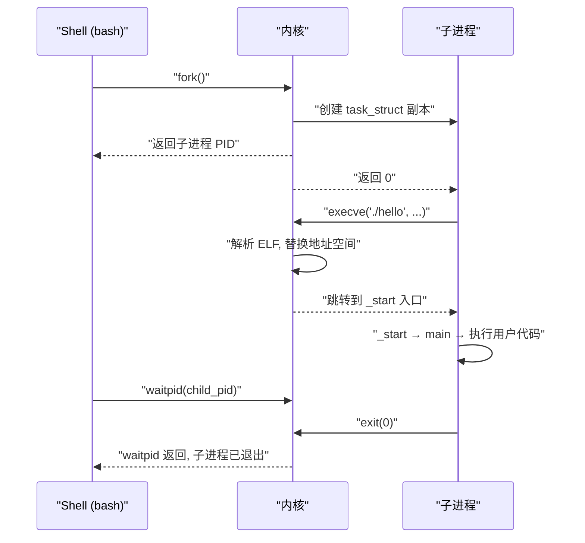

# 01 进程的本质——从程序到进程，操作系统在背后做了什么

**摘要：**

"进程"是操作系统中被提及最多、却也最容易被浅层理解的概念。很多人止步于"进程是运行中的程序"这句话，但这句话既不精确，也无法帮助你理解内核的真实行为。本文从"如果没有进程的概念会怎样"出发，剖析操作系统为什么需要发明进程这个抽象，进程在内核中的真实表示形式（`task_struct`），进程作为"资源容器"和"执行流"的双重身份，以及从一个 `./hello` 命令敲下到进程真正运行起来，内核在背后完成的所有工作。最终，你将建立起对 Linux 进程模型的系统性认知，为后续深入 fork、exec、调度器等主题打下坚实地基。

---

## 第 1 章 没有"进程"概念的世界

### 1.1 批处理时代：一次只能跑一个程序

要理解进程为什么存在，最有效的方式是回到它诞生之前的世界。

1950 年代的计算机是极其昂贵的设备，一台 IBM 704 的价格超过 200 万美元（按今天的购买力换算超过 2000 万美元）。这些机器采用**批处理（Batch Processing）**模式工作：操作员把一叠穿孔卡片（每张卡片就是一条指令或一行数据）送入读卡机，计算机从头到尾执行完这批作业，然后打印结果，再装入下一批卡片。

在这种模式下，不存在"进程"的概念，因为根本不需要。整台机器在任意时刻只执行一个程序，这个程序独占所有硬件资源——CPU、内存、I/O 设备。程序直接操作物理内存地址，直接控制磁带机和打印机。没有并发，没有隔离，也不需要资源管理。

但问题很快暴露出来：CPU 极其昂贵，而 I/O 操作（读穿孔卡片、写磁带）极其缓慢。当程序等待 I/O 时，CPU 完全空闲。统计数据显示，早期批处理系统的 CPU 利用率通常不到 20%——一台价值数百万美元的机器，80% 的时间在"发呆"。

### 1.2 多道程序设计：从一个到多个

为了提高 CPU 利用率，工程师们提出了一个关键思想：**多道程序设计（Multiprogramming）**。核心逻辑很直接——既然程序 A 在等待 I/O 时 CPU 闲着，为什么不让 CPU 去执行程序 B？

要实现多道程序设计，内存中必须同时驻留多个程序。当程序 A 发出一个 I/O 请求后，操作系统把 CPU 切换到程序 B 继续执行；等 A 的 I/O 完成后，操作系统可以在某个合适的时机把 CPU 切回给 A。

这个想法听起来简单，但它引发了一系列连锁问题：

**问题一：如何记录每个程序的执行状态？** 当 CPU 从程序 A 切换到程序 B 时，A 的寄存器值、程序计数器（PC）、栈指针（SP）都必须被保存下来，以便将来恢复执行。这些信息存在哪里？用什么数据结构来组织？

**问题二：如何保护各个程序的内存空间？** 程序 A 和程序 B 同时驻留在内存中，如果 A 可以随意读写 B 的内存区域（或者更可怕的，修改操作系统自身的代码），系统就彻底失控了。

**问题三：如何分配和管理硬件资源？** 两个程序都想使用打印机，谁先谁后？一个程序打开了文件，切换到另一个程序后，这个文件句柄应该属于谁？

**问题四：如何公平地分配 CPU 时间？** 如果程序 B 是一个死循环，它会永远占着 CPU，程序 A 永远得不到执行机会。

这些问题的共同本质是：操作系统需要一种**抽象**来描述"一个正在执行的程序实例"——它的代码是什么、当前执行到哪里了、它占用了哪些资源、它现在是运行状态还是等待状态。

这个抽象，就是**进程（Process）**。

### 1.3 进程抽象的诞生

"进程"这个术语最早出现在 1960 年代 MIT 的 Multics 项目中（Multics 是 Unix 的精神前身）。Multics 团队需要一个精确的术语来描述"系统中一个受控的、被追踪的活动单元"，他们在"task""job""process"等候选词中选择了 process。

> [!note] 设计哲学
> 进程抽象的本质是**关注点分离（Separation of Concerns）**。程序员只需关心自己的代码逻辑，不需要知道物理内存的布局、不需要知道有多少个程序在同时运行、不需要手动保存和恢复寄存器。所有这些脏活累活，都由操作系统通过进程抽象来完成。这种"让复杂性下沉到系统层"的设计思想，贯穿了整个操作系统的发展史。

从 Multics 到 Unix，从 Unix 到 Linux，进程的基本含义一直很稳定：**进程是操作系统进行资源分配和调度的基本单位。** 但这句教科书定义过于抽象，我们需要把它拆开来理解。

---

## 第 2 章 程序与进程：静态与动态

### 2.1 程序：磁盘上的静态蓝图

一个程序（Program）是一组指令和数据的集合，以文件形式存储在磁盘上。当你用 `gcc -o hello hello.c` 编译一个 C 源文件时，生成的 `hello` 就是一个程序。

在 Linux 上，可执行程序通常采用 **[[ELF]]（Executable and Linkable Format）**格式。用 `file` 命令可以查看：

```bash
$ file /bin/ls
/bin/ls: ELF 64-bit LSB pie executable, x86-64, version 1 (SYSV),
dynamically linked, interpreter /lib64/ld-linux-x86-64.so.2, ...
```

一个 ELF 文件内部包含：

- **代码段（.text）**：CPU 要执行的机器指令
- **数据段（.data）**：已初始化的全局变量和静态变量
- **BSS 段（.bss）**：未初始化的全局变量（在文件中不占空间，加载时分配并清零）
- **只读数据段（.rodata）**：字符串常量等
- **符号表、重定位表**等辅助信息

关键要理解的是：程序是**静态的、被动的**。它只是一个文件，就像一张建筑蓝图——蓝图本身不是建筑，它只描述了建筑应该长什么样。程序躺在磁盘上，不消耗 CPU 时间，不占用内存页帧（除了磁盘空间），不持有任何系统资源。

### 2.2 进程：内存中的动态实例

当你在 Shell 中输入 `./hello` 并按下回车，操作系统会基于 `hello` 这个程序文件，创建一个**进程**。这个过程涉及一系列复杂的内核操作（后续文章会详细拆解），但结果是：

- 内核分配了一块内存空间（[[虚拟地址空间]]），把 ELF 文件中的代码段、数据段映射到这个空间中
- 内核创建了一个 `task_struct` 数据结构来记录这个进程的所有信息
- 内核为这个进程分配了一个唯一的 PID（Process ID）
- 内核为它建立了文件描述符表（默认继承父进程的 stdin/stdout/stderr）
- 内核把这个进程放入就绪队列，等待调度器分配 CPU 时间

现在，进程是**动态的、主动的**。它有自己的地址空间、有自己的执行上下文（寄存器状态、程序计数器）、持有系统资源（内存、文件句柄、网络连接等）。它是蓝图变成了真实建筑，是剧本变成了正在演出的戏剧。

### 2.3 一个程序可以有多个进程

程序和进程是一对多的关系。同一个 `hello` 程序文件，可以被同时运行三次，产生三个独立的进程。这三个进程的代码完全相同（它们从同一个 ELF 文件加载），但各自有独立的地址空间、独立的执行状态、独立的 PID。进程 A 中的全局变量被修改了，不影响进程 B 和进程 C 中的同名变量——因为它们在不同的 [[虚拟地址空间]] 中。

```bash
# 启动三个 hello 进程
$ ./hello &
[1] 12345
$ ./hello &
[2] 12346
$ ./hello &
[3] 12347
```

此时 `ps` 可以看到三个独立的进程，共享同一个可执行文件，但 PID、内存映射、运行状态各不相同。

> [!info] 核心概念
> 进程不等于程序。进程是程序的一次**运行时实例**。一个程序可以对应零个进程（没有人运行它）、一个进程（运行了一次）或多个进程（运行了多次）。反过来，一个进程在生命周期内也可能执行不同的程序（通过 `exec()` 系统调用替换自身的代码，详见第 04 篇）。

---

## 第 3 章 进程的双重身份：资源容器与执行流

### 3.1 资源容器：进程拥有什么

进程的第一重身份是**资源容器（Resource Container）**。操作系统以进程为单位来分配和管理资源。一个进程拥有的资源包括：

| 资源类型 | 具体内容 | 内核数据结构 |
|---------|---------|-------------|
| 地址空间 | 代码段、数据段、堆、栈、内存映射区 | `mm_struct` |
| 文件描述符 | 打开的文件、管道、Socket | `files_struct` |
| 信号处理 | 信号处理函数、信号掩码、待处理信号 | `signal_struct`, `sighand_struct` |
| 进程凭证 | UID、GID、capabilities | `cred` |
| 命名空间 | PID 命名空间、网络命名空间、挂载命名空间 | `nsproxy` |
| cgroup 绑定 | CPU 限额、内存限额、I/O 限额 | `css_set` |

当进程终止时，操作系统需要**回收**所有这些资源：释放物理内存页帧、关闭打开的文件描述符、释放网络端口、清理 IPC 对象。遗漏任何一项都可能导致资源泄漏。

为什么操作系统选择进程作为资源分配的单位？因为进程之间天然隔离——进程 A 无法直接访问进程 B 的内存（除非通过显式的 [[进程间通信]] 机制），进程 A 打开的文件描述符 5 和进程 B 打开的文件描述符 5 可能指向完全不同的文件。这种隔离性是安全性和稳定性的基石：一个进程崩溃了，不会连带其他进程一起崩溃（除非它们之间有特殊的依赖关系）。

### 3.2 执行流：进程在做什么

进程的第二重身份是**执行流（Execution Flow）**。一个进程在任意时刻都有一个确定的"执行状态"——它正在执行哪条指令、寄存器中存了什么值、栈上有哪些函数调用帧。

这些信息被统称为**进程上下文（Process Context）**，包括：

- **CPU 寄存器状态**：通用寄存器（rax, rbx, rcx, ...）、指令指针（rip）、栈指针（rsp）、标志寄存器（rflags）等
- **内核栈**：进程陷入内核态时使用的栈
- **用户栈**：进程在用户态运行时使用的栈
- **浮点寄存器和 SIMD 寄存器**（如果使用了浮点运算或向量指令）

当操作系统需要将 CPU 从进程 A 切换到进程 B 时（这就是**上下文切换，Context Switch**），必须：

1. **保存** A 的 CPU 寄存器到 A 的 `task_struct` 中
2. **恢复** B 的 CPU 寄存器从 B 的 `task_struct` 中
3. **切换**页表基址寄存器（x86 上是 CR3），从 A 的地址空间切到 B 的地址空间
4. 刷新相关的 [[TLB]] 缓存（或者使用 PCID/ASID 来避免全量刷新）

上下文切换的代价并不便宜。一次上下文切换在现代 x86 硬件上大约需要 1-5 微秒，这还不包括切换后由于缓存失效（L1/L2 cache、TLB cache）带来的间接性能损耗。这也是为什么高性能系统（如 DPDK、SPDK）试图绕开内核进程调度，通过用户态轮询来避免上下文切换开销的原因。

### 3.3 两重身份的分离：引出线程

在早期的 Unix 系统中，进程的两重身份是紧密捆绑的：一个进程 = 一套资源 + 一条执行流。但实际工程中经常出现这样的需求：多条执行流需要共享同一套资源（比如一个 Web 服务器需要多个执行流来并发处理请求，但它们共享同一个地址空间、同一组打开的文件描述符）。

如果每条执行流都是一个独立进程，那么它们各自有独立的地址空间，数据共享只能通过 IPC（管道、共享内存等），这既低效又复杂。

**线程（Thread）**的出现，就是为了解耦这两重身份：多个线程共享同一个进程的资源（地址空间、文件描述符等），但各自有独立的执行流（独立的程序计数器、独立的栈、独立的寄存器状态）。

> [!warning] 生产避坑
> 在 Linux 的实现中，线程和进程的边界比教科书描述的模糊得多。Linux 没有为线程单独实现一套机制，而是把线程实现为"共享某些资源的进程"——它们都用 `task_struct` 表示，都通过 `clone()` 系统调用创建，只是 `clone()` 的 flags 参数决定了哪些资源是共享的、哪些是独立的。这是 Linux 独特的"一切皆 task"的设计哲学，详见第 07 篇。

---

## 第 4 章 进程在内核中的真实面貌：task_struct

### 4.1 task_struct 是什么

在 Linux 内核中，每个进程（以及每个线程）都由一个 `struct task_struct` 来描述。这个结构体定义在 `include/linux/sched.h` 中，是内核中最庞大、最核心的数据结构之一。在 Linux 6.x 内核中，`task_struct` 大约有 **800 多个字段**，占用约 **6-8KB** 的内存。

为什么需要这么一个庞大的结构体？因为内核需要追踪一个进程的方方面面：

- 进程在什么状态？（运行中？等待 I/O？已退出？）
- 进程的 PID 是什么？它的父进程是谁？
- 进程的地址空间长什么样？
- 进程打开了哪些文件？
- 进程注册了哪些信号处理函数？
- 进程的调度优先级是多少？已经运行了多长时间？
- 进程属于哪个用户？有哪些权限？
- 进程属于哪个 cgroup？CPU 和内存配额是多少？

所有这些信息，都直接或间接地存储在 `task_struct` 中。可以说，**`task_struct` 就是内核对进程的完整认知**。内核不关心你的程序逻辑是什么，它只通过 `task_struct` 来认识你。

### 4.2 task_struct 的核心字段速览

虽然 `task_struct` 有数百个字段，但初始认知阶段只需关注以下核心字段（详细拆解在第 02 篇）：

```c
struct task_struct {
    // ---- 进程状态 ----
    unsigned int            __state;        // 当前状态：TASK_RUNNING, TASK_INTERRUPTIBLE, ...

    // ---- 进程标识 ----
    pid_t                   pid;            // 进程 ID（在命名空间内唯一）
    pid_t                   tgid;           // 线程组 ID（对应用户空间的 getpid() 返回值）

    // ---- 进程关系 ----
    struct task_struct      *parent;        // 父进程
    struct list_head        children;       // 子进程链表
    struct list_head        sibling;        // 兄弟进程链表

    // ---- 地址空间 ----
    struct mm_struct        *mm;            // 指向进程的内存描述符（内核线程此字段为 NULL）

    // ---- 文件系统 ----
    struct files_struct     *files;         // 打开的文件描述符表
    struct fs_struct        *fs;            // 文件系统信息（当前目录、根目录）

    // ---- 信号 ----
    struct signal_struct    *signal;        // 信号相关信息
    struct sighand_struct   *sighand;       // 信号处理函数表

    // ---- 调度 ----
    int                     prio;           // 动态优先级
    int                     static_prio;    // 静态优先级（由 nice 值决定）
    const struct sched_class *sched_class;  // 所属调度类（CFS、RT、DEADLINE...）
    struct sched_entity     se;             // CFS 调度实体（包含 vruntime）

    // ---- 凭证 ----
    const struct cred       *cred;          // 进程的用户身份和权限

    // ---- 进程名 ----
    char                    comm[TASK_COMM_LEN]; // 进程名（最长 16 字节）

    // ... 还有数百个字段
};
```

注意几个要点：

**`pid` 与 `tgid` 的区别**：这是 Linux 独有的设计。在 Linux 中，每个线程都有自己的 `pid`（内核级别的唯一标识），但同一个线程组（即传统意义上的"一个进程的所有线程"）共享同一个 `tgid`。用户空间调用 `getpid()` 返回的实际上是 `tgid`，而 `gettid()` 返回的才是真正的 `pid`。这就是为什么在 `top` 中看到的 PID 和在 `/proc` 中看到的 `tid` 可能不同。

**`mm` 字段**：指向 `mm_struct`，后者描述了进程的完整虚拟地址空间。如果两个 `task_struct` 的 `mm` 指向同一个 `mm_struct`，说明它们共享地址空间——也就是说，它们是同一个进程的不同线程。内核线程（如 kworker、ksoftirqd 等）的 `mm` 字段为 NULL，因为它们运行在内核空间，不需要用户态地址空间。

**`files` 字段**：指向 `files_struct`，包含了进程的文件描述符表。每个打开的文件描述符对应表中的一个条目。如果两个 `task_struct` 的 `files` 指向同一个 `files_struct`，说明它们共享文件描述符表——`clone()` 时传入 `CLONE_FILES` 标志就会产生这种效果。

### 4.3 task_struct 的分配：slab 分配器

内核频繁地创建和销毁进程（`fork` / `exit`），因此 `task_struct` 的内存分配必须高效。Linux 使用 **slab 分配器（Slab Allocator）** 来管理 `task_struct` 的分配。

slab 分配器的核心思想是**对象池（Object Pool）**：预先分配一批与 `task_struct` 大小相同的内存块，放入一个池中。当需要创建新进程时，从池中取一个空闲块；进程销毁时，把块还回池中。这避免了每次创建/销毁进程都要调用通用内存分配器（`kmalloc`）的开销。

```c
// 内核启动时创建 task_struct 的 slab 缓存
static struct kmem_cache *task_struct_cachep;

void __init fork_init(void)
{
    task_struct_cachep = kmem_cache_create("task_struct",
        arch_task_struct_size, /* size */
        L1_CACHE_BYTES,       /* alignment */
        SLAB_PANIC | SLAB_ACCOUNT,
        NULL);
}
```

> [!info] 核心概念
> slab 分配器不仅用于 `task_struct`，内核中所有频繁分配/释放的固定大小对象都用 slab 管理，比如 `inode`、`dentry`、`file` 等。你可以通过 `cat /proc/slabinfo` 或 `slabtop` 命令查看系统中各个 slab 缓存的使用情况。`task_struct` 对应的缓存名称就是 "task_struct"。

### 4.4 task_struct 与内核栈

每个进程不仅有一个 `task_struct`，还有一个**内核栈（Kernel Stack）**。当进程通过系统调用或中断陷入内核态时，使用的就是这个内核栈（而不是用户态的栈）。

在 x86-64 上，内核栈的大小默认是 **16KB**（4 个内存页）。`task_struct` 和内核栈之间通过 `struct thread_info` 关联起来。在较新的内核版本中，`thread_info` 被直接嵌入到 `task_struct` 的开头：

```c
struct task_struct {
    struct thread_info thread_info;  // 嵌入在 task_struct 开头
    // ...
};
```

内核栈底部（低地址端）存放了一个指向 `task_struct` 的指针，这样内核代码在任何时候都可以通过当前栈指针快速找到当前进程的 `task_struct`。这就是 `current` 宏的工作原理——在 x86-64 上，`current` 通过 per-CPU 变量直接获取当前 CPU 上运行的 `task_struct` 指针，时间复杂度 O(1)。

```c
// 获取当前进程的 task_struct
struct task_struct *p = current;
printk("Current process: %s, PID: %d\n", p->comm, p->pid);
```

---

## 第 5 章 从 ./hello 到进程运行：完整流程

### 5.1 Shell 的角色

当你在终端输入 `./hello` 并按下回车，首先响应的不是内核，而是 **Shell**（如 bash、zsh）。Shell 本身就是一个进程，它的工作是解析你输入的命令，然后执行。

Shell 解析到 `./hello` 后，会执行以下操作：

1. 调用 `fork()` 创建一个子进程
2. 子进程调用 `execve("./hello", ...)` 将自身替换为 `hello` 程序
3. 父进程（Shell）调用 `waitpid()` 等待子进程结束

这个 fork-exec 模式是 Unix 进程模型的基石，后续第 03 篇和第 04 篇会详细拆解。

### 5.2 fork()：复制一个进程

`fork()` 系统调用会创建一个新的进程（子进程），这个子进程几乎是父进程的完整拷贝：

- **复制 `task_struct`**：内核从 slab 缓存中分配一个新的 `task_struct`，把父进程的字段大部分复制过来，然后修改 PID、PPID 等字段
- **复制地址空间**：通过 Copy-on-Write 机制，子进程与父进程共享物理内存页帧，只有当某一方尝试写入时才真正复制
- **复制文件描述符表**：子进程获得父进程文件描述符表的副本，但底层指向的 `file` 对象是共享的
- **设置进程关系**：子进程的 `parent` 指针指向父进程，父进程的 `children` 链表中增加子进程

`fork()` 的一个独特特性是：它被调用一次，但返回两次——在父进程中返回子进程的 PID，在子进程中返回 0。

```c
pid_t pid = fork();
if (pid == 0) {
    // 子进程
    printf("I am child, PID=%d\n", getpid());
} else if (pid > 0) {
    // 父进程
    printf("I am parent, child PID=%d\n", pid);
} else {
    // fork 失败
    perror("fork");
}
```

### 5.3 execve()：灵魂替换

`fork()` 创建了子进程，但此时子进程还在执行 Shell 的代码。要让子进程运行 `hello` 程序，需要调用 `execve()`。

`execve()` 的工作是**替换当前进程的地址空间**：

1. 内核打开 `./hello` 文件，读取 ELF 头部
2. 释放当前进程的地址空间（代码段、数据段、堆、栈全部丢弃）
3. 根据 ELF 文件创建新的地址空间：映射代码段、数据段、BSS 段
4. 设置新的程序入口地址（ELF 头中的 `e_entry` 字段）
5. 如果是动态链接的程序，将控制权先交给动态链接器 `ld-linux.so`

注意 `execve()` **不会创建新进程**——PID 不变、`task_struct` 不变、进程的父子关系不变。它只是把进程内部的"灵魂"（代码和数据）替换掉了。这也是为什么 `execve()` 成功后不会返回（因为调用它的代码已经被替换了），只有失败时才返回 -1。

### 5.4 进程开始执行

经过 fork + exec 之后，子进程已经变成了 `hello` 程序。内核调度器在某个时刻选中这个进程，将它放到 CPU 上执行。CPU 从 ELF 的入口地址开始执行（对于 C 程序，通常是 `_start` → `__libc_start_main` → `main`）。



### 5.5 完整流程中涉及的系统调用

把上面的流程用系统调用的视角总结一下：

| 步骤 | 系统调用 | 执行者 | 作用 |
|------|---------|--------|------|
| 1 | `fork()` | Shell | 创建子进程 |
| 2 | `execve()` | 子进程 | 加载并执行 hello 程序 |
| 3 | `waitpid()` | Shell | 等待子进程退出 |
| 4 | `exit()` | 子进程 | 进程终止，释放资源 |
| 5 | `waitpid()` 返回 | Shell | 收割子进程状态，避免僵尸进程 |

这四个系统调用（fork、exec、wait、exit）构成了 Unix 进程模型的四个基石。后续三篇文章将分别深入拆解它们的内核实现。

---

## 第 6 章 进程的组织方式

### 6.1 进程链表

内核需要能够遍历系统中的所有进程。为此，所有 `task_struct` 通过一个双向循环链表连接在一起。链表头是 `init_task`（PID 为 1 的 init 进程，也就是 [[systemd]] 的内核表示）。

```c
// 遍历所有进程
struct task_struct *p;
for_each_process(p) {
    printk("%s [%d]\n", p->comm, p->pid);
}
```

`for_each_process` 宏实际上就是沿着 `task_struct` 中的 `tasks` 链表字段遍历。

### 6.2 进程树

除了线性链表之外，进程之间还通过**父子关系**形成一棵树。每个进程的 `parent` 字段指向它的父进程，`children` 链表连接它的所有子进程。这棵树的根节点是 PID 1（init/systemd）。

```bash
# pstree 命令可视化进程树
$ pstree -p
systemd(1)─┬─sshd(1234)───sshd(5678)───bash(5679)───vim(5680)
            ├─cron(456)
            ├─rsyslogd(789)
            └─...
```

这棵进程树不仅仅是一个展示结构，它有实际的语义意义：

- **信号传播**：向一个进程组发送信号时，信号会传递给组内所有进程
- **资源继承**：子进程默认继承父进程的环境变量、文件描述符、信号掩码等
- **孤儿收养**：当父进程退出时，它的子进程会被 init 进程（PID 1）收养，确保每个进程都有父进程
- **僵尸清理**：父进程通过 `wait()` 读取子进程的退出状态，否则子进程会变成僵尸进程

### 6.3 PID 哈希表

当内核需要根据 PID 快速找到对应的 `task_struct` 时（比如处理 `kill(pid, sig)` 系统调用），遍历整个进程链表效率太低（O(n)）。为此，内核维护了一个 **PID 哈希表**，可以在 O(1) 时间复杂度内完成 PID 到 `task_struct` 的查找。

在支持 PID 命名空间（PID Namespace）的内核中，PID 的管理更加复杂——同一个进程在不同的命名空间中可以有不同的 PID。这是容器技术（如 [[Docker]]）实现进程隔离的基础。

### 6.4 进程组与会话

Unix 系统还引入了**进程组（Process Group）**和**会话（Session）**两个概念来管理进程的层次关系：

- **进程组**：一组相关联的进程。Shell 中一条管道命令（如 `cat file | grep pattern | wc -l`）中的所有进程属于同一个进程组。进程组的 ID（PGID）等于组长进程的 PID。
- **会话**：一组相关联的进程组。通常对应一个终端登录会话。会话中有一个**前台进程组**（接收终端输入）和若干**后台进程组**。

```bash
# 查看进程的 PID、PGID、SID
$ ps -o pid,pgid,sid,cmd
  PID  PGID   SID CMD
 5679  5679  5679 bash
 5680  5680  5679 vim
```

进程组的主要用途是**作业控制（Job Control）**。当你在 Shell 中按 Ctrl+C 时，信号 SIGINT 会发送给前台进程组的所有进程，而不仅仅是某一个进程。这就是为什么 `cat file | grep pattern` 中按 Ctrl+C 可以同时终止 `cat` 和 `grep`。

---

## 第 7 章 内核线程与用户进程

### 7.1 用户进程

到目前为止我们讨论的都是用户进程——由用户空间程序创建、运行用户空间代码的进程。用户进程有完整的虚拟地址空间（`mm` 字段非 NULL），运行在用户态（Ring 3），通过系统调用进入内核态。

### 7.2 内核线程

除了用户进程之外，Linux 内核自身也需要一些"后台工作线程"来执行周期性任务。这些线程被称为**内核线程（Kernel Thread）**，它们的特点是：

- **没有用户态地址空间**：`task_struct` 的 `mm` 字段为 NULL
- **只运行在内核态**（Ring 0）
- **只执行内核代码**，不加载任何用户程序
- 在 `ps` 输出中以**方括号**标识

```bash
$ ps aux | head -20
USER       PID %CPU %MEM    VSZ   RSS TTY   STAT START   TIME COMMAND
root         1  0.0  0.1  16912  8564 ?     Ss   Mar01   0:03 /sbin/init
root         2  0.0  0.0      0     0 ?     S    Mar01   0:00 [kthreadd]
root         3  0.0  0.0      0     0 ?     I<   Mar01   0:00 [rcu_gp]
root         4  0.0  0.0      0     0 ?     I<   Mar01   0:00 [rcu_par_gp]
root         9  0.0  0.0      0     0 ?     I<   Mar01   0:00 [mm_percpu_wq]
root        10  0.0  0.0      0     0 ?     I    Mar01   0:12 [ksoftirqd/0]
root        11  0.0  0.0      0     0 ?     I    Mar01   1:23 [rcu_sched]
```

常见的内核线程包括：

| 内核线程 | 职责 |
|---------|------|
| `kthreadd` (PID 2) | 所有内核线程的父进程，负责创建新的内核线程 |
| `ksoftirqd/N` | 处理软中断（softirq），每个 CPU 核心一个 |
| `kworker/N:M` | 工作队列（workqueue）线程，执行延迟工作 |
| `kswapd` | 内存回收守护线程，负责在内存紧张时回收页帧 |
| `jbd2/sdaN-8` | ext4 文件系统的日志线程 |
| `migration/N` | 进程迁移线程，负责在 CPU 核心之间迁移进程 |

内核线程通过 `kthread_create()` 或 `kthread_run()` 创建，底层也是调用 `kernel_clone()`（即 `fork` 的内核实现），只不过传入的标志包含 `CLONE_KTHREAD`，标记这是一个内核线程。

> [!info] 核心概念
> 内核线程虽然没有用户态地址空间，但它仍然是一个 `task_struct`，仍然参与内核调度器的调度。当内核线程被调度执行时，它"借用"上一个运行的用户进程的内核页表映射（因为所有进程的内核空间映射是相同的）。这就是 `task_struct` 中 `active_mm` 字段的用途——它记录了内核线程当前借用的 `mm_struct`。

---

## 第 8 章 /proc 文件系统：窥探进程的窗口

### 8.1 /proc 的本质

`/proc` 是 Linux 提供的一个**伪文件系统（Pseudo Filesystem）**——它不对应磁盘上的真实文件，而是内核数据结构的一个接口。`/proc` 下的每个目录和文件都是由内核动态生成的，读取它们实际上是在查询内核数据结构。

对于进程管理来说，`/proc` 中最重要的子目录是 `/proc/[pid]/`，每个进程都有一个以其 PID 命名的目录。

### 8.2 关键文件解读

```bash
# 以 PID 12345 为例
$ ls /proc/12345/
attr/    cgroup   cmdline  comm    environ  exe     fd/
maps     mem      mountinfo ns/     oom_adj  root    sched
stat     statm    status   task/   wchan    ...
```

| 文件/目录 | 内容 | 对应的 task_struct 字段 |
|-----------|------|----------------------|
| `status` | 进程状态的可读摘要 | `__state`, `pid`, `tgid`, `mm`, `cred` 等 |
| `stat` | 进程状态的紧凑格式（供程序解析） | 同上 |
| `cmdline` | 进程的命令行参数 | 从进程地址空间读取 |
| `comm` | 进程名（最长 16 字符） | `comm[TASK_COMM_LEN]` |
| `maps` | 进程的虚拟内存映射 | `mm_struct` → `vm_area_struct` 链表 |
| `fd/` | 打开的文件描述符（符号链接） | `files_struct` |
| `task/` | 进程中的所有线程 | 线程组中的所有 `task_struct` |
| `exe` | 指向可执行文件的符号链接 | `mm_struct` → `exe_file` |
| `environ` | 环境变量 | 从进程地址空间读取 |
| `cgroup` | cgroup 绑定信息 | `css_set` |

### 8.3 实战示例

查看进程状态的详细信息：

```bash
$ cat /proc/12345/status
Name:   nginx
Umask:  0022
State:  S (sleeping)
Tgid:   12345
Ngid:   0
Pid:    12345
PPid:   1
TracerPid:      0
Uid:    33      33      33      33
Gid:    33      33      33      33
FDSize: 128
Groups: 33
VmPeak:   105432 kB
VmSize:    98760 kB
VmRSS:     12340 kB
VmData:     8192 kB
VmStk:       132 kB
VmExe:      1024 kB
VmLib:      5678 kB
Threads:        4
voluntary_ctxt_switches:   1234567
nonvoluntary_ctxt_switches:  56789
```

几个关键字段的解读：

- **State: S (sleeping)**：进程当前处于可中断睡眠状态
- **Tgid 与 Pid**：这里两者相同，说明是线程组的主线程
- **VmRSS**：Resident Set Size，进程实际占用的物理内存（12MB）
- **Threads: 4**：该进程有 4 个线程
- **voluntary_ctxt_switches / nonvoluntary_ctxt_switches**：自愿/非自愿上下文切换次数，非自愿切换多说明 CPU 竞争激烈

> [!warning] 生产避坑
> 在排查生产问题时，`/proc/[pid]/` 是最直接的信息源。但要注意：读取 `/proc` 的某些文件（如 `maps`、`smaps`）可能会短暂阻塞目标进程（因为需要获取 `mmap_lock`），在高负载系统上要谨慎。另外，如果进程处于 D 状态（不可中断睡眠），读取其 `/proc/[pid]/` 下的某些文件也可能卡住。

---

## 第 9 章 进程模型的设计哲学

### 9.1 Unix 的极简哲学："一切皆进程"

Unix 的进程模型之所以经久不衰，核心在于它的极简设计：

1. **fork + exec 分离**：创建进程和加载程序是两个独立的操作，这为 Shell 的 I/O 重定向、管道等功能提供了极大的灵活性。如果创建进程和加载程序是一个原子操作（如 Windows 的 `CreateProcess`），就无法在 fork 之后、exec 之前修改文件描述符。

2. **进程是资源的唯一容器**：不需要额外的"资源组"或"资源域"概念（虽然后来 cgroup 和 namespace 扩展了这个模型）。

3. **父子关系形成清晰的层次结构**：每个进程都有明确的来源，便于资源追踪和清理。

### 9.2 Linux 的扩展："一切皆 task_struct"

Linux 在 Unix 的基础上做了一个关键的扩展：**线程和进程在内核中使用完全相同的数据结构（`task_struct`）和管理机制**。区别仅在于 `clone()` 时传入的标志位不同。

这个设计决策最初由 Linus Torvalds 在 1990 年代做出，当时学术界和业界的主流做法是为线程单独设计一套轻量级的数据结构和调度机制。Linus 的理由是：线程和进程的需求高度重叠，为它们维护两套代码是不必要的复杂性。事实证明这个决策是明智的——Linux 的线程实现（NPTL）性能优异，复杂度也保持在可控范围内。

### 9.3 现代演进：容器与 namespace

传统的进程模型假设所有进程共享同一个全局视图——相同的 PID 空间、相同的文件系统层次、相同的网络栈。但容器化时代需要更强的隔离能力。

Linux namespace 机制通过让不同的进程组看到不同的系统视图来实现隔离：

| Namespace 类型 | 隔离的资源 | 创建标志 |
|---------------|-----------|---------|
| PID namespace | 进程 ID 空间 | `CLONE_NEWPID` |
| Mount namespace | 文件系统挂载点 | `CLONE_NEWNS` |
| Network namespace | 网络栈、IP 地址、端口 | `CLONE_NEWNET` |
| UTS namespace | 主机名、域名 | `CLONE_NEWUTS` |
| IPC namespace | System V IPC、POSIX 消息队列 | `CLONE_NEWIPC` |
| User namespace | 用户和组 ID 映射 | `CLONE_NEWUSER` |
| Cgroup namespace | Cgroup 根目录 | `CLONE_NEWCGROUP` |

这些 namespace 全部通过 `task_struct` 中的 `nsproxy` 字段来关联。当 `clone()` 或 `unshare()` 传入相应的 `CLONE_NEW*` 标志时，内核会创建新的 namespace 并把子进程（或当前进程）加入其中。

[[Docker]] 和 [[Kubernetes]] 等容器技术正是构建在 namespace + cgroup 这两个内核机制之上。容器不是虚拟机，它不需要一个独立的内核——容器中的进程和宿主机上的进程共享同一个 Linux 内核，只是它们的 `nsproxy` 指向不同的 namespace 实例，看到的系统视图不同而已。

---

## 第 10 章 总结与后续

本文建立了对 Linux 进程的基础认知框架：

1. **进程的本质**：操作系统为了解决多程序并发执行带来的资源管理、隔离保护等问题而发明的抽象
2. **程序 vs 进程**：程序是静态文件，进程是动态运行实例，一对多关系
3. **进程的双重身份**：资源容器（拥有地址空间、文件描述符等）+ 执行流（有确定的执行状态）
4. **task_struct**：内核对进程的完整描述，包含数百个字段
5. **fork-exec-wait-exit**：Unix 进程模型的四个基石操作
6. **进程的组织**：链表、树、哈希表、进程组、会话
7. **内核线程**：没有用户态地址空间的特殊 task_struct
8. **/proc 文件系统**：观察和调试进程的首要窗口

下一篇文章将深入 `task_struct` 的内部，逐字段拆解这个庞大数据结构的设计逻辑和工程细节。

---

> [!note] 思考题
> 1. Linux 内核不区分进程和线程——都用 `task_struct` 表示。线程（通过 `clone(CLONE_VM | CLONE_FS | CLONE_FILES)` 创建）与父进程共享地址空间和文件描述符表。进程（通过 `fork()` / `clone()` 不带这些标志创建）有独立的资源。`pthread_create` 底层调用 `clone` 时传递了哪些标志？Go 的 goroutine 与 Linux 线程是什么关系？
> 2. `task_struct` 包含了进程的所有信息——调度优先级、内存描述符、文件描述符表、信号处理等。一个 `task_struct` 约占 6-8KB 内存。在一个有 10000 个线程的 Java 应用中，仅 `task_struct` 就占用约 80MB 内存。加上每个线程的内核栈（默认 8KB-16KB），总开销是多少？这是否是 Java 虚拟线程（Project Loom）要解决的问题之一？
> 3. 僵尸进程（Zombie）是已退出但父进程尚未 `wait` 的进程——它的 `task_struct` 仍然占用内核内存。大量僵尸进程会耗尽 PID 空间（默认最大 32768）。在容器中 PID 1 进程如果不处理 SIGCHLD 信号会导致僵尸积累——这就是为什么 Docker 推荐使用 `tini` 或 `--init` 参数。`tini` 做了什么？
