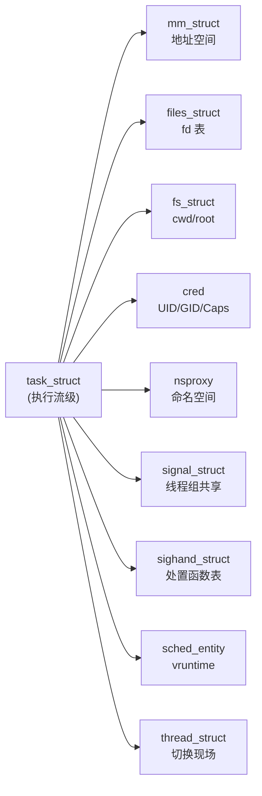
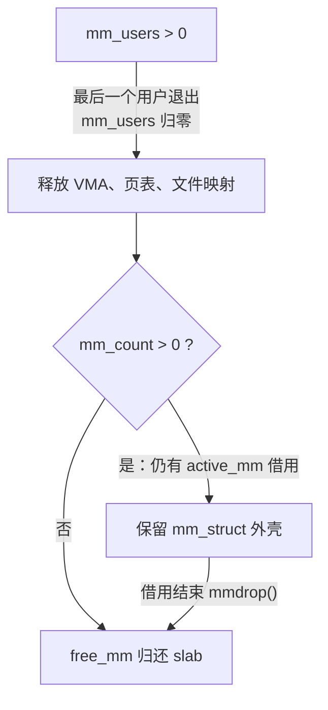

# 02 进程描述符 task_struct 深度拆解

**摘要：**

`task_struct` 是 Linux 内核里最庞大的单个结构体。在 6.x 版本上它有两百多个字段、定义占了近七百行，是调度、内存、文件、信号、安全、cgroup、审计等十几个子系统的共同挂载点。本文不打算罗列字段清单，而是沿着一条主线把它拆开：**这个结构体为什么必须长成这样**。文章先从 1970 年代 Unix 的静态进程表讲起，解释为什么内核最终选择"每个进程一块动态分配的对象 + 大量指针指向卫星结构"这种布局；随后按状态与调度、身份标识、家族关系、地址空间、文件系统视图、信号与命名空间、内核栈、计量与安全八个分组逐组拆解，重点说明每组的字段语义、共享与复制的边界、以及它们在 `fork()`/`clone()` 上的可配置性。其中三处细节最容易被低估：`mm` 与 `active_mm` 的两级引用计数（`mm_users` 与 `mm_count`）如何支撑内核线程懒借地址空间、`__state` 的位掩码与 `TASK_REPORT` 掩码的关系、以及 `THREAD_INFO_IN_TASK` 这一改动背后的安全动机。最后给出边界：`task_struct` 从来不是稳定 ABI，直接在内核模块里裸读字段会遇到 RCU 与 `task_lock` 的并发陷阱。全文回答两个问题：这个结构体为什么长这样，以及在它上面动手时要注意什么。

---

## 第 1 章 一个结构体代表一个进程

### 1.1 静态进程表时代

1970 年代的 Unix 内核里，进程表是一块大小固定的全局数组 `proc[]`，长度由编译期常量 `NPROC` 决定（早期通常是几十到几百）。每个数组元素是一块 `struct proc`，保存着进程的全部状态；PID 直接就是数组下标，因此 PID 的取值范围与最大进程数被同一个常量绑死。

静态表的好处是查找快且不用分配内存：`proc[pid]` 就是一次数组索引，PID 就是下标这件事还顺带简化了权限检查与调试。它的代价则随着系统规模的增长变得越来越明显：进程数一旦超过 `NPROC`，`fork()` 就只能返回 `EAGAIN`；而每个 `struct proc` 里那几百字节的字段必须常驻内存，即便绝大多数进程处于睡眠状态。

### 1.2 动态分配与指针化

Linux 从 0.01 开始就采用了另一条路线：进程控制块动态分配、用指针互相连接，而不是放在数组里。这个选择在 1991 年看起来只是实现风格，回过头看却是 Linux 能长到今天的几个关键决策之一。动态分配让进程数量只受内存限制（后来的 `pid_max` 是一个独立的策略上限而非结构上限），也让内核可以在进程退出后立刻把这块内存还给 slab 分配器。

指针化带来了第二个变化：**字段的外移**。如果一个字段被多个进程共享的概率很高，就没有必要把它内联在 `task_struct` 里，改为单独定义一个结构体、让 `task_struct` 持有一个指针即可。文件描述符表、地址空间、信号处置表、凭证、命名空间，全都按这个思路外移。这样做的收益是共享变得廉价（改指针而不是复制数据），代价是每次访问都要多一次指针解引用，而且并发控制变得更复杂——共享出去的对象的生命周期已经不再由单个进程决定。

### 1.3 两百个字段的组织难题

`task_struct` 的字段数量在 Linux 30 年的演进中持续增长，原因在于它承担了"所有与执行流相关信息的聚合点"这个角色。每当内核新增一个子系统（NUMA 调度、cgroup、seccomp、RCU、性能事件、审计、实时调度、死锁检测），只要它需要按执行流挂载状态，就会在 `task_struct` 里加字段。

这种增长带来一个组织上的挑战：内核对 `task_struct` 的访问是极度频繁的，而 CPU 缓存的容量是有限的。把两百多个字段平铺在一块内存里，意味着每次访问 `task_struct` 中的某个字段时，同一个缓存行里装载的其它字段可能完全用不上。内核对此的缓解手段是把字段按访问模式聚簇——热字段（`__state`、`prio`、`se`）放在结构体前部，冷字段靠后，并用 `____cacheline_aligned` 之类的属性把竞争激烈的字段（如 `on_cpu`）单独对齐到缓存行，避免伪共享。

在线程组这个维度上还有一处值得注意的设计：同一个线程组内的所有执行流各自有一份 `task_struct`，但共享同一个 `signal_struct`。这意味着"进程级的资源"与"线程级的资源"在这套数据模型里是分开存放的——信号处置、统计口径、以及 `RLIMIT_*` 这类限制属于前者，寄存器现场、内核栈、调度实体属于后者。

这个拆分不是一次设计出来的，而是在 2000 年代 NPTL 线程库落地过程中被逐步固化的。在 NPTL 之前，LinuxThreads 用"管理线程 + 信号中转"的方式模拟 POSIX 线程语义，`getpid()` 在不同线程里会返回不同值，`kill` 与 `SIGCHLD` 的语义也与 POSIX 要求不符。NPTL 的解法就是在内核里补齐线程组这一层抽象：让同一组执行流共享 `signal_struct`，把 `tgid` 暴露给用户态，从此线程语义才真正与标准对齐。第 07 篇会展开这段历史。



---

## 第 2 章 状态与调度字段

### 2.1 `__state`：不是枚举而是位图

初学者常以为进程状态是一个取值唯一的枚举变量，在 Linux 上这个印象需要修正。`task_struct.__state` 的类型是 `unsigned int`，它是一个**位掩码**，多个状态位可以同时置位。

几个常用的位：

| 状态位 | 取值 | 语义 |
| :--- | :--- | :--- |
| `TASK_RUNNING` | 0x0000 | 可运行（在运行队列上或正在运行） |
| `TASK_INTERRUPTIBLE` | 0x0001 | 可中断睡眠，收到信号会醒来 |
| `TASK_UNINTERRUPTIBLE` | 0x0002 | 不可中断睡眠，信号不打断 |
| `__TASK_STOPPED` | 0x0004 | 收到 `SIGSTOP` 等信号后停止 |
| `__TASK_TRACED` | 0x0008 | 被调试器跟踪 |
| `TASK_DEAD` | 0x0080 | 已退出，等待回收 |
| `TASK_IDLE` | `TASK_UNINTERRUPTIBLE \| TASK_NOLOAD` | 不参与负载计算的睡眠 |
| `TASK_KILLABLE` | `TASK_UNINTERRUPTIBLE \| TASK_WAKEKILL` | 只被致命信号唤醒的睡眠 |

`TASK_RUNNING` 取值为 0 这件事本身就是一个容易踩的坑：判断"进程是否在睡觉"不能写 `if (p->__state == TASK_RUNNING)` 之外的比较逻辑随意发挥，而应该用 `task_is_running()`；判断"是否处于可报告状态"，内核提供 `TASK_REPORT` 掩码与 `task_state_index()` 转换函数，把位掩码映射成 `/proc` 里那个单字母状态码。

位掩码设计的收益是**可组合**。`TASK_KILLABLE` 并不是一个新状态，而是"不可中断睡眠"叠加"可被致命信号唤醒"这个附加位，这样所有原本判断 `TASK_UNINTERRUPTIBLE` 的代码不用改动就能继续工作，只有需要区分"能否被 `SIGKILL` 打断"的地方才去读那个附加位。第 06 篇会展开 `TASK_KILLABLE` 引入的动机。

### 2.2 三套优先级

Linux 里与优先级相关的字段有三个，它们的区别经常被混淆：

| 字段 | 含义 | 取值范围 | 谁改它 |
| :--- | :--- | :--- | :--- |
| `static_prio` | 用户设置的 nice 值映射 | 100-139 | `setpriority()`、`nice()` |
| `normal_prio` | 考虑调度策略后的常规优先级 | 100-139 | 派生，RT 任务会被提升 |
| `prio` | **实际参与调度决策的优先级** | 0-139 | 可被 PI 机制临时修改 |

三者的关系可以用一句话概括：`static_prio` 是用户在命令行上设置的期望值，`normal_prio` 是内核根据调度策略算出的应有值，`prio` 是"此刻真正生效"的值。前两者通常是同一个数，而 `prio` 会因为优先级继承（Priority Inheritance，PI）被临时改写——当一个高优先级任务因为锁被低优先级任务持有而阻塞时，内核会临时把持有者的 `prio` 提高到等待者的水平。

这种"名义优先级与生效优先级分离"的设计，是实时系统里解决优先级反转的标准手段，也说明了内核在面对并发问题时的一个惯用策略：**保留用户的原始意图，另外维护一份实际生效的数值**，而不是直接改写用户设定。

### 2.3 三个调度实体

`task_struct` 里嵌了三个调度实体，对应三个调度类：

- `se`（`sched_entity`，CFS）：记录 `vruntime`、`load.weight`、`run_node`（红黑树节点）；
- `rt`（`sched_rt_entity`，实时调度）：记录优先级、时间片、运行队列链表节点；
- `dl`（`sched_dl_entity`，截止期调度）：记录 `dl_runtime`、`dl_deadline`、`dl_period`。

一个进程在任一时刻只会挂在其中一个调度类的队列上，但三个实体都内联在 `task_struct` 里，而不是按需分配。这笔内存开销（每个实体几十字节）换来的好处是**调度路径上零分配**：调度器在需要把任务入队或出队时，永远不需要为实体申请内存，也就不会在持锁路径上引入可能睡眠的操作。这种"用固定内存换无分配路径"的思路，在内核里反复出现。

### 2.4 队列状态与执行状态

除实体之外，还有几个与调度相关的标志位需要区分清楚：

- `on_rq`：是否在运行队列上。值为 1 时表示任务正排队等 CPU（且 `__state` 为 `TASK_RUNNING`）；
- `on_cpu`：是否正运行在某个 CPU 上。这个字段在 SMP 系统上竞争激烈，因此被单独对齐到缓存行；
- `sched_class`：指向该任务所属的调度类，是 `pick_next_task()` 分派时的依据；
- `nr_cpus_allowed` 与 `cpus_mask`：CPU 亲和性，决定它能在哪些 CPU 上运行；
- `policy`：调度策略编号（`SCHED_NORMAL`、`SCHED_FIFO`、`SCHED_RR`、`SCHED_DEADLINE` 等）。

`on_rq` 与 `on_cpu` 的区别值得单独强调：一个任务在运行队列上不代表它正在运行，它可能排在红黑树里等着；而一个任务正在 CPU 上运行的前提是它已经出队。把这两个概念混同，会导致在阅读调度代码时产生大量误解。

### 2.5 `sched_entity` 里的两个核心量

CFS 的公平性全部由 `sched_entity` 里的两个量支撑：`load.weight` 与 `vruntime`。

`load.weight` 由 `static_prio` 通过一张映射表换算而来。这张表映射的是"相对 CPU 份额"而不是绝对时间：nice 值 0 的权重是 1024，nice 每降低 1 级权重增大约 1.25 倍，每升高 1 级减少约 20%。这个非线性的映射关系决定了 nice 值调整的实际效果——从 nice 0 调到 -5 得到的时间份额提升，远大于从 nice 10 调到 5 的同等跨度。

`vruntime` 则是"虚拟运行时间"，它的累加速度与权重成反比：权重越大，同样的物理运行时间累加出的 `vruntime` 越少，于是它在红黑树上排得越靠前，被调度到的机会就越多。这个设计把"按权重分配 CPU"这个比例问题，转化成了"每次挑 `vruntime` 最小的节点"这个单调操作，代价只有一次红黑树取最小值。

`task_struct` 与该实体的关系是内嵌而非指针：`se` 是 `task_struct` 的一个字段，因此 `container_of()` 可以从任何一个红黑树节点反推出所属的 `task_struct`。这类"把链表或树节点内嵌到业务结构体里"的做法是内核的标准手法，好处是零额外分配、零缓存不友好跳转。第 08 篇会完整展开 CFS 的这套机制。

---

## 第 3 章 身份标识

### 3.1 `pid` 与 `tgid`：两个编号

每个 `task_struct` 里有两个编号字段：

- `pid`：内核内部的编号，**在同一个线程组内唯一**，每个执行流一个；
- `tgid`（Thread Group ID）：线程组编号，**在同一线程组内所有执行流共享同一个值**。

对单线程进程，两者相等。对多线程进程，第一个线程（主线程）的 `pid` 等于 `tgid`，其余线程有各自不同的 `pid` 但共享同一个 `tgid`。用户态调用的 `getpid()` 返回的实际上是 `tgid`，`gettid()` 返回的是内核的 `pid`——这两个函数名与内核字段名的错位，是 Linux 线程模型留给使用者的一个长期困扰。

这个设计有一个直接后果：`kill(pid, sig)` 在默认情况下作用于整个线程组，因为 `kill` 内部会把参数当作 `tgid` 来查找。要给单个线程发信号，需要 `tgkill(tgid, tid, sig)`；要让信号只作用于特定线程，还得确保该信号没有被安装为进程级处理器。

### 3.2 `comm`：进程名

`comm` 是一个 16 字节的字符数组，保存进程名。`ps` 输出中的 `COMMAND` 列、`/proc/[pid]/comm` 文件、以及内核日志里 `%s` 打印的进程名，都来自这个字段。

16 字节的长度限制（`TASK_COMM_LEN` 定义为 16，含结尾的 `\0`，所以有效字符是 15 个）在今天显得局促——Java 应用的线程名常常超过这个长度，被截断后无法区分 `pool-1-thread-10` 与 `pool-1-thread-11`。这也是为什么 `ps` 在显示完整命令行时需要去读 `/proc/[pid]/cmdline` 而不是 `comm`。`prctl(PR_SET_NAME)` 与 `pthread_setname_np()` 可以修改这个字段，改名的动机通常是为了让排查时的 `ps` 输出更有可读性。

### 3.3 `cred`：凭证与 `commit_creds`

`task_struct.cred` 指向一个 `struct cred`，里面装着 UID/GID 的多个变体与 Capabilities 集合。这个结构体从 2.6.29 起被设计为**不可变对象**：修改凭证不是就地改写，而是复制一份、改完之后用 `commit_creds()` 原子地替换指针。

这个"复制-修改-替换"的模式与写时复制在思想上同源，收益是并发安全。多个进程可能共享同一个 `cred`（`fork()` 之后父子默认共享），如果不做复制就改写，一方的 `setuid()` 会影响另一方；而如果直接加锁保护，又会在每次权限检查时引入锁竞争。不可变对象 + 原子指针替换，让**读路径完全无锁**，代价是修改路径上多了一次内存分配。

`cred` 里还藏着一个容易忽略的字段：`security` 指针，指向 LSM（Linux Security Modules）的私有数据，SELinux 与 AppArmor 的标签就挂在这里。

### 3.4 四个 UID

`struct cred` 里有四个 UID 字段，它们的语义差异是 Unix 权限模型里最容易混淆的部分：

| 字段 | 语义 | 典型用途 |
| :--- | :--- | :--- |
| `uid` | 真实用户 ID | 标识进程的归属，用于信号权限判断 |
| `euid` | 有效用户 ID | **权限检查的实际依据** |
| `suid` | 保存的设置用户 ID | `setuid` 程序临时提权后恢复用 |
| `fsuid` | 文件系统用户 ID | 专用于文件访问检查，通常等于 `euid` |

区分 `euid` 与 `fsuid` 的原因是历史遗留：早期 Linux 为了支持 NFS 的 root 挤压（root squash）语义，需要一个独立的字段来处理"临时以某个用户身份访问文件但保留提权能力"这一需求。现代内核还额外提供了 `setfsuid()` 系统调用，但它在新代码里的使用已不常见。

### 3.5 Capabilities 的五个集合

`struct cred` 里还有一个承载能力（Capability）的字段 `cap_*`，它不是一个集合而是五个：

| 集合 | 语义 |
| :--- | :--- |
| `cap_permitted` | 进程**可以**使用的能力上限 |
| `cap_effective` | 进程**当前生效**的能力，权限检查看的就是它 |
| `cap_inheritable` | 可以通过 `execve()` 传给子程序的能力 |
| `cap_bset`（bounding set） | 进程能力的天花板，`execve()` 无法突破 |
| `cap_ambient` | 同时出现在 permitted 与 inheritable 中、且能跨 `execve` 保留的能力 |

五集合模型解决了传统 Unix 权限"要么全有要么全无"的粗粒度问题，但它的实际使用远不如设想中广泛——原因在于能力位与内核实现细节绑定得过紧，`CAP_SYS_ADMIN` 尤其是一个包含几十种互不相关操作的"万能位"，授予它几乎等同于授予 root。这也是容器安全领域反复讨论的话题，[[云原生/Docker/06 容器安全边界与逃逸风险]] 里有更完整的分析。

`cap_bset` 的不可逆性是它最值得记住的性质：一旦通过 `prctl(PR_CAPBSET_DROP)` 把一个能力从包围集中移除，`execve()` 到任何程序（哪怕是一个 setuid root 程序）都无法再拿回它。这个特性让"启动时先丢弃不需要的能力"成为一条有效的加固手段，代价是丢弃操作不可撤销，需要重启进程才能恢复。

---

## 第 4 章 家族关系

### 4.1 两个 parent 字段

`task_struct` 里同时存在 `real_parent` 与 `parent`：

- `real_parent` 指向生物学意义上的父进程，也就是调用 `fork()` 的那个；
- `parent` 指向**负责在它退出时被通知、并回收它的那个进程**。

对绝大多数进程，两者指向同一个对象。但当进程被 `ptrace` 跟踪时，`parent` 会被临时改成调试器；当父进程设置了自己为 subreaper 时，`parent` 也可能指向一个更近的祖先。`getppid()` 返回的是 `parent` 的 `tgid`——这个选择是刻意的，因为"谁负责给我收尸"在语义上比"谁生了我"更接近 `getppid()` 的用途。

比喻来说，这就像户口本上的"监护人"与"生父母"两个栏目：多数时候填的是同一个人，但寄养、监护权变更之后就会分叉，而办理手续时看的是监护人栏目。技术上的限定是，这个分叉在内核里是可逆的——`ptrace` 分离时 `parent` 会被恢复回去。

### 4.2 `children` 与 `sibling` 链表

进程树通过两个 intrusive 链表维护：

- `children`：本进程的所有直接子进程，链表头是 `task_struct.children`；
- `sibling`：本进程在所有兄弟中的位置，链表头是父进程的 `children`。

这两个链表是双向循环链表（`list_head`），插入与删除都是 O(1)。回收一个子进程时，内核需要修改父进程的 `children` 链表，这要求父进程的 `task_struct` 仍然可以被访问——这正是僵尸进程必须保留 `task_struct` 的原因之一。

这两个链表还有一个容易踩到的并发陷阱：修改它们需要持有父进程的 `tasklist_lock` 或 `sighand->siglock`，而遍历它们的过程中父进程的 `children` 链表可能被其他 CPU 上的 `fork()` 修改。因此内核里凡是要遍历全部子进程的代码（比如向整个进程组发信号）都必须先把子进程摘下来挂到本地链表，再释放锁继续处理。

### 4.3 一个进程为什么不能属于两个线程组

内核里没有"进程的父线程组"这种概念，只有"进程属于哪个线程组"。这个归属关系通过 `signal_struct` 与 `sighand_struct` 的指针实现：同一个线程组内的所有 `task_struct` 指向同一个 `signal_struct`，切换线程组意味着切换这些指针的指向。

不允许同时属于两个线程组，是因为这会破坏信号语义。信号处置、待处理信号队列、统计口径都是按线程组维护的，一个执行流如果同时属于两个组，`kill` 该发给谁、`SIGCHLD` 该通知哪一边、`utime` 该计到哪个组上，这些问题都没有自洽的答案。所以内核的态度是简单地禁止它——`set_tid_address`/`unshare(CLONE_THREAD)` 之类的操作要么被拒绝，要么只对尚未与其他执行流建立联系的"孤儿"生效。

### 4.4 subreaper：自定义收养人

`init` 收养孤儿进程是默认行为，但容器与某些常驻服务希望自己承担这个角色。Linux 3.4 引入的 `PR_SET_CHILD_SUBREAPER` 允许一个进程声明："我的后代如果成为孤儿，交给我而不是交给 `init`"。声明方式是用 `prctl(PR_SET_CHILD_SUBREAPER, 1)`。

这个机制的引入动机与容器直接相关：容器内的进程如果在 `init` 进程不在场的情况下产生孤儿，孤儿会被宿主机上的 `init` 收养，于是它就跑到了容器的进程树之外，容器退出时无法被清理干净，形成"僵尸泄漏到宿主机"的现象。subreaper 让容器运行时可以把这棵树重新收敛回来。`systemd` 与 `containerd-shim` 都使用了这个机制。

---

## 第 5 章 地址空间与内存描述符

### 5.1 `mm` 与 `active_mm`

`task_struct.mm` 指向本进程的地址空间描述符 `mm_struct`，包含页全局目录（PGD）、各内存区域链表（VMA）、代码段与数据段的起止地址、以及统计计数字段。

`active_mm` 则是另一个容易误解的字段。它表示"这个进程当前实际装载在 CPU 上的地址空间"。对普通用户进程，两者相等；对内核线程，`mm` 为 `NULL`，`active_mm` 指向它**借用的那个用户进程的地址空间**。

为什么会需要"借用"？因为切换到内核线程时，如果直接把页表换成一个空集，TLB 与缓存里那些属于上一个用户进程的表项就全部白费了，而且内核线程返回用户态时还得再切回来。Linux 的做法是：切换到内核线程时保留上一个用户进程的页表（`active_mm` 指向它并增加 `mm_count`），内核线程在这个地址空间上执行内核代码——反正它永远不会访问用户态地址，页表里映射了什么对它都无所谓。这个技巧被称为**懒 TLB**（Lazy TLB），它把上下文切换中最昂贵的那一步省掉了。

### 5.2 两级引用计数

`mm_struct` 里有两个引用计数，理解它们的区别是理解 Linux 内存管理的关键之一：

| 计数 | 语义 | 增加者 | 归零时 |
| :--- | :--- | :--- | :--- |
| `mm_users` | 使用该地址空间的**执行流**数量 | `fork()`、`clone(CLONE_VM)` | 释放 VMA、页表、映射的文件 |
| `mm_count` | 对该结构体本身的**引用**数量 | `mmget()`、`active_mm` 借用 | 释放 `mm_struct` 结构体本身 |

两级计数的存在是为了处理"地址空间已经没人用了，但结构体还不能释放"这种情形。当最后一个用户进程退出时 `mm_users` 归零，内核开始拆页表、放 VMA；而如果此刻某个内核线程还在借用它作为 `active_mm`，`mm_count` 仍大于零，那个 `mm_struct` 的外壳必须继续存在，直到借用结束。把它类比为租房：`mm_users` 是屋里的住户数，住户走光了要清空家具；`mm_count` 是包括房东在内的钥匙持有者数量，钥匙还有人拿着，房门就不能拆。



### 5.3 内核线程如何借用

从前一节可以推出一个结论：**内核线程虽然没有 `mm`，但它必须有 `active_mm`**，否则上下文切换时无法决定往 CR3 里写什么。这条规则在调度代码里被显式处理：`switch_mm_irqs_off()` 在参数 `next->mm` 为 `NULL` 时会使用 `next->active_mm`，并且在真正的用户进程之间切换时才需要刷新 TLB。

内核线程第一次被创建时（`kthread_create` 路径），它的 `active_mm` 继承自创建者，并在切换时通过 `mmgrab()` 增加目标地址空间的 `mm_count`。这意味着一个长期运行的内核线程会长时间占住某个用户进程的 `mm_struct`，让它无法被彻底释放——这是内存占用分析中一个不太常见但确实存在的观察点。

### 5.4 与 Slab 和页表的关系

`mm_struct` 自身也是从 slab 分配器里分配的（`mm_cachep`），而它指向的页全局目录由 `pgd_alloc()` 从页分配器取整页。VMA 则是另一条独立的链：`mmap_base`、`mm_mt`（6.1 之后改为 maple tree）等结构组织起整个虚拟地址空间的分段描述。

`task_struct` 与 `mm_struct` 之间还有一条隐式联系：`task_struct` 里保存了 `page_table_lock` 相关的等待队列、以及 `rss_stat` 这类按进程统计 RSS 的计数器。这些字段放在 `task_struct` 而不是 `mm_struct` 里，是因为它们需要按执行流区分——同一个地址空间内的多个线程，各自有独立的 RSS 统计增量。

### 5.5 VMA 的组织方式与 maple tree

虚拟内存区域（Virtual Memory Area，VMA）是地址空间的基本分段单位，代码段、数据段、堆、栈、每一条 `mmap()` 映射都各自对应一个 VMA。进程的地址空间可能有几百到几十万个 VMA（大型 JVM 或内存数据库尤其如此），查询"地址 X 落在哪个 VMA 里"这个操作必须足够快。

在 Linux 6.1 之前，VMA 用红黑树组织（`mm_struct.mm_rb`）并辅以链表遍历优化；6.1 之后换成了 maple tree（`mm_mt`）。这次替换的动因不是单点查找性能——红黑树的 O(log n) 已经够用——而是**区间操作**的效率：`mprotect()` 一次修改一大段地址、或者 `munmap()` 跨越几十个相邻 VMA 时，红黑树需要逐节点遍历，而 maple tree 的 B 树结构可以一次性跳过整个子树。

这个改动对本篇主题的意义在于：`mm_struct` 的字段布局因此发生了变化，而任何依赖 `mm_rb` 这类字段名写成的内核模块或性能工具，在跨 6.1 版本时都会失效。**内核内部数据结构的稳定性只存在于"同一棵源码树"这个范围内**，这是第 11 章会再次强调的一点。

---

## 第 6 章 文件系统视图

### 6.1 `files_struct` 与 `fdtable`

`task_struct.files` 指向 `files_struct`，后者是文件描述符表的容器。这里有一个值得注意的分层：

```
task_struct.files → files_struct → fdtable（数组）→ struct file * → struct file
```

`fdtable` 里存的是指向 `struct file` 的指针，而 `struct file` 才是真正的"打开的文件"对象，包含文件偏移量、访问模式、以及指向 inode 的指针。`fork()` 之后，父子进程的 `fdtable` 是复制的，但每一项指向的 `struct file` 是共享的——**这就是父子进程共享文件偏移量的机制根源**。

`close()` 释放的是 `fdtable` 里的一个表项以及 `struct file` 的一次引用，只有当引用计数归零时，`struct file` 才会真正释放。这一点解释了文件描述符泄漏为什么会在多进程场景下难以定位：某个进程 `close` 了 fd，但另一个持有同一 `struct file` 的进程还没退出，于是内核对象仍然存在。

### 6.2 `fs_struct` 与路径解析

`task_struct.fs` 指向 `fs_struct`，保存两个关键路径：当前工作目录（`pwd`）与根目录（`root`）。这两个字段是路径解析的起点，也是 `chdir()` 与 `chroot()` 的作用对象。

把它们从 `files_struct` 里独立出来有其道理：`chdir()` 与 `chroot()` 属于"进程的上下文"而非"打开的文件"，而 `chroot()` 的安全性影响（逃逸风险、与 `CAP_SYS_CHROOT` 的关系）也让它值得单独管理。在容器技术里，挂载命名空间接管了大部分隔离职责，`chroot()` 的角色退化为一个辅助手段，但 `fs_struct.root` 依然存在并被容器运行时用于设定容器的根视图。

### 6.3 共享与复制的边界

`clone()` 的两个标志直接对应这两个结构体：

| 标志 | 作用 | 效果 |
| :--- | :--- | :--- |
| `CLONE_FILES` | 共享 `files_struct` | 一方 `close` 的 fd，另一方立刻消失 |
| `CLONE_FS` | 共享 `fs_struct` | 一方 `chdir()`，另一方的 cwd 同步改变 |

这两个标志在没有 `CLONE_THREAD` 的情况下也有意义——它们允许两个不同线程组的进程共享文件上下文。`systemd` 与某些守护进程框架会利用这一点来避免复制 fd 表。

`CLONE_FS` 的语义在并发场景下需要格外小心：如果两个共享 `fs_struct` 的执行流同时对 `/a/b/c` 做相对路径访问，而其中一个调用了 `chdir()`，另一个的解析结果就会改变。内核在这条路径上用 `fs_struct.lock` 保护引用计数，但语义上的竞态仍然存在。

### 6.4 fd 表的扩容与限制

`fdtable` 的初始容量只有 64 项，当进程打开的文件数超过这个容量时，内核会按需扩容：分配一块更大的数组、把旧数组里的指针复制过去、把旧数组标记为待回收。

扩容这件事与 `RLIMIT_NOFILE` 形成了两层约束：`RLIMIT_NOFILE` 决定的是"这个进程最多能打开多少个 fd"，而 `fdtable` 的容量决定的是"当前这张表有多大"。内核不会因为打开一个 fd 就把表扩到上限，而是按需翻倍增长，因此在 `/proc/[pid]/fdinfo` 里观察到的表大小通常远小于限制值。

`RLIMIT_NOFILE` 在生产上的默认值 1024 是很多"服务跑着跑着突然报 `Too many open files`"事故的直接原因。现代服务通常在 systemd 的 `LimitNOFILE` 或容器运行时的配置里把它调到几万甚至几十万。需要留意的是，调大这个值并不总是没有代价：`fdtable` 是按需增长的稀疏结构，但内核里某些针对 fd 的迭代操作（如 `close_range`、`fork` 时的表遍历）的开销与表容量相关，把上限设得过大而没有实际需要，会轻微抬高这些操作的成本。

---

## 第 7 章 信号与命名空间

### 7.1 `signal_struct`：线程组共享

`signal_struct` 是同一个线程组内所有执行流共享的对象，它承载的是**进程级**的信号状态：进程级待处理信号队列、各信号的处置标志汇总、`SIGCHLD` 相关设置、进程级统计（`utime`/`stime` 的汇总）、以及 `RLIMIT_*` 资源限制。

它与 `task_struct` 的对应关系是"一对多"：一个 `signal_struct` 对应多个 `task_struct`。这个分裂正是 Linux 线程模型的核心体现——线程组内的执行流共享哪些东西，就体现在它们共同指向哪个结构体上。

### 7.2 `sighand_struct` 与处置函数

`sighand_struct` 保存信号处置函数表（`struct k_sigaction action[_NSIG]`），同样是线程组共享。这解释了一个常见的困惑：为什么在一个线程里调用 `signal()` 或 `sigaction()`，整个进程的行为都变了——因为处置表根本就是共享的。

`sighand_struct` 里还有一个 `siglock` 自旋锁，保护处置表与信号队列的修改。它的存在让信号投递成为内核里少数几个需要在进程上下文与中断上下文之间同步的操作之一，也是信号相关代码读起来格外绕的原因。

### 7.3 两条待处理队列

信号的待处理状态分散在两个地方：

- `task_struct.pending`：**线程私有**的待处理信号，只有定向发给该线程的信号才进这里；
- `signal_struct.shared_pending`：**进程共享**的待处理信号，任何线程都可以来处理它。

一次信号投递会走哪条队列，取决于投递方式与信号处置设置。`kill()` 这类投递给进程的信号先进 `shared_pending`，然后内核唤醒一个"合适的"线程去处理；`tgkill()` 这类定向投递给线程的信号直接进 `pending`。理解这条分岔是排查"信号处理函数在某些线程上不执行"这类问题的前提。

### 7.4 `nsproxy`：命名空间的聚合

`task_struct.nsproxy` 指向一个 `nsproxy`，里面聚合了该进程所属各类命名空间的指针：`mnt_ns`（挂载）、`uts_ns`（主机名与域名）、`ipc_ns`（System V IPC 与 POSIX 消息队列）、`pid_ns_for_children`（子进程的 PID 命名空间）、`net_ns`（网络）、`cgroup_ns`（cgroup 视图）、`time_ns`（时钟）。

把这些指针单独聚合成一个结构体而不是散落在 `task_struct` 里，是为了让"创建新命名空间"这个操作变成一个原子动作：`unshare()` 的某些组合需要一次切换多个命名空间，如果字段分散，中间状态就会让进程短暂地处于两个不同命名空间的混合视图里。聚合之后，`nsproxy` 是一个不可变对象，切换时用类似 `cred` 的复制-替换模式一次性完成。

### 7.5 `setns()` 与不可逆的切换

与 `unshare()`（创建新命名空间）相对的是 `setns()`（加入已有命名空间），它通过一个指向 `/proc/[pid]/ns/*` 的文件描述符来指定目标。`nsproxy` 的不可变性质，使得 `setns()` 在多个命名空间切换时也保持着"要么全成、要么全不成"的原子性。

但有几个命名空间是 `setns()` 无法带一个进程进入的。挂载命名空间的加入要求调用者持有 `CAP_SYS_CHROOT` 与 `CAP_SYS_ADMIN`，且只能影响调用者的文件系统视图；PID 命名空间则**只能前进不能后退**——`setns()` 只能把调用者移入一个更深（后代）的 PID 命名空间，无法移出。这条规则的理由是：PID 名称在浅层命名空间里对一个进程而言是多值的，如果允许进程从深层跳回浅层，它的 PID 会突然变成另一个数字，`getpid()` 的语义将失去一致性。

这个约束在实践中带来一个具体现象：容器运行时创建容器时的 `clone(CLONE_NEWPID)` 只能作用于**子进程**，因为容器进程本身必须在新命名空间里诞生，而不能事后加入。理解了 `nsproxy` 的这层语义，容器运行时的进程创建顺序就不再显得随意。

---

## 第 8 章 内核栈与 `thread_info`

### 8.1 两种布局的历史

内核栈是每个执行流独有的一块内存，用于在内核态执行时存放函数调用链与局部变量。在 x86-64 上它的大小由 `THREAD_SIZE` 定义，默认是 16KB。

在 4.9 之前，`thread_info`（保存指向 `task_struct` 的指针以及若干标志位）被放在内核栈的底部，与栈共享同一块连续内存。这种布局让 `current` 宏可以在两条指令内算出结果：

```c
/* 旧布局：内核栈按 THREAD_SIZE 对齐，底部就是 thread_info */
static inline struct thread_info *current_thread_info(void)
{
    return (struct thread_info *)(current_stack_pointer & ~(THREAD_SIZE - 1));
}
```

### 8.2 `THREAD_INFO_IN_TASK` 的安全动机

这种紧凑布局的问题在于**栈溢出会直接改写 `thread_info`**。内核栈没有硬件保护，一旦某个递归函数或超大局部数组越界，最先被覆盖的就是栈底那几十字节。攻击者如果能通过某个漏洞控制栈溢出内容，就可以把 `thread_info.task` 指向一块伪造的内存，再配合 `current` 的使用点完成任意地址写入——这是一类利用门槛低、影响面大的提权路径。

对策是把 `thread_info` 挪进 `task_struct` 内部，这个配置项叫做 `THREAD_INFO_IN_TASK`。x86 从 4.9 开始默认启用，ARM64 也在同期跟进。改动之后 `current` 需要从每 CPU 变量读取：

```c
/* 新布局：task_struct 内嵌 thread_info，通过 gs 段基址 + 偏移取得 */
DECLARE_PER_CPU(struct task_struct *, current_task);
static __always_inline struct task_struct *get_current(void)
{
    return this_cpu_read_stable(current_task);
}
```

代价是一次额外的内存访问（虽然 `current_task` 位于每 CPU 区的前部，命中缓存的概率很高），收益是"栈溢出不再直接摧毁进程身份"。这笔交易在安全审计压力越来越大的 2010 年代是必然要做的。

### 8.3 栈溢出防护

除了挪走 `thread_info`，内核还提供了另外几道防线：

- `CONFIG_VMAP_STACK`：把内核栈分配到 vmalloc 区域，两边各留一个未映射的守护页，溢出会立刻触发缺页异常而不是静默破坏相邻内存；
- `CONFIG_STACKPROTECTOR_STRONG`：在函数栈帧里插入金丝雀值，返回前检查是否被改写；
- 栈使用量检查：编译期与运行期的 `-Wframe-larger-than` 与 `check_stack_usage()` 用于发现异常大的栈帧。

这些机制各自能挡住一部分情形，组合起来才形成了一个可用的防御面。它们的存在也说明了一个事实：**内核栈这种"紧凑共享"的设计一旦在安全性上失分，补救成本会持续很多年**。

### 8.4 `stack` 与 `thread` 的协作

`task_struct.stack` 指向该执行流的内核栈基址，`task_struct.thread.sp` 保存切换出去时的栈指针。恢复一个进程时，调度器从 `thread.sp` 取回栈指针，然后沿着这条栈一路返回到上次调用 `schedule()` 的位置，从那里继续执行。

这两个字段的配合构成了进程切换的物理基础。它们的值只在两种时刻改变：进程被切换出去时（保存），以及进程第一次被调度时（由 `copy_thread()` 在 `fork()` 路径上初始化）。后者设置的初始栈使得新进程"看起来像是刚刚从 `schedule()` 返回"，这样它就不需要任何特殊的启动代码路径。

### 8.5 每个执行流 16KB 的隐性成本

内核栈是每执行流一份的固定开销。在 x86-64 上 16KB 是默认值，加上 `task_struct` 本身约 7KB，一个执行流在创建时就占掉了 20KB 以上的不可换出内存。

这个数字在"一个连接一个线程"的服务里会迅速放大：一万个线程就是 200MB 常驻内存，而其中大部分线程的内核栈处于完全空闲状态，只是留着备用。容器场景下这个成本更值得关注，因为内存限制（`memory.limit_in_bytes`）把这份开销也算了进去，一个设了 1GB 限制的容器如果开了一万个线程，光内核栈就用掉两成配额，而且这部分内存属于内核态、不受 `MALLOC_ARENA_MAX` 之类的用户态调优手段影响。

知道这个成本的存在，就能理解为什么现代高并发服务倾向于用事件驱动模型把并发连接数从"线程数"里解耦出来，也能理解为什么线程池的大小需要谨慎设定——线程不只是"便宜的调度单位"，每个都拖着一条内核栈和一块 `task_struct`。

---

## 第 9 章 计量、限制与安全挂载点

### 9.1 CPU 时间的统计口径

`task_struct` 里有 `utime`、`stime`、`gtime` 等字段，分别统计用户态时间、内核态时间、以及客户机时间（虚拟化场景）。这些字段的类型是 `u64`，单位是纳秒（内部写作 `task->utime`，通过 `task_cputime()` 之类的辅助函数读取）。

统计口径中有两个细节值得注意。第一，**时间只在离开 CPU 时结算**：内核在上下文切换与 `exit` 路径上把这段时间累加到字段里，因此在两次切换之间读取 `/proc/[pid]/stat` 得到的值是有滞后性的。第二，`utime`/`stime` 是**每线程**的，而用户通过 `times()` 或 `/proc/[pid]/stat` 看到的是线程组汇总值——汇总工作由读取方完成。

### 9.2 挂在 `task_struct` 上的子系统

随着内核演进，越来越多的子系统选择把 `task_struct` 当作挂载点：

| 子系统 | 字段 | 用途 |
| :--- | :--- | :--- |
| cgroup | `cgroups` | 该任务所属的 cgroup 集合 |
| seccomp | `seccomp` | 系统调用过滤器状态 |
| 审计 | `audit_context` | 审计上下文 |
| perf | `perf_event_ctxp` | 性能事件上下文数组 |
| RCU | `rcu_*` | RCU 宽限期相关状态 |
| 死锁检测 | `held_locks` | 持有的锁列表 |
| 调度统计 | `sched_info`、`nvcsw`、`nivcsw` | 调度延迟与上下文切换计数 |

这种"人人往 `task_struct` 加字段"的趋势在社区里引发过多次讨论。支持者认为挂载点统一便于查找与调试；反对者指出结构体膨胀会影响缓存效率，且字段之间的隐含耦合难以审计。迄今为止的实践是：内核通过把冷字段放到结构体尾部、把热字段聚簇来缓解性能问题，而没有引入一个统一的"子系统私有数据"机制。

### 9.3 上下文切换次数的计数

`nvcsw` 与 `nivcsw` 分别统计"自愿上下文切换"与"非自愿上下文切换"的次数，前者对应进程主动睡眠（如等待 I/O），后者对应被调度器抢占。这两个数字在排查性能问题时很有价值：`nivcsw` 远高于 `nvcsw` 通常意味着 CPU 竞争激烈或进程被频繁抢占；反过来，`nvcsw` 居高不下则说明进程在频繁阻塞，瓶颈更可能在 I/O 或锁上。

`/proc/[pid]/status` 里的 `voluntary_ctxt_switches` 与 `nonvoluntary_ctxt_switches` 就是这两个计数的直接呈现，也是判断"CPU 使用率低但吞吐上不去"这类问题的第一手线索。

### 9.4 `RLIMIT`：存在 `signal_struct` 里的限制

资源限制（Resource Limit）在 Linux 上以 `RLIMIT_*` 常量标识，涵盖 CPU 时间、文件大小、数据段、常驻内存、打开文件数、进程数、栈大小、core 文件大小等十几项。每一项有两个值：软限制（`rlim_cur`）与硬限制（`rlim_max`）。软限制是实际生效的门槛，硬限制是软限制的上限，只有持有 `CAP_SYS_RESOURCE` 的进程才能把硬限制往上调。

这些字段存放在 `signal_struct` 里而不是 `task_struct` 里，含义很明确：**资源限制是进程级属性，线程组内共享**。一个线程调低 `RLIMIT_NOFILE`，整个进程的所有线程都会受影响。这个设计选择与人们"线程是独立个体"的直觉相悖，却与 Unix 的历史一致——`ulimit` 从一开始就是面向进程而非面向执行流的。

修改限制的接口在近年有过一次扩展。传统做法是 `setrlimit()` 只能修改调用者自身的限制；Linux 2.6.36 引入的 `prlimit()`（以及对应的 `prlimit64` 系统调用）允许在持有 `CAP_SYS_RESOURCE` 或满足权限关系的前提下修改另一个进程的限制，并且可以一次读取全部限制。`/proc/[pid]/limits` 这个文件的存在，则是为了让运维不必写程序就能查看这些值——它在排查"为什么这个进程只能打开 1024 个文件"这类问题时是第一个该看的文件。

比喻来说，软硬限制的关系很像信用卡的额度与临时提额上限：日常刷卡受额度约束，超过额度需要申请，而申请的天花板是银行设定的上限。技术限定是，这里的"申请"不需要外部审批，只要进程自己持有相应 capability 就能直接调整硬限制。

---

## 第 10 章 分配与生命周期

### 10.1 `dup_task_struct`

`fork()` 路径上的 `copy_process()` 第一步就是 `dup_task_struct()`，它做三件事：从 `task_struct` 的 kmem_cache 分配对象、分配内核栈、把父进程的 `task_struct` 逐字节复制到新对象里，最后重置那些必须清空的字段（如 `stack`、`thread`、以及统计计数）。

"逐字节复制父进程的整个 `task_struct` 再修正"这个做法看起来笨拙，实际上很划算：`task_struct` 里绝大多数字段在新进程上的初值与父进程相同，复制之后再定点修改需要变化的少数几个字段，比逐个初始化两百个字段要可靠得多。这也解释了为什么新进程从一开始就"像"父进程——它的调度权重、nice 值、CPU 亲和性、cgroup 归属、资源限制全都继承自父进程。

### 10.2 两块 slab 缓存

每个进程占用两块 slab 内存：一块来自 `task_struct` 缓存，一块来自内核栈缓存（在 `CONFIG_VMAP_STACK` 下则是 vmalloc 区域的一块虚拟内存）。观察它们的整体使用情况可以用：

```bash
# 查看 task_struct 的活跃对象数
grep -E 'task_struct|thread_stack' /proc/slabinfo
# task_struct      1234  1568    7040   4    8 : tunables ...
# 字段含义：活跃对象数、总对象数、对象大小、每 slab 页数、每 slab 对象数
```

活跃对象数与系统中实际进程数吻合，是确认"有没有进程泄漏"的廉价手段。如果数字持续增长且远高于 `ps` 可见的进程数，通常意味着某个进程未能正确回收子进程，或者内核模块创建的任务没有退出。

### 10.3 释放路径

进程退出时，`do_exit()` 会依次释放自有的资源（地址空间、文件表、信号结构），但**不释放 `task_struct` 与内核栈**——这两块要等父进程调用 `wait4()` 时才由 `release_task()` → `free_task()` 回收。这就是僵尸进程占用内存的全部内容：一个 `task_struct` 加上一个内核栈。

僵尸进程的内存开销常被低估。在 x86-64 上，一个 `task_struct` 大约 7KB、一个内核栈 16KB，合计 20KB 左右。几万个僵尸进程就是几百 MB 内存，而且它们还占着 PID，可能导致 PID 耗尽而无法创建新进程。第 05 篇会展开完整的退出与回收路径。

### 10.4 观察手段

除 `/proc/slabinfo` 之外，还有几种观察 `task_struct` 的手段：

| 手段 | 适用场景 | 特点 |
| :--- | :--- | :--- |
| `/proc/[pid]/status` | 单个进程的字段快照 | 无权限要求，字段有限 |
| crash / drgn | 离线内核转储分析 | 可读任意字段，需 vmcore |
| BPF + BTF | 在线追踪字段访问 | 需内核开启 BTF，开销可控 |
| SystemTap | 在线探测 | 需要编译与内核头文件 |
| `/sys/kernel/debug/sched/*` | 调度相关字段 | 需 debugfs |

其中 `drgn` 与 BTF 的组合在近几年变得流行，因为它不依赖内核头文件与调试符号的完整匹配，可以跨内核版本读取 `task_struct` 的字段——前提是目标内核开启了 `CONFIG_DEBUG_INFO_BTF`。

### 10.5 `copy_thread()`：新任务的第一条指令

`copy_process()` 的最后一步是 `copy_thread()`，它的职责是让新创建的执行流"看起来像是刚从一次调度中恢复"。这个目标通过手工布置目标内核栈来实现：把 `thread.sp` 指向新栈上的一个精心构造的栈帧，栈顶放着 `ret_from_fork` 的地址，而栈帧里保存的寄存器值（`ax`、`bx`、`ip` 等）则决定了从 `ret_from_fork` 返回后跳到哪个用户态地址。

对 `fork()` 而言，新任务的返回地址是 `ret_from_fork`，返回后经过 `syscall_exit_to_user_mode` 回到用户态，此时 `rax` 里放着 0——这就是"`fork()` 在子进程里返回 0"这个语义的实现方式。它不是什么特殊的分支判断，而是寄存器初值布置的结果。

对内核线程而言，`copy_thread()` 布置的初始栈让它直接进入 `kthread()` 函数；对 `clone()` 创建的线程，用户态栈指针由参数指定，因此新线程从指定的函数与栈开始执行。三种情形共用同一条切换恢复路径，差异只在于初始栈帧的内容。**用一套恢复机制承载多种创建语义**，这是内核里很典型的一种设计：把差异压缩到初始化阶段，让稳态执行路径保持单一。

---

## 第 11 章 边界与反例

### 11.1 它不是稳定 ABI

`task_struct` 的字段布局在内核版本之间会变化，字段本身也会增删。**任何依赖具体偏移量的代码都是脆弱的**，包括手写的内核模块与某些性能工具。这一点与系统调用的稳定性承诺形成鲜明对比：系统调用接口一旦确定就基本不变，而内核内部数据结构则完全自由。

实践中，跨版本读取 `task_struct` 应该走两条路：一是通过 BTF 在运行时查询偏移量，二是通过 `/proc` 与 BPF 提供的稳定接口间接观察。直接 `#include <linux/sched.h>` 然后读字段的做法只适用于与内核实现在同一棵源码树上编译的模块。

### 11.2 并发访问的陷阱

即使能读到字段，也不代表能安全地读。内核里大量字段受 `task_lock`、`sighand->siglock`、`rcu_read_lock()` 保护，脱离这些保护直接访问会读到撕裂的值或已释放的对象。

以遍历 `children` 链表为例，正确的做法是先拿 `tasklist_lock`，把子进程逐个摘到本地链表上，释放锁之后再处理。直接遍历而不持锁，会与另一个 CPU 上正在执行的 `fork()` 竞争，导致链表指针悬空。这类错误在自研内核模块里非常常见，且往往只在压力测试时才暴露。

### 11.3 常见误区

- **误区一：`task_struct` 就是进程**。它只是进程在内核里的记账对象；进程还包括用户态地址空间里那些内核不直接跟踪的内容（如线程局部存储、以及应用程序自己维护的状态）。
- **误区二：线程一定共享 `task_struct`**。恰恰相反，每个执行流有各自的 `task_struct`，共享的是 `mm`、`files`、`signal`、`sighand` 这些卫星结构。
- **误区三：进程退出后 `task_struct` 立刻释放**。要等父进程 `wait`，否则就是僵尸。
- **误区四：读 `/proc/[pid]` 得到的是原子快照**。多个文件之间没有一致性保证，跨文件拼接出来的信息可能与真实状态矛盾。

### 11.4 一条实用的阅读顺序

`task_struct` 的字段太多，逐行读源码的收益很低。更有效的方式是带着问题去查：想弄清楚一个进程占了多少内存，就沿着 `mm` → `mm_struct` → `rss_stat` 与 VMA 链表这条线查；想弄清楚它为什么没被调度，就沿着 `__state` → `se.vruntime` → `cfs_rq` 这条线查；想弄清楚它的权限从哪里来，就沿着 `cred` → 五个 capability 集合这条线查。

这种"按问题选路径"的方式有一个好处：每次只走一两条指针链，`task_struct` 那两百个字段就从一份需要背下来的清单，变成了一个按需索引的目录。**结构体的复杂度本身不会消失，能改变的只是你与它打交道的入口数量。**

---

## 第 12 章 小结：一份记账本的演进

把 `task_struct` 的全部字段看一遍，会发现它并不像教科书上的进程控制块那样"只保存进程自身的状态"。它更像一份**记账本**：主表记着执行流的身份与状态，同时挂着一大串指向卫星表的指针，让内核可以在常数次解引用内找到与这个执行流相关的全部上下文。

这种设计的取舍是清晰的。收益在于共享变得廉价——通过改指针而不是复制数据来实现"共享一部分、隔离另一部分"，这正是 `clone()` 那套标志位能够成立的数据结构基础；代价在于共享对象的生命周期管理变得复杂，需要两层引用计数、不可变对象加原子替换、以及大量精细的锁。第 5 章的 `mm_users`/`mm_count` 与第 3 章的 `cred` 复制替换，是这套代价的两种典型表现。

由此可见，读 `task_struct` 的正确方式不是记住字段名，而是**记住每个字段背后代表什么资源、这些资源在哪些操作下会被共享或复制、以及共享之后谁负责释放**。把握住这三条，调度、信号、命名空间、cgroup 这些看起来各自独立的话题，就会收敛到同一套数据模型上。

---

## 参考资料

1. *Linux Kernel Source* — `include/linux/sched.h`：`task_struct`、`thread_struct`、`sched_entity` 的定义与字段注释。
2. *Linux Kernel Source* — `include/linux/sched/signal.h`：`signal_struct`、`sighand_struct` 与待处理信号队列。
3. *Linux Kernel Source* — `include/linux/mm_types.h`：`mm_struct` 与 `mm_users`/`mm_count` 的引用计数语义。
4. *Linux Kernel Source* — `include/linux/cred.h`、`kernel/cred.c`：不可变凭证对象与 `commit_creds()`。
5. *Linux Kernel Source* — `arch/x86/include/asm/current.h`：`current` 宏在 `THREAD_INFO_IN_TASK` 前后的两种实现。
6. *Linux Kernel Documentation* — `Documentation/core-api/current_pointer.rst`。
7. *Linux Kernel Documentation* — `Documentation/admin-guide/hw-vuln/`：栈溢出相关的缓解措施背景。
8. *Linux Kernel Source* — `kernel/fork.c`：`dup_task_struct()`、`copy_process()`、`free_task()`。
9. *Linux Kernel Source* — `fs/proc/array.c`：`TASK_REPORT` 掩码与 `/proc/[pid]/status` 字段的映射关系。
10. *Understanding the Linux Kernel*（3rd Edition）, Daniel P. Bovet, 2005：第 3 章，早期 `thread_info` 布局与内核栈。

---

> [!note] 思考题
> 1. `cred` 采用"复制-修改-原子替换"的不可变设计，那么 `setuid()` 在高并发下会不会因为频繁分配而成为性能瓶颈？内核是否有针对性的优化？
> 2. 为什么 `active_mm` 借用机制在切换到内核线程时要保留上一个用户进程的页表，而不是简单地使用一个"内核专用"的全局页表？
> 3. `task_struct` 里同时存在 `real_parent` 与 `parent`，如果要在内核模块里实现"找到真正的父进程"，应该读哪一个，为什么？
> 4. 如果把 `signal_struct` 内联进 `task_struct` 而不是用指针共享，多线程程序的 `fork()` 语义会有什么变化？