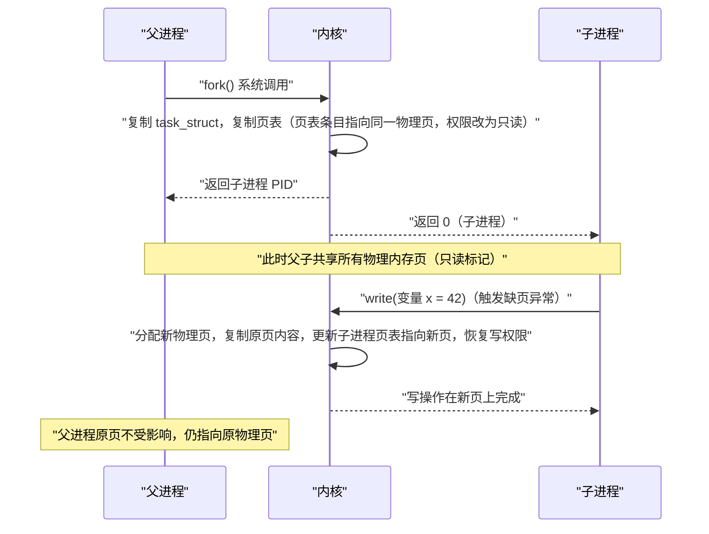

**摘要：**

`fork()` 是 Unix 系统设计中最优雅也最深刻的系统调用之一——通过"复制自身"来创建新进程，父子进程从同一个执行点开始，但随后走向不同的命运。这个看似简单的接口背后，是内核一套精心设计的实现：`sys_fork()` 只是入口，真正的工作由 `do_fork()` 和 `copy_process()` 完成——分配新 `task_struct`、复制或共享父进程的各种资源（内存、文件、信号）、为子进程建立内核栈、将子进程加入调度队列。其中最关键的设计是**写时复制（Copy-on-Write，CoW）**：`fork()` 之后父子进程共享同一套物理内存页，只有在某一方发生写操作时才触发页面复制，将高频操作（创建进程）的代价压缩到极致。本文从用户态的 `fork()` 调用出发，沿着内核调用链逐层剖析，并深入解释 `clone()`、`vfork()` 为什么存在以及它们与 `fork()` 的本质区别。

---

## 第 1 章 fork 的设计哲学：为什么选择"复制"而非"创建"

### 1.1 Unix 的核心设计决策

在设计进程创建机制时，有两种截然不同的思路：

**思路 A（创建型）**：提供一个系统调用，让用户直接指定"我要运行哪个程序"，内核从头创建一个新进程并加载程序。Windows 的 `CreateProcess()` 就是这种思路的代表——一次调用完成进程创建和程序加载。

**思路 B（复制型）**：通过复制当前进程来创建新进程（`fork()`），新进程与父进程完全相同，然后再通过另一个系统调用（`exec()`）来替换为想要运行的程序。Unix/Linux 选择了这种思路。

**为什么 Unix 选择了"复制"？**

这是 Ken Thompson 和 Dennis Ritchie 在 PDP-7 上设计 Unix 时做出的决定，其背后的逻辑非常深刻：

1. **接口的正交性（Orthogonality）**：`fork()` 和 `exec()` 各自做一件事，而且做到极致。`fork()` 负责"创建一个新进程"，`exec()` 负责"让一个进程运行指定程序"。两者正交组合，覆盖了所有场景；而 `CreateProcess()` 将两件事混在一起，导致参数极其复杂（Windows 的 `CreateProcess` 有 10 个参数）。

2. **Shell 重定向的优雅实现**：Shell 执行 `ls | grep foo` 时，在 `fork()` 之后、`exec()` 之前，子进程可以自由地操作文件描述符（设置管道、重定向 stdin/stdout）。这在"创建型"接口中需要额外的机制支持，而在 `fork()` 模型中是自然而然的。

3. **`fork()` 本身就有用途**：很多场景只需要 `fork()`，不需要 `exec()`——守护进程的工作进程模型（prefork）、`system()` 调用、多进程并发处理（Nginx 的 master/worker）。如果没有 `fork()`，这些模式都需要更复杂的机制。

> [!note] 设计哲学：Unix 的正交性原则
> Unix 的设计哲学是"做一件事，并做好"（Do one thing and do it well）。`fork()` + `exec()` 的组合是这一哲学的完美体现：两个简单的原语，通过组合覆盖了所有进程创建场景，比单一的"万能"接口更加灵活和可组合。

### 1.2 fork 的核心挑战：复制的代价

`fork()` 的语义是"创建一个与父进程完全相同的副本"。在朴素实现中，这意味着：
- 复制父进程的整个虚拟地址空间（代码段、数据段、堆、栈）
- 复制文件描述符表
- 复制信号处理配置
- ……

对于一个占用 1GB 内存的服务进程，每次 `fork()` 都要复制 1GB 内存，代价是灾难性的——更何况很多场景中，`fork()` 之后紧接着就是 `exec()`（直接替换地址空间，之前复制的内存全部白费）。

**写时复制（Copy-on-Write，CoW）** 正是解决这个问题的关键设计。

---

## 第 2 章 写时复制：fork 性能的核心保障

### 2.1 CoW 的核心思想

CoW 的思想极为简洁：**`fork()` 时不复制内存，而是让父子进程共享同一套物理内存页，并将所有共享页面标记为只读（通过页表权限位）。当任意一方尝试写入某页时，触发缺页异常（Page Fault），内核在异常处理中才真正复制这一页，然后让写操作在副本上进行。**



### 2.2 CoW 的内核实现：页表权限位的精妙运用

CoW 的实现依赖硬件 MMU（内存管理单元）和内核缺页异常处理的协同：

**fork() 时的页表处理**：

`copy_process()` 调用 `copy_mm()` 来处理内存。`copy_mm()` 不复制物理页，而是：
1. 为子进程创建一个新的 `mm_struct`（独立的地址空间描述符）
2. 遍历父进程的所有 VMA（虚拟内存区域）
3. 对每个可写的 VMA，在父子进程的页表中，将对应的页表条目（PTE）的写权限位（`_PAGE_RW`）清除，同时增加物理页的引用计数

```c
/* 内核中 CoW 页表处理的核心逻辑（简化） */
static int copy_pte_range(...) {
    pte_t pte = *src_pte;

    /* 如果是可写页（且不是共享映射），清除写权限 */
    if (is_cow_mapping(vm_flags)) {
        /* 清除父进程页表中该页的写权限位 */
        ptep_set_wrprotect(src_mm, addr, src_pte);
        /* 子进程页表直接拷贝该 PTE（已是只读） */
        pte = pte_wrprotect(pte);
    }

    /* 增加物理页的引用计数（父子共享这一页） */
    get_page(page);

    /* 将（只读的）PTE 写入子进程页表 */
    set_pte_at(dst_mm, addr, dst_pte, pte);
}
```

**写操作时的 CoW 触发**：

当子进程（或父进程）尝试写入只读页时，CPU 产生缺页异常（Page Fault，错误码中 `FAULT_FLAG_WRITE` 置位）。内核的缺页异常处理函数 `do_page_fault()` → `handle_mm_fault()` → `do_wp_page()` 执行 CoW：

```c
/* do_wp_page：处理写时复制的缺页异常（大幅简化） */
static vm_fault_t do_wp_page(struct vm_fault *vmf) {
    struct page *old_page = vmf->page;

    /* 检查该物理页的引用计数 */
    if (page_count(old_page) == 1) {
        /* 只有一个引用者（另一方已经 CoW 了），直接将页权限改回可写 */
        /* 这是一个重要优化：避免不必要的页面复制 */
        wp_page_reuse(vmf);
        return VM_FAULT_WRITE;
    }

    /* 引用计数 > 1：需要真正复制这一页 */
    /* 1. 分配一个新的物理页 */
    struct page *new_page = alloc_page(GFP_HIGHUSER_MOVABLE);

    /* 2. 将旧页内容复制到新页 */
    copy_user_highpage(new_page, old_page, vmf->address, vma);

    /* 3. 更新当前进程的页表条目，指向新页，并恢复写权限 */
    set_pte_at(mm, vmf->address, vmf->pte,
               mk_pte(new_page, vma->vm_page_prot));

    /* 4. 减少旧页的引用计数 */
    put_page(old_page);

    return VM_FAULT_WRITE;
}
```

### 2.3 CoW 的性能影响与实际开销

CoW 将 `fork()` 的开销从"复制所有物理内存"降低到"复制页表"。但 CoW 并非零代价：

**CoW 的实际开销**：
1. **`fork()` 时**：需要遍历并复制整个页表层级。对于大进程（如 1GB 内存），页表本身就可能有几 MB，复制页表是主要开销
2. **首次写入时**：每次 CoW 触发都有缺页异常的开销（保存寄存器、进入内核、分配新页、复制页内容、更新页表、返回用户态），大约几微秒
3. **写入密集场景**：如果 `fork()` 后子进程大量写入，会触发大量 CoW，总体开销可能超过直接复制

> [!warning] 生产避坑：Redis fork 与 CoW 内存膨胀
> Redis 执行 RDB 快照时会 `fork()` 出一个子进程来持久化数据。此时父进程（Redis 主进程）继续处理写请求，每次写操作都触发 CoW——父进程修改的每个内存页都会被复制一份。如果 Redis 正在高频写入，且数据量大（如 10GB），fork 期间内存使用量可能翻倍（父进程 10GB + CoW 复制的修改页）。这是 Redis 在进行 BGSAVE 时出现内存爆涨、进而触发 OOM 的根本原因。
> 监控指标：`redis-cli info memory` 中的 `rdb_last_cow_size` 字段记录了上次 RDB 快照期间 CoW 复制的字节数。

---

## 第 3 章 fork 的内核调用链

### 3.1 从用户态到内核态

用户程序调用 `fork()`，经历以下路径进入内核：

```
用户态：
  fork()
    ↓ (glibc 包装)
  syscall 指令（x86-64）/ svc 指令（ARM64）
    ↓ (CPU 切换到特权级，跳转到系统调用入口)
内核态：
  entry_SYSCALL_64（系统调用入口点）
    ↓
  do_syscall_64()
    ↓
  sys_fork()   ← fork 的系统调用处理函数
    ↓
  kernel_clone(SIGCHLD, ...)   ← Linux 5.x 统一的克隆入口
    ↓
  copy_process()   ← 核心：创建新 task_struct 并复制资源
    ↓
  wake_up_new_task()   ← 将子进程加入调度队列
```

`sys_fork()` 的实现（Linux 5.x）：

```c
SYSCALL_DEFINE0(fork)
{
    struct kernel_clone_args args = {
        .exit_signal = SIGCHLD,  /* 子进程退出时给父进程发送 SIGCHLD */
    };
    return kernel_clone(&args);
}
```

注意：`fork()` 实际上是 `clone()` 的特例——`fork()` 使用默认的 `clone_flags`（只传 `SIGCHLD`），而 `clone()` 允许精细控制哪些资源共享（详见第 5 章）。

### 3.2 copy_process：进程创建的核心

`copy_process()` 是 `fork()` 最重要的函数，负责创建新进程的 `task_struct` 并填充所有字段。其主要步骤：

```c
static struct task_struct *copy_process(
    struct pid *pid,
    int trace,
    int node,
    struct kernel_clone_args *args)
{
    int retval;
    struct task_struct *p;

    /* === 步骤 1：安全性检查 === */
    /* 检查 clone_flags 的合法性（如不能同时设置 CLONE_NEWNS | CLONE_FS）*/
    retval = security_task_create_flags(clone_flags);

    /* === 步骤 2：复制 task_struct === */
    /* 从 task_struct Slab 缓存分配一个新的 task_struct */
    /* dup_task_struct 同时为新进程分配内核栈 */
    p = dup_task_struct(current, node);
    /* 此时 p 是 current 的完整拷贝（包括所有字段）*/

    /* === 步骤 3：初始化新 task_struct 的各字段 === */
    /* 重置统计信息（CPU 时间、内存使用量等不继承父进程的历史数据）*/
    p->utime = p->stime = 0;
    p->start_time = ktime_get_ns();

    /* === 步骤 4：按 clone_flags 复制或共享各子系统 === */
    /* 4a. 复制或共享文件描述符表 */
    retval = copy_files(clone_flags, p);
    /* 若 CLONE_FILES 置位：共享父进程的 files_struct（引用计数 +1）*/
    /* 否则：创建新的 files_struct，复制父进程的 fd 映射 */

    /* 4b. 复制或共享文件系统信息（当前目录、根目录）*/
    retval = copy_fs(clone_flags, p);

    /* 4c. 复制或共享信号处理函数 */
    retval = copy_sighand(clone_flags, p);

    /* 4d. 复制信号状态（pending 信号被清空，不继承父进程的待处理信号）*/
    retval = copy_signal(clone_flags, p);

    /* 4e. 复制或共享内存（CoW 的关键调用点）*/
    retval = copy_mm(clone_flags, p);

    /* 4f. 复制或共享 Namespace */
    retval = copy_namespaces(clone_flags, p);

    /* 4g. 复制 IO 上下文（IO 调度相关）*/
    retval = copy_io(clone_flags, p);

    /* 4h. 复制线程（架构相关：设置子进程的寄存器状态）*/
    retval = copy_thread(p, args);
    /* 关键：设置子进程的 pc（程序计数器）和返回值 */
    /* 子进程从 ret_from_fork 开始执行，返回值为 0 */

    /* === 步骤 5：分配 PID === */
    pid = alloc_pid(p->nsproxy->pid_ns_for_children, ...);
    p->pid = pid_nr(pid);   /* 全局 PID */
    p->tgid = p->pid;       /* 对于 fork，tgid = pid（新线程组） */
    /* 若 CLONE_THREAD 置位（创建线程）：tgid = current->tgid（加入父进程的线程组）*/

    /* === 步骤 6：加入进程树 === */
    /* 设置父子关系 */
    p->real_parent = current;
    p->parent = current;
    /* 加入 current 的 children 链表 */
    list_add_tail(&p->sibling, &p->real_parent->children);

    /* === 步骤 7：加入全局进程列表 === */
    /* init_task.tasks 是双向循环链表，连接所有进程 */
    list_add_tail_rcu(&p->tasks, &init_task.tasks);

    /* 将新进程加入 PID hash 表（方便通过 PID 快速查找 task_struct）*/
    attach_pid(p, PIDTYPE_PID);

    return p;
}
```

### 3.3 子进程如何知道自己是子进程

`fork()` 在父进程中返回子进程的 PID（> 0），在子进程中返回 0。这是如何实现的？

关键在 `copy_thread()`（架构相关实现）。以 x86-64 为例：

```c
/* arch/x86/kernel/process.c */
int copy_thread(struct task_struct *p, const struct kernel_clone_args *args)
{
    struct pt_regs *childregs = task_pt_regs(p);  /* 子进程内核栈顶的 pt_regs */

    /* 将父进程的寄存器状态复制到子进程的内核栈 */
    *childregs = *current_pt_regs();

    /* 关键：将子进程 pt_regs 中的 ax 寄存器（系统调用返回值）设为 0 */
    childregs->ax = 0;  /* 子进程 fork() 返回 0 */

    /* 设置子进程的内核态栈指针，指向 ret_from_fork */
    /* 子进程第一次被调度时，从 ret_from_fork 开始执行 */
    p->thread.sp = (unsigned long)childregs;
    p->thread.ip = (unsigned long)ret_from_fork;

    /* 父进程的 fork() 系统调用正常返回子进程 PID（在 kernel_clone 中设置）*/
    return 0;
}
```

子进程被调度器首次选中运行时，从 `ret_from_fork` 开始执行，从内核栈弹出 `pt_regs`（其中 `ax=0`），返回用户态，用户态看到 `fork()` 返回 0。

### 3.4 父子进程的执行顺序

`copy_process()` 完成后，`kernel_clone()` 调用 `wake_up_new_task()` 将子进程加入调度器的就绪队列。此时父子进程都处于就绪状态，谁先运行由调度器决定。

**Linux 的策略是：子进程优先运行（Linux 3.x 之后的默认行为）**。

为什么让子进程先运行？因为很多 `fork()` 之后子进程会立即执行 `exec()`（替换地址空间），如果父进程先运行且修改了共享内存页，会触发 CoW，而子进程随后的 `exec()` 会丢弃这些 CoW 副本，造成浪费。让子进程先运行并执行 `exec()`，可以直接释放与父进程共享的页面，减少 CoW 开销。

这个行为由 `/proc/sys/kernel/sched_child_runs_first` 控制（1 = 子进程先运行）。

---

## 第 4 章 vfork：为什么存在，为什么几乎被淘汰

### 4.1 vfork 的历史动机

在 CoW 被引入之前，`fork()` 必须完整复制父进程的地址空间，开销极大。彼时有大量代码遵循 `fork()` + `exec()` 的模式（`fork()` 后立即 `exec()`，不使用父进程的内存），完整复制内存完全是浪费。

`vfork()` 就是在这个背景下诞生的优化：

```c
SYSCALL_DEFINE0(vfork)
{
    struct kernel_clone_args args = {
        .flags = CLONE_VFORK | CLONE_VM,  /* 关键：CLONE_VM = 与父进程共享同一个 mm_struct */
        .exit_signal = SIGCHLD,
    };
    return kernel_clone(&args);
}
```

**`vfork()` 的特殊语义**：
1. 子进程与父进程**共享同一个虚拟地址空间**（`CLONE_VM`）——完全不复制任何内存
2. **父进程被挂起**（`CLONE_VFORK`），直到子进程调用 `exec()` 或 `exit()`，父进程才被唤醒
3. 父进程挂起期间，子进程独占地址空间，可以安全读写（因为父进程不在运行）

**为什么父进程必须挂起？**

因为父子共享同一 `mm_struct`——如果父进程继续运行并修改内存，子进程看到的数据也会变化（这是共享映射的语义），必然出现竞态条件。`vfork()` 通过"父进程暂停"来规避并发问题，代价是牺牲并发性。

### 4.2 vfork 为什么几乎被淘汰

Linux 引入 CoW 之后，`fork()` + CoW 的开销已经足够小（只需复制页表，不需要复制物理内存），`vfork()` 的性能优势几乎消失。更重要的是，`vfork()` 的使用极其危险：

```c
/* vfork 的正确用法（极为受限）*/
pid_t pid = vfork();
if (pid == 0) {
    /* 子进程中：只允许调用 exec 家族函数或 _exit() */
    execve("/bin/ls", argv, envp);
    _exit(1);  /* exec 失败时只能用 _exit，不能用 exit() */
}
/* 父进程在这里等待，直到子进程 exec 或 _exit */
```

**为什么子进程不能调用普通 `exit()`？**

`exit()` 会执行 C 运行库的清理函数（`atexit` 回调、刷新 stdio 缓冲区），这些清理函数会修改父子共享的内存（如 `FILE` 结构体的缓冲区），导致父进程的状态被污染。`_exit()` 直接进行系统调用退出，不执行任何用户态清理。

**为什么子进程不能修改局部变量？**

子进程的栈帧也是父进程栈的一部分（共享 `mm_struct`）——子进程修改的局部变量，父进程恢复运行后也能"看到"这些修改（因为共享栈内存），可能导致父进程栈帧损坏。

> [!warning] 生产避坑：现代代码中禁止使用 vfork
> `vfork()` 在 POSIX 标准中已被标记为"过时的"。现代 glibc 的 `posix_spawn()`（用于替代 `fork()` + `exec()` 的组合）底层实现使用的是 `clone()` 加 `CLONE_VM` + `CLONE_VFORK` 的组合，但通过严格的接口封装规避了 `vfork()` 的陷阱。新代码应使用 `fork()` 或 `posix_spawn()`，绝对避免直接调用 `vfork()`。

---

## 第 5 章 clone：fork 的泛化形式

### 5.1 clone 是 fork 的本质

在现代 Linux 内核中，`fork()`、`vfork()`、`pthread_create()` 底层都调用同一个接口——`clone()`（或其内核内部版本 `kernel_clone()`）。三者的区别只是传给 `clone()` 的 `flags` 参数不同：

```c
/* fork() 等价于：*/
clone(SIGCHLD, ...)
/* 不设置任何 CLONE_* 标志：不共享任何资源，完全独立的子进程 */

/* vfork() 等价于：*/
clone(CLONE_VFORK | CLONE_VM | SIGCHLD, ...)
/* 共享地址空间，父进程挂起 */

/* pthread_create() 等价于（简化）：*/
clone(CLONE_VM | CLONE_FS | CLONE_FILES | CLONE_SIGHAND | CLONE_THREAD | SIGCHLD, ...)
/* 共享几乎所有资源，但加入同一线程组 */
```

### 5.2 clone 的关键 flags 解析

| 标志 | 含义 | fork 时 | pthread_create 时 |
|------|------|---------|-------------------|
| `CLONE_VM` | 共享虚拟地址空间（`mm_struct`）| ❌ 复制 | ✅ 共享 |
| `CLONE_FS` | 共享文件系统信息（当前目录、umask）| ❌ 复制 | ✅ 共享 |
| `CLONE_FILES` | 共享文件描述符表 | ❌ 复制 | ✅ 共享 |
| `CLONE_SIGHAND` | 共享信号处理函数表 | ❌ 复制 | ✅ 共享 |
| `CLONE_THREAD` | 加入父进程的线程组（tgid 相同）| ❌ 新线程组 | ✅ 同线程组 |
| `CLONE_NEWPID` | 创建新的 PID Namespace | ❌ | ❌ (容器用) |
| `CLONE_NEWNET` | 创建新的 Network Namespace | ❌ | ❌ (容器用) |
| `CLONE_VFORK` | 父进程挂起直到子进程 exec/exit | ❌ | ❌ |

**容器创建**就是使用了 `CLONE_NEWPID | CLONE_NEWNET | CLONE_NEWNS | ...` 等标志，在 `clone()` 时为新进程创建全新的各类 Namespace。

### 5.3 实战：用 strace 观察 fork 的系统调用

```bash
# 用 strace 追踪 bash 执行 ls 命令时的 fork
strace -e trace=clone,execve bash -c "ls /tmp" 2>&1

# 输出示例（Linux 5.x 用 clone3 替代了 clone）：
# clone3({flags=CLONE_CHILD_SETSTID|CLONE_CHILD_CLEARTID, ...
#          exit_signal=SIGCHLD}, 88) = 12345
# [子进程 12345]
# execve("/usr/bin/ls", ["ls", "/tmp"], ...) = 0
# exit_group(0)

# fork() 的 flags 中包含 SIGCHLD：子进程退出时通知父进程
# exit_signal=SIGCHLD 对应 fork() 的语义

# 用 strace 观察 pthread_create：
strace -e trace=clone -f ./my_pthread_program 2>&1 | grep clone
# clone(child_stack=..., flags=CLONE_VM|CLONE_FS|CLONE_FILES|CLONE_SIGHAND|
#       CLONE_THREAD|CLONE_SYSVSEM|...) = 12346
# 注意 CLONE_THREAD 和 CLONE_VM 标志，表明这是线程创建
```

---

## 第 6 章 fork 的性能基准与生产考量

### 6.1 fork 的实际开销

在现代 Linux 系统上，一次 `fork()` 的典型开销：

| 进程状态 | fork 耗时（x86-64，Linux 5.x）|
|---------|------------------------------|
| 最小进程（几乎无内存映射）| ~50 微秒 |
| 中等进程（100MB 内存）| ~500 微秒（主要是页表复制）|
| 大进程（1GB 内存）| ~5 毫秒（页表复制开销显著）|

**主要开销来源**（CoW 之后）：
1. 分配新 `task_struct` 和内核栈（Slab 分配，很快）
2. **复制页表**（与进程内存映射数量成正比，这是大进程 `fork()` 慢的主因）
3. 将所有可写页面标记为只读（遍历页表，与物理页数量成正比）
4. 分配新 PID

### 6.2 prefork 模式：Apache/Nginx 的选择逻辑

许多高性能服务器使用 prefork 模型：master 进程在服务启动时就 `fork()` 出若干 worker 进程，每个 worker 独立处理请求。

**为什么在启动时 fork，而不是在每次请求时 fork？**

1. **复用初始化开销**：数据库连接池、配置文件加载、动态库加载……这些昂贵的初始化操作只做一次（在 master 中），fork 时子进程通过 CoW 继承这些数据，真正需要时才复制（如果根本不修改，则完全不复制）
2. **避免 fork 热路径**：请求处理路径上不出现 `fork()`，避免高并发下的 fork 开销

**CoW 与 prefork 的微妙交互**：

Nginx 的每个 worker 进程启动后，随着请求处理，会逐渐写入自己的内存（日志缓冲区、连接状态等），触发 CoW，worker 的内存使用量逐渐增大。这是正常现象——CoW 页面只会越来越多，不会减少（除非进程退出）。

---

## 小结

`fork()` 的内核之旅贯穿了操作系统的多个核心子系统：

**调用链**：`sys_fork()` → `kernel_clone()` → `copy_process()` → `wake_up_new_task()`

**`copy_process()` 的核心工作**：
- 调用 `dup_task_struct()` 分配新 `task_struct` 和内核栈
- 按 `clone_flags` 决定每类资源是"复制"还是"共享"（引用计数 +1）
- 调用 `copy_thread()` 设置子进程的寄存器状态（`ax=0` → 子进程返回 0）
- 分配 PID，建立父子关系，加入进程树和调度队列

**CoW 的精髓**：`fork()` 时只复制页表（不复制物理内存），所有可写页标记为只读；写操作触发缺页异常，内核在异常处理中才真正复制那一页。CoW 将 `fork()` 的内存开销从 O(内存量) 降低到 O(页表大小)。

**clone 是本质**：`fork()`、`vfork()`、`pthread_create()` 都是 `clone()` 的特例，区别仅在于 `flags` 参数控制哪些资源被共享。

下一篇 [[04 进程的灵魂替换——exec 家族与程序加载]] 将接续 `fork()` 的故事：子进程创建完成后，如何通过 `execve()` 彻底替换为新程序——包括 ELF 文件格式的解析、新地址空间的建立，以及动态链接器 `ld-linux.so` 的介入时机。

---

> [!note] 思考题
> 1. CFS 使用'虚拟运行时间'（vruntime）作为调度键——vruntime 最小的进程优先运行。高优先级（低 nice 值）的进程 vruntime 增长更慢——因此获得更多 CPU 时间。nice 值从 -20 到 19 映射到权重——nice 值每增加 1，进程获得的 CPU 时间减少约 10%。在一个 nice=0 和 nice=19 的进程竞争同一个 CPU 时，它们的 CPU 时间比例大约是多少？
> 2. CFS 使用红黑树（按 vruntime 排序）管理可运行进程。`pick_next_task` 选择红黑树最左节点——O(1) 复杂度。但进程入队/出队是 O(log n)。在进程数量达到数万时，红黑树的调度开销是否成为瓶颈？CFS bandwidth throttling（CGroups CPU 限制）是如何在 CFS 基础上实现的？
> 3. CFS 的调度延迟（`sched_latency_ns`，默认 6ms）保证每个可运行进程在这个时间窗口内至少执行一次。如果有 100 个可运行进程，每个进程的时间片是 60μs——频繁的上下文切换会导致 TLB 和 Cache 污染。在什么场景下你需要增大 `sched_latency_ns`？这对交互式应用的响应性有什么影响？
