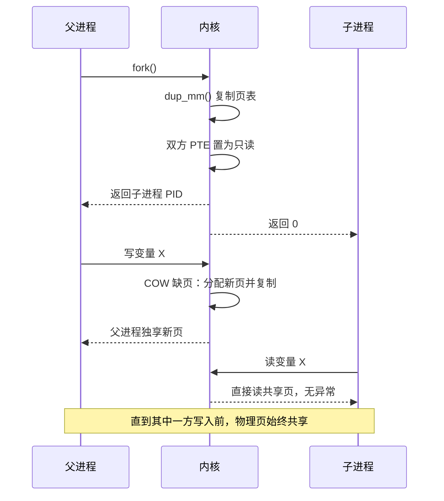

# 03 进程的诞生——fork 的内核之旅

**摘要：**

Unix 创建进程的方式在四十多年里一直让从其它系统转过来的人感到意外：它不提供一个"用给定参数启动某个程序"的调用，而是提供一个"把当前进程完整复制一份"的调用，让复制出来的那一份自己去变成别的程序。这种"复制而非创建"的选择，是 `fork()` 全部优点的来源，也是它全部麻烦的来源。本文沿着一条 `fork()` 从用户态进入内核、再带着一个新进程返回的完整路径展开：先看 `kernel_clone()` 的骨架与它从 `do_fork` 改名而来的历史，再把 `copy_process()` 拆成检查与定身份、复制资源、调度收尾三个阶段逐项讲解，重点说明 `dup_task_struct()`、`copy_mm()`、`copy_thread()` 各自做了什么、失败时如何分级回滚。随后深入写时复制（Copy-on-Write，COW）——为什么它只复制页表而不复制数据、只读映射与缺页异常如何配合、以及它在页表规模上的真实代价。文章还系统梳理 `fork()` 的几类陷阱：fork 炸弹、多线程程序里只能调用 async-signal-safe 函数这条 POSIX 约束、`malloc` 锁导致的死锁、以及文件描述符泄漏。最后讨论 `vfork()`、`posix_spawn()`、`clone3()` 三条替代路线的取舍，并给出一份"什么场景该用哪种创建方式"的判断依据。全文回答两个问题：`fork()` 在内核里究竟做了什么，以及为什么现代系统越来越不鼓励直接使用它。

---

## 第 1 章 复制而非创建

### 1.1 一个反常的接口设计

如果让今天的人重新设计进程创建接口，多数人的直觉会是一个类似 `CreateProcess(command, args)` 的调用：给定程序路径与参数，返回新进程的句柄。Windows 的 `CreateProcess()` 正是这个形态，它把"创建进程"与"装载程序"合并成一个步骤。

Unix 的答案与此相反：`fork()` 不带任何参数，它做的事只有一件——把调用者完整复制一份，父子两个进程从同一个位置继续执行，只有返回值不同（父进程拿到子进程的 PID，子进程拿到 0）。要执行另一个程序，子进程需要自己再调用一次 `execve()`。**创建与装载被拆成了两个独立步骤**，这是 Unix 进程模型最独特的特征。

### 1.2 为什么是复制

这个设计在 1970 年代是自然的选择。当时的 Unix 只支持单线程进程，内存以几十 KB 计，复制一个进程的代价在可接受范围内；而分时系统里最常见的操作恰恰就是"再开一个 shell"，`fork()` 用一个不带参数、语义极简的调用覆盖了这个场景。

更关键的是，`fork()` 提供的不是"创建进程"，而是**"让一个进程继续运行、同时让另一个副本去做别的事"**。这个能力在 shell 里随处可见：管道 `a | b` 需要先 `fork` 两个子进程、在各自进程里重定向 fd、再分别 `execve`，而重定向之所以能生效，正是因为子进程可以在 `execve` 之前修改自己的文件描述符表。用 `CreateProcess(command, args)` 的模型表达"运行 b 但把 stdout 接到管道"，就不得不为这种需求额外设计参数。

### 1.3 反事实：如果只有 spawn 模型

不妨设想一个没有 `fork()` 的系统会遇到什么。守护进程的经典写法——`fork()` 之后父进程退出、子进程 `setsid()` 脱离控制终端——在没有 `fork()` 的世界里需要操作系统提供专门的"脱壳"接口。shell 的作业控制、`system()` 的实现、`popen()` 的实现、以及无数需要"先设置上下文再执行程序"的场景，都会变成对内核的定制请求。

反过来说，`fork()` 也付出了它的代价：**它把"复制整个进程地址空间"这件事变成了进程创建的默认行为**，而绝大多数场景下，被复制出来的副本马上就 `execve` 把刚复制的东西全部扔掉。用一句话概括这笔交易的荒谬之处——你付了复印整本书的钱，只是为了在扉页上写一个名字，然后把整本书换成另一本。写下时复制（Copy-on-Write）正是为了把这张账单抹掉，而 `posix_spawn()` 则是从接口层面承认了这笔交易本来就不该做。

### 1.4 一个三态返回值

`fork()` 的返回值有三个分支，这是它区别于绝大多数系统调用的地方：

```c
pid_t pid = fork();
if (pid < 0) {
    /* 创建失败：errno 里有原因，常见 EAGAIN / ENOMEM */
} else if (pid == 0) {
    /* 这是子进程：pid 变量在子进程里被置为 0 */
} else {
    /* 这是父进程：pid 是子进程的进程号 */
}
```

三段代码在同一个函数体里，却分别在两个不同的进程地址空间里执行。这个形态给代码组织带来了实际困难：一个函数里同时写着父进程逻辑与子进程逻辑，两条路径上的资源所有权不同（子进程退出时要 `_exit()` 而不是 `exit()`，否则会把父进程的 `stdio` 缓冲区冲刷两遍），局部变量的含义也随分支而变。

更麻烦的是错误处理的对称性。子进程在 `fork` 之后如果因为某种原因需要放弃执行，必须调用 `_exit()` 而不是 `exit()`，否则会触发 `atexit()` 注册的回调与 `stdio` 缓冲区的冲刷——那些回调可能正在父进程的另一个线程里执行，冲刷同一个缓冲区会导致输出重复。`exit()` 与 `_exit()` 的这一字之差，是 `fork` 相关代码里最常见的 bug 来源之一，而且它的表现（日志出现重复行）往往被误判为日志系统的问题。

---

## 第 2 章 从用户态到内核

### 2.1 glibc 里的 `fork()` 其实是 `clone`

在 glibc 的实现里，`fork()` 并不对应一个叫 `fork` 的系统调用。现代 Linux 上唯一用于创建进程/线程的系统调用是 `clone`（以及它的继任者 `clone3`），`fork()` 与 `pthread_create()` 都是对它不同参数组合的封装：

```c
/* glibc 里 fork 的本质：只传 SIGCHLD，不共享任何资源 */
pid_t fork(void)
{
    return __clone(SIGCHLD, 0, NULL, NULL, NULL);
}
```

`clone()` 的第一个参数是子进程退出时发给父进程的信号（`SIGCHLD` 表示"退出时通知我，但别做别的事"），第二个参数是标志位集合。`fork()` 传空标志，表示子进程与父进程**不共享任何资源**；`pthread_create()` 则传 `CLONE_VM | CLONE_FS | CLONE_FILES | CLONE_SIGHAND | CLONE_THREAD | CLONE_SYSVSEM | CLONE_SETTLS | CLONE_PARENT_SETTID | CLONE_CHILD_CLEARTID`，表示除了寄存器与内核栈之外几乎全部共享。第 07 篇会展开这些标志的组合逻辑。

### 2.2 系统调用入口

用户态的 `clone` 指令（x86-64 上是 `syscall` 指令）进入内核后，落在 `arch/x86/entry/entry_64.S` 定义的入口点，内核把用户态寄存器保存到一个 `pt_regs` 结构里，然后按系统调用号分派到 `__x64_sys_clone()`。

这一步留下的 `pt_regs` 是理解 `fork()` 语义的关键。它保存的是**父进程此刻的用户态寄存器现场**，包括指令指针 `ip` 与栈指针 `sp`。子进程被创建之后，它的内核栈里也会有一份 `pt_regs` 的副本，内容与父进程几乎相同——这就是为什么两个进程会"从同一个位置继续执行"。差异只在返回值寄存器 `ax` 上：父进程的 `ax` 被改写成子进程 PID，子进程的 `ax` 被置为 0。

### 2.3 `kernel_clone()` 的骨架

把所有检查都算上，`fork()` 的内核主线可以压缩成下面这样的几步：

| 步骤 | 关键函数 | 做什么 |
| :--- | :--- | :--- |
| 权限与参数检查 | `clone` 入口、`copy_flags` | 校验 flags 合法性，检查 `CLONE_*` 组合约束 |
| 复制进程 | `copy_process()` | 见第 3 章的三个阶段 |
| 唤醒新任务 | `wake_up_new_task()` | 把新进程入队，可能立刻抢占当前 CPU |
| 返回并调度 | `schedule()` 路径 | 若设置了 `CLONE_VFORK` 则等待子进程 `exec` 或退出 |

`wake_up_new_task()` 里有一个值得注意的优化：如果新进程与当前进程运行在同一个 CPU 上，且当前进程没有其他可运行任务，内核可能不把 CPU 让出去，而是让新进程稍后运行。更激进的版本在 CFS 里有"直接抢占当前进程"的策略（`sched_child_runs_first` 与 `WF_FORK` 相关逻辑），目的是让刚刚 `fork` 出来的子进程尽快开始执行——因为紧接着它多半就要 `execve`，越早执行意味着 `fork` 到 `exec` 之间的窗口越短，COW 页表被真正复制的概率也越低。

### 2.4 一次改名：从 `do_fork` 到 `kernel_clone`

读过老内核代码的人会记得 `do_fork()`，而 5.10 之后的内核里这个名字消失了，取而代之的是 `kernel_clone()`。这次改动不只是改名，还把 `fork`/`vfork`/`clone`/`clone3` 四条入口的公共部分彻底合并到了一处，四个入口变成了同一段代码的四组参数：

```c
/* 四条入口最终都落到这里 */
pid_t kernel_clone(struct kernel_clone_args *args);
```

参数结构体 `kernel_clone_args` 把原先散落在各个函数签名里的十几个参数聚合起来，这个模式在内核里反复出现（`clone3` 用 `struct clone_args`、`openat2` 用 `struct open_how`）——**当参数多到一定程度，内核倾向于引入一个带长度字段的结构体**，因为结构体可以通过追加字段向前兼容，而函数签名不能。这条经验对设计任何长期演进的接口都适用。

### 2.5 两个进程的执行顺序没有保证

`fork()` 返回之后，父子两个进程谁先运行是不确定的。`wake_up_new_task()` 会把子进程放进运行队列，但调度器何时挑中它取决于当时的负载、CPU 亲和性、以及是否有其它更高优先级的任务。在单核机器上，父子进程的执行顺序通常取决于调度器的实现细节；在多核机器上，两者可能真正并行。

这个不确定性有一系列实际的后果：

- **输出交错**。如果父子进程都往同一个终端写，输出顺序无法预测。这也是 shell 里 `echo` 与后台任务输出互相穿插的原因。
- **依赖关系的竞态**。父进程如果不加同步就假设"子进程已经完成了初始化"，会遇到随机失败。正确的做法是用管道、`pidfd` 或信号做显式同步。
- **`wait` 的时机**。父进程在 `fork` 之后立刻 `wait` 会阻塞自己，直到子进程退出；而如果父进程先做别的事再 `wait`，子进程在此期间可能已经退出并成为僵尸，等待被回收。

有一处例外值得记住：当设置 `CLONE_VFORK` 时，父进程会被明确挂起，直到子进程 `execve` 或退出。这是唯一一个对执行顺序给出保证的创建方式，代价是它牺牲了父子并行性。

---

## 第 3 章 `copy_process`：复制一个进程

`copy_process()` 是整条路径上最长的一个函数，在 6.x 内核里有几百行。它的结构可以按"做什么"分成三个阶段。

### 3.1 第一阶段：检查与定身份

进入函数后的第一批操作是防御性的：

- **检查 flags 的合法组合**。`CLONE_THREAD` 必须与 `CLONE_SIGHAND` 同时出现（线程组内必须共享信号处置），`CLONE_SIGHAND` 又必须与 `CLONE_VM` 同时出现（共享信号处置意味着共享内存视图），`CLONE_NEWPID` 不能与 `CLONE_THREAD` 组合。这些约束看起来零碎，每一条背后都有具体的语义原因。
- **检查进程数限制**。`RLIMIT_NPROC` 限制的是某个真实 UID 名下的进程/线程总数，超过则返回 `EAGAIN`。这条限制在容器场景下尤其重要——它是抵御 fork 炸弹的第一道防线。
- **检查 ptrace 与安全策略**。判断调用者是否有权创建具有指定命名空间或凭证的子进程，LSM 钩子在这里介入。
- **分配 PID**。`alloc_pid()` 从当前 PID 命名空间的位图中取号，并把新 PID 结构挂到各级命名空间的哈希表上。
- **复制凭证**。`copy_creds()` 通常只是增加 `cred` 的引用计数；但如果设置了 `CLONE_NEWUSER` 或调用了 `setuid()` 之后有未提交的变更，则需要复制一份新的 `cred`。

这一阶段的产出是一个尚未与任何资源关联的 `task_struct`，以及它的身份（PID 与凭证）。

### 3.2 第二阶段：复制资源

接下来是逐项复制资源，每一项对应一个 `copy_*()` 函数，且都受某个 `CLONE_*` 标志的控制：

| 函数 | 目标 | 受控标志 | 未设置标志时的行为 |
| :--- | :--- | :--- | :--- |
| `dup_task_struct` | `task_struct` + 内核栈 | 无（总是复制） | — |
| `copy_semundo` | System V 信号量撤销状态 | `CLONE_SYSVSEM` | 复制一份撤销列表 |
| `copy_files` | `files_struct` | `CLONE_FILES` | 复制 fd 表，共享 `struct file` |
| `copy_fs` | `fs_struct` | `CLONE_FS` | 复制 cwd 与 root |
| `copy_sighand` | `sighand_struct` | `CLONE_SIGHAND` | 复制处置函数表 |
| `copy_signal` | `signal_struct` | `CLONE_THREAD` | 新建一份，初始化 `RLIMIT` 等 |
| `copy_mm` | `mm_struct` | `CLONE_VM` | 复制页表并标记 COW |
| `copy_namespaces` | `nsproxy` | 各 `CLONE_NEW*` | 共享父进程的 `nsproxy` |
| `copy_io` | `io_context` | `CLONE_IO` | 共享或新建 I/O 上下文 |
| `copy_thread` | 内核栈上的初始帧 | 无（总是执行） | — |

这张表是理解 `fork()` 与 `pthread_create()` 差异的钥匙：两者的差别不在于走了不同的代码路径，而在于**同一段代码在这张表上选了不同的列**。

`copy_mm()` 值得单独说明。对 `fork()`（未设置 `CLONE_VM`），它调用 `dup_mm()`：分配一个新的 `mm_struct`，把父进程的全部 VMA 复制过去，然后调用 `copy_page_range()` 为每一级页表逐项复制并设置写保护。整个过程中**没有一个用户数据页被复制**——这就是写时复制的全部秘密，第 4 章会展开。

### 3.3 第三阶段：调度与收尾

资源复制完成之后，内核还需要让新进程"准备好被调度"：

- `sched_fork()`：把新进程的状态设为 `TASK_NEW`，初始化它的调度实体，并决定它应该放在哪个 CPU 的运行队列上。对新创建的任务，CFS 会做一个特殊处理——把 `vruntime` 设为当前运行队列的最小值加一个偏移，而不是继承父进程的 `vruntime`，避免出现"新进程一上来就被饿死"或"一来就抢占一切"两种极端。
- `copy_thread()`：布置内核栈上的初始栈帧，让新任务第一次被调度时"看起来像是刚从 `schedule()` 返回"。对 `fork()` 而言，返回后 `rax` 里是 0，因此子进程看到 `fork()` 返回 0。
- `cgroup_can_fork()` / `cgroup_post_fork()`：把新进程挂进父进程所在的 cgroup。
- `wake_up_new_task()`：把新进程入队，这一步之后它就可能被调度执行。

### 3.4 失败回滚：分级清理

`copy_process()` 里最容易被忽略、也最能体现工程功底的部分是它的错误处理。函数里有十来个以 `bad_fork_*` 命名的跳转标签，按资源获取的逆序排列：

```c
bad_fork_free_pid:
    if (pid)
        free_pid(pid);
bad_fork_cancel_cgroup:
    cgroup_cancel_fork(p);
bad_fork_free:
    ...
```

这种写法的要点是**每个标签只负责释放它上面那一步成功获取的资源**，跳转时选择对应层级的标签即可，不需要在每个失败点上重复写清理代码。它与 C 语言缺少析构机制这一限制直接相关，在内核代码里是一种被广泛遵守的约定。

`fork()` 失败在生产上并不罕见。最常见的返回码是 `EAGAIN`（进程数达到 `RLIMIT_NPROC` 或系统级 `pid_max` 耗尽）与 `ENOMEM`（无法分配 `task_struct` 或页表）。这两者的区分在排障时很重要：前者要靠调限制，后者往往意味着内存已经紧张，继续加大限制只会让情况恶化。

### 3.5 `dup_task_struct` 与那些必须清空的字段

`dup_task_struct()` 的实现思路是"先整块复制、再定点修正"。它调用 `arch_dup_task_struct()` 把父进程的 `task_struct` 逐字节复制到新对象上，然后重置几个字段：

- `stack`：指向新分配的内核栈，绝不能沿用父进程的；
- `thread`：整个 `thread_struct` 被清零，因为它保存的是父进程的寄存器现场；
- `flags`：清掉 `PF_*` 系列标志里的若干位（如 `PF_SUPERPRIV`、`PF_FORKNOEXEC`），并重新设置 `PF_FORKNOEXEC` 表示"还没 exec 过"；
- 统计计数：`nvcsw`、`nivcsw`、`utime`、`stime` 等归零；
- 与锁相关的字段：`pi_lock`、`alloc_lock` 等重新初始化。

值得注意的是**没有**被清空的那部分：`prio`、`policy`、`cpus_mask`、`cgroup` 归属、`cred` 指针、`nsproxy` 指针全都保留。这就是"子进程继承父进程的调度属性、权限、命名空间"这一语义的实现方式——不是显式地逐项继承，而是复制之后不加修改。

哪些清空、哪些保留，实际上定义了 `fork` 的继承语义。把这两组字段列在一起看，规律就出来了：**属于"执行流的物理状态"的清空，属于"进程的策略与归属"的保留**。这个规律比记住具体字段名更有用，因为内核对 `task_struct` 字段的增删从未停止，而这条规律一直成立。

### 3.6 cgroup 归属：从继承到指定

在很长时间里，新进程的 cgroup 归属只有一种可能——继承父进程。内核在 `copy_process()` 里调用 `cgroup_can_fork()` 与 `cgroup_post_fork()`，把子进程挂进父进程所在的那一组。

这个"只能继承"的限制在 5.7 被打破，`clone3` 增加了 `CLONE_INTO_CGROUP` 标志，允许在创建时直接指定目标 cgroup，通过 `struct clone_args` 的 `cgroup` 字段传入一个 cgroup 目录的 fd。这项改动的动机来自容器调度：一个已经运行的服务进程要把新任务放进另一个 cgroup，用继承语义做不到，只能"先创建、再写入 `cgroup.procs`"，而这两步之间存在窗口，新进程会在错误的 cgroup 下短暂运行，占用不该占用的资源配额。`CLONE_INTO_CGROUP` 把这个两步操作变成了原子的创建即归属。

这个例子再次印证了第 2.4 节提到的那条经验：**接口一旦固定，新增能力的成本就会转移到参数扩展上**。`clone` 的位标志早已用满，所以是 `clone3` 的结构体承担了这项扩展；而如果当初设计时就把参数放进结构体里，`CLONE_INTO_CGROUP` 可能只需要一次头文件更新。

---

## 第 4 章 写时复制

### 4.1 只复制页表

写时复制的核心动作只有一个：**复制页表，并把两边指向同一物理页的页表项都标记为只读**。

在 x86-64 的四级页表结构下，一次 `fork()` 需要复制 PGD、PUD、PMD、PTE 四级。内核并不会无脑地把整棵页表树深拷贝：对一个超出进程地址空间范围、或者父进程从未使用的页表分支，`dup_mm()` 不会为它分配新页。同样，对应到具体的 PTE 时，如果父进程那个位置本来就是空的，也就无所谓复制。

真正会被复制的，是**父进程实际映射了物理页的那些 PTE**。这部分的数量与进程的常驻内存（RSS）成正比：一个 RSS 为 10GB 的进程执行 `fork()`，需要复制大约 260 万个 PTE（按 4KB 页计），仅这些 PTE 本身就占 20MB 内存，而复制它们需要遍历多层页表——这就是下一节要讲的代价。

### 4.2 只读映射与缺页异常的配合

标记成只读之后，父子两个进程对同一个物理页的**读取**可以继续并行进行，各自读到同样的内容，没有任何额外开销。

一旦其中一方尝试**写入**，CPU 会因为 PTE 的只读位而触发缺页异常（Page Fault）。内核的缺页处理函数检查这个地址对应的页是否属于 COW 范围，处理逻辑是：

1. 如果这个物理页的引用计数为 1（另一方已经不再引用它），直接把 PTE 改回可写，不做任何复制；
2. 如果引用计数大于 1，分配一个新物理页，把旧页内容复制过去，把当前进程的 PTE 指向新页并设为可写，旧页引用计数减一。

第二步里"引用计数为 1 时直接改回可写"这个分支至关重要。它意味着：如果父子进程中的一方在另一方写入之前就退出了，或者某一页始终只有一方在写，那么这一页永远不会被真正复制——COW 的收益因此比表面上看到的更大。

### 4.3 页的共享与回收

COW 依赖的引用计数存放在 `struct page` 的 `_refcount` 字段里。这里有一个容易忽略的细节：**COW 页的引用计数可能远大于 2**。原因是 `fork()` 可以被连续调用，A 进程 `fork` 出 B、B 再 `fork` 出 C，此时某个物理页可能被三个进程共享。

引用计数的另一个作用是决定释放时机。当 COW 页的引用计数降到 1 时，内核知道这个页已经独占，此时可以把它的 PTE 恢复为可写，之后不再需要触发缺页异常。这个优化被称为"回写独占"（exclusive writeback），它让"父子进程都存活但只有一方写入"的场景逐渐收敛到没有额外开销的状态。

对于确定不需要被子进程继承的大块映射，内核还提供了一个主动排除的手段：`madvise(addr, len, MADV_DONTFORK)` 会在这段 VMA 上设置 `VM_DONTCOPY` 标志，`dup_mm()` 遍历到它时直接跳过，既不复制页表也不在下游建立映射。这个机制常用于两类场景：一是把一块巨大的、子进程绝不会访问的缓冲区排除在复制范围之外，从而压低 `fork` 的成本；二是某些依赖固定物理地址或唯一性假设的设备映射，子进程继承它们会破坏原有的语义。涉及 RDMA 与 GPU 显存映射的程序里，`MADV_DONTFORK` 常被用来避免子进程继承这些不该继承的区域。

### 4.4 COW 的真实代价

写时复制常被描述成"让 `fork()` 变得几乎免费"，这个说法需要修正。它免除的是**数据页复制**，没有免除的是：

- **页表复制**：与 RSS 成正比，不可省略。这是大内存进程 `fork` 变慢的主因。
- **TLB 失效**：父子进程共享的页被标记为只读后，之前那些可写的 TLB 条目必须失效；此后每一次写都会触发缺页异常，直到该页被独占为止。
- **缺页异常的开销**：每一次 COW 缺页都要走进异常处理路径，包括页分配、内存复制、页表更新。在"父进程 `fork` 后立即写大量内存"的模式下，这套开销与直接复制数据相比未必更省，只是把成本从 `fork` 时刻推迟到了写入时刻。
- **内存超售的幻觉**：`fork` 之后父子进程的 RSS 相加会大于实际占用的物理内存，因为共享的页被计了两次。`ps` 输出里的 RSS 在 fork 之后会出现"看起来内存翻倍"的现象，这在容量规划时经常造成误判。

把这四点合起来看，结论是清楚的：**COW 把 `fork` 的成本从"与内存规模成正比"降到了"与页表规模成正比"，这是一个巨大的改善，但仍然是线性复杂度**。在一个长期运行的 JVM 进程（RSS 数十 GB）上执行 `fork`，即使立即 `execve`，也要付出复制几百万个 PTE 的代价，停顿可能达到几十毫秒。这正是 `posix_spawn()` 与 `vfork()` 存在的理由。

### 4.5 COW 与映射类型的交互

`fork` 之后的页是否会被 COW 处理，取决于这个页是通过什么方式映射进来的。内核用页表项的"可写"位与 VMA 的 `vm_flags` 共同决定，具体可以分成四种情形：

| 映射方式 | `fork` 之后的行为 | 是否会触发 COW |
| :--- | :--- | :--- |
| `MAP_PRIVATE` 匿名映射（堆、栈） | 页表项置只读，双方共享 | 会 |
| `MAP_PRIVATE` 文件映射（共享库） | 只读页保持不变，可写段置只读 | 只读页不会，可写段会 |
| `MAP_SHARED` 匿名映射（`MAP_SHARED \| MAP_ANONYMOUS`） | 双方继续映射同一个物理页 | 不会 |
| `MAP_SHARED` 文件映射 | 双方继续共享，写回落到文件 | 不会 |

这张表解释了一个容易被忽略的事实：**只有 `MAP_PRIVATE` 的页才有 COW 语义**。`MAP_SHARED` 的映射在 `fork` 之后依然是真正共享的，父子进程对同一地址的写入互相可见——这不是 bug，而是共享内存（如 [[Linux/内存管理/01 虚拟内存：为什么每个进程都以为自己独占内存]] 里讨论的匿名共享映射）本来就是靠这个语义工作的。

共享库的情况更细一些。可执行代码段本身是只读的 `MAP_PRIVATE` 文件映射，`fork` 之后父子进程共享同一份物理页，而且由于页永远不可写，**它们永远不会被 COW 复制**。可写数据段（`.data`、`.bss`）虽然同样是 `MAP_PRIVATE` 文件映射，但在 `fork` 后会被置为只读，一旦写入就触发 COW——而且复制出来的页变成匿名页，与磁盘上的文件再无关系。



---

## 第 5 章 `fork()` 的成本与陷阱

### 5.1 fork 炸弹

`fork` 的语义里没有任何"每个进程只能创建 N 个子进程"的约束，于是一个进程可以不断自我复制，形成指数级增长。经典的 shell 版本只有一行：

```bash
# 经典 fork 炸弹：每个进程不断复制自己
# Linux 上它的实际效果受 RLIMIT_NPROC 限制
:(){ :|:& };:
```

抵御它的机制有几层。`RLIMIT_NPROC` 限制单个 UID 的进程总数，是默认生效的一层；cgroup 的 `pids.max` 提供容器粒度的限制；而 systemd 的 `TasksMax` 则把它接到了服务单元上。这些限制的意义不只是防恶意攻击——一个因为 bug 而不断 `fork` 子进程的服务，其破坏效果与 fork 炸弹完全相同，而限制能在它把系统拖垮之前拦住。

需要留意的是 `RLIMIT_NPROC` 的统计口径：它按**真实 UID** 统计，因此对以同一用户运行的多个服务是共享的。一个服务把进程数用满，其它同用户的服务也跟着 `fork` 失败。这种耦合在生产上造成过不少"看起来毫不相干的进程互相影响"的故障。

### 5.2 多线程程序里的 `fork`

POSIX 对 `fork()` 在多线程程序中的行为给出了一个明确的约束：**在子进程中，只允许调用 async-signal-safe 函数，直到调用 `execve()` 为止**。

这条约束的原因在于 `fork()` 只复制调用线程。假设进程里有三个线程，其中线程 B 正在执行 `malloc()` 并且已经获取了分配器的内部锁，此时线程 A 调用 `fork()`，子进程里只有 A 的副本——**B 不存在了，但 B 持有的那把锁在子进程里仍然处于已加锁状态**。子进程如果接着调用 `malloc()`，就会永远等在一把没有持有者的锁上，死锁由此产生。

这个问题的正统解法只有两条：要么在 `fork` 之后立刻 `execve`（换掉整个地址空间，锁的状态随之消失），要么在 `fork` 前后用 `pthread_atfork()` 注册处理函数，在 `prepare` 阶段获取所有关键锁、在 `parent` 与 `child` 阶段释放它们。`pthread_atfork()` 的实践效果并不理想——它要求所有依赖的库都正确注册，而第三方库往往不做这件事。

### 5.3 `malloc` 之外的锁

除了内存分配器，还有几处常见的"fork 之后锁状态不一致"来源：

| 锁 | 位置 | 症状 |
| :--- | :--- | :--- |
| `malloc` 内部锁 | glibc 分配器 | 子进程调用 `malloc` 时挂起 |
| `stdio` 锁 | `FILE` 对象的锁 | 子进程调用 `printf` 时挂起 |
| 应用层全局锁 | 业务代码 | 子进程访问共享数据时挂起 |
| DNS 解析器锁 | glibc resolver | 子进程做名称解析时挂起 |

其中 `stdio` 这一条尤其隐蔽：`fork` 之后子进程如果调用 `printf`，而父进程的另一个线程当时正在 `printf` 且持有 `stdout` 的锁，子进程就会卡住。正确的做法是用 `write()` 而不是 `printf()`——`write` 是 async-signal-safe 的，`printf` 不是。

### 5.4 文件描述符的泄漏

第 01 篇已经讲过 `fork` 与 `execve` 各自的 fd 继承规则。这里补充一个由 `fork` 单独造成的场景：**父进程在 `fork` 之后没有关闭不再需要的 fd**。

在"父进程负责监听 socket、子进程负责处理连接"的经典模型中，父进程接受连接后 `fork`，子进程持有连接 fd 与监听 fd。子进程如果不关闭监听 fd，那么这个 socket 就多了一个引用；父进程退出时，监听套接字不会真正关闭，端口仍然被占用。这个 bug 的表现是"服务重启时报 `Address already in use`"，而查 `lsof` 会发现占用端口的进程是某个早已不提供服务的子进程。

### 5.5 信号处置的继承与重置

`fork` 与 `execve` 对信号处置表的处理方式不同，这个差异是很多信号相关故障的根源：

| 信号处置 | `fork` 之后 | `execve` 之后 |
| :--- | :--- | :--- |
| 自定义处理函数（`sa_handler` 指向函数） | 继承 | **重置为 `SIG_DFL`** |
| `SIG_IGN` | 继承 | 继承 |
| `SIG_DFL` | 继承 | 继承 |

关键在第二行与第一行的对比。`fork` 之后子进程完整继承父进程的信号处置，包括自定义处理函数；而 `execve` 会把这些自定义处理函数**全部重置为默认动作**，因为新程序的地址空间里根本没有那些函数的代码，保留处置函数指针会导致执行到已卸载的内存。`SIG_IGN` 之所以能跨越 `execve` 保留，是因为它不指向任何代码——它是一个纯标记。

这条规则有一个直接后果：一个以 `SIG_IGN` 忽略 `SIGCHLD` 的进程，`execve` 之后新程序仍然忽略 `SIGCHLD`。如果新程序是一个需要 `wait` 子进程的服务框架，它会在完全不知情的情况下丢掉所有子进程退出通知，僵尸进程随之累积。反过来，一个显式注册了 `SIGCHLD` 处理函数的父进程，在 `execve` 之后这个处理函数被重置，新程序需要自己重新注册——这些差异对应用程序是不可见的，但排查时能看到截然不同的现象。

信号在 `fork` 与 `execve` 之间的另一个细节是待处理信号。`fork` 之后子进程的 `pending` 队列是空的，父进程当前待处理的信号不会复制给子进程；`execve` 之后待处理信号会保留（除了那些处置函数被重置的信号会被丢弃）。理解这两条，才能解释"为什么信号在某些进程上突然消失了"这类问题。

### 5.6 守护进程为什么 `fork` 两次

创建守护进程的经典步骤里有两个 `fork`，第二个常常让初学者困惑：

```c
/* 标准守护进程化的关键几步 */
pid = fork();
if (pid > 0) _exit(0);        /* 第一次 fork：父进程退出，子进程成为孤儿 */
setsid();                     /* 脱离控制终端，成为新会话的首进程 */
pid = fork();
if (pid > 0) _exit(0);        /* 第二次 fork：确保不再持有会话首进程身份 */
chdir("/");
```

第一次 `fork` 的目的是让进程成为孤儿，从而被 `init` 收养、脱离原会话。第二次 `fork` 的目的常被误解为"防止重新获得控制终端"，更准确的说法是：**`setsid()` 之后调用者成为了会话首进程（Session Leader），而会话首进程在特定条件下（打开一个终端设备且该终端尚未成为其它会话的控制终端）可以获得控制终端**，一旦获得，终端关闭时的 `SIGHUP` 又会把它带走。再 `fork` 一次，新进程不再具备会话首进程身份，这条获得控制终端的路径就被彻底堵死了。

这段代码同时说明了 `fork` 与 `wait` 的责任关系：第一个父进程 `_exit(0)` 之后，它的退出状态需要由 shell 通过 `wait` 收回；而第二个子进程从此与任何父进程都没有交互，它的退出状态由 `init`（或 subreaper）负责回收。**每个 `fork` 都必须在某处配对一个 `wait`**，否则就是僵尸进程——第 05 篇会完整展开这条记账规则。

---

## 第 6 章 `vfork` 与 `posix_spawn`

### 6.1 `vfork` 的历史与语义

`vfork()` 出现在 1980 年代的 BSD，动机是性能：`fork()` 需要复制页表，而某些系统上没有写时复制，`fork` 的成本高得让人无法接受。

`vfork()` 的语义是极端化的：**它不复制地址空间，子进程直接使用父进程的地址空间，同时父进程被挂起**，直到子进程调用 `execve()` 或退出为止。这样做的收益是几乎零开销，代价是极其危险的语义——子进程在 `execve` 之前对任何变量的修改都会直接影响父进程，包括它自己的栈。

`vfork()` 的手册里因此有一系列禁令：子进程不能从当前函数返回、不能调用 `exit()`（要用 `_exit()`）、不能修改任何数据。这些约束靠约定而非编译器强制，违反了也不会有明确的报错，而是以极其诡异的方式破坏父进程状态。

### 6.2 现代内核里的 `vfork`

在支持 COW 的现代内核上，`vfork()` 的性能优势基本消失了，因此它现在的实现方式是：用 `CLONE_VM | CLONE_VFORK` 标志走 `clone` 路径，父进程在 `kernel_clone` 末尾调用 `wait_for_vfork_done()` 等待子进程完成 `execve` 或退出。

有意思的是，现代内核为 `vfork` 加了一项 `fork` 没有的优化：在 `CLONE_VFORK` 且父进程等待期间，内核可以**不复制父进程的页表**，因为子进程马上就会 `execve` 把它抛弃。这实际上让 `vfork` 在"马上 exec"这个最常见的场景下比 `fork` 更快，且没有 `fork` 那样的页表复制停顿。

### 6.3 `posix_spawn`

`posix_spawn()` 是 POSIX 标准给出的进程创建接口，它的存在本身就是对 `fork` 语义的一份"妥协声明"：标准委员会承认并非所有平台都能高效地实现 `fork`，因此需要一个语义更受限、但可移植且高效的接口。

```c
/* posix_spawn 的接口形态：把创建与装载合并成一步 */
int posix_spawn(pid_t *pid, const char *path,
                const posix_spawn_file_actions_t *file_actions,
                const posix_spawnattr_t *attrp,
                char *const argv[], char *const envp[]);
```

它通过 `file_actions` 参数表达 fd 重定向、通过 `attrp` 表达信号与调度属性，这些正是当年需要在 `fork` 与 `execve` 之间手动做的事情。glibc 的实现会根据运行环境在这三条路径之间选择最优：如果系统支持 `CLONE_VM | CLONE_VFORK`，就用它；否则退回到 `fork`。

需要说明的是，`posix_spawn()` 并不能表达 `fork` 的全部用法。它无法在子进程中执行任意代码（比如建立一个自定义的命名空间、或者做只有通过系统调用才能完成的设置），因此**它取代的是"fork 之后立刻 exec"这一类用法，而不是 `fork` 本身**。

### 6.4 `clone3`：新一代接口

`clone3()` 在 Linux 5.3 引入，把 `clone` 那十几个参数收进一个带版本长度的 `struct clone_args`：

```c
struct clone_args {
    __aligned_u64 flags;    /* 与 clone 的 flags 含义相同 */
    __aligned_u64 pidfd;    /* 直接返回 pidfd，避免 PID 复用竞态 */
    __aligned_u64 child_tid;
    __aligned_u64 parent_tid;
    __aligned_u64 exit_signal;
    __aligned_u64 stack;
    __aligned_u64 stack_size;
    /* 后续版本追加的字段可以继续往后排 */
};
```

结构体参数的价值在于**可扩展**：新的创建选项（如 `CLONE_INTO_CGROUP`）可以作为新字段追加，而不需要新增系统调用号或复用已有参数的位。`clone3` 的 `pidfd` 字段尤其值得注意，它一次性解决了"`fork` 返回的 PID 可能在父进程用它之前就被复用"这个长期存在的竞态——返回的 `pidfd` 是稳定的文件描述符引用，不受 PID 回收影响。

### 6.5 一个尚未解决的历史包袱

`clone3` 在 2019 年随 Linux 5.3 发布，本意是取代 `clone`，但它的推广遇到了一个非技术性的障碍。2020 年 glibc 2.32 为 `posix_spawn()` 增加了走 `clone3` 的快速路径，随后因为 seccomp 策略的问题被撤回：容器运行时（Docker 19.03 及更早、以及一批 Kubernetes 发行版）为容器配置的 seccomp 过滤器是按系统调用号白名单工作的，`clone3` 是新增的系统调用号，不在白名单里，于是所有使用新 glibc 的容器在创建进程时都会收到 `ENOSYS`。

这件事的教益超出了 `clone3` 本身。**系统调用白名单与新增系统调用之间存在结构性的兼容问题**：过滤器按编号放行，编号是内核单方面追加的，用户态无法预知。正确的应对方式是让过滤器在遇到未知系统调用号时返回 `ENOSYS`（让用户态回退到旧接口）而不是直接杀掉进程，但这条实践在事故发生时并没有被普遍采用。至今仍有不少运行时的策略停留在"默认拒绝未知系统调用"的形态上，`clone3` 的使用因此被推迟了好几年。

---

## 第 7 章 `clone`：精细控制的本质

### 7.1 标志位全景

`clone()` 的行为完全由标志位决定，下面这张表把主要标志按"共享什么"归类：

| 标志 | 共享的资源 | 典型使用者 |
| :--- | :--- | :--- |
| `CLONE_VM` | 地址空间（`mm_struct`） | 线程、容器进程 |
| `CLONE_FS` | 文件系统信息（cwd/root） | 线程 |
| `CLONE_FILES` | 文件描述符表 | 线程 |
| `CLONE_SIGHAND` | 信号处置表 | 线程 |
| `CLONE_THREAD` | 线程组（信号、统计） | 线程 |
| `CLONE_NEWNS` | 创建新的挂载命名空间 | 容器 |
| `CLONE_NEWPID` | 创建新的 PID 命名空间 | 容器 |
| `CLONE_NEWNET` | 创建新的网络命名空间 | 容器 |
| `CLONE_NEWUSER` | 创建新的用户命名空间 | 无 root 容器 |
| `CLONE_VFORK` | 阻塞父进程直到子进程 exec | `posix_spawn` 优化路径 |
| `CLONE_PARENT` | 新进程的父进程指向调用者的父进程 | 特殊场景 |
| `CLONE_PIDFD` | 返回 pidfd | 现代进程管理 |

### 7.2 从 `clone` 到线程

线程的实现可以用一句话概括：**给 `clone` 传上 `CLONE_VM | CLONE_FS | CLONE_FILES | CLONE_SIGHAND | CLONE_THREAD`**。这样创建出来的执行流与调用者共享地址空间、文件上下文、fd 表与信号处置，只保留各自的寄存器现场与内核栈——这正是"线程"的定义。

这套实现方式带来一个副作用：`/proc` 下的线程组结构、`ps -L` 的特殊输出、以及 `kill` 默认作用于整个线程组这些用户可见的行为，全都是"线程就是共享资源的进程"这一实现的直接投影。它们不是被设计出来的，而是被推导出来的。

### 7.3 容器创建时的用法

容器运行时的进程创建是 `clone` 最复杂的用法：它需要在一次调用中同时创建多个命名空间、设置 cgroup、并保证子进程在新命名空间里诞生（尤其是 PID 命名空间无法事后加入，见 [[云原生/Docker/02 Linux Namespace 深度解析]]）。

```c
/* 容器创建的核心调用形态（简化） */
pid = clone(child_func, stack,
            CLONE_NEWNS | CLONE_NEWPID | CLONE_NEWNET |
            CLONE_NEWUTS | CLONE_NEWIPC | SIGCHLD,
            NULL);
```

`runc` 的实际实现比这复杂得多，它会先用 `CLONE_NEWUSER`（如果启用 rootless）建立映射，再在子进程里 `setns` 到各个命名空间，最后才 `execve` 容器入口。之所以不能一次 `clone` 就把所有命名空间建好，是因为某些命名空间的创建需要按特定顺序进行，而 `clone` 的初始化是同时发生的。

### 7.4 栈参数与线程栈的管理

`clone` 的第二个参数 `child_stack` 在不同用途下含义完全不同，这一点经常被误解：

- **对 `fork` 而言**：传 `NULL`。因为子进程走的是父进程的 `pt_regs`，返回用户态时用的还是原来那个栈指针，不需要指定新栈。
- **对线程而言**：必须传一个明确地址。新线程要从这个地址开始执行被指定的函数，而这个函数需要自己的栈，不能与创建者共用。
- **对 `CLONE_VM` 的其它用途**：同样必须指定，因为共享地址空间意味着不能靠复制得到独立的栈。

`pthread_create()` 正是围绕这个参数做了大量工作。glibc 默认从堆上（或通过 `mmap`）分配一块栈空间，大小由 `pthread_attr_setstacksize()` 控制，默认 8MB；这块空间需要在创建时分配、在线程退出时释放。默认 8MB 是一个值得留意的数字——它与内核栈的 16KB 相比大了三个数量级，而用户态的栈通常只用得到几十 KB。一个开了几千个线程的进程，光用户态栈的虚拟地址空间就要占几十 GB，虽然大部分不会被实际映射成物理页，但虚拟地址空间的消耗在 64 位下虽然通常不是问题，在 `RLIMIT_AS` 受限的环境里却可能成为创建线程失败的直接原因。

glibc 的 `pthread_create` 在这里有一处精巧的处理：栈的守卫页（guard page）通过 `mprotect(PROT_NONE)` 设置，这样一旦线程的栈溢出，会得到一个明确的 `SIGSEGV`，而不是静默地踩坏相邻的线程栈。这个机制与第 02 篇讲的内核栈守护页（`CONFIG_VMAP_STACK`）是同一个思路在不同层次上的实现。

---

## 第 8 章 观测与调试

### 8.1 看 `fork` 的真实行为

`strace` 是观察进程创建最直接的工具，它对 `clone` 的输出带着大量细节：

```bash
strace -f -e trace=clone,fork,vfork,execve ./app 2>&1 | head -n 10
# clone(child_stack=NULL, flags=CLONE_CHILD_CLEARTID|CLONE_CHILD_SETTID|SIGCHLD, ...) = 12346
# clone(child_stack=0x7f8a..., flags=CLONE_VM|CLONE_FS|CLONE_FILES|CLONE_SIGHAND|CLONE_THREAD|..., ...) = 12347
```

第一行是 `fork` 的形态：`child_stack=NULL` 说明没有指定子进程栈（因为走后会立刻 `execve`），`SIGCHLD` 是退出信号。第二行是 `pthread_create` 的形态：`child_stack` 有具体地址，flags 里出现了 `CLONE_VM` 与 `CLONE_THREAD`。**看懂这两行，就等于看懂了 `fork` 与线程在系统调用层面的全部差别**。

### 8.2 用 ftrace 跟踪内核路径

`strace` 只能看到系统调用边界，要看内核内部可以用 `ftrace`：

```bash
# 跟踪 copy_process 的调用次数与耗时
echo 1 > /sys/kernel/debug/tracing/events/sched/sched_process_fork/enable
cat /sys/kernel/debug/tracing/trace_pipe
# 输出包含父进程名、子进程 PID 与 comm
```

`sched_process_fork` 是调度器提供的跟踪点，它记录的信息足以回答"谁在创建进程"这个问题。在排查 fork 风暴时，把这个跟踪与 `sched_process_exit` 对照，就能看出进程的创建与销毁速率是否失衡。

### 8.3 一个排查实例

设想一台服务器上 CPU 使用率周期性飙升、`load average` 长时间高位，但没有任何进程的 CPU 占用特别高。排查路径可以这样走：

```bash
# 第一步：看上下文切换与创建速率，确认是否存在创建风暴
vmstat 1 5
# procs -----------memory---------- ---swap-- -----io---- --system-- ------cpu-----
#  r  b   swpd   free   buff  cache   si   so    bi    bo   in   cs  us sy id wa
#  3  0      0 812345  12345 456789    0    0     0    12 1200 8500   4  6 89  0

# 第二步：统计进程总数与僵尸数
ps -eo stat | sort | uniq -c | sort -rn | head
# 输出里若 Z 状态数量持续增长，说明回收路径有问题

# 第三步：定位创建者
perf trace -e clone -a -- sleep 5 2>&1 | tail -n 20
```

第一步里 `cs`（上下文切换）与 `r`（运行队列长度）都在高位、而 `us`（用户态 CPU）并不高，这个组合指向"大量短命进程在创建与销毁"。第二步确认僵尸数是否在涨，第三步找出是哪个进程在批量创建——通常是一个没有正确 `wait` 子进程的服务，或者一个把 `fork` 写进循环的业务代码。

### 8.4 测量 `fork` 的真实延迟

"`fork` 很慢"是一个需要量化的说法，因为在不同的进程规模下它跨越了两个数量级。测量方式可以简单到用 `perf` 统计系统调用耗时：

```bash
# 统计 clone 系统调用的延迟分布（单位纳秒）
perf trace -e clone -s ./your_app
# 输出的柱状图会给出 min/avg/max 与标准差
```

在小进程上（RSS 几 MB），`fork` 的延迟通常在几十微秒量级；在 RSS 数十 GB 的进程上，光页表复制就可能达到几十毫秒。两者之间相差上千倍，而决定这个差距的**不是代码逻辑，而是进程的常驻内存规模**——这一点在容量规划时经常被忽略：一个在测试环境（几 GB 内存）表现良好的 `fork` + `exec` 模式，到了生产环境（几十 GB）可能成为显著的延迟尖刺来源。

如果观察到周期性延迟尖刺与进程内存规模正相关，可以进一步用 `perf` 追踪 `copy_page_range` 的耗时，确认时间确实花在页表复制上。确认之后的对策通常不是"优化 `fork`"，而是**改用 `posix_spawn` 或把创建子进程的操作从延迟敏感路径上移走**——有些问题的最优解是绕开，而不是加速。

---

## 第 9 章 边界与反例

### 9.1 创建进程不止 `fork` 一条路

把本文讨论的几种方式并列起来，它们的选择依据可以整理成一张决策表：

| 场景 | 推荐方式 | 原因 |
| :--- | :--- | :--- |
| 运行一个外部程序并等待结果 | `posix_spawn` 或 `fork` + `execve` | 语义直白，`execve` 会丢弃 COW 页 |
| 需要自定义命名空间/cgroup | `clone` / `clone3` | 只有它能表达这些组合 |
| 创建线程 | `pthread_create` | 它就是 `clone` 的封装 |
| 大内存进程创建子进程 | `posix_spawn`、避免裸 `fork` | 避开页表复制停顿 |
| 需要子进程继承特定 fd 上下文 | `fork` + 手工设置 + `execve` | 只有两段式能表达 |

### 9.2 COW 不总是生效

以下几种情况会让"写时复制"变成"立刻复制"：

- 源页是**大页**（HugePage）或由 `madvise(MADV_HUGEPAGE)` 标记的区域，`fork` 时可能被拆分成小页或直接复制；
- 使用了 `memfd` 的共享映射且设置了 `MAP_SHARED`，这类页在 `fork` 后仍然是共享的，不触发 COW；
- 父进程在 `fork` 之后立刻遍历并修改大量内存（如 JVM 的 GC 线程），COW 会在极短时间内被逐个触发，总开销与直接复制相当甚至更大；
- `fork()` 之后立刻 `execve()` 的场景下，COW 的收益接近于零，因为父进程复制出来的页表马上就作废了。

### 9.3 一条实用的经验

判断"该不该用 `fork`"有一个简单的经验法则：**如果 `fork()` 之后到 `execve()` 之间的代码不止几十行，就需要重新审视这段设计**。中间这段窗口越长，越容易调入非 async-signal-safe 的函数、越容易碰到锁状态不一致、也越容易让 COW 页被真正复制。很多历史上的 `fork` 相关疑难杂症，追根究底都出在这段窗口里。

### 9.4 一个真实的反例：`fork` 与内存翻倍

Redis 的持久化机制是"`fork` 出子进程、子进程遍历数据写快照"，这个设计在过去十几年里被反复讨论，因为它把一个隐蔽的问题摆到了台面上：**子进程不复制数据，但父进程在子进程运行期间的任何写入都会触发 COW，被复制的页是实打实的新增内存**。

设 Redis 实例占用 20GB 内存，执行 `BGSAVE` 后子进程开始遍历并写快照。如果在这段时间里父进程持续处理写请求，那么每次写入都会让对应的页在父子之间分叉：父进程拿到一份新的可写页，子进程保留原来那份。极端情况下（父进程在 `BGSAVE` 期间把所有数据都改了一遍），物理内存占用会接近翻倍，达到 40GB。

这个现象带来的运维结论是明确的：**Redis 实例的内存规划必须为 COW 留出余量**，而不是按数据集大小 1:1 配置。它同时也说明 COW 的"共享"是有时效的——共享状态只在不写入时才成立，而一个持续接受写入的服务，其共享窗口可能非常短。第 04 篇的 `madvise(MADV_DONTFORK)` 与"避免在 fork 期间写入"这类建议，都是从这个反例里生长出来的工程经验。

需要补充的是，这个行为不是 Redis 的实现缺陷，而是所有"`fork` 后长时间不 `exec`"的用法都要面对的共同代价。区分"`fork` 后马上 `exec`"（COW 的收益最大化、代价接近零）与"`fork` 后长期驻留"（COW 会持续触发、内存可能翻倍）这两种用法，是判断 `fork` 是否合适的第一道分水岭。

### 9.5 特权程序的额外约束

一个以 setuid 安装的程序在运行期间持有提升后的权限，它执行的每一次 `fork` 都会把这些权限复制一份给子进程。如果这个子进程随后去执行一个用户可影响的程序（或者在没有丢弃权限的情况下执行 shell），提权就此完成。

防御手段有两层。一是**在 `fork` 之后立刻降权**：子进程在 `execve` 之前调用 `setuid()` 回到真实用户身份，或者用 `prctl(PR_SET_NO_NEW_PRIVS)` 禁止后续的权限提升。二是**使用 `posix_spawn` 而不是裸 `fork` 来执行外部程序**，因为 `posix_spawn` 不允许在子进程里插入任意代码，也就没有"忘记降权"的机会。

这条约束与第 5 章讨论的 async-signal-safe 限制是同一个问题的两个侧面：`fork` 之后的那段窗口既危险又难以约束，因此**最优的工程实践是让这段窗口尽可能短，最好是零**。

---

## 第 10 章 小结：复制哲学的取舍

`fork()` 用"复制当前进程"这一个动作，同时解决了进程创建、上下文继承、fd 重定向准备这三件本来无关的事。这个统一带来的表达力是巨大的——shell 的管道、作业控制、`system()`、`popen()` 全都建立在它上面；代价是把"复制整个地址空间"变成了默认行为，而这在内存以 GB 计的现代服务上是笔不小的开销。

Linux 对此的应对不是替换 `fork`，而是在它周围补了一层又一层的优化与替代品：写时复制把数据复制变成页表复制，`vfork` 把页表复制也省掉，`posix_spawn` 从接口层面鼓励"创建即装载"的用法，`clone3` 用结构体参数把接口的可扩展性打开。**这四条路线各自都没有取代 `fork`，只是把不同场景从它身上分流出去**——这正是没有银弹的另一种表现：不是找一个更好的方案，而是承认不同场景需要不同的方案，然后让它们共存。

由此可见，理解 `fork` 的落点不在记住 `copy_process` 的每一个分支，而在于把握住那条分界线：**哪些资源被复制、哪些被共享，以及这个选择在什么场景下会成为负担**。这条分界线同时也是理解线程、容器、以及第 07 篇"轻量级进程"模型的同一把钥匙。

---

## 参考资料

1. *Linux Kernel Source* — `kernel/fork.c`：`kernel_clone()`、`copy_process()`、`copy_mm()`、`dup_mm()`、`copy_thread()` 的实现。
2. *Linux Kernel Source* — `mm/memory.c`：`copy_page_range()` 与 COW 缺页处理路径 `do_wp_page()`。
3. *Linux Kernel Source* — `include/uapi/linux/sched.h`：`CLONE_*` 标志位定义。
4. *Linux Kernel Source* — `kernel/fork.c`、`include/linux/sched/task.h`：`struct kernel_clone_args` 与 `clone3` 的对接。
5. *clone(2), fork(2), vfork(2), clone3(2) manual pages*：各接口的语义、约束与返回码。
6. *The Linux Programming Interface*, Michael Kerrisk, 2010：第 24-28 章，进程创建的完整用户态视角与 `fork` 陷阱。
7. *POSIX.1-2017*, `posix_spawn()` 规范：关于异步信号安全函数的约束定义。
8. *Advanced Programming in the UNIX Environment*（3rd Edition）, W. Richard Stevens, 2013：第 8 章，`fork` 与文件描述符继承规则。
9. *Linux Kernel Documentation* — `Documentation/core-api/kernel-api.rst`：内核对 `struct` 参数接口的演进说明。

---

> [!note] 思考题
> 1. `copy_process()` 把 `vruntime` 设为运行队列最小值加偏移而不是继承父进程的值，这两种做法分别在什么负载形态下更合适？
> 2. 如果内核在 `fork` 时对所有的 COW 页都不增加引用计数、而是改用别的机制标记共享，会遇到什么问题？
> 3. `CLONE_VFORK` 允许父进程在被挂起期间不复制页表，那么如果子进程在 `execve` 之前就崩溃了，父进程的地址空间需要做什么补偿？
> 4. 为什么 `pthread_atfork()` 在实践中很难彻底解决多线程 `fork` 的锁问题？