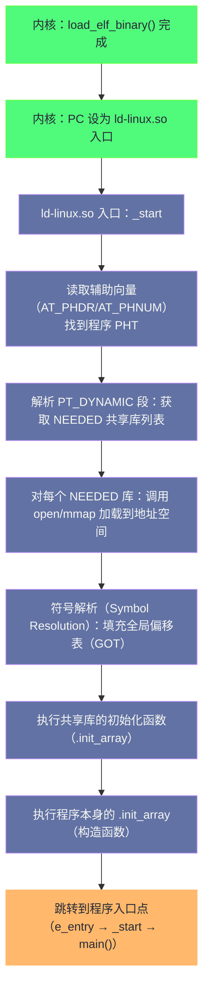

**摘要：**

`fork()` 创建了一个进程，但这个进程仍是父进程的副本——它运行的是同一份代码。`execve()` 才是让一个进程"成为它自己"的系统调用：它彻底替换当前进程的地址空间，将一个可执行文件加载进来并从头执行，进程的 PID 不变，但代码、数据、栈、堆……一切都换新了。这就是"灵魂替换"的含义。本文沿着 `execve()` 的内核路径逐层解析：从系统调用入口，到 ELF 文件格式的解析（ELF Header、Program Header、各段含义），到内核如何建立新的虚拟地址空间（`mmap` 各段、建立栈、传递参数），到动态链接器 `ld-linux.so` 在何时、如何介入完成动态库的加载和符号解析，最终 `main()` 函数如何得到控制权。这条链路是每个 Linux 程序每次启动都要走过的路，深入理解它，才能真正明白"一个程序是如何运行起来的"。

---

## 第 1 章 exec 家族：同一内核调用的多张面孔

### 1.1 为什么有这么多 exec 变体

C 标准库中提供了一整个 `exec` 家族函数：`execl()`、`execv()`、`execle()`、`execve()`、`execvp()`、`execvpe()`……初学者看到这些函数往往困惑——为什么要有这么多？

其实**内核只有一个系统调用：`execve()`**。所有其他变体都是 glibc 在用户态对 `execve()` 的封装，区别只是如何传递参数：

```c
/* 唯一的内核系统调用 */
int execve(const char *pathname,    /* 可执行文件路径（必须是绝对路径或相对路径，不做 PATH 查找）*/
           char *const argv[],      /* 命令行参数数组，以 NULL 结尾 */
           char *const envp[]);     /* 环境变量数组，以 NULL 结尾 */

/* 用户态变体（glibc 封装） */
int execl(const char *path, const char *arg, ... /* NULL */);
/* 参数用可变参数列表传递（l = list）*/

int execv(const char *path, char *const argv[]);
/* 参数用指针数组传递（v = vector）*/

int execlp(const char *file, const char *arg, ... /* NULL */);
/* 文件名（p = path）：在 PATH 中查找可执行文件 */

int execvp(const char *file, char *const argv[]);
/* 文件名 + 指针数组 */

int execle(const char *path, const char *arg, ..., char *const envp[]);
/* 列表 + 自定义环境变量（e = environment）*/
```

命名规律：
- `l`（list）：参数用可变参数列表传递
- `v`（vector）：参数用数组传递
- `p`（path）：在 `$PATH` 中搜索可执行文件
- `e`（environment）：可以指定子进程的环境变量

**全部最终都调用 `execve()`**——glibc 的 `execvp()` 会先在 `PATH` 中搜索可执行文件，找到绝对路径后，调用 `execve()`。

### 1.2 exec 的根本语义：替换，而非创建

```c
/* 一个典型的 fork + exec 模式 */
pid_t pid = fork();
if (pid == 0) {
    /* 子进程：执行新程序 */
    execve("/bin/ls", (char *[]){"/bin/ls", "-la", "/tmp", NULL}, environ);
    /* 如果 execve 返回，说明出错了（正常 execve 不会返回）*/
    perror("execve");
    exit(1);
}
/* 父进程继续... */
```

`execve()` 成功时**永不返回**——因为调用它的进程的代码段已经被替换，原来的代码已不存在。`execve()` 失败时才返回（返回 -1），设置 `errno`。

**exec 保留什么、丢弃什么**？

| 属性 | exec 后保留 | exec 后丢弃/重置 |
|------|------------|----------------|
| PID / TGID | ✅ 不变 | |
| 父进程（PPID）| ✅ 不变 | |
| 用户 ID（Real UID）| ✅ 不变 | |
| 文件描述符（非 `O_CLOEXEC`）| ✅ 保留 | |
| 进程组、会话 | ✅ 不变 | |
| 虚拟地址空间（代码、数据、堆、栈）| | ❌ 完全替换 |
| 内存映射（`mmap`）| | ❌ 全部取消 |
| 信号处理函数 | | ❌ 重置为 SIG_DFL（`SIG_IGN` 保留）|
| 线程（同线程组的其他线程）| | ❌ 全部终止 |
| 文件描述符（有 `O_CLOEXEC`）| | ❌ 关闭 |

> [!note] 设计哲学：为什么 exec 不改变 PID？
> PID 是进程对外的"身份证"——Shell 用它来跟踪作业（`jobs`），父进程用它来 `wait()`，系统日志用它来关联事件。如果 exec 改变了 PID，Shell 在执行 `ls` 的时候就无法知道子进程跑完没有（`wait()` 的对象不见了）。保留 PID，从用户角度看，exec 前后是"同一个进程执行了不同的程序"，这与 Unix 的进程模型完全一致。

---

## 第 2 章 ELF 文件格式：内核要读懂什么

### 2.1 为什么内核需要理解文件格式

`execve()` 接收一个文件路径。内核需要打开这个文件，读取其内容，理解"这个文件是什么格式的可执行程序"，然后才能知道代码在哪里、数据在哪里、程序应该从哪个地址开始执行。

Linux 支持多种可执行文件格式，通过 `binfmt`（Binary Format）机制注册：
- **ELF**（Executable and Linkable Format）：现代 Linux 的标准格式
- **脚本**（`#!` shebang 行）：`#!/bin/bash`、`#!/usr/bin/python3`
- **a.out**：古老的格式，已基本不用
- **MISC binfmt**：通过 `/proc/sys/fs/binfmt_misc` 注册自定义格式（如让内核直接运行 `.jar` 文件）

内核在 `execve()` 中遍历所有已注册的 `binfmt`，用每种格式的 `load_binary()` 回调尝试加载，第一个成功的就使用。

### 2.2 ELF 文件结构全景

ELF 是现代 Linux（以及 Android、BSD 等）的标准可执行文件格式，由三部分组成：

```
ELF 文件结构：
┌─────────────────────────────┐
│      ELF Header（52/64B）    │  描述文件类型、架构、入口地址、PHT/SHT 位置
├─────────────────────────────┤
│   Program Header Table      │  描述运行时所需的段（Segment）：内核加载时使用
│   （PHT，可选，执行时必须）  │
├─────────────────────────────┤
│                             │
│     各 Section（节）         │  代码节（.text）、数据节（.data）、符号表等
│   .text / .data / .bss /    │  链接时使用（编译器/链接器关心）
│   .rodata / .symtab / ...   │
│                             │
├─────────────────────────────┤
│   Section Header Table      │  描述所有 Section：链接时使用（可以被 strip 掉）
│   （SHT，可选，链接时使用）  │
└─────────────────────────────┘
```

**ELF Header 的关键字段**：

```c
typedef struct {
    unsigned char e_ident[16]; /* 魔数：[0x7f,'E','L','F'] + 类别(32/64位) + 字节序 + 版本 */
    uint16_t e_type;           /* 文件类型：ET_EXEC(可执行), ET_DYN(动态库/PIE), ET_REL(目标文件) */
    uint16_t e_machine;        /* 目标架构：EM_X86_64, EM_AARCH64 等 */
    uint32_t e_version;        /* ELF 版本（始终为 1）*/
    uint64_t e_entry;          /* 程序入口虚拟地址（内核执行完加载后跳转到此）*/
    uint64_t e_phoff;          /* Program Header Table 在文件中的偏移 */
    uint64_t e_shoff;          /* Section Header Table 在文件中的偏移 */
    uint16_t e_phentsize;      /* 每个 Program Header 条目的大小 */
    uint16_t e_phnum;          /* Program Header Table 中条目数量 */
    /* ... */
} Elf64_Ehdr;
```

**内核加载时只关心 Program Header Table**，Section Header Table 是给链接器用的（可以用 `strip` 命令删除，不影响程序运行）。

### 2.3 Program Header：内核加载的地图

每个 Program Header（PHdr）描述一个**段（Segment）**——运行时需要加载到内存的连续区域：

```c
typedef struct {
    uint32_t p_type;    /* 段类型：PT_LOAD(需要加载), PT_INTERP(动态链接器路径), PT_DYNAMIC, PT_NOTE 等 */
    uint32_t p_flags;   /* 段权限：PF_X(可执行), PF_W(可写), PF_R(可读) */
    uint64_t p_offset;  /* 段在文件中的偏移 */
    uint64_t p_vaddr;   /* 段的虚拟地址（加载到内存的起始地址）*/
    uint64_t p_paddr;   /* 段的物理地址（嵌入式系统用，普通 Linux 忽略）*/
    uint64_t p_filesz;  /* 段在文件中的大小 */
    uint64_t p_memsz;   /* 段在内存中的大小（memsz >= filesz，多出的部分用 0 填充）*/
    uint64_t p_align;   /* 对齐要求（通常是页大小 4096）*/
} Elf64_Phdr;
```

一个典型的可执行 ELF 文件有以下关键段：

| 段类型 | 权限 | 含义 |
|--------|------|------|
| `PT_LOAD`（代码段）| `r-x` | 包含 `.text`（代码）和 `.rodata`（只读数据）|
| `PT_LOAD`（数据段）| `rw-` | 包含 `.data`（已初始化全局变量）和 `.bss`（未初始化，内存中清零）|
| `PT_INTERP` | - | 动态链接器路径（如 `/lib64/ld-linux-x86-64.so.2`）|
| `PT_DYNAMIC` | - | 动态链接信息（需要的共享库列表、符号表位置等）|
| `PT_GNU_STACK` | `rw-` | 指示栈的权限（通常不可执行，用于防止栈溢出攻击）|

**`.bss` 段为什么在文件中 `filesz=0` 但 `memsz>0`？**

`.bss` 存储未初始化的全局变量（如 `static int arr[1000000];`）。未初始化变量的初值按 C 标准均为 0，无需在文件中存储这些 0——文件大小因此更小。内核加载时，为 `.bss` 段分配 `memsz` 大小的内存并全部清零（`p_memsz - p_filesz` 的部分）。

**用命令查看 ELF 结构**：

```bash
# 查看 ELF Header
readelf -h /bin/ls

# 查看 Program Headers（内核加载时使用）
readelf -l /bin/ls

# 输出示例：
# INTERP         0x000318 0x0000000000000318  /lib64/ld-linux-x86-64.so.2
# LOAD           0x000000 0x0000000000000000 r--p  ← 只读段
# LOAD           0x001000 0x0000000000001000 r-xp  ← 代码段（可执行）
# LOAD           0x006000 0x0000000000006000 r--p  ← 只读数据
# LOAD           0x007cd8 0x0000000000008cd8 rw-p  ← 数据段（可写）
# GNU_STACK      0x000000 rw-   ← 栈不可执行（NX/W^X 保护）
```

---

## 第 3 章 execve 的内核执行路径

### 3.1 execve 的内核入口

用户态调用 `execve()` → 触发系统调用 → 内核执行 `do_execve()`：

```
sys_execve()
  ↓
do_execve()
  ↓
do_execveat_common()   ← execve/execveat 的公共实现
  ↓
bprm_init()            ← 分配并初始化 linux_binprm 结构体
  ↓
copy_strings()         ← 将 argv、envp 从用户态复制到内核，暂存在新进程的栈顶
  ↓
search_binary_handler() ← 遍历所有注册的 binfmt，找到能处理这个文件的加载器
  ↓
load_elf_binary()      ← ELF 格式的加载器（load_binary 回调）
```

`linux_binprm` 是 `execve()` 过程中的"工作台"结构体，存储加载过程中的临时信息：

```c
struct linux_binprm {
    char buf[BINPRM_BUF_SIZE];  /* 文件头部的前 256 字节（用于识别文件格式）*/
    struct file *file;          /* 要执行的文件 */
    const char *filename;       /* 文件名 */
    const char *interp;         /* 解释器路径（shebang 或 PT_INTERP）*/
    unsigned long p;            /* 当前栈顶指针（从高地址向下分配 argv/envp）*/
    int argc, envc;             /* 参数数量、环境变量数量 */
    /* ... */
};
```

### 3.2 load_elf_binary：ELF 加载的核心逻辑

`load_elf_binary()` 是 ELF 格式加载器，它完成以下工作：

**步骤 1：读取并验证 ELF Header**

```c
/* 读取 ELF Header，验证魔数和基本字段 */
if (memcmp(elf_ex->e_ident, ELFMAG, SELFMAG) != 0)
    goto out;  /* 魔数不对，不是 ELF 文件 */
if (elf_ex->e_type != ET_EXEC && elf_ex->e_type != ET_DYN)
    goto out;  /* 不是可执行文件也不是动态链接对象 */
```

**步骤 2：读取 Program Header Table，找到 PT_INTERP 段（如果有）**

```c
for (i = 0; i < elf_ex->e_phnum; i++) {
    if (elf_phdata[i].p_type == PT_INTERP) {
        /* 读取动态链接器路径（如 /lib64/ld-linux-x86-64.so.2）*/
        /* 如果存在 PT_INTERP，后续需要先加载动态链接器 */
        elf_interpreter = kmalloc(elf_phdata[i].p_filesz, GFP_KERNEL);
        kernel_read(bprm->file, elf_interpreter, ...);
    }
}
```

**步骤 3：清空旧地址空间，建立新地址空间**

这是"灵魂替换"的关键一步：

```c
/* 卸载当前进程的所有 VMA（销毁旧地址空间）*/
retval = begin_new_exec(bprm);
/* begin_new_exec 内部调用 exec_mmap()，它：
   1. 将 task_struct.mm 替换为一个全新的空 mm_struct
   2. 对旧 mm_struct 执行 mmput()，减少引用计数，触发 VMA 的卸载和内存释放
   此后当前进程的虚拟地址空间完全为空
*/
```

**步骤 4：用 mmap 将 PT_LOAD 段映射到新地址空间**

```c
for (i = 0; i < elf_ex->e_phnum; i++) {
    if (elf_phdata[i].p_type != PT_LOAD)
        continue;

    /* 用 mmap 将文件的对应区域映射到指定虚拟地址 */
    error = elf_map(bprm->file,
                    load_bias + vaddr,   /* 目标虚拟地址 */
                    elf_ppnt,            /* Program Header */
                    elf_prot,            /* 段权限（r/w/x）*/
                    MAP_FIXED_NOREPLACE | MAP_PRIVATE,
                    total_size);
    /* MAP_PRIVATE：写时复制（修改时不影响原文件）*/
    /* mmap 建立 VMA，此时不一定分配物理内存——缺页时才真正读取文件内容 */
}
```

> [!info] 核心概念：mmap 的延迟加载
> `elf_map()` 调用 `mmap()` 将 ELF 文件的各段"映射"到进程地址空间，但此时**并不读取文件内容到内存**——只是建立了虚拟地址到文件偏移的映射关系（`file-backed VMA`）。当进程实际访问这些地址时（如执行代码、读取全局变量），才触发缺页异常，内核从文件中读取对应页面到物理内存。这就是 Linux 程序启动快的原因：`execve()` 本身几乎不做 IO，所有文件读取都是按需（demand paging）发生的。

**步骤 5：如果有 PT_INTERP，加载动态链接器**

```c
if (elf_interpreter) {
    /* 加载动态链接器（ld-linux.so）到进程地址空间（高地址区域）*/
    elf_entry = load_elf_interp(&interp_elf_ex,
                                interpreter,
                                &interp_map_addr,
                                load_bias, interp_elf_phdata);
    /* elf_entry 现在指向动态链接器的入口点，而不是程序本身的 e_entry */
}
```

**步骤 6：建立用户态栈，传递 argc、argv、envp、auxv**

```c
/* 在新地址空间的高地址端建立用户栈 */
retval = setup_arg_pages(bprm, randomize_stack_top(STACK_TOP), executable_stack);

/* 在栈上写入：argc, argv 指针数组, envp 指针数组, 辅助向量（auxv）*/
create_elf_tables(bprm, &loc->elf_ex, load_addr, interp_load_addr, e_entry);
```

**辅助向量（Auxiliary Vector）**是内核向用户态程序传递系统信息的机制，存储在栈上（envp 之后）：

```bash
# 查看辅助向量的内容
LD_SHOW_AUXV=1 /bin/ls /dev/null 2>&1 | head

# 输出示例：
# AT_HWCAP  = bfebfbff      ← CPU 特性标志位（SSE/AVX 等）
# AT_PAGESZ = 4096          ← 系统页大小
# AT_CLKTCK = 100           ← 时钟频率
# AT_PHDR   = 0x55b4...     ← ELF Program Header Table 地址（动态链接器用）
# AT_PHENT  = 56            ← 每个 Program Header 条目大小
# AT_PHNUM  = 13            ← Program Header 条目数量
# AT_BASE   = 0x7f...       ← 动态链接器加载的基地址
# AT_ENTRY  = 0x55b4...     ← 程序入口地址（e_entry）
# AT_RANDOM = 0x7fff...     ← 16 字节随机数（用于栈 canary 等安全机制）
```

**步骤 7：设置程序计数器，完成 exec**

```c
/* 设置进程返回用户态时的指令指针 */
/* 如果有动态链接器：跳转到 ld-linux.so 的入口 */
/* 如果是静态链接：跳转到 ELF 文件的 e_entry */
start_thread(regs, elf_entry, bprm->p);
/* bprm->p 是栈顶指针（指向 argc） */
/* 从 execve 返回用户态时，CPU 从 elf_entry 开始执行 */
```

---

## 第 4 章 动态链接器：ld-linux.so 的工作

### 4.1 为什么需要动态链接

几乎所有现代 Linux 程序都是动态链接的——它们不把 libc 的代码直接编译进可执行文件，而是在运行时加载共享库（`/lib/x86_64-linux-gnu/libc.so.6` 等）。

**静态链接 vs 动态链接**：

| 维度 | 静态链接 | 动态链接 |
|------|---------|---------|
| 可执行文件大小 | 大（包含所有库代码）| 小（只有程序本身）|
| 内存使用 | 每个进程独立拷贝 libc 代码 | libc 代码页被所有进程共享（只有一份物理内存）|
| 依赖 | 无运行时依赖 | 需要正确版本的共享库 |
| 安全更新 | 需重新编译程序 | 更新共享库即可（如修复 libc 漏洞）|
| 启动速度 | 略快（无需动态链接）| 略慢（需要解析符号）|

共享库的**内存共享**是动态链接的核心价值：系统中有 1000 个进程，每个都链接了 libc——静态链接需要 1000 份 libc 代码在内存中，动态链接只需要 1 份（通过 `mmap` + CoW，所有进程共享同一物理内存页）。这对于内存受限的系统意义重大。

### 4.2 ld-linux.so 的接管时机

内核在 `load_elf_binary()` 的最后一步中，将程序计数器设置为**动态链接器的入口点**（而非程序的 `main()`）。用户态第一条执行的指令是 `ld-linux.so` 的代码，不是 `main()`。

`ld-linux.so` 需要在 `main()` 得到执行权之前完成所有准备工作：



### 4.3 动态符号解析：PLT 与 GOT

动态链接最核心的技术是 **PLT（Procedure Linkage Table，程序链接表）** 和 **GOT（Global Offset Table，全局偏移表）**。

**为什么需要 PLT 和 GOT？**

程序在调用 `printf()` 时，在编译阶段不知道 `printf` 在内存中的地址（它在 libc.so 里，加载到哪个地址由运行时决定）。PLT/GOT 机制通过一个两级间接调用解决这个问题：

```
程序调用 printf() 的汇编代码（简化）：
  call printf@PLT        ← 跳转到 PLT 中 printf 的桩代码（plt stub）

PLT 中 printf 的桩代码：
  jmp  *printf@GOT       ← 通过 GOT 表间接跳转
  push <printf 的序号>
  jmp  _PLT_resolver     ← 第一次调用：跳转到解析器

GOT 表（运行时可写内存区域）：
  printf@GOT:  0x7f...xxx   ← ld-linux.so 填入的 printf 真实地址
                             ← 初始时指向 PLT 解析器，第一次调用后替换为真实地址
```

**延迟绑定（Lazy Binding）**是默认行为：`printf` 的 GOT 条目在**第一次调用时**才被解析（`ld-linux.so` 找到 `printf` 在 libc 中的真实地址，写入 GOT）。之后再调用 `printf`，直接通过 GOT 跳转到真实地址，不再经过解析器。

好处：程序启动时不需要解析所有符号（只解析实际用到的），加快启动速度。

坏处：第一次调用每个外部函数有额外的解析开销（通常微不足道），且延迟解析使得"共享库不存在"的错误只在函数被调用时才暴露。可以用 `LD_BIND_NOW=1` 强制在启动时解析所有符号（用于安全关键场景）。

```bash
# 查看程序的动态依赖（哪些共享库会被加载）
ldd /bin/ls

# 输出示例：
# linux-vdso.so.1 (0x00007ffd5...)     ← vDSO：内核映射的虚拟共享库
# libselinux.so.1 => /lib/...
# libc.so.6 => /lib/x86_64-linux-gnu/libc.so.6 (0x00007f...)
# /lib64/ld-linux-x86-64.so.2 (0x00007f...)    ← 动态链接器本身

# 查看 GOT/PLT 表中的条目（需要 binutils）
objdump -d -j .plt /bin/ls | head -40

# 查看程序需要的动态符号
nm -D /bin/ls | grep " U "   # U = Undefined（需要动态链接解析的符号）
```

### 4.4 vDSO：不需要系统调用的系统调用

`ldd` 输出中的 `linux-vdso.so.1` 比较特殊——它不是磁盘上的文件，而是内核在**每次 exec 时自动映射到进程地址空间**的一小段代码（Virtual Dynamic Shared Object，虚拟动态共享对象）。

**为什么需要 vDSO？**

`gettimeofday()`、`clock_gettime()` 是极高频调用的系统调用——一些程序每秒调用数百万次。普通系统调用需要 CPU 特权级切换（用户态→内核态→用户态），开销约 100-300 纳秒。

vDSO 将这些函数的实现（读取内核维护的、映射在用户态地址空间的时间数据）直接暴露为用户态代码——调用 `gettimeofday()` 不再需要系统调用，直接读取内存，开销约 10 纳秒，加速 10-30 倍。

```bash
# 验证 vDSO 的存在
cat /proc/self/maps | grep vdso
# 7ffe8b7fe000-7ffe8b800000 r-xp 00000000 00:00 0   [vdso]
# r-xp：可读可执行，私有映射（每个进程都有，但地址随机化）

# 查看 vDSO 导出了哪些函数
objdump -T /proc/self/maps  # 不直接用，但可以：
strings /proc/self/mem      # 不推荐
# 或用专门工具：
# vdsotest 工具可以列出 vDSO 导出的符号
```

---

## 第 5 章 程序真正的入口：从 _start 到 main

### 5.1 main() 不是程序的第一条指令

ELF 的 `e_entry` 字段指向的入口点，对于大多数 C 程序，是 `_start` 函数（由 C 运行库 crt0.o 提供），而不是 `main()`。

`ld-linux.so` 完成所有动态链接工作后，跳转到 `e_entry`（即 `_start`）：

```c
/* crt0.o 中 _start 的逻辑（x86-64，大幅简化）*/
void _start() {
    /* 此时栈布局（内核在 execve 时建立）：
       栈顶 → argc
              argv[0] ... argv[argc-1], NULL
              envp[0] ... envp[N-1], NULL
              Auxiliary Vectors
    */

    /* 1. 从栈上取出 argc 和 argv */
    long argc = *(long *)rsp;
    char **argv = (char **)(rsp + 8);
    char **envp = argv + argc + 1;

    /* 2. 初始化 glibc 内部状态 */
    __libc_start_main(
        main,       /* main 函数指针 */
        argc,       /* 参数数量 */
        argv,       /* 参数数组 */
        __libc_csu_init,   /* 执行 .init_array 中的构造函数 */
        __libc_csu_fini,   /* 注册 .fini_array 中的析构函数 */
        NULL,
        rsp
    );

    /* __libc_start_main 不会返回（内部调用 exit）*/
    hlt;  /* 不可达 */
}
```

`__libc_start_main()` 做的事：
1. 初始化线程本地存储（TLS）
2. 设置栈 canary（通过辅助向量 `AT_RANDOM` 提供的随机值）
3. 调用 `.init_array` 中所有的构造函数（C++ 全局对象的构造函数就在这里）
4. **调用 `main(argc, argv, envp)`**
5. `main()` 返回后，用返回值调用 `exit()`
6. `exit()` 调用所有用 `atexit()` 注册的清理函数，刷新 stdio 缓冲区，然后调用 `_exit()` 系统调用

### 5.2 从 execve 到 main 的完整时间线

```
用户调用 execve("/bin/prog", argv, envp)
  │
  ▼ 陷入内核
内核 do_execve()
  │ 1. 分配 linux_binprm，复制 argv/envp 到内核
  │ 2. 读取文件头（前 256B），识别 ELF 格式
  │ 3. 读取 Program Header Table
  │ 4. begin_new_exec()：销毁旧地址空间，信号处理重置
  │ 5. PT_LOAD 段：mmap 映射（懒加载，不读文件）
  │ 6. PT_INTERP：加载 ld-linux.so（同样 mmap）
  │ 7. setup_arg_pages()：建立新栈，写入 argc/argv/envp/auxv
  │ 8. start_thread()：设置 PC = ld-linux.so 入口
  │
  ▼ 返回用户态（PC 指向 ld-linux.so _start）
ld-linux.so 执行
  │ 1. 读取辅助向量，获取程序 PHT 地址
  │ 2. 解析 PT_DYNAMIC，获取 NEEDED 库列表
  │ 3. 对每个 NEEDED 库：open + mmap 加载
  │ 4. 符号解析：填充 GOT（延迟绑定：只填 PLT 桩，真实解析在第一次调用时）
  │ 5. 执行共享库的 .init_array（初始化函数）
  │ 6. 执行程序的 .init_array（C++ 全局构造函数等）
  │ 7. 跳转到程序 e_entry（_start）
  │
  ▼
_start (crt0)
  │ __libc_start_main()
  │   → 初始化 glibc
  │   → 调用 main(argc, argv, envp)
  │
  ▼
main() 执行
```

---

## 第 6 章 PIE 与 ASLR：地址随机化对 exec 的影响

### 6.1 什么是 PIE

早期的可执行文件（`ET_EXEC` 类型）使用固定的加载地址——所有 `PT_LOAD` 段都加载到 ELF 文件中写死的虚拟地址（如代码段总是在 `0x400000`）。这给攻击者带来便利：漏洞利用时可以直接使用固定地址。

**PIE（Position Independent Executable，位置无关可执行文件）** 是 `ET_DYN` 类型的可执行文件——与共享库一样，所有地址都是相对的，可以加载到任意地址：

```bash
# 查看可执行文件是否是 PIE
file /bin/ls
# /bin/ls: ELF 64-bit LSB pie executable ...   ← PIE（ET_DYN）

file /usr/lib/openssh/ssh-keysign
# ... ELF 64-bit LSB executable ...   ← 非 PIE（ET_EXEC，通常是需要特殊权限的程序）
```

### 6.2 ASLR 与 PIE 的协同

**ASLR（Address Space Layout Randomization，地址空间布局随机化）** 是内核在 `exec` 时对地址空间进行随机化的安全机制：

```bash
# 查看 ASLR 状态
cat /proc/sys/kernel/randomize_va_space
# 0 = 关闭
# 1 = 随机化栈和 mmap 区域
# 2 = 全随机化（包括堆）← 生产标准配置
```

**ASLR 随机化的内容**：
- **栈基地址**：每次 exec，栈的起始地址随机
- **mmap 区域起始地址**：动态库加载地址随机（这意味着 libc 的地址每次不同）
- **堆起始地址**（ASLR=2 时）
- **程序本身的加载地址**（仅当是 PIE 时！非 PIE 程序的代码段始终在固定地址）

**ASLR 只有与 PIE 配合，才能随机化程序本身的地址**。这就是现代 Linux 发行版要求所有系统程序编译为 PIE 的原因。

```bash
# 验证 ASLR 的效果：多次运行查看栈地址
for i in {1..5}; do
    python3 -c "import ctypes; lib=ctypes.CDLL(None); print(hex(ctypes.addressof(lib)))"
done
# 每次输出不同的地址，说明 ASLR 生效

# 对比非 PIE 程序：代码段地址固定
readelf -l /usr/bin/sudo | grep LOAD | head -1
# LOAD 0x000000 0x0000000000400000 ...   ← 固定地址 0x400000
```

---

## 小结

`exec` 的本质是进程的"灵魂替换"——**PID 不变，但代码、数据、栈、堆、共享库全部更新**，旧程序的痕迹只剩 PID 和父子关系。

**exec 的完整链路**：
1. `execve()` 系统调用 → `load_elf_binary()`
2. 读取 ELF Header 和 Program Header Table，识别各段位置和类型
3. `begin_new_exec()` 销毁旧地址空间
4. `mmap()` 将 PT_LOAD 段懒加载映射到新地址空间（demand paging，不实际读文件）
5. 若有 PT_INTERP，加载动态链接器 `ld-linux.so`
6. 建立用户态栈，写入 argc/argv/envp/auxv
7. 返回用户态，PC 指向 `ld-linux.so` 入口（若动态链接）或程序 `e_entry`（若静态链接）

**动态链接器的工作**：解析 PT_DYNAMIC，按序加载所有 NEEDED 共享库（mmap），完成 GOT 填充（延迟绑定或立即绑定），执行初始化函数，最终跳转到程序 `_start`

**关键设计决策**：
- demand paging：exec 不读文件，缺页时读，启动极快
- PIE + ASLR：每次 exec 地址空间布局随机，防止漏洞利用
- vDSO：高频系统调用无需特权切换，性能极致

下一篇 [[05 进程的终结与善后——exit、wait 与僵尸进程]] 将从进程的另一端——终结——出发，解析 `exit()` 的内核路径、资源释放的顺序，以及僵尸进程的本质与产生条件。
