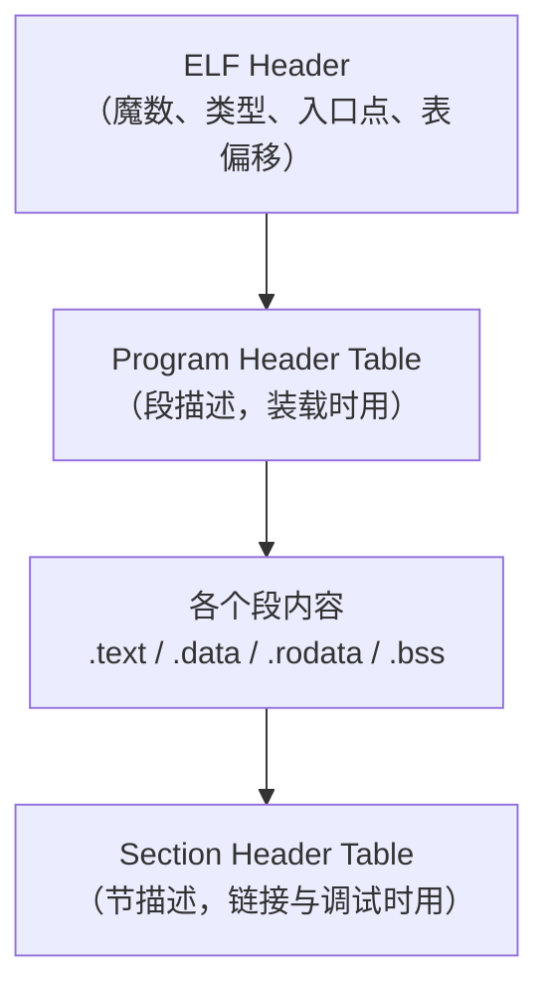
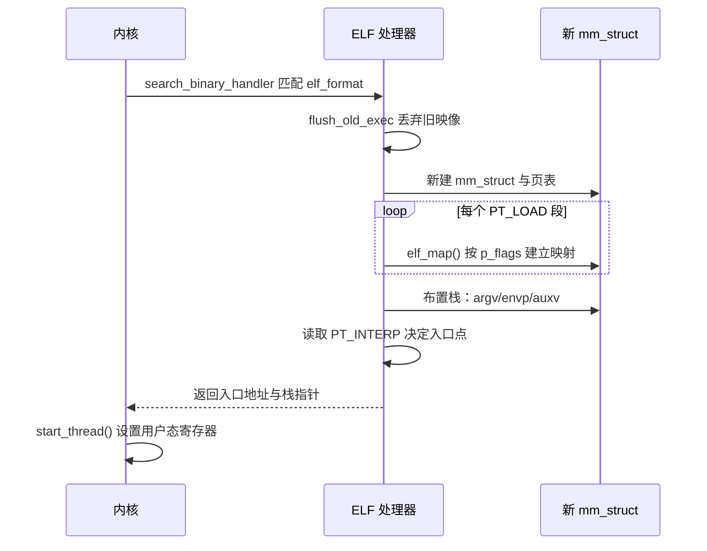
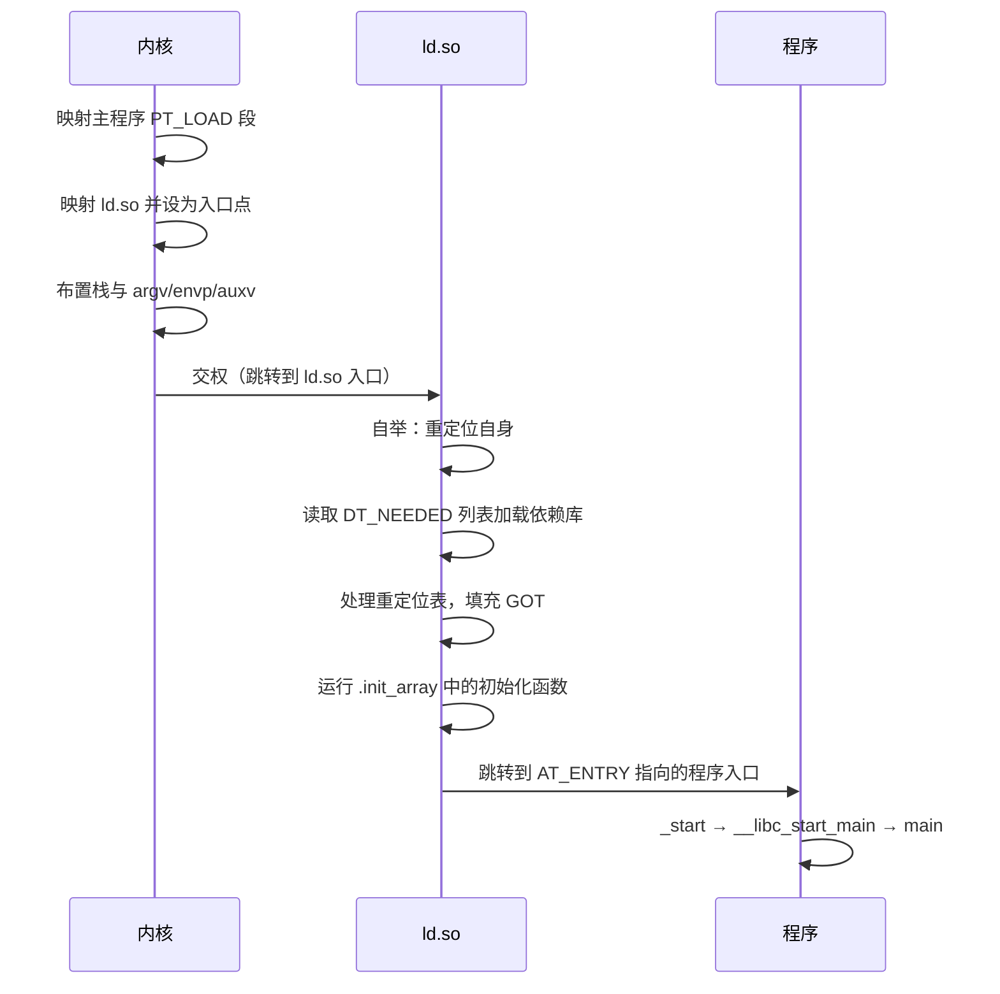

# 04 进程的灵魂替换——exec 家族与程序加载

**摘要：**

`fork()` 造出了一个空壳，真正让这个空壳变成有用之物的是 `execve()`。这个系统调用做的事近乎暴力：把调用者苦心建立的地址空间整个丢弃，换成从磁盘上读来的另一套映像，然后把 CPU 交给新程序的入口点。本文沿着这条路径拆开程序加载的全过程。先澄清 `exec` 家族的成员关系——为什么有六个函数却只有一个系统调用，`l`/`v`/`p`/`e` 四个后缀各代表什么，`PATH` 查找发生在用户态还是内核态。随后进入内核，看 `bprm` 结构、`linux_binfmt` 注册表与 `search_binary_handler()` 构成的可扩展加载框架，理解"二进制格式"这层抽象为什么值得存在。核心部分拆解 ELF 文件：程序头表与节头表的区别、段与节的分野、`PT_LOAD`/`PT_INTERP`/`PT_DYNAMIC` 各自的作用，以及内核如何把段映射成 `vm_area_struct`。接着处理动态链接器这个"程序之外的第一个程序"——它如何通过 `PT_INTERP` 被内核当作入口点、如何在程序真正开始执行前完成重定位，以及静态链接在云原生时代重新流行的原因。文章还系统梳理 `execve` 的副作用（fd 继承、信号重置、线程消失、`ETXTBSY`）与失败边界（`ARG_MAX`、`BINPRM_BUF_SIZE`、`noexec` 挂载），并给出常见错误码的排查指引。全文回答两个问题：`execve` 在内核里究竟做了哪些事，以及程序加载为什么会被设计成现在这个样子。

---

## 第 1 章 一个家族而不是一个函数

### 1.1 六个函数，一个系统调用

C 标准库里的 `exec` 家族有六个成员：

| 函数 | 参数形式 | 是否查 `PATH` | 是否用环境变量 |
| :--- | :--- | :--- | :--- |
| `execl` | 列表（可变参数） | 否 | 用 `environ` |
| `execlp` | 列表 | 是 | 用 `environ` |
| `execle` | 列表 | 否 | 显式传入 |
| `execv` | 数组 | 否 | 用 `environ` |
| `execvp` | 数组 | 是 | 用 `environ` |
| `execvpe` | 数组 | 是 | 显式传入 |

六个名字里的后缀并不是装饰：`l` 表示"参数用可变参数列表展开"（list），`v` 表示"参数放在数组里"（vector），`p` 表示"用 `PATH` 查找可执行文件"（path），`e` 表示"环境变量显式传入"（environment）。

而**这六个函数最终都落到同一个系统调用 `execve`**。`execvp` 与前缀里没有 `p` 的那些函数，区别纯粹在用户态：`execvp` 会先读 `PATH` 环境变量，逐目录拼出候选路径，再用 `access()` 与 `X_OK` 权限检查挑出第一个可执行的文件，最后调用 `execve`。内核完全不知道 `PATH` 的存在——这一点在排查"为什么 `execvp` 找不到某个程序"时很重要，因为失败可能发生在用户态查找阶段（`errno` 为 `ENOENT`），也可能发生在内核装载阶段（同样是 `ENOENT`，但原因不同）。

### 1.2 `PATH` 查找的一个副作用

`execvp` 的 `PATH` 查找有一处长期存在的安全隐患：如果当前目录被包含在 `PATH` 里（历史上有过把 `.` 放进 `PATH` 的惯例），那么执行一个名字普通的命令时，可能被当前目录下一个同名但内容不同的可执行文件截胡。攻击者只要能在目标用户的工作目录下写入文件，就能在用户下次执行该命令时劫持执行——这类攻击被称为路径劫持（Path Hijacking）。

同源的另一种攻击发生在特权程序里：一个 setuid 程序如果在自己的代码里调用 `execvp("some-tool", ...)` 而没有把 `PATH` 重置为固定值，那么攻击者只需设置自己的 `PATH` 指向一个伪造的 `some-tool`，就能让特权程序以 root 身份执行任意代码。防御手段是特权程序在 `exec` 前必须调用 `clearenv()` 或把 `PATH` 硬编码为绝对路径集合。

### 1.3 一个"成功不返回"的调用

`execve` 有一个十分特殊的性质：**它成功时不返回**。整个地址空间被替换之后，调用它的那行代码本身已经不在内存里了，返回值没有意义，也没有地方可以接收返回值。只有当它失败时，才会以 -1 返回并设置 `errno`。

这个性质导致一个在代码审查中反复出现的模式：任何跟在 `execve` 之后的语句都只会在失败时执行。如果开发者忘了在 `execve` 后面加错误处理，程序在 `execve` 失败时会继续往下跑，用着"还以为是新程序"的上下文——这在特权程序里会造成严重后果，因为失败的 `execve` 之后进程仍然持有提升的权限。

```c
/* 正确写法：execve 之后必须处理失败，因为走到这里就说明出错了 */
execve("/bin/sh", argv, envp);
perror("execve");     /* 只有失败才会执行到这里 */
_exit(127);           /* 用 _exit 而不是 exit，避免冲刷父进程的 stdio 缓冲 */
```

### 1.4 `system()` 与 `popen()` 建立在什么之上

标准库里的 `system()` 与 `popen()` 都是 `fork` + `execve` 的封装，理解这一层有助于判断它们的行为边界。

`system()` 的实现是：`fork` 一个子进程，子进程 `execl("/bin/sh", "sh", "-c", command, NULL)`，父进程 `waitpid` 等它退出，最后把退出状态按 `wait` 的编码转成返回值。这解释了两个常被问到的现象：一是 `system()` 的返回码需要用 `WIFEXITED` 与 `WEXITSTATUS` 解读，直接比较返回值会出错；二是 shell 的内建命令（如 `cd`、`export`）在 `system()` 里只在子 shell 内生效，不会影响调用者。

`popen()` 则在此基础上加了一根管道，通过 `popen` 的 `"r"` 与 `"w"` 参数决定管道的方向。它的一个常见陷阱是必须用 `pclose()` 而不是 `fclose()` 关闭返回的 `FILE *`——`fclose` 只关掉管道这一端，`pclose` 才会去 `wait` 子进程并返回它的退出状态。用错会导致僵尸进程累积，以及无法获知子命令是否失败。

这两者的共同点是它们都**依赖 shell 解释命令字符串**，因此对输入内容中的特殊字符必须做转义，否则会有命令注入风险。需要执行固定程序而不需要 shell 语义时，直接调用 `execve` 或 `posix_spawn` 是更安全也更高效的选择。

---

## 第 2 章 `execve` 的内核路径

### 2.1 用户态到内核

`execve` 系统调用进入内核后落到 `do_execveat_common()`（`execveat` 是它的一个变体，允许在指定目录 fd 下解析路径）。这个函数的主线可以分成四步：

1. **打开可执行文件**：通过 `open_exec()` 拿到 `struct file`，并做基础检查（是否可读、是否有执行权限、是否设置了 `noexec`）。
2. **建立 `linux_binprm` 结构**：读入文件开头的一段字节（`BINPRM_BUF_SIZE`，在 5.x 上是 256 字节）用于格式识别，同时把 `argv`/`envp` 从用户态复制到内核空间。
3. **交给二进制格式处理器**：`search_binary_handler()` 遍历已注册的 `linux_binfmt` 链表，逐个调用其 `load_binary` 回调，哪个能处理就由哪个接着走。
4. **提交新映像**：ELF 处理器完成后，`exec_binprm()` 更新凭证（处理 setuid/setgid 位）并返回用户态。

### 2.2 `linux_binfmt`：一个可扩展的注册表

`linux_binfmt` 是内核里"二进制格式"这层抽象的接口定义：

```c
struct linux_binfmt {
    struct list_head lh;         /* 挂在 formats 链表上 */
    struct module *module;
    int (*load_binary)(struct linux_binprm *);
    int (*load_shlib)(struct file *);
    int (*core_dump)(struct coredump_params *);
    unsigned long min_coredump;
};
```

内建的处理器包括 `elf_format`（ELF）、`script_format`（`#!` 脚本），以及可选的 `misc_format`（用于通过 `binfmt_misc` 挂载点注册的自定义格式，如 Windows 的 PE 文件、Java 的 `.jar`）。

这层抽象的价值在于**内核不需要为每种可执行格式写一份 `execve`**。每个格式只需要回答一个问题："给我一个 `bprm`，你能不能把它变成一个新映像？"能处理就返回 0，不能就返回 `-ENOEXEC` 让内核继续尝试下一个。全部处理器都返回 `-ENOEXEC` 时，`execve` 最终以 `ENOEXEC` 失败——这个错误码是最有辨识度的信号，它意味着文件既不是 ELF，也不是脚本，也没有注册的其它格式处理器认领它。

### 2.3 格式识别的顺序

格式识别靠的是文件开头的魔数（Magic Number）。ELF 的魔数是 `0x7F 'E' 'L' 'F'`，脚本的"魔数"是 `#!`。内核按注册顺序逐个尝试，`elf_format` 与 `script_format` 的注册顺序决定了 `#!` 优先还是 ELF 优先——实际上 `#!` 的检查发生在 `search_binary_handler` 的回退路径里，因此一个同时具备 ELF 魔数和 `#!` 开头的文件（不可能同时成立，因为 ELF 的前两字节是 `0x7F` 和 `'E'`）不会产生歧义。

`binfmt_misc` 则是在运行时动态注册的格式，用户可以通过 `mount -t binfmt_misc` 挂载这个伪文件系统，然后在里面写规则：

```bash
# 注册：按文件扩展名把 .jar 交给 java 执行
echo ':jar:M::\xCA\xFE\xBA\xBE::/usr/bin/java:' > /proc/sys/fs/binfmt_misc/register
```

这条机制让"双击运行"这类体验成为可能，也让跨架构模拟（如 QEMU 的 `qemu-user-static`）可以用一种统一的方式接入——注册 `.arm64` 格式指向 QEMU，`execve` 一个 ARM64 二进制时会自动被 QEMU 接管。容器里跨架构运行镜像就依赖这条机制。

### 2.4 为什么需要"二进制格式"这层抽象

把格式处理从内核里抽成一个注册表，收益可以概括为三点：允许运行时扩展（`binfmt_misc`）、允许模块化编译（不需要的格式可以不编译进内核）、以及让 `execve` 的主流程与格式细节解耦。

代价是**多了一次间接调用与遍历**。对一个每秒要 `exec` 上千次的高频场景（比如 shell 脚本密集的构建系统），`search_binary_handler` 的链表遍历本身是可测量的开销，虽然量级不大。更重要的是它带来了一个调试上的复杂度：`execve` 失败时，用户看到的错误码是最后一个处理器的返回值，而"到底试过哪些处理器"这个问题没有直接的观测接口，只能靠读源码推断。

### 2.5 `linux_binprm` 里装了什么

`struct linux_binprm` 是整个装载过程中的工作台，几个关键字段值得认识：

| 字段 | 内容 | 变化时机 |
| :--- | :--- | :--- |
| `buf[BINPRM_BUF_SIZE]` | 文件开头 256 字节 | 打开文件后立即读入 |
| `filename` | 可执行文件路径 | 打开时确定 |
| `interp` | 解释器路径（`#!` 或 `PT_INTERP`） | 格式处理器设置 |
| `argc` / `argv` | 参数数组与个数（内核空间） | 初始化时从用户态复制 |
| `envc` / `envp` | 环境变量数组与个数 | 同上 |
| `p` / `q` | 指向当前栈顶的指针 | 布置栈时移动 |
| `cred_prepared` | 是否已准备新凭证 | 提交阶段置位 |
| `execfd` | 通过 `execveat` 传入的 fd | 入口参数 |

`p` 这个单字符字段名在内核里相当少见，它记录的是布置新栈时的当前位置。栈的构造顺序是从高地址往低地址推进：先放字符串本身（`argv` 与 `envp` 指向的那些内容），再放指针数组，最后放 `auxv`。用 `p` 而不是一个局部变量来记录位置，是因为布置工作会被 `#!` 处理器的递归调用打断——解释器脚本需要重新构造参数，此时栈顶指针必须跨函数调用保持。

`cred_prepared` 字段则与一个容易被忽略的语义相关：**凭证的更新发生在装载成功之后，而不是之前**。也就是说，setuid 位生效的时刻是新映像已经就绪、即将返回用户态之前。这个顺序保证了如果装载中途失败，进程不会提前拿到提升的权限——这是一条重要的安全性质，把"提权"与"装载成功"绑定成了原子操作。

---

## 第 3 章 ELF 文件格式

### 3.1 整体布局

ELF（Executable and Linkable Format）文件从磁盘上的角度看是一串连续的字节，按结构可以分成四部分：



其中头部 `Elf64_Ehdr` 里有几个字段决定了后续一切：`e_type` 区分可执行文件、共享库、目标文件；`e_entry` 是程序入口点的虚拟地址；`e_phoff` 与 `e_shoff` 分别指向程序头表与节头表的偏移；`e_phnum` 与 `e_shnum` 给出表项数量。

### 3.2 段与节的分野

初学者最容易被 ELF 的两个"表"绕晕：程序头表描述的是**段**（Segment），节头表描述的是**节**（Section）。两者描述的是同一批字节，但划分方式与用途完全不同。

| 维度 | 段（Program Header） | 节（Section Header） |
| :--- | :--- | :--- |
| 使用时机 | **装载时**（内核、动态链接器） | **链接时**与调试时（编译器、链接器、`objdump`） |
| 划分依据 | 内存权限（读/写/执行） | 内容类型（代码/只读数据/符号表） |
| 典型条目 | `PT_LOAD`、`PT_INTERP` | `.text`、`.data`、`.symtab` |
| 是否必须 | 可执行文件必须有 | 可被 `strip` 删除 |

划分依据的差异是关键：段按"内核需要知道的最小信息量"划分——内存权限与映射位置；节按"链接器与调试器关心的信息"划分——哪些字节是代码、哪些是符号表。一个 `PT_LOAD` 段通常包含多个节，因为它们共享同样的内存权限。

### 3.3 常见的段类型

| 段类型 | 作用 | 内核是否处理 |
| :--- | :--- | :--- |
| `PT_LOAD` | 需要映射到内存的内容 | 是，逐个 `mmap` |
| `PT_INTERP` | 动态链接器路径字符串 | 是，读取作为新入口 |
| `PT_DYNAMIC` | 动态链接所需的数据（重定位表、依赖库列表） | 否，由 `ld.so` 读取 |
| `PT_NOTE` | 附加信息（构建 ID、ABI 标签） | 否 |
| `PT_GNU_STACK` | 栈是否可执行 | 是，决定栈的 `PROT_EXEC` |
| `PT_GNU_RELRO` | 重定位后只读的区域 | 是，`mprotect` 为只读 |
| `PT_PHDR` | 程序头表自身的位置 | 否 |

`PT_GNU_STACK` 值得单独说明：它承载的是"这个程序是否要求可执行栈"这一信息，内核据此决定初始栈的权限。现代编译器默认生成不可执行的栈（`-z noexecstack`），因为可执行栈会让栈溢出漏洞直接变成代码执行漏洞。历史上那些依赖可执行栈的老程序（如某些 Lisp 实现、`trampoline` 优化）在现代系统上会遇到问题，需要显式声明。

### 3.4 段的权限划分与 RELRO

一个典型的动态链接可执行文件有四个 `PT_LOAD` 段：只读可执行（代码）、只读（`.rodata`）、可读写（`.data`/`.bss`）、以及一个用于对齐的小段。内核按 `p_flags` 里的 `PF_R`/`PF_W`/`PF_X` 决定每个段的页表权限。

`PT_GNU_RELRO` 引入了第五种划分：这段区域在装载初期需要可写（因为动态链接器要把重定位结果写进去），但在重定位完成后必须变成只读。内核在 `execve` 完成时并不立即设置它——实际上是由 `ld.so` 在完成重定位后调用 `mprotect` 把它锁成只读的。这个机制被称为 RELRO（Relocation Read-Only），它的目标是让 `GOT` 表这类"函数指针表"在重定位之后无法被改写——因为改写 `GOT` 表是经典的攻击手法。完整 RELRO（`-z relro -z now`）会让 `.got.plt` 也进入只读区域，代价是启动时需要解析全部符号，牺牲了延迟绑定。

### 3.5 常见节与它们的归宿

节是链接器视角下的划分，一个可执行文件里最常见的几类节，以及它们各自落到哪个段，可以用下面这张表串起来：

| 节 | 内容 | 所在段 | 内存权限 |
| :--- | :--- | :--- | :--- |
| `.text` | 机器指令 | `PT_LOAD`（只读可执行） | `r-x` |
| `.rodata` | 字符串字面量、常量表 | `PT_LOAD`（只读） | `r--` |
| `.data` | 已初始化的全局变量 | `PT_LOAD`（可读写） | `rw-` |
| `.bss` | 未初始化的全局变量 | `PT_LOAD`（可读写，仅占内存） | `rw-` |
| `.init_array` | 初始化函数指针数组 | `PT_LOAD`（可读写） | `rw-` |
| `.got` / `.got.plt` | 全局偏移表 | `PT_LOAD` + `PT_GNU_RELRO` | 重定位后 `r--` |
| `.symtab` | 符号表 | 不映射 | — |
| `.debug_*` | 调试信息 | 不映射 | — |

最后两行值得特别说明：`.symtab` 与调试节**不会被映射到内存**，它们只存在于磁盘上供链接器和调试器读取。这就是为什么 `strip` 一个可执行文件可以显著减小体积却完全不影响运行——剥掉的正是这些不参与运行的节。同样的道理也解释了"为什么线上二进制被 strip 之后，`perf` 的火焰图里只剩地址没有函数名"。

`.init_array` 是连接 ELF 与语言运行时的桥。C 语言的全局构造函数（`__attribute__((constructor))`）、C++ 的全局对象构造、以及 Go 的运行时初始化，最终都体现为这个数组里的一串函数指针。`ld.so` 在完成重定位之后会遍历它逐个调用，这就是为什么 C++ 程序里一个全局对象的构造函数会在 `main` 之前执行。

用 `readelf` 可以直接观察这些节与段的对应关系：

```bash
readelf -S ./app | grep -E '\.text|\.rodata|\.data|\.bss'
# [ 1] .interp   PROGBITS  0000000000000318 000318 00001c 00   A  0   0  1
# [13] .text     PROGBITS  0000000000001050 001050 0001a5 00  AX  0   0 16
# [23] .rodata   PROGBITS  0000000000002000 002000 00001b 00   A  0   0  4
# [24] .data     PROGBITS  0000000000004000 002000 000010 00  WA  0   0  8
# [25] .bss      NOBITS    0000000000004010 002010 000008 00  WA  0   0  1
```

输出里的标志列 `A`/`AX`/`WA` 对应分配（Alloc）、可执行（eXecute）、可写（Write），而 `.bss` 的类型是 `NOBITS`——它不占文件空间，只有大小信息。这三条信息合起来，正好解释了前面关于段与节的两套划分是如何互相映射的。

---

## 第 4 章 建立新的地址空间

### 4.1 `flush_old_exec`：销毁旧世界

ELF 处理器在确认格式无误之后，第一件事是调用 `flush_old_exec()`。这个名字取得很贴切——它做的事就是**抛弃调用者现有的一切**：

- 释放旧的 `mm_struct` 及其全部 VMA；
- 关闭设置了 `O_CLOEXEC` 的文件描述符；
- 重置信号处置表（把自定义处理函数改回 `SIG_DFL`，保留 `SIG_IGN`）；
- 清空 `sighand` 里那些指向旧地址空间代码的处理函数；
- 分离 ptrace 跟踪关系（除特定情形外）。

这一步在语义上是不可逆的。从 `flush_old_exec()` 返回之后，无论后续步骤成功还是失败，调用者都不再是原来的程序了——如果后面的映射过程中途失败，`execve` 会返回错误，但进程已经在半个新地址空间里，通常只能选择退出。这就是为什么 `execve` 的错误处理里几乎从不考虑"失败后继续正常执行"这个选项。

### 4.2 布置新地址空间

接下来的工作由 `begin_new_exec()` 与 `setup_new_exec()` 承担，主线是遍历程序头表：



`elf_map()` 内部使用 `vm_mmap()` 建立映射，映射的粒度是段而不是节。这里有一个细节：文件中段的 `p_filesz` 与内存中的 `p_memsz` 可能不同——对于 `.bss` 这类未初始化数据，文件里不占空间但内存里需要保留，多出来的部分会被映射成匿名零页。这个差异就是 `.bss` 不占用可执行文件体积的原因。

### 4.3 栈上的三份数据

新进程的栈并不是空的。内核在栈顶按固定布局放置了三样东西：

- **`argv`**：命令行参数数组，以 `NULL` 结尾；
- **`envp`**：环境变量数组，以 `NULL` 结尾；
- **`auxv`**：辅助向量（Auxiliary Vector），是内核传给用户态的一组键值对。

`auxv` 是三者中最容易被忽略、却承载了最多信息的一个。它包含：

| 键 | 含义 |
| :--- | :--- |
| `AT_PHDR` | 程序头表在内存中的地址 |
| `AT_ENTRY` | 程序真正的入口点（用于动态链接器跳转回来） |
| `AT_BASE` | 动态链接器被加载到的基地址 |
| `AT_PAGESZ` | 系统页大小 |
| `AT_RANDOM` | 16 字节随机数，供栈保护金丝雀与指针混淆使用 |
| `AT_HWCAP` | CPU 特性位（如 SSE、AVX 支持） |
| `AT_SYSINFO_EHDR` | vDSO 的地址 |

`AT_RANDOM` 的存在解释了一个安全机制：栈保护金丝雀（Stack Canary）的值在每次 `execve` 时都不同，因为它取自这 16 字节随机数——如果金丝雀值是编译期固定的，攻击者可以直接从二进制里读出来，防护就失效了。`AT_SYSINFO_EHDR` 则指向 vDSO，那是内核映射到用户空间的一小段代码，用于让 `gettimeofday()` 这类调用不必陷入内核。

### 4.4 栈指针的对齐与 ASLR

布置完这三份数据之后，内核会把栈指针调整到符合 ABI 要求的位置。x86-64 的 System V ABI 要求函数入口时 `rsp % 16 == 8`（因为 `call` 会压入 8 字节返回地址），内核在设置初始栈指针时严格遵守这一点，否则程序一启动就会在执行 SIMD 指令时崩溃。

地址空间布局随机化（Address Space Layout Randomization，ASLR）也在这一步介入。栈的起始地址、`mmap` 区域的基址、动态链接器的加载地址都会被随机化，随机化的强度由 `/proc/sys/kernel/randomize_va_space` 控制（0 关闭、1 部分、2 全部）。ASLR 的价值在于把"猜测目标地址"的成本从确定变成概率——它不阻止漏洞存在，只提高利用门槛。

有一类程序会对 ASLR 造成困扰：依赖固定地址布局的老程序、某些需要确定性复现的调试场景。`setarch -R` 或 `personality(ADDR_NO_RANDOMIZE)` 可以关掉它，但这样做等于放弃了一层防护，只应作为短期调试手段。

### 4.5 从段到 `vm_area_struct`

映射完成之后，新地址空间里的每一段都对应一个 `vm_area_struct`。这些 VMA 的属性直接来自 ELF 的程序头：

- `vm_start`/`vm_end`：段的虚拟地址范围（页对齐后的）；
- `vm_flags`：权限位，由 `p_flags` 转换而来；
- `vm_file`：指向可执行文件，用于后续的按需缺页读取；
- `vm_pgoff`：段在文件中的偏移（按页计）。

这里有一处值得注意的机制：**ELF 段的映射是延迟装载的**。`execve` 并不会把整个可执行文件读进内存，它只建立映射；真正的读取发生在程序访问某个地址触发缺页异常时，由内核从文件系统读入对应页。这就是"程序启动时并没有把整个二进制读进来"的原因，也是同一份程序被多次执行时能够共享物理页的基础——它们映射的是 `Page Cache` 里的同一份数据，而 [[Linux/内存管理/04 Page Cache：Linux 为什么要用内存来缓存磁盘]] 解释了这层缓存如何工作。

---

## 第 5 章 动态链接器

### 5.1 `PT_INTERP`：程序之外的第一个程序

对一个动态链接的可执行文件，`PT_INTERP` 段里存着一个路径字符串，通常是 `/lib64/ld-linux-x86-64.so.2`。内核读到它之后会做一件在语义上有些出人意料的事：**把这个动态链接器也当作一个可执行文件装载进来，并把用户态入口点设为链接器的入口，而不是程序自己的入口**。

于是 `execve` 之后的第一个用户态指令，属于 `ld.so` 而不是用户的 `main`。这个交接过程可以这样理解：内核负责把两套映像（程序本身与链接器）都映射进地址空间，然后把控制权交给链接器，剩下的"找依赖、做重定位、跳到 main"三件事全部由用户态的链接器完成。内核在完成交接后就不再参与，也不知道 `main` 在哪里——它只知道 `AT_ENTRY` 这个值被放在了栈上的 `auxv` 里，链接器会自己去读。

### 5.2 控制权交接的顺序



这条链路上有一处顺序上的细节容易被忽略：`ld.so` 必须**先重定位自己**，才能使用自己的全局变量来记录后续工作。这个自举（Bootstrap）过程在链接器源码里是一段刻意避开全局变量访问的初始化代码，因为它运行的时候那些全局变量的地址还没有修正。

### 5.3 什么是重定位

编译一个调用 `printf` 的程序时，编译器并不知道 `printf` 最终会被放在哪个地址——它只生成一个占位。链接器留下一条重定位记录："把地址 X 处的内容改成符号 `printf` 的最终地址"。动态链接器的工作就是遍历这些记录，逐个填上真实地址。

如果每个符号都在启动时解析，几十个共享库、上千个符号的解析开销会直接反映到程序启动时间上。为此引入的**延迟绑定**（Lazy Binding）机制把函数符号的解析推迟到第一次调用时：`PLT`（Procedure Linkage Table）里每个条目初始时指向动态链接器的解析函数，第一次调用时解析完成并把 `GOT` 表项改写为真实地址，后续调用就直接跳转。这也是为什么第一个请求的延迟往往略高于后续请求——除了缓存冷启动之外，还包含了符号解析的开销。

延迟绑定的代价是 `GOT` 表在运行期必须是可写的，这给了攻击者改写函数指针的机会。`-z now` 编译选项会让所有符号在启动时一次性解析完毕，从而让 `GOT` 表可以被 `RELRO` 保护为只读，代价是启动变慢。

### 5.4 为什么动态链接胜出

静态链接在 1990 年代被动态链接取代，主要原因是**内存与磁盘的节省**：如果每个程序都静态链接一份 libc，磁盘上会存在几十份 libc 副本，内存里也会有多份——而动态链接让所有程序共享同一份物理页。此外，动态链接还带来两个附带好处：库的 bug 可以通过替换 `.so` 文件修复而不必重新编译每个程序，以及运行时可以替换实现（`LD_PRELOAD`）。

这三条好处在今天的工程环境里都需要重新审视。内存与磁盘的节省在几十 GB 的机器上已不构成理由；"替换 `.so` 修复 bug"在实践中经常因为 ABI 不兼容而变成"替换之后程序崩溃"；`LD_PRELOAD` 更是一个安全隐患，它让任何能设置环境变量的人可以往特权程序里注入代码（现代 libc 已经对 setuid 程序忽略 `LD_PRELOAD`）。

### 5.5 静态链接的复兴

云原生时代，静态链接重新流行起来，原因与三十年前正相反：

| 维度 | 静态链接 | 动态链接 |
| :--- | :--- | :--- |
| 部署 | 单个二进制，无依赖 | 需要匹配的运行时环境 |
| 启动速度 | 快（无重定位与符号解析） | 略慢（有加载与重定位开销） |
| 镜像体积 | 二进制更大，但基础镜像可以极小 | 二进制小，但需要带上一整套 `.so` |
| 安全更新 | 需要重新编译程序 | 替换 `.so` 即可，但存在 ABI 风险 |

Go 语言默认静态链接（其运行时自己实现了系统调用封装，不依赖 libc），这让一个 Go 程序可以做成 `FROM scratch` 的镜像——镜像里只有那一个二进制文件，没有 shell、没有 libc、没有包管理器。这种极简镜像的收益不只是体积：**攻击面也被压缩到了只剩一个二进制文件**，[[云原生/Docker/06 容器安全边界与逃逸风险]] 里讨论的容器加固，有很大一部分在静态链接的镜像上变得无的放矢。

代价同样存在：静态链接的程序无法使用系统 libc 的安全修复，只能自己重新编译；`nsswitch`（用户名解析）、`locale`（字符集）这类依赖运行时加载配置文件的功能在纯静态环境下会退化；调试时也没有共享库的符号可以直接用。

### 5.6 soname 与符号版本

动态链接要解决的核心问题是**同一个库的多个版本如何共存**。Linux 用两层机制处理这件事：文件名层面的 soname，与符号层面的版本标记。

soname（Shared Object Name）是编译共享库时嵌入的一个名字，形如 `libcrypto.so.3`。程序在编译时链接的是 `libcrypto.so`（开发包提供的符号链接），但记录下来的是 soname；运行时动态链接器按 soname 去查找，找到的通常是 `/usr/lib/x86_64-linux-gnu/libcrypto.so.3`。这层间接让"替换库实现"成为可能——只要提供相同 soname 的文件，程序不需要重新链接。

soname 的不足在于它只做粗粒度区分：`libcrypto.so.3` 的主版本号变了就必然不兼容，但主版本号不变时，库仍然可以在小版本之间增删符号而不被察觉，这正是很多"部署时崩溃、报 `undefined symbol`"事故的来源。

符号版本（Symbol Versioning）是第二层防护。glibc 用它来在同一份 `.so` 里同时提供多个版本的同一个符号：

```bash
# 查看一个符号有哪些版本
objdump -T /lib/x86_64-linux-gnu/libc.so.6 | grep ' memcpy$'
# 00000000000a0b20  w   DF .text  0000000000000000  GLIBC_2.14  memcpy
# 000000000008e4d0 g    DF .text  000000000000000e  GLIBC_2.2.5 memcpy
```

`GLIBC_2.14` 是优化后的实现，`GLIBC_2.2.5` 是早期实现，两者通过符号版本机制共存。程序在链接时记录了它需要的版本，运行时动态链接器按版本查找，从而避免了"新库的行为变更悄悄影响老程序"这一整类问题。这套机制的代价是链接器与动态链接器都要处理版本表，实现复杂度上升，且它只对使用该机制的库有效——自己写的共享库如果不主动声明版本脚本，就享受不到这层保护。

`LD_PRELOAD` 则是一个与上述机制正交的能力：它让用户在程序启动前插入一个额外的共享库，其中的符号会优先于正常依赖被解析。它最正当的用途是调试与性能分析（`LD_PRELOAD` 一个包装了 `malloc` 的库来统计内存分配），最危险的用途是注入。因此现代系统对 setuid 程序一律忽略 `LD_PRELOAD`，而 `AT_SECURE` 这个 `auxv` 标志就是用户态判断"能否信任环境变量"的依据。

---

## 第 6 章 解释器脚本与 `#!`

### 6.1 内核如何处理 `#!`

当一个文件的头两个字节是 `#!` 时，`script_format` 处理器会接管。它的做法是把 `#!` 后面到行尾的内容解析成一个命令与可选的单个参数，然后把整个执行过程重新组织成：

```c
/* 内核内部的效果：把 execve(path, argv, envp) 变成 */
execve("/bin/sh", ["/bin/sh", path, argv[1], argv[2], ...], envp);
```

有一处细节容易让人意外：**脚本的路径会被作为第一个参数传给解释器，而 `argv[0]` 被替换成解释器的路径**。这意味着脚本的 `$0` 通常就是脚本自己的路径，但 shell 脚本里的 `$#` 会比预期多 1——因为 `argv[0]` 被"占用"了。

### 6.2 `#!` 行的两个限制

`#!` 机制有两个硬性限制，与它们的成因都写在内核常量里：

- **解释器路径长度受 `BINPRM_BUF_SIZE` 限制**。内核只读取文件开头的 256 字节用于格式识别与解释器解析，因此 `#!` 行里的路径加上参数总长度不能超过这个预算。超长的路径会导致 `ENOEXEC`，而且报错信息往往不知所云——这正是"shebang 行太长导致脚本无法执行"这一经典问题的根因。
- **只支持一个参数**。`#!/usr/bin/env python3 -u` 这样的写法里，`python3 -u` 会被当作一个整体传给解释器，而不是两个参数。这是 `#!/usr/bin/env python3` 这种写法流行的原因——`env` 会按 `PATH` 查找 `python3`，绕过了路径硬编码的问题。

不过 `#!/usr/bin/env` 也带来了它自己的问题：它把解释器的选择交给了运行时的 `PATH`，这在虚拟环境与多版本共存的场景下是优点，在安全敏感的场景下却是风险——一个被污染的 `PATH` 可以让脚本用到非预期的解释器。对需要确定性的场景，硬编码绝对路径仍然是更可靠的选择，代价是牺牲了可移植性。

### 6.3 递归与嵌套限制

解释器本身也可以是脚本，从而形成链式解释。早期内核允许最多四层嵌套（`BINPRM_MAX_RECURSION`，在 Linux 5.1 之前是 4），超过就返回 `ELOOP`。5.1 之后这个限制被提高到 40 层，同时加上了对解释器本身的更严格校验。这条限制的存在是为了防止一个脚本把自己当作解释器（`#!/path/to/self`），从而形成无限递归把内核栈耗尽。

### 6.4 `#!` 与 setuid：一个被内核关掉的门

有一个经典的内核安全决策值得记录：**setuid 位在 `#!` 脚本上不起作用**。

原因很直接：如果脚本的 setuid 位生效，那么任何能写入脚本文件（甚至只是能控制脚本参数）的人都可能操纵它以特权身份执行任意命令。脚本与编译后的二进制有一个本质差异——脚本的解释过程会重新解析文本，而文本的内容可能通过环境变量、`argv`、或者间接包含的方式被影响，内核无法对此做有效的校验。因此内核的选择是直接忽略脚本上的 setuid 位。

这个决策带来的实践后果是：需要特权的自动化任务不能用 setuid 脚本实现，常见的替代方案是写一个极小的 C 程序做 setuid 包装器，由它去调用脚本——但这个包装器本身必须严格校验参数与环境，否则漏洞只是被挪了个位置。

---

## 第 7 章 `execve` 的副作用

### 7.1 线程在执行中消失

`execve` 会**终止调用进程所在的整个线程组中的所有其它线程**。这不是一个可选行为，而是不可避免的：新的地址空间替换了旧的，其它线程栈上正在执行的代码已经不存在了，它们没有地方可以继续。

具体行为是：内核在 `execve` 路径上调用 `de_thread()`，它会向其它线程发送终止信号并等待它们退出，对于正在运行内核态不可中断代码的线程，这个等待可能需要一段时间。这个机制造成过一个著名的现象：一个多线程程序在 `execve` 期间会短暂地只剩一个线程，如果此时有另一个进程向它发送线程定向信号，信号可能因为目标线程已不存在而丢失。

对 JVM 这类重度依赖线程的运行环境，`execve` 几乎意味着"整个进程重启"。这也是为什么 JVM 上很少见到 `exec` 系列的调用，需要启动外部程序时倾向于用 `ProcessBuilder`——它在实现上会先 `fork` 一个新的子进程再 `exec`，从而避免让当前 JVM 承担 `de_thread()` 的代价。

### 7.2 文件描述符与 `ETXTBSY`

`execve` 之后文件描述符的继承规则已在第 01 篇讲过（未设置 `O_CLOEXEC` 的 fd 会被保留）。这里补充一个反向的约束：**如果一个可执行文件正在被某个进程以可写方式打开，内核会拒绝装载它，返回 `ETXTBSY`**。

这条规则的目的是防止程序在运行过程中被改写（`Text file busy`）。它的实现方式是内核在装载时检查该文件的 `i_writecount`。这个错误在生产上最经典的触发场景是"升级二进制文件时覆盖正在运行的程序"——`cp new_binary /usr/bin/old_binary` 会因为目标文件正在执行而失败，报的正是 `ETXTBSY`。

正确的升级做法是**先写临时文件、再 `rename` 覆盖**。`rename` 是原子的，它不会触发 `ETXTBSY`，因为它改的是目录项而不是文件内容；正在运行的进程继续使用旧的 inode，新启动的进程拿到新的。这个模式是所有"原地升级"工具的通用做法，`dpkg`、`rpm`、以及容器镜像的分层写入都建立在它之上。

### 7.3 内存映射与共享库的丢失

`execve` 会丢弃所有 `MAP_PRIVATE` 的映射，因为它们属于旧地址空间。这对 `MAP_SHARED` 的映射也成立——新的地址空间里不会保留任何旧映射，包括用 `mmap` 建立的文件映射与共享内存映射。

有一处细节值得留意：被 `execve` 丢弃的**共享内存映射不会自动删除共享内存对象本身**。如果用 `shm_open` 创建了一个 POSIX 共享内存对象、`mmap` 到当前进程，然后执行 `execve`，新程序里这个映射消失了，但 `/dev/shm` 下的对象仍然存在，除非显式 `shm_unlink`。这类"看不见的泄漏"在`exec` 频繁的服务里会累积成 `/dev/shm` 被占满的故障。

### 7.4 环境变量的继承

环境变量数组 `envp` 由调用者显式传入。`execve` 之外的那些函数（不带 `e` 后缀的）会用当前进程的 `environ` 全局变量，而 `execve` 与 `execvpe` 允许传入任意环境。

环境变量的处理有几个实践要点：一是**内核不解释环境变量的内容**，它只是把字符串数组原样放到新进程的栈上；二是动态链接器与 libc 会读取其中的若干变量（`LD_PRELOAD`、`LD_LIBRARY_PATH`、`TZ`、`LANG` 等），这些读取发生在程序开始执行之前；三是 setuid 程序会忽略其中的安全敏感变量，这层保护由 libc 与内核共同实现（`AT_SECURE` 标志）。

`execve` 与 `execle` 允许传入一个与当前环境完全无关的环境，这在需要严格控制子进程环境的场景下很有用。实践中的常见错误是把 `envp` 传成 `NULL`——这在 Linux 上会被解释为空环境而非"继承当前环境"，导致子进程丢失 `PATH` 等基本变量。POSIX 明确说明 `envp` 为 `NULL` 的行为是未定义的，可移植的代码不应依赖它。

### 7.5 被保留下来的那部分身份

把 `execve` 丢失与保留的东西列成一张对照表，这条边界就清晰了：

| 维度 | `execve` 之后 | 原因 |
| :--- | :--- | :--- |
| PID / TGID | **保留** | 保证 `fork` 之后父进程能用 PID 找到子进程 |
| 进程组 / 会话 | 保留 | 作业控制与终端信号广播依赖它 |
| 开着的文件描述符 | 保留（除 `O_CLOEXEC`） | 重定向机制的基础 |
| 凭证 | 保留，但可能被 setuid 位改写 | setuid 语义的作用点 |
| cgroup 归属 | 保留 | 容器与资源限制的连续性 |
| 命名空间 | 保留 | 容器身份不因 `exec` 而改变 |
| 资源限制（`RLIMIT`） | 保留 | `ulimit` 语义的连续性 |
| 地址空间 / VMA | **丢弃** | 被新映像替换 |
| 线程组内其它线程 | **丢弃** | 新地址空间里没有它们的代码 |
| 信号处置函数 | 重置为默认 | 处理函数所在的代码已不存在 |
| 内存映射（含共享内存） | 丢弃 | 属于旧地址空间 |
| 定时器（`timer_create`） | 保留 | 与进程绑定而非与映像绑定 |

这张表里最值得注意的是最后几行的组合：**"不丢失"的东西恰好是那些与"进程身份"相关的，丢失的东西恰好是那些与"程序映像"相关的**。cgroup 归属与命名空间之所以被保留，是因为它们描述的是"这个进程处在系统的哪个位置"，而位置不应该因为换了程序就改变——容器里的进程 `exec` 多少次，它依然在同一个容器里。

这条设计也给容器运行时带来一个便利：容器的入口进程可以通过 `execve` 把自己替换成目标程序，而不会丢掉容器身份。`docker run` 的最终一步正是如此——`runc` 在完成了命名空间与 cgroup 的设置之后，用 `execve` 把 `runc init` 换成用户指定的入口程序，进程号、cgroup 归属、命名空间全部原样保留。

---

## 第 8 章 失败与边界

### 8.1 `ARG_MAX` 与参数长度

`execve` 的参数与环境变量总长度有一个上限，由 `ARG_MAX` 定义，在 Linux 上通常是 2MB 的 1/4，具体值可以查：

```bash
getconf ARG_MAX
# 2097152
# 注意内核实际限制是 MAX_ARG_STRLEN（单参数）与 _STK_LIM/4（总量）的较小值
```

超过限制会返回 `E2BIG`。这个错误最经典的触发场景是"用 `find` 的结果作为参数传给另一个命令"——文件数量一多，命令行长度就超限了，`Argument list too long` 随之出现。绕过方式是用 `xargs` 分批传递，或者改用管道与 `-print0`。

有两层限制需要区分：单个参数的长度上限是 `MAX_ARG_STRLEN`（等于一个页，4096 字节），总量上限才是 `ARG_MAX`。一个 4097 字节的超长单个参数会直接失败，即使总量远未达到上限。

### 8.2 解释器路径的长度限制

前面提过 `BINPRM_BUF_SIZE` 的 256 字节预算。这个预算同时覆盖 `#!` 行与 ELF 头部读取，因此一个解释器路径较长的脚本会失败。实践中这个问题多出现在构建系统里：当工具链安装在很深的目录下（如容器里的 `/opt/very/long/path/to/toolchain/bin/python`），`#!` 行很容易接近这个上限。

排查手段很直接：用 `head -c 256 script.sh` 看脚本头部是否完整，或者用 `file` 与 `od` 确认 `#!` 行的实际内容。修复方式通常是改用 `/usr/bin/env` 加短命令名，或者创建符号链接缩短路径。

### 8.3 `noexec` 与权限

挂载选项 `noexec` 会阻止从该文件系统上执行任何二进制，`execve` 返回 `EACCES`。这条限制在容器与安全加固场景里被广泛使用：把 `/tmp`、`/dev/shm` 挂成 `noexec`，可以阻止攻击者把恶意二进制写进去再执行。

需要注意的是，`noexec` 并非不可绕过。如果系统上存在一个解释器（如 `python`、`perl`），攻击者仍然可以执行 `python /tmp/evil.py`——此时被 `execve` 的是解释器（位于可执行的文件系统上），`noexec` 完全无效。因此 `noexec` 应该被理解为"提高门槛"而非"杜绝可能"，完整的防护还需要配合 `nosuid`、`nodev` 以及安全模块策略。

### 8.4 常见错误码速查

| 错误码 | 含义 | 常见原因 |
| :--- | :--- | :--- |
| `ENOENT` | 文件不存在 | 路径错误，或 `#!` 指定的解释器不存在 |
| `EACCES` | 权限不足 | 缺少执行位，或文件系统 `noexec`，或目录路径上有不可搜索的目录 |
| `ENOEXEC` | 格式错误 | 不是有效的 ELF 或脚本，或 `#!` 行超长 |
| `ETXTBSY` | 文件被写入占用 | 程序正在运行且有人试图覆盖它 |
| `E2BIG` | 参数过长 | 单参数超过 4096 字节或总量超过 `ARG_MAX` |
| `ELOOP` | 循环链接 | 解释器递归或符号链接成环 |
| `ENOMEM` | 内存不足 | 无法为新地址空间分配页表或栈 |
| `EMFILE` | fd 耗尽 | 进程已打开的 fd 达到 `RLIMIT_NOFILE` |

`EACCES` 有一个特别隐蔽的成因值得单独说明：**路径上任意一层目录缺少执行（搜索）权限时，最终的文件也会报 `EACCES`**。一个文件的权限是 `755`，但它的父目录是 `700` 且属于另一个用户，那么对这个用户而言这个文件"存在但不可访问"。这种情况在容器里卷挂载权限配置错误时非常常见。

### 8.5 `execveat` 与 `fexecve`

`execveat` 在 Linux 3.19 引入，它多了一个文件描述符参数，允许在一个已经打开的目录或文件上执行：

```c
/* 常见用法一：在指定目录下解析路径，不受 cwd 影响 */
execveat(dirfd, "bin/tool", argv, envp, 0);

/* 常见用法二：直接执行一个已打开的文件 fd */
execveat(fd, "", argv, envp, AT_EMPTY_PATH);
```

这两种用法各自解决一个具体问题。第一种让程序可以在不改变自身工作目录的前提下，以某个目录为基准解析可执行文件路径，避免了"先 `chdir` 再 `exec` 再 `chdir` 回来"这种有竞态风险的写法。第二种允许执行一个**没有路径的文件**——比如从匿名内存文件（`memfd_create`）或者已删除但仍有引用的文件中装载程序。

第二种用法在内存驻留（In-Memory Execution）场景里很关键，它让"不落地执行"成为可能：把程序内容写进 `memfd`，然后 `execveat(memfd, "", ..., AT_EMPTY_PATH)` 直接执行。这条路径被用于某些安全沙箱与容器运行时的实现，也用于需要防范"可执行文件被替换"这一攻击面的场景——因为文件从来没有出现在文件系统上，也就没有可被替换的对象。

需要注意的是 `execveat` 与 `fexecve`（glibc 封装）在权限检查上的差异。对一个通过 fd 执行的文件，路径上的目录权限不再参与检查（因为路径解析被跳过了），但文件本身的执行权限仍然需要，除非调用者持有 `CAP_SYS_ADMIN` 或该文件所在的文件系统以 `noexec` 挂载的检查可以被绕过。这条差异意味着**基于路径的访问控制（如某些 SELinux 策略、以及按路径匹配的安全模块）在用 fd 执行时会失效**，相关的策略必须同时覆盖 `execveat` 这条路径。

---

## 第 9 章 观测与调试

### 9.1 用 `strace` 看清装载过程

`strace` 会把 `execve` 的完整参数打印出来，这是观察装载最直接的手段：

```bash
strace -f -e trace=execve ./app 2>&1 | head
# execve("./app", ["./app"], 0x7ffd1234 /* 42 vars */) = 0
# 之后的输出说明发生了什么：
# 如果出现 execve("/lib64/ld-linux-x86-64.so.2", ...) 的二次调用，
# 说明程序是动态链接的（现代内核里 ld.so 由内核直接加载，不再二次 execve）
```

对加载失败的排查，`strace` 的输出能直接指出失败点：如果是 `ENOENT` 且后面跟着一个 `openat` 失败，说明依赖的共享库找不到；如果是 `ENOEXEC`，说明格式识别失败，接下来该用 `file` 看文件类型、用 `head -c 256` 看 `#!` 行。

### 9.2 `ldd` 的陷阱

`ldd` 是最常用的查看依赖库的工具，但它有一个常被忽略的性质：**`ldd` 实际上会执行目标程序**（在旧实现里它通过设置 `LD_TRACE_LOADED_OBJECTS` 环境变量来让动态链接器只打印依赖而不运行程序，但在某些情况下会退回真正执行）。这意味着对一个来源不明的二进制运行 `ldd` 存在安全风险——它可能执行恶意代码。

更安全的替代方式是用 `objdump -p` 读 `DT_NEEDED` 项，或者用 `readelf -d`：

```bash
# 只读取依赖列表，不执行任何代码
readelf -d /usr/bin/app | grep NEEDED
# 0x0000000000000001 (NEEDED)  Shared library: [libc.so.6]
# 0x0000000000000001 (NEEDED)  Shared library: [libssl.so.3]
```

### 9.3 查看运行中的映射

`/proc/[pid]/maps` 展示了进程当前的完整地址空间布局，包括每一个 `ELF` 段在内存中的实际位置：

```bash
head -n 6 /proc/12345/maps
# 地址范围              权限  偏移    设备   inode   路径
# 561f2a4b0000-561f2a4b1000 r--p 00000000 08:01 1310737 /usr/bin/app
# 561f2a4b1000-561f2a4ba000 r-xp 00001000 08:01 1310737 /usr/bin/app
# 561f2a4ba000-561f2a4bb000 r--p 0000a000 08:01 1310737 /usr/bin/app
# 561f2a4bb000-561f2a4bd000 rw-p 0000b000 08:01 1310737 /usr/bin/app
# 7f8c2a000000-7f8c2a021000 rw-p 00000000 00:00 0      [heap]
```

这四行连续的映射正是前面讲的四个 `PT_LOAD` 段的落地形态——权限列 `r--p`/`r-xp`/`r--p`/`rw-p` 与段的 `p_flags` 一一对应，偏移列则显示了它们来自文件的不同位置。**把 `maps` 与 `readelf -l` 的输出对照着看，是理解 ELF 段布局最有效的办法**。

### 9.4 一个加载失败的排查实例

设想一个容器里的服务启动即失败，报错是 `standard_init_linux.go:228: exec user process caused: no such file or directory`。这条报错极具误导性——它说"文件不存在"，但 `ls` 明明能看到入口文件。

排查顺序可以是：

```bash
# 第一步：确认入口文件的类型，动态链接还是静态
file /app/server
# /app/server: ELF 64-bit LSB executable, x86-64, dynamically linked,
# interpreter /lib64/ld-linux-x86-64.so.2, for GNU/Linux 3.2.0

# 第二步：确认解释器是否存在
ls -l /lib64/ld-linux-x86-64.so.2
# 若不存在，根因确认：基础镜像缺少动态链接器
```

根因几乎总是同一个：**容器的基础镜像里没有动态链接器，或者路径与二进制期望的不一致**。典型情形是用 `FROM scratch` 或 `alpine`（musl）的镜像去跑一个为 glibc 编译的二进制——`ld-linux-x86-64.so.2` 根本不在镜像里，于是 `execve` 时内核找不到 `PT_INTERP` 指定的文件，报 `ENOENT`。这个错误说的是"解释器不存在"，而它的表述方式让无数人先去怀疑了错误的方向。

### 9.5 观测装载失败的全貌

单个进程的装载问题用 `strace` 足够，但面对"哪个服务在反复重启、每次重启都因为装载失败"这类全局问题时，需要按频率观测。BPF 提供了低成本的手段：

```bash
# 统计各进程 exec 的失败次数与错误码分布
bpftrace -e 'tracepoint:syscalls:sys_exit_execve /args->ret < 0/ {
    printf("%s failed execve: %d\n", comm, args->ret);
}'
```

这条脚本的采样点选在系统调用的返回处，过滤条件是返回值为负。把它的输出按进程名聚合，就能迅速定位到反复失败的组件。相比 `strace -f -p` 附着到具体进程，这种方式不需要预先知道该盯谁，适合在故障范围尚不明确的阶段使用。

---

## 第 10 章 小结：一次彻底的替换

把 `execve` 的全过程串起来看，它做的事可以概括成一句：**用一个磁盘上的映像，换掉一个进程的全部内存与身份**。这个"全部"包括地址空间、线程、信号处置、内存映射、可执行文件关联——但没有包括进程号、开着的文件、凭证、以及 cgroup 归属。这条分界线定义了 `execve` 的语义边界：它换的是"灵魂"，留下的是"躯壳"。

这条边界的设计有其深意。保留 PID 让 fork-exec 两段式得以成立——父进程在 `fork` 之后就知道子进程的 PID，无论子进程怎么 `exec` 都不会变，于是可以安心 `wait`。保留文件描述符让重定向得以成立——shell 在 `fork` 之后、`exec` 之前调整 fd，正是靠这一点。保留凭证让 setuid 机制得以成立——setuid 位生效的时刻就是 `execve`，而它改变的是凭证而不是进程身份。

由此可见，`execve` 表面上是一个"装载程序"的系统调用，实际上定义了 Unix 进程模型里"什么算同一个进程"这个问题的答案。回答了这个问题，`fork` 与 `exec` 的配合、shell 的作业控制、容器入口进程的行为、以及 setuid 的语义，就成了同一个模型的推论而不是彼此独立的知识点。

---

## 参考资料

1. *Linux Kernel Source* — `fs/exec.c`：`do_execveat_common()`、`search_binary_handler()`、`flush_old_exec()`、`begin_new_exec()`。
2. *Linux Kernel Source* — `fs/binfmt_elf.c`：`load_elf_binary()` 与 `elf_map()` 的完整实现。
3. *Linux Kernel Source* — `fs/binfmt_script.c`：`#!` 解析与解释器参数处理。
4. *Linux Kernel Source* — `include/linux/binfmts.h`：`struct linux_binprm` 与 `BINPRM_BUF_SIZE`、`BINPRM_MAX_RECURSION` 定义。
5. *System V Application Binary Interface, AMD64 Architecture Processor Supplement*：ELF 布局与初始栈约定的规范来源。
6. *Tool Interface Standard (TIS) ELF Specification v1.2*, 1995：ELF 程序头表与节头表的正式定义。
7. *execve(2), exec(3), elf(5) manual pages*：错误码语义与接口约束。
8. *Linkers and Loaders*, John R. Levine, 1999：第 5-6 章，重定位与动态链接的原理。
9. *The Linux Programming Interface*, Michael Kerrisk, 2010：第 27 章，`exec` 家族的用法与陷阱。
10. *binfmt_misc documentation* — `Documentation/admin-guide/binfmt-misc.rst`。

---

> [!note] 思考题
> 1. 内核把动态链接器的入口而不是程序的入口设为用户态起点，如果把这个决策改成"内核自己完成重定位"，会带来哪些难以处理的问题？
> 2. `execve` 会杀掉同线程组的其它线程，那么一个多线程程序在 `execve` 期间如果收到定向发给某个即将消失的线程的信号，内核会如何处理？
> 3. `ETXTBSY` 通过 `rename` 被绕开了，这意味着正在运行的程序与磁盘上的文件可以不一致。这种不一致在什么情况下会造成实际的排查困难？
> 4. `noexec` 挂载无法阻止解释器绕过，那么在设计安全沙箱时，它应该被放在防护体系的哪一层？