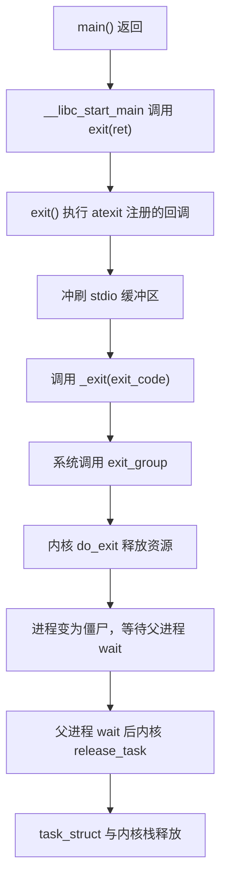
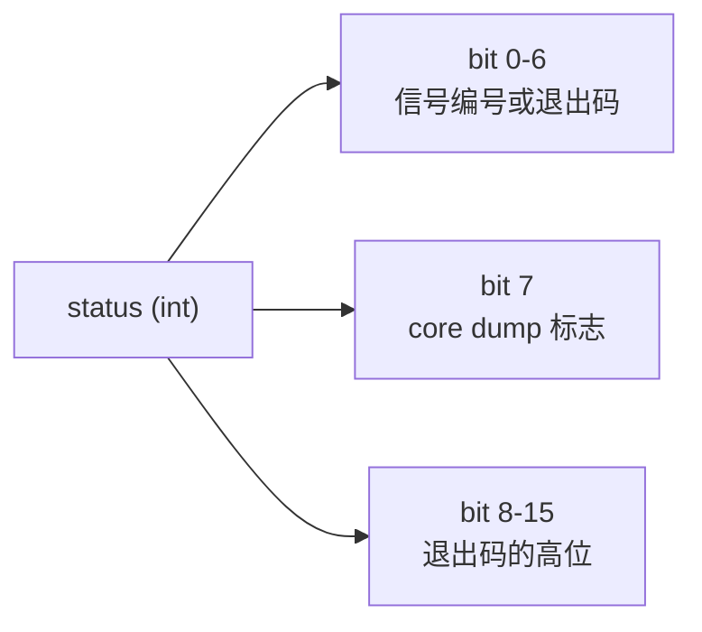

# 05 进程的终结与善后——exit、wait 与僵尸进程

**摘要：**

进程的死亡不是一个瞬间，而是一段有严格顺序的拆解过程，而且这个顺序有一个反直觉之处：**进程退出时并不释放它在内核里的最后一点痕迹**。`task_struct` 与内核栈会被保留下来，直到父进程调用 `wait4()` 把它取走。这份被刻意留下的残骸就是僵尸进程（Zombie）。本文沿着 `exit()` 从用户态到 `do_exit()` 的路径展开：先看 `exit()`、`atexit()`、`_exit()` 三层结构各自负责什么，再看内核里资源释放的顺序为什么必须按那个次序执行，看 `exit_notify()` 如何把死亡消息通知给父进程与线程组的其它成员，以及 `exit_code` 是怎样被编码进 `wait` 的返回值的。核心部分讨论僵尸进程：它到底占用了什么、为什么这个占用不能省、为什么 `kill -9` 对它无效、以及在生产上如何定位与治理。随后拆解 `wait4()` 的等待循环、`SIGCHLD` 的语义与它著名的"信号可能丢失"问题、以及 `SA_NOCLDWAIT` 与"显式忽略 `SIGCHLD`"这两种能够自动回收子进程的手段。文章还覆盖孤儿进程的收养路径、`PR_SET_CHILD_SUBREAPER` 与容器里 PID 1 的特殊职责——容器中 init 进程缺失导致的僵尸堆积，是很多"容器跑久了就不健康"现象的真正原因。全文回答两个问题：进程退出时内核按什么顺序做了什么，以及父子进程之间那条"谁负责收尸"的责任链是如何传递的。

---

## 第 1 章 退出不是一个瞬间

### 1.1 从 `main` 返回到进程消失

一个 C 程序从 `main` 返回，到它在系统中的痕迹彻底消失，中间隔着好几层：



这条链路上有三处容易出问题的地方。第一处是 `main` 返回的返回值只被用作 `exit()` 的实参，如果程序在别处调用了 `exit()`，`main` 的返回值就毫无意义。第二处是 `atexit` 回调的执行顺序与注册顺序相反（栈式），且回调本身如果调用 `exit()` 会导致行为未定义。第三处是 `_exit()` 与 `exit()` 的区别——在 `fork` 出来的子进程里，必须用 `_exit()` 而不是 `exit()`，否则会把父进程遗留的 `stdio` 缓冲区再冲刷一遍，造成输出重复。

### 1.2 三次释放，三段时间

把整个过程按"谁在释放什么"切分，可以分成三段：

| 阶段 | 执行者 | 释放的内容 |
| :--- | :--- | :--- |
| 用户态善后 | libc | `atexit` 回调、`stdio` 缓冲区、TLS 析构 |
| 内核态回收 | `do_exit()` | 地址空间、文件表、信号结构、凭证、信号量撤销 |
| 最终清理 | 父进程 `wait` 触发 `release_task()` | `task_struct`、内核栈、PID |

这三段的时间跨度可以非常大。用户态善后通常是毫秒级；`do_exit()` 也是毫秒级；但最后一段的时机**完全取决于父进程什么时候调用 `wait`**，可能是毫秒，也可能是永远。这种"释放权不在自己手里"的设计，是僵尸进程产生的直接原因。

### 1.3 为什么最后一步要交给父进程

这个设计初看很怪：进程已经死了，为什么不让它自己把最后一点内存也还掉。

原因是**退出状态需要有地方存放**。父进程调用 `wait` 时要知道子进程是正常退出还是被信号杀死、退出码是多少、有没有产生 core dump。这些信息必须在子进程消失之后继续存在一段时间，直到父进程来取。如果子进程一退出就把 `task_struct` 释放，这些信息就无处安放了。

所以僵尸进程不是 bug，而是一份"待领取的死亡证明"。它的存在时间应该很短——父进程调用 `wait` 的那一刻它就消失。**问题从来不是僵尸本身，而是没人来领的僵尸**。用一句更准确的话说：僵尸进程表象是"子进程没死干净"，实质是"父进程没有履行回收义务"。

### 1.4 `atexit` 的几条规则

用户态善后这一段看起来只是"运行几个回调"，实际有几条容易踩的规则。

**规则一：回调按注册顺序的逆序执行。** 后注册的先执行，这是栈式语义。一条有用的推论是：如果一个清理函数依赖另一个资源，应该先注册依赖者、后注册被依赖者，这样逆序执行时被依赖者先清理——顺序正好符合依赖关系。

**规则二：`_exit()` 与 `abort()` 不执行回调。** `_exit` 直接进入内核，`abort` 走信号路径，两者都会跳过 `atexit` 注册的回调。因此不能把"必须执行的清理"（如写完日志、释放锁、删除临时文件）完全托付给 `atexit`——进程被 `SIGKILL` 或崩溃时，这些清理根本不会发生。

**规则三：`atexit` 与 `fork` 的交互需要留意。** `fork` 之后子进程继承父进程的 `atexit` 注册表。如果子进程在 `execve` 之前调用了 `exit()`，父进程注册的那些回调会在子进程里再执行一遍——如果回调做的事是"关闭一个全局资源"，那么父子两个进程会各自关一次，后关的那个可能操作已经失效的资源。这正是"子进程必须用 `_exit()`"这条规则的另一半理由。

**规则四：在信号处理函数里调用 `exit()` 是不安全的。** `exit()` 不是 async-signal-safe 函数，它会在信号处理期间调用 `atexit` 回调与 `stdio` 冲刷，而那些回调可能与主流程正在执行的代码冲突。信号处理函数里正确的退出方式是 `_exit()`。

这几条规则合起来指向同一个判断标准：**`atexit` 适合做"锦上添花"的清理，不适合做"必须完成"的清理**。任何真正重要的收尾工作，都应该在主流程的正常路径上显式执行，而不是依赖进程退出的最后一道钩子。

---

## 第 2 章 `do_exit`：内核里的退出流程

### 2.1 入口与状态设置

`do_exit()` 是内核里的退出主函数，所有退出路径最终都汇聚到这里：

- 用户态调用 `exit_group`（`exit()` 的底层）；
- 线程调用 `exit`（只退出当前线程）；
- 进程收到致命信号且该信号未被忽略；
- `execve` 失败后的 `_exit`；
- 内核线程主动调用 `do_exit()`。

函数入口处的第一批操作是把自己标记为"正在退出"：设置 `PF_EXITING` 标志、把 `__state` 设为 `TASK_DEAD`、从调度队列上摘下来。`PF_EXITING` 这个标志的作用是让其它代码知道"这个进程正在退出，不要给它分配新工作"——比如文件描述符的分配、信号投递、`ptrace` 操作都会检查它。

### 2.2 资源释放的顺序

`do_exit()` 里资源释放的顺序不是随意的，每一步都依赖前一步的完成：

| 顺序 | 释放对象 | 依赖关系 |
| :--- | :--- | :--- |
| 1 | 退出通知链（`exit_notify`） | 需要进程还"活着"才能通知别人 |
| 2 | 定时器与信号量撤销 | 需要信号结构还在 |
| 3 | 地址空间（`exit_mm`） | 需要在文件与信号之后 |
| 4 | 文件系统上下文与 fd 表 | 需要 `fs` 与 `files` 未释放 |
| 5 | 内核线程的清理 | 仅内核线程走这条路径 |
| 6 | 通知父进程（`exit_notify` 的第二次调用） | 必须在资源释放之后 |

其中第 6 步的位置很关键：**父进程被唤醒的时刻，子进程的自有资源已经全部释放完毕**。这保证了父进程 `wait` 返回时，被回收的资源是干净的——不会出现"父进程已经认为子进程死了，但子进程的 fd 还占着"这种中间态。

### 2.3 `exit_notify`：通知谁

`exit_notify()` 承担了两件事：向父进程发送 `SIGCHLD`，以及处理"线程组内还有别人吗"这个判断。

```c
/* 简化的逻辑骨架 */
if (tsk->exit_signal != -1 && thread_group_empty(tsk)) {
    /* 线程组已空：进程真的死了，通知父进程 */
    do_notify_parent(tsk, tsk->exit_signal);
}
```

这里有一个重要条件：**只有在整个线程组都退出之后，父进程才会收到通知**。一个多线程程序里某个线程调用 `exit()`，父进程不会有任何感知——因为进程还活着。只有当最后一个线程退出时，`SIGCHLD` 才会发出。这个规则保证了"线程的死亡不是进程的死亡"这一语义。

`exit_notify()` 的另一项工作是**挑选新的父进程**。如果当前进程有子进程（它们即将成为孤儿），内核需要给它们安排一个新的收养者：

- 默认情况下，收养者是当前 PID 命名空间的 `init` 进程（PID 1）；
- 如果某个祖先进程设置了 `PR_SET_CHILD_SUBREAPER`，收养者是那个最近的 subreaper；
- 如果在设置 `CLONE_PARENT` 时创建过，还有其它例外情形。

收养者的选择不是"就近择亲"这么简单，内核在 `find_new_reaper()` 里会沿着父链向上查找，同时处理线程组、命名空间与 subreaper 三种情况。

### 2.4 为什么不能立刻释放 `task_struct`

回到 1.3 节的问题，这里给出内核层面的具体理由。

`task_struct` 在进程退出后仍有几项用途：

- **保存退出状态**：`exit_code`、`exit_signal`、`exit_state` 三个字段要留给父进程读取；
- **维持家族关系链**：父进程的 `children` 链表通过子进程的 `sibling` 节点串起来，删除节点需要父进程参与；
- **资源使用统计**：`utime`、`stime`、`cutime`、`cstime` 等字段供父进程通过 `times()` 读取；
- **procfs 的可观测性**：`/proc/[pid]/stat` 在进程成为僵尸后仍然可读，这正是排查僵尸进程时能拿到它的名字与父进程 PID 的原因。

把这些信息复制到别处、然后立刻释放 `task_struct`，理论上可行，代价是内核需要引入一套"退出记录"的独立数据结构与生命周期管理，而现有方案的代价只是"父进程必须 `wait`"。**内核选择了把责任交给用户态**——这个取舍的收益是实现简单，代价是给用户态留了一个容易踩的坑。

### 2.5 `exit_group` 与线程退出

Linux 有两个退出系统调用：

| 调用 | 作用 | 使用场景 |
| :--- | :--- | :--- |
| `exit` | 只终止调用线程 | `pthread_exit()` 的底层 |
| `exit_group` | 终止整个线程组 | `exit()`、`_exit()` 的底层 |

libc 的 `exit()` 与 `_exit()` 都走 `exit_group`，因此**在一个线程里调用 `exit()` 会杀掉整个进程**——这是 C 语言程序里一个经典的误用：在多线程程序中本意是"结束当前线程"，结果整个服务退出了。

内核实现上，`exit_group` 会遍历线程组内的其它线程并调用 `zap_other_threads()`，向它们发送致命信号，然后自己走 `do_exit()`。其它线程收到信号后从各自的阻塞点醒来并退出，最后一个退出的线程负责触发 `do_exit()` 的最后阶段。这就是为什么一个多线程进程的退出在多核机器上会呈现为"多个线程先后消失"而不是同时消失。

### 2.6 统计的结算与 `exit_state`

在释放资源之前，`do_exit()` 还有一项容易被忽略的工作：**把当前进程的 CPU 时间结算进线程组**。

每个执行流的 `utime`/`stime` 记录在自己的 `task_struct` 上，而父进程通过 `wait` 或 `times()` 看到的是线程组汇总值。结算动作发生在退出路径上：把本线程的计时累加到 `signal_struct` 的 `cutime`/`cstime`（children 的时间）以及线程组自身的统计里。这个动作必须在 `signal_struct` 被释放之前完成，否则这部分时间就丢掉了——这也是为什么资源释放顺序里"信号结构"排在"地址空间"之前的原因之一。

`exit_state` 是另一个与 `__state` 容易混淆的字段。前者描述的是退出过程的阶段，取值只有三个：

| 取值 | 含义 |
| :--- | :--- |
| 0 | 尚未退出 |
| `EXIT_ZOMBIE` | 已退出，等待父进程回收 |
| `EXIT_DEAD` | 正在被回收，即将释放 |

`__state`（也就是 `TASK_DEAD` 之类）描述的是调度状态，`exit_state` 描述的是退出阶段。僵尸进程的判定条件是 `exit_state == EXIT_ZOMBIE`，而不是 `__state` 的某个取值。内核在 `task_state_array` 里把两者组合起来映射成 `/proc` 显示的单个字母，这就是 `ps` 输出里 `Z` 的来源。

---

## 第 3 章 退出状态的编码

### 3.1 一个整数承载了五种信息

`wait` 与 `waitpid` 返回的状态值是一个 `int`，但它的内容不是简单的退出码，而是一个按位段划分的编码：



只有第 8-15 位是真正的退出码，低 7 位用来表示"是否被信号终止、被哪个信号终止"。直接比较 `status` 与退出码（如 `if (status == 1)`）会把这两部分混在一起，导致判断错误——这是 `wait` 相关代码里最常见的 bug。

### 3.2 标准宏的用法

POSIX 提供了一组宏用于正确解读：

| 宏 | 含义 |
| :--- | :--- |
| `WIFEXITED(status)` | 是否正常退出 |
| `WEXITSTATUS(status)` | 正常退出时的退出码 |
| `WIFSIGNALED(status)` | 是否被信号终止 |
| `WTERMSIG(status)` | 终止它的信号编号 |
| `WCOREDUMP(status)` | 是否产生了 core dump |
| `WIFSTOPPED(status)` | 是否处于停止状态（需要 `WUNTRACED`） |
| `WSTOPSIG(status)` | 导致停止的信号 |

正确的判断顺序是**先判断类别，再取具体值**：

```c
if (WIFEXITED(status)) {
    printf("exited with %d\n", WEXITSTATUS(status));
} else if (WIFSIGNALED(status)) {
    printf("killed by signal %d\n", WTERMSIG(status));
    if (WCOREDUMP(status))
        printf("(core dumped)\n");
}
```

这个顺序不能颠倒，因为 `WEXITSTATUS` 只在正常退出时才有意义，对被杀死的进程调用它会得到一个无意义的数字。

### 3.3 shell 里的 `$?` 从哪来

shell 的 `$?` 就是这段编码的产物。Bash 在子进程被信号 `N` 终止时，把 `$?` 设为 `128 + N`——这就是为什么 Ctrl+C 中断一个前台命令后 `echo $?` 会输出 130（`SIGINT` 是 2）。这个转换是 shell 自己做的，不是内核的行为，因为 `$?` 必须是一个 0-255 的单字节值，放不下完整的 `status`。

理解这层转换能解释一个常见的困惑：一个被 `SIGKILL`（9）杀掉的进程，shell 里看到的是 137。在容器编排系统里，137 是一个高频出现的退出码，它对应的正是"被 `SIGKILL` 杀死"——往往意味着容器超出了内存限制被 OOM Killer 干掉，或者健康检查失败后被运行时强制终止。

### 3.4 `waitid`：更清晰的接口

`wait` 与 `waitpid` 把状态挤进一个 `int` 的位段里，`waitid` 则换了一个更清晰的表达方式——它把结果写进一个 `siginfo_t` 结构：

```c
siginfo_t info;
if (waitid(P_PID, pid, &info, WEXITED | WNOWAIT) == 0) {
    /* info.si_code 区分 CLD_EXITED / CLD_KILLED / CLD_DUMPED / CLD_STOPPED */
    /* info.si_status 携带退出码或信号编号 */
}
```

这个接口有两个 `waitpid` 没有的能力。第一是 `si_code` 明确区分了"正常退出""被信号杀死""产生 core 后被杀""处于停止状态"四种情况，不需要靠位运算推断。第二是 `WNOWAIT` 标志——它让调用者**读取子进程状态但不回收它**，退出记录继续保持可用，后续可以再 `wait` 一次真正回收。`WNOWAIT` 在需要"先看一眼再决定怎么处理"的场景下很有价值，比如一个调试器想要观察子进程的退出状态但并不想立即把它从等待队列里摘走。

`si_status` 的语义随 `si_code` 变化这一点也需要注意：当 `si_code` 为 `CLD_EXITED` 时它是退出码；当 `si_code` 为 `CLD_KILLED` 或 `CLD_DUMPED` 时它是信号编号。这个设计比 `wait` 的位段编码清晰，代价是调用者必须读 `si_code` 才知道 `si_status` 是什么，不能直接使用。

---

## 第 4 章 僵尸进程

### 4.1 僵尸到底是什么

一个僵尸进程在内核里就是**一个 `task_struct` 加上一个内核栈**，没有任何其它资源。它的地址空间已经不在了、fd 表已经关了、信号结构已经释放了，只剩下 `exit_code` 这一组字段等待被读取。

从用户态观察，僵尸进程的特征是状态码 `Z`：

```bash
ps -eo pid,ppid,stat,comm | awk '$3 ~ /^Z/'
#   PID  PPID STAT COMMAND
# 12345  1234 Z    app
# 12346  1234 Z    app
# 12347  1234 Z    <defunct>
# 12348  1234 Z    app
```

输出里 `<defunct>` 是内核给已经释放了 `comm` 的僵尸进程的占位名——实际上 `comm` 字段在僵尸身上通常仍然可读，`<defunct>` 更多出现在被 `ptrace` 或特殊路径退出的进程上。三项信息里最有价值的是第二列 `PPID`：它就是"该来收尸但没来"的那个进程。

### 4.2 僵尸占用什么

| 资源 | 是否被僵尸占用 | 量级 |
| :--- | :--- | :--- |
| `task_struct` | 是 | 约 7KB（slab） |
| 内核栈 | 是 | 16KB |
| PID | **是** | 每个 1 个 |
| 内存地址空间 | 否 | 已释放 |
| 文件描述符 | 否 | 已关闭 |
| CPU | 否 | 不会被调度 |

这张表里最需要留意的是 PID 那一行。僵尸进程仍然持有 PID，如果堆积到几万个，就可能耗尽 `pid_max`，导致新进程无法创建——此时系统的表现是 `fork` 返回 `EAGAIN`、`Cannot allocate memory` 之类的错误，而根因却是一堆早就死掉的进程。

内存占用也不容忽视：一个僵尸约 23KB，十万个僵尸就是 2.3GB 不可回收内存。这个数字在容器里尤其致命，因为容器的内存限制会把僵尸的内存算进去，最终触发 OOM Killer 把还活着的进程杀掉——**一场由死进程引发的对活进程的屠杀**。

### 4.3 为什么 `kill -9` 无效

杀掉一个僵尸是自相矛盾的操作。`kill` 的工作方式是向目标进程投递一个信号，而信号的处理需要目标进程处于可以被唤醒的状态——僵尸进程已经不在调度队列上、也不会再执行任何用户态代码，因此信号无处投递。

内核对此的处理是明确的：把信号投递给一个 `EXIT_ZOMBIE` 状态的进程会被直接丢弃（在 `do_exit` 之后，`PF_EXITING` 已置位，多数信号投递路径会跳过它）。所以 `kill -9 <僵尸PID>` 不会报错也不会生效——它可能返回 0 表示"信号发送成功"，但目标根本不会响应。

**唯一能让僵尸消失的方式是让它的父进程调用 `wait`**。如果父进程也无法被唤醒（比如它自己卡在 D 状态），那么唯一的办法是杀掉父进程——父进程一死，僵尸会被 `init` 收养，`init` 会自动 `wait`，僵尸随之消失。

### 4.4 为什么会有大量僵尸

僵尸堆积的根因可以归成三类：

| 类别 | 具体表现 | 典型来源 |
| :--- | :--- | :--- |
| 父进程未调用 `wait` | 代码里根本没有回收逻辑 | 手写的 `fork` 逻辑、简陋的并发框架 |
| 父进程阻塞在别处 | 有回收逻辑但主循环被堵住 | 单线程事件循环里做了阻塞操作 |
| 父进程已死但未清理 | 父进程变成僵尸，它的子进程成孤儿 | 容器里 PID 1 处理不当 |

第三类值得展开。如果一个进程 A 的子进程 B 死了成为僵尸，而 A 自己也因为某种原因变成了僵尸（它的父进程没有 `wait` 它），那么 B 就卡在一个"僵尸的父亲是僵尸"的状态里，直到 A 被回收后 B 才会被转交给 `init`。在容器里，这种链式僵局经常表现为"容器里的进程树整体僵尸化"。

### 4.5 一个真实的治理困境

生产上遇到僵尸堆积时，常见的三种处理方式各有代价：

| 手段 | 效果 | 代价 |
| :--- | :--- | :--- |
| 重启父进程 | 立即清空所有僵尸 | 服务中断 |
| 修改父进程代码，加 `wait` | 根治 | 需要发版 |
| 给父进程设置 `SIGCHLD` 忽略 | 新产生的子进程不再变僵尸 | 无法拿到退出状态 |

第二项是正解，但排障现场往往来不及。此时可以先确认一件事：僵尸的数量是否还在增长。如果停止增长，说明产生僵尸的那段逻辑已经不再被触发，可以先记录下来再择机修复；如果持续增长且逼近 `pid_max`，就必须立即处理。

### 4.6 容器里的僵尸代价更高

在容器环境里，僵尸进程带来的是一个叠加的影响。cgroup 的 `pids` 控制器限制的是**该 cgroup 内的任务总数**，而僵尸进程仍然被计入这个数字——它们的内核对象还挂在进程树与 PID 命名空间上。因此一个容器配了 `pids.max = 200`，累积了 150 个僵尸之后，剩余可供正常使用的"名额"只剩 50 个，服务会开始报"无法创建线程/进程"。

这与裸机上的差别在于配额的大小。宿主机上的 `pid_max` 是几十万，几万个僵尸不痛不痒；容器里的 `pids.max` 常常只有几百，几百个僵尸就足以让服务完全无法工作。**同一个 bug 在裸机上是"内存缓慢上涨"，到了容器里就变成"服务彻底不可用"。**

代价还不止于此。容器里作为 PID 1 的那个进程通常不是 `init`，而是一个应用进程或一个 shell——它默认不会回收收养的孤儿。因此容器内产生的孤儿在退出后全部变成僵尸，且**永远不会被清理**，直到容器重启。这条链路可以完整地解释一个常见现象：一个容器跑了几天之后健康检查开始失败，重启之后一切正常，日志里完全看不出原因。

判断容器是否处于这种状态有一个直接的办法：

```bash
# 在容器内统计僵尸数量（需要容器内有 shell 与 ps）
ps -eo stat | grep -c '^Z'

# 从宿主机侧看 cgroup 的任务计数
cat /sys/fs/cgroup/<容器 cgroup 路径>/pids.current
cat /sys/fs/cgroup/<容器 cgroup 路径>/pids.max
```

当 `pids.current` 接近 `pids.max`、而容器内的活跃进程数远小于这个值时，差额就是僵尸与孤儿。这是排查"容器莫名其妙不再接受新请求"时值得优先排除的一项。

---

## 第 5 章 `wait4` 的内核实现

### 5.1 等待的主循环

`wait4()` 在内核里落到 `kernel_wait4()`，核心是 `do_wait()` 里的一个循环：

```c
/* 简化的 do_wait 骨架 */
repeat:
    /* 第一遍：扫自己的子进程 */
    list_for_each_entry(p, &tsk->children, sibling) {
        if (eligible_child(p)) {
            retval = wait_consider_task(wo, 0, p);
            if (retval) goto end;
        }
    }
    /* 第二遍：扫被 ptrace 跟踪的"子进程" */
    list_for_each_entry(p, &tsk->ptraced, ptrace_entry) { ... }

    if (options & WNOHANG) return 0;          /* 没有可回收的，立刻返回 */
    if (signal_pending(current)) return -ERESTARTSYS;  /* 被信号打断 */
    schedule();                                /* 睡一会儿再来 */
    goto repeat;
```

这个循环揭示了几件事：第一，`wait` 是**轮询加睡眠**而不是事件驱动，被唤醒的时机是"有子进程状态变化"或"收到信号"；第二，`WNOHANG` 的作用是让第一轮扫描结束后直接返回，而不是睡下去；第三，`wait` 可能被信号中断并返回 `EINTR`，调用者必须处理这种情况。

### 5.2 为什么子进程要先被"摘下来"

`do_wait()` 在遍历子进程时有一个关键操作：把满足条件的子进程从父进程的 `children` 链表上摘除（`list_del_init`），释放锁之后再处理。这个"先摘链、后处理"的模式在内核里反复出现，原因是**处理过程可能睡眠**——释放 `task_struct` 需要调用可能阻塞的操作，而在持有全局进程链表锁的时候睡眠会导致整个系统卡住。

这个细节对理解 `wait` 的并发行为有直接帮助：两个线程同时对同一个子进程调用 `wait` 时，只有一个能把子进程摘下来，另一个会继续等待——这保证了退出状态只会被读取一次。

### 5.3 等待语义的各种组合

`waitpid` 的参数组合带来了几种不同的等待语义：

| 参数 | 语义 |
| :--- | :--- |
| `wait(&status)` | 等待任意一个子进程 |
| `waitpid(-1, &status, 0)` | 同上，等价形式 |
| `waitpid(pid, &status, 0)` | 等待指定的子进程 |
| `waitpid(-pgid, ...)` | 等待指定进程组内的任意子进程 |
| `waitpid(pid, &status, WNOHANG)` | 非阻塞，没有可回收的立刻返回 0 |
| `waitpid(pid, &status, WUNTRACED)` | 也关注处于停止状态的子进程 |
| `waitpid(pid, &status, WCONTINUED)` | 也关注从停止状态恢复的子进程 |

`WUNTRACED` 与 `WCONTINUED` 是作业控制的实现基础：shell 需要知道子进程何时被 Ctrl+Z 停止、何时被 `fg` 恢复，这两种状态变化默认不会唤醒 `wait`，必须显式声明关注。

### 5.4 一个容易踩的坑：多子进程与 `wait` 的配对

`wait(&status)` 等待"任意一个子进程"，这在管理多个子进程时有隐患：假设程序 `fork` 了两个子进程 A 与 B，然后在一个循环里调用 `wait`。如果 B 先退出，第一次 `wait` 返回的是 B；下一次 `wait` 会阻塞等待 A。这看起来正确，但如果程序里有别的地方也在调用 `wait`（比如某个库的内部实现），就会出现"谁来收哪个子进程"的不确定性。

更隐蔽的一种情形是多线程程序：线程 1 与线程 2 各自 `wait` 一个子进程，而 `wait(pid)` 指定的 PID 恰好是对方创建的那个。POSIX 并未禁止这种行为，实际结果取决于调度顺序。稳妥的做法始终是**用 `waitpid` 指定具体的 PID，并且由创建子进程的那个执行流负责回收**。

### 5.5 一个特殊的 `EINTR` 规则

绝大多数被信号中断的系统调用，在信号处理函数返回之后会自动重启——这是 `SA_RESTART` 标志的效果，也是为什么很多程序从不处理 `EINTR` 却看起来一切正常。但 `wait` 与 `waitpid` 是明确的例外：**它们不受 `SA_RESTART` 影响，永远会返回 `EINTR`**。

这条规则的理由与 `wait` 的用途直接相关。一个启动子进程并等待它的程序，通常也需要处理信号（如 `SIGCHLD`、`SIGTERM`、`SIGINT`）。如果 `wait` 被自动重启，那么收到 `SIGTERM` 时正在 `wait` 的进程就无法立刻响应请求——它必须等子进程先退出。让 `wait` 返回 `EINTR` 把控制权交还给程序，程序才有机会决定"是先处理信号还是继续等待"。

因此正确的写法是显式处理这个错误码：

```c
/* 正确的等待循环：区分"被信号打断"与"子进程还没退出" */
while ((pid = waitpid(target, &status, 0)) < 0) {
    if (errno == EINTR)
        continue;        /* 被信号打断，重新等待 */
    perror("waitpid");   /* 真正的错误，如 ECHILD */
    break;
}
```

把这个逻辑与 `SIGCHLD` 处理函数的"循环 `wait` 直到返回 0"放在一起，可以看出一条规律：**`wait` 家族的每一次调用都必须考虑三种返回情形——成功、被信号打断、以及没有可回收的子进程**。只处理第一种的代码在压力测试下往往表现正常，而在生产环境的信号密度下会随机出现"子进程没被回收"或"等待提前返回"的问题。

---

## 第 6 章 `SIGCHLD` 与通知机制

### 6.1 `SIGCHLD` 的默认动作

`SIGCHLD` 的默认动作是"忽略"，但这个忽略有特殊性：它与显式设置 `SIG_IGN` 在语义上**并不等价**，尽管两者都会阻止子进程变成僵尸。

| 情形 | 子进程是否变僵尸 | 原因 |
| :--- | :--- | :--- |
| 默认（未处理） | 是 | 内核保留 `task_struct` 等待父进程 `wait` |
| 显式 `signal(SIGCHLD, SIG_IGN)` | 否 | 内核在子进程退出时直接释放 |
| `SA_NOCLDWAIT` 标志 | 否 | 同上，通过 `sigaction` 设置 |
| 注册了处理函数但从不 `wait` | 是 | 处理函数被调用，但没人回收 |

第三行与第一行的差异正是很多"僵尸怎么杀都杀不完"问题的答案来源——**把 `SIGCHLD` 显式设为 `SIG_IGN`，可以让内核自动回收子进程**，代价是彻底失去获取退出状态的能力。

### 6.2 `SA_NOCLDWAIT`：更明确的表达

`signal(SIGCHLD, SIG_IGN)` 这个用法存在可移植性问题：POSIX 并未明确规定它的行为等同于 `SA_NOCLDWAIT`，只是 Linux 与部分 BSD 系统这样实现。可移植的写法是显式使用 `sigaction`：

```c
struct sigaction sa = {0};
sa.sa_handler = SIG_IGN;        /* 或者用处理函数，见下 */
sa.sa_flags = SA_NOCLDWAIT;     /* 关键：告诉内核不要保留子进程 */
sigaction(SIGCHLD, &sa, NULL);
```

使用 `SA_NOCLDWAIT` 之后，`wait` 会返回 `ECHILD`——因为内核已经不保留任何子进程的退出信息了。这个错误码在排查时是一个明确的信号：**说明这个进程设置了自动回收，它拿不到子进程的退出状态**。

### 6.3 `SIGCHLD` 会丢

`SIGCHLD` 是一个标准（非实时）信号，标准信号**不排队**：如果同一个信号已经有待处理实例，再次投递会被合并。这意味着当一个父进程同时有多个子进程退出时，`SIGCHLD` 处理函数可能只会被调用一次，而实际上有多个子进程等着被回收。

这个特性导致了经典的"信号处理后必须循环 `wait`"这一编程规则：

```c
/* 正确做法：在处理函数里循环回收，直到没有可回收的 */
while (waitpid(-1, &status, WNOHANG) > 0) {
    /* 处理一个子进程的退出 */
}
```

只调用一次 `wait` 的写法在多子进程场景下必然漏掉一部分，被漏掉的就变成僵尸。这个 bug 的特点是**在子进程退出间隔较长时完全不出现**，一旦负载升高或发生批量退出（如服务重启时所有 worker 同时退出）就立刻暴露。

### 6.4 多线程程序里的 `SIGCHLD`

在线程化的程序里，`SIGCHLD` 会被投递给线程组内的某个线程——具体是哪一个由内核选择，通常是那个没有阻塞 `SIGCHLD` 的线程。这个不确定性会给使用线程池的程序带来麻烦：处理函数可能运行在一个没有预料到的线程上，访问了错误的状态。

稳妥的做法是**在一个专用线程里用同步方式处理**：让所有其它线程阻塞 `SIGCHLD`，创建一条专门等待信号的线程，在其中用 `sigwait()` 或 `sigwaitinfo()` 同步接收并处理。这样信号处理逻辑就是一个普通的循环，不再受异步信号安全的约束，可以自由调用 `waitpid` 与任何库函数。

### 6.5 `pidfd`：把子进程当成可轮询的对象

`SIGCHLD` 的诸多不便在 Linux 5.3 之后有了一个新的替代方案。`pidfd_open()` 会为一个进程返回一个文件描述符，这个 fd 具有两个关键性质：它**稳定**（不受 PID 复用影响），并且**可被 `poll`/`epoll` 监听**（进程退出时变为可读）。

```c
/* 新一代的等待方式：把子进程当成 epoll 里的一个对象 */
int pfd = (int)syscall(SYS_pidfd_open, child_pid, 0);
struct epoll_event ev = { .events = EPOLLIN, .data.fd = pfd };
epoll_ctl(epfd, EPOLL_CTL_ADD, pfd, &ev);
/* 子进程退出时 epoll_wait 会返回，随后仍用 waitid 拿退出状态 */
```

这个设计的价值在于把"等待子进程"从一个专用的系统调用变成了**统一的事件模型**。一个同时管理着网络连接与子进程的服务，不再需要为 `SIGCHLD` 单独设计一套处理逻辑，也不需要担心信号在异步处理函数里的安全性——所有事件都在同一个 `epoll_wait` 循环里被处理。

`pidfd` 与 `waitid` 是配合关系而不是替代关系：`pidfd` 负责通知"某个子进程退出了"，退出状态仍然要通过 `waitid(P_PIDFD, ...)` 获取。这保留了原有的语义，只替换了通知机制。对需要同时管理成百上千个子进程的场景（如作业调度系统、进程管理器），这个改动把原先的"信号风暴 + 循环 `wait`"模式简化成了"遍历就绪的 fd 并逐个收状态"。

---

## 第 7 章 孤儿进程与收养

### 7.1 孤儿的定义

孤儿进程（Orphan Process）指的是**父进程先于它退出的进程**。这与僵尸是相反的情形：僵尸是死掉的子进程等父进程来收，孤儿是活着的子进程失去了父进程的照管。

孤儿本身没有危害——它继续正常运行。危害来自一个次生问题：**当这个孤儿自己退出时，谁来 `wait` 它**。如果没人收，它就会变成僵尸。因此内核必须在父进程退出时立刻给它的所有子进程安排一个新的"负责人"。

### 7.2 收养到 `init`

默认的收养者是当前 PID 命名空间的 `init` 进程。每个 PID 命名空间都有自己的 PID 1，这一点在容器场景里很重要：容器里的孤儿会被容器自己的 PID 1 收养，而不是宿主机上的 `init`——前提是容器里确实有一个可以作为 PID 1 存在的进程。

收养发生时，内核会修改子进程的 `real_parent` 与 `parent`，把它挂到新父亲的 `children` 链表上，并更新它的 `PPID`。这个过程对用户态是不可见的，除了 `getppid()` 的返回值会突然变化。

### 7.3 `PR_SET_CHILD_SUBREAPER`

`init` 收养是默认行为，但容器运行时不希望孤儿"跑出容器"。Linux 3.4 引入的 subreaper 机制允许一个进程声明："我的后代中的孤儿归我管"：

```c
/* 声明当前进程为 subreaper */
prctl(PR_SET_CHILD_SUBREAPER, 1, 0, 0, 0);
```

声明之后，`find_new_reaper()` 在向上查找收养者时会优先命中这个 subreaper，而不是一路走到 `init`。`systemd` 用它来管理服务单元产生的孤儿，`containerd-shim` 与 `docker-init`（即 `tini`）用它来保证容器内的孤儿不会逃逸到宿主机的 PID 命名空间。

### 7.4 容器里 PID 1 的三个特殊职责

容器里的 PID 1 与普通进程有本质差别，这一点在 [[云原生/Docker/01 容器的本质——从进程隔离到 OCI 标准]] 里有完整讨论，这里只列出与本章相关的部分：

- **信号的转发**：PID 1 默认忽略未注册的信号，因此 `docker stop` 发出的 `SIGTERM` 如果应用进程不是 PID 1 本身，就必须由 PID 1 转发给真正的应用进程；
- **孤儿回收**：所有成为孤儿的进程都会被收养到 PID 1，它必须 `wait` 它们，否则僵尸会在容器内累积；
- **退出状态的传递**：容器的退出码由 PID 1 的退出码决定，因此 PID 1 需要正确地收集被管理进程的退出状态并以其退出。

一个典型的失败模式是：容器里跑的是一个 shell 脚本作为 PID 1，脚本 `fork` 出一堆后台任务后自己一直 `sleep`。此时 shell 不处理 `SIGTERM`、不回收孤儿，结果是容器无法优雅停止，僵尸持续累积。

### 7.5 三种应对方式

| 方式 | 做法 | 适用场景 |
| :--- | :--- | :--- |
| 应用自己做 PID 1 | 应用直接处理信号与回收 | 应用可控，推荐 |
| 用 `tini` / `dumb-init` | 在入口处加一个小型 init | 应用无法改造 |
| `docker run --init` | 运行时自动注入 init | 快速验证与临时使用 |

`tini` 这类工具的核心逻辑非常短——转发信号给子进程、回收所有孤儿、以自己的退出码反映子进程的退出码。它的价值不在于逻辑复杂，而在于**把 PID 1 的职责从应用剥离出来**，让应用可以专注于业务。

### 7.6 孤儿进程组与两条自动信号

孤儿进程组（Orphaned Process Group）是一个与孤儿进程不同的概念，值得单独区分：它指的是**组内没有任何一个成员的父亲不在同一个组内或不在同一会话中**的进程组。换句话说，这个进程组已经"没有外部靠山"了。

POSIX 对处于这种状态的进程组有一条特殊规定：**如果孤儿进程组中有成员处于停止（Stopped）状态，内核会向整个进程组发送 `SIGHUP` 与 `SIGCONT`**。发送 `SIGCONT` 是为了唤醒停止的成员，发送 `SIGHUP` 则是给它们一个"你的终端没了，请自己决定要不要退出"的通知。

这条规则解释了几个常见现象。一个是"后台任务在终端关闭后被杀掉"——如果该任务的进程组成为了孤儿组且其中有停止的成员，`SIGHUP` 就会到来。另一个是 `nohup` 与 `setsid` 的价值：它们让进程离开原会话或忽略 `SIGHUP`，从而在终端关闭后继续运行。

需要注意的是这条信号**只发送给孤儿进程组中的停止成员所在的整组**，而不是无条件发给所有孤儿进程。因此"父进程退出后子进程就会被杀"这种说法并不准确——普通的孤儿进程不会被自动杀死，只有满足"进程组已孤儿化且组内有停止成员"这两个条件时才会触发。理解这个精确的触发条件，才能解释为什么有些后台任务在终端关闭后安然无恙，另一些却被清理掉了。

---

## 第 8 章 异常的退出路径

### 8.1 被信号杀死

进程被信号杀死时，退出路径与正常退出不同：`do_exit()` 的入参不是退出码，而是信号编号，内核把它记录在 `exit_code` 的高位段里。对父进程来说，`WIFSIGNALED` 为真、`WTERMSIG` 返回信号编号。

有几个信号会使进程"消失得没有痕迹"：`SIGKILL` 不能被捕获、阻塞或忽略，它总是立即生效；`SIGSTOP` 类似但只是暂停。其它信号如果进程注册了处理函数并选择在其中不退出，进程就不会死——这也是为什么"用 `kill` 杀不掉某个进程"时，第一步要确认的不是权限，而是这个进程是否注册了该信号的处理函数。

### 8.2 OOM Killer 的介入

当系统内存耗尽时，OOM Killer 会挑选一个进程并给它发送 `SIGKILL`。被选中的进程无法抵抗，它甚至不会走正常的退出路径——它的退出状态只有一个信号编号。

在容器里这个过程更隐蔽。当容器超出 cgroup 内存限制时，cgroup 的 OOM Killer 会杀掉容器内的进程，宿主机上看到的是容器的退出码 137，而容器内部可能连日志都没有——因为进程是被直接杀死的。**排查这类问题的第一步不是看应用日志，而是确认 cgroup 的内存事件计数**，第 06 篇讨论的内存状态与 [[Linux/内存管理/07 OOM Killer：内存耗尽时内核如何做出生死抉择]] 里的机制在这里汇合。

### 8.3 core dump 的生成

当一个进程因为"会产生 core 的信号"（`SIGSEGV`、`SIGABRT`、`SIGQUIT` 等）而终止时，内核会尝试生成 core dump 文件。这个过程受三重限制：

| 限制 | 位置 | 影响 |
| :--- | :--- | :--- |
| `RLIMIT_CORE` | 进程资源限制 | 为 0 时不生成 core |
| `/proc/sys/kernel/core_pattern` | 系统级 | 决定文件名与是否交给外部程序处理 |
| `fs.suid_dumpable` | 系统级 | setuid 程序是否允许 dump |

core dump 的生成发生在 `do_exit()` 的路径上，通过 `do_coredump()` 完成。它需要遍历进程的全部 VMA 并把内容写出来，因此对大内存进程来说这一步可能耗时数秒——期间进程处于"正在 dump"的状态，表现为 `ps` 里的 `D` 状态加上 `(core dumped)` 的提示。

`core_pattern` 的一个现代用法是把它设为一个管道命令，让内核把 core 交给外部程序处理（如 `systemd-coredump` 或上传到集中存储）。这解决了"core 文件太大、写在哪里都不合适"的问题，但引入了一个新的风险：如果外部程序处理缓慢，被 dump 的进程会长时间停留在内核态。

### 8.4 内核线程的退出

内核线程退出不走 `exit_group` 的常规路径，而是由 `kthread_stop()` 配合 `kthread_should_stop()` 完成：调用者设置停止标志并唤醒线程，线程在自己的主循环里检查这个标志并主动 `return` 或调用 `kthread_exit()`。这是一套协作式的退出机制，因为它**无法强制终止一个内核线程**——内核线程可能在持有锁的位置，强行终止会破坏内核状态。

这套机制带来一个实践后果：有 bug 的内核模块创建的内核线程可能永远不响应停止请求，表现为 `rmmod` 时挂起。此时 `ps` 里能看到这些线程还在运行，而它们的名字（如某个驱动的自定义名字）就是定位问题的线索。

---

## 第 9 章 排查与治理

### 9.1 快速统计僵尸

```bash
# 统计僵尸总数
ps -eo stat | grep -c '^Z'

# 按父进程聚合，找出"该收尸却没来"的进程
ps -eo pid,ppid,stat,comm | awk '$3 ~ /^Z/ {print $2}' | sort | uniq -c | sort -rn | head
#   4827 1234
#    312 5678
# 输出说明 PID 1234 名下累积了 4827 个僵尸
```

第二条命令的价值在于**把问题从"有多少僵尸"转换成了"哪个父进程失职"**。僵尸数量本身只是一个现象，`PPID` 才是可行动的线索。

### 9.2 确认父进程的状态

找到可疑的父进程之后，接下来的判断是：它是"没有回收逻辑"还是"卡住了"。

```bash
# 看父进程当前在做什么
cat /proc/1234/wchan; echo
# 输出是内核函数名，如 do_wait、epoll_wait、rwsem_down_read_slowpath

# 看它的上下文切换计数是否停滞
grep -E 'voluntary|nonvoluntary' /proc/1234/status
# 若两个计数长时间不变，说明它卡住了（D 状态或死锁）

# 看它的线程各自在做什么
cat /proc/1234/task/*/stack 2>/dev/null | head -n 40
```

如果 `wchan` 显示父进程正常停在 `epoll_wait`，那它只是"没有回收逻辑"；如果停在某个锁函数或 I/O 函数上且长期不动，问题就不在回收逻辑，而在它为什么卡住——后者往往更严重，因为一个卡住的父进程通常意味着更大范围的故障。

### 9.3 三种治理手段的取舍

| 手段 | 立即生效 | 根治 | 副作用 |
| :--- | :--- | :--- | :--- |
| 杀掉父进程 | 是 | 否 | 父进程管理的其它子进程也会被收养，可能中断服务 |
| 修改代码加 `wait` | 否 | 是 | 需要发版、回归测试 |
| 设置 `SA_NOCLDWAIT` | 是 | 部分 | 失去退出状态，可能影响业务逻辑 |
| 重启所在容器/主机 | 是 | 否 | 影响面最大 |

选择依据是"僵尸是否还在持续增长"与"父进程是否还能正常服务"。一个稳定的、不再增长的僵尸集合，其危害主要是占内存与 PID，可以按计划处理；一个持续增长的僵尸集合则说明代码路径正在被反复触发，需要尽快修。

### 9.4 一个典型场景的复盘

设想一个用 Go 编写的服务，它通过 `exec.Command` 调用外部工具做数据转换。上线几天后监控发现容器内存缓慢上涨，重启后恢复，几天后又涨。

排查路径是：先看内存构成（`/proc/[pid]/status` 与 `/proc/[pid]/smaps`），发现进程自身的 RSS 并不高，但容器整体内存占用在涨。接着统计僵尸：

```bash
ps -eo stat | grep -c '^Z'
# 输出 3000+
```

根因随之清晰：`exec.Command` 的 `Run()` 会调用 `Wait()` 回收子进程，但如果代码路径里用了 `Start()` 而没有调用 `Wait()`，子进程退出后就成为僵尸。3000 个僵尸约 70MB 内存，加上 PID 占用，随着调用次数增长而累积——这正是"内存缓慢上涨、重启即恢复"这类现象的一个典型成因。

这个案例的教益是：**僵尸进程造成的内存泄漏在进程自身的指标里是看不见的**，因为僵尸的内存记在 slab 里、不计入任何进程的 RSS。排查这类问题必须把容器级内存与进程级 RSS 做对比，差额往往就是内核对象（如 `task_struct`）的占用。

### 9.5 一份可复用的巡检脚本

把前面几节的检查串起来，可以在节点上定期执行一段简短的巡检：

```bash
#!/bin/sh
# 僵尸进程巡检：输出总数、Top 失职父进程、以及相关内核对象数
echo "== 僵尸总数 =="
ps -eo stat --no-headers | grep -c '^Z'

echo "== Top 失职父进程（PID 与命令） =="
ps -eo pid,ppid,stat,comm --no-headers | awk '$3 ~ /^Z/ {print $2}' \
    | sort | uniq -c | sort -rn | head -n 5 \
    | while read cnt ppid; do
        echo "$cnt 个子进程待回收 <- 父进程 $ppid: $(ps -p $ppid -o comm= 2>/dev/null || echo '已不存在')"
      done

echo "== 内核对象计数 =="
grep -E '^task_struct' /proc/slabinfo | awk '{print "task_struct 活跃对象: "$2}'
```

这份脚本的三段输出分别回答三个问题：**问题有多严重**（总数）、**该找谁**（失职父进程）、**是否与内核对象占用吻合**（slab 计数）。如果第二段里某个父进程被重复列出且计数持续增长，它就是需要修复的目标；如果父进程显示"已不存在"，说明僵尸已经转交给了 `init`，只需要等待 `init` 回收（正常情况下应该是瞬间完成）。

把这段检查纳入常规巡检的价值在于**在它变成故障之前发现它**。僵尸堆积是一个缓慢的过程，从几个到几千个可能需要几天，而这个窗口期完全足够定位与修复——前提是有人在看这个指标。

---

## 第 10 章 边界与反例

### 10.1 僵尸不是"死得不彻底"

一个常见的误解是把僵尸描述成"进程没有完全退出"。更准确的描述是：**进程已经完全退出了，它留下的只是一条等待被读取的退出记录**。僵尸不占用 CPU、不持有内存地址空间、也不会被执行——它唯一"活着的"部分，是内核里那份档案。

这个区分有实际意义：它解释了为什么僵尸不能用 `kill` 清除（没有可执行代码去响应信号），也解释了为什么清理僵尸的唯一正确做法是让父进程读取那份档案。

### 10.2 关于 `SIGCHLD` 的两个误解

**误解一：注册了 `SIGCHLD` 处理函数就不会有僵尸。** 处理函数只是被调用，如果没有在其中调用 `wait`，子进程依然是僵尸。`SIGCHLD` 提供的是"通知"，不是"回收"。

**误解二：`SIGCHLD` 一定会为每个退出的子进程产生一次。** 标准信号不排队，多个子进程同时退出时可能只产生一次通知。因此处理函数里必须循环 `wait`。

### 10.3 双 `fork` 与 `wait` 的责任链

第 03 篇讲过的双 `fork` 守护进程模式在这里有了另一层解释：第一次 `fork` 之后父进程 `_exit(0)`，这个退出需要 shell 来 `wait`；第二次 `fork` 之后新进程与任何用户进程都没有关系，它的退出状态由 `init` 回收。这条责任链是**每一段都可能断**的——只要有个环节没人 `wait`，僵尸就会出现。

### 10.4 什么时候需要 subreaper

`PR_SET_CHILD_SUBREAPER` 并非适用于所有常驻服务。它的价值在两种场景下最明显：一是需要"我的后代不许跑出去"的容器运行时与 init 系统；二是需要统计"我启动的全部进程都结束了没有"的测试框架与构建工具——一个 subreaper 可以等到子孙全部退出才算完成，而不必逐个记录 PID。

对普通业务进程，声明 subreaper 反而会增加负担：所有孤儿都会被送到自己这里，必须准备好处理它们，否则只是把僵尸的堆积点从别处搬到了自己身上。

### 10.5 观测时的视角问题

僵尸进程的排查有一个容易出错的地方：`PPID` 的取值依赖于**观察者所在的 PID 命名空间**。

在宿主机上看容器里的僵尸，它的 `PPID` 是宿主机视角的编号（如 32847）；在容器内部看同一个僵尸，`PPID` 可能是 1。这两个数字都对，只是属于不同层级的命名空间。因此"在容器里查到某个僵尸的父进程是 1"这个结论，翻译到宿主机上应该是"父进程是容器内那个 PID 1 对应的宿主机进程"，而不是"宿主机上的 init 没有回收"。

同样地，容器内的 `ps` 看不到宿主机上的僵尸，宿主机的 `ps` 也看不到容器内被隔离的进程——除非它们处于同一个 PID 命名空间。这个特性在排查时的含义是：**判断"僵尸在哪里"与"该由谁处理"，必须在正确的命名空间层级上做**，否则很容易得出"父进程不存在"的错误结论。第 01 篇讨论 PID 命名空间时的相对视图问题，在这里有了一个具体的应用场景。

---

## 第 11 章 小结：一条责任链

进程的诞生是一条单向链路：`fork` 复制出一个执行流，`exec` 把它变成新程序。进程的死亡则不同——它是一条**需要两个进程配合完成**的链路：一个负责退出，另一个负责收尾。

把这两条链路放在一起看，Linux 进程模型的完整性就显现出来了：`fork` 建立了父子关系，这条关系并不因为子进程的死亡而解除，反而在子进程死亡后承担起新的职责——保留退出记录、通知父进程、由父进程回收。僵尸进程不是这个模型的缺陷，而是**这个模型的代价**：为了把退出状态可靠地交给父进程，内核选择让死掉的进程多留一会儿。

由此可见，本章讨论的全部现象——僵尸、孤儿、`SIGCHLD`、`wait` 的阻塞语义、容器里的 init——都落在同一条责任链上。理解这条链的关键不是记住 `do_exit()` 的分支，而是记住那个不可绕过的问题：**每一对 `fork` 都必须在某处配对一个 `wait`**。谁忘记了这个配对，谁就会在系统里留下无法回收的残骸，而在容器时代，这些残骸的代价比过去更高——因为它们占用的内存会被算进容器的配额里。

---

## 参考资料

1. *Linux Kernel Source* — `kernel/exit.c`：`do_exit()`、`exit_notify()`、`find_new_reaper()`、`do_wait()`、`release_task()`。
2. *Linux Kernel Source* — `kernel/fork.c`：`copy_process()` 中 `exit_signal` 的初始化与 `CLONE_THREAD` 的处理。
3. *Linux Kernel Source* — `fs/coredump.c`：`do_coredump()` 与 `core_pattern` 的解析。
4. *wait(2), waitpid(2), exit(2), exit_group(2) manual pages*：退出状态编码与等待语义的规范说明。
5. *prctl(2) manual page*：`PR_SET_CHILD_SUBREAPER` 的语义与要求。
6. *signal(7), sigaction(2) manual pages*：`SIGCHLD` 语义与 `SA_NOCLDWAIT` 标志。
7. *The Linux Programming Interface*, Michael Kerrisk, 2010：第 26 章，进程的终止与 `wait` 的完整语义。
8. *Advanced Programming in the UNIX Environment*（3rd Edition）, W. Richard Stevens, 2013：第 8 章，进程终止与孤儿进程处理。
9. *Linux Kernel Documentation* — `Documentation/admin-guide/sysctl/kernel.rst`：`core_pattern` 与 `pid_max` 相关参数。
10. *The Linux Programming Interface*, 第 34 章：孤儿进程组与终端会话的关系。

---

> [!note] 思考题
> 1. 如果内核把"退出记录"从 `task_struct` 分离到一个独立的轻量结构体，僵尸进程的内存开销会如何变化？这样做的代价是什么？
> 2. `SA_NOCLDWAIT` 让内核自动回收子进程，那么在一个需要知道子进程退出码的服务里，有没有办法既自动回收又拿到状态？
> 3. 容器里作为 PID 1 的 shell 不处理 `SIGTERM` 时，`docker stop` 最终会以什么方式终止容器？为什么退出码会是 137？
> 4. 僵尸进程的内存占用为什么不体现在任何进程的 RSS 中，这对容量规划意味着什么？