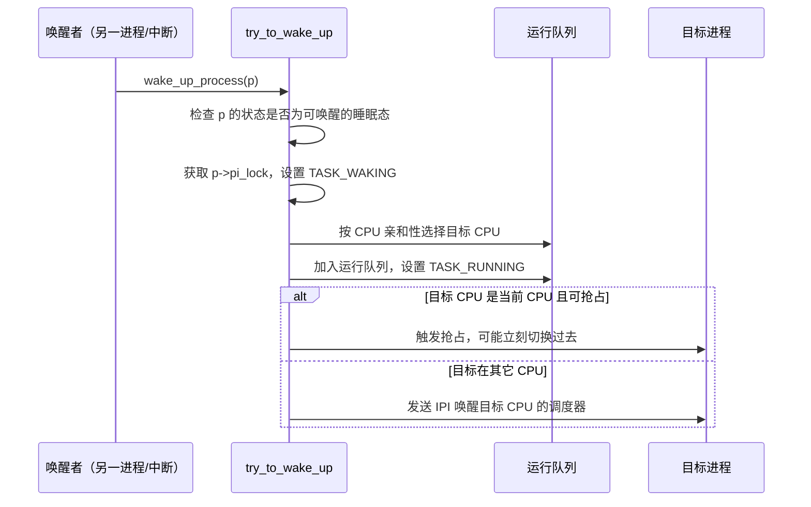
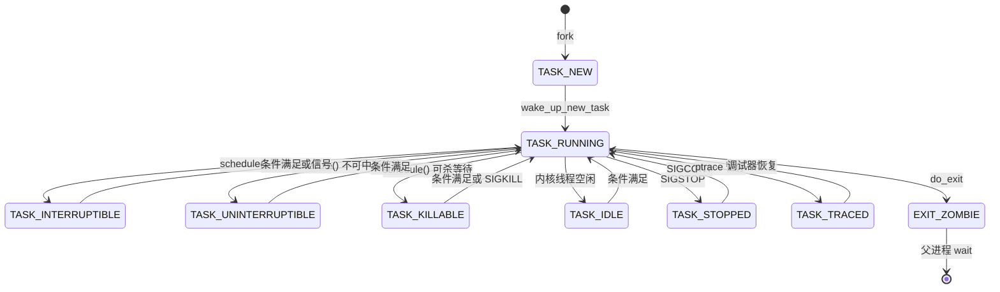

# 06 进程状态机——TASK_RUNNING 到 TASK_DEAD 的完整生命周期

**摘要：**

`ps` 输出的 `STAT` 列只有一个字母，这个字母让太多人对进程状态产生了过于简单的印象。真实情况是：内核里的状态字段是一个**位掩码**，可以同时置起多个位；用户态看到的那个字母，是内核用一个掩码过滤之后映射出来的结果——你看到的 `D`，在内核里可能是 `TASK_UNINTERRUPTIBLE`，也可能是 `TASK_UNINTERRUPTIBLE | TASK_NOLOAD`，两者的行为完全不同。本文按三个层次展开：先说明用户可见状态与内核真实状态的映射关系，逐项拆解 `TASK_RUNNING`、`TASK_INTERRUPTIBLE`、`TASK_UNINTERRUPTIBLE`、`TASK_KILLABLE`、`TASK_IDLE`、`TASK_STOPPED`、`TASK_TRACED`、`TASK_DEAD` 的精确语义；随后讲状态转换的内核触发点——`set_current_state()` 前后的内存屏障为什么不能省、`schedule()` 的两条路径、`try_to_wake_up()` 如何把进程重新放回运行队列，以及等待队列与虚假唤醒。核心部分是 D 状态（不可中断睡眠）的深度剖析：它为什么必须存在、哪些操作会进入这个状态、它如何影响 `load average`、堆积到几百个时系统会发生什么、以及 `TASK_KILLABLE` 这个补救机制在 2.6.25 被引入的动机。最后给出四类生产症状的排查路径与工具选择，并澄清几个常见误区——D 状态并不等于故障，睡眠中的进程同样消耗资源，以及从 `/proc` 读到的状态永远是瞬时快照。全文回答两个问题：进程在内核里究竟有哪些状态、它们之间如何转换，以及这些状态在生产排障中意味着什么。

---

## 第 1 章 单字母背后的信息损失

### 1.1 `ps` 里的五个字母

`ps -eo pid,stat,comm` 输出的 `STAT` 列，第一个字母就是进程状态：

| 字母 | 含义 | 常见程度 |
| :--- | :--- | :--- |
| `R` | Running 或 Runnable | 常见 |
| `S` | Sleeping（可中断睡眠） | **最常见**，绝大多数空闲进程 |
| `D` | Uninterruptible Sleep | 排障时最受关注 |
| `T` | Stopped 或被跟踪 | 作业控制与调试时出现 |
| `Z` | Zombie | 异常信号 |
| `I` | Idle（内核线程的空闲态） | 只在较新内核上出现 |

这个字母后面还可能跟一些修饰字符：`l` 表示多线程，`s` 表示会话首进程，`+` 表示在前台进程组，`<` 表示高优先级，`N` 表示低优先级，`L` 表示有页被锁定在内存中。

### 1.2 内核里的状态不止这几种

内核 `task_struct.__state` 是一个 `unsigned int` 位掩码，定义在 `include/linux/sched.h` 中的状态位远多于上面那五个字母：

| 状态位 | 值 | 用户可见字母 |
| :--- | :--- | :--- |
| `TASK_RUNNING` | 0x0000 | `R` |
| `TASK_INTERRUPTIBLE` | 0x0001 | `S` |
| `TASK_UNINTERRUPTIBLE` | 0x0002 | `D` |
| `__TASK_STOPPED` | 0x0004 | `T` |
| `__TASK_TRACED` | 0x0008 | `t` |
| `EXIT_DEAD` / `EXIT_ZOMBIE` | 0x0010 / 0x0020 | `Z` / `X` |
| `TASK_PARKED` | 0x0040 | `P`（kthread 停放） |
| `TASK_DEAD` | 0x0080 | `X` |
| `TASK_WAKEKILL` | 0x0100 | 修饰位，不单独显示 |
| `TASK_WAKING` | 0x0200 | 修饰位 |
| `TASK_NOLOAD` | 0x0400 | 修饰位 |
| `TASK_NEW` | 0x0800 | 修饰位（新创建） |
| `TASK_KILLABLE` | `UNINTERRUPTIBLE \| WAKEKILL` | `D` 或 `K` |
| `TASK_IDLE` | `UNINTERRUPTIBLE \| NOLOAD` | `I` |
| `TASK_REPORT` | 上述可报告位的合集 | — |

### 1.3 映射是怎么发生的

用户在 `/proc/[pid]/status` 里看到的 `State` 字段，是内核把 `__state` 与 `exit_state` 组合之后、用一个掩码过滤、再映射成字母的产物。相关函数在 `fs/proc/array.c` 里，核心是一个静态数组：

```c
/* 内核里用于把位掩码映射成可读字符串的数组（节选） */
static const char * const task_state_array[] = {
    "R (running)",          /* 0x00 */
    "S (sleeping)",         /* 0x01 */
    "D (disk sleep)",       /* 0x02 */
    "T (stopped)",          /* 0x04 */
    "t (tracing stop)",     /* 0x08 */
    "X (dead)",             /* 0x10 */
    "Z (zombie)",           /* 0x20 */
    "P (parked)",           /* 0x40 */
    "I (idle)",             /* 0x80 */
};
```

这个数组的下标不是状态位的值，而是 `task_state_index()` 转换后的索引——转换过程会先与 `TASK_REPORT` 做与运算，把不可报告的修饰位（如 `TASK_WAKEKILL`）清掉，再做一次位运算把组合状态归到最接近的一个下标上。

理解这层映射有两个直接的好处。第一，`D (disk sleep)` 这个字符串是**误导性的**：它暗示这个状态与磁盘 I/O 相关，而实际上任何长时间不可中断的等待都会进入 D 状态，包括 NFS 挂载点失联、一个卡住的驱动、甚至是等待一个永远不会到来的内存分配。第二，用户看到的永远是**简化后的结果**，`TASK_KILLABLE` 与 `TASK_UNINTERRUPTIBLE` 在 `ps` 里可能都显示为 `D`，而前者可以被 `SIGKILL` 打断、后者不能——这个差异在排障时至关重要，但用户态看不出来。

### 1.4 修饰字符的含义

`STAT` 列的第二个及之后的字符携带了额外信息，它们在排查时同样有用：

| 字符 | 含义 | 排查价值 |
| :--- | :--- | :--- |
| `<` | 高优先级（非默认 nice） | 判断是否有实时任务 |
| `N` | 低优先级 | 判断是否有被降权的后台任务 |
| `L` | 有页面被锁定在内存 | 涉及 `mlock` 或实时应用 |
| `s` | 会话首进程 | 守护进程的典型特征 |
| `l` | 多线程 | 与 `/proc/[pid]/task` 对照 |
| `+` | 在前台进程组 | 判断是否与终端交互 |
| `\|`（部分版本） | 与其它进程共享地址空间 | 极少见，多见于诊断场景 |

组合起来读一个真实例子会更有感觉。`Ss` 表示"可中断睡眠 + 会话首进程"，这是守护进程的典型形态；`Sl` 表示"可中断睡眠 + 多线程"，是绝大多数多线程服务的形态；`Ssl+` 则同时具备三者，常见于在前台运行的多线程服务。而 `D<` 表示"不可中断睡眠 + 高优先级"，这种组合在实时系统里出现时需要格外关注——一个高优先级进程卡在 D 状态，会拖慢整个系统的响应。

有一个字符经常被误读：`l`（小写 L）表示多线程，与数字 `1` 在等宽字体下不易区分。`ps -eo lwp` 或直接看 `/proc/[pid]/task` 目录的条目数，可以得到更可靠的多线程判断。

---

## 第 2 章 状态全集

### 2.1 `TASK_RUNNING`：一个取值为 0 的状态

`TASK_RUNNING` 的值是 0，这个事实本身就是它的语义：**它的含义是"没有置起任何睡眠位"**，而不是"正在使用 CPU"。

一个处于 `TASK_RUNNING` 的进程有两种可能：正在某个 CPU 上执行，或者已经在运行队列上排队但还没有被调度到。这两种情况在内核里通过 `on_cpu` 字段区分，而对用户态来说它们都显示为 `R`。

这个区分在实际观察中很重要：`ps` 里有 20 个 `R` 状态进程，在一台 8 核机器上可能意味着"有 12 个在排队"，也可能意味着"8 个在跑、另外 12 个在极短的时间里轮换"。要判断真实的竞争程度，应该看的是**运行队列长度**（`vmstat` 的 `r` 列、或 `/proc/schedstat`）而不是 `R` 状态进程的数量。

### 2.2 两种睡眠

睡眠状态的核心差异是"能否被信号唤醒"：

| 状态 | 收到信号时 | 设计的出发点 |
| :--- | :--- | :--- |
| `TASK_INTERRUPTIBLE` | 立刻唤醒，返回 `EINTR` | 常规等待，用户可中断 |
| `TASK_UNINTERRUPTIBLE` | **不理会**，继续睡 | 内核不变量不允许中断 |

`TASK_INTERRUPTIBLE` 是绝大多数等待的默认选择——等待用户输入、等待网络数据、等待锁。它对应的用户态表现是系统调用可以被信号打断并返回 `EINTR`，上层程序需要处理这个错误码（第 05 篇讨论的 `wait` 就是这个模式）。

`TASK_UNINTERRUPTIBLE` 的使用场景要窄得多，但它的存在是必需的：**内核在某些代码路径上不能被信号打断，否则会破坏不变量**。最典型的例子是文件系统的日志提交——如果在提交一半时被信号打断，磁盘上就会留下不一致的元数据；另一个例子是设备驱动的关键序列，中断可能导致硬件处于未知状态。内核在这些位置把进程设为 `D` 状态，意思是"请等我把这一步做完，现在打断我会有危险"。

### 2.3 `TASK_KILLABLE`：D 状态的逃生门

`TASK_UNINTERRUPTIBLE` 的问题在于它是一个**没有出口的状态**。如果进程等待的那个条件永远不成立（比如 NFS 服务器永久失联、一块磁盘彻底损坏），进程就永远卡在那里，`kill -9` 也没有用——因为它根本不会被唤醒去处理信号。

这个问题在 Linux 2.6.25 得到了部分修补，引入的方式出人意料地简单：把 `TASK_UNINTERRUPTIBLE` 与一个新的修饰位 `TASK_WAKEKILL` 组合起来。

```c
/* TASK_KILLABLE 是组合位：不可中断睡眠 + 只响应致命信号 */
#define TASK_KILLABLE  (TASK_UNINTERRUPTIBLE | TASK_WAKEKILL)
```

语义是：仍然是不可中断睡眠（不会被普通信号打断），但 `SIGKILL` 可以把它唤醒。这解释了一种常被误解的现象——**有些 D 状态进程可以用 `kill -9` 杀掉，有些不能**。前者是 `TASK_KILLABLE`，后者是纯 `TASK_UNINTERRUPTIBLE`。从 `ps` 的输出上两者都是 `D`，区别藏在 `/proc/[pid]/status` 的 `State` 字段里（较新内核对 `TASK_KILLABLE` 显示为 `K (killable)`）。

`TASK_KILLABLE` 是一项渐进式的改进：内核把一部分原本使用 `TASK_UNINTERRUPTIBLE` 的等待点改成了它，但并没有全部改完——因为有些位置确实连 `SIGKILL` 都不能打断。因此生产上遇到无法杀掉的 D 状态进程，仍然是一个需要认真对待的信号。

### 2.4 `TASK_IDLE`：不计入负载的睡眠

`TASK_IDLE` 是 `TASK_UNINTERRUPTIBLE | TASK_NOLOAD` 的组合。它出现的原因与 `load average` 的计算直接相关。

内核在计算负载时会把 `TASK_UNINTERRUPTIBLE` 状态的任务计入（这个设计有它的道理，见第 6 章），但这会让一批"长期处于不可中断睡眠、实际上什么都没干"的内核线程污染负载指标——比如 `kworker` 在某些等待中的状态。`TASK_NOLOAD` 这个修饰位的作用就是告诉负载计算："我在睡觉，但我不是在等资源，别把我算进去"。

`TASK_IDLE` 的引入是"指标需要被精心定义"这件事的一个注脚：负载均值是一个被广泛使用的指标，但它的含义依赖于哪些状态被计入，而这个计入规则在内核演进过程中被反复调整过。

### 2.5 停止与跟踪

`TASK_STOPPED` 与 `TASK_TRACED` 都表现为进程"停在那里不动"，但成因不同：

| 状态 | 成因 | 恢复方式 |
| :--- | :--- | :--- |
| `TASK_STOPPED` | 收到 `SIGSTOP`、`SIGTSTP`、`SIGTTIN`、`SIGTTOU` | `SIGCONT` |
| `TASK_TRACED` | 被调试器跟踪且处于暂停点 | 调试器发出 `PTRACE_CONT` 等请求 |

`ps` 对两者的显示有细微差别：通常 `T` 表示停止，`t` 表示被跟踪。这个差别在排查"进程为什么不响应"时有用——如果 `STAT` 是 `t`，说明有个调试器（`gdb`、`strace`、`perf`）附着在它上面，进程实际上是被调试工具按住的，而不是自己卡住了。

有一类隐蔽的情形值得记住：`strace -p` 附着到一个进程后，该进程会进入 `TASK_TRACED`，此时即使 `strace` 已经退出、但没有正确分离，进程也可能一直停在 `t` 状态。**"进程不响应，但 CPU 与内存都正常"这类现象，第一件事就是看 `STAT` 是不是 `t`。**

### 2.6 退出与死亡

退出相关的状态分三个：

- `EXIT_ZOMBIE`（`__state` 中的 `0x0020`）：进程已退出，`task_struct` 保留，等待父进程 `wait`——这就是 `Z`；
- `EXIT_DEAD`（`0x0010`）：正在被回收，即将释放；
- `TASK_DEAD`（`0x0080`）：`do_exit()` 的最后阶段设置的调度状态。

`Z` 与 `X` 的区别在于可观测性：`Z` 状态的进程仍然出现在 `ps` 里（因为它还有 `task_struct`），`X` 只是一个转瞬即逝的中间态，几乎不可能被 `ps` 捕捉到。

### 2.7 三个瞬态位

除了上面那些"能停留一段时间"的状态，内核还有几个只存在极短时间的位，它们的作用是**在并发场景下标记一个正在进行中的转换**。

`TASK_WAKING` 出现在唤醒过程中：`try_to_wake_up()` 在修改目标进程状态之前会先置起这个位，表示"我正在对它做唤醒操作"，其它并发的唤醒者看到这个位就暂时退让，避免两个 CPU 同时把同一个进程塞进不同的运行队列。这个位的存在时间只有几条指令。

`TASK_NEW` 标记一个刚刚被 `copy_process()` 创建、还没有被 `wake_up_new_task()` 入队的进程。它的用途是防止在初始化的中间状态下被调度——新创建的进程还有若干字段没有被完全初始化，此时如果被调度执行会读到未初始化的数据。

`TASK_PARKED` 是 `kthread_park()` 机制的状态。内核线程"停放"（Park）指的是一种比停止更轻的挂起方式：线程停在指定的位置，等待被 `kthread_unpark()` 恢复，期间不响应普通信号。这个机制用于 CPU 热插拔与某些驱动的暂停/恢复流程，`ps` 里显示为 `P`。

这三个位的共同特征是**不可报告**——它们不在 `TASK_REPORT` 掩码里，`task_state_index()` 会把它们过滤掉，因此用户态永远看不到。这个设计是有意的：这些位描述的是"内核正在做什么操作"，而不是"进程处于什么状态"，把它们暴露给用户态只会造成困惑。

### 2.8 可中断睡眠被唤醒之后

`TASK_INTERRUPTIBLE` 的进程被信号唤醒之后，内核并不是直接让它继续执行，中间还有一段处理逻辑，理解这段逻辑才能解释用户态看到的 `EINTR` 从哪来。

唤醒之后，内核在等待代码里会检查 `signal_pending(current)`——如果有待处理的信号，就返回一个特殊的错误码 `-ERESTARTSYS`。这个错误码**不会直接返回给用户态**，它是一个内部信号，含义是"回到用户态之前先去处理信号，然后再决定这个系统调用要不要重试"。

处理流程大致是这样：内核在返回用户态之前检查到这个标志，于是先运行信号处理函数；信号处理函数执行完毕后，根据系统调用是否可重启决定下一步：

| 信号处理函数的返回值 | 系统调用的行为 |
| :--- | :--- |
| 安装了 `SA_RESTART` 的处理函数 | 系统调用被自动重启，用户态看不到 `EINTR` |
| 未安装 `SA_RESTART` | 系统调用返回 `EINTR`，用户态需处理 |
| 处理函数调用了 `exit()` | 进程退出，系统调用不再返回 |

**`SA_RESTART` 的存在解释了为什么很多程序从不处理 `EINTR` 却很少出问题**——它们是幸运的，因为用到的系统调用恰好被自动重启了。但这个幸运并不普遍：`wait` 家族不受 `SA_RESTART` 影响（第 05 篇讨论过原因），`epoll_wait` 在设置了超时的情况下也会返回 `EINTR`，网络编程里的 `accept`、`read`、`recv` 都可能在信号到来时被打断。

由此可以得出一条通用规则：**任何可能阻塞的系统调用，其返回值都必须被检查，并且要显式区分 `EINTR` 与真正的错误**。把它们混为一谈的代码在测试环境中往往表现正常，只在信号频繁的生产环境下才暴露出偶发的失败——而这类失败的排查难度，远高于在编码阶段就正确处理它的成本。

---

## 第 3 章 状态转换的触发点

### 3.1 从运行到睡眠

进程进入睡眠的路径可以概括成三步，缺一不可：

```c
/* 内核里的典型睡眠模式 */
set_current_state(TASK_INTERRUPTIBLE);   /* 1. 先设置状态 */
if (condition)                            /* 2. 再检查条件 */
    break;                                /*    （条件已满足，不必睡） */
schedule();                               /* 3. 让出 CPU */
```

**顺序不能颠倒**。如果先检查条件、再设置状态，那么在这两步之间存在一个窗口：检查时条件不满足，设置状态之前另一个 CPU 上的代码把条件变成了满足并调用了唤醒——但此时本进程还没有把自己标记为睡眠，唤醒动作会落空，随后本进程设置状态并调用 `schedule()`，就此永久睡下去。这类问题被称为"丢失唤醒"（Lost Wakeup），是并发编程里最经典的一类 bug。

`set_current_state()` 内部还包含一个内存屏障（`smp_mb()`），作用是防止编译器或 CPU 把状态设置与条件检查重排。少了这个屏障，代码顺序正确但实际执行顺序可能不对，同样会出现丢失唤醒。**"这么简单的一行赋值为什么要用宏包起来"，答案是它并不只是赋值。**

除了全屏障的 `set_current_state()`，内核还提供了 `set_current_state_acquire()` 之类的变体，用更弱的屏障语义承载更精确的同步需求。这类函数的存在说明了一件事：在内核里，"顺序"不是语言层面保证的，而是需要显式声明的——编译器的优化与 CPU 的乱序执行都可能在语义上等价的地方改变实际执行顺序，而并发正确性恰恰依赖于那些"语义上无关"的执行顺序。

### 3.2 从睡眠到运行

唤醒路径的核心是 `try_to_wake_up()`：



这条路径上有两处细节值得留意。第一，唤醒时会做**唤醒亲和性**的判断（`select_task_rq`），并可能利用"唤醒者的 CPU 与目标上次运行的 CPU"这类信息来选择最合适的 CPU——这是为了缓存局部性，让刚被唤醒的进程尽量在它的热数据所在的 CPU 上运行。第二，唤醒一个进程并不意味着它立刻执行，只是把它放回运行队列；如果对应的 CPU 正在跑一个更高优先级的任务，它还要继续等。

### 3.3 状态转换全景图



这张图里最值得注意的是从 `TASK_KILLABLE` 与 `TASK_UNINTERRUPTIBLE` 出发的边：前者有两条出路（条件满足、`SIGKILL`），后者只有一条。**状态机的出口数量决定了它有多危险。**

### 3.4 状态与调度的配合

状态设置与调度决策之间的配合有一处容易被忽略的细节：`schedule()` 在真正切换之前会重新检查一次状态。如果进程设置的睡眠状态在 `schedule()` 内部已经被改回 `TASK_RUNNING`（说明在设置状态与调用 `schedule()` 之间有人唤醒了它），`schedule()` 会直接返回，不进行切换。

这个检查的存在是"丢失唤醒"问题的第二道防线，它与第 3.1 节的内存屏障配合，共同保证睡眠-唤醒的正确性。理解这两道防线，就能明白为什么内核里的等待代码看起来总是"啰嗦"——那些看似冗余的状态检查与屏障，每一行都在填一个具体的坑。

### 3.5 抢占发生的四个时机

一个 `TASK_RUNNING` 的进程并非只有主动调用 `schedule()` 才会失去 CPU。内核里的抢占有四种发生时机：

| 时机 | 触发点 | 是否需要内核可抢占 |
| :--- | :--- | :--- |
| 用户态返回 | 从系统调用或中断返回用户态前 | 否 |
| 中断返回内核态 | 中断处理完毕后 | 是（`CONFIG_PREEMPT`） |
| 显式让出 | `cond_resched()`、`schedule()` | 否 |
| 睡眠与唤醒 | 状态变更后 | 否 |

其中"用户态返回"这一条是最基本的一种：进程从系统调用返回用户态之前，内核会检查 `TIF_NEED_RESCHED` 标志，如果被置起就先去执行 `schedule()`。这个标志由唤醒者或时钟中断设置，含义是"有更高优先级的任务需要运行"。**这意味着即使是纯 CPU 计算、从不调用任何系统调用的进程，也会在时钟中断的作用下被强制让出 CPU**——这正是分时系统成立的基础。

内核态抢占（`CONFIG_PREEMPT`）是 2.6 系列引入的能力。在此之前，一个执行长系统调用的进程在内核态运行时无法被抢占，必须在返回用户态或主动让出时才可能切换。代价是延迟：一个在内核里循环很久的操作（如对大块内存的处理）会把其它任务卡住几十毫秒。允许内核抢占之后，这类延迟被压缩到了微秒级，代价是内核代码必须更小心地处理可抢占点——任何"假设这一段代码不会被打断"的逻辑都需要重新审视。

`PREEMPT_RT` 补丁集把这个方向推到了极致，它把自旋锁替换为可睡眠的互斥锁、把中断处理搬到线程里，从而把最坏情况下的调度延迟压到几十微秒。这套补丁在 Linux 6.12 被正式合并进主线，标志着实时能力从"外挂补丁"变成了内核的标准配置。但它也带来了代价：可抢占性提升的同时，内核某些路径的吞吐会下降，因此 `PREEMPT_RT` 并非所有场景的默认选择——**实时性与吞吐量之间的取舍，又一次落在"因地制宜"这四个字上**。

---

## 第 4 章 D 状态深度剖析

### 4.1 它为什么必须存在

D 状态的存在理由是"内核不变量"。内核里有些操作的中间状态是**不可被观察的**——如果在操作中途被打断，其它代码就会看到一个不该存在的状态。

最典型的三个场景：

| 场景 | 被打断的后果 |
| :--- | :--- |
| 文件系统日志提交 | 磁盘上留下不一致的元数据 |
| 设备驱动的硬件时序 | 硬件进入未定义状态，可能只能重启恢复 |
| 内存回收的某段路径 | 页的引用计数与映射表不一致 |

在这些位置上，内核对"被信号打断"的代价评估是"可能导致数据损坏或系统不稳定"，而对"暂时不可被杀"的代价评估是"用户可能要等一会儿"。两害相权，选择了后者。

这个权衡在正常运行时几乎不可见——因为等待通常只有毫秒级。问题出在"等待的条件永远不会满足"时：权衡的另一面才暴露出来。

### 4.2 什么会造成长时间 D 状态

从生产经验看，长时间 D 状态的成因集中在几类：

| 成因 | 典型表现 | 判断依据 |
| :--- | :--- | :--- |
| 磁盘/存储故障 | 大量进程同时 D | `wchan` 指向块设备相关函数 |
| NFS 挂载点失联 | 访问该挂载点的进程全部 D | `wchan` 指向 `rpc_wait_bit_killable` 之类 |
| 驱动缺陷 | 单个或少数进程 D | `wchan` 指向具体驱动函数 |
| 内存极度紧张 | 分配内存的进程 D | `wchan` 指向内存回收路径 |
| 内核死锁 | 进程永久 D 且无法唤醒 | `stack` 显示卡在锁函数上 |

前两类是"外部资源问题"，中间两类是"内核自身问题"，最后一类是最严重的。区分它们的关键手段是 `wchan` 与 `/proc/[pid]/stack`——它们能告诉你进程究竟卡在哪个内核函数上。

### 4.3 一个被误读的指标：`load average`

`load average` 的三个数字（1 分钟、5 分钟、15 分钟）经常被当作"CPU 使用率"来解读，但它的真实定义是**处于 `TASK_RUNNING` 或 `TASK_UNINTERRUPTIBLE` 状态的任务数的指数加权移动平均**。

这意味着两件事：

- **D 状态进程会被计入负载**。这也是 2.4 节引入 `TASK_NOLOAD` 的原因——不加区分地把所有不可中断睡眠计入，会让一些长期空闲的内核线程污染指标。
- **`load average` 高不代表 CPU 忙**。一台负载 20 但 CPU 使用率只有 5% 的机器，很可能有二十个进程卡在 D 状态等待 I/O。这正是"负载高但 CPU 空"这一经典现象的成因。

在生产排查中，把 `load average` 与 CPU 使用率、I/O 等待（`vmstat` 的 `wa` 列）、以及 D 状态进程数三者对照着看，才能得到正确的结论：

```bash
# 三个指标一起看：负载、D 状态进程数、I/O 等待占比
uptime
ps -eo stat --no-headers | grep -c '^D'
vmstat 1 3 | tail -n 3
```

如果负载高、D 状态进程多、`wa` 也高，结论指向存储层；如果负载高、D 状态进程多、`wa` 却很低，需要怀疑驱动或锁；如果负载高、D 状态进程少但 `R` 状态进程多，那才是真正的 CPU 资源不足。

有一条容器场景下的特殊性质需要记住：**`load average` 不是命名空间隔离的**。在容器里读 `/proc/loadavg`，看到的是宿主机的整体负载，而不是这个容器的负载；同理，容器里的 `ps` 默认也只能看到自己 PID 命名空间内的进程，两个数据来源的口径并不一致。

这个不一致会造成一种典型的误判：容器里的应用看到负载很高而误以为是自己造成的，或者反过来，容器被拖慢却看不出负载异常。要判断"这个容器是否被别的负载影响"，正确的方式是看容器的 CPU 配额与节流统计（cgroup 的 `cpu.stat`），而不是看 `/proc/loadavg`。这段内容在 [[云原生/Docker/03 Cgroups 资源限制与控制]] 里有完整的展开。

### 4.4 D 状态堆积的危害

单个 D 状态进程通常无害，成百上千个就会引发连锁反应：

- **不可回收的内存**：每个 D 状态进程仍然持有它的地址空间、打开的文件、以及 `task_struct`。它们不会释放这些资源，因为它们压根没有在运行。
- **上游阻塞**：一个卡在存储 I/O 上的服务进程无法处理请求，调用它的上游开始堆积请求、连接池被占满，故障向上游扩散。
- **`load average` 失真**：运维依赖的负载指标被抬高，但如果按照"负载高就是 CPU 不够"去扩容，扩容后的新实例同样会卡在同一个存储问题上——**扩容解决不了 D 状态**。
- **无法重启**：停止服务时，运行时会向进程发送 `SIGTERM`，而 D 状态进程根本不处理信号，停止操作会一直挂到超时，最后强制 `SIGKILL` 也同样无效。

最后一条是 D 状态最让人头疼的地方：它让"重启一下就好了"这个万能手段失效了。

### 4.5 排查路径

```bash
# 第一步：确认有多少 D 状态进程，以及它们是谁
ps -eo pid,ppid,stat,wchan:20,comm | awk '$3 ~ /^D/'
#   PID  PPID STAT WCHAN                COMMAND
# 12345  1234 D    rpc_wait_bit_killable nfs_client
# 12346  1234 D    rpc_wait_bit_killable nfs_client

# 第二步：看某个进程卡在哪个内核函数（需要权限）
cat /proc/12345/stack
# [<0>] rpc_wait_bit_killable+0x2d/0x70
# [<0>] __rpc_execute+0x9a/0x270
# [<0>] rpc_run_task+0x8c/0x110
# [<0>] nfs_wait_on_request+0x6d/0x90

# 第三步：用 perf 看内核栈的聚合分布（大盘视角）
perf record -e cpu-clock -a -g -- sleep 5
perf report --stdio | head -n 30
```

第一步的 `wchan` 列是最有价值的线索，它直接给出"卡在哪个内核函数"。注意到例子里这个名字带 `killable` 后缀，说明它是一个 `TASK_KILLABLE` 等待——这类进程是可以用 `kill -9` 清理的，这为快速止损提供了可能。

### 4.6 `TASK_KILLABLE` 的边界

需要明确一点：`TASK_KILLABLE` 并没有解决 D 状态问题，它只是**缩小了这个问题的范围**。内核里仍然存在大量必须使用纯 `TASK_UNINTERRUPTIBLE` 的位置，因为有些操作连 `SIGKILL` 都不能打断——比如释放一把已经被持有的锁的中间状态。

因此正确的心态是：`TASK_KILLABLE` 让"大多数"卡住的进程变得可杀，但**遇到杀不掉的 D 状态进程时，问题已经从"应用层"上升到了"内核/硬件层"**，处理方式也应该随之改变——此时能做的通常是隔离节点、重启机器，以及收集现场信息供后续分析。

### 4.7 一次典型的 D 状态雪崩

把前面的机制串成一条故障链，可以看清 D 状态最危险的地方不在于它本身，而在于它如何向外扩散。

起点是一个共享存储集群的短暂抖动，写入延迟从正常的几百微秒上升到几秒。此时应用进程发起的写操作开始大批进入 D 状态——它们卡在文件系统的写入路径上，等待存储返回。

第一层扩散是**资源占用**。这些进程虽然不消耗 CPU，但它们持有的资源一个都没释放：数据库连接、内存缓冲区、打开的文件描述符。几百个进程卡住，就意味着几百个连接被占住。

第二层扩散是**上游积压**。调用这个服务的客户端开始等待，客户端的连接池被占满，客户端的其它请求也开始排队。故障从此跨越了服务边界。

第三层扩散是**扩容失效**。运维看到负载告警，第一反应是扩容。新启动的实例同样要去访问那个抖动的存储，因此它们也很快进入 D 状态——**问题的根因在存储，而扩容是在给一个无法消费更多请求的系统增加消费者**。

第四层扩散是**无法止损**。当决定回滚或重启时，停止操作发出 `SIGTERM`，D 状态的进程不响应；等待超时后发出 `SIGKILL`，如果这些等待是纯 `TASK_UNINTERRUPTIBLE` 的，`SIGKILL` 同样无效。于是重启流程本身也卡住了。

这条链条给出的教训有两条。第一，**监控体系必须能区分"CPU 忙"与"进程卡住"**——如果只看 CPU 使用率，这次故障在前两层的表现是"CPU 很空闲"，完全不像故障。第二，**止损手段必须提前验证**：如果不知道"这些进程能否被 `kill -9`"，故障发生时就会陷入"既不能恢复也不能重启"的僵局，而这恰恰是 D 状态堆积极端场景的常态。

---

## 第 5 章 睡眠与唤醒的细节

### 5.1 等待队列的角色

除了直接以睡眠状态调用 `schedule()`，内核还提供了一套更结构化的等待机制——等待队列（Wait Queue）：

```c
/* 等待队列的典型用法 */
DEFINE_WAIT(wait);
prepare_to_wait(&wq, &wait, TASK_INTERRUPTIBLE);
if (!condition)
    schedule();
finish_wait(&wq, &wait);
```

`prepare_to_wait()` 把当前进程挂到等待队列上并设置状态，`finish_wait()` 把它摘下来。中间如果条件不满足，就调用 `schedule()` 睡眠。等待队列的价值在于**让唤醒者知道该唤醒谁**——有了这个结构，唤醒方可以精确地唤醒一个等待特定条件的进程，而不是盲目地唤醒所有睡眠者。

### 5.2 虚假唤醒

等待队列的语义允许一种情况：**进程可能在没有满足条件的情况下被唤醒**。这被称为虚假唤醒（Spurious Wakeup），成因包括信号打断、独占唤醒的竞争、以及实现层面的权衡。

因此等待代码的标准形态是一个循环：

```c
/* 正确做法：被唤醒后必须重新检查条件 */
while (!condition) {
    prepare_to_wait(&wq, &wait, TASK_INTERRUPTIBLE);
    if (signal_pending(current)) {
        /* 被信号打断，视情况返回 EINTR */
    }
    schedule();
}
finish_wait(&wq, &wait);
```

用 `while` 而不是 `if` 是所有等待逻辑的基本要求。用户态的 `pthread_cond_wait()` 同样如此——它内部就是一个循环，这也是为什么条件变量的使用必须配 `while` 而非 `if`。

### 5.3 惊群与独占唤醒

当多个进程等待同一个条件、而唤醒者一次只满足其中一个时，把等待队列上的所有进程都唤醒会造成**惊群效应**（Thundering Herd）：所有进程醒来检查条件，发现只有抢到的那个能继续，其余的重新睡下。这个"醒来又睡下"的往返消耗了 CPU 与调度开销。

内核为此引入了独占唤醒（Exclusive Wait）：等待者可以声明自己希望被独占唤醒，唤醒者只挑一个。这套机制在 `epoll` 的 `EPOLLEXCLUSIVE`、以及网络协议栈的 accept 路径上都有应用——多个进程同时 `accept` 同一个监听套接字时，如果不做处理，每次新连接都会唤醒所有等待者，在高并发下这会成为可观的开销。

### 5.4 带超时的睡眠

`schedule()` 本身不提供超时能力，需要超时的场景要自己配合定时器。内核为此封装了一组函数：

| 函数 | 状态 | 精度 | 典型用途 |
| :--- | :--- | :--- | :--- |
| `schedule_timeout(t)` | `TASK_UNINTERRUPTIBLE` | 一个滴答 | 内核内部等待 |
| `schedule_timeout_interruptible(t)` | `TASK_INTERRUPTIBLE` | 一个滴答 | 可被信号打断的等待 |
| `schedule_timeout_killable(t)` | `TASK_KILLABLE` | 一个滴答 | 可被 `SIGKILL` 打断 |
| `msleep(ms)` | `TASK_UNINTERRUPTIBLE` | 毫秒，实际可能更长 | 驱动中的粗粒度延时 |
| `msleep_interruptible(ms)` | `TASK_INTERRUPTIBLE` | 同上 | 可中断版本 |
| `usleep_range(min, max)` | `TASK_UNINTERRUPTIBLE` | 微秒，用范围而非定值 | 需要较短延时的驱动 |

这里最容易被误用的是 `msleep`。它的实现基于时钟滴答（jiffies），而内核的滴答频率 `CONFIG_HZ` 在常见配置下是 250 或 1000，因此 `msleep(1)` 的实际睡眠时间可能是 1 毫秒到 4 毫秒不等——它只能保证"至少睡这么久"，不能保证"恰好睡这么久"。

`usleep_range` 接受一个范围而不是一个精确值，这个设计是刻意的：给定精确值会让内核倾向于使用高精度定时器，从而频繁唤醒 CPU、增加功耗；给一个范围则允许内核在窗口内合并唤醒，把多个定时器一起处理。**用一个宽松的区间换取更低的功耗与更高的效率**，这是内核里"不接受虚假精确性"的一个具体体现。

用户态的 `sleep()` 与 `nanosleep()` 也遵循类似的规律：`nanosleep` 保证至少休眠指定的时间，而实际时间取决于调度器何时把这个进程重新调度上来，在高负载系统上可能显著长于请求值。任何依赖"睡眠 N 毫秒后精确做某事"的逻辑，在多任务系统上都是不可靠的。

---

## 第 6 章 状态与负载统计

### 6.1 `load average` 的计算

内核的负载计算在 `kernel/sched/loadavg.c` 里，它统计的是**处于可运行状态或不可中断睡眠状态的任务数**，并按 1/5/15 分钟做指数加权移动平均。这个设计在历史上形成时，负载的目的就是"反映系统有多忙"，而等待 I/O 在当时被认为确实是"忙"的一种——因为那时候的 I/O 慢，等待 I/O 是主要的性能瓶颈。

这个历史背景解释了为什么负载把 D 状态也算进去，也解释了为什么它在今天的存储速度下经常失真：一块 NVMe 盘的等待时间在微秒级，一个卡在 NFS 上的进程却可能等上几分钟，两者在负载指标里权重相同。

### 6.2 运行队列长度

相比负载均值，**运行队列长度**是更直接的 CPU 竞争指标。它统计的是当前处于可运行状态的任务数，可以从多个地方读到：

```bash
# 方式一：vmstat 的 r 列
vmstat 1
# procs -----------memory---------- ---swap-- -----io---- --system-- ------cpu-----
#  r  b   swpd   free   buff  cache   si   so    bi    bo   in   cs  us sy id wa
#  6  2      0 812345  12345 456789    0    0     0    12 1200 8500  30  8 60  2
#  r 列是运行队列长度，b 列是处于 D 状态（阻塞）的进程数

# 方式二：直接读每 CPU 的运行队列长度
cat /proc/schedstat | head -n 3
```

`vmstat` 的 `r` 与 `b` 两列正好对应本章的两个核心状态：`r` 是可运行任务数，`b` 是不可中断睡眠（阻塞）任务数。把这两列与 CPU 使用率一起看，D 状态问题的轮廓就出来了——**`b` 列持续大于零且 `wa` 列高，就是存储层在拖慢系统的典型信号**。

### 6.3 一个指标解读的例子

设想监控上出现"负载 40、CPU 使用率 15%、吞吐下降"的告警。可能的解释至少有三条：

| 假设 | 验证方式 | 结论 |
| :--- | :--- | :--- |
| CPU 竞争激烈 | `vmstat` 的 `r` 列高、`us` 高 | 与 CPU 使用率低矛盾，排除 |
| I/O 瓶颈导致 D 状态堆积 | `vmstat` 的 `b` 列高、`ps` D 状态多 | 若成立，指向存储 |
| 锁竞争导致线程频繁让出 | `perf` 看 `futex` 相关栈 | 需要进一步定位 |

第二条假设可以通过一条命令快速验证：`ps -eo stat --no-headers | grep -c '^D'`。如果这个数字与负载量级相当，就基本确认了。**"负载高但 CPU 空"这类现象，用 D 状态进程数去对照，往往一次就能定位方向。**

### 6.4 `/proc/loadavg` 的第四字段

`/proc/loadavg` 里除了三个负载数字，还有两个额外字段：

```bash
cat /proc/loadavg
# 0.42 0.58 0.63 2/1234 56789
#  ↑1分钟 ↑5分钟 ↑15分钟  │      │
#                        │      └── 最近创建的 PID
#                        └── 可运行进程数 / 总进程数
```

第四字段的格式是"当前可运行的任务数/系统中总任务数"。这个比值在排查时很有用：**分子是"正在抢 CPU 的"，分母是"存在但大多在睡觉的"**。上面那个例子里，1234 个任务中只有 2 个可运行，说明系统绝大多数进程都在等待，负载 0.42 也印证了这一点。

把第四字段与 `vmstat` 的 `r`、`b` 两列对照，可以进一步分辨"等待的性质"：如果 `/proc/loadavg` 的分子（可运行数）远大于 `vmstat` 的 `r`，说明采样时刻与读取时刻之间存在变化；如果分子小而 `b` 大，说明主要等待发生在不可中断睡眠上。

---

## 第 7 章 `/proc` 里的状态解读

### 7.1 `status` 里的 `State`

`/proc/[pid]/status` 的 `State` 字段是最直观的状态来源，它的格式是"字母 (描述)"。较新的内核会显示 `K (killable)` 以区分 `TASK_KILLABLE`，这是判断"能否被 `kill -9` 杀掉"的直接依据。

`status` 文件里与状态相关的还有几项：`Tgid`（线程组 ID）、`Threads`（线程数）、`voluntary_ctxt_switches` 与 `nonvoluntary_ctxt_switches`（主动与被动上下文切换次数）。后两项组合起来可以判断一个进程的等待性质——`voluntary` 高说明它频繁主动睡眠（在等 I/O 或锁），`nonvoluntary` 高说明它频繁被抢占（CPU 竞争）。

### 7.2 `stat` 里的第 3 字段

`/proc/[pid]/stat` 是机器可读格式，第 3 个字段就是状态字母。它的字段顺序是固定的，但**第 2 个字段（进程名）可能包含空格与括号**，这让简单的 `awk` 分割变得不可靠：

```bash
# 危险写法：进程名里有空格时会错位
awk '{print $3}' /proc/12345/stat

# 稳妥写法：最后一个 ')' 之后的内容字段位置才是稳定的
sed 's/.*) //' /proc/12345/stat | awk '{print $1}'
```

这个坑在写监控脚本时非常常见，而且往往在遇到某个名字带空格的进程时才暴露出来。

### 7.3 `wchan` 与 `stack`

两个文件都能回答"卡在哪里"，但精度与权限要求不同：

| 文件 | 内容 | 权限要求 | 开销 |
| :--- | :--- | :--- | :--- |
| `/proc/[pid]/wchan` | 单个内核函数名 | 无特殊要求 | 极低 |
| `/proc/[pid]/stack` | 完整内核调用栈 | 需要 `CAP_SYS_ADMIN` 或 ptrace 权限 | 中等 |

排查时先用 `wchan` 缩小范围、再用 `stack` 确认细节，是成本最低的顺序。`wchan` 有一个需要留意的行为：对处于 `TASK_RUNNING` 的进程，它可能显示 0 或一个空值，因为没有"正在等待的函数"——这是正常的，不是错误。

### 7.4 从 `stat` 计算 CPU 使用率

`/proc/[pid]/stat` 里的 `utime` 与 `stime`（第 14、15 字段）是累计值，单位是时钟滴答（clock tick，通常为 10ms）。计算 CPU 使用率需要对两次采样做差：

```bash
# 采样两次，计算 1 秒内的 CPU 使用率
read u1 s1 < <(awk '{print $14, $15}' /proc/12345/stat)
sleep 1
read u2 s2 < <(awk '{print $14, $15}' /proc/12345/stat)
echo "CPU 使用率: $(( (u2-u1 + s2-s1) * 10 ))%"   # 100 tick/秒
```

需要注意两个口径问题：一是这些字段是**每线程**的，多线程进程在 `/proc/[pid]/stat` 里看到的是主线程的值，线程组的总和需要遍历 `/proc/[pid]/task/*/stat`；二是时钟滴答的精度限制了这个方法的下限，对瞬时 CPU 峰值的观测不如 `perf` 或 eBPF 精确。

### 7.5 `schedstat`：区分"在跑"与"在等"

`/proc/[pid]/schedstat` 提供了三个比 `stat` 更聚焦的字段（需要内核开启 `CONFIG_SCHEDSTATS`）：

```bash
cat /proc/12345/schedstat
# 124567890 4567890 1234
#  ↑等待时间  ↑运行时间  ↑被调度次数（单位均为纳秒）
```

第一个字段是**在运行队列上等待的时间**，第二个是**实际占用 CPU 的时间**。这两个数字的比值直接回答了"这个任务是 CPU 密集还是等待严重"这个基本问题：

| 等待时间 / 运行时间 | 解读 |
| :--- | :--- |
| 远小于 1 | CPU 密集，任务拿到 CPU 就能跑 |
| 接近 1 | 竞争适度 |
| 远大于 1 | 大量时间花在排队上，CPU 资源紧张或优先级过低 |

这个指标比"看 CPU 使用率"更接近问题的本质。一个进程的 CPU 使用率是 20%，这个数字本身不说明任何问题——它可能是"只需要 20% 的 CPU"，也可能是"想要 100% 但只抢到 20%"。用 `schedstat` 的等待时间与运行时间对比，才能区分这两种情况。第 08 篇讨论 CFS 的调度延迟参数时，会回到这组数字上来。

---

## 第 8 章 生产排查实战

### 8.1 症状一：D 状态进程堆积

这是本章的核心场景。排查顺序是：确认数量 → 看 `wchan` 找共性 → 判断是外部资源还是内核问题 → 决定止损方式。

止损的判断依据是"这些 D 状态进程是否 `TASK_KILLABLE`"。如果是，`kill -9` 可以清理掉大部分，服务恢复；如果不是，只能隔离节点。收集现场信息（`stack`、`dmesg`、存储侧日志）要在重启之前完成，因为重启之后这些线索全部消失。

### 8.2 症状二：进程数正常但系统卡顿

`ps` 里没有异常的进程、CPU 使用率不高、内存也够，但系统响应缓慢。这一类问题的常见成因有三个：

- **运行队列长但每个任务占用 CPU 时间短**：表现为 `vmstat` 的 `r` 列高、`cs`（上下文切换）也高。根因往往是锁竞争或过度细分的任务拆分。
- **大量进程处于 `t`（被跟踪）状态**：某个调试工具挂住了它们。用 `ps -eo stat | grep -c '^t'` 快速确认。
- **I/O 等待**：`b` 列与 `wa` 列能反映出来。

### 8.3 症状三：不可杀死的进程

```bash
kill -9 12345        # 无效
cat /proc/12345/status | grep State
# State:  D (disk sleep)      ← 不是 Killable，无法被信号打断
cat /proc/12345/wchan; echo
# nfs_wait_on_request          ← 问题在 NFS
```

遇到这种情形，能够做的事情按代价排序是：修复外部依赖（恢复 NFS 服务或强制卸载挂载点）、隔离并重启节点、以及在极端情况下接受"这个进程会一直存在直到硬件问题解决"。

### 8.4 症状四：`Z` 状态增长

僵尸进程的排查在第 05 篇已经详述，这里只补充与状态相关的部分：`Z` 状态的进程不参与调度，因此它不会出现在 `vmstat` 的 `r` 或 `b` 里，也不会影响 `load average`。**这意味着基于负载与 CPU 的监控完全看不到僵尸的堆积**——必须专门统计 `Z` 状态的数量才能发现它。

### 8.5 工具选择速查

| 需求 | 工具 | 说明 |
| :--- | :--- | :--- |
| 快速看状态分布 | `ps -eo stat \| sort \| uniq -c` | 一行命令看出异常状态 |
| 看卡在哪个函数 | `cat /proc/[pid]/wchan` | 零成本 |
| 看完整内核栈 | `cat /proc/[pid]/stack` | 需要权限 |
| 看状态变化的时序 | `pidstat -w 1` 或 eBPF | 统计上下文切换 |
| 看系统级竞争 | `vmstat 1` 的 `r`/`b`/`cs` | 三项一起看 |
| 追踪状态转换 | `perf sched` 或 BPF `sched_switch` | 需要追踪权限 |

### 8.6 按等待点聚合的排查脚本

D 状态排查的效率取决于"能否快速看出这些进程卡在同一个地方"。逐个看 `wchan` 是低效的，把它们聚合起来则一目了然：

```bash
#!/bin/sh
# 按 wchan 聚合所有 D/K 状态进程，快速识别共同等待点
ps -eo pid,stat,wchan:32,comm --no-headers \
  | awk '$2 ~ /^[DK]/ {print $3}' \
  | sort | uniq -c | sort -rn \
  | while read cnt func; do
      printf '%6s 个进程卡在: %s\n' "$cnt" "${func:-<无等待点>}"
    done
```

输出形如：

```
   248 个进程卡在: rpc_wait_bit_killable
     3 个进程卡在: jbd2_log_wait_commit
     1 个进程卡在: <无等待点>
```

这张聚合表回答的核心问题是：**这是"一个共性问题"还是"许多独立问题"**。248 个进程卡在同一个网络文件系统等待点上，说明根因单一、影响面集中，处理方向明确；如果几十个进程分散卡在十几个不同的函数上，则更可能是系统级的资源枯竭（如内存或锁），需要转向更宏观的观测手段。

脚本里 `wchan:32` 的截断长度是刻意选择的：内核函数名通常不超过 32 个字符，超过则说明是一串调用链而非单个函数，此时用 `/proc/[pid]/stack` 单独查看会更清楚。

---

## 第 9 章 边界与反例

### 9.1 睡眠中的进程也消耗资源

一个常见的直觉是"进程在睡觉，所以它不占什么资源"。这个直觉在两个方向上都不准确。

第一，睡眠中的进程仍然持有全部已分配的资源：地址空间、打开的文件、`task_struct`、内核栈。一个开了几千个空闲连接的进程，其内存占用并不会因为连接空闲而下降。

第二，**睡眠中的进程可能被反复唤醒**。一个每毫秒被唤醒一次做检查的轮询循环，其 CPU 开销与一个持续运行的紧凑循环相当，因为每次唤醒都伴随着调度切换。这类"看起来在睡、实际在忙"的模式，用 `voluntary_ctxt_switches` 计数可以识别出来——数值异常高说明它在频繁地睡下又醒来。

### 9.2 D 状态不一定是故障

短时间的 D 状态是系统正常工作的表现——磁盘读写、内存分配都可能短暂地进入这个状态。只有当它的**持续时间**超过正常范围（毫秒到几十毫秒）或**数量**出现堆积时，才构成问题。

判断"是否正常"的一个实用方法是看分布而不是看最大值：`ps` 里有一两个 D 状态进程是常态，有几百个则不是。同样的判断也适用于 `Z` 状态——一两个长期存在的僵尸通常无害，持续增长的僵尸才是问题。

### 9.3 读到的是瞬时值

`/proc` 里的状态字段是**读取那一刻的快照**。一个进程可能在你读取 `status` 与读取 `wchan` 之间从 D 状态回到 R 状态，于是两个文件给出的信息互相矛盾。在多线程进程上这个问题更明显：`/proc/[pid]/status` 里的 `State` 反映的是主线程，而主线程的状态与其它线程可能完全不同。

对需要精确时序的场景，应该使用能持续观测的工具（`pidstat`、`perf`、eBPF），而不是反复采样 `/proc`。后者不仅精度低，采样本身的系统调用开销在高频使用时也不可忽略。

### 9.4 内核线程的状态

内核线程同样有状态，但它们不会出现在用户态的 `ps` 输出里（除非用 `ps -e` 并配合 `K` 标志，或直接看 `/proc`）。大量内核线程处于 `TASK_IDLE` 是正常现象——工作队列在无事可做时的状态。如果这些线程长期处于运行状态而非空闲状态，往往意味着某个子系统在持续工作（如内存回收、脏页回写），这本身是一个值得关注的信号。

### 9.5 cgroup 冻结：一种伪装成调试的状态

cgroup 的 freezer（在 cgroup v2 里是 `cgroup.freeze`）可以让一整组进程"冻住"——暂停执行但不终止。这个机制的实现方式与 `ptrace` 共享了同一套内核基础设施，因此**被冻结的进程在 `ps` 里显示为 `T`（或 `t`），与"被调试器停止"难以区分**。

这个相似性会造成误判。运维看到一批进程处于 `T` 状态，第一反应可能是"有调试器卡住了它们"，实际上它们是被容器编排系统或某个自动化流程调用的 freezer 冻结了。两者的区分方式有几个：检查 `cgroup.freeze` 的取值、查看是否有 `ptrace` 附着、以及观察是否有一个明确的"发起者"。

freezer 的用途包括容器检查点/恢复（CRIU）、批量挂起任务、以及某些调度器的抢占式调度。它在 [[云原生/Docker/03 Cgroups 资源限制与控制]] 里有更完整的讨论。这里要记住的是：**状态字母只是一个入口，它背后的成因需要通过 cgroup、ptrace、以及调用链三个方向去确认**。

---

## 第 10 章 小结：状态机是一种契约

进程状态看起来只是一组枚举值，但把它放到内核的整体设计里看，它更像一份**契约**：用户态通过状态了解进程在做什么，内核通过状态决定是否调度它，信号子系统通过状态决定信号能否打断它。这份契约的每一处修改都会同时影响这三方。

`TASK_KILLABLE` 的引入是这份契约被修订的一个典型例子。它没有增加新的行为，只是给一个"没有出口"的状态开了一个受控的出口——代价是状态的语义变复杂了（`D` 与 `K` 的区分），收益是运维多了一种止损手段。这类"用一个修饰位换取一种能力"的改动，是内核演进中最常见的形态。

本章讨论的是"进程在等什么"，紧接其后的两篇会转向另一个问题："谁来决定它什么时候不用等"——那个决定权在调度器手里，而调度器的判断依据，正是这里定义的 `TASK_RUNNING` 与那些睡眠位。

由此可见，掌握进程状态的正确方法不是背下那十几个常量的值，而是**理解每个状态在回答什么问题**：`TASK_RUNNING` 回答"是否可被调度"，`TASK_INTERRUPTIBLE` 回答"信号能否打断我"，`TASK_UNINTERRUPTIBLE` 回答"我现在能不能被打断"，`TASK_IDLE` 回答"要不要把我算进负载"。理解了这些问题，`ps` 输出的那个字母就不再是一个需要记忆的符号，而是一份可以被解读的状态摘要——包括它没有说出来的那部分。

---

## 参考资料

1. *Linux Kernel Source* — `include/linux/sched.h`：`TASK_*` 状态位与 `TASK_REPORT` 掩码定义。
2. *Linux Kernel Source* — `fs/proc/array.c`：`task_state_array` 与 `task_state_index()` 的映射逻辑。
3. *Linux Kernel Source* — `kernel/sched/core.c`：`set_current_state()`、`schedule()`、`try_to_wake_up()`。
4. *Linux Kernel Source* — `kernel/sched/loadavg.c`：负载均值的计算口径。
5. *Linux Kernel Source* — `kernel/sched/wait.c`：等待队列与独占唤醒的实现。
6. *Linux Kernel Source* — `Documentation/scheduler/sched-design-CFS.rst`：调度器设计与状态交互。
7. *proc(5) manual page*：`/proc/[pid]/stat`、`/proc/[pid]/status`、`/proc/[pid]/wchan` 的字段定义。
8. *Systems Performance*（2nd Edition）, Brendan Gregg, 2020：第 6 章，CPU 与进程状态的性能分析视角。
9. *Linux Kernel Development*（3rd Edition）, Robert Love, 2010：第 3-4 章，进程状态与调度。
10. *vmstat(8), pidstat(1) manual pages*：`r`/`b` 列与上下文切换统计的定义。

---

> [!note] 思考题
> 1. `load average` 把 `TASK_UNINTERRUPTIBLE` 计入统计，如果改成只统计可运行任务，运维需要新增哪些指标来弥补丢失的信息？
> 2. `TASK_KILLABLE` 让 `SIGKILL` 可以打断不可中断睡眠，那么一个处于文件系统日志提交中途的进程被打断后，内核如何保证磁盘元数据的一致性？
> 3. 等待队列的独占唤醒可以减少惊群，但多个 `EPOLLEXCLUSIVE` 的 `epoll` 实例同时等待时，负载仍然可能不均衡，为什么？
> 4. 内核线程大量处于 `TASK_IDLE` 是正常现象，那么如何区分"正常空闲"与"用 `TASK_IDLE` 掩盖了本该被发现的等待"？