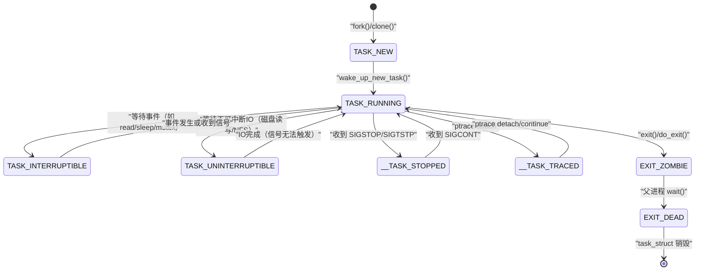

**摘要：**

Linux 内核用一组精确定义的状态来描述进程在任意时刻的处境——这些状态不是简单的"运行"或"暂停"，而是对进程当前行为的精确刻画：`TASK_RUNNING` 并不意味着进程正在使用 CPU，而是"正在运行或准备运行"；`TASK_INTERRUPTIBLE` 和 `TASK_UNINTERRUPTIBLE` 都是睡眠，但对信号的响应截然不同；`D` 状态（不可中断睡眠）是生产中最令运维人员头疼的状态之一——进程"卡死"在内核中，`kill -9` 也无法杀掉，必须找到根因才能解决。本文系统梳理 Linux 进程状态机的全貌：每个状态的精确内核语义、触发转换的条件、在 `/proc` 中的表现，以及生产实战中最重要的 D 状态排查方法。

---

## 第 1 章 状态机概览：内核如何表达"进程在做什么"

### 1.1 进程状态的内核定义

Linux 内核在 `include/linux/sched.h` 中定义了进程的所有可能状态：

```c
/* 进程状态标志位（可组合，但实际上大多数状态是互斥的）*/
#define TASK_RUNNING            0x00000000   /* 运行或就绪 */
#define TASK_INTERRUPTIBLE      0x00000001   /* 可中断睡眠 */
#define TASK_UNINTERRUPTIBLE    0x00000002   /* 不可中断睡眠（D状态）*/
#define __TASK_STOPPED          0x00000004   /* 被信号暂停（T状态）*/
#define __TASK_TRACED           0x00000008   /* 被 ptrace 追踪（t状态）*/
#define EXIT_DEAD               0x00000010   /* 最终退出状态（已被收割）*/
#define EXIT_ZOMBIE             0x00000020   /* 僵尸状态（Z状态）*/
#define TASK_DEAD               0x00000080   /* 即将消亡 */
#define TASK_WAKEKILL           0x00000100   /* 收到 SIGKILL 时唤醒 */
#define TASK_WAKING             0x00000200   /* 正在被唤醒（过渡状态）*/
#define TASK_NOLOAD             0x00000400   /* 不计入系统负载（idle 线程）*/
#define TASK_NEW                0x00000800   /* 刚创建，尚未被调度 */
```

**用户空间可见的状态（`ps`/`top` 显示的）**：

| 内核状态 | `ps` 显示 | 含义 |
|---------|----------|------|
| `TASK_RUNNING` | `R` | 正在运行（占用 CPU）或就绪队列中等待 CPU |
| `TASK_INTERRUPTIBLE` | `S` | 可中断睡眠（等待事件，可被信号唤醒）|
| `TASK_UNINTERRUPTIBLE` | `D` | 不可中断睡眠（等待 IO/内核锁，不可被信号打断）|
| `__TASK_STOPPED` | `T` | 被 SIGSTOP/SIGTSTP 暂停 |
| `__TASK_TRACED` | `t` | 被 ptrace 追踪（gdb 调试中）|
| `EXIT_ZOMBIE` | `Z` | 僵尸状态（已退出，等待父进程 wait）|
| `EXIT_DEAD` | `X` | 即将被销毁（瞬时状态，通常看不到）|

### 1.2 完整状态转换图



---

## 第 2 章 TASK_RUNNING（R）：不止是"正在运行"

### 2.1 R 状态的精确语义

`TASK_RUNNING` 这个名字极具迷惑性——它并不表示进程当前正在 CPU 上执行，而是表示进程**处于可运行状态**，即"正在运行"或"准备好运行，在就绪队列中等待调度器分配 CPU"。

这是一个关键区别：在一个有 4 个 CPU 的系统上，如果有 100 个 `TASK_RUNNING` 状态的进程，只有 4 个进程在各自的 CPU 上真正执行，另外 96 个在调度器的就绪队列中等待——它们都显示为 `R` 状态。

**真正运行中（on CPU）vs 就绪等待（runnable）**：

Linux 不用单独的状态区分这两种情况，而是通过调度器的运行队列（Run Queue）来隐式区分——在运行队列中且当前被调度器选中执行的进程，才是"真正在跑"的进程。

### 2.2 R 状态进程的生产含义

```bash
# 查看系统中 R 状态进程数
ps aux | awk '$8=="R" {print $0}'

# 系统负载（load average）的含义
uptime
# 12:34:56 up 10 days,  1:23,  3 users,  load average: 2.50, 1.80, 1.20
#                                                        1分钟  5分钟  15分钟均值

# Load Average 的本质：过去一段时间内，处于 TASK_RUNNING 或 TASK_UNINTERRUPTIBLE
# 状态的进程数量的指数加权移动平均值
# 对于 4 核系统：load = 4.0 表示 CPU 刚好饱和，> 4.0 表示 CPU 过载
```

> [!info] 核心概念：Load Average 为什么包含 D 状态
> 很多人以为 Load Average 只统计 R 状态进程，但实际上它同时包含 `TASK_UNINTERRUPTIBLE`（D 状态）进程。这意味着如果系统有大量 D 状态进程（如磁盘 IO 卡住），Load Average 会飙高，但 CPU 使用率可能很低——表现为"负载高、CPU 闲"。这是 D 状态区别于其他状态的重要特征。

---

## 第 3 章 TASK_INTERRUPTIBLE（S）：舒适的等待

### 3.1 S 状态的语义与触发

`TASK_INTERRUPTIBLE`（可中断睡眠）是 Linux 系统中最常见的进程状态——大多数进程大部分时间都处于 S 状态，因为大多数进程都在等待某个事件（IO 完成、定时器到期、锁释放、用户输入等）。

**进入 S 状态的典型场景**：

```c
/* 进程等待某个条件满足时，调用 schedule() 让出 CPU */
/* 内核代码的典型模式（以等待 IO 完成为例）*/

/* 1. 创建等待队列条目 */
DEFINE_WAIT(wait);

/* 2. 将自身加入等待队列，并将状态设为 TASK_INTERRUPTIBLE */
prepare_to_wait(&wq_head, &wait, TASK_INTERRUPTIBLE);

/* 3. 检查条件是否已满足（避免竞态：条件可能在设置状态后立刻满足）*/
if (!condition_is_met()) {
    /* 4. 条件未满足：让出 CPU（进入睡眠）*/
    schedule();
    /* schedule() 返回后，说明被唤醒了（事件发生 或 收到信号）*/
}

/* 5. 从等待队列中移除自身 */
finish_wait(&wq_head, &wait);

/* 6. 检查是否是被信号唤醒 */
if (signal_pending(current)) {
    return -ERESTARTSYS;   /* 被信号中断，系统调用返回 -EINTR */
}
```

**唤醒 S 状态进程的两种方式**：
1. **事件发生**：IO 完成、锁释放、定时器到期……内核调用 `wake_up()` 将进程从等待队列中移出，状态改为 `TASK_RUNNING`，加入就绪队列
2. **收到信号**：内核将进程唤醒，进程检查 `signal_pending(current)`，系统调用返回 `-EINTR`（errno = `EINTR`）

**S 状态的关键特性：可被信号打断**

这就是"可中断"的含义。当你按下 Ctrl+C（发送 `SIGINT`）终止一个正在等待的程序时，程序能立刻响应，正是因为它处于 `TASK_INTERRUPTIBLE` 状态——信号将其唤醒，信号处理函数执行，进程终止。

```bash
# 观察 S 状态进程
ps aux | awk '$8=="S" {print $2,$11}' | head -10
# 输出：大量 S 状态的进程（bash、sshd、系统服务等）

# 系统中 S 状态进程占绝大多数——这是正常的
# 进程"休眠等待"是高效利用 CPU 的关键：等待时不占 CPU，IO 完成时立即被唤醒
```

---

## 第 4 章 TASK_UNINTERRUPTIBLE（D）：最令人头疼的状态

### 4.1 D 状态是什么，为什么存在

`TASK_UNINTERRUPTIBLE`（不可中断睡眠，D 状态）是 Linux 系统中最令运维人员头疼的状态——处于 D 状态的进程：
- **不能被任何信号打断**，包括 `SIGKILL`（`kill -9`）
- **不能被用户强制杀死**，必须等待其自然退出
- **会计入系统 Load Average**，可能导致系统看起来"卡死"

**为什么要有不能被打断的睡眠状态？为什么不让 SIGKILL 也能打断它？**

这是一个深思熟虑的设计决策，核心原因是**内核的原子性操作需求**：

某些内核操作（尤其是涉及硬件 IO 的操作）在中途被打断会导致数据结构不一致，甚至硬件状态损坏。例如：
- 磁盘驱动正在执行 DMA 传输（将磁盘数据直接写入内存），此时内核持有磁盘控制器的锁
- 如果允许信号打断，进程可能带着这把锁退出，导致磁盘控制器被永久锁住，后续所有磁盘操作都会死锁

为了避免这类"带锁退出"导致的状态损坏，内核在关键路径上使用 `TASK_UNINTERRUPTIBLE`，确保操作要么完成，要么一直等待，绝不中途退出。

### 4.2 D 状态的常见触发场景

**场景一：磁盘 IO 等待（最常见）**

本地磁盘的读写通常很快（毫秒级），D 状态转瞬即逝，几乎感觉不到。但以下情况会导致 D 状态持续很长时间：
- 磁盘故障或性能极差（如 HDD 磁头卡死）
- 磁盘 IO 队列严重积压（大量并发 IO 请求）

**场景二：NFS 挂载点无响应**

NFS（Network File System）是 D 状态最常见的"罪魁祸首"之一。当 NFS 服务器宕机、网络中断，而客户端进程正在访问 NFS 挂载的文件时，进程会陷入 D 状态，等待 NFS 响应——这个等待可以持续几分钟甚至无限期。

```bash
# 典型症状：访问 NFS 路径的命令卡住
ls /mnt/nfs-share    # 无响应，进程进入 D 状态

# 验证：
ps aux | awk '$8=="D"'
# 输出：可以看到 ls 进程处于 D 状态

# 解决：
# 1. 恢复 NFS 服务器/网络连接
# 2. 使用 soft mount 选项（NFS 超时后返回错误，而不是无限等待）
# 挂载选项：mount -o soft,timeo=30 ...
```

**场景三：内核锁争用**

进程在内核中等待某个互斥锁（mutex）或读写信号量，如果持锁进程被饿死或发生死锁，等待进程就会持续处于 D 状态。

**场景四：内存压力下的页面换出/换入**

当系统内存严重不足，进程请求内存（缺页异常）时，内核需要将其他页面换出到 swap 空间才能满足请求。在 swap IO 期间，进程处于 D 状态。

### 4.3 D 状态的生产排查方法

**方法一：找出所有 D 状态进程及其当前在等待什么**

```bash
# 找出所有 D 状态进程
ps -eo pid,ppid,state,wchan,comm | awk '$3=="D"'
# wchan 字段：进程当前"睡眠在哪个内核函数中"（等待什么）

# 输出示例：
# PID   PPID  STAT  WCHAN          COMMAND
# 1234  1000  D     nfs_wait_bit   cat
# 5678  5000  D     jbd2_journal   python3
# 9012  8000  D     blk_execute    mysqld

# wchan 的含义：
# nfs_wait_bit → 等待 NFS 响应（NFS 服务器无响应）
# jbd2_journal → 等待 ext4 日志提交（磁盘 IO 压力）
# blk_execute  → 等待块设备 IO 完成（磁盘 IO）
```

**方法二：使用 /proc/[pid]/wchan 查看等待位置**

```bash
# 查看某个 D 状态进程在等待什么
PID=1234
cat /proc/$PID/wchan
# 输出：nfs_wait_bit_io

# 获取更详细的内核调用栈
cat /proc/$PID/stack
# 输出（内核调用栈，从栈底到栈顶）：
# [<ffffffff...>] nfs_wait_bit_io+0x...
# [<ffffffff...>] __wait_on_bit+0x...
# [<ffffffff...>] nfs_commit_inode+0x...
# [<ffffffff...>] nfs_file_flush+0x...
# [<ffffffff...>] filp_close+0x...
# [<ffffffff...>] do_exit+0x...
# 这个栈告诉我们：进程在 close() 文件时等待 NFS commit，说明 NFS 服务器无响应
```

**方法三：使用 perf 或 bpftrace 追踪 D 状态的触发**

```bash
# 用 bpftrace 统计进入 D 状态的频率和原因
bpftrace -e '
tracepoint:sched:sched_switch {
    if (args->prev_state == 2) {  // 2 = TASK_UNINTERRUPTIBLE
        @[comm, args->prev_comm] = count();
    }
}
interval:s:10 { print(@); clear(@); exit(); }
'
# 统计 10 秒内哪些进程/函数频繁进入 D 状态
```

**方法四：系统级 D 状态分析**

```bash
# 查看系统总体 D 状态进程数
vmstat 1 5
# procs -----------memory---------- ---swap-- -----io---- -system-- ------cpu-----
# r  b   swpd   free   buff  cache   si   so    bi    bo   in   cs us sy id wa st
# 2  5      0 128000  1024  8192    0    0  5120   512  300  500  5  3 20 72  0
#    ↑ b 列：处于 D 状态（Blocked）的进程数量
#                                              ↑ wa：CPU 等待 IO 的时间百分比

# b > 0 且 wa 较高 → 存在 D 状态进程，且是 IO 等待导致
# b > 0 但 wa = 0  → D 状态可能是内核锁争用（不是 IO 等待）
```

### 4.4 TASK_KILLABLE：D 状态的改良版

`TASK_UNINTERRUPTIBLE` 不响应任何信号，这在 NFS 挂载失败的场景下非常痛苦——NFS 服务器永远不响应，进程永远处于 D 状态，只能重启系统。

Linux 2.6.25 引入了 `TASK_KILLABLE`——介于 `S` 和 `D` 之间的折中状态：

```c
#define TASK_KILLABLE  (TASK_WAKEKILL | TASK_UNINTERRUPTIBLE)
/* 语义：不可被普通信号中断，但可以被 SIGKILL 杀死 */
/* SIGKILL 是唯一无法被忽略/屏蔽的信号，专门用于强制终止 */
```

现代内核已将许多原来使用 `TASK_UNINTERRUPTIBLE` 的路径改为 `TASK_KILLABLE`，使得 NFS 挂载失败时，`kill -9` 能够终止卡住的进程，而不必重启整个系统。

```bash
# 验证：某些 D 状态进程可以被 kill -9 杀死（TASK_KILLABLE）
# 某些则不行（真正的 TASK_UNINTERRUPTIBLE，涉及硬件 IO）
kill -9 <D状态进程PID>
# 如果几秒后进程消失 → TASK_KILLABLE
# 如果进程仍然存在 → 真正的 TASK_UNINTERRUPTIBLE（只能等 IO 完成）
```

---

## 第 5 章 __TASK_STOPPED（T）与 __TASK_TRACED（t）：暂停与调试

### 5.1 T 状态：被信号暂停

当进程收到 `SIGSTOP`（不可忽略的暂停信号）或 `SIGTSTP`（终端暂停，即 Ctrl+Z）时，进程进入 `__TASK_STOPPED` 状态（`ps` 显示为 `T`）：

```bash
# Ctrl+Z 暂停前台进程
./long_running_program
^Z   # 输入 Ctrl+Z
# [1]+  Stopped                 ./long_running_program

# 查看暂停状态
ps aux | grep long_running
# 1234  ...  T  ...  ./long_running_program   ← T 状态

# 恢复执行
fg    # 前台恢复（发送 SIGCONT，进程恢复到 TASK_RUNNING）
bg    # 后台恢复（同样发送 SIGCONT，但进程在后台运行）
kill -SIGCONT 1234  # 直接发 SIGCONT

# Shell 的作业控制（jobs）正是基于 T 状态实现的
jobs -l
# [1]+  1234 Stopped    ./long_running_program
```

**T 状态的重要性**：T 状态是 Unix Shell 作业控制（Job Control）的基础——`Ctrl+Z` 暂停、`fg`/`bg` 继续、`jobs` 查看，这一套交互机制完全依赖于 `SIGSTOP`/`SIGCONT` 和 T 状态。

### 5.2 t 状态：被 ptrace 追踪

当进程被 `ptrace(PTRACE_ATTACH, ...)` 附加调试时（如 `gdb attach`、`strace`），进程在每个断点或系统调用入口/出口处暂停，进入 `__TASK_TRACED` 状态（`ps` 显示为 `t`，小写）：

```bash
# 用 strace 追踪一个进程
strace -p 1234
# strace 内部调用 ptrace(PTRACE_ATTACH, 1234, ...)，让目标进程每次系统调用时暂停

# 查看被追踪进程的状态
ps aux | grep 1234
# 1234  ...  t  ...  target_process   ← t 状态（被 ptrace 追踪）

# t 状态下进程在等待调试器（gdb/strace）发送 PTRACE_CONT 命令才能继续
```

**t 状态对 `task_struct.parent` 的影响**：

被 ptrace 追踪的进程，其 `parent` 字段被改为调试器进程（而 `real_parent` 仍是真实父进程）。这样调试器能接收来自被追踪进程的状态变化通知（`SIGCHLD`），实现断点控制。

---

## 第 6 章 EXIT_ZOMBIE（Z）与 EXIT_DEAD（X）

### 6.1 Z 状态：详见 [[05 进程的终结与善后——exit、wait 与僵尸进程]]

`EXIT_ZOMBIE`（Z 状态）的详细机制已在上一篇文章中深入分析。此处仅做要点概括：

- 进程已退出（`do_exit()` 完成），但 `task_struct` 未销毁
- 不消耗内存/CPU/文件描述符，只占用 PID 和一个 `task_struct`
- 等待父进程调用 `wait()` 来读取退出状态并最终销毁 `task_struct`
- `kill -9` 对 Z 状态进程无效——进程已死，无法接收信号

### 6.2 X 状态：瞬间状态

`EXIT_DEAD`（X 状态）是进程即将被完全销毁的瞬间状态——父进程调用 `wait()` 读取退出状态后，`task_struct` 被标记为 `EXIT_DEAD`，随即销毁。这个过程极其短暂，在 `ps` 输出中几乎看不到（偶尔能捕捉到）。

---

## 第 7 章 /proc/[pid]/status：状态机的实战窗口

### 7.1 status 文件的完整解读

`/proc/[pid]/status` 是 `task_struct` 关键字段的文本视图，与进程状态直接相关：

```bash
# 查看任意进程的 status
cat /proc/$(pgrep sshd | head -1)/status

# 输出解读：
Name:   sshd                           ← 进程名
Umask:  0022                           ← 文件创建掩码
State:  S (sleeping)                   ← 当前状态（关键字段！）
Tgid:   1234                           ← 线程组 ID（即 getpid() 的返回值）
Ngid:   0                              ← NUMA group ID
Pid:    1234                           ← 内核层面的任务 ID（同 Tgid 说明是主线程）
PPid:   1                              ← 父进程 PID
TracerPid:  0                          ← 若非 0，说明被该 PID 的进程 ptrace
Uid:    0  0  0  0                     ← Real/Effective/Saved/Filesystem UID
Gid:    0  0  0  0                     ← 同上，for GID
FDSize: 64                             ← 文件描述符表当前分配大小（槽位数）
Groups: 0                              ← 附加组
VmPeak: 15432 kB                       ← 虚拟内存峰值
VmSize: 14256 kB                       ← 当前虚拟内存大小
VmLck:  0 kB                           ← 被 mlock 锁定（不可换出）的内存
VmPin:  0 kB                           ← 被 Pin 住的内存（不可移动）
VmHWM:  4096 kB                        ← 物理内存峰值（RSS Peak）
VmRSS:  3072 kB                        ← 当前物理内存使用量（Resident Set Size）
RssAnon: 512 kB                        ← 匿名 RSS（堆/栈）
RssFile: 2560 kB                       ← 文件映射 RSS（代码/共享库）
RssShmem: 0 kB                         ← 共享内存 RSS
VmData: 512 kB                         ← 数据段大小
VmStk:  132 kB                         ← 栈大小
VmExe:  512 kB                         ← 代码段大小
VmLib:  2048 kB                        ← 共享库大小
VmPTE:  32 kB                          ← 页表本身占用的内存
Threads: 1                             ← 线程数（若 > 1，说明是多线程进程）
SigPnd: 0000000000000000               ← 私有待处理信号（位图）
ShdPnd: 0000000000000000               ← 共享待处理信号
SigBlk: 0000000000000000               ← 被屏蔽的信号
SigIgn: 0000000000001000               ← 被忽略的信号（0x1000 = SIGPIPE = bit 12）
SigCgt: 0000000000014005               ← 注册了处理函数的信号
CapInh: 0000000000000000               ← 可继承的 Capability
CapPrm: 000001ffffffffff               ← 允许持有的 Capability
CapEff: 000001ffffffffff               ← 当前生效的 Capability
CapBnd: 000001ffffffffff               ← Capability 边界集
voluntary_ctxt_switches: 1234          ← 主动上下文切换次数（进程主动 sleep/wait）
nonvoluntary_ctxt_switches: 56         ← 被动上下文切换次数（被调度器抢占）
```

### 7.2 用 State 字段快速诊断进程问题

```bash
# 一键检查所有异常状态进程
echo "=== D 状态进程（可能 IO 阻塞）==="
ps -eo pid,ppid,state,wchan,comm | awk '$3=="D" {print $0}'

echo "=== Z 状态进程（僵尸，父进程未 wait）==="
ps -eo pid,ppid,state,comm | awk '$3=="Z" {print $0}'

echo "=== T 状态进程（被暂停，可能是调试或信号）==="
ps -eo pid,ppid,state,comm | awk '$3=="T" {print $0}'

# 统计各状态进程数量
ps -eo state | sort | uniq -c | sort -rn
# 输出示例：
# 156 S   ← 156 个睡眠进程（正常）
#   8 R   ← 8 个运行/就绪进程
#   3 D   ← 3 个不可中断睡眠（需关注！）
#   2 Z   ← 2 个僵尸进程（需排查）
#   1 T   ← 1 个暂停进程
```

---

## 第 8 章 上下文切换：状态转换的底层代价

### 8.1 什么是上下文切换

当调度器决定从进程 A 切换到进程 B 时，需要保存进程 A 的"上下文"（CPU 寄存器状态）并恢复进程 B 的上下文。这个过程称为**上下文切换（Context Switch）**。

上下文切换有两类：

**自愿上下文切换（Voluntary Context Switch）**：进程主动让出 CPU——调用 `sleep()`、`wait()`、阻塞 IO 等，进程状态从 `TASK_RUNNING` 变为 `S` 或 `D`，内核调用 `schedule()` 选择下一个进程。

**非自愿上下文切换（Involuntary Context Switch）**：进程被调度器抢占——时间片用完（CFS 定时器中断触发），调度器强制切走当前进程。

```bash
# 查看系统全局上下文切换统计
vmstat 1 5
# cs 列：每秒上下文切换次数

# 查看单个进程的上下文切换次数（累计）
cat /proc/<pid>/status | grep ctxt_switches
# voluntary_ctxt_switches:    123456   ← 自愿切换（多说明进程经常等待）
# nonvoluntary_ctxt_switches: 1234     ← 非自愿切换（多说明进程 CPU 密集且频繁被抢占）

# 实时监控上下文切换
pidstat -w -p <pid> 1
# cswch/s  nvcswch/s
# 10.0     0.0        ← 每秒 10 次自愿切换，0 次非自愿切换（IO 密集型进程）
```

### 8.2 上下文切换的代价

一次上下文切换的开销约为 **1-10 微秒**，主要来源：
1. 保存/恢复 CPU 寄存器（通用寄存器、FPU 状态等）：~1 微秒
2. 切换页表（`cr3` 寄存器更新，触发 TLB 刷新）：~1-5 微秒（取决于 TLB 大小）
3. [[CPU Cache]] 失效：新进程的数据不在 cache 中，需要重新从内存加载

**每秒上下文切换次数的参考值**：
- < 1000 次/秒：很低，进程很少竞争 CPU
- 1000-10000 次/秒：正常范围
- > 100000 次/秒：高频切换，可能是锁竞争激烈或进程数量过多

---

## 小结

Linux 进程状态机是理解进程行为的核心框架：

**六大状态的精确含义**：
- **R（TASK_RUNNING）**：运行或就绪，不代表正在占用 CPU，计入 Load Average
- **S（TASK_INTERRUPTIBLE）**：可中断睡眠，等待事件，可被信号唤醒——最常见的状态
- **D（TASK_UNINTERRUPTIBLE）**：不可中断睡眠，等待关键 IO 或内核锁，`SIGKILL` 无效，计入 Load Average
- **T（TASK_STOPPED）**：被 `SIGSTOP`/`SIGTSTP` 暂停，`SIGCONT` 恢复
- **Z（EXIT_ZOMBIE）**：僵尸状态，已退出但 `task_struct` 保留等待父进程 `wait()`
- **X（EXIT_DEAD）**：瞬态，即将被销毁

**D 状态排查路径**：
1. `ps -eo pid,state,wchan,comm | awk '$2=="D"'`：找出所有 D 状态进程及等待函数
2. `cat /proc/<pid>/stack`：查看完整内核调用栈，确定阻塞原因
3. `vmstat 1`：观察 `b` 列和 `wa` 列，确认是 IO 等待还是锁争用

**Load Average 的正确理解**：= R 状态进程数 + D 状态进程数的指数加权平均。"负载高、CPU 闲"的现象通常由大量 D 状态（IO 等待）进程引起。

下一篇 [[07 线程的真相——Linux 为什么没有真正的线程]] 将深入 Linux 的线程模型：为什么说 Linux 没有真正的线程？`clone()` 的 `CLONE_VM | CLONE_FS | CLONE_FILES | CLONE_SIGHAND | CLONE_THREAD` 组合如何实现 POSIX 线程语义？NPTL 线程库做了什么？

---

> [!note] 思考题
> 1. 信号（Signal）是异步通知机制——SIGTERM 请求进程正常退出，SIGKILL 强制杀死。SIGKILL 无法被捕获或忽略。但如果进程处于不可中断睡眠状态（D 状态，如等待 NFS 响应），SIGKILL 也无法立即杀死——进程会在睡眠结束后才处理信号。在什么场景下进程会长时间处于 D 状态？如何处理 kill -9 也杀不死的进程？
> 2. Unix Domain Socket（UDS）用于同一主机上的进程间通信——比 TCP loopback 更快（不经过网络协议栈）。UDS 的吞吐量通常是 TCP loopback 的 2-3 倍。MySQL、PostgreSQL 在本地连接时默认使用 UDS。UDS 支持 `sendmsg` 传递文件描述符（fd passing）——这个功能在什么场景下有用（如 Nginx 的优雅重启）？
> 3. `eventfd` 是一个轻量级的进程/线程间通知机制——比 pipe 更简单（只有一个 fd 和一个 64 位计数器）。它被广泛用于事件循环框架（如 libevent、libev）中唤醒主循环。`eventfd` 与 `pipe` 在唤醒延迟上有什么差异？在 io_uring 中 `eventfd` 扮演什么角色？
