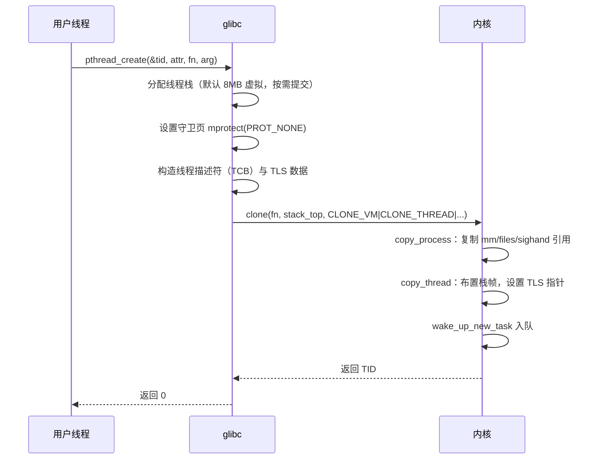
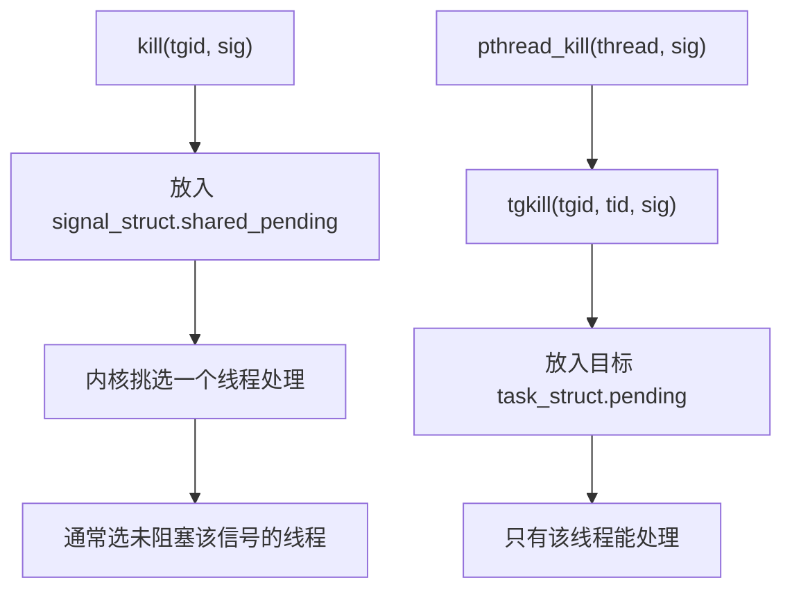
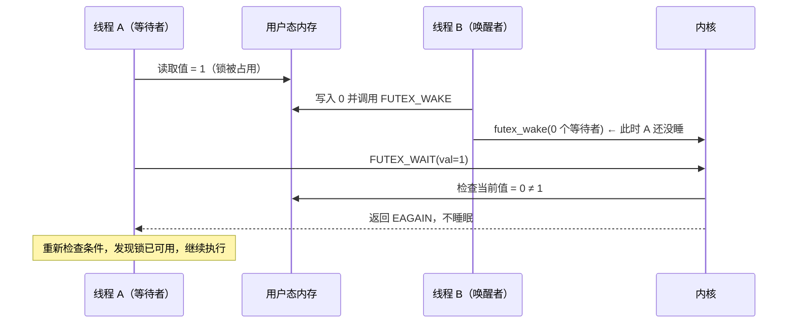

# 07 线程的真相——Linux 为什么没有真正的线程

**摘要：**

"Linux 没有真正的线程"是一句流传很广、但很容易被误读的话。它的准确含义是：内核里不存在一个独立的"线程"对象类型，只有 `task_struct`；而它**不**意味着 Linux 不能提供符合 POSIX 标准的线程语义——恰恰相反，从 2003 年 NPTL 进入内核开始，Linux 的线程实现就已经完备。本文先澄清这个说法的边界，再回到 1990 年代的线程标准之争：看 LinuxThreads 的实现方式、它的四个致命缺陷（`getpid` 语义错误、信号处理错乱、`SIGCHLD` 干扰、进程级资源不一致），以及 NPTL 如何通过与内核配合修补这些问题。随后进入核心机制：`clone()` 的 flags 参数如何以"共享多少资源"的方式精确地表达"这是线程"，每一个 `CLONE_*` 标志背后对应的内核结构是什么，`CLONE_THREAD` 除共享之外还带来了哪些语义，线程组与 TGID 的引入如何让信号与统计口径对上 POSIX 的要求。文章还拆解 `pthread` 库这一层的职责——栈的管理、TLS 指针的建立、创建与销毁路径，以及 `futex` 这个让"无竞争时零系统调用"成为可能的设计。最后讨论 1:1 模型的取舍与调度器激活（Scheduler Activations）这段失败的历史，澄清"线程更轻"这一说法的相对性，并回顾协程与用户态线程在近年回归的原因。全文回答两个问题：Linux 的线程到底是什么，以及这个"共享资源的进程"设计带来了哪些必须接受的后果。

---

## 第 1 章 一个说法的澄清

### 1.1 它说的是内核，不是用户态

"Linux 没有真正的线程"这句话如果只允许保留一个限定词，那个词应该是"内核"。

从内核的角度看，创建线程与创建进程走的是同一个系统调用（`clone`）、创建出来的是同一种对象（`task_struct`）、调度方式完全相同。内核里没有 `struct thread`，也没有一个"线程表"。线程与进程的差别，全部体现在 `clone` 的 flags 上——共享了几项资源就是线程，一项都不共享就是进程。

从用户态的角度看，`pthread_create()` 是符合 POSIX.1-2001 标准的线程接口，`pthread_mutex_t`、`pthread_cond_t`、线程局部存储、线程取消、线程特定数据这些语义一应俱全。**一个可移植的 C 程序在 Linux 上使用线程，它看到的是标准的 POSIX 线程，而不是"某种类似线程的东西"。**

### 1.2 这句话的准确版本

把上面两点合起来，准确的表述应该是：**Linux 内核不提供线程作为一种独立实体，而是通过让多个 `task_struct` 共享部分资源来实现线程语义**。

这个表述与"没有真正的线程"的差别不只是措辞。它指明了三条具体的事实：

- 线程的"轻量"来自共享，而不是来自某种特殊机制——共享的东西越多，创建与切换的开销越小；
- 内核需要额外引入"线程组"这一层抽象，才能让信号、统计、进程级资源符合 POSIX 的期望（第 4 章）；
- 用户态必须配合：`getpid()` 返回 `tgid` 而不是内核的 `pid` 这一行为，是 libc 与内核约定的一部分，不是内核的直接输出。

### 1.3 为什么这个说法会流传下来

这句话之所以盛行，与 1996 到 2003 年间的一段历史直接相关。在那七年里，Linux 上的线程库（LinuxThreads）**确实无法提供符合 POSIX 的线程语义**——它用"管理线程 + 信号中转"的方式模拟线程，导致 `getpid()` 在同一个进程的不同线程里返回不同的值、`kill` 会杀掉整个进程或只杀一个线程取决于运气、`SIGCHLD` 会被线程的创建销毁干扰。

那些年写下的文章与经验，在 NPTL 落地之后并没有同步更新，于是"Linux 没有真正的线程"成了一个长期流传的说法。要理解它为什么曾经成立、又为什么今天不再成立，必须回到那段历史。

---

## 第 2 章 1990 年代的线程标准之争

### 2.1 POSIX 线程标准的提出

1995 年，IEEE 发布了 POSIX.1c（后来并入 POSIX.1-2001），第一次为 Unix 系统定义了统一的线程接口。这份标准对"线程"给出了一系列语义要求，其中与内核设计关系最密切的有四条：

| 要求 | 含义 |
| :--- | :--- |
| 线程共享进程地址空间 | 一个线程写的全局变量，其它线程立刻可见 |
| `getpid()` 在同一个进程的所有线程中返回相同值 | 线程不是独立进程 |
| 信号可以定向发给单个线程 | `pthread_kill()` 的语义 |
| 线程的创建与销毁不干扰父进程的 `SIGCHLD` 处理 | 线程不是子进程 |

这四条要求看起来都很合理，但它们对"用进程模拟线程"的实现方式构成了直接挑战。

### 2.2 LinuxThreads 的实现方式

1996 年 Xavier Leroy 实现了 LinuxThreads，它建立在当时内核已有的能力之上。核心思路是：**每个线程都是一个由 `clone` 创建、共享地址空间的进程，另外引入一个"管理线程"负责协调**。

| 组件 | 职责 |
| :--- | :--- |
| 管理线程（Manager Thread） | 处理线程创建、销毁、以及信号分发 |
| 线程进程 | 每个线程对应一个内核可见的进程，共享 `mm` |
| 信号中转 | 所有信号先发给管理线程，再由它转发给目标线程 |

这套实现的优点是不需要修改内核，在当时的 Linux 上立刻可用。它的缺点来自一个根本性的错位：**POSIX 要求的是"一个进程内的多个线程"，而 LinuxThreads 提供的是"多个共享地址空间的进程"，两者在语义上并不等价**。

### 2.3 四个无法修补的缺陷

| 缺陷 | 现象 | 根因 |
| :--- | :--- | :--- |
| `getpid()` 返回值不一致 | 同一进程的不同线程拿到不同的 PID | 每个线程是独立的 `task_struct`，共享的是 `mm` 而不是 PID |
| `kill()` 语义不明 | 有时杀掉整个进程，有时只杀一个线程 | 线程之间没有"线程组"这一层 |
| `SIGCHLD` 被干扰 | 线程退出时父进程收到 `SIGCHLD` | 线程在进程树上是独立的子进程 |
| 进程级资源不共享 | 一个线程调用 `exit()` 只退出自己，信号处置在各线程间不同步 | 缺少线程组级别的共享结构 |

这四项里，前两项直接违反了 POSIX 的明文要求，后两项则是"看起来能用，但在特定场景下行为诡异"。它们共同的根因都是同一个：**内核里缺少"线程组"这一层抽象**，使得"哪些东西应该被一组执行流共享"这件事无法表达。

### 2.4 NPTL 的解法

2003 年，同样是 Xavier Leroy 主导的 NPTL（Native POSIX Thread Library）随 Linux 2.6 与 glibc 2.3.2 一起发布。它解决问题的方式与 LinuxThreads 相反：**不回避内核改动，而是与内核一起把线程组这一层补上**。

内核侧的关键改动包括：

- 引入 `tgid`（线程组 ID）字段，让一组共享地址空间的执行流拥有共同的"进程号"；
- 引入 `CLONE_THREAD` 标志，用于声明"这个新执行流属于调用者的线程组"；
- 引入 `CLONE_SETTLS` 与线程本地存储支持，让线程指针可以被内核正确设置；
- 引入 `futex` 系统调用（2.5.7），让用户态锁在无竞争时不必进入内核；
- 调整信号投递逻辑，使信号可以先投递给线程组、再由内核挑选合适的线程处理。

这些改动合起来的效果是：**线程组内的执行流在信号、统计、`/proc` 呈现、以及进程级资源上都表现为一个整体**，同时保留"每个执行流有独立的 `task_struct` 与内核栈"这一实现上的简洁性。

一个有意思的对比：LinuxThreads 试图用"进程"去模拟"线程"，NPTL 承认了内核里只有一种实体，转而**把"进程"重新定义为"线程组"**。这个转向是从"模仿语义"到"提供语义"的转变，也是 Linux 线程模型最终成形的地方。

### 2.5 迁移的代价

NPTL 在 2003 年随 glibc 2.3.2 发布，但它没有立刻取代 LinuxThreads。两者的并存持续了数年，切换的开关是环境变量与 `--enable-kernel` 编译选项：

```bash
# 早期的选择方式：通过环境变量指定使用哪个线程实现
LD_ASSUME_KERNEL=2.4.19 ./app    # 强制使用 LinuxThreads
LD_ASSUME_KERNEL=2.6.0  ./app    # 使用 NPTL
```

`LD_ASSUME_KERNEL` 这个机制的存在本身说明了问题的严重性：**两个线程实现的语义差异如此之大，以至于需要让程序在运行时选择**。它通过伪装内核版本号来影响 glibc 的行为选择，一个库如果依赖 LinuxThreads 的特定行为（比如依赖线程各有独立 PID），就需要这个开关才能继续工作。

迁移过程中暴露出的问题大致有两类。第一类是**依赖旧行为的代码**：有的程序用 `getpid()` 的返回值作为线程标识（在 LinuxThreads 下这是可行的，因为每个线程的 PID 不同），迁移到 NPTL 后所有线程返回同一个值，逻辑立刻失效。第二类是**信号相关代码**：LinuxThreads 把所有信号交给管理线程再转发，有些程序依赖这个"信号总是被同一个线程接收"的特性，NPTL 按 POSIX 语义把信号投递给任意合适的线程之后，这些程序开始出现随机的行为异常。

这段历史留下的教训是：**一个错误但长期存在的实现，会在生态里沉淀出对错误的依赖**。内核与 libc 的维护者可以在一夜之间修正语义，但生态中那些建立在旧语义之上的代码需要数年才能清理干净——这也是为什么系统接口的语义修正通常需要极长的过渡期与兼容层。

---

## 第 3 章 `clone` 如何造出线程

### 3.1 一行调用与一组标志

`pthread_create()` 在内核里的最终形态是一次 `clone`，其 flags 参数如下：

```c
/* glibc 创建线程时传给 clone 的 flags（不同版本略有差异） */
CLONE_VM        /* 共享地址空间 */
| CLONE_FS      /* 共享文件系统信息（cwd/root） */
| CLONE_FILES   /* 共享文件描述符表 */
| CLONE_SIGHAND /* 共享信号处置表 */
| CLONE_THREAD  /* 加入同一个线程组 */
| CLONE_SYSVSEM /* 共享 System V 信号量撤销状态 */
| CLONE_SETTLS  /* 设置新的 TLS 指针 */
| CLONE_PARENT_SETTID   /* 把 TID 写到父进程指定地址 */
| CLONE_CHILD_CLEARTID /* 线程退出时清空该地址并通过 futex 唤醒 */
```

对照 `fork()` 的 flags（只有一个 `SIGCHLD`），可以看出线程与进程的差别**全部体现在这串标志上**，而不是代码路径上。

### 3.2 每一个标志背后的结构

| 标志 | 共享的内核对象 | 不共享时的行为 |
| :--- | :--- | :--- |
| `CLONE_VM` | `mm_struct` | 复制页表，建立 COW |
| `CLONE_FS` | `fs_struct` | 复制 cwd 与 root |
| `CLONE_FILES` | `files_struct` | 复制 fd 表 |
| `CLONE_SIGHAND` | `sighand_struct` | 复制信号处置表 |
| `CLONE_THREAD` | `signal_struct` | 新建一份进程级信号状态 |
| `CLONE_SYSVSEM` | 信号量撤销列表 | 复制一份 |

这张表回答了"线程共享什么"这个问题，但它更值得从反方向读一遍：**不共享的是栈、寄存器现场、内核栈、TLS、信号掩码、CPU 亲和性、调度参数（nice 值）**。这些正是"一个执行流之所以是独立执行流"的部分。

一个常被忽略的细节是 `CLONE_THREAD` 的隐含效果：它并不直接共享某个结构，而是**声明这个新执行流属于调用者所在的线程组**，这会带来三项额外语义——第 4 章会展开。

### 3.3 组合约束

`clone` 的 flags 不是任意组合都合法，内核在 `copy_process()` 里检查了几条硬性约束：

| 约束 | 原因 |
| :--- | :--- |
| `CLONE_THREAD` 必须与 `CLONE_SIGHAND` 同时出现 | 线程组内的信号处置必须一致，否则信号语义无法定义 |
| `CLONE_SIGHAND` 必须与 `CLONE_VM` 同时出现 | 共享信号处置意味着共享处理函数指针，而指针只在同一地址空间里有意义 |
| `CLONE_NEWPID` 不能与 `CLONE_THREAD` 组合 | 新 PID 命名空间只能由新进程开创，线程不能 |
| `CLONE_THREAD` 需要 `CLONE_SYSVSEM` 或其它条件 | 与 System V 信号量的撤销语义有关 |

其中最值得琢磨的是第二条。**信号处置函数是地址空间里的代码地址**——两个不共享地址空间的进程即使共享了处置表的数值，那个数值在各自空间里指向的也可能是完全不同的函数。因此"共享 `sighand`"这个要求天然蕴含了"必须共享 `mm`"。这条约束不是人为的规定，而是语义上的必然。

### 3.4 线程的创建开销



与 `fork` 相比，这条路径上省掉的是"复制页表"这一步——线程直接共享父进程的 `mm_struct`，`copy_mm()` 只是增加引用计数。这是线程创建比进程创建快的根本原因，但快出来的部分仅此一项：`task_struct` 的分配、内核栈的分配、线程栈的分配、TLS 的建立，一样都没有省。

这个事实纠正了一个常见的印象：**线程不是"免费的调度单位"**。第 8 章会给出具体的开销数字。

### 3.5 两个不共享资源的标志

`CLONE_PARENT_SETTID` 与 `CLONE_CHILD_CLEARTID` 不共享任何资源，它们解决的是两个具体的同步问题，值得单独说明。

**`CLONE_PARENT_SETTID` 解决的是"新线程的 ID 何时可知"这个问题。** `clone` 的返回值给出了新线程的 TID，但父线程在 `clone` 返回之前需要把 TID 写进它自己的数据结构（比如一个线程数组）。如果依赖返回值，那么在 `clone` 返回、父线程写入之前，新线程可能已经跑起来并访问了尚未更新的数据结构——这是一个竞态。这个标志的作用是：内核在创建完成、**新线程开始运行之前**，就把 TID 写到父进程指定的地址上。父进程在 `clone` 返回时读到的值一定是有效的。

**`CLONE_CHILD_CLEARTID` 解决的是"线程何时可以安全回收"这个问题。** 它指定一个地址，内核会在该线程退出时把这个地址清零，并对它执行一次 futex 唤醒。`pthread_join()` 的实现正是等待在这个地址上：被唤醒后读到 0，就知道目标线程已经彻底结束，此时回收它的线程描述符与栈才是安全的。

这两个标志合起来构成了一个完整的"创建-等待"协议，而这个协议的关键性质是：**所有的同步点都在用户态的内存地址上，内核只负责在正确的时刻写入与唤醒**。NPTL 没有引入任何"线程句柄"之类的内核对象，线程的整个生命周期管理都建立在用户态数据 + futex 唤醒之上。这就是为什么 `pthread_t` 的类型在不同平台上是不同的（glibc 上是 `unsigned long`），因为它本质上只是一个用户态地址或索引，而不是内核对象引用。

### 3.6 有些属性天生不共享

前面列出的共享清单容易给人一个印象：线程之间"共享一切，除了栈"。这个印象需要修正——有几项属性**结构上就不可能共享**，因为它们直接存放在 `task_struct` 里，而不是在那些被共享的卫星结构体中：

| 属性 | 存放位置 | 是否可在线程间不同 |
| :--- | :--- | :--- |
| nice 值 / 调度优先级 | `task_struct.prio`、`static_prio` | **可以不同** |
| 调度策略 | `task_struct.policy` | 可以不同 |
| CPU 亲和性 | `task_struct.cpus_mask` | 可以不同 |
| 信号掩码 | `task_struct.blocked` | 可以不同 |
| 寄存器现场与内核栈 | `task_struct.thread`、`stack` | 必然不同 |
| 当前工作目录 | `fs_struct`（共享） | 共享时相同 |

前四项的存在意味着**同一个进程内的不同线程可以有不同的调度待遇**。这不是理论可能性，实践中有明确的用法：把一个延迟敏感的线程设为 `SCHED_FIFO` 并绑定到特定 CPU、把后台清理线程设为低优先级，都是在同一进程内做差异化调度。

理解这一点有助于解释一个常见的观测困惑：为什么 `top -H` 里同一个进程的线程会有不同的 CPU 占用模式与优先级？答案就在于这些属性是逐线程的。反过来，`chrt`、`taskset` 这些工具之所以能按线程（`-p` 指定 TID）操作，也是因为它们直接作用于 `task_struct` 的字段。**"哪些属性属于进程、哪些属于执行流"这条分界线，决定了哪些差异化配置是可能的。**

---

## 第 4 章 线程组与 TGID

### 4.1 一个执行流有两个编号

内核里的每个 `task_struct` 有两个编号字段：

| 字段 | 含义 | 用户态对应 |
| :--- | :--- | :--- |
| `pid` | 内核内部编号，**线程组内唯一** | `gettid()` 的返回值 |
| `tgid` | 线程组编号，**组内所有执行流共享** | `getpid()` 的返回值 |

`gettid()` 这个函数在 glibc 中长期没有提供，直到 2.30 版本才正式加入，在那之前程序要靠 `syscall(SYS_gettid)` 直接调用系统调用。这个历史细节从侧面说明了"内核视角的线程 ID"与"POSIX 视角的进程 ID"这两个概念在早期有多么容易混淆。

### 4.2 线程组带来的三项语义

`CLONE_THREAD` 不只表示"共享"，它还带来了三项具体的行为改变：

**第一，`SIGCHLD` 不再发给父进程。** 线程退出不会通知创建者的父进程——因为从进程树的角度看，线程不是"新的子进程"，它只是同一个进程多出来的一个执行流。

**第二，`kill(pid, sig)` 作用于整个线程组。** 用户态的 `kill` 传入的是 `tgid`，内核据此找到线程组并挑选一个线程来处理信号。要定向发给某个线程，必须使用 `tgkill(tgid, tid, sig)`。

**第三，进程级统计与资源限制在线程组内共享。** `RLIMIT_*`、`utime`/`stime` 的汇总值、`/proc/[pid]/status` 的呈现，都以线程组为单位。

这三项合起来，才是 POSIX 所要求的"线程属于同一个进程"这一语义的内核实现。

### 4.3 信号投递的两种粒度

线程组的存在让信号有了两种投递粒度：



这张图解释了为什么"用 `kill` 给线程发信号"是错误做法：`kill` 的目标是线程组，内核可能把信号交给任何一个没有阻塞该信号的线程。一个想让特定线程处理 `SIGUSR1` 的程序，如果用 `kill(getpid(), SIGUSR1)`，实际处理它的可能是完全不相干的线程。

### 4.4 `/proc` 下的呈现

线程在 `/proc` 下的呈现方式是这套模型的直接投影：

| 路径 | 内容 |
| :--- | :--- |
| `/proc/[tgid]/` | 线程组主线程的目录，`status` 里显示主线程状态 |
| `/proc/[tgid]/task/[tid]/` | 组内每个执行流各自的目录 |
| `/proc/[pid]/status` 的 `Threads` | 线程组内的执行流数量 |
| `/proc/[pid]/stat` 的字段 | **主线程**的数据，不是汇总值 |

最后一行是排查时的常见陷阱。`/proc/[pid]/stat` 里的 `utime`、`stime` 只反映主线程，如果一个多线程进程的主线程几乎不干活（常见于把工作分给 worker 线程的服务），直接读这个文件会得到严重偏低的 CPU 时间。正确的做法是遍历 `/proc/[pid]/task/*/stat` 求和，或者用 `ps -L` 查看每个线程。

### 4.5 采集每线程的 CPU 时间

理解 `/proc/[pid]/task` 的结构之后，写一个按线程聚合 CPU 时间的脚本就很直接了：

```bash
#!/bin/sh
# 按线程聚合指定进程的 CPU 时间（单位：时钟滴答）
pid=$1
total=0
for t in /proc/$pid/task/*; do
    tid=$(basename "$t")
    # 第 14、15 字段分别为 utime 与 stime
    read -r u s < <(sed 's/.*) //' "$t/stat" | awk '{print $12, $13}')
    name=$(cat "$t/comm" 2>/dev/null)
    echo "TID=$tid  comm=$name  utime=$u  stime=$s"
    total=$((total + u + s))
done
echo "线程组总计: $total 滴答"
```

脚本里有两处细节值得留意。`sed 's/.*) //'` 是为了绕开进程名中的空格问题（第 06 篇讨论过 `comm` 中的空格会让 `awk` 按列切分错位），剥离最后一个右括号之后的部分再按字段取数。`awk '{print $12, $13}'` 中的偏移量比在完整 `stat` 里取 `$14, $15` 少 2，因为前面的进程名与状态已经被剥掉了。

这个脚本的实用价值在于它能回答一个具体的排障问题：**一个 CPU 使用率很高的多线程进程，到底是哪个线程在消耗 CPU**。把输出按 `utime + stime` 排序，热点线程立刻显形；再结合它的 `comm`（线程名），就能定位到具体的功能模块。如果线程没有命名，还可以进一步用 `gdb` 附着并执行 `thread apply all bt` 来看每个线程在做什么——但那一步的门槛与风险都更高，应该在必要时才做。

---

## 第 5 章 `pthread` 这一层做了什么

### 5.1 库与内核的分工

`pthread` 库（glibc 中的 NPTL 实现）承担了内核不做的那部分工作：

| 职责 | 内核 | glibc |
| :--- | :--- | :--- |
| 创建执行流 | 是（`clone`） | 调用方 |
| 分配线程栈 | 否 | 是 |
| 设置 TLS 指针 | 是（`CLONE_SETTLS`） | 提供指针值 |
| 线程描述符（TCB） | 否 | 是 |
| 线程退出同步 | 部分（`CLONE_CHILD_CLEARTID`） | 配合 futex |
| 互斥锁、条件变量 | 否 | 是（基于 futex） |
| 线程取消 | 否 | 是 |
| 线程局部存储的析构 | 否 | 是 |

这张表里最值得注意的是"分配线程栈"这一行。内核为每个执行流提供的是 16KB 的内核栈，而用户态的线程栈完全由 glibc 管理——默认 8MB，从堆或 `mmap` 区域分配。

### 5.2 线程栈与守卫页

`pthread_attr_setstacksize()` 可以调整线程栈大小，默认值 8MB 是 glibc 的选择，不是内核的要求。

8MB 这个数字有三层影响。第一是**虚拟地址空间**：几千个线程就要预留几十 GB 的虚拟地址空间，虽然大部分不会被真正映射，但在设置了 `RLIMIT_AS` 的环境里会成为创建失败的直接原因。第二是**物理内存**：栈的物理页是按需提交的，但一个递归较深的线程可能真的用掉几 MB。第三是**溢出检测**：glibc 在线程栈的两端设置守卫页（`mprotect(PROT_NONE)`），栈溢出会立刻触发 `SIGSEGV` 而不是静默踩坏相邻线程的数据。

守卫页的存在解释了一个常见的现象：一个因为无限递归而崩溃的线程，其 core dump 里的栈指针会精确地落在守卫页边界上。相比之下，主线程的栈溢出往往更难定位，因为主线程栈的边界由 `RLIMIT_STACK` 与内核的栈自动增长机制共同决定，溢出前的行为可能更隐蔽。

### 5.3 TLS 与线程指针

每个线程需要一份独立的线程局部存储（Thread-Local Storage，TLS）。实现方式是在 x86-64 上使用 `fs` 段寄存器指向该线程的 TCB（Thread Control Block），访问 TLS 变量时通过 `fs:offset` 寻址。

`fs` 基址的设置在 `clone` 时通过 `CLONE_SETTLS` 与 `tls` 参数完成，内核在切换进程时会保存与恢复 `fsbase`——这就是为什么线程切换后 TLS 变量自动指向正确的那一份。

有一个实践要点与此相关：**`errno` 在 glibc 里是一个 TLS 变量**，因此每个线程有各自的 `errno`。一个线程里的系统调用失败不会影响另一个线程的 `errno`，这是 POSIX 的要求，也是"多线程程序里必须在错误发生的线程里读取 `errno`"这条规则的由来。

### 5.4 线程的退出与回收

线程的退出路径与进程类似但更轻：

```c
/* 线程函数返回，或调用 pthread_exit() */
void *thread_fn(void *arg) {
    return NULL;   /* 等价于 pthread_exit(NULL) */
}
```

线程退出时，内核通过 `CLONE_CHILD_CLEARTID` 指定的地址做两件事：把该地址清零，并对它执行一次 futex 唤醒。等待这个线程结束的其他线程（`pthread_join`）正是在这个 futex 上睡眠，被唤醒后读取清零的地址，确认线程已退出。

这套机制让 `pthread_join` 完全不需要内核介入等待逻辑——内核只负责"清零并唤醒"，剩下的状态维护（线程描述符是否已被 join、返回值存在哪里）全在用户态完成。**把尽可能多的工作留在用户态，只在真正需要跨线程同步的那一刻进内核**，这是 NPTL 设计的一贯思路，futex 是它的集中体现。

### 5.5 线程栈大小的来源与调优

默认线程栈大小 8MB 这个数字有一个容易被忽略的来源：**它取自 `RLIMIT_STACK`（也就是 `ulimit -s`）**。glibc 在初始化时读取这个限制值作为默认的线程栈大小，如果 `RLIMIT_STACK` 被设为 `unlimited`，则退化到一个编译期的默认值（x86-64 上是 2MB）。

这个机制解释了几种看起来矛盾的现象：

| 设置 | 线程栈默认大小 | 后果 |
| :--- | :--- | :--- |
| `ulimit -s 8192`（默认） | 8MB | 线程数受虚拟地址空间限制 |
| `ulimit -s unlimited` | 2MB（编译期默认） | 反而更容易栈溢出 |
| `ulimit -s 1024` | 1MB | 能开更多线程，但递归深了会崩 |

第二行是最反直觉的一条：**把栈限制调成 unlimited 反而让线程栈变小了**。原因是 glibc 无法用一个无限大的值作为线程栈大小，只能退回到编译期默认值。一个把 `ulimit -s` 调成 unlimited 以"避免栈溢出"的服务，可能在多线程场景下得到完全相反的结果。

需要精细控制时，正确的做法是在创建线程时显式指定大小：

```c
/* 显式指定线程栈大小：适用于需要开大量线程的服务 */
pthread_attr_t attr;
pthread_attr_init(&attr);
pthread_attr_setstacksize(&attr, 512 * 1024);   /* 512KB */
pthread_create(&tid, &attr, worker, NULL);
```

设定这个值的依据是"线程实际需要多少栈"。纯计算与网络处理线程通常几十 KB 就够，512KB 已相当宽裕；而涉及深度递归（某些解析器、序列化库）或大量栈上数组的线程可能需要几 MB。一个实用的判断方式是先用默认值运行、在 `valgrind` 或 `-fstack-usage` 的帮助下观察实际用量，再据此收紧——**栈大小的选择应该是测量结果，而不是猜测**。

### 5.6 TLS 的四种访问模型

线程局部存储的访问并不是一条固定指令，编译器和链接器会根据变量所在的位置选择四种模型之一：

| 模型 | 适用场景 | 访问开销 |
| :--- | :--- | :--- |
| Local Exec | 可执行文件内部的 TLS 变量 | 最低，一条 `fs` 段偏移访问 |
| Initial Exec | 主程序加载时就确定的共享库 TLS | 低，一次额外的间接寻址 |
| Local Dynamic | 同一模块内的多个 TLS 变量 | 中等 |
| Global Dynamic | `dlopen` 动态加载的库中的 TLS | **最高，需要调用 `__tls_get_addr`** |

这个模型阶梯的存在解释了一个性能现象：**使用 `dlopen` 动态加载的库，其 TLS 变量的访问成本明显高于静态链接的库**——因为编译器无法在编译期知道该变量在线程 TLS 块中的偏移，必须每次调用 `__tls_get_addr()` 函数来查询。

对绝大多数程序而言这个开销可以忽略，但在某些场景下它会成为热点：一个在 `dlopen` 加载的库中、被高频访问的 `__thread` 变量（比如某些日志库、追踪库的线程本地缓冲区），其每次访问都要付出一次函数调用的代价。规避方式是把这些变量移到主程序里，或者用 `-ftls-model=initial-exec` 显式指定模型——后者的代价是该库不能再被 `dlopen` 安全加载。

这件事与本章主线的关系在于：它又一次说明了"线程"这个概念在 Linux 上是**一层层拼起来**的——内核提供 `fs` 基址切换与 `CLONE_SETTLS`，链接器负责布局 TLS 块，编译器根据变量位置选择访问模型，运行时（动态链接器）在 `dlopen` 时分配新的 TLS 块并调整偏移。任何一层出问题，线程局部存储的语义都会出现难以定位的异常。

---

## 第 6 章 `futex`：用户态与内核的分工

### 6.1 为什么需要它

`pthread_mutex_lock()` 是使用频率最高的同步原语之一。如果它的每一次调用都要进入内核，开销会非常可观：系统调用本身需要两次模式切换（进入内核、返回用户态），在 x86 上大致是几百纳秒到一微秒的量级。

但绝大多数锁操作的实际情况是**没有竞争**——一个线程加锁、干活、解锁，期间没有任何其它线程尝试获取它。这种"快速路径"如果也要进内核，那就是纯粹的浪费。

`futex`（Fast Userspace Mutex）的全部设计目标就是让这条快速路径不进内核。

### 6.2 两段式设计

```c
/* futex 的核心思路（简化示意） */
int mutex_lock(int *lock) {
    if (__atomic_exchange_n(lock, 1, __ATOMIC_ACQUIRE) == 0)
        return 0;                          /* 快速路径：纯用户态原子操作 */
    return futex_wait(lock, 1);            /* 慢速路径：进入内核睡眠 */
}
```

快速路径是一次用户态原子操作（`cmpxchg` 或 `xchg`），完全没有内核参与。只有当锁已被占用时，才调用 `futex` 系统调用进入内核睡眠；解锁时同理，如果检测到有等待者才调用 `futex_wake`。

这个设计的分工非常清楚：**内核只负责"睡眠与唤醒"这一件它才做得了的事**，锁的状态、竞争判断、等待队列的维护全在用户态完成（通过一个 32 位整数）。用一个比喻来说，`futex` 像一间会议室门口的签到表：绝大多数人看一眼表就走了（快速路径），只有在需要等人时才进到旁边的休息室（内核）。

### 6.3 `futex` 的争议

`futex` 自 2002 年进入内核以来一直伴随着争议，争议的焦点集中在两点。

第一是**复杂度**。`futex` 的接口与语义在多核、优先级继承、健壮性（robust futex，用于处理持有锁的线程崩溃）等场景下演变出了一大堆标志与边缘情况。它被称为内核里最难理解的接口之一，而这个复杂度直接来自"把同步逻辑放到用户态"这一设计——用户态可以做出内核无法预期的操作序列，内核必须对各种可能的状态做出合理响应。

第二是**安全性**。`futex` 操作的是用户提供的地址，内核必须对这些地址做严格的校验（对齐、可写性、是否跨页），早期版本曾因此出现过若干问题。这类"用户态传地址给内核操作"的接口天然带着风险，也是内核后来引入 `futex2`（更严格的接口设计）的原因之一。

尽管有这些争议，`futex` 的设计思路被广泛认可：**把不需要内核的事留在用户态，只在真正需要时向下求助**。这条思路在后来的 `io_uring`、以及各种用户态驱动框架里都能看到。

### 6.4 `FUTEX_WAIT` 的原子性从哪来

`futex` 的接口只有两个核心操作：

```c
/* 若 *uaddr 的值等于 val，则睡眠等待；否则立刻返回 EAGAIN */
syscall(SYS_futex, uaddr, FUTEX_WAIT, val, NULL, NULL, 0);

/* 唤醒最多 nr 个在 uaddr 上等待的线程 */
syscall(SYS_futex, uaddr, FUTEX_WAKE, nr, NULL, NULL, 0);
```

`FUTEX_WAIT` 的第三个参数 `val` 是这套设计的关键。它让内核在睡眠之前**再检查一次用户态的值**，如果发现值已经变了（说明在用户态判断与进入内核之间，另一个线程已经释放了锁），就直接返回 `EAGAIN` 而不睡眠。

这个"带预期值的睡眠"正是避免丢失唤醒的核心手段：



如果没有 `val` 这个参数，线程 A 就会在这个序列里永久睡下去——一次教科书式的丢失唤醒。内核检查用户态内存与把线程放入等待队列这两个动作是在同一把锁的保护下完成的，因此不存在"检查之后、入睡之前"的窗口。**把"检查条件"从用户态搬进内核的临界区，这就是 `FUTEX_WAIT` 全部的精髓。**

`FUTEX_WAKE` 的 `nr` 参数则对应"唤醒几个"的选择：传 1 表示只唤醒一个（适用于互斥锁这类一次只能有一个持有者的场景），传 `INT_MAX` 表示全部唤醒（适用于条件变量这类所有等待者都需要重新评估条件的场景）。**唤醒过多会造成惊群，唤醒过少会让本可推进的任务继续等待**，这个参数的选择直接反映在同步原语的实现质量上。

---

## 第 7 章 1:1 模型与它的取舍

### 7.1 三种映射模型

用户态线程与内核执行流的对应关系有三种基本模型：

| 模型 | 映射方式 | 优点 | 缺点 |
| :--- | :--- | :--- | :--- |
| N:1 | N 个用户线程映射到 1 个内核线程 | 切换极快，无线程数限制 | 一个线程阻塞就阻塞全部；无法利用多核 |
| 1:1 | 1 个用户线程对应 1 个内核执行流 | 阻塞互不影响；可并行利用多核 | 每个线程都有内核对象开销 |
| M:N | M 个用户线程映射到 N 个内核线程 | 兼顾两者 | 实现极其复杂 |

Linux 的 `pthread` 采用 1:1 模型——`pthread_create` 就直接对应一次 `clone`。

### 7.2 为什么不是 M:N

M:N 模型在理论上更优，在实际工程中却几乎没有一个成功的通用实现。C++ 标准库、Java 虚拟机、以及历史上的 Digital Unix、Solaris 都尝试过，结果大多回到了 1:1 或彻底放弃该模型。

问题的根源是**阻塞语义无法被用户态调度器控制**。设想一个 M:N 的实现：用户态调度器把 20 个用户线程调度到 4 个内核线程上。此时用户线程 A 调用了一个阻塞的系统调用（`read`、`recv`、`fsync`），内核会把承载它的那个内核线程整体挂起——而用户态调度器并不知道这一点，它以为那个内核线程还在跑，于是继续往上派发用户线程，最终所有内核线程都被阻塞的系统调用占住，整个程序死锁。

要解决这个问题，内核必须告诉用户态调度器"A 即将阻塞"，让调度器把 A 从当前内核线程上摘下来、换另一个用户线程上去。这个机制被称为**调度器激活（Scheduler Activations）**，1991 年由 Anderson 等人提出，是一套完整而优雅的设计。

它没有流行起来的原因是多方面的：需要内核与用户态库的深度配合（接口复杂）、每次阻塞前的通知带来额外的上下文切换开销、与已有的信号与调试机制交互困难、以及 1:1 实现在多核普及后"够用"了。**一个理论更优的方案因为工程复杂度太高而被放弃**，这在系统设计里不是罕见的事。

### 7.3 1:1 的代价

1:1 模型的代价可以量化，而且这个量化结果经常与"线程很轻"的直觉相矛盾：

| 开销项 | 量级 | 说明 |
| :--- | :--- | :--- |
| `task_struct` | 约 7KB | slab 分配 |
| 内核栈 | 16KB | 每线程固定 |
| 用户栈（虚拟） | 默认 8MB | glibc 分配，按需提交 |
| 用户栈（实际物理） | 几十 KB 起 | 取决于实际使用 |
| glibc 线程描述符 | 约几 KB | TCB 与 TLS 数据 |
| 最少实际内存 | 约 20-30KB | 不含用户栈物理页 |

一个开了一万个线程的进程，光固定开销就在 200-300MB 量级，虚拟地址空间占用更是达到几十 GB。这些数字解释了两件事：一是为什么"一个连接一个线程"的模型在几万并发时会撞墙；二是为什么现代高并发服务转向了事件驱动或用户态协程。

需要说明的是，**这些开销中真正"贵"的不是内存，而是上下文切换**。切换到另一个线程意味着切换地址空间的可能性（同进程内线程共享地址空间，但也有 TLB 与缓存的扰动）、内核栈的切换、以及调度器的工作量。在切换极为频繁的场景下，CPU 时间会明显地被切换本身吃掉。

---

## 第 8 章 线程模型带来的全局影响

### 8.1 信号处理的错位

第 4 章讲过信号的两种投递粒度，这里补充实践中最重要的两条规则。

**规则一：多线程程序不要用 `signal()`，用 `sigaction()`。** 更准确地说，多线程程序应该在启动阶段就把信号处置设置好，并让除信号处理线程外的所有线程阻塞相关信号。这样内核只会把信号投递给那个没有阻塞它的线程，处理逻辑就是确定的。

**规则二：信号处理函数里只能调用 async-signal-safe 的函数。** 多线程环境下这条规则更加重要，因为不安全函数的实现内部可能持有锁，而信号处理函数可能打断一个正在持有该锁的线程，随后在同一个线程里尝试获取同一把锁——死锁。`printf` 就是最典型的例子：它内部有锁，因此信号处理函数里不应该调用它，应该用 `write`。

### 8.2 cgroup 与线程

cgroup 的多数控制器是**进程级**的：把一个线程加入某个 cgroup 就意味着整个线程组都被加入。这是 `CLONE_THREAD` 语义的必然结果——线程组内的执行流共享 `signal_struct`，而 cgroup 归属于进程。

这条规则带来的实际后果是：**无法用 cgroup 给同一个进程内的不同线程设置不同的 CPU 配额**。如果需要这种粒度的控制，只能把它们拆成不同的进程。CPU 亲和性（`sched_setaffinity`）是少数可以按线程设置的属性，因为它是调度器层面的 `task_struct` 字段。

### 8.3 core dump 与线程

一个多线程进程崩溃时，内核生成 core dump 的行为有一个需要注意的地方：**默认情况下只有一个线程的栈会被写明**（通常是触发崩溃的那个），其它线程的状态虽然被包含在 core 文件里，但需要调试器显式切换才能查看。

在 `gdb` 里查看其它线程的栈用 `thread apply all bt`。这个命令在处理多线程崩溃时几乎是必需的——崩溃现场往往是"线程 A 触发了 `SIGSEGV`，但根因在线程 B 释放了 A 正在使用的资源"，只看崩溃线程的栈会得出完全错误的结论。

### 8.4 观察线程的工具

| 工具 | 用途 |
| :--- | :--- |
| `ps -L -p [pid]` | 列出进程内的所有线程及其状态 |
| `top -H -p [pid]` | 按线程显示 CPU 占用 |
| `cat /proc/[pid]/task/*/stat` | 逐线程读取原始数据 |
| `cat /proc/[pid]/task/[tid]/comm` | 读取线程名 |
| `gdb` 的 `info threads` | 调试时的线程视图 |
| `perf top -p [pid]` | 按线程聚合的性能剖析 |

其中 `top -H` 是排查"多线程进程 CPU 高但不知道是哪个线程"最直接的工具，它把每个线程当作独立的行来显示，配合 `-H` 输出里的线程 ID（TID），可以进一步用 `cat /proc/[pid]/task/[tid]/comm` 读出线程名。

### 8.5 线程名是排查的基本功

`pthread_setname_np()` 可以给线程设置名字，这个名字会出现在 `comm` 字段里，从而出现在 `top -H`、`ps -L` 以及各种性能工具的线程视图里。

未命名的线程名通常是进程名，几十个线程全都叫同一个名字，排查时无法区分谁是谁。而**一个命名良好的线程池，能让 CPU 热点问题在几分钟内定位到具体模块**——名字本身就是最廉价的可观测性投入。需要留意的是 `comm` 只有 15 个有效字符（第 02 篇讨论过这个限制），因此线程名要简洁，前缀保留区分度，比如 `http-worker-3` 比 `http request handler 3` 更实用。

### 8.6 线程数该设多少

线程池大小的选择是一个被反复讨论的问题，答案取决于任务的类型：

| 任务类型 | 经验公式 | 说明 |
| :--- | :--- | :--- |
| CPU 密集型 | 核数 + 1 | 加一是为了在偶发缺页时补位 |
| I/O 密集型 | 核数 × (1 + 等待时间/计算时间) | 等待占比越高，可开越多 |
| 混合型 | 按比例拆分线程池 | 避免慢任务占满线程拖垮快任务 |

这个公式的第一项建立在"线程创建成本可忽略"的假设上，而这个假设在 Linux 的 1:1 模型下并不成立——第 7 章算过，每个线程的固定开销在 20-30KB 量级，加上默认的 8MB 虚拟栈空间。因此公式给出的通常是一个**起点而不是终点**，真实值需要通过压测确认。

比公式更值得记住的是两条实践约束。第一，**线程数超过某个规模后，增加线程数会让吞吐下降**——因为线程间的切换开销、锁竞争、以及缓存的失效会抵消掉并行带来的收益。这条下降曲线的拐点位置与任务特性、锁的粒度、NUMA 拓扑都相关，只能实测。第二，**线程池应与队列配合使用**——线程数固定、任务排队，比"来一个任务开一个线程"要稳定得多，因为后者的失败模式是资源耗尽之后整个服务崩溃，而前者只是在队列里堆积延迟。

在容器环境里还有一条额外的约束：线程数会受 `pids.max` 限制，且每个线程的内核栈内存都计入容器配额。一个按宿主机核数配置线程池的服务，在核数少但 `cpu.max` 配额高的容器里，可能出现"线程池按 64 核配置、容器只给 4 核"的资源错配——**容器时代，线程池大小应该按配额算，而不是按宿主机核数算**。

---

## 第 9 章 边界与反例

### 9.1 "线程更轻"是相对的

线程创建比进程创建快，这一点成立，但原因需要说准：**快的部分是"不需要复制页表"和"不需要复制各种资源结构"，而不是"内核为线程提供了特殊待遇"**。

具体来说，线程创建相比进程创建省掉的开销包括：复制地址空间（页表）、复制 fd 表、复制信号结构、以及 `execve` 的开销。保留的开销包括：分配 `task_struct`、分配内核栈、分配用户栈、建立 TLS、以及调度器的入队操作。

因此"线程更轻"的准确含义是"少了资源复制这一步"，而不是"线程是一种廉价到可以随意创建的实体"。在需要几十万并发执行流的场景里，即使是 1:1 线程也会撞上内存与调度的墙——这正是协程存在的理由。

### 9.2 用户态线程的回归

协程（Coroutine）、Goroutine、以及各种异步运行时，本质上是**在用户态重新实现了 N:1 或 M:N 的调度**，绕开了 1:1 模型的线程数限制。

它们与 1990 年代 M:N 尝试的关键差别在于**阻塞的处理方式**：现代用户态调度器不试图拦截所有的阻塞系统调用，而是要求所有可能阻塞的操作都通过运行时提供的非阻塞接口进行（异步 I/O、`epoll`、`io_uring`）。这把"如何知道用户线程即将阻塞"这个难题从内核手里转移到了运行时的编程模型里——**代价是程序员必须遵守"不要调用阻塞 API"这条约束**。

[[Golang/Go并发编程/01 Goroutine 与 GMP 调度器]] 里的 GMP 模型就是这条路线的一个成熟实现，它把 M（内核线程）与 G（Goroutine）的对应关系交给运行时管理，同时依赖 netpoller 把网络 I/O 变成可被运行时感知的事件。这条路线的成功，某种程度上说明了"调度器激活"当年的失败不是因为方向错了，而是因为时机与工程条件不成熟。

### 9.3 三个常见误区

| 误区 | 澄清 |
| :--- | :--- |
| 多线程一定更快 | 只有在任务能真正并行、且同步开销低于收益时才更快；锁竞争严重时可能显著变慢 |
| 线程数等于 CPU 核数最优 | 对 CPU 密集型任务接近正确，对 I/O 密集型则远非最优 |
| `pthread_cancel` 可以安全地终止线程 | 它是协作式的，且可能在任意取消点中断，清理逻辑难以正确编写，实践中应尽量避免使用 |

第三条尤其值得强调。`pthread_cancel` 有两种模式：延迟取消（在取消点才生效）与异步取消（可能在任何指令处生效）。前者要求代码在取消点前后的状态一致，后者几乎无法编写正确的清理逻辑。现代多线程编程的实践倾向于**用"请求退出"的标志位代替取消**——线程主动检查标志并自行退出，清理逻辑由线程自己负责。

### 9.4 被 `fork` 之后只剩一个线程

第 04 篇讨论 `execve` 时提到，`execve` 会终止线程组内的其它线程。这里补充另一半：**`fork` 之后，子进程里只有调用 `fork` 的那个线程存活**。

这条规则的含义比它看起来更重。假设一个进程有 5 个线程，其中线程 3 调用了 `fork`。子进程里只有线程 3 的副本——其它 4 个线程在子进程里根本不存在，它们在父进程里继续正常运行。这意味着：

- 子进程的线程数从 5 变成 1，任何依赖"多线程协作"的初始化逻辑在子进程里失效；
- 其它线程持有的锁（`malloc` 的内部锁、应用的全局锁）在子进程里仍然处于"已加锁"状态，但没有持有者；
- 其它线程的 TLS 数据、线程局部缓冲区在子进程里是初始状态或未定义状态。

这正是 POSIX 规定"`fork` 之后只能调用 async-signal-safe 函数"的原因（第 03 篇从 `malloc` 锁的角度讨论过）。把它放到线程模型的语境下，这条规定的本质是：**子进程是一个"残缺的进程"——它保留了父进程的内存镜像，却丢失了产生这些镜像的一致性的所有其它执行流**。

一个相关的实践建议是：多线程程序如果需要创建子进程，最安全的模式是**在启动早期（线程创建之前）就把需要的东西准备好**，或者用一个专门的单线程 helper 进程来承担创建子进程的职责，通过管道与主进程通信。

---

## 第 10 章 小结：一种实现路线的代价

Linux 的线程模型不是"没有线程"，而是"用共享资源的执行流来实现线程"。这个选择的收益是内核结构的统一——调度、信号、`/proc`、审计都只需要处理一种对象；代价则集中在三处：内核必须额外维护"线程组"这一层抽象，用户态必须配合（`getpid` 返 `tgid`、`ps` 默认不显示线程），以及"线程"这个概念在系统里的呈现方式始终带着它"其实是进程"的痕迹。

回顾 1996 到 2003 年那段历史，可以看到一个更一般的规律在起作用：**当一个系统要用现有的原语去模拟另一个语义体系时，模拟与真实之间的缝隙终会以难以修补的形态暴露出来**。LinuxThreads 在七年里积累的四个缺陷，没有一个是靠库层面的补丁能解决的，最终都必须回到内核去补上缺失的抽象。

由此可见，判断一个技术方案的可行性，不能只看它"能不能实现目标语义"，还要看它"实现目标语义所需的底层抽象是否齐备"。LinuxThreads 缺的那一层（线程组）在 2003 年被补上之后，1:1 模型才真正立住；而 M:N 模型缺的那一层（调度器激活所需的协作机制）至今没有一个被广泛接受的实现，于是那条路线至今仍在用户态运行时的范畴里解决问题，而不是在内核里。

---

## 参考资料

1. *Linux Kernel Source* — `kernel/fork.c`：`copy_process()` 中 `CLONE_THREAD` 相关处理、`copy_signal()`、`copy_sighand()`。
2. *Linux Kernel Source* — `include/uapi/linux/sched.h`：`CLONE_*` 标志定义与组合约束。
3. *Linux Kernel Source* — `kernel/futex/`（原 `kernel/futex.c`）：futex 的实现与 `futex2` 的演进。
4. *Linux Kernel Source* — `kernel/signal.c`：线程组信号投递与 `shared_pending` 的处理逻辑。
5. *Drepper, Ulrich. "TLS and NPTL: Native POSIX Thread Library for Linux."* 2003：NPTL 设计文档，线程组模型的原始论述。
6. *Leroy, Xavier. "LinuxThreads."* 1996：LinuxThreads 的实现说明与其已知限制。
7. *Anderson, T. E., et al. "Scheduler Activations: Effective Kernel Support for the User-Level Management of Parallelism."* SOSP 1991：M:N 模型的理论基础。
8. *pthreads(7), futex(2), clone(2), gettid(2) manual pages*：接口语义与实现约束。
9. *The Linux Programming Interface*, Michael Kerrisk, 2010：第 29-33 章，POSIX 线程的完整用户态视角。
10. *Programming with POSIX Threads*, David R. Butenhof, 1997：第 1-2 章，线程模型与 POSIX 标准的演进背景。

---

> [!note] 思考题
> 1. 如果内核把 `tgid` 也做成每个线程独立，`getpid()` 的语义会如何变化？libc 能否在用户态把它修补回 POSIX 要求的形态？
> 2. `futex` 把锁的快速路径完全放在用户态，那么一个在持有 futex 锁期间崩溃的线程，等待者会遇到什么？内核的 robust futex 是如何处理的？
> 3. 现代用户态协程用"禁止阻塞调用"的约定绕开了调度器激活的难题，这条约定在什么情况下会被破坏，破坏之后会有什么后果？
> 4. cgroup 无法为同一进程内的不同线程设置 CPU 配额，这在什么场景下会成为实质性的限制？