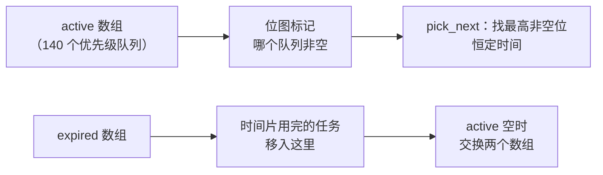

# 08 CFS 完全公平调度器——从 O(1) 到红黑树的演进

**摘要：**

Linux 的普通进程调度器在二十年里换过三次实现：从每个时间片都要遍历全部任务的 O(n) 调度器，到 2003 年随 2.6.0 发布的 O(1) 调度器，再到 2007 年 2.6.23 引入的 CFS（Completely Fair Scheduler）。每一次替换都不是因为前一代"不够快"，而是因为它表达用户意图的方式出了问题。本文按这条演进线索展开：先讲 O(n) 调度器为什么在交互式场景下失效、O(1) 调度器如何用活动/过期双数组加交互式启发式修补它，以及那些启发式（"睡眠越多的任务越可能是交互式的"）为什么最终变成了调优的黑洞。随后拆解 CFS 的核心思想——用"理想多任务处理器"这个思想实验定义公平，用虚拟运行时间（vruntime）把"按权重分配 CPU 比例"这个比例问题转化为"每次挑最小值"这个单调操作，用红黑树承载这个挑选动作，用一张非线性的 nice 到权重映射表表达用户意图。接着逐项讲解时间片的动态计算（`sched_latency` 与 `sched_min_granularity` 如何共同决定）、新任务与睡眠任务的 vruntime 处理、组调度（`task_group`）的引入动机、以及唤醒抢占的条件判定。文章还给出调度延迟的观测手段（`schedstat`、`/proc/sched_debug`、`perf sched`）与几类典型的延迟问题，并诚实讨论 CFS 的争议：唤醒抢占带来的"睡眠惩罚"、组调度在容器场景下的复杂性、以及 EEVDF 调度器在 Linux 6.6 取代 CFS 的原因。全文回答两个问题：CFS 为什么长这样，以及在一个具体负载下如何判断它是否工作正常。

---

## 第 1 章 调度器的三次迭代

### 1.1 O(n) 调度器：遍历一切

Linux 2.4 及更早版本使用的调度器，其核心是一个简单的循环：每次需要挑选下一个任务时，遍历运行队列上的所有任务，计算每一个的"goodness"（优度）分数，选分数最高的那个。

```c
/* O(n) 调度器的核心：遍历 + 打分 */
for (p = runqueue->head; p; p = p->next) {
    int weight = goodness(p, this_cpu, prev->active_mm);
    if (weight > best_weight) { best = p; best_weight = weight; }
}
```

这个算法的复杂度是 O(n)，而这在当时的机器上（几十个任务的规模）完全不是问题。它真正的问题在于**任务数量增大时开销线性上升，且这个开销发生在调度路径上**——每一次任务切换都要遍历一遍全部可运行任务，几百个任务时这个开销就变得可观了。

更麻烦的是"goodness"函数的构成。它综合了 nice 值、剩余时间片、以及"是否上次就在这个 CPU 上运行"（用作缓存亲和性的近似）。这些因素之间的权重没有理论依据，只能靠经验调整，而每一次调整都会在改善某类负载的同时恶化另一类。

### 1.2 O(1) 调度器：活动与过期双数组

2003 年，Ingo Molnar 在 2.6.0 中引入了 O(1) 调度器，其命名直接点明了目标：**无论多少任务，挑选下一个任务的代价都是常数**。

实现方式是用两个数组（`active` 与 `expired`），每个数组按优先级索引到 140 个链表：



关键的两点是：位图让"找到最高的非空优先级队列"变成了查找一个整数的最高置位，是常数时间；双数组让"时间片用完的任务"与"还有剩余时间片的任务"分离，切换数组时不需要遍历。

### 1.3 交互式启发式与它的黑洞

O(1) 调度器解决的问题是复杂度，但它通过一个额外的机制想同时解决另一件事：**让交互式任务（如文本编辑器）比批处理任务（如编译）获得更好的响应性**。

它引入的判据是动态优先级调整：如果一个任务表现出"睡眠时间长、运行时间短"的模式，就认为它是交互式的，给它的优先级加成；反之则降权。这个判据背后的直觉是合理的——一个等待用户输入的程序确实大部分时间在睡觉。

问题在于这个启发式的可调参数太多，且没有一个参数有理论依据：

| 参数 | 作用 |
| :--- | :--- |
| `sleep_avg` 的上限 | 累计睡眠时间的饱和值 |
| 睡眠惩罚系数 | 提高优先级的幅度 |
| 运行惩罚系数 | 降低优先级的幅度 |
| `interactive_delta` | 判定"交互式"的阈值 |

这些参数组合出的行为空间极大，而不同负载的最优取值互相冲突。结果是：调试一个负载时调好的参数，会在另一个负载上造成问题。**"用启发式去猜测用户意图"这条路，在 O(1) 调度器上被走到了尽头，也正是在这里被证明为死路。**

### 1.4 CFS 的登场

2007 年，Con Kolivas 的 RSDL/SD 补丁与 Ingo Molnar 的 CFS 先后提出，最终 CFS 在 Linux 2.6.23 被合并。

CFS 的做法与 O(1) 相反：**它放弃了"猜测谁需要更多 CPU"这件事，转而只保证一件事——每个任务获得与其权重成比例的 CPU 时间**。至于"交互式任务响应更快"这个目标，CFS 不再通过启发式去实现，而是通过一个更本质的机制：让睡眠时间长的任务在被唤醒时获得一个有利的位置（第 6 章）。这个设计把"不公平"重新定义为"没有按比例分配"，从而把调度问题转化为一个**可证明的、可观测的**问题。

### 1.5 一条时间线与一个绕不开的名字

把调度器的演进按时间排开，可以看到替代的节奏：

| 年份 | 内核版本 | 调度器 | 主要变化 |
| :--- | :--- | :--- | :--- |
| 1991-2002 | ≤ 2.4 | O(n) 调度器 | 遍历打分 |
| 2003 | 2.6.0 | O(1) 调度器 | 双数组 + 动态优先级 |
| 2007 | 2.6.23 | CFS | 权重比例 + 红黑树 |
| 2023 | 6.6 | EEVDF | 虚拟截止时间 + 资格判定 |

这条时间线上有一个名字需要单独提一下：Con Kolivas。他是一名澳大利亚麻醉科医生，长期利用业余时间维护面向桌面交互性的调度器补丁。2007 年，他提出的 RSDL（后改名 SD）在 CFS 之前进入社区讨论，其核心主张同样是"按权重公平分配、去掉交互式启发式"——与 CFS 的思路高度接近。

RSDL/SD 最终没有被主线采纳，Con Kolivas 也在同年宣布退出内核开发。此后他独自维护 BFS 调度器（面向桌面的简化实现），它以代码量小、交互性好在部分桌面用户中保有影响力，但从未进入主线。

这段插曲的教益有两条。第一，**同一个问题在同一个时期被不同的人独立地想到，说明它是被历史的进程逼出来的**——O(1) 调度器的启发式困境不是某个人的实现问题，而是那条路线本身的上限。第二，技术方案能否落地，除了正确性，还取决于维护成本、与既有代码的契合度、以及社区协作的一系列非技术因素。CFS 与 SD 在思路上如此接近，最终留下的是 CFS，这个结果里有技术的分量，也有技术之外的分量。

---

## 第 2 章 完全公平的核心思想

### 2.1 理想的多任务处理器

CFS 的理论基础是一个思想实验：**假设有一台理想的多任务处理器，能够让 n 个可运行任务同时以 1/n 的速度并行执行**。在这种理想情况下，任何两个任务的执行进度永远保持同步——没有人快、没有人慢。

真实 CPU 一次只能跑一个任务，因此"同时以 1/n 速度运行"只能是近似的。CFS 的目标就是让这个近似尽可能好：**当任务数多于 CPU 数时，按比例分配时间，让每个任务的"进度"尽量均匀推进**。

这个思想实验的价值在于它给出了一个可计算的公平标准：如果每个任务按权重分配了 CPU 时间，且推进速度与权重成正比，那么它就是公平的。不需要判断谁是"交互式"、谁是"批处理"——**公平本身就是目标，响应性是这个目标在常见负载下的副产品**。

### 2.2 用"进度"取代"优先级"

要把上面的标准变成算法，需要定义"进度"。CFS 引入的量是 `vruntime`（虚拟运行时间）：

```c
/* vruntime 的累加方式：与物理运行时间成正比，与权重成反比 */
se->vruntime += delta_exec * NICE_0_LOAD / se->load.weight;
```

其中 `delta_exec` 是本次实际运行的时间，`NICE_0_LOAD` 是 nice 0 对应的权重（1024），`se->load.weight` 是该任务的权重。这个公式的含义是：**权重越大的任务，同样的物理运行时间累加出的 `vruntime` 越少**。

于是"挑进度最慢的任务来运行"这件事，就变成了"挑 `vruntime` 最小的任务来运行"。而这个操作可以用一棵红黑树在 O(log n) 内完成。

### 2.3 一次巧妙的转化

CFS 的设计可以概括为一次转化：

| 原始问题 | 转化后的问题 |
| :--- | :--- |
| 如何按权重分配 CPU 时间比例 | 如何让每个任务的 `vruntime` 尽量同步推进 |
| 需要计算每个任务应得的时间配额 | 只需要每次挑 `vruntime` 最小的 |
| 比例分配问题（复杂、需要全局视角） | 排序问题（简单、只需要局部信息） |

这次转化的收益是巨大的：**比例分配是一个需要知道全部任务状态的全局问题，而挑选最小值只需要维护一个有序结构**。红黑树正好提供了"插入、删除、取最小值"都在 O(log n) 内完成的性质——这就是 CFS 选择红黑树而不是堆或跳表的理由：它需要同时支持这三种操作，而堆的删除任意元素代价高、跳表的实现复杂度高且在大规模下常数更大。

### 2.4 一个必要的偏差

严格来说，CFS 并没有实现"同时以 1/n 速度运行"的理想。原因很直接：任务的切换需要时间，如果严格按理想模型给每个任务分配极短的时间片，切换开销会吃掉绝大部分 CPU。

因此 CFS 引入了一个下限：**每个任务每次至少运行一段时间（`sched_min_granularity`）**。这意味着当可运行任务数超过某个阈值时，公平性会被牺牲——一部分任务需要等得更久。这个取舍是 CFS 全部复杂度的源头之一，也是第 8 章讨论的"延迟与吞吐两难"的具体体现。

### 2.5 三代调度器的对比

把三代调度器放在同一张表里对照，"CFS 究竟改变了什么"就清楚了：

| 维度 | O(n) | O(1) | CFS |
| :--- | :--- | :--- | :--- |
| 挑选复杂度 | O(n) | O(1) | O(log n) |
| 核心数据结构 | 单链表 | 活动/过期双数组 + 位图 | 红黑树 |
| 公平性的表达 | 无（靠 goodness 打分） | 无（靠动态优先级） | **权重比例** |
| 交互性的实现 | 启发式打分 | 睡眠/运行时间启发式 | 睡眠补偿（`vruntime` 校正） |
| 时间片 | 固定值加调整 | 基于优先级的固定表 | **动态计算** |
| 可调参数 | 少而有效 | 多且相互冲突 | 少，且语义清晰 |
| 主要问题 | 复杂度随任务数增长 | 启发式调不出普适参数 | 延迟随任务数线性增长 |

这张表里最值得留意的是"公平性的表达"这一行。O(n) 与 O(1) 两代调度器都没有一个明确的公平定义——它们通过打分或动态优先级间接地试图实现某种公平，但"公平"本身从未被量化。CFS 第一次给出了一个可验证的定义：**权重比例**。定义明确之后，正确性才有讨论的余地，参数调优也才有方向。

从纯算法的角度看，CFS 的 O(log n) 比 O(1) 是退步。这个退步之所以可以接受，是因为 `log n` 在真实系统规模下非常小——即使有 10000 个可运行任务，`log₂(10000) ≈ 14`，而红黑树的取最小值还被 `rb_leftmost` 缓存优化成了读一个指针。**用一点复杂度换一个明确的语义，这笔交易是划算的**，这也解释了为什么后续的 EEVDF 依然沿用了这套数据结构。

---

## 第 3 章 权重与优先级

### 3.1 nice 值的语义

Linux 沿用了 Unix 的 nice 值语义：范围是 -20 到 19，**值越小的优先级越高**（这个名字来自"对别人更 nice"，即更谦让）。默认值是 0。

普通用户只能调高 nice 值（降低优先级），只有持有 `CAP_SYS_NICE` 的进程才能设置负值。这条限制的存在是为了防止普通用户抢占系统的 CPU 资源。

还有一处容易记反的地方：`top` 输出的 `NI` 列是 nice 值（可为负），而 `PR` 列是内核优先级，两者相差 20——nice 0 对应 PR 20。看到 `PR` 为 20、`NI` 为 0 时不要以为哪里配错了，这是同一件事的两种表示。

### 3.2 nice 到权重的映射

CFS 内部不使用 nice 值，而是用一张表把它映射成权重：

```c
/* 内核里的映射表（节选，NICE_0_LOAD = 1024） */
const int sched_prio_to_weight[40] = {
 /* -20 */     88761,     71755,     56483,     46273,     36291,
 /* -15 */     29154,     23254,     18705,     14949,     11916,
 /* -10 */      9548,      7620,      6100,      4904,      3906,
 /*  -5 */      3121,      2501,      1991,      1586,      1277,
 /*   0 */      1024,       820,       655,       526,       423,
 /*   5 */       335,       272,       215,       172,       137,
 /*  10 */       110,        87,        70,        56,        45,
 /*  15 */        36,        29,        23,        18,        15,
};
```

读这张表可以看出两条性质。第一，**相邻两个 nice 值之间的权重比大约是 1.25**（1024 / 820 ≈ 1.25），因此 nice 相差 1 意味着 CPU 时间份额相差约 25%。第二，这个比值是近似恒定的，所以 **nice 相差 10 约为 10 倍差距**（1024 / 110 ≈ 9.3），符合直觉中的"优先级差 10 就是十倍"。

### 3.3 非线性映射的意义

为什么不用线性映射（比如权重 = 20 - nice）？因为线性的权重分配会导致一个极端的结果：如果一个任务是 nice 0、另一个是 nice 19，线性映射下前者只拿到后者的 20 倍 CPU——而在真实系统里，用户期望的是"低优先级的任务几乎拿不到 CPU"这种数量级上的差别。

非线性映射（每级 1.25 倍）让 nice 的调整效果具有**乘性**语义：nice 从 0 调到 -5 带来的收益（1024 → 3121，约 3 倍），远大于从 10 调到 5 的同等跨度（110 → 335，同样是约 3 倍，但由于基准低，绝对份额仍然很小）。这个设计让"高优先级任务拿到压倒性份额"与"低优先级任务仍能得到一些 CPU"这两个期望同时成立。

需要留意的是，这个映射表是**内核内部实现细节**，POSIX 只规定了 nice 值的范围与"越小越优先"的语义，没有规定权重比例。因此不要把"nice 差 1 等于 25% CPU 差异"当作可移植的常数来依赖。

### 3.4 权重之外的影响因素

权重决定了任务之间的**相对份额**，但最终的 CPU 时间还受几个其它因素影响：

| 因素 | 影响方式 |
| :--- | :--- |
| cgroup 的 `cpu.weight` | 组之间的份额分配，组内再按任务权重细分 |
| CPU 亲和性 | 限制在哪些 CPU 上竞争，影响竞争范围 |
| 组调度层级 | 每层组之间先按权重分配，再在组内分配 |
| cpu.max 带宽限制 | 硬性配额，超出即被节流（与权重的软性分配不同） |

其中最后一项与权重的关系最容易混淆：**权重是"竞争时按比例分"，配额是"无论如何不许超过"**。一个设置了 `cpu.max = 50%` 的 cgroup，即使系统空闲，它的任务也不会用到超过 50% 的 CPU；而一个 nice 值很低的任务，在系统空闲时照样可以跑满 CPU。这两者的区别在实际配置中经常被搞混。

### 3.5 进程级权重与组级权重

有了 cgroup 之后，"权重"实际上出现在两个层级上，它们的取值形式也不同：

| 层级 | 接口 | 取值范围 | 默认值 |
| :--- | :--- | :--- | :--- |
| 进程级 | `nice`（`setpriority`） | -20 ~ 19 | 0 |
| 进程级（内存中的权重） | `sched_prio_to_weight` | 15 ~ 88761 | 1024 |
| cgroup 级 | `cpu.weight`（cgroup v2） | 1 ~ 10000 | 100 |
| cgroup 级（旧接口） | `cpu.shares`（cgroup v1） | 2 ~ 262144 | 1024 |

两套取值的差异反映的是设计目标的不同。进程级的 nice 值范围窄、语义偏向"相对优先级"，用户只需要关心"我的任务比别人高一点还是低一点"；cgroup 级的 `cpu.weight` 范围宽，语义偏向"资源份额的比例"，编排系统会用它来表达"这个服务应该拿到多少比例的 CPU"。

一个实践要点是：**`cpu.shares` 与 `cpu.weight` 的数值不可直接比较**。cgroup v1 的 `cpu.shares` 默认 1024、范围到 262144，与进程级权重共用了同一套数值空间；而 cgroup v2 的 `cpu.weight` 默认 100、范围 1 到 10000，是另一套体系。从 v1 迁移到 v2 时，这两个值需要按比例换算，不能照抄——这是 cgroup 迁移过程中一个具体的、容易出错的细节。

还需要留意的是**层级嵌套时的权重叠加**。一个 cgroup 的最终 CPU 份额，取决于它与其兄弟节点之间的权重比、以及它的父节点与父节点的兄弟节点之间的权重比，逐层向上。因此"给某个服务设置 `cpu.weight = 400`"这个配置的实际效果，必须结合它在 cgroup 树中的位置来理解。

---

## 第 4 章 时间片的计算

### 4.1 两个核心参数

CFS 不用固定时间片，而是每次调度时动态计算。计算依赖两个参数：

| 参数 | 默认值 | 含义 |
| :--- | :--- | :--- |
| `sched_latency`（`sysctl_sched_latency`） | 6ms（随 CPU 数缩放） | 目标调度周期：让每个可运行任务至少跑一次的时间窗口 |
| `sched_min_granularity`（`sysctl_sched_min_granularity`） | 0.75ms | 单个任务一次运行的最短时间，防止切换过于频繁 |
| `sched_nr_latency` | 8 | 触发粒度保护的临界任务数 |

这三者的关系是：当可运行任务数不超过 `sched_nr_latency`（8 个）时，调度周期取 `sched_latency`，每个任务分到的时间是 `sched_latency × 权重占比`；当任务数超过 8 个时，如果还按 `sched_latency` 分，每个任务分到的时间会少于 `sched_min_granularity`，此时调度周期会被拉长，每个任务保证至少运行 `sched_min_granularity`。这三个参数都可以在 `/proc/sys/kernel/` 下查看，默认值还会根据 CPU 数量做缩放。

### 4.2 一次完整的算例

用具体数字走一遍，这个计算过程就清楚了。

**场景一：两个任务，nice 都是 0。** 可运行任务数 2 < 8，调度周期取 6ms。两个任务权重相同（1024），因此各分到 3ms。调度器让 A 跑 3ms（此时 A 的 `vruntime` 增加 3ms×1024/1024 = 3ms），然后切到 B 跑 3ms。

**场景二：两个任务，A 的 nice 为 0，B 的 nice 为 5。** 权重分别是 1024 与 335，权重和 1359。调度周期仍为 6ms，A 分到 6 × 1024/1359 ≈ 4.5ms，B 分到 6 × 335/1359 ≈ 1.5ms。

值得注意的是 `vruntime` 的累加：A 跑 4.5ms，`vruntime` 增加 4.5 × 1024/1024 = 4.5ms；B 跑 1.5ms，`vruntime` 增加 1.5 × 1024/335 ≈ 4.6ms。**两者的 `vruntime` 增量几乎相同**——这正是公平性的体现：不管物理时间跑了多少，虚拟进度的推进速度是同步的。

**场景三：20 个任务，nice 都是 0。** 任务数超过 8，调度周期不能是 6ms（那样每个任务只有 0.3ms，低于 `sched_min_granularity`），于是周期被拉长为 20 × 0.75ms = 15ms。每个任务跑 0.75ms。

场景三揭示了 CFS 的核心局限：**任务数增加时，单个任务两次被调度之间的间隔线性增长**。20 个任务时是 15ms，200 个任务时就是 150ms——对延迟敏感的应用而言，这个间隔足以造成可感知的卡顿。

### 4.3 时间片计算的影响因素

上面三个参数是可以通过 `/proc/sys/kernel/` 调整的，但**调整它们通常不是正确的做法**：

| 调整 | 效果 | 风险 |
| :--- | :--- | :--- |
| 调小 `sched_latency` | 响应更快 | 切换开销上升，吞吐下降 |
| 调大 `sched_min_granularity` | 吞吐更好 | 延迟变差，交互性下降 |
| 调大 `sched_nr_latency` | 更多任务仍保持短周期 | 单次时间片变短，切换频繁 |

需要理解的是，这些参数是**全局**的——调整它们会影响机器上的所有负载，而针对某个特定应用的延迟问题，正确的做法通常是给它更高的权重、绑定 CPU、或者改用实时调度策略，而不是去改全局的调度周期。

### 4.4 时间片计算的两段代码

把第 4.2 节的算例对应到内核实现上，只有两个函数：

```c
/* 第一步：决定调度周期的长度 */
static u64 __sched_period(unsigned long nr_running)
{
    if (unlikely(nr_running > sched_nr_latency))
        return nr_running * sysctl_sched_min_granularity;
    else
        return sysctl_sched_latency;
}

/* 第二步：按权重把周期分给某个任务 */
static u64 sched_slice(struct cfs_rq *cfs_rq, struct sched_entity *se)
{
    unsigned int nr_running = cfs_rq->nr_running;
    u64 slice;

    if (unlikely(!nr_running))
        nr_running = 1;

    slice = __sched_period(nr_running + !se->on_rq);
    slice = slice * se->load.weight / cfs_rq->load.weight;
    return slice;
}
```

`__sched_period()` 里的分支正是第 4.1 节讲的语义：任务数不超过 `sched_nr_latency`（8）时用固定的 `sched_latency`，超过之后改为"任务数 × 最小粒度"——这个公式保证每个任务至少能拿到 `sched_min_granularity`，代价是周期变长。

`sched_slice()` 里的权重计算有一个容易被忽略的细节：分母是 `cfs_rq->load.weight`（队列总权重），分子是 `se->load.weight`。**分到的时间与自身权重成正比、与队列总权重成反比**，这个比例关系就是"按权重分配"的数学表达。而 `nr_running + !se->on_rq` 这一项处理的是"当前任务尚未入队"的特殊情况——当调度器计算一个即将入队任务的份额时，它尚未被计入 `nr_running`，需要手动加 1 才不会算多。

两段代码加起来不到二十行，却完整地表达了 CFS 的时间分配规则。**把复杂的策略压缩成简短的、可验证的算术**，这是 CFS 相对前两代调度器最直观的改进——O(1) 调度器的动态优先级调整逻辑比这复杂得多，但它的行为却更难预测。

---

## 第 5 章 运行队列与调度实体

### 5.1 `cfs_rq` 的结构

每个 CPU 有一个 `cfs_rq`（CFS 运行队列），它的核心成员包括：

| 成员 | 作用 |
| :--- | :--- |
| `tasks_timeline` | 红黑树的根 |
| `rb_leftmost` | 缓存的最左节点（`vruntime` 最小的那个） |
| `curr` | 当前正在运行的任务 |
| `min_vruntime` | 队列的单调递增基准 |
| `nr_running` | 可运行任务数 |
| `load` | 队列总权重 |

`rb_leftmost` 这个缓存值得特别说明：红黑树的取最小值本身是 O(log n)，但 CFS 把这个值缓存在队列里，**让"挑选下一个任务"退化成读一个指针**。只有在插入或删除节点时，才需要更新这个缓存。这个优化的意义在于：调度路径是系统里最热的代码之一，能省一次树遍历就省一次。

`min_vruntime` 则是队列的"基准时间"，它有两个作用：为新任务提供 `vruntime` 的起点，以及为长期睡眠后醒来的任务做 `vruntime` 的补偿性调整。

### 5.2 红黑树的操作

CFS 在红黑树上做三类操作：

- **入队**（`enqueue_entity`）：按 `vruntime` 插入节点，更新 `rb_leftmost`；
- **出队**（`dequeue_entity`）：删除节点，更新 `rb_leftmost`；
- **取最小**（`pick_next_entity`）：直接读 `rb_leftmost`。

红黑树被选中而非普通二叉搜索树，是因为它提供了**最坏情况下的 O(log n) 保证**。普通 BST 在插入有序数据时会退化成链表，而调度器面对的 `vruntime` 序列恰恰有很强的单调性——新入队的任务往往 `vruntime` 较大，退化风险是真实存在的。

`rb_leftmost` 缓存的维护本身也有代价：每次入队与出队都需要检查新节点是否取代了原来的最左节点，这个检查是 O(1) 的（比较 `vruntime` 即可），但它的存在意味着**入队与出队路径上多了一次分支判断**。内核愿意付这个代价，是因为"取最小值"与"插入删除"的调用频次相差悬殊——前者在每一次任务切换时发生，后者只在任务状态变化时发生。**把开销从热路径搬到冷路径**，这是内核优化里最常见的一条思路。

### 5.3 新任务的起点

一个新创建的进程（`fork` 出来的）应该从什么 `vruntime` 开始？这个选择看似细节，实际上会显著影响行为：

| 策略 | 后果 |
| :--- | :--- |
| 从 0 开始 | 新任务会立刻抢走大量 CPU，把老任务挤到后面 |
| 继承父进程的 `vruntime` | 一个长期睡眠的父进程 fork 出的子进程会立刻获得极高优先级 |
| **从队列最小值加一个偏移开始** | 新任务排在队尾附近，既不会饿死也不会霸占 |

CFS 采用的是第三种。具体做法是把新任务的 `vruntime` 设为 `cfs_rq.min_vruntime + sysctl_sched_child_runs_first` 相关的一个偏移量，同时还有一个 `sched_child_runs_first` 的内核参数（默认关闭）可以强制让子进程先于父进程运行——后者存在的理由与 `fork` 后立即 `exec` 的模式有关（第 03 篇讨论过），让子进程尽快跑完 `exec` 能让父进程的 COW 页表尽快作废。

### 5.4 睡眠任务的补账

一个任务睡了很久之后醒来，它的 `vruntime` 会**落后于当前队列的基准**（因为睡眠期间它没有累加 `vruntime`）。如果直接按这个落后的值入队，它会排在最前面，然后长时间霸占 CPU 直到把欠账补回来——这就是著名的"睡眠补偿"问题。

CFS 的解法是在入队时做一次校正：

```c
/* 睡眠任务醒来时的 vruntime 校正（简化） */
if (se->vruntime < cfs_rq->min_vruntime)
    se->vruntime = cfs_rq->min_vruntime - sysctl_sched_latency;
```

效果是：唤醒的任务会被放在"队首略微靠前"的位置——比所有当前任务都靠前，但不至于优势大到能霸占 CPU 太久。**这个折中的尺度（一个调度周期的补偿量）就是 CFS 用来近似"交互式任务响应更快"的手段**，它取代了 O(1) 调度器里那一堆启发式参数。

### 5.5 组调度

当 cgroup 引入之后，CFS 需要回答一个新问题：**如何让一个组内的 100 个任务不会因为数量多而挤掉另一个组内的 1 个任务**。

如果只是把两组共 101 个任务平铺在一棵红黑树上，那么任务数多的一组会拿到更多 CPU——这与 cgroup 的"按组分配"意图不符。

组调度（`task_group`）的解法是**分层**：每个 cgroup 对应一个调度实体，在父层参与竞争；组内任务在子层竞争。这样 "A 组 100 个任务、B 组 1 个任务" 的场景下，A 组与 B 组先按权重各分一半 CPU，A 组内的 100 个任务再分这一半——每个任务拿到总 CPU 的 1/200，而 B 组的那个任务拿到 1/2。

```mermaid
%%{init: {'theme': 'dracula'}}%%
graph TD
    R["根 cfs_rq"] --> GA["A 组调度实体<br/>weight=1024"]
    R --> GB["B 组调度实体<br/>weight=1024"]
    GA --> TA1["A-1"]
    GA --> TA2["A-2"]
    GA --> TA3["...（共 100 个）"]
    GB --> TB1["B-1"]
    style R fill:#44475a
    style GA fill:#6272a4
    style GB fill:#6272a4
```



这套分层结构解决了数量不平衡的问题，代价是每次调度决策可能要在多层红黑树上逐级选择，实现与调试的复杂度都显著上升。**组调度是容器时代调度器最复杂的一块，也是"公平"这个目标在不同层级上需要重新定义的地方。**

### 5.6 `min_vruntime` 为什么必须单调

`cfs_rq.min_vruntime` 是队列的基准时间，它的更新规则可以概括为一句话：**只在有任务运行时向前推进，且永不后退**。

```c
/* min_vruntime 的推进（简化示意） */
static void update_min_vruntime(struct cfs_rq *cfs_rq)
{
    u64 vruntime = cfs_rq->min_vruntime;

    if (cfs_rq->curr)
        vruntime = cfs_rq->curr->vruntime;
    if (cfs_rq->rb_leftmost)
        vruntime = min_vruntime(vruntime, cfs_rq->rb_leftmost->vruntime);

    cfs_rq->min_vruntime = max_vruntime(cfs_rq->min_vruntime, vruntime);
}
```

最后那行 `max_vruntime()` 是关键：**新算出的候选值只有在大于当前值时才被采纳**。这个单调性保证有几个直接用处：

- **新任务的起点有参照**。新任务从 `min_vruntime` 加偏移开始，如果基准会后退，新任务的起点就会低于队列中的老任务，造成不公平。
- **睡眠任务的补偿有依据**。第 5.4 节的校正逻辑依赖"当前队列推进到了哪里"这个信息，单调的 `min_vruntime` 才是可靠的时钟。
- **无限精度问题的规避**。`vruntime` 是一个 64 位整数，在系统运行数月之后会累积到很大的值。如果 `min_vruntime` 会回退，那么"差值"这个量就失去了单调性，各种基于差值的判断都会失效。

单调性还带来一个副作用：`vruntime` 的**绝对值没有意义，只有它与队列基准的差值有意义**。这解释了 `/proc/sched_debug` 里那些数字为什么看起来毫无规律——它们只是一个不断递增的计数器，真正有信息量的是任务之间、以及任务与 `min_vruntime` 之间的差值。

---

## 第 6 章 抢占与唤醒

### 6.1 什么时候抢占当前任务

CFS 里的抢占有两类触发：

| 类型 | 触发条件 | 处理函数 |
| :--- | :--- | :--- |
| 时间片耗尽 | 当前任务的运行时间超过它应得的时间片 | `check_preempt_tick()` |
| 唤醒抢占 | 被唤醒的任务的 `vruntime` 明显小于当前任务的 | `check_preempt_wakeup()` |

第一类的判定很直接：当前任务的 `sum_exec_runtime` 减去它上次被调度时的值超过时间片，就置起 `TIF_NEED_RESCHED`。

### 6.2 唤醒抢占的条件

第二类是 CFS 里最有争议的部分。当一个任务被唤醒并加入运行队列时，如果它的 `vruntime` 比当前运行任务的 `vruntime` 小，是否应该立刻抢占？

如果答案是"是"，那么一个频繁睡眠与唤醒的任务（典型如一个每毫秒醒来处理一次事件的线程）会反复抢占正在运行的任务，导致大量的上下文切换。如果答案是"否"，那么交互式任务在繁忙系统上的响应性会下降。

CFS 采用的判据是**带余量的比较**：只有当被唤醒任务的 `vruntime` 比当前任务小出一个足够大的差值（`sysctl_sched_wakeup_granularity`，默认 1ms 对应的虚拟时间）时，才触发抢占。这个余量的存在把"轻微的不公平"排除在抢占触发条件之外，避免了过于频繁的切换。

### 6.3 睡眠惩罚

这套机制引出了一个被称为"睡眠惩罚"的现象：**一个任务如果频繁地睡眠与唤醒，其有效 `vruntime` 会因为反复的补偿与抢占余量而逐渐落后于其他任务，从而在长期上获得超出其权重的 CPU 份额**。

这不是 bug，而是设计取舍的直接后果——为了让交互式任务响应快，CFS 愿意让它们多拿一点 CPU。问题在于当"频繁睡眠"不是因为交互、而是因为程序结构（比如一个用短睡眠做轮询的线程）时，这个机制就变成了对劣质实现的奖励。

### 6.4 EEVDF 的替代

2023 年，Linux 6.6 用 EEVDF（Earliest Eligible Virtual Deadline First）调度器替换了 CFS 的核心逻辑。EEVDF 基于 1995 年的一篇学术论文，它给每个任务额外维护一个"虚拟截止时间"，并引入一个"资格"（eligibility）概念：只有在时间上已经"欠账"的任务才有资格竞争，而在有资格的任务中选虚拟截止时间最近的那个。

这套机制与 CFS 的差别在于：CFS 用**唤醒时的补偿偏移**近似响应性需求，EEVDF 用**明确的时间片请求与截止时间**表达它。后者的表达能力更强——应用可以通过 `sched_setattr()` 指定它想要的时间片长度，而不是让内核去猜。

需要说明的是，EEVDF 在 6.6 中替换的是 CFS 上面的那一层逻辑，`sched_entity`、红黑树、`vruntime` 这些基础结构依然存在。**调度器的这次换代不是推倒重来，而是在既有数据结构上更换了挑选策略**——这也是为什么它能相对平滑地落地。

### 6.5 抢占如何跨 CPU 生效

无论是时间片耗尽还是唤醒抢占，最终都要落到一个动作上：**置起目标任务的 `TIF_NEED_RESCHED` 标志**。这个动作由 `resched_curr()` 完成，而它需要处理两种情形。

**情形一：目标任务就在当前 CPU 上。** 直接置位即可，内核会在返回用户态或下一个抢占点检查这个标志。

**情形二：目标任务在另一个 CPU 上。** 此时必须通知那个 CPU，方式是发送一个**处理器间中断**（Inter-Processor Interrupt，IPI）：

```c
/* 简化的逻辑 */
if (task_cpu(target) != smp_processor_id())
    smp_send_reschedule(task_cpu(target));   /* 触发目标 CPU 重新调度 */
```

目标 CPU 收到这个中断后，会从中断返回路径上检查标志并执行 `schedule()`。这个机制的意义在于：**抢占是跨 CPU 生效的**，一个任务在 CPU 0 上被唤醒，可以让 CPU 7 上正在运行的低优先级任务立刻让出。

这条路径也带来一个可观测的指标：`/proc/interrupts` 里的 `RES`（rescheduling interrupts）计数。正常情况下这个数字会随负载波动，但**如果它异常高（每秒几十万次），说明系统里的唤醒抢占极其频繁**——这通常是"线程数远多于核数 + 大量短睡眠"这类负载特征的信号，也是第 7 章排查延迟问题时会去看的一项。

---

## 第 7 章 调度延迟的观测

### 7.1 `schedstat`

第 06 篇已经介绍过 `/proc/[pid]/schedstat` 的三个字段。在调度器的语境下，它们的解读方式如下：

```bash
cat /proc/12345/schedstat
# 124567890 4567890 1234
#  ↑等待时间  ↑运行时间  ↑被调度次数
```

**等待时间与运行时间的比值**是这个进程体验到的"CPU 竞争程度"的直接度量。一个比值接近或超过 1 的进程，说明它有大量时间花在运行队列上等待；比值远小于 1 的进程则基本是"想跑就能跑"。

### 7.2 `/proc/sched_debug`

这个文件给出了每个 CPU 的调度器内部状态，包括运行队列长度、`min_vruntime`、以及所有任务的 `vruntime`：

```bash
cat /proc/sched_debug | head -n 30
# cpu#0, 2600.000 MHz
#   .nr_running                    : 3
#   .load                          : 3072
#   .nr_switches                   : 1234567
#   .min_vruntime                  : 123456.789
#   ...
#   .se.exec_start                : 1234567.890
#   .se.sum_exec_runtime          : 45678.901
#   .se.vruntime                  : 123456.789
```

`min_vruntime` 与各任务的 `vruntime` 之间的差值很有信息量：差值大的任务排在队尾，意味着它需要等较久；差值都很小则说明负载均衡。

### 7.3 `perf sched`

`perf sched` 提供了对调度事件的时间线视图：

```bash
perf sched record -- sleep 5
perf sched latency
# --------------------------------------------------------------------------
#  Task                  |   Runtime |   Switches |  Average delay |  Maximum delay
# --------------------------------------------------------------------------
#  app:worker-3          |   1234 ms |       5678 |       0.123 ms |        12.34 ms
#  app:worker-1          |   1100 ms |       5432 |       0.098 ms |         8.76 ms
```

`Maximum delay` 这一列是排查延迟毛刺的利器——**平均延迟正常但最大延迟很高的进程**，其问题通常不是持续的 CPU 竞争，而是某个特定时刻的调度抖动（可能是锁竞争、可能是某次中断风暴、也可能是内存回收造成的停顿）。

### 7.4 几类典型的延迟问题

| 现象 | 可能的调度器侧原因 |
| :--- | :--- |
| 平均延迟正常、最大延迟高 | 唤醒抢占失败、或当前任务长时间不被抢占 |
| 多个任务延迟同时升高 | 可运行任务数超过 8，调度周期被拉长 |
| 单个任务延迟高、其它正常 | 该任务权重过低，或 CPU 亲和性限制过窄 |
| 延迟呈周期性 | 与某个周期性负载（定时任务、GC）相关 |

### 7.5 一次完整的延迟排查

设想一个服务的 p99 延迟从 20ms 上升到 80ms，而 CPU 使用率只从 40% 上升到 55%，看起来远未饱和。排查可以按下面的顺序推进。

**第一步：确认是不是调度延迟。** 用 `schedstat` 看等待时间与运行时间的比值：

```bash
# 对服务进程的每个线程统计
for t in /proc/12345/task/*; do
    read -r wait run _ < "$t/schedstat"
    name=$(cat "$t/comm")
    echo "$name  等待=$((wait/1000000))ms  运行=$((run/1000000))ms"
done | sort -t= -k4 -rn | head -n 10
```

如果多数线程的等待时间与运行时间在同一量级，说明它们确实在抢 CPU；如果等待时间远小于运行时间，问题不在调度上，应该转向锁竞争或 I/O。

**第二步：确认可运行任务数。** 调度延迟与可运行任务数的关系在第 4.2 节已经算过：

```bash
vmstat 1 3
# 关注 r 列（运行队列长度）与 cs 列（上下文切换）
```

如果 `r` 列长期在 CPU 核数的三倍以上，说明队列已经很拥挤。以 8 核机器为例，`r` 长期在 24 以上意味着每个任务需要等三轮才能拿到 CPU。

**第三步：确认这些任务是谁。** 一个常见的根因是**线程池配置过大**——比如按宿主机 64 核配置了 64 个 worker 线程，而容器只给了 4 核配额（第 07 篇讨论过这个错配）。此时 64 个线程在 4 个核上竞争，每个线程的调度延迟自然成倍增长。

**第四步：验证修改的效果。** 把线程池调到与配额匹配的大小，或者改用异步模型减少可运行任务数。修改后重新测 `schedstat` 的等待时间占比与 p99 延迟，两者的改善应该同步出现——**如果延迟改善了但等待时间没有改善，说明找到的不是真正的根因**。

这条排查路径的核心逻辑是：**用"等待时间/运行时间"这个比值把"调度问题"与"其它问题"分开，再用可运行任务数把"我的问题"与"别人的问题"分开**。CFS 的行为是确定的，它只是在既有的任务数下按权重分配；延迟变差必然对应着任务数或权重的变化，找到那个变化，问题就解决了一半。

补充一个读取调度属性的细节：`/proc/[pid]/stat` 的靠后字段里包含 `rt_priority` 与 `policy` 两项，它们分别给出实时优先级与调度策略编号。由于这两个字段位于 50 多个字段的末尾，用 `awk` 数位置容易出错，更稳妥的方式是用 `/proc/[pid]/sched` 文件——它以"键 : 值"的形式列出调度相关的属性，可读性远高于 `stat`：

```bash
grep -E 'policy|prio' /proc/12345/sched
# policy                                   : 0
# prio                                     : 120
```

`policy` 为 0 表示 `SCHED_NORMAL`（即 CFS），`prio` 为 120 对应 nice 值 0。这两个值配合 `chrt -p` 的输出，可以快速确认一个进程的调度待遇是否符合预期。

---

## 第 8 章 CFS 的争议与局限

### 8.1 唤醒抢占的两难

第 6 章讨论的唤醒抢占是 CFS 里最难调的一块。它的参数 `sched_wakeup_granularity` 直接控制两件事：

- 调小：抢占更积极，交互性好，切换开销上升；
- 调大：切换减少，吞吐上升，交互性下降。

这个问题没有理论上的最优解，因为"交互性"与"吞吐"在不同负载下的期望值不同。CFS 选择了一个经验值，并通过睡眠补偿机制让交互式任务在长期上多拿一点 CPU 作为补偿。**这套方案的复杂之处在于，它把一个无法精确表达的目标（响应性）转化为了一个可以近似的机制（补偿偏移），而这个近似在其他负载下会产生副作用。**

### 8.2 组调度的复杂度

组调度解决了多租户场景下的公平问题，代价是复杂度。一个要点在于**"组"这个概念是递归的**：一个 cgroup 下可以有子 cgroup，每层都有自己的调度实体与权重。在深层嵌套的容器环境里，一次调度决策可能要在多层红黑树上逐级选择。

```bash
# 观察当前系统的调度组层级
ls /sys/kernel/debug/sched/ 2>/dev/null
cat /proc/cgroups
```

对容器编排系统而言，这意味着**CPU 配额的计算需要考虑每一层的权重**，一个在服务层设置了 `cpu.weight` 的配置，其实际效果取决于父层与本层的关系。这是"分层公平"在带来表达能力的同时引入的固有复杂性。

### 8.3 延迟与吞吐的两难

第 4 章算过：20 个可运行任务时，调度周期被拉长到 15ms。这意味着一个任务从被唤醒到获得 CPU 的等待时间可能达到十几毫秒——对大多数服务可以接受，对延迟敏感的场景则不然。

缓解这个问题的手段有几条，各有代价：

| 手段 | 效果 | 代价 |
| :--- | :--- | :--- |
| 减少可运行任务数 | 直接改善延迟 | 需要改应用模型（事件驱动、协程） |
| 提高 nice 值（降权） | 提高本任务优先级 | 影响其他负载 |
| 绑定 CPU 亲和性 | 缩小竞争范围 | 可能造成 CPU 利用率不均 |
| 使用实时调度策略 | 立即可抢占 | 有饿死普通任务的风险 |
| 调小 `sched_latency` | 缩短周期 | 全局生效，切换开销上升 |

这张表的核心信息是：**延迟问题的解决方案大多在调度器之外**。调度器能做的只是在既有的资源与负载结构下做出分配，如果可运行任务本身就太多，任何参数调整都只是把问题在延迟与吞吐之间搬来搬去。

### 8.4 EEVDF 带来的变化

第 6.4 节提到 EEVDF 在 6.6 取代了 CFS 的挑选逻辑。它带来的具体变化包括：

- 引入 `sched_setattr()` 的时间片请求能力，让应用可以表达"我想要多长的时间片"；
- 用虚拟截止时间取代唤醒补偿，让响应性需求有更明确的表达方式；
- 减少了 CFS 中那套"睡眠补偿"机制带来的隐式偏袒。

这次替换的态度是克制的：**保留 CFS 的数据结构与核心抽象（`sched_entity`、`vruntime`、红黑树），只更换挑选策略**。这种"在稳定抽象上迭代策略"的方式，是内核演进里成本最低的一种改动形态——使用者的可观测接口（`/proc/sched_debug` 的字段、`schedstat` 的语义）基本保持不变，而内部的决策质量得到了提升。

---

## 第 9 章 边界与反例

### 9.1 nice 值不是万能的

调 nice 值只影响**同 CPU 上竞争同一调度类**的任务之间的份额。以下几种情况下它不起作用：

- 任务在不同的 CPU 上运行，彼此不竞争；
- 竞争方是实时任务（实时调度类优先于 CFS，nice 毫无用处）；
- 任务受 cgroup 的 `cpu.max` 硬配额限制，此时调 nice 无法突破配额；
- 系统整体不繁忙，nice 高低都拿得到 CPU。

一个常见的错误认知是"把 nice 调到 -20 就能保证我的服务不被影响"。在容器环境里，真正决定份额的是 cgroup 的权重与配额，进程级的 nice 值只在同一 cgroup 内部有效。

### 9.2 CPU 配额与 CFS 的交互

cgroup v2 的 `cpu.max` 通过 CFS 带宽控制（CFS Bandwidth Control）实现：它给每个调度周期设定一个配额，超出配额的任务组会被**节流（Throttle）**，即被强制停止直到下一个周期。

这个机制的副作用是很多人没有预料到的：**一个被节流的 cgroup，其内部任务会经历周期性的停顿**。这种停顿在监控上表现为 CPU 使用率的锯齿，在应用上表现为周期性延迟毛刺。如果一个服务的 p99 延迟突然变差，而 CPU 使用率看起来"刚好在配额附近"，节流就是一个必须排查的方向：

```bash
# 查看 cgroup 的节流统计
cat /sys/fs/cgroup/<cgroup>/cpu.stat
# nr_periods 100000
# nr_throttled 4321        ← 不为 0 就说明发生过节流
# throttled_usec 87654321
```

`cpu.stat` 里的 `nr_throttled` 是排查这类问题的关键指标。它的存在意义在于：**配额不足与调度延迟导致的性能下降，在应用层看起来可能一模一样，只有从 cgroup 侧才能区分**。这部分内容在 [[云原生/Docker/03 Cgroups 资源限制与控制]] 里有完整展开。

### 9.3 三个常见误区

| 误区 | 澄清 |
| :--- | :--- |
| CFS 的名字意味着它对所有任务绝对公平 | "公平"是按权重分配，不保证延迟相同；权重不同的任务拿到的 CPU 确实不同 |
| 提高 nice 值能提升性能 | nice 只影响竞争时的分配比例，不能提升单任务的执行速度 |
| 调度器参数调优能解决延迟问题 | 大多数延迟问题的根因在可运行任务数与应用模型，参数调整通常只是转移问题 |

### 9.4 实时任务与 CFS 的关系

严格来说，`SCHED_FIFO` 与 `SCHED_RR` 的任务不属于 CFS 管辖。调度类之间有严格的优先级顺序：


CFS 只在"没有更高调度类的任务可运行时"才有机会挑选任务。这意味着**一个系统上只要有一个实时任务持续可运行，CFS 的任务就完全拿不到 CPU**。这正是实时调度危险的地方，也是 RT 节流机制（`sched_rt_runtime_us`）存在的理由——它是防止实时任务饿死整个系统的最后一道保险。第 09 篇会展开这条完整的调度类层次。

### 9.5 CFS 之外的负载均衡

前面几章讨论的都是"单个 CPU 的运行队列如何挑选任务"，但多核系统上还有一个同等重要的问题：**任务应该待在哪个 CPU 的运行队列上**。这部分不属于 CFS 的 `fair.c` 挑选逻辑，而是由负载均衡（Load Balancing）负责。

理解负载均衡需要先接受一个前提：**每个 CPU 有独立的 `cfs_rq`，任务在哪个队列上就只与那个队列上的其它任务竞争**。一个任务被绑定到 CPU 0，即使 CPU 1 完全空闲，它也享受不到 CPU 1 的算力。这个前提解释了一个常见现象：机器整体 CPU 使用率只有 30%，但某个线程的调度延迟依然很高——因为它被亲和性限制在了一个拥挤的 CPU 上。

负载均衡的工作方式是在 `sched_domain` 的层级结构上做周期性的检查与迁移：

| 层级 | 典型范围 | 迁移成本 |
| :--- | :--- | :--- |
| SMT | 同一物理核的超线程 | 极低（共享 L1/L2） |
| MC | 同一物理 CPU 的多个核 | 低（共享 L3） |
| DIE / NUMA | 跨 NUMA 节点 | 高（跨内存控制器） |
| 其它 | 跨节点 | 极高 |

层级越往上，迁移的代价越大，因此负载均衡的策略是"先在近处找均衡，找不到再往上走"。这个设计体现的是**缓存局部性优先**的原则：把一个任务迁到另一个 CPU 上会破坏它的缓存工作集，宁可让轻微的负载不均存在，也不要为此付出跨 NUMA 迁移的代价。

对使用者的实际含义是：**`taskset` 与 `sched_setaffinity` 是绕开负载均衡的手段，用得要谨慎**。把一批线程绑死在固定的 CPU 上，等于主动放弃了内核的均衡能力；如果绑定的分配方式与实际负载不匹配（比如把 8 个线程绑到 4 个 CPU 上，另外 4 个 CPU 空闲），就会出现"系统有空闲 CPU 但任务仍在排队"的局面。绑定 CPU 的正确用法是配合 NUMA 拓扑与延迟要求，而不是作为一种"性能优化"的通用手段。

### 9.6 用户态可用的调度接口

把本章涉及的调度控制手段汇总成一张速查表，便于在具体场景中选择：

| 目标 | 命令 | 系统调用 | 是否需要特权 |
| :--- | :--- | :--- | :--- |
| 调整 nice 值（调低优先级） | `renice +5 -p PID` | `setpriority` | 否 |
| 调整 nice 值（调高优先级） | `renice -5 -p PID` | `setpriority` | 需要 `CAP_SYS_NICE` |
| 查看调度策略与优先级 | `chrt -p PID` | `sched_getscheduler` | 否 |
| 修改调度策略 | `chrt -f 50 PID` | `sched_setscheduler` | 需要 `CAP_SYS_NICE` |
| 绑定 CPU | `taskset -cp 0-3 PID` | `sched_setaffinity` | 否（受 `cpuset` 限制） |
| 请求特定时间片（EEVDF） | 无标准命令 | `sched_setattr` | 需要 `CAP_SYS_NICE` |

这张表的最后一行值得留意：**`sched_setattr` 目前没有对应的标准命令行工具**，只能通过程序调用。这意味着 EEVDF 引入的"应用主动声明时间片需求"这一能力，在实际使用中门槛较高，多数服务仍然是通过 nice 值、cgroup 权重与 CPU 亲和性这三样来做调节。一项能力的存在与它的可用性之间，往往还隔着工具生态这一层。

---

## 第 10 章 小结：把一个难题转化为一个简单问题

CFS 最值得学习的地方不在于红黑树或 `vruntime` 的具体实现，而在于它**重新定义问题的能力**。

O(1) 调度器试图回答的问题是"哪个任务最应该运行"，这个问题需要综合 nice 值、交互性、缓存亲和性、历史行为——每一项的判断标准都不清晰，组合起来的权重更没有依据。CFS 把问题换成了"哪个任务的虚拟时间推进得最慢"，这个问题有明确的答案（最小值）、可以用数据结构高效求解（红黑树）、而且它的正确性可以被验证（比例是否与权重相符）。

这不是说 CFS 解决了全部问题。它把"响应性"通过睡眠补偿近似实现，把"多租户公平"通过组调度分层实现，两边都引入了新的复杂度；当可运行任务数增长时，它的延迟特性会自然恶化，而这个问题最终只能在应用模型层面解决。**每一次问题的转化都会把难题推到别处，而不是消灭它**——这正是那条命题的又一次具体呈现：复杂性不会消失，只会转移。

由此可见，评价一个调度器不应该问"它是否公平"，而应该问"它在什么负载下、对哪一类指标、以什么代价实现了它声称的目标"。CFS 声称的目标是按权重分配 CPU 时间，它在可运行任务数适中的场景下做到了，代价是延迟随任务数线性增长、以及一套难以彻底调优的唤醒抢占机制。理解这个边界，比记住 `sched_latency` 的默认值有用得多。

---

## 参考资料

1. *Linux Kernel Source* — `kernel/sched/fair.c`：CFS 主实现，`check_preempt_tick()`、`check_preempt_wakeup()`、`enqueue_entity()`。
2. *Linux Kernel Source* — `kernel/sched/core.c`：`sched_prio_to_weight` 映射表与调度类分派逻辑。
3. *Linux Kernel Source* — `kernel/sched/debug.c`：`/proc/sched_debug` 的字段生成。
4. *Linux Kernel Documentation* — `Documentation/scheduler/sched-design-CFS.rst`：CFS 的设计文档（Ingo Molnar）。
5. *Linux Kernel Documentation* — `Documentation/scheduler/sched-eevdf.rst`：EEVDF 的设计说明与替换动机。
6. *Stoica, I., Abdel-Wahab, H. "Earliest Eligible Virtual Deadline First: A Flexible and Accurate Mechanism for Proportional Share Resource Allocation."* 1995：EEVDF 的理论来源。
7. *Linux Kernel Source* — `kernel/sched/fair.c` 中的 `task_group` 相关实现：组调度的分层结构。
8. *Linux Kernel Documentation* — `Documentation/admin-guide/cgroup-v2.rst`：`cpu.weight` 与 `cpu.max` 的语义。
9. *Systems Performance*（2nd Edition）, Brendan Gregg, 2020：第 6 章，调度延迟的观测方法。
10. *perf-sched(1) manual page*：调度事件追踪与延迟统计。

---

> [!note] 思考题
> 1. CFS 用"队列最小值加偏移"处理睡眠任务的 `vruntime` 补偿，如果去掉这个补偿，交互式任务与批处理任务的体验会如何变化？
> 2. 组调度把公平性做成了分层结构，那么当层级很深时，"公平"在第 n 层上的含义是什么？它与 cgroup 的 `cpu.weight` 语义如何对应？
> 3. EEVDF 引入了"截止时间"的概念，如果应用请求的时间片远大于调度周期，内核应当如何处理？
> 4. `sched_latency` 是全局参数，如果只希望为某个特定服务改善延迟，有哪些不修改全局参数的替代手段？