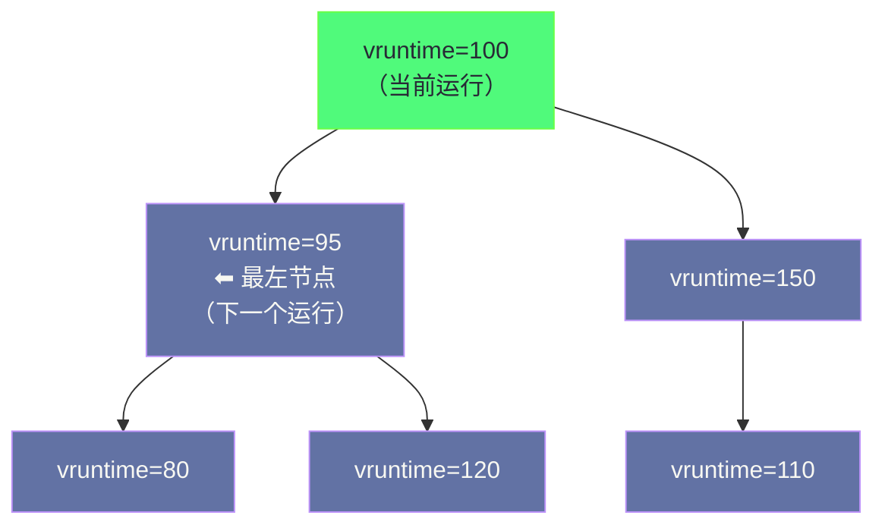

**摘要：**

Linux 调度器的演进史，是一部从"朴素但够用"到"精确且高效"的工程史。早期的 O(n) 调度器在进程数量多时性能退化严重；O(1) 调度器解决了性能问题，却引入了复杂的启发式算法来平衡交互性和批处理，难以理解和维护；2007 年 Ingo Molnar 引入的 **CFS（Completely Fair Scheduler，完全公平调度器）** 以一个极为简洁的核心思想彻底改变了这个局面：**用"虚拟运行时间"（vruntime）来量化公平性，始终选择 vruntime 最小的进程运行**。CFS 用红黑树组织所有可运行进程（vruntime 为键），O(log N) 找到下一个该运行的进程；用 nice 值到权重的精确数学映射控制 CPU 分配比例；用调度延迟（scheduling latency）保证每个进程在一个时间窗口内都能获得至少一次运行机会。本文从调度器的历史演进出发，逐步拆解 CFS 的每一个核心概念：vruntime 的计算公式、红黑树的选择动机、时间片的动态计算、nice 值权重表的设计哲学，以及多核场景下的负载均衡机制。

---

## 第 1 章 调度器的历史演进：三代调度器的困境与突破

### 1.1 O(n) 调度器：够用但有性能上限

Linux 2.4 及更早版本使用的 O(n) 调度器设计极为简单：每次调度时，遍历所有可运行进程，选择"优先级最高（goodness 值最大）"的进程运行。

```c
/* O(n) 调度器的核心逻辑（Linux 2.4，大幅简化）*/
asmlinkage void schedule(void) {
    struct task_struct *next = NULL;
    int c = -1000;

    /* 遍历所有进程，找 goodness 最大的 */
    list_for_each(tmp, &runqueue_head) {
        p = list_entry(tmp, struct task_struct, run_list);
        int weight = goodness(prev, p, this_cpu);
        if (weight > c) {
            c = weight;
            next = p;
        }
    }
    /* 运行 next */
    context_switch(prev, next);
}
```

**问题**：调度时间复杂度是 O(n)，n 是可运行进程数量。当系统中有 1000 个可运行进程时，每次调度都要遍历 1000 个进程——在服务器场景下，这是不可接受的性能瓶颈。

### 1.2 O(1) 调度器：性能提升，但复杂度爆炸

Linux 2.6.0 引入 O(1) 调度器，核心思想是用两个优先级位图（active 和 expired）实现 O(1) 的调度选择：

每个优先级（0-139）对应一个进程链表，用 64 位整数的位图标记哪些优先级有可运行进程。`sched_find_first_bit()` 找到最高优先级，O(1) 获取下一个进程——完全消除了 O(n) 问题。

**但 O(1) 调度器有一个深层问题**：

如何判断一个进程是"交互型"（如 shell、GUI 应用，需要低延迟响应）还是"批处理型"（如编译器、压缩工具，追求吞吐量）？O(1) 调度器用了一套复杂的启发式算法：分析进程的睡眠时间、运行时间比例……来动态调整其优先级。

这套启发式算法在实践中有很多边界情况——某些进程被错误地分类，导致交互性差。内核开发者们不断为各种奇怪的场景打补丁，代码越来越复杂，难以理解，更难以正确修改。

Ingo Molnar（CFS 的作者，同时也是 O(1) 调度器的作者）后来描述这个问题时说：O(1) 调度器的启发式算法"是错误的"——它试图通过行为分析来猜测进程的意图，而正确的做法应该是**直接测量和追踪公平性**，不需要任何猜测。

### 1.3 CFS 的诞生：以"虚拟时钟"实现完美公平

2007 年 10 月，Linux 2.6.23 合并了 CFS，它彻底抛弃了 O(1) 调度器的启发式方法，回归第一性原理：

**公平性的定义**：在理想情况下，N 个相同优先级的进程应该各自占用 1/N 的 CPU 时间。

**如何衡量公平性**：给每个进程维护一个"虚拟运行时间（vruntime）"——记录该进程在"理想的公平 CPU"上已经运行了多少时间。vruntime 最小的进程，是目前"最亏欠"的进程，下次应该优先运行它。

这个思想来源于计算机网络中的 **WFQ（Weighted Fair Queuing，加权公平排队）** 算法——一种用于网络包调度的公平队列算法。Ingo Molnar 将其思想移植到了进程调度领域。

> [!note] 设计哲学：从"猜测意图"到"追踪公平性"
> O(1) 调度器的根本问题是试图"猜测"进程是交互型还是批处理型，然后给予不同待遇。这本质上是用间接指标（行为模式）来推断直接需求。
>
> CFS 的哲学完全不同：不猜，不分类，只追踪一件事——每个进程已经消耗了多少 CPU 时间？消耗最少的优先运行。这个逻辑对所有进程（无论交互型还是批处理型）都是一致的，不需要任何特殊处理——交互型进程因为经常睡眠，其 vruntime 自然增长缓慢，唤醒时总是"最亏欠"的进程，自然得到优先调度，不需要任何启发式算法。

---

## 第 2 章 虚拟运行时间（vruntime）：公平性的数学表达

### 2.1 vruntime 的定义与计算

**vruntime** 是 CFS 的核心概念：进程在"虚拟 CPU"上运行的累计时间，单位是纳秒（ns）。

对于相同 nice 值（相同权重）的进程，vruntime 就是实际的 wall clock 运行时间。但当进程有不同的 nice 值（权重）时，vruntime 要根据权重进行缩放：

```
vruntime += 实际运行时间 × (NICE_0_LOAD / 当前进程的权重)
```

其中 `NICE_0_LOAD = 1024`（nice=0 时的权重基准值）。

这个公式的含义：
- nice=0（权重=1024）的进程：`vruntime += 实际时间 × (1024/1024) = 实际时间`（vruntime 与实际时间相同）
- nice=-10（权重=9548，约为 nice=0 的 9.3 倍）的进程：`vruntime += 实际时间 × (1024/9548)` ≈ 实际时间 × 0.107（vruntime 增长慢，相当于运行了更短的"虚拟时间"）
- nice=+10（权重=110，约为 nice=0 的 0.107 倍）的进程：`vruntime += 实际时间 × (1024/110)` ≈ 实际时间 × 9.3（vruntime 增长快，相当于运行了更长的"虚拟时间"）

**效果**：nice=-10 的高优先级进程，每次实际运行相同时间，vruntime 增长更慢——它总是"欠账"更多，总是被优先调度，**实际上获得了更多的 CPU 时间**。

### 2.2 vruntime 的内核实现

```c
/* kernel/sched/fair.c：更新 vruntime（简化）*/
static void update_curr(struct cfs_rq *cfs_rq) {
    struct sched_entity *curr = cfs_rq->curr;
    u64 now = rq_clock_task(rq_of(cfs_rq));
    u64 delta_exec;

    /* 计算本次运行的实际时间（纳秒）*/
    delta_exec = now - curr->exec_start;
    curr->exec_start = now;
    curr->sum_exec_runtime += delta_exec;

    /* 计算 vruntime 增量：delta_vruntime = delta_exec × (NICE_0_LOAD / weight) */
    /* calc_delta_fair 实现这个计算，避免浮点运算，用整数移位替代 */
    curr->vruntime += calc_delta_fair(delta_exec, curr);

    /* 更新 cfs_rq 的最小 vruntime（min_vruntime）*/
    /* min_vruntime 是当前运行队列中所有进程 vruntime 的下界 */
    update_min_vruntime(cfs_rq);
}
```

**`calc_delta_fair()` 的整数计算技巧**：

浮点运算在内核中是禁止的（内核代码运行时不保存/恢复浮点寄存器）。CFS 用定点整数运算实现权重缩放：

```c
/* vruntime 增量 = delta_exec × NICE_0_LOAD / weight */
/* 等价于：delta_exec × inv_weight >> 32 （inv_weight = 2^32 / weight，预先计算）*/
static u64 __calc_delta(u64 delta_exec, unsigned long weight, struct load_weight *lw) {
    u64 fact = scale_load_down(weight);
    u32 fact_hi = (u32)(fact >> 32);
    int shift = 32;
    /* 使用预计算的 inv_weight：lw->inv_weight = WMULT_CONST / lw->weight */
    /* 通过整数乘法和位移实现除法 */
    return mul_u64_u32_shr(delta_exec, lw->inv_weight, shift);
}
```

### 2.3 min_vruntime：解决新进程的公平接入问题

当一个全新的进程被创建（或一个长期睡眠的进程被唤醒）时，如果直接设置 vruntime = 0，它的 vruntime 会远小于当前运行进程的 vruntime，调度器会持续选择这个"新来者"，导致其他进程被饿死（starvation）。

解决方案是 **`min_vruntime`**：每个运行队列维护一个 `min_vruntime`，表示该队列中所有进程 vruntime 的下界（近似最小值）。

新进程加入运行队列时，其初始 vruntime 被设置为：

```c
/* place_entity：设置新进程或唤醒进程的 vruntime */
static void place_entity(struct cfs_rq *cfs_rq, struct sched_entity *se, int initial) {
    u64 vruntime = cfs_rq->min_vruntime;

    if (initial) {
        /* 新进程：从 min_vruntime 出发，给予少量"奖励"（1 个 slice 的惩罚时间）*/
        /* 让新进程能较快运行，但不会太激进地抢占当前运行进程 */
        vruntime += sched_vslice(cfs_rq, se);
    } else {
        /* 唤醒的睡眠进程：略小于 min_vruntime，使其能优先运行（奖励 IO 交互性）*/
        vruntime -= sysctl_sched_latency;   /* 给唤醒进程一个"奖励时间"*/
    }

    /* 取 max(当前 vruntime, 计算值)：保证 vruntime 只增不减 */
    se->vruntime = max_vruntime(se->vruntime, vruntime);
}
```

**为什么唤醒进程给予"奖励"（vruntime 略小于 min_vruntime）？**

交互型进程（如 bash、编辑器、浏览器）的典型行为是：等待用户输入（睡眠）→ 收到输入（唤醒）→ 快速处理并显示结果（运行很短时间）→ 再次等待。如果唤醒时 vruntime 不给奖励，这类进程每次唤醒后都要排队等很久才能运行，用户会感觉响应迟钝。

给予唤醒奖励（稍小于 min_vruntime）使得交互型进程唤醒后能快速得到 CPU，实现低延迟响应——这正是 CFS 在不用任何启发式算法的情况下，自然实现良好交互性的机制。

---

## 第 3 章 红黑树：O(log N) 调度的数据结构选择

### 3.1 为什么选择红黑树

CFS 需要一种数据结构来组织所有可运行进程（以 vruntime 为键），支持两个核心操作：
1. **`pick_next_task()`**：O(1) 找到 vruntime 最小的进程
2. **进程入队/出队**：当进程状态变化（睡眠、唤醒、新建、退出）时，O(log N) 地插入/删除节点

**为什么不用堆（Binary Heap）？**

最小堆能 O(1) 找最小值，但删除任意节点需要 O(N) 时间——而"进程睡眠"就是删除任意节点（进程主动放弃 CPU），这在服务器场景下非常频繁。

**为什么不用有序数组或跳表？**

有序数组的插入/删除需要移动元素，O(N)；跳表可行，但内存开销较大，且实现比红黑树复杂（对于这个特定的使用场景）。

**红黑树（Red-Black Tree）的优势**：

红黑树是一种自平衡二叉搜索树：
- 查找最小值：O(log N)，但通过缓存最左节点可以优化到 O(1)
- 插入：O(log N)
- 删除：O(log N)
- 所有操作的时间复杂度都有严格保证（最坏情况也是 O(log N)）

CFS 将可运行进程按 vruntime 插入红黑树，**最左节点（leftmost node）就是 vruntime 最小的进程**，即下一个应该运行的进程。`cfs_rq->rb_leftmost` 缓存了这个节点，使得 `pick_next_task()` 是真正的 O(1)：

```c
struct cfs_rq {
    /* CFS 运行队列的核心数据结构 */
    struct rb_root_cached tasks_timeline;  /* 红黑树 + 最左节点缓存 */
    struct sched_entity *curr;             /* 当前正在运行的进程 */
    u64 min_vruntime;                      /* 当前队列所有进程 vruntime 的下界 */
    unsigned int nr_running;               /* 可运行进程数量 */
    /* ... */
};

/* pick_next_task_fair：选择下一个运行的进程（简化）*/
static struct task_struct *pick_next_task_fair(struct rq *rq, ...) {
    struct cfs_rq *cfs_rq = &rq->cfs;

    /* rb_first_cached() 返回红黑树最左节点（vruntime 最小），O(1) */
    struct rb_node *left = rb_first_cached(&cfs_rq->tasks_timeline);
    if (!left)
        return NULL;   /* 运行队列为空 */

    struct sched_entity *se = rb_entry(left, struct sched_entity, run_node);
    return task_of(se);
}
```

### 3.2 红黑树的直观图示



**调度过程**（每次时钟中断或进程主动调度时）：

1. 当前进程 vruntime += delta（更新运行时间）
2. 若当前进程 vruntime > 最左节点 vruntime + `sysctl_sched_wakeup_granularity`：需要抢占
3. 将当前进程重新插入红黑树（按新的 vruntime）
4. 选择最左节点作为新的当前进程
5. 将新进程从红黑树中移除（它现在正在运行，不在队列中）

---

## 第 4 章 nice 值与权重：CPU 分配比例的精确控制

### 4.1 nice 值的历史来源

`nice` 值（取值范围 -20 到 +19，默认 0）是 Unix 系统的传统进程优先级机制。名字来自 "be nice to others"——较高的 nice 值表示进程愿意"让出"CPU 给其他进程，值越大越"礼让"，实际获得的 CPU 越少。

在 O(n) 和 O(1) 调度器时代，nice 值直接影响调度优先级（priority）的计算。在 CFS 中，nice 值被转换为**权重（weight）**，通过影响 vruntime 的增长速度来控制 CPU 分配比例。

### 4.2 nice 值到权重的映射表

CFS 使用一个预先计算好的权重表（`sched_prio_to_weight[]`），将 nice 值（-20 到 +19，共 40 个等级）映射为整数权重：

```c
/* kernel/sched/core.c：nice 值到权重的映射表 */
const int sched_prio_to_weight[40] = {
 /* -20 */  88761,  71755,  56483,  46273,  36291,
 /* -15 */  29154,  23254,  18705,  14949,  11916,
 /* -10 */   9548,   7620,   6100,   4904,   3906,
 /*  -5 */   3121,   2501,   1991,   1586,   1277,
 /*   0 */   1024,    820,    655,    526,    423,
 /*   5 */    335,    272,    215,    172,    137,
 /*  10 */    110,     87,     70,     56,     45,
 /*  15 */     36,     29,     23,     18,     15,
};
```

**这个权重表的设计哲学：乘法关系**

相邻 nice 值之间的权重比例约为 `1.25`（即 5/4）：
- `nice=0` 权重 1024，`nice=1` 权重 820，比值 ≈ 1.25
- `nice=0` 权重 1024，`nice=-1` 权重 1277，比值 ≈ 1.25

这意味着：**nice 值每差 1，CPU 时间比例相差约 10%**（精确值：nice 值差 1，权重比为 1.25，CPU 时间比为 1.25:1，差了约 11%）。

**为什么选择 1.25 这个倍率？**

这个值是经过实践验证的工程权衡：
- 太小（如 1.1）：nice 值差 20 个等级时（-20 vs +19），权重比只有 1.1^39 ≈ 49 倍，差距不够显著
- 太大（如 2.0）：nice 值差 1 时，CPU 时间差一倍，粒度太粗，无法细调
- 1.25：nice 差 1 ≈ 差 10% CPU 时间，差 10 个等级 ≈ 差 9.5 倍 CPU 时间（~1.25^10），合理的粒度

**验证：两个进程的 CPU 分配比**

```
进程 A：nice=0，权重=1024
进程 B：nice=5，权重=335

CPU 分配比 = 权重 A / (权重 A + 权重 B) : 权重 B / (权重 A + 权重 B)
           = 1024 / (1024+335) : 335 / (1024+335)
           = 1024/1359 : 335/1359
           = 75.3% : 24.7%

进程 A 大约获得 3/4 的 CPU，进程 B 获得 1/4。
```

```bash
# 实战：验证 nice 值对 CPU 分配的影响
# 在两个终端分别运行 CPU 密集型程序，设置不同 nice 值
nice -n 0  stress --cpu 1 &  # 进程 A，nice=0
nice -n 10 stress --cpu 1 &  # 进程 B，nice=10（权重=110）

# 观察 CPU 使用率
top  # 进程 A 应该获得约 1024/(1024+110) ≈ 90% 的 CPU
     # 进程 B 应该获得约 110/(1024+110)  ≈ 10% 的 CPU
```

### 4.3 inv_weight：除法优化为乘法移位

权重表中每个 weight 值都有对应的 `inv_weight`（`WMULT_CONST / weight`，其中 `WMULT_CONST = 2^32`）：

```c
/* 预计算 inv_weight，用于 vruntime 增量计算中避免除法 */
const u32 sched_prio_to_wmult[40] = {
 /* -20 */     48388,     59856,     76040,     92818,    118348,
 /* -15 */    147320,    184698,    229616,    287308,    360437,
 /* -10 */    449829,    563644,    704093,    875809,   1099582,
 /*  -5 */   1376151,   1717300,   2157191,   2708050,   3363326,
 /*   0 */   4194304,   5237765,   6557202,   8165337,  10153587,
 /*   5 */  12820798,  15790321,  19976592,  24970740,  31350126,
 /*  10 */  39045157,  49367440,  61356676,  76695844,  95443717,
 /*  15 */ 119304647, 148102320, 186737708, 238609294, 286331153,
};
```

vruntime 增量计算变为：
```
delta_vruntime = delta_exec × inv_weight >> 32
              ≈ delta_exec × (WMULT_CONST / weight) / WMULT_CONST
              = delta_exec / weight × NICE_0_LOAD
```

全程只用整数乘法和位移，完全避免了除法运算，在内核代码中至关重要（除法在某些架构上非常慢）。

---

## 第 5 章 调度延迟与时间片：CFS 如何决定"运行多久"

### 5.1 调度延迟：每个进程都能运行的保证

CFS 不像传统调度器那样为每个进程分配固定时间片（如 10ms 或 100ms）。相反，CFS 使用**调度延迟（Scheduling Latency）**来保证公平性：

**调度延迟**（`sysctl_sched_latency`，默认 6ms）：系统保证在这个时间窗口内，运行队列中的每个进程都至少运行一次。

每个进程在一个调度延迟窗口内的"理想运行时间"（time slice）为：

```
时间片 = sched_latency × (当前进程权重 / 运行队列总权重)
```

例如，4 个 nice=0 的进程（权重各 1024），总权重 4096：
```
每个进程的时间片 = 6ms × (1024/4096) = 1.5ms
```

如果运行队列中进程数量很多（如 100 个），每个进程的时间片就会变得很小（6ms/100 = 0.06ms）——频繁的上下文切换会导致大量开销。

### 5.2 最小粒度：防止时间片过小

为了解决进程数量多时时间片过小的问题，CFS 引入了**最小粒度（`sysctl_sched_min_granularity`，默认 0.75ms）**：时间片不能小于这个值。

当进程数量 N 超过 `sched_latency / sched_min_granularity = 8`（6ms/0.75ms）时，调度延迟会自适应扩大：

```
调度延迟 = max(sched_latency, N × sched_min_granularity)
         = max(6ms, N × 0.75ms)
```

这意味着当有 100 个进程时，调度延迟变为 75ms——每个进程至少运行 0.75ms，但延迟保证也从 6ms 变为了 75ms。

```bash
# 查看和调整 CFS 的核心参数
cat /proc/sys/kernel/sched_latency_ns          # 调度延迟（纳秒）
# 6000000（6ms）

cat /proc/sys/kernel/sched_min_granularity_ns  # 最小粒度（纳秒）
# 750000（0.75ms）

cat /proc/sys/kernel/sched_wakeup_granularity_ns  # 唤醒抢占阈值
# 1000000（1ms）

# 对于延迟敏感的应用（如数据库），可以适当减小这些值
# 对于批处理服务器，可以增大这些值（减少调度开销，提高吞吐量）
```

### 5.3 抢占时机：什么时候切换进程

CFS 在以下时机检查是否需要抢占当前进程：

**时钟中断（每 1ms 一次）**：`scheduler_tick()` 调用 `task_tick_fair()`，更新当前进程的 vruntime。若当前进程的 vruntime 超过红黑树最左节点（vruntime 最小）的 vruntime 超过 `sysctl_sched_wakeup_granularity`（1ms），则设置 `TIF_NEED_RESCHED` 标志，在时钟中断返回时触发抢占。

**进程唤醒**：一个被唤醒的进程（IO 完成、信号到达等）加入运行队列，若其 vruntime 远小于当前进程，内核会检查是否需要立即抢占当前进程（`check_preempt_curr()`）。

**进程主动让出**：`schedule()` 被主动调用（如 `sleep()`、`mutex_lock()` 阻塞时），调度器选择 vruntime 最小的进程运行。

---

## 第 6 章 多核 CFS：负载均衡

### 6.1 每个 CPU 独立的运行队列

每个 CPU 有独立的运行队列（`struct rq`），包含一个 CFS 运行队列（`struct cfs_rq`）。独立队列避免了跨 CPU 的锁竞争，极大提升了调度性能。

但独立队列带来了**负载不均衡**的问题：CPU 0 可能有 100 个进程，CPU 1 一个都没有——如果不迁移进程，CPU 1 空转而 CPU 0 过载。

### 6.2 负载均衡机制

CFS 通过**负载均衡（Load Balancing）**在多个 CPU 之间迁移进程：

**周期性负载均衡**（`load_balance()`，通过 `SCHED_SOFTIRQ` 触发）：

每隔一段时间，调度器遍历所有 CPU，找到最忙的 CPU（最重的运行队列），将部分进程迁移到当前 CPU（若当前 CPU 的负载比最忙 CPU 低超过一定阈值）。

**空闲均衡（Idle Load Balancing）**：

当某个 CPU 变为空闲时（没有可运行进程），它会立即触发负载均衡，尝试从其他 CPU"偷"一些进程来运行（`idle_balance()`），避免 CPU 空转。

```bash
# 观察负载均衡的效果
# 查看各 CPU 的进程分布
for cpu in /sys/devices/system/cpu/cpu*/; do
    cpunum=$(basename $cpu)
    count=$(grep $cpunum /proc/*/stat 2>/dev/null | awk -F'[[:space:]]' 'NR>0{print $39}' | grep -c "^${cpunum##cpu}$" 2>/dev/null || echo 0)
    echo "$cpunum: 大约 $count 个进程"
done

# 用 perf sched 分析调度行为
perf sched record -a -- sleep 5
perf sched latency

# 输出示例：
# Task                  |   Runtime ms  | Switches | Average delay ms
# stress:(4)            |    4234.168 ms|     1234 |      0.012 ms
# 显示每个任务的调度延迟统计
```

### 6.3 CPU 亲和性：手动控制进程的 CPU 分配

某些场景需要绑定进程到特定 CPU（如实时任务、NUMA 感知的服务）：

```bash
# 将进程绑定到 CPU 0 和 CPU 1
taskset -cp 0,1 <pid>

# 使用 CPU 亲和性启动程序（只在 CPU 2-3 上运行）
taskset -c 2,3 ./my_program

# 查看进程的 CPU 亲和性掩码
taskset -cp <pid>
# pid 1234's current affinity list: 0-7   ← 可以在所有 8 个 CPU 上运行

# 在 /proc 中查看
cat /proc/<pid>/status | grep Cpus_allowed
# Cpus_allowed: ff   ← 16 进制掩码，0xff = 所有 8 个 CPU 均可用
```

---

## 第 7 章 CFS 调优：生产实践

### 7.1 理解 /proc/[pid]/sched

```bash
# 查看某个进程的 CFS 调度统计
cat /proc/$(pgrep nginx | head -1)/sched

# 输出示例（关键字段解读）：
nginx (12345, #threads: 1)
-------------------------------------------------------------------
se.exec_start                      :    5398237461.128932   ← 上次开始运行的时间戳
se.vruntime                        :        123456789.123   ← 当前 vruntime（ns）
se.sum_exec_runtime                :         12345678.456   ← 总运行时间（ns）
nr_switches                        :               123456   ← 总上下文切换次数
nr_voluntary_switches              :               120000   ← 自愿切换（IO等待为主）
nr_involuntary_switches            :                 3456   ← 非自愿切换（被抢占）
se.load.weight                     :                 1024   ← 当前权重（nice=0）
se.avg.load_avg                    :                  100   ← 负载均衡使用的平均负载
policy                             :                    0   ← 0=SCHED_NORMAL(CFS)
prio                               :                  120   ← 内核优先级（120=nice 0）
clock-delta                        :                   45   ← 时钟精度（纳秒）
```

**`nr_voluntary_switches` vs `nr_involuntary_switches` 的诊断价值**：
- IO 密集型进程：`nr_voluntary` 远大于 `nr_involuntary`（进程主动等待 IO）
- CPU 密集型进程：`nr_involuntary` 占比高（进程被调度器抢占）
- 如果 `nr_involuntary` 很高，说明该进程的时间片被频繁用尽，可能是高优先级或 CPU 资源竞争激烈

### 7.2 生产调优建议

**场景一：延迟敏感服务（如 Redis、内存数据库）**

```bash
# 减小调度延迟，提高响应速度（代价：更多上下文切换开销）
echo 2000000 > /proc/sys/kernel/sched_latency_ns         # 2ms（默认6ms）
echo 500000  > /proc/sys/kernel/sched_min_granularity_ns # 0.5ms（默认0.75ms）

# 或者使用实时调度策略（见下篇）
chrt -f -p 99 <pid>   # SCHED_FIFO，最高实时优先级
```

**场景二：批处理服务器（如 Hadoop、Spark 计算节点）**

```bash
# 增大调度延迟，减少上下文切换，提高吞吐量
echo 20000000 > /proc/sys/kernel/sched_latency_ns         # 20ms
echo 4000000  > /proc/sys/kernel/sched_min_granularity_ns # 4ms

# 对计算任务降低 nice 值（相对提升优先级）
renice -5 -p $(pgrep spark)
```

**场景三：CPU 密集型与 IO 密集型任务混跑**

```bash
# IO 密集型服务（如 Web 服务器）：nice=0 或更高
# CPU 密集型任务（如编译、数据处理）：nice=+10 到 +19
# 确保 IO 密集型服务不被 CPU 密集型任务饿死

nice -n 19 make -j8   # 编译时降低优先级，避免影响前台服务
```

---

## 小结

CFS 的设计体现了"以最简洁的模型解决最复杂的问题"的工程美学：

**核心思想**：维护 vruntime（虚拟运行时间），始终选择 vruntime 最小的进程运行，自动实现比例公平调度

**关键机制**：
- **vruntime**：`实际时间 × (NICE_0_LOAD / weight)`，权重大的进程 vruntime 增长慢，自然获得更多 CPU
- **红黑树**：以 vruntime 为键，最左节点 = 下一个运行的进程，O(1) 选择，O(log N) 插入/删除
- **min_vruntime**：防止新进程/唤醒进程以 vruntime=0 独占 CPU；唤醒奖励实现交互性，无需启发式算法
- **nice 值权重表**：相邻 nice 值权重比 ≈ 1.25，差 1 个 nice ≈ 差 10% CPU 时间
- **调度延迟**：6ms 窗口内所有进程至少运行一次，最小粒度 0.75ms 防止时间片过碎
- **负载均衡**：周期性和空闲时在 CPU 间迁移进程，保持多核利用率

下一篇 [[09 实时调度与调度策略全景——SCHED_FIFO、SCHED_RR 与 SCHED_DEADLINE]] 将解析 CFS 之上的实时调度层：为什么需要实时调度？`SCHED_FIFO` 与 `SCHED_RR` 的本质区别？`SCHED_DEADLINE` 如何用 EDF 算法提供硬实时保证？调度类的优先级层次如何工作？
