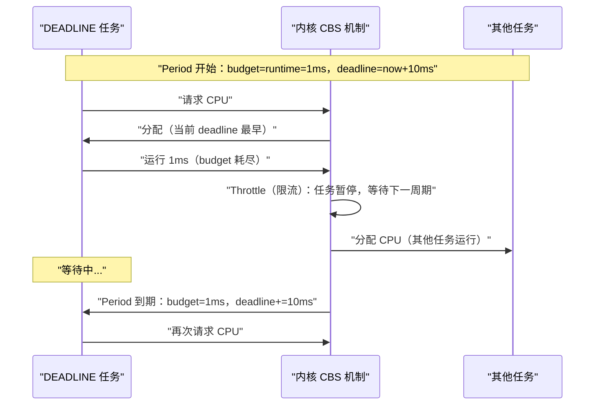

**摘要：**

CFS 解决了普通进程的公平调度问题，但它是一个"尽力而为"（best-effort）的调度器——它能保证比例公平，但无法保证进程在指定时间内必然得到执行。对于需要**确定性延迟**的场景（音频处理不能有杂音、机械臂控制必须精确到毫秒、网络包处理有严格 SLA），CFS 是不够的。Linux 为此提供了实时调度类：`SCHED_FIFO`、`SCHED_RR` 和 `SCHED_DEADLINE`。三者代表了不同的实时保证层次：`SCHED_FIFO` 和 `SCHED_RR` 提供固定优先级调度（优先级高的进程始终优先于低优先级进程），`SCHED_DEADLINE` 则基于 EDF（Earliest Deadline First）算法提供更精确的截止期保证。本文从"为什么 CFS 不够"出发，完整解析三种实时调度策略的工作原理、适用场景与配置方法，以及调度类优先级层次如何在多类调度策略共存时决定运行顺序。同时深入分析实时调度中最经典的问题——优先级反转，以及 Linux 的解决方案优先级继承（Priority Inheritance）。

---

## 第 1 章 为什么 CFS 不够：实时需求的本质

### 1.1 确定性延迟：实时系统的核心诉求

CFS 的目标是**长期公平**——在足够长的时间窗口内，每个进程得到与其权重成正比的 CPU 时间。但"长期公平"和"确定性延迟"是两个完全不同的需求：

**普通调度（CFS）的保证**：在 6ms 的调度延迟窗口内，你一定会得到至少一次运行机会。但具体是在这 6ms 的哪个点，无法精确保证。

**实时调度的保证**：优先级为 99 的实时进程，只要它可运行，就一定优先于所有普通进程（CFS）运行，不管那些普通进程等了多久。

**实时系统的两类**：

- **软实时（Soft Real-Time）**：有延迟目标，偶尔违反可以容忍（如音频/视频播放——偶尔卡顿可接受，但要尽量避免）
- **硬实时（Hard Real-Time）**：有严格截止期，任何违反都是系统失败（如汽车 ABS 制动控制、航空自动驾驶）

Linux 的实时调度支持软实时和近似硬实时（`SCHED_DEADLINE`），但 Linux 本身不是 RTOS（实时操作系统）——内核中仍有不可抢占的临界区，完全的硬实时需要 PREEMPT_RT 补丁或 Xenomai 等方案。

### 1.2 调度类的优先级层次

Linux 内核将所有调度策略组织为多个**调度类（Scheduling Class）**，按严格的优先级顺序排列：

```
调度类优先级（从高到低）：

1. stop_sched_class     ← 最高优先级，用于停止 CPU（CPU 热插拔、迁移）
2. dl_sched_class       ← SCHED_DEADLINE（基于截止期的实时）
3. rt_sched_class       ← SCHED_FIFO / SCHED_RR（固定优先级实时）
4. fair_sched_class     ← SCHED_NORMAL / SCHED_BATCH（CFS 普通调度）
5. idle_sched_class     ← SCHED_IDLE（仅在 CPU 完全空闲时运行）
```

`pick_next_task()` 的主调度逻辑：

```c
/* kernel/sched/core.c：选择下一个运行的进程（简化）*/
static struct task_struct *pick_next_task(struct rq *rq, ...) {
    /* 按优先级顺序遍历调度类 */
    /* 只要更高优先级的调度类有可运行进程，就不会轮到低优先级类 */
    for_each_class(class) {
        struct task_struct *p = class->pick_next_task(rq, ...);
        if (p)
            return p;
    }
    /* 不可达：至少 idle 类总有进程 */
    BUG();
}
```

**关键含义**：只要有任何一个 `SCHED_FIFO` 或 `SCHED_RR` 进程处于可运行状态，所有 CFS 进程都不会被调度——哪怕 CFS 进程已经等待了很长时间。这是实时调度的"特权"，也是需要谨慎使用实时策略的原因。

---

## 第 2 章 SCHED_FIFO：固定优先级的先进先出

### 2.1 SCHED_FIFO 的语义

`SCHED_FIFO`（First In First Out）是最简单的实时调度策略，其规则极为直接：

1. 每个进程有一个**实时优先级**（`rt_priority`），取值范围 1-99（99 最高）
2. 调度器总是运行优先级最高的可运行进程
3. 同一优先级的进程按 FIFO 顺序（先就绪先运行）
4. **`SCHED_FIFO` 进程没有时间片**——一旦运行，就一直运行，直到：
   - 进程主动让出 CPU（调用 `sched_yield()`、阻塞 IO、睡眠）
   - 更高优先级的进程变为可运行（被抢占）
   - 进程退出

```c
/* 检查 SCHED_FIFO 的不可抢占性 */
/* rt_sched_class 的 check_preempt_curr 回调 */
static void check_preempt_curr_rt(struct rq *rq, struct task_struct *p, int flags) {
    /* 只有新进程的优先级 > 当前进程时才抢占 */
    /* 同优先级不抢占（FIFO 语义：等待当前进程主动让出）*/
    if (p->prio < rq->curr->prio) {  /* 内核 prio 越小优先级越高 */
        resched_curr(rq);            /* 标记需要重新调度 */
        return;
    }
    /* 同优先级：不抢占，保持 FIFO 顺序 */
}
```

### 2.2 SCHED_FIFO 的危险性

`SCHED_FIFO` 进程没有时间片，且优先级高于所有普通进程——一个 bug（如死循环）可以完全锁死整个系统：

```c
/* 危险示例：SCHED_FIFO 进程死循环，系统完全无响应 */
#include <sched.h>

int main() {
    struct sched_param param = { .sched_priority = 99 };
    sched_setscheduler(0, SCHED_FIFO, &param);  /* 设置为最高实时优先级 */

    while (1) {
        /* 什么也不做，CPU 100% 占用 */
        /* 此时系统几乎无响应：没有任何普通进程能运行 */
        /* 甚至 Ctrl+C、Ctrl+Alt+Del 都可能无效！*/
    }
}
```

**Linux 的保护机制：`sched_rt_runtime_us`**

```bash
# 实时进程的 CPU 时间限制
cat /proc/sys/kernel/sched_rt_period_us
# 1000000（1 秒周期）

cat /proc/sys/kernel/sched_rt_runtime_us
# 950000（每秒最多 950ms 给实时进程，保留 50ms 给普通进程）

# 默认设置：实时进程最多占用 95% CPU
# 这确保了即使实时进程出 bug，系统还有 5% 的 CPU 余量供 SRE 干预

# 若要允许实时进程无限制使用 CPU（高风险，仅用于严格实时系统）：
# echo -1 > /proc/sys/kernel/sched_rt_runtime_us
```

> [!warning] 生产避坑：实时优先级的权限要求
> 设置 `SCHED_FIFO` 或 `SCHED_RR` 需要 `CAP_SYS_NICE` capability 或 root 权限。普通用户无法创建实时进程，这是防止恶意或错误程序锁死系统的安全屏障。在容器环境（Docker、Kubernetes）中，默认情况下容器内进程无法设置实时调度策略，需要额外授权（`--cap-add SYS_NICE` 或 securityContext 配置）。

### 2.3 SCHED_FIFO 的典型应用场景

```bash
# 为进程设置 SCHED_FIFO 调度策略（需要 root 或 CAP_SYS_NICE）
chrt -f 50 ./realtime_program       # 优先级 50 启动
chrt -f -p 50 <pid>                 # 对已运行进程设置

# 查看进程的调度策略
chrt -p <pid>
# pid 1234's current scheduling policy: SCHED_FIFO
# pid 1234's current scheduling priority: 50

# 音频服务器（如 PulseAudio/JACK）使用 SCHED_FIFO 防止音频卡顿
# JACK 音频服务器：rt_priority=70，处理音频回调时绝对不能被普通进程抢占
```

---

## 第 3 章 SCHED_RR：带时间片的实时轮转

### 3.1 SCHED_RR 与 SCHED_FIFO 的对比

`SCHED_RR`（Round Robin）是 `SCHED_FIFO` 的变体，唯一区别是：**同优先级的 `SCHED_RR` 进程之间按时间片轮转**。

| 特性 | `SCHED_FIFO` | `SCHED_RR` |
|-----|-------------|-----------|
| 时间片 | 无（运行直到主动让出或被高优先级抢占）| 有（默认 100ms）|
| 同优先级调度 | FIFO 顺序（等待当前进程让出）| 时间片用完则轮转到下一个 |
| 高优先级抢占 | ✅ 更高优先级立即抢占 | ✅ 更高优先级立即抢占 |
| 适用场景 | 单个实时任务，需要独占 CPU | 多个同优先级实时任务，需要公平分享 |

`SCHED_RR` 的时间片（Quantum）：

```bash
# 查看 SCHED_RR 的时间片长度
cat /proc/sys/kernel/sched_rr_timeslice_ms
# 100（100ms，默认值）

# 验证：用 C 程序获取时间片
#include <time.h>
#include <sched.h>
struct timespec tp;
sched_rr_get_interval(0, &tp);   /* 0 = 当前进程 */
printf("RR timeslice: %ld ms\n", tp.tv_nsec / 1000000);
```

### 3.2 SCHED_RR 的内核实现

同优先级的 `SCHED_RR` 进程在一个循环链表中轮转。时钟中断时，内核检查当前 `SCHED_RR` 进程的时间片是否耗尽：

```c
/* rt_sched_class 的 task_tick 回调（时钟中断时调用）*/
static void task_tick_rt(struct rq *rq, struct task_struct *p, int queued) {
    struct sched_rt_entity *rt_se = &p->rt;

    /* SCHED_FIFO：没有时间片概念，直接返回 */
    if (p->policy != SCHED_RR)
        return;

    /* SCHED_RR：减少剩余时间片 */
    if (--p->rt.time_slice)
        return;  /* 时间片未耗尽，继续运行 */

    /* 时间片耗尽：重置时间片，将进程移到同优先级队列的末尾 */
    p->rt.time_slice = sched_rr_timeslice;

    /* 若同优先级队列有其他进程，触发调度（轮转）*/
    if (rt_se->run_list.prev != rt_se->run_list.next) {
        /* 将当前进程移到队列末尾 */
        requeue_task_rt(rq, p, 0);
        resched_curr(rq);  /* 标记需要重新调度 */
    }
}
```

### 3.3 实时进程的优先级队列

RT 调度类维护 100 个优先级队列（对应 `rt_priority` 1-99，加上一个特殊的 0 优先级），用位图快速找到最高优先级的可运行进程：

```c
struct rt_rq {
    struct rt_prio_array active;  /* 优先级队列 */
    /* ... */
};

struct rt_prio_array {
    DECLARE_BITMAP(bitmap, MAX_RT_PRIO + 1);  /* 100 位，标记哪些优先级有进程 */
    struct list_head queue[MAX_RT_PRIO];       /* 每个优先级一个双向链表 */
};
```

选择下一个进程的逻辑：

```c
static struct sched_rt_entity *pick_next_rt_entity(struct rt_rq *rt_rq) {
    struct rt_prio_array *array = &rt_rq->active;

    /* 用 __ffs（Find First bit Set）找到最高优先级（O(1) 操作，用 CPU 指令实现）*/
    int idx = sched_find_first_bit(array->bitmap);

    /* 从该优先级的链表头取第一个进程（FIFO 或 RR 的当前轮次进程）*/
    struct list_head *queue = array->queue + idx;
    return list_entry(queue->next, struct sched_rt_entity, run_list);
}
```

---

## 第 4 章 SCHED_DEADLINE：基于截止期的精确实时保证

### 4.1 固定优先级调度的根本局限

`SCHED_FIFO` 和 `SCHED_RR` 使用**固定优先级**——用户必须手动为每个实时任务分配一个优先级（1-99），系统不理解任务的时间约束。

这带来两个问题：

**问题一：优先级分配困难**。如果有 20 个实时任务，用户需要手动决定它们的优先级顺序，这在任务之间有复杂依赖关系时极为困难，而且当任务的时间需求变化时，优先级也需要手动调整。

**问题二：响应时间无法精确控制**。假设有两个任务：
- 任务 A：每 10ms 需要运行 1ms（CPU 利用率 10%）
- 任务 B：每 50ms 需要运行 4ms（CPU 利用率 8%）

即使两者 CPU 利用率总和只有 18%，用固定优先级调度时，优先级低的任务的最坏响应时间仍然难以精确计算和保证。

### 4.2 EDF 算法：截止期最早的任务优先

**EDF（Earliest Deadline First，最早截止期优先）** 是实时调度理论中的经典最优算法——在单处理器上，只要任务集合可调度（CPU 利用率 ≤ 100%），EDF 就能保证所有任务都在截止期内完成。

EDF 的规则极为简单：**总是运行截止期最近（Deadline 最早）的任务**。

Linux 3.14 引入的 `SCHED_DEADLINE` 调度策略正是基于 EDF（的扩展版本 CBS：Constant Bandwidth Server），为每个任务提供三个参数：

```
任务的带宽参数（通过 sched_setattr() 设置）：
- Runtime（运行时间）：每个周期内需要多少 CPU 时间（纳秒）
- Period（周期）：任务的执行周期（纳秒）
- Deadline（截止期）：在周期内必须完成的相对截止期（纳秒，≤ Period）

CPU 利用率 = Runtime / Period

示例：
  音频处理任务：Runtime=1ms, Period=10ms, Deadline=10ms
  → 每 10ms 需要 1ms CPU，CPU 利用率 10%

  视频编码任务：Runtime=4ms, Period=50ms, Deadline=50ms
  → 每 50ms 需要 4ms CPU，CPU 利用率 8%
```

### 4.3 SCHED_DEADLINE 的 CBS 机制

CBS（Constant Bandwidth Server）是 EDF 的扩展，解决了原始 EDF 中过度使用 CPU 会影响其他任务的问题：

**每个 SCHED_DEADLINE 进程维护一个"预算"（budget）**：

```
初始状态：budget = runtime（满预算）
         deadline = now + deadline（初始截止期）

进程运行时：budget 随时间消耗
          若 budget 耗尽：
            - 进程被挂起（throttled）
            - 等到下一个周期开始，重新补充 budget
            - 重新设置 deadline = old_deadline + period
```

**CBS 保证**：即使进程在一个周期内用完了全部 runtime，它也不会"借"下一周期的预算——这严格限制了每个任务的 CPU 消耗上界，防止一个任务影响其他任务的调度。



### 4.4 SCHED_DEADLINE 的配置与使用

```c
/* 用 sched_setattr() 配置 SCHED_DEADLINE（需要 CAP_SYS_NICE）*/
#include <linux/sched.h>

struct sched_attr {
    __u32 size;
    __u32 sched_policy;    /* SCHED_DEADLINE */
    __u64 sched_flags;
    __s32 sched_nice;
    __u32 sched_priority;

    /* SCHED_DEADLINE 专用字段（单位：纳秒）*/
    __u64 sched_runtime;   /* 每个周期的运行时间预算 */
    __u64 sched_deadline;  /* 截止期（相对于周期开始）*/
    __u64 sched_period;    /* 任务周期 */
};

/* 示例：设置一个每 10ms 需要 1ms CPU 的实时任务 */
struct sched_attr attr = {
    .size           = sizeof(struct sched_attr),
    .sched_policy   = SCHED_DEADLINE,
    .sched_runtime  = 1000000,    /* 1ms = 1,000,000 ns */
    .sched_deadline = 10000000,   /* 10ms */
    .sched_period   = 10000000,   /* 10ms */
};

syscall(SYS_sched_setattr, 0, &attr, 0);  /* 0 = 当前进程 */
```

```bash
# 命令行工具（需要支持 DEADLINE 的工具，如 rt-utils）
# 验证 SCHED_DEADLINE 进程
chrt -p <pid>
# pid 1234's current scheduling policy: SCHED_DEADLINE
# pid 1234's current scheduling priority: 0
# pid 1234's current runtime/deadline/period: 1000000/10000000/10000000
```

> [!info] 核心概念：SCHED_DEADLINE 的可调度性检验
> Linux 在 `sched_setattr()` 时会进行**准入控制（Admission Control）**：检查系统中所有 SCHED_DEADLINE 任务的总 CPU 利用率之和是否超过系统 CPU 总量（考虑 `sched_rt_runtime_us` 的限制）。若加入新任务后总利用率超限，`sched_setattr()` 返回 `EBUSY`，拒绝设置。这保证了已经被接受的任务的截止期保证不被破坏。

---

## 第 5 章 优先级反转与优先级继承

### 5.1 优先级反转：实时系统的经典陷阱

优先级反转（Priority Inversion）是固定优先级实时调度中最危险的问题，一个真实的历史案例使它广为人知——1997 年火星探路者号（Mars Pathfinder）的计算机系统就因为优先级反转而频繁复位，险些酿成任务失败。

**优先级反转的产生场景**：

假设有三个进程，优先级从高到低：H（高）、M（中）、L（低），H 和 L 共享一个互斥锁：

```
时间轴：
t1: L 获取互斥锁，开始临界区操作
t2: H 变为可运行，抢占 L
t3: H 尝试获取互斥锁，锁被 L 持有，H 阻塞
t4: M 变为可运行，因为 M 优先级 > L，M 抢占 L
t5: M 持续运行...
t6: M 运行结束，L 恢复运行，完成临界区，释放锁
t7: H 终于获得锁，继续运行

问题：H 被迫等待 L 的临界区，而 L 又被 M 抢占
→ H 的延迟 = L 临界区时间 + M 的运行时间
→ 高优先级任务被中优先级任务"间接"阻塞，这就是优先级反转
```

在实时系统中，这可能导致高优先级任务错过截止期——这是灾难性的。

### 5.2 优先级继承：Linux 的解决方案

**优先级继承（Priority Inheritance，PI）** 是解决优先级反转的主流方案：当高优先级进程 H 因为等待低优先级进程 L 持有的锁而阻塞时，**临时将 L 的优先级提升到 H 的优先级**，使 L 不会被中优先级进程 M 抢占，从而尽快完成临界区并释放锁。

```
优先级继承后的时间轴：
t1: L 获取互斥锁
t2: H 变为可运行，抢占 L
t3: H 尝试获取互斥锁，锁被 L 持有
    → 内核将 L 的优先级临时提升到 H 的级别
    → H 阻塞
t4: L（现在有 H 的优先级）继续运行临界区
    → M 无法抢占 L（L 优先级 = H > M）
t5: L 完成临界区，释放锁
    → L 的优先级恢复到原来的低优先级
t6: H 获得锁，继续运行
    → H 的延迟只有 L 临界区时间，M 不再影响 H
```

Linux 内核提供了支持优先级继承的互斥锁类型：

```c
/* 内核中的 PI mutex（rt_mutex）*/
#include <linux/rtmutex.h>

DEFINE_RT_MUTEX(my_rt_mutex);  /* 声明一个支持 PI 的互斥锁 */

rt_mutex_lock(&my_rt_mutex);   /* 加锁（若被阻塞，自动进行优先级继承）*/
/* 临界区 */
rt_mutex_unlock(&my_rt_mutex); /* 解锁（恢复被继承进程的原始优先级）*/
```

**用户态的 PI mutex（`PTHREAD_MUTEX_ROBUST` + `PTHREAD_PRIO_INHERIT`）**：

```c
pthread_mutexattr_t attr;
pthread_mutexattr_init(&attr);
pthread_mutexattr_setprotocol(&attr, PTHREAD_PRIO_INHERIT);  /* 启用优先级继承 */
pthread_mutex_init(&my_mutex, &attr);

/* 使用与普通 pthread mutex 完全相同 */
pthread_mutex_lock(&my_mutex);
/* 临界区 */
pthread_mutex_unlock(&my_mutex);
```

> [!note] 设计哲学：优先级继承 vs 优先级上限
> 除优先级继承外，另一种方案是**优先级上限协议（Priority Ceiling Protocol，PCP）**：为每个互斥锁预先设置一个"天花板优先级"（等于所有可能持有该锁的任务中的最高优先级）。任何进程获取锁时，其优先级立即提升到天花板优先级，释放锁时恢复。PCP 能完全避免死锁，但要求提前知道所有任务的优先级关系。Linux 通过 `pthread_mutexattr_setprioceiling()` 支持 PCP，但在实践中优先级继承（PI）更为常用，因为它无需提前规划，可动态适应。

---

## 第 6 章 调度策略全景：SCHED_NORMAL、SCHED_BATCH、SCHED_IDLE

### 6.1 完整的调度策略列表

Linux 的全部调度策略（通过 `sched_setscheduler()` 或 `chrt` 设置）：

| 调度策略 | 调度类 | 优先级范围 | 时间片 | 特性 |
|---------|-------|----------|-------|------|
| `SCHED_DEADLINE` | dl_sched_class | 不适用 | runtime | 基于 EDF，最高实时保证 |
| `SCHED_FIFO` | rt_sched_class | 1-99 | 无 | 固定优先级，无时间片 |
| `SCHED_RR` | rt_sched_class | 1-99 | 100ms | 固定优先级，同级轮转 |
| `SCHED_NORMAL` | fair_sched_class | nice: -20~+19 | 动态 | CFS 公平调度，默认策略 |
| `SCHED_BATCH` | fair_sched_class | nice: -20~+19 | 动态 | CFS 变体，针对批处理优化 |
| `SCHED_IDLE` | idle_sched_class | 不适用 | 动态 | 仅在 CPU 完全空闲时运行 |

### 6.2 SCHED_BATCH：批处理优化

`SCHED_BATCH` 是 CFS 的一个变体，专为批处理任务设计——如编译、备份、数据处理等不需要交互响应、只追求吞吐量的任务。

与 `SCHED_NORMAL` 的区别：
1. **不给唤醒奖励**：`SCHED_BATCH` 进程唤醒时，不会像 `SCHED_NORMAL` 进程那样获得 vruntime 的奖励（减少），因此不会抢占当前正在运行的交互型进程
2. **调度粒度更大**：允许进程运行更长时间才被抢占，减少上下文切换频率，提高 CPU cache 效率

```bash
# 将编译任务设置为 SCHED_BATCH
chrt -b 0 make -j8   # -b = SCHED_BATCH，优先级参数固定为 0
# 或
chrt -b -p 0 $(pgrep make)
```

### 6.3 SCHED_IDLE：最低优先级

`SCHED_IDLE` 的语义是：**只有 CPU 没有任何其他可运行进程时才运行**。与 `nice=+19` 不同（nice=+19 的进程在系统负载低时仍会运行，只是 CPU 份额很少），`SCHED_IDLE` 进程在系统有任何普通负载时都不会运行。

> [!warning] 注意区分 SCHED_IDLE 与 idle 进程
> Linux 内核中的 idle 进程（`swapper/0`，PID=0 的内核线程，每 CPU 一个）是使用 `idle_sched_class` 的特殊进程，当没有任何其他进程可运行时运行，执行 `hlt` 指令让 CPU 进入低功耗状态。这与用户态的 `SCHED_IDLE` 策略不同——`SCHED_IDLE` 是用 fair_sched_class 实现的，通过给予极低的权重（weight=3，远低于 nice=+19 的 15）来实现"近乎空闲"的效果。实际上在 Linux 5.x+ 中，`SCHED_IDLE` 改为使用 idle_sched_class 实现，比 CFS 的低权重更彻底地压低优先级。

---

## 第 7 章 实时调度的生产实践

### 7.1 实时进程的 CPU 隔离

在生产实时系统中，通常将特定 CPU 完全隔离出来，专门用于实时任务，防止任何普通进程的干扰：

```bash
# 在内核启动参数（/boot/grub/grub.cfg 或 /etc/default/grub）中添加：
# isolcpus=2,3    ← 将 CPU 2 和 CPU 3 从普通调度中隔离出来
# rcu_nocbs=2,3  ← 防止 RCU 回调在这些 CPU 上运行
# nohz_full=2,3  ← 在这些 CPU 上关闭周期性时钟中断（tickless）

# 启动后，被隔离的 CPU 不会有任何普通进程迁移进来
# 验证
cat /sys/devices/system/cpu/isolated
# 2-3   ← 确认 CPU 2-3 已被隔离

# 将实时任务绑定到隔离的 CPU
taskset -c 2 ./realtime_program &
chrt -f -p 90 $(pgrep realtime_program)  # 设置 SCHED_FIFO 优先级 90
```

### 7.2 PREEMPT_RT：迈向真正的硬实时

标准 Linux 内核中有一些不可抢占的临界区（持有自旋锁时、处于中断上下文时），这些区间会造成不确定的调度延迟。

**PREEMPT_RT 补丁**（现已部分合并到主线内核）将这些临界区也变为可抢占，将中断处理线程化，使得 Linux 的最坏调度延迟从数毫秒降低到数十微秒：

```bash
# 检查内核是否带有 PREEMPT_RT
uname -r
# 5.15.0-1-rt-amd64   ← 带 -rt 的内核版本包含 PREEMPT_RT 补丁

# 查看内核抢占配置
cat /boot/config-$(uname -r) | grep PREEMPT
# CONFIG_PREEMPT_RT=y           ← 完全抢占（硬实时内核）
# CONFIG_PREEMPT=y              ← 普通抢占（标准服务器内核）
# CONFIG_PREEMPT_VOLUNTARY=y    ← 自愿抢占（早期桌面内核）

# 测量系统的调度延迟
cyclictest -t1 -p 80 -n -i 10000 -l 10000
# 输出示例：
# T:  0 (12345) P:80 I:10000 C:10000 Min:   5 Act:   8 Max:  52
# Min=5us, Max=52us（PREEMPT_RT 内核的典型值）
# 对比标准内核：Max 可能达到 数ms 甚至更高
```

### 7.3 实时调度问题排查

```bash
# 查看系统中所有实时进程
ps -eo pid,policy,rtprio,ni,comm | awk '$2!="TS" && $2!="-"'
# 或
chrt -a 2>/dev/null | grep -v "SCHED_OTHER"

# 监控实时进程的调度延迟
trace-cmd record -e sched_wakeup -e sched_switch -p function ./realtime_program
trace-cmd report | head -50

# 用 perf 分析调度延迟
perf sched record ./realtime_program
perf sched latency
# 显示每个任务的最大调度延迟

# 检查实时进程是否被 throttle（预算耗尽）
cat /proc/sched_debug | grep -A5 "dl_rq\|rt_rq"
# throttled：进程当前处于限流状态
# throttle_count：历史被限流次数（越多说明预算设置不够）
```

---

## 小结

Linux 调度策略体系形成了一个完整的优先级层次，从最高实时保证到最低空闲：

**三种实时调度策略的对比**：

| 维度 | `SCHED_FIFO` | `SCHED_RR` | `SCHED_DEADLINE` |
|-----|-------------|-----------|----------------|
| 优先级机制 | 固定（1-99）| 固定（1-99）| 基于截止期（动态）|
| 时间片 | 无 | 有（默认100ms）| 预算（runtime）|
| 调度依据 | 最高优先级 | 最高优先级 + 轮转 | 最早截止期（EDF）|
| CPU 使用保证 | 无上限（受 rt_runtime_us 全局限制）| 同左 | 严格按 runtime/period |
| 适用场景 | 单一关键任务 | 多个同级实时任务 | 周期性实时任务 |
| 配置复杂度 | 低 | 低 | 中（需设置3个参数）|

**调度类优先级链**（从高到低）：`stop` > `dl`（DEADLINE）> `rt`（FIFO/RR）> `fair`（NORMAL/BATCH）> `idle`

**优先级反转的应对**：使用支持优先级继承的 `rt_mutex`（内核）或 `PTHREAD_PRIO_INHERIT` 属性的 `pthread_mutex`（用户态）

下一篇 [[10 进程间通信全景——管道、信号、共享内存与 Socket 的内核实现]] 将以 IPC 机制的全面梳理作为本专栏的收官：管道的内核缓冲区、信号的投递与处理流程、System V 共享内存与 POSIX 共享内存的对比，以及 Unix Domain Socket 为何在本机通信中优于 TCP Socket。
