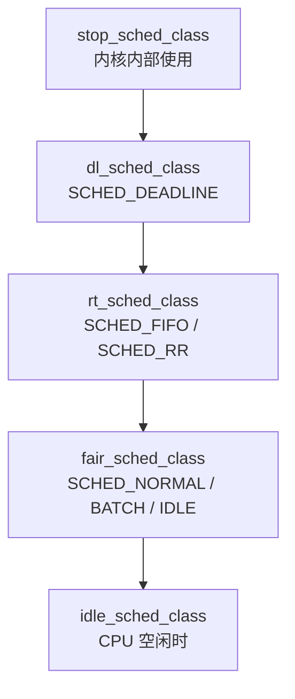
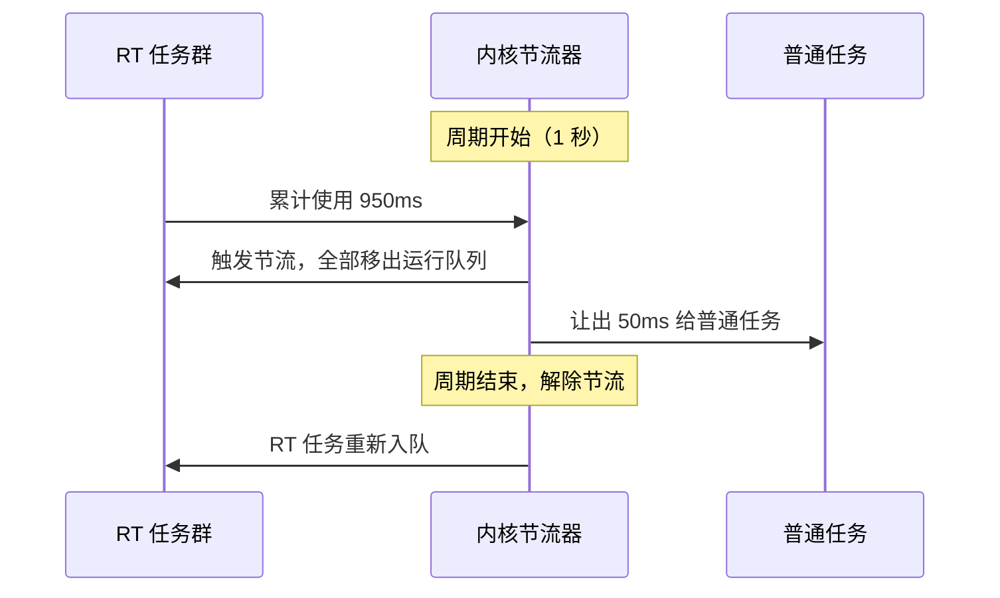
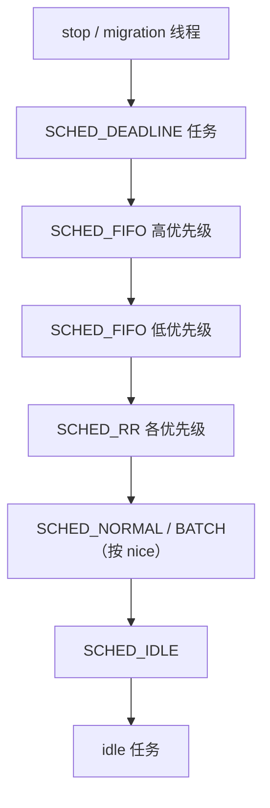

# 09 实时调度与调度策略全景——SCHED_FIFO、SCHED_RR 与 SCHED_DEADLINE

**摘要：**

"实时"这个词在工程语境里被误用得极其频繁：它指的不是"快"，而是"在确定的时间前完成"。一个 10 微秒内必定完成的任务是实时的，一个平均 1 毫秒但偶尔需要 100 毫秒的任务不是。这个区分决定了实时调度器与 CFS 的根本差别——CFS 追求的是长期的比例公平，实时调度类追求的是单次响应的确定性。本文从调度类的层次结构讲起，说明 Linux 的五种调度类（stop、deadline、rt、fair、idle）如何按严格优先级排列、`pick_next_task()` 如何从高到低挑选，以及为什么最高优先级的 `stop_sched_class` 在内核里始终存在。随后逐项拆解三种实时策略：`SCHED_FIFO` 的"不主动让出就一直运行"、`SCHED_RR` 的时间片轮转、以及它们的优先级范围与相互影响。核心部分讨论三个在实时系统里绕不开的机制：RT 节流（`sched_rt_runtime_us`）如何防止实时任务饿死整个系统、优先级反转为什么会让高优先级任务被低优先级任务阻塞、以及优先级继承（PI mutex）如何解决它——火星探路者号在 1997 年因这个问题反复重启的案例，是这段历史里最著名的注脚。接着引入 `SCHED_DEADLINE`（3.14，2014），讲清它的三个参数（runtime/deadline/period）、EDF 与 CBS 的关系、以及准入控制这一让"声明即保证"得以成立的设计。最后给出实践边界：实时调度不是性能优化、一个卡住的 RT 任务会让系统完全失去响应、容器里的 RT 权限为什么被默认收紧。全文回答两个问题：Linux 提供了哪些调度策略、它们各自在什么条件下成立。

---

## 第 1 章 实时不等于快

### 1.1 两种实时性

工程上把实时系统分成两类，区分标准是"错过截止时间的后果"：

| 类型 | 定义 | 例子 |
| :--- | :--- | :--- |
| 硬实时（Hard Real-Time） | 错过截止时间即为系统失败 | 飞控、安全气囊触发、工业机器人 |
| 软实时（Soft Real-Time） | 错过截止时间导致质量下降 | 音视频播放、交互式界面、高频交易 |

通用操作系统（包括 Linux）的设计目标是软实时。它们提供的是"**最坏情况下的延迟有上界**"这一能力，而这个上界受制于一个前提：**内核路径上不能有不可控的长耗时操作**。

### 1.2 延迟与抖动

衡量实时性有两个指标，它们的含义不同：

- **延迟（Latency）**：从事件发生到任务开始处理的时间；
- **抖动（Jitter）**：延迟的波动幅度。

一个平均延迟 100 微秒、抖动 20 微秒的系统，其最坏延迟约 120 微秒；而一个平均延迟 50 微秒、抖动 500 微秒的系统，最坏延迟是 550 微秒。**对实时系统而言，后者远比前者糟糕**——因为它无法给出一个有意义的保证。

这个区别解释了为什么实时调度不使用"平均性能"作为目标。CFS 的公平性是一个长期的统计性质，它在任意一段短时间窗口内都不保证什么；而实时调度必须对每一次调度决策负责。

### 1.3 Linux 的实时能力边界

主线 Linux 提供的是软实时能力，其延迟上界受几个因素限制：

| 因素 | 影响 |
| :--- | :--- |
| 不可抢占的内核代码段 | 某些内核路径运行期间无法切换 |
| 中断处理 | 硬件中断可能在任何时刻打断任何代码 |
| 关中断的临界区 | 期间中断被延迟处理 |
| 缓存与内存的抖动 | 缺页、TLB miss 引入不可预测的延迟 |

主线内核的调度延迟通常在几十微秒量级，最坏情况在毫秒级。要把它压到几十微秒以内，需要 `PREEMPT_RT`——这套补丁把自旋锁改为可睡眠的互斥锁、把中断处理搬到内核线程、并把大部分不可抢占区改造成可抢占的。它在 6.12 被正式合并进内核主线（第 06 篇讨论过这次合并的意义）。

需要强调的是：**即使在 `PREEMPT_RT` 内核上，Linux 也只是"延迟更小、抖动更可控"的软实时系统**，它与经过形式化验证的硬实时系统（如 VxWorks、QNX 在特定配置下）在设计目标上并不相同。

### 1.4 延迟由哪几段构成

一个"从事件发生到处理完成"的端到端延迟，可以拆成四段，它们各自有不同的优化手段：

| 阶段 | 含义 | 主要影响因素 |
| :--- | :--- | :--- |
| 硬件到中断处理 | 事件发生到 CPU 开始执行中断处理函数 | 中断控制器、关中断的临界区 |
| 中断到唤醒任务 | 中断处理完成到目标任务被放入运行队列 | 中断下半部、软中断处理 |
| 唤醒到实际执行 | 任务入队到真正获得 CPU | **调度延迟**（本章的主题） |
| 执行本身 | 任务开始运行到处理完成 | 算法、缓存、内存访问 |

这个分解的价值在于**定位延迟问题时能逐段排除**。`cyclictest` 测量的其实只是第三段——它通过一个周期性睡眠与唤醒的线程，测量"被唤醒到实际运行"的时间差。如果一个系统的端到端延迟不达标，而 `cyclictest` 的结果很漂亮，那么问题就不在调度器上，而要往前后两段去找：可能是中断被关得太久（第一段），也可能是处理逻辑本身太慢（第四段）。

把调度延迟与其它三段分开，也解释了为什么"提高实时优先级"往往是无效的优化。如果瓶颈在第四段（处理逻辑耗时过长），把任务提到 RT 99 也不会让它跑得更快；如果瓶颈在第一段（中断被长时间屏蔽），RT 优先级同样无能为力。**实时调度只负责第三段，把它当成万能药是方向性的错误。**

---

## 第 2 章 调度类层次

### 2.1 五种调度类

Linux 把调度策略组织成五个调度类，它们之间是严格的优先级关系：



| 调度类 | 对应策略 | 使用者 | 优先级来源 |
| :--- | :--- | :--- | :--- |
| `stop_sched_class` | 无用户可见策略 | 内核（CPU 热插拔、migration 线程） | 最高，不可配置 |
| `dl_sched_class` | `SCHED_DEADLINE` | 用户（需特权） | `dl_deadline` 等三个参数 |
| `rt_sched_class` | `SCHED_FIFO`、`SCHED_RR` | 用户（需特权） | RT 优先级 1-99 |
| `fair_sched_class` | `SCHED_NORMAL`、`SCHED_BATCH`、`SCHED_IDLE` | 默认 | nice 值 |
| `idle_sched_class` | 无 | 内核 | 最低 |

**这个层次的关键性质是"严格优先"而不是"加权混合"**：只要 `dl_sched_class` 上有可运行任务，`rt_sched_class` 就完全拿不到 CPU；只要 RT 队列非空，CFS 的任务就一直等待。第 08 篇结尾提到的"一个持续可运行的实时任务会饿死所有普通任务"，说的就是这个机制。

### 2.2 `stop_sched_class` 为什么存在

这个调度类没有对应的用户可见策略，它服务于内核自身的需求。典型用途是 CPU 热插拔：当一个 CPU 需要下线时，必须有一个"绝对优先"的执行流把该 CPU 上的其它任务迁移走，并且这个迁移过程不能被任何用户任务打断——如果被打断，迁移逻辑可能在中途失去 CPU，留下不一致的状态。

`migration/N` 这类内核线程就运行在这个调度类上。它们在 `ps` 输出里以方括号形式出现（`[migration/0]`），平时处于睡眠状态，只在需要迁移任务或处理 CPU 热插拔时被唤醒。**它们的存在说明了一件事：即使是最高的用户可见优先级（RT 99），也不是系统里的最高优先级**——内核始终为自己保留了一条凌驾于所有用户任务之上的通道。

### 2.3 `pick_next_task` 的挑选过程

调度器每次要决定"下一步跑谁"时，会按调度类的层次从高到低询问：

```c
/* 简化的挑选逻辑 */
for_each_class(class) {
    p = class->pick_next_task(rq);   /* 按层次从高到低 */
    if (p)
        return p;
}
/* 全部为空时运行 idle 任务 */
return idle_task(rq);
```

这个循环的每一轮都可能返回 `NULL`（该类没有可运行任务），此时继续问下一个类。由于层次的顺序是编译期确定的，这个循环的实际迭代次数极少——绝大多数情况下，第一个非空的类是 `fair_sched_class`。

早期内核还维护了"每个调度类是否有可运行任务"的计数，用于在循环开始前快速跳过空类。这个优化后来因为 SMP 场景下的计数一致性成本被简化掉了——**又一次体现了"优化热路径要在正确的地方下手"这一原则**：计数的维护开销（每次入队出队都要原子更新一个共享变量）可能高于它省下的几次函数调用。

### 2.4 调度类的注册

每个调度类通过 `DEFINE_SCHED_CLASS()` 宏定义，其中包含一组函数指针：

| 回调 | 职责 |
| :--- | :--- |
| `enqueue_task` | 把任务加入运行队列 |
| `dequeue_task` | 从运行队列移除 |
| `pick_next_task` | 挑选下一个任务 |
| `task_tick` | 时钟中断时调用，用于时间片判定 |
| `check_preempt_curr` | 判断是否应抢占当前任务 |
| `set_curr_task` | 任务被调度为当前任务时调用 |
| `task_fork` / `task_dead` | 生命周期钩子 |

这套接口的存在让新增调度类不需要修改调度器主体——`SCHED_DEADLINE` 在 3.14 的引入就受益于此，它作为 `dl_sched_class` 插入了既有的层次结构中，而没有改动 CFS。**用一组函数指针把"可扩展点"抽象出来**，这是 Linux 内核里反复使用的设计手法，第 04 篇讨论的 `linux_binfmt` 是同一思路的另一处应用。

### 2.5 三个设置策略的接口

用户态设置调度策略有三个系统调用，它们出现的时间与能力各不相同：

| 系统调用 | 引入时间 | 能设置的参数 | 现状 |
| :--- | :--- | :--- | :--- |
| `sched_setscheduler` | 早期 | 策略 + RT 优先级 | 仍在使用 |
| `sched_setparam` | 早期 | 仅参数（不改策略） | 仍在使用 |
| `sched_setattr` | 3.14（2014） | 策略 + RT 优先级 + **DL 三个参数** | 推荐方式 |

`sched_setscheduler` 的问题在于它的参数是一个 `struct sched_param`，而这个结构体里只有一个 `sched_priority` 字段。对 RT 策略这够用，但对 `SCHED_DEADLINE` 就完全不够——它需要 runtime、deadline、period 三个参数。

`sched_setattr` 的解法与第 04 篇讨论的 `clone3` 如出一辙：**用一个带 `size` 字段的结构体传参**。

```c
struct sched_attr {
    __u32 size;                 /* 结构体大小，用于版本兼容 */
    __u32 sched_policy;
    __u64 sched_flags;
    __s32 sched_nice;           /* CFS 的 nice 值 */
    __u32 sched_priority;       /* RT 优先级 */
    __u64 sched_runtime;        /* DL 参数 */
    __u64 sched_deadline;
    __u64 sched_period;
    /* 后续版本追加的字段继续往后排 */
};
```

`size` 字段是这套设计的核心：内核根据调用者传入的 `size` 判断它认识哪些字段，从而在追加新字段时保持向前兼容。**同一个模式在内核里已经出现了三次**（`clone3`、`sched_setattr`、`openat2`），它们都出现在"原有接口的参数位已经用尽、但又不得不向后兼容"的时刻。把这三次放在一起看，可以得到一条接口设计的经验：**当一个接口的参数需要超过三四个时，就应当考虑用结构体承载，并预留版本字段**——把这个判断提前，能省下未来一次不可逆的接口分裂。

---

## 第 3 章 `SCHED_FIFO` 与 `SCHED_RR`

### 3.1 优先级范围

RT 调度类使用 1 到 99 的优先级（数值越大优先级越高），这个范围与 nice 值是**两套独立的体系**：

| 体系 | 范围 | 方向 | 谁在使用 |
| :--- | :--- | :--- | :--- |
| nice | -20 ~ 19 | 越小越优先 | CFS |
| RT 优先级 | 1 ~ 99 | 越大越优先 | RT 调度类 |

两套体系不共存：一个任务要么在 RT 类里（用 RT 优先级），要么在 CFS 类里（用 nice 值）。转换调度策略时，另一套属性的取值不会自动生效——把任务从 `SCHED_NORMAL` 改为 `SCHED_FIFO` 时，如果不同时指定 RT 优先级，它会拿到默认的优先级。

**"RT 优先级 1 的任务也会压过 nice -20 的任务"**，这句话是理解这套体系的关键。只要一个任务在 RT 类里，无论它的 RT 优先级多低，都在 CFS 的全部任务之上。

### 3.2 `SCHED_FIFO` 的运行规则

`SCHED_FIFO` 的规则可以用三句话概括：

1. **同优先级之间是先到先服务**：一个任务一旦开始运行，就会一直运行到它主动让出或被更高优先级的任务抢占。
2. **更高优先级的任务可随时抢占**：RT 内部的抢占是即时的。
3. **没有时间片的概念**：它不会因为"跑得久了"而被切换。

第三条是关键，也是 `SCHED_FIFO` 危险的地方。一个 `SCHED_FIFO` 的忙循环会让同优先级与更低优先级的任务永远得不到 CPU——包括 CFS 的全部任务。如果这个任务运行在单核机器上，系统会完全失去响应，因为它连 shell 都抢不到 CPU。

主动让出的方式有三种：调用会睡眠的系统调用（`read`、`sleep`、等待锁）、调用 `sched_yield()`、或者退出。**一个从不睡眠的 `SCHED_FIFO` 任务，在它退出之前就是系统的主宰**。

### 3.3 `SCHED_RR` 的时间片轮转

`SCHED_RR` 与 `SCHED_FIFO` 的唯一差别是引入了时间片：同一个优先级上的多个任务会按时间片轮转，时间片用完后被放到该优先级队列的队尾。

它的时间片长度由内核参数决定，调整方式是：

```bash
# 查看 RR 时间片的默认值（微秒）
cat /proc/sys/kernel/sched_rr_timeslice_ms
# 输出 100，即 100 毫秒
```

需要注意两点。第一，**时间片只在同优先级的任务之间起作用**：一个 `SCHED_RR` 的任务如果遇到了更高优先级的 RT 任务（无论 FIFO 还是 RR），照样会被立刻抢占。第二，100 毫秒这个默认值对实时任务来说相当长——一个需要每隔几毫秒响应的场景，如果依赖时间片轮转来保证公平，其延迟是无法接受的。

### 3.4 FIFO 与 RR 的混用

同一个优先级上可以同时存在 `SCHED_FIFO` 与 `SCHED_RR` 的任务。它们的调度关系是：**同优先级队列内，RR 任务之间轮转，而 FIFO 任务一旦运行就不会被同优先级的 RR 任务抢占**。

这个组合的实际效果往往出乎意料：一个 `SCHED_FIFO` 任务与若干 `SCHED_RR` 任务同优先级时，如果 FIFO 任务先运行，它会一直占住 CPU，RR 任务完全得不到执行机会。因此在同一个系统上混用这两种策略时，需要确保它们在不同优先级上，或者确保 FIFO 任务会主动让出。

### 3.5 设置方式

```bash
# 把进程设为 SCHED_FIFO，优先级 50
chrt -f 50 -p 12345

# 把进程设为 SCHED_RR，优先级 50
chrt -r 50 -p 12345

# 查看当前策略与优先级
chrt -p 12345
# pid 12345's current scheduling policy: SCHED_FIFO
# pid 12345's current scheduling priority: 50
```

这两个命令都需要 `CAP_SYS_NICE` 权限。默认情况下 `ulimit -r`（`RLIMIT_RTPRIO`）限制了普通用户能设置的最高 RT 优先级，通常是 0——意味着普通用户根本无法设置 RT 优先级。

### 3.6 `sched_yield` 的两种语义

第 3.2 节提到 RT 任务可以通过 `sched_yield()` 主动让出，这个调用在 RT 类与 CFS 类里的行为并不相同，值得单独说明。

**在 RT 类中**，`sched_yield()` 的语义是明确的：把当前任务移到**同优先级队列的队尾**。如果同优先级上没有其它任务，这个调用几乎没有任何效果——任务会立刻再次被选中。这与 `SCHED_FIFO` 的语义一致：它不改变优先级，只改变同一优先级内的排队顺序。

**在 CFS 类中**，`sched_yield()` 的效果要弱得多。CFS 的实现是把当前任务移到红黑树的靠右位置（`yield_task_fair`），同时给它一个小的 `vruntime` 惩罚。如果一个 CFS 任务调用 `sched_yield()` 时队列上没有其它可运行任务，那么它**什么都不会发生**——因为没有别人可以运行，内核只能继续运行它。

这个差异带来一个常见的反模式：**用 `sched_yield()` 实现"等一等"**。在单线程或低竞争的 CFS 环境下，这个调用几乎不产生任何等待效果，循环会以接近满速的节奏空转；而在 RT 环境下，如果同优先级没有其它任务，效果同样微弱。正确的等待方式永远是显式的同步原语（条件变量、futex、事件通知），而不是寄希望于调度器给自己让路。

`man 2 sched_yield` 里有一句值得记住的表述：这个函数适用于"调用者不再需要 CPU，但希望其它任务获得机会"的场景，而**它绝不应该被用作同步手段**。把它当作同步原语使用，在多核系统上会产生难以复现的时序问题——因为另一个 CPU 上的线程可能根本没在等这个让出。

---

## 第 4 章 RT 节流：防止饿死系统

### 4.1 一个必须解决的问题

第 3.2 节描述了 `SCHED_FIFO` 的危险性：一个永不睡眠的 RT 任务会让系统失去响应。这个风险在 2000 年代被反复讨论，因为一个失控的 RT 任务在生产环境里意味着"只能重启机器"。

内核给出了一个全局性的保险：**RT 节流**（Real-Time Throttling），在 Linux 2.6.25 引入。它的思路是给 RT 任务设定一个 CPU 预算，用完即被强制停止，直到下一个周期。

### 4.2 两个参数

```bash
# 默认值：周期 1 秒，其中 RT 任务最多可使用 950 毫秒
cat /proc/sys/kernel/sched_rt_period_us   # 1000000（微秒）
cat /proc/sys/kernel/sched_rt_runtime_us  # 950000（微秒）
```

含义是：在每个 1 秒的周期里，RT 任务总共最多能使用 950 毫秒的 CPU 时间。超出之后，所有 RT 任务被"节流"——从运行队列上摘下来，直到下一个周期开始。

留出的 50 毫秒（5%）是给 CFS 任务的，它保证了**即使在最坏的 RT 失控场景下，普通任务仍然能获得少量 CPU**，从而让运维有机会登录系统、杀掉失控的进程。



### 4.3 节流的代价

RT 节流是一道保险，但它的触发本身就是一个必须关注的事件：**被节流的 RT 任务会经历最长 50 毫秒的停顿**，对于追求确定性的实时任务而言，这个停顿可能直接导致截止时间错过。

节流的可观测性通过 `/proc/sys/kernel/sched_rt_runtime_us` 的取值与 tracepoint 提供：

```bash
# 观察 RT 节流事件
perf trace -e sched:sched_rt_throttle -a -- sleep 5
```

当出现这类事件时，正确的判断是：**要么这个系统的 RT 负载已经超出了配置的预算，要么有 RT 任务在不必要地消耗 CPU**。前者需要重新评估配置（提高 `sched_rt_runtime_us` 或减少 RT 任务），后者需要定位那个失控的任务。

### 4.4 一个极端配置及其代价

把 `sched_rt_runtime_us` 设为 -1 会**完全关闭 RT 节流**，让 RT 任务不受任何预算限制。这在内核文档里被明确标注为危险操作，只有在一个深刻的取舍之后才应该采用：

| 配置 | 收益 | 风险 |
| :--- | :--- | :--- |
| 默认（950000） | 系统始终保有一定响应能力 | RT 任务可能被节流，错过截止时间 |
| 设为 -1 | RT 任务不会被节流 | 一个失控的 RT 任务会让系统完全无响应 |

选择哪一个取决于"错过截止时间的后果"与"系统失去响应的后果"哪个更难以接受。对大多数场景，默认值是更稳妥的；只有在经过严格测试、且 RT 任务的行为已被充分验证的嵌式系统上，关闭节流才是一个合理的选项。

### 4.5 组级别的 RT 带宽控制

第 4.2 节的节流参数是**全局**的——它限制的是整个系统上所有 RT 任务的总预算。这在多租户场景下不够用：一个租户的 RT 任务可以把全局预算用光，导致其它租户的 RT 任务被连带节流。

cgroup v1 的 CPU 控制器提供了组级别的控制：

```bash
# cgroup v1：为某个 cgroup 设置 RT 带宽（单位微秒）
cat /sys/fs/cgroup/cpu/<group>/cpu.rt_period_us   # 默认 1000000
cat /sys/fs/cgroup/cpu/<group>/cpu.rt_runtime_us  # 默认 950000
```

这两个文件让每个 cgroup 拥有独立的 RT 预算。一个租户的 RT 任务超额时，只影响它自己那一组，其它组不受牵连。

需要留意的是：**cgroup v2 目前不支持 RT 带宽控制这一功能**。这是从 v1 迁移到 v2 时一个真实存在的能力缺口，截至近期的内核版本仍未补上。对依赖这项能力的系统（典型如某些实时音视频平台、工业控制网关），迁移到 cgroup v2 需要额外考虑：要么保留 v1 的 CPU 控制器混合挂载（v1 与 v2 的部分控制器可以共存），要么重新设计 RT 任务的隔离方案。

**这个缺口的存在提醒了一件事：cgroup v2 是一次彻底的重新设计，它在统一层级、改进接口的同时并没有覆盖 v1 的全部功能**。迁移评估时，逐项核对"v1 用到的控制器与参数在 v2 里是否有对应"是必须做的功课，而不是假设"新版本一定更全"。

---

## 第 5 章 优先级反转与优先级继承

### 5.1 反转的场景

优先级反转（Priority Inversion）指的是：**一个高优先级任务被一个低优先级任务间接阻塞**。它发生的条件是三个任务加一把锁：

| 步骤 | 事件 |
| :--- | :--- |
| 1 | 低优先级任务 L 获取了锁 M |
| 2 | 高优先级任务 H 就绪，抢占 L，尝试获取锁 M，被阻塞 |
| 3 | 中优先级任务 M2 就绪，抢占 L（因为 L 现在优先级最低且被阻塞在锁上） |
| 4 | H 等待的锁被 L 持有，而 L 因为 M2 的抢占无法运行 → **H 被 M2 间接阻塞** |

关键在第 3 步：中优先级的 M2 本不该影响高优先级的 H，但因为 H 依赖 L 释放锁，而 L 又被 M2 抢占，H 的实际等待时间变得不可预测——取决于 M2 运行多久。

### 5.2 火星探路者号

1997 年，NASA 的火星探路者号（Mars Pathfinder）在着陆后反复发生系统重启。事后调查（由 JPL 的 Glenn Reeves 等人完成）确认根因正是优先级反转。

系统中的三个关键任务：

| 任务 | 优先级 | 职责 |
| :--- | :--- | :--- |
| ASI/MET（气象数据） | 低 | 周期性获取气象数据 |
| 通信任务 | 中 | 处理通信 |
| 总线管理任务（bc_dist） | 高 | 管理信息总线，带看门狗 |

总线管理任务需要获取一把共享的互斥锁，而气象任务持有它时被通信任务抢占——于是高优先级的总线任务被无限期阻塞，看门狗超时，系统重启。

这次事故的处理方式是在地面上修改参数（关闭了部分功能，避开触发条件），而它带来的影响远大于事故本身：**它让"优先级继承"从一个学术概念变成了工程必需品**，此后几乎所有实时操作系统的互斥锁都默认支持优先级继承。

### 5.3 优先级继承的实现

解决反转的机制叫优先级继承（Priority Inheritance，PI）：**当一个高优先级任务被一个低优先级任务持有的锁阻塞时，临时把持有者的优先级提升到等待者的水平**。

用 5.1 节的场景重演一遍：H 阻塞在 L 持有的锁上时，L 的优先级被临时提升到 H 的水平。此时 M2 就绪，但它无法抢占 L——因为 L 现在的优先级与 H 相同，高于 M2。L 得以继续运行、释放锁，随后它的优先级被恢复，H 获得锁。

这个机制把"H 被 M2 间接阻塞"变成了"H 只被 L 持有锁的那一小段时间阻塞"，**最坏等待时间从"不可预测"变成了"有界"**。

Linux 的实现有两部分：调度器侧的优先级传播（`rt_mutex` 与 `task_struct.prio` 的临时提升）与用户态的 futex PI 接口（`FUTEX_LOCK_PI`）。第 02 篇讲过 `task_struct` 里有 `static_prio`、`normal_prio`、`prio` 三个优先级字段，其中 `prio` 就是被 PI 机制临时改写的那个——**保留"名义优先级"与"生效优先级"两份值，正是为了让临时提升可以被准确地恢复**。

### 5.4 为什么不是所有锁都支持 PI

`pthread_mutex` 默认不支持优先级继承，需要显式设置属性：

```c
/* 创建一个支持优先级继承的互斥锁 */
pthread_mutexattr_t attr;
pthread_mutexattr_init(&attr);
pthread_mutexattr_setprotocol(&attr, PTHREAD_PRIO_INHERIT);
pthread_mutex_init(&mutex, &attr);
```

默认不启用的原因是代价：

| 代价 | 说明 |
| :--- | :--- |
| 内部结构更复杂 | PI 版本的 futex 需要维护等待者链 |
| 系统调用路径更长 | 需要处理优先级传播与恢复 |
| 性能开销 | 无竞争时的快速路径差异不大，但有竞争时开销明显更高 |
| 死锁检测负担 | PI 实现需要处理更多边界情况 |

在不需要严格实时保证的场景下，付出这些代价没有意义——一个普通的 Web 服务不需要 `PTHREAD_PRIO_INHERIT`。**只有在实时任务与普通任务共享锁、且实时任务的截止时间对系统的正确性有影响时，这个代价才是值得的。**

### 5.5 优先级的上限传播

PI 机制有一个需要注意的性质：**优先级的提升会沿着锁的持有链传播**。如果 H 等待 L1 持有的锁，而 L1 又在等待 L2 持有的锁，那么 L2 的优先级也会被提升——即使它从未直接与 H 交互。

这个传播在链很长时会带来实际影响：一个被提升了优先级的任务，其行为与它原本的设计预期不符（它可能长时间占用 CPU 而不被抢占）。这也是 PI 实现复杂的地方——**它需要在锁释放时准确地沿着链条恢复每一级优先级**，而这个恢复过程本身可能触发新的调度决策。

### 5.6 优先级链条成环时会怎样

第 5.5 节的传播机制有一个必须处理的边界：**如果等待链构成了环，会发生什么**。

设想 A 等待 B 持有的锁、B 等待 C 持有的锁、C 又等待 A 持有的锁。这是一个死锁，但从优先级继承的角度看，它还多了一层麻烦：三者的优先级提升会互相传播，形成一个无法收敛的循环。

Linux 的 `rt_mutex` 实现了死锁检测：当等待链上检测到环时，让当前的加锁操作失败并返回 `EDEADLK`（用户态 futex PI 的 `FUTEX_LOCK_PI` 同样会返回 `EDEADLK`）。检测的实现方式是沿着 `rt_mutex_waiter` 的链条向上追溯，如果追溯到了发起者自己，就判定为环。

需要注意这个检测的边界：**它只能检测到"由 rt_mutex 构成的等待环"**。如果环上有一段是通过其它同步原语（信号量、自旋锁、或普通的非 PI 互斥锁）连接的，检测就无法覆盖——因为那条边的等待关系不在 rt_mutex 的数据结构里。这意味着 PI 的死锁检测并不是一个通用的死锁检测机制，它只服务于它自己那套链条的完整性。

由此可以得出一条实践建议：**在实时系统里混用多种同步原语时需要特别小心**。普通 mutex 与 PI mutex 混用不仅会让优先级继承失效（链条断开），还会让死锁检测失效。一个更稳妥的做法是在设计上就避免"实时任务与非实时任务共享同一把锁"这种结构——如果必须共享，就要确保共享的这把锁支持 PI，并且沿着这条链的所有锁也都支持。

---

## 第 6 章 `SCHED_DEADLINE`

### 6.1 三个参数

`SCHED_DEADLINE` 在 Linux 3.14（2014）引入，它的表达方式是三个时间参数：

| 参数 | 含义 |
| :--- | :--- |
| `sched_runtime` | 每个周期内最多需要多少 CPU 时间 |
| `sched_deadline` | 相对于周期开始，必须在多久内完成 |
| `sched_period` | 周期的长度 |

语义是：**该任务承诺"每个 period 内最多消耗 runtime 的 CPU，且在 deadline 前完成"**，内核则保证这个承诺被兑现（只要准入检查通过）。

设置方式是通过 `sched_setattr` 系统调用：

```c
/* 声明：每 100ms 一个周期，需要 20ms CPU，必须在 80ms 内完成 */
struct sched_attr attr = {
    .size = sizeof(attr),
    .sched_policy = SCHED_DEADLINE,
    .sched_runtime  = 20 * 1000 * 1000,   /* 20ms，单位纳秒 */
    .sched_deadline = 80 * 1000 * 1000,   /* 80ms */
    .sched_period   = 100 * 1000 * 1000,  /* 100ms */
};
syscall(SYS_sched_setattr, pid, &attr, 0);
```

### 6.2 EDF 与 CBS

`SCHED_DEADLINE` 的实现综合了两个算法：

| 算法 | 作用 |
| :--- | :--- |
| EDF（Earliest Deadline First） | 在可运行任务中选**绝对截止时间最早**的那个 |
| CBS（Constant Bandwidth Server） | 按带宽约束控制每个任务的运行，超出即延后其截止时间 |

EDF 的理论性质是：**当系统的总利用率不超过 100% 时，EDF 是最优的**——它总能保证所有任务的截止时间被满足（前提是任务模型符合假设）。这个性质比固定优先级调度（如 `SCHED_FIFO`）强得多，后者在任务集不符合特定条件时可能无法调度。

CBS 则负责"任务不守信用"的情况：一个任务如果实际消耗超过了它声明的 runtime，CBS 会推迟它的截止时间（相当于降低它的优先级），从而防止它破坏其它任务的保证。**没有 CBS，EDF 的调度保证会被一个超额使用的任务彻底破坏**。

### 6.3 准入控制

`SCHED_DEADLINE` 与其它策略最不同的地方在于它有**准入控制**（Admission Control）：设置参数时，内核会检查"加入这个任务后，所有 DL 任务的带宽之和是否超过上限"，超过则拒绝这次设置，返回 `EBUSY`。

这个检查的存在让"声明即保证"成为可能：**如果一个任务被接受，那么它声明的截止时间就一定可以被满足**；如果不可满足，内核宁可拒绝，也不给出一个假的承诺。

带宽上限由参数控制：

```bash
# 查看 DL 的总带宽上限（默认 95%）
cat /proc/sys/kernel/sched_deadline_period_max_us 2>/dev/null
cat /proc/sys/kernel/sched_rt_runtime_us   # RT 相关的另一处限制
```

95% 这个预留与 RT 节流的 5% 是同一个思路：**永远不给用户任务 100% 的 CPU 承诺**，内核必须保留一部分来处理中断、内核线程、以及提供最基本的系统响应能力。

### 6.4 使用场景与限制

`SCHED_DEADLINE` 适合的场景有明确的特征：**任务的 CPU 需求是周期性的、可预测的、有明确的截止时间**。典型例子包括音视频处理（每帧的编解码必须在帧间隔内完成）、工业控制循环、以及某些金融风控的定时计算。

它不适合的场景同样明确：

| 场景 | 为什么不适合 |
| :--- | :--- |
| 事件驱动的任务 | CPU 需求不可预测，无法声明 runtime |
| 长跑型计算任务 | 没有"周期"这个概念 |
| 与普通任务共享锁的实时任务 | DL 任务被优先级继承机制覆盖的范围有限 |
| 吞吐优先的任务 | DL 保证的是延迟上限，不是吞吐最优 |

`SCHED_DEADLINE` 与 `SCHED_FIFO` 之间还有一个容易忽略的差别：**DL 任务之间按 EDF 排序，而 DL 与 RT 之间是严格的类优先级**。也就是说，一个 DL 任务总能压过一个 RT 任务，无论它们各自的参数如何。这个顺序由第 2 章的调度类层次决定。

### 6.5 与其它策略的对比

| 策略 | 表达什么 | 保证什么 | 需要特权 |
| :--- | :--- | :--- | :--- |
| `SCHED_NORMAL` | 相对份额（nice） | 长期比例公平 | 否 |
| `SCHED_BATCH` | 相对份额，且不追求响应性 | 同上，减少唤醒抢占 | 否 |
| `SCHED_IDLE` | 只在系统空闲时运行 | 无 | 否 |
| `SCHED_FIFO` | 相对优先级（1-99） | 同优先级先到先服务，可被更高抢占 | 是 |
| `SCHED_RR` | 相对优先级 + 时间片 | 同优先级轮转 | 是 |
| `SCHED_DEADLINE` | **绝对时间承诺** | 声明的截止时间被满足 | 是 |

这张表最有价值的一行对比是"表达什么"：前五种策略表达的都是**相对关系**（谁比谁优先、谁拿多少份额），只有 `SCHED_DEADLINE` 表达的是**绝对承诺**（必须在什么时间内完成）。**从相对到绝对，这是实时调度能力的实质跃迁**，也是它能给出可验证保证的原因。

### 6.6 DL 与 RT 的带宽是两套账

第 4 章讲的 RT 节流与第 6.3 节讲的准入控制，看起来是同一件事的两种实现，实际上它们是**两套互相独立的带宽账**：

| 维度 | RT 带宽 | DL 带宽 |
| :--- | :--- | :--- |
| 控制的策略 | `SCHED_FIFO`、`SCHED_RR` | `SCHED_DEADLINE` |
| 控制方式 | 时间窗口节流（超支即停） | 准入控制（超支即拒绝） |
| 统计口径 | 累计运行时间 / 周期 | 声明利用率之和 |
| 全局参数 | `sched_rt_runtime_us` / `sched_rt_period_us` | root domain 的 DL 带宽上限 |
| 超支后果 | 任务被强制挂起一段时间 | 设置参数的调用直接失败 |

两套账互不影响：一个系统的 RT 任务用满了 95% 的 RT 预算，并不会减少 DL 任务可用的带宽——反过来也一样。这个设计的理由是两类任务的保证方式不同：RT 任务没有"声明"，内核只能事后节流；DL 任务有"声明"，内核可以事前拒绝。**一个必须事后补救，一个可以事前拦截**，这决定了它们无法共用同一套配额机制。

从系统设计的角度看，这套"两套账"的安排有一个隐含的假设：**系统上不会同时存在大量的 RT 任务与大量的 DL 任务**。如果两者都接近各自的配额上限，那么在这个系统上，CFS 任务的可运行时间会被压缩到接近于零——从调度的角度看，这台机器已经不再是一个通用系统了。

---

## 第 7 章 其它调度策略

### 7.1 `SCHED_BATCH`

`SCHED_BATCH` 是一个语义被逐渐掏空的策略。它的设计意图是"批处理任务"：这类任务不追求响应性，应该允许它们多运行一会儿以减少切换开销。在早期实现里，它确实调整了唤醒抢占的判定，让批处理任务更不容易抢占交互式任务。

在 CFS 之后，`SCHED_BATCH` 与 `SCHED_NORMAL` 的差别被压缩到了很小：主要影响的是唤醒时的抢占判定与 `vruntime` 的对齐方式。实践中使用它的场景不多，多数情况下用 `nice` 值调整即可达到类似效果。

需要留意的是它有一个可见的副作用：**`SCHED_BATCH` 的任务在 `top` 里会被标记**，且某些工具会把它与低优先级任务的处理方式区分开。在排查时如果看到某个进程的策略是 `SCHED_BATCH`，它通常是某个明确声明了批处理意图的程序（如某些构建工具、数据库的维护任务）。

### 7.2 `SCHED_IDLE`

`SCHED_IDLE` 的语义非常明确：**只有当 CPU 上没有其它可运行任务时才运行**。它比 nice 19 还要低——nice 19 的任务仍然会在队列里与其它任务按权重竞争，而 `SCHED_IDLE` 的任务完全排在 CFS 任务之后。

典型用途是后台的维护工作：日志压缩、索引重建、数据备份。这些任务没有时间要求，但也不该白白浪费空闲的 CPU。把它设为 `SCHED_IDLE` 是"充分利用空闲资源而不影响在线业务"这一目标的直接实现。

有一个实践中的注意点：**`SCHED_IDLE` 的任务在高负载系统上可能长时间得不到运行**。如果一个"后台任务"实际上有完成时间的期望（比如每天必须完成的备份），把它设为 `SCHED_IDLE` 会导致它永远做不完。此时应该用 nice 值调低优先级而不是 `SCHED_IDLE`——**"没有时间要求"是一个需要认真确认的假设**。

在 `ps` 里，`SCHED_IDLE` 与 `SCHED_BATCH` 都显示为策略缩写 `IDL` 与 `B`，配合 `ps -eo cls,ni,comm` 可以一次性盘点系统中所有非默认策略的任务。

### 7.3 各策略的生效顺序

把第 2 章的调度类层次与第 7 章的具体策略合起来，可以得到一个完整的执行顺序：



这张图是理解"为什么我的任务拿不到 CPU"问题的最终依据。**排查这类问题的第一步永远是确认任务在图的哪一层**——很多"性能问题"追根究底是优先级配置问题，而解决方式往往只是把某个后台任务从 `SCHED_NORMAL` 改成 `SCHED_IDLE`。

---

## 第 8 章 配置与观测

### 8.1 一个完整的配置例子

```bash
# 把数据处理线程设为实时优先级 40（RR 策略）
chrt -r -p 40 $(pgrep -t -f data_processor)

# 确认设置结果
chrt -p $(pgrep -f data_processor)
# pid 12345's current scheduling policy: SCHED_RR
# pid 12345's current scheduling priority: 40

# 启动时直接指定策略（避免运行中途切换的窗口）
chrt -r 40 ./data_processor
```

在服务化环境里，这些设置通常通过 systemd 的服务单元表达：

```ini
# systemd 服务单元中的实时调度配置
[Service]
CPUSchedulingPolicy=rr
CPUSchedulingPriority=40
LimitRTPRIO=40
CPUAffinity=2 3
```

这里的三项配置各司其职：前两项设置策略与优先级，`LimitRTPRIO` 提供所需的权限（`RLIMIT_RTPRIO`），`CPUAffinity` 限定运行范围。**把 RT 任务绑定到特定 CPU 是一种常见的做法**——它让实时任务不必与其它负载竞争，也避免了负载均衡把它迁移到缓存未预热的 CPU 上。

### 8.2 观测 RT 任务

| 手段 | 用途 |
| :--- | :--- |
| `chrt -p PID` | 确认策略与优先级 |
| `ps -eo pid,cls,rtprio,comm` | 批量查看全系统的 RT 任务 |
| `cat /proc/[pid]/sched` | 查看调度属性与统计 |
| `/proc/sys/kernel/sched_rt_runtime_us` | 确认节流预算 |
| `perf trace -e sched:sched_rt_throttle` | 观察节流事件 |
| `cyclictest` | 测量调度延迟的抖动 |

`ps -eo cls,rtprio` 是快速盘点系统里所有实时任务的手段：`CLS` 列显示策略缩写（`FF` 表示 FIFO、`RR` 表示 RR、`TS` 表示 CFS、`DLN` 表示 DEADLINE），`RTPRIO` 列显示 RT 优先级。**定期盘点 RT 任务是一份值得做的工作**——因为一个被遗忘的 RT 任务是运行时炸弹，它可能在某个特定条件下开始持续运行，然后夺走整个系统的 CPU。

### 8.3 测量调度延迟

`cyclictest` 是实时性测试的标准工具，它的原理是让一个线程周期性睡眠并测量实际唤醒时间的偏差：

```bash
# 测试最大调度延迟：50 微秒间隔，最高优先级，运行 60 秒
cyclictest -p 90 -i 50 -d 60 -m -n
# T: 0 ( 1234) P:90 I:50 C: 1200000 Min:    3 Act:    5 Avg:    4 Max:      42
```

输出里的 `Max` 是这段时间内的最坏延迟（单位微秒）。**这个数字才是实时性的真实指标**，`Avg` 几乎没有参考价值。

一个需要注意的测量陷阱：`cyclictest` 在高负载下测量才有意义。空闲系统上的最大延迟可能只有几微秒，但这是因为它没有遇到任何竞争。**在一个模拟真实负载的环境里测量，得到的数字才有指导意义**。

### 8.4 一个排查实例

设想一个实时任务出现偶发的截止时间错过，现象是每隔几分钟出现一次延迟尖刺。排查思路如下：

```bash
# 第一步：确认延迟是否来自调度
cyclictest -p 80 -i 1000 -d 300
# 观察 Max 与延迟的分布

# 第二步：确认是否发生 RT 节流
perf trace -e sched:sched_rt_throttle -a -- sleep 300

# 第三步：观察是否有其它 RT 任务在竞争
ps -eo pid,cls,rtprio,comm | awk '$2 ~ /^(FF|RR|DLN)/'

# 第四步：排除中断与内核线程的干扰
cat /proc/interrupts | awk '{print $1, $NF}'
```

四步的排查逻辑是逐层排除：先确认问题在调度层（而非应用层），再排除节流（预算问题），再排除同层竞争（其它 RT 任务），最后考虑中断与内核线程的影响。**如果四步都没有找到原因，下一步就该怀疑内核本身**——某些内核路径（内存回收、文件系统日志提交、驱动中的长循环）会造成不可忽视的延迟，而这些只能通过 `ftrace` 的函数耗时分析来定位。

### 8.5 `/proc/[pid]/sched` 的字段解读

这个文件以"键 : 值"格式列出单个任务的调度状态，比 `stat` 可读得多：

```bash
cat /proc/12345/sched | head -n 20
# dataplane (12345, #threads: 4)
# ---------------------------------------------------------------
# se.exec_start   :      1234567.890123
# se.vruntime     :        123456.789
# se.sum_exec_runtime :     45678.901234
# nr_switches     :             12345
# nr_voluntary_switches :      12000
# nr_involuntary_switches :      345
# prio            :               120
# policy          :                 0
```

几个字段的用法：

| 字段 | 含义 | 排障用途 |
| :--- | :--- | :--- |
| `se.sum_exec_runtime` | 累计实际运行时间（纳秒） | 精确的 CPU 消耗，精度高于 `stat` 的时钟滴答 |
| `nr_voluntary_switches` | 主动让出次数 | 高说明频繁阻塞（等 I/O 或锁） |
| `nr_involuntary_switches` | 被动抢占次数 | 高说明 CPU 竞争激烈 |
| `prio` | 生效优先级 | 与 nice 值相差 20；PI 提升时会变化 |
| `policy` | 调度策略编号 | 0=CFS，1=FIFO，2=RR，6=DEADLINE |

其中 `nr_voluntary_switches` 与 `nr_involuntary_switches` 的组合特别有用。一个线程如果两个数字都很高，说明它在"阻塞-唤醒"之间高频往复，典型来源是细粒度的锁竞争或短轮询；如果只有 `involuntary` 高，说明它在被反复抢占，是 CPU 资源不足的信号——**这与第 06 篇讲的上下文切换分析是同一组指标，只是这里按线程给出了更精细的粒度**。

---

## 第 9 章 边界与反例

### 9.1 实时调度不是性能优化

一个反复出现的误解是"把任务设为实时会更快"。事实是：**RT 调度只改变"何时获得 CPU"，不改变"获得 CPU 后跑多快"**。

一个每秒处理 1000 个请求的服务，改成 `SCHED_FIFO` 之后仍然是每秒 1000 个请求——它只是获得了"请求到来时立刻被处理"这一性质，代价是牺牲了其它任务的公平性。如果瓶颈在 CPU 算力本身，实时调度没有任何帮助。

这个误解的危害在于它会导致错误的配置：把一个高吞吐的批处理任务设为 RT，结果是它抢走了所有 CPU，而批处理的实际完成时间并没有改善（因为它本来就受限于算力而非调度延迟）。

### 9.2 一个 RT 任务如何让系统无响应

最坏的情况值得具体描述一遍，以便在实际遇到时能快速判断：一个 `SCHED_FIFO` 的任务（优先级 99）进入了一个意外的死循环。此时：

- 该任务会一直运行，因为没有任何任务比它优先级更高（除了 stop 类）；
- 所有 CFS 任务（包括 `sshd`、`bash`）都拿不到 CPU；
- 你无法通过 SSH 登录去杀掉它；
- 唯一的缓解是 RT 节流——如果它启用了，50 毫秒的窗口里系统勉强能执行一点东西，可能足够让一个高优先级的登录会话挤进去。

这个场景的处理办法有几条，各有适用条件：

| 手段 | 前提 |
| :--- | :--- |
| 依赖 RT 节流的窗口登录 | 节流已启用 |
| 通过带外管理（IPMI、串口）重启 | 有带外通道 |
| 看门狗定时器自动重启 | 配置了硬件或软件看门狗 |
| 保留一个高优先级的救援 shell | 预先配置 |

**第四条是值得推荐的做法**：在系统启动时保留一个 `SCHED_FIFO` 的救援 shell（比如一个占用某个串口或特定 tty 的、优先级高于所有业务 RT 任务的 shell），这样即使业务 RT 任务失控，也还有一条救命的通道。这与内核保留 `stop_sched_class` 是同一个思路——**永远为自己留一条凌驾于所有用户任务之上的通道**。

### 9.3 容器里的实时调度

容器默认**不允许**设置 RT 优先级，这与 Linux 的能力模型有关：RT 权限由 `RLIMIT_RTPRIO` 控制，而容器运行时默认把它设为 0。

要放开这个限制，需要显式配置：

```bash
# Docker：放开 RT 优先级上限
docker run --ulimit rtprio=40 --cap-add SYS_NICE ...

# Kubernetes：通过 Pod 的 securityContext 与 capability 配置
```

即使放开了权限，容器里使用 RT 还有一个更根本的问题：**cgroup 的 CPU 配额与 RT 类的关系**。RT 任务不受 CFS 带宽控制管辖，它绕过 `cpu.max` 的限制。因此一个容器内的 RT 任务可以超出容器的 CPU 配额，去抢夺宿主机上其它容器的 CPU 时间——这是一个跨容器的干扰路径，也是容器运行时默认收紧 RT 权限的核心原因。

[[云原生/Docker/03 Cgroups 资源限制与控制]] 里讨论的 CPU 配额机制，适用的对象是 CFS 类任务；对 RT 任务，真正的约束是 `sched_rt_runtime_us` 这个全局参数。**理解这一点，才能解释为什么"容器 CPU 打满但宿主机很卡"这类现象会发生在 RT 任务上**。

### 9.4 几个需要澄清的认知

| 说法 | 澄清 |
| :--- | :--- |
| 实时意味着快 | 实时意味着确定，与速度无关 |
| RT 优先级越高越好 | 越高意味着对系统其它部分的破坏力越大 |
| 优先级继承能解决所有反转 | 它只对支持 PI 的锁有效，且不解决"锁被长期持有"这类设计问题 |
| `SCHED_DEADLINE` 能保证任何任务按时完成 | 它的保证建立在声明准确且准入通过的基础上 |
| 容器里设了 RT 就能获得实时性 | 宿主机上其它容器的负载同样影响你的调度延迟 |

最后一条值得再强调一次：**实时性的保证是系统级的，不是进程级的**。一个容器里的 RT 任务，其实际调度延迟取决于宿主机的整体状态——包括其它容器的负载、宿主机的 RT 节流预算、以及内核版本带来的延迟特性。把它当成一个可以"配置出来"的属性，是对实时系统最常见的误解。

### 9.5 一个渐进式的反模式

有一种在工程实践中反复出现的模式值得记录：**每当某个任务出现延迟问题，就把它（或它依赖的模块）的优先级提高一点**。

第一次调高解决了问题；第二次另一个模块出现延迟，于是也调高；如此反复几轮之后，系统上的 RT 任务越来越多，而每一个都必须在同一优先级序列里排出一个顺序。此时会出现两个后果：

- **优先级反转的暴露面扩大**。原先只有一两个 RT 任务与普通任务共享锁，现在有十几个，每一次共享都是一次潜在的反转，而 PI 只对支持它的锁有效；
- **调试变得困难**。当系统中所有重要任务都是 RT 时，"谁抢了谁的 CPU"这个问题的答案取决于一组精心的优先级数值，而这些数值的设定理由早已散落在多年的变更记录里。

避免这个反模式的方法是在第一次准备调高优先级时就问一个问题：**这个任务的延迟要求是否可以用"声明"来表达**。如果它的 CPU 需求是周期性的、可预测的，那么 `SCHED_DEADLINE` 是比 `SCHED_FIFO` 更合适的选择——它不需要你在一个全局的优先级序列里给它找一个位置，只需要声明自己需要多少时间、必须在多久内完成。**从"抢位置"转向"报需求"，这是把优先级竞争转化为配额管理的关键一步**，也是第 6 章那套准入控制机制存在的意义。

---

## 第 10 章 小结：从相对到绝对

Linux 的调度策略谱系可以按"表达能力的强度"排成一条线：`SCHED_IDLE` 表达"我不重要"，`SCHED_NORMAL` 表达"我占这个比例"，`SCHED_FIFO` 表达"我比它重要"，`SCHED_DEADLINE` 表达"我必须在这之前完成"。**从左到右，表达越来越精确，代价也越来越大**——精确的表达需要更多的参数、更复杂的准入检查、以及更强的权限约束。

这条线上有一个关键的分界：前三种策略的表达都是**相对的**，它们的实际效果取决于系统上还有谁在竞争；只有 `SCHED_DEADLINE` 的表达是**绝对的**，它给出的是一个可以在设计阶段验证的承诺。这个从相对到绝对的跃迁，正是实时系统与通用系统在方法论上的分界线——通用系统通过"足够的容量 + 公平的分配"来保证服务质量，实时系统通过"准确的声明 + 可验证的准入"来保证截止时间。

由此可见，本章讨论的全部机制——调度类的严格层次、RT 节流、优先级继承、准入控制——都是在为"确定性"这一个目标服务，而它们各自付出的代价（系统响应能力的牺牲、带宽的浪费、实现的复杂度）恰恰说明了一件事：**确定性在计算机系统里从来不是免费的，它必须用容量、复杂度或者灵活性去换取**。在什么场景下愿意付这笔代价，就是"因地制宜"这四个字在调度领域的具体含义。

---

## 参考资料

1. *Linux Kernel Source* — `kernel/sched/rt.c`：RT 调度类实现与节流逻辑。
2. *Linux Kernel Source* — `kernel/sched/deadline.c`：`SCHED_DEADLINE` 与 CBS 的实现。
3. *Linux Kernel Source* — `kernel/sched/core.c`：`pick_next_task()`、调度类层次与 `sched_setattr` 的处理。
4. *Linux Kernel Source* — `kernel/locking/rtmutex.c`：RT 互斥锁与优先级继承的实现。
5. *Linux Kernel Documentation* — `Documentation/scheduler/sched-deadline.rst`：`SCHED_DEADLINE` 的设计文档与准入控制说明。
6. *Liu, C. L., Layland, J. W. "Scheduling Algorithms for Multiprogramming in a Hard-Real-Time Environment."* JACM 1973：EDF 与速率单调调度的经典理论论文。
7. *Abeni, L., Buttazzo, G. "Integrating Multimedia Applications in Hard Real-Time Systems."* RTSS 1998：CBS 算法的原始论文。
8. *Jones, M. "What Really Happened on Mars?"* 1997：火星探路者号优先级反转事故的技术分析。
9. *Sha, L., Rajkumar, R., Lehoczky, J. "Priority Inheritance Protocols."* IEEE Transactions on Computers 1990：优先级继承的理论基础。
10. *cyclictest 与 rt-tests 项目文档*：实时性测量的标准方法。

---

> [!note] 思考题
> 1. `SCHED_DEADLINE` 的准入控制拒绝超额的声明，如果去掉这个检查、改为"尽力而为"，它相对于 `SCHED_FIFO` 还剩下什么优势？
> 2. 优先级继承沿持有链传播，如果这个链条形成了环（死锁），PI 机制会遇到什么问题？内核如何检测这种情况？
> 3. 容器默认禁止 RT 优先级是出于隔离考虑，那么在一个单租户、独占宿主机的高性能场景下，放开这个限制会带来哪些新的风险？
> 4. RT 节流保留了 5% 的 CPU 给普通任务，这个比例在什么负载下会显得不够？如何判断应当提高还是保持？