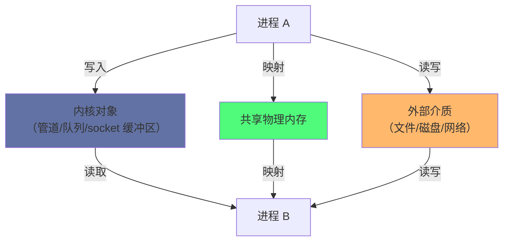
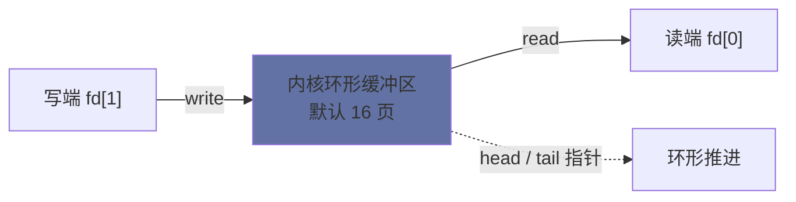
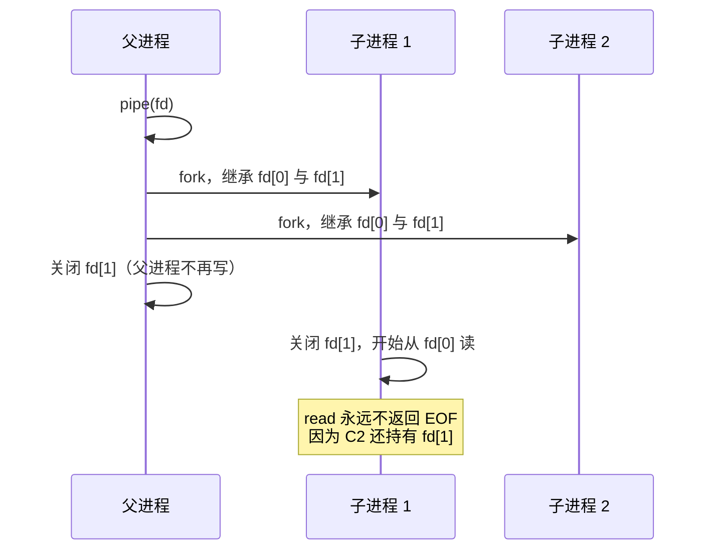
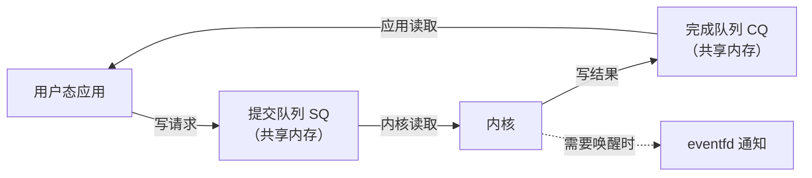

# 10 进程间通信全景——管道、信号、共享内存与 Socket 的内核实现

**摘要：**

进程管理这一路讲下来，隔离是贯穿始终的主题：虚拟地址空间让每个进程以为自己独占内存，文件描述符表让各自的资源互不干扰，信号与调度让它们互不抢占。但隔离只是手段，不是目的——真实系统里进程必须协作，而**协作的前提是找到一条双方都能走的路**。这条路在 Linux 上有三种形态：把数据放进双方都能访问的内核对象（管道、消息队列、socket）、把一块物理内存同时映射进两个地址空间（共享内存）、以及约定一个双方都能访问的外部介质（文件、磁盘、网络）。本文按这条线索展开：先从历史讲起，看 1970 年代为什么先有管道与信号、1980 年代的 System V IPC 与 1990 年代的 POSIX IPC 各自解决了什么、以及为什么两套标准至今并存。随后逐项拆解每一种机制的内核实现：管道的环形缓冲区与阻塞语义、`SIGPIPE` 的产生条件、32 位系统上 `pipe()` 与 `pipe2()` 的历史差异；信号的 `pending` 队列、标准信号为何会丢、`signalfd` 如何把异步通知变成文件描述符；共享内存为什么是唯一能做到真正零拷贝的机制、它为什么必须配合同步原语、以及匿名共享映射与 `shm_open` 的取舍；消息队列的"消息边界"这个被管道丢失的概念；Unix Domain Socket 如何在同一个内核里做双向通道、如何传递文件描述符与凭证、以及它与 TCP 回环的性能差距来自哪里。最后讨论新一代机制（`eventfd`、`memfd`、`pidfd`、`io_uring`）背后的一致思路，并给出一张按"数据量 × 方向 × 同步需求"选择机制的表。全文回答两个问题：这些 IPC 机制在内核里究竟是什么，以及面对一个具体场景该选哪一个。

---

## 第 1 章 隔离的代价与通信的本质

### 1.1 隔离让通信变成一个问题

进程隔离带来了三个直接后果，每一个都让通信变得困难：

| 隔离机制 | 对通信的影响 |
| :--- | :--- |
| 独立虚拟地址空间 | 一个进程的指针在另一个进程里毫无意义 |
| 独立的文件描述符表 | 一方的 fd 编号在另一方里指向别的东西 |
| 独立的内核记账 | 内核不会主动把一个进程的状态告诉另一个 |

第一条最根本。共享内存之所以在所有 IPC 机制里最快，恰恰是因为它绕开了这条隔离——**把同一块物理内存映射进两个地址空间**，于是那个"指针在对方那里无效"的问题消失了。而其它所有机制，都必须把数据从一个地址空间复制到内核，再从内核复制到另一个地址空间。

### 1.2 通信需要一个双方都能访问的中转站

把上面三条合起来看，进程间通信的可行方案只有三种：



| 中介类型 | 代表机制 | 拷贝次数 | 生命周期 |
| :--- | :--- | :--- | :--- |
| 内核对象 | 管道、消息队列、socket | 2 次（A→内核→B） | 随内核对象存在 |
| 共享内存 | `mmap`、`shm_open` | 0 次 | 随映射与对象存在 |
| 外部介质 | 文件、网络 | 取决于路径 | 独立于进程 |

这张表里最值得注意的是拷贝次数这一列。**共享内存是唯一能做到真正零拷贝的方案**，代价是双方必须自己解决同步问题——内核不再提供"阻塞直到有数据"这类服务。这个权衡贯穿本章所有机制的取舍。

### 1.3 为什么需要这么多种机制

既然共享内存最快，为什么还需要管道、消息队列、socket 这些"慢"的机制？

因为**速度不是唯一的维度**。内核提供的那些机制各自解决了共享内存解决不了的问题：

| 需求 | 内核对象方案 | 共享内存方案 |
| :--- | :--- | :--- |
| 不知道对方何时写入 | 内核负责阻塞与唤醒 | 必须自建同步 |
| 数据量小、频率低 | 开销可接受 | 建映射的成本反而更高 |
| 需要跨主机 | socket 天然支持 | 不支持 |
| 需要访问控制 | 内核在系统调用层校验 | 需要自己实现 |
| 需要消息边界 | 消息队列天然支持 | 需自己维护 |
| 进程可能崩溃 | 内核对象随 fd 释放 | 需处理残留状态 |

**"内核在做中介"这件事本身是有价值的**——它把同步、排队、访问控制、生命周期管理这些容易出错的事情接了过去。选择 IPC 机制的第一个问题不应该是"哪个最快"，而是"我愿意把多少责任交给内核"。

---

## 第 2 章 三代 IPC 机制的历史

### 2.1 1970 年代：管道与信号

Unix 诞生之初就有了两个 IPC 机制：

- **管道（Pipe）**，由 Doug McIlroy 在 1973 年前后提出并实现，其动机来自 shell 的管道操作符 `|`——把前一个程序的输出直接作为后一个程序的输入；
- **信号（Signal）**，在 Unix V1（1971）中就存在，用于异步通知。

这两个机制的设计极其简洁，也因此极其长寿。管道只提供"一个字节流 + 阻塞语义"，信号只提供"一个编号 + 异步投递"——它们没有传递复杂数据的能力，但覆盖了 Unix 哲学里"小而组合"的核心场景。

### 2.2 1980 年代：System V IPC

随着 Unix 被商业化，AT&T 在 System V 中引入了一整套新的 IPC 机制：消息队列、信号量、共享内存，合称 System V IPC（SysV IPC）。

它们的设计有一个共同的形状：**通过一个 key 来定位对象**。

```c
/* System V IPC 的典型调用序列：ftok 生成 key，再用 key 获取 id */
key_t key = ftok("/tmp/somefile", 'A');   /* 从路径与 ID 生成一个 key */
int shmid = shmget(key, 4096, IPC_CREAT | 0666);   /* 用 key 获取共享内存 */
void *addr = shmat(shmid, NULL, 0);                 /* 映射进地址空间 */
```

这套机制的三种对象都存放在内核里，通过 `ipcs` 命令可以查看：

```bash
ipcs
# ------ Shared Memory Segments --------
# key        shmid      owner      perms      bytes      nattch
# 0x01024b3a 0          root       644        4096       2
# ------ Semaphore Arrays --------
# ------ Message Queues --------
```

SysV IPC 的历史包袱主要来自三点：**key 的命名空间是全局的**（不同用户的程序可能撞 key）、**对象的生命周期与进程解耦**（进程退出后对象可能残留，直到显式删除或重启）、以及**接口风格与 Unix 的"一切皆文件"不一致**（用 id 而不是 fd）。第三条尤其关键：它意味着 SysV IPC 对象无法被 `select`/`poll`/`epoll` 监听、无法用 `close` 释放、也无法通过文件描述符传递。

### 2.3 1990 年代：POSIX IPC

POSIX.1b 在 1993 年定义了新一代 IPC 接口，核心改进是把对象纳入文件系统视图：

| 机制 | System V 接口 | POSIX 接口 |
| :--- | :--- | :--- |
| 共享内存 | `shmget` / `shmat` | `shm_open` / `mmap` |
| 消息队列 | `msgget` / `msgsnd` | `mq_open` / `mq_send` |
| 信号量 | `semget` /`semop` | `sem_open` / `sem_wait` |

POSIX 接口的三个变化最值得注意：

- **用名字而不是 key**。POSIX 共享内存用 `/myshm` 这样的名字，实际对应 `/dev/shm/myshm` 这个文件，于是可以用 `ls`、`rm` 这些已有工具管理；
- **返回文件描述符**。`shm_open` 返回一个 fd，意味着它可以用 `mmap` 映射，也可以用 `epoll` 监听（消息队列的情况），还可以通过 Unix Domain Socket 传给别的进程；
- **用 `unlink` 管理生命周期**。对象的名字与它的存在解耦：`shm_unlink` 删掉名字，但已经映射的进程仍可继续使用，最后一个引用消失时才真正释放——这与普通文件 `unlink` 的语义完全一致。

### 2.4 两套标准为什么并存

POSIX IPC 在各方面都更符合 Unix 的审美，但 System V IPC 至今没有被移除，原因有两类：

**第一类是存量代码。** Oracle、PostgreSQL 等数据库长期依赖 SysV 共享内存（PostgreSQL 的 `shared_buffers` 就是一块 SysV 共享内存），`ipcs` 也能看到这些对象。移除接口意味着破坏这些程序的运行。

**第二类是能力差异。** 有两项 SysV 提供的能力至今没有 POSIX 等价物：

- **原子地操作多个信号量**（`semop` 的数组参数），即"一次操作中同时 P 多个信号量"，这是实现某些复杂同步协议所需要的；
- **`SEM_UNDO` 机制**：进程异常退出时，内核自动撤销它持有的信号量操作，避免死锁。POSIX 信号量没有这个能力。

**一个更简单的接口即使全面更优，也不会让老接口消失**——只要还有人在用、还有能力没法替代。这条规律在 Unix 的整个历史里反复出现（第 03 篇讨论的 `fork` 也是如此）。

### 2.5 SysV IPC 对象的观测与清理

SysV IPC 的对象存在于内核里、与进程生命周期解耦，因此需要独立的观测与清理手段：

```bash
# 查看全部三类对象
ipcs -a
# 仅查看共享内存
ipcs -m
# 查看限制
ipcs -l

# 删除一个对象（shmid 或 msqid 或 semid）
ipcrm -m 32769        # 删除共享内存
ipcrm -q 0            # 删除消息队列
```

这些对象的另一个观测入口是 `/proc/sysvipc/`：

```bash
ls /proc/sysvipc/
# msg  sem  shm
head -n 3 /proc/sysvipc/shm
#        key      shmid perms      size  cpid  lpid nattch   uid   gid  cuid  cgid      atime      dtime      ctime
#          0      32769   600  12345678  1234  1234      8  1000  1000  1000  1000 1695000000          0 1694000000
```

这三个文件的存在，让监控系统可以在不依赖 `ipcs` 命令的情况下采集 IPC 对象的状态。**`nattch`（附着进程数）是关键字段**：一个 `nattch` 为 0 的共享内存段就是无人使用的残留，可以安全删除。

残留对象是 SysV IPC 最实际的运维问题：一个程序异常退出后，它创建的共享内存段与消息队列不会自动消失，会一直占用内存直到被显式删除或系统重启。**定期检查 `ipcs` 的输出并清理 `nattch` 为 0 的段，是维护使用 SysV IPC 的系统的常规工作**——这也是 POSIX IPC 用 `unlink` 语义解决掉的一个问题（对象随最后一个引用消失）。

---

## 第 3 章 管道

### 3.1 一个内核缓冲区加两个端点

管道的本质简单到可以用一句话说完：**一块内核内存，加上两个文件描述符**。

```c
int fd[2];
pipe(fd);    /* fd[0] 是读端，fd[1] 是写端 */
```

管道在内核里由 `struct pipe_inode_info` 描述，其中的核心是**一组环形缓冲区（ring buffer）**：



写入的数据放在缓冲区里，读取时从缓冲区取出，先进先出。**管道不保留任何消息边界**——写两次 10 字节，读者可能一次读到 20 字节，也可能两次各读到 10 字节，取决于时序。

### 3.2 容量与原子性保证

管道的缓冲区有一个默认容量，在 Linux 上是 16 个页（64KB，在 2.6.11 之后），早期是 8 个页（32KB）：

```bash
# 查看与调整管道容量
cat /proc/sys/fs/pipe-max-size       # 单个管道可被设置的最大值，默认 1048576
fcntl(fd[1], F_SETPIPE_SZ, 1048576); # 把某个管道的容量设为 1MB
fcntl(fd[1], F_GETPIPE_SZ);          # 读取当前容量
```

关于读写，POSIX 规定了两条重要的原子性保证：

| 保证 | 条件 | 含义 |
| :--- | :--- | :--- |
| 写入原子性 | 写入量 ≤ `PIPE_BUF`（Linux 上为 4096） | 这次写入不会与其它写入交错 |
| 写入阻塞 | 写入量 ≤ `PIPE_BUF` 且缓冲区空间不足 | 阻塞直到有足够空间，不会部分写入 |

第二条是"要么全写、要么等待"的保证。超过 `PIPE_BUF` 的写入则可能被拆分——内核会先写入能写的部分，然后在剩余部分上阻塞。这个差异在多写者场景下很重要：**只要每次写入不超过 4096 字节，多个写者的消息就不会互相穿插**。

### 3.3 阻塞与 `SIGPIPE`

管道的读写有一组默认的阻塞语义：

| 情形 | 默认行为 |
| :--- | :--- |
| 读一个空管道 | 阻塞，直到有数据或所有写端关闭 |
| 读一个已关闭且无数据的管道 | 返回 0（EOF） |
| 写一个已满的管道 | 阻塞，直到有空间 |
| **写一个读端已全部关闭的管道** | **发送 `SIGPIPE`，进程默认终止** |

最后一条是管道最著名的陷阱。`SIGPIPE` 的默认动作是终止进程，这意味着一个"往已经被对方关闭的管道里写数据"的操作会直接杀掉进程——经典场景是 `head` 读取部分输出后退出，上游的写进程立刻被 `SIGPIPE` 干掉。

正确处理方式有两种：

```c
/* 方式一：忽略 SIGPIPE，改为从 write 的返回值判断 */
signal(SIGPIPE, SIG_IGN);
ssize_t n = write(fd, buf, len);
if (n < 0 && errno == EPIPE) { /* 对端已关闭 */ }

/* 方式二：用 send 的 MSG_NOSIGNAL（仅对 socket 有效） */
send(sockfd, buf, len, MSG_NOSIGNAL);
```

第一种是通用的做法。需要注意的是**忽略 `SIGPIPE` 后，`write` 会返回 -1 且 `errno` 为 `EPIPE`** ——错误处理逻辑必须相应调整，否则会漏掉"对端已关闭"这个信号。

### 3.4 命名管道（FIFO）

匿名管道只能用于有亲缘关系的进程（因为它需要在 `fork` 前创建，让子进程继承 fd）。**FIFO（命名管道）**解决了这个限制：

```bash
# 创建一个 FIFO
mkfifo /tmp/myfifo

# 进程 A 写入
echo "hello" > /tmp/myfifo

# 进程 B 读取（另一个终端）
cat /tmp/myfifo
```

FIFO 在文件系统里表现为一个特殊类型的文件（`ls -l` 显示类型为 `p`），但它的内容不落在磁盘上——读写实际发生在内核缓冲区里，文件只是一个"名字"。

FIFO 有一个容易踩的语义：**打开 FIFO 用于读取时会阻塞，直到有写者打开它**（反之亦然），除非使用 `O_NONBLOCK`。这个行为在测试脚本里经常造成"命令卡住不动"的现象。

### 3.5 `splice`：管道作为零拷贝的中转

管道有一个不太为人知但很有价值的用途：**作为零拷贝数据搬运的中转站**。

`splice()` 系统调用可以在两个文件描述符之间移动数据，而**不需要把数据复制到用户态**：

```c
/* 把文件内容通过管道零拷贝地送到 socket */
while (remaining > 0) {
    ssize_t n = splice(file_fd, NULL, pipe_fd[1], NULL, 4096, SPLICE_F_MOVE);
    splice(pipe_fd[0], NULL, sock_fd, NULL, n, SPLICE_F_MOVE);
    remaining -= n;
}
```

数据在这条路径上的流动是：文件 → 页缓存 → 管道缓冲区 → socket 缓冲区，全程没有经过用户态。这就是 [[Linux/网络协议栈与IO/05 零拷贝技术全景——sendfile、splice 与 DMA gather]] 里讨论的零拷贝技术的一环。

**管道在这里扮演的角色是一个"内核内的传送带"**：内核原本没有在任意两个 fd 之间直接搬运数据的通用接口，于是借用了管道这个已存在的中转结构。这个用法很能说明一个设计原则：**当需要一个通用抽象时，复用已有的最简单抽象往往比新造一个更划算**。

### 3.6 EOF 的时机与一个经典 bug

管道上的 `read` 返回 0（EOF）的条件是精确的：**缓冲区为空，且所有持有写端的进程都已关闭写端**。这个条件里的"所有"是理解一类经典 bug 的关键。



图里的问题在于：**子进程 2 从未打算写数据，但它继承了写端且没有关闭**。内核看到的引用计数仍然大于零，于是读端的 `read` 永远阻塞在"等待数据或 EOF"上。

这个模式在多进程程序里极其常见，它造成的现象是"程序卡住不动，没有任何报错"。修正方式很直接：**每个不使用的端点都必须显式关闭**——写者关闭读端、读者关闭写端，这是管道编程的一条基本规则。它之所以容易被忽略，是因为在小规模测试（两个进程）时程序表现完全正常，只有进程数变多时才暴露。

与这个 bug 相关的另一个实践要点是：**管道上的 `read` 应该配合 `poll`/`select` 使用**，而不是在阻塞模式下裸调用。裸调用会让程序无法同时处理其它事件，也无法设置超时；而如果改用非阻塞模式又不配合 `poll`，就会退化成忙轮询——两种情况都不是想要的。**"阻塞 + 轮询"之间的那个正确中间态，正是 `poll` 这类多路复用机制存在的意义**。

---

## 第 4 章 信号

### 4.1 只传编号，不传数据

信号的内核实现已经在第 02 篇与第 07 篇讨论过（`signal_struct`、`pending` 队列、投递粒度），这里只从 IPC 的角度总结它的能力边界。

信号的语义是"**异步通知**"，它的全部信息量是一个整数（信号编号）。要传递数据，只能借助其它机制（比如约定一个共享内存区域，用信号通知"数据就绪了"）。这个设计在嵌入式系统里催生了"共享内存 + 信号"的经典组合。

### 4.2 标准信号与实时信号

Linux 有两类信号，它们在 IPC 能力上有本质差别：

| 维度 | 标准信号（1-31） | 实时信号（`SIGRTMIN`-`SIGRTMAX`） |
| :--- | :--- | :--- |
| 编号范围 | 1 到 31 | 通常 34 到 64 |
| 是否排队 | **不排队**，同类信号只保留一个 | 排队，按序号顺序投递 |
| 能否携带数据 | 不能 | 可以（`sigqueue` 的 `sigval`） |
| 投递顺序 | 不确定 | 按信号编号从小到大 |

**"标准信号不排队"是信号作为 IPC 机制最大的局限**。第 05 篇讨论 `SIGCHLD` 丢失时提到的正是这一点：多个子进程同时退出，父进程可能只收到一次通知。同样的特性会影响所有用标准信号做事件通知的设计——**每一个"用信号做通知"的方案，都必须回答"信号丢了怎么办"这个问题**。

实时信号的引入（POSIX.1b，与 POSIX IPC 同时代）补上了这个能力：它们排队、有顺序、可以携带一个整数或指针。但它的能力至今没有被广泛利用——因为需要排队语义的场景通常会直接选择消息队列或 socket，而不是绕道信号。

### 4.3 `signalfd`：把异步变成同步

信号处理的一个根本困难是：**处理函数在任意时刻被调用，只能调用 async-signal-safe 的函数**（第 07 篇讨论过原因）。这让信号处理逻辑的编写受到极大限制。

`signalfd`（Linux 2.6.22）提供了一条绕开的路径：把一个信号集绑定到一个文件描述符上，之后信号到来时 fd 变为可读，程序在正常的循环里读取它：

```c
/* 把 SIGUSR1 转成文件描述符事件 */
sigset_t mask;
sigemptyset(&mask);
sigaddset(&mask, SIGUSR1);
sigprocmask(SIG_BLOCK, &mask, NULL);       /* 先阻塞，避免默认处理 */

int sfd = signalfd(-1, &mask, SFD_NONBLOCK);

/* 在事件循环里像读普通 fd 一样读信号 */
struct signalfd_siginfo si;
if (read(sfd, &si, sizeof(si)) == sizeof(si)) {
    /* 这里可以调用任何函数，因为不在信号处理上下文里 */
}
```

这个机制的价值在于**把异步的信号处理变成了同步的事件处理**——程序不再需要在信号处理函数里小心翼翼地只用安全函数，而是在主循环里像处理网络事件一样处理信号。它与 `eventfd`、`timerfd` 一起，构成了"把各种异步事件统一成 fd"这一设计思路的一部分（第 8 章）。

### 4.4 用信号做 IPC 的边界

把信号作为 IPC 机制使用时，需要接受以下限制：

| 限制 | 后果 |
| :--- | :--- |
| 不携带数据（标准信号） | 需要额外的数据通道 |
| 不排队 | 事件可能丢失，需要额外的状态记录 |
| 投递目标不确定（多线程） | 必须用 `tgkill` 或阻塞 + `sigwait` 明确接收者 |
| 处理函数在任意时刻执行 | 只能用 async-signal-safe 函数 |
| 与系统既有信号语义冲突 | 例如用 `SIGUSR1` 可能与某个库冲突 |

第五条在实践中经常被低估：一个应用自定义使用的信号，可能与某个第三方库（或运行时）内部使用的信号撞车，导致难以定位的行为异常。**在选用自定义信号之前，检查依赖库用了哪些信号，是一份值得做的功课**。

### 4.5 信号量：从 Dijkstra 到 futex

信号量（Semaphore）是 E. W. Dijkstra 在 1965 年提出的同步原语，它的语义只有两个操作：

| 操作 | 语义 |
| :--- | :--- |
| P（`sem_wait`、`semop` 的 -1） | 计数减一；若计数为负则阻塞 |
| V（`sem_post`、`semop` 的 +1） | 计数加一；若有等待者则唤醒其中一个 |

Linux 提供了两套信号量接口，它们的差异与共享内存那两套一致：

| 维度 | System V（`semget`/`semop`） | POSIX（`sem_open`/`sem_wait`） |
| :--- | :--- | :--- |
| 命名方式 | key | 名字，表现为 `/dev/shm/sem.xxx` |
| 对象形式 | 整数 id | 指针或 fd |
| 批量操作 | 支持（`semop` 的数组参数） | 不支持 |
| 撤销机制 | 支持（`SEM_UNDO`） | 不支持 |
| 进程共享 | 天然支持 | 需要 `sem_init(pshared=1)` 或命名版本 |

从 IPC 的角度看，信号量承担的角色是**为其它机制提供同步**。共享内存在所有 IPC 机制里最快，但它不提供任何同步能力（第 5.5 节），因此"共享内存 + 信号量"成了一个固定搭配。管道、消息队列、socket 都不需要额外的信号量，因为内核已经在它们内部实现了同步。

信号量本身还有一个值得注意的实现细节：**在现代内核上，无名信号量（`sem_init`）的实现建立在 futex 之上**（第 07 篇讨论过 futex 的快速路径）。这意味着无竞争时的 `sem_wait`/`sem_post` 只是一次用户态原子操作，不进内核。这个实现选择让信号量的性能远高于它在教科书里的形象——**一个 1965 年提出的原语，在现代实现里跑的是 2002 年发明的机制**。

跨进程的命名信号量则必须进内核，因为它的状态要在多个进程之间共享，无法放在某个进程的地址空间里。这也是"命名的都比匿名的慢"这条规律的一个具体体现：命名意味着状态必须有内核可见的落点，而那个落点就是一次系统调用的成本。

---

## 第 5 章 共享内存

### 5.1 唯一能做到零拷贝的机制

共享内存的原理是把同一块物理内存映射到两个进程的地址空间里。写入方把字节写进这块内存，读取方在另一个地址上看到同样的字节——**中间没有任何复制**。

这个机制建立在一个基础上：**虚拟地址到物理地址的映射是逐进程的**。第 01 篇讨论 `mm_struct` 时提到的页表，正是这个能力的实现载体——两个进程的页表里，不同的虚拟地址可以指向同一个物理页框。

这个机制有一个直接推论：**共享内存的传递开销与数据大小无关**——传 1 字节与传 1 MB 的差别只在于访问内存的时间，而不在于"传递"本身。这是它相对于所有拷贝型机制的根本优势，也解释了为什么大数据量的 IPC 场景最终都会走到共享内存上来。

### 5.2 匿名共享映射

最轻量的共享内存用法是 `mmap` 加 `MAP_SHARED | MAP_ANONYMOUS`，配合 `fork` 使用：

```c
/* 父进程创建一块共享区域，子进程继承映射 */
void *shm = mmap(NULL, 4096, PROT_READ | PROT_WRITE,
                 MAP_SHARED | MAP_ANONYMOUS, -1, 0);
/* fork 之后，父子进程对 shm 的写入互相可见 */
```

这个用法的关键在于 `MAP_SHARED` 与 `MAP_PRIVATE` 的差别（第 03 篇讨论 COW 时讲过）：**`MAP_PRIVATE` 的映射在 `fork` 后是写时复制的，父子进程的修改互不可见；只有 `MAP_SHARED` 才是真正的共享**。把这两个标志搞混，是共享内存相关 bug 里最常见的一类。

### 5.3 POSIX 共享内存

需要给共享内存起名字、或者让没有亲缘关系的进程访问时，用 `shm_open`：

```c
/* 创建（或打开）一个命名共享内存对象 */
int fd = shm_open("/my_region", O_CREAT | O_RDWR, 0600);
ftruncate(fd, 4096);                         /* 必须先设置大小 */
void *p = mmap(NULL, 4096, PROT_READ | PROT_WRITE, MAP_SHARED, fd, 0);

/* 使用完毕：删掉名字，但映射仍然有效 */
shm_unlink("/my_region");
```

`shm_open` 的实现在 Linux 上是**基于 tmpfs 的**——对象表现为 `/dev/shm/` 下的一个文件：

```bash
ls -l /dev/shm/
# -rw------- 1 app app 4096 Sep 19 10:00 my_region
# -rw------- 1 postgres postgres 12345678 Sep 19 10:00 postgres.*
```

这个实现细节有两个实际含义。第一，**共享内存占用的是内存（或 swap），不是磁盘**——一个 `/dev/shm` 里被写满的系统，其表现是内存不足而不是磁盘不足。第二，`/dev/shm` 的大小受挂载选项限制，容器里这个限制通常较小（默认 64MB），这解释了一个常见的容器故障：**一个在宿主机上正常运行的程序，进了容器就报"共享内存分配失败"——因为 `/dev/shm` 的容量被容器运行时限制了**。

### 5.4 System V 共享内存

SysV 的接口在功能上与 POSIX 版等价，主要差别在于管理方式：

```bash
# 查看系统中所有的 SysV 共享内存段
ipcs -m
# key        shmid      owner      perms      bytes      nattch     status
# 0x00000000 32769      postgres   600        12345678   8
# 注意 key 为 0x00000000 表示这是私有段（IPC_PRIVATE），只能由创建者及其子进程使用
```

PostgreSQL 是 SysV 共享内存最著名的使用者，`shared_buffers` 配置项直接对应一段 SysV 共享内存的大小。它选择 SysV 而不是 POSIX 的原因与历史有关——PostgreSQL 的架构成型早于 POSIX 共享内存的普及，而这个选择一直保留了下来。

### 5.5 共享内存必须自己解决同步

共享内存不提供任何同步机制。两个进程同时写同一块内存会产生"撕裂"——一个进程读到另一个进程写到一半的数据。这是共享内存唯一的、也是最严重的代价。

解决方案有两种：

| 方案 | 机制 | 适用场景 |
| :--- | :--- | :--- |
| 使用进程间信号量 | POSIX `sem_open` 或 futex | 通用 |
| 使用原子操作 | `__atomic_*` 内置函数 | 单变量、简单协议 |

原子操作方案在近年变得越来越常见，因为无锁数据结构的技术成熟了。但需要留意的是：**跨进程的无锁数据结构比跨线程的更微妙**——不同进程可能运行在不同的 CPU 上，内存序的保证需要更谨慎地处理。任何基于共享内存的协议，都应该在文档里明确写出它的内存序假设。

### 5.6 三个共享内存的陷阱

| 陷阱 | 现象 | 原因 |
| :--- | :--- | :--- |
| 忘记同步 | 偶发的数据错乱 | 缺少内存屏障或锁 |
| 结构体布局不一致 | 读到错误的值 | 双方编译时的对齐/ABI 不同 |
| 对象残留 | 内存被占用无法释放 | 进程崩溃后未 `shm_unlink` |

其中第二条值得展开。共享内存里存放的数据结构**不能用编译器相关的布局**——如果一方用 32 位编译、另一方用 64 位，或者两边的结构体对齐设置不同，那么同一个偏移量下的字段就不是同一个字段。稳妥的做法是：**只放固定宽度的整数、显式指定对齐、避免指针（用偏移量代替）**。这也是一些系统编程规范禁止在共享内存里放 C++ 对象的原因——虚表指针在不同编译单元之间可能不兼容。

### 5.7 三个真实的使用者

共享内存在实际系统里的用法，比教科书上的例子更能说明它的定位。

**Nginx 的共享内存区。** Nginx 的 `ngx_shm_zone_t`（用于限流计数、缓存元数据、连接状态共享）由 master 进程在启动时用匿名共享映射创建，随后 `fork` 出的各个 worker 进程共同使用。同步方式不是信号量，而是**自旋锁与原子操作**——因为 Nginx 的临界区极短（通常只是几次计数更新），自旋的成本低于睡眠唤醒的成本。

**PostgreSQL 的共享缓冲区。** `shared_buffers` 对应一段 System V 共享内存（第 5.4 节），所有的后端进程共享这块缓冲区缓存。它的同步依赖进程间信号量（`semop`）与自旋锁的组合——数据库的场景比 Nginx 复杂得多，临界区长度差异很大，因此需要两种机制配合。

**浏览器的进程间大块数据传输。** 现代浏览器把渲染进程与主进程分离（出于安全与稳定性考虑），两者之间需要传递图像数据、DOM 快照这类大块内容。走 IPC 通道拷贝这些数据的开销不可接受，因此采用"共享内存传数据 + IPC 通道传句柄与通知"的组合。

三个例子的共同点是：**它们都用共享内存承载"大块、高频、需要共享"的状态，而把"控制与通知"交给另一条轻量通道**。这个分工在三个不同年代、不同领域的系统里独立出现，说明它不是某个具体实现的选择，而是共享内存这种机制的天然用法。

---

## 第 6 章 消息队列

### 6.1 消息边界：管道丢失的那个概念

管道是字节流，**它不保留发送方的消息边界**。这对某些场景是不可接受的：一个进程发送"指令 A"和"指令 B"两条消息，接收方需要能把它们区分开——用管道的话，接收方要么约定固定的消息长度，要么在消息里编码长度前缀，两种做法都是在应用层重新实现消息边界。

消息队列（Message Queue）的核心价值就是**在内核层面提供消息边界的保证**：每次发送一条消息，接收方每次读到完整的一条。

```c
/* POSIX 消息队列：发送与接收都以消息为单位 */
mqd_t mq = mq_open("/my_queue", O_CREAT | O_RDWR, 0600, &attr);
mq_send(mq, "message A", 9, 1);              /* 长度为 9，优先级 1 */
mq_receive(mq, buf, sizeof(buf), &prio);     /* 一次取出一条完整消息 */
```

### 6.2 POSIX 消息队列的两项特性

**优先级**：消息带一个优先级，接收时优先级高的先被取出。这个特性让消息队列可以表达"紧急消息优先处理"这类需求，而这在管道上是无法直接实现的。

**通知机制**：`mq_notify` 可以注册一个通知，在消息到达时收到信号或在一个线程里被回调。这让等待新消息不必依赖主动轮询。

队列在 Linux 上表现为 `/dev/mqueue/` 下的文件系统对象：

```bash
ls -l /dev/mqueue/
# -rw-r--r-- 1 app app 80 Sep 19 10:00 my_queue

cat /dev/mqueue/my_queue
# QSIZE:5   NOTIFY:0   SIGNO:0   NOTIFY_PID:0
# QSIZE 是当前队列中数据的总字节数
```

### 6.3 System V 消息队列的包袱

SysV 消息队列用 `msgsnd`/`msgrcv`，它的接口设计带着那个时代的印记：消息必须以一个 `long` 类型的 `mtype` 开头，内核只认识这个 `mtype` 而不管后面的内容。这个设计让消息结构体的定义变得僵硬，也是它逐渐被 POSIX 版本取代的原因之一。

SysV 消息队列还有两条与现代实践不符的性质：**默认队列容量很小**（受 `msgmax`、`msgmnb` 等内核参数限制），**队列在进程退出后仍然存在**（需要 `ipcrm` 清理或系统重启）。这些性质在实践中经常造成"队列里堆积了大量陈旧消息"的故障。

### 6.4 消息队列的现状

从今天的实践看，消息队列在单个主机上的使用场景已经大幅收缩。它原本解决的问题——"有边界的、带优先级的进程间消息传递"——现在大多由 Unix Domain Socket 承担，因为后者还顺带提供了连接语义、流控、以及对端断开检测。

需要了解消息队列的原因主要是两条：**阅读老代码时会遇到**，以及**它确实在某些嵌入式与实时场景里仍在被使用**（因为它的接口简单、开销确定）。判断是否使用它的标准可以归结为一句：如果数据是"一条条独立的消息"而不是"一段字节流"，且不需要跨主机通信，那么它在候选之列——但要与 UDS 做一次认真比较。

补充一点部署时的注意项：消息队列的系统级限制（队列数、单消息最大长度、队列最大容量）可以在 `/proc/sys/fs/mqueue/` 下查看，而容器环境里这些值往往与宿主机不同。上线前核对它们，能避免"本地正常、容器内失败"这类典型问题。

---

## 第 7 章 Unix Domain Socket

### 7.1 内核里的双向通道

Unix Domain Socket（UDS）在接口上几乎与 TCP socket 一致（`socket`、`bind`、`listen`、`accept`、`send`、`recv`），但它不经过网络协议栈：

| 维度 | UDS | TCP 回环 |
| :--- | :--- | :--- |
| 地址形式 | 文件系统路径或抽象名字 | IP 地址 + 端口 |
| 经过的协议层 | 无（直接在内核对象间搬数据） | TCP/IP 完整栈 |
| 端口资源 | 不占端口 | 占用端口 |
| 权限控制 | 文件权限位 | 需要额外机制 |
| 传递 fd | **支持**（`SCM_RIGHTS`） | 不支持 |
| 跨主机 | 不支持 | 支持 |

**它本质上是一个内核里的双向通道**：两个进程各自持有一个 socket 文件描述符，数据从一个进程的发送缓冲区搬到另一个进程的接收缓冲区，全程不涉及网络层。

### 7.2 三种类型

| 类型 | 语义 | 用途 |
| :--- | :--- | :--- |
| `SOCK_STREAM` | 字节流，保留连接语义 | 与 TCP 用法相同，最常用 |
| `SOCK_DGRAM` | 数据报，保留消息边界 | 需要消息边界的场景 |
| `SOCK_SEQPACKET` | 数据报 + 连接与有序保证 | 较少使用，语义最完整 |

`SOCK_SEQPACKET` 值得单独提一句：它同时提供"消息边界"与"可靠有序的连接"，是理论上最完整的 IPC 语义，但在 Linux 上的使用并不广泛——需要这些语义的程序通常直接用了消息队列或 `SOCK_STREAM` 加长度前缀。

### 7.3 传递文件描述符

UDS 最有价值的能力是**传递文件描述符**（`SCM_RIGHTS`）：

```c
/* 通过 UDS 把一个 fd 传给对端 */
struct msghdr msg = {0};
char cmsg_buf[CMSG_SPACE(sizeof(int))];
struct cmsghdr *cmsg;
char dummy = 0;
struct iovec io = { .iov_base = &dummy, .iov_len = 1 };

msg.msg_iov = &io;
msg.msg_iovlen = 1;
msg.msg_control = cmsg_buf;
msg.msg_controllen = sizeof(cmsg_buf);

cmsg = CMSG_FIRSTHDR(&msg);
cmsg->cmsg_level = SOL_SOCKET;
cmsg->cmsg_type = SCM_RIGHTS;
cmsg->cmsg_len = CMSG_LEN(sizeof(int));
memcpy(CMSG_DATA(cmsg), &fd_to_send, sizeof(int));

sendmsg(sock, &msg, 0);   /* 对端 recvmsg 后拿到一个指向同一对象的新 fd */
```

这个机制的实现方式很特别：**内核并没有"复制"这个 fd，而是让接收方得到一个新的 fd 编号，指向同一个 `struct file` 对象**。第 02 篇讨论 `files_struct` 时讲过，fd 表的表项指向的是 `struct file`——传递 fd 就是在接收方的 fd 表里插入一个指向同一对象的新表项，并把引用计数加一。

这个能力的应用场景包括：**把已建立的连接交给另一个进程处理**（负载均衡器把连接转给 worker 进程）、**把日志文件句柄交给日志收集进程**、以及**传递设备或共享内存的句柄**。它是"进程间分工"这一架构模式的关键使能技术。

### 7.4 传递凭证

UDS 的第二个独有能力是**传递与验证对端身份**：

```c
/* 服务端获取对端的 UID/PID/GID */
struct ucred cred;
socklen_t len = sizeof(cred);
getsockopt(client_fd, SOL_SOCKET, SO_PEERCRED, &cred, &len);
/* cred.uid、cred.gid、cred.pid 由内核填写，不可伪造 */
```

**这些信息由内核填写，而不是由对端提供**——这意味着它是可信任的。这个能力让 UDS 上的服务可以做精确的访问控制（"只接受 UID 为 1000 的进程连接"），而不必依赖文件权限这类粗粒度的机制。

需要注意的是凭证的另一种传递方式 `SCM_CREDENTIALS` 在安全性上略有不同：它传递的是**发送消息那一刻**的凭证，而 `SO_PEERCRED` 返回的是**建立连接那一刻**的凭证。对长期连接而言，如果进程在连接建立后改变了身份（`setuid`），两者的差异就会显现。

### 7.5 性能差距从哪来

UDS 与 TCP 回环的性能差距（UDS 通常快一倍以上）来自几个层面：

| 环节 | TCP 回环的额外开销 | UDS |
| :--- | :--- | :--- |
| 协议处理 | TCP 状态机、序号、窗口、校验和 | 无 |
| IP 层处理 | 路由查找、TTL、分片 | 无 |
| 网络设备层 | 回环设备的收发路径 | 无 |
| 数据拷贝 | 相同的两次拷贝 | 相同的两次拷贝 |

**UDS 省掉的是协议处理与网络层的开销，但没有省掉数据拷贝**——数据仍然要从发送方的用户态复制到内核缓冲区，再从内核缓冲区复制到接收方。要省掉这两次拷贝，需要的是共享内存（第 5 章），而不是换一个 socket 类型。

这个区分很重要，因为它决定了优化的方向：**如果一个 IPC 路径的瓶颈在拷贝上，把 TCP 换成 UDS 只能改善一部分；真正的解决方向是减少拷贝次数，而不是换协议**。

### 7.6 抽象命名空间

UDS 有两种地址形式，第二种是 Linux 特有的：

```c
/* 形式一：文件系统路径（可移植） */
struct sockaddr_un addr;
addr.sun_family = AF_UNIX;
strcpy(addr.sun_path, "/tmp/my_service.sock");

/* 形式二：抽象命名空间（Linux 特有，名字以 NUL 开头） */
struct sockaddr_un addr2;
addr2.sun_family = AF_UNIX;
memcpy(addr2.sun_path, "\0my_service", 12);   /* 首字节为 0 */
```

抽象命名空间的名字**不出现在文件系统里**，由内核单独维护。它带来三项与路径形式不同的性质：

| 性质 | 路径形式 | 抽象命名空间 |
| :--- | :--- | :--- |
| 出现在文件系统 | 是，需要清理残留文件 | 否 |
| 访问控制 | 文件权限位 | **无**（任何进程都能连接） |
| 生命周期 | 需要显式 `unlink` | socket 关闭时自动消失 |
| 跨命名空间共享 | 需要挂载点共享 | 受网络命名空间隔离 |

第二行是最需要留意的：**抽象命名空间没有权限检查**。任何能访问那个名称的进程都可以连接，而内核不提供任何基于凭证的准入。因此使用抽象命名空间的程序必须在应用层校验对端身份（`SO_PEERCRED`，见第 7.4 节），否则就是把一个本地服务暴露给了机器上的所有进程。

它的优势也很实在：**不需要处理路径与清理**。路径形式的一个常见故障是"服务异常退出后 socket 文件残留，新实例 `bind` 报 `Address already in use`"，而抽象命名空间没有这个问题——socket 关闭时名字自动消失。这也是不少系统组件（如 systemd 的部分内部通信、一些容器运行时）选择它的原因。**便利性与访问控制在这里是一对需要权衡的取舍，而不是可以同时得到的两样东西**。

---

## 第 8 章 新一代机制

### 8.1 一条共同的设计思路

第 4 章到第 7 章讨论的机制，各自的接口风格差异很大：信号是编号、管道是 fd、消息队列是 `mqd_t`、SysV 是整数 id。而近十五年新增的 IPC 机制呈现出明显的趋同——**它们几乎都返回文件描述符，并可以被 `epoll` 统一监听**。

| 机制 | 引入版本 | 作用 | 接口形式 |
| :--- | :--- | :--- | :--- |
| `eventfd` | 2.6.22（2007） | 事件计数与通知 | fd |
| `signalfd` | 2.6.22（2007） | 把信号转成 fd | fd |
| `timerfd` | 2.6.25（2008） | 把定时器转成 fd | fd |
| `memfd_create` | 3.17（2014） | 匿名内存文件 | fd |
| `pidfd_open` | 5.3（2019） | 稳定的进程引用 | fd |
| `io_uring` | 5.1（2019） | 异步 I/O 的共享环 | fd + 共享内存 |

### 8.2 为什么统一到 fd 有价值

把各种异步事件统一成 fd，收益是**一个事件循环可以处理所有事情**。第 05 篇讨论 `pidfd` 时提到的场景是一个典型：一个同时管理网络连接与子进程的服务，原先需要为 `SIGCHLD` 单独设计一套异步处理逻辑，改用 `pidfd` 后，子进程退出就是一个普通的 `epoll` 事件。

这个思路的代价是**一次系统调用的开销**——`eventfd` 的通知需要 `write`，比直接用一个共享内存计数器要慢。但它的收益是**统一性**：不需要为每种事件类型写一套等待逻辑，也不会遇到信号处理函数只能用 async-signal-safe 函数这类限制。**用一点性能换取编程模型的统一，这笔交易在现代服务端开发里通常是划算的**。

### 8.3 `io_uring` 的特殊之处

`io_uring` 在列表里显得有些特别：它不只是"把某个事件变成 fd"，而是**把整个 I/O 提交与完成的机制搬到了共享内存里**。

它的结构是两块共享的环形缓冲区（提交队列 SQ 与完成队列 CQ）：应用把 I/O 请求写进 SQ，内核处理后把结果写进 CQ，**正常路径下完全不需要系统调用**——只在需要唤醒对方时才用一个 fd 做通知。



这个设计的本质与第 5 章的共享内存是同一个思路：**把数据通路放在共享内存里，把同步交给一个轻量的通知机制**。区别在于 `io_uring` 是内核与用户态之间的共享内存，而第 5 章讨论的是两个用户进程之间的。**同一套设计原则在系统不同层次上的重复出现**，是理解这些机制的一条捷径。

### 8.4 `memfd`：一个有名字的无名文件

`memfd_create()` 返回一个指向匿名内存文件的 fd。这个描述里有三个关键词需要分别解释。

**匿名**：这个文件不在文件系统里，没有路径，无法通过 `open` 打开——只能通过传 fd 让别人访问。

**内存**：它的内容存放在 tmpfs 里（与 `shm_open` 的实现同源），不落盘、不受磁盘 I/O 影响。

**文件**：它具备文件的一切接口——可以 `read`/`write`/`mmap`/`lseek`，可以被传给另一个进程（通过 UDS 的 `SCM_RIGHTS`），可以被 `execveat` 直接执行。

把这三个性质合起来，`memfd` 就成了"进程间传递大块数据"的现代首选载体：**发送方创建 memfd、写入数据、通过 UDS 把 fd 传给对方，接收方直接 `mmap` 它**——整个过程数据只被写了一次，接收方不需要经过 IPC 通道拷贝。

它还提供了一个独特的能力——**密封（Sealing）**：

```c
/* 加密封之后，文件内容与大小都不能再被修改 */
fcntl(mfd, F_ADD_SEALS, F_SEAL_SHRINK | F_SEAL_GROW | F_SEAL_WRITE | F_SEAL_SEAL);
```

密封的意义在于**让接收方可以信任这份数据不会被发送方中途改写**。这个性质对某些场景是必需的：把一个可执行程序通过 memfd 传给另一个进程执行时，如果发送方能在执行期间修改内容，就存在"检查时是 A、执行时变成 B"的攻击窗口。加密封之后这个窗口被关闭。

**一个机制的价值往往不是来自它的主体能力，而是来自它能提供的额外保证**——`memfd` 的读写能力可以用其它方式替代，但它与密封机制的组合在既有 IPC 机制里没有等价物。

---

## 第 9 章 如何选择

### 9.1 三个决策维度

选择 IPC 机制时，可以用三个问题把选项快速收敛：

| 维度 | 问题 | 影响 |
| :--- | :--- | :--- |
| 数据量 | 是几字节的控制消息还是 MB 级的数据 | 决定是否需要共享内存 |
| 通信方向 | 单向流、双向流、还是请求-响应 | 决定是否需要连接语义 |
| 同步需求 | 是否需要知道对方何时处理完 | 决定是否需要额外的同步机制 |

### 9.2 决策表

| 场景 | 推荐机制 | 原因 |
| :--- | :--- | :--- |
| shell 里的命令串联 | 匿名管道 | 由 shell 直接支持，零成本 |
| 父子进程传递少量数据 | 匿名管道或匿名共享映射 | 继承机制天然可用 |
| 大块数据频繁交换 | POSIX 共享内存 + 信号量 | 唯一能做到零拷贝 |
| 本地服务请求-响应 | Unix Domain Socket | 连接语义完善，可传 fd |
| 需要传递 fd 或进程凭证 | Unix Domain Socket | 唯一支持的机制 |
| 需要消息边界与优先级 | POSIX 消息队列 | 内核保证边界 |
| 需要跨主机 | TCP/UDP socket | UDS 不支持 |
| 简单的事件通知 | `eventfd` 或信号 | 开销最小 |
| 等待子进程退出 | `pidfd` + `epoll` | 统一到事件循环 |
| 高频小 I/O 异步提交 | `io_uring` | 减少系统调用 |

### 9.3 三种常见的组合

实践中很少只用一种机制，把它们组合起来的模式有三种最常见：

**组合一：socket 传控制 + 共享内存传数据。** 用 UDS 传递"数据已就绪"的通知与元信息，用共享内存传递大批量数据。这是高性能本地服务最常见的结构，它把"不需要拷贝的数据"与"需要可靠传递的控制"分开处理。

**组合二：管道传数据 + 信号传事件。** 这是最经典的 Unix 组合，在嵌入式与老系统中大量存在。它的主要问题是信号的不可靠性（第 4 章），因此需要在应用层做补偿。

**组合三：`eventfd` 做唤醒 + 共享队列做传递。** 这与 `io_uring` 的结构同源，也是各种高性能中间件（如某些消息队列的内部实现）采用的模式。

### 9.4 四个常见误区

| 误区 | 澄清 |
| :--- | :--- |
| UDS 比 TCP 快，所以应该无脑替换 | 差距来自协议栈开销，若瓶颈在数据拷贝上，替换收益有限 |
| 共享内存最快，所以优先选它 | 它把同步责任交给了应用，出错成本高 |
| 管道容量可以随意调大 | 有系统级上限（`pipe-max-size`），且大缓冲区会增加延迟 |
| 信号可以做可靠的通知 | 标准信号不排队，必须设计补偿机制 |

### 9.5 一次完整的选型推演

把前面几节的规则用在一个具体场景上，能看清这些维度如何收窄选择范围。

**场景**：一个日志采集 agent 需要从业务进程接收日志，要求写入方不阻塞业务逻辑，吞吐目标每秒几十 MB。

**第一步：确定数据量与方向。** 每秒几十 MB 意味着数据量很大，且是单向的（业务进程写入，agent 读取）。数据量大这一条直接把候选范围收窄到共享内存与管道/UDS 两类。

**第二步：确定同步需求。** 业务进程不该因为日志阻塞——这条要求排除了"写满即阻塞"的默认语义。有两条件可行的路径：增大缓冲区并接受"满了就丢弃"，或者用共享内存加自旋/信号量做非阻塞的写入。

**第三步：比较复杂度。** 共享内存方案需要自己实现环形缓冲、处理写者与读者的并发、处理写者崩溃后的状态恢复，实现量在千行级别。管道方案只需要 `pipe2(O_NONBLOCK)` 加丢弃策略，实现量在几十行——但管道缓冲区有上限（第 3.2 节），超过写入量会失败。

**第四步：考虑实际约束。** 关键在于"丢弃是否可接受"。日志系统通常允许在极端情况下丢弃部分日志（这也是大多数日志库的默认行为），因此管道加丢弃策略是可行的。如果场景换成"不能丢一条的审计日志"，那么结论会完全不同——必须走共享内存加持久化队列的方案。

这个推演过程演示了一条实用的判断顺序：**先按数据量与方向筛选机制，再用同步需求排除不可行的，最后用实现复杂度与业务约束做取舍**。这条顺序有效的原因是它是一个**逐层收窄**的结构——每一步都在减少候选数，而不是在不同维度之间反复权衡。面对一个新场景时按这个顺序走一遍，通常能在几分钟内得到一个合理的候选集。

---

## 第 10 章 小结：把隔离的代价转移给谁

回顾本章讨论的全部机制，会发现它们都在回答同一个问题：**进程之间被隔离了，那么这条跨越隔离的通道，应该由谁来维护**。

三种答案对应三种代价：

- **交给内核维护**（管道、消息队列、socket）：数据要经过两次拷贝，换来的是同步、排队、访问控制、生命周期管理都由内核负责；
- **交给应用维护**（共享内存）：零拷贝，换来的是应用必须自己处理同步、布局一致性、崩溃残留；
- **交给外部介质维护**（文件、网络）：彻底解耦，换来的是持久化与网络传输的开销。

这三种答案没有优劣，只有在具体场景下的匹配度。一个需要每秒搬运几 GB 的进程间数据通路，会毫不犹豫地选择共享内存并承担同步的复杂度；一个只需要偶尔传递几字节控制消息的系统，会选择管道并把同步交给内核。**判断依据不是"哪个性能好"，而是"哪一个的代价落在了我能承受的地方"**。

行文至此，进程管理专栏的十篇正文告一段落。从"进程是什么"开始，经过描述符、诞生、替换、终结、状态、线程、调度、实时，到这一篇的进程间协作，这条主线始终围绕同一个对象展开：那个承载着运行状态、被内核反复创建与回收、在 CPU 上被调度、必要时与同伴通信的 `task_struct`。理解了它，Linux 系统里那些看起来彼此独立的现象——一次 `fork` 的延迟、一个 D 状态进程、一个僵尸的堆积、一次调度的抖动——就会收敛到同一套模型上。

---

## 参考资料

1. *Linux Kernel Source* — `fs/pipe.c`：管道环形缓冲区、`PIPE_BUF` 原子性保证与 `splice` 接口。
2. *Linux Kernel Source* — `ipc/`：SysV IPC 实现；`ipc/shm.c`、`ipc/msg.c`、`ipc/sem.c`。
3. *Linux Kernel Source* — `ipc/mqueue.c`、`mm/shmem.c`：POSIX 消息队列与 `shm_open` 的 tmpfs 实现。
4. *Linux Kernel Source* — `net/unix/af_unix.c`：Unix Domain Socket 与 `SCM_RIGHTS` 的实现。
5. *Linux Kernel Source* — `fs/eventfd.c`、`fs/signalfd.c`、`kernel/pid.c`：新一代 fd 型 IPC 机制。
6. *pipe(7), fifo(7), unix(7), shm_overview(7), mq_overview(7), signal(7) manual pages*：各机制的语义与限制。
7. *The Linux Programming Interface*, Michael Kerrisk, 2010：第 43-61 章，Linux 各 IPC 机制的完整讲解。
8. *Unix Network Programming, Volume 2: Interprocess Communications*（2nd Edition）, W. Richard Stevens, 1998：System V IPC 与 POSIX IPC 的经典对照。
9. *Ritchie, D. M., Thompson, K. "The UNIX Time-Sharing System."* CACM 1974：管道机制的原始设计说明。
10. *io_uring 设计文档* — `Documentation/userspace-api/io_uring.rst`：共享环形队列的结构与语义。

---

> [!note] 思考题
> 1. 管道在 `PIPE_BUF` 以内保证写入原子，这个保证在多核系统上依赖什么机制？如果去掉它会出什么问题？
> 2. `SCM_RIGHTS` 传递的是 fd 还是 `struct file`？如果接收方立刻关闭这个 fd，发送方的 fd 会失效吗？
> 3. 共享内存里不能放指针，但如果确实需要动态结构（如链表），有哪些可行的替代方案？
> 4. 把 `eventfd`、`signalfd`、`pidfd` 统一到 `epoll` 之后，是否还存在只能用传统方式处理的异步事件？