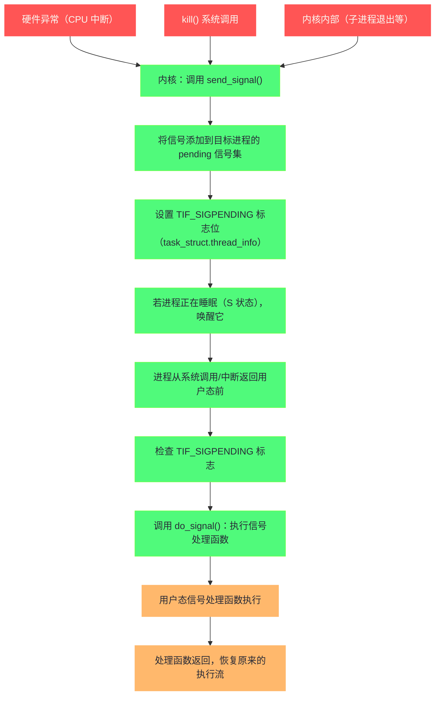
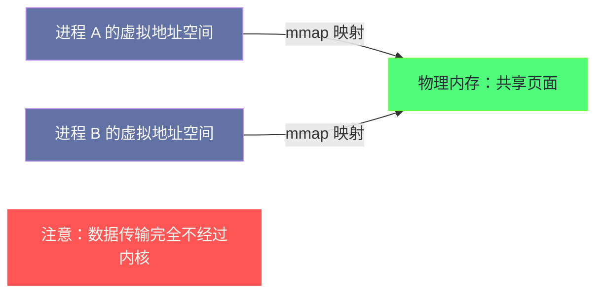
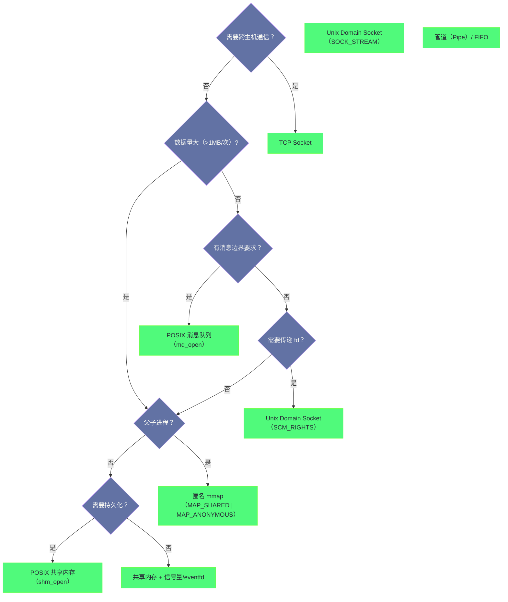

**摘要：**

进程的隔离性是 Linux 安全模型的基石——每个进程有独立的虚拟地址空间，不能直接访问其他进程的内存。但隔离的进程之间仍然需要协作，这就是 IPC（Inter-Process Communication，进程间通信）要解决的问题。Linux 提供了丰富的 IPC 机制，从最古老的管道（1972 年 Unix 就有）到 POSIX 消息队列，从 System V 共享内存到现代的 `memfd_create()`，每种机制都是在特定约束下解决特定问题的工程产物。本文系统梳理 Linux 全部主流 IPC 机制的内核实现原理：管道的内核缓冲区与阻塞语义、信号的投递路径与信号处理函数的执行时机、共享内存（`mmap` 匿名映射与 `shm_open`）如何绕过内核实现零拷贝通信、消息队列的结构与 POSIX/System V 两套 API 的设计差异，以及 Unix Domain Socket 相比 TCP loopback 的本质优势。理解这些机制的底层原理，才能在架构设计时做出正确的 IPC 选型。

---

## 第 1 章 IPC 机制全景：为什么需要这么多种方式

### 1.1 进程隔离带来的通信需求

进程的虚拟地址空间隔离使得进程 A 无法直接读写进程 B 的内存。但现实中的系统几乎没有完全独立的进程——一个 Web 请求的处理可能涉及：Nginx（HTTP 服务）、PHP-FPM（业务逻辑）、Redis（缓存）、MySQL（持久化），这些进程需要高效、可靠地交换数据。

不同的通信需求有不同的特征：
- **数据量**：几个字节的控制信号 vs GB 级的数据集
- **方向性**：单向（生产者→消费者）vs 双向（请求-响应）
- **同步性**：发送后等待回应 vs 发后不管
- **进程关系**：父子进程（有亲缘关系）vs 完全无关的进程
- **网络透明性**：是否需要跨机器通信

每种 IPC 机制都是对这些维度的不同取舍。

### 1.2 Linux IPC 机制的历史分层

Linux 的 IPC 机制按历史来源可以分为三层：

**Unix 传统 IPC（随 Unix 诞生）**：管道（Pipe）、FIFO（Named Pipe）、信号（Signal）

**System V IPC（1983 年 AT&T Unix System V 引入）**：消息队列（Message Queue）、共享内存（Shared Memory）、信号量（Semaphore）——这三者统称 System V IPC，用数字键（key）标识，接口较为笨拙

**POSIX IPC（1993 年 POSIX 1003.1b 标准化）**：POSIX 消息队列（`mq_*`）、POSIX 共享内存（`shm_open`）、POSIX 信号量（`sem_open`）——比 System V 更现代，用文件系统路径标识，接口更一致

**现代 Linux 特有**：`eventfd`、`signalfd`、`timerfd`、`memfd_create()`、`io_uring` 共享环形缓冲区——将各种通知机制统一为文件描述符，可以用 `epoll` 统一监听

### 1.3 机制对比总览

| IPC 机制 | 数据容量 | 方向性 | 有无持久化 | 跨主机 | 典型延迟 | 适用场景 |
|---------|---------|-------|----------|-------|---------|---------|
| 管道（Pipe）| 64KB 缓冲区 | 单向 | 否 | 否 | ~1µs | 父子进程流式数据 |
| FIFO | 64KB 缓冲区 | 单向 | 命名文件 | 否 | ~1µs | 无亲缘进程流式数据 |
| 信号 | 极少（信号号+int）| 单向 | 否 | 否 | ~5µs | 异步通知、控制 |
| 消息队列 | 按消息边界 | 单向 | 可持久 | 否 | ~5µs | 有消息边界的异步通信 |
| 共享内存 | 无限制 | 双向 | 可持久 | 否 | ~10ns | 大数据量、高频通信 |
| Unix Socket | 无限制 | 双向 | 否 | 否 | ~5µs | 通用 IPC，传统协议兼容 |
| TCP loopback | 无限制 | 双向 | 否 | 是 | ~30µs | 需要跨主机兼容 |

---

## 第 2 章 管道：Unix 最古老的 IPC

### 2.1 管道的内核实现

管道（Pipe）是 Unix 设计中最优雅的概念之一。Ken Thompson 在 1972 年受 Doug McIlroy 的启发实现了管道，这是"Unix 哲学"（小工具通过管道组合）的物质基础。

**管道的本质**：一个内核管理的环形缓冲区（`struct pipe_inode_info`），通过两个文件描述符（读端和写端）暴露给用户进程：

```c
/* 创建管道 */
int pipefd[2];
pipe(pipefd);
/* pipefd[0]：读端（read end）
   pipefd[1]：写端（write end）*/

/* 使用 */
write(pipefd[1], "hello", 5);   /* 向写端写入数据 */
read(pipefd[0], buf, 5);        /* 从读端读取数据 */
```

**内核缓冲区大小**：

```bash
# 查看管道默认缓冲区大小
cat /proc/sys/fs/pipe-max-size
# 1048576（1MB，单个管道的最大缓冲区）

# 默认单个管道的初始大小
ulimit -p
# 8（8 个 4KB 页 = 32KB，早期默认值）

# Linux 2.6.11 之后默认 64KB（16 个页面）
```

**管道的阻塞语义**：

- **写阻塞**：管道缓冲区满时，`write()` 阻塞，直到有空间（读端消费了数据）
- **读阻塞**：管道缓冲区空时，`read()` 阻塞，直到有数据（写端写入了数据）
- **写端关闭**：读端的 `read()` 返回 0（EOF）
- **读端关闭**：写端的 `write()` 触发 `SIGPIPE` 信号（或返回 `EPIPE`）

```c
/* 经典的管道使用模式：父子进程通信 */
int pipefd[2];
pipe(pipefd);

pid_t pid = fork();
if (pid == 0) {
    /* 子进程：只写 */
    close(pipefd[0]);                  /* 关闭读端（子进程不需要）*/
    write(pipefd[1], "data", 4);
    close(pipefd[1]);
    exit(0);
} else {
    /* 父进程：只读 */
    close(pipefd[1]);                  /* 关闭写端（父进程不需要）*/
    char buf[10];
    int n = read(pipefd[0], buf, 10);  /* 阻塞等待子进程写入 */
    close(pipefd[0]);
}
```

**为什么要关闭不使用的端？这是关键细节：**

管道的 EOF 语义依赖"写端全部关闭"——如果父进程持有写端（即使不写），`read()` 就永远不会返回 EOF（内核认为写端还开着，随时可能写入数据）。在 Shell 管道（`ls | grep foo`）中，这个语义保证了当 `ls` 退出（写端关闭）后，`grep` 的 `read()` 返回 EOF，`grep` 随之退出。

### 2.2 splice 与 vmsplice：零拷贝管道

管道的传统 `write()` + `read()` 路径需要两次内存拷贝：用户空间 → 内核管道缓冲区 → 用户空间。

Linux 2.6.17 引入了 `splice()`，允许直接在内核中移动数据，避免用户空间拷贝：

```c
/* splice：在两个文件描述符之间传输数据（完全在内核完成，零用户空间拷贝）*/
/* 典型场景：从文件 fd 读取，直接写入管道（不经过用户空间）*/
splice(file_fd, &offset,
       pipefd[1], NULL,
       bytes,
       SPLICE_F_MOVE | SPLICE_F_MORE);

/* 然后从管道直接发送到 socket（sendfile 的泛化版本）*/
splice(pipefd[0], NULL,
       socket_fd, NULL,
       bytes,
       SPLICE_F_MOVE);
```

这是 Nginx 的 `sendfile` 功能的底层原理之一——从磁盘文件直接"拼接"到网络 socket，避免了用户空间的数据拷贝，极大提升了静态文件服务的性能。

### 2.3 FIFO：命名管道

匿名管道只能用于有亲缘关系的进程（通过继承文件描述符）。**FIFO（Named Pipe，命名管道）** 通过文件系统路径让无亲缘关系的进程也能使用管道：

```bash
# 创建 FIFO
mkfifo /tmp/my_fifo

# 进程 A（写端）
echo "hello" > /tmp/my_fifo    # 阻塞，直到有进程打开读端

# 进程 B（读端，在另一个终端）
cat /tmp/my_fifo               # 打开读端，此时进程 A 解除阻塞，数据传输
```

FIFO 在文件系统中有一个 inode，但**不占用磁盘空间**——数据只存在于内核缓冲区，路径只是用于进程发现彼此的"会合点"。

---

## 第 3 章 信号：内核的异步通知机制

### 3.1 信号的本质与投递路径

信号（Signal）是内核向进程发送的异步通知——"你发生了某事（如段错误），或者有人想对你做某事（如终止你）"。信号是 IPC 中最特殊的一种：它传递的信息极少（仅一个信号编号，加上可选的 `siginfo_t` 结构体），但它的触发来源非常多样：

- **硬件异常**：非法内存访问（SIGSEGV）、除零错误（SIGFPE）、非法指令（SIGILL）
- **内核事件**：子进程退出（SIGCHLD）、I/O 准备好（SIGIO）、定时器到期（SIGALRM）
- **用户或进程发送**：`kill()` 系统调用、Ctrl+C（SIGINT）、Ctrl+Z（SIGTSTP）

**信号的投递路径**：



**信号处理的关键时机**：信号不是即时被处理的，而是在进程**从内核态返回用户态**时才被检查和处理（系统调用返回时、中断处理返回时）。这意味着：
- 正在内核中执行的进程（如执行系统调用），不会在中途被信号打断（除非在可中断睡眠点）
- 正在用户态运行的进程，必须等到下一次进入内核并返回时，才会处理信号

### 3.2 信号处理函数的执行机制

信号处理函数（signal handler）运行在用户态，但它的触发是由内核精心安排的——内核在进程的用户态栈上"插入"一帧，使进程从信号处理函数开始执行，处理函数返回后恢复原来的执行现场：

```
正常执行流（用户态栈）：
  main() → func_a() → func_b()   ← 正在执行

信号到来，do_signal() 处理：
  1. 保存当前用户态寄存器状态（sigcontext）到用户栈
  2. 在用户栈上构造一个信号帧（sigframe），包含恢复信息
  3. 修改返回地址：使进程返回用户态时跳转到信号处理函数
  4. 信号处理函数执行完成，调用 sigreturn() 系统调用
  5. sigreturn() 从栈上恢复保存的寄存器状态
  6. 进程恢复到信号到来前的状态，继续执行 func_b()
```

**为什么信号处理函数要在用户栈上执行，而不是内核栈？**

信号处理函数是用户提供的代码（`signal(SIGINT, my_handler)`），内核不信任用户代码——不能让用户代码在内核栈上运行（那会给内核带来安全隐患）。用户栈是用户空间的一部分，在那里执行用户代码是安全的。

### 3.3 实时信号与普通信号的区别

Linux 有两类信号：

**普通信号（1-31）**：不排队——如果同一信号在未处理时多次发生，后续的发生会被丢弃（只记录"有一个待处理的信号"，而不是"有 N 个待处理的信号"）

**实时信号（SIGRTMIN 到 SIGRTMAX，共 32 个）**：排队——每次 `kill()` 都会被记录，保证按顺序一一处理，不会丢失

```c
/* 实时信号可以携带额外数据 */
union sigval {
    int sival_int;
    void *sival_ptr;
};

/* 发送带数据的实时信号 */
sigqueue(pid, SIGRTMIN, (union sigval){ .sival_int = 42 });

/* 接收端：siginfo_t 包含信号值 */
void rt_handler(int sig, siginfo_t *info, void *context) {
    printf("收到实时信号，携带数据：%d\n", info->si_value.sival_int);
}
struct sigaction sa = {
    .sa_sigaction = rt_handler,
    .sa_flags = SA_SIGINFO,   /* SA_SIGINFO：启用三参数 handler */
};
sigaction(SIGRTMIN, &sa, NULL);
```

### 3.4 signalfd：将信号转化为文件描述符

Linux 2.6.22 引入 `signalfd()`，将信号转化为可读的文件描述符——这样就可以用 `epoll` 来统一监听信号和 IO 事件，避免信号处理函数的异步性带来的竞态问题：

```c
/* 阻塞 SIGINT 和 SIGTERM（防止被默认处理）*/
sigset_t mask;
sigemptyset(&mask);
sigaddset(&mask, SIGINT);
sigaddset(&mask, SIGTERM);
sigprocmask(SIG_BLOCK, &mask, NULL);

/* 创建 signalfd */
int sfd = signalfd(-1, &mask, SFD_NONBLOCK | SFD_CLOEXEC);

/* 像普通 fd 一样加入 epoll */
struct epoll_event ev = { .events = EPOLLIN, .data.fd = sfd };
epoll_ctl(epollfd, EPOLL_CTL_ADD, sfd, &ev);

/* 事件循环中统一处理 */
/* 当 SIGINT 或 SIGTERM 到来时，sfd 变为可读 */
struct signalfd_siginfo si;
read(sfd, &si, sizeof(si));   /* 读取信号信息 */
printf("收到信号 %d（来自 PID %d）\n", si.ssi_signo, si.ssi_pid);
```

---

## 第 4 章 共享内存：最快的 IPC

### 4.1 共享内存的原理：绕过内核的数据传输

管道、消息队列、socket 都需要将数据从发送方的用户空间拷贝到内核，再从内核拷贝到接收方的用户空间——这是两次内存拷贝。

**共享内存（Shared Memory）** 彻底消除了这两次拷贝：两个进程都将同一块物理内存映射到自己的虚拟地址空间——进程 A 写入共享内存，进程 B 立即可以读到，**完全没有内核参与数据传输**，延迟只受内存访问速度（纳秒级）限制。



### 4.2 mmap 匿名共享内存：父子进程最简方案

对于有亲缘关系的进程（父子进程），最简单的共享内存方式是 `MAP_SHARED | MAP_ANONYMOUS`：

```c
/* 在 fork() 之前创建共享内存区域 */
size_t size = 4096;
void *shared = mmap(NULL, size,
                    PROT_READ | PROT_WRITE,
                    MAP_SHARED | MAP_ANONYMOUS,  /* 关键：MAP_SHARED 使 fork 后共享 */
                    -1, 0);

/* MAP_ANONYMOUS：不关联任何文件，纯内存映射 */
/* MAP_SHARED：fork 后父子进程共享这块内存（CoW 不触发），写操作对双方都可见 */

pid_t pid = fork();
if (pid == 0) {
    /* 子进程：写入共享内存 */
    *(int *)shared = 42;
    exit(0);
} else {
    waitpid(pid, NULL, 0);
    printf("父进程读到：%d\n", *(int *)shared);  /* 输出：42 */
    munmap(shared, size);
}
```

**MAP_SHARED vs MAP_PRIVATE 在 fork 后的区别**：

- `MAP_PRIVATE`：fork 后触发 CoW，父子进程各有独立副本，互不影响
- `MAP_SHARED`：fork 后父子共享同一物理页，任何一方修改，另一方立即可见

### 4.3 POSIX 共享内存：无亲缘进程的方案

无亲缘关系的进程无法通过继承 fd 来共享内存，需要一个"会合点"。POSIX 共享内存使用 `/dev/shm`（tmpfs 文件系统）作为会合点：

```c
/* 进程 A：创建并写入共享内存 */
#include <sys/mman.h>
#include <fcntl.h>

/* 在 /dev/shm/ 下创建一个"文件"（实际上是内存）*/
int fd = shm_open("/my_shared_mem",          /* 路径（/dev/shm/my_shared_mem）*/
                  O_CREAT | O_RDWR,           /* 创建，可读写 */
                  0666);
ftruncate(fd, 4096);                          /* 设置大小 */

void *ptr = mmap(NULL, 4096, PROT_READ | PROT_WRITE, MAP_SHARED, fd, 0);
close(fd);   /* mmap 成功后可以关闭 fd，映射仍然有效 */

*(int *)ptr = 12345;   /* 写入数据 */
/* 进程 B 通过 shm_open("/my_shared_mem", O_RDONLY, 0) + mmap 可以读到这个值 */


/* 进程 B：打开并读取共享内存 */
int fd2 = shm_open("/my_shared_mem", O_RDONLY, 0);
void *ptr2 = mmap(NULL, 4096, PROT_READ, MAP_SHARED, fd2, 0);
printf("读到：%d\n", *(int *)ptr2);  /* 输出：12345 */

/* 清理 */
shm_unlink("/my_shared_mem");  /* 从 /dev/shm 删除（类似 unlink 文件）*/
```

```bash
# 查看系统中的 POSIX 共享内存对象
ls -la /dev/shm/

# 常见的共享内存使用者：
# /dev/shm/postgres.* ← PostgreSQL 进程间共享缓冲区
# /dev/shm/redis*     ← Redis 某些配置
# /dev/shm/pulse-*    ← PulseAudio 音频服务
```

### 4.4 共享内存的同步问题

共享内存是最快的 IPC，但速度带来了复杂性：**多个进程同时读写共享内存会产生竞态条件**，必须使用同步原语（信号量、互斥锁）。

这是一个常见的"权衡"：管道/消息队列/socket 的速度较慢，但内核保证了访问的原子性（`write()` 和 `read()` 是原子的，不会出现写一半的情况）；共享内存没有这种保证，用户必须自己处理同步。

**实践中的共享内存同步方案**：

```c
/* 方案一：在共享内存中嵌入 pthread_mutex（设置 PTHREAD_PROCESS_SHARED 属性）*/
struct shared_data {
    pthread_mutex_t lock;  /* 进程间共享的互斥锁 */
    int data;
};

pthread_mutexattr_t attr;
pthread_mutexattr_init(&attr);
pthread_mutexattr_setpshared(&attr, PTHREAD_PROCESS_SHARED);  /* 关键：允许跨进程使用 */
pthread_mutex_init(&((struct shared_data *)ptr)->lock, &attr);
```

---

## 第 5 章 消息队列：有边界的异步通信

### 5.1 消息队列 vs 管道：为什么需要消息边界

管道是字节流——没有消息边界，接收方无法区分"一次发送的数据"的边界。如果发送方调用两次 `write(pipe, "hello", 5)` 和 `write(pipe, "world", 5)`，接收方可能一次 `read()` 读到 "helloworld"（10 字节），无法知道这是两条消息。

消息队列（Message Queue）保留了消息边界：每次 `msgsnd()` 发送一条消息，每次 `msgrcv()` 接收一条消息，永远不会出现"粘包"问题。

### 5.2 POSIX 消息队列

POSIX 消息队列（`mq_*` 系列函数）比 System V 消息队列（`msgget` 等）更现代，支持通过 `mq_notify()` 在消息到达时异步通知，也可以作为文件描述符加入 `epoll`：

```c
#include <mqueue.h>

/* 创建/打开消息队列 */
struct mq_attr attr = {
    .mq_flags   = 0,
    .mq_maxmsg  = 10,         /* 队列中最多 10 条消息 */
    .mq_msgsize = 256,        /* 每条消息最大 256 字节 */
};
mqd_t mq = mq_open("/my_queue", O_CREAT | O_RDWR, 0666, &attr);

/* 发送消息（支持优先级，数字越大优先级越高）*/
const char *msg = "hello mq";
mq_send(mq, msg, strlen(msg), 0);   /* 优先级 0 */

/* 接收消息 */
char buf[256];
unsigned int priority;
mq_receive(mq, buf, sizeof(buf), &priority);

/* 异步通知：消息到达时发送 SIGRTMIN 信号 */
struct sigevent sev = {
    .sigev_notify = SIGEV_SIGNAL,
    .sigev_signo  = SIGRTMIN,
};
mq_notify(mq, &sev);

/* 清理 */
mq_close(mq);
mq_unlink("/my_queue");   /* 从 /dev/mqueue 删除 */
```

```bash
# POSIX 消息队列挂载在 /dev/mqueue（mqueue 文件系统）
ls /dev/mqueue/
# my_queue   ← 可见消息队列

# 查看队列状态
cat /dev/mqueue/my_queue
# QSIZE:5   NOTIFY:0   SIGNO:0   NOTIFY_PID:0
# QSIZE：当前队列中的消息总字节数
```

### 5.3 System V 消息队列的历史包袱

System V 消息队列（`msgget`/`msgsnd`/`msgrcv`）是 POSIX 消息队列的前身，接口设计较为笨拙（用 key_t 整数标识，而非文件路径），但在遗留系统中仍然广泛存在：

```bash
# 查看系统中的 System V IPC 对象（消息队列、共享内存、信号量）
ipcs -a

# 输出：
# ------ Message Queues --------
# key        msqid      owner      perms      used-bytes   messages
# 0x12345678 0          root       666        0            0

# 清理遗留的 System V IPC（不受进程生命周期管理，进程退出不自动清理！）
ipcrm -q <msqid>   # 删除消息队列
ipcrm -m <shmid>   # 删除共享内存
ipcrm -s <semid>   # 删除信号量
```

> [!warning] 生产避坑：System V IPC 的"孤儿"问题
> System V IPC 对象（消息队列、共享内存、信号量）在创建进程退出后**不会自动释放**——它们在内核中持久存在，直到显式调用 `msgctl(IPC_RMID)` 删除，或系统重启。如果程序异常退出而没有清理，这些对象会在系统中积累，占用内核资源。`ipcs -a` 可以查看所有残留的 System V IPC 对象。POSIX IPC（`mq_open`、`shm_open`、`sem_open`）通过文件系统路径管理，行为更可预期，新代码应优先使用 POSIX IPC。

---

## 第 6 章 Unix Domain Socket：本地 IPC 的最佳实践

### 6.1 Unix Domain Socket 的本质优势

Socket 通常让人联想到网络通信，但 **Unix Domain Socket**（UDS，`AF_UNIX`）是专为本地进程间通信设计的 socket 变体，不经过任何网络协议栈，数据直接在内核中传输。

**UDS vs TCP loopback（127.0.0.1）的本质区别**：

即使是 TCP loopback，数据也要经过完整的 TCP/IP 协议栈——TCP 分段、IP 路由（loopback 接口）、网卡驱动（虚拟的）……这些都有开销。

UDS 完全绕过了网络协议栈：发送方的数据直接被内核复制到接收方的 socket 缓冲区，不需要 TCP 握手、序号确认、IP 包封装等任何网络层处理。

| 维度 | Unix Domain Socket | TCP loopback |
|-----|-------------------|-------------|
| 协议层 | 无（直接内存传输）| 完整 TCP/IP 栈 |
| 延迟 | ~2-5µs | ~20-50µs |
| 吞吐量 | 更高 | 较低 |
| 连接标识 | 文件系统路径 | IP:Port |
| 权限控制 | Unix 文件权限（`chmod`）| iptables/TCP 层 |
| 传递文件描述符 | 支持（`SCM_RIGHTS`）| 不支持 |
| 跨主机 | 不支持 | 支持 |

**传递文件描述符（`SCM_RIGHTS`）** 是 UDS 最独特的能力——可以通过 socket 将一个打开的文件描述符从一个进程"传递"给另一个进程：

```c
/* 发送方：将 fd=5 传递给对方进程 */
int send_fd(int sock, int fd_to_send) {
    struct msghdr msg = {0};
    char buf[CMSG_SPACE(sizeof(int))];
    struct cmsghdr *cmsg;

    /* 控制消息（cmsg）：携带文件描述符 */
    msg.msg_control = buf;
    msg.msg_controllen = sizeof(buf);
    cmsg = CMSG_FIRSTHDR(&msg);
    cmsg->cmsg_level = SOL_SOCKET;
    cmsg->cmsg_type  = SCM_RIGHTS;    /* 文件描述符传递 */
    cmsg->cmsg_len   = CMSG_LEN(sizeof(int));
    *(int *)CMSG_DATA(cmsg) = fd_to_send;

    /* 发送（必须同时发送至少 1 字节的正常数据）*/
    char dummy = 'x';
    struct iovec iov = { .iov_base = &dummy, .iov_len = 1 };
    msg.msg_iov = &iov; msg.msg_iovlen = 1;
    sendmsg(sock, &msg, 0);
}
```

**典型应用场景**：

- **Nginx worker 进程接收 master 的监听 socket**：master 进程绑定 80 端口（需要 root 权限），通过 UDS 将监听 socket 传递给 worker 进程，worker 进程随后降权运行（无需 root），但已经持有监听 socket
- **Chrome 的 Sandbox 进程通信**：沙箱化的渲染进程通过 UDS 向特权的 Browser 进程请求资源

### 6.2 UDS 的使用模式

```c
/* 服务端：创建 Unix Domain Socket 并监听 */
int sockfd = socket(AF_UNIX, SOCK_STREAM, 0);

struct sockaddr_un addr = {
    .sun_family = AF_UNIX,
    .sun_path = "/tmp/my_service.sock",
};
unlink("/tmp/my_service.sock");   /* 清理旧的 socket 文件 */
bind(sockfd, (struct sockaddr *)&addr, sizeof(addr));
listen(sockfd, 128);

int connfd = accept(sockfd, NULL, NULL);
char buf[1024];
recv(connfd, buf, sizeof(buf), 0);
send(connfd, "pong", 4, 0);

/* 客户端：连接 Unix Domain Socket */
int clifd = socket(AF_UNIX, SOCK_STREAM, 0);
connect(clifd, (struct sockaddr *)&addr, sizeof(addr));
send(clifd, "ping", 4, 0);
recv(clifd, buf, sizeof(buf), 0);
```

**UDS 的两种类型**：
- `SOCK_STREAM`（字节流）：与 TCP 类似，保序但无消息边界
- `SOCK_DGRAM`（数据报）：保留消息边界，无需连接，但不保证可靠性（本地通信通常不丢数据，但缓冲区满时会丢弃）
- `SOCK_SEQPACKET`（顺序数据报）：保留消息边界 + 保序 + 可靠——兼具 STREAM 和 DGRAM 的优点，适合 IPC

```bash
# 查看系统中的 Unix Domain Socket
ss -x   # -x = AF_UNIX
# 或
ls -la /tmp/*.sock /var/run/*.sock 2>/dev/null

# 常见的 UDS 使用者：
# /var/run/docker.sock       ← Docker daemon
# /run/user/1000/pulse/native  ← PulseAudio
# /tmp/.X11-unix/X0          ← X11 显示服务器
# /run/postgresql/.s.PGSQL.5432  ← PostgreSQL
```

---

## 第 7 章 现代 IPC：eventfd、memfd 与 io_uring

### 7.1 eventfd：最轻量的通知机制

`eventfd`（Linux 2.6.22 引入）是一个用于进程/线程间通知的文件描述符，比管道更轻量（只有一个 fd，而管道需要两个）：

```c
/* 创建 eventfd */
int efd = eventfd(0, EFD_NONBLOCK | EFD_CLOEXEC);
/* 初始计数器值 = 0 */

/* 通知（写入任意 uint64_t 值，计数器累加）*/
uint64_t increment = 1;
write(efd, &increment, sizeof(uint64_t));

/* 等待通知（读取计数器值，读后计数器清零）*/
uint64_t val;
read(efd, &val, sizeof(uint64_t));
printf("收到 %llu 次通知\n", val);
```

`eventfd` 可以直接加入 `epoll`，是事件循环（如 libuv、Linux AIO）中实现"唤醒 epoll"的标准方式：

```bash
# eventfd 在内核中的实现极为简单：
# 只是一个 uint64_t 计数器 + 一个等待队列
# write() 递增计数器，read() 读取并清零，epoll 监听计数器是否非零
```

### 7.2 memfd_create：内存匿名文件

`memfd_create()`（Linux 3.17 引入）创建一个匿名的内存文件——没有文件系统路径，只有文件描述符，但可以像普通文件一样 `mmap`、`ftruncate`、`read/write`：

```c
#include <sys/memfd.h>

/* 创建匿名内存文件 */
int mfd = memfd_create("my_shm", MFD_CLOEXEC);
ftruncate(mfd, 4096);

/* 通过 mmap 在共享内存中读写 */
void *ptr = mmap(NULL, 4096, PROT_READ | PROT_WRITE, MAP_SHARED, mfd, 0);

/* 将 fd 通过 UDS 传递给其他进程（SCM_RIGHTS）*/
send_fd(sock, mfd);
/* 其他进程 mmap 同一个 fd，就建立了共享内存 */

/* memfd 的独特优势：可以设置 MFD_ALLOW_SEALING，
   对内存文件加"封印"（seal），防止被 ftruncate 改变大小或被修改
   这提供了比 POSIX 共享内存更强的安全保证 */
fmemfd_add_seals(mfd, F_SEAL_SHRINK | F_SEAL_GROW | F_SEAL_WRITE);
/* 之后这个内存文件的大小不可变，内容不可写（任何尝试都返回 EPERM）*/
```

`memfd_create` + UDS 的 `SCM_RIGHTS` 组合，是现代 Linux IPC 实现零拷贝共享内存的最佳实践——无需在文件系统中创建任何路径，安全性和可控性都优于 `shm_open`。

---

## 第 8 章 IPC 选型指南

### 8.1 选型决策树



### 8.2 各机制的生产使用建议

**管道/FIFO**：
- 用于简单的流式数据传输（尤其是 Shell 脚本和父子进程）
- 避免用于高吞吐量场景（64KB 缓冲区会频繁触发阻塞）

**信号**：
- 只用于控制和通知（`SIGTERM` 优雅关闭、`SIGHUP` 重新加载配置）
- 信号处理函数中只做最简单的操作（设置 flag，避免调用非 async-signal-safe 函数）
- 多线程程序中，使用 `signalfd` 替代传统信号处理，避免竞态

**共享内存**：
- 高频大数据量通信的首选（如数据库缓冲区、实时音视频处理）
- 必须配合同步原语（`PTHREAD_PROCESS_SHARED` mutex 或信号量）
- 优先使用 `memfd_create` + UDS 传递，而非 `shm_open`（安全性更好）

**消息队列**：
- 有消息边界需求且不希望处理 socket 连接管理时使用
- 优先 POSIX 消息队列（`mq_open`），避免使用 System V 消息队列

**Unix Domain Socket**：
- 本地进程间双向通信的最佳实践（覆盖 95% 的 IPC 场景）
- 优于 TCP loopback：无协议开销，支持传递 fd，权限控制简单
- 选择 `SOCK_SEQPACKET` 当需要消息边界 + 可靠传输

---

## 小结

Linux IPC 机制构成了进程协作的完整基础设施，每种机制都有其精确的适用场景：

**按通信开销排序（从低到高）**：
1. **共享内存**（~10ns）：无内核参与，直接内存访问，但需手动同步
2. **Unix Domain Socket / 管道**（~2-5µs）：内核单次拷贝，接口友好
3. **消息队列**（~5-10µs）：有消息边界，支持优先级，异步通知
4. **TCP loopback**（~20-50µs）：完整协议栈，但支持跨主机，兼容性最好

**现代 IPC 最佳实践**：
- 本地通信：优先 Unix Domain Socket（SOCK_SEQPACKET）
- 大数据量：`memfd_create` + UDS `SCM_RIGHTS` 传递 + `mmap` 共享
- 信号处理：多线程程序使用 `signalfd` 取代传统 signal handler
- 避免 System V IPC（消息队列、共享内存、信号量），改用 POSIX 等价物

**本专栏到此全部完成**。从进程的诞生（`fork`）、成长（`exec`）、运行（调度器）、协作（IPC），到最终消亡（`exit`/`wait`）——Linux 进程管理的完整生命周期，已经在这 10 篇文章中得到系统梳理。每个机制背后都有深刻的工程权衡和历史原因，理解这些"为什么"，是从"会用"到"精通"的关键跨越。

---

> [!note] 思考题
> 1. 管道（Pipe）的内核缓冲区大小默认是 64KB。当生产者写入速度远大于消费者读取速度时，写操作会阻塞。在高性能场景下，你如何调优 `/proc/sys/fs/pipe-max-size`？命名管道（FIFO）与匿名管道在内核层面的实现有什么区别？
> 2. Unix Domain Socket（UDS）在同一台机器上的性能优于 TCP Loopback，因为它绕过了完整的网络协议栈（如校验和计算、分包等）。UDS 支持传递文件描述符（`SCM_RIGHTS`）——这个特性在多进程架构（如 Nginx 传递监听套接字）中有什么妙用？
> 3. 共享内存（Shared Memory）是速度最快的 IPC，因为它不需要在内核态和用户态之间复制数据。但它需要配合信号量（Semaphore）同步。如果一个进程在持有信号量时崩溃，如何防止其他进程永久阻塞？Linux 的 `SEM_UNDO` 标志如何解决这个问题？
