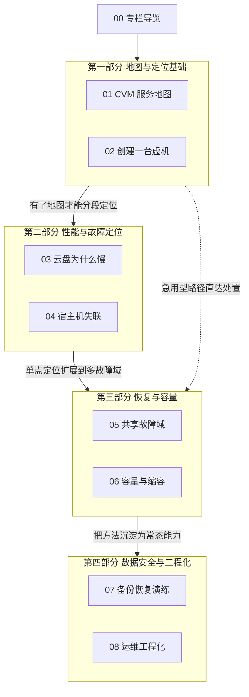

# 00 专栏导览

## 专栏定位

凌晨两点，告警同时报出四类异常：一批宿主机心跳丢失、部分计算与网络服务状态异常、若干虚机重启、管理面推送大面积超时。你面对的第一个问题不是「怎么修」，而是「这到底是一次故障还是四次故障」。

这个专栏要回答的，正是这类问题的完整答案链：**从看清结构，到定位故障，再到把方法沉淀下来**。它不是 OpenStack 的功能手册，也不是某类故障的案例集，而是一张写给平台可靠性工程师的知识地图——先把「一台虚机背后有哪些依赖」画成地图，再沿着地图练习定位：创建失败怎么分段排查、云盘慢怎么分层归因、宿主机失联怎么判定与恢复、多个故障域同时异常时恢复从哪里开始，最后把巡检、预检、SLO 与取证固化成常态能力。

本专栏的另一条主线是**区分「症状」与「根因」**。云平台故障的典型形态，是一个共享资源出问题、在监控上投射出许多互不相关的异常；如果按告警逐条处理，会同时开几条排查线，每条都找不到根因。专栏反复回到同一个方法：先按物理维度聚合、再交叉验证信号、最后找那个能解释全部症状的共享层。

## 读者画像与前置知识

本专栏为**平台可靠性工程师**而写——你可能是云平台团队的一员，正在运维一套基于 OpenStack 的弹性计算集群；也可能负责其中的存储、网络或虚拟化某一层，需要理解自己的部分如何嵌入整体。如果你只是对分布式系统的故障定位方法感兴趣，第 01、03、05 三篇也可以当作方法论读物单独读。

前置知识方面，不要求你有 OpenStack 运维经验，但以下三样最好有所准备：

- **组件基础**：知道计算、网络、存储、镜像这些服务各自负责什么，[[云原生/OpenStack/00 专栏导览|OpenStack 专栏]] 可以随时补课；
- **Linux 系统基础**：进程状态、内存水位、I/O 等待这些概念会反复用到，[[Linux/系统性能工程实战/00 专栏导览|系统性能工程实战]] 与 [[Linux/内存管理/00 专栏导览|Linux 内存管理]] 是很好的底稿；
- **分布式存储常识**：副本、一致性、恢复这些词不要求精通，[[中间件/Ceph/00 专栏导览|Ceph 专栏]] 里有系统介绍。

读完本专栏，你应当能独立完成三件事：为一次「创建失败」划出排查范围并定位到具体环节；在多组件同时异常时识别出共享故障域并确定恢复顺序；把一次故障处置沉淀为巡检项、预检项或告警规则。

## 专栏目录

全专栏八篇正文，按「地图 → 定位 → 恢复 → 工程化」四个部分组织。每篇的一句话简介说明它在整条叙事线里的位置，篇名链接直达正文。

### 第一部分 地图与定位基础

先建立对平台的完整认知：一次用户操作背后穿过哪些组件，以及一次创建请求会碰哪些服务。

- [[SRE/CVM集群可靠性工程/01 CVM 服务地图——用户操作、控制面与数据面依赖|01 CVM 服务地图]]——从排障视角重建「服务地图」：用户操作 → 控制面三段（准入 / 决策 / 落地）→ 数据面三段（计算 / 网络 / 存储），并分出八类故障域与恢复顺序的三条约束，是全专栏的总纲。
- [[SRE/CVM集群可靠性工程/02 创建一台虚机——跨 Nova、Placement、Neutron、Cinder 的故障定位|02 创建一台虚机]]——创建是唯一同时横跨控制面与数据面的写操作；本篇沿完整时序给出四交接点、候选查询、过滤器与权重器、账本竞态，以及用请求 ID 贯穿四个服务的证据地图。

### 第二部分 性能与故障定位

把「慢」与「失联」两类最常被抱怨的现象拆开，给出分层归因的方法。

- [[SRE/CVM集群可靠性工程/03 云盘为什么慢——Guest、QEMU、网络与 Ceph 的联合分析|03 云盘为什么慢]]——把存储链路拆成 Guest、QEMU、网络、Ceph 四层，逐层给出证据与误读陷阱，并用一次真实的存储恢复风暴演示四层证据如何收敛。
- [[SRE/CVM集群可靠性工程/04 宿主机失联——故障检测、Fencing、Masakari 与恢复决策|04 宿主机失联]]——把处置拆成检测、判定、隔离、恢复四步，讲清四类检测信号、判定三态（真失联 / 假死 / 只是慢）、为什么恢复前必须先隔离，以及实例高可用机制的能力边界。

### 第三部分 恢复与容量

从单机故障扩展到多故障域叠加，再到「平时」的容量账。

- [[SRE/CVM集群可靠性工程/05 共享故障域——网络、存储和控制面同时异常时的恢复顺序|05 共享故障域]]——解释为什么多个看似无关的异常往往来自同一个共享层，给出识别三步法与四类共享故障域，并系统讨论恢复顺序的三条约束与恢复期的二次伤害。
- [[SRE/CVM集群可靠性工程/06 容量与缩容——超分、资源碎片、故障预留和恢复空间|06 容量与缩容]]——把容量问题拆成超分、碎片、预留三个变量，回答「为什么有空闲却放不下」与「一个集群该留多少余量」，并说明缩容为什么比扩容更难。

### 第四部分 数据安全与工程化

面向最坏情况的准备，以及把前面所有方法沉淀成常态能力。

- [[SRE/CVM集群可靠性工程/07 备份恢复演练——RPO、RTO、数据校验与应用可用性|07 备份恢复演练]]——把备份与恢复拆成四个层次（有备份 / 能恢复 / 数据正确 / 应用可用），把 RPO 与 RTO 从口号还原成可度量、可演练的工程指标。
- [[SRE/CVM集群可靠性工程/08 运维工程化——巡检、维护预检、SLO 与故障取证自动化|08 运维工程化]]——把前七篇的判断方法固化为四件套：巡检、维护预检、SLO 与故障取证自动化，并划清只读与写入、自动与审批的边界。

## 两条阅读路径

八篇不必从头读到尾，两条路径对应两种处境。

**急用型路径（01 → 04 → 05 → 08）**：明天就要接手值班，先建立地图、再学单机与叠加故障的处置、最后了解可依赖的工程化能力。这条路径解决「眼前的问题」，代价是原理欠账——遇到反直觉的现象时容易卡壳。

**原理型路径（01 → 08 顺序精读）**：从地图到定位、从恢复到工程化，每一篇都为下一篇铺垫。走完这条路径，你不只知道每个现象怎么查，更知道它们为什么这样设计。

| 维度 | 急用型路径 | 原理型路径 |
| :--- | :--- | :--- |
| 适合处境 | 即将接手值班 | 系统建立认知 |
| 阅读顺序 | 01 → 04 → 05 → 08 | 01 → 08 顺序精读 |
| 建议节奏 | 一周内过完 | 每篇精读做笔记，三到四周 |
| 主要代价 | 原理欠账，遇反直觉现象易卡壳 | 远水不解近渴 |

两条路径没有高下之分，只有处境不同：救火的人先要活下来，建楼的人先要看图纸。时间充裕时，不妨先走原理型、再以急用型的四篇做实战校验。

## 关联专栏

CVM 平台不是孤岛，它与知识库里的几个专栏互为注脚：

- [[云原生/OpenStack/00 专栏导览|OpenStack 专栏]]——本专栏的组件基础，04/05/06/08/09 篇分别是 Nova、迁移、Neutron、Cinder、Glance 的深入拆解；本专栏聚焦跨服务定位与恢复，与之互补而非重复。
- [[中间件/Ceph/00 专栏导览|Ceph 专栏]]——卷的后端存储；03 篇的四层归因、07 篇的快照与校验都建立在对 Ceph 的理解上。
- [[Linux/系统性能工程实战/00 专栏导览|系统性能工程实战]]——宿主机侧的资源与性能方法论，04 篇的 D 态判定、06 篇的容量水位都用到它。
- [[Linux/进程管理/00 专栏导览|Linux 进程管理专栏]]——调度器与运行队列的底层机制，理解虚机 vCPU 被超分拖慢的基础。
- [[可观测/指标/00 专栏导览|指标专栏]]——本专栏多处用到的 PromQL 与告警设计，在那里有系统讲解。
- [[SRE/故障排查与复盘/00 故障排查索引|故障排查与复盘索引]]——真实事故复盘，可与本专栏的方法论互相印证。

这些链接都指向知识库中真实存在的专栏，交叉阅读不必求全：譬如读 03 时顺手翻一翻 Ceph 的 RBD 一篇即可，不必把整个专栏读完再回来。

## 专栏结构总览

最后用一张图收拢全专栏的骨架：四个部分自下而上叠成一条主线——先建地图，再练定位，然后处理恢复与容量，最后把方法固化成能力。

图中实线是原理型路径的顺承关系：地图与定位基础回答「一次操作穿过哪些组件」，性能与故障定位回答「两类常见现象怎么拆」，恢复与容量回答「故障叠加时怎么办、平时留多少余量」，数据安全与工程化回答「最坏情况怎么准备、方法怎么沉淀」——四问层层递进，正是四部分标题的由来。

虚线是急用型路径的捷径：从地图直接跳到恢复与容量，先解决眼前的问题，原理欠账留待回头补。这不是坏事——带着真实故障的困惑去读原理，往往比空对空地精读记得更牢。

平台可靠性没有银弹，本专栏给出的也只是一套判断框架与一组可复用的方法。带着「先看清结构、再定位故障、最后沉淀方法」这三个动作进入正文，是笔者能给出的最好阅读建议。
