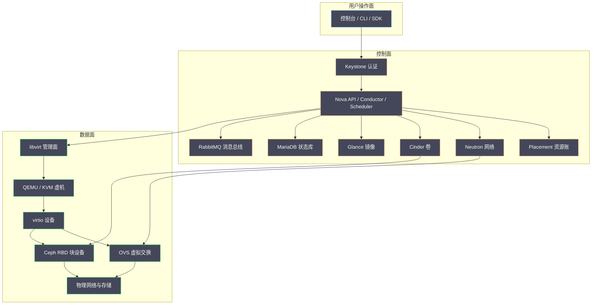

# 01 CVM 服务地图——用户操作、控制面与数据面依赖

**摘要：**

CVM 是构建在 OpenStack 之上的弹性云主机平台，对用户而言它只是控制台里的几个按钮，对运维而言却是一条横跨认证、调度、消息、网络与存储的长依赖链。本文不重复 OpenStack 各组件的基础介绍，而是从排障视角重建一张「服务地图」：先把用户操作翻译成控制面调用与数据面动作，再沿着依赖链分出控制面、数据面、宿主机与存储四类故障域，最后落到观测面的几套心跳与它们各自的盲区。全文回答两个问题：一次点击到底会碰哪些组件，以及一条告警应该往地图的哪一层去找答案。文中的平台规模与链路事实取自 2026 年 9 月的现场记录，凡涉及具体数字处均标注口径，不把某个时点的快照当成永久资产事实。

---

## 第 1 章 一个按钮背后的三个世界

设想一个再普通不过的下午：用户在控制台点击「创建云主机」，选好规格与镜像，三分钟后页面刷新出 IP 地址和登录密码，于是他把这件事忘了。但对运维而言，这三分钟里发生的事远比一次点击复杂——请求先经过认证，再被调度到某台物理机，然后由那台机器上的进程真正拉起一个 QEMU 实例，最后从分布式存储里接上一块卷、从网络里接上一根虚拟网线。任何一个环节卡住，用户看到的是同一条「创建失败」的提示，而运维需要判断的却是几十种可能。

排障的困难正来自这里：**同一件事，需要用三张不同的地图来看**。第一张是用户操作面，也就是 OpenStack 对外暴露的 API 与控制台，用户能感知的只有它的成败；第二张是控制面（Control Plane），由 Keystone、Nova、Placement、Neutron、Cinder、Glance 这些服务以及它们背后的数据库与消息队列组成，负责把「用户想要什么」翻译成「集群该做什么」；第三张是数据面（Data Plane），由计算节点上的 KVM、QEMU、libvirt、virtio 设备、虚拟交换机和 Ceph 的 RBD 客户端组成，负责让虚机真正跑起来、真正读写数据。

三张地图的关系，可以用一个老比喻说明：控制面是调度指挥中心，数据面是真正在路上跑的车队，用户操作面则是客户手里的叫车软件。叫车软件显示「已派单」，不代表车已经到楼下；指挥中心的地图亮着，也不代表某条路没有塌方。把这三者混为一谈，是排障时最常见的第一类错误——看到 API 返回 500 就以为虚机挂了，或者看到虚机还在响应就以为控制面正常。

本专栏的写作纪律，是把每一个现象都放回它所属的那张地图上。这一篇作为总纲，先建地图，后续各篇再逐块深挖。笔者先把结论摆出来：**控制面与数据面的生命周期是解耦的**，控制面故障通常表现为「无法变更」而非「正在运行的东西消失」，而数据面故障才直接影响虚机的存活与性能；但两者共享宿主机与存储这些物理资源，一旦共享层出问题，两张地图会同时变红。理解这条分界线，是后面所有故障定位的起点。



图中的橙色部分是控制面内部的调用关系，绿色部分是数据面的实际路径。值得注意的是，控制面到数据面只有很少的几条「落地」边——Nova 通过 libvirt 拉起虚机，Neutron 把虚拟网卡接到 OVS，Cinder 把卷挂给 QEMU。这几条边一旦建立，后续的数据流动就不再经过控制面，这正是两张地图解耦的结构性原因。想先补齐组件本身的知识，可以回到 [[云原生/OpenStack/00 专栏导览|OpenStack 专栏]]，本文只借用它的结论，不重复推导。

### 1.1 本平台的形态：多集群与混布

抽象的地图需要落到本平台的具体形态上才有意义。从运维视角看，本平台有几个必须先建立的事实，它们会贯穿整个专栏。

第一，**它是多集群的**。计算节点并非集中在单一机房，而是分布在若干地域集群中，规模在数百台量级。不同集群的网络出口、存储后端与可用性特征并不完全一致，因此「全集群统一」这类判断通常站不住脚，任何操作与告警都要先问「是哪个集群」。

第二，**它是混布的**。相当一部分计算节点同时承载 OpenStack 虚机与大数据负载，这在前面的故障域章节会展开，但它对地图的影响从第一章就开始了——宿主机不是「只属于 CVM」的，它的资源账要与别的负载一起算。

第三，**它的控制面与数据面共享底座**。数据库、消息队列、认证服务同时服务多个 OpenStack 组件，存储与网络后端同时服务多个集群，这使得「局部故障」与「全局故障」的边界不像组件图看起来那么清晰。

第四，**它有一套独立的可观测与配置管理链路**。指标、日志、告警、资产、配置分发各自有承载系统，它们既是排障的工具，也是故障的影响对象——宿主机资源紧张时，这些 agent 本身也会被波及，这一点在第 7 章会专门讨论。

把这几条事实记住，后面的所有分析都会轻松一些：多集群意味着要按集群维度聚合；混布意味着宿主机是共享故障域；共享底座意味着要先排除底座；独立链路意味着观测工具本身也可能失真。

## 第 2 章 用户操作地图：一次点击触发什么

要建地图，最直接的办法是把用户能做的操作逐个拆开，看它触发哪些服务、动到哪些数据面资源。下表按操作类型整理，主责服务指这个操作在控制面的核心执行者，关键依赖指必须在线否则操作无法完成的服务，数据面动作指在计算节点或存储上真正发生的改变。

| 用户操作 | 主责服务 | 关键依赖 | 数据面动作 | 典型失败表现 |
| :--- | :--- | :--- | :--- | :--- |
| 创建虚机 | Nova Scheduler + Conductor | Placement、Glance、Neutron、Cinder | 选定宿主机后拉起 QEMU，接网卡、挂卷 | 调度失败、卷超时、端口分配失败 |
| 开机 / 关机 | Nova Compute | Nova API、消息队列 | 通过 libvirt 启动或停止 domain | 请求已接受但状态不变（消息积压） |
| 硬重启 / 软重启 | Nova Compute | Nova API、消息队列 | 硬重启等价于断电重启，软重启走 ACPI | 软重启无效需改硬重启 |
| 挂载 / 卸载卷 | Nova + Cinder | Cinder、Ceph | 通过 libvirt 把 RBD 卷接入或摘除 | 卷一直处于 attaching 状态 |
| 创建 / 回滚快照 | Cinder | Ceph | RBD 快照，不搬数据 | 快照链过长导致性能退化 |
| 重建（Rebuild） | Nova Compute | Glance、Neutron | 换根盘、保留或重置网络 | 重建后 IP 或密钥不一致 |
| 删除虚机 | Nova Compute | Nova API、Cinder | 停止 domain、释放卷与端口 | 残留卷或残留端口 |
| 调整规格 | Nova | Placement、Cinder | 按新 flavor 改配置并重启 | 目标宿主机无足够资源 |
| 冷 / 热迁移 | Nova | Placement、Neutron、Ceph | 搬内存与磁盘状态到目标宿主机 | 热迁移长时间不收敛 |
| 疏散（Evacuate） | Nova + Masakari | Placement、共享存储 | 在另一宿主机重建虚机 | 无共享存储时无法疏散 |

这张表里最值得记住的规律是：**读操作走 API 与数据库，写操作还要过消息队列**。查询虚机列表只需要 Nova API 从 MariaDB 里读一条记录，快而稳定；而创建、开机、迁移这类会改变状态的操作，必须把请求投递到 RabbitMQ，由计算节点上的 nova-compute 消费后异步执行。这就解释了为什么消息队列故障时的症状很特别——API 仍然能接受请求并返回 202，但虚机状态长时间停在 `building` 或 `rebooting`，因为真正干活的消费者没收到指令。

以创建虚机为例，完整链路大致是这样的：Keystone 校验令牌，Nova API 把请求写入数据库并投递消息，Nova Conductor 负责数据库与计算节点之间的中转，Nova Scheduler 向 Placement 查询资源账并挑选宿主机，选中后 nova-compute 通过 libvirt 拉起 QEMU，Neutron 为虚机分配端口并把它接到 OVS，Cinder 从 Ceph 侧把卷映射给 QEMU，Glance 提供的镜像在这一步被写进根盘。链路上任何一环超时，请求都会以失败或长时间挂起告终。这条链路的逐段拆解，与 [[云原生/OpenStack/04 Nova 架构与调度——API、Scheduler 与资源模型|04 Nova 架构与调度]] 和 [[云原生/OpenStack/05 实例生命周期与迁移实战|05 实例生命周期与迁移]] 两篇互为补充，后者侧重状态机，本文侧重依赖关系。

笔者把这条链路拆成三段来看，排障会清晰很多：**准入段**（Keystone）、**决策段**（Nova Scheduler 与 Placement）、**落地段**（nova-compute、Neutron、Cinder）。准入段的失败是整齐的 401 或 403；决策段的失败往往是「没有可用宿主机」或「资源不足」，属于容量与调度问题；落地段的失败最杂，可能来自存储、网络、宿主机内存，甚至物理硬件。三段各有一套观测手段，后文会分别落到故障域里。

### 2.1 写操作为什么容易卡在中间态

把写操作的中间态单独列出来，是因为它们几乎都指向同一类根因。常见的有下面几种，每一种的处置方向都不同。

1. **`building` 长时间不变**：多半是消息未被消费，或调度器选不出宿主机，前者查消息队列，后者查资源账。
2. **`rebooting` / `powering-off` 不变**：计算节点未执行指令，查该节点服务与 hypervisor 状态。
3. **卷长期 `attaching` / `detaching`**：存储后端映射未完成，查块存储服务与分布式存储。
4. **端口长期 `DOWN`**：网络 agent 未完成绑定或流表下发，查网络 agent 与虚拟交换。
5. **迁移长期不收敛**：脏页产生速率超过传输速率，查虚机写入压力与宿主机间带宽。

判断这些中间态有一个通用方法：**先确认指令是否送达，再确认指令是否执行**。送达看消息侧，执行看目标服务侧，两步之间正是「控制面与数据面」的边界。掌握这条边界，就能把一个笼统的「操作卡住了」拆成两个可验证的假设。

再单独看两个容易踩坑的操作。其一是**热迁移**，它在控制面是一条迁移指令，在数据面却是「内存脏页持续同步 + 磁盘按需切换」的过程，能否收敛取决于虚机的写入速率与宿主机间网络带宽，脏页产生得比传输得快，迁移就会一直不收敛，这与 [[云原生/OpenStack/05 实例生命周期与迁移实战|05 实例生命周期与迁移]] 里讲的热迁移原理直接相关。其二是**疏散**，它本质上是在另一台宿主机上重建虚机，前提是卷与镜像不依赖本地盘；如果虚机的根盘是本地磁盘而非 Ceph RBD，疏散就失去了数据基础，这也是为什么共享存储是弹性平台的前提而非可选项。

还有一类容易被低估的操作是**删除与重建**。删除在控制面上是先标记再异步清理：API 把虚机状态置为 `deleting` 并投递消息，nova-compute 停止 domain、断开网络、解绑卷，随后释放资源。如果清理过程中途失败，就会留下「虚机已消失、卷或端口仍在」的残留，这些残留会持续占用 Placement 的资源账与 Neutron 的端口，久而久之造成「账上没资源、实际有资源」的假象。重建（Rebuild）则是另一种形态的残留风险：它换掉根盘却保留虚机身份，如果镜像或密钥参数没对齐，重建后的虚机可能出现登录失败或网络配置不一致。**异步操作的中间态是控制面与数据面最不一致的时刻**，也是「操作失败但资源已消耗」这类问题的高发区，处理它们的关键是确认每个中间态是否都有对应的收尾逻辑，以及收尾失败时是否有对账手段。在排障时，凡是看到状态长期停在某个中间态（`building`、`deleting`、`resizing`），都应当先怀疑消息或消费者，而不是去虚机内部找原因。

## 第 3 章 控制面依赖链：谁先挂，谁后挂

控制面看起来是一堆并列的服务，实际上它们共享三类底座资源，理解这三类资源就理解了控制面的脆弱点。这三类底座的细节，在 [[云原生/OpenStack/02 控制面三件套——MariaDB、RabbitMQ 与 Keystone|02 控制面三件套]] 里有完整展开，这里只讲它们在地图上的位置。

第一类是**状态库**，通常由 MariaDB 承担。虚机的元数据、卷的归属、网络的端口、Placement 的资源账，都落在数据库里。数据库的角色是「账本」——它不参与虚机的运行，但没有它，控制面就失去了记忆，任何写操作都无法落地。生产环境里数据库通常是多节点高可用部署，故障表现分两种：连接池耗尽会让 API 大面积超时，主从切换则会在切换窗口内产生短暂的写失败。对运维而言，数据库故障最棘手的地方不是恢复本身，而是它同时影响多个上层服务，容易让人误以为是一次「平台级故障」。

第二类是**消息总线**，通常由 RabbitMQ 承担。它的角色是「传送带」——把 API 收到的指令搬运到真正执行的服务。传送带停了，货架上的货还在（数据库状态不变），但新的货送不出去。这一点决定了消息队列故障的定位方法：先看 API 是否返回 202，再看目标服务是否有消费日志，若前者成功后者空白，问题多半在消息链路而非业务逻辑。消息总线还有一类隐蔽故障是「队列积压但未断连」，表现为部分计算节点响应正常、部分节点长时间无响应，此时看的是各队列的消费速率而不是服务是否存活。

第三类是**准入服务**，也就是 Keystone。它是所有请求的第一道闸门，令牌签发或校验异常时，整个控制面对用户来说等于「下线」，尽管内部服务其实都活着。准入故障的特征是错误高度同质——几乎所有操作都报认证错误，而不是零散的、与具体资源相关的错误。这个特征很容易区分：**当一个故障同时影响所有类型操作时，优先怀疑共享底座而不是某个业务服务**。

Keystone 的故障还有一层与时间相关的细节。现代部署多用 Fernet 令牌，令牌本身是加密的、无需查库即可校验，这降低了对数据库的依赖，但也让令牌的签发与校验强依赖各节点的时钟同步；一旦某个控制节点的时钟漂移，它会签发出「刚生成就已过期」或「尚未生效」的令牌，表现为零星的、与具体节点相关的认证失败，而不是全局认证故障。这类问题的识别方法是看失败是否集中在部分节点上——**全局认证失败查底座，局部认证失败查时钟与令牌缓存**。同理，令牌缓存（memcached 之类）异常也会产生类似症状，因为校验请求被随机分到不同节点后，命中缓存与未命中缓存的节点会给出不一致的结果。

除这三类底座外，还有几个服务之间的强依赖值得单独记住。Nova 依赖 Placement 记账：Placement 是 2017 年从 Nova 内部拆分出来的独立服务，专门维护资源提供者（Resource Provider）的库存与分配，Scheduler 选宿主机时必须先问它。Placement 的核心概念是清单（Inventory）与分配（Allocation）——清单描述某台宿主机有多少可用资源，分配记录某台虚机占用了多少，两者相减就是剩余容量。正因如此，Placement 的数据一旦与实际不符，就会出现「账上有资源、实际放不下」或「实际有空闲、账上却不足」两类相反的错误，前者导致创建失败，后者导致资源浪费。Nova 还依赖 Neutron 分配端口、依赖 Cinder 准备卷、依赖 Glance 提供镜像，这三者在创建路径上是串行等待的，任何一个慢都会把整体时间拉长。

至于 Neutron、Cinder、Glance 自身，也各自有数据库与消息队列依赖，所以一次数据库抖动往往不是只影响一个服务，而是沿着共享底座扩散到多个服务。下表把常见的控制面故障按「症状 → 可能层」做了归并，便于快速定向。

| 症状 | 可能所在层 | 进一步区分方法 |
| :--- | :--- | :--- |
| 所有操作报认证错误 | Keystone | 检查令牌签发与时钟同步 |
| 多数操作超时、数据库连接报错 | MariaDB | 看连接数与慢查询 |
| API 返回 202 但状态不变 | RabbitMQ | 看队列消费速率与消费者数量 |
| 仅创建失败，提示无可用宿主机 | Placement / Scheduler | 对比清单与真实容量 |
| 仅网络相关操作失败 | Neutron | 看 agent 状态与端口分配 |
| 仅卷相关操作失败 | Cinder / Ceph | 看卷状态与后端健康 |

这里有一个容易被忽略的认知：**控制面的可用性不是各服务可用性的简单乘积，而是取决于共享底座**。十个无状态服务可以随便横向扩展，但只要它们共用一个数据库或一条消息总线，底座的单点就会成为整条链的上限。这也是为什么控制面故障的排查顺序应当是「先底座、后服务」——先确认数据库、消息队列、认证是否健康，再去逐个服务里找原因。分布式系统的共识与选举机制在 [[分布式架构/分布式系统原理与协议/00 专栏导览|分布式系统原理与协议]] 里另有系统讲解，控制面底座的可用性设计正是这套理论在工程上的投影。

### 3.1 控制面故障的排查顺序

把上面的分析落成可执行的顺序，大致是四步。第一步确认认证，排除准入层；第二步确认数据库连通与慢查询，排除状态层；第三步确认消息队列的积压与消费者，排除传递层；第四步才逐个服务看日志与指标，定位到具体组件。这个顺序的收益是，前三步能覆盖绝大多数「看起来像平台级故障」的情形，把排查成本压到最低。它同时也解释了为什么「重启一遍服务」往往无效——如果根因在底座，重启业务服务只是把同一场故障重演一遍。

## 第 4 章 数据面依赖链：报文与块设备怎么走

控制面把虚机拉起来之后，真正决定虚机性能与存活的，是数据面这条路径。它的构成可以分成三段：计算段、网络段、存储段。

### 4.1 计算段：vCPU 与内存

计算段的核心是 KVM 与 QEMU。KVM 是内核里的虚拟化模块，提供 CPU 与内存的硬件虚拟化能力；QEMU 是用户态的虚拟机监视器，负责模拟设备、管理虚机生命周期；libvirt 则是两者之上的管理抽象层，Nova 通过它下发指令。一个虚机的 vCPU 本质上是宿主机上的一个线程，由宿主机调度器统一调度，因此**虚机的 CPU 性能上限首先取决于宿主机的运行队列与超分比例**，而不是虚机内部看到的核数。超分本身是提高资源利用率的正当手段，但超分比例过高时，虚机的 vCPU 会长时间排队等待，表现出来就是虚机内部「CPU 空闲却响应慢」——这类问题要回到宿主机的调度队列去看，[[Linux/进程管理/00 专栏导览|Linux 进程管理专栏]] 里的 CFS 调度器与运行队列概念正是理解它的基础。这三层的关系，[[云原生/OpenStack/03 虚拟化地基——KVM、QEMU 与 libvirt|03 虚拟化地基]] 有更细的拆解。

### 4.2 网络段：virtio 与虚拟交换

网络段的核心是 virtio 与虚拟交换。虚机的虚拟网卡通过 virtio 驱动与宿主机通信，宿主机侧对应一个 tap 设备，tap 再接入 Open vSwitch（OVS）的网桥，由 OVS 依据流表决定这个包是发往同宿主机上的另一台虚机，还是加上 VXLAN 封装后送往别的宿主机，抑或直接送到物理网卡。这里有两个关键机制值得记住：其一是 **virtio 的半虚拟化路径**，它让虚机侧驱动与宿主机侧后端配合，避免全模拟网卡的高开销；其二是 **OVS 的流表两级结构**，首个包走慢路径由控制器决定，后续同类包走快路径直接转发，因此流表配置错误往往表现为「新建连接异常、已有连接正常」这种时间相关的症状。报文路径上任何一个环节的 MTU 或流表配置错误，都会表现为「小包通、大包不通」这类典型症状，这也是后续网络故障实验篇要专门演练的对象。Neutron 数据面的完整路径，见 [[云原生/OpenStack/06 Neutron 架构——ML2、OVS 与网络命名空间|06 Neutron 架构]] 与 [[云原生/OpenStack/07 Neutron 进阶——VXLAN、DVR 与安全组|07 Neutron 进阶]]。

### 4.3 存储段：RBD 与限速

存储段的核心是 Ceph RBD。Cinder 管理的卷在多数生产环境里并不是本地磁盘，而是 Ceph 集群里的一块块（RBD image），QEMU 通过 librbd 以网络方式访问它。这意味着虚机的一次磁盘写，实际要经过「虚机内核 → virtio-blk → QEMU → librbd → 网络 → Ceph OSD → 磁盘」这样一条长链。**虚机侧的磁盘延迟，是这条链上所有环节延迟之和**，而其中最容易成为瓶颈的往往是 Ceph 集群自身的负载，尤其是数据恢复（Recovery/Backfill）与业务 I/O 争抢资源的时候。RBD 的语义与快照机制，[[中间件/Ceph/07 RBD 块存储——快照、克隆与 Kubernetes CSI|07 RBD 块存储]] 有系统介绍；恢复流量与业务流量的竞争，[[中间件/Ceph/05 PG 状态机与数据一致性——Peering、Recovery 与 Backfill|05 PG 状态机]] 讲得更深。QEMU 侧还有一个常被忽略的开关是缓存模式：`cache=none` 把数据直接交给 RBD 处理，`cache=writeback` 则先在宿主机页缓存里攒一批再落盘，后者对突发写入更友好，代价是宿主机断电时可能丢缓存中的数据。缓存模式选错，会让「虚机内看到已落盘」与「存储侧确实已落盘」两件事脱节，这是排查数据一致性问题时必须确认的一环。

存储段还有一个与「云盘为什么慢」直接相关的维度是 I/O 限速（QoS）。平台可以通过 libvirt 的 iotune 参数对单块盘下发带宽、IOPS 与突发额度限制，限制在 hypervisor 侧生效，因此虚机内部完全看不到它的存在。这带来一个典型的排障陷阱：虚机内测得磁盘延迟很高，但存储后端一切正常，原因却是宿主机侧下发的 IOPS 上限被打满。**看到「存储慢」时，先确认延迟是产生在存储后端还是产生在宿主机侧的限速点**，方法是同时看 hypervisor 侧的实际下发限速与存储后端的延迟指标，两者对不上时，瓶颈就在中间的某一层。这也解释了为什么单看虚机内部的 `iostat` 常常得不出结论——它看不到限速点在哪，也看不到限速点之后那条链路的状态。

### 4.4 三段的共同点：都不经过控制面

三段数据面有一个共同特征：它们都不经过控制面。控制面整体宕机，正在运行的虚机依然会继续跑，网络依然通，磁盘依然可读写——除非故障同时波及了物理网络或 Ceph 集群。这个特征既是好事也是陷阱：好事在于控制面故障不会立刻伤及业务，陷阱在于运维容易误判「控制面恢复了」就等于「一切恢复了」，而数据面的问题（譬如 Ceph 恢复流量仍在打满）可能还在持续。理解数据面的长链结构，也是理解「云盘为什么慢」这类问题为什么必须跨 Guest、QEMU、网络与 Ceph 联合分析的前提。

## 第 5 章 计算节点上的共居者：混布带来的隐性依赖

前面四章把 CVM 画成一张自洽的地图，但真实生产里，这张地图只是宿主机上的一部分。本平台的相当一部分计算节点采用**混布**部署——同一台物理机上既跑 OpenStack 的虚机，又跑大数据集群的存储或计算进程。混布提高了资源利用率，代价是把两个原本隔离的故障域焊在了一起。

以 2026 年 9 月的一次现场记录为例，混布宿主机上的资源分配大致是这样的：物理内存约 187 GiB，其中约 96 GiB 被预留为 1 GiB 的 HugePage 供虚机使用，剩余普通内存由大数据进程与各类管理 agent 共享；同机上还跑着约十个存储进程，事故现场它们的常驻内存合计超过 70 GiB，而承载这些进程的 cgroup 并没有设置硬性上限。于是一个结构性的风险出现了：**HugePage 从普通内存池里划走了将近一半的物理内存，而普通内存的占用者却没有总量门禁**，一旦普通页跌破内核低水位，触发的是整机级别的 global OOM，而不是某个 cgroup 内的 OOM。大页内存的分配机制与 NUMA 节点的内存水位，[[Linux/内存管理/00 专栏导览|Linux 内存管理专栏]] 里有完整的原理解释，这里关心的是它在混布场景下带来的后果。

这条事实链值得单独记住，因为它改变了排障的起点。当宿主机内存枯竭时，内核挑选牺牲进程的依据是内存占用大小，于是高占用的大数据进程往往先被杀；但触发分配动作的可能是虚机的 I/O 线程——现场记录里就出现过「QEMU 的 RBD 消息线程触发 OOM，被杀死的却是存储进程」这样的错位。**触发者不等于根因，被牺牲者也不等于受害者**，这正是混布环境下最容易误判的地方。更麻烦的是 NUMA 局部性：如果 HugePage 与虚机的 I/O 线程绑定在同一个 NUMA 节点上，而这个节点的普通内存先耗尽，即使全机还有可用内存，也会因为绑定的内存节点枯竭而触发 OOM，这就是「全机看还有余量、局部却已报警」的由来。

除大数据进程外，宿主机上还共居着一整层管理 agent：指标采集器、监控 agent、配置管理 minion 以及日志采集器。它们平时是「隐形的」，但在内存压力下会与业务进程争抢资源，甚至被反复杀死。现场记录里，某个混布节点在六小时内出现数十次 global OOM，配置管理 minion 被杀的次数高达四十七次，直接解释了「管理面为何不稳定」——不是管理链路本身有问题，而是它的 agent 一直在被内核清理。这一现象还有一层连锁：配置管理 agent 被反复杀死，会导致后续的批量下发与配置收敛失败，从而让「本该自动修复的漂移」迟迟得不到修复，故障恢复因此被拖长。

同机共居的各类进程在内存压力下的角色并不相同，下表把它们与各自的资源归属对应起来，方便在取证时判断「谁被杀了、为什么是它」。

| 共居者 | 主要资源 | 在内存压力下的角色 |
| :--- | :--- | :--- |
| 虚机进程（QEMU） | HugePage、vCPU | 常是触发者，绑定节点枯竭时触发 OOM |
| 大数据存储与计算进程 | 普通内存（往往占大头） | 主要占用者，常被内核选中牺牲 |
| 监控采集器 | 少量 CPU 与内存 | 采集通道，被杀后心跳丢失 |
| 配置管理 agent | 少量 CPU 与内存 | 批量下发通道，被杀后配置收敛失败 |
| 日志采集器 | 少量 CPU 与内存 | 取证通道，被杀后留下日志缺口 |

这张表解释了一个反直觉的现象：**心跳丢失常常不是监控系统的问题，而是监控 agent 成了内存压力的第一批牺牲者**。因此在宿主机资源紧张的现场，心跳与 agent 状态异常应当被读作「症状」而不是「根因」，真正的证据要到内核日志与内存水位里去找。

从机制上说，这类事故的根因可以拆成三个可观测的开关：其一是有没有硬性内存上限，cgroup 的 `memory.max` 若未设置，进程组就只能受整机水位约束；其二是有没有把大页与普通页分开核算，HugePage 一旦预留就不会归还给普通内存池，若不做总量门禁，普通页的可用量会被悄悄削掉一大块；其三是 NUMA 绑定是否合理，把虚机的 I/O 线程与它需要的内存绑在同一个节点上，本意是降低跨节点访问延迟，副作用是让该节点的水位更早触顶。现场取证时，用压力失速信息（Pressure Stall Information，PSI）判断内存是否真的成为瓶颈，比只看可用内存更可靠——**PSI 反映的是「进程因为等内存而停滞」的时长，它比「还剩多少内存」更接近业务体感**。这三个开关也提示了治理方向：给大数据进程设上限、给大页与普通内存设总量门禁、给关键 I/O 线程留出跨节点的余量。

这引出了本章的核心认知：**宿主机是一个共享故障域，它同时承载控制面的 agent、数据面的虚机与大数据的工作负载**。当这个故障域出问题时，监控心跳、OpenStack agent 状态、虚机存活会同时异常，看起来像是一次「平台级故障」，实际根因却在单机的内存账上。把宿主机作为独立故障域纳入地图，是混布时代不可省略的一步。现场取证时，除了常规的可用内存与 swap，还应一并采集各 NUMA 节点的空闲内存、水位线、PSI 压力指标以及 HugePage 的「滞留空闲」量——后者指的是已被预留、却因 NUMA 局部性而无法被其他节点利用的大页，它常常是「看起来有空闲、实际用不上」的元凶。

### 5.1 混布资源账的三个口径

混布环境的资源账有三个层次的口径，用错口径就会得出错误结论，值得单独说明。

- **口径一：只看虚机侧**。虚机内部看到的是自己的配额，与宿主机实际余量无关，用它判断容量必然失真。
- **口径二：只看整机可用内存**。它忽略了 HugePage 的预留与 NUMA 的局部性，会出现「整机有余量、局部已枯竭」的误判。
- **口径三：按 NUMA 节点分账，并把大页与普通页分开核算**。这是唯一能提前发现风险的算法，也是现场记录反复验证过的口径。

三个口径的差别，本质上是「把宿主机当成一个整体」还是「当成若干个可独立枯竭的池子」。混布环境下，后者的视角才接近真实。这也是为什么容量类告警不能只写「可用内存低于某值」——在混布节点上，真正该告警的是「某个 NUMA 节点的普通页低于水位」或「某类进程的占用超过承诺额度」。

## 第 6 章 故障域划分：把告警放回地图

有了操作地图、控制面链、数据面链和宿主机这几块拼图，就可以把故障域正式划分出来。故障域的意义在于：它决定了故障的影响半径，也决定了观测信号的形状。下表按影响半径从小到大排列。

| 故障域 | 典型组件 | 影响半径 | 观测信号 |
| :--- | :--- | :--- | :--- |
| 单虚机 | 虚机内进程、guest 内核 | 一台虚机 | 业务探针、虚机内指标 |
| 单宿主机 | QEMU、libvirt、网卡、本地 agent | 该机上所有虚机 | 心跳丢失、agent 状态、宿主机指标 |
| 控制面共享底座 | MariaDB、RabbitMQ、Keystone | 全集群变更能力 | 多类操作同时失败、API 超时 |
| 控制面单服务 | Nova、Neutron、Cinder、Glance | 相关操作类型 | 特定操作失败、其他操作正常 |
| 存储后端 | Ceph 集群、RBD、OSD | 使用该后端的全部卷 | 磁盘延迟上升、I/O 错误 |
| 网络后端 | OVS、物理网络、隧道 | 相关网段或全集群 | 连通性异常、丢包、错误计数 |
| 宿主机共享资源 | 内存、HugePage、NUMA、CPU | 混布机上所有负载 | OOM、PSI、内存水位 |
| 机房与链路 | 交换机、专线、上游网络 | 整机房或跨机房 | 大面积心跳丢失、跨机房不通 |

这张表的用法是「由内向外」：拿到一条告警，先问它的影响半径有多大，再回表里找对应的故障域。影响半径小、信号孤立的，多半是单机或单虚机问题；影响半径大、信号同质的，多半是共享底座问题。**影响半径是比告警级别更可靠的分类依据**，因为告警级别反映的是业务后果，而影响半径才指向根因所在。举例来说，一台宿主机失联会同时触发它上面所有虚机的心跳告警，影响半径是该机上的全部虚机，属于「单宿主机」域；而一条存储延迟告警如果命中的是大量不同宿主机上的卷，影响半径就跨越了宿主机边界，应当往「存储后端」域去找。

需要特别警惕的是跨故障域的连锁。前面提到的混布内存枯竭就是一个典型：它起于单机的内存账（宿主机共享资源域），却同时击穿了监控心跳（管理 agent 被 OOM 杀死）、OpenStack agent 状态（nova-compute、neutron agent 同样被杀）、以及虚机存活（部分虚机重启或迁移）。这种连锁之所以危险，是因为它在监控上表现为「很多不相关的组件同时挂了」，很容易被误判为控制面整体故障，从而把排查方向带偏。识别它的关键，是找到那个能同时解释所有症状的共享层——在本例中就是宿主机的内存。判断方法也很朴素：把这些异常按「物理主机」这个维度聚合一下，如果它们集中在少数几台机器上，共享层的嫌疑就远大于控制面。

故障域之间还存在「恢复顺序」的约束，这会在后续的共享故障域篇里专门展开，这里先给出一条原则：**恢复应当从影响半径最大、最底层的故障域开始**。物理网络没通，先修控制面没有意义；宿主机内存没释放，先重启虚机只会再次被 OOM。恢复顺序搞反，会把一次故障拖成两三次。

### 6.1 恢复顺序的三条约束

恢复顺序不是随意排的，它受三条约束支配。第一是**依赖方向约束**：被依赖者先恢复，依赖者后恢复，网络未通则控制面恢复无意义。第二是**资源释放约束**：共享资源故障必须先释放压力，否则重启只会再次触发，宿主机内存未释放就回迁虚机，虚机会再次被 OOM。第三是**验证约束**：每一层恢复都要有独立的回读证据，不能因为上层恢复就假定下层也好了。

这三条约束合起来，给出了一个可操作的恢复次序：先物理层（网络、供电），再共享资源层（宿主机内存与存储后端），然后控制面底座（数据库、消息队列、认证），最后才是业务层（虚机回迁与状态收尾）。每一次向前推进，都要用上一层的回读证据确认它真的稳定了，而不是「看起来没报错」。

### 6.2 快速估计影响半径

影响半径有一个快速的估法：数一数同一条告警命中了多少个「物理主机」和多少个「集群」。

- 命中一台主机、一个集群：单机问题，往宿主机故障域找。
- 命中多台主机、一个集群：先看这些主机是否共享同一机架或同一存储后端。
- 命中多个集群：几乎必然是共享底座或上游网络，直接查控制面底座与物理链路。

这三档估法与第 8 章的勘察顺序配合使用，能在几分钟内把范围从「整个平台」收窄到「一层」。

## 第 7 章 观测面：几套心跳与它们的盲区

地图画完了，还需要一套观测手段来确认「地图上的某个点是否还活着」。本平台并不只有一套监控，而是几套并行的采集链路，理解它们的差异与盲区，才能读懂告警。指标体系的整体设计，[[可观测/指标/00 专栏导览|指标专栏]] 有系统讲解；日志链路的采集与存储，见 [[可观测/日志/00 专栏导览|日志专栏]]。

第一套是**指标与告警链路**：宿主机上的采集器周期性地把指标推送到时序数据库，再由告警平台按规则判定。它覆盖最广、粒度最细，是判断宿主机与组件健康的主力。第二套是**传统监控 agent**：以 pull 或 push 方式上报心跳与基础资源，往往承担主机可达性这一最基础的判断。第三套是**日志采集链路**：把宿主机与组件的日志汇聚到日志系统，用于事后取证与根因分析。这三套链路相互独立，因此「三套同时报警」与「只有一套报警」本身就是重要的信息：前者指向真实的资源或网络故障，后者往往只是某条采集链路自身的问题。

此外还有两个容易被忽视的角色。一个是 **hypervisor 侧 exporter**：它直接连接计算节点上的 libvirt，提供虚机维度的视角，包括虚机状态、vCPU 延迟、块设备 I/O 延迟、网卡收发与丢包等，这是从「宿主机看虚机」的窗口，与控制面 API 看到的状态互为补充。它的价值在于能提供控制面看不到的细节，譬如块设备的实际读写延迟与虚拟网卡的丢包计数；它的局限也很明确——它只能看到 hypervisor 侧的虚机与虚拟设备，替代不了 Nova API、实例高可用流程、存储后端与宿主机硬件的监控。另一个是 **CMDB 与配置管理**：前者维护「集群里应该有哪些主机」的资产事实，后者负责把 exporter 之类的制品批量下发到这些主机上，两者共同构成了「目标清单」的权威来源。这两者的配合方式，是「资产事实 → 目标清单 → 批量下发 → 回读验收」这样一条闭环，任何一环缺失，覆盖就会悄悄出现缺口。

hypervisor 侧 exporter 能提供的指标可以按问题类型归并，下表列出的几类与本文的故障域一一对应，指标名为现场实际使用的名称。

| 指标类别 | 代表指标 | 能回答的问题 |
| :--- | :--- | :--- |
| 采集器健康 | `libvirt_up`、`libvirt_versions_info` | exporter 是否成功连上 libvirt、版本是否匹配 |
| 虚机状态 | `libvirt_domain_info_vstate` | 虚机是运行、暂停还是崩溃 |
| vCPU 调度 | `libvirt_domain_vcpu_delay_seconds_total` | vCPU 是否被超分拖慢 |
| 块设备 I/O | `libvirt_domain_block_stats_read_time_seconds_total`、`..._requests_total` | 磁盘延迟与 IOPS 落在哪一层 |
| 虚拟网卡 | `libvirt_domain_interface_stats_receive_errors_total`、`..._drops_total` | 网络是否丢包或报错 |
| 内存明细 | `libvirt_domain_memory_stats_used_percent` | 虚机内存压力与气球回收情况 |

这张表有一个使用前提值得点明：块设备指标看到的是 hypervisor 侧的 I/O 行为，它能告诉你「这块盘的延迟有多高」，但不能告诉你「延迟是 Ceph 后端造成的还是宿主机限速造成的」，后者必须结合存储后端指标一起看。这正呼应了第 4 章存储段的结论——**跨层的问题要用跨层的证据来回答**，任何单一观测面都不足以给出根因。

### 7.1 关键事件与日志的位置

观测不只靠指标，事件与日志往往能直接给出「谁在什么时候做了什么」。下表按关注对象列出排障时最常用的证据来源，用于快速定向；具体的日志路径随部署方式而异，这里只给出「该看哪一类」。

| 关注对象 | 主要证据来源 | 能回答的问题 |
| :--- | :--- | :--- |
| 认证与令牌 | 认证服务日志 | 是全局还是局部认证失败 |
| API 请求 | 各服务 API 日志 | 请求是否到达、返回什么错误 |
| 消息消费 | 计算 / 网络 / 存储服务日志 | 指令是否被消费、是否报错 |
| 虚机生命周期 | 计算节点服务日志与 hypervisor 日志 | 拉起、关机、迁移是否真正执行 |
| 网络端口 | 网络 agent 日志 | 端口绑定与流表是否下发 |
| 卷挂载 | 存储服务日志与后端日志 | 卷映射是否完成、后端是否报错 |
| 宿主机资源 | 内核日志 | 是否发生 OOM、NUMA 与硬件事件 |

这张表与前面的指标表是互补关系：指标告诉你「现在的状态」，事件与日志告诉你「怎么变成这个状态的」。排障时常见的一个误区，是只看指标的现状而忽略事件的时间线，结果把「结果」当成了「原因」。**时间线的价值在于确定先后关系**，而先后关系正是区分因果与巧合的依据——现场记录里判断「Pallas 服务异常早于主机 OOM」用的就是这条方法，两者相差两分钟，却足以改变整个根因结论。

### 7.2 告警治理的一条原则

心跳类告警在治理时应当区分两种含义：一种是「采集通道出了问题」，另一种是「被采集的对象出了问题」。前者是观测问题，后者是业务问题，两者的处置优先级与责任人都不同。区分方法很简单——**同时看两类信号**：如果只有心跳异常而业务探针正常，多半是观测问题；如果心跳与业务探针同时异常，才是业务问题。

这条原则的价值在于降噪。宿主机资源紧张时，最先消失的往往是采集 agent 的心跳，此时如果直接把心跳告警升级为业务告警，会在真正的根因之外制造大量次生噪音，反而淹没关键信号。正确的做法是让心跳告警带上「观测链路」的语义，与业务告警分属不同的等级与处置流程，这也是后续运维工程化篇要展开的内容。

观测面最大的盲区，是把「采得到」等同于「业务正常」。心跳丢失只能说明采集通道断了，可能的原因包括：宿主机资源枯竭导致 agent 被杀死、网络不通、采集器自身故障，甚至只是采集器正在重启。反过来，心跳恢复也只说明采集通道重新通了，不代表虚机业务已经恢复——**在宿主机内存枯竭的现场，监控心跳恢复往往只是因为高占用进程被杀、压力暂时回落，而 OpenStack 的网络管理面可能仍然异常**。因此在恢复判据里，心跳只是必要条件之一，还必须叠加控制面 agent 状态、资源水位与业务探针。

第二个盲区是拓扑映射的缺失。当一条告警只带逻辑节点名（譬如某个分布式的逻辑数据节点），而运维手里只有物理机的 IP 清单时，两者对不上号，排查就会卡在第一步。现场记录里就出现过「逻辑数据节点到物理 IP 的映射缺失，导致无法定位首个异常机器」的困境。建立「物理 IP → 各类 agent → 虚机 UUID/IP → 业务标签」的可查询映射，是观测面建设里回报最高的一件事，也是本专栏后续多篇会反复用到的基础设施。拓扑标签一旦可查，故障影响面就能自动列出宿主机、虚机、业务归属，而不必人工拼接。

第三个盲区是采集链路自身的失败语义。以 hypervisor exporter 为例，它通常是轻量客户端，把指标直接推送到时序数据库，没有本地磁盘队列，因此网络或时序库故障期间可能丢失若干周期样本，下一周期再继续重试。这类丢失不会告警，但会让「某段时间没有数据」被误读为「那段时间一切正常」。理解每种采集方式的失败语义，才能正确解读数据的缺席。如果业务上要求更强的缓冲能力与多目标路由，正确的做法是改用更专业的采集代理，而不是继续给轻量 exporter 加功能——这是能力边界问题，不是配置问题。

## 第 8 章 只读勘察：把地图落到命令

地图再清晰，也要落到命令上才有用。本章给出一次只读勘察的顺序与命令，全部是查询类操作，不改变任何状态，也不触发迁移或重启。勘察的目标不是立刻解决问题，而是把「异常发生在哪一层」这件事用证据固定下来，避免在多个猜测之间反复横跳。

### 8.1 先确认资产基线

资产事实以 CMDB 为准，先拿到「应该有哪些计算节点」的基线，再与「实际在线的节点」做差集，差集就是覆盖缺口。这一步的意义在于把「谁不见了」从猜测变成清单。

```bash
# 从资产侧导出目标清单（示例：按所属服务筛选运行中设备）
# 输出用于生成配置管理的目标 pillar，并由 state 侧再次校验
cmdb-cli list --service '<compute-service>' --status running --format ip
```

### 8.2 再确认控制面健康

用一次轻量的读操作确认认证、API、数据库与消息队列是否正常。读操作只走 API 与数据库，因此它能快速区分「底座问题」与「业务问题」。

```bash
# 认证与 API：能拿到令牌说明 Keystone 与 API 正常
openstack token issue -f value -c id >/dev/null && echo "auth ok"

# 控制面服务与 agent 状态：state 为 up 才是正常
openstack compute service list --service nova-compute -f value -c Host -c State
openstack network agent list -f value -c Host -c Alive -c State
openstack volume service list -f value -c Host -c State

# 消息队列：看积压与消费者数量，积压上升而消费者为 0 即异常
rabbitmqctl list_queues name messages consumers | sort -k2 -n -r | head
```

### 8.3 从 hypervisor 视角看虚机

控制面看到的是「虚机应该是什么状态」，hypervisor 看到的是「虚机实际是什么状态」。两者对不上时，问题多半在控制面与计算节点之间的消息链路上。

```bash
# 虚机实际状态与资源占用
virsh list --all
virsh domstats <domain> --state --cpu-total --balloon --block

# 块设备 I/O 计数，用于判断延迟落在哪一层
virsh domblkstat <domain> <target-device>

# 指标侧回读：按集群确认采集覆盖与新鲜度
# count by (cluster) (libvirt_up{job="openstack-libvirt-exporter"} == 1)
# time() - timestamp(libvirt_up{job="openstack-libvirt-exporter"})
```

### 8.4 看存储与网络后端

虚机的卷与网卡最终落在存储与网络后端上，这一层的证据必须单独取，不能从虚机内部反推。

```bash
# 存储后端：集群健康、PG 状态与容量分布
ceph -s
ceph osd df tree
rbd info <pool>/<image>

# 网络后端：网桥、端口与网卡错误计数
ovs-vsctl show
ovs-dpctl show
ip -s link show <tap-or-bond>

# 安全组与连接跟踪：并发连接是否达到上限、是否有大量无效状态
conntrack -C
conntrack -S
```

连接跟踪表的容量是一个容易被忽略的隐性瓶颈：安全组与 NAT 依赖它维护连接状态，一旦表被打满，新建连接就会被丢弃，而虚机内部往往只看到「时通时不通」，看不出与宿主机的关系。这类问题要回到宿主机侧看 `conntrack` 的计数与丢弃统计，而不是在虚机内部找原因。

### 8.5 最后做取证：日志与资源水位

当怀疑落到宿主机资源上时，取证的重点是「有没有被内核清理过」以及「压力有多大」。这一步的顺序应当是先保存现场、再考虑处置。

```bash
# 内核 OOM 现场：谁触发的、谁被杀的、发生在哪个内存节点
journalctl -k --since "2 hours ago" | grep -iE "oom|killed process"
dmesg -T | grep -iE "oom|numa|hugepage"

# 资源水位：内存、swap、PSI 压力、NUMA 分布与大页
free -h
cat /proc/pressure/memory
numastat -m
grep -iE "hugepage|hugepages" /proc/meminfo
```

### 8.6 勘察清单

把上面的命令整理成一张清单，按「资产 → 控制面 → hypervisor → 后端 → 宿主机」的顺序执行，可以得到一份完整的现场快照。

| 顺序 | 目标 | 关键证据 | 对应故障域 |
| :--- | :--- | :--- | :--- |
| 1 | 资产基线 | 目标清单与在线差集 | 覆盖缺口 |
| 2 | 控制面 | 认证、服务状态、队列积压 | 控制面底座 / 单服务 |
| 3 | hypervisor | 虚机状态、块设备与网卡计数 | 单虚机 / 单宿主机 |
| 4 | 存储与网络 | 集群健康、PG、网桥与错误计数 | 存储后端 / 网络后端 |
| 5 | 宿主机 | OOM 记录、PSI、NUMA、大页 | 宿主机共享资源 |

这套顺序之所以有效，是因为它沿着一张地图由外向内推进，每一步都在排除一种可能，而不是把所有猜测堆在一起。它也与第 6 章「先定影响半径、再定位故障域」的原则完全一致。

## 第 9 章 一条告警的定位推演

抽象的地图要在具体场景里才有用。本章用一个综合性的告警做一次定位推演，演示如何把前面几章拼起来用。假设某个深夜，运维同时收到这样几条信号：若干虚机的业务探针超时；一批宿主机的监控心跳丢失；部分计算节点的网络 agent 状态异常；告警平台显示相关主机内存使用率接近饱和。信号很多，看起来像是平台大面积故障。

第一步是**判断影响半径**。把告警按物理主机维度聚合，会发现异常主机集中在某个可用区的一小组机器上，而不是全集群均匀分布。影响半径被限定在「若干宿主机」这个范围，控制面共享底座（数据库、消息队列、认证）的嫌疑立刻下降——因为如果是底座问题，异常应当是均匀铺开的。

第二步是**确认控制面是否健康**。查询一个正常宿主机上的虚机列表与卷列表，若控制面 API 响应正常、数据库连接正常、消息队列消费正常，则可以确认控制面底座无碍，把注意力收回到宿主机这一层。

第三步是**区分控制面 agent 异常与虚机异常**。网络 agent 状态异常可能是它自己被杀，也可能是它依赖的网络真的断了。此时看虚机是否还在收发数据：如果虚机网络仍通、只是 agent 心跳异常，说明是 agent 被资源压力清理，而非网络本身故障；如果虚机网络也不通，则要往网络后端域去找。

第四步是**找共享层**。既然异常集中在少数主机、且同时表现为心跳丢失与 agent 异常，最可能的共享层就是宿主机的资源。查看这些主机的内存水位、swap 使用、OOM 记录与 NUMA 节点空闲内存，如果看到 global OOM 记录、swap 接近耗尽、某个 NUMA 节点普通内存跌破水位，根因就基本锁定在宿主机内存账上。

第五步是**解释连锁**。此时再回头看，心跳丢失、agent 异常、虚机探针超时都能被同一个共享层解释：内存枯竭导致各类 agent 与业务进程被内核清理，采集通道因此中断，控制面 agent 因此掉线，虚机因此卡顿甚至重启。整条链路不需要假设多个独立故障。

这个推演的价值不在于得出某个具体结论，而在于展示一种顺序：**先定影响半径，再排除共享底座，然后区分控制面与数据面，最后找能统一解释所有症状的共享层**。它把一个看起来像「平台大面积故障」的现象，收敛到一台或几台主机的内存账上——而真正处理起来，往往只是释放内存或隔离这几台机器，而不是重启整个平台。这与第 6 章「由内向外」的原则是同一条思路。

### 9.1 换个走向：如果它是控制面故障

同样的四条初始信号，如果异常不是集中在少数主机、而是均匀铺开在所有集群上，推演的走向就会完全不同。此时第一步的判断就会指向控制面共享底座：因为均匀分布恰恰说明故障源在「所有节点共同依赖的东西」上，而单机故障不可能均匀。接下来只需依次确认认证、数据库与消息队列，通常在前三步就能定位。

这个对照说明，**影响半径不仅是分类依据，也是决定排查路线的分岔点**——同样的信号，半径不同，答案就在地图的不同角落。反过来也成立：如果排查了半天始终收敛不到一个统一的根因，往往是因为一开始就把影响半径判断错了，把局部问题当成全局问题，或者把全局问题当成局部问题。遇到僵局时，回到第一步重新判断影响半径，比继续在细节里打转更有效。

## 第 10 章 边界与反例：服务地图什么时候会骗你

地图是工具，不是真理。本章列出四种会让服务地图失效的情形，它们都是真实排障中踩过的坑。

第一，**依赖图是快照，不是合同**。本文画出的调用关系反映的是当前部署形态，一旦引入新的网络后端、新的调度组件或新的存储接口，依赖关系就会变。抱着旧地图排查新问题，是刻舟求剑。地图的价值在于提供排查的起点和分类的框架，而不在于给出唯一正确的答案。每隔一段时间回读一次真实的调用与部署形态，比背诵一张静态图更重要。

第二，**心跳恢复不等于业务恢复**。这一点在第 7 章已经展开，但值得再强调一次：监控链路的恢复可能只是资源压力的暂时回落，真正的恢复判据应当包含业务探针、控制面 agent 状态与资源水位三者的同时满足，且需要维持一段稳定时间。仅凭单一信号宣布「已恢复」，是事故处置中最常见的过早乐观。稳妥的做法是给恢复设一个观察窗口，窗口内全绿才标记为缓解，再经过更长的无复发观察才考虑关闭。

第三，**控制面恢复不等于数据面恢复**。控制面是异步的，它恢复后，积压的消息还需要被消费，处于中间态的虚机还需要完成收尾，Ceph 的恢复流量可能还在持续占用资源。把「API 能返回 200」当成终点，会漏掉后面更长的一段恢复期。同理，数据面恢复也不等于业务恢复——虚机活着不等于虚机内的应用健康，这需要业务侧的探针来确认。

第四，**共享层的故障会伪装成多个独立故障**。混布内存枯竭的案例已经说明，一个共享资源问题可以在监控上投射出监控、控制面 agent、虚机三类互不相关的异常。应对的办法不是记更多的组件知识，而是养成「先找共享层」的习惯——**当多个看似无关的组件同时异常时，先问它们是否共享同一个物理资源、同一个底座或同一个宿主机**。这也是本专栏反复回到的一条主线。

### 10.1 五类常见误判

把这四种失效情形落到具体判断上，可以归纳为五类反复出现的误判，列在下面供自查。

1. **把控制面故障当成业务故障**：API 报错就认为虚机不可用，实际虚机仍在正常服务，真正失效的只是变更能力。
2. **把心跳丢失当成网络故障**：心跳丢失的第一嫌疑往往是宿主机资源，而不是网络本身，两者的处置方向完全不同。
3. **把单机故障当成平台故障**：多个组件同时异常时，先按物理主机聚合，多数情况下能收敛到少数几台机器。
4. **把症状当成根因**：OOM 被杀的是高占用进程，触发者却可能是另一个进程，二者不能混为一谈。
5. **把恢复信号当成恢复完成**：心跳恢复、API 恢复都只是必要条件，业务探针与稳定观察窗口才是充分条件。

行文至此，可以把这一篇的落点收在三条原则上。其一，架构即权衡，控制面与数据面解耦带来了可用性上的韧性，代价是故障表现的复杂化，理解这份代价才能不误判。其二，复杂性不会消失只会转移，混布把资源利用率提上去了，却把隔离性转移成了宿主机上的共享故障域。其三，没有放之四海皆准的排查顺序，只有因地制宜地先判断影响半径、再定位故障域。接下来的七篇，会沿着这张地图逐块深入：创建链路的跨服务定位、云盘慢的联合分析、宿主机失联的检测与恢复、共享故障域的恢复顺序、容量与缩容、备份恢复演练，以及把上述能力沉淀为巡检与取证的工程化手段。已有的真实复盘可以先去 [[SRE/故障排查与复盘/00 故障排查索引|故障排查与复盘索引]] 里找对照，本文所引的脱敏案例在后续篇目中会展开到可复用的方法论。

## 口径与事实说明

本文涉及的平台形态与现场事实，口径如下，供后续篇目引用时对照。

- 平台集群形态与规模量级：取自 2026 年 9 月的现场记录，属于某时点快照，不构成永久资产事实。
- 混布主机的资源分配与 OOM 现场：取自 2026 年 9 月的一次脱敏事故分析，具体数值以当时证据为准。
- hypervisor 侧指标名称：取自同期交付记录，指标名可能随版本演进变化。
- 通用机制（控制面与数据面依赖、libvirt / OVS / RBD 路径）：属于 OpenStack 与 Ceph 的稳定行为，不随平台变化。

标注口径的意义在于：**知识库里的数字是证据，不是资产台账**，引用时应当连同时间一起引用，避免把历史快照当成现状。这一纪律会贯穿本专栏的每一篇。

## 速查卡：一张表读懂 CVM 依赖

最后把全篇的依赖关系收进一张速查表，便于日常对照。表中「依赖强度」指该依赖失效时，用户操作是否直接失败。

| 层 | 组件 | 依赖强度 | 失效时的典型表现 |
| :--- | :--- | :--- | :--- |
| 用户面 | 控制台 / CLI / SDK | — | 操作入口不可用 |
| 准入 | 认证服务 | 强 | 所有操作报认证错误 |
| 状态 | 关系数据库 | 强 | 写操作失败、API 超时 |
| 传递 | 消息队列 | 强（写操作） | 请求被接受但状态不变 |
| 调度 | 调度器与资源账 | 强（创建） | 创建失败、无可用宿主机 |
| 计算 | 计算服务与 hypervisor | 强 | 虚机生命周期操作失败 |
| 网络 | 网络服务与虚拟交换 | 强 | 网络相关操作失败、连通性异常 |
| 存储 | 块存储服务与分布式存储 | 强 | 卷操作失败、磁盘延迟上升 |
| 镜像 | 镜像服务 | 强（创建 / 重建） | 创建与重建失败 |
| 实例高可用 | 恢复服务 | 中 | 宿主机故障后无法自动疏散 |
| 观测 | 指标 / 日志 / 告警链路 | 弱（不影响业务） | 看不见，但业务可能仍在运行 |

这张表的读法是自上而下：越靠上的层失效，影响的操作越「广」；越靠下的层失效，影响的操作越「具体」。把一条故障放进这张表，能快速判断它是「全面下线」还是「局部不可用」，这与第 6 章的影响半径是同一种思路。需要提醒的是，「依赖强度」是相对的——观测链路失效虽然不影响业务，却会让后续所有排查失去依据，因此在运维语境里它的优先级并不低。

---

## 参考资料

1. OpenStack 官方文档，Nova 计算服务与调度：<https://docs.openstack.org/nova/latest/>
2. OpenStack 官方文档，Placement 资源提供者模型：<https://docs.openstack.org/placement/latest/>
3. OpenStack 官方文档，Neutron 网络服务：<https://docs.openstack.org/neutron/latest/>
4. OpenStack 官方文档，Cinder 块存储服务：<https://docs.openstack.org/cinder/latest/>
5. OpenStack 官方文档，Masakari 实例高可用：<https://docs.openstack.org/masakari/latest/>
6. libvirt 虚拟化管理 API 文档：<https://libvirt.org/>
7. Ceph 官方文档，RBD 块设备：<https://docs.ceph.com/en/latest/rbd/>
8. 内部现场素材：CVM 集群 hypervisor 监控交付记录（2026-09-01，脱敏）
9. 内部现场素材：Pallas/OpenStack 混布主机批量异常事故初步分析（2026-09-01，脱敏）

---

> [!note] 思考题
> 1. 控制面与数据面解耦，对故障定位是帮助还是干扰？请用一次具体故障说明。
> 2. 为什么消息队列故障时 API 仍可能返回成功，而虚机状态却长时间不变？
> 3. 混布环境下，「触发 OOM 的进程」与「被 OOM 杀死的进程」为何经常不是同一个？
> 4. 心跳恢复为什么不足以作为业务恢复的判据？你会补充哪些证据。
> 5. 当多个看似无关的组件同时异常时，你如何快速判断它们是否共享同一个故障域？
