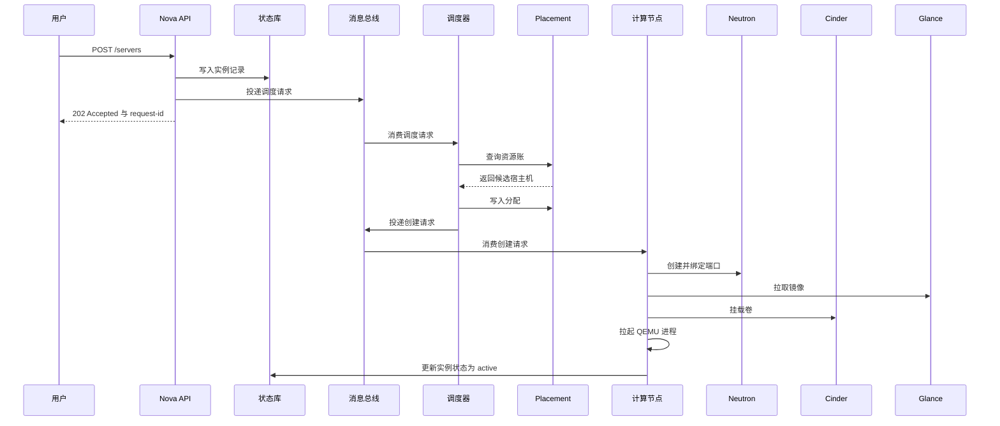

# 02 创建一台虚机——跨 Nova、Placement、Neutron、Cinder 的故障定位

**摘要：**

创建虚机是云平台上最高频、也最难定位的一类操作：用户只看到一条「创建失败」，背后却跨越认证、调度、镜像、网络、存储五个环节与四个服务。本文不重复各组件的内部机制，而是沿着一次创建请求的完整时序，把链路切成准入段、决策段与落地段，逐段给出失败信号与证据来源，并用请求 ID 把散落在四个服务里的日志串成一条线。全文回答两个问题：一条「创建失败」应该按什么顺序排除，以及每一个环节的失败在证据上长什么样。文中的平台事实与指标名称取自 2026 年 9 月的现场记录，涉及具体数值处标注口径；组件内部机制请参见 [[云原生/OpenStack/00 专栏导览|OpenStack 专栏]] 的对应篇目。

---

## 第 1 章 最难定位的一类故障：创建失败

如果要在云平台的日常工单里挑出一类最考验功力的，创建虚机失败大概会排在前列。它难在三点：发生频率最高，几乎每天都有；失败信号高度同质，用户看到的永远是同一条提示；而可能的原因却分布在一个横跨四个服务的链路上，从配额、调度、镜像一直到网络与存储。

先把这类故障放回 [[SRE/CVM集群可靠性工程/01 CVM 服务地图——用户操作、控制面与数据面依赖|01 CVM 服务地图]] 的地图上看：创建是唯一一个**同时横跨控制面与数据面**的写操作。查询、开机、关机这些操作只碰控制面，或者只在一个服务内部完成；而创建必须先在控制面完成决策，再到数据面真正落地——拉起进程、接上网络、挂上磁盘。**控制面与数据面的交界处，正是故障最密集的地方**，因为这里的每一步都要两个服务达成一致，而一致性是需要代价的。

难点的第二层来自信号的同质性。用户侧看到的是「创建失败」或「一直转圈」，但同样是「一直转圈」，可能是消息没被消费、调度器选不出宿主机、端口没绑定成功、镜像拉不下来、卷没挂上，原因各不相同，处置方向也完全不同。**把同质信号还原成异质原因，是这篇文章要解决的核心问题**。

第三个难点是链路的异步性。创建请求是异步的，API 返回 202 只代表请求被受理，真正的执行发生在后面几秒到几十秒内。这意味着「操作成功返回」与「虚机创建成功」是两件事，排查时必须区分请求的生命周期与实例的生命周期。这一点在 [[云原生/OpenStack/05 实例生命周期与迁移实战|05 实例生命周期与迁移]] 里从状态机角度有系统展开，本文则从依赖链路角度切入，两者互为补充。

### 1.1 创建失败与其它操作失败的差别

把创建失败与其它常见操作失败放在一起比较，能更清楚地看出它的特殊性。

| 操作 | 跨服务范围 | 是否写数据面 | 失败可复现性 | 定位难度 |
| :--- | :--- | :--- | :--- | :--- |
| 查询虚机列表 | 单服务（读） | 否 | 高 | 低 |
| 开关机 | 计算服务内部 | 是（进程） | 高 | 中 |
| 挂载卷 | 计算与块存储 | 是（映射） | 中 | 中 |
| 迁移 | 计算、网络、存储 | 是（搬迁） | 低（受负载影响） | 高 |
| 创建虚机 | 认证、调度、镜像、网络、存储 | 是（全链路） | 低（含竞态） | 最高 |

这张表说明了一件事：**跨服务数量与失败可复现性成反比**。只碰一个服务的操作，失败几乎总能稳定复现，定位靠对照即可；而跨四个服务的操作，失败可能只在特定时序下出现，定位必须靠方法论。这也是为什么创建失败是最值得专门写一篇来拆解的对象。

本章的结论可以先给出：**创建失败不是一类故障，而是一族故障**。定位它的正确姿势不是记住更多报错，而是掌握一条固定的排除顺序——先看请求有没有进来，再看有没有选到地方，最后看落地时哪一步断了。

## 第 2 章 一次创建请求的完整时序

在展开各段之前，先把完整时序画出来。这张图是全篇的骨架，后面每一章都在放大它的某一段。



### 2.1 四个交接点

时序图里有四个关键的交接点，它们是跨服务故障的高发区，值得单独记住。

第一个交接点是 **API 与消息总线**：API 把调度请求投递出去，自己返回 202。此后请求的成败与 API 无关，排查要转到消费者一侧。这个交接点的故障特征是「请求被受理但完全没有后续」，本质是消息链路问题，与业务逻辑无关。

第二个交接点是 **调度器与 Placement**：调度器读取资源账、挑选宿主机、写入分配。读与写之间有时间差，如果这期间资源被别的请求占用，就会出现「账上有、实际没有」的竞态，这也是创建偶发失败的一个结构性来源。竞态无法完全消除，只能通过合理的重试与容量余量来降低概率。

第三个交接点是 **计算节点与 Neutron**：计算节点在拉起虚机前需要端口处于可用状态，端口由 Neutron 创建并绑定到具体宿主机。绑定是异步的，计算节点必须等待，等待超时就会失败。这个交接点的故障特征是「虚机已经分配了资源，却迟迟起不来」，因为它在等待网络就绪。

第四个交接点是 **计算节点与 Cinder**：卷的挂载同样是跨服务协作，计算节点、块存储服务与存储后端三方配合，任何一方慢都会把创建时间拉长甚至超时。这个交接点的故障特征与第三个类似，但等待的对象是存储而非网络。

把四个交接点连起来看，会发现一个规律：**越靠后的交接点，失败越像「卡住」而不是「报错」**。原因是越靠后的步骤越异步，异步步骤的失败往往表现为超时，而超时的报错要等很久才出现。

### 2.2 三段划分

把四个交接点串起来，整条链路可以切成三段，这个划分贯穿全篇。

| 段 | 覆盖范围 | 典型耗时 | 失败特征 |
| :--- | :--- | :--- | :--- |
| 准入段 | 认证、配额、参数校验 | 毫秒级 | 立即返回 4xx 错误 |
| 决策段 | 调度器、资源账 | 秒级 | 请求被受理但长时间不落地 |
| 落地段 | 镜像、网络、存储、进程 | 十秒到分钟级 | 中间态停滞或转为 error |

三段的区分方式很实用：**返回快且报错明确的多半在准入段，返回慢且卡在中间态的多半在决策段或落地段**。三段各有自己的证据源与命令，下面逐一展开。

### 2.3 同步与异步的边界

理解三段划分，还要理解它们与「同步异步」的关系。用户发起的 API 调用是同步的，它在准入段结束后就返回；而准入段之后的所有工作都是异步的，由消息总线驱动的后台任务完成。**同步返回的是「请求被受理」，异步完成的是「实例被创建」**，两者之间隔着一条消息队列。

这条边界带来一个实践上的推论：排查时如果连「请求是否被受理」都不确定，先看 API 响应与请求 ID；如果确定被受理，就不要再纠缠 API 层，直接去消息消费者与执行者的日志里找。**把同步与异步分开，是避免在错误的一层反复查找的关键**。

### 2.4 失败重试的语义

创建链路上有两处重试，理解它们对定位很重要。第一处是调度重试：调度器选中宿主机后，如果计算节点报告创建失败，调度器会重新选一台，重试次数有上限（默认三次）。第二处是计算节点内部的等待重试：等待端口绑定、等待卷挂载时，计算节点会周期性重试直到超时。

两处重试的后果不同。调度重试意味着**最终报错可能来自最后一次尝试，而首次失败的原因才是根因**；计算节点重试意味着**超时报错的时间点晚于真正的失败点**。看日志时因此要往前翻，而不是只看最后一条。

## 第 3 章 准入段：请求能不能进来

准入段是链路上最快、也最容易被忽略的一段。它的失败往往带着明确的错误码，因此看起来「好排查」，但如果只看错误码而不理解背后的检查项，很容易把配额问题当成权限问题。

### 3.1 准入段检查了什么

一次创建请求进入 Nova API 后，会依次经过若干道检查，任何一道不通过都会立即返回错误。

| 检查项 | 失败信号 | 处置方向 |
| :--- | :--- | :--- |
| 认证与令牌 | 401 | 查认证服务与令牌有效期 |
| 项目与策略 | 403 | 查策略配置与角色绑定 |
| 配额 | 403 且提示配额超出 | 查项目配额与已用量 |
| 规格可见性 | 400 规格不存在或不可见 | 查 flavor 的可见范围 |
| 镜像可见性 | 400 镜像不存在或不可见 | 查镜像的共享范围与状态 |
| 网络与安全组 | 400 网络不存在或参数冲突 | 查网络、子网与安全组 |
| 参数合法性 | 400 参数错误 | 查请求体字段与约束 |

这张表的价值在于把「400 错误」这个笼统的信号拆成可执行的检查项。**准入段的失败几乎都是「确定性」的**：同样的请求重试，结果一样。这与后面两段的偶发失败形成鲜明对照，也是区分它们的第一条判据。

### 3.2 策略检查与配额检查的区别

403 这一类错误里其实藏着两种不同的检查：策略检查与配额检查。策略检查回答「这个角色有没有权限做这件事」，配额检查回答「这个项目还有没有额度做这件事」。两者的报错文案可能相似，但处置方向完全不同——前者要改策略或角色，后者要调额度或清理资源。

区分方法是看错误信息里的关键词，以及检查对象：策略错误通常与操作类型和角色相关，与资源用量无关；配额错误则会给出具体的维度与数值。**把 403 一律当成权限问题，是准入段最常见的误判**。

### 3.3 配额是最常见的准入失败

配额检查之所以值得单独讲，是因为它的错误信息常常被误读。配额分为若干维度——实例数、vCPU 数、内存、卷、快照、浮动 IP 等，不同维度的报错文案相似，但处置方向不同。排查的第一步是确认「是哪个维度超了」，而不是笼统地「加配额」。

```bash
# 查看项目的配额与已用量：关注超出的维度，而不是笼统地看总量
openstack quota show <project>
openstack quota show <project> -c instances -c cores -c ram -c volumes

# 查看该项目的当前资源占用
openstack server list --project <project> --long -f value -c ID -c Flavor
```

配额还有一个隐蔽的变体是**层级配额**。在存在项目层级或域层级的部署里，配额可以分层设置，下层项目即使自身额度充足，也可能因为上层额度被占满而失败。这类失败的表现是「项目配额明明没超，却创建不了」，此时要往上层查。层级配额的排查要顺着层级往上，直到找到那个真正被打满的层级。

### 3.4 规格与镜像的可见性

配额之外，另有两类容易混淆的准入失败来自「可见性」。规格（flavor）有可见范围，一个项目看不到的规格，在它眼里等同于不存在，报错是「规格不存在」而非「无权限」。镜像同理，共享范围未覆盖的镜像，对目标项目不可见。**「不存在」与「无权限」在 OpenStack 里经常是同一件事的两种表述**，这是排查时容易绕弯路的地方。

```bash
# 确认规格与镜像对目标项目的可见性
openstack flavor list --all
openstack image list --shared --all
openstack image show <image> -c status -c visibility -c shared_project_ids
```

### 3.5 规格里的隐藏约束

规格（flavor）不只是「几核几 G」的载体，它还可以携带额外规格（extra_specs），这些键值对会参与调度与虚拟化配置。常见的用途包括：把调度绑定到特定宿主机聚合、要求特定的 CPU 特性、指定大页或 NUMA 策略。**这些约束在用户界面上通常不可见，却在后端实实在在地参与过滤**，因此「规格看起来很正常，就是创建不了」的案例里，extra_specs 是必查项。

排查方法是把规格的完整定义读出来，逐条对照宿主机的能力。规格里的约束与镜像属性里的约束作用类似，都会缩小候选集合；区别在于前者挂在规格上、随规格复用，后者挂在镜像上、随镜像走。两者叠加时，候选集合可能被缩到很小，这是「资源不少却无可用宿主机」的另一种成因，也是第 4 章要展开的那类问题的前置条件。

## 第 4 章 决策段：Placement 与调度器

决策段是创建链路上最「玄学」的一段，因为它的失败常常表现为「请求被受理了，但虚机一直不出现」，既没有明确报错，也没有明显异常。理解这一段的关键，是把「资源账」与「调度」两件事分开看。

### 4.1 资源账：Placement 的世界观

Placement 维护的是资源提供者（Resource Provider）的清单（Inventory）与分配（Allocation）。宿主机是一个资源提供者，它的清单记录有多少 vCPU、内存、磁盘；每创建一台虚机，就在对应提供者上写一条分配记录。调度器选宿主机时，本质是在问 Placement：「哪些提供者在满足约束的前提下还有余量」。

这个模型有两个必须理解的推论。第一，**Placement 的数据是「账」，不是「实」**。它记录的是应该有多少、已经分配了多少，而不是宿主机上真实还剩多少。账实不符是决策段故障的常见根源，表现为「账上有资源却放不下」或「实际有空闲却报无资源」。第二，**分配是调度器写入的，而实际资源是计算节点消耗的**，两者之间有一个时间窗口，高并发创建时这个窗口会产生竞态。

### 4.2 资源类、特征与聚合

Placement 的模型里有三个概念必须分清。资源类（Resource Class）描述资源的种类，譬如 vCPU、内存、磁盘；特征（Trait）描述提供者的能力属性，譬如是否支持某个硬件特性；聚合（Aggregate）把多个提供者归为一组，用于表达可用域或主机组这类集合语义。调度约束中的「可用域」「反亲和组」在底层往往通过聚合与特征来表达。

理解这三者的区别，才能读懂「为什么有空闲却选不中」。举例来说，某个镜像要求宿主机具备某个硬件特征，那么即使宿主机有充足的 vCPU，只要它没有这个特征，就会被排除。**约束的表达方式决定了排查的方向**：资源类不足要加资源，特征不匹配要改宿主机或改镜像，聚合划分错误要调拓扑。

```bash
# 列出资源提供者，确认宿主机是否都被正确登记
openstack resource provider list -f value -c uuid -c name

# 查看某个提供者的已用量与清单
openstack resource provider usage show <rp-uuid>
openstack resource provider inventory list <rp-uuid>

# 查看提供者的特征，核对约束是否可满足
openstack resource provider trait list <rp-uuid>

# 查看聚合与可用域划分
openstack aggregate list -f value -c Name -c Availability Zone
```

### 4.3 候选查询：决策段的利器

`allocation candidate` 这个接口直接回答「以当前资源账，能满足这次请求的宿主机有哪些」，是决策段排查里最有用的一条命令。

```bash
# 查询满足条件的候选宿主机
openstack allocation candidate list --resource VCPU=4 --resource MEMORY_MB=8192

# 带上特征约束查询
openstack allocation candidate list --resource VCPU=4 \
  --required HW_CPU_X86_VMX
```

如果它返回空集，说明是资源账层面确实无解；如果它返回了候选，而实际创建仍失败，问题就在调度器之后的环节，或者在于账实不符。**把「有没有解」与「为什么解不出来」分开问，是决策段排查的核心技巧**——前者用候选接口，后者用约束逐条验证。

### 4.4 调度器：过滤与权重的两段论

调度器采用「先过滤、再加权」的两段模型：过滤器（Filter）负责筛掉不合适的宿主机，权重器（Weigher）负责在剩下的候选里排序。这个模型的细节在 [[云原生/OpenStack/04 Nova 架构与调度——API、Scheduler 与资源模型|04 Nova 架构与调度]] 里有完整拆解，这里只关心它如何制造失败。

常见的过滤器与其「筛掉谁」如下表，排查时按顺序逐条验证。

| 过滤器 | 筛掉的条件 | 常见误判 |
| :--- | :--- | :--- |
| 可用域过滤 | 不在指定可用域 | 忽略请求里带了可用域 |
| 计算能力过滤 | 不满足规格的 extra_specs | 规格里隐藏了约束 |
| 镜像属性过滤 | 不满足镜像的硬件要求 | 镜像属性影响调度而不自知 |
| 服务状态过滤 | 计算服务不在线或被禁用 | 只看资源不看服务状态 |
| 反亲和过滤 | 与同组实例落在同一宿主机 | 组策略与容量冲突 |
| NUMA 拓扑过滤 | 无法满足 NUMA 要求 | 大规格实例的隐性门槛 |

**过滤器的失败往往不是「没有资源」，而是「没有满足全部约束的资源」**。这一点很容易误判：宿主机明明有空闲 vCPU，却因为不在指定的可用域、不具备某个镜像要求的属性、或组反亲和约束冲突而被过滤掉。排查时应当把每个约束条件单独验证一遍，而不是只看资源余量。

权重器则决定「在满足条件的候选里选谁」。权重计算依赖各宿主机上报的指标，如果指标上报异常或延迟，权重可能失真，表现为调度结果不均衡。权重问题通常不影响创建成功率，只影响资源分布的均匀度，因此优先级低于过滤器问题。

### 4.5 账本竞态与重试

决策段有一类失败与并发有关。调度器读取资源账、选出宿主机、写入分配，这三步之间并非原子。高并发创建时，两个请求可能同时读到同一份余量、选中同一台宿主机，其中一方在实际落地时才发现放不下。此时调度器会重试，但重试会消耗时间，用户侧表现为「创建变慢」甚至「偶发失败」。

应对这类问题的手段有三种：留足容量余量以降低冲突概率；合理设置调度重试次数；以及从监控上观察「选中后失败」的比例。**账本竞态无法根除，只能度量与缓解**，把它当成一个概率问题而不是逻辑问题，心态会好很多。

### 4.6 一次失败推演

设想一次典型的「无可用宿主机」。用户反馈创建失败，提示没有可用宿主机，但监控显示集群整体资源利用率并不高。排查顺序应当是：先用候选接口确认是否真的无解，如果无解，再逐个约束去查——是否指定了可用域、镜像是否有属性要求、是否加入了反亲和组、宿主机是否因为服务状态被排除。多数情况下，答案是某一个非资源约束把候选集合清空了。这类问题的认知价值在于：**调度失败不等于资源不足，它更常见于约束与资源的不匹配**。

### 4.7 权重器与指标上报

过滤器决定「能不能选」，权重器决定「选谁」。权重器依据各宿主机上报的指标打分，常见的依据包括剩余内存、剩余磁盘、vCPU 使用率等。这里有一个容易被忽略的依赖：**权重计算依赖指标上报的质量**。如果某台宿主机的指标上报延迟或中断，它的权重可能失真，导致调度结果偏斜——要么被过度选中，要么被长期冷落。

权重问题通常不影响创建成功率，只影响资源分布的均匀度，因此它的优先级低于过滤器问题。但它有一个长期后果：资源分布不均会加速局部容量耗尽，最终以「某几台宿主机无资源可用」的形式反过来影响创建成功率。观察权重是否失真的方法是看宿主机之间的实例密度分布，而不是看单台主机的利用率——单台主机利用率高可能是它本来就强，而密度分布不均才说明权重或约束出了问题。

## 第 5 章 落地段之一：镜像与根盘

从决策段往下，请求进入真正的落地阶段。落地段的第一件事是准备根盘，而根盘的内容来自镜像服务。

### 5.1 镜像的两种使用方式

镜像在创建时有两种参与方式。一种是「下载并落盘」：计算节点从镜像服务拉取镜像，写入虚机的根盘，此后虚机的启动不再依赖镜像。另一种是「分层克隆」：镜像以只读层的形式被引用，虚机的写入落在新的层上，这种方式创建更快、占用更少，是分布式存储后端的常见做法。

两种方式的失败特征不同。下载方式下，失败往往表现为「拉取超时」或「空间不足」，根盘的准备是显式的、耗时的；克隆方式下，失败往往发生在后端，表现为卷创建失败或映射失败。**看到「创建卡在准备根盘阶段」时，先确认镜像走的是哪条路**，再决定去查网络与镜像服务，还是去查存储后端。

### 5.2 镜像属性会影响调度

镜像不只是数据，它还携带一组属性，这些属性会参与调度与虚拟化配置。属性里描述硬件需求的那些，会被调度器的镜像属性过滤器读取，从而影响宿主机选择。这意味着一个看起来与调度无关的操作——换一个镜像——可能改变创建的成功率。

| 属性类别 | 影响范围 | 排查要点 |
| :--- | :--- | :--- |
| 硬件需求类 | 调度过滤 | 宿主机是否具备对应能力 |
| 设备模型类 | 虚拟化配置 | 虚拟网卡与磁盘的驱动模型 |
| 内存与页大小类 | 资源账与调度 | 是否要求大页或特定页大小 |
| 安全与启动类 | 启动方式 | 引导模式与安全启动要求 |

**镜像属性是「隐形的调度约束」**，排查无可用宿主机时，把镜像属性纳入检查清单，往往能找到被忽略的那一条。

### 5.3 镜像侧的失败信号

| 现象 | 可能原因 | 处置方向 |
| :--- | :--- | :--- |
| 镜像不可见 | 共享范围未覆盖该项目 | 调整镜像的可见性 |
| 镜像状态异常 | 镜像未完成上传或被停用 | 查镜像状态机 |
| 拉取超时 | 镜像服务压力大或网络慢 | 查镜像服务与网络 |
| 空间不足 | 计算节点本地盘或存储后端容量不足 | 查本地盘与后端容量 |

镜像的细节在 [[云原生/OpenStack/09 Glance 镜像服务——镜像流水线与制作实战|09 Glance 镜像服务]] 里有系统介绍。这里要强调的是它的**跨服务属性**：镜像本身由镜像服务管理，但拉取与落盘发生在计算节点与存储后端，因此「镜像问题」的根因可能在三个不同的地方。定位时不能只看镜像服务的健康状态，还要看计算节点的拉取日志与后端的容量。

### 5.4 镜像缓存与预热

为了减少重复拉取，计算节点通常会启用镜像缓存：把用过的镜像留在本地，下次创建同镜像的虚机时直接复用。缓存能显著缩短创建时间，但它有一个副作用——**缓存占用本地磁盘**。缓存盘写满时，新的镜像拉不下来，创建会失败，而失败信息往往只提示磁盘空间不足，容易让人误以为是虚机根盘的空间问题。

应对方式是把镜像缓存容量纳入监控，并在缓存盘紧张时主动清理。另一个相关实践是预热：在预期的大批量创建之前，提前把镜像拉到目标宿主机，避免创建高峰时集中拉取。**预热的收益在批量场景下非常明显**，它把「拉取」这件耗时的事从关键路径上挪走了。这也提示了一个更一般的优化思路：创建链路上的瓶颈，很多都可以通过「把耗时步骤前移」来化解，预热与缓存是同一思路的两种实现。

## 第 6 章 落地段之二：网络端口

根盘准备之后，计算节点需要为虚机准备好网络。这一步的跨服务特征最明显：端口的创建在控制面，绑定的动作却跨越控制面与数据面。

### 6.1 端口的生命周期

端口（Port）从创建到可用，经历几个状态。创建后端口处于未绑定状态，计算节点拉起虚机时会把宿主机信息写回端口，完成绑定（binding），此时数据面才会真正把虚拟网卡接到虚拟交换机上。**绑定是异步的，且强依赖宿主机的网络 agent 在线**。

```bash
# 查看端口状态与绑定信息
openstack port show <port-id> -c status -c binding:host_id -c binding:vif_type -c binding:vnic_type

# 查看网络 agent 状态：agent 不在线则端口无法绑定
openstack network agent list -f value -c Host -c Agent Type -c Alive -c State
```

### 6.2 虚拟网卡类型与性能路线

端口上有一个常被忽略的字段是虚拟网卡类型（vnic_type），它决定了虚拟网卡走哪条性能路线。普通类型走软件虚拟交换，直通类型则把网卡硬件直接交给虚机，性能更高但牺牲了部分灵活性与热迁移能力。**创建时如果指定了直通类型，而目标宿主机没有对应硬件，就会创建失败或调度失败**，这属于约束与资源不匹配的又一种形态。

### 6.3 网络侧的失败信号

| 现象 | 可能原因 | 处置方向 |
| :--- | :--- | :--- |
| 端口长期 DOWN | 宿主机网络 agent 未在线或未完成绑定 | 查 agent 状态与日志 |
| 绑定 host 为空 | 计算节点未写回绑定信息 | 查计算节点网络侧日志 |
| 端口创建失败 | 地址池耗尽或配额不足 | 查子网地址池与配额 |
| 虚机起来但网络不通 | 绑定成功但流表或安全组异常 | 查数据面与安全组 |

网络端口这一段最容易被误判的地方，是「agent 状态异常」与「网络故障」的混淆。宿主机的网络 agent 状态异常，可能是 agent 进程本身出了问题（譬如被资源压力清理），也可能是它依赖的网络真的断了；两者的区别方法在 [[SRE/CVM集群可靠性工程/01 CVM 服务地图——用户操作、控制面与数据面依赖|01 CVM 服务地图]] 里已经讲过——看虚机是否还在收发数据。**创建场景下，agent 不在线是端口绑定失败的直接原因**，因为绑定这个动作正是由 agent 完成的。Neutron 的组件与数据面路径，见 [[云原生/OpenStack/06 Neutron 架构——ML2、OVS 与网络命名空间|06 Neutron 架构]]。

### 6.4 启动后的网络依赖

端口绑定完成、虚机启动，并不意味着网络就绪。虚机还需要通过 DHCP 获取地址，通过元数据服务获取初始化信息，再由初始化程序完成配置。这一段的失败不表现为「创建失败」，而表现为「虚机起来了但没有网络」或「初始化没跑完」。**创建成功与网络可用之间存在一个时间差**，排查业务不通时要把这段依赖一并考虑，这也是后续网络数据面专题要展开的内容。

### 6.5 安全组与地址池

网络这一段还有两个容易在创建时才暴露的问题：安全组与地址池。安全组默认会拒绝入站流量，如果创建时没有正确指定安全组，虚机起来后可能完全无法访问，用户会把它报成「创建失败」或「网络不通」。这类问题在控制面上看不出任何异常，因为端口绑定是成功的，失败发生在数据面的过滤规则上，属于「控制面正常、数据面异常」的典型。

地址池问题则更直接：子网的地址池耗尽时，端口创建会失败，创建请求随之失败。地址池的容量是有限的，且会被已删除但未释放的端口、以及长期运行的实例逐渐占用。**定期核对地址池的使用率，比事后排查端口创建失败更省事**；这与后端的容量管理是同一种思路，都属于「把容量问题前置」。安全组的细节与数据面路径，见 [[云原生/OpenStack/07 Neutron 进阶——VXLAN、DVR 与安全组|07 Neutron 进阶]]。

## 第 7 章 落地段之三：卷与挂载

如果创建时带了卷（无论作为根盘还是数据盘），链路还要经过块存储服务。这是四段里协作方最多的一段：计算节点、块存储服务与存储后端三方配合。

### 7.1 挂载的三方协作

卷的挂载不是一次调用能完成的，它包含「准备卷」「映射卷」「接入虚机」几个步骤。块存储服务负责让后端把卷准备好并建立映射，计算节点负责把映射接入虚机。任何一步慢或失败，卷就会停在中间态。

```bash
# 查看卷的状态与挂载关系
openstack volume show <volume-id> -c status -c attachments

# 查看卷服务状态与后端容量
openstack volume service list -f value -c Host -c State
ceph -s
rbd info <pool>/<volume-id>
```

### 7.2 卷的来源与容量

创建时的卷有几种来源：从零创建、从镜像创建、从快照创建、从已有卷克隆。不同来源的代价不同：从零创建最快，从镜像与快照创建依赖后端的分层能力，从卷克隆则要复制数据。**卷来源决定了准备根盘与数据盘的耗时上限**，这是评估创建时间是否正常的重要参照。

容量也是这一段的风险点。后端容量不足时，卷创建会失败；后端容量充足但接近阈值时，卷创建会变慢。容量问题往往不是突然发生的，而是逐渐逼近的，因此监控后端容量趋势比事后排查更有效。后端的容量与超分口径，[[云原生/OpenStack/08 Cinder 块存储——卷生命周期与 Ceph RBD 后端|08 Cinder 块存储]] 有系统介绍。

### 7.3 卷侧的失败信号

| 现象 | 可能原因 | 处置方向 |
| :--- | :--- | :--- |
| 卷长期 creating | 后端创建慢或卡住 | 查块存储服务与后端 |
| 卷长期 attaching | 映射未完成或计算节点未接入 | 查服务日志与后端映射 |
| 卷 error | 后端操作失败 | 查后端日志与容量 |
| 挂载成功但磁盘慢 | 后端负载高或限速生效 | 查后端延迟与限速 |

卷的状态机与 Ceph 后端的对接，[[云原生/OpenStack/08 Cinder 块存储——卷生命周期与 Ceph RBD 后端|08 Cinder 块存储]] 有完整展开。这里要补一条跨服务的认知：**卷挂在创建链路上，会把存储后端的健康状况直接传导到创建成功率上**。后端在恢复数据时延迟上升，卷创建与映射就会变慢，创建请求随之超时。现场经验里，创建失败的时间分布常常与存储后端的负载曲线吻合，这就是原因。RBD 的读写路径与恢复机制，见 [[中间件/Ceph/07 RBD 块存储——快照、克隆与 Kubernetes CSI|07 RBD 块存储]] 与 [[中间件/Ceph/05 PG 状态机与数据一致性——Peering、Recovery 与 Backfill|05 PG 状态机]]。

### 7.4 卷与实例的耦合关系

卷与实例之间是一种耦合关系，理解它有助于判断故障的影响范围。卷挂载到实例后，两者通过映射绑定；实例被删除时，卷是否一并删除取决于创建时的策略。**如果策略是「随实例删除」，那么一次误删实例会连带删除数据盘**，这是需要格外小心的配置项，也是备份策略必须覆盖的场景。

耦合还体现在故障传导上：后端存储异常时，所有挂载该后端卷的实例都会受影响，哪怕这些实例分布在不同宿主机上。这就是 01 篇所说的「存储后端是一个跨宿主机的故障域」。因此排查「多台虚机同时磁盘异常」时，不要逐台去找原因，先看它们是否共用同一个后端。**先按共享资源聚合，再逐台深挖**，这条顺序在创建、运行、恢复三个阶段都成立。

## 第 8 章 用请求 ID 贯穿：证据地图

前面几章把链路拆开了，这一章解决「怎么把它们串起来」。跨服务排查最大的困难不是缺证据，而是证据散落在四个服务里，彼此对不上号。请求 ID 就是那根线。

### 8.1 请求 ID 的作用

Nova API 在受理请求时会生成一个请求 ID，并通过响应头返回。这个 ID 会随着消息、日志在链路里传播，因此只要拿到它，就能在四个服务的日志里定位到同一次请求。**没有请求 ID 的排查是盲人摸象，有了它才是按图索骥**。

```bash
# 提交时记录请求 ID（响应头里带回）
openstack --debug server create --image <image> --flavor <flavor> \
  --network <network> --wait <name> 2>&1 | grep -iE "request-id|x-compute"

# 在各服务日志里按请求 ID 检索
grep -r "<request-id>" /var/log/nova/ /var/log/neutron/ /var/log/cinder/
```

### 8.2 资源标识作为第二根线

请求 ID 之外，还有一组资源标识可以用于关联：实例 UUID、端口 ID、卷 ID、镜像 ID。它们的价值在于**跨请求、跨时间关联**——一个实例的创建请求可能已经结束，但它留下的资源标识仍然可以在后续排查中使用。实践中建议同时记录请求 ID 与资源 ID，前者定位「这一次请求」，后者定位「这一个对象」。

### 8.3 证据地图

把每一段对应的证据源整理成表，排查时按段取用即可。

| 段 | 证据源 | 能回答的问题 |
| :--- | :--- | :--- |
| 准入 | API 响应与错误码 | 请求为什么被拒 |
| 决策 | 调度器日志、Placement 用量 | 为什么选不到宿主机 |
| 落地-镜像 | 计算节点日志、镜像服务日志 | 根盘为什么准备失败 |
| 落地-网络 | 网络 agent 日志、端口状态 | 端口为什么没绑定 |
| 落地-存储 | 块存储服务日志、后端状态 | 卷为什么卡住 |
| 全过程 | 请求 ID 贯穿的日志 | 同一次请求走到哪一步断了 |
| hypervisor | libvirt 侧指标 | 虚机是否真的被拉起 |

最后一行的 hypervisor 视角值得强调。控制面看到的是「虚机应该是什么状态」，hypervisor 看到的是「虚机实际是什么状态」，两者对不上时，问题通常在中间的消息链路上，而不在虚机本身。hypervisor 侧的指标按类别整理如下，指标名取自 2026 年 9 月的现场交付记录。

| 指标类别 | 代表指标 | 排查创建时能回答的问题 |
| :--- | :--- | :--- |
| 采集器健康 | `libvirt_up` | hypervisor 视角是否可用 |
| 虚机状态 | `libvirt_domain_info_vstate` | 虚机是否真的被创建并运行 |
| vCPU 调度 | `libvirt_domain_vcpu_delay_seconds_total` | 创建后是否被超分拖慢 |
| 块设备 I/O | `libvirt_domain_block_stats_read_time_seconds_total` | 根盘 I/O 是否异常 |
| 虚拟网卡 | `libvirt_domain_interface_stats_receive_errors_total` | 网卡是否正常收发 |

### 8.4 日志地图的三个原则

看日志有三条原则值得记住。第一，**先看时间线，再看内容**：把各服务的日志按时间排序，往往能直接看出请求卡在哪一段。第二，**先看错误，再看告警**：日志里的错误行比监控告警更接近根因，告警只是症状的聚合。第三，**先看首次失败，再看最后失败**：重试机制会让最后一次失败掩盖首次失败的原因，往前翻是关键。这三条原则在 01 篇的「事件与日志的位置」一节里也有呼应，这里把它们具体到创建场景。

### 8.5 时间窗口与并发

跨服务排查还有一个常被忽略的维度是时间窗口。同一条链路在不同负载下的耗时差异很大：空闲时创建可能几秒完成，高峰时可能几十秒，这会让「超时」成为一个相对的概念。**判断「这次创建是否异常慢」必须结合当时的集群负载**，否则容易把正常的慢当成故障，把真正的异常当成正常。

并发则是另一个维度。同一时间大量创建请求会加剧决策段的账本竞态，也会让落地段的各服务排队。排查偶发失败时，把失败请求的时间戳与集群并发量对齐，往往能发现失败集中在高峰时段。这也是为什么「偶发失败」的处理要先量化频率与分布，再谈根因——没有分布证据，任何解释都只是猜测。把时间窗口与并发这两个维度补齐，跨服务排查才算完整。

## 第 9 章 排查决策树与三次推演

把前面八章收成一条可执行的决策树，再用三次推演检验它。

### 9.1 决策树

1. **请求返回快且报错明确吗**？是，查准入段：认证、策略、配额、可见性。
2. **请求被受理但虚机迟迟不出现吗**？是，进入下一步。
3. **调度器有没有报「无可用宿主机」**？有，查决策段：逐条验证约束与资源账。
4. **调度成功但卡在某个中间态吗**？是，看停在哪个状态：准备根盘查镜像，绑定端口查网络，挂载卷查存储。
5. **中间态都过了但虚机仍不可用吗**？查 hypervisor 视角：进程是否被拉起，是否被宿主机资源问题波及。

这五步的顺序不是随意的，它对应着链路的时间顺序：**先排除确定性的准入失败，再排除决策失败，最后定位落地的具体环节**。每一步都用上一段的证据确认，不跳步。

这五步的收益不只是「快」，更是「可解释」。每排除一段，都留下一条证据，最终结论是由证据收敛出来的，而不是凭经验猜出来的。**可解释的结论才能被复盘、被复用、被交接**，这也是把排查过程写成方法论而非口诀的原因。相反，如果一开始就凭「感觉像存储问题」直接去查存储，即使侥幸命中，也无法解释为什么不是别的原因，下次遇到同类问题仍要从头猜起。方法论的价值，恰恰在于它把「运气」从排查里挤了出去。

### 9.2 推演一：无可用宿主机

用户创建失败，提示无可用宿主机，集群资源利用率却不高。按决策树走到第三步：先用候选接口查询，确认以当前资源账确实无解；再逐条验证约束——可用域、镜像属性、反亲和组、宿主机服务状态。假设查到该请求被指定了一个可用域，而该可用域内满足镜像属性的宿主机恰好都被组反亲和约束排除，候选集合因此为空。处置不是加资源，而是调整约束或扩容该可用域。**这个案例的教训是：调度失败的第一反应不该是「资源不够」，而该是「约束是否过严」**。

### 9.3 推演二：卷长期 attaching

用户创建失败，虚机卡在创建中，卷状态停在 attaching。按决策树走到第四步的存储环节：先看块存储服务与后端是否正常，再看后端是否已建立映射，最后看计算节点是否把映射接入了虚机。假设查到后端映射已完成，但计算节点侧接入超时——进一步看计算节点，发现宿主机内存紧张，接入卷的进程被拖慢甚至被清理。处置的重点因此从存储转回宿主机资源。**这个案例的教训是：落地段某一步卡住，根因未必在这一步对应的服务，可能在上游的共享资源上**，这与 01 篇反复强调的「找共享层」是同一条思路。

### 9.4 推演三：配额层级打满

用户创建失败，提示配额不足，但项目自身的配额看起来还有余量。按决策树走到第一步的配额检查：先看项目配额与已用量，确认自身维度未超；再顺着项目层级往上查，发现上层层级的额度已被同层其它项目占满。处置是调整上层额度或做资源腾挪，而不是给这个项目单独加额度。**这个案例的教训是：配额问题也可能是层级问题**，只看单项目视角会得出「配额没超却报配额不足」的矛盾结论。

## 第 10 章 边界与反例

排查方法也有它的适用边界，越界使用同样会误判。

第一，**请求 ID 并非在所有路径上都完整传递**。某些组件间的调用、某些代理层可能会重新生成或丢失请求 ID，此时只能靠时间戳与资源标识（实例 UUID、端口 ID、卷 ID）做关联。因此实践中应当同时记录请求 ID 与资源 ID，两者互为备份。

第二，**状态字段不是唯一的真相**。同一个实例，控制面的状态字段、数据库的记录、hypervisor 的实际状态可能三者不一致，尤其在故障恢复期间。判断「到底怎么样了」时，应当以 hypervisor 与数据面的实际证据为准，控制面状态作为参考。

第三，**重试会掩盖首次失败**。调度器在选中的宿主机创建失败时会重试，最终报错可能来自最后一次尝试，而首次失败的原因才是根因。看日志时要注意时间顺序，不要只看最后一条错误。

第四，**创建成功不等于可用**。创建链路结束于「实例状态变为 active」，但这只代表控制面认为它起来了，不代表网络通、磁盘可读写、应用能启动。业务可用性需要独立的探针验证，这也是后续备份与演练篇要展开的内容。

第五，**把偶发当成必然**。决策段存在账本竞态，落地段存在跨服务超时，这些都可能造成偶发失败。偶发失败的正确处理是先量化频率、再找共性（同一镜像、同一宿主机、同一时段），而不是用一次成功的重试草草结案。

第六，**把创建链路当成唯一的可用性来源**。有些团队把「创建成功」当作服务健康的指标，忽略了已运行实例的健康。事实上创建与运行是两条独立的链路：创建成功率高，不代表存量实例稳定；反之，存量实例稳定也不代表能创建出新的。**把两条链路的指标分开监控**，才能避免用一个指标的平稳掩盖另一个指标的问题。

行文至此，把本篇的落点收在两条原则上。其一，架构即权衡——创建链路跨四个服务换来了职责清晰与可扩展，代价是故障定位必须跨服务进行，这份代价要用方法论而不是记忆力去偿还。其二，没有放之四海皆准的排查顺序，只有因地制宜地先分段、再定位。下一篇会沿着链路继续深入一个具体的性能问题：当虚机已经跑起来，云盘为什么慢，以及如何把 Guest、QEMU、网络与存储四层证据拼在一起。已有的真实复盘可先到 [[SRE/故障排查与复盘/00 故障排查索引|故障排查与复盘索引]] 对照。

---

## 速查卡：创建失败定位

这张表把第 9 章的决策树压缩成速查形式，适合在值班现场快速对照；需要展开理由时，回到对应章节即可。表中「先查」是排查的入口，不是结论。

| 症状 | 先查 | 关键证据 |
| :--- | :--- | :--- |
| 立即返回 4xx | 准入段 | 错误码、策略与配额 |
| 受理后无动静 | 决策段 | 调度器日志与候选查询 |
| 卡在准备根盘 | 镜像 | 计算节点拉取日志与后端容量 |
| 卡在端口绑定 | 网络 | 端口状态与 agent 在线情况 |
| 卡在卷挂载 | 存储 | 卷状态、后端映射与计算节点 |
| 状态 active 但不可用 | 数据面 | hypervisor 指标与业务探针 |

## 口径与事实说明

- 平台形态、指标名称与现场事实取自 2026 年 9 月的脱敏记录，属于某时点快照，不构成永久资产事实。
- 组件机制（调度器两段模型、Placement 资源账、端口绑定、卷挂载）属于 OpenStack 的稳定行为，不随平台变化。
- 文中命令均为只读或可回滚的查询类操作，生产写操作不在本文范围。

---

## 参考资料

1. OpenStack 官方文档，Nova 调度与过滤：<https://docs.openstack.org/nova/latest/admin/scheduling.html>
2. OpenStack 官方文档，Placement 资源提供者与分配：<https://docs.openstack.org/placement/latest/>
3. OpenStack 官方文档，Neutron 端口绑定：<https://docs.openstack.org/neutron/latest/admin/archives.html>
4. OpenStack 官方文档，Cinder 卷生命周期：<https://docs.openstack.org/cinder/latest/>
5. OpenStack 官方文档，Glance 镜像状态：<https://docs.openstack.org/glance/latest/>
6. libvirt 虚拟化管理 API 文档：<https://libvirt.org/>
7. Ceph 官方文档，RBD 块设备：<https://docs.ceph.com/en/latest/rbd/>
8. 内部现场素材：CVM 集群 hypervisor 监控交付记录（2026-09-01，脱敏）
9. 内部现场素材：Pallas/OpenStack 混布主机批量异常事故初步分析（2026-09-01，脱敏）

---

> [!note] 思考题
> 1. 同样是「创建失败」，为什么准入段的失败是确定性的，而决策段与落地段可能偶发。
> 2. 调度失败时，为什么「先怀疑约束」比「先怀疑资源」更有效。
> 3. 卷长期停在 attaching，你会按什么顺序区分「存储问题」与「宿主机问题」。
> 4. 请求 ID 在哪些情况下会失效，失效时你用什么做关联。
> 5. 创建成功但业务不可用，你会补充哪些验证环节。
